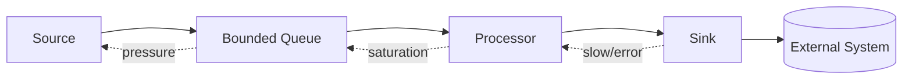
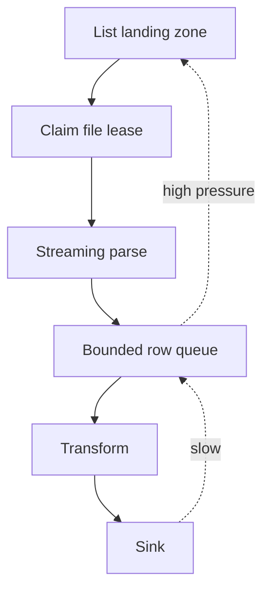
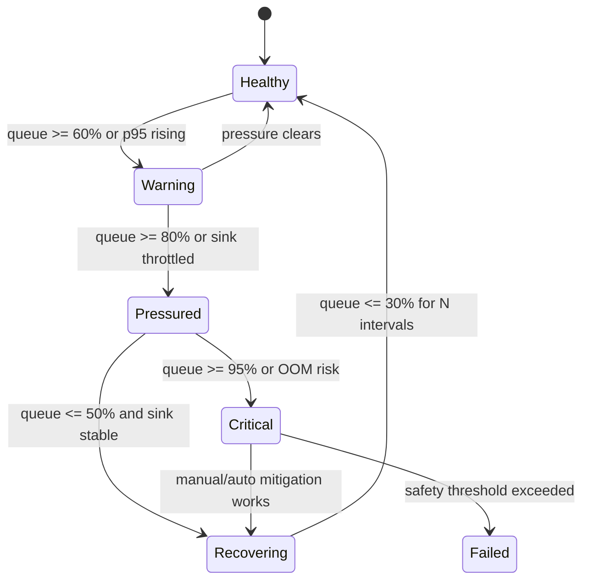

# Part 013 — Backpressure From First Principles

> Backpressure bukan fitur kosmetik. Backpressure adalah mekanisme agar pipeline tidak mengubah keterlambatan kecil menjadi outage, data loss, OOM, duplicate storm, atau recovery yang tidak pernah selesai.

Pada Part 012 kita membangun local pipeline runner dengan loop dasar:

```text
read -> process -> write -> commit -> repeat
```

Loop itu terlihat sederhana selama semua komponen punya kecepatan yang mirip.

Masalah dimulai saat **source lebih cepat daripada processor/sink**.

Pipeline production jarang gagal karena satu record sulit diproses. Pipeline sering gagal karena sistem terus menerima lebih banyak pekerjaan daripada yang bisa diselesaikan, lalu menyimpan backlog di tempat yang salah: heap, thread pool, HTTP connection, retry queue, atau database transaction.

Bagian ini membangun mental model dan implementasi backpressure di Java dari prinsip dasar.

Kita akan membahas:

- apa itu backpressure secara operasional
- mengapa unbounded queue adalah bug tersamar
- hubungan rate, latency, queue depth, dan memory
- bagaimana mendesain bounded work queue
- kapan pause source, throttle, batch, spill, shed, atau fail-fast
- bagaimana menerapkan backpressure pada Kafka consumer, API ingestion, file pipeline, dan sink database
- metrics apa yang wajib ada
- bagaimana menguji backpressure sebelum produksi

---

## 1. Definisi Praktis

Backpressure adalah mekanisme ketika downstream memberi sinyal kepada upstream:

> “Jangan kirim pekerjaan lebih cepat daripada yang bisa saya proses dengan aman.”

Dalam pipeline, backpressure bukan hanya soal Reactive Streams atau non-blocking IO. Itu hanya salah satu implementasi.

Secara umum, backpressure muncul pada boundary seperti ini:



Jika sink melambat, processor ikut melambat. Jika processor melambat, queue membesar. Jika queue hampir penuh, source harus diperlambat, dihentikan sementara, atau ditolak.

Tanpa backpressure, sistem biasanya memilih opsi yang paling buruk secara implisit:

```text
keep reading -> keep allocating -> keep retrying -> OOM or cascading failure
```

Backpressure yang benar membuat pilihan eksplisit:

```text
slow down input
pause partition
reduce concurrency
reduce batch size
spill to durable storage
fail fast
quarantine bad records
drop only when business contract allows it
```

---

## 2. Hukum Dasar: Work Conservation

Pipeline tidak bisa memproses pekerjaan lebih banyak daripada kapasitas efektif downstream.

Misal:

- source membaca 10.000 record/detik
- processor mampu 8.000 record/detik
- sink mampu 5.000 record/detik

Maka kapasitas pipeline adalah sekitar 5.000 record/detik.

Selisih 5.000 record/detik harus pergi ke suatu tempat.

Tempat itu bisa berupa:

- Kafka topic backlog
- object storage landing zone
- database queue table
- local bounded queue
- heap memory
- OS socket buffer
- thread pool queue
- retry queue
- DLQ

Backpressure bukan menghilangkan backlog. Backpressure memilih **di mana backlog boleh hidup**.

Prinsip production-grade:

> Backlog harus tinggal di storage yang memang dirancang untuk backlog, bukan di heap aplikasi.

Contoh:

| Backlog Location | Apakah Aman? | Catatan |
|---|---:|---|
| Kafka topic | Ya, jika retention dan lag dimonitor | Cocok untuk durable replay |
| Object storage | Ya | Cocok untuk file/batch landing |
| Database queue table | Bisa | Perlu indexing, cleanup, lock strategy |
| Java heap queue tanpa batas | Tidak | OOM menunggu terjadi |
| Executor unbounded queue | Tidak | Menyembunyikan saturation |
| HTTP client pending request tanpa batas | Tidak | Membuat retry storm |
| DLQ | Ya untuk error isolation, bukan normal backlog | DLQ bukan kapasitas tambahan |

---

## 3. Little's Law untuk Engineer Pipeline

Tanpa matematika berat, gunakan intuisi ini:

```text
queue_size ≈ arrival_rate × waiting_time
```

Jika arrival rate 1.000 record/detik dan rata-rata record menunggu 30 detik, backlog sekitar 30.000 record.

Artinya queue depth bukan angka abstrak. Queue depth merepresentasikan waktu tunggu, memory, dan recovery cost.

Contoh:

```text
arrival rate     = 2.000 record/s
processing rate  = 1.500 record/s
deficit          = 500 record/s
extra backlog    = 30.000 record setelah 60 detik
```

Jika satu envelope rata-rata 8 KB:

```text
30.000 × 8 KB = 240 MB
```

Itu baru payload, belum object overhead Java, headers, lists, futures, stack, tracing context, dan retry metadata.

Jika dibiarkan 10 menit:

```text
500 record/s × 600s × 8 KB = 2.4 GB raw payload
```

Heap akan mati jauh sebelum angka ini terasa “besar”.

Mental model:

```text
latency spike becomes queue growth
queue growth becomes memory pressure
memory pressure becomes GC pressure
GC pressure becomes throughput collapse
throughput collapse becomes more queue growth
```

Ini loop kegagalan klasik.

---

## 4. Backpressure Bukan Rate Limiting Saja

Rate limiting mengontrol seberapa cepat upstream boleh mengirim.

Backpressure mengontrol upstream berdasarkan kondisi downstream.

Perbedaannya:

| Mechanism | Sinyal Utama | Cocok Untuk |
|---|---|---|
| Static rate limit | angka tetap | melindungi external API |
| Token bucket | budget konsumsi | burst terkontrol |
| Backpressure | queue/sink/latency/error | adaptasi runtime |
| Circuit breaker | error/timeout | mencegah cascading failure |
| Load shedding | overload | hanya bila data boleh dibuang |
| Pause/resume | kapasitas internal | Kafka/API/file controlled ingestion |

Pipeline sering butuh kombinasi.

Contoh API ingestion:

```text
API vendor rate limit  = 100 request/minute
internal sink capacity = 1.000 record/s
current DB latency     = 2s p95
queue depth            = 90%
```

Walaupun vendor masih mengizinkan request, pipeline harus memperlambat karena sink sudah menekan balik.

---

## 5. Unbounded Queue Adalah Anti-Pattern

Kode seperti ini terlihat nyaman:

```java
ExecutorService executor = Executors.newFixedThreadPool(16);
```

Masalahnya: `Executors.newFixedThreadPool` memakai unbounded queue di belakangnya.

Efeknya:

- producer bisa submit task lebih cepat daripada worker menyelesaikan task
- task menumpuk di heap
- latency naik tanpa terlihat sebagai rejection
- aplikasi tampak “masih menerima pekerjaan”
- error muncul terlambat sebagai OOM atau timeout massal

Untuk pipeline production-grade, lebih baik eksplisit:

```java
int workers = 16;
int queueCapacity = 10_000;

ThreadPoolExecutor executor = new ThreadPoolExecutor(
    workers,
    workers,
    0L,
    TimeUnit.MILLISECONDS,
    new ArrayBlockingQueue<>(queueCapacity),
    new ThreadPoolExecutor.CallerRunsPolicy()
);
```

`CallerRunsPolicy` bukan selalu pilihan terbaik, tetapi ia memberi tekanan balik: thread yang submit ikut menjalankan task, sehingga submit rate turun.

Alternatif rejection policy:

| Policy | Makna | Cocok Untuk |
|---|---|---|
| Abort | fail fast | job batch yang boleh gagal jelas |
| CallerRuns | natural throttle | single-process runner sederhana |
| Discard | drop diam-diam | hampir tidak pernah aman untuk data pipeline |
| DiscardOldest | buang backlog lama | hanya untuk telemetry/monitoring non-critical |
| Custom block with timeout | wait bounded | ingestion yang harus preserve data |

Dalam data pipeline, **silent discard** hampir selalu salah kecuali contract secara eksplisit menyatakan data boleh sampling/dropping.

---

## 6. Bounded Queue sebagai Pressure Boundary

Queue yang baik punya tiga properti:

1. bounded capacity
2. observable depth
3. explicit behavior saat penuh

Contoh minimal:

```java
public final class BoundedWorkQueue<T> {
    private final BlockingQueue<T> queue;

    public BoundedWorkQueue(int capacity) {
        this.queue = new ArrayBlockingQueue<>(capacity);
    }

    public boolean offer(T item, Duration timeout) throws InterruptedException {
        return queue.offer(item, timeout.toMillis(), TimeUnit.MILLISECONDS);
    }

    public T take() throws InterruptedException {
        return queue.take();
    }

    public int size() {
        return queue.size();
    }

    public int remainingCapacity() {
        return queue.remainingCapacity();
    }

    public double utilization() {
        int capacity = size() + remainingCapacity();
        return capacity == 0 ? 0.0 : (double) size() / capacity;
    }
}
```

Saat `offer` gagal karena timeout, pipeline tidak boleh pura-pura berhasil.

Ia harus memilih:

```java
public enum BackpressureAction {
    PAUSE_SOURCE,
    RETRY_LATER,
    REDUCE_BATCH_SIZE,
    SPILL_TO_DISK,
    FAIL_PIPELINE,
    DROP_IF_ALLOWED
}
```

Default untuk pipeline business-critical:

```text
pause source or fail visibly
never drop silently
```

---

## 7. High-Watermark dan Low-Watermark

Jika pipeline pause saat queue 80% dan resume saat queue 79%, sistem akan oscillate.

Gunakan hysteresis:

```text
pause when queue >= 80%
resume when queue <= 40%
```

Contoh:

```java
public final class PressureMonitor {
    private final double highWatermark;
    private final double lowWatermark;
    private boolean pressured;

    public PressureMonitor(double highWatermark, double lowWatermark) {
        if (lowWatermark >= highWatermark) {
            throw new IllegalArgumentException("lowWatermark must be lower than highWatermark");
        }
        this.highWatermark = highWatermark;
        this.lowWatermark = lowWatermark;
    }

    public PressureState observe(double utilization) {
        if (!pressured && utilization >= highWatermark) {
            pressured = true;
            return PressureState.ENTERED_PRESSURE;
        }
        if (pressured && utilization <= lowWatermark) {
            pressured = false;
            return PressureState.RELEASED_PRESSURE;
        }
        return pressured ? PressureState.UNDER_PRESSURE : PressureState.HEALTHY;
    }
}

enum PressureState {
    HEALTHY,
    ENTERED_PRESSURE,
    UNDER_PRESSURE,
    RELEASED_PRESSURE
}
```

Hysteresis membuat sistem stabil.

Tanpa hysteresis, control loop menjadi terlalu sensitif dan membuat throughput tidak stabil.

---

## 8. Source Backpressure Strategy

Tidak semua source bisa ditekan dengan cara yang sama.

| Source | Cara Backpressure | Risiko |
|---|---|---|
| Kafka | pause/resume partition, reduce poll size, slow commit | lag naik di Kafka |
| File/object storage | stop listing/claiming file baru | file menumpuk di landing zone |
| API pagination | stop fetching page berikutnya | freshness turun |
| Database polling | delay next poll, smaller page | load DB turun, lag naik |
| CDC connector | sulit ditekan dari consumer biasa | upstream log retention harus aman |
| HTTP push/webhook | return 429/503 atau enqueue durable | sender retry storm bila tidak hati-hati |

Prinsipnya:

> Backpressure source harus memindahkan backlog ke tempat yang durable dan observable.

Contoh Kafka:

```java
if (pressureState == PressureState.ENTERED_PRESSURE) {
    consumer.pause(consumer.assignment());
}

if (pressureState == PressureState.RELEASED_PRESSURE) {
    consumer.resume(consumer.assignment());
}
```

Tapi hati-hati: Kafka consumer tetap harus `poll` secara berkala agar session tidak dianggap mati, tergantung konfigurasi consumer group. Jadi pause bukan berarti thread boleh tidur tanpa batas.

Pola yang lebih aman:

```java
while (running) {
    PressureState state = pressureMonitor.observe(workQueue.utilization());

    if (state == PressureState.ENTERED_PRESSURE) {
        consumer.pause(consumer.assignment());
    } else if (state == PressureState.RELEASED_PRESSURE) {
        consumer.resume(consumer.assignment());
    }

    ConsumerRecords<String, byte[]> records = consumer.poll(Duration.ofMillis(500));

    for (ConsumerRecord<String, byte[]> record : records) {
        boolean accepted = workQueue.offer(toEnvelope(record), Duration.ofMillis(100));
        if (!accepted) {
            consumer.pause(Set.of(new TopicPartition(record.topic(), record.partition())));
            break;
        }
    }
}
```

Ini masih sketsa. Dalam implementasi nyata, commit offset harus memperhatikan record mana yang benar-benar sudah diproses aman.

---

## 9. Sink Backpressure Strategy

Banyak pipeline tidak macet di source, melainkan di sink.

Sink bisa berupa:

- PostgreSQL
- Elasticsearch/OpenSearch
- data warehouse
- object storage
- external API
- Kafka topic lain
- cache/index
- third-party SaaS

Slow sink biasanya muncul sebagai:

- p95/p99 write latency naik
- connection pool penuh
- timeout meningkat
- retry meningkat
- batch write partial failure
- lock contention
- deadlock
- throttling dari layanan eksternal

Sink harus mengekspos sinyal tekanan.

Contoh interface:

```java
public interface PressureAwareSink<T> extends Sink<T> {
    SinkPressure pressure();
}

public record SinkPressure(
    double utilization,
    Duration p95Latency,
    int pendingWrites,
    int consecutiveFailures,
    boolean externallyThrottled
) {
    public boolean isHigh() {
        return utilization >= 0.80
            || p95Latency.compareTo(Duration.ofSeconds(2)) > 0
            || consecutiveFailures >= 3
            || externallyThrottled;
    }
}
```

Runner bisa memakai pressure ini:

```java
SinkPressure sinkPressure = sink.pressure();
if (sinkPressure.isHigh()) {
    sourceController.slowDown();
    batchController.reduceBatchSize();
}
```

Jangan hanya melihat queue depth. Sink latency sering menjadi leading indicator sebelum queue meledak.

---

## 10. Adaptive Batching

Batching menaikkan throughput, tetapi juga menaikkan latency dan failure blast radius.

Batch terlalu kecil:

- terlalu banyak round trip
- throughput rendah
- overhead serialization tinggi

Batch terlalu besar:

- latency naik
- memory naik
- partial failure lebih sulit
- retry mahal
- transaction terlalu lama

Gunakan adaptive batching:

```java
public final class BatchSizeController {
    private final int min;
    private final int max;
    private int current;

    public BatchSizeController(int min, int initial, int max) {
        this.min = min;
        this.current = initial;
        this.max = max;
    }

    public int current() {
        return current;
    }

    public void onSuccess(Duration latency) {
        if (latency.compareTo(Duration.ofMillis(200)) < 0) {
            current = Math.min(max, current * 2);
        }
    }

    public void onSlowOrFailure() {
        current = Math.max(min, current / 2);
    }
}
```

Ini bukan algoritma final, tetapi menunjukkan pola.

Production controller biasanya mempertimbangkan:

- p95 latency
- error rate
- payload size
- sink throttling signal
- transaction timeout
- checkpoint interval
- max in-flight bytes

Mental model:

```text
batch size is a pressure valve, not a magic throughput knob
```

---

## 11. In-Flight Limit

Selain queue capacity, batasi jumlah record yang sedang diproses tetapi belum selesai.

Gunakan semaphore:

```java
public final class InFlightLimiter {
    private final Semaphore permits;

    public InFlightLimiter(int maxInFlight) {
        this.permits = new Semaphore(maxInFlight);
    }

    public boolean tryAcquire(int count, Duration timeout) throws InterruptedException {
        return permits.tryAcquire(count, timeout.toMillis(), TimeUnit.MILLISECONDS);
    }

    public void release(int count) {
        permits.release(count);
    }

    public int availablePermits() {
        return permits.availablePermits();
    }
}
```

Pemakaian:

```java
if (!inFlight.tryAcquire(batch.size(), Duration.ofMillis(100))) {
    sourceController.pause();
    return;
}

CompletableFuture.runAsync(() -> {
    try {
        sink.write(batch);
        checkpoint.markProcessed(batch);
    } finally {
        inFlight.release(batch.size());
    }
}, executor);
```

Tanpa in-flight limit, pipeline bisa tetap OOM walaupun queue bounded, karena pekerjaan berpindah dari queue ke future/task yang belum selesai.

---

## 12. Partition-Aware Backpressure

Dalam Kafka atau source berpartisi, backpressure global kadang terlalu kasar.

Misal:

- partition 0 berisi record berat
- partition 1 berisi record ringan
- partition 2 normal

Jika pause semua partition, throughput turun drastis. Jika tidak pause apa pun, partition 0 membuat queue penuh.

Solusi: tracking per partition.

```java
public record PartitionPressure(
    String source,
    int partition,
    int queuedRecords,
    int inFlightRecords,
    Duration oldestAge
) {
    boolean shouldPause() {
        return queuedRecords + inFlightRecords > 5_000
            || oldestAge.compareTo(Duration.ofMinutes(5)) > 0;
    }
}
```

Sketsa:

```java
for (TopicPartition partition : consumer.assignment()) {
    PartitionPressure pressure = pressureByPartition.get(partition);
    if (pressure.shouldPause()) {
        consumer.pause(Set.of(partition));
    } else if (pressure.canResume()) {
        consumer.resume(Set.of(partition));
    }
}
```

Kelebihan:

- partition sehat tetap berjalan
- hot partition tidak menjatuhkan semua pipeline
- debugging lebih mudah

Kekurangan:

- ordering dan commit per partition harus lebih hati-hati
- metrics lebih kompleks
- risiko starvation jika resume policy buruk

---

## 13. Backpressure untuk API Ingestion

API ingestion biasanya pull-based:

```text
GET /items?page=1
GET /items?page=2
GET /items?page=3
```

Backpressure berarti jangan ambil page berikutnya jika downstream belum aman.

Pola:

```java
while (running) {
    if (pressure.isHigh()) {
        sleep(jitteredBackoff.nextDelay());
        continue;
    }

    Page<Item> page = client.fetch(cursor, pageSizeController.current());
    pipeline.accept(page.items());
    cursor = page.nextCursor();
}
```

Untuk API, ada dua tekanan:

1. tekanan dari vendor/API upstream
2. tekanan dari pipeline downstream

Maka controller harus memadukan:

```java
public record ApiIngestionPressure(
    boolean vendorRateLimited,
    boolean downstreamPressured,
    Duration retryAfter,
    double queueUtilization
) {
    Duration nextDelay() {
        if (vendorRateLimited && retryAfter != null) return retryAfter;
        if (downstreamPressured) return Duration.ofSeconds(5);
        return Duration.ZERO;
    }
}
```

Jangan retry API secara agresif ketika downstream sedang penuh. Itu hanya memindahkan masalah dari queue internal ke external API dan bisa membuat akun Anda diblokir.

---

## 14. Backpressure untuk File Pipeline

File pipeline sering terlihat mudah:

```text
list files -> read file -> parse rows -> write sink
```

Masalahnya muncul saat file besar atau jumlah file banyak.

Backpressure file pipeline:

- batasi jumlah file yang di-claim sekaligus
- batasi jumlah row in-flight
- parse streaming, jangan load seluruh file ke memory
- gunakan manifest/lease agar file tidak diproses dobel
- stop listing file baru jika downstream penuh
- pisahkan file-level checkpoint dan row-level checkpoint jika file besar

Contoh policy:

```text
max claimed files      = 20
max open files         = 4
max rows in flight     = 50_000
max bytes in memory    = 256 MB
pause listing at       = 80% queue utilization
resume listing at      = 40% queue utilization
```

Diagram:



Anti-pattern:

```java
List<Row> rows = parseEntireFile(file); // dangerous for large files
sink.write(rows);
```

Lebih baik:

```java
try (Stream<Row> rows = parser.stream(file)) {
    Iterator<Row> iterator = rows.iterator();
    while (iterator.hasNext()) {
        Row row = iterator.next();
        if (!rowQueue.offer(row, Duration.ofSeconds(1))) {
            pressure.waitUntilSafe();
        }
    }
}
```

---

## 15. Backpressure dan Retry Storm

Retry bisa memperparah overload.

Misal sink DB lambat. Pipeline retry 3 kali. Jika 10.000 record gagal, sistem tidak punya 10.000 pekerjaan; ia punya 30.000 attempt tambahan.

Retry harus pressure-aware.

```java
public final class PressureAwareRetryPolicy {
    public Duration nextDelay(int attempt, boolean underPressure) {
        long base = underPressure ? 2_000L : 200L;
        long multiplier = 1L << Math.min(attempt, 6);
        long jitter = ThreadLocalRandom.current().nextLong(0, 250);
        return Duration.ofMillis(base * multiplier + jitter);
    }

    public boolean shouldRetry(Throwable error, int attempt, boolean underPressure) {
        if (attempt >= 5) return false;
        if (error instanceof ValidationException) return false;
        if (underPressure && attempt >= 2) return false;
        return true;
    }
}
```

Prinsip:

- retry transient error
- jangan retry validation error
- gunakan exponential backoff + jitter
- kurangi retry saat overload
- kirim poison record ke quarantine/DLQ
- batasi total retry budget

Retry tanpa budget adalah denial-of-service terhadap diri sendiri.

---

## 16. Backpressure dan Ordering

Backpressure dapat merusak ordering jika tidak hati-hati.

Misal record dalam satu key harus berurutan:

```text
case-123: CREATED
case-123: ASSIGNED
case-123: ESCALATED
case-123: CLOSED
```

Jika `ASSIGNED` lambat dan `ESCALATED` diproses dulu, materialized view bisa salah.

Strategi:

| Requirement | Strategy |
|---|---|
| ordering global | single lane, throughput rendah |
| ordering per partition | Kafka partition order, commit per partition |
| ordering per key | key-affine worker/executor |
| no ordering requirement | parallel bebas |

Key-affine executor:

```java
public final class KeyedExecutor<K> {
    private final List<ExecutorService> lanes;

    public KeyedExecutor(int laneCount) {
        this.lanes = IntStream.range(0, laneCount)
            .mapToObj(i -> Executors.newSingleThreadExecutor())
            .toList();
    }

    public void submit(K key, Runnable task) {
        int lane = Math.floorMod(key.hashCode(), lanes.size());
        lanes.get(lane).submit(task);
    }
}
```

Backpressure harus diterapkan per lane juga. Jika satu key panas memenuhi satu lane, jangan biarkan semua lane terseret.

---

## 17. Backpressure dan Memory Model

Jangan ukur queue hanya sebagai jumlah record. Ukur bytes.

Satu record bisa 1 KB atau 5 MB.

Gunakan approximate weight:

```java
public interface Weigher<T> {
    long weightBytes(T item);
}

public final class ByteBoundedQueue<T> {
    private final BlockingQueue<T> queue;
    private final Weigher<T> weigher;
    private final long maxBytes;
    private final AtomicLong currentBytes = new AtomicLong();

    public ByteBoundedQueue(int maxItems, long maxBytes, Weigher<T> weigher) {
        this.queue = new ArrayBlockingQueue<>(maxItems);
        this.maxBytes = maxBytes;
        this.weigher = weigher;
    }

    public boolean offer(T item) {
        long weight = weigher.weightBytes(item);
        while (true) {
            long current = currentBytes.get();
            long next = current + weight;
            if (next > maxBytes) return false;
            if (currentBytes.compareAndSet(current, next)) break;
        }

        boolean accepted = queue.offer(item);
        if (!accepted) {
            currentBytes.addAndGet(-weight);
        }
        return accepted;
    }

    public T take() throws InterruptedException {
        T item = queue.take();
        currentBytes.addAndGet(-weigher.weightBytes(item));
        return item;
    }

    public long currentBytes() {
        return currentBytes.get();
    }
}
```

Approximation lebih baik daripada buta total.

Di pipeline enterprise, record size distribution sering heavy-tailed: 99% kecil, 1% sangat besar. Satu batch anomali bisa merusak asumsi kapasitas.

---

## 18. Load Shedding: Hati-Hati

Load shedding berarti membuang pekerjaan saat overload.

Untuk API gateway, ini umum. Untuk data pipeline, ini berbahaya.

Data pipeline boleh drop hanya jika contract menyatakan data memang lossy.

Contoh boleh:

- high-cardinality debug telemetry
- sampling metric mentah
- clickstream eksperimen non-critical
- preview analytics yang bisa approximate

Contoh tidak boleh:

- payment event
- enforcement case event
- regulatory decision event
- audit trail
- order state transition
- customer consent update

Jika tidak boleh drop, opsi aman adalah:

- pause source
- spill durable
- fail pipeline agar operator tahu
- scale out
- reduce processing scope sementara dengan explicit degradation policy

Jangan pernah menyembunyikan data loss sebagai “backpressure handling”.

---

## 19. Spill-to-Disk atau Durable Buffer

Jika source tidak bisa dipause dan data tidak boleh hilang, Anda butuh durable buffer.

Pilihan:

- Kafka topic
- local disk spool dengan fsync dan recovery
- object storage landing file
- database queue table
- cloud queue

Local disk spool bukan trivial.

Minimal harus menangani:

- atomic append
- segment file
- fsync policy
- corruption detection
- replay after crash
- cleanup setelah ack
- max disk usage
- encryption jika sensitive
- observability

Sketsa spool segment:

```text
spool/
  segment-000001.log
  segment-000002.log
  segment-000003.log
  ack.pointer
```

Jika Anda butuh durable buffer production-grade, Kafka/object storage sering lebih baik daripada membuat spool sendiri.

Tetapi mental modelnya penting:

```text
when memory is not allowed to grow, backlog must move to durable storage or source must stop
```

---

## 20. Backpressure State Machine

Backpressure bukan boolean sederhana.

Gunakan state machine:



State action:

| State | Action |
|---|---|
| Healthy | normal read, normal batch, normal concurrency |
| Warning | emit alert, avoid increasing concurrency |
| Pressured | pause source, reduce batch/concurrency, increase retry delay |
| Recovering | resume slowly, keep conservative batch |
| Critical | fail-fast or spill durable, page operator |
| Failed | stop safely, preserve checkpoint and diagnostics |

Pipeline yang baik tidak langsung lompat dari sehat ke mati. Ia melewati state yang observable.

---

## 21. Observability: Metrics Wajib

Backpressure tanpa metrics adalah tebak-tebakan.

Minimal metrics:

### Source

- input records/sec
- input bytes/sec
- source lag
- poll duration
- records fetched per poll
- paused partitions/count
- oldest unprocessed age

### Queue

- queue depth
- queue utilization
- queue bytes
- offer wait time
- offer timeout count
- take wait time

### Processor

- processing duration p50/p95/p99
- records in-flight
- error rate
- retry count
- DLQ/quarantine count
- per-key/per-partition hot spot

### Sink

- write throughput
- write latency p50/p95/p99
- batch size
- connection pool usage
- timeout count
- throttling count
- partial failure count

### Backpressure Controller

- current pressure state
- transitions count
- time under pressure
- pause duration
- resume count
- reduced batch count
- rejected offers

Useful derived indicators:

```text
arrival_rate > completion_rate for sustained period
queue_utilization trending upward
oldest_record_age increasing
sink_p95_latency increasing before queue grows
retry_attempt_rate increasing
```

Alert on trends, not only hard thresholds.

---

## 22. Testing Backpressure

Backpressure harus diuji dengan slow sink, bukan hanya happy path.

Test cases:

1. source lebih cepat daripada sink
2. sink berhenti total selama N detik
3. sink lambat p95 tinggi tetapi tidak gagal
4. sink intermittent failure
5. record besar masuk tiba-tiba
6. satu partition hot
7. retry storm dicegah
8. pause/resume tidak menyebabkan data loss
9. graceful shutdown saat queue penuh
10. recovery setelah crash tidak memproses checkpoint yang salah

Contoh fake slow sink:

```java
public final class SlowSink<T> implements Sink<T> {
    private final Duration delay;
    private final AtomicInteger writes = new AtomicInteger();

    public SlowSink(Duration delay) {
        this.delay = delay;
    }

    @Override
    public void write(List<T> records) throws Exception {
        Thread.sleep(delay.toMillis());
        writes.addAndGet(records.size());
    }

    public int writes() {
        return writes.get();
    }
}
```

Assertion penting:

```java
assertThat(queue.maxObservedSize()).isLessThanOrEqualTo(capacity);
assertThat(source.wasPaused()).isTrue();
assertThat(processedRecords).containsExactlyElementsOf(expectedRecords);
assertThat(droppedRecords).isEmpty();
```

Backpressure test bukan mencari throughput maksimal. Ia mencari bukti bahwa overload tidak berubah menjadi kehilangan data atau crash tak terkendali.

---

## 23. Design Checklist

Sebelum menganggap pipeline siap produksi, jawab pertanyaan ini:

### Capacity Boundary

- Berapa max record in memory?
- Berapa max bytes in memory?
- Berapa max in-flight writes?
- Berapa max retry attempts?
- Berapa max durable backlog yang bisa diterima?

### Pressure Detection

- Sinyal apa yang menentukan pressure?
- Apakah queue depth saja cukup?
- Apakah sink latency ikut dipakai?
- Apakah error rate ikut dipakai?
- Apakah pressure per partition/key terlihat?

### Pressure Action

- Apa yang terjadi saat high watermark tercapai?
- Apakah source bisa dipause?
- Jika source tidak bisa dipause, backlog pindah ke mana?
- Apakah ada low watermark untuk resume?
- Apakah resume bertahap atau langsung penuh?

### Correctness

- Apakah pause/resume memengaruhi ordering?
- Apakah checkpoint tetap benar saat pressure?
- Apakah record yang sudah diambil tetapi belum diproses bisa hilang saat crash?
- Apakah retry bisa membuat duplicate?
- Apakah sink idempotent?

### Operations

- Apa alert utama?
- Apa dashboard utama?
- Apa runbook saat pressure berlangsung 30 menit?
- Apa runbook saat durable backlog hampir melewati retention?
- Apakah operator bisa membedakan slow source, slow processor, dan slow sink?

---

## 24. Common Anti-Patterns

### Anti-Pattern 1: Infinite Internal Buffer

```text
Kafka already has durable backlog, but application pulls everything into heap.
```

Akibat: Kafka aman, aplikasi mati.

### Anti-Pattern 2: Retry Without Pressure Awareness

```text
Sink is overloaded, so pipeline retries faster.
```

Akibat: overload menjadi lebih buruk.

### Anti-Pattern 3: Scaling Workers Without Fixing Sink

```text
DB is saturated, so add more consumers.
```

Akibat: DB makin saturated, lock contention naik, error makin tinggi.

### Anti-Pattern 4: Queue Depth Only

```text
Queue masih rendah, jadi sistem sehat.
```

Padahal sink p99 sudah naik dan retry mulai tumbuh.

### Anti-Pattern 5: Backpressure by Sleeping Everywhere

```java
Thread.sleep(1000);
```

Tanpa state, metric, dan policy, sleep hanya membuat sistem lambat tanpa bisa dijelaskan.

### Anti-Pattern 6: Drop as Default

```text
overload -> discard oldest
```

Untuk pipeline audit/regulatory, ini fatal.

---

## 25. Mini Blueprint: Pressure-Aware Runner

Gabungkan konsep:

```java
public final class PressureAwareRunner<T> {
    private final Source<T> source;
    private final Processor<T, T> processor;
    private final PressureAwareSink<T> sink;
    private final BoundedWorkQueue<T> queue;
    private final PressureMonitor monitor;
    private final ExecutorService workers;
    private volatile boolean running = true;

    public void run() throws Exception {
        startWorkers();

        while (running) {
            PressureState queueState = monitor.observe(queue.utilization());
            SinkPressure sinkPressure = sink.pressure();

            if (queueState == PressureState.ENTERED_PRESSURE || sinkPressure.isHigh()) {
                source.pause();
            }

            if (queueState == PressureState.RELEASED_PRESSURE && !sinkPressure.isHigh()) {
                source.resume();
            }

            List<T> records = source.read(Duration.ofMillis(500));
            for (T record : records) {
                boolean accepted = queue.offer(record, Duration.ofMillis(100));
                if (!accepted) {
                    source.pause();
                    break;
                }
            }
        }
    }

    private void startWorkers() {
        for (int i = 0; i < 8; i++) {
            workers.submit(() -> {
                while (running) {
                    T record = queue.take();
                    T output = processor.process(record);
                    sink.write(List.of(output));
                }
            });
        }
    }
}
```

Ini bukan final production code. Masih perlu:

- checkpoint ordering
- error handling
- graceful shutdown
- partition assignment
- metrics
- cancellation
- batch write
- idempotency
- DLQ

Tetapi pola backpressure-nya sudah terlihat.

---

## 26. Mental Model Akhir

Backpressure adalah control loop untuk menjaga sistem tetap berada dalam kapasitas aman.

Gunakan prinsip berikut:

1. Jangan biarkan backlog tumbuh di heap.
2. Semua queue harus bounded dan observable.
3. Source harus bisa dipause, diperlambat, atau gagal secara eksplisit.
4. Sink latency adalah sinyal pressure penting.
5. Retry harus punya budget dan harus pressure-aware.
6. Batch size harus adaptif terhadap latency dan error.
7. Ordering menentukan seberapa agresif paralelisme bisa dipakai.
8. Durable backlog lebih baik daripada memory backlog.
9. Dropping data adalah keputusan contract, bukan default teknis.
10. Test overload sebelum production.

Backpressure bukan optimisasi. Backpressure adalah bagian dari correctness.

Tanpa backpressure, delivery semantics yang indah di diagram tidak akan bertahan saat downstream melambat.

---

## 27. Referensi Primer

- Reactive Streams specification: asynchronous stream processing with non-blocking backpressure.
- Apache Kafka consumer API: consumer pause/resume untuk mengontrol flow consumption per assigned partition.
- Apache Flink documentation: checkpointing, state, dan fault tolerance pada stream processing.
- Apache Beam programming guide: model pipeline untuk bounded/unbounded data, watermark, dan stateful processing.

Pada Part 014 kita akan membahas checkpoint interface: offset, cursor, watermark, snapshot, dan recovery token. Backpressure menjaga pipeline tidak meledak; checkpoint memastikan pipeline tahu dari mana harus lanjut setelah gagal.
