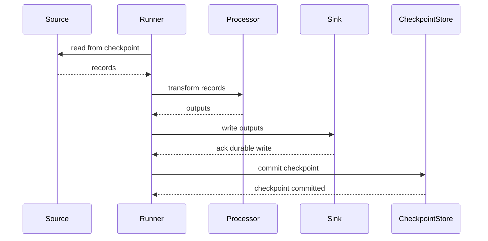
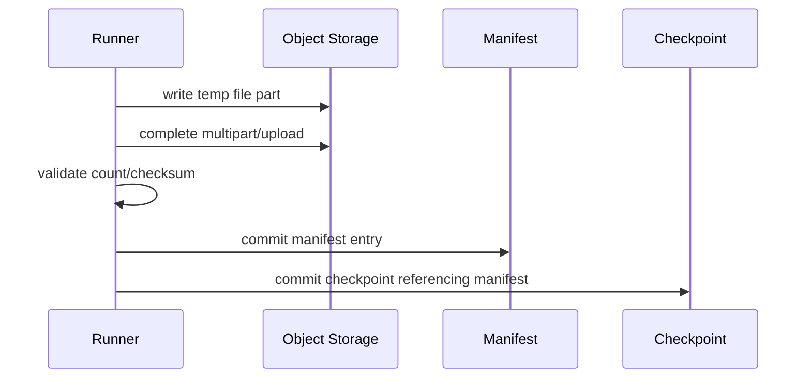

# Part 014 — Checkpoint Interface Design

> Checkpoint adalah janji progress. Jika janji ini salah, pipeline akan kehilangan data, memproses dobel tanpa kontrol, atau tidak bisa recovery secara defensible.

Pada Part 013 kita membahas backpressure: bagaimana pipeline menahan tekanan agar overload tidak menjadi outage.

Sekarang kita masuk ke pasangan logisnya: checkpoint.

Backpressure menjawab:

```text
berapa banyak pekerjaan yang boleh masuk sekarang?
```

Checkpoint menjawab:

```text
pekerjaan mana yang sudah aman untuk dianggap selesai?
```

Di pipeline sederhana, checkpoint sering dianggap sama dengan offset.

Itu penyederhanaan berbahaya.

Dalam pipeline production, checkpoint bisa berupa:

- Kafka offset
- database high-watermark
- API cursor
- file path + byte offset + row number
- object storage manifest pointer
- source transaction LSN
- event-time watermark
- state snapshot reference
- recovery token
- sink commit marker
- composite progress per partition

Bagian ini membangun desain checkpoint interface di Java dari first principles.

---

## 1. Apa Itu Checkpoint?

Checkpoint adalah representasi durable dari progress pipeline yang bisa dipakai untuk recovery.

Definisi praktis:

> Checkpoint adalah posisi terakhir yang output dan side effect-nya sudah aman, sehingga setelah crash pipeline boleh melanjutkan dari posisi berikutnya tanpa kehilangan data sesuai delivery contract.

Kata kuncinya: **sudah aman**.

Bukan:

- sudah dibaca
- sudah masuk queue
- sudah dikirim ke worker
- sudah mulai diproses
- sudah dicoba ditulis

Tetapi:

```text
input before/equal checkpoint has been processed according to the pipeline's correctness contract
```

Jika sink tidak idempotent, checkpoint harus lebih konservatif.

Jika sink idempotent, checkpoint bisa lebih fleksibel karena replay tidak fatal.

---

## 2. Checkpoint Adalah Boundary antara Input dan Side Effect

Pipeline tidak hanya membaca data. Pipeline menghasilkan side effect:

- insert/update database
- produce Kafka event
- write file/object
- call external API
- update search index
- update state store
- emit alert
- create audit record

Checkpoint harus disimpan setelah side effect aman.

Urutan ideal:

```text
read input
process deterministically
write output idempotently or transactionally
flush/confirm output
commit checkpoint
```

Diagram:



Jika urutan dibalik:

```text
commit checkpoint -> write sink
```

maka crash setelah checkpoint tetapi sebelum sink write menyebabkan data loss.

---

## 3. Checkpoint vs Offset vs Cursor vs Watermark vs Snapshot

Istilah sering tercampur.

| Istilah | Makna | Contoh |
|---|---|---|
| Offset | posisi ordinal dalam log/partition | Kafka offset 12345 |
| Cursor | token navigasi dari source | API `nextPageToken` |
| High-watermark | nilai maksimum yang sudah dilihat/diproses | `updated_at <= T` |
| Watermark | estimasi event-time completeness | event before T mostly arrived |
| Snapshot | salinan state pada waktu tertentu | Flink state checkpoint, local RocksDB snapshot |
| Recovery token | token opaque untuk resume | database CDC LSN, SaaS sync token |
| Commit marker | bukti durable bahwa output selesai | manifest committed, transaction ID |

Checkpoint bisa mengandung beberapa hal sekaligus.

Contoh composite checkpoint:

```json
{
  "pipelineId": "case-enforcement-cdc-to-risk-view",
  "source": "postgres-outbox",
  "partition": "0",
  "offset": "9827342",
  "sourceTransactionId": "tx-778812",
  "eventTimeWatermark": "2026-07-04T10:15:00Z",
  "sinkCommitId": "risk-view-batch-20260704-101501",
  "schemaVersion": "case-event.v3",
  "committedAt": "2026-07-04T10:15:06Z"
}
```

---

## 4. The Golden Rule: Commit What Is Safe, Not What Is Seen

Misal pipeline membaca 100 record dari Kafka:

```text
offsets 100..199
```

Lalu memproses paralel.

Jika offset 100, 101, 102, 104 selesai, tetapi 103 belum selesai, bolehkah commit 104?

Biasanya tidak, jika commit offset berarti semua offset sebelumnya sudah aman.

Commit harus mengikuti contiguous completed range:

```text
completed: 100, 101, 102, 104
safe checkpoint: 102
not 104, because 103 is missing
```

Implementasi tracker:

```java
public final class ContiguousOffsetTracker {
    private long nextExpected;
    private final NavigableSet<Long> completed = new TreeSet<>();

    public ContiguousOffsetTracker(long startingOffset) {
        this.nextExpected = startingOffset;
    }

    public synchronized void markCompleted(long offset) {
        completed.add(offset);
        while (completed.remove(nextExpected)) {
            nextExpected++;
        }
    }

    public synchronized long safeCheckpointExclusive() {
        return nextExpected;
    }
}
```

Jika `safeCheckpointExclusive()` mengembalikan 103, artinya offset sebelum 103 sudah aman. Untuk Kafka, commit offset biasanya merepresentasikan next offset yang akan dibaca.

---

## 5. Checkpoint Harus Durable

Checkpoint di memory bukan checkpoint. Itu hanya progress sementara.

Durable checkpoint store bisa berupa:

- Kafka committed offset
- database table
- object storage metadata file
- distributed KV store
- workflow engine state
- framework-managed state backend

Minimal checkpoint store harus punya:

- atomic write
- read latest checkpoint
- compare-and-swap atau fencing
- ownership information
- timestamp
- version
- corruption detection jika file-based
- audit trail jika regulated

Interface awal:

```java
public interface CheckpointStore<C extends Checkpoint> {
    Optional<C> load(CheckpointKey key) throws CheckpointException;

    CommitResult commit(
        CheckpointKey key,
        C previous,
        C next
    ) throws CheckpointException;
}
```

Kenapa butuh `previous`?

Agar store bisa melakukan optimistic concurrency:

```text
commit next only if current == previous
```

Tanpa itu, dua runner bisa saling menimpa progress.

---

## 6. Checkpoint Key

Checkpoint tidak boleh hanya di-key oleh nama pipeline.

Biasanya perlu dimensi:

- pipeline id
- environment
- source id
- source partition/shard
- consumer group/job id
- tenant jika multi-tenant
- processing mode jika replay/backfill terpisah

Contoh:

```java
public record CheckpointKey(
    String environment,
    String pipelineId,
    String sourceId,
    String partitionId,
    String consumerGroup,
    String tenantId,
    ProcessingMode mode
) {}
```

Jika replay/backfill memakai checkpoint yang sama dengan live pipeline, Anda bisa merusak progress live.

Pisahkan:

```text
mode=LIVE
mode=BACKFILL:2026-q2-correction
mode=REPLAY:incident-1234
```

---

## 7. Checkpoint Model di Java

Gunakan sealed interface agar jenis checkpoint eksplisit.

```java
public sealed interface Checkpoint
    permits OffsetCheckpoint,
            CursorCheckpoint,
            FileCheckpoint,
            WatermarkCheckpoint,
            SnapshotCheckpoint,
            CompositeCheckpoint {

    Instant committedAt();
    String version();
}

public record OffsetCheckpoint(
    String version,
    Instant committedAt,
    String topic,
    int partition,
    long nextOffset
) implements Checkpoint {}

public record CursorCheckpoint(
    String version,
    Instant committedAt,
    String cursorToken
) implements Checkpoint {}

public record FileCheckpoint(
    String version,
    Instant committedAt,
    String fileUri,
    long byteOffset,
    long rowNumber,
    String fileChecksum
) implements Checkpoint {}

public record WatermarkCheckpoint(
    String version,
    Instant committedAt,
    Instant eventTimeWatermark
) implements Checkpoint {}

public record SnapshotCheckpoint(
    String version,
    Instant committedAt,
    String snapshotUri,
    String checksum
) implements Checkpoint {}

public record CompositeCheckpoint(
    String version,
    Instant committedAt,
    Map<String, Checkpoint> components
) implements Checkpoint {}
```

`CompositeCheckpoint` berguna untuk source multi-partition atau pipeline yang butuh state snapshot + offset.

---

## 8. Commit Result

Commit tidak selalu sukses.

```java
public sealed interface CommitResult {
    record Committed() implements CommitResult {}
    record Conflict(Checkpoint current) implements CommitResult {}
    record Rejected(String reason) implements CommitResult {}
}
```

Conflict berarti checkpoint store sudah berubah sejak runner membaca checkpoint.

Ini bisa terjadi karena:

- dua instance memproses partition yang sama
- failover lama masih hidup
- operator menjalankan replay dengan key yang salah
- network partition
- bug leadership/fencing

Conflict tidak boleh diabaikan.

```java
CommitResult result = store.commit(key, previous, next);

switch (result) {
    case CommitResult.Committed ignored -> continueProcessing();
    case CommitResult.Conflict conflict -> stopAndInvestigate(conflict.current());
    case CommitResult.Rejected rejected -> fail(rejected.reason());
}
```

Jika conflict diabaikan, Anda kehilangan ordering progress.

---

## 9. Database Checkpoint Store

Contoh tabel:

```sql
CREATE TABLE pipeline_checkpoint (
    environment          text        NOT NULL,
    pipeline_id          text        NOT NULL,
    source_id            text        NOT NULL,
    partition_id         text        NOT NULL,
    consumer_group       text        NOT NULL,
    tenant_id            text        NOT NULL,
    mode                 text        NOT NULL,
    checkpoint_version   bigint      NOT NULL,
    checkpoint_payload   jsonb       NOT NULL,
    committed_at         timestamptz NOT NULL,
    owner_id             text        NULL,
    fencing_token        bigint      NOT NULL DEFAULT 0,
    PRIMARY KEY (
        environment,
        pipeline_id,
        source_id,
        partition_id,
        consumer_group,
        tenant_id,
        mode
    )
);
```

Optimistic commit:

```sql
UPDATE pipeline_checkpoint
SET checkpoint_version = checkpoint_version + 1,
    checkpoint_payload = :next_payload,
    committed_at = now(),
    owner_id = :owner_id
WHERE environment = :environment
  AND pipeline_id = :pipeline_id
  AND source_id = :source_id
  AND partition_id = :partition_id
  AND consumer_group = :consumer_group
  AND tenant_id = :tenant_id
  AND mode = :mode
  AND checkpoint_version = :previous_version;
```

Jika row count 0, commit conflict.

Untuk insert pertama, gunakan insert-on-conflict dengan versi awal, tetapi tetap hati-hati terhadap race.

---

## 10. Fencing Token

Fencing mencegah instance lama menulis checkpoint setelah instance baru mengambil alih.

Skenario:

```text
runner A owns partition 0
runner A pauses due to GC/network
runner B takes over partition 0
runner A wakes up and tries to commit old checkpoint
```

Tanpa fencing, A bisa menimpa progress B.

Dengan fencing:

```java
public record Lease(
    String ownerId,
    long fencingToken,
    Instant expiresAt
) {}
```

Setiap write membawa fencing token:

```sql
UPDATE pipeline_checkpoint
SET checkpoint_payload = :payload,
    checkpoint_version = checkpoint_version + 1
WHERE key = :key
  AND fencing_token = :fencing_token;
```

Saat ownership berpindah, fencing token naik.

Runner lama tidak bisa commit karena token-nya basi.

---

## 11. Recovery Algorithm

Recovery harus deterministik.

Pseudocode:

```java
public void recoverAndRun() {
    Lease lease = leaseManager.acquire(key);
    Checkpoint checkpoint = checkpointStore.load(key).orElse(source.initialCheckpoint());

    SourcePosition position = source.positionFrom(checkpoint);
    source.seek(position);

    StateSnapshot snapshot = stateStore.loadIfReferenced(checkpoint);
    processor.restore(snapshot);

    runner.runFrom(position, lease);
}
```

Langkah recovery:

1. acquire ownership/lease jika perlu
2. load checkpoint durable
3. validate checkpoint version
4. validate schema/contract compatibility
5. seek source ke posisi yang benar
6. restore processor state jika ada
7. verify sink idempotency/replay mode
8. resume processing
9. emit recovery event/metric

Jangan langsung `seek` tanpa validasi. Checkpoint lama bisa tidak kompatibel dengan versi pipeline baru.

---

## 12. Checkpoint dan Idempotent Sink

Checkpoint dan idempotency saling melengkapi.

Jika sink idempotent:

- replay setelah crash lebih aman
- checkpoint bisa commit lebih konservatif
- duplicate tidak menyebabkan state salah

Jika sink tidak idempotent:

- checkpoint harus sangat hati-hati
- external side effect bisa terjadi dobel
- recovery butuh reconciliation/manual compensation

Contoh idempotent sink command:

```java
public record SinkCommand<T>(
    String idempotencyKey,
    String target,
    T payload,
    Instant producedAt
) {}
```

Database sink:

```sql
INSERT INTO materialized_case_view (
    case_id,
    version,
    status,
    updated_at,
    idempotency_key
)
VALUES (?, ?, ?, ?, ?)
ON CONFLICT (case_id, version) DO NOTHING;
```

Atau:

```sql
INSERT INTO sink_dedupe (idempotency_key, committed_at)
VALUES (?, now())
ON CONFLICT (idempotency_key) DO NOTHING;
```

Jika dedupe insert sukses, lanjut write. Jika conflict, record sudah pernah diproses.

---

## 13. Source-Specific Checkpoint Patterns

### 13.1 Kafka Offset Checkpoint

Kafka consumer group offset merepresentasikan posisi konsumsi per topic-partition.

Pola aman:

```text
poll records
process records
write sink
commit offset after safe contiguous completion
```

Hindari auto-commit untuk pipeline yang punya side effect penting, karena offset bisa ter-commit sebelum output aman.

Manual commit memberi kontrol lebih baik.

### 13.2 Database Polling High-Watermark

Contoh:

```sql
SELECT *
FROM orders
WHERE updated_at > :last_watermark
ORDER BY updated_at, id
LIMIT 1000;
```

Masalah: banyak row bisa punya `updated_at` yang sama.

Checkpoint harus menyimpan tie-breaker:

```json
{
  "lastUpdatedAt": "2026-07-04T10:00:00Z",
  "lastId": "ord-9001"
}
```

Query:

```sql
WHERE (updated_at, id) > (:last_updated_at, :last_id)
ORDER BY updated_at, id
LIMIT 1000;
```

Jika hanya menyimpan timestamp, row dengan timestamp sama bisa hilang atau diproses dobel tanpa kontrol.

### 13.3 API Cursor

API cursor sering opaque.

Jangan mencoba menginterpretasikan token jika contract tidak menjamin format.

Checkpoint:

```json
{
  "cursorToken": "eyJwYWdlIjoyMDA...",
  "lastFetchedAt": "2026-07-04T10:00:00Z"
}
```

Jika API punya cursor expiring, checkpoint harus menyimpan fallback:

- last business key
- last updated timestamp
- sync window
- full resync strategy

### 13.4 File Checkpoint

File kecil:

```text
checkpoint = file manifest entry processed
```

File besar:

```text
checkpoint = file URI + byte offset + row number + parser state
```

Namun row-level checkpoint untuk CSV/JSON besar bisa sulit karena parser state tidak selalu seekable.

Alternatif production:

- split file menjadi chunks sebelum processing
- convert ke splittable format
- write per-file success marker
- reprocess whole file idempotently

### 13.5 CDC LSN/Binlog Position

CDC checkpoint harus mengikuti source log semantics.

Untuk CDC snapshot + stream, checkpoint bisa mencakup:

- snapshot phase status
- table currently snapshotting
- primary key range
- log sequence number/binlog position
- transaction boundary

Jangan campur snapshot progress dan streaming progress secara sembarangan.

---

## 14. Watermark Bukan Offset

Watermark sering disalahartikan sebagai checkpoint.

Watermark adalah estimasi progress event-time.

Offset adalah posisi input log.

Contoh:

```text
Kafka offset: 10,000
watermark: 2026-07-04T10:00:00Z
```

Maknanya berbeda:

- offset 10.000 berarti posisi konsumsi log
- watermark 10:00 berarti pipeline percaya event sebelum/hingga sekitar 10:00 sudah cukup lengkap untuk operasi event-time tertentu

Pipeline windowing butuh keduanya:

```json
{
  "offsetCheckpoint": {
    "topic": "case-events",
    "partition": 0,
    "nextOffset": 10001
  },
  "eventTimeWatermark": "2026-07-04T10:00:00Z",
  "stateSnapshotUri": "s3://state/job-1/chk-77"
}
```

Jika hanya menyimpan offset, state window bisa hilang.

Jika hanya menyimpan watermark, source tidak tahu harus resume dari mana.

---

## 15. Snapshot untuk Stateful Processing

Stateful processor menyimpan state seperti:

- dedupe set
- aggregation accumulator
- session state
- join buffer
- timer state
- materialized table cache
- enrichment cache

Checkpoint offset saja tidak cukup.

Jika crash, pipeline harus restore state yang konsisten dengan input offset.

Checkpoint stateful idealnya atomic secara konseptual:

```text
state snapshot corresponds to input positions P
```

Jika state snapshot dari offset 1000 tetapi source resume dari 1200, hasil bisa salah.

Composite checkpoint:

```java
public record StatefulCheckpoint(
    String version,
    Instant committedAt,
    Map<String, OffsetCheckpoint> sourceOffsets,
    SnapshotCheckpoint stateSnapshot,
    WatermarkCheckpoint watermark
) implements Checkpoint {}
```

---

## 16. Two-Phase Checkpoint for File/Object Sink

Saat sink menulis file/object, jangan langsung expose file final sebelum lengkap.

Pola:

```text
write temp object
validate checksum/count
commit manifest
advance checkpoint
```

Diagram:



Jika crash sebelum manifest commit, temp file bisa dibersihkan.

Jika crash setelah manifest commit tapi sebelum checkpoint, replay bisa mendeteksi manifest sudah ada melalui idempotency key.

---

## 17. Unknown Outcome Problem

Distributed systems sering punya kondisi ini:

```text
sink write sent
network timeout occurs
client does not know whether sink committed
```

Ini disebut unknown outcome.

Jika pipeline retry tanpa idempotency, side effect bisa dobel.

Strategi:

1. gunakan idempotency key
2. gunakan transaction/commit id jika sink mendukung
3. cek status commit sebelum retry
4. lakukan reconciliation
5. kirim ke manual review jika side effect tidak aman

Checkpoint tidak bisa menyelesaikan unknown outcome sendirian.

Checkpoint hanya tahu apa yang pipeline yakini. Idempotency dan reconciliation membuat keyakinan itu defensible.

---

## 18. Checkpoint Frequency

Checkpoint terlalu sering:

- overhead tinggi
- throughput turun
- storage checkpoint panas
- transaction contention

Checkpoint terlalu jarang:

- recovery replay besar
- duplicate attempt meningkat
- recovery lama
- backfill ulang mahal

Pilih berdasarkan:

- input rate
- sink idempotency
- cost per checkpoint
- acceptable replay window
- state size
- SLA recovery time
- ordering requirement

Contoh:

```text
input rate = 10,000 records/s
checkpoint every 10s => replay up to 100,000 records
checkpoint every 1s  => replay up to 10,000 records, but higher overhead
```

Tidak ada angka universal.

Gunakan benchmark dan failure test.

---

## 19. Checkpoint Granularity

Granularity umum:

| Granularity | Kelebihan | Kekurangan |
|---|---|---|
| per record | replay minimal | overhead tinggi |
| per batch | seimbang | duplicate batch saat crash |
| per partition interval | scalable | tracking lebih kompleks |
| per file | simpel | reprocess file besar |
| per job stage | mudah orchestration | kurang presisi |
| framework-managed | matang | perlu paham boundary guarantee |

Default praktis:

- streaming high throughput: per batch/interval per partition
- file kecil: per file
- file besar: per chunk atau reprocess idempotently
- API: per successful page/cursor
- DB polling: per page dengan high-watermark + tie-breaker
- stateful stream: framework checkpoint + sink idempotency/transaction

---

## 20. Checkpoint and Backpressure Interaction

Saat backpressure tinggi, checkpoint behavior penting.

Misal runner sudah membaca 10.000 record ke queue tetapi baru memproses 1.000.

Jika crash, apakah 9.000 record hilang?

Jawabannya tergantung checkpoint.

Jika checkpoint hanya maju setelah sink write sukses, maka 9.000 record akan dibaca ulang dari source. Aman jika source durable dan retention cukup.

Jika checkpoint maju saat record masuk queue, maka crash bisa menyebabkan loss.

Rule:

```text
in-memory queue is not a durable completion boundary
```

Checkpoint tidak boleh merepresentasikan record yang hanya “sudah diterima internal”.

---

## 21. Checkpoint Validation

Saat startup, validasi checkpoint:

- apakah payload bisa dibaca?
- apakah version didukung?
- apakah source masih punya posisi itu?
- apakah Kafka offset masih dalam retention?
- apakah file masih ada?
- apakah cursor expired?
- apakah state snapshot ada dan checksum cocok?
- apakah schema versi masih compatible?
- apakah mode benar?
- apakah checkpoint lebih maju daripada sink? Jika ya, bahaya data loss.

Contoh validator:

```java
public interface CheckpointValidator<C extends Checkpoint> {
    ValidationResult validate(C checkpoint, RuntimeContext context);
}

public sealed interface ValidationResult {
    record Valid() implements ValidationResult {}
    record Invalid(String reason) implements ValidationResult {}
    record RequiresMigration(String fromVersion, String toVersion) implements ValidationResult {}
}
```

Jangan auto-ignore checkpoint corrupt. Itu bisa membuat pipeline memulai dari awal tanpa sadar dan menghasilkan duplicate besar.

---

## 22. Checkpoint Migration

Pipeline berevolusi.

Checkpoint schema juga akan berubah.

Contoh v1:

```json
{
  "offset": 1234
}
```

v2:

```json
{
  "topic": "case-events",
  "partition": 0,
  "nextOffset": 1234,
  "watermark": "2026-07-04T10:00:00Z"
}
```

Gunakan versioned checkpoint.

```java
public interface CheckpointMigrator<F extends Checkpoint, T extends Checkpoint> {
    String fromVersion();
    String toVersion();
    T migrate(F oldCheckpoint);
}
```

Migration harus diuji dengan checkpoint nyata dari production-like environment.

---

## 23. Auditability

Untuk regulated pipeline, checkpoint bukan hanya mekanisme recovery. Ia adalah bukti operasional.

Simpan metadata:

- who/what committed checkpoint
- code version/build SHA
- pipeline config version
- schema version
- input range
- output commit id
- record counts
- checksum jika memungkinkan
- previous checkpoint
- commit timestamp
- mode: live/backfill/replay
- reason: scheduled/retry/manual recovery

Audit event:

```json
{
  "eventType": "PIPELINE_CHECKPOINT_COMMITTED",
  "pipelineId": "case-risk-view",
  "partition": "0",
  "previous": "offset:10000",
  "next": "offset:15000",
  "inputRecordCount": 5000,
  "outputRecordCount": 4998,
  "rejectedRecordCount": 2,
  "sinkCommitId": "risk-view-batch-7788",
  "buildSha": "abc123",
  "committedAt": "2026-07-04T10:10:10Z"
}
```

Ini membantu menjawab pertanyaan:

> Data laporan ini berasal dari input range mana dan diproses oleh versi pipeline apa?

---

## 24. Testing Checkpoint Correctness

Test bukan hanya “checkpoint tersimpan”.

Test failure matrix:

| Failure Point | Expected Behavior |
|---|---|
| crash after read before process | records replayed |
| crash after process before sink | records replayed |
| crash after partial sink write | replay safe due idempotency/reconciliation |
| crash after sink write before checkpoint | duplicate attempt but no duplicate effect |
| crash after checkpoint | no replay before checkpoint |
| checkpoint conflict | runner stops/fails safely |
| checkpoint corrupt | startup fails with clear diagnostic |
| source offset expired | recovery fails with explicit remediation |
| snapshot missing | stateful pipeline refuses unsafe start |

Fault injection helper:

```java
public enum FailurePoint {
    AFTER_READ,
    AFTER_PROCESS,
    AFTER_SINK_WRITE,
    BEFORE_CHECKPOINT_COMMIT,
    AFTER_CHECKPOINT_COMMIT
}
```

Test pattern:

```java
for (FailurePoint point : FailurePoint.values()) {
    PipelineHarness harness = new PipelineHarness(point);
    harness.runUntilInjectedFailure();
    harness.restart();
    harness.runToCompletion();

    assertThat(harness.sinkState()).isEqualTo(expectedState);
    assertThat(harness.dataLoss()).isZero();
}
```

Correctness checkpoint baru terbukti saat crash terjadi di titik terburuk.

---

## 25. Common Anti-Patterns

### Anti-Pattern 1: Commit on Read

```text
record read from source -> checkpoint committed
```

Ini menyebabkan data loss jika crash sebelum sink write.

### Anti-Pattern 2: One Global Checkpoint for Partitioned Source

```text
partition 0 at offset 1000
partition 1 at offset 5000
store only max offset = 5000
```

Offset harus per partition/shard.

### Anti-Pattern 3: Timestamp-Only High-Watermark

Jika beberapa row punya timestamp sama, timestamp-only bisa melewatkan row.

Gunakan tie-breaker stabil.

### Anti-Pattern 4: Checkpoint Shared by Live and Backfill

Backfill bisa memundurkan atau memajukan progress live.

Pisahkan mode.

### Anti-Pattern 5: Checkpoint without Sink Idempotency

Crash after sink before checkpoint membuat duplicate side effect.

### Anti-Pattern 6: Ignoring Commit Conflict

Conflict adalah sinyal correctness problem, bukan warning biasa.

### Anti-Pattern 7: Checkpoint Not Versioned

Begitu payload berubah, recovery menjadi rapuh.

---

## 26. Production Checklist

Sebelum checkpoint design dianggap siap:

### Semantics

- Apa arti checkpoint secara tepat?
- Apakah inclusive atau exclusive?
- Apakah per partition?
- Apakah merepresentasikan input read atau output committed?
- Apakah sink idempotent/transactional?

### Storage

- Di mana checkpoint disimpan?
- Apakah atomic?
- Apakah durable?
- Apakah ada CAS/fencing?
- Apakah bisa diaudit?

### Recovery

- Bagaimana startup membaca checkpoint?
- Bagaimana source seek?
- Bagaimana state restore?
- Bagaimana jika checkpoint corrupt?
- Bagaimana jika source retention sudah melewati checkpoint?

### Evolution

- Apakah checkpoint versioned?
- Apakah ada migrator?
- Apakah migrasi diuji?
- Apakah rollback versi pipeline aman?

### Operations

- Apakah checkpoint lag terlihat?
- Apakah checkpoint age terlihat?
- Apakah commit failure alert ada?
- Apakah conflict alert high severity?
- Apakah operator punya runbook?

---

## 27. Final Mental Model

Checkpoint adalah ledger kecil tentang progress pipeline.

Ia harus menjawab:

```text
From which exact source position can I safely resume?
What side effects are already durable?
What state snapshot matches that source position?
What event-time assumptions have been made?
Which pipeline version produced this progress?
Who owns the right to advance it?
```

Rule yang paling penting:

> Jangan checkpoint apa yang baru dilihat. Checkpoint hanya apa yang sudah aman.

Jika Anda memegang prinsip ini, banyak keputusan teknis menjadi lebih jelas:

- commit offset setelah sink durable
- simpan high-watermark dengan tie-breaker
- pisahkan checkpoint live dan backfill
- gunakan idempotent sink
- gunakan fencing untuk ownership
- simpan snapshot bersama offset untuk stateful pipeline
- validasi checkpoint saat startup
- test crash di semua boundary

Checkpoint adalah fondasi replayability. Replayability adalah fondasi trust. Tanpa itu, pipeline hanya program yang berharap tidak pernah gagal.

---

## 28. Referensi Primer

- Apache Flink documentation: checkpointing membuat state fault-tolerant dan memungkinkan recovery state serta posisi stream.
- Apache Kafka consumer documentation: offset dan manual commit adalah mekanisme penting untuk mengontrol progress konsumsi.
- Apache Beam programming model: pipeline memproses bounded/unbounded data dan menggunakan konsep event time/watermark untuk correctness waktu.
- Debezium documentation: CDC connector mengelola snapshot, streaming log position, dan offset untuk melanjutkan capture perubahan.

Pada Part 015 kita akan membangun idempotent sink dari nol: natural key, dedupe key, version, compare-and-swap, upsert, dan bagaimana membuat replay aman tanpa mengandalkan “exactly-once” secara magis.
