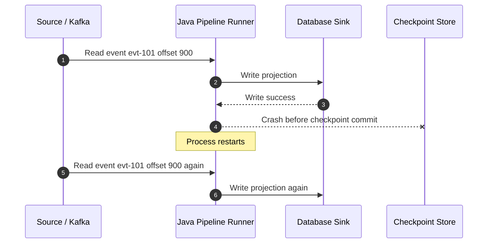
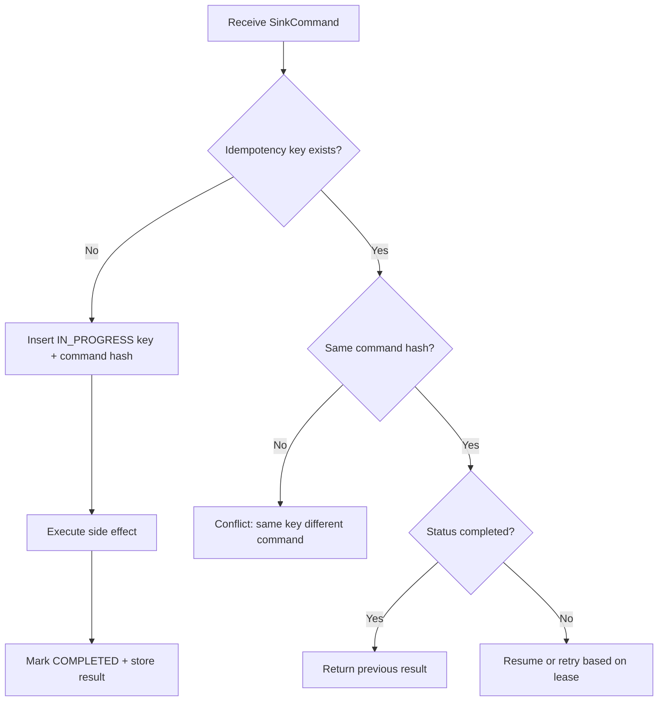
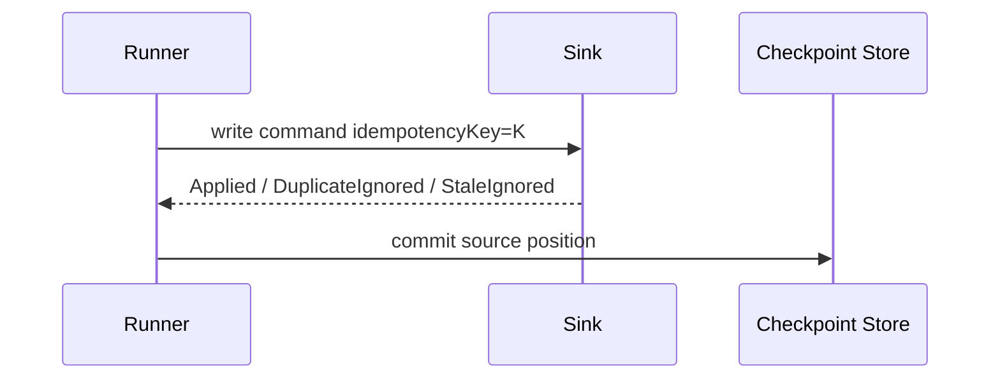
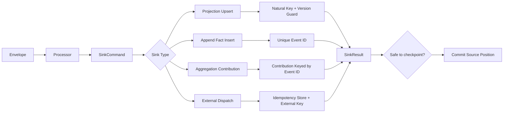

# Part 015 — Idempotent Sink from Scratch

Pipeline yang serius tidak boleh mengasumsikan bahwa setiap record hanya akan diproses sekali. Pada sistem nyata, duplicate bukan anomali langka. Duplicate adalah konsekuensi normal dari retry, replay, consumer rebalance, timeout, unknown write outcome, partial failure, dan backfill.

Karena itu, sink yang benar bukan sink yang “menulis data”. Sink yang benar adalah sink yang bisa menerima ulang perintah tulis yang sama tanpa merusak hasil akhir.

Itulah idempotent sink.

Secara sederhana:

> Sink disebut idempotent jika menjalankan write operation yang sama lebih dari sekali menghasilkan state akhir yang sama seperti menjalankannya satu kali.

Tetapi definisi itu masih terlalu abstrak. Dalam pipeline production-grade, idempotency harus dijawab pada level yang lebih konkret:

- operasi apa yang dianggap “sama”?
- identity apa yang dipakai untuk mendeteksi duplicate?
- apakah duplicate diabaikan, di-merge, atau dianggap konflik?
- apakah sink menyimpan latest state, append-only facts, ledger, audit log, materialized view, atau side effect eksternal?
- apakah idempotency berlaku hanya pada satu table, satu partition, satu tenant, satu workflow, atau lintas sistem?
- apakah retry setelah timeout aman?
- apakah replay satu bulan data lama akan mengubah state saat ini?
- apakah backfill bisa dijalankan paralel dengan stream normal?

Part ini membangun idempotent sink dari nol dengan Java sebagai bahasa implementasi. Tujuannya bukan menghafal pattern, tetapi memahami desain write protocol yang tahan replay.

---

## 1. Problem Statement

Misalkan pipeline membaca event dari Kafka:

```json
{
  "eventId": "evt-101",
  "caseId": "CASE-42",
  "status": "ESCALATED",
  "occurredAt": "2026-07-04T08:10:00Z",
  "version": 7
}
```

Pipeline menulis ke PostgreSQL table `case_projection`.

Jika consumer memproses event tersebut, berhasil menulis ke database, tetapi crash sebelum commit offset, maka setelah restart event yang sama akan dibaca ulang.

Tanpa idempotency, sink bisa:

- membuat duplicate row,
- menaikkan counter dua kali,
- mengirim notifikasi dua kali,
- menulis audit event dua kali,
- menimpa data lebih baru dengan data lama,
- membuat downstream percaya ada dua escalation.

Bug ini tidak selalu muncul di local test karena local test biasanya tidak mensimulasikan crash di antara write dan checkpoint.

Pipeline production-grade harus menganggap skenario berikut sebagai normal:



Jika write kedua merusak state, desain sink salah.

---

## 2. Mental Model: Sink Is a State Transition Boundary

Source dan processor boleh bersifat relatif pure. Sink tidak. Sink adalah boundary tempat pipeline mengubah dunia luar.

Dalam desain yang matang, sink tidak dipandang sebagai `save(record)`, tetapi sebagai state transition protocol:

```txt
current external state + write command -> new external state + write result
```

Karena operasi ini menyentuh dunia luar, sink harus menjawab tiga hal:

1. **Identity** — write ini merepresentasikan fakta atau command yang mana?
2. **Precondition** — kapan write ini boleh diterima?
3. **Effect** — apa perubahan yang boleh terjadi?

Tanpa tiga hal ini, retry tidak bisa dibedakan dari event baru, stale update tidak bisa dibedakan dari update valid, dan duplicate tidak bisa dibedakan dari konflik.

---

## 3. Idempotency Is Not Deduplication Only

Banyak engineer menyederhanakan idempotency menjadi “simpan event ID lalu ignore duplicate”. Itu hanya salah satu teknik.

Idempotency memiliki beberapa bentuk:

| Bentuk | Inti | Cocok Untuk | Risiko |
|---|---|---|---|
| Natural-key upsert | State ditentukan oleh business key | Latest projection | Stale overwrite |
| Event-ID dedupe | Event hanya diterapkan sekali | Append event, notification, ledger-ish action | Dedupe store growth |
| Versioned update | Update diterima jika version lebih baru | CDC/state projection | Out-of-order handling |
| Compare-and-swap | Update diterima jika expected state cocok | Workflow transition | Conflict handling kompleks |
| Idempotency key | Command retry memakai key sama | External API/payment/task creation | Key design buruk menyebabkan collision |
| Deterministic output path | Output file/table partition sama untuk input sama | Batch/lakehouse | Partial write cleanup |
| Transactional outbox/inbox | Side effect dan state disatukan | Operational integration | Butuh boundary transaksi jelas |

Deduplication menjawab:

> Apakah record ini pernah diterapkan?

Idempotency menjawab:

> Jika operasi ini dijalankan ulang, apakah state akhir tetap benar?

Deduplication adalah alat. Idempotency adalah properti desain.

---

## 4. Sink Categories and Their Idempotency Strategy

Tidak semua sink sama. Strategi idempotency tergantung bentuk state yang ditulis.

### 4.1 Latest-State Projection Sink

Contoh:

- `case_projection`
- `customer_current_status`
- `account_balance_snapshot`
- Elasticsearch document by ID
- Redis cache by key

State akhir mewakili kondisi terbaru suatu entity.

Strategi umum:

- key berdasarkan entity ID,
- gunakan `UPSERT`,
- simpan source version/event time,
- tolak update yang lebih lama,
- jangan hanya blindly overwrite.

Contoh:

```sql
INSERT INTO case_projection (
  case_id,
  status,
  source_version,
  last_event_id,
  event_time,
  updated_at
)
VALUES (?, ?, ?, ?, ?, now())
ON CONFLICT (case_id)
DO UPDATE SET
  status = EXCLUDED.status,
  source_version = EXCLUDED.source_version,
  last_event_id = EXCLUDED.last_event_id,
  event_time = EXCLUDED.event_time,
  updated_at = now()
WHERE case_projection.source_version < EXCLUDED.source_version;
```

Idempotency-nya berasal dari `case_id + source_version`.

Jika event version 7 diproses dua kali, write kedua tidak mengubah state. Jika event version 6 datang setelah version 7, update ditolak.

### 4.2 Append-Only Fact Sink

Contoh:

- audit log,
- event archive,
- immutable fact table,
- raw ingestion table,
- business ledger event.

State akhir adalah kumpulan fakta. Duplicate row adalah korupsi.

Strategi umum:

- unique constraint pada `event_id`,
- `INSERT ... ON CONFLICT DO NOTHING`,
- simpan metadata source,
- jangan generate event ID baru saat retry.

```sql
INSERT INTO case_event_fact (
  event_id,
  case_id,
  event_type,
  payload,
  source_partition,
  source_offset,
  occurred_at,
  ingested_at
)
VALUES (?, ?, ?, ?::jsonb, ?, ?, ?, now())
ON CONFLICT (event_id) DO NOTHING;
```

### 4.3 Aggregation Sink

Contoh:

- daily count,
- total amount,
- SLA breach count,
- dashboard metric,
- rolling aggregate.

Ini berbahaya karena operasi seperti `count = count + 1` tidak idempotent.

Jika event sama diproses dua kali, counter naik dua kali.

Strategi aman:

- jangan langsung increment tanpa dedupe,
- simpan contribution per event,
- aggregate dari contribution table,
- atau gunakan stateful processor yang checkpointed dengan sink transactional.

Pattern:

```sql
CREATE TABLE daily_case_escalation_contribution (
  event_id text PRIMARY KEY,
  metric_date date NOT NULL,
  case_id text NOT NULL,
  contribution integer NOT NULL,
  created_at timestamptz NOT NULL DEFAULT now()
);
```

Lalu:

```sql
INSERT INTO daily_case_escalation_contribution (
  event_id,
  metric_date,
  case_id,
  contribution
)
VALUES (?, ?, ?, 1)
ON CONFLICT (event_id) DO NOTHING;
```

Aggregate bisa dihitung:

```sql
SELECT metric_date, sum(contribution)
FROM daily_case_escalation_contribution
GROUP BY metric_date;
```

Atau materialized table diupdate dari contribution table.

Prinsipnya:

> Ubah non-idempotent increment menjadi idempotent contribution insertion.

### 4.4 External Side Effect Sink

Contoh:

- kirim email,
- panggil payment API,
- create ticket,
- kirim webhook,
- publish ke system pihak ketiga.

Ini paling sulit karena sistem eksternal mungkin tidak transactional dengan pipeline.

Strategi:

- gunakan idempotency key jika external API mendukung,
- simpan outbox/side-effect request sebelum eksekusi,
- simpan response/result,
- retry dengan key yang sama,
- jangan generate request ID baru pada retry,
- bedakan timeout dari failure definitif.

Minimal table:

```sql
CREATE TABLE external_dispatch_log (
  idempotency_key text PRIMARY KEY,
  target_system text NOT NULL,
  request_payload jsonb NOT NULL,
  status text NOT NULL,
  response_payload jsonb,
  attempt_count integer NOT NULL DEFAULT 0,
  created_at timestamptz NOT NULL DEFAULT now(),
  updated_at timestamptz NOT NULL DEFAULT now()
);
```

Side effect eksternal jarang bisa dibuat perfectly exactly-once. Target realistisnya adalah:

> observable, retry-safe, deduplicated by key, and reconcilable.

---

## 5. Natural Key, Dedupe Key, and Idempotency Key

Tiga istilah ini sering tercampur.

### 5.1 Natural Key

Natural key adalah identity bisnis dari state.

Contoh:

- `caseId`,
- `customerId`,
- `accountId + currency`,
- `tenantId + documentId`,
- `caseId + milestoneType`.

Natural key cocok untuk projection.

```txt
One case has one current status.
Therefore case_id can be the projection key.
```

Tetapi natural key tidak cukup untuk append-only fact. Jika satu case punya banyak event, `caseId` bukan unique key untuk fact.

### 5.2 Dedupe Key

Dedupe key adalah identity dari fakta/input yang tidak boleh diterapkan dua kali.

Contoh:

- `eventId`,
- `sourceSystem + sourceEventId`,
- `topic + partition + offset`,
- `filePath + rowNumber + fileChecksum`,
- `cdcTransactionId + rowSequence`,
- `sourceTable + primaryKey + sourceVersion`.

Dedupe key cocok untuk append-only sink dan aggregation contribution.

### 5.3 Idempotency Key

Idempotency key adalah identity dari command/side effect agar retry command yang sama tidak menciptakan efek baru.

Contoh:

```txt
send-notification:tenant-7:case-42:escalated:v7
create-ticket:case-42:breach:SLA-24H:v3
export-file:report-2026-07-04:run-abc
```

Idempotency key harus stabil untuk retry operasi yang sama.

Jangan gunakan UUID random yang dibuat saat retry. Itu mengubah retry menjadi operasi baru.

---

## 6. Write Command Design in Java

Daripada sink menerima raw envelope dan langsung menyimpan, buat processor menghasilkan write command eksplisit.

```java
public sealed interface SinkCommand permits UpsertCaseProjection,
                                           InsertCaseFact,
                                           DispatchNotification {
    IdempotencyKey idempotencyKey();
    SinkTarget target();
}

public record IdempotencyKey(String value) {
    public IdempotencyKey {
        if (value == null || value.isBlank()) {
            throw new IllegalArgumentException("idempotency key is required");
        }
    }
}

public record UpsertCaseProjection(
        TenantId tenantId,
        CaseId caseId,
        CaseStatus status,
        long sourceVersion,
        EventId lastEventId,
        Instant eventTime,
        IdempotencyKey idempotencyKey
) implements SinkCommand {
    @Override
    public SinkTarget target() {
        return SinkTarget.POSTGRES_CASE_PROJECTION;
    }
}
```

Kenapa command perlu explicit?

Karena idempotency bukan detail database. Idempotency adalah bagian dari semantic write.

Dengan command eksplisit, kita bisa:

- menguji idempotency key,
- membedakan upsert vs append vs dispatch,
- melakukan dry-run,
- menulis audit,
- menjalankan command validator,
- mengubah sink implementation tanpa mengubah transform logic.

---

## 7. Sink Result Model

Sink tidak cukup mengembalikan `void` atau `boolean`. Write result harus memberi tahu apa yang terjadi.

```java
public sealed interface SinkResult permits SinkResult.Applied,
                                           SinkResult.DuplicateIgnored,
                                           SinkResult.StaleIgnored,
                                           SinkResult.Conflict,
                                           SinkResult.Failed {

    record Applied(IdempotencyKey key) implements SinkResult {}

    record DuplicateIgnored(IdempotencyKey key) implements SinkResult {}

    record StaleIgnored(IdempotencyKey key, long currentVersion, long attemptedVersion)
            implements SinkResult {}

    record Conflict(IdempotencyKey key, String reason) implements SinkResult {}

    record Failed(IdempotencyKey key, Throwable cause, boolean retryable)
            implements SinkResult {}
}
```

Ini penting untuk metrics dan control decision.

`DuplicateIgnored` bukan error. Dalam replay, duplicate adalah expected.

`StaleIgnored` juga belum tentu error. Dalam event-time disorder, stale event bisa normal jika state sudah lebih baru.

`Conflict` berbeda. Conflict berarti event tidak bisa diterapkan karena melanggar precondition yang seharusnya benar.

---

## 8. Idempotent Sink Interface

```java
public interface IdempotentSink<C extends SinkCommand> extends AutoCloseable {
    SinkResult write(C command) throws Exception;
}
```

Untuk batch write:

```java
public interface BatchIdempotentSink<C extends SinkCommand> extends AutoCloseable {
    BatchSinkResult writeBatch(List<C> commands) throws Exception;
}

public record BatchSinkResult(
        int applied,
        int duplicateIgnored,
        int staleIgnored,
        List<SinkResult.Conflict> conflicts,
        List<SinkResult.Failed> failures
) {
    public boolean hasRetryableFailure() {
        return failures.stream().anyMatch(SinkResult.Failed::retryable);
    }
}
```

Batch result harus bisa menjawab partial outcome. Jangan hanya throw exception setelah sebagian command berhasil.

---

## 9. Postgres Upsert Sink Example

Contoh implementasi sink untuk projection.

```java
public final class JdbcCaseProjectionSink
        implements IdempotentSink<UpsertCaseProjection> {

    private final DataSource dataSource;

    public JdbcCaseProjectionSink(DataSource dataSource) {
        this.dataSource = dataSource;
    }

    @Override
    public SinkResult write(UpsertCaseProjection command) throws SQLException {
        String sql = """
            INSERT INTO case_projection (
                tenant_id,
                case_id,
                status,
                source_version,
                last_event_id,
                event_time,
                idempotency_key,
                updated_at
            ) VALUES (?, ?, ?, ?, ?, ?, ?, now())
            ON CONFLICT (tenant_id, case_id)
            DO UPDATE SET
                status = EXCLUDED.status,
                source_version = EXCLUDED.source_version,
                last_event_id = EXCLUDED.last_event_id,
                event_time = EXCLUDED.event_time,
                idempotency_key = EXCLUDED.idempotency_key,
                updated_at = now()
            WHERE case_projection.source_version < EXCLUDED.source_version
            """;

        try (Connection connection = dataSource.getConnection();
             PreparedStatement statement = connection.prepareStatement(sql)) {

            statement.setString(1, command.tenantId().value());
            statement.setString(2, command.caseId().value());
            statement.setString(3, command.status().name());
            statement.setLong(4, command.sourceVersion());
            statement.setString(5, command.lastEventId().value());
            statement.setObject(6, command.eventTime());
            statement.setString(7, command.idempotencyKey().value());

            int changed = statement.executeUpdate();

            if (changed == 1) {
                return new SinkResult.Applied(command.idempotencyKey());
            }

            return inspectIgnoredWrite(command);
        }
    }

    private SinkResult inspectIgnoredWrite(UpsertCaseProjection command) throws SQLException {
        String sql = """
            SELECT source_version, last_event_id
            FROM case_projection
            WHERE tenant_id = ? AND case_id = ?
            """;

        try (Connection connection = dataSource.getConnection();
             PreparedStatement statement = connection.prepareStatement(sql)) {
            statement.setString(1, command.tenantId().value());
            statement.setString(2, command.caseId().value());

            try (ResultSet rs = statement.executeQuery()) {
                if (!rs.next()) {
                    return new SinkResult.Conflict(
                            command.idempotencyKey(),
                            "write ignored but projection row not found"
                    );
                }

                long currentVersion = rs.getLong("source_version");
                String lastEventId = rs.getString("last_event_id");

                if (lastEventId.equals(command.lastEventId().value())) {
                    return new SinkResult.DuplicateIgnored(command.idempotencyKey());
                }

                if (currentVersion >= command.sourceVersion()) {
                    return new SinkResult.StaleIgnored(
                            command.idempotencyKey(),
                            currentVersion,
                            command.sourceVersion()
                    );
                }

                return new SinkResult.Conflict(
                        command.idempotencyKey(),
                        "write ignored for unknown reason"
                );
            }
        }
    }
}
```

Catatan penting:

- `executeUpdate() == 0` tidak otomatis error.
- Dalam PostgreSQL, `ON CONFLICT DO UPDATE ... WHERE ...` bisa tidak mengubah row jika condition false.
- Kita perlu inspect apakah ignored karena duplicate, stale, atau conflict.
- Ini membantu observability.

---

## 10. Append Fact Sink Example

```java
public record InsertCaseFact(
        TenantId tenantId,
        EventId eventId,
        CaseId caseId,
        String eventType,
        String payloadJson,
        SourcePosition sourcePosition,
        Instant occurredAt,
        IdempotencyKey idempotencyKey
) implements SinkCommand {
    @Override
    public SinkTarget target() {
        return SinkTarget.POSTGRES_CASE_FACT;
    }
}
```

Implementation:

```java
public final class JdbcCaseFactSink implements IdempotentSink<InsertCaseFact> {
    private final DataSource dataSource;

    public JdbcCaseFactSink(DataSource dataSource) {
        this.dataSource = dataSource;
    }

    @Override
    public SinkResult write(InsertCaseFact command) throws SQLException {
        String sql = """
            INSERT INTO case_event_fact (
                tenant_id,
                event_id,
                case_id,
                event_type,
                payload,
                source_topic,
                source_partition,
                source_offset,
                occurred_at,
                ingested_at
            ) VALUES (?, ?, ?, ?, ?::jsonb, ?, ?, ?, ?, now())
            ON CONFLICT (tenant_id, event_id) DO NOTHING
            """;

        try (Connection connection = dataSource.getConnection();
             PreparedStatement statement = connection.prepareStatement(sql)) {

            statement.setString(1, command.tenantId().value());
            statement.setString(2, command.eventId().value());
            statement.setString(3, command.caseId().value());
            statement.setString(4, command.eventType());
            statement.setString(5, command.payloadJson());
            statement.setString(6, command.sourcePosition().topic());
            statement.setInt(7, command.sourcePosition().partition());
            statement.setLong(8, command.sourcePosition().offset());
            statement.setObject(9, command.occurredAt());

            int inserted = statement.executeUpdate();
            if (inserted == 1) {
                return new SinkResult.Applied(command.idempotencyKey());
            }
            return new SinkResult.DuplicateIgnored(command.idempotencyKey());
        }
    }
}
```

Untuk append-only fact, duplicate row harus dicegah di database constraint, bukan hanya di memory.

Memory dedupe akan hilang saat restart.

---

## 11. Why Database Constraint Is the Real Guardrail

Aplikasi bisa salah. Thread bisa race. Dua instance pipeline bisa aktif bersamaan karena deployment bug. Consumer rebalance bisa menyebabkan overlap sementara. Backfill job bisa berjalan paralel dengan streaming job.

Karena itu, idempotency guardrail harus berada di storage boundary.

Contoh buruk:

```java
if (!seenEventIds.contains(eventId)) {
    insertFact(event);
    seenEventIds.add(eventId);
}
```

Masalah:

- tidak tahan restart,
- tidak tahan multi-instance,
- race condition,
- memory tidak cukup untuk history panjang,
- tidak cocok untuk replay besar.

Contoh lebih benar:

```sql
ALTER TABLE case_event_fact
ADD CONSTRAINT uq_case_event_fact_tenant_event
UNIQUE (tenant_id, event_id);
```

Lalu Java menulis dengan `ON CONFLICT DO NOTHING`.

Prinsip:

> Idempotency should be enforced at the same boundary where the side effect becomes durable.

---

## 12. Compare-and-Swap Sink

Beberapa sink tidak hanya butuh latest version. Mereka butuh state transition valid.

Contoh workflow case:

```txt
OPEN -> UNDER_REVIEW -> ESCALATED -> DECIDED -> CLOSED
```

Event `CaseEscalated` hanya valid jika current state `UNDER_REVIEW`.

Jika current state `CLOSED`, event escalation mungkin stale, duplicate, atau data corruption.

SQL:

```sql
UPDATE case_workflow_projection
SET status = ?,
    source_version = ?,
    last_event_id = ?,
    updated_at = now()
WHERE tenant_id = ?
  AND case_id = ?
  AND status = ?
  AND source_version < ?;
```

Java command:

```java
public record TransitionCaseStatus(
        TenantId tenantId,
        CaseId caseId,
        CaseStatus expectedStatus,
        CaseStatus newStatus,
        long sourceVersion,
        EventId eventId,
        IdempotencyKey idempotencyKey
) implements SinkCommand {
    @Override
    public SinkTarget target() {
        return SinkTarget.POSTGRES_CASE_WORKFLOW;
    }
}
```

Ini adalah compare-and-swap.

Jika update count `0`, sink harus inspect:

- row tidak ada?
- status sudah new status dengan event ID sama? duplicate.
- status sudah lebih advanced? stale.
- status berbeda tak terduga? conflict.

Compare-and-swap membuat illegal transition terlihat. Blind upsert sering menyembunyikannya.

---

## 13. Idempotency and Ordering

Idempotency tidak otomatis menyelesaikan ordering.

Misal:

```txt
Event A: case status = UNDER_REVIEW, version = 5
Event B: case status = ESCALATED, version = 6
```

Jika B diproses dulu, lalu A datang terlambat:

- sink dengan blind upsert akan mengembalikan status ke `UNDER_REVIEW`, salah.
- sink dengan version guard akan menolak A, benar.

Karena itu latest-state sink biasanya butuh monotonic version.

Candidate version:

| Source | Version Strategy |
|---|---|
| CDC row update | database commit LSN/binlog position atau row version |
| Domain event | aggregate version |
| File ingestion | file generation timestamp + row sequence, jika reliable |
| API polling | source updated_at + source ID, jika monotonic enough |
| Kafka topic | partition offset, hanya valid dalam partition yang sama |

Perhatikan: Kafka offset global lintas partition tidak ada. Offset hanya monotonik dalam partition.

Jika entity event tersebar ke banyak partition, ordering per entity tidak terjamin.

---

## 14. Idempotency and Replay

Replay adalah ujian terbesar untuk sink.

Pertanyaan yang harus dijawab sebelum replay:

1. Apakah replay akan menulis ke sink production yang sama?
2. Apakah replay punya run ID?
3. Apakah output replay harus mengganti output lama atau hidup berdampingan?
4. Apakah sink menyimpan version sehingga stale data tidak overwrite state baru?
5. Apakah side effect eksternal dimatikan?
6. Apakah DLQ replay menggunakan idempotency key asli atau key baru?
7. Apakah metrics membedakan normal processing vs replay?

Untuk projection, replay ke sink yang sama bisa aman jika:

- event punya version monotonic,
- sink menolak stale update,
- command idempotency key stabil,
- side effect non-idempotent dipisahkan.

Untuk append fact, replay aman jika:

- event ID stabil,
- unique constraint ada,
- conflict dianggap duplicate, bukan failure.

Untuk aggregation, replay aman jika:

- contribution keyed by event ID,
- aggregate materialization bisa rebuilt,
- tidak ada direct increment tanpa dedupe.

---

## 15. Idempotency Store Pattern

Kadang sink target tidak mendukung constraint atau upsert. Misalnya external API.

Kita bisa memakai idempotency store lokal.

```sql
CREATE TABLE sink_idempotency_log (
  idempotency_key text PRIMARY KEY,
  target text NOT NULL,
  command_hash text NOT NULL,
  status text NOT NULL,
  first_seen_at timestamptz NOT NULL DEFAULT now(),
  completed_at timestamptz,
  result jsonb
);
```

Flow:



Command hash penting. Jika idempotency key sama tetapi payload berbeda, itu bukan duplicate. Itu bug atau collision.

Java:

```java
public record IdempotencyRecord(
        IdempotencyKey key,
        SinkTarget target,
        String commandHash,
        IdempotencyStatus status,
        Optional<String> resultJson
) {}

public enum IdempotencyStatus {
    IN_PROGRESS,
    COMPLETED,
    FAILED_RETRYABLE,
    FAILED_FINAL
}
```

---

## 16. Handling Unknown Outcome

Unknown outcome terjadi saat pipeline tidak tahu apakah write berhasil.

Contoh:

- database timeout setelah server menerima query,
- network disconnect setelah external API memproses request,
- client crash sebelum membaca response,
- commit transaction berhasil tetapi response hilang.

Jangan otomatis retry dengan key baru.

Benar:

```txt
retry same command + same idempotency key
```

Jika sink idempotent, retry aman.

Jika sink tidak idempotent, unknown outcome berubah menjadi potensi duplicate permanen.

Untuk database write dengan unique key, unknown outcome bisa diselesaikan dengan retry insert/upsert yang sama.

Untuk external API, butuh salah satu:

- API idempotency key,
- status lookup by external reference,
- reconciliation job,
- manual review queue.

---

## 17. Transaction Boundary

Idempotency tidak bisa dilepaskan dari transaksi.

Jika sink menulis dua table:

1. `case_projection`
2. `case_event_fact`

Keduanya harus berada dalam satu transaction jika state-nya harus konsisten.

```java
connection.setAutoCommit(false);
try {
    writeFact(connection, factCommand);
    upsertProjection(connection, projectionCommand);
    connection.commit();
} catch (Exception e) {
    connection.rollback();
    throw e;
}
```

Tetapi jika sink menulis database lalu external API, transaksi database tidak mencakup external API.

```txt
DB transaction != distributed transaction across the world
```

Untuk kasus itu gunakan outbox/dispatch log:

1. dalam transaksi database, simpan state dan outbox request,
2. dispatcher membaca outbox,
3. dispatcher melakukan external call dengan idempotency key,
4. dispatcher menyimpan result.

---

## 18. Commit Order with Checkpoint

Recall runner dari Part 012:

```txt
read -> process -> write -> checkpoint
```

Untuk at-least-once pipeline, checkpoint dilakukan setelah write berhasil.



Jika checkpoint sebelum write, data bisa hilang.

Jika write sebelum checkpoint, duplicate bisa terjadi setelah crash. Idempotent sink membuat duplicate itu aman.

Inilah alasan idempotent sink adalah pasangan alami at-least-once processing.

---

## 19. Idempotent Batch Sink

Batch write memperbesar throughput, tetapi memperumit partial failure.

Contoh batch berisi 100 command:

- 80 applied,
- 10 duplicate,
- 5 stale,
- 3 retryable failure,
- 2 conflict.

Jika method hanya throw exception, runner kehilangan informasi.

Batch sink harus bisa memetakan result per command.

```java
public record CommandResult<C extends SinkCommand>(
        C command,
        SinkResult result
) {}

public record DetailedBatchSinkResult<C extends SinkCommand>(
        List<CommandResult<C>> results
) {
    public boolean allSafeToCheckpoint() {
        return results.stream().allMatch(r ->
                r.result() instanceof SinkResult.Applied
             || r.result() instanceof SinkResult.DuplicateIgnored
             || r.result() instanceof SinkResult.StaleIgnored
        );
    }
}
```

Pertanyaan penting:

> Apakah `StaleIgnored` aman untuk checkpoint?

Jawabannya tergantung contract. Untuk latest projection dengan version guard, biasanya ya. Untuk workflow transition yang seharusnya strict ordered, mungkin tidak.

Karena itu sink result harus membawa semantic result, bukan sekadar success/fail.

---

## 20. Testing Idempotent Sink

Idempotency wajib dites sebagai property, bukan hanya example.

### 20.1 Same Command Twice

```java
@Test
void sameCommandTwiceProducesSameState() throws Exception {
    var command = fixture.upsertCaseProjection("CASE-42", "ESCALATED", 7);

    sink.write(command);
    var stateAfterFirstWrite = repository.get("CASE-42");

    sink.write(command);
    var stateAfterSecondWrite = repository.get("CASE-42");

    assertThat(stateAfterSecondWrite).isEqualTo(stateAfterFirstWrite);
}
```

### 20.2 Older Version After Newer Version

```java
@Test
void olderVersionCannotOverwriteNewerProjection() throws Exception {
    sink.write(fixture.upsertCaseProjection("CASE-42", "ESCALATED", 7));
    sink.write(fixture.upsertCaseProjection("CASE-42", "UNDER_REVIEW", 6));

    var state = repository.get("CASE-42");
    assertThat(state.status()).isEqualTo(CaseStatus.ESCALATED);
    assertThat(state.sourceVersion()).isEqualTo(7);
}
```

### 20.3 Duplicate Append Fact

```java
@Test
void duplicateFactIsIgnored() throws Exception {
    var fact = fixture.insertFact("evt-101");

    var first = factSink.write(fact);
    var second = factSink.write(fact);

    assertThat(first).isInstanceOf(SinkResult.Applied.class);
    assertThat(second).isInstanceOf(SinkResult.DuplicateIgnored.class);
    assertThat(factRepository.countByEventId("evt-101")).isEqualTo(1);
}
```

### 20.4 Crash Between Write and Checkpoint

```java
@Test
void replayAfterCrashDoesNotDuplicateSinkState() throws Exception {
    var event = fixture.event("evt-101", 900L);

    runner.processOneWithoutCheckpoint(event);
    runner.processOneWithCheckpoint(event);

    assertThat(factRepository.countByEventId("evt-101")).isEqualTo(1);
    assertThat(checkpointStore.current()).isEqualTo(event.position());
}
```

Ini test paling penting untuk pipeline at-least-once.

---

## 21. Idempotency Metrics

Expose metrics:

```txt
sink_write_applied_total{sink="case_projection"}
sink_write_duplicate_ignored_total{sink="case_projection"}
sink_write_stale_ignored_total{sink="case_projection"}
sink_write_conflict_total{sink="case_projection"}
sink_write_retryable_failure_total{sink="case_projection"}
sink_write_latency_ms{sink="case_projection"}
sink_idempotency_key_collision_total{sink="external_dispatch"}
```

Interpretasi:

- duplicate naik saat replay/backfill: bisa normal,
- duplicate naik tanpa replay: mungkin checkpoint instability,
- stale naik: mungkin out-of-order source normal atau partition key salah,
- conflict naik: butuh investigation,
- key collision: severity tinggi.

Idempotency tanpa observability membuat pipeline sulit dipercaya.

---

## 22. Common Anti-Patterns

### 22.1 Random UUID as Idempotency Key

Buruk:

```java
new IdempotencyKey(UUID.randomUUID().toString())
```

Ini membuat setiap retry terlihat sebagai command baru.

Baik:

```java
new IdempotencyKey("case-projection:" + tenantId + ":" + caseId + ":v" + version)
```

### 22.2 Check-Then-Insert Without Constraint

Buruk:

```java
if (!exists(eventId)) {
    insert(event);
}
```

Dua thread bisa sama-sama melihat `exists=false` lalu insert duplicate.

Baik:

```sql
INSERT ... ON CONFLICT DO NOTHING
```

### 22.3 Blind Upsert

Buruk:

```sql
ON CONFLICT (case_id) DO UPDATE SET status = EXCLUDED.status;
```

Ini bisa overwrite state baru dengan event lama.

Baik:

```sql
WHERE projection.source_version < EXCLUDED.source_version
```

### 22.4 Treat Duplicate as Error

Duplicate saat replay bukan error. Menjadikan duplicate sebagai error akan membuat replay tidak bisa selesai.

### 22.5 Aggregation by Increment Without Dedupe

Buruk:

```sql
UPDATE daily_metric SET count = count + 1;
```

Baik:

```sql
INSERT contribution keyed by event_id;
```

### 22.6 External Side Effect in Main Consumer Loop

Buruk:

```java
emailClient.send(email);
checkpoint.commit(offset);
```

Jika email terkirim lalu crash sebelum checkpoint, email bisa terkirim ulang.

Lebih baik:

- simpan dispatch request dengan idempotency key,
- dispatcher retry-safe,
- external provider idempotency atau reconciliation.

---

## 23. Production Review Checklist

Sebelum sink dianggap production-ready, jawab ini:

1. Apa natural key state yang ditulis?
2. Apa dedupe key input/fact?
3. Apa idempotency key command?
4. Apakah key stabil saat retry?
5. Apakah key menyertakan tenant/boundary yang benar?
6. Apakah duplicate dicegah oleh durable constraint?
7. Apakah stale update ditolak?
8. Apakah conflict dibedakan dari duplicate?
9. Apakah sink aman jika command sama ditulis dua kali?
10. Apakah sink aman jika event lama datang setelah event baru?
11. Apakah sink aman saat crash setelah write sebelum checkpoint?
12. Apakah batch partial failure dilaporkan detail?
13. Apakah side effect eksternal memakai idempotency key?
14. Apakah unknown outcome punya recovery path?
15. Apakah replay dan backfill punya policy jelas?
16. Apakah metrics duplicate/stale/conflict tersedia?
17. Apakah constraint database sesuai dengan semantic key?
18. Apakah test crash/replay ada?
19. Apakah idempotency store memiliki command hash?
20. Apakah manual reconciliation tersedia untuk sink eksternal?

---

## 24. Compact Blueprint



---

## 25. What You Should Internalize

Idempotent sink bukan fitur tambahan. Ia adalah bagian dari correctness model pipeline.

At-least-once pipeline tanpa idempotent sink adalah pipeline yang menunggu duplicate merusak data.

Exactly-once claim tanpa boundary sink yang jelas adalah klaim kosong.

Prinsip paling penting:

> Write side effect first, checkpoint second. Make the side effect replay-safe.

Jika prinsip ini dipegang, pipeline bisa restart, retry, replay, dan backfill tanpa kehilangan kepercayaan.

---

## 26. Next Part

Part berikutnya membahas retry, DLQ, dan poison record. Idempotent sink membuat retry aman. Tetapi retry yang tidak dibatasi bisa berubah menjadi retry storm. DLQ yang salah bisa menjadi kuburan data tanpa accountability. Kita akan mendesain error lane yang eksplisit: mana record yang harus dicoba ulang, mana yang harus dikarantina, mana yang harus dihentikan, dan mana yang aman untuk dilewati.
