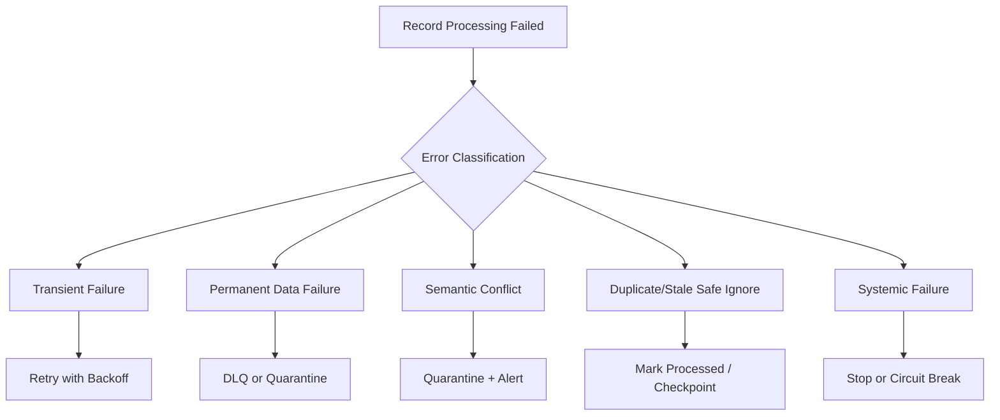
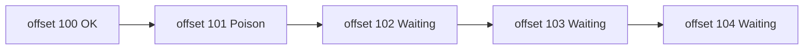
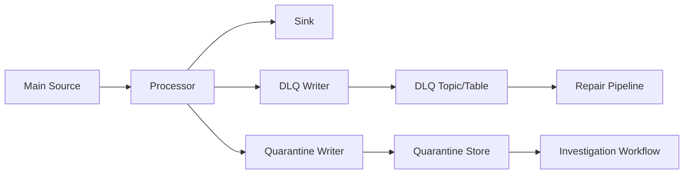
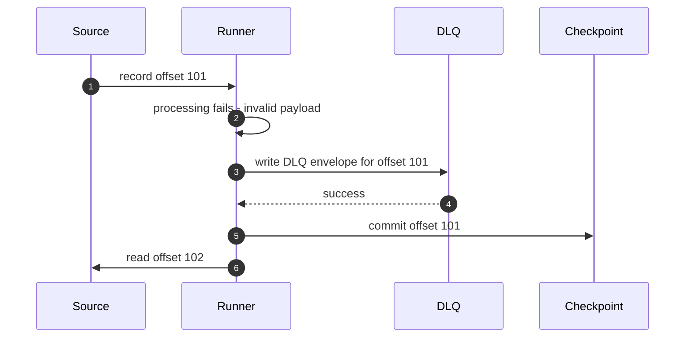
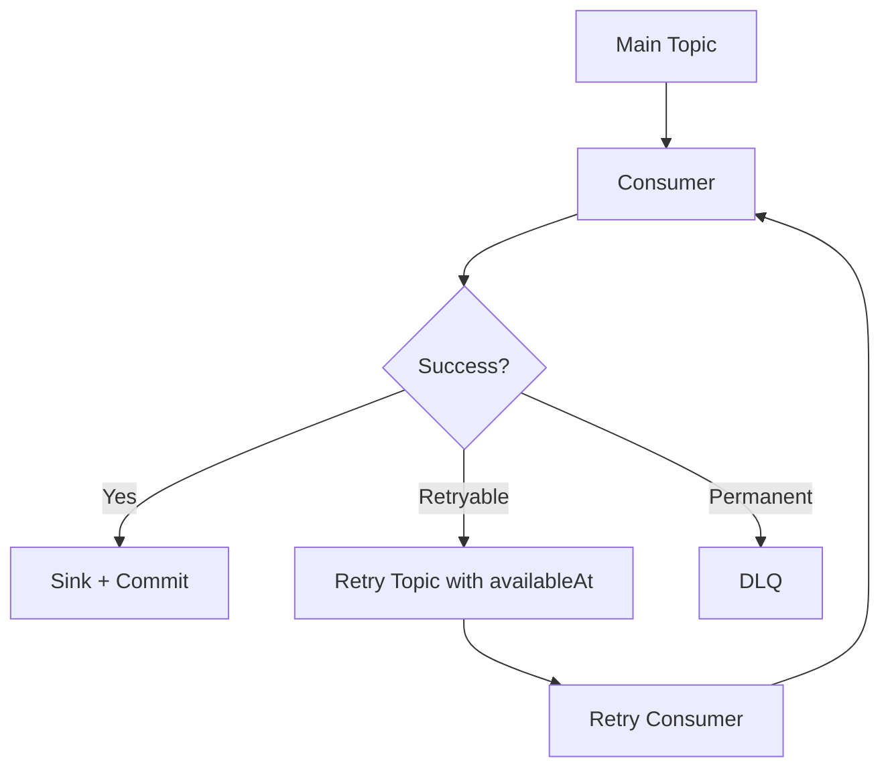
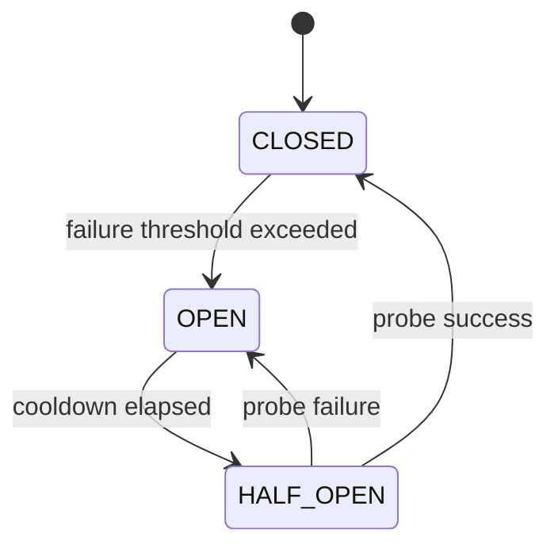
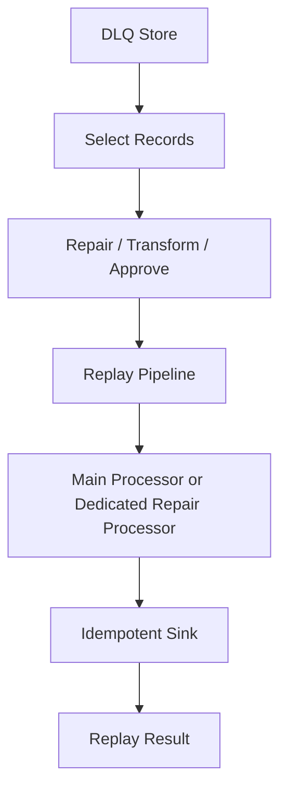
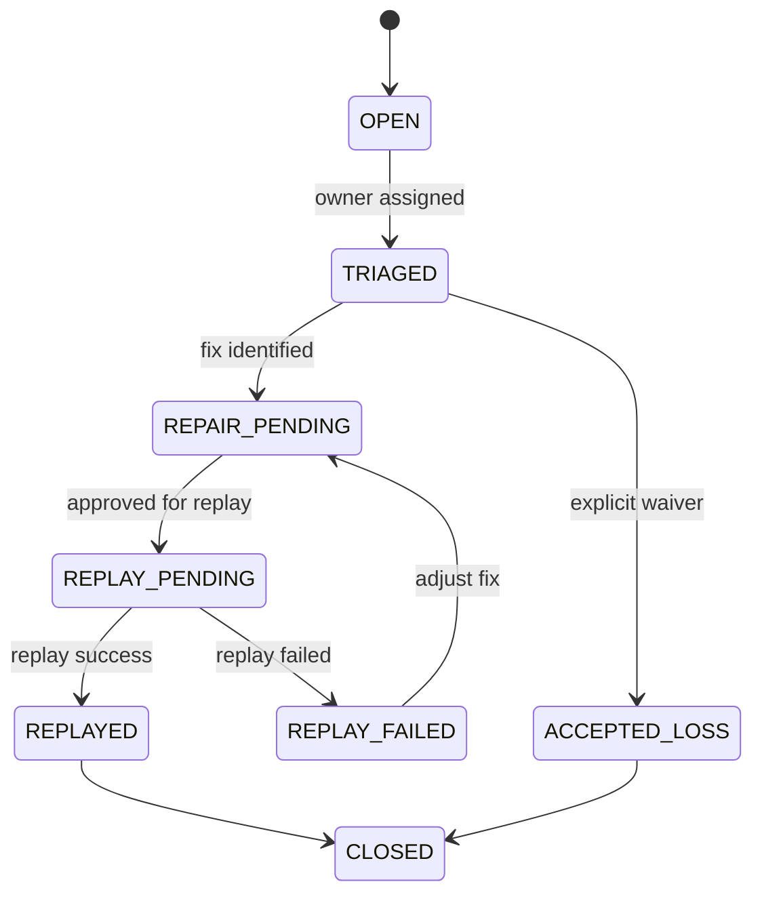
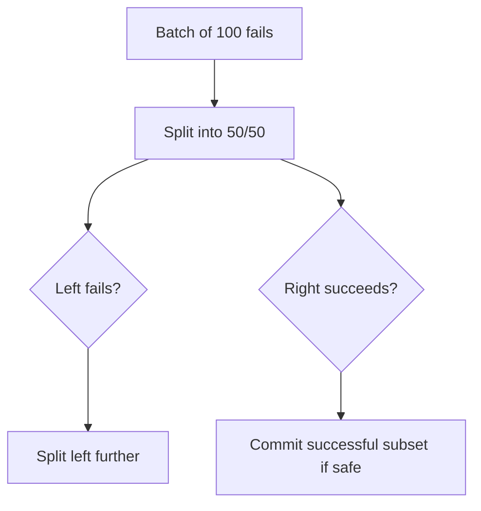

# Part 016 — Retry, DLQ, and Poison Records

Pipeline yang baik bukan pipeline yang tidak pernah error. Pipeline yang baik adalah pipeline yang tahu error mana yang harus dicoba ulang, error mana yang harus dihentikan, error mana yang harus dikarantina, dan error mana yang menandakan bug sistemik.

Dalam production, error tidak homogen. Ada network timeout, schema mismatch, missing reference data, data corrupt, downstream outage, permission issue, duplicate, stale update, illegal state transition, dan bug transform. Jika semua diperlakukan sama, pipeline akan melakukan salah satu dari dua kegagalan ekstrem:

1. berhenti total karena satu record rusak;
2. terus berjalan sambil membuang data penting ke DLQ tanpa akuntabilitas.

Keduanya buruk.

Part ini membahas retry, DLQ, quarantine, poison record, dan non-blocking error lane dari first principles. Tujuannya agar pipeline Java yang kita bangun tidak hanya “bisa memproses happy path”, tetapi punya failure behavior yang eksplisit dan defensible.

---

## 1. Core Mental Model

Setiap record yang gagal diproses harus masuk ke salah satu kategori keputusan:

```txt
retry later
retry elsewhere
skip as safe duplicate/stale
quarantine for investigation
dead-letter for repair/replay
stop pipeline because invariant is broken
```

Error handling bukan `catch(Exception e)`. Error handling adalah routing decision.



Kualitas pipeline terlihat dari klasifikasi ini.

---

## 2. Why Naive Retry Breaks Systems

Retry terdengar sederhana:

```java
while (true) {
    try {
        process(record);
        break;
    } catch (Exception e) {
        Thread.sleep(1000);
    }
}
```

Ini buruk.

Masalah:

- satu poison record bisa memblokir partition selamanya,
- retry tanpa batas bisa menghajar downstream yang sedang sakit,
- retry cepat bisa menciptakan retry storm,
- semua error diperlakukan transient,
- tidak ada audit trail,
- tidak ada batas waktu,
- checkpoint tertahan,
- lag naik tanpa diagnosis jelas,
- pipeline terlihat “running” padahal tidak bergerak.

Retry yang benar harus punya:

- classification,
- bounded attempts,
- exponential backoff,
- jitter,
- retry budget,
- per-error policy,
- observability,
- escape hatch ke DLQ/quarantine,
- idempotent sink.

---

## 3. Error Taxonomy

Kita mulai dari taxonomy.

| Error Type | Contoh | Retry? | Checkpoint? | Target |
|---|---|---:|---:|---|
| Transient infrastructure | timeout, connection reset, broker unavailable | Ya | Tidak sebelum sukses | Retry lane |
| Downstream overload | 429, 503, pool exhausted | Ya, backoff/circuit breaker | Tidak sebelum sukses | Retry lane |
| Permanent data format | invalid JSON, missing required field | Tidak langsung | Bisa setelah DLQ write durable | DLQ |
| Schema incompatibility | unknown required field, incompatible version | Biasanya tidak | Tergantung policy | Quarantine |
| Semantic validation | illegal status transition, invalid amount | Tidak otomatis | Tergantung severity | Quarantine |
| Missing reference data | customer not found, mapping absent | Mungkin | Biasanya delay/retry limited | Retry then DLQ/quarantine |
| Duplicate | unique violation same payload | Tidak | Ya | Safe ignore |
| Stale update | version older than current | Tidak | Ya jika expected | Safe ignore |
| Bug in code | NullPointerException in transform | Tidak sebagai data retry | Tidak untuk semua jika systemic | Stop/circuit break |
| Poison record | record selalu gagal deterministik | Tidak setelah threshold | Ya setelah isolated | DLQ/quarantine |

Tidak ada satu policy global yang benar. Policy harus mengikuti semantic error.

---

## 4. Poison Record Definition

Poison record adalah record yang secara deterministik membuat pipeline gagal setiap kali diproses dengan kode dan dependency saat ini.

Contoh:

- payload tidak valid,
- schema version tidak didukung,
- value melanggar invariant,
- record memicu bug transform,
- reference data yang dibutuhkan tidak pernah ada,
- data terlalu besar untuk sink,
- timestamp di luar range yang diizinkan.

Poison record berbahaya karena pipeline berurutan per partition. Satu record bisa menahan semua record setelahnya.



Jika offset 101 tidak pernah selesai dan checkpoint tidak maju, lag tumbuh.

Poison record isolation berarti pipeline bisa memindahkan record bermasalah ke lane lain secara durable, lalu melanjutkan record berikutnya sesuai policy.

---

## 5. DLQ Is Not a Trash Can

DLQ, atau dead-letter queue, sering disalahgunakan sebagai tempat “buang error supaya pipeline hijau”. Itu anti-pattern.

DLQ yang benar adalah durable error stream untuk record yang tidak bisa diproses saat ini, lengkap dengan konteks cukup agar bisa dianalisis, diperbaiki, dan di-replay.

DLQ harus menjawab:

- record asli apa?
- source position mana?
- error apa?
- stage mana yang gagal?
- attempt ke berapa?
- pipeline version apa?
- schema version apa?
- tenant mana?
- trace/correlation ID apa?
- apakah retryable?
- apa remediation yang diharapkan?

Tanpa metadata ini, DLQ hanya kuburan data.

---

## 6. DLQ Envelope Design

Jangan hanya kirim exception message.

```java
public record DlqEnvelope<T>(
        String dlqId,
        String pipelineName,
        String pipelineVersion,
        String stageName,
        String tenantId,
        String originalTopic,
        Integer originalPartition,
        Long originalOffset,
        String originalKey,
        T originalPayload,
        Map<String, String> originalHeaders,
        String schemaName,
        String schemaVersion,
        String errorType,
        String errorCode,
        String errorMessage,
        String stackTraceHash,
        boolean retryable,
        int attemptCount,
        Instant firstFailedAt,
        Instant lastFailedAt,
        String remediationHint,
        String traceId,
        String correlationId
) {}
```

Field penting:

| Field | Alasan |
|---|---|
| `dlqId` | identity DLQ event itu sendiri |
| `originalTopic/partition/offset` | replay dan trace ke source |
| `originalKey` | partition/entity analysis |
| `originalPayload` | data yang perlu diperbaiki |
| `pipelineVersion` | tahu kode mana yang gagal |
| `stageName` | tahu transform/sink mana yang gagal |
| `errorType/errorCode` | grouping dan routing |
| `stackTraceHash` | dedupe error noisy |
| `attemptCount` | membedakan first failure vs exhausted retry |
| `remediationHint` | mempercepat recovery |
| `traceId/correlationId` | hubungkan ke observability |

Untuk data sensitif, payload di DLQ harus mengikuti policy PII. Kadang payload perlu dimasking, dienkripsi, atau hanya menyimpan pointer ke secure object storage.

---

## 7. Quarantine vs DLQ

DLQ dan quarantine sering dianggap sama, padahal berbeda.

### DLQ

DLQ cocok untuk record yang gagal diproses dan bisa direpair/replay.

Karakter:

- record-level,
- replay-oriented,
- sering disimpan sebagai Kafka topic/table,
- operator atau automated repair bisa memproses ulang,
- tidak selalu berarti data berbahaya.

### Quarantine

Quarantine cocok untuk data yang mencurigakan, sensitif, atau melanggar invariant sehingga tidak boleh bercampur dengan lane normal.

Karakter:

- investigation-oriented,
- stricter access control,
- mungkin butuh approval,
- sering terkait compliance/data quality/security,
- replay tidak otomatis.

Contoh:

| Kondisi | Target |
|---|---|
| JSON invalid | DLQ |
| Required field missing | DLQ atau quarantine tergantung criticality |
| PII muncul di field non-PII | Quarantine |
| Amount negatif untuk transaksi yang tidak boleh negatif | Quarantine |
| Unknown enum karena producer deploy lebih dulu | DLQ sementara |
| Illegal lifecycle transition pada enforcement case | Quarantine |
| External sink timeout | Retry, bukan DLQ langsung |

Quarantine adalah sinyal “jangan otomatis percaya data ini”.

---

## 8. Retry Policy Model in Java

Buat retry policy explicit.

```java
public record RetryPolicy(
        int maxAttempts,
        Duration initialDelay,
        Duration maxDelay,
        double multiplier,
        boolean jitterEnabled
) {
    public Duration delayForAttempt(int attempt) {
        if (attempt <= 1) {
            return Duration.ZERO;
        }

        double exponential = initialDelay.toMillis()
                * Math.pow(multiplier, attempt - 2);
        long capped = Math.min((long) exponential, maxDelay.toMillis());

        if (!jitterEnabled) {
            return Duration.ofMillis(capped);
        }

        long jitter = ThreadLocalRandom.current().nextLong(0, Math.max(1, capped / 2));
        return Duration.ofMillis((capped / 2) + jitter);
    }
}
```

Jitter mencegah banyak worker retry bersamaan pada waktu yang sama.

Policy contoh:

```java
public final class RetryPolicies {
    public static final RetryPolicy FAST_TRANSIENT = new RetryPolicy(
            5,
            Duration.ofMillis(200),
            Duration.ofSeconds(5),
            2.0,
            true
    );

    public static final RetryPolicy DOWNSTREAM_OUTAGE = new RetryPolicy(
            10,
            Duration.ofSeconds(1),
            Duration.ofMinutes(2),
            2.0,
            true
    );

    public static final RetryPolicy NO_RETRY = new RetryPolicy(
            1,
            Duration.ZERO,
            Duration.ZERO,
            1.0,
            false
    );
}
```

---

## 9. Error Classification in Java

Jangan classify berdasarkan string exception saja. Buat exception hierarchy atau error code.

```java
public sealed interface PipelineError permits TransientPipelineError,
                                             PermanentDataError,
                                             SemanticConflictError,
                                             DuplicateRecordError,
                                             StaleRecordError,
                                             SystemicPipelineError {
    String code();
    String message();
}

public record TransientPipelineError(
        String code,
        String message,
        Throwable cause
) implements PipelineError {}

public record PermanentDataError(
        String code,
        String message,
        Throwable cause
) implements PipelineError {}

public record SemanticConflictError(
        String code,
        String message,
        Throwable cause
) implements PipelineError {}

public record DuplicateRecordError(
        String code,
        String message
) implements PipelineError {}

public record StaleRecordError(
        String code,
        String message
) implements PipelineError {}

public record SystemicPipelineError(
        String code,
        String message,
        Throwable cause
) implements PipelineError {}
```

Classifier:

```java
public interface ErrorClassifier {
    PipelineError classify(Throwable throwable, ProcessingContext context);
}
```

Example:

```java
public final class DefaultErrorClassifier implements ErrorClassifier {
    @Override
    public PipelineError classify(Throwable t, ProcessingContext context) {
        if (t instanceof SQLTransientException) {
            return new TransientPipelineError("DB_TRANSIENT", t.getMessage(), t);
        }

        if (t instanceof SocketTimeoutException) {
            return new TransientPipelineError("NETWORK_TIMEOUT", t.getMessage(), t);
        }

        if (t instanceof InvalidPayloadException) {
            return new PermanentDataError("INVALID_PAYLOAD", t.getMessage(), t);
        }

        if (t instanceof IllegalStateTransitionException) {
            return new SemanticConflictError("ILLEGAL_TRANSITION", t.getMessage(), t);
        }

        if (t instanceof NullPointerException) {
            return new SystemicPipelineError("BUG_NPE", t.getMessage(), t);
        }

        return new SystemicPipelineError("UNKNOWN_SYSTEMIC", t.getMessage(), t);
    }
}
```

Default unknown error sebaiknya tidak dianggap transient. Unknown error sering berarti bug.

---

## 10. Error Decision Policy

Classifier mengubah exception menjadi error type. Decision policy menentukan tindakan.

```java
public enum ErrorAction {
    RETRY,
    WRITE_DLQ_AND_CONTINUE,
    WRITE_QUARANTINE_AND_CONTINUE,
    SAFE_IGNORE_AND_COMMIT,
    STOP_PIPELINE
}

public record ErrorDecision(
        ErrorAction action,
        RetryPolicy retryPolicy,
        String reason
) {}
```

Policy:

```java
public interface ErrorDecisionPolicy {
    ErrorDecision decide(PipelineError error, ProcessingContext context, int attempt);
}
```

Example:

```java
public final class DefaultErrorDecisionPolicy implements ErrorDecisionPolicy {
    @Override
    public ErrorDecision decide(PipelineError error, ProcessingContext context, int attempt) {
        return switch (error) {
            case TransientPipelineError ignored -> new ErrorDecision(
                    ErrorAction.RETRY,
                    RetryPolicies.DOWNSTREAM_OUTAGE,
                    "transient failure can be retried"
            );
            case PermanentDataError ignored -> new ErrorDecision(
                    ErrorAction.WRITE_DLQ_AND_CONTINUE,
                    RetryPolicies.NO_RETRY,
                    "permanent data error should be repaired separately"
            );
            case SemanticConflictError ignored -> new ErrorDecision(
                    ErrorAction.WRITE_QUARANTINE_AND_CONTINUE,
                    RetryPolicies.NO_RETRY,
                    "semantic conflict requires investigation"
            );
            case DuplicateRecordError ignored -> new ErrorDecision(
                    ErrorAction.SAFE_IGNORE_AND_COMMIT,
                    RetryPolicies.NO_RETRY,
                    "duplicate record is replay-safe"
            );
            case StaleRecordError ignored -> new ErrorDecision(
                    ErrorAction.SAFE_IGNORE_AND_COMMIT,
                    RetryPolicies.NO_RETRY,
                    "stale record should not block progress"
            );
            case SystemicPipelineError ignored -> new ErrorDecision(
                    ErrorAction.STOP_PIPELINE,
                    RetryPolicies.NO_RETRY,
                    "systemic failure should stop pipeline"
            );
        };
    }
}
```

Dengan struktur ini, error handling bisa diuji tanpa menjalankan pipeline penuh.

---

## 11. Non-Blocking Error Lane

Tujuan non-blocking error lane bukan mengabaikan error. Tujuannya memindahkan record bermasalah ke jalur durable lain sehingga main lane bisa terus memproses record yang sehat.



Namun non-blocking lane hanya aman jika:

- DLQ/quarantine write durable,
- checkpoint dilakukan setelah error record berhasil dipindahkan,
- record tidak hilang diam-diam,
- metrics dan alert tersedia,
- ada replay/remediation process.

Jika DLQ write gagal, main pipeline tidak boleh checkpoint record itu. Kalau checkpoint dilakukan sebelum DLQ durable, record hilang.

---

## 12. Correct Commit Order with DLQ

Untuk permanent data error:

```txt
read record
process fails deterministically
write DLQ envelope durably
commit source checkpoint
continue
```

Diagram:



Jika urutan dibalik:

```txt
commit checkpoint -> write DLQ
```

maka crash setelah checkpoint sebelum DLQ write menyebabkan data loss.

Prinsip:

> Every skipped record must be durably explained before its source position is committed.

---

## 13. Retry in the Same Thread vs Retry Topic

Ada dua strategi besar.

### 13.1 Inline Retry

Runner menunggu dan mencoba ulang record yang sama.

Cocok untuk:

- transient sangat singkat,
- low throughput,
- error jarang,
- ordering sangat penting.

Kelemahan:

- partition blocked,
- worker idle,
- lag meningkat,
- downstream outage bisa menahan semua processing.

### 13.2 Retry Topic / Retry Queue

Record gagal dipindah ke retry lane dengan delay.

Cocok untuk:

- downstream outage,
- high throughput,
- retry delay panjang,
- ingin main lane lanjut,
- ingin observability retry terpisah.

Kelemahan:

- ordering bisa berubah,
- perlu retry scheduler,
- perlu attempt metadata,
- perlu dedupe/idempotent sink.

Pattern:



---

## 14. Retry Envelope

Jika memakai retry topic/table, jangan publish payload asli saja.

```java
public record RetryEnvelope<T>(
        String retryId,
        String originalSource,
        String originalPartition,
        Long originalOffset,
        String originalKey,
        T payload,
        Map<String, String> headers,
        int attempt,
        int maxAttempts,
        Instant firstAttemptAt,
        Instant lastAttemptAt,
        Instant nextAttemptAt,
        String lastErrorCode,
        String lastErrorMessage,
        String traceId,
        String correlationId
) {}
```

`nextAttemptAt` memungkinkan delayed retry. Jika broker tidak mendukung delay native, retry consumer bisa membaca dan menunda/republish, atau retry disimpan di database table dengan scheduler.

---

## 15. Retry Budget

Retry budget membatasi total retry agar sistem tidak tenggelam.

Tanpa retry budget:

- downstream outage 5 menit,
- jutaan record gagal,
- semua worker retry agresif,
- downstream pulih lalu langsung dihantam backlog retry,
- outage berulang.

Retry budget bisa berupa:

- max attempts per record,
- max retry per minute per pipeline,
- max retry per tenant,
- max concurrent retry,
- max retry age,
- circuit breaker jika failure ratio tinggi.

Example:

```java
public interface RetryBudget {
    boolean tryAcquire(RetryBudgetKey key);
    void release(RetryBudgetKey key);
}

public record RetryBudgetKey(String pipeline, String targetSystem, String tenantId) {}
```

Jika budget habis:

- delay lebih lama,
- move to retry topic,
- open circuit,
- alert,
- stop target-specific processing.

---

## 16. Circuit Breaker for Downstream Sink

Retry per record tidak cukup jika sink sedang down. Kita butuh circuit breaker.

State:



Meaning:

| State | Behavior |
|---|---|
| CLOSED | normal processing |
| OPEN | fail fast / route to retry lane |
| HALF_OPEN | test limited traffic |

Java sketch:

```java
public enum CircuitState {
    CLOSED,
    OPEN,
    HALF_OPEN
}

public interface CircuitBreaker {
    boolean allowRequest();
    void recordSuccess();
    void recordFailure(Throwable t);
    CircuitState state();
}
```

Circuit breaker mencegah pipeline menghajar dependency yang sudah jelas sakit.

---

## 17. Blocking vs Skipping and Ordering Trade-Off

Ada tension besar:

- Jika block pada failed record, ordering terjaga tetapi pipeline bisa macet.
- Jika skip ke DLQ/retry lane, pipeline lanjut tetapi ordering bisa berubah.

Tidak ada jawaban universal.

Decision matrix:

| Use Case | Ordering Critical? | Recommended Behavior |
|---|---:|---|
| Account ledger | Sangat tinggi | Block/stop, jangan skip sembarangan |
| Case status projection with version guard | Medium | DLQ invalid, stale ignore, retry transient |
| Notification dispatch | Rendah-medium | Retry topic + idempotency key |
| Analytics fact ingestion | Rendah | DLQ bad record, continue |
| Regulatory audit event | Tinggi | DLQ only with strong alert and reconciliation |
| Dashboard aggregation | Medium | Contribution dedupe, DLQ invalid |

Untuk regulatory/enforcement system, beberapa record tidak boleh dilewati diam-diam. Tetapi “tidak boleh hilang” bukan berarti pipeline harus selalu block. Bisa saja record dikarantina dengan evidence trail dan alert severity tinggi.

---

## 18. DLQ Replay

DLQ tanpa replay mechanism belum selesai.

Replay flow:



Replay harus menjawab:

- replay record asli atau corrected payload?
- replay ke topic asal atau dedicated repair topic?
- apakah source offset asli dipakai?
- apakah idempotency key asli dipertahankan?
- apakah transform version lama atau baru dipakai?
- apakah side effects eksternal diaktifkan?
- apakah replay butuh approval?

Untuk sebagian besar pipeline, replay DLQ sebaiknya memakai dedicated repair/replay path, bukan publish diam-diam ke topic asal.

---

## 19. DLQ State Machine

DLQ record juga punya lifecycle.



`ACCEPTED_LOSS` harus sangat hati-hati. Dalam domain regulasi, accepted loss perlu approval dan reason.

Fields tambahan untuk DLQ management:

```sql
ALTER TABLE pipeline_dlq
ADD COLUMN status text NOT NULL DEFAULT 'OPEN',
ADD COLUMN owner text,
ADD COLUMN severity text NOT NULL DEFAULT 'MEDIUM',
ADD COLUMN remediation_notes text,
ADD COLUMN replayed_at timestamptz,
ADD COLUMN closed_at timestamptz,
ADD COLUMN closure_reason text;
```

---

## 20. Java Runner Error Handling Loop

Runner sederhana:

```java
public final class ResilientPipelineRunner<T, C extends SinkCommand> {
    private final Source<T> source;
    private final Processor<T, C> processor;
    private final IdempotentSink<C> sink;
    private final CheckpointStore checkpointStore;
    private final ErrorClassifier errorClassifier;
    private final ErrorDecisionPolicy decisionPolicy;
    private final DlqWriter<T> dlqWriter;
    private final QuarantineWriter<T> quarantineWriter;

    public void runOnce() throws Exception {
        SourceRecord<T> record = source.readNext();
        if (record == null) {
            return;
        }

        int attempt = 1;

        while (true) {
            try {
                C command = processor.process(record.payload(), record.context());
                SinkResult result = sink.write(command);
                handleSinkResult(result, record);
                checkpointStore.commit(record.position());
                return;
            } catch (Throwable throwable) {
                PipelineError error = errorClassifier.classify(throwable, record.context());
                ErrorDecision decision = decisionPolicy.decide(error, record.context(), attempt);

                switch (decision.action()) {
                    case RETRY -> {
                        if (attempt >= decision.retryPolicy().maxAttempts()) {
                            dlqWriter.write(DlqEnvelopeFactory.from(record, error, attempt));
                            checkpointStore.commit(record.position());
                            return;
                        }
                        sleep(decision.retryPolicy().delayForAttempt(attempt));
                        attempt++;
                    }
                    case WRITE_DLQ_AND_CONTINUE -> {
                        dlqWriter.write(DlqEnvelopeFactory.from(record, error, attempt));
                        checkpointStore.commit(record.position());
                        return;
                    }
                    case WRITE_QUARANTINE_AND_CONTINUE -> {
                        quarantineWriter.write(QuarantineEnvelopeFactory.from(record, error, attempt));
                        checkpointStore.commit(record.position());
                        return;
                    }
                    case SAFE_IGNORE_AND_COMMIT -> {
                        checkpointStore.commit(record.position());
                        return;
                    }
                    case STOP_PIPELINE -> throw new PipelineStoppedException(error.message(), throwable);
                }
            }
        }
    }

    private void handleSinkResult(SinkResult result, SourceRecord<T> record) {
        if (result instanceof SinkResult.Conflict conflict) {
            throw new IllegalStateException("sink conflict: " + conflict.reason());
        }
        if (result instanceof SinkResult.Failed failed) {
            throw new RuntimeException(failed.cause());
        }
    }

    private void sleep(Duration duration) throws InterruptedException {
        if (!duration.isZero()) {
            Thread.sleep(duration.toMillis());
        }
    }
}
```

Ini masih sederhana. Production runner seharusnya menambahkan:

- cooperative shutdown,
- circuit breaker,
- retry budget,
- metrics,
- structured logging,
- partition-aware handling,
- batch handling,
- async retry lane.

Namun struktur dasarnya sudah benar: classify, decide, act, commit only after durable outcome.

---

## 21. DLQ Writer Must Be Idempotent Too

DLQ writer sendiri harus idempotent.

Jika process gagal, lalu DLQ write berhasil, tapi runner crash sebelum checkpoint, record yang sama akan diproses ulang dan gagal lagi. DLQ envelope bisa ditulis lagi.

Gunakan DLQ key stabil:

```txt
dlq:{pipeline}:{source}:{partition}:{offset}:{stage}:{errorCode}
```

SQL:

```sql
CREATE TABLE pipeline_dlq (
  dlq_key text PRIMARY KEY,
  pipeline_name text NOT NULL,
  stage_name text NOT NULL,
  source_name text NOT NULL,
  source_partition text,
  source_offset text,
  original_key text,
  original_payload jsonb,
  error_code text NOT NULL,
  error_message text NOT NULL,
  attempt_count integer NOT NULL,
  first_failed_at timestamptz NOT NULL,
  last_failed_at timestamptz NOT NULL,
  status text NOT NULL
);
```

Upsert:

```sql
INSERT INTO pipeline_dlq (...)
VALUES (...)
ON CONFLICT (dlq_key)
DO UPDATE SET
  attempt_count = pipeline_dlq.attempt_count + 1,
  last_failed_at = EXCLUDED.last_failed_at,
  error_message = EXCLUDED.error_message;
```

DLQ duplicate bukan masalah jika key stabil.

---

## 22. Handling Large Payloads

DLQ topic/table dengan payload besar bisa mahal dan lambat.

Strategi:

1. simpan payload kecil langsung;
2. payload besar disimpan di object storage;
3. DLQ envelope menyimpan pointer, checksum, encryption info;
4. akses object storage dikontrol.

Example:

```java
public record PayloadReference(
        String storageType,
        String uri,
        String checksumSha256,
        long sizeBytes,
        boolean encrypted
) {}
```

Envelope bisa berisi salah satu:

```java
public sealed interface FailedPayload permits InlineFailedPayload,
                                               ReferencedFailedPayload {}

public record InlineFailedPayload(String json) implements FailedPayload {}

public record ReferencedFailedPayload(PayloadReference reference)
        implements FailedPayload {}
```

Jangan mengorbankan compliance demi debugging mudah.

---

## 23. Observability Metrics

Metrics minimum:

```txt
pipeline_records_processed_total{pipeline,stage}
pipeline_records_failed_total{pipeline,stage,error_code}
pipeline_records_retried_total{pipeline,stage,error_code}
pipeline_records_dlq_total{pipeline,stage,error_code}
pipeline_records_quarantined_total{pipeline,stage,error_code}
pipeline_retry_attempts_total{pipeline,target}
pipeline_retry_exhausted_total{pipeline,error_code}
pipeline_dlq_write_failed_total{pipeline}
pipeline_quarantine_write_failed_total{pipeline}
pipeline_poison_record_detected_total{pipeline,stage}
pipeline_error_lane_lag{pipeline,lane}
```

High-value ratios:

```txt
dlq_rate = dlq_count / processed_count
retry_success_rate = successful_after_retry / retried_count
quarantine_rate = quarantine_count / processed_count
poison_block_time = time blocked by same source position
```

Alert examples:

- DLQ rate > 0.1% for 10 minutes,
- quarantine count > 0 for high-risk domain,
- same error code spikes after deployment,
- retry exhausted increases,
- DLQ writer failure > 0,
- main lane lag grows while retry lane grows.

---

## 24. Structured Logging

Log error decision, not only stack trace.

```json
{
  "event": "pipeline_error_decision",
  "pipeline": "case-lifecycle-pipeline",
  "stage": "case-status-transform",
  "sourceTopic": "case.events",
  "partition": 3,
  "offset": 90122,
  "tenantId": "tenant-7",
  "errorCode": "ILLEGAL_TRANSITION",
  "errorType": "SemanticConflictError",
  "action": "WRITE_QUARANTINE_AND_CONTINUE",
  "attempt": 1,
  "traceId": "tr-abc",
  "correlationId": "case-42"
}
```

Log yang baik memungkinkan operator menjawab:

- record mana yang gagal?
- kenapa gagal?
- apa keputusan pipeline?
- apakah record hilang?
- bagaimana replay?

---

## 25. Testing Error Handling

### 25.1 Transient Failure Eventually Succeeds

```java
@Test
void transientSinkFailureIsRetriedThenCheckpointed() throws Exception {
    sink.failNextWrites(2, new SQLTransientException("temporary"));

    runner.runOnce();

    assertThat(sink.appliedCount()).isEqualTo(1);
    assertThat(dlq.count()).isZero();
    assertThat(checkpointStore.current()).isEqualTo(source.positionOfFirstRecord());
}
```

### 25.2 Permanent Data Error Goes to DLQ

```java
@Test
void invalidPayloadIsWrittenToDlqBeforeCheckpoint() throws Exception {
    source.addInvalidJsonAtOffset(101);

    runner.runOnce();

    assertThat(dlq.findByOffset(101)).isPresent();
    assertThat(checkpointStore.currentOffset()).isEqualTo(101);
}
```

### 25.3 DLQ Write Failure Must Not Checkpoint

```java
@Test
void dlqWriteFailurePreventsCheckpoint() throws Exception {
    source.addInvalidJsonAtOffset(101);
    dlq.failWrites(new RuntimeException("dlq down"));

    assertThatThrownBy(() -> runner.runOnce())
            .isInstanceOf(RuntimeException.class);

    assertThat(checkpointStore.currentOffset()).isLessThan(101);
}
```

### 25.4 Poison Record Does Not Block Forever

```java
@Test
void poisonRecordMovesToDlqAfterRetryExhausted() throws Exception {
    source.addPoisonRecordAtOffset(101);

    runner.runOnce();

    assertThat(dlq.findByOffset(101)).isPresent();
    assertThat(checkpointStore.currentOffset()).isEqualTo(101);
}
```

### 25.5 Systemic Bug Stops Pipeline

```java
@Test
void systemicBugStopsPipelineWithoutDlqCommit() {
    processor.throwBug(new NullPointerException("bug"));

    assertThatThrownBy(() -> runner.runOnce())
            .isInstanceOf(PipelineStoppedException.class);

    assertThat(dlq.count()).isZero();
    assertThat(checkpointStore.hasAdvanced()).isFalse();
}
```

Systemic bug tidak boleh disamarkan sebagai data problem.

---

## 26. Backoff Calculation Example

Misal policy:

```txt
initialDelay = 1s
multiplier = 2
maxDelay = 30s
maxAttempts = 6
```

Delay:

| Attempt | Delay Before Attempt |
|---:|---:|
| 1 | 0s |
| 2 | 1s |
| 3 | 2s |
| 4 | 4s |
| 5 | 8s |
| 6 | 16s |

Dengan jitter, nilai tidak persis sama agar worker tidak retry serempak.

---

## 27. Error Handling for Batch Processing

Batch memperumit error karena satu batch bisa mengandung record campuran.

Strategi:

### 27.1 Fail Whole Batch

Cocok jika batch harus atomic.

Kelemahan: satu poison record menahan semua record.

### 27.2 Split and Isolate

Jika batch gagal, pecah batch untuk menemukan record bermasalah.



### 27.3 Per-Record Result

Sink mengembalikan result per record. Ini paling jelas tetapi sink harus mendukung partial reporting.

Untuk pipeline correctness, jangan commit checkpoint melewati record yang belum punya durable outcome.

---

## 28. Kafka-Specific Considerations

Dalam Kafka consumer:

- offset commit adalah checkpoint,
- commit setelah sink/DLQ durable,
- poison record pada satu partition bisa menahan partition itu,
- `pause` partition bisa dipakai saat retry/backpressure,
- retry topic mengubah ordering,
- DLQ topic harus punya key dan header yang cukup.

Header DLQ/retry yang berguna:

```txt
x-original-topic
x-original-partition
x-original-offset
x-original-timestamp
x-error-code
x-error-type
x-attempt
x-pipeline-name
x-pipeline-version
x-trace-id
x-correlation-id
```

Untuk retry topic, jangan lupa bahwa publish ke retry topic juga side effect. Harus berhasil sebelum offset original commit.

---

## 29. Database Polling Considerations

Untuk source berbasis database polling:

- checkpoint biasanya high-watermark/cursor,
- jika record invalid dilewati, harus ada skip log/DLQ durable,
- jangan menaikkan cursor melewati invalid record tanpa evidence,
- jika ordering berdasarkan `updated_at`, hati-hati timestamp collision,
- gunakan tie-breaker seperti `(updated_at, id)`.

DLQ source position bisa berupa:

```json
{
  "source": "postgres.case_table",
  "cursor": {
    "updatedAt": "2026-07-04T08:10:00Z",
    "id": "CASE-42"
  }
}
```

---

## 30. File Ingestion Considerations

Untuk file pipeline:

- satu file bisa mengandung banyak bad rows,
- jangan reject seluruh file jika policy mengizinkan row-level DLQ,
- simpan `file_path`, `file_checksum`, `row_number`, `column_name`, `raw_value`,
- jika file-level invariant gagal, quarantine seluruh file,
- partial output harus bisa dibersihkan atau dibuat idempotent.

DLQ key:

```txt
file:{fileChecksum}:row:{rowNumber}:error:{errorCode}
```

Quarantine file jika:

- checksum mismatch,
- manifest tidak cocok,
- record count tidak sesuai,
- schema file salah,
- file berasal dari source tidak dikenal.

---

## 31. Security and Compliance Notes

Error lane sering mengandung data paling berbahaya karena berisi payload mentah yang gagal diproses.

Policy wajib:

- redact secrets dari error message,
- jangan log full payload sembarangan,
- encrypt DLQ/quarantine storage,
- restrict access,
- define retention,
- audit DLQ access,
- classify PII,
- mask field tertentu,
- avoid stack trace leaking credentials.

Contoh buruk:

```txt
errorMessage="failed login for user with password=secret123"
```

Sanitize sebelum DLQ/log.

---

## 32. Operational Runbook

Untuk setiap DLQ/quarantine spike, operator perlu runbook.

Minimal:

1. Identifikasi error code terbesar.
2. Bandingkan dengan deployment terakhir.
3. Cek apakah error terjadi pada tenant/source tertentu.
4. Cek apakah schema producer berubah.
5. Cek apakah reference data missing.
6. Ambil sample DLQ aman sesuai policy.
7. Tentukan: repair data, fix code, update schema, atau accept with approval.
8. Jalankan replay dengan run ID.
9. Verifikasi sink idempotent tidak membuat duplicate.
10. Tutup DLQ item dengan reason.

Tanpa runbook, DLQ akan menumpuk sampai tidak ada yang percaya pipeline.

---

## 33. Anti-Patterns

### 33.1 Catch All and Continue

```java
try {
    process(record);
} catch (Exception ignored) {
    checkpoint.commit(record.position());
}
```

Ini data loss.

### 33.2 Infinite Retry on Poison Record

Pipeline terlihat hidup tetapi offset tidak maju.

### 33.3 DLQ Without Replay

DLQ menjadi kuburan data.

### 33.4 DLQ Without Metadata

Tidak bisa diagnosis atau replay.

### 33.5 Treating All Exceptions as Transient

Bug transform akan di-retry sampai biaya membengkak.

### 33.6 Logging Payload with PII

Debug mudah, compliance rusak.

### 33.7 Checkpoint Before Error Lane Write

Record hilang jika crash di antara checkpoint dan DLQ write.

### 33.8 Retry Without Idempotent Sink

Retry bisa menggandakan side effect.

---

## 34. Production Checklist

Sebelum error handling pipeline dianggap siap:

1. Error taxonomy jelas.
2. Error classifier diuji.
3. Decision policy eksplisit.
4. Retry policy bounded.
5. Exponential backoff dan jitter tersedia.
6. Retry budget tersedia untuk dependency kritis.
7. Circuit breaker tersedia untuk sink/downstream.
8. DLQ envelope menyimpan original source position.
9. DLQ writer idempotent.
10. Quarantine dipisahkan dari DLQ biasa.
11. Checkpoint hanya setelah sink/DLQ/quarantine durable.
12. Poison record tidak memblokir selamanya kecuali domain memang menuntut stop.
13. Duplicate/stale safe-ignore dibedakan dari error.
14. Systemic bug menghentikan pipeline, bukan masuk DLQ diam-diam.
15. Replay DLQ punya prosedur.
16. DLQ lifecycle/status ada.
17. Payload sensitif diproteksi.
18. Metrics retry/DLQ/quarantine tersedia.
19. Alert berbasis rate dan severity tersedia.
20. Runbook operasi tersedia.

---

## 35. What You Should Internalize

Retry, DLQ, dan quarantine bukan add-on. Mereka adalah bagian dari correctness boundary.

Rule paling penting:

> A pipeline may skip a bad record only after it has durably recorded why, where, and how that record was skipped.

Rule kedua:

> Retry is only safe when the side effect is idempotent or the outcome can be reconciled.

Rule ketiga:

> DLQ is not success. DLQ is deferred responsibility.

Dengan Part 015 dan 016, fondasi mini pipeline kernel sekarang punya dua properti penting:

- write path aman terhadap duplicate/replay,
- error path tidak menyebabkan silent data loss.

---

## 36. Next Part

Part berikutnya memulai Phase 3: ingestion patterns. Kita akan membahas file ingestion secara production-grade: landing zone, atomic rename, manifest, checksum, partial file detection, row-level error handling, idempotent file processing, dan bagaimana menghindari bug klasik seperti membaca file yang belum selesai ditulis.
