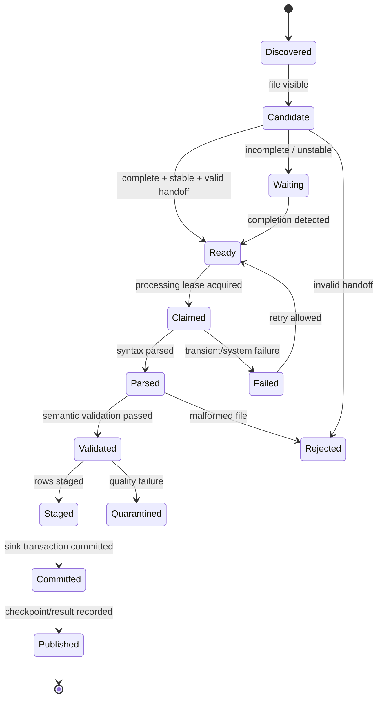
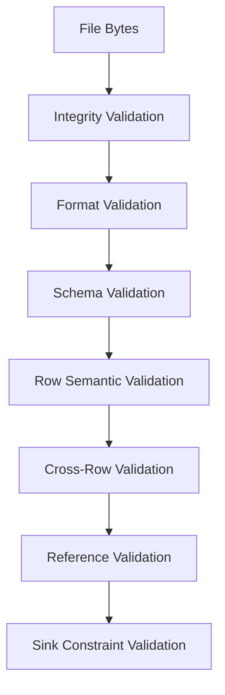
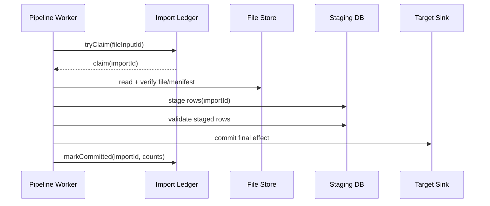

# Part 017 — File Ingestion Patterns

File ingestion terlihat sederhana sampai pipeline pertama kali membaca file setengah jadi, memproses file yang sama dua kali, gagal di tengah import, menerima file dengan delimiter berubah, atau kehilangan bukti kenapa angka laporan bulan lalu berubah.

File adalah interface data paling tua, tapi masih hidup di hampir semua enterprise system: regulator upload CSV, bank mengirim fixed-width file, vendor mengirim ZIP berisi XML, object storage menerima JSONL, lakehouse menyimpan Parquet, dan legacy platform melakukan nightly export. Justru karena file terasa “biasa”, banyak pipeline memperlakukannya sebagai hal ringan. Ini salah.

File ingestion production-grade bukan sekadar:

```txt
list files -> read file -> parse rows -> insert rows
```

Model yang benar:

```txt
producer handoff contract
-> arrival detection
-> completeness verification
-> identity + dedupe
-> parse + validate
-> stage
-> commit
-> publish observable result
-> retain evidence
```

Part ini membahas cara mendesain file ingestion di Java agar aman terhadap partial write, duplicate delivery, corrupted file, re-run, backfill, format drift, dan operational ambiguity.

---

## 1. Core Mental Model

File ingestion adalah **handoff protocol** antara producer dan consumer.

Jika tidak ada handoff protocol, consumer hanya menebak:

- apakah file sudah selesai ditulis;
- apakah semua part sudah datang;
- apakah file ini versi final atau revisi;
- apakah file ini pernah diproses;
- apakah file ini menggantikan file lama atau menambah data baru;
- apakah kegagalan parsing berarti file rusak, schema berubah, atau kode pipeline salah.

Karena itu, file ingestion harus didesain sebagai state machine.



The file is not “processed” when it is read. The file is processed only when its effect is committed and the processing result is durably recorded.

---

## 2. The Production File Ingestion Problem

A file pipeline must answer these questions explicitly.

| Concern | Question |
|---|---|
| Arrival | How do we know a file exists? |
| Completion | How do we know the producer has finished writing it? |
| Identity | What makes two files the same logical input? |
| Version | Can the producer send a corrected file? |
| Ordering | Are files independent or sequence-dependent? |
| Atomicity | Can the pipeline partially apply a file? |
| Replay | Can we process the same file again safely? |
| Rejection | What happens to bad files? |
| Evidence | Can we prove what was processed and when? |
| Retention | How long do we keep source, staged, rejected, and result files? |

If these answers are implicit, the pipeline is not production-ready.

---

## 3. File Handoff Patterns

### 3.1 Atomic Rename Pattern

Producer writes to a temporary name, then renames to the final name only after the file is complete.

```txt
incoming/customer_2026-07-04.csv.tmp
incoming/customer_2026-07-04.csv
```

Consumer only reads files matching final patterns.

```java
boolean isReadyName(Path path) {
    String name = path.getFileName().toString();
    return name.endsWith(".csv") && !name.endsWith(".tmp");
}
```

This is strong on local/distributed filesystems where rename is atomic within the same filesystem boundary. On object storage, rename is usually implemented as copy + delete, so do not blindly assume the same semantics.

Use this pattern when:

- producer and consumer share a filesystem with reliable rename semantics;
- file is single-object;
- producer can control output naming.

Avoid relying on it when:

- producer uploads directly to object storage through multipart upload;
- final object can appear before content is logically complete;
- producer cannot write temporary names.

### 3.2 Done Marker Pattern

Producer writes data file first, then writes a marker file after all data files are ready.

```txt
incoming/orders_2026-07-04_part_000.csv
incoming/orders_2026-07-04_part_001.csv
incoming/orders_2026-07-04.done
```

Consumer processes only when marker is present.

```java
record FileBatchId(String dataset, LocalDate businessDate) {}

boolean hasDoneMarker(FileBatchId batchId, FileSystemClient fs) {
    return fs.exists("incoming/%s_%s.done".formatted(
        batchId.dataset(),
        batchId.businessDate()
    ));
}
```

The `.done` marker should ideally contain metadata, not just be empty.

```json
{
  "dataset": "orders",
  "businessDate": "2026-07-04",
  "partCount": 2,
  "recordCount": 1500000,
  "contentHash": "sha256:...",
  "schemaVersion": "orders-file-v3",
  "createdAt": "2026-07-04T02:10:00Z"
}
```

This turns the marker into a lightweight manifest.

### 3.3 Manifest Pattern

Producer sends a manifest describing exactly what should be processed.

```txt
incoming/batch_8172/manifest.json
incoming/batch_8172/part-000.parquet
incoming/batch_8172/part-001.parquet
incoming/batch_8172/part-002.parquet
```

Example manifest:

```json
{
  "batchId": "vendor-x-2026-07-04-001",
  "dataset": "vendor_transactions",
  "schemaVersion": "vendor-transactions-v5",
  "businessDate": "2026-07-04",
  "files": [
    {
      "path": "part-000.parquet",
      "sizeBytes": 104857600,
      "sha256": "...",
      "recordCount": 500000
    },
    {
      "path": "part-001.parquet",
      "sizeBytes": 103120001,
      "sha256": "...",
      "recordCount": 499900
    }
  ],
  "totalRecordCount": 999900,
  "producer": "vendor-x-exporter",
  "createdAt": "2026-07-04T01:58:12Z"
}
```

Manifest pattern is the most defensible pattern for enterprise ingestion because it separates **file discovery** from **batch definition**.

Without manifest:

```txt
Consumer guesses which files belong together.
```

With manifest:

```txt
Producer declares which files belong together.
```

That one distinction prevents a large class of partial batch failures.

### 3.4 Directory Commit Pattern

Producer writes a batch into a unique directory and creates a `_SUCCESS` marker.

```txt
incoming/orders/date=2026-07-04/run=20260704T020000/
  part-000.parquet
  part-001.parquet
  _SUCCESS
```

This is common in data lake and Spark-style outputs. The consumer treats the directory as a dataset snapshot or partition batch.

The key design issue is whether the directory means:

1. **append** these records;
2. **replace** this partition;
3. **merge/upsert** these records;
4. **correct** a previous batch.

That mode must be explicit.

```json
{
  "writeMode": "REPLACE_PARTITION",
  "partition": {"businessDate": "2026-07-04"}
}
```

Never infer write mode from directory naming alone.

---

## 4. Partial File Detection

A common bug: pipeline sees a file while producer is still writing.

Naive logic:

```java
Files.list(incomingDir)
    .filter(path -> path.toString().endsWith(".csv"))
    .forEach(this::process);
```

This is unsafe.

Better options:

1. use manifest/done marker;
2. use atomic rename if semantics are reliable;
3. wait for file stability;
4. verify declared size/hash;
5. use producer-side completion event.

### 4.1 Stability Window

A stability window checks that size and last modified time remain unchanged for a configured period.

```java
record FileObservation(long sizeBytes, Instant modifiedAt, Instant observedAt) {}

boolean isStable(FileObservation first, FileObservation second, Duration requiredWindow) {
    return first.sizeBytes() == second.sizeBytes()
        && first.modifiedAt().equals(second.modifiedAt())
        && Duration.between(first.observedAt(), second.observedAt()).compareTo(requiredWindow) >= 0;
}
```

This is a fallback, not a strong contract. It reduces risk but does not prove producer completion.

Use it only when you cannot change producer behavior.

### 4.2 Size and Hash Verification

If manifest declares size/hash, verify before parse.

```java
record ExpectedFile(String path, long sizeBytes, String sha256) {}
record ActualFile(long sizeBytes, String sha256) {}

void verifyFile(ExpectedFile expected, ActualFile actual) {
    if (expected.sizeBytes() != actual.sizeBytes()) {
        throw new FileIntegrityException("size mismatch: " + expected.path());
    }
    if (!expected.sha256().equals(actual.sha256())) {
        throw new FileIntegrityException("sha256 mismatch: " + expected.path());
    }
}
```

Hash verification costs IO. Use it where correctness and defensibility matter more than raw speed.

---

## 5. File Identity and Idempotency

The pipeline needs a stable file identity.

Bad identity:

```txt
/path/to/file.csv
```

Path alone is weak because producers may overwrite files or send corrected files with the same name.

Better identity:

```txt
dataset + producer + logicalBatchId + contentHash + schemaVersion
```

Example Java model:

```java
record FileInputId(
    String dataset,
    String producer,
    String logicalBatchId,
    String contentHash,
    String schemaVersion
) {}
```

The identity should answer:

- is this the same physical file? Use content hash.
- is this the same logical batch? Use logical batch ID.
- is this a corrected version? Use revision/version.
- is this compatible with the expected parser? Use schema version.

### 5.1 Import Ledger

Use an import ledger to make file processing idempotent and auditable.

```sql
CREATE TABLE file_import_ledger (
    import_id          UUID PRIMARY KEY,
    dataset            TEXT NOT NULL,
    producer           TEXT NOT NULL,
    logical_batch_id   TEXT NOT NULL,
    content_hash       TEXT NOT NULL,
    schema_version     TEXT NOT NULL,
    status             TEXT NOT NULL,
    discovered_at      TIMESTAMPTZ NOT NULL,
    claimed_at         TIMESTAMPTZ,
    committed_at       TIMESTAMPTZ,
    rejected_at        TIMESTAMPTZ,
    record_count       BIGINT,
    rejected_count     BIGINT,
    error_code         TEXT,
    error_message      TEXT,
    UNIQUE (dataset, producer, logical_batch_id, content_hash)
);
```

This table is not merely metadata. It is a correctness primitive.

It prevents:

- duplicate file import;
- unknown processing state;
- silent overwrite;
- impossible audit reconstruction.

### 5.2 Claim Before Processing

Multiple workers may discover the same file. Use a claim operation.

```java
interface FileImportLedger {
    Optional<ImportClaim> tryClaim(FileInputId inputId, Instant now);
    void markCommitted(UUID importId, ImportResult result);
    void markRejected(UUID importId, RejectionReason reason);
    void markFailed(UUID importId, FailureReason reason);
}
```

The `tryClaim` implementation must be atomic. In SQL, use a unique constraint and compare/update status transition.

```sql
UPDATE file_import_ledger
SET status = 'CLAIMED', claimed_at = now()
WHERE import_id = :import_id
  AND status IN ('DISCOVERED', 'FAILED_RETRYABLE')
RETURNING *;
```

Never rely on in-memory locks for distributed ingestion.

---

## 6. Processing Modes

A file is not self-explanatory. The same file shape can mean different write semantics.

| Mode | Meaning | Sink Strategy |
|---|---|---|
| Append | Add new facts | append-only with dedupe |
| Replace file | Replace prior import output | delete by import ID then insert |
| Replace partition | Replace business partition | transactional partition swap |
| Upsert | Merge by business key | idempotent upsert |
| Correction | Correct prior facts | versioned correction event |
| Snapshot | Full state at time T | snapshot table or compacted view |

Write mode belongs in contract/manifest, not in tribal knowledge.

```java
sealed interface FileWriteMode permits AppendOnly, ReplacePartition, UpsertByKey, CorrectionBatch {}

record AppendOnly() implements FileWriteMode {}
record ReplacePartition(String partitionKey, String partitionValue) implements FileWriteMode {}
record UpsertByKey(List<String> keyColumns) implements FileWriteMode {}
record CorrectionBatch(String correctedBatchId, String reason) implements FileWriteMode {}
```

---

## 7. Parsing Strategy

Parsing is not validation. Parsing converts bytes into structured records. Validation decides whether those records are acceptable.

```txt
bytes -> lexical parse -> structural parse -> semantic validation -> normalization -> sink command
```

Separate these stages.

```java
interface FileParser<T> {
    Stream<ParsedRow<T>> parse(InputStream input) throws ParseException;
}

record ParsedRow<T>(
    long rowNumber,
    T value,
    Map<String, String> rawColumns
) {}
```

Why include row number and raw columns?

Because when the row fails, the operator needs evidence:

```txt
File: vendor-x-2026-07-04.csv
Row: 192038
Column: amount
Raw value: "12O.00"
Error: AMOUNT_NOT_NUMERIC
```

Without row-level evidence, DLQ is expensive to repair.

### 7.1 CSV Is a Protocol, Not a Toy Format

CSV failure modes:

- delimiter changes;
- quote escaping changes;
- header order changes;
- extra columns appear;
- empty string vs null ambiguity;
- locale-specific number format;
- timezone missing;
- newline inside quoted field;
- duplicate header names;
- encoding changes.

Production parser config should be explicit.

```java
record CsvFileContract(
    Charset charset,
    char delimiter,
    char quote,
    boolean hasHeader,
    List<String> expectedColumns,
    NullPolicy nullPolicy,
    DuplicateColumnPolicy duplicateColumnPolicy
) {}
```

### 7.2 JSONL Pattern

JSONL is good for event-like records because each line is independently parseable.

Advantages:

- row-level failure isolation;
- append-friendly;
- streaming parser friendly;
- easy DLQ by line.

Risks:

- schema drift hidden inside flexible JSON;
- nested optional fields become messy;
- large lines can break memory assumptions;
- duplicate keys may behave differently depending on parser.

### 7.3 Parquet/Avro Pattern

Columnar/binary formats improve efficiency and carry schema metadata. They are better for large analytical transfers, but operational repair can be harder than CSV/JSONL because humans cannot inspect them directly without tools.

Use them when:

- volume is high;
- schema is governed;
- producer and consumer are both engineering-owned;
- object storage/lakehouse is the target.

Keep manifests and import ledger regardless of format.

---

## 8. Validation Layers

Validation must be layered so failure handling is precise.



### 8.1 Integrity Validation

Checks whether file bytes match expectation:

- size;
- hash;
- part count;
- manifest completeness;
- compression validity.

### 8.2 Format Validation

Checks whether bytes can be parsed:

- valid CSV quoting;
- valid JSON;
- valid ZIP;
- valid Parquet footer;
- expected encoding.

### 8.3 Schema Validation

Checks structural shape:

- required columns;
- field types;
- schema version;
- additional column policy.

### 8.4 Row Semantic Validation

Checks business constraints:

- amount must be non-negative;
- status must be known;
- effective date must be valid;
- country code must be ISO-compatible;
- case ID must match expected pattern.

### 8.5 Cross-Row Validation

Checks file-level consistency:

- no duplicate row business key;
- header count matches actual count;
- total amount matches trailer;
- sequence numbers are continuous.

### 8.6 Reference Validation

Checks external references:

- account exists;
- customer exists;
- product code valid;
- jurisdiction known.

Be careful: reference validation can turn file ingestion into a slow, fragile distributed join. Cache or stage before resolving if needed.

---

## 9. Row-Level Rejection vs File-Level Rejection

Not every bad row should reject the whole file. But not every bad row can be safely skipped.

| Error | Suggested Handling |
|---|---|
| Manifest hash mismatch | Reject file |
| Missing required column | Reject file |
| One row has invalid optional field | Reject row or quarantine row |
| Duplicate key within file | Usually reject file or quarantine batch |
| Trailer count mismatch | Reject file |
| Unknown reference data | Quarantine row or file depending on contract |
| Schema version unsupported | Reject file |
| Too many bad rows | Reject file |

Define a rejection policy.

```java
record RejectionPolicy(
    boolean allowRowRejection,
    int maxRejectedRows,
    double maxRejectedRatio,
    Set<String> fileFatalErrorCodes
) {}
```

Then enforce it deterministically.

```java
boolean shouldRejectFile(ValidationSummary summary, RejectionPolicy policy) {
    if (!Collections.disjoint(summary.errorCodes(), policy.fileFatalErrorCodes())) {
        return true;
    }
    if (summary.rejectedRows() > policy.maxRejectedRows()) {
        return true;
    }
    return summary.rejectedRatio() > policy.maxRejectedRatio();
}
```

This avoids arbitrary operator decisions after the fact.

---

## 10. Staging Before Commit

For non-trivial files, do not write directly to final tables. Stage first.

```txt
source file
-> parse
-> validate
-> staging table keyed by import_id
-> reconciliation
-> final commit
-> ledger update
```

Example staging schema:

```sql
CREATE TABLE stage_vendor_transaction (
    import_id       UUID NOT NULL,
    row_number      BIGINT NOT NULL,
    business_key    TEXT NOT NULL,
    payload         JSONB NOT NULL,
    row_hash        TEXT NOT NULL,
    validation_state TEXT NOT NULL,
    created_at      TIMESTAMPTZ NOT NULL,
    PRIMARY KEY (import_id, row_number)
);
```

Final commit can then be atomic at batch level.

```sql
INSERT INTO vendor_transaction_fact (
    business_key,
    amount,
    currency,
    event_time,
    source_import_id,
    source_row_number
)
SELECT
    payload->>'businessKey',
    (payload->>'amount')::numeric,
    payload->>'currency',
    (payload->>'eventTime')::timestamptz,
    import_id,
    row_number
FROM stage_vendor_transaction
WHERE import_id = :import_id
  AND validation_state = 'VALID'
ON CONFLICT (business_key) DO UPDATE
SET amount = EXCLUDED.amount,
    currency = EXCLUDED.currency,
    event_time = EXCLUDED.event_time,
    source_import_id = EXCLUDED.source_import_id,
    source_row_number = EXCLUDED.source_row_number;
```

For append-only facts, avoid destructive upsert unless the business semantics require it.

---

## 11. Commit Protocol

The safest sequence:

```txt
1. discover input
2. create ledger entry
3. claim ledger entry
4. verify input completeness
5. parse and stage
6. validate staged result
7. commit final effect transactionally
8. mark ledger committed
9. publish processing result
10. archive source/evidence
```

Mermaid view:



The dangerous gap is between final sink commit and ledger commit. If the process dies after sink commit but before ledger update, recovery may think the import did not complete.

Mitigations:

- make final sink idempotent by `import_id` or business key;
- make ledger update part of same transaction when sink is the same database;
- use reconciliation on recovery;
- record sink commit token;
- design `markCommitted` to be idempotent.

---

## 12. Object Storage Considerations

Object storage changes the mental model.

Files are objects, directories are prefixes, and rename is often not a primitive operation. Listing can be expensive. Multipart upload and lifecycle rules can affect visibility and retention. Therefore, prefer manifest-driven ingestion.

Recommended object storage layout:

```txt
landing/vendor-x/orders/batch_id=20260704-001/
  manifest.json
  data/part-000.parquet
  data/part-001.parquet
  data/part-002.parquet

archive/vendor-x/orders/batch_id=20260704-001/
  manifest.json
  data/...
  result.json

rejected/vendor-x/orders/batch_id=20260704-002/
  manifest.json
  reason.json
```

Do not depend on “folder exists” as a completion signal. A prefix is not a transaction.

---

## 13. Compression and Archive Files

ZIP/GZIP ingestion adds hidden failure modes.

| Format | Risk |
|---|---|
| gzip single file | no internal file index, sequential read |
| zip | zip bomb risk, unexpected nested paths, duplicate entries |
| tar | path traversal risk, large stream |
| encrypted archive | key rotation, decrypt failure, audit risk |

Defensive archive extraction:

```java
Path safeResolve(Path root, String entryName) {
    Path resolved = root.resolve(entryName).normalize();
    if (!resolved.startsWith(root)) {
        throw new SecurityException("Archive entry escapes target directory: " + entryName);
    }
    return resolved;
}
```

Always enforce:

- max total uncompressed size;
- max number of entries;
- allowed file extensions;
- safe path resolution;
- checksum if available.

---

## 14. Header and Trailer Pattern

Many enterprise flat files use header/trailer records.

```txt
HDR|vendor-x|2026-07-04|file-seq-000182
DTL|case-1|100.50|USD
DTL|case-2|75.00|USD
TRL|2|175.50
```

Header/trailer are not noise. They are contract evidence.

Validate:

- producer ID;
- business date;
- file sequence;
- row count;
- sum/control total;
- generated timestamp;
- schema version.

Java model:

```java
record FlatFileEnvelope<H, R, T>(
    H header,
    Stream<R> rows,
    T trailer
) {}
```

Do not discard trailer before reconciliation.

---

## 15. Ordering and Sequence Control

Some file feeds are independent. Others are sequence-dependent.

Examples:

- daily full snapshot: process latest complete snapshot;
- transaction delta: must process sequence 100 before 101;
- correction file: must apply after original batch;
- partition replacement: order matters per partition.

Represent sequence explicitly.

```java
record FileSequence(
    String feedName,
    long sequenceNumber,
    Optional<Long> previousSequenceNumber
) {}
```

Before claiming a file:

```java
boolean canProcess(FileSequence sequence, ImportLedger ledger) {
    return sequence.previousSequenceNumber()
        .map(prev -> ledger.isCommitted(sequence.feedName(), prev))
        .orElse(true);
}
```

If files are sequence-dependent, parallelism must respect the sequence boundary. You may still parallelize parsing inside one file, but not commit later sequence before earlier sequence.

---

## 16. Duplicate and Correction Handling

Duplicate file scenarios:

1. same path, same content;
2. different path, same content;
3. same logical batch ID, different content;
4. same business date, new revision;
5. same file resent after prior failure.

Define behavior.

| Scenario | Behavior |
|---|---|
| Same logical batch + same hash committed | Treat as duplicate no-op |
| Same logical batch + different hash, no revision | Reject or quarantine |
| Same logical batch + higher revision | Process as correction if allowed |
| Same content under different path | Treat as duplicate if identity includes hash |
| Same file after failed transient processing | Retry from ledger state |

Correction must not silently overwrite history unless the domain explicitly permits it.

```java
record FileRevision(
    String logicalBatchId,
    int revision,
    Optional<String> correctionReason
) {}
```

For regulatory or financial pipelines, keep both original and correction evidence.

---

## 17. Memory-Safe Processing

Do not load large files into memory.

Bad:

```java
List<String> lines = Files.readAllLines(path);
```

Better:

```java
try (Stream<String> lines = Files.lines(path, StandardCharsets.UTF_8)) {
    lines.forEach(this::processLine);
}
```

Even better for controlled batching:

```java
final int batchSize = 5_000;
List<RowCommand> batch = new ArrayList<>(batchSize);

try (BufferedReader reader = Files.newBufferedReader(path, StandardCharsets.UTF_8)) {
    String line;
    long rowNumber = 0;
    while ((line = reader.readLine()) != null) {
        rowNumber++;
        batch.add(parseLine(rowNumber, line));
        if (batch.size() == batchSize) {
            sink.writeBatch(batch);
            batch.clear();
        }
    }
}

if (!batch.isEmpty()) {
    sink.writeBatch(batch);
}
```

But note: writing batches directly to final sink can create partial file effects. Prefer staging unless final sink operation is idempotent and recoverable.

---

## 18. Parallel Parsing

Parallelism is useful but can break determinism.

Potential issues:

- row order changes;
- first error becomes non-deterministic;
- memory grows due to out-of-order buffers;
- cross-row validation becomes harder;
- commit order may no longer match input order.

Safe pattern:

```txt
split file into chunks
-> parse chunks in parallel
-> stage with row_number/chunk_id
-> validate cross-row in staging
-> commit deterministically
```

Do not parallelize by “multiple workers reading the same file” unless you have deterministic partitioning and coordination.

---

## 19. File Watcher vs Poller vs Event Notification

| Discovery Method | Strength | Weakness |
|---|---|---|
| Filesystem watcher | low latency | platform-specific, event loss risk |
| Polling | simple, reliable enough | latency and listing cost |
| Object storage event | scalable | duplicate/missing event handling needed |
| Manifest registry | strongest contract | requires producer integration |

Even if using event notification, keep reconciliation polling.

Why?

Events can be duplicated, delayed, or misconfigured. The source of truth should be storage + ledger, not notification alone.

```txt
notification tells you where to look
ledger tells you what you processed
storage tells you what exists
manifest tells you what should exist
```

---

## 20. Java Architecture

Recommended components:

```txt
FileDiscovery
FileReadinessPolicy
ManifestReader
FileIntegrityVerifier
ImportLedger
FileParser
RowValidator
StagingWriter
Committer
ResultPublisher
ArchiveManager
```

### 20.1 Interfaces

```java
interface FileDiscovery {
    List<FileCandidate> discover();
}

interface FileReadinessPolicy {
    ReadinessResult evaluate(FileCandidate candidate);
}

interface ManifestReader {
    FileManifest read(FileCandidate candidate);
}

interface FileIntegrityVerifier {
    void verify(FileManifest manifest);
}

interface StagingWriter<T> {
    void stage(UUID importId, Stream<ParsedRow<T>> rows);
}

interface FileCommitter {
    CommitResult commit(UUID importId);
}
```

Keep these separate. Do not bury discovery, parsing, validation, and commit in one `FileProcessor` class.

### 20.2 Application Service

```java
final class FileIngestionService<T> {
    private final FileDiscovery discovery;
    private final FileReadinessPolicy readinessPolicy;
    private final ManifestReader manifestReader;
    private final FileIntegrityVerifier integrityVerifier;
    private final ImportLedger ledger;
    private final FileParser<T> parser;
    private final RowValidator<T> validator;
    private final StagingWriter<T> stagingWriter;
    private final FileCommitter committer;

    void runOnce() {
        for (FileCandidate candidate : discovery.discover()) {
            processCandidate(candidate);
        }
    }

    private void processCandidate(FileCandidate candidate) {
        ReadinessResult readiness = readinessPolicy.evaluate(candidate);
        if (!readiness.ready()) {
            return;
        }

        FileManifest manifest = manifestReader.read(candidate);
        FileInputId inputId = manifest.inputId();

        ledger.tryClaim(inputId, Instant.now()).ifPresent(claim -> {
            try {
                integrityVerifier.verify(manifest);
                Stream<ParsedRow<T>> parsed = parser.parse(manifest.openInputStream());
                Stream<ParsedRow<T>> validRows = parsed.map(row -> validator.validate(row));
                stagingWriter.stage(claim.importId(), validRows);
                CommitResult result = committer.commit(claim.importId());
                ledger.markCommitted(claim.importId(), result);
            } catch (FileRejectedException e) {
                ledger.markRejected(claim.importId(), e.reason());
            } catch (Exception e) {
                ledger.markFailed(claim.importId(), FailureReason.from(e));
                throw e;
            }
        });
    }
}
```

This is not final production code, but it shows the intended separation of responsibilities.

---

## 21. Observability

File ingestion metrics should include:

| Metric | Why It Matters |
|---|---|
| discovered files | source activity |
| ready files | handoff health |
| claimed files | worker activity |
| committed files | success throughput |
| rejected files | producer/contract health |
| duplicate files | upstream resend/noise |
| rows parsed | volume |
| rows rejected | data quality |
| parse duration | performance |
| validation duration | semantic complexity |
| stage duration | DB/storage pressure |
| commit duration | sink health |
| file age at commit | freshness |
| backlog by dataset | SLA risk |

Log with stable identifiers:

```json
{
  "event": "file_import_committed",
  "importId": "...",
  "dataset": "vendor_transactions",
  "logicalBatchId": "vendor-x-2026-07-04-001",
  "contentHash": "sha256:...",
  "recordCount": 999900,
  "rejectedCount": 12,
  "durationMs": 184200
}
```

Never log sensitive row payload by default.

---

## 22. Security and Safety

File ingestion is an attack surface.

Risks:

- malicious archive path traversal;
- zip bomb;
- formula injection in CSV if files are later opened in spreadsheets;
- PII leakage through logs;
- unauthorized file drop;
- schema spoofing;
- object overwrite;
- poisoned data causing downstream behavior.

Controls:

- authenticate producer identity;
- restrict write locations;
- verify manifest signature for high-trust pipelines;
- encrypt at rest and in transit;
- validate file size limits;
- sanitize archive entries;
- classify data before logging or publishing;
- separate landing, staging, archive, rejected zones;
- use immutable archive where audit matters.

---

## 23. Common Anti-Patterns

### Anti-Pattern 1 — Processing Files Directly from Incoming Directory

```txt
incoming/file.csv -> final table
```

No ledger. No staging. No proof. No safe replay.

### Anti-Pattern 2 — Filename as the Only Contract

```txt
orders_20260704.csv
```

A filename is useful metadata. It is not enough for correctness.

### Anti-Pattern 3 — Empty `_SUCCESS` Without Counts

An empty marker says “something finished”, but not what finished. Prefer manifest with counts and hashes.

### Anti-Pattern 4 — One Bad Row Stops All Historical Backfill

If row-level rejection is allowed, implement it. If it is not allowed, reject file deliberately with clear reason. Do not let accidental parser behavior decide.

### Anti-Pattern 5 — Silent Correction Overwrite

If a file changes a previous result, record the correction. Silent replacement destroys auditability.

### Anti-Pattern 6 — No Replay Story

Every production file pipeline should be able to answer:

```txt
Can we reprocess this file safely?
What will happen if we do?
How do we prove it?
```

---

## 24. Testing Strategy

Test file ingestion with scenario fixtures.

| Scenario | Expected Result |
|---|---|
| valid file | committed |
| same file twice | second is no-op |
| same logical batch different hash | rejected/quarantined |
| missing done marker | not processed |
| manifest missing part | waiting or rejected |
| hash mismatch | rejected |
| malformed row | row/file rejected per policy |
| invalid trailer count | rejected |
| crash after staging | recover safely |
| crash after final commit | ledger reconciles/idempotent no duplicate |
| parallel worker discovery | only one claim succeeds |
| corrected revision | handled by correction policy |

Example test idea:

```java
@Test
void sameFileProcessedTwiceShouldNotDuplicateFinalRows() {
    FileManifest manifest = fixtures.validManifest("batch-001");

    ingestion.process(manifest);
    ingestion.process(manifest);

    assertThat(finalTable.countByBatch("batch-001")).isEqualTo(1000);
    assertThat(ledger.status(manifest.inputId())).isEqualTo("COMMITTED");
}
```

---

## 25. Production Checklist

Before calling a file pipeline production-ready, verify:

- [ ] producer handoff protocol is explicit;
- [ ] file completion detection is reliable;
- [ ] manifest or equivalent metadata exists for multi-file batches;
- [ ] file identity is stable and includes logical ID + content identity;
- [ ] import ledger exists;
- [ ] claim operation is atomic;
- [ ] duplicate handling is deterministic;
- [ ] correction handling is explicit;
- [ ] parser config is versioned;
- [ ] row/file rejection policy is explicit;
- [ ] staging is used for non-trivial files;
- [ ] final commit is idempotent or transactional;
- [ ] source and result evidence are retained;
- [ ] replay behavior is documented and tested;
- [ ] metrics show freshness, backlog, row counts, rejection counts;
- [ ] sensitive data is not leaked through logs or DLQ;
- [ ] operational runbook exists.

---

## 26. Key Takeaways

File ingestion is not a low-level utility. It is a contract-driven integration boundary.

The best mental model:

```txt
A file is a batch-shaped message.
A manifest is its envelope.
An import ledger is its processing memory.
A staging area is its transaction buffer.
A commit protocol is its correctness boundary.
```

If you remember only one thing: **never let file visibility mean file readiness**.

In the next part, we move to API ingestion. The difficulty shifts from partial files to cursor correctness, pagination drift, rate limits, retry budgets, and freshness SLAs.
