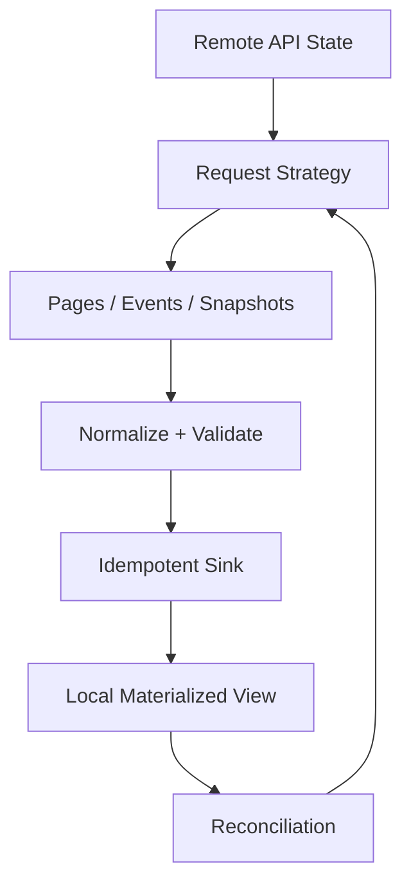
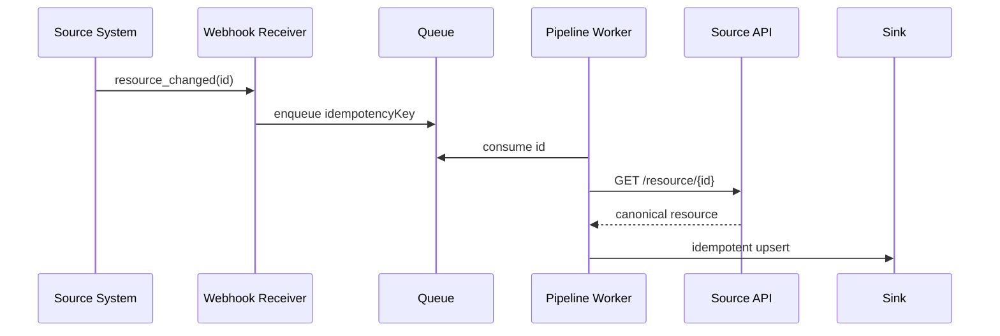
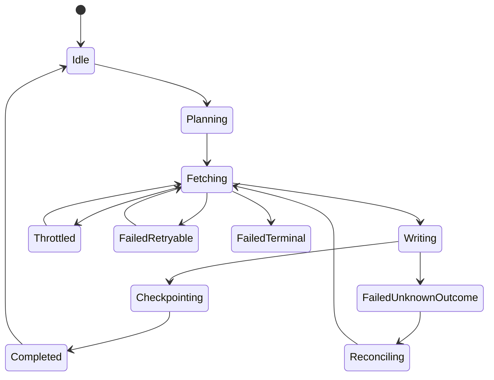
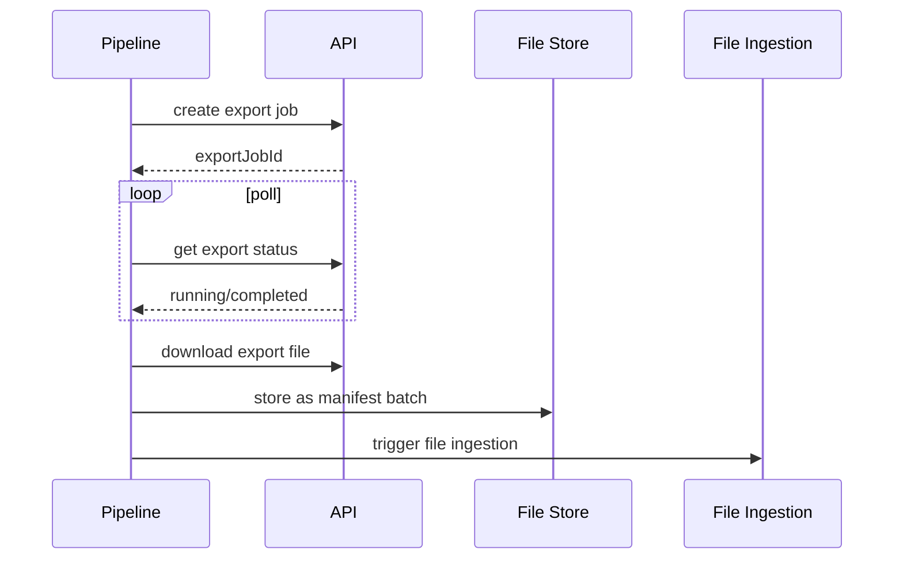

# Part 018 — API Ingestion Patterns

API ingestion looks safer than file ingestion because the source is interactive: you call an endpoint, receive JSON, parse it, and store it. In practice, API ingestion is often more deceptive.

An API can paginate inconsistently, return partial results during concurrent updates, throttle you, expire tokens mid-run, omit deleted records, change response shape, return stale cache data, or make it impossible to know whether your last successful request was fully applied downstream.

Naive API ingestion:

```txt
GET /items?page=1
GET /items?page=2
GET /items?page=3
insert all responses
```

Production-grade API ingestion:

```txt
sync plan
-> request contract
-> cursor/checkpoint
-> rate-limit control
-> retry budget
-> response validation
-> dedupe/upsert
-> deletion/correction handling
-> freshness measurement
-> reconciliation
-> audit trail
```

This part focuses on building API ingestion patterns in Java that survive real external systems.

---

## 1. Core Mental Model

API ingestion is **remote-state synchronization under uncertainty**.

You do not own the source database. You usually do not own its transaction boundaries. You may not know exactly how its pagination behaves under mutation. You may not know whether `updated_since` is inclusive or exclusive. You may not know whether deletions are represented.

So the core question is not:

```txt
How do I call the API?
```

The real question is:

```txt
How do I converge my local materialized view toward the remote source while bounding loss, duplication, staleness, and operational cost?
```

API ingestion is a convergence problem.



---

## 2. API Ingestion Taxonomy

Different API styles require different ingestion strategies.

| API Style | Example | Best Strategy |
|---|---|---|
| Full list API | `GET /customers` | snapshot sync + diff |
| Offset pagination | `?offset=100&limit=50` | usable for stable datasets only |
| Page-number pagination | `?page=3` | fragile under mutation |
| Cursor pagination | `?cursor=abc` | preferred for incremental traversal |
| Updated-since API | `?updated_since=timestamp` | incremental sync with overlap window |
| Event API | `GET /events` | append log ingestion |
| Webhook | HTTP callback | push ingestion + reconciliation poller |
| Export job API | create export, poll status, download file | async job + file ingestion hybrid |
| GraphQL connection | edges/pageInfo/endCursor | cursor pattern with shape control |

Do not start by writing a client. Start by identifying which synchronization model the API supports.

---

## 3. Request Contract

Every API ingestion job needs a request contract.

```java
record ApiRequestContract(
    URI endpoint,
    HttpMethod method,
    Map<String, String> requiredHeaders,
    PaginationMode paginationMode,
    ConsistencyModel consistencyModel,
    RateLimitPolicy rateLimitPolicy,
    RetryPolicy retryPolicy,
    Duration freshnessTarget
) {}
```

The contract should define:

- authentication method;
- pagination semantics;
- cursor semantics;
- sorting guarantee;
- filtering semantics;
- timestamp precision;
- rate limit behavior;
- retryable status codes;
- response schema version;
- deletion representation;
- maximum page size;
- freshness target;
- idempotency behavior for write-like ingestion calls.

If you cannot write this contract, you do not understand the API enough to ingest it safely.

---

## 4. Pagination Patterns

### 4.1 Offset Pagination

```txt
GET /orders?offset=0&limit=100
GET /orders?offset=100&limit=100
GET /orders?offset=200&limit=100
```

Offset pagination is easy but fragile if the dataset changes while you paginate.

Suppose records are sorted newest first:

```txt
Request 1 returns rows 1..100
A new row is inserted at position 1
Request 2 offset=100 now starts at old row 100
```

You may duplicate or skip records.

Use offset pagination only when:

- the dataset is stable during sync;
- the API provides snapshot isolation;
- you use a deterministic sort by immutable key;
- duplicates/skips are mitigated by overlap and dedupe.

### 4.2 Page Number Pagination

```txt
GET /orders?page=1&page_size=100
GET /orders?page=2&page_size=100
```

This has similar risk to offset pagination. It is acceptable for administrative backfills or small stable reference data, but risky for high-change operational data.

### 4.3 Cursor Pagination

```txt
GET /orders?limit=100
GET /orders?cursor=eyJvZmZzZXQiOjEwMH0=&limit=100
```

Cursor pagination is preferred because the server controls traversal state. But it is not automatically correct. You still need to know:

- is cursor stable across mutations?
- does cursor expire?
- is cursor tied to request filters?
- can cursor be reused after failure?
- is final cursor a checkpoint or only next-page token?

Java model:

```java
record Page<T>(
    List<T> items,
    Optional<String> nextCursor,
    boolean hasMore,
    ResponseMetadata metadata
) {}

interface CursorApiClient<T> {
    Page<T> fetch(Optional<String> cursor, int limit);
}
```

Processing loop:

```java
Optional<String> cursor = checkpointStore.loadCursor(feedName);

while (true) {
    Page<OrderDto> page = client.fetch(cursor, 500);
    List<OrderEvent> events = page.items().stream()
        .map(normalizer::normalize)
        .toList();

    sink.writeBatch(events);

    if (page.nextCursor().isPresent()) {
        checkpointStore.saveCursor(feedName, page.nextCursor().get());
        cursor = page.nextCursor();
    } else {
        break;
    }
}
```

This loop is still unsafe if `sink.writeBatch` is not idempotent. If crash happens after sink write and before checkpoint save, the page will be replayed. The sink must tolerate that.

---

## 5. Cursor Checkpoint Semantics

A cursor can mean different things.

| Cursor Type | Meaning | Risk |
|---|---|---|
| Next-page token | Continue traversal | may expire |
| High-watermark ID | all IDs <= X seen | assumes monotonic IDs |
| Timestamp cursor | all updates <= T seen | precision/inclusivity issues |
| Event offset | append log position | strongest if stable |
| Snapshot token | server-side consistent view | may expire |

A checkpoint is not just “the last value we saw”. It is a promise:

```txt
All source changes up to checkpoint X have been durably and correctly reflected in the sink.
```

If that promise is false, recovery will lose data.

### 5.1 Inclusive vs Exclusive Cursor

This detail matters.

```txt
updated_since=2026-07-04T10:00:00Z
```

Does the API return records updated exactly at `10:00:00Z`?

If unknown, use overlap window + dedupe.

```java
Instant nextStart = lastSuccessfulHighWatermark.minus(Duration.ofMinutes(5));
```

This intentionally re-reads a small window.

Correctness comes from sink idempotency, not from assuming timestamp boundaries are perfect.

### 5.2 Timestamp Precision

If API stores microseconds but exposes seconds, multiple updates can collapse to the same timestamp.

Better checkpoint:

```txt
(updated_at, id)
```

Use deterministic ordering:

```txt
ORDER BY updated_at ASC, id ASC
```

Checkpoint:

```java
record TimestampIdCursor(Instant updatedAt, String id) {}
```

Query semantics:

```txt
WHERE updated_at > last_updated_at
   OR (updated_at = last_updated_at AND id > last_id)
ORDER BY updated_at, id
```

Many third-party APIs do not expose this perfectly. When they do not, use overlap + dedupe.

---

## 6. Incremental Sync Patterns

### 6.1 Full Snapshot Sync

Fetch entire source and replace or reconcile local state.

Use for:

- small reference datasets;
- nightly authoritative snapshots;
- APIs without incremental capability;
- periodic reconciliation.

Risk:

- expensive;
- slow;
- may overload source;
- deletion detection requires diff;
- large snapshot may be inconsistent if not server-side isolated.

### 6.2 Updated-Since Sync

Fetch records changed since last checkpoint.

```txt
GET /customers?updated_since=2026-07-04T00:00:00Z
```

Use overlap:

```txt
GET /customers?updated_since=last_checkpoint - overlap
```

Then dedupe/upsert by source ID + source updated version.

```java
record SourceVersion(String sourceId, Instant updatedAt, Optional<String> versionToken) {}
```

### 6.3 Event Log Sync

Some APIs expose append-only event endpoints.

```txt
GET /events?after=event_192001
```

This is often superior because it preserves change history.

But confirm:

- are events retained long enough?
- are event IDs strictly ordered?
- are events immutable?
- are deletes represented?
- can event stream be replayed?

### 6.4 Hybrid Poll + Webhook

Webhooks reduce latency but should not be the only ingestion mechanism.

```txt
webhook = low-latency notification
poller = correctness reconciliation
```

Webhook delivery can fail. The receiver can be down. The sender may retry. Events may arrive out of order.

Use webhook to enqueue candidate IDs, then fetch canonical resource by API.



Do not trust webhook payload as the final data unless the contract explicitly guarantees it.

---

## 7. Rate Limit Control

Rate limiting is not just sleeping after `429`. It is a control loop.

Inputs:

- documented quota;
- `429 Too Many Requests`;
- `Retry-After` header;
- latency increase;
- error rate;
- remaining quota headers;
- freshness backlog.

Java rate limiter interface:

```java
interface ApiRateLimiter {
    Permit acquire(String feedName) throws InterruptedException;
    void onSuccess(ApiResponseMetadata metadata);
    void onThrottle(ApiThrottleSignal signal);
    void onFailure(Throwable error);
}

record Permit(Instant acquiredAt) implements AutoCloseable {
    @Override public void close() {}
}
```

Usage:

```java
try (Permit ignored = rateLimiter.acquire("orders")) {
    ApiResponse response = client.execute(request);
    rateLimiter.onSuccess(response.metadata());
    return response;
} catch (TooManyRequestsException e) {
    rateLimiter.onThrottle(ApiThrottleSignal.from(e));
    throw e;
}
```

### 7.1 Respect Retry-After

If the API returns `Retry-After`, respect it unless there is a strong reason not to.

```java
Duration retryDelay(HttpResponse<?> response) {
    return response.headers()
        .firstValue("Retry-After")
        .map(this::parseRetryAfter)
        .orElse(Duration.ofSeconds(30));
}
```

### 7.2 Global vs Per-Feed Quota

A common mistake: each worker independently respects limit, but the fleet violates global quota.

```txt
10 workers * 100 req/min = 1000 req/min
API limit = 300 req/min
```

For shared quota, use distributed rate limiting or central scheduling.

Simpler alternative: shard API feeds intentionally and configure worker concurrency so aggregate rate stays below quota.

---

## 8. Retry Budget

Retry must be bounded.

Unbounded retry can:

- amplify outage;
- consume quota;
- delay other feeds;
- hide systemic failure;
- violate freshness SLO;
- generate duplicate writes if sink is unsafe.

Define retry budget:

```java
record RetryBudget(
    int maxAttemptsPerRequest,
    Duration maxElapsedTimePerPage,
    int maxConsecutiveFailedPages,
    Duration circuitOpenDuration
) {}
```

Retryable errors usually include:

- connection timeout;
- read timeout;
- 429 throttle;
- 500/502/503/504;
- transient DNS/network failure.

Usually non-retryable:

- 400 bad request;
- 401 invalid credentials until token refresh path runs;
- 403 permission denied;
- 404 for collection endpoint;
- schema parse error;
- semantic validation failure.

But context matters. A `404` for a resource fetched after webhook may mean the resource was deleted. That is not necessarily an error.

---

## 9. Authentication and Token Renewal

Long-running ingestion must handle token expiration.

Bad:

```java
String token = login();
while (true) {
    callApi(token);
}
```

Better:

```java
interface AccessTokenProvider {
    AccessToken currentToken();
    AccessToken refresh();
}

record AccessToken(String value, Instant expiresAt) {
    boolean expiresSoon(Clock clock) {
        return expiresAt.minus(Duration.ofMinutes(2)).isBefore(clock.instant());
    }
}
```

Client logic:

```java
AccessToken token = tokenProvider.currentToken();
if (token.expiresSoon(clock)) {
    token = tokenProvider.refresh();
}

HttpRequest request = baseRequest.header("Authorization", "Bearer " + token.value()).build();
```

If a request returns `401`, refresh once and retry if policy allows. Do not put `401` into generic infinite retry.

---

## 10. Response Validation

API responses need validation just like files.

Validation layers:

```txt
HTTP status validation
-> content type validation
-> response envelope validation
-> schema validation
-> item-level validation
-> pagination metadata validation
-> checkpoint monotonicity validation
```

Example response envelope:

```json
{
  "data": [
    {"id": "ord-1", "updatedAt": "2026-07-04T10:15:00Z"}
  ],
  "pageInfo": {
    "nextCursor": "abc",
    "hasMore": true
  }
}
```

Java model:

```java
record ApiEnvelope<T>(
    List<T> data,
    PageInfo pageInfo,
    ApiMeta meta
) {}

record PageInfo(Optional<String> nextCursor, boolean hasMore) {}
```

Validate invariants:

```java
void validatePage(ApiEnvelope<?> envelope) {
    if (envelope.pageInfo().hasMore() && envelope.pageInfo().nextCursor().isEmpty()) {
        throw new InvalidApiResponseException("hasMore=true but nextCursor missing");
    }
}
```

---

## 11. Idempotent Sink for API Records

API ingestion almost always needs replay. Therefore sink must be idempotent.

Recommended identity:

```txt
source_system + resource_type + resource_id + source_version
```

Java model:

```java
record ApiResourceIdentity(
    String sourceSystem,
    String resourceType,
    String resourceId
) {}

record ApiResourceVersion(
    ApiResourceIdentity identity,
    Instant updatedAt,
    Optional<String> etag,
    Optional<String> versionNumber
) {}
```

Sink rule:

```txt
Apply incoming resource only if it is newer than currently stored source version.
```

SQL sketch:

```sql
INSERT INTO customer_projection (
    source_system,
    customer_id,
    source_updated_at,
    payload,
    ingested_at
)
VALUES (:source_system, :customer_id, :source_updated_at, :payload, now())
ON CONFLICT (source_system, customer_id)
DO UPDATE SET
    source_updated_at = EXCLUDED.source_updated_at,
    payload = EXCLUDED.payload,
    ingested_at = EXCLUDED.ingested_at
WHERE customer_projection.source_updated_at <= EXCLUDED.source_updated_at;
```

If timestamps can tie, include version token or deterministic tie-breaker.

---

## 12. Deletion Handling

Deletion is one of the most commonly missed API ingestion concerns.

API may represent deletes as:

- hard delete, record disappears;
- soft delete field: `deleted=true`;
- separate deleted endpoint;
- tombstone event;
- webhook deletion event;
- not represented at all.

If deletes are not represented, incremental sync cannot fully maintain an accurate mirror. You need periodic full reconciliation or accept known incompleteness.

Model deletion explicitly:

```java
sealed interface ResourceChange permits ResourceUpsert, ResourceDelete {}

record ResourceUpsert(ApiResourceIdentity identity, JsonNode payload, ApiResourceVersion version)
    implements ResourceChange {}

record ResourceDelete(ApiResourceIdentity identity, Instant deletedAt, String reason)
    implements ResourceChange {}
```

Do not treat missing record as delete unless the API contract says that the queried snapshot is authoritative.

---

## 13. Freshness SLA

API ingestion is usually judged by freshness:

```txt
How long after source change appears does sink reflect it?
```

Metrics:

| Metric | Meaning |
|---|---|
| source lag | now - max(source_updated_at_ingested) |
| ingestion lag | ingested_at - source_updated_at |
| request latency | API health |
| pages per sync | workload |
| records per sync | volume |
| throttle count | quota pressure |
| cursor age | checkpoint staleness |
| failed sync count | reliability |
| backlog estimate | remaining work |

Freshness is not just schedule frequency.

A job running every minute but taking 45 minutes to catch up is not fresh.

```txt
freshness = source change time -> committed sink time
```

### 13.1 Freshness Budget

Break down freshness budget:

```txt
source availability delay
+ schedule delay
+ queue delay
+ API fetch time
+ transform time
+ sink commit time
+ downstream materialization time
```

If target freshness is 5 minutes, a source that exposes changes after 10 minutes can never meet it. The constraint is upstream.

---

## 14. Sync State Machine

Represent sync state explicitly.



Important distinction:

- failure before sink write: safe retry request/page;
- failure after sink write before checkpoint: replay page, sink must dedupe;
- failure after checkpoint before sink write: dangerous and should not happen.

Therefore commit order should be:

```txt
fetch page
-> write sink idempotently
-> save checkpoint
```

Never save checkpoint before durable sink write.

---

## 15. Sync Ledger

Like file ingestion has import ledger, API ingestion should have sync ledger.

```sql
CREATE TABLE api_sync_run (
    sync_run_id       UUID PRIMARY KEY,
    feed_name         TEXT NOT NULL,
    status            TEXT NOT NULL,
    started_at        TIMESTAMPTZ NOT NULL,
    completed_at      TIMESTAMPTZ,
    start_checkpoint  JSONB,
    end_checkpoint    JSONB,
    pages_fetched     BIGINT NOT NULL DEFAULT 0,
    records_fetched   BIGINT NOT NULL DEFAULT 0,
    records_written   BIGINT NOT NULL DEFAULT 0,
    throttle_count    BIGINT NOT NULL DEFAULT 0,
    error_code        TEXT,
    error_message     TEXT
);

CREATE TABLE api_feed_checkpoint (
    feed_name         TEXT PRIMARY KEY,
    checkpoint        JSONB NOT NULL,
    updated_at        TIMESTAMPTZ NOT NULL,
    sync_run_id       UUID NOT NULL
);
```

The sync ledger enables:

- operational visibility;
- replay analysis;
- freshness tracking;
- checkpoint debugging;
- audit evidence.

---

## 16. Java API Client Architecture

Separate transport from ingestion logic.

```txt
ApiTransport
-> AuthenticatedClient
-> TypedApiClient
-> PageFetcher
-> SyncPlanner
-> IngestionService
-> Sink
```

### 16.1 Transport Layer

```java
interface ApiTransport {
    HttpResponse<String> execute(HttpRequest request) throws IOException, InterruptedException;
}
```

### 16.2 Typed Client

```java
interface OrdersApiClient {
    Page<OrderDto> fetchOrders(OrderQuery query, Optional<String> cursor);
}

record OrderQuery(
    Instant updatedSince,
    int pageSize
) {}
```

### 16.3 Sync Service

```java
final class ApiIngestionService<T, C> {
    private final SyncPlanner<C> planner;
    private final PageFetcher<T, C> pageFetcher;
    private final ResourceNormalizer<T> normalizer;
    private final IdempotentSink<ResourceChange> sink;
    private final SyncLedger ledger;

    void runOnce(String feedName) {
        SyncRun run = ledger.startRun(feedName);
        C checkpoint = planner.initialCheckpoint(feedName);

        try {
            while (true) {
                Page<T> page = pageFetcher.fetch(checkpoint);

                List<ResourceChange> changes = page.items().stream()
                    .map(normalizer::normalize)
                    .toList();

                sink.writeBatch(changes);

                if (page.nextCheckpoint().isPresent()) {
                    checkpoint = page.nextCheckpoint().get();
                    ledger.saveCheckpoint(feedName, checkpoint, run.id());
                }

                ledger.recordPage(run.id(), page.items().size());

                if (!page.hasMore()) {
                    ledger.completeRun(run.id(), checkpoint);
                    return;
                }
            }
        } catch (Exception e) {
            ledger.failRun(run.id(), e);
            throw e;
        }
    }
}
```

Again, sink before checkpoint.

---

## 17. Handling API Drift

APIs drift.

Symptoms:

- new enum value;
- field changes type;
- field disappears;
- timestamp format changes;
- pagination envelope changes;
- response error body changes;
- undocumented throttle appears;
- sorting becomes unstable.

Defensive strategies:

- schema validation at boundary;
- tolerant reader for additive fields;
- strict validation for critical fields;
- unknown enum capture;
- raw response sampling for debugging;
- contract tests against sandbox/source fixtures;
- canary sync before full rollout;
- alert on parse error spike.

Do not let JSON flexibility become silent data corruption.

---

## 18. Snapshot + Incremental Reconciliation

A robust API pipeline often combines incremental sync with periodic reconciliation.

```txt
incremental sync every 5 minutes
full snapshot reconciliation every night
```

Incremental sync gives freshness. Snapshot reconciliation detects drift.

Reconciliation checks:

- count by status;
- max updated timestamp;
- sample record hash;
- missing IDs;
- stale local records;
- deleted records not represented by incremental API.

If full snapshot is expensive, reconcile by partition:

```txt
customers updated in last 7 days
orders by business date
cases by jurisdiction
accounts by ID hash bucket
```

---

## 19. Async Export APIs

Some APIs do not support direct large pagination. Instead:

```txt
POST /exports
GET /exports/{id}/status
GET /exports/{id}/download
```

This is an API + file ingestion hybrid.

Pattern:



Do not stream export directly into final sink if the file may need replay/audit. Store it as source evidence first.

---

## 20. GraphQL Ingestion

GraphQL is not automatically easier. It gives query flexibility, which can create unstable ingestion contracts.

Use stable persisted queries when possible.

Connection pattern:

```graphql
query Orders($after: String) {
  orders(first: 100, after: $after) {
    edges {
      cursor
      node {
        id
        updatedAt
        status
      }
    }
    pageInfo {
      hasNextPage
      endCursor
    }
  }
}
```

Rules:

- checkpoint `endCursor` only after sink write;
- avoid changing selected fields without versioning normalizer;
- validate `hasNextPage`/`endCursor` consistency;
- beware nested pagination inside nodes;
- cap query complexity.

---

## 21. Multi-Tenant API Ingestion

Many SaaS APIs are tenant-scoped.

Design checkpoint per tenant.

```sql
CREATE TABLE api_tenant_checkpoint (
    feed_name       TEXT NOT NULL,
    tenant_id       TEXT NOT NULL,
    checkpoint      JSONB NOT NULL,
    updated_at      TIMESTAMPTZ NOT NULL,
    PRIMARY KEY (feed_name, tenant_id)
);
```

Avoid one slow tenant blocking all tenants.

```txt
tenant A throttled -> tenant A delayed
tenant B still progresses
```

But respect global quota if all tenants share the same API quota.

---

## 22. Backfill Strategy

Backfill is not just “set updated_since to 2020”.

Questions:

- Does API retain old data?
- Does API sort deterministically?
- Will backfill consume all quota?
- Can backfill run separately from incremental sync?
- How do we prevent old data overwriting newer data?
- Can we pause/resume backfill?

Recommended separation:

```txt
incremental feed checkpoint
backfill job checkpoint
```

Backfill writes with same idempotent sink rules. Newer source version must win over older backfill result.

```sql
WHERE target.source_updated_at <= EXCLUDED.source_updated_at
```

---

## 23. Operational Runbook

A production API ingestion runbook should answer:

- API is returning 429. Which feeds are throttled?
- Token refresh is failing. Who owns credentials?
- Cursor is stuck. What was the last successful checkpoint?
- Parse errors spiked. Which field changed?
- Freshness SLA breached. Is bottleneck source, quota, transform, or sink?
- Webhooks stopped. Is reconciliation poller still running?
- Backfill is consuming quota. How to throttle it?
- A bad sync wrote wrong data. How to replay from checkpoint/window?

Expose these as dashboards and operational commands, not tribal knowledge.

---

## 24. Common Anti-Patterns

### Anti-Pattern 1 — Saving Cursor Before Sink Commit

This creates data loss on crash.

```txt
save cursor -> crash before sink write -> skipped page forever
```

### Anti-Pattern 2 — Trusting Offset Pagination on Mutable Data

Offset pagination over changing datasets can skip or duplicate records. Use cursor, deterministic sort, snapshot token, or overlap + dedupe.

### Anti-Pattern 3 — No Deletion Story

If deleted records vanish from the API and you only ingest updated records, your local view will accumulate ghosts.

### Anti-Pattern 4 — Treating Webhook as Source of Truth

Webhook is usually notification, not durable source. Fetch canonical resource.

### Anti-Pattern 5 — Infinite Retry on Quota Error

You can spend all quota retrying failed pages and starve healthy feeds.

### Anti-Pattern 6 — One Global Checkpoint for Multi-Tenant Data

One bad tenant can block everyone. Track per tenant or per shard.

---

## 25. Testing Strategy

API ingestion tests should simulate source behavior, not just mock happy responses.

| Scenario | Expected Behavior |
|---|---|
| page fetched twice after crash | no duplicate sink effect |
| 429 with Retry-After | pauses according to policy |
| token expires mid-run | refreshes once and resumes |
| cursor missing while hasMore true | rejects response |
| updated_since boundary duplicate | dedupe handles overlap |
| out-of-order updates | newer version wins |
| deleted resource event | tombstone applied |
| webhook duplicate | one effective sink write |
| page-number mutation | reconciliation detects drift |
| source schema adds field | tolerant reader continues |
| critical field removed | parse/contract alert |

Example fake API test:

```java
@Test
void crashAfterSinkBeforeCheckpointShouldReplayPageWithoutDuplicateEffect() {
    fakeApi.addPage("cursor-1", List.of(order("o-1", "2026-07-04T10:00:00Z")), "cursor-2");

    ingestion.runUntilAfterSinkWriteThenCrash();
    ingestion.runOnce();

    assertThat(orderProjection.countById("o-1")).isEqualTo(1);
    assertThat(checkpointStore.cursor("orders")).isEqualTo("cursor-2");
}
```

---

## 26. Production Checklist

Before shipping API ingestion:

- [ ] pagination semantics are understood;
- [ ] checkpoint meaning is documented;
- [ ] checkpoint is saved only after sink commit;
- [ ] sink is idempotent under page replay;
- [ ] overlap window exists for timestamp-based sync if boundary is uncertain;
- [ ] deletion handling is explicit;
- [ ] rate limit policy exists;
- [ ] retry budget exists;
- [ ] token renewal is tested;
- [ ] response envelope is validated;
- [ ] parse errors are observable;
- [ ] freshness is measured from source update time to sink commit time;
- [ ] sync ledger exists;
- [ ] backfill checkpoint is separate from incremental checkpoint;
- [ ] webhook path has reconciliation poller;
- [ ] runbook exists for throttling, stuck cursor, parse drift, and replay.

---

## 27. Key Takeaways

API ingestion is not about HTTP calls. It is about synchronizing remote state safely.

The best mental model:

```txt
An API page is a replayable batch.
A cursor is a correctness boundary.
A checkpoint is a promise about committed sink state.
A rate limit is a shared resource.
A webhook is a hint, not proof.
A full snapshot is reconciliation evidence.
```

If you remember only one rule: **write idempotently before advancing the cursor**.

In the next part, we move to database ingestion: full load, incremental load, high-watermarks, snapshot isolation, and the traps of reading mutable tables without a real consistency model.
