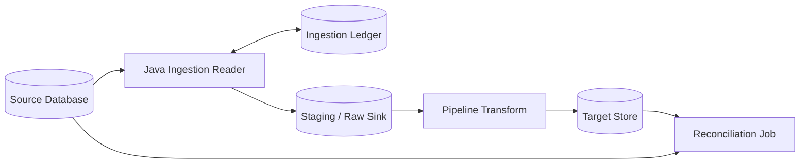
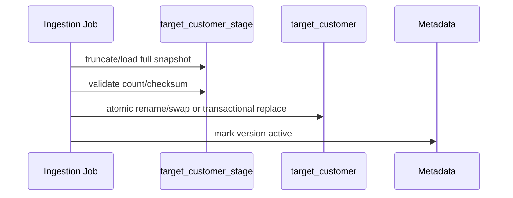
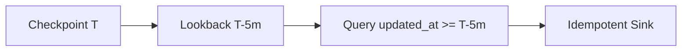
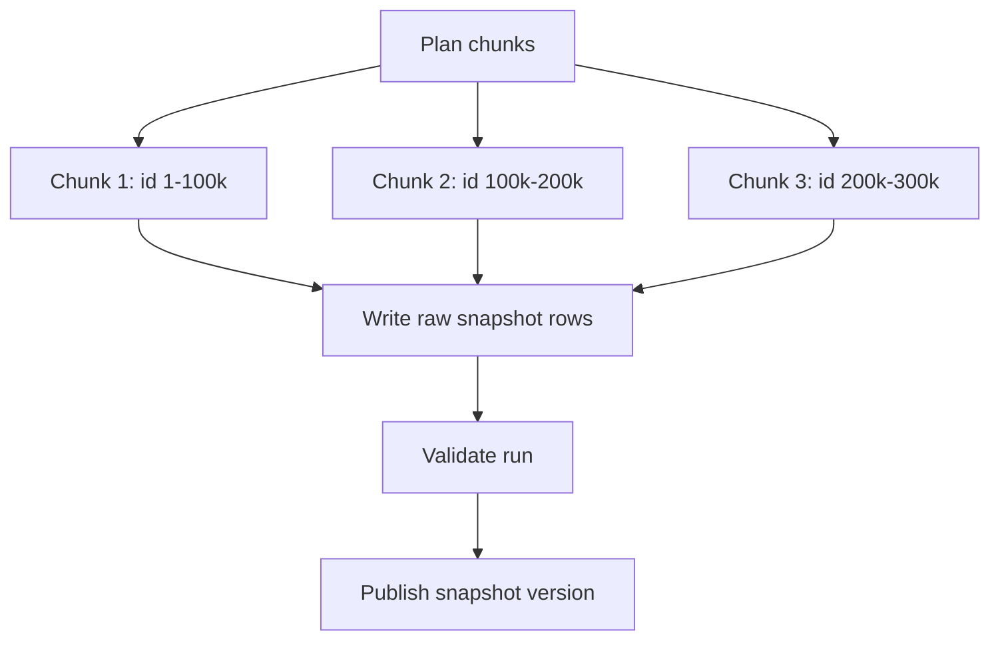
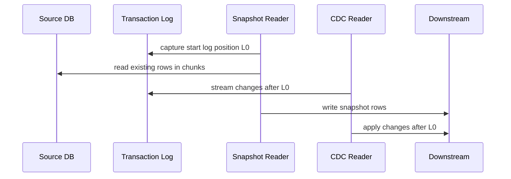
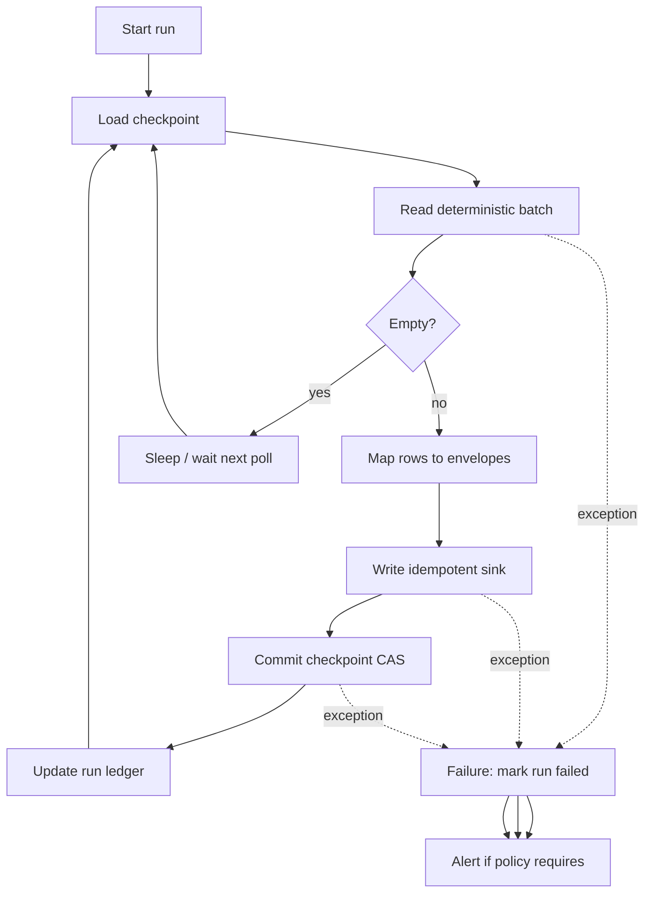

# Part 019 — Database Ingestion Patterns

Database ingestion looks simple until it is placed under real production constraints.

The naive mental model is:

> "Run `SELECT * FROM table`, transform rows, write them somewhere else."

The production mental model is:

> "Extract a consistent, replayable, observable, bounded-impact view of mutable transactional state, while the source database keeps changing, without corrupting downstream state, overloading the source, losing deletes, or making future correction impossible."

That second sentence is the topic of this part.

We are not discussing database basics. We are designing ingestion from a database into a pipeline using Java with enough rigor that the result can survive high data volume, schema evolution, partial failures, source load constraints, and audit requirements.

---

## 1. What Database Ingestion Actually Means

A database table is not a file.

A file is often a fixed artifact. A database table is an actively mutating state container. While your pipeline reads page 1, page 500 may already be different. While you are exporting row 10, another transaction may update row 9. If your query uses `LIMIT/OFFSET`, inserted rows can shift pages. If you use `updated_at`, clock behavior and application bugs can hide changes. If you run a long transaction, you can affect vacuum, undo retention, replication, or source health.

A database ingestion pipeline must answer these questions:

1. **What exact rows are in scope?**
2. **At what logical time are they observed?**
3. **How are inserts, updates, and deletes represented?**
4. **How is progress checkpointed?**
5. **How is replay handled?**
6. **How is source impact bounded?**
7. **How is downstream correctness verified?**

A production ingestion design starts by classifying the extraction mode.

---

## 2. Database Ingestion Taxonomy

There are several common modes.

| Mode | Description | Good For | Dangerous When |
|---|---|---|---|
| Full load | Read entire table or query result each run | Small dimensions, bootstrap, periodic reconciliation | Large tables, mutable data, low-latency needs |
| Incremental high-watermark | Read rows where cursor column advanced | Append-like or update-tracked tables | Deletes, clock skew, non-monotonic cursor |
| Snapshot chunking | Read table in chunks using primary key/range | Large initial loads | Concurrent updates unless snapshot boundary is defined |
| CDC | Read database transaction log/change stream | Low-latency change propagation | Misconfigured log retention, schema drift, transaction ordering |
| Hybrid snapshot + CDC | Snapshot existing rows then continue from log | Bootstrapping live systems | Snapshot/log handoff correctness |
| Query materialization | Ingest result of join/aggregation query | Reporting extract, denormalized views | Non-deterministic query, expensive source load |
| Application outbox | Read event rows written by application transaction | Domain events, dual-write avoidance | Outbox cleanup and publisher semantics |
| Change table polling | Poll application-maintained change table | Simpler than log CDC | Requires application discipline |

This part focuses on **full load**, **incremental load**, and **snapshot chunking**. CDC is introduced here but receives a full mental model in Part 020.

---

## 3. The Core Invariant

The database ingestion invariant is:

> For any committed source state that should be represented downstream, the pipeline must either represent it exactly according to its contract or produce a detectable, recoverable exception.

This is stricter than "the job succeeded."

A job can succeed while silently skipping rows. A job can succeed while reading a mixed snapshot. A job can succeed while duplicating rows into an append-only sink. A job can succeed while missing deletes forever.

The production question is not:

> "Did the SQL query run?"

It is:

> "Can we explain which committed source facts are represented downstream, under which observation boundary, with what recovery path if the run fails?"

---

## 4. The Basic Architecture



The important piece is the **ingestion ledger**. A production pipeline should not only move data. It should record what it believes it moved.

A minimal ingestion ledger tracks:

| Field | Purpose |
|---|---|
| `run_id` | Unique ingestion attempt |
| `source_system` | Source identity |
| `source_table_or_query` | Extraction unit |
| `mode` | Full, incremental, chunked snapshot, CDC bootstrap |
| `started_at` / `finished_at` | Operational trace |
| `status` | Running, succeeded, failed, cancelled |
| `checkpoint_before` | Cursor before run |
| `checkpoint_after` | Cursor after successful commit |
| `row_count_read` | Extracted rows |
| `row_count_written` | Rows accepted by sink |
| `checksum` | Optional integrity fingerprint |
| `error_summary` | Failure diagnosis |
| `code_version` | Extractor version |
| `contract_version` | Schema/contract version |

Without a ledger, pipeline correctness is reconstructed from logs. That is fragile.

---

## 5. Full Load Pattern

A full load reads the complete dataset each time.

```sql
SELECT *
FROM customer
ORDER BY customer_id;
```

This is acceptable when:

- the table is small,
- source load is acceptable,
- latency requirements are loose,
- deletes must be naturally reflected,
- downstream can replace or merge the whole dataset safely.

Full load is not automatically bad. It is often the most reliable pattern for small reference data because it avoids subtle incremental cursor bugs.

### 5.1 Full Load Sink Strategies

There are three common sink strategies.

#### Strategy A — Replace Table

Write to a staging table, then atomically swap.



Good for analytical tables and materialized dimensions.

Danger:

- target unavailable during replace if swap is not atomic,
- bad load can wipe good data,
- consumers may see mixed state if replacement is not versioned.

#### Strategy B — Versioned Snapshot

Write each full load as a new version.

```text
target_customer_snapshot
- snapshot_id
- customer_id
- payload
- extracted_at
```

Consumers query the active `snapshot_id`.

This is safer for audit and rollback.

#### Strategy C — Merge Upsert

Upsert every source row into target.

This is convenient, but delete handling becomes non-trivial. If a row disappeared from the source, the pipeline must detect and mark it deleted.

A full load with merge often needs a **mark-and-sweep** mechanism:

1. Assign a `run_id`.
2. Upsert all rows with `last_seen_run_id = run_id`.
3. After successful load, mark rows not seen in this run as deleted.

```sql
UPDATE target_customer
SET deleted = true,
    deleted_at = now()
WHERE source_system = 'crm'
  AND last_seen_run_id <> :runId;
```

This is safe only if the run is complete. Never sweep after a partial load.

---

## 6. Full Load Consistency

A full load must define whether it reads a consistent snapshot.

Bad version:

```java
// Pseudo-code
for (int page = 0; ; page++) {
    List<Row> rows = jdbc.query(
        "select * from account order by id limit ? offset ?",
        pageSize,
        page * pageSize
    );
    if (rows.isEmpty()) break;
    sink.write(rows);
}
```

Problems:

- `OFFSET` gets slower as table grows.
- Insertions and deletions can shift rows between pages.
- Each query may see a different committed state under common isolation modes.
- The export can represent no real point-in-time state.

Better options:

1. Use a database snapshot mechanism.
2. Use repeatable read where appropriate.
3. Use keyset pagination.
4. Use chunk boundaries determined at run start.
5. Use CDC handoff for concurrent changes.

A practical keyset pattern:

```sql
SELECT *
FROM account
WHERE account_id > :lastSeenId
ORDER BY account_id
LIMIT :limit;
```

This avoids page shifting caused by `OFFSET`.

But keyset pagination alone does not provide a stable snapshot. It only provides stable traversal.

---

## 7. Snapshot Boundary

A snapshot boundary answers:

> "What version of the database are we exporting?"

Depending on database, this may be represented by:

- transaction snapshot,
- log sequence number,
- WAL LSN,
- binlog file/position,
- commit timestamp,
- SCN,
- database-specific snapshot token,
- application-level export version.

A production ingestion run should record this boundary when available.

```java
public record SnapshotBoundary(
    String sourceSystem,
    String databaseName,
    String tokenType,
    String tokenValue,
    Instant capturedAt
) {}
```

Examples:

```text
tokenType = "postgres_lsn"
tokenValue = "16/B374D848"

tokenType = "mysql_binlog"
tokenValue = "mysql-bin.000821:98273421"

tokenType = "oracle_scn"
tokenValue = "9182736455"
```

Even if the full-load implementation does not use log CDC, recording an extraction boundary helps reconciliation and investigation.

---

## 8. Incremental High-Watermark Pattern

Incremental ingestion reads changes since the last checkpoint.

```sql
SELECT *
FROM orders
WHERE updated_at > :lastUpdatedAt
ORDER BY updated_at, order_id
LIMIT :limit;
```

The checkpoint is the maximum observed cursor.

This pattern is common because it is easy to implement, but it is one of the most dangerous patterns when used casually.

### 8.1 Cursor Requirements

A good cursor should be:

| Property | Meaning |
|---|---|
| Monotonic | New changes always advance |
| Stable | Value does not randomly regress |
| Precise | Enough resolution to order nearby changes |
| Indexed | Query is efficient |
| Committed | Represents committed state |
| Tie-breakable | Equal cursor values can be ordered |
| Source-owned | Not freely editable by clients |
| Delete-aware | Deletes are represented somehow |

`updated_at` often fails several of these.

Problems with `updated_at`:

- app servers may have clock skew,
- precision may be too coarse,
- application code may forget to update it,
- backfilled historical updates may use old timestamps,
- manual SQL changes may bypass it,
- multiple rows can share the same timestamp,
- deletes disappear unless soft-delete is used.

A better cursor is often a pair:

```text
(updated_at, primary_key)
```

or a database-generated monotonic version:

```text
(row_version, primary_key)
```

### 8.2 Safe High-Watermark Query

Do not use only `updated_at > :last`.

Use a composite cursor.

```sql
SELECT *
FROM customer
WHERE
  (updated_at > :lastUpdatedAt)
  OR (updated_at = :lastUpdatedAt AND customer_id > :lastCustomerId)
ORDER BY updated_at, customer_id
LIMIT :limit;
```

Checkpoint after a successful sink commit:

```java
public record CustomerCursor(
    Instant updatedAt,
    long customerId
) implements Comparable<CustomerCursor> {}
```

### 8.3 The Lookback Window

Even composite cursoring can miss rows when timestamps arrive late or precision is coarse. A pragmatic mitigation is a lookback window.

```sql
SELECT *
FROM customer
WHERE updated_at >= :lastUpdatedAtMinusLookback
ORDER BY updated_at, customer_id
LIMIT :limit;
```

The sink must be idempotent because the lookback intentionally rereads old rows.



Lookback is not a correctness proof. It is a risk reducer. The right window depends on source behavior.

---

## 9. Delete Handling

Incremental reads often miss deletes.

If a row is hard-deleted, this query will never see it:

```sql
SELECT *
FROM customer
WHERE updated_at > :checkpoint;
```

Common delete strategies:

| Strategy | Description | Trade-off |
|---|---|---|
| Soft delete | `deleted=true`, `deleted_at` updated | Requires application discipline |
| Tombstone table | Trigger or application writes delete record | Additional table/process |
| CDC | Transaction log captures delete | Operational complexity |
| Periodic reconciliation | Full compare detects missing rows | Delayed correction |
| Mark-and-sweep full load | Full snapshot marks absent rows deleted | Expensive for large data |

A production incremental ingestion design must state its delete policy explicitly.

Bad contract:

> "We ingest customers incrementally."

Good contract:

> "We ingest customer inserts and updates using `(updated_at, customer_id)` high-watermark. Deletes are represented only if `deleted=true`; hard deletes are detected by weekly reconciliation."

---

## 10. Chunked Snapshot Pattern

Large tables cannot always be read in one transaction or one query. Chunking splits the export.

```sql
SELECT *
FROM account
WHERE account_id >= :start
  AND account_id < :end
ORDER BY account_id;
```

Chunking is not just pagination. A chunk is a resumable unit of work.

A chunk ledger tracks:

| Field | Purpose |
|---|---|
| `run_id` | Snapshot run |
| `chunk_id` | Specific chunk |
| `start_key` / `end_key` | Range |
| `status` | Pending, running, succeeded, failed |
| `row_count` | Extracted rows |
| `checksum` | Optional |
| `attempt` | Retry tracking |
| `started_at` / `finished_at` | Operational trace |



### 10.1 Chunk Planning

The simplest chunk plan uses numeric primary key ranges.

```sql
SELECT min(account_id), max(account_id)
FROM account;
```

Then generate fixed ranges.

Problems:

- IDs may be sparse.
- Hot ranges may contain far more rows.
- UUID keys do not range naturally.
- Composite keys complicate chunking.

Alternative chunking methods:

- database statistics,
- hash buckets,
- `mod(primary_key, N)`,
- time partitions,
- physical partitions,
- precomputed key ranges,
- adaptive chunk splitting.

Example hash-bucket chunking:

```sql
SELECT *
FROM account
WHERE mod(abs(hashtext(account_id::text)), :bucketCount) = :bucketId;
```

Useful when key distribution is unknown, but it may prevent ordered extraction.

---

## 11. Snapshot Under Concurrent Writes

Chunked snapshot is difficult because each chunk may observe the table at a different time.

Imagine:

1. Chunk 1 reads account `A` with balance 100.
2. Source updates account `A` to 150.
3. Chunk 2 reads related transaction rows after update.
4. Downstream sees impossible combination.

This is a mixed snapshot problem.

Solutions:

### Option A — Long Repeatable-Read Transaction

Run all chunks within one repeatable-read transaction.

Pros:

- consistent view.

Cons:

- long-running transaction can stress source database,
- may interfere with cleanup/vacuum/undo retention,
- operationally risky for very large exports.

### Option B — Database-native Export Snapshot

Some databases can export or share a snapshot token. This is database-specific and must be treated carefully.

### Option C — Snapshot + CDC Handoff

1. Capture log position `L0`.
2. Snapshot rows.
3. Stream changes after `L0`.
4. Apply CDC changes to repair snapshot staleness.

This is the common mental model for bootstrapping a live database into a streaming pipeline.



The correctness problem is not "read rows then read log." It is defining the boundary and conflict resolution between snapshot rows and log events.

---

## 12. Query Shape Matters

A database ingestion query is not merely data access. It is a load-generating production operation.

Poor query:

```sql
SELECT *
FROM transaction
WHERE date(updated_at) = current_date;
```

Problems:

- function on indexed column may defeat index usage,
- ambiguous timezone semantics,
- cannot use stable checkpoint,
- difficult replay.

Better query:

```sql
SELECT transaction_id, account_id, amount, currency, status, updated_at
FROM transaction
WHERE updated_at >= :fromInclusive
  AND updated_at < :toExclusive
ORDER BY updated_at, transaction_id
LIMIT :limit;
```

Rules:

1. Select only needed columns.
2. Use indexed predicates.
3. Use deterministic ordering.
4. Avoid `OFFSET` for large tables.
5. Use explicit time bounds.
6. Avoid non-deterministic functions in extraction predicate.
7. Keep transaction size bounded.
8. Make query explain-plan review part of deployment.

---

## 13. Java Reader Design

A Java database ingestion reader should separate:

- SQL planning,
- cursor handling,
- row mapping,
- checkpointing,
- retry,
- source throttling,
- sink commit,
- observability.

Example structure:

```java
public interface DatabaseSource<C extends Cursor, R> {
    Batch<R, C> readAfter(C checkpoint, int limit) throws SourceException;
}

public interface Cursor extends Comparable<Cursor> {
    String encode();
}

public record Batch<R, C extends Cursor>(
    List<R> rows,
    C nextCursor,
    boolean hasMore,
    SourceReadStats stats
) {}
```

A high-watermark reader:

```java
public final class CustomerIncrementalSource
        implements DatabaseSource<CustomerCursor, CustomerRow> {

    private final DataSource dataSource;

    @Override
    public Batch<CustomerRow, CustomerCursor> readAfter(
            CustomerCursor checkpoint,
            int limit
    ) {
        var sql = """
            SELECT customer_id, name, status, updated_at, deleted
            FROM customer
            WHERE (updated_at > ?)
               OR (updated_at = ? AND customer_id > ?)
            ORDER BY updated_at, customer_id
            LIMIT ?
            """;

        try (var conn = dataSource.getConnection();
             var ps = conn.prepareStatement(sql)) {

            ps.setObject(1, checkpoint.updatedAt());
            ps.setObject(2, checkpoint.updatedAt());
            ps.setLong(3, checkpoint.customerId());
            ps.setInt(4, limit);

            var rows = new ArrayList<CustomerRow>();
            try (var rs = ps.executeQuery()) {
                while (rs.next()) {
                    rows.add(mapCustomer(rs));
                }
            }

            var next = rows.isEmpty()
                    ? checkpoint
                    : CustomerCursor.from(rows.get(rows.size() - 1));

            return new Batch<>(
                    rows,
                    next,
                    rows.size() == limit,
                    SourceReadStats.of(rows.size())
            );
        } catch (SQLException e) {
            throw new SourceException("Failed to read customer increment", e);
        }
    }
}
```

The reader does not commit the checkpoint. The runner commits checkpoint only after sink success.

---

## 14. Checkpoint Commit Order

Correct order:

```text
read batch
write to sink idempotently
commit sink transaction if any
commit checkpoint
```

Incorrect order:

```text
read batch
commit checkpoint
write to sink
```

If the process dies after checkpoint but before sink write, rows are lost.

A safer runner:

```java
while (running) {
    var checkpoint = checkpointStore.load("customer");
    var batch = source.readAfter(checkpoint, limit);

    if (batch.rows().isEmpty()) {
        sleep(pollInterval);
        continue;
    }

    sink.write(batch.rows());       // idempotent or transactional
    checkpointStore.compareAndSet(  // commit progress after sink success
        "customer",
        checkpoint,
        batch.nextCursor()
    );
}
```

Use compare-and-set to avoid two workers committing conflicting progress.

---

## 15. Multi-Table Ingestion

Single-table ingestion is easy compared to multi-table consistency.

Example:

```text
case
case_party
case_decision
case_document
```

If these tables are ingested independently, downstream may see:

- decision before case,
- party without case,
- updated case with stale parties,
- deleted parent with undeleted children.

Strategies:

### Strategy A — Independent Table Streams

Each table has its own pipeline. Downstream handles eventual consistency.

Good for analytical/lakehouse ingestion.

### Strategy B — Aggregate Query Extraction

Extract a denormalized aggregate.

```sql
SELECT ...
FROM case c
LEFT JOIN case_party p ON ...
LEFT JOIN case_decision d ON ...
WHERE c.updated_at > :checkpoint;
```

Danger:

- source load,
- duplicate parent rows,
- hard-to-track child-only updates,
- ambiguous cursor.

### Strategy C — Outbox Domain Events

Application emits domain-level events in the same transaction.

Better for operational event-driven pipelines.

### Strategy D — CDC With Transaction Metadata

CDC streams table-level changes and reconstructs downstream views with transaction ordering.

Best when source database log is available and low latency is required.

---

## 16. Reconciliation

Incremental ingestion is incomplete without reconciliation.

Reconciliation checks that source and target still agree according to the contract.

Common checks:

| Check | Example |
|---|---|
| Count | source count equals target count for partition |
| Checksum | hash of key fields matches |
| Min/max cursor | target max updated_at near source max |
| Missing key sample | random source keys exist in target |
| Delete check | deleted source keys reflected downstream |
| Distribution | status/category counts match |
| Freshness | latest source update processed within SLA |

Example checksum query:

```sql
SELECT
  count(*) AS row_count,
  sum(abs(hashtext(customer_id::text || ':' || status))) AS checksum
FROM customer
WHERE updated_at >= :from
  AND updated_at < :to;
```

Checksum design must be database-aware. Hash functions, null behavior, type formatting, and collation differences can produce false mismatches.

---

## 17. Source Impact Management

A pipeline must not become a denial-of-service attack against its source database.

Controls:

1. Small batch size.
2. Connection pool cap.
3. Read-only user.
4. Statement timeout.
5. Query timeout.
6. Rate limit between batches.
7. Replica reads where correctness allows.
8. Off-peak backfills.
9. Explain-plan review.
10. Circuit breaker on source latency.
11. Kill switch.
12. Per-table concurrency limit.

A source impact policy can be encoded:

```java
public record SourceImpactPolicy(
    int maxConnections,
    int batchSize,
    Duration statementTimeout,
    Duration minDelayBetweenBatches,
    double maxSourceCpuPercent,
    Duration pauseWhenLaggingReplica
) {}
```

The policy must be operationally visible, not hidden in code.

---

## 18. Read Replica Caveat

Reading from a replica reduces primary load, but introduces lag.

Replica ingestion must define:

- maximum acceptable replica lag,
- whether lag affects freshness SLA,
- how checkpoint relates to primary commit time,
- whether reads can miss recently committed rows,
- whether failover changes ordering,
- whether replica isolation matches primary.

A common pattern:

```text
if replica_lag > allowed_lag:
    pause ingestion
else:
    continue
```

This is safer than silently ingesting stale data while reporting success.

---

## 19. Isolation-Level Decision

Use database isolation intentionally.

| Isolation style | Pipeline effect |
|---|---|
| Read committed | Each statement may see a different committed state |
| Repeatable read / snapshot | Transaction sees stable view |
| Serializable | Stronger correctness, higher chance of conflicts/retries |
| No-lock dirty read | Fast but unsafe for correctness-sensitive ingestion |

For large ingestion, the strongest isolation is not always the best operational decision. A long consistent transaction can harm the source. A shorter chunked extraction plus CDC repair may be safer.

The rule:

> Choose the weakest source isolation that still satisfies the downstream correctness contract.

For audit, financial, regulatory, or case lifecycle systems, the contract often requires either a stable snapshot or log-based correction.

---

## 20. Common Anti-Patterns

### Anti-Pattern 1 — OFFSET Pagination

```sql
SELECT * FROM account ORDER BY id LIMIT 1000 OFFSET 500000;
```

Symptoms:

- slow at high offset,
- row shifting,
- inconsistent reads.

Prefer keyset pagination.

### Anti-Pattern 2 — Checkpoint Before Sink

Causes silent loss on crash.

### Anti-Pattern 3 — Blind `updated_at`

Misses changes when timestamp is wrong, coarse, or manually edited.

### Anti-Pattern 4 — No Delete Contract

Downstream accumulates zombie rows.

### Anti-Pattern 5 — No Run Ledger

Impossible to prove what happened.

### Anti-Pattern 6 — No Reconciliation

Incremental drift becomes permanent.

### Anti-Pattern 7 — One Giant Transaction

Looks correct but may destabilize source.

### Anti-Pattern 8 — Treating Database Ingestion as Application Repository Code

Repository code serves requests. Ingestion code exports mutable state. Their failure models differ.

---

## 21. Production Checklist

Before approving a database ingestion pipeline, ask:

- What is the ingestion mode?
- What is the source boundary?
- Is the extraction query deterministic?
- Is the cursor monotonic and tie-broken?
- How are deletes represented?
- Is checkpoint committed only after sink success?
- Is the sink idempotent?
- Can the job resume from partial failure?
- Is source load bounded?
- Is query plan reviewed?
- Is there a run ledger?
- Is reconciliation implemented?
- Are schema changes detected?
- Is replay safe?
- Is backfill safe?
- Are operational metrics available?
- Is there a runbook for stuck/failing ingestion?

---

## 22. A Minimal Database Ingestion Blueprint



The blueprint is intentionally boring. Production pipeline design should be boring at the execution path and precise at the boundary.

---

## 23. Mental Model Recap

Database ingestion is not about reading rows. It is about extracting a defensible view of mutable state.

The key concepts are:

1. **Mode** — full, incremental, chunked snapshot, CDC, hybrid.
2. **Boundary** — what committed state is being observed.
3. **Cursor** — how progress advances.
4. **Delete policy** — how absence becomes a downstream fact.
5. **Commit order** — sink before checkpoint.
6. **Idempotency** — replay must not corrupt target.
7. **Ledger** — prove what happened.
8. **Reconciliation** — detect drift.
9. **Source impact** — correctness cannot destroy the source.

If you internalize one thing:

> A database ingestion pipeline is a controlled extraction protocol between a mutable source of record and a downstream representation. The protocol must define observation, progress, failure, replay, and verification.

---

## 24. What Comes Next

Part 020 moves from polling and snapshot extraction into **CDC ingestion mental model**.

We will break down:

- WAL/binlog/redo log as source of truth,
- snapshot + stream bootstrapping,
- transaction boundary,
- ordering,
- delete/tombstone semantics,
- log retention,
- schema change handling,
- CDC failure modes,
- why CDC reduces some risks but introduces new ones.
