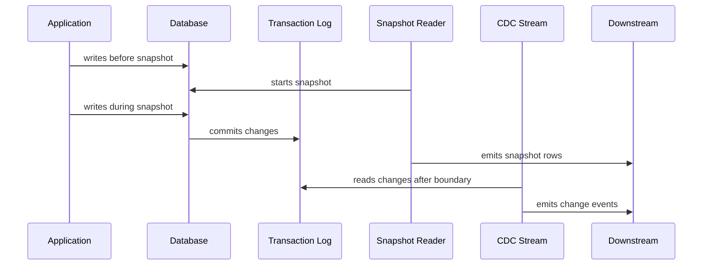
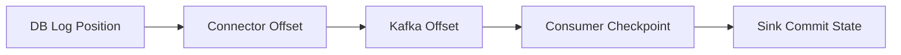
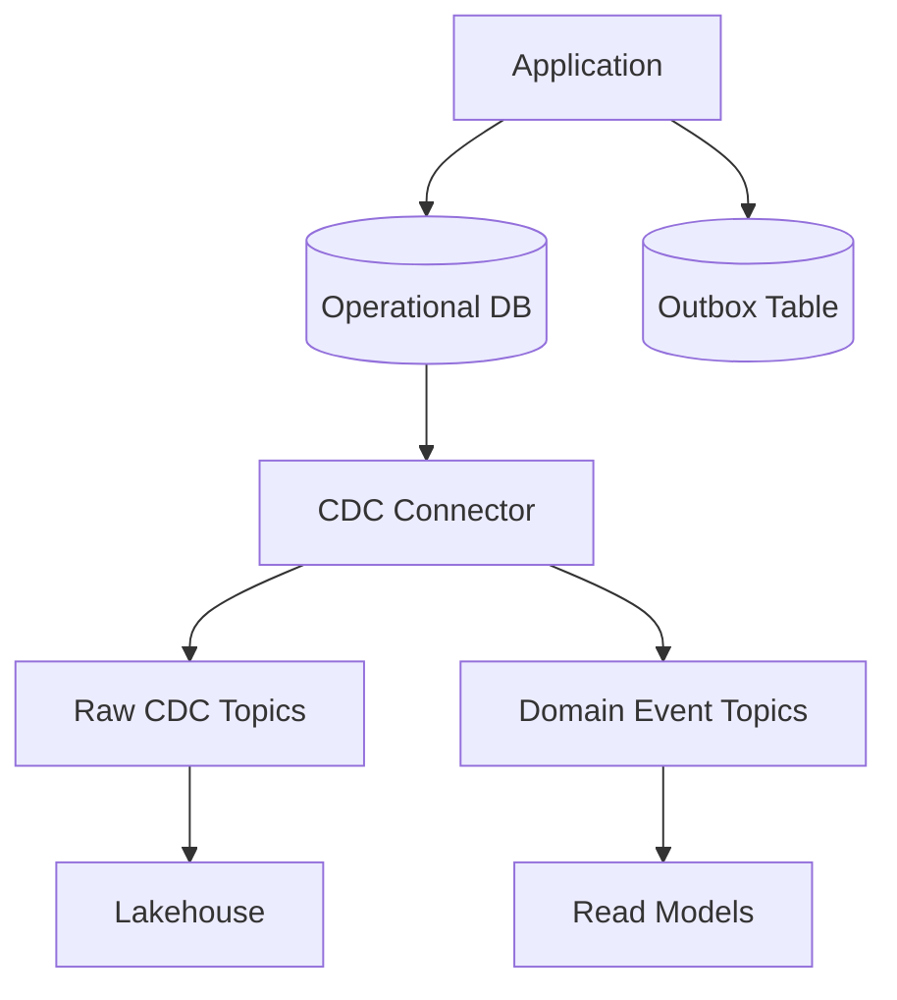
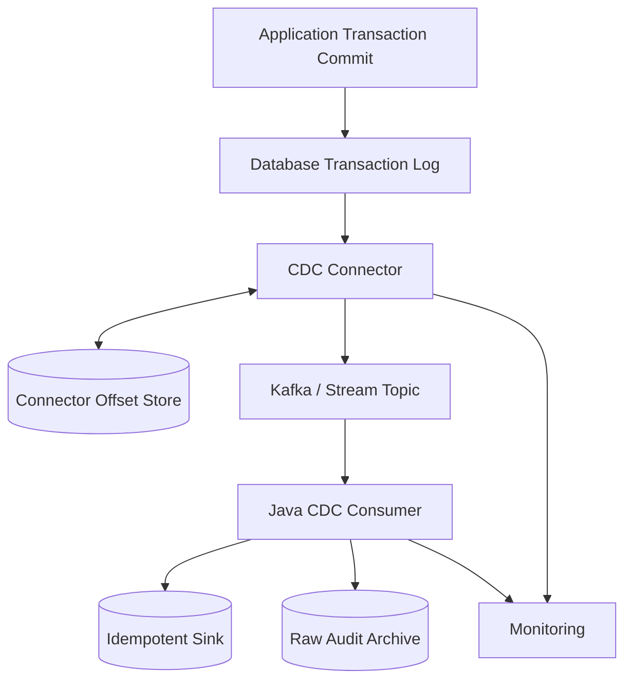

# Part 020 — CDC Ingestion Mental Model

Change Data Capture is often introduced as:

> "Capture database changes and publish them to Kafka."

That is true, but incomplete.

A stronger mental model is:

> CDC is a protocol for converting committed database mutations into an ordered, replayable change stream, while preserving enough source metadata that downstream systems can reconstruct state, react to facts, or audit what happened.

CDC is powerful because it moves the pipeline closer to the database's own commit history. But CDC is not magic. It does not automatically solve domain modeling, schema governance, idempotent sinks, replay, late correction, or consumer correctness.

This part builds the mental model required before using Debezium, Kafka Connect, Flink CDC, custom log readers, database-native CDC, or vendor replication tools.

---

## 1. Why CDC Exists

Polling has structural limitations:

- `updated_at` can be wrong.
- hard deletes disappear.
- multiple updates may collapse into one final state.
- transaction order is hard to preserve.
- multi-table consistency is hard.
- high-frequency changes may be missed or duplicated.
- low-latency polling can overload the source.

CDC reads a database's change source instead:

```text
Application Transaction
        |
        v
Source Database Commit
        |
        v
Transaction Log / Change Stream
        |
        v
CDC Connector
        |
        v
Kafka / Stream / Sink
```

The transaction log is closer to the truth of what committed than an application-maintained timestamp column.

---

## 2. The CDC Core Invariant

The CDC invariant is:

> Every committed source mutation within the configured capture scope must either appear in the change stream with enough metadata for correct downstream interpretation, or the pipeline must fail detectably before downstream consumers believe they are complete.

This invariant contains several important clauses:

- **Committed**: uncommitted changes must not be emitted as durable facts.
- **Configured scope**: only selected tables/columns/operations are promised.
- **Enough metadata**: key, operation, source position, schema, transaction context, timestamp.
- **Correct downstream interpretation**: insert/update/delete are not equivalent.
- **Fail detectably**: log retention gaps, offset loss, schema failure, and connector crash must not be silent.

---

## 3. CDC Is Not One Thing

CDC can mean several mechanisms.

| Mechanism | How It Works | Strength | Weakness |
|---|---|---|---|
| Log-based CDC | Reads WAL/binlog/redo/transaction log | Accurate, low latency, captures deletes | Operational setup, log retention dependency |
| Trigger-based CDC | DB trigger writes change table | Portable, explicit | Adds write overhead, can be bypassed/mismanaged |
| Timestamp polling | Poll `updated_at` | Simple | Misses deletes/intermediate updates |
| Query-based diff | Compare snapshots | Easy conceptually | Expensive, delayed, poor transaction semantics |
| Application outbox | App writes event rows transactionally | Domain-level event quality | Requires app code discipline |
| Native cloud stream | Managed database emits changes | Operational convenience | Vendor semantics and limits |

This series treats log-based CDC and outbox as the most important production patterns. They solve different problems.

CDC captures **data mutations**. Outbox captures **domain facts/events**.

---

## 4. Transaction Log Mental Model

A transactional database writes enough information to recover or replicate committed changes. CDC systems exploit that stream.

Database-specific names differ:

| Database | Common Change Source |
|---|---|
| PostgreSQL | WAL and logical decoding |
| MySQL/MariaDB | Binary log / binlog |
| Oracle | Redo logs |
| SQL Server | Transaction log / CDC tables depending on feature |
| MongoDB | Oplog / change streams |
| Db2 | Recovery log / native CDC mechanisms |

The log contains an ordered history of changes at a lower level than business events.

Example logical change:

```json
{
  "source": {
    "database": "regulatory",
    "schema": "public",
    "table": "case_file",
    "lsn": "16/B374D848",
    "txId": "812739"
  },
  "op": "u",
  "before": {
    "case_id": "C-1001",
    "status": "UNDER_REVIEW"
  },
  "after": {
    "case_id": "C-1001",
    "status": "ESCALATED"
  }
}
```

The exact envelope depends on the CDC tool, but the conceptual fields recur:

- operation,
- before image,
- after image,
- source table,
- source offset,
- transaction metadata,
- event timestamp,
- schema version.

---

## 5. CDC Event Is Not Automatically a Domain Event

This distinction is crucial.

A CDC event says:

> "A row changed."

A domain event says:

> "Something meaningful happened in the business."

Example CDC event:

```text
case_file.status changed from UNDER_REVIEW to ESCALATED
```

Possible domain meanings:

- risk threshold exceeded,
- manager manually escalated,
- SLA breach rule fired,
- enforcement committee accepted referral,
- migration script corrected status.

Those meanings are not always inferable from row diff.

CDC is excellent for replication, materialized views, cache invalidation, lake ingestion, audit trails, and integration where table-level change is acceptable.

For business workflows, prefer an outbox event if domain intent matters.

---

## 6. The Snapshot + Stream Problem

CDC logs usually do not contain all historical data forever. If you start today, the transaction log may only contain recent changes.

To build a full downstream copy, you need:

1. existing table state,
2. changes that happen while reading existing state,
3. changes after the snapshot completes.

This creates the snapshot + stream problem.



The hard part:

> If a row is read during snapshot and also changed during snapshot, which value wins downstream?

A correct bootstrap protocol must avoid both:

- losing changes that occur during snapshot,
- applying stale snapshot rows after newer CDC events.

---

## 7. Snapshot Row vs CDC Event

A snapshot row is a statement:

> "At some snapshot boundary, this row existed with this value."

A CDC event is a statement:

> "At this log position, this row changed."

They are different fact types.

Do not pretend they are identical without metadata.

A snapshot envelope should include:

```java
public record SnapshotMetadata(
    String snapshotId,
    String table,
    String chunkId,
    String snapshotBoundaryType,
    String snapshotBoundaryValue,
    boolean lastRowInSnapshot
) {}
```

A CDC envelope should include:

```java
public record ChangeMetadata(
    String table,
    String operation,
    String sourcePosition,
    String transactionId,
    Instant sourceCommitTime,
    boolean transactionLastEvent
) {}
```

Downstream conflict handling may require comparing source positions or using connector-provided snapshot flags.

---

## 8. CDC Operation Semantics

A CDC stream must represent operation type.

Common operation types:

| Operation | Meaning |
|---|---|
| `c` / create | Row inserted |
| `u` / update | Row updated |
| `d` / delete | Row deleted |
| `r` / read | Snapshot row read |
| tombstone | Log-compaction deletion marker in Kafka-style topics |

An upsert sink cannot treat all operations as "write after image."

Correct materialization logic:

```java
switch (event.operation()) {
    case CREATE, UPDATE, READ -> table.upsert(event.key(), event.after());
    case DELETE -> table.delete(event.key());
    case TOMBSTONE -> compactedTopicMarker(event.key());
}
```

For an audit sink, deletes are appended as facts, not removed.

```java
auditLog.append(event);
```

For a projection sink, deletes remove or mark the current state.

---

## 9. Before and After Images

CDC events may include:

- full before image,
- partial before image,
- full after image,
- changed columns only,
- primary key only for deletes,
- no before image unless supplemental logging is enabled.

This matters.

A downstream diff engine requires before and after. A materialized view may only need after. A delete-aware sink needs key identity. An audit system may require before image for defensibility.

Contract example:

```text
For table case_file:
- inserts include full after image
- updates include full after image and previous status column
- deletes include primary key and delete operation
- source position is mandatory
- schema version is mandatory
```

Do not assume the CDC connector provides full row images by default. Verify and configure.

---

## 10. Ordering Model

CDC ordering is subtle.

There are several orderings:

| Ordering | Meaning |
|---|---|
| Log order | Order changes appear in transaction log |
| Commit order | Order transactions commit |
| Per-table order | Order changes for one table |
| Per-key order | Order changes for one row/key |
| Kafka partition order | Order within a Kafka partition |
| Consumer processing order | Order actually applied downstream |
| Event-time order | Business timestamp order |

These are not always the same.

A robust CDC design usually requires **per-key order** for materialized state.

For Kafka, that means all events for the same source row key should go to the same partition.

```java
String kafkaKey = sourceTable + ":" + primaryKey;
producer.send(topic, kafkaKey, event);
```

If updates for the same key can go to different partitions, consumers can apply them out of order.

---

## 11. Transaction Boundary

A single database transaction may update multiple rows and tables.

Example transaction:

```text
tx 9001:
  update case_file set status = 'ESCALATED'
  insert case_history(...)
  update officer_work_queue(...)
```

CDC may emit multiple row-level events.

Questions:

1. Can consumers tell these events belong to one transaction?
2. Can downstream apply them atomically?
3. Does ordering preserve transaction boundary?
4. What happens if consumer fails halfway?

For analytical ingestion, row-level eventual consistency may be acceptable.

For operational projections, transaction boundary may matter.

A CDC envelope should preserve transaction metadata when available:

```java
public record TransactionMetadata(
    String transactionId,
    long eventOrderInTransaction,
    long transactionTotalOrder,
    boolean lastEventInTransaction
) {}
```

Downstream can then buffer until a complete transaction is observed.

But transaction buffering increases state and failure complexity.

---

## 12. Offset and Checkpoint

A CDC connector tracks a source position.

Examples:

- WAL LSN,
- binlog file and position,
- GTID,
- SCN,
- oplog timestamp,
- connector-specific offset.

The offset answers:

> "Up to what point in the source change stream has the connector processed?"

Offset is not just a number. It is part of recovery.

A CDC consumer has its own offset too:

```text
DB log offset -> connector offset -> Kafka topic offset -> application checkpoint -> sink state
```



Each boundary has different failure semantics.

A common mistake is saying "Kafka has the offset, so we are safe." Kafka offset only says what the consumer read from Kafka. It does not prove the sink safely applied the event.

---

## 13. CDC and Idempotency

CDC streams are commonly consumed at-least-once. Duplicates can happen due to retries, connector restarts, consumer failures, or replay.

An idempotent CDC sink should use:

```text
source_system + table + primary_key + source_position
```

or another stable unique event identity.

For a materialized projection, compare source version:

```sql
UPDATE case_projection
SET status = :status,
    source_position = :sourcePosition
WHERE case_id = :caseId
  AND source_position < :sourcePosition;
```

This prevents an older event from overwriting newer state if replay or out-of-order processing occurs. The exact comparison is database/source-specific; not all source positions are globally comparable across partitions/tables.

---

## 14. CDC Topic Design

Common Kafka topic strategies:

| Strategy | Example | Trade-off |
|---|---|---|
| Table topic | `db.public.case_file` | Simple, close to source |
| Domain aggregate topic | `case.changes` | Easier for consumers, requires mapping |
| Tenant-scoped topic | `tenant_a.db.public.case_file` | Isolation, more topics |
| Operation topic | `case_file.updates` | Rarely worth it |
| Raw + curated | `raw.db.table` then `curated.case` | Governance and compatibility |

For raw CDC, table topics are common.

For internal platform, a better pattern is:

```text
raw.cdc.<source>.<schema>.<table>
curated.entity.<domain>.<entity>
event.<domain>.<event-name>
```

Raw CDC is not the final consumer contract. It is an ingestion substrate.

---

## 15. CDC Envelope to Java Type

A generic CDC event type:

```java
public sealed interface CdcOperation
        permits CreateOp, UpdateOp, DeleteOp, SnapshotReadOp, TombstoneOp {}

public record CdcEnvelope<K, V>(
    String sourceSystem,
    String database,
    String schema,
    String table,
    K key,
    CdcOperation operation,
    V before,
    V after,
    SourcePosition sourcePosition,
    TransactionMetadata transaction,
    Instant sourceTimestamp,
    Instant observedAt,
    String schemaVersion,
    Map<String, String> headers
) {}
```

Operation-specific type can be safer:

```java
public sealed interface CaseFileChange permits
        CaseFileCreated,
        CaseFileUpdated,
        CaseFileDeleted,
        CaseFileSnapshotRead {}

public record CaseFileUpdated(
    CaseId caseId,
    CaseFile before,
    CaseFile after,
    SourcePosition position,
    TransactionMetadata transaction
) implements CaseFileChange {}
```

The closer a CDC event gets to business logic, the more you should move from generic map-based events to typed domain-aware representations.

---

## 16. Schema Changes

CDC is affected by source schema evolution.

Examples:

- column added,
- column dropped,
- column renamed,
- type widened,
- type narrowed,
- nullable changed to non-null,
- primary key changed,
- table split,
- enum value added,
- semantic meaning changed without DDL.

Not all schema changes are equal.

| Change | CDC Impact |
|---|---|
| Add nullable column | Usually compatible |
| Drop column | Breaks consumers using it |
| Rename column | Often appears as drop + add |
| Change type | May break deserialization |
| Change PK | Breaks keying, ordering, compaction |
| Add table | Connector config may need update |
| Drop table | Topic lifecycle decision needed |

A mature CDC platform treats schema change as a first-class event.

Minimum policy:

1. Detect schema changes.
2. Version schemas.
3. Validate compatibility.
4. Alert impacted owners.
5. Support replay with old schemas.
6. Document semantic changes.

---

## 17. Log Retention Failure

CDC depends on the source log being available.

If the connector stops for longer than log retention, the database may remove old log segments before the connector reads them.

Result:

> The connector can no longer continue from its checkpoint.

This is not a normal retry. It is a gap in the change stream.

Recovery options:

- stop and re-snapshot,
- restore from backup/log archive,
- manually reconcile impacted range,
- rebuild downstream from full source,
- declare data loss if contract allows.

The platform must alert before retention is exhausted.

Useful metrics:

- connector lag in time,
- connector lag in bytes/LSN distance,
- oldest retained log age,
- estimated time to retention breach,
- source log disk usage,
- connector restart count.

---

## 18. Snapshot Failure Modes

Snapshotting in CDC bootstrap can fail in subtle ways.

| Failure | Result |
|---|---|
| Snapshot interrupted | Partial snapshot rows emitted |
| Snapshot row emitted after newer CDC event | Stale overwrite |
| Snapshot lacks stable boundary | Mixed state |
| Chunk retry emits duplicates | Duplicate downstream rows |
| Source schema changes mid-snapshot | Deserialization/mapping conflict |
| Primary key changes mid-snapshot | Broken identity |
| Connector offset lost | Re-snapshot or duplicate stream |
| Sink not idempotent | Replay corrupts downstream |

The sink must understand snapshot rows and CDC rows, or the connector must guarantee correct ordering and marking.

---

## 19. CDC Consumer Patterns

### Pattern A — Raw Archive

Store every CDC event append-only.

Good for:

- audit,
- lakehouse bronze layer,
- replay,
- debugging,
- forensic analysis.

Sink behavior:

```text
append(source_position, table, key, op, before, after, metadata)
```

Never update in place.

### Pattern B — Current-State Projection

Maintain latest row state.

Good for:

- search index,
- cache,
- read model,
- operational dashboard.

Sink behavior:

```text
create/update/read -> upsert latest
delete -> remove or mark deleted
```

Requires ordering/idempotency.

### Pattern C — Derived Domain Event

Convert row change into business event.

Good for:

- workflow reactions,
- notifications,
- domain integration.

Danger:

- row diff may not contain enough intent,
- multiple row changes may be one business event,
- schema changes leak into domain logic.

### Pattern D — Join/Enrichment Stream

Combine CDC from multiple tables into denormalized view.

Good for:

- materialized aggregate,
- reporting,
- API read model.

Requires state, ordering, and late-arrival handling.

---

## 20. CDC and Reprocessing

CDC makes reprocessing possible but not free.

Replay questions:

1. From which source position?
2. Are old schemas still readable?
3. Is the target sink idempotent?
4. Are external side effects suppressed?
5. Are deletes replayed correctly?
6. Are topic retention and archives sufficient?
7. Does replay preserve transaction order?
8. Does replay create duplicate notifications?

For safety, split consumers into two categories:

| Consumer Type | Replay Policy |
|---|---|
| State projection | Replay allowed with idempotent writes |
| Audit archive | Replay only into separate run/version unless deduped |
| External side-effect consumer | Replay must be guarded |
| Notification sender | Replay usually disabled or requires explicit mode |
| Analytical table | Replay/backfill normal with versioning |

---

## 21. CDC vs Outbox

CDC and outbox are often confused.

| Dimension | CDC | Outbox |
|---|---|---|
| Captures | Row changes | Application-defined events |
| Source of meaning | Database mutation | Domain logic |
| Requires app change | No or minimal | Yes |
| Delete visibility | Good with log config | Only if app emits event |
| Consumer contract | Table/schema-oriented | Business event-oriented |
| Best for | Replication, lake, projection | Workflows, integration, domain events |
| Risk | Leaking internal schema | Bad event design/app discipline |

A strong architecture often uses both:



The outbox table itself may be published using CDC. This avoids dual-write between database and Kafka while preserving domain intent.

---

## 22. CDC in Regulatory / Case Management Systems

For enforcement lifecycle or regulatory case systems, CDC is useful but must be handled carefully.

CDC can support:

- audit reconstruction,
- operational reporting,
- SLA breach detection,
- investigation timeline,
- case status projection,
- workload dashboards,
- search index sync,
- evidence of data movement,
- correction tracking.

But raw CDC should not be blindly exposed as the regulatory truth.

A row update like:

```text
case_file.status = CLOSED
```

may need explanation:

- Who closed it?
- Under which authority?
- Was there an approval?
- Was it automatic or manual?
- Was it later reversed?
- Was it effective immediately or backdated?
- Which version of the policy applied?

CDC gives the mutation. Domain events and audit metadata give the defensible explanation.

---

## 23. Minimal CDC Readiness Checklist

Before enabling CDC for a production pipeline:

- Is source database log configuration enabled?
- Is required row image/supplemental logging configured?
- Are captured tables explicitly listed?
- Are primary keys stable?
- Is snapshot mode defined?
- Is log retention sufficient for connector outage?
- Are connector offsets backed up?
- Are schema changes handled?
- Is delete behavior tested?
- Are tombstones understood?
- Is topic key strategy correct?
- Are consumers idempotent?
- Is replay mode documented?
- Is monitoring configured?
- Is source impact acceptable?
- Is ownership clear between DBAs, application team, and platform team?

---

## 24. Failure Injection Scenarios

A top-tier engineer does not trust a CDC pipeline until failure has been tested.

Test these:

1. Connector crashes during snapshot.
2. Connector crashes after emitting event but before offset commit.
3. Kafka unavailable during CDC emission.
4. Source schema changes during snapshot.
5. Row is updated while snapshot chunk reads it.
6. Delete occurs during snapshot.
7. Log retention nearly expires.
8. Consumer crashes after sink write before Kafka offset commit.
9. Duplicate CDC event is delivered.
10. Older event arrives after newer event in downstream worker.
11. Transaction updates multiple tables.
12. Primary key update occurs.
13. Sink rejects one event in a transaction group.
14. Backfill replays one month of CDC events.
15. Connector restarts with stale offset.

Expected result is not "nothing fails." Expected result is "failure is bounded, visible, and recoverable."

---

## 25. CDC Mental Model Diagram



Every arrow is a failure boundary.

- DB log to connector can lag.
- Connector to topic can duplicate on retry.
- Topic to consumer can replay.
- Consumer to sink can partially commit.
- Offset can advance incorrectly.
- Schema can break deserialization.
- Sink can reject deletes.

The design must assign an explicit policy to each boundary.

---

## 26. Practical Java Consumer Skeleton

A CDC consumer should avoid mixing parsing, business logic, idempotency, and sink writes into one blob.

```java
public final class CdcConsumerLoop<K, V> {
    private final CdcEventReader<K, V> reader;
    private final CdcEventParser<K, V> parser;
    private final CdcEventHandler<K, V> handler;
    private final ConsumerCheckpointStore checkpointStore;
    private final ErrorPolicy errorPolicy;

    public void run() {
        while (!Thread.currentThread().isInterrupted()) {
            var batch = reader.poll();

            for (var raw : batch.records()) {
                try {
                    var event = parser.parse(raw);
                    handler.handle(event); // idempotent
                    checkpointStore.markProcessed(raw.position());
                } catch (Exception e) {
                    errorPolicy.handle(raw, e);
                }
            }

            checkpointStore.flushIfSafe();
        }
    }
}
```

The handler decides operation semantics:

```java
public final class CaseProjectionHandler
        implements CdcEventHandler<CaseId, CaseFile> {

    private final CaseProjectionRepository repository;

    @Override
    public void handle(CdcEnvelope<CaseId, CaseFile> event) {
        switch (event.operation()) {
            case SnapshotReadOp ignored ->
                repository.upsertIfNewer(event.key(), event.after(), event.sourcePosition());

            case CreateOp ignored ->
                repository.upsertIfNewer(event.key(), event.after(), event.sourcePosition());

            case UpdateOp ignored ->
                repository.upsertIfNewer(event.key(), event.after(), event.sourcePosition());

            case DeleteOp ignored ->
                repository.deleteIfNewer(event.key(), event.sourcePosition());

            case TombstoneOp ignored ->
                repository.ignoreTombstone(event.key());
        }
    }
}
```

This is intentionally explicit. CDC bugs often hide in generic "save event" abstractions.

---

## 27. Common CDC Anti-Patterns

### Anti-Pattern 1 — Treating CDC as Business Events

CDC is row mutation. Domain meaning needs domain context.

### Anti-Pattern 2 — No Delete Test

The happy path tests insert and update. Production fails on delete.

### Anti-Pattern 3 — Wrong Kafka Key

Same row's events go to different partitions and arrive out of order.

### Anti-Pattern 4 — Ignoring Snapshot Events

Snapshot rows overwrite newer stream changes.

### Anti-Pattern 5 — Assuming Exactly Once End-to-End

Connector guarantees do not automatically include your sink, email sender, search index, or warehouse merge.

### Anti-Pattern 6 — No Log Retention Alert

Connector outage becomes unrecoverable gap.

### Anti-Pattern 7 — Exposing Raw CDC as Public Contract

Internal table schema becomes integration API. Every migration becomes a breaking change.

### Anti-Pattern 8 — Forgetting Schema History

Replay fails because old events can no longer be decoded.

---

## 28. Production Review Questions

Ask these before approving CDC:

1. What source position defines the start?
2. Is initial snapshot required?
3. How are snapshot rows marked?
4. How is handoff from snapshot to stream guaranteed?
5. What is the operation model?
6. What is the topic key?
7. Is per-key order preserved?
8. How are multi-table transactions represented?
9. Are before images needed?
10. Is supplemental logging configured?
11. What happens on primary key update?
12. How long can connector be down before log retention breaks recovery?
13. How are schema changes tested?
14. How are deletes represented downstream?
15. Is the consumer idempotent?
16. Can the sink reject one event without blocking all tables?
17. Is replay safe?
18. Is there a raw archive?
19. Who owns connector configuration?
20. Who responds to lag alerts?

---

## 29. Mental Model Recap

CDC is the bridge between transactional mutation history and pipeline dataflow.

The essential ideas:

1. The transaction log is closer to committed truth than polling.
2. CDC events are row-level facts, not automatically domain events.
3. Snapshot + stream handoff is the hardest bootstrap problem.
4. Operation semantics matter: create, update, delete, snapshot read, tombstone.
5. Ordering must be defined, usually at least per key.
6. Transaction boundaries may matter for downstream correctness.
7. Offsets exist at multiple layers.
8. Consumers still need idempotent sinks.
9. Schema changes are part of the data stream lifecycle.
10. Log retention failure is a correctness incident, not just an outage.

If you internalize one thing:

> CDC reduces the uncertainty of detecting database changes, but it does not remove the need for explicit contracts, idempotency, replay design, ordering policy, and operational proof.

---

## 30. What Comes Next

Part 021 will focus on **Debezium CDC in Java systems**.

We will move from CDC mental model into concrete implementation architecture:

- Debezium connector topology,
- Kafka Connect deployment model,
- Debezium envelope,
- snapshots and incremental snapshots,
- offsets and schema history,
- heartbeat,
- tombstones,
- topic naming,
- schema registry,
- Java consumer mapping,
- operational failure handling.
