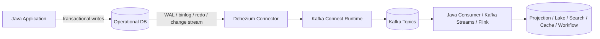
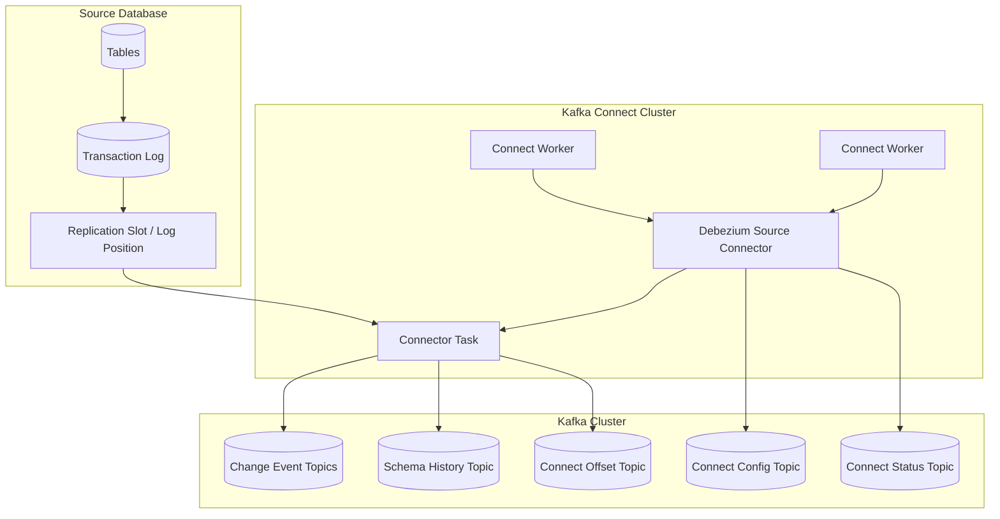
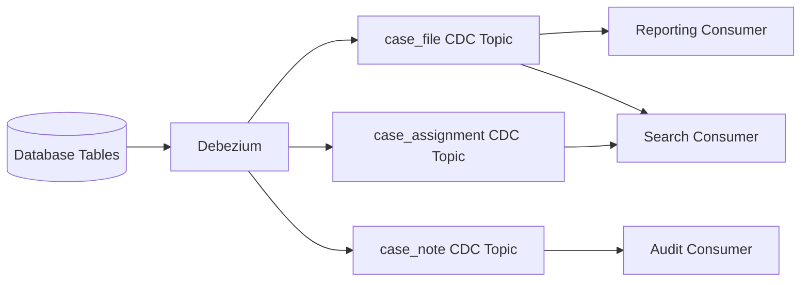
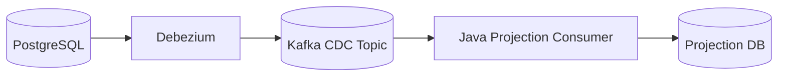
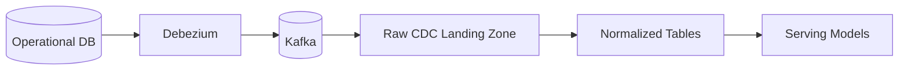
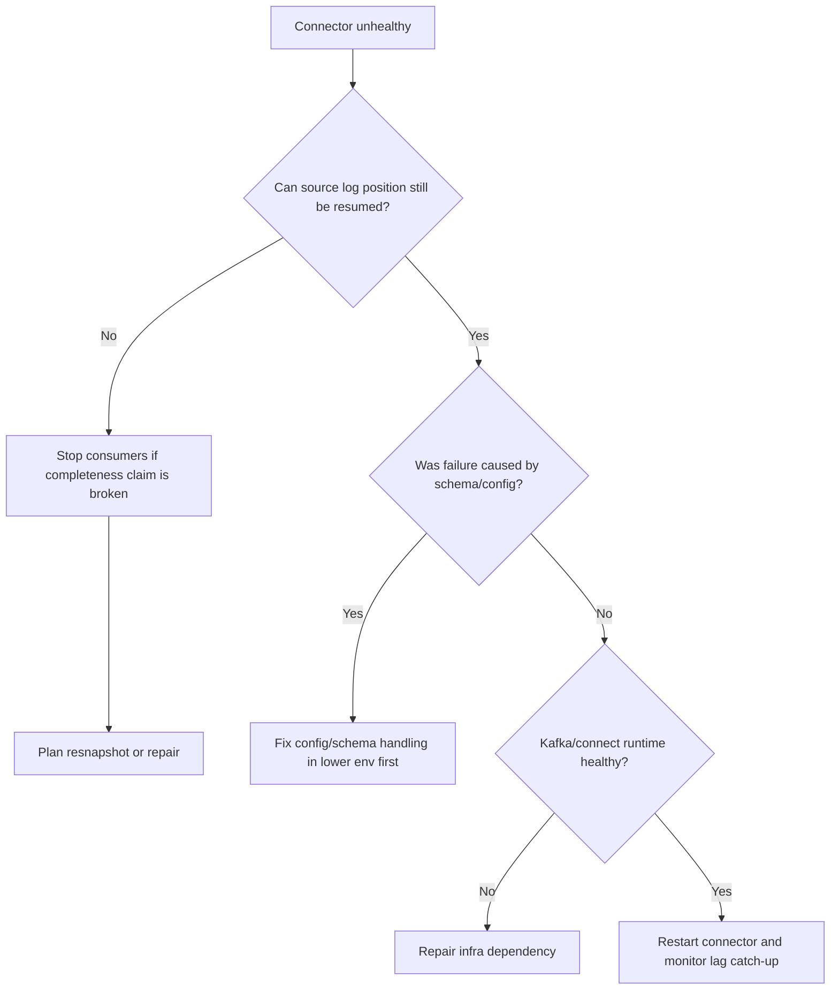

# Part 021 — Debezium CDC in Java Systems

Part 020 built the CDC mental model. This part turns it into an implementation model with Debezium in Java-based systems.

Debezium is commonly described as a CDC platform. In practical Java architecture, think of it as:

> A log-reader plus envelope producer that converts database commit history into Kafka records, usually running inside Kafka Connect, with source offsets, schema metadata, snapshot behavior, and connector-specific operational constraints.

That wording matters.

Debezium is not just a library you call from a Java method. In production, it is usually an infrastructure component sitting beside your Java services. Your Java services write to operational databases; Debezium observes committed changes; Kafka stores the change stream; Java consumers, stream processors, and sinks consume those changes.



The value of Debezium is not merely "near real-time events". Its real value is that it lets downstream systems reason from database commit history instead of fragile polling loops or unsafe dual writes.

But it also introduces a new boundary: the database log becomes part of your distributed system contract.

---

## 1. What Problem Debezium Solves

Debezium primarily solves the problem:

> How can downstream systems observe committed database changes without changing every write path and without polling source tables repeatedly?

It is strongest when you need:

- replication into Kafka,
- cache invalidation,
- search index update,
- materialized views,
- lake ingestion,
- audit trail construction,
- migration from monolith database to event-driven architecture,
- integration with legacy systems that cannot easily emit domain events.

It is weaker when you need:

- rich business intent,
- user intent semantics,
- cross-aggregate domain facts,
- carefully curated domain event names,
- event payloads independent of database schema,
- domain-level versioning controlled by application code.

For those cases, the outbox pattern in Part 022 is usually a better fit.

Debezium sees committed row changes. It does not automatically know why those changes happened.

---

## 2. Debezium Is Usually Kafka Connect, Not Application Code

Most production Debezium deployments run as Kafka Connect source connectors.

The distinction is important:

| Layer | Responsibility |
|---|---|
| Java application | Owns business transaction and writes to database |
| Database | Commits state and writes transaction log |
| Debezium connector | Reads database change source and emits change events |
| Kafka Connect runtime | Runs connector tasks, stores offsets/config/status, handles connector lifecycle |
| Kafka | Stores emitted change events durably |
| Java consumers/processors | Interpret change events and update downstream systems |

A common mistake is to put too much logic in the connector layer.

The connector should usually be boring:

- read from source log,
- emit stable envelope,
- route topic if necessary,
- preserve source metadata,
- expose metrics,
- fail loudly when it cannot maintain correctness.

Business transformation belongs downstream, not inside the CDC connector.

---

## 3. Connector Topology

A Debezium topology has several moving parts.



The operational health of the pipeline depends on all of these:

- database permissions,
- replication slot or equivalent log reader state,
- log retention,
- Kafka Connect offset storage,
- Kafka topic availability,
- schema history persistence,
- connector task liveness,
- consumer lag downstream.

If any one is mismanaged, the CDC pipeline can silently fall behind or loudly fail. Loud failure is preferable.

---

## 4. The Debezium Envelope Mental Model

Debezium emits records with a structured envelope. The exact structure depends on connector and configuration, but the conceptual model is stable.

A CDC event usually contains:

- `before`: row state before change, when available,
- `after`: row state after change, when available,
- `op`: operation code,
- `source`: database/table/log position metadata,
- `ts_ms` or equivalent timestamp metadata,
- transaction metadata if enabled/configured,
- schema information when using schemaful serialization.

A simplified update event:

```json
{
  "before": {
    "case_id": "C-1001",
    "status": "UNDER_REVIEW",
    "risk_score": 81
  },
  "after": {
    "case_id": "C-1001",
    "status": "ESCALATED",
    "risk_score": 93
  },
  "source": {
    "connector": "postgresql",
    "db": "regulatory",
    "schema": "public",
    "table": "case_file",
    "lsn": 24023128,
    "txId": 721901
  },
  "op": "u",
  "ts_ms": 1783148400000
}
```

The operation code matters:

| Operation | Meaning |
|---|---|
| `c` | create / insert |
| `u` | update |
| `d` | delete |
| `r` | snapshot read |

Do not treat all events as "upserts" unless your downstream model explicitly allows it.

A delete is not the same as an update with a null payload. A snapshot read is not the same as a new business creation. An update may carry both before and after state, or only after state depending on database configuration and connector support.

---

## 5. Snapshot Events Are Not Business Events

During initial snapshot, Debezium emits existing rows. These are often marked differently from streaming updates.

That means:

```text
op = r
```

should generally mean:

> This row existed at snapshot time.

It should not mean:

> This entity was created now.

This distinction matters for downstream side effects.

Bad consumer:

```java
if (event.after() != null) {
    emailService.sendCaseCreatedEmail(event.after().caseId());
}
```

Better consumer:

```java
if (event.op() == Operation.CREATE && !event.isSnapshot()) {
    domainProjection.applyNewlyCreatedCase(event.after());
}

if (event.op() == Operation.READ && event.isSnapshot()) {
    domainProjection.loadExistingCase(event.after());
}
```

In most pipelines, snapshot events should update projections, indexes, or lake tables. They should not trigger irreversible external side effects.

---

## 6. Topic Naming and Capture Scope

A default Debezium topic model often maps source tables into topics.

Conceptually:

```text
<serverName>.<schema>.<table>
```

or similar depending on connector and configuration.

Example:

```text
regulatory.public.case_file
regulatory.public.case_assignment
regulatory.public.enforcement_action
```

This default is useful for replication-style CDC but not always ideal for product-facing event streams.

Design questions:

| Question | Why It Matters |
|---|---|
| One topic per table or routed topics? | Affects consumer coupling and topic count |
| Include schema name? | Affects multi-schema databases and migrations |
| Capture all columns or selected columns? | Affects privacy, payload size, evolution |
| Capture all tables or explicit allowlist? | Affects blast radius |
| Compact topic or retain history? | Affects rebuild strategy |
| Who owns topic compatibility? | Affects governance |

Rule of thumb:

- Use table topics for internal replication/materialization.
- Use outbox-routed topics for domain events.
- Avoid exposing raw table CDC topics as public domain APIs unless consumers explicitly accept database coupling.

---

## 7. Source Offset Is a Correctness Boundary

CDC correctness depends on durable source offsets.

A source offset answers:

> Up to which source-log position has the connector already emitted events?

For PostgreSQL, this may involve LSN-like position metadata. For MySQL, binlog file and position are involved. For other systems, the representation differs.

The important invariant is tool-independent:

> A connector restart must resume from a source position that prevents both silent loss and unbounded duplication beyond the expected delivery model.

Kafka Connect stores connector offsets in Kafka internal topics. The source database may also maintain server-side state, such as replication slots or equivalent retention mechanisms.

Failure cases:

| Failure | Consequence |
|---|---|
| Offset topic lost | Connector may need resnapshot or manual recovery |
| Replication slot removed | Source may discard required log history |
| Log retention too short | Connector cannot catch up after downtime |
| Connector config changed incorrectly | Topic or envelope semantics may change |
| Schema history lost | Connector may not decode future log records correctly |

Offsets are not just operational metadata. They are part of the pipeline's recovery protocol.

---

## 8. Schema History Is Not Optional Complexity

CDC tools must understand table structure over time.

Imagine this timeline:

```text
T1: table case_file(case_id, status)
T2: insert case_id=C-1, status=OPEN
T3: alter table add column risk_score
T4: update C-1 set risk_score=91
```

When reading log entries, the connector must understand which schema was valid at each point.

Schema history helps decode change records correctly across DDL changes.

A practical rule:

> Treat schema history storage as critical state, not disposable cache.

Do not casually delete connector schema history topics, files, or equivalent state. Losing them can force a rebuild or resnapshot.

---

## 9. Heartbeats and Lag Detection

CDC systems can appear idle for two very different reasons:

1. there are no source changes,
2. the connector is broken or stuck.

Heartbeats help distinguish these situations.

A heartbeat is a small signal emitted periodically so operators can know the connector is alive and advancing.

Useful metrics:

- last source event timestamp,
- last connector emit timestamp,
- heartbeat age,
- source log position age,
- replication slot retained bytes,
- Kafka Connect task status,
- Kafka producer error rate,
- downstream consumer lag.

A mature runbook does not merely ask:

> Is the connector running?

It asks:

> Is the connector still able to observe new committed changes within the freshness SLO and retain enough source log to recover?

---

## 10. Transaction Metadata and Ordering

CDC is often consumed at row-event granularity. But databases commit transactions, not isolated rows.

A single transaction might update several tables:

```text
BEGIN;
UPDATE case_file SET status = 'ESCALATED' WHERE case_id = 'C-1001';
INSERT INTO case_assignment(...);
INSERT INTO case_timeline(...);
COMMIT;
```

Downstream consumers may see multiple CDC events.

Important questions:

- Are events from one transaction identifiable?
- Can consumers preserve commit order?
- Is table-level topic partitioning hiding cross-table transaction ordering?
- Does the downstream projection require all rows from a transaction before applying?
- Is partial visibility acceptable?

For many projections, row-level idempotent upserts are enough.

For regulatory or financial workflows, transaction grouping can matter. A downstream audit model may need to know that status change, assignment change, and timeline entry were one committed source transaction.

A robust event envelope should preserve source transaction metadata when available.

---

## 11. Debezium and Java Consumer Design

A Java consumer should not deserialize Debezium events directly into business objects without acknowledging the envelope.

Bad model:

```java
record CaseFile(String caseId, String status, int riskScore) {}
```

This loses:

- operation type,
- before/after distinction,
- source table,
- source offset,
- snapshot flag,
- schema version,
- transaction metadata,
- event time,
- delete semantics.

Better model:

```java
public enum CdcOperation {
    CREATE,
    UPDATE,
    DELETE,
    SNAPSHOT_READ
}

public record SourcePosition(
    String connector,
    String database,
    String schema,
    String table,
    String partition,
    String offset
) {}

public record CdcEnvelope<T>(
    CdcOperation operation,
    T before,
    T after,
    SourcePosition sourcePosition,
    Instant sourceTimestamp,
    boolean snapshot,
    String transactionId,
    String schemaVersion
) {
    public Optional<T> currentValue() {
        return Optional.ofNullable(after);
    }
}
```

Then downstream logic can be explicit:

```java
public ProjectionCommand toProjectionCommand(CdcEnvelope<CaseFileRow> event) {
    return switch (event.operation()) {
        case CREATE, UPDATE, SNAPSHOT_READ ->
            ProjectionCommand.upsert(
                event.after().caseId(),
                event.after(),
                event.sourcePosition()
            );
        case DELETE ->
            ProjectionCommand.delete(
                event.before().caseId(),
                event.sourcePosition()
            );
    };
}
```

This model is a little more verbose. It prevents expensive ambiguity later.

---

## 12. The Delete Problem

Deletes are one of the most common CDC bugs.

A delete event may contain:

- `before` row data,
- no `after` data,
- tombstone record for compacted Kafka topics,
- key-only deletion semantics,
- connector-specific behavior.

Downstream choices:

| Sink Type | Delete Handling |
|---|---|
| Search index | Delete document by key |
| Cache | Evict key |
| Projection table | Mark deleted or physical delete |
| Lake table | Write delete event or merge delete |
| Audit log | Append delete fact |
| Analytics dimension | Soft-close record validity |

A dangerous default is to ignore events with null `after`.

```java
if (event.after() == null) {
    return; // bug: silently ignores deletes
}
```

Better:

```java
if (event.operation() == CdcOperation.DELETE) {
    projection.delete(event.key(), event.sourcePosition());
    return;
}
```

If your source table allows hard deletes, delete semantics must be a first-class design concern.

---

## 13. Snapshot Mode Decisions

Snapshot mode determines how the connector initializes downstream state.

Common conceptual options include:

| Mode | Meaning | Use Case |
|---|---|---|
| Initial snapshot then stream | Read existing data, then stream changes | Build new projection/lake from current state |
| No initial snapshot | Only stream future changes | Topic already initialized, or only future events matter |
| Schema-only initialization | Capture schema state without rows | Existing downstream already loaded |
| Incremental snapshot | Snapshot selected data while streaming | Large tables, online re-snapshot, targeted repair |
| Ad hoc snapshot | Trigger snapshot for selected table/data | Repair or backfill |

The key decision is not "which flag should I set?"

The real decision is:

> What downstream completeness claim are we making after the connector starts?

If you start without snapshot, downstream cannot claim to contain all current rows unless another mechanism loaded them.

If you run an initial snapshot, downstream must distinguish snapshot reads from newly created business facts.

If you run incremental snapshot, downstream must tolerate interleaving snapshot and streaming events.

---

## 14. Configuration as Architecture

Connector configuration is not boilerplate. It encodes architecture decisions.

Representative categories:

| Config Category | Architectural Meaning |
|---|---|
| Database connection | Which source truth is observed |
| Table include/exclude list | Capture scope and blast radius |
| Column include/exclude/masking | Privacy and payload contract |
| Snapshot mode | Initialization semantics |
| Topic naming | Consumer coupling and ownership |
| Serialization | Schema governance and compatibility |
| Tombstone behavior | Delete semantics and compaction |
| Heartbeat | Liveness and lag observability |
| Signal table/topic | Operational control plane |
| Transaction metadata | Cross-row/cross-table correlation |

Treat connector config as code:

- peer reviewed,
- version controlled,
- environment-specific values separated,
- promoted through environments,
- validated before deployment,
- owned by a clear team,
- associated with a rollback strategy.

---

## 15. Minimal PostgreSQL-Oriented Topology Example

The exact values vary by environment. This example is intentionally schematic.

```properties
name=regulatory-postgres-cdc
connector.class=io.debezium.connector.postgresql.PostgresConnector
plugin.name=pgoutput

database.hostname=postgres.internal
database.port=5432
database.user=debezium
database.password=${secrets:debezium_password}
database.dbname=regulatory

topic.prefix=regulatory
schema.include.list=public
table.include.list=public.case_file,public.case_assignment,public.enforcement_action

slot.name=regulatory_cdc_slot
publication.name=regulatory_cdc_publication

snapshot.mode=initial
heartbeat.interval.ms=10000

tombstones.on.delete=true
provide.transaction.metadata=true

schema.history.internal.kafka.bootstrap.servers=kafka:9092
schema.history.internal.kafka.topic=debezium.schemahistory.regulatory
```

Production concerns hidden behind this tiny file:

- Does the `debezium` DB user have only necessary privileges?
- Is WAL retention large enough for worst-case connector downtime?
- Is the replication slot monitored?
- Are included tables stable and intentionally owned?
- Are sensitive columns excluded or masked?
- Is schema history topic replicated and retained safely?
- Does downstream know snapshot events may arrive?
- Are transaction metadata topics/records handled?
- Is the connector config deployed through controlled release?

---

## 16. Topic Design for Debezium Table CDC

Assume source tables:

```text
case_file
case_assignment
case_note
case_party
case_decision
```

Naive topic design:

```text
regulatory.public.case_file
regulatory.public.case_assignment
regulatory.public.case_note
regulatory.public.case_party
regulatory.public.case_decision
```

This is acceptable for internal materialization. It is not necessarily acceptable as a public event API.

Consumer coupling risk:



Every table refactor now becomes a downstream compatibility problem.

Better internal classification:

| Topic Kind | Audience | Stability Promise |
|---|---|---|
| Raw CDC table topic | Internal platform/pipeline | Database-coupled, low semantic promise |
| Curated change topic | Data consumers | Stable schema, cleaned semantics |
| Domain event topic | Business consumers | Domain-level versioned contract |
| Projection topic | Specific downstream system | Purpose-built contract |

Do not pretend raw CDC is a domain event stream.

---

## 17. CDC-to-Projection Pattern

A common Java use case:

> Maintain a read model from operational database changes.

Flow:



Consumer algorithm:

```text
for each CDC event:
  parse envelope
  validate source table and schema version
  map row change to projection command
  apply idempotent sink operation
  record source position applied
  commit Kafka offset only after sink success
```

Idempotent projection table example:

```sql
create table case_search_projection (
    case_id text primary key,
    status text not null,
    risk_score int,
    assigned_team text,
    deleted boolean not null default false,
    source_table text not null,
    source_position text not null,
    source_timestamp timestamptz,
    updated_at timestamptz not null default now()
);
```

Apply update:

```sql
insert into case_search_projection (
    case_id,
    status,
    risk_score,
    assigned_team,
    deleted,
    source_table,
    source_position,
    source_timestamp
)
values (?, ?, ?, ?, false, ?, ?, ?)
on conflict (case_id) do update set
    status = excluded.status,
    risk_score = excluded.risk_score,
    assigned_team = excluded.assigned_team,
    deleted = false,
    source_table = excluded.source_table,
    source_position = excluded.source_position,
    source_timestamp = excluded.source_timestamp,
    updated_at = now();
```

Apply delete:

```sql
update case_search_projection
set deleted = true,
    source_position = ?,
    source_timestamp = ?,
    updated_at = now()
where case_id = ?;
```

This is replay-safe if later duplicate events produce the same final projection.

For strict ordering, store and compare source position per key where possible.

---

## 18. CDC-to-Lake Pattern

For analytics, a CDC event stream often lands into object storage or table formats.

A simplified flow:



Bronze/raw should preserve:

- original key,
- operation,
- before/after if needed,
- source position,
- source timestamp,
- ingestion timestamp,
- connector identity,
- schema version,
- transaction metadata,
- raw payload or lossless representation.

Do not prematurely flatten away operation and source metadata. You will need them for:

- replay,
- correction,
- audit,
- schema migration,
- reconciliation,
- debugging source anomalies.

The normalized layer can apply business rules. The raw layer should behave like evidence.

---

## 19. CDC-to-Search Pattern

Search indexing is a practical CDC use case.

Pattern:

```text
CDC event -> projection command -> search document update/delete
```

Challenges:

- search sink may be eventually consistent,
- partial update may fail,
- delete must be handled,
- index mapping may lag schema evolution,
- multiple tables may contribute to one document,
- enrichment data may be stale,
- reindex requires replay/backfill.

For one-table-to-one-document mapping, direct CDC is simple.

For multi-table documents, CDC becomes trickier:

```text
case_file + case_assignment + case_party + case_action -> case_search_document
```

You need a materialization strategy:

| Strategy | Description | Trade-Off |
|---|---|---|
| On-change query | On any CDC event, query source DB to rebuild document | Simple, source load, race risk |
| Local state store | Maintain state for contributing tables | More complex, replayable |
| Database projection | Source DB maintains projection table, CDC captures it | Moves complexity upstream |
| Stream processor | Kafka Streams/Flink joins table topics | Scalable, stateful complexity |

For high-value systems, avoid ad hoc source DB queries in every consumer. They couple consumer correctness to source availability and isolation behavior.

---

## 20. CDC and Schema Registry

Debezium can work with schema-aware serialization such as Avro or Protobuf depending on converter configuration.

Schema registry is valuable because CDC payloads evolve when tables evolve.

But beware:

> Database schema compatibility and event schema compatibility are not always the same thing.

A database migration might be safe for the application but breaking for a consumer.

Example:

```sql
alter table case_file rename column status to lifecycle_status;
```

The database app may deploy code simultaneously. CDC consumers may not.

Consumer-safe approach:

- prefer additive changes,
- deploy consumers before producers when needed,
- avoid rename-as-in-place-change for public streams,
- use curated topics to decouple raw table changes,
- test schema compatibility in CI,
- include schema version in envelope or registry metadata,
- maintain deprecation windows.

Raw CDC topics should be treated as database-coupled contracts. Curated topics should obey stricter compatibility promises.

---

## 21. Security and Sensitive Columns

CDC can accidentally become a data exfiltration pipeline.

Why?

Because it captures changes near the database truth.

Sensitive columns may include:

- national identifiers,
- addresses,
- phone numbers,
- free-text notes,
- investigation details,
- enforcement evidence,
- payment data,
- credentials or tokens accidentally stored in tables,
- internal staff comments.

Design controls:

| Control | Purpose |
|---|---|
| Table allowlist | Avoid accidental broad capture |
| Column exclude list | Remove sensitive fields |
| Masking SMT or downstream masking | Reduce exposure |
| Topic ACLs | Restrict consumers |
| Encryption in transit/at rest | Protect storage path |
| Data classification metadata | Help downstream policy enforcement |
| Retention policy | Limit long-term exposure |
| Audit logs | Know who consumed what |

Do not start with `capture everything` in regulated environments.

Start with minimal capture scope and expand intentionally.

---

## 22. Operational Runbook: Connector Stops

When a connector stops, do not immediately restart blindly.

Ask:

1. Why did it stop?
2. Is source log retention still sufficient?
3. Is the replication slot or equivalent state intact?
4. Did schema change break decoding?
5. Did Kafka reject writes?
6. Did offset storage fail?
7. Did connector task crash due to poison schema/data?
8. Are downstream consumers lagging separately?
9. Is a resnapshot required?
10. Would restart duplicate events downstream?

Basic decision tree:



The worst outcome is not downtime. The worst outcome is falsely believing downstream data is complete after a log gap.

---

## 23. Operational Runbook: Downstream Is Wrong

If a downstream projection is wrong, debug from evidence.

Checklist:

- What is the source row now?
- What is the source transaction history around the issue?
- Did Debezium emit the expected event?
- Did Kafka contain the event?
- Did the consumer read it?
- Did the consumer reject it?
- Did the sink apply it?
- Was the event later overwritten by an older event?
- Was a delete ignored?
- Was a snapshot event misclassified?
- Was schema evolution mishandled?
- Was backfill interleaved with live stream incorrectly?

A good CDC pipeline stores enough metadata in the sink to answer:

```text
Which source event last modified this downstream row?
```

Without that, every data incident becomes archaeology.

---

## 24. Java Integration Testing with Debezium

For serious systems, test CDC behavior with real infrastructure.

Recommended test layers:

| Test Level | Purpose |
|---|---|
| Envelope parser unit test | Parse operation/source/delete/snapshot correctly |
| Mapper unit test | Convert CDC event to sink command |
| Idempotency test | Duplicate events do not corrupt sink |
| Delete test | Deletes propagate correctly |
| Schema evolution test | Add nullable column, add required column with default, rename simulation |
| Embedded/local integration | DB + Debezium + Kafka + consumer |
| Recovery test | Kill connector, restart, verify no loss |
| Snapshot test | Initial snapshot does not trigger business side effects |
| Backfill test | Replay old topic into empty sink |

Do not only test the happy path:

```text
insert row -> event appears
```

Also test:

```text
insert -> update -> delete -> duplicate -> restart -> replay -> schema change
```

---

## 25. Example Java CDC Consumer Skeleton

This is intentionally framework-light. It shows boundaries.

```java
public final class CdcProjectionConsumer {
    private final KafkaConsumer<String, byte[]> consumer;
    private final DebeziumEventParser parser;
    private final ProjectionMapper mapper;
    private final ProjectionSink sink;
    private final DeadLetterSink deadLetters;

    public void run() {
        consumer.subscribe(List.of("regulatory.public.case_file"));

        while (!Thread.currentThread().isInterrupted()) {
            ConsumerRecords<String, byte[]> records = consumer.poll(Duration.ofMillis(500));

            for (ConsumerRecord<String, byte[]> record : records) {
                try {
                    CdcEnvelope<CaseFileRow> event = parser.parse(record);
                    ProjectionCommand command = mapper.map(event);
                    sink.apply(command);
                } catch (NonRetryableDataException e) {
                    deadLetters.write(record, e);
                } catch (RetryableInfrastructureException e) {
                    throw e;
                }
            }

            consumer.commitSync();
        }
    }
}
```

Important details omitted from this simple skeleton but required in production:

- partition-aware pause/resume,
- batch processing,
- retry budget,
- DLQ envelope,
- metrics,
- graceful shutdown,
- rebalance listener,
- transaction or idempotent sink boundary,
- offset commit after sink success,
- poison record handling,
- schema compatibility validation.

The skeleton is not the architecture. It is the smallest visible loop.

---

## 26. Debezium Anti-Patterns

### Anti-Pattern 1: Treating Raw CDC as Domain Events

Raw CDC says a row changed. It does not necessarily say what business event happened.

### Anti-Pattern 2: Ignoring Snapshot Operation

Snapshot rows are existing state, not new domain creations.

### Anti-Pattern 3: Ignoring Deletes

Null `after` does not mean irrelevant. It may mean deletion.

### Anti-Pattern 4: Capture Everything by Default

This creates privacy, cost, and blast-radius problems.

### Anti-Pattern 5: No Log Retention Monitoring

If the connector falls behind beyond source log retention, completeness may be broken.

### Anti-Pattern 6: Deleting Schema History

Schema history is part of the connector's ability to decode changes.

### Anti-Pattern 7: Business Logic in Connector Configuration

Use connector transforms carefully. Complex business mapping belongs downstream.

### Anti-Pattern 8: No Replay Plan

If consumers are not idempotent, Debezium's replay power becomes dangerous.

### Anti-Pattern 9: One Consumer Does Everything

A monolithic CDC consumer that updates search, sends email, writes lake, and calls APIs becomes untestable and unreplayable.

### Anti-Pattern 10: No Ownership Boundary

Someone must own connector config, topic compatibility, schema changes, lag, and incident response.

---

## 27. Production Checklist

Before deploying Debezium CDC to production, verify:

### Source Database

- [ ] Capture scope is explicit.
- [ ] Database user has least required privileges.
- [ ] Replication/log retention is configured for worst-case downtime.
- [ ] Replication slot or equivalent state is monitored.
- [ ] Source load from snapshot is acceptable.
- [ ] DDL process accounts for CDC consumers.

### Kafka Connect

- [ ] Connect cluster is highly available enough for freshness SLO.
- [ ] Offset/config/status topics are replicated and retained.
- [ ] Schema history topic is protected.
- [ ] Connector config is version controlled.
- [ ] Restart and rollback process is documented.

### Kafka Topics

- [ ] Topic naming is intentional.
- [ ] Retention/compaction policy matches use case.
- [ ] ACLs protect sensitive data.
- [ ] Serialization and schema strategy are defined.
- [ ] DLQ strategy is available for downstream consumers.

### Consumers

- [ ] Operation type is handled explicitly.
- [ ] Snapshot events are handled safely.
- [ ] Deletes are handled.
- [ ] Sink is idempotent.
- [ ] Offset commit happens after sink success.
- [ ] Replay/backfill is tested.
- [ ] Schema evolution is tested.

### Observability

- [ ] Connector task status is monitored.
- [ ] Source lag is monitored.
- [ ] Heartbeat age is monitored.
- [ ] Kafka produce errors are monitored.
- [ ] Downstream consumer lag is monitored.
- [ ] Data reconciliation exists.
- [ ] Runbooks exist for log gap, schema failure, and bad data.

---

## 28. How This Connects to the Next Part

Debezium table CDC is powerful, but it captures database mutations. Sometimes that is exactly what you need. Sometimes it is dangerously low-level.

If the downstream system needs to know:

- `CaseEscalated`,
- `EnforcementActionApproved`,
- `SlaBreached`,
- `InvestigationAssigned`,
- `DecisionPublished`,

then raw table changes are a poor public contract.

The next part covers the outbox pattern: using the application transaction itself to write domain event records atomically, then letting Debezium publish them reliably.

That gives us the best of both worlds:

- application owns domain semantics,
- database transaction owns atomicity,
- Debezium owns reliable log-based publishing,
- Kafka owns durable distribution.

---

## References

- Debezium Documentation — Features: https://debezium.io/documentation/reference/stable/features.html
- Debezium Documentation — Source Connectors: https://debezium.io/documentation/reference/stable/connectors/index.html
- Debezium Documentation — PostgreSQL Connector: https://debezium.io/documentation/reference/stable/connectors/postgresql.html
- Debezium Documentation — MySQL Connector: https://debezium.io/documentation/reference/stable/connectors/mysql.html
- Debezium Documentation — SQL Server Connector: https://debezium.io/documentation/reference/stable/connectors/sqlserver.html
- Kafka Connect Documentation: https://kafka.apache.org/documentation/#connect
