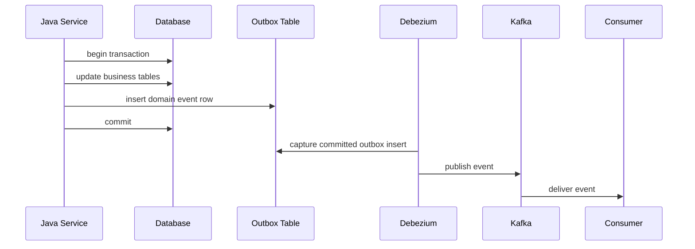
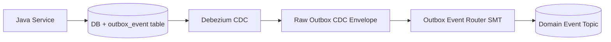
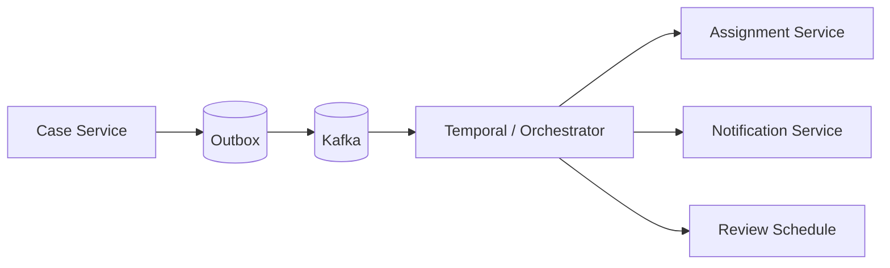
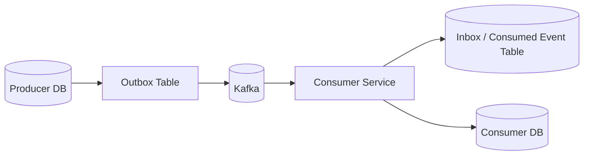

# Part 022 — Outbox Pattern for Pipelines

Part 021 showed how Debezium publishes database row changes. This part covers the pattern that often makes CDC semantically safe for event-driven Java systems: the transactional outbox.

The outbox pattern solves a specific problem:

> How can a Java service update its database and publish an event without losing consistency if the database write succeeds but message publishing fails, or vice versa?

The answer:

> Write the event into an outbox table in the same database transaction as the business state change. A separate relay publishes the outbox row to Kafka or another broker.

In a Debezium-based architecture, the relay can be Debezium reading the outbox table from the database transaction log.



The core idea is simple. The engineering details are not.

---

## 1. The Dual-Write Problem

Suppose a Java service performs this logic:

```java
caseRepository.escalate(caseId);
kafkaProducer.send("case-events", new CaseEscalated(caseId));
```

There are two durable systems:

1. the database,
2. Kafka.

The code performs two writes.

That creates failure windows.

### Failure Window A — Database Succeeds, Kafka Fails

```text
DB update committed
Kafka publish failed
```

Result:

- source state says case is escalated,
- downstream systems never see `CaseEscalated`,
- projection/search/workflow/analytics may be stale forever.

### Failure Window B — Kafka Succeeds, Database Fails

```text
Kafka event published
DB transaction rolled back
```

Result:

- downstream systems believe case escalated,
- source state says it did not,
- consumers may trigger invalid side effects.

### Failure Window C — Unknown Outcome

```text
Kafka publish times out
DB commit result uncertain
process crashes
```

Result:

- the service cannot know what happened without recovery logic,
- retries may duplicate or contradict events.

The naive answer is distributed transaction / two-phase commit. In many modern architectures, that is operationally avoided because it couples systems tightly, adds availability constraints, and may not be supported across all components.

The outbox pattern avoids cross-system atomic commit by making the business state and event record part of one database transaction.

---

## 2. The Outbox Core Invariant

The invariant:

> If a business transaction commits, then the event describing that committed business fact is durably stored in the same database transaction and will be publishable later. If the transaction rolls back, neither the business state nor the event exists.

This gives you atomicity between:

- business table mutation,
- event intent persistence.

It does not automatically guarantee that every consumer processes the event exactly once. Consumers still need idempotency.

Outbox solves producer-side atomicity. It does not erase distributed systems.

---

## 3. Outbox Is Not Just a Table

A weak implementation says:

> Add `outbox_events` table and publish rows.

A production implementation defines:

- event identity,
- aggregate identity,
- aggregate type,
- event type,
- event version,
- payload format,
- ordering key,
- causation/correlation IDs,
- trace context,
- tenant/security classification,
- publication status if polling relay is used,
- cleanup/archive policy,
- retry and DLQ policy,
- schema compatibility policy,
- operational ownership.

The table is only the storage mechanism. The pattern is a transactional publication protocol.

---

## 4. Minimal Outbox Table Design

A simple relational outbox table:

```sql
create table outbox_event (
    id uuid primary key,
    aggregate_type text not null,
    aggregate_id text not null,
    event_type text not null,
    event_version int not null,
    occurred_at timestamptz not null,
    payload jsonb not null,
    headers jsonb not null default '{}'::jsonb,
    created_at timestamptz not null default now()
);

create index idx_outbox_event_created_at on outbox_event(created_at);
create index idx_outbox_event_aggregate on outbox_event(aggregate_type, aggregate_id, created_at);
```

This is enough for a Debezium insert-only outbox stream.

But depending on requirements, you may add:

```sql
alter table outbox_event add column tenant_id text;
alter table outbox_event add column correlation_id text;
alter table outbox_event add column causation_id text;
alter table outbox_event add column traceparent text;
alter table outbox_event add column schema_subject text;
alter table outbox_event add column partition_key text;
alter table outbox_event add column classification text;
```

For a polling relay, you may also add publication state:

```sql
alter table outbox_event add column published_at timestamptz;
alter table outbox_event add column publish_attempts int not null default 0;
alter table outbox_event add column next_attempt_at timestamptz;
alter table outbox_event add column last_error text;
```

For Debezium-based outbox, publication state is often unnecessary because the transaction log is the relay source.

---

## 5. Insert-Only Outbox vs Status-Based Outbox

There are two broad outbox families.

### Insert-Only Outbox

The application only inserts event rows.

```text
business transaction -> insert outbox row -> commit -> Debezium captures insert
```

Strengths:

- simple application logic,
- immutable event record,
- Debezium naturally captures inserts,
- good auditability,
- no polling locks required.

Weaknesses:

- cleanup/archive must be designed,
- replay from table may require retaining rows,
- publication success is tracked in Kafka/connect metrics rather than row status.

### Status-Based Outbox

A relay polls rows with `published_at is null`, publishes them, then marks them published.

Strengths:

- works without CDC,
- explicit publish status,
- can be implemented with plain Java scheduler.

Weaknesses:

- lock contention,
- poll interval latency,
- duplicate publish on crash after send before mark-published,
- cleanup complexity,
- relay scaling requires careful `skip locked`/partitioning.

For high-throughput Kafka architectures, Debezium-based insert-only outbox is often cleaner. For small systems without CDC infrastructure, polling may be acceptable.

---

## 6. Domain Event vs Table Change

A table CDC event says:

```text
case_file.status changed from UNDER_REVIEW to ESCALATED
```

An outbox event says:

```text
CaseEscalated
```

with a payload like:

```json
{
  "caseId": "C-1001",
  "previousStatus": "UNDER_REVIEW",
  "newStatus": "ESCALATED",
  "escalationReason": "SLA_RISK",
  "riskScore": 93,
  "escalatedBy": "rule-engine",
  "effectiveAt": "2026-07-04T09:30:00Z"
}
```

This event carries business meaning that cannot reliably be derived from row diff alone.

Use outbox when consumers care about the domain fact.

Use table CDC when consumers care about state replication.

---

## 7. Java Transaction Boundary

The outbox row must be inserted in the same transaction as the business state change.

Conceptually:

```java
@Transactional
public void escalateCase(CaseId caseId, EscalationReason reason) {
    CaseFile caseFile = caseRepository.getForUpdate(caseId);

    CaseEscalated event = caseFile.escalate(reason, clock.instant());

    caseRepository.save(caseFile);
    outboxRepository.append(OutboxEvent.from(event));
}
```

The important rule:

> Do not publish to Kafka inside this transaction as the primary reliability mechanism.

The transaction should persist intent. The relay publishes later.

A stronger domain model makes event generation part of aggregate behavior:

```java
public final class CaseFile {
    private final List<DomainEvent> pendingEvents = new ArrayList<>();

    public void escalate(EscalationReason reason, Instant now) {
        if (!status.canEscalate()) {
            throw new InvalidTransitionException(status, "ESCALATE");
        }

        CaseStatus previous = status;
        this.status = CaseStatus.ESCALATED;
        this.escalatedAt = now;

        pendingEvents.add(new CaseEscalated(id, previous, status, reason, now));
    }

    public List<DomainEvent> pullEvents() {
        List<DomainEvent> copy = List.copyOf(pendingEvents);
        pendingEvents.clear();
        return copy;
    }
}
```

Application service:

```java
@Transactional
public void escalateCase(CaseId caseId, EscalationReason reason) {
    CaseFile caseFile = repository.load(caseId);
    caseFile.escalate(reason, clock.instant());
    repository.save(caseFile);

    for (DomainEvent event : caseFile.pullEvents()) {
        outbox.append(event);
    }
}
```

The aggregate owns domain semantics. The outbox owns durable event publication.

---

## 8. Event Identity and Idempotency

Every outbox event needs a stable ID.

```java
public record EventId(UUID value) {}
```

This ID becomes:

- Kafka record header or payload field,
- consumer idempotency key,
- DLQ correlation key,
- audit lookup key,
- replay boundary.

Consumer-side dedupe table:

```sql
create table consumed_event (
    consumer_name text not null,
    event_id uuid not null,
    consumed_at timestamptz not null default now(),
    primary key (consumer_name, event_id)
);
```

Consumer algorithm:

```text
begin transaction
  insert into consumed_event(consumer_name, event_id)
  if duplicate: skip
  apply business side effect/projection update
commit transaction
commit Kafka offset
```

Java-ish implementation:

```java
public void handle(OutboxMessage message) {
    tx.execute(() -> {
        boolean firstTime = dedupe.tryMarkConsumed("case-search-indexer", message.eventId());
        if (!firstTime) {
            return;
        }
        projection.apply(message);
    });
}
```

Outbox events may be delivered more than once due to relay retries, Kafka consumer rebalances, sink unknown outcomes, or replay. Event ID is your dedupe anchor.

---

## 9. Aggregate Ordering

Events often need ordering per aggregate.

Example:

```text
CaseCreated(C-1001)
CaseAssigned(C-1001)
CaseEscalated(C-1001)
CaseClosed(C-1001)
```

Kafka ordering is per partition. Therefore, the Kafka key should usually be aggregate ID or a partition key derived from it.

```text
key = caseId
```

Outbox table should store this explicitly:

```sql
partition_key text not null
```

Then routing uses that key.

If events for one aggregate are published with random keys, consumers may observe them out of order.

Bad:

```text
key = eventId
```

Better:

```text
key = aggregateId
```

But aggregate ID is not always sufficient.

For workflows where ordering spans multiple aggregates, such as `caseId + partyId`, define the ordering boundary consciously.

| Ordering Boundary | Key Example | Trade-Off |
|---|---|---|
| Per aggregate | `caseId` | Common and scalable |
| Per tenant | `tenantId` | Strong tenant ordering, poor parallelism |
| Per workflow | `workflowInstanceId` | Good for process state |
| Per event | `eventId` | Maximum distribution, no aggregate order |
| Composite key | `caseId:partyId` | Useful for sub-aggregate streams |

Never leave partition key as an accidental default.

---

## 10. Outbox Payload Design

An outbox payload should be a consumer contract, not a database row dump.

Example:

```json
{
  "eventId": "4b7d7f6e-8f4b-47a3-8e8a-3eb4df0a1b35",
  "eventType": "CaseEscalated",
  "eventVersion": 2,
  "occurredAt": "2026-07-04T09:30:00Z",
  "aggregateType": "CaseFile",
  "aggregateId": "C-1001",
  "data": {
    "caseId": "C-1001",
    "previousStatus": "UNDER_REVIEW",
    "newStatus": "ESCALATED",
    "reason": "SLA_RISK",
    "riskScore": 93
  },
  "metadata": {
    "correlationId": "req-891",
    "causationId": "cmd-551",
    "tenantId": "regulator-id",
    "producer": "case-service",
    "classification": "INTERNAL"
  }
}
```

Separate these concepts:

| Field | Meaning |
|---|---|
| `eventId` | Unique event identity |
| `eventType` | Semantic event name |
| `eventVersion` | Contract version |
| `occurredAt` | Business occurrence time |
| `aggregateType` | Domain aggregate kind |
| `aggregateId` | Aggregate identity and often partition key |
| `data` | Event-specific facts |
| `metadata` | Context, tracing, governance |

Avoid payloads like:

```json
{
  "table": "case_file",
  "row": { "status": "ESCALATED" }
}
```

That is table CDC disguised as outbox.

---

## 11. Event Versioning

Outbox events are long-lived contracts.

Versioning rules:

- adding optional fields is usually safe,
- removing fields is breaking,
- renaming fields is breaking,
- changing type is breaking,
- changing semantic meaning is breaking even if schema is unchanged,
- splitting one event into many can be breaking,
- merging events can be breaking.

A Java event hierarchy can make this explicit:

```java
public sealed interface DomainEvent permits CaseEscalatedV1, CaseEscalatedV2 {
    UUID eventId();
    String aggregateId();
    Instant occurredAt();
    int eventVersion();
}

public record CaseEscalatedV2(
    UUID eventId,
    String caseId,
    String previousStatus,
    String newStatus,
    String reason,
    Integer riskScore,
    Instant occurredAt
) implements DomainEvent {
    @Override public String aggregateId() { return caseId; }
    @Override public int eventVersion() { return 2; }
}
```

Do not rely on class names alone as contracts. Consumers need stable serialized names.

---

## 12. Debezium Outbox Event Router

Debezium provides an Outbox Event Router single message transform for relational outbox tables.

Conceptually, the SMT converts raw CDC rows from the outbox table into cleaner Kafka event records.

Input: Debezium CDC event for an inserted row in `outbox_event`.

Output: Kafka message routed by fields like aggregate type, event type, aggregate ID, payload, and headers.



The practical result:

- consumers do not need to parse Debezium `before/after/op` envelopes for outbox events,
- Kafka topic can be based on outbox fields,
- Kafka key can be aggregate ID,
- payload can be passed through as JSON/Avro/etc.,
- selected columns can become headers.

A conceptual connector snippet:

```properties
transforms=outbox
transforms.outbox.type=io.debezium.transforms.outbox.EventRouter
transforms.outbox.table.field.event.id=id
transforms.outbox.table.field.event.key=aggregate_id
transforms.outbox.table.field.event.type=event_type
transforms.outbox.table.field.event.payload=payload
transforms.outbox.route.by.field=aggregate_type
```

The exact configuration must match your Debezium version and table design.

---

## 13. Topic Routing Strategy

Outbox event routing should reflect consumer contract boundaries.

Options:

| Strategy | Example Topic | Strength | Weakness |
|---|---|---|---|
| By aggregate type | `case-file-events` | Simple ownership | Mixed event types in one topic |
| By event type | `case-escalated` | Specific consumers | Topic explosion |
| By domain | `case-events` | Balanced | Requires filtering by event type |
| By tenant + domain | `tenant-a.case-events` | Isolation | Operational complexity |
| By bounded context | `enforcement.case-events` | Good domain alignment | Requires clear domain model |

Recommended default:

```text
<bounded-context>.<aggregate-or-domain>.events
```

Example:

```text
enforcement.case.events
enforcement.assignment.events
enforcement.decision.events
```

Within topic:

```text
key = aggregate_id
header event_type = CaseEscalated
payload = event payload
```

This balances ordering, topic count, and consumer ergonomics.

---

## 14. Outbox Relay Alternatives

Debezium is not the only relay.

### Option A — Debezium Relay

```text
outbox table -> transaction log -> Debezium -> Kafka
```

Best when:

- Kafka Connect/Debezium already exists,
- low latency matters,
- high throughput matters,
- database log access is acceptable,
- operations team can monitor CDC.

### Option B — Polling Publisher

```text
outbox table -> Java scheduler -> Kafka
```

Best when:

- no CDC infrastructure,
- low throughput,
- simpler operational environment,
- explicit publish status required.

### Option C — Database Trigger to Queue

Usually avoid unless the platform is built around it. It hides messaging behavior in the database and can be hard to test/version.

### Option D — Event Sourcing Store

If the system is truly event-sourced, the event store itself may be the source and outbox may be unnecessary or differently shaped.

The decision is not "Debezium good, polling bad". The decision depends on throughput, latency, operational maturity, and correctness needs.

---

## 15. Polling Relay Correctness

If using Java polling relay, avoid naive logic:

```java
List<OutboxEvent> events = repository.findUnpublished();
for (OutboxEvent event : events) {
    kafka.send(event);
    repository.markPublished(event.id());
}
```

Crash window:

```text
send to Kafka succeeds
process crashes before markPublished
```

On restart, event publishes again.

That means consumers still need idempotency.

A better polling relay uses:

- bounded batch size,
- `for update skip locked` or equivalent,
- lease/claim state,
- retry count,
- next attempt time,
- stable event ID,
- idempotent producer where applicable,
- consumer idempotency.

Example claim query:

```sql
select *
from outbox_event
where published_at is null
  and (next_attempt_at is null or next_attempt_at <= now())
order by created_at
limit 100
for update skip locked;
```

But remember: this improves relay concurrency. It still does not give exactly-once end-to-end side effects.

---

## 16. Outbox Cleanup and Retention

Outbox tables grow forever unless managed.

Cleanup strategies:

| Strategy | Description | Risk |
|---|---|---|
| Time-based delete | Delete rows older than N days | Loses replay from table |
| Archive then delete | Move rows to cold storage | More operational work |
| Partition drop | Partition by date and drop old partitions | Efficient but needs partition design |
| Keep forever | Full audit in source DB | Storage bloat |
| Kafka is system of record after publish | DB outbox short retention | Requires Kafka retention/replay policy |

For Debezium insert-only outbox, be careful: deleting rows also produces CDC delete events unless filtered or understood.

Common approach:

- partition outbox by `created_at`,
- retain rows long enough for operational debugging,
- archive before deletion if audit requires,
- configure downstream to ignore cleanup deletes if they are not domain events,
- ensure Debezium/outbox router behavior matches cleanup plan.

Outbox cleanup is not a DBA afterthought. It is part of the publication protocol lifecycle.

---

## 17. Outbox and Transaction Size

Do not store huge payloads casually.

Large outbox payloads cause:

- bigger database writes,
- more WAL/binlog volume,
- larger Kafka messages,
- higher broker memory/network pressure,
- slower consumers,
- harder retries,
- increased DLQ cost.

Payload design options:

| Option | Description | Trade-Off |
|---|---|---|
| Full event payload | Self-contained event | Larger messages, easier consumers |
| ID-only event | Consumers fetch state | Small messages, source coupling |
| Summary + reference | Useful fields plus lookup reference | Balanced, lookup needed for detail |
| Snapshot event | Carries full aggregate state | Good for projection, may be large |
| Delta event | Carries changed facts | Compact, harder projection rebuild |

Default for domain events:

> Include enough data for common consumers to act without querying the source, but avoid dumping entire database rows by habit.

---

## 18. Outbox in a Regulatory Case System

Example use case:

A case moves from `UNDER_REVIEW` to `ESCALATED` because SLA risk exceeded threshold.

Business transaction:

```sql
update case_file
set status = 'ESCALATED',
    escalated_at = now(),
    escalation_reason = 'SLA_RISK'
where case_id = 'C-1001';

insert into case_timeline (...);

insert into outbox_event (
    id,
    aggregate_type,
    aggregate_id,
    event_type,
    event_version,
    occurred_at,
    partition_key,
    payload,
    headers
) values (
    '4b7d7f6e-8f4b-47a3-8e8a-3eb4df0a1b35',
    'CaseFile',
    'C-1001',
    'CaseEscalated',
    1,
    now(),
    'C-1001',
    '{"caseId":"C-1001","reason":"SLA_RISK","newStatus":"ESCALATED"}'::jsonb,
    '{"correlationId":"req-891","classification":"INTERNAL"}'::jsonb
);
```

Downstream consumers:

| Consumer | Action |
|---|---|
| Search indexer | Updates case search document |
| SLA monitor | Stops old timer, starts escalation timer |
| Notification service | Notifies responsible team |
| Audit lake | Appends immutable event |
| Analytics model | Updates escalation metrics |

Each consumer processes the same domain fact but owns its own side effect and idempotency.

---

## 19. Outbox and Sagas / Workflows

Outbox events often trigger workflows.

Example:

```text
CaseEscalated -> assign senior reviewer -> schedule committee review -> notify enforcement team
```

Do not put the entire workflow inside the original database transaction.

The original transaction should only do:

- validate command,
- update local state,
- persist event.

Workflow orchestration happens asynchronously:



If the workflow fails, compensate or retry at workflow level. Do not hold the case database transaction open across external calls.

---

## 20. Outbox and Inbox Together

Outbox solves producer-side atomicity.

Inbox solves consumer-side idempotency.

Together:



Consumer transaction:

```text
begin
  insert event_id into inbox
  apply local state change
commit
```

If insert fails due to duplicate key, the event was already processed.

This is the realistic pattern behind many "effectively once" systems.

---

## 21. Outbox Failure Model

Outbox changes failure modes. It does not eliminate them.

| Failure | Expected Behavior |
|---|---|
| App crashes before commit | No business change, no event |
| App crashes after commit | Business change and event row exist; relay publishes later |
| Debezium down | Event rows remain in DB log/table; publish resumes if log retained |
| Kafka down | Debezium/Connect fails or retries; freshness degrades |
| Consumer duplicate | Consumer dedupes by event ID |
| Bad event payload | Consumer DLQs or rejects; producer contract fixed |
| Event schema breaking change | Compatibility gate should catch before prod |
| Outbox table cleanup too early | Debug/replay may be impaired |
| Source log retention expires | Debezium may need resnapshot/repair |

The important property:

> A committed business change has a durable event intent even if publication is delayed.

---

## 22. Testing the Outbox Pattern

Do not test only that an outbox row exists.

Test the protocol.

### Unit Tests

- aggregate emits correct domain event,
- event payload includes required fields,
- event version is correct,
- partition key is stable,
- sensitive fields are excluded,
- invalid state transition emits no event.

### Transaction Tests

- business update and outbox insert commit together,
- rollback removes both business change and outbox row,
- concurrent commands preserve aggregate invariants,
- event order per aggregate is stable.

### Relay Tests

- Debezium captures outbox insert,
- EventRouter routes to expected topic,
- Kafka key equals aggregate ID,
- headers are mapped correctly,
- payload is unchanged if pass-through is expected.

### Consumer Tests

- duplicate event is ignored,
- old version is handled or rejected deliberately,
- missing required field is DLQ'd,
- event replay rebuilds projection,
- side effects are not repeated.

### Failure Injection

- crash after DB commit before relay publish,
- stop Debezium for longer than normal,
- restart consumer during processing,
- publish duplicate event,
- schema change event payload,
- cleanup old outbox partitions.

---

## 23. Java Implementation Skeleton

Domain event interface:

```java
public sealed interface DomainEvent permits CaseEscalated {
    UUID eventId();
    String eventType();
    int eventVersion();
    String aggregateType();
    String aggregateId();
    String partitionKey();
    Instant occurredAt();
}
```

Event:

```java
public record CaseEscalated(
    UUID eventId,
    String caseId,
    String previousStatus,
    String newStatus,
    String reason,
    int riskScore,
    Instant occurredAt
) implements DomainEvent {
    @Override public String eventType() { return "CaseEscalated"; }
    @Override public int eventVersion() { return 1; }
    @Override public String aggregateType() { return "CaseFile"; }
    @Override public String aggregateId() { return caseId; }
    @Override public String partitionKey() { return caseId; }
}
```

Outbox row:

```java
public record OutboxEventRow(
    UUID id,
    String aggregateType,
    String aggregateId,
    String eventType,
    int eventVersion,
    String partitionKey,
    Instant occurredAt,
    String payloadJson,
    String headersJson
) {}
```

Mapper:

```java
public final class OutboxMapper {
    private final ObjectMapper objectMapper;

    public OutboxEventRow toRow(DomainEvent event, EventMetadata metadata) {
        return new OutboxEventRow(
            event.eventId(),
            event.aggregateType(),
            event.aggregateId(),
            event.eventType(),
            event.eventVersion(),
            event.partitionKey(),
            event.occurredAt(),
            serializePayload(event),
            serializeHeaders(metadata)
        );
    }

    private String serializePayload(DomainEvent event) {
        try {
            return objectMapper.writeValueAsString(event);
        } catch (JsonProcessingException e) {
            throw new EventSerializationException(event.eventType(), e);
        }
    }
}
```

Repository:

```java
public final class JdbcOutboxRepository {
    private final DataSource dataSource;

    public void append(Connection connection, OutboxEventRow row) throws SQLException {
        try (PreparedStatement ps = connection.prepareStatement("""
            insert into outbox_event (
                id,
                aggregate_type,
                aggregate_id,
                event_type,
                event_version,
                partition_key,
                occurred_at,
                payload,
                headers
            ) values (?, ?, ?, ?, ?, ?, ?, ?::jsonb, ?::jsonb)
            """)) {
            ps.setObject(1, row.id());
            ps.setString(2, row.aggregateType());
            ps.setString(3, row.aggregateId());
            ps.setString(4, row.eventType());
            ps.setInt(5, row.eventVersion());
            ps.setString(6, row.partitionKey());
            ps.setObject(7, row.occurredAt());
            ps.setString(8, row.payloadJson());
            ps.setString(9, row.headersJson());
            ps.executeUpdate();
        }
    }
}
```

The important part is not JDBC itself. It is that this insert uses the same transaction connection as the business writes.

---

## 24. Common Implementation Trap: Framework Events

Many Java frameworks provide in-process events.

Example:

```java
applicationEventPublisher.publishEvent(new CaseEscalated(...));
```

This is useful for modularity inside one process, but it is not automatically a durable outbox.

Questions to ask:

- Is the event persisted in the same DB transaction?
- Does it survive process crash?
- Can it be replayed?
- Is publication coupled to transaction commit?
- Can downstream consumers dedupe it?
- Is it visible in audit evidence?

An in-memory event bus is not a substitute for a transactional outbox.

Some frameworks support transaction-synchronized listeners. They can help trigger outbox writes, but they do not remove the need for durable event storage.

---

## 25. Outbox Anti-Patterns

### Anti-Pattern 1: Publishing to Kafka and Writing Outbox

If the app writes outbox and also publishes directly, you now have two publication paths.

### Anti-Pattern 2: Outbox Payload Is Just the Database Row

That is table CDC with extra steps.

### Anti-Pattern 3: Random Kafka Key

Aggregate event order becomes accidental.

### Anti-Pattern 4: No Event Version

Consumers cannot evolve safely.

### Anti-Pattern 5: No Consumer Idempotency

Outbox does not guarantee consumers will never see duplicates.

### Anti-Pattern 6: Cleanup Without Replay Strategy

Deleting outbox history may break debugging or re-publication.

### Anti-Pattern 7: Business Logic in Relay

Relay should publish; domain semantics belong to producer and consumers.

### Anti-Pattern 8: One Giant Event Type

`EntityChanged` with vague payload forces every consumer to reverse-engineer business meaning.

### Anti-Pattern 9: Sensitive Payloads by Default

Outbox events spread data widely. Treat them as published contracts.

### Anti-Pattern 10: No Ownership

Event contracts need owners, lifecycle, documentation, and compatibility gates.

---

## 26. Production Checklist

### Producer Service

- [ ] Business state and outbox row are written in one transaction.
- [ ] Event ID is stable and unique.
- [ ] Event type is semantic, not table-oriented.
- [ ] Event version is explicit.
- [ ] Aggregate ID and partition key are explicit.
- [ ] Payload excludes unnecessary sensitive data.
- [ ] Correlation/causation/trace metadata is included.
- [ ] Rollback test proves no orphan event.

### Outbox Table

- [ ] Primary key prevents duplicate event IDs.
- [ ] Index supports relay/cleanup pattern.
- [ ] Partitioning strategy exists for high volume.
- [ ] Retention/archive policy is defined.
- [ ] Cleanup does not create unwanted domain events.

### Debezium Relay

- [ ] Outbox table is captured.
- [ ] Event Router mapping is tested.
- [ ] Kafka key is correct.
- [ ] Topic routing is correct.
- [ ] Payload serialization is stable.
- [ ] Heartbeat and lag monitoring exist.
- [ ] Source log retention covers relay downtime.

### Consumers

- [ ] Deduplication by event ID exists where side effects matter.
- [ ] Event version compatibility is tested.
- [ ] Replay does not duplicate irreversible effects.
- [ ] DLQ preserves event ID and metadata.
- [ ] Projection stores last applied event/source metadata.

### Governance

- [ ] Event catalog exists.
- [ ] Owners are clear.
- [ ] Breaking-change process exists.
- [ ] Data classification is visible.
- [ ] Retention and audit requirements are documented.

---

## 27. Mental Compression

Remember the outbox pattern with this sentence:

> Persist the fact that an event must be published in the same transaction that makes the fact true.

Everything else is implementation detail:

- Debezium or polling,
- JSON or Avro,
- one topic or many,
- short retention or long archive,
- Kafka Streams or plain consumer.

The invariant is the core.

If a case was escalated, the event record exists. If the transaction rolled back, it does not. Publication can lag, retry, duplicate, or replay, but the intent is durable and recoverable.

That is why outbox is one of the most important patterns in production-grade Java data pipelines.

---

## 28. How This Connects to the Next Part

Outbox handles reliable publication from producer services. The next natural problem is the consumer side.

When a consumer receives an event, it may need to:

- update its own database,
- avoid duplicate side effects,
- resume after crash,
- store processing state,
- coordinate Kafka offset with local transaction,
- rebuild from replay.

That is the inbox/dedupe and consumer state pattern.

Outbox makes producer intent durable. Inbox makes consumer application durable.

Together they form the backbone of reliable, replay-safe data pipelines.

---

## References

- Microservices.io — Transactional Outbox Pattern: https://microservices.io/patterns/data/transactional-outbox.html
- Microservices.io — Transaction Log Tailing Pattern: https://microservices.io/patterns/data/transaction-log-tailing.html
- Debezium Documentation — Outbox Event Router: https://debezium.io/documentation/reference/stable/transformations/outbox-event-router.html
- Debezium Documentation — Features: https://debezium.io/documentation/reference/stable/features.html
- Kafka Documentation — Producer / Consumer / Transactions: https://kafka.apache.org/documentation/
