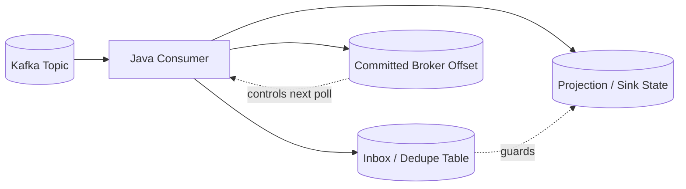
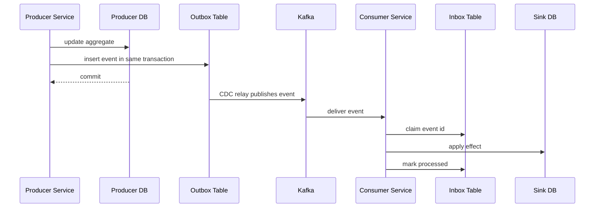
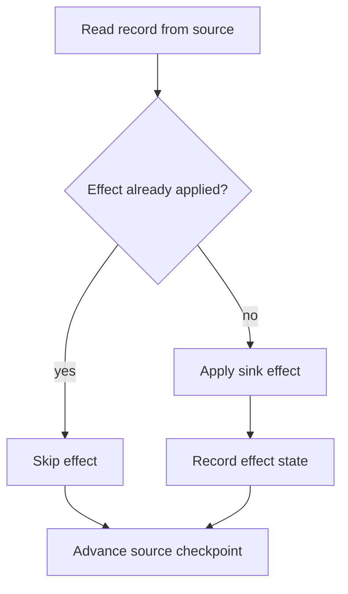
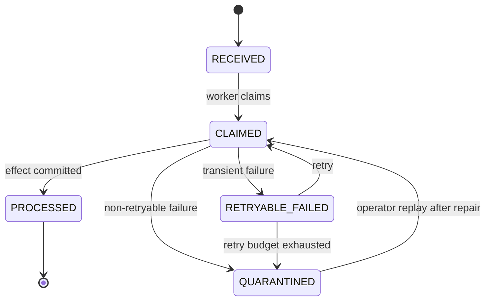
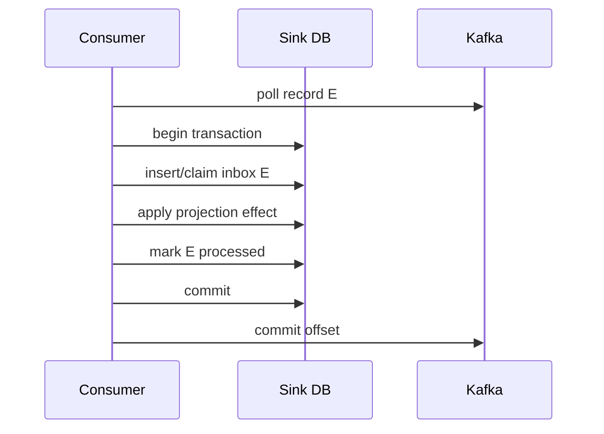

# Part 023 — Inbox Dedupe and Consumer State

Part 022 covered the outbox pattern on the producer side.

This part covers the consumer-side counterpart:

> The inbox pattern records what a consumer has received, claimed, processed, skipped, failed, or quarantined so that replay and duplicate delivery do not corrupt downstream state.

A production pipeline cannot rely on "the broker delivered this once" as its correctness boundary. The broker may redeliver. The consumer may crash after writing to the sink but before committing the offset. A rebalance may move partitions. A deploy may restart workers. A backfill may intentionally replay old events. A bug fix may require reprocessing historical input.

The key idea:

> Broker offsets tell you where the consumer is in the stream. Inbox state tells you what effects the consumer has already applied.

Those are related, but they are not the same.



A top-tier engineer does not ask only:

> Did I commit the Kafka offset?

They ask:

> If this exact event is delivered again tomorrow, after a failed deploy, during a backfill, or after a partition rebalance, will the sink state still be correct?

---

## 1. The Real Problem: Side Effects Outlive Consumer Memory

Consider this Java consumer:

```java
for (ConsumerRecord<String, CaseEvent> record : records) {
    CaseEvent event = record.value();
    projectionRepository.apply(event);
    kafkaConsumer.commitSync();
}
```

It looks reasonable.

But it has a failure window:

```text
1. consumer receives event E
2. consumer writes projection update to database
3. process crashes before committing Kafka offset
4. consumer restarts
5. Kafka delivers E again
6. consumer writes projection update again
```

If the projection update is an idempotent upsert, maybe nothing breaks.

If the projection increments a counter, inserts a ledger row, sends an email, creates an alert, or calls an external API, duplicate handling becomes critical.

The inbox pattern exists because:

```text
consumer process memory is volatile
side effects are durable
broker offset is not the same as effect history
```

---

## 2. Outbox and Inbox Are a Pair

Outbox protects producer-side atomicity.

Inbox protects consumer-side idempotency.



The producer says:

> I changed state and recorded the fact atomically.

The consumer says:

> I will apply this fact at most once for my consumer purpose.

That final phrase is important: **for my consumer purpose**.

The same event may be processed once by a search indexer, once by an analytics sink, once by an alerting pipeline, and once by an audit pipeline. Each consumer group needs its own processing history.

---

## 3. Inbox Is Not Always a Literal Inbox Table

There are several consumer-state patterns. The name "inbox" is useful, but the implementation can vary.

### Pattern A — Processed Message Table

The consumer stores only IDs of messages that were successfully processed.

```sql
create table processed_message (
    consumer_name      text        not null,
    message_id         text        not null,
    processed_at       timestamptz not null default now(),
    source_topic       text        null,
    source_partition   int         null,
    source_offset      bigint      null,
    primary key (consumer_name, message_id)
);
```

Use when:

- processing is fast,
- failures can be retried from broker/backfill,
- you only need dedupe, not a full work queue.

### Pattern B — Inbox Table

The consumer first stores the received message, then processes it from the inbox.

```sql
create table inbox_message (
    consumer_name      text        not null,
    message_id         text        not null,
    idempotency_key    text        not null,
    aggregate_type     text        null,
    aggregate_id       text        null,
    event_type         text        not null,
    event_version      int         not null,
    payload_json       jsonb       not null,
    headers_json       jsonb       not null default '{}',
    source_topic       text        not null,
    source_partition   int         not null,
    source_offset      bigint      not null,
    status             text        not null,
    attempt_count      int         not null default 0,
    first_seen_at      timestamptz not null default now(),
    last_attempt_at    timestamptz null,
    processed_at       timestamptz null,
    failure_reason     text        null,
    primary key (consumer_name, message_id)
);

create index inbox_message_pending_idx
    on inbox_message (consumer_name, status, first_seen_at);
```

Use when:

- processing can be long-running,
- failures need operator visibility,
- you want durable retry independent from broker retention,
- you want replay, quarantine, and audit trails.

### Pattern C — Projection Version State

The projection row itself stores the last applied version or event sequence.

```sql
create table case_projection (
    case_id              uuid primary key,
    status               text not null,
    escalation_level     int not null,
    last_event_sequence  bigint not null,
    last_event_id        text not null,
    updated_at           timestamptz not null
);
```

Use when:

- events have a strict per-aggregate sequence,
- only latest state matters,
- duplicate or stale events can be ignored by comparing event sequence.

### Pattern D — Ledger Contribution Table

For additive aggregation, store the contribution of each event.

```sql
create table sla_breach_contribution (
    consumer_name    text not null,
    event_id         text not null,
    case_id          uuid not null,
    breach_type      text not null,
    contribution     numeric not null,
    occurred_at      timestamptz not null,
    primary key (consumer_name, event_id)
);
```

Then compute aggregate from contributions or maintain a derived summary transactionally.

Use when:

- duplicate increments are dangerous,
- auditability matters,
- financial/regulatory counts must be explainable.

### Pattern E — External Idempotency Key

For external APIs that support idempotency keys, pass a stable key.

```java
ExternalAlertRequest request = new ExternalAlertRequest(
    alertPayload,
    event.idempotencyKey().value()
);
```

Use when:

- the side effect is outside your database,
- the external system can dedupe using a request key,
- you still record local inbox state for recovery.

---

## 4. Do Not Confuse Message ID, Event ID, and Idempotency Key

A common mistake is treating all identifiers as interchangeable.

They are not.

| Identifier | Meaning | Stability Requirement |
|---|---|---|
| `message_id` | Unique physical message emitted into a channel | Stable for deduping broker-level redelivery |
| `event_id` | Unique domain fact occurrence | Stable across relay/retry/republication |
| `idempotency_key` | Key for a specific effect | Stable for the consumer side effect |
| `aggregate_id` | Entity or business object affected | Stable for ordering/grouping |
| `correlation_id` | Request/business flow trace | Stable across a business process |
| `causation_id` | Previous event/command that caused this event | Stable for causal graph |

For many pipelines, `message_id` and `event_id` are the same. But in mature systems, separating them avoids ambiguity.

Example:

```text
Event ID: CASE-ESCALATED-87123-v7
Message ID: Kafka message produced by relay attempt #2
Idempotency Key: alert-service:case-escalation-alert:CASE-87123:v7
Aggregate ID: CASE-87123
Correlation ID: CUSTOMER-COMPLAINT-FLOW-993
Causation ID: CASE-SLA-BREACHED-555
```

The consumer dedupe key should represent the **effect being guarded**, not merely the transport artifact.

---

## 5. Consumer State Has Two Layers

A robust consumer tracks two different things:

1. **stream position**,
2. **effect application state**.

### Stream Position

This answers:

> What records should the broker deliver next?

Examples:

- Kafka topic/partition/offset,
- database CDC LSN,
- file name and byte offset,
- API cursor,
- object storage manifest position.

### Effect Application State

This answers:

> Has this event already changed my sink?

Examples:

- inbox row status,
- processed message row,
- projection last applied event sequence,
- ledger contribution row,
- external idempotency request key.

### Why You Need Both

A consumer can commit stream position after writing effects.

But during replay, backfill, restore, or manual repair, stream position may intentionally move backward. Effect state prevents old records from corrupting the sink again.



---

## 6. Minimal Processed-Message Implementation

The simplest safe pattern is:

1. start database transaction,
2. insert processed marker with unique constraint,
3. if insert succeeds, apply effect,
4. commit database transaction,
5. commit Kafka offset.

The unique constraint is the dedupe mechanism.

```sql
create table processed_message (
    consumer_name text not null,
    message_id text not null,
    processed_at timestamptz not null default now(),
    primary key (consumer_name, message_id)
);
```

Java pseudo-code:

```java
public final class InboxGuard {
    private final JdbcTemplate jdbc;
    private final String consumerName;

    public boolean tryClaim(String messageId) {
        try {
            int inserted = jdbc.update("""
                insert into processed_message (consumer_name, message_id)
                values (?, ?)
                """, consumerName, messageId);
            return inserted == 1;
        } catch (DuplicateKeyException duplicate) {
            return false;
        }
    }
}
```

Consumer flow:

```java
@Transactional
public ProcessingResult handle(Envelope<CaseEvent> envelope) {
    boolean firstTime = inboxGuard.tryClaim(envelope.messageId().value());

    if (!firstTime) {
        return ProcessingResult.duplicateSkipped();
    }

    projectionRepository.apply(envelope.payload());
    return ProcessingResult.processed();
}
```

Kafka loop:

```java
for (ConsumerRecord<String, CaseEvent> record : records) {
    Envelope<CaseEvent> envelope = envelopeMapper.from(record);

    ProcessingResult result = transactionalHandler.handle(envelope);

    if (result.canCommitOffset()) {
        offsets.markProcessed(record.topic(), record.partition(), record.offset());
    }
}

consumer.commitSync(offsets.toKafkaOffsets());
```

The database transaction commits before the Kafka offset commit.

If the process crashes after the database commit but before the Kafka commit, the event is delivered again. The unique constraint rejects the duplicate, and the consumer can safely commit the offset.

---

## 7. The Subtle Bug in the Minimal Implementation

The minimal implementation above has a trap.

It inserts the processed marker **before** the effect.

If the marker and effect are in the same transaction, this is fine.

If they are not in the same transaction, it is dangerous.

Bad flow:

```text
1. insert processed_message committed
2. apply projection fails
3. retry sees processed_message already exists
4. event is skipped forever
```

The invariant must be:

```text
processed marker and sink effect are committed atomically
```

If the effect is external and cannot participate in the same transaction, use a different state machine. Do not pretend the operation is atomic.

---

## 8. Inbox State Machine

A real inbox often needs more states than "seen".



Possible statuses:

| Status | Meaning |
|---|---|
| `RECEIVED` | message stored but not yet processed |
| `CLAIMED` | worker is processing it |
| `PROCESSED` | effect has been successfully applied |
| `DUPLICATE` | duplicate message observed and skipped |
| `RETRYABLE_FAILED` | transient failure, eligible for retry |
| `QUARANTINED` | unsafe to retry automatically |
| `IGNORED` | valid message, no effect required |
| `SUPERSEDED` | replaced by newer correction/version |

The exact states depend on the pipeline, but every state must answer:

> Is it safe to advance the source checkpoint?

---

## 9. Store-Then-Process Inbox Pattern

For operationally sensitive pipelines, store the inbound event first.

```java
@Transactional
public InboxStoreResult store(Envelope<?> envelope) {
    try {
        jdbc.update("""
            insert into inbox_message (
              consumer_name,
              message_id,
              idempotency_key,
              aggregate_type,
              aggregate_id,
              event_type,
              event_version,
              payload_json,
              headers_json,
              source_topic,
              source_partition,
              source_offset,
              status
            ) values (?, ?, ?, ?, ?, ?, ?, ?::jsonb, ?::jsonb, ?, ?, ?, 'RECEIVED')
            """,
            consumerName,
            envelope.messageId().value(),
            envelope.idempotencyKey().value(),
            envelope.aggregateType().orElse(null),
            envelope.aggregateId().orElse(null),
            envelope.eventType(),
            envelope.schemaVersion(),
            json.write(envelope.payload()),
            json.write(envelope.headers()),
            envelope.sourceTopic(),
            envelope.sourcePartition(),
            envelope.sourceOffset()
        );
        return InboxStoreResult.stored();
    } catch (DuplicateKeyException duplicate) {
        return InboxStoreResult.duplicate();
    }
}
```

Then a worker processes stored inbox rows:

```java
public List<InboxMessage> claimBatch(int batchSize) {
    return jdbc.query("""
        update inbox_message
           set status = 'CLAIMED',
               attempt_count = attempt_count + 1,
               last_attempt_at = now()
         where (consumer_name, message_id) in (
             select consumer_name, message_id
               from inbox_message
              where consumer_name = ?
                and status in ('RECEIVED', 'RETRYABLE_FAILED')
              order by first_seen_at
              limit ?
              for update skip locked
         )
         returning *
        """, mapper, consumerName, batchSize);
}
```

This pattern decouples broker consumption from processing. It is useful when:

- sink operations are slow,
- retry duration exceeds broker poll interval,
- operators need a visible queue,
- the pipeline must survive broker retention gaps,
- regulated audit requires evidence of what was received.

Trade-off: it introduces another durable queue. That means more storage, more cleanup, and more state transitions.

---

## 10. Consumer Offset Commit with Inbox

There are two common designs.

### Design A — Process Before Offset Commit

```text
poll Kafka
process event transactionally with inbox/sink
commit Kafka offset
```

Pros:

- simple,
- broker remains the retry queue,
- fewer moving parts.

Cons:

- long processing can exceed consumer poll constraints,
- poison records can block partitions,
- operational visibility depends on logs/metrics unless you store failure state.

### Design B — Store Inbox Before Offset Commit, Process Later

```text
poll Kafka
store event in inbox transactionally
commit Kafka offset
worker processes inbox asynchronously
```

Pros:

- fast Kafka consumption,
- durable internal retry queue,
- better operational inspection,
- easier manual replay.

Cons:

- more tables and workers,
- source offset may advance before effect completes,
- freshness SLO must include inbox processing lag,
- exactly-once claim must be enforced by database constraints.

### The Decision Rule

Use **Design A** when event handling is fast, bounded, and unlikely to need manual intervention.

Use **Design B** when event handling is slow, regulated, operationally sensitive, or involves external systems.

---

## 11. Partition Ordering and Inbox Concurrency

Kafka can preserve order within a partition. Your inbox can accidentally destroy that order.

Example:

```text
Partition 3:
  offset 100: CaseAssigned(caseId=7, assignee=A)
  offset 101: CaseReassigned(caseId=7, assignee=B)
```

If two inbox workers process offset 101 before offset 100, the projection may end in the wrong state.

### Option A — Partition-Serial Processing

Process one record at a time per source partition.

Simple but lower throughput.

### Option B — Aggregate-Key Serial Processing

Allow parallelism across aggregates but serialize per aggregate.

```sql
create table aggregate_processing_lock (
    consumer_name text not null,
    aggregate_id text not null,
    locked_until timestamptz not null,
    worker_id text not null,
    primary key (consumer_name, aggregate_id)
);
```

### Option C — Sequence Check in Projection

Let events arrive out of order but apply only expected sequence.

```sql
update case_projection
   set status = ?,
       last_event_sequence = ?
 where case_id = ?
   and last_event_sequence = ?;
```

If the update count is zero, the event is duplicate, stale, or early.

### Option D — Reorder Buffer

Store out-of-order events until missing earlier sequence arrives.

Use carefully. Reorder buffers introduce state growth, timeout rules, and operational complexity.

---

## 12. Replay-Safe Command Handling

An event consumer often translates events into commands:

```text
CaseEscalated -> CreateSupervisorAlert
```

The command handler must also be idempotent.

Bad command model:

```java
alertService.createAlert(caseId, "Case escalated");
```

Safer command model:

```java
AlertCommand command = new AlertCommand(
    new AlertId("case-escalation:" + caseId + ":" + eventVersion),
    caseId,
    "Case escalated",
    envelope.idempotencyKey()
);

alertService.upsertAlert(command);
```

The command carries a stable identity.

That turns "do something" into:

> ensure this effect exists exactly once for this business cause.

---

## 13. Idempotency by Sink Type

Different sinks require different consumer-state strategies.

| Sink Type | Safer Strategy |
|---|---|
| Projection table | Upsert by business key + last event version |
| Append-only audit table | Unique event ID / ledger ID |
| Counter aggregate | Contribution table keyed by event ID |
| Search index | Deterministic document ID + external version |
| Object storage | Deterministic object key + manifest commit |
| External API | Idempotency key + local outbox/inbox bridge |
| Email/notification | Notification ID + sent ledger |
| Cache | Rebuildable write or TTL-based invalidation |

Do not use one generic idempotency solution for all sinks. The correct dedupe key depends on the effect.

---

## 14. The Consumer Transaction Boundary

For database-backed sinks, the ideal transaction is:

```text
begin transaction
  claim/insert inbox marker
  apply sink effect
  mark inbox processed
commit transaction
commit source offset outside DB transaction
```

Why commit source offset outside?

Because Kafka offset commit is not part of your database transaction unless you build a more complex transactional integration. If the database commits and offset commit fails, redelivery is safe because inbox state exists.



The invariant:

```text
source checkpoint may lag effect state
source checkpoint must not lead effect state unless event is durably stored elsewhere
```

This is one of the most important rules in pipeline design.

---

## 15. Failure Matrix

| Failure Point | What Happens | Required Protection |
|---|---|---|
| crash before inbox insert | broker redelivers | normal retry |
| crash after inbox insert before effect | retry sees `RECEIVED`/`CLAIMED` and resumes | status model / claim timeout |
| crash after effect before mark processed | transaction rollback or idempotent effect | atomic DB transaction or effect idempotency |
| crash after DB commit before offset commit | broker redelivers | duplicate skip from inbox |
| rebalance during processing | another worker may see same record | inbox unique key / claim lock |
| backfill replays old topic | old records redelivered | durable dedupe state / version check |
| duplicate event ID from producer bug | consumer may skip distinct facts | producer identity invariant / monitoring |
| same fact with new event ID | consumer may apply twice | business idempotency key |
| poison record | repeated failure | DLQ/quarantine state |

---

## 16. Claim Timeout and Worker Death

If an inbox worker claims a message then dies, the message cannot stay `CLAIMED` forever.

Add claim metadata:

```sql
alter table inbox_message
  add column claimed_by text null,
  add column claimed_at timestamptz null,
  add column claim_expires_at timestamptz null;
```

Claim query:

```sql
update inbox_message
   set status = 'CLAIMED',
       claimed_by = ?,
       claimed_at = now(),
       claim_expires_at = now() + interval '5 minutes',
       attempt_count = attempt_count + 1,
       last_attempt_at = now()
 where (consumer_name, message_id) in (
     select consumer_name, message_id
       from inbox_message
      where consumer_name = ?
        and (
             status in ('RECEIVED', 'RETRYABLE_FAILED')
          or (status = 'CLAIMED' and claim_expires_at < now())
        )
      order by first_seen_at
      limit ?
      for update skip locked
 )
 returning *;
```

The claim timeout must be longer than normal processing time but short enough to recover after worker death.

Do not choose it blindly. Measure actual processing duration distribution.

---

## 17. Inbox Retention and Cleanup

Inbox tables can grow forever.

Retention policy depends on replay requirements.

Questions:

1. How far back can the source replay?
2. How far back can operators request backfill?
3. How long must audit evidence be retained?
4. Can the sink be rebuilt from upstream canonical data?
5. Are event IDs guaranteed stable forever?

Possible cleanup strategy:

```sql
create table inbox_message_archive (
    like inbox_message including all
);
```

Then periodically archive processed rows older than a retention window:

```sql
with moved as (
    delete from inbox_message
     where status in ('PROCESSED', 'IGNORED', 'DUPLICATE')
       and processed_at < now() - interval '90 days'
     returning *
)
insert into inbox_message_archive
select * from moved;
```

For high-throughput pipelines, use table partitioning by date or tenant.

Important:

> Do not delete dedupe state earlier than the maximum replay horizon unless the sink itself is safely idempotent.

---

## 18. Broker Offset Is Not an Audit Log

Kafka offsets are excellent for stream position. They are not enough for business audit.

An auditor rarely asks:

> What was the Kafka offset?

They ask:

> Why did this case show as breached at 10:05?

To answer that, you need:

- source event ID,
- event type and version,
- source timestamp,
- ingestion timestamp,
- processing timestamp,
- transform version,
- consumer name/version,
- sink row affected,
- decision/rejection reason,
- replay/backfill indicator.

Inbox state can become part of that evidence trail.

---

## 19. Consumer State Metrics

Expose metrics that reveal both stream lag and effect lag.

Recommended metrics:

```text
consumer.records.polled.count
consumer.offset.commit.success.count
consumer.offset.commit.failure.count
consumer.inbox.insert.count
consumer.inbox.duplicate.count
consumer.inbox.claimed.count
consumer.inbox.processed.count
consumer.inbox.retryable_failed.count
consumer.inbox.quarantined.count
consumer.inbox.oldest_pending_age.seconds
consumer.inbox.processing.duration.ms
consumer.inbox.claim.expired.count
consumer.effect.idempotent_skip.count
consumer.effect.failure.count
consumer.replay.mode.count
```

Critical derived signals:

| Signal | Meaning |
|---|---|
| Kafka lag increasing, inbox pending low | consumer cannot read fast enough |
| Kafka lag low, inbox pending high | read side fast, processing side slow |
| duplicate rate spike | producer retry/replay/backfill or ID bug |
| oldest pending age high | freshness SLO at risk |
| quarantined count increasing | schema/data quality or code regression |
| claim expired count increasing | worker crash or processing timeout too short |

---

## 20. Java Interface Design

A clean design separates:

- source consumption,
- inbox state,
- effect application,
- offset commit.

```java
public interface InboxRepository {
    InboxInsertResult insertReceived(InboundMessage message);
    List<InboxMessage> claimBatch(ConsumerName consumer, int maxMessages);
    void markProcessed(InboxMessageId id, ProcessingEvidence evidence);
    void markRetryableFailure(InboxMessageId id, FailureInfo failure);
    void markQuarantined(InboxMessageId id, FailureInfo failure);
    boolean alreadyProcessed(ConsumerName consumer, MessageId messageId);
}
```

```java
public interface EventEffectHandler<E> {
    EffectResult apply(Envelope<E> envelope);
}
```

```java
public final class InboxProcessingService<E> {
    private final InboxRepository inbox;
    private final EventEffectHandler<E> handler;
    private final TransactionTemplate tx;

    public ProcessingResult process(InboxMessage message) {
        return tx.execute(status -> {
            try {
                EffectResult effect = handler.apply(message.toEnvelope());
                inbox.markProcessed(message.id(), effect.evidence());
                return ProcessingResult.processed();
            } catch (RetryablePipelineException retryable) {
                inbox.markRetryableFailure(message.id(), FailureInfo.from(retryable));
                return ProcessingResult.retryableFailure();
            } catch (NonRetryablePipelineException fatal) {
                inbox.markQuarantined(message.id(), FailureInfo.from(fatal));
                return ProcessingResult.quarantined();
            }
        });
    }
}
```

The handler should not know Kafka offsets. The repository should not know business rules. The runner coordinates both.

---

## 21. Handling Deletes and Corrections

Consumer dedupe cannot blindly skip all older events if your domain supports correction.

Example:

```text
E1: CaseClosed(caseId=7, outcome=NO_BREACH)
E2: CaseClosureCorrected(caseId=7, correctedOutcome=BREACH)
```

A correction is not a duplicate. It is a new fact that changes interpretation of a previous fact.

Model correction explicitly:

```java
sealed interface CaseLifecycleEvent permits CaseClosed, CaseClosureCorrected {
    EventId eventId();
    CaseId caseId();
    EventTime occurredAt();
}
```

Consumer logic:

```java
switch (event) {
    case CaseClosed closed -> projection.applyClosure(closed);
    case CaseClosureCorrected corrected -> projection.applyClosureCorrection(corrected);
}
```

Use event identity to dedupe exact repeats. Use business semantics to handle corrections.

---

## 22. Inbox and Backfill

Backfill changes the normal meaning of duplicates.

A replay may produce events that the consumer has already processed. That is expected.

Backfill mode should be explicit:

```java
public enum ProcessingMode {
    LIVE,
    REPLAY,
    BACKFILL,
    REPAIR
}
```

The mode should be stored in the envelope and processing evidence.

Backfill policy examples:

| Pipeline Type | Backfill Behavior |
|---|---|
| projection rebuild | write to new table/version, then swap |
| audit sink | skip already processed event IDs |
| aggregate recompute | truncate/recompute isolated partition |
| notification pipeline | disable external notifications in backfill mode |
| search index | write to shadow index, then alias swap |

A consumer that cannot distinguish live mode from backfill mode will eventually send wrong notifications or mutate production state incorrectly.

---

## 23. Anti-Patterns

### Anti-Pattern 1 — Commit Offset Before Durable Effect

```text
commit offset
then write database
```

If the process crashes after offset commit, the event may be lost from the consumer perspective.

### Anti-Pattern 2 — Dedupe Only in Memory

```java
Set<String> seen = new HashSet<>();
```

Works until restart, rebalance, deploy, or multiple instances.

### Anti-Pattern 3 — Using Kafka Offset as Business Identity

Offsets are transport positions. They are not domain facts.

### Anti-Pattern 4 — One Global Dedupe Table Without Consumer Scope

Different consumers may legitimately process the same event.

Always include `consumer_name` or equivalent scope.

### Anti-Pattern 5 — Hiding Poison Records by Auto-Skipping

Skipping without durable evidence creates silent data loss.

### Anti-Pattern 6 — Deleting Dedupe State Too Early

A replay after cleanup can duplicate effects.

### Anti-Pattern 7 — Treating Corrections as Duplicates

A corrected fact is not the same as a repeated fact.

---

## 24. Production Checklist

Before approving a Java consumer pipeline, answer these questions:

1. What is the stable event ID?
2. What is the effect-specific idempotency key?
3. Where is consumer effect state stored?
4. Is effect state committed atomically with the sink effect?
5. What happens if the process crashes after sink commit but before offset commit?
6. What happens if the event is replayed after 30 days?
7. What happens if two workers receive the same event?
8. What happens if events for the same aggregate arrive out of order?
9. What happens if the producer emits a duplicate with a new message ID?
10. What happens if processing fails 100 times?
11. What is the quarantine workflow?
12. How long is dedupe state retained?
13. How does backfill avoid triggering external side effects?
14. What metrics distinguish broker lag from inbox lag?
15. Can an operator explain why a sink row exists?

---

## 25. Summary

The inbox pattern is not just "a dedupe table".

It is a consumer-side correctness boundary.

The important mental model:

```text
source offset controls what to read next
inbox state controls whether an effect is safe to apply
sink identity controls whether replay changes durable state
```

A production Java pipeline should assume duplicate delivery, replay, crash, rebalance, and backfill are normal events, not rare exceptions.

The consumer is correct only when those events do not corrupt the sink.

In the next part, we close the ingestion phase by discussing schema-on-read vs schema-on-write. This is where pipeline design shifts from "can I move data?" to "when and where do I make data trustworthy?"

---

## References

- Apache Kafka Documentation — Consumer configuration, offset management, delivery, and transactions: https://kafka.apache.org/documentation/
- Debezium Documentation — Change event structure, outbox event router, and CDC connector behavior: https://debezium.io/documentation/reference/stable/
- PostgreSQL Documentation — Constraints, transactions, isolation, and row locking: https://www.postgresql.org/docs/current/
- Enterprise Integration Patterns — Idempotent Receiver and Message Store patterns: https://www.enterpriseintegrationpatterns.com/
