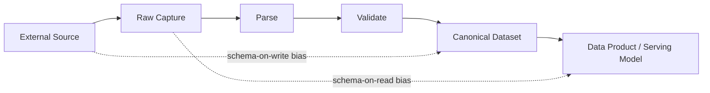
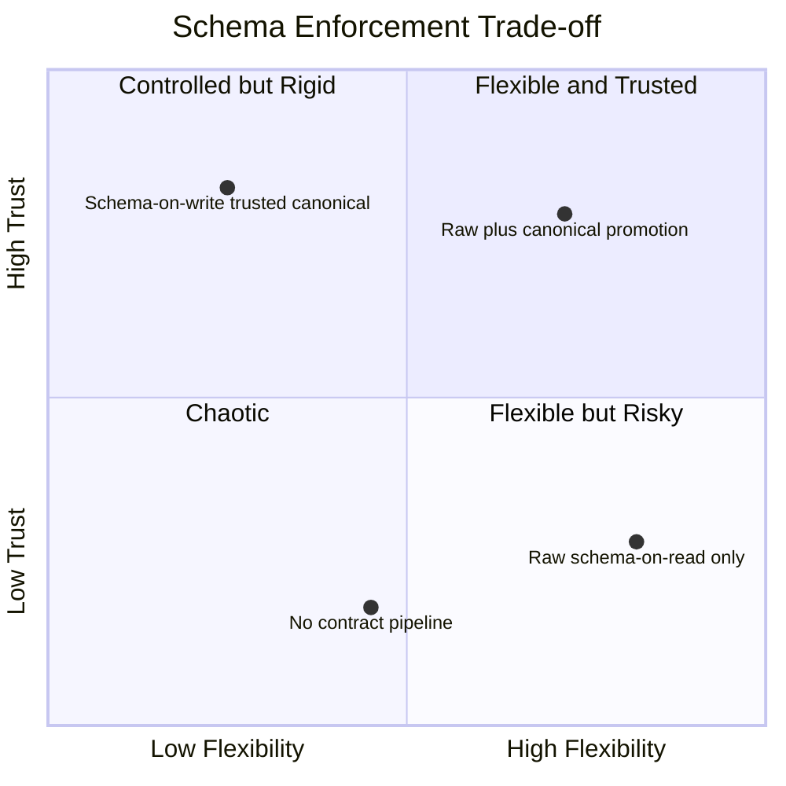
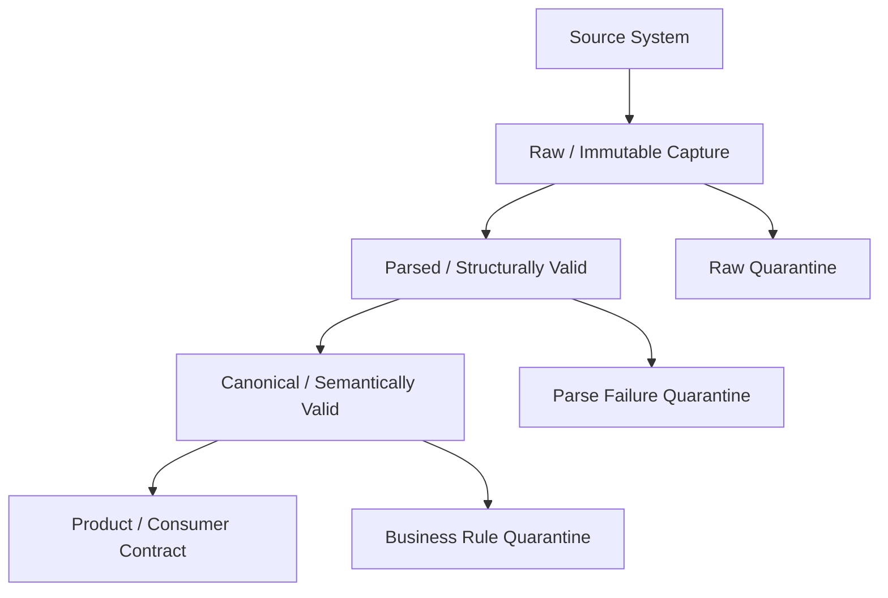
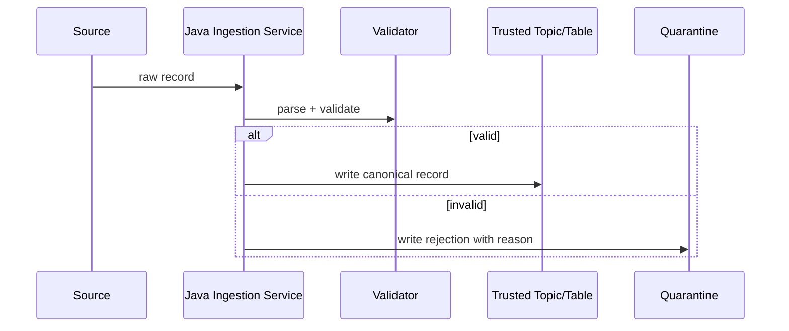
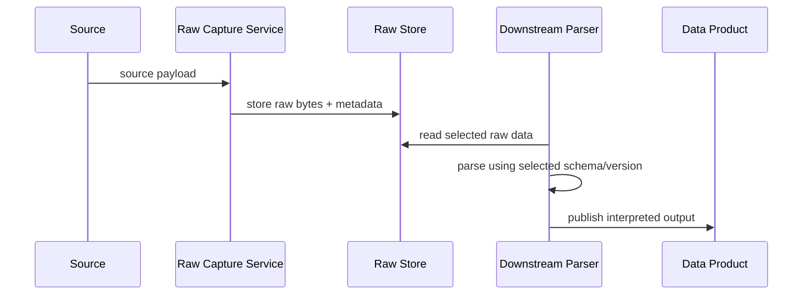
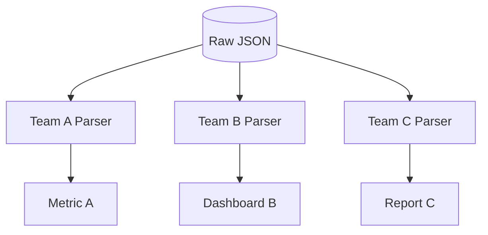
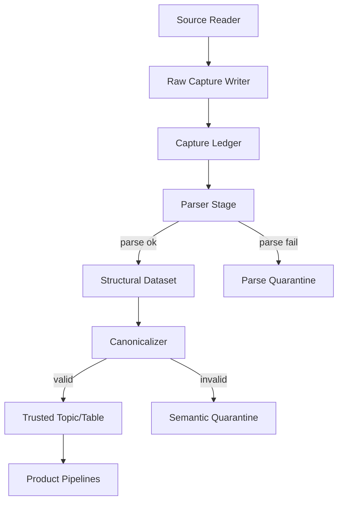

# Part 024 — Schema-on-Read vs Schema-on-Write

This part closes the ingestion phase.

The practical question:

> When data enters a pipeline, do we enforce structure immediately, or do we preserve raw data and interpret it later?

That is the schema-on-write vs schema-on-read decision.

Many engineers treat this as a storage preference:

- warehouse means schema-on-write,
- data lake means schema-on-read.

That framing is too shallow.

The real decision is:

> At which boundary do we convert unknown external data into trusted internal data?



A top-tier pipeline design does not blindly choose one. It uses both deliberately at different boundaries.

---

## 1. The Definitions That Actually Matter

### Schema-on-Write

Schema-on-write means data is validated and shaped before or during durable write into the target dataset.

The writer enforces the schema.

If the record does not fit, the write is rejected, quarantined, or transformed into a compatible shape.

Example:

```text
API response -> Java parser -> validated domain event -> Kafka topic / table
```

Schema-on-write says:

> Once this data is stored in the trusted layer, readers can rely on its structure.

### Schema-on-Read

Schema-on-read means raw or semi-structured data is stored first, and interpretation happens when a reader processes it.

The reader enforces or applies the schema.

Example:

```text
API response JSON -> object storage raw file -> parser later extracts fields
```

Schema-on-read says:

> Preserve source reality first. Interpret it later according to the reader's needs.

### The Important Correction

Schema-on-read does **not** mean no schema.

Schema-on-write does **not** mean no raw preservation.

Good pipelines often do both:

```text
raw immutable capture      -> schema-on-read friendly
canonical trusted dataset  -> schema-on-write enforced
data product              -> contract-specific schema-on-write
```

---

## 2. The Three Shapes of Data

Data has at least three shapes.

### 2.1 Physical Shape

How bytes are stored.

Examples:

- JSON object,
- CSV file,
- Avro record,
- Protobuf message,
- Parquet file,
- database row,
- Kafka record.

### 2.2 Logical Shape

How fields are named and typed.

Examples:

```text
case_id: UUID
status: enum
created_at: timestamp
escalation_level: integer
```

### 2.3 Semantic Shape

What the fields mean.

Examples:

```text
created_at = when the case was opened by the regulator
status = current lifecycle state, not last event type
escalation_level = current operational escalation, not legal severity
```

Most schema debates cover only physical and logical shape.

Production failures often come from semantic mismatch.

Example:

```text
field name: closed_at
team A meaning: when case worker clicked close
team B meaning: when closure decision became legally effective
team C meaning: when closure was loaded into reporting system
```

A pipeline can pass all schema validation and still be wrong.

---

## 3. Why This Decision Is Hard

Schema-on-write gives early control.

Schema-on-read gives late flexibility.

Early control reduces downstream ambiguity but can reject source data during source drift.

Late flexibility preserves data but can push chaos to every downstream consumer.



The strong architecture is not one extreme.

It is staged trust.

---

## 4. Staged Trust Model

A practical ingestion platform should separate layers by trust level.



### Layer 1 — Raw Capture

Goal:

> Preserve what was received.

Properties:

- immutable,
- timestamped,
- source metadata preserved,
- minimal transformation,
- replayable,
- audit-friendly.

### Layer 2 — Parsed Data

Goal:

> Prove the bytes can be interpreted structurally.

Checks:

- valid JSON/CSV/Avro/Protobuf,
- required fields present,
- primitive types parse,
- timestamp formats parse,
- enum fields recognized or safely mapped.

### Layer 3 — Canonical Data

Goal:

> Convert source-specific representation into internal domain meaning.

Checks:

- valid business state,
- domain identity resolved,
- semantic mapping applied,
- source-specific quirks normalized,
- versioned transformation recorded.

### Layer 4 — Product Data

Goal:

> Serve a specific consumer contract.

Checks:

- consumer-specific shape,
- freshness SLO,
- completeness guarantee,
- access control,
- data quality rules,
- lineage.

This model avoids the false binary between schema-on-read and schema-on-write.

---

## 5. Java Type Model for Staged Trust

Represent trust transitions explicitly.

```java
public sealed interface IngestedRecord permits RawRecord, ParsedRecord, CanonicalRecord {
    SourceId sourceId();
    IngestionId ingestionId();
    IngestionTime ingestedAt();
}

public record RawRecord(
    SourceId sourceId,
    IngestionId ingestionId,
    IngestionTime ingestedAt,
    byte[] bytes,
    Map<String, String> sourceHeaders,
    RawFormat format
) implements IngestedRecord {}

public record ParsedRecord<T>(
    SourceId sourceId,
    IngestionId ingestionId,
    IngestionTime ingestedAt,
    SchemaId schemaId,
    T payload
) implements IngestedRecord {}

public record CanonicalRecord<T>(
    SourceId sourceId,
    IngestionId ingestionId,
    IngestionTime ingestedAt,
    SchemaId schemaId,
    TransformVersion transformVersion,
    T domainPayload
) implements IngestedRecord {}
```

Then prevent invalid transitions:

```java
public interface Parser<R> {
    ParseResult<R> parse(RawRecord raw);
}

public interface Canonicalizer<R, C> {
    CanonicalizationResult<C> canonicalize(ParsedRecord<R> parsed);
}
```

The point is not Java ceremony.

The point is preventing this kind of bug:

```java
// Bad: raw external JSON sent directly to trusted topic.
kafkaProducer.send("trusted-case-events", rawApiResponse);
```

A type boundary makes the trust transition visible.

---

## 6. Schema-on-Write Pattern

Schema-on-write is appropriate when consumers need a reliable contract immediately.

### Typical Flow

```text
read source
parse
validate structure
validate business rules
normalize
write trusted sink
reject/quarantine invalid records
```



### Java Skeleton

```java
public final class SchemaOnWriteIngestor<R, C> {
    private final RawSource source;
    private final Parser<R> parser;
    private final Canonicalizer<R, C> canonicalizer;
    private final Sink<CanonicalRecord<C>> trustedSink;
    private final Sink<RejectedRecord> quarantine;

    public void ingestOne() {
        RawRecord raw = source.read();

        parser.parse(raw)
            .flatMap(canonicalizer::canonicalize)
            .onSuccess(trustedSink::write)
            .onFailure(error -> quarantine.write(RejectedRecord.from(raw, error)));
    }
}
```

### Benefits

- consumers see stable structure,
- data quality issues are caught early,
- downstream code is simpler,
- bad records are isolated near the source,
- semantic normalization is centralized,
- governance is easier.

### Costs

- source drift can break ingestion,
- schema changes require deployment or config updates,
- unknown fields may be lost if not preserved,
- strict rejection can reduce availability,
- producer/ingestion team becomes bottleneck.

---

## 7. Schema-on-Read Pattern

Schema-on-read is appropriate when preserving source reality is more important than immediate trust.

### Typical Flow

```text
read source
write raw immutable data
later parse according to consumer/version/use case
```



### Java Skeleton

```java
public final class RawCaptureService {
    private final RawSource source;
    private final RawStore rawStore;
    private final CaptureLedger ledger;

    public void captureOne() {
        RawRecord raw = source.readRaw();
        RawObjectKey key = rawStore.writeImmutable(raw);
        ledger.recordCaptured(raw.ingestionId(), key, raw.sourceId(), raw.ingestedAt());
    }
}
```

A later reader decides how to interpret:

```java
public final class RawReplayJob<R, C> {
    private final RawStore rawStore;
    private final ParserRegistry parserRegistry;
    private final Canonicalizer<R, C> canonicalizer;

    public void replay(RawObjectKey key, SchemaId schemaId) {
        RawRecord raw = rawStore.read(key);
        Parser<R> parser = parserRegistry.parserFor(schemaId);
        ParsedRecord<R> parsed = parser.parse(raw).orThrow();
        CanonicalRecord<C> canonical = canonicalizer.canonicalize(parsed).orThrow();
        // write to target
    }
}
```

### Benefits

- preserves source truth,
- tolerant of unknown fields,
- useful for forensic analysis,
- supports reprocessing with improved parsers,
- decouples capture from interpretation,
- works well for heterogeneous external sources.

### Costs

- consumers may duplicate parsing logic,
- data quality failures move downstream,
- trust boundary becomes unclear,
- raw data may contain sensitive fields,
- query-time parsing can be expensive,
- semantic inconsistency can spread.

---

## 8. Raw Capture Must Still Have a Contract

A dangerous misconception:

> We use schema-on-read, so ingestion does not need a contract.

False.

Raw capture still needs a **capture contract**:

```text
- source identity
- capture timestamp
- byte format
- object key convention
- immutability rule
- checksum
- compression
- encryption
- access classification
- retention
- replay pointer
- parser version compatibility
```

Example raw metadata:

```json
{
  "sourceId": "regulator-case-api",
  "captureId": "cap-20260704-000123",
  "capturedAt": "2026-07-04T08:15:30Z",
  "format": "application/json",
  "encoding": "utf-8",
  "compression": "none",
  "checksumSha256": "...",
  "sourceEndpoint": "/cases/updated",
  "sourceCursor": "cursor-991",
  "classification": "CONFIDENTIAL",
  "schemaHint": "case-api-v3"
}
```

Without this metadata, raw storage becomes a junk drawer.

---

## 9. Trusted Data Must Preserve Evidence

A dangerous misconception in the opposite direction:

> We use schema-on-write, so we do not need raw data.

Also false.

Trusted output should preserve enough evidence to explain itself.

At minimum:

```text
canonical_record_id
source_id
source_record_id
source_event_time
ingestion_time
parser_version
transform_version
schema_version
raw_pointer or source_checksum
validation_result
processing_mode
```

This lets you answer:

- where did this value come from?
- which version of the parser produced it?
- was this live, replay, or backfill?
- can we reprocess it after fixing a bug?
- did the source actually send this, or did we derive it?

---

## 10. Decision Matrix

| Context | Prefer |
|---|---|
| High-trust internal domain event | Schema-on-write at producer or ingress |
| External API with unstable payload | Raw capture + staged schema-on-write promotion |
| CSV/file feeds from partners | Raw landing + manifest + parser validation |
| Regulated audit trail | Preserve raw + trusted canonical output |
| Real-time alerting | Schema-on-write before alert logic |
| Exploratory analytics | Schema-on-read may be acceptable |
| Shared enterprise dataset | Schema-on-write canonical contract |
| ML feature experimentation | Raw/semi-structured capture plus curated feature contracts |
| Operational projection | Schema-on-write with strict idempotency |
| Long-term lakehouse storage | Raw immutable layer + table-format curated layer |

The common production answer:

```text
capture raw defensively
promote to trusted canonical deliberately
serve products through explicit contracts
```

---

## 11. Handling Source Drift

Source drift happens when the upstream changes shape or meaning.

Examples:

```text
field renamed: escalationLevel -> escalation_level
field type changed: caseId number -> string
enum expanded: CLOSED -> CLOSED_NO_ACTION, CLOSED_WITH_ACTION
timestamp timezone changed
field meaning changed without name change
new nested object introduced
null appears in previously required field
```

A robust pipeline distinguishes drift types.

| Drift Type | Example | Handling |
|---|---|---|
| additive field | new optional `region` | preserve, ignore, or map later |
| compatible enum addition | new status value | map to `UNKNOWN` or quarantine by policy |
| type widening | int to long | parser update may be safe |
| type conflict | object to string | quarantine or version parser |
| required field missing | no `caseId` | reject/quarantine |
| semantic drift | `closed_at` meaning changed | contract escalation, not just parser fix |

Schema-on-read can preserve drifted records.

Schema-on-write can detect drift earlier.

A mature system does both:

```text
raw capture succeeds
canonical promotion fails with explicit reason
operator sees drift before consumers silently corrupt state
```

---

## 12. Validation Levels

Do not put every validation rule in one bucket.

### Level 1 — Physical Validation

Can bytes be read?

Examples:

- valid UTF-8,
- valid gzip,
- file checksum matches,
- JSON is well-formed,
- Avro block is readable.

### Level 2 — Structural Validation

Does it match expected shape?

Examples:

- required field present,
- field type correct,
- timestamp parseable,
- array/object structure valid.

### Level 3 — Semantic Validation

Does it make business sense?

Examples:

- `closed_at` cannot be before `created_at`,
- `escalated` case must have escalation owner,
- breach deadline must match policy version,
- status transition must be valid.

### Level 4 — Relational Validation

Does it agree with other datasets?

Examples:

- assignee exists,
- case references valid organization,
- status exists in controlled vocabulary,
- event sequence follows prior state.

### Level 5 — Statistical/Data Quality Validation

Does it look suspicious in aggregate?

Examples:

- sudden 90% drop in daily records,
- null rate spike,
- distribution drift,
- duplicate rate spike.

Schema-on-write usually enforces levels 1–3 before trusted write.

Levels 4–5 often require broader context and may run as quality gates after ingestion.

---

## 13. Quarantine Design

A rejected record should not disappear.

Quarantine record:

```java
public record RejectedRecord(
    IngestionId ingestionId,
    SourceId sourceId,
    RawObjectKey rawPointer,
    ValidationStage stage,
    String errorCode,
    String errorMessage,
    String parserVersion,
    String transformVersion,
    Instant rejectedAt,
    ProcessingMode mode
) {}
```

Quarantine table:

```sql
create table ingestion_quarantine (
    rejection_id       uuid primary key,
    ingestion_id       text not null,
    source_id          text not null,
    raw_pointer        text null,
    validation_stage   text not null,
    error_code         text not null,
    error_message      text not null,
    parser_version     text null,
    transform_version  text null,
    processing_mode    text not null,
    rejected_at        timestamptz not null default now(),
    resolved_at        timestamptz null,
    resolution_note    text null
);
```

The goal is not only to store bad records.

The goal is to make remediation possible:

- fix parser,
- update mapping,
- request upstream correction,
- replay quarantined records,
- document why data was excluded.

---

## 14. Parser Registry Pattern

When sources evolve, hardcoding one parser class is insufficient.

Use a parser registry keyed by source and schema hint/version.

```java
public interface ParserRegistry {
    Optional<Parser<?>> findParser(SourceId sourceId, SchemaHint schemaHint);
}
```

```java
public final class VersionedParserRegistry implements ParserRegistry {
    private final Map<ParserKey, Parser<?>> parsers;

    @Override
    public Optional<Parser<?>> findParser(SourceId sourceId, SchemaHint schemaHint) {
        return Optional.ofNullable(parsers.get(new ParserKey(sourceId, schemaHint)));
    }
}
```

Parser selection should be recorded in processing evidence:

```text
source_id = regulator-case-api
schema_hint = case-api-v3
parser_version = case-api-v3-parser-2026.07.04
transform_version = canonical-case-v12
```

This is what makes replay reproducible.

---

## 15. Canonicalization Is Not Just Renaming Fields

Mapping source data to canonical data often requires business decisions.

Example source payload:

```json
{
  "id": "C-123",
  "state": "closed",
  "closureReason": "resolved",
  "updatedAt": "2026-07-04T11:00:00+07:00"
}
```

Canonical event:

```java
public record CaseClosed(
    CaseId caseId,
    ClosureOutcome outcome,
    EventTime occurredAt,
    SourceId sourceId,
    SourceRecordId sourceRecordId
) implements CaseLifecycleEvent {}
```

Mapping questions:

- Does `state=closed` always mean a legal closure?
- Does `closureReason=resolved` map to `NO_BREACH`, `BREACH_REMEDIATED`, or `UNKNOWN`?
- Is `updatedAt` the event occurrence time or source write time?
- What happens if the source sends `closed` without `closureReason`?
- Is the record a state snapshot or an event fact?

Canonicalization is semantic compression. Treat it as versioned business logic.

---

## 16. Schema-on-Read Failure Mode: Consumer Chaos

A raw-only lake can become a distributed parsing problem.



Each team may interpret:

- timestamps differently,
- missing fields differently,
- enum values differently,
- deleted records differently,
- corrections differently.

The result:

```text
same source data
three different business answers
no single owner of correctness
```

Schema-on-read is useful for preservation and exploration. It is dangerous as the only model for shared trusted data.

---

## 17. Schema-on-Write Failure Mode: Rigid Ingestion

A strict writer can become brittle.

Example:

```text
source adds enum value: ESCALATED_EXTERNALLY
parser rejects it
entire ingestion job fails
freshness SLO breached
operators manually patch data
```

Strictness without graceful degradation can turn harmless changes into outages.

Mitigations:

- preserve raw first,
- quarantine invalid canonical records instead of stopping entire feed,
- allow unknown enum bucket when safe,
- use compatibility tests,
- alert on drift,
- run dual parser versions during migration.

---

## 18. Unknown Fields Policy

Unknown fields are not automatically bad.

Possible policies:

| Policy | Behavior | Use When |
|---|---|---|
| reject | fail record | strict regulated interface |
| preserve-only | store raw, ignore canonical | source may add harmless fields |
| capture-extension | store in extension map | consumers may need later analysis |
| promote-later | raw now, canonical after contract update | staged governance |
| warn | accept but alert | internal source with soft contract |

Java model:

```java
public record ParsedCaseSourceRecord(
    String caseId,
    String status,
    Instant updatedAt,
    Map<String, JsonNode> extensions
) {}
```

Do not let extension maps leak into trusted domain models unless that is explicitly part of the contract.

---

## 19. Null Policy

Nulls are one of the most common pipeline quality failures.

A field can be null for different reasons:

```text
unknown
not applicable
not yet available
redacted
source bug
field removed
field intentionally cleared
```

Those meanings should not collapse into Java `null`.

Better model:

```java
public sealed interface FieldValue<T> {
    record Present<T>(T value) implements FieldValue<T> {}
    record Unknown<T>() implements FieldValue<T> {}
    record NotApplicable<T>() implements FieldValue<T> {}
    record Redacted<T>() implements FieldValue<T> {}
    record Cleared<T>() implements FieldValue<T> {}
}
```

This is not always necessary for every field. But for regulated or high-impact data, explicit absence semantics prevents silent corruption.

---

## 20. Schema Evolution and Compatibility Boundary

This part does not repeat the full schema evolution discussion coming in Parts 025–032.

For ingestion, the key idea is:

> Compatibility must be judged at the boundary where readers rely on the data.

A raw layer may accept almost any additive change.

A trusted canonical topic may require backward/forward compatibility.

A regulatory report output may require formal versioning and approval.

```text
raw capture compatibility: can we preserve bytes and metadata?
parsed compatibility: can parser interpret the structure?
canonical compatibility: can domain meaning remain stable?
product compatibility: can consumers continue safely?
```

Do not use one compatibility rule for all layers.

---

## 21. Lakehouse Interpretation

In lakehouse-style architectures, this often maps to layered datasets.

```text
raw/bronze      = source-preserving capture
silver/canonical = validated, typed, normalized data
gold/product    = use-case-specific serving model
```

But avoid cargo cult.

The layer names are less important than the invariants:

| Layer | Invariant |
|---|---|
| raw | can replay what source sent |
| parsed | can structurally interpret input |
| canonical | can rely on shared domain meaning |
| product | can satisfy consumer contract and SLO |

A bronze/silver/gold design without these invariants is just folder naming.

---

## 22. Event Pipelines vs Analytical Pipelines

Schema-on-write and schema-on-read have different pressure in event vs analytical systems.

### Event Pipeline

Events usually require stronger schema-on-write because consumers react quickly.

A bad event can trigger alerts, actions, emails, escalations, or state changes.

Therefore:

```text
event pipeline = validate before publishing trusted event
```

### Analytical Pipeline

Analytical systems may preserve raw source snapshots and interpret later.

Therefore:

```text
analytical pipeline = raw capture + curated promotion
```

### Hybrid Pattern

For operational analytics:

```text
CDC/outbox event -> Kafka trusted event -> lake raw event archive -> curated Iceberg table -> reports
```

Each boundary has its own schema policy.

---

## 23. Performance and Cost Trade-offs

Schema-on-write spends CPU during ingestion.

Schema-on-read spends CPU during every read or downstream processing job.

If data is read many times, parsing once may be cheaper.

If data is rarely read or schemas are exploratory, parsing on read may be cheaper.

Cost model:

```text
total cost = capture cost + parse cost + validation cost + storage cost + reprocessing cost + failure cost
```

A useful question:

> How many times will this data be read, and by how many independent consumers?

If the answer is "many", invest in trusted canonical representation.

---

## 24. Security and Sensitive Data

Raw data is dangerous because it often contains fields not intended for broad consumption.

Schema-on-read raw zones must have stricter access control than curated zones.

Rules:

- classify raw data at capture time,
- encrypt raw storage,
- restrict direct raw access,
- record access logs,
- avoid copying sensitive raw payloads into DLQ messages without controls,
- redact or tokenize before product serving,
- preserve raw pointers instead of embedding raw data everywhere.

Schema-on-write can reduce sensitive-data spread by producing curated, masked outputs.

But do not assume it removes the need to secure raw data.

---

## 25. Observability

Schema policy should be visible through metrics.

Recommended metrics:

```text
ingestion.raw.captured.count
ingestion.raw.capture.failure.count
ingestion.parse.success.count
ingestion.parse.failure.count
ingestion.canonicalization.success.count
ingestion.canonicalization.failure.count
ingestion.quarantine.count
ingestion.unknown_field.count
ingestion.unknown_enum.count
ingestion.null_required_field.count
ingestion.schema_hint.missing.count
ingestion.parser.version.count
ingestion.transform.version.count
```

Important ratios:

```text
parse failure rate = parse failures / raw captured
canonical failure rate = canonical failures / parsed records
unknown enum rate = unknown enum records / parsed records
quarantine age = now - oldest unresolved quarantine record
```

These metrics turn schema drift into an observable event instead of a surprise outage.

---

## 26. Testing Strategy

Test schema policy at boundaries.

### Raw Capture Tests

- corrupt bytes,
- missing metadata,
- checksum mismatch,
- duplicate source object,
- partial file/API response,
- sensitive classification.

### Parser Tests

- valid sample,
- missing required field,
- unknown optional field,
- unknown enum,
- malformed timestamp,
- null field,
- version-specific payload.

### Canonicalization Tests

- semantic mapping,
- invalid state transition,
- source-specific status mapping,
- correction handling,
- event-time selection,
- transform version evidence.

### Replay Tests

- parse raw with old parser,
- parse raw with new parser,
- compare canonical output,
- assert expected differences,
- preserve lineage.

Golden datasets are especially useful here. A parser should be tested against representative historical payloads, not only handcrafted happy paths.

---

## 27. Implementation Blueprint

A production ingestion pipeline can use this structure:



Java package layout:

```text
com.example.pipeline.ingest
  source/
  raw/
  parser/
  canonical/
  quarantine/
  ledger/
  metrics/
  config/
```

Core interfaces:

```java
public interface RawStore {
    RawObjectKey write(RawRecord record);
    RawRecord read(RawObjectKey key);
}

public interface CaptureLedger {
    void captured(CaptureEvidence evidence);
    Optional<CaptureEvidence> find(IngestionId ingestionId);
}

public interface QuarantineSink {
    void reject(RejectedRecord rejected);
}
```

Pipeline service:

```java
public final class IngestionPipeline<R, C> {
    private final RawSource source;
    private final RawStore rawStore;
    private final CaptureLedger ledger;
    private final Parser<R> parser;
    private final Canonicalizer<R, C> canonicalizer;
    private final TrustedSink<CanonicalRecord<C>> trustedSink;
    private final QuarantineSink quarantine;

    public void runOnce() {
        RawRecord raw = source.readRaw();
        RawObjectKey key = rawStore.write(raw);
        ledger.captured(CaptureEvidence.from(raw, key));

        ParseResult<R> parsed = parser.parse(raw);
        if (parsed.isFailure()) {
            quarantine.reject(RejectedRecord.parseFailure(raw, key, parsed.error()));
            return;
        }

        CanonicalizationResult<C> canonical = canonicalizer.canonicalize(parsed.value());
        if (canonical.isFailure()) {
            quarantine.reject(RejectedRecord.semanticFailure(raw, key, canonical.error()));
            return;
        }

        trustedSink.write(canonical.value().withRawPointer(key));
    }
}
```

The real implementation must add checkpointing, idempotency, transactions, batching, backpressure, and observability from previous parts.

---

## 28. Anti-Patterns

### Anti-Pattern 1 — Raw Lake as Dumping Ground

Storing raw payloads without metadata, ownership, retention, or parser strategy creates long-term debt.

### Anti-Pattern 2 — Trusted Topic with Untyped JSON Blob

A trusted event topic should not simply contain arbitrary source JSON. That leaks source instability to every consumer.

### Anti-Pattern 3 — Rejecting Entire Batch for One Bad Record

Unless atomic batch semantics are required, quarantine bad records and continue.

### Anti-Pattern 4 — Losing Raw Evidence After Canonicalization

Without raw pointer/checksum, debugging becomes guesswork.

### Anti-Pattern 5 — Treating Physical Schema as Semantic Contract

A JSON Schema can say `closed_at` is a timestamp. It cannot by itself prove what `closed_at` means.

### Anti-Pattern 6 — One Parser Version Forever

Sources evolve. Parsers need versioning and replay evidence.

### Anti-Pattern 7 — Allowing Raw Sensitive Data Everywhere

Raw data access must be narrower than curated data access.

---

## 29. Production Review Questions

Before approving schema policy for an ingestion pipeline, ask:

1. What raw evidence is preserved?
2. What metadata makes raw data replayable?
3. Where is the first trusted schema enforced?
4. What happens to unknown fields?
5. What happens to unknown enum values?
6. What does `null` mean for each important field?
7. Are parse failures separated from semantic failures?
8. Can a quarantined record be replayed after parser fix?
9. Is parser version recorded?
10. Is transform version recorded?
11. Does trusted output preserve raw pointer or checksum?
12. Are consumers reading raw directly? Should they?
13. What is the access policy for raw sensitive payloads?
14. What schema changes trigger alerts?
15. How is semantic drift detected?
16. Can old data be reprocessed with a new schema?
17. What is the blast radius of a breaking source change?
18. Who owns canonical meaning?

---

## 30. Summary

Schema-on-read and schema-on-write are not competing religions.

They are tools for managing trust.

A strong Java data pipeline usually follows this pattern:

```text
raw capture: preserve source truth
parsed layer: prove structural readability
canonical layer: enforce shared domain meaning
product layer: satisfy consumer-specific contract
```

The main invariant:

```text
do not let untrusted source shape leak into trusted consumer contracts without an explicit promotion boundary
```

With this part, the ingestion phase is complete.

The next phase moves into data contracts, schema evolution, compatibility, and contract testing. The theme changes from "how to ingest data safely" to "how to let producers and consumers evolve without breaking each other."

---

## References

- Apache Kafka Documentation — Event streams, topics, producers, consumers, and record metadata: https://kafka.apache.org/documentation/
- Apache Avro Specification — Schema and data serialization rules: https://avro.apache.org/docs/current/specification/
- Protocol Buffers Documentation — Language guide and schema evolution considerations: https://protobuf.dev/programming-guides/proto3/
- JSON Schema Documentation — JSON data shape validation: https://json-schema.org/learn/getting-started-step-by-step
- Apache Iceberg Documentation — Schema evolution, partition evolution, snapshots, and table metadata: https://iceberg.apache.org/docs/latest/
- Great Expectations Documentation — Data quality expectations and validation workflows: https://docs.greatexpectations.io/
