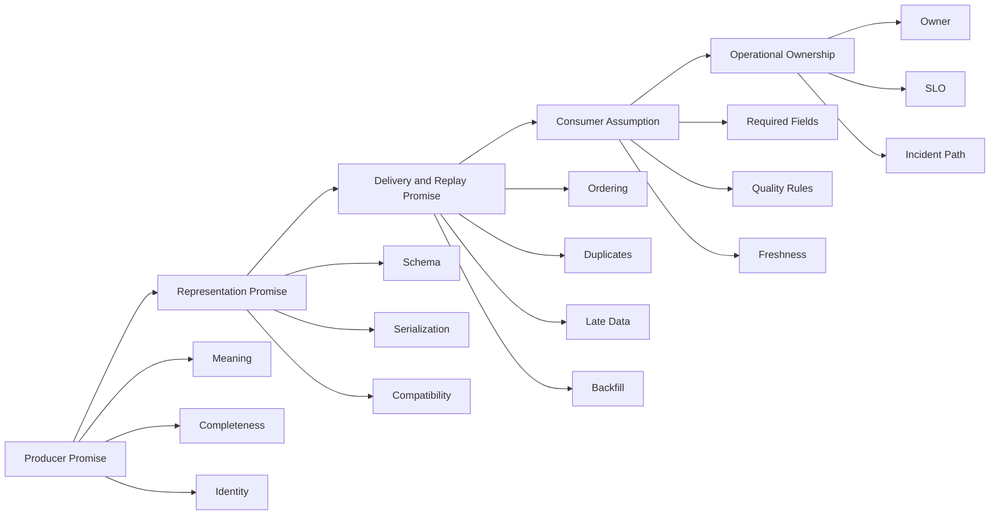
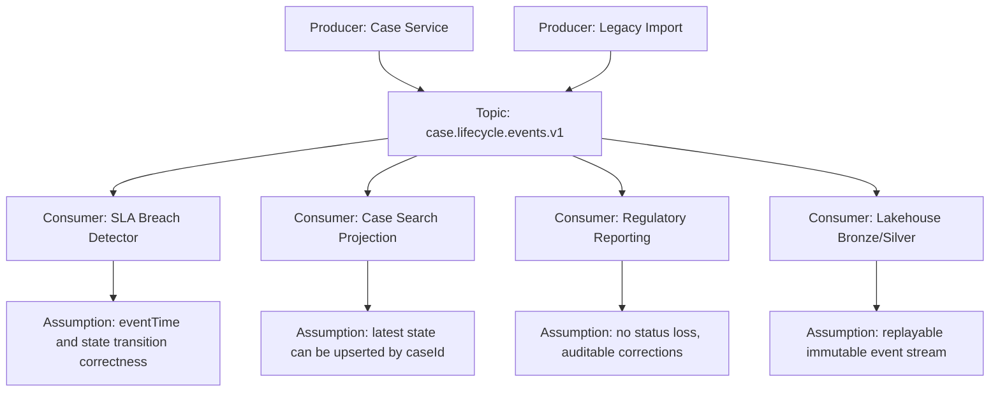
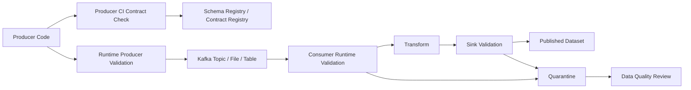
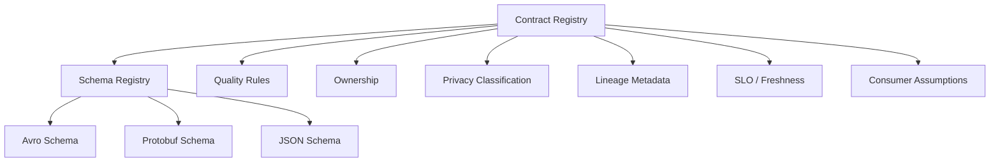
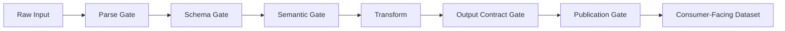
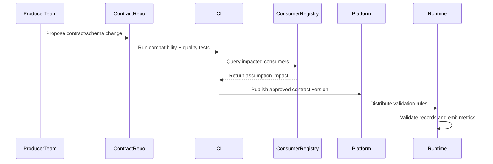

# Part 025 — Data Contracts for Pipelines

A data pipeline without a contract is not “flexible”. It is merely postponing failure.

In small systems, a producer changes a field, a consumer breaks, and someone fixes it manually. In a production data platform, the same failure becomes a chain reaction: a Kafka topic receives mixed versions, a Flink job starts rejecting records, a dashboard silently drops rows, a regulatory report becomes incomplete, and a backfill later reproduces the same mistake at larger scale.

The central idea of this part is simple:

> A pipeline data contract is the explicit agreement that connects producer behavior, consumer assumptions, runtime validation, replay safety, and operational ownership.

This is not just a schema. A schema describes shape. A contract describes what a record means, how it may evolve, what quality guarantees exist, who owns it, and what happens when the promise is broken.

We will focus on pipeline-specific contracts: streaming topics, CDC events, file drops, API ingestion, materialized datasets, and derived data products. This is intentionally different from generic API contract discussion. A pipeline contract must survive replay, backfill, partial failure, delayed consumers, schema drift, and long-lived historical data.

---

## 1. Why Pipeline Contracts Exist

The naive view says:

```text
Producer writes data -> consumer reads data
```

The production view is closer to this:

```text
Producer behavior
  -> serialized representation
  -> transport/storage semantics
  -> validation boundary
  -> version compatibility
  -> transformation assumptions
  -> sink semantics
  -> replay/backfill semantics
  -> audit and ownership
```

The contract is the boundary object that makes these expectations explicit.

Without it, every consumer reverse-engineers meaning from observed data. That may work until the first uncommon event: deleted customer, null legal entity, correction event, late arrival, enum expansion, timezone bug, tenant migration, partial source outage, replay, or producer rollback.

A contract exists to answer questions like:

- What is the stable identity of this record?
- Is this event a fact, command, snapshot, correction, or tombstone?
- Which fields are required, optional, deprecated, sensitive, derived, or experimental?
- Which timestamp drives event-time computation?
- Which field determines ordering?
- Can the same event be replayed?
- Is duplicate delivery allowed?
- Can consumers ignore unknown fields?
- How long must consumers tolerate older versions?
- What is the expected freshness?
- What happens when validation fails?
- Who is paged when the contract is violated?

If those questions are not answered in the contract, they will be answered by accident in code.

---

## 2. Contract Is Not the Same as Schema

A schema is necessary, but insufficient.

A schema can say:

```json
{
  "caseId": "string",
  "status": "string",
  "updatedAt": "string"
}
```

A contract must say:

```text
caseId:
  semantic meaning: globally stable case identifier
  uniqueness: unique per case across tenant
  lifecycle: never reassigned
  sensitivity: internal identifier, not public PII

status:
  semantic meaning: current enforcement lifecycle state
  allowed transitions: OPEN -> UNDER_REVIEW -> ESCALATED -> CLOSED
  compatibility rule: new values may be introduced only after consumer impact review
  invalid handling: quarantine, do not coerce to UNKNOWN in regulatory reporting path

updatedAt:
  semantic meaning: source business update timestamp
  timezone: UTC
  ordering role: high-watermark candidate only with caseId tie-breaker
  late arrival policy: accepted up to 7 days for operational projections
```

The difference is critical. Schema protects parsing. Contract protects meaning.

### Schema answers shape questions

- Is the payload valid JSON/Avro/Protobuf?
- Does the field exist?
- Is the type correct?
- Is the field nullable?
- Does it satisfy basic constraints?

### Contract answers operational meaning questions

- Is this event safe to replay?
- Is the status transition legal?
- Is this timestamp business time or processing time?
- Is this data complete enough for downstream enforcement action?
- Does a missing field mean unknown, not applicable, redacted, or producer bug?
- Can consumers rely on monotonicity?
- Does this dataset support correction?

A top-tier engineer treats schema as one artifact inside a larger contract system.

---

## 3. The Pipeline Contract Mental Model

Think of a pipeline contract as five linked promises.



A good contract is not only written by the producer. It is negotiated against known consumer assumptions.

The producer may promise:

```text
Every CaseStatusChanged event contains caseId, oldStatus, newStatus, changedAt, changedBy, and reasonCode.
```

A consumer may assume:

```text
A case cannot move from CLOSED back to UNDER_REVIEW unless eventType is CaseReopened.
```

If the contract captures only the producer promise and not the consumer assumption, evolution will still break systems.

---

## 4. Contract Boundary Types

Not every boundary needs the same contract shape. Pipeline contracts appear at several layers.

### 4.1 Source contract

A source contract describes what the pipeline can expect from the original data source.

Examples:

- API endpoint response shape and pagination semantics
- database table columns and update semantics
- CDC envelope and operation types
- object storage file naming convention and manifest rules
- SaaS export freshness and rate limits

A source contract is often imperfect because source systems may not be built for analytics or streaming. The ingestion layer should therefore convert weak source contracts into stronger internal contracts.

### 4.2 Raw ingestion contract

The raw contract describes how the platform stores captured input.

It answers:

- Was the original payload preserved?
- Was source metadata captured?
- Is ingestion time recorded?
- Can the raw record be replayed?
- Is the record immutable?
- Is the parser version stored?

Raw layers usually tolerate schema drift more than canonical layers. But “raw” must not mean “uncontrolled garbage”. It should still capture metadata, source identity, checksum, and ingestion lineage.

### 4.3 Canonical event contract

A canonical event contract describes domain-level events after normalization.

Examples:

- `CaseCreated`
- `CaseAssigned`
- `CaseEscalated`
- `EvidenceSubmitted`
- `BreachDetected`
- `DecisionIssued`

This is the most important contract in event-driven analytical and operational pipelines because many downstream consumers depend on its semantic stability.

### 4.4 Derived dataset contract

A derived dataset contract describes a table, view, index, feature set, metric table, or materialized projection.

It includes:

- primary key
- grain
- partitioning
- freshness target
- completeness expectation
- update mode
- deletion semantics
- correction policy
- metric definitions

Derived dataset contracts are especially important in lakehouse and reporting pipelines. Many production incidents come not from schema breakage, but from a grain mismatch or silent metric definition drift.

### 4.5 Sink contract

A sink contract describes what the pipeline promises to the target system.

Examples:

- Elasticsearch index receives idempotent upserts keyed by `caseId`
- PostgreSQL projection table receives monotonic versioned updates
- Iceberg table receives append-only facts partitioned by event date
- alerting service receives deduplicated breach notifications

Sink contracts must define idempotency, ordering tolerance, retry behavior, and partial failure handling.

---

## 5. Anatomy of a Production Pipeline Contract

A practical pipeline contract should include the following sections.

### 5.1 Identity

Identity is the foundation of dedupe, idempotency, replay, and auditability.

A contract should define:

```text
recordId:
  globally unique event identity

businessKey:
  stable identity of the business object

idempotencyKey:
  key used by sinks to suppress duplicate effect

correlationId:
  groups records belonging to one business flow

causationId:
  points to the event or command that caused this record
```

For an enforcement lifecycle pipeline:

```text
eventId: EVT-2026-00000123
caseId: CASE-2026-000045
aggregateId: CASE-2026-000045
correlationId: INVESTIGATION-2026-000009
causationId: COMMAND-ESCALATE-000077
```

A weak contract says “there is an id field”. A strong contract says which id drives dedupe, which id drives business grouping, and which id is safe for idempotent writes.

### 5.2 Ownership

Ownership must be explicit.

At minimum:

```yaml
owner:
  domainTeam: enforcement-case-management
  technicalOwner: case-platform-team
  slackChannel: '#case-platform-alerts'
  escalationPolicy: case-platform-primary-oncall
  dataSteward: enforcement-data-governance
```

A contract without ownership is documentation, not an operational control.

### 5.3 Semantic definition

Every important field needs meaning, not just type.

Bad:

```yaml
status:
  type: string
```

Better:

```yaml
status:
  type: string
  meaning: Current lifecycle state of an enforcement case after this event is applied.
  allowedValues:
    - OPEN
    - UNDER_REVIEW
    - ESCALATED
    - CLOSED
  transitionPolicy: Must follow CaseLifecycleStateMachine v3.
  consumerWarning: Do not infer closure reason from status alone.
```

Semantic definition prevents consumers from building hidden interpretations.

### 5.4 Temporal semantics

A pipeline contract must define time fields carefully.

Common timestamp roles:

```text
eventTime:
  when the business event happened

sourceCommitTime:
  when the source transaction committed

ingestionTime:
  when the pipeline observed the record

processingTime:
  when the current processor handled the record

effectiveFrom/effectiveTo:
  when a state or decision is valid in business terms
```

A top-tier pipeline design never says simply “timestamp”. It says which clock the field belongs to and which computations may use it.

### 5.5 Ordering contract

Ordering is rarely global. The contract must state the scope.

```yaml
ordering:
  scope: per-case
  key: caseId
  sequenceField: caseVersion
  guarantee: strictly increasing per case when produced by case-management-service
  caveat: cross-case ordering is not guaranteed
```

This prevents a downstream engineer from assuming impossible global ordering.

### 5.6 Cardinality and grain

For events:

```text
One event represents one business state transition for one case.
```

For datasets:

```text
One row represents the latest known assignment state for one case and one assignee role.
```

For metrics:

```text
One row represents daily case count by jurisdiction, lifecycle state, and enforcement program.
```

Grain must be explicit because most analytical correctness failures are grain failures.

### 5.7 Completeness expectations

Completeness is not merely “all fields are present”. It is the expectation that all relevant records are captured.

Examples:

```yaml
completeness:
  expectedSourceCoverage: All case lifecycle changes committed in case_db.public.case_event_outbox.
  acceptableLag: PT5M
  reconciliation:
    method: count-by-hour-and-event-type
    source: case_db.public.case_event_outbox
    target: kafka.topic.case.lifecycle.events.v1
```

A pipeline can parse every record and still be incomplete if it missed a source partition, CDC slot, file, or API page.

### 5.8 Quality rules

Quality rules encode assumptions that schema alone cannot express.

Examples:

```yaml
qualityRules:
  - id: CASE_ID_REQUIRED
    expression: caseId is not null and caseId matches '^CASE-[0-9]{4}-[0-9]+$'
    severity: reject

  - id: VALID_STATUS_TRANSITION
    expression: oldStatus -> newStatus is allowed by CaseLifecycleStateMachine v3
    severity: quarantine

  - id: CHANGED_AT_REASONABLE
    expression: changedAt <= ingestionTime + PT5M
    severity: warn
```

Quality severity matters. Not every violation should stop the world.

### 5.9 Privacy and sensitivity

Contracts must define sensitive data handling before the record spreads.

```yaml
classification:
  dataClass: confidential
  containsPii: true
  piiFields:
    - subjectName
    - subjectEmail
  retention: P7Y
  maskingPolicy: enforcement-standard-v2
  allowedZones:
    - secure-raw
    - secure-canonical
  prohibitedSinks:
    - public-bi
    - nonprod-unmasked
```

If classification is not part of the contract, downstream consumers may copy sensitive fields into uncontrolled zones.

### 5.10 Evolution policy

The contract should define how it may change.

```yaml
evolution:
  compatibility: BACKWARD_TRANSITIVE
  deprecationWindow: P90D
  enumExpansionRequiresReview: true
  breakingChangeRequiresNewSubject: true
  consumerImpactReviewRequired: true
```

Compatibility rules are not bureaucracy. They are the mechanism that allows independent deployment.

### 5.11 Runtime behavior on violation

A contract must define what the pipeline does when records violate it.

```yaml
violationPolicy:
  parseFailure: dlq
  schemaFailure: quarantine
  semanticFailure: quarantine
  freshnessBreach: alert
  completenessBreach: blockDownstreamPublication
  piiPolicyViolation: stopPipelineAndPage
```

This is where contracts become operational.

---

## 6. Contract as Consumer-Producer Matrix

The most useful mental model is not a single document. It is a matrix.



Each consumer depends on different parts of the contract.

A reporting consumer may not care about low-latency delivery but cares deeply about completeness and correction.

An alerting consumer may tolerate later reconciliation but cares deeply about freshness.

A search projection may tolerate duplicate records but requires stable idempotency keys.

Therefore, a strong contract records consumer assumptions explicitly.

---

## 7. Example Contract: Case Lifecycle Event

Below is a compact example. In a real organization this would live in a registry, repository, or platform catalog.

```yaml
contractId: enforcement.case.lifecycle-event
version: 1.4.0
status: active
owner:
  domainTeam: enforcement-case-management
  technicalOwner: case-platform-team
  dataSteward: enforcement-data-governance

channel:
  kind: kafka-topic
  name: enforcement.case.lifecycle.events.v1
  serialization: avro
  keySchema: enforcement.case.CaseEventKey.v1
  valueSchema: enforcement.case.CaseLifecycleEvent.v4

identity:
  eventId: globally unique, immutable
  aggregateId: caseId
  idempotencyKey: eventId
  partitionKey: caseId
  correlationId: investigationId

semantics:
  eventKind: domain-fact
  description: One record represents one committed lifecycle transition of one enforcement case.
  sourceOfTruth: case-management-service
  mutationPolicy: append-only; corrections emitted as separate correction events

ordering:
  scope: per aggregateId
  sequenceField: caseVersion
  guarantee: monotonic increasing when produced by case-management-service
  crossAggregateOrdering: not guaranteed

time:
  eventTime: changedAt
  sourceCommitTime: transactionCommittedAt
  ingestionTime: kafkaRecordTimestamp
  timezone: UTC

quality:
  requiredFields:
    - eventId
    - caseId
    - oldStatus
    - newStatus
    - changedAt
    - caseVersion
  semanticRules:
    - valid lifecycle transition
    - caseVersion increases by one per case
    - changedAt must not be more than 5 minutes in future relative to ingestionTime

privacy:
  classification: confidential
  containsPii: false
  retention: P7Y

delivery:
  duplicatePolicy: duplicates possible during replay; consumers must dedupe by eventId
  replayPolicy: supported from Kafka retention and lakehouse archive
  lateArrivalPolicy: accepted; consumers must use eventTime where required
  deletionPolicy: no physical delete event for lifecycle fact; corrections are explicit

evolution:
  compatibility: backward-transitive
  deprecationWindow: P90D
  breakingChangePolicy: create new topic or new major contract version

violationPolicy:
  schemaFailure: quarantine
  semanticFailure: quarantine
  freshnessBreach: alert
  completenessBreach: stop silver publication
```

This contract can drive validation, code generation, CI checks, documentation, lineage, and incident response.

---

## 8. Java Representation of a Pipeline Contract

A contract should not exist only as prose. Java code should consume it.

Below is a simplified model.

```java
public record DataContract(
        ContractId id,
        ContractVersion version,
        ChannelSpec channel,
        IdentitySpec identity,
        SemanticSpec semantics,
        TemporalSpec temporal,
        OrderingSpec ordering,
        QualitySpec quality,
        PrivacySpec privacy,
        DeliverySpec delivery,
        EvolutionSpec evolution,
        ViolationPolicy violationPolicy,
        OwnerSpec owner
) {}

public record ContractId(String value) {
    public ContractId {
        if (value == null || value.isBlank()) {
            throw new IllegalArgumentException("contract id is required");
        }
    }
}

public record ChannelSpec(
        ChannelKind kind,
        String name,
        String keySchemaSubject,
        String valueSchemaSubject,
        SerializationFormat serialization
) {}

public enum ChannelKind {
    KAFKA_TOPIC,
    FILE_DROP,
    API_ENDPOINT,
    DATABASE_TABLE,
    ICEBERG_TABLE
}

public enum SerializationFormat {
    AVRO,
    PROTOBUF,
    JSON_SCHEMA,
    JSON,
    CSV,
    PARQUET
}
```

Quality rules should be executable.

```java
public interface ContractRule<T> {
    RuleId id();
    RuleSeverity severity();
    ValidationResult evaluate(ContractEvaluationContext context, T record);
}

public enum RuleSeverity {
    WARN,
    REJECT,
    QUARANTINE,
    STOP_PIPELINE
}

public sealed interface ValidationResult permits ValidationResult.Pass, ValidationResult.Fail {
    record Pass() implements ValidationResult {}

    record Fail(
            RuleId ruleId,
            RuleSeverity severity,
            String message,
            Map<String, String> attributes
    ) implements ValidationResult {}
}
```

A runtime contract validator can then be inserted before dangerous effects.

```java
public final class ContractValidator<T> {
    private final DataContract contract;
    private final List<ContractRule<T>> rules;

    public ContractValidator(DataContract contract, List<ContractRule<T>> rules) {
        this.contract = Objects.requireNonNull(contract);
        this.rules = List.copyOf(rules);
    }

    public ContractValidationReport validate(Envelope<T> envelope) {
        List<ValidationResult.Fail> failures = new ArrayList<>();

        ContractEvaluationContext context = ContractEvaluationContext.from(contract, envelope);

        for (ContractRule<T> rule : rules) {
            ValidationResult result = rule.evaluate(context, envelope.payload());
            if (result instanceof ValidationResult.Fail fail) {
                failures.add(fail);
            }
        }

        return new ContractValidationReport(contract.id(), envelope.recordId(), failures);
    }
}
```

The key point: the contract is not passive documentation. It is executable policy.

---

## 9. Contract Enforcement Architecture

Contract enforcement should happen at multiple points.



### 9.1 Design-time enforcement

Before deployment:

- schema compatibility check
- contract diff review
- consumer impact review
- sample data validation
- golden dataset validation
- security classification check
- lineage impact estimate

Design-time enforcement prevents obvious breakage.

### 9.2 Runtime producer enforcement

At producer boundary:

- validate required fields
- enforce event type taxonomy
- validate idempotency key
- attach schema version
- attach trace context
- attach sensitivity classification

Producer enforcement reduces garbage at the source.

### 9.3 Runtime consumer enforcement

At consumer boundary:

- reject records that violate declared assumptions
- quarantine semantically suspicious records
- emit data quality metrics
- prevent partial sink corruption

Consumer enforcement protects local correctness.

### 9.4 Publication enforcement

Before publishing a derived dataset:

- check completeness
- validate row counts
- compare checksums
- verify freshness
- validate metric invariants
- block publication if quality gate fails

Publication enforcement prevents bad data from becoming official data.

---

## 10. Compatibility Is a Consumer Deployment Problem

Most teams think compatibility is a producer schema problem. That is incomplete.

Compatibility is about whether existing deployed consumers can continue to operate correctly while producers and consumers evolve independently.

Consider this sequence:

```text
T0: Consumer C1 reads schema v1.
T1: Producer P deploys schema v2.
T2: Consumer C2 deploys schema v2.
T3: Backfill replays records written with schema v1 and v2.
T4: Consumer C3, still on old code, processes new records.
```

A compatibility policy must cover all of this:

- old consumers reading new records
- new consumers reading old records
- backfills mixing old and new records
- delayed consumers resuming after weeks
- replay into newly built sinks
- dual-running old and new transformations

That is why pipeline contracts should specify compatibility mode, retention assumptions, and deprecation windows.

---

## 11. Consumer Assumption Registry

A mature platform records consumer assumptions explicitly.

Example:

```yaml
consumers:
  - name: sla-breach-detector
    owner: enforcement-reliability
    assumptions:
      - changedAt is business event time
      - caseVersion is monotonic per case
      - newStatus includes ESCALATED when escalation happens
    freshnessRequirement: PT2M
    failureImpact: missed breach alert

  - name: regulatory-reporting-silver-job
    owner: enforcement-reporting
    assumptions:
      - all lifecycle events are eventually present
      - correction events are preserved
      - eventId is immutable
    freshnessRequirement: P1D
    failureImpact: incomplete regulatory report
```

This registry makes impact analysis possible.

When a producer proposes a change, the platform can ask:

```text
Which consumers depend on the changed field, enum, timing rule, or ordering guarantee?
```

Without this, every schema change becomes tribal knowledge.

---

## 12. Contract Change Types

Not all contract changes are equal.

### 12.1 Representational change

Examples:

- add optional field
- rename field
- change field type
- change enum value
- change schema namespace

These are schema-level changes.

### 12.2 Semantic change

Examples:

- `status = CLOSED` now includes administratively withdrawn cases
- `updatedAt` changes from database update time to business event time
- `amount` changes from cents to decimal currency unit
- `caseOwner` changes from individual officer to owning team

Semantic changes are more dangerous than schema changes because compatibility tools may not detect them.

### 12.3 Operational change

Examples:

- freshness target changes from 5 minutes to 1 hour
- retention changes from 90 days to 7 days
- ordering guarantee is weakened
- duplicates become possible after architecture migration

Operational changes break consumers that depend on timing and replay behavior.

### 12.4 Governance change

Examples:

- data becomes classified as confidential
- PII fields are added
- retention requirement changes
- downstream zone becomes prohibited

Governance changes can create compliance incidents even when code still works.

A strong contract review distinguishes these categories.

---

## 13. Contract Versioning Strategy

Use semantic versioning as a communication convention, but do not rely on it alone.

A practical pattern:

```text
MAJOR: incompatible semantic or representational change
MINOR: compatible additive change
PATCH: documentation, clarification, validation tightening that does not break valid historical records
```

Examples:

```text
1.2.0 -> 1.3.0
  Added optional field closureReasonCode.

1.3.0 -> 2.0.0
  Changed event grain from one event per case transition to one event per affected party transition.
```

But version numbers are only useful if the registry enforces compatibility and consumers declare supported versions.

---

## 14. Contract Registry vs Schema Registry

A schema registry stores schema artifacts and often checks schema compatibility.

A contract registry stores broader operational semantics.



In many organizations, the contract registry starts as Git files plus CI checks. That is acceptable. The important part is not the tool; it is enforcement.

A minimal contract registry can be:

```text
contracts/
  enforcement/
    case-lifecycle-event/
      contract.yaml
      schema.avsc
      examples/
        valid-case-escalated.json
        invalid-transition.json
      rules/
        lifecycle-rules.yaml
      consumers.yaml
```

Later, it can evolve into a self-service platform.

---

## 15. Java Contract Validation Pipeline

A typical Java consumer should follow this shape:

```java
public final class ContractAwareConsumer<T, R> {
    private final Deserializer<T> deserializer;
    private final ContractValidator<T> inputValidator;
    private final Processor<T, R> processor;
    private final ContractValidator<R> outputValidator;
    private final Sink<R> sink;
    private final ViolationRouter violationRouter;

    public void handle(RawRecord raw) {
        Envelope<T> input;
        try {
            input = deserializer.deserialize(raw);
        } catch (Exception parseFailure) {
            violationRouter.routeParseFailure(raw, parseFailure);
            return;
        }

        ContractValidationReport inputReport = inputValidator.validate(input);
        if (inputReport.hasBlockingFailure()) {
            violationRouter.route(input, inputReport);
            return;
        }

        Envelope<R> output = processor.process(input);

        ContractValidationReport outputReport = outputValidator.validate(output);
        if (outputReport.hasBlockingFailure()) {
            violationRouter.route(output, outputReport);
            return;
        }

        sink.write(output);
    }
}
```

The design principle:

> Validate before irreversible side effects.

Do not validate after writing a corrupted projection.

---

## 16. Quality Gate Placement

Quality gates should be placed according to blast radius.



### Parse gate

Detects malformed payloads.

### Schema gate

Detects invalid shape, missing required fields, type violations.

### Semantic gate

Detects invalid business meaning, impossible transitions, inconsistent time fields.

### Output contract gate

Detects broken transform output before sink write.

### Publication gate

Detects dataset-level problems such as incomplete partition, missing source feed, count mismatch, or freshness breach.

Each gate should produce metrics and structured violation records.

---

## 17. Contract Violation Record

Violation records need their own contract.

```java
public record ContractViolation(
        String violationId,
        String contractId,
        String contractVersion,
        String ruleId,
        String severity,
        String sourceSystem,
        String channel,
        String recordId,
        String idempotencyKey,
        Instant observedAt,
        String failureCategory,
        String message,
        Map<String, String> attributes,
        byte[] originalPayload
) {}
```

Do not throw away invalid data too early. Store enough context to debug, replay, and prove what happened.

However, be careful with sensitive payloads. A DLQ or quarantine topic can become a privacy leak if it stores unmasked raw records in a less restricted zone.

---

## 18. Pipeline Contract Testing

Contract tests should not only test serialization.

A good contract test suite includes:

```text
1. valid examples for each event type
2. invalid examples for each critical rule
3. old schema -> new reader compatibility
4. new schema -> old reader compatibility where required
5. replay of historical samples
6. consumer assumption tests
7. quality gate severity tests
8. DLQ/quarantine routing tests
9. sensitive data leakage tests
10. backfill compatibility tests
```

Example JUnit-style structure:

```java
class CaseLifecycleContractTest {

    @Test
    void acceptsValidEscalationEvent() {
        var event = Examples.caseEscalated();
        var report = validator.validate(event);
        assertThat(report.failures()).isEmpty();
    }

    @Test
    void quarantinesInvalidStatusTransition() {
        var event = Examples.closedToUnderReviewWithoutReopen();
        var report = validator.validate(event);
        assertThat(report.highestSeverity()).isEqualTo(RuleSeverity.QUARANTINE);
    }

    @Test
    void rejectsMissingEventId() {
        var event = Examples.caseEscalatedWithoutEventId();
        var report = validator.validate(event);
        assertThat(report.containsRule("EVENT_ID_REQUIRED")).isTrue();
    }
}
```

---

## 19. Contract-First Pipeline Development Flow

A production-grade flow looks like this:



The important point: contract review happens before production data changes.

---

## 20. Pipeline Contract Maturity Levels

### Level 0 — Implicit contract

The contract exists only in producer code and consumer guesses.

Symptoms:

- undocumented fields
- silent schema drift
- broken dashboards after deployment
- manual Slack-based compatibility checks

### Level 1 — Schema documented

Schemas exist, but semantics and operations are missing.

Better than nothing, but still weak.

### Level 2 — Contract documented

Contract includes meaning, owner, freshness, quality, and evolution policy.

Useful, but enforcement may still be manual.

### Level 3 — Contract tested

CI checks compatibility, examples, and consumer assumptions.

Breakage is caught before deployment.

### Level 4 — Contract enforced at runtime

Pipelines validate records, route violations, emit metrics, and block unsafe publication.

### Level 5 — Contract-driven platform

Contracts generate code, validators, documentation, lineage, alert routing, access policy, and quality dashboards.

This is the target for serious internal data platforms.

---

## 21. Common Anti-Patterns

### Anti-pattern 1: “Schema equals contract”

A schema does not capture meaning, ordering, freshness, idempotency, replay, or ownership.

### Anti-pattern 2: “Consumers should just be tolerant”

Tolerance is not a substitute for producer discipline. Unknown fields may be safe. Unknown semantics are not.

### Anti-pattern 3: “Raw means no contract”

Raw data still needs ingestion metadata, source identity, checksum, timestamp, classification, and replay rules.

### Anti-pattern 4: “Enum changes are harmless”

Adding an enum value can break switch statements, routing rules, reporting filters, and regulatory classifications.

### Anti-pattern 5: “Breaking changes are okay because we deploy all consumers together”

That assumption fails with replay, long-retention topics, historical data, delayed consumers, and external teams.

### Anti-pattern 6: “Validation should be all-or-nothing”

Some violations should warn, some should quarantine, some should block publication, and some should page security immediately.

### Anti-pattern 7: “Contract ownership belongs to the platform team”

The platform can enforce contracts. The domain producer owns meaning.

---

## 22. Design Heuristics

Use these heuristics when reviewing a pipeline contract.

### Heuristic 1: Every record needs a stable identity

Without identity, you cannot dedupe, reconcile, replay, or audit confidently.

### Heuristic 2: Every timestamp needs a clock label

Never accept a field named `timestamp` without knowing whether it is event time, commit time, ingestion time, processing time, or effective time.

### Heuristic 3: Every enum needs an expansion policy

A new enum value is a behavior change, not just a schema change.

### Heuristic 4: Every contract needs a violation policy

A contract that does not say what happens on violation is incomplete.

### Heuristic 5: Every data product needs grain

If the grain is unclear, consumers will aggregate incorrectly.

### Heuristic 6: Every sensitive field needs allowed zones

Do not rely on downstream teams to discover privacy constraints by accident.

### Heuristic 7: Every compatibility policy needs a deprecation window

Compatibility is not forever. It is a managed transition.

---

## 23. Production Review Checklist

Before approving a pipeline contract, ask:

```text
Identity
[ ] Is record identity explicit?
[ ] Is idempotency key explicit?
[ ] Is business key explicit?

Semantics
[ ] Is event/dataset grain explicit?
[ ] Are critical fields semantically defined?
[ ] Are enum values documented?
[ ] Are correction and deletion semantics defined?

Time
[ ] Are event time, ingestion time, commit time, and effective time separated?
[ ] Is timezone explicit?
[ ] Is late data policy defined?

Ordering and replay
[ ] Is ordering scope explicit?
[ ] Are duplicates allowed?
[ ] Is replay supported?
[ ] Is backfill behavior documented?

Quality
[ ] Are required fields defined?
[ ] Are semantic rules executable?
[ ] Is severity defined per rule?
[ ] Is quarantine/DLQ behavior defined?

Compatibility
[ ] Is compatibility mode defined?
[ ] Is deprecation window defined?
[ ] Are consumer assumptions captured?
[ ] Is breaking-change policy defined?

Governance
[ ] Is owner defined?
[ ] Is classification defined?
[ ] Are retention and masking rules defined?
[ ] Are allowed/prohibited sinks defined?

Operations
[ ] Is freshness SLO defined?
[ ] Is completeness check defined?
[ ] Is alert routing defined?
[ ] Is incident runbook linked?
```

---

## 24. Key Takeaways

A pipeline contract is not a document you write after implementation. It is a design artifact that shapes implementation.

The most important shift is this:

> A pipeline contract is a runtime-enforceable agreement about meaning, quality, compatibility, replay, and ownership.

A schema tells you whether bytes can become an object. A contract tells you whether that object can be trusted.

In the next part, we go deeper into schema evolution rules: backward compatibility, forward compatibility, full compatibility, transitive compatibility, and the practical rollout rules that prevent long-lived pipelines from breaking during change.

---

## References

- Confluent Schema Registry documentation: schema evolution and compatibility modes.
- Apache Avro specification: schema resolution, defaults, aliases, and writer/reader schema behavior.
- Protocol Buffers documentation: updating message types, field numbering, and reserved fields.
- JSON Schema documentation: dialect declaration and validation vocabulary.
- Debezium documentation: CDC event structures and outbox event routing.
