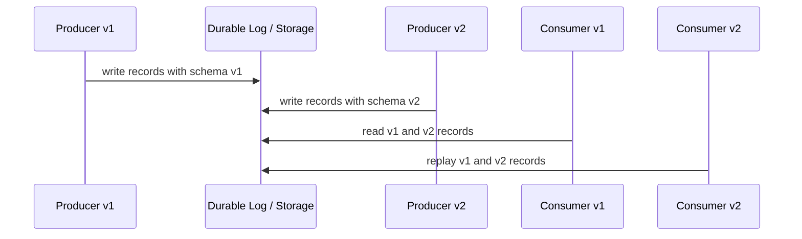
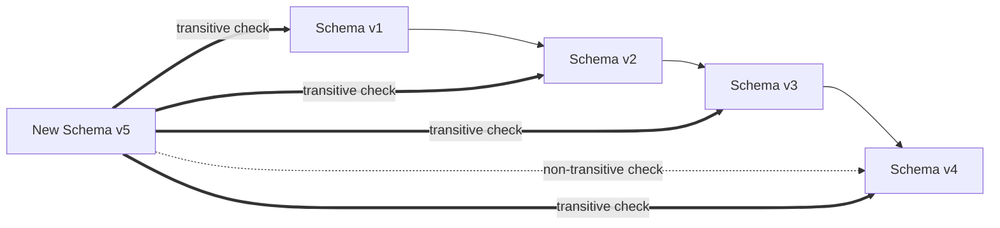
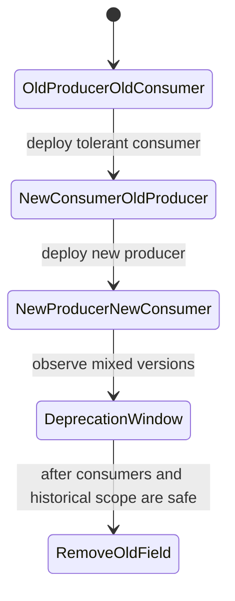
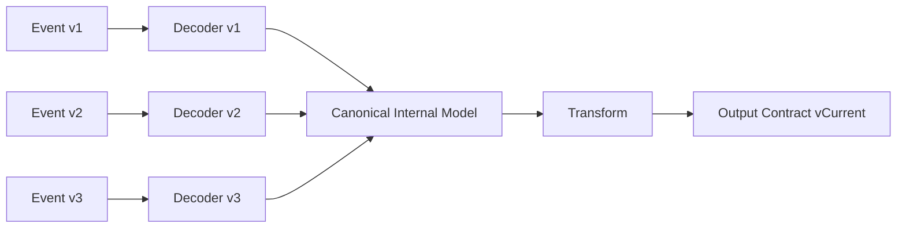
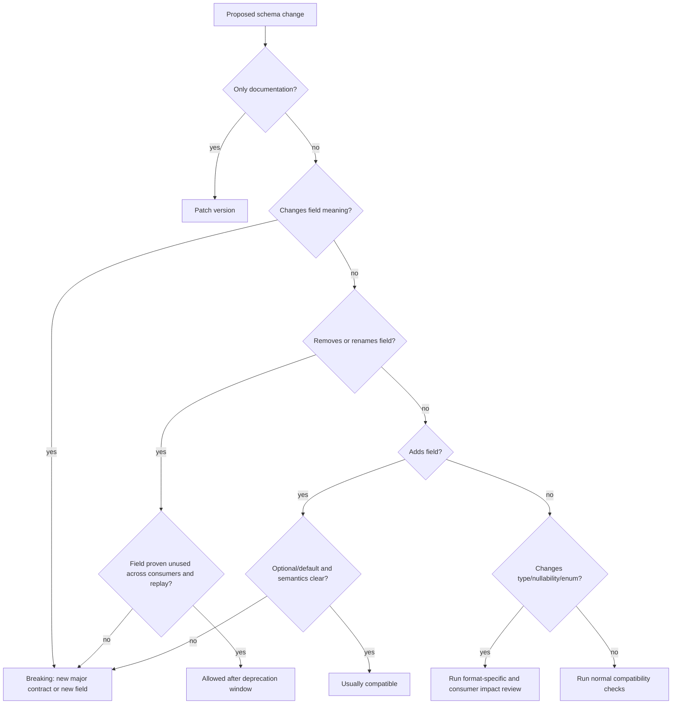

# Part 026 — Schema Evolution Rules

Schema evolution is where many data pipelines reveal whether they are engineered systems or accidental integrations.

A pipeline can start cleanly: one producer, one topic, one consumer, one schema. Then reality arrives:

- producers deploy independently
- consumers lag behind
- historical records stay in storage
- backfills mix old and new data
- long-running jobs resume from old offsets
- CDC emits schema changes from operational databases
- lakehouse tables keep snapshots for months or years
- downstream reports depend on field semantics, not just field names

Schema evolution is the discipline of changing data shape without breaking the system that reads, replays, validates, stores, and explains that data.

The key rule:

> Compatibility is not only about whether a parser succeeds. It is about whether deployed consumers, historical data, replay, and operational semantics remain correct.

This part focuses on pipeline rules. It is not a generic Avro, Protobuf, or JSON Schema tutorial. We care about how schema evolution behaves under streaming, batch, CDC, backfill, quarantine, and derived datasets.

---

## 1. The Fundamental Model: Writer Schema and Reader Schema

Every schema evolution problem has two sides.

```text
writer schema: schema used when the record was produced
reader schema: schema used when the record is consumed
```

In a long-lived pipeline, the writer and reader schema are often different.



The compatibility question is:

```text
Can this reader correctly interpret records written by that writer?
```

In pipelines, “correctly interpret” includes:

- parse success
- field defaults
- unknown field handling
- enum handling
- nullability behavior
- semantic meaning
- transformation output correctness
- sink idempotency
- replay safety

---

## 2. Compatibility Directions

There are three basic compatibility directions.

### 2.1 Backward compatibility

Backward compatibility means:

```text
New reader can read old data.
```

Typical deployment shape:

```text
1. Deploy new consumer that can read old records.
2. Deploy new producer that writes new records.
```

This is useful when consumers are upgraded before producers.

Example:

```text
Schema v1 records already exist in Kafka.
Consumer v2 is deployed.
Consumer v2 must still process v1 records.
```

### 2.2 Forward compatibility

Forward compatibility means:

```text
Old reader can read new data.
```

Typical deployment shape:

```text
1. Deploy new producer.
2. Old consumers continue to run safely.
3. Consumers upgrade later.
```

This is useful when producers deploy independently and consumers may lag.

### 2.3 Full compatibility

Full compatibility means both directions hold:

```text
New reader can read old data.
Old reader can read new data.
```

This is stronger and usually better for shared event streams.

However, full compatibility at schema level does not guarantee semantic compatibility.

---

## 3. Transitive Compatibility

Non-transitive compatibility checks only compare the new schema with the latest previous schema.

Transitive compatibility checks compare the new schema with all previous relevant versions.



For pipeline systems, transitive compatibility is often necessary because old data stays readable for a long time.

If Kafka retention is long, object storage is immutable, Iceberg snapshots are retained, or backfills replay records from years ago, checking only against the latest schema is weak.

Rule:

> If historical data can be replayed, compatibility should usually be transitive.

---

## 4. Compatibility Is Scoped

Never ask “is this schema compatible?” without asking “compatible for what scope?”

Compatibility scope can be:

```text
latest schema only
all previous schemas
last 90 days of schemas
all schemas still present in Kafka retention
all schemas still present in lakehouse snapshots
all schemas used by supported consumers
all schemas in regulatory archive
```

A high-volume operational event topic with seven-day retention may accept a different compatibility window than a regulatory archive with seven-year retention.

But be careful: even if Kafka retention is short, data may have already been copied into object storage, lakehouse tables, DLQs, audit stores, search indexes, or external consumer systems.

---

## 5. Schema Evolution Must Account for Deployment Order

A schema change is not only a type change. It is a rollout.

A safe rollout plan answers:

```text
Which code reads old records?
Which code reads new records?
Which code writes old records?
Which code writes new records?
Can old and new producers run at the same time?
Can old and new consumers run at the same time?
Can the job be restarted from an old checkpoint?
Can backfill replay old records into the new sink?
Can rollback reintroduce old schema?
```

Pipeline evolution must be designed for mixed-version periods.



The safest pattern is usually:

```text
1. Make readers tolerant.
2. Deploy tolerant readers.
3. Start writing new shape.
4. Wait through compatibility/deprecation window.
5. Stop relying on old shape.
6. Remove old shape only after evidence says it is safe.
```

---

## 6. Safe and Unsafe Changes: The Practical Matrix

The following table is intentionally conservative. Actual safety depends on format and compatibility mode.

| Change | Usually Safe? | Why |
|---|---:|---|
| Add optional field with default | Yes | Old records can be read by new readers; old readers can usually ignore unknown fields depending on format/tooling |
| Add required field without default | No | Old records do not contain it |
| Remove field used by consumers | No | Old readers and downstream assumptions may break |
| Deprecate field but keep producing it | Usually yes | Allows consumer migration |
| Rename field | Usually no | Often equivalent to remove + add |
| Change field type | Usually no | Parser or semantic interpretation may break |
| Widen numeric type | Maybe | Depends on format, generated code, and sink expectations |
| Narrow numeric type | No | Data loss or overflow risk |
| Add enum value | Maybe | Old consumers may not handle it |
| Remove enum value | Maybe, but risky | Historical records may still contain it |
| Change timestamp semantics | No | Schema tools will not detect semantic breakage |
| Change idempotency key | No | Replays can duplicate or corrupt sinks |
| Change partition key | Operationally risky | Ordering, skew, and state locality change |
| Change event grain | Breaking | One record no longer means the same thing |

The most dangerous changes are semantic changes that look schema-compatible.

---

## 7. Rule Set for Pipeline Schema Evolution

### Rule 1: Never add a required field without a default or migration plan

Bad:

```json
{
  "name": "closureReason",
  "type": "string"
}
```

If old records exist, new readers cannot reliably read them because old data has no value for the new field.

Better:

```json
{
  "name": "closureReason",
  "type": ["null", "string"],
  "default": null
}
```

But even this requires semantic clarity. Does `null` mean unknown, not applicable, not closed, redacted, or not yet backfilled?

### Rule 2: Treat rename as remove + add

A rename is rarely a harmless change.

```text
caseOwner -> assignedOfficer
```

This can break:

- old consumers
- queries
- dashboards
- historical replay
- schema evolution tools
- lineage
- contract documentation

Safer pattern:

```text
1. Add assignedOfficer.
2. Keep caseOwner.
3. Populate both.
4. Migrate consumers.
5. Mark caseOwner deprecated.
6. Remove only after retention/deprecation window.
```

### Rule 3: Do not change field meaning under the same name

This is the worst kind of compatibility failure because schema checks pass.

Bad:

```text
updatedAt v1 = database update timestamp
updatedAt v2 = business event timestamp
```

The schema remains `string timestamp`, but downstream logic changes.

Correct approach:

```text
sourceUpdatedAt
businessEventTime
recordIngestedAt
```

Name the clock explicitly.

### Rule 4: Do not change event grain under the same event type

Bad:

```text
v1: one CaseAssigned event per case assignment
v2: one CaseAssigned event per assignee role
```

This breaks counts, dedupe, state stores, and reporting.

Create a new event type or major contract version.

### Rule 5: Enum expansion requires consumer impact review

Adding a new enum value may be schema-compatible in some systems, but behavior-incompatible in consumers.

Example:

```text
OPEN
UNDER_REVIEW
ESCALATED
CLOSED
SUSPENDED  <-- new
```

Old consumers may:

- throw exception in switch statement
- map to UNKNOWN
- drop record
- misclassify as OPEN
- exclude from reports
- fail validation

Safe enum expansion requires:

```text
1. consumers have default/unknown handling
2. metrics detect unknown value usage
3. reports define classification behavior
4. regulatory paths approve new meaning
5. dashboards update filters
```

### Rule 6: Field removal requires evidence, not hope

Before removing a field, prove:

```text
[ ] no active consumer reads it
[ ] no supported historical replay requires it
[ ] no quality rule depends on it
[ ] no lineage path exposes it
[ ] no external contract includes it
[ ] no regulatory archive requires it
[ ] deprecation window has passed
```

### Rule 7: Type changes should usually create a new field

Bad:

```text
amount: string -> decimal
```

Better:

```text
amountText: string deprecated
amountMinorUnits: long
currency: string
```

Type changes are especially dangerous for numeric precision, timestamps, money, and identifiers with leading zeros.

### Rule 8: Nullability changes are compatibility changes

Making a nullable field non-null is risky because historical data may contain nulls.

Making a required field nullable can also be semantically breaking if consumers assumed presence.

Null means must be explicit:

```text
unknown
not applicable
not collected
redacted
pending
source unavailable
```

Do not overload one `null` with five meanings.

### Rule 9: Do not reuse removed Protobuf field numbers

In Protobuf, field numbers are part of the wire format. Once a field number has been used, removing the field should normally be paired with reserving the number and often the name to prevent dangerous reuse.

Example:

```proto
message CaseLifecycleEvent {
  string event_id = 1;
  string case_id = 2;

  reserved 7;
  reserved "legacy_owner";
}
```

### Rule 10: Do not weaken identity, ordering, or idempotency silently

Schema compatibility tools will not save you if you change:

```text
partition key
idempotency key
event id generation
sequence number semantics
ordering scope
aggregate id
```

Those are operational contract changes and must be reviewed as breaking unless proven otherwise.

---

## 8. Avro Evolution Rules for Pipelines

Avro is common in Kafka pipelines because schema is explicit and writer/reader schema resolution is part of the model.

Practical Avro rules:

### 8.1 Add fields with defaults

Safe additive change:

```json
{
  "name": "closureReasonCode",
  "type": ["null", "string"],
  "default": null
}
```

The default allows a reader schema to supply a value when reading older records that do not contain the field.

### 8.2 Avoid required fields without defaults

This breaks old data.

```json
{
  "name": "closureReasonCode",
  "type": "string"
}
```

Old records cannot invent this value.

### 8.3 Use aliases for controlled rename, but do not rely on aliases as governance

Avro supports aliases for schema resolution, but a rename is still a semantic and operational change.

```json
{
  "name": "assignedOfficerId",
  "type": ["null", "string"],
  "default": null,
  "aliases": ["caseOwnerId"]
}
```

Aliases help readers resolve data. They do not automatically update downstream SQL, dashboards, lineage, or business meaning.

### 8.4 Be careful with unions

Common nullable Avro field:

```json
{
  "name": "reasonCode",
  "type": ["null", "string"],
  "default": null
}
```

Keep union usage simple. Complex unions can make code generation and compatibility harder to reason about.

### 8.5 Enum changes require runtime discipline

Even if the schema registry accepts a change, Java code may fail if generated enums do not handle unknown values as expected.

For high-criticality streams, consider explicit unknown/other handling and consumer-side metrics for unknown enum values.

---

## 9. Protobuf Evolution Rules for Pipelines

Protobuf evolution is shaped by field numbers, not only names.

### 9.1 Never change field numbers

Bad:

```proto
message CaseEvent {
  string event_id = 1;
  string case_id = 2;
}
```

Then later:

```proto
message CaseEvent {
  string case_id = 1;   // dangerous change
  string event_id = 2;  // dangerous change
}
```

Field numbers are part of the serialized representation.

### 9.2 Reserve removed fields

Good:

```proto
message CaseEvent {
  string event_id = 1;
  string case_id = 2;

  reserved 3, 4;
  reserved "legacy_status", "legacy_owner";
}
```

This prevents accidental reuse.

### 9.3 Add new fields with new numbers

Good:

```proto
message CaseEvent {
  string event_id = 1;
  string case_id = 2;
  string closure_reason_code = 5;
}
```

Old readers generally ignore unknown fields, but consumer behavior still needs review.

### 9.4 Be careful with required semantics

Proto3 removed explicit `required` fields. That does not mean your contract has no required fields. It means requiredness may need to be enforced by validation rules rather than wire schema alone.

### 9.5 Enum zero value matters

In proto3, enum fields have a default zero value. Use an explicit unspecified value.

```proto
enum CaseStatus {
  CASE_STATUS_UNSPECIFIED = 0;
  CASE_STATUS_OPEN = 1;
  CASE_STATUS_UNDER_REVIEW = 2;
  CASE_STATUS_ESCALATED = 3;
  CASE_STATUS_CLOSED = 4;
}
```

Do not use a meaningful business state as the zero default unless you truly want missing values to mean that state.

---

## 10. JSON Schema Evolution Rules for Pipelines

JSON Schema is common for APIs, lightweight events, and integration boundaries. It is expressive, but compatibility can be more difficult to reason about than Avro or Protobuf because JSON consumers vary widely.

### 10.1 Declare dialect explicitly

A schema should declare which JSON Schema dialect it uses.

```json
{
  "$schema": "https://json-schema.org/draft/2020-12/schema",
  "$id": "https://contracts.example.com/enforcement/case-lifecycle-event.schema.json",
  "type": "object"
}
```

Without dialect clarity, tools may interpret keywords differently.

### 10.2 Be careful with `additionalProperties`

If you allow additional properties:

```json
{
  "type": "object",
  "additionalProperties": true
}
```

old consumers may ignore new fields, but typos and accidental producer fields can slip through.

If you disallow additional properties:

```json
{
  "type": "object",
  "additionalProperties": false
}
```

schemas are stricter, but additive changes may break old validators.

Pipeline contract must choose deliberately.

### 10.3 Required field changes are dangerous

Adding to `required` breaks old data.

```json
{
  "required": ["eventId", "caseId", "closureReasonCode"]
}
```

If old records lack `closureReasonCode`, new validation fails.

### 10.4 Tightening constraints can be breaking

Changing:

```json
{ "maxLength": 100 }
```

into:

```json
{ "maxLength": 20 }
```

may break valid historical data.

The same applies to stricter regex, narrower number ranges, smaller enum set, or new `format` validation.

---

## 11. CDC Schema Evolution

CDC pipelines inherit schema changes from operational databases.

Common source changes:

```text
add column
remove column
rename column
change column type
change nullability
change default
split table
merge table
change primary key
```

A CDC pipeline must distinguish database compatibility from event compatibility.

A database migration may be safe for the application but unsafe for downstream CDC consumers.

Example:

```sql
ALTER TABLE case_record RENAME COLUMN owner_id TO assigned_officer_id;
```

The application may deploy cleanly, but CDC consumers may see a field disappear and another appear.

Safer pattern:

```text
1. Add assigned_officer_id nullable.
2. Backfill assigned_officer_id.
3. Dual-write owner_id and assigned_officer_id.
4. Update CDC contract and consumers.
5. Stop reading owner_id downstream.
6. Drop owner_id after deprecation window.
```

CDC-specific rule:

> Treat operational DB migrations as public event contract changes when CDC consumers exist.

---

## 12. Lakehouse Table Evolution

Lakehouse formats such as Iceberg support schema and partition evolution, but that does not remove the need for contract discipline.

For table evolution, consider:

```text
field add/remove/rename
type promotion
partition evolution
snapshot retention
reader engine compatibility
query compatibility
metric definition drift
backfill behavior
```

Adding a nullable column may be structurally safe, but if a downstream report starts treating null as zero, the semantic result can be wrong.

Changing partitioning may be supported by the table format, but operationally it affects file layout, pruning, compaction, job performance, and cost.

Rule:

> Table format capabilities are not the same as data product compatibility.

---

## 13. Compatibility and Backfill

Backfill is the most brutal compatibility test.

A backfill may read:

```text
schema v1 records from 2024
schema v2 records from 2025
schema v3 records from 2026
correction records
late records
dlq replay records
manual import records
```

Then write them into a current sink.

Therefore, before approving schema evolution, ask:

```text
Can the current transform read every historical version that is still replayable?
Can the current sink accept output generated from old input?
Are defaults semantically valid for old records?
Will old records produce different results after code changes?
Can we explain differences?
```

If not, you need versioned transformations, migration jobs, or separate contract versions.

---

## 14. Compatibility and State Stores

Stateful stream processing adds another dimension.

Schema changes affect not only incoming records but also stored state.

Examples:

```text
Flink keyed state stores CaseState v1.
A new job version expects CaseState v2.
Savepoint restore must migrate state safely.
```

Schema evolution for state stores must answer:

```text
Can old state be read by new code?
Is a state migration needed?
Can savepoint restore succeed?
Can rollback read new state?
Is state TTL affected?
```

This is why state schema must be versioned separately from input event schema.

```java
public record VersionedState<T>(
        int stateSchemaVersion,
        T value
) {}
```

A pipeline can have:

```text
input event schema v4
internal state schema v2
output projection schema v7
```

Do not collapse them into one version number.

---

## 15. Java Pattern: Versioned Decoding

One reliable approach is to decode all supported input versions into a canonical internal model.



Java sketch:

```java
public interface VersionedDecoder<T> {
    SchemaVersion supports();
    CanonicalCaseEvent decode(byte[] payload, RecordMetadata metadata);
}

public final class DecoderRegistry {
    private final Map<SchemaVersion, VersionedDecoder<?>> decoders;

    public CanonicalCaseEvent decode(RawRecord record) {
        SchemaVersion version = record.schemaVersion();
        VersionedDecoder<?> decoder = decoders.get(version);
        if (decoder == null) {
            throw new UnsupportedSchemaVersionException(version);
        }
        return ((VersionedDecoder<CanonicalCaseEvent>) decoder).decode(record.payload(), record.metadata());
    }
}
```

This prevents transformation logic from being polluted with scattered version checks.

---

## 16. Java Pattern: Explicit Unknown Enum Handling

Do not let unknown enum values crash a high-criticality pipeline unexpectedly.

```java
public enum CaseStatus {
    OPEN,
    UNDER_REVIEW,
    ESCALATED,
    CLOSED,
    UNKNOWN;

    public static CaseStatus fromExternal(String value) {
        if (value == null || value.isBlank()) {
            return UNKNOWN;
        }

        try {
            return CaseStatus.valueOf(value);
        } catch (IllegalArgumentException ex) {
            return UNKNOWN;
        }
    }
}
```

But do not silently accept `UNKNOWN` everywhere. Combine it with metrics and contract policy.

```java
CaseStatus status = CaseStatus.fromExternal(rawStatus);
if (status == CaseStatus.UNKNOWN) {
    metrics.increment("contract.enum.unknown", Tags.of("field", "caseStatus", "value", rawStatus));
    violationRouter.routeUnknownEnum(envelope, "caseStatus", rawStatus);
}
```

Unknown handling is a safety valve, not a semantic solution.

---

## 17. Java Pattern: Deprecation Window Guard

A field should not be removed just because the producer team wants a cleaner schema.

Track usage.

```java
public final class DeprecatedFieldUsageTracker {
    private final MeterRegistry metrics;

    public void observed(String contractId, String fieldName, String consumerName) {
        metrics.counter(
                "contract.deprecated_field.used",
                "contract", contractId,
                "field", fieldName,
                "consumer", consumerName
        ).increment();
    }
}
```

Then require evidence:

```text
deprecated_field.used == 0 for deprecation window
no lineage usage
no query usage
no external consumer declaration
no replay dependency
```

---

## 18. Java Pattern: Compatibility Test Harness

A compatibility test harness should run old samples through new code.

```java
class CaseLifecycleCompatibilityTest {

    @ParameterizedTest
    @ValueSource(strings = {
            "samples/case-lifecycle/v1/case-created.json",
            "samples/case-lifecycle/v2/case-escalated.json",
            "samples/case-lifecycle/v3/case-closed.json"
    })
    void currentDecoderReadsHistoricalSamples(String samplePath) {
        RawRecord record = Samples.load(samplePath);

        CanonicalCaseEvent event = decoderRegistry.decode(record);

        assertThat(event.eventId()).isNotNull();
        assertThat(event.caseId()).isNotNull();
        assertThat(event.eventTime()).isNotNull();
    }

    @Test
    void oldConsumerCanIgnoreNewOptionalField() {
        RawRecord newRecord = Samples.load("samples/case-lifecycle/v4/with-closure-reason.json");

        OldConsumerModel model = oldDecoder.decode(newRecord.payload());

        assertThat(model.caseId()).isNotNull();
    }
}
```

Compatibility is a testable property.

---

## 19. Evolution Rollout Patterns

### 19.1 Additive field rollout

```text
1. Add optional field to schema.
2. Deploy consumers that tolerate it.
3. Deploy producer writing it.
4. Monitor population rate and null rate.
5. Update downstream datasets.
6. Document semantic meaning.
```

### 19.2 Rename rollout

```text
1. Add new field.
2. Dual-write old and new fields.
3. Consumers migrate to new field.
4. Monitor old field usage.
5. Mark old field deprecated.
6. Remove old field after retention/deprecation window.
```

### 19.3 Enum expansion rollout

```text
1. Add unknown/default handling in consumers.
2. Deploy consumers.
3. Add enum value to contract/schema.
4. Update reporting classifications.
5. Deploy producer that emits new value.
6. Monitor unknown value metrics.
```

### 19.4 Breaking semantic change rollout

```text
1. Create new event type or major contract version.
2. Dual-publish old and new event if necessary.
3. Migrate consumers gradually.
4. Backfill or bridge historical data.
5. Retire old stream after explicit sunset.
```

### 19.5 CDC column migration rollout

```text
1. Add new column nullable.
2. Backfill new column.
3. Dual-write old and new columns.
4. Update CDC contract.
5. Migrate consumers.
6. Stop using old column.
7. Drop old column only after deprecation window.
```

---

## 20. Decision Tree: Is This Schema Change Safe?



This tree is conservative by design. Conservatism is cheaper than corrupting a long-lived pipeline.

---

## 21. Operational Signals During Evolution

During rollout, monitor:

```text
schema version distribution
records by contract version
unknown enum count
missing optional field rate
null rate by field
validation failure rate
consumer deserialization failure rate
DLQ/quarantine rate
lag by consumer group
freshness SLO
backfill success rate
deprecated field usage
```

Example metrics:

```text
pipeline.records.by_schema_version{topic="case.lifecycle.events",version="4"}
contract.validation.failure{contract="case.lifecycle",rule="CASE_ID_REQUIRED"}
contract.enum.unknown{field="caseStatus"}
contract.deprecated_field.used{field="caseOwnerId"}
pipeline.dlq.records{reason="SCHEMA_INCOMPATIBLE"}
```

If you cannot observe a rollout, you are guessing.

---

## 22. Compatibility Policy by Pipeline Type

### Shared Kafka domain event stream

Recommended:

```text
full or backward transitive compatibility
strict contract review
explicit enum expansion process
long deprecation window
consumer assumption registry
```

Reason: many independent consumers and replay paths.

### Internal single-consumer topic

Recommended:

```text
backward compatibility at minimum
shorter deprecation window
still keep sample-based tests
```

Reason: blast radius is smaller, but replay still matters.

### CDC raw topic

Recommended:

```text
schema-on-read tolerant raw capture
strong downstream canonical contract
DB migration review when consumers exist
```

Reason: source schema may drift according to operational DB migrations.

### Lakehouse bronze table

Recommended:

```text
preserve raw metadata
allow additive evolution
track parser version
avoid destructive rewrites without snapshot policy
```

### Lakehouse silver/gold table

Recommended:

```text
data product contract
transitive compatibility for supported history
metric semantic review
publication quality gates
```

### API ingestion pipeline

Recommended:

```text
consumer-driven contract tests
tolerant parser at raw boundary
strict canonical contract after normalization
```

---

## 23. The Hardest Cases

### 23.1 Changing primary key or business identity

This is almost always breaking.

Consequences:

- dedupe changes
- upsert keys change
- historical joins break
- state stores need migration
- lineage changes
- sink records may duplicate

Use a new field, bridge table, or explicit identity migration event.

### 23.2 Changing money representation

Bad:

```text
amount: double
```

Better:

```text
amountMinorUnits: long
currency: ISO-4217 code
scale: optional integer if needed
```

Changing money representation requires reconciliation tests.

### 23.3 Changing timestamp semantics

Timestamp changes are semantic breaking changes.

Use explicit names:

```text
businessEventTime
sourceCommitTime
ingestedAt
processedAt
effectiveFrom
effectiveTo
```

### 23.4 Adding PII

Adding a PII field may be schema-compatible but governance-breaking.

Before adding:

```text
classification update
masking policy
allowed sink review
retention review
nonprod data handling
access control update
lineage update
```

### 23.5 Deleting historical data fields

Even if a field is not used in current consumers, it may be required for audit replay.

For regulated domains, removal must consider evidence, not just code search.

---

## 24. Anti-Patterns

### Anti-pattern 1: Using latest schema only during backfill

If old data exists, the current schema must be able to read old records or you need versioned decoders.

### Anti-pattern 2: Trusting compatibility tools blindly

Tools check structural compatibility. They cannot fully understand business semantics.

### Anti-pattern 3: Reusing Protobuf field numbers

This can cause old bytes to be interpreted as a different field.

### Anti-pattern 4: Treating enum expansion as harmless

Old consumers may not know what to do with the new value.

### Anti-pattern 5: Removing fields based only on producer code search

You must check consumers, queries, dashboards, external exports, lineage, and replay.

### Anti-pattern 6: Changing field meaning without field name change

This creates silent data corruption.

### Anti-pattern 7: Allowing CDC to define the public contract directly

CDC reflects database shape. Domain contracts should reflect domain meaning.

---

## 25. Production Checklist

Before merging a schema evolution change:

```text
Compatibility
[ ] Backward compatibility checked
[ ] Forward compatibility checked if old consumers may read new records
[ ] Transitive compatibility checked if historical replay exists
[ ] Format-specific rules checked

Semantics
[ ] Field meaning unchanged or explicitly versioned
[ ] Event grain unchanged or new event type created
[ ] Timestamp semantics unchanged or new field created
[ ] Identity/idempotency/ordering unchanged or breaking review completed

Consumers
[ ] Impacted consumers identified
[ ] Consumer assumptions reviewed
[ ] Unknown enum handling verified
[ ] Deprecated field usage measured

Backfill and replay
[ ] Historical samples pass current decoder
[ ] Backfill path tested
[ ] Sink idempotency remains valid
[ ] State migration considered

Governance
[ ] PII/classification impact reviewed
[ ] Retention impact reviewed
[ ] Allowed sink policy updated

Operations
[ ] Rollout sequence documented
[ ] Rollback behavior documented
[ ] Metrics and alerts added
[ ] DLQ/quarantine behavior tested
```

---

## 26. Key Takeaways

Schema evolution is not a side topic. It is one of the main correctness mechanisms in a data pipeline platform.

The most important rules are:

```text
1. New readers must be able to read old data if replay exists.
2. Old readers must be considered if producers deploy independently.
3. Transitive compatibility matters when historical data matters.
4. Semantic compatibility is stricter than schema compatibility.
5. Rename is remove + add.
6. Required fields without defaults break old records.
7. Enum expansion needs behavior review.
8. Protobuf field numbers must not be reused.
9. CDC schema changes are public contract changes when downstream consumers exist.
10. Backfill is the ultimate compatibility test.
```

In the next part, we compare Avro, Protobuf, and JSON Schema specifically for Java pipeline systems: not just their syntax, but their operational behavior under Kafka, schema registry, code generation, compatibility, debugging, governance, and long-lived replay.

---

## References

- Confluent Schema Registry documentation: compatibility modes including backward, forward, full, and transitive variants.
- Apache Avro specification: schema resolution, defaults, aliases, enum behavior, and reader/writer schema concepts.
- Protocol Buffers documentation: updating message types, field numbering, unknown fields, and reserved field numbers/names.
- JSON Schema documentation: dialect declaration, validation keywords, and object constraints.
- Apache Iceberg documentation: table schema and partition evolution concepts.
- Debezium documentation: schema changes and CDC connector behavior.
