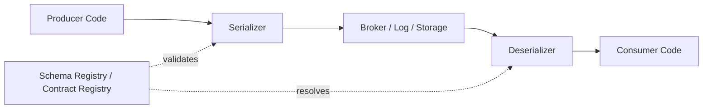
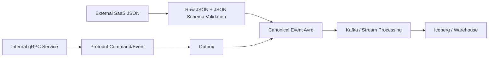
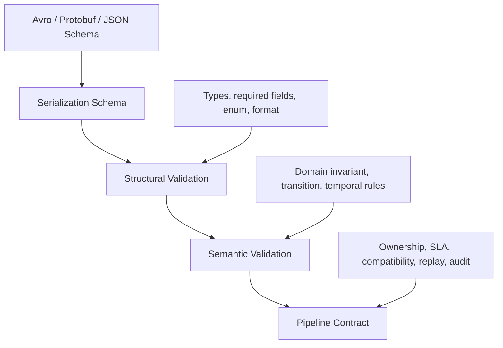
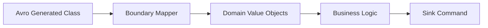
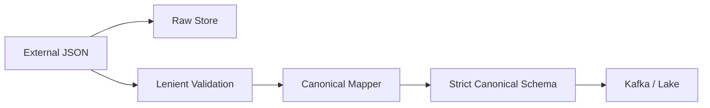
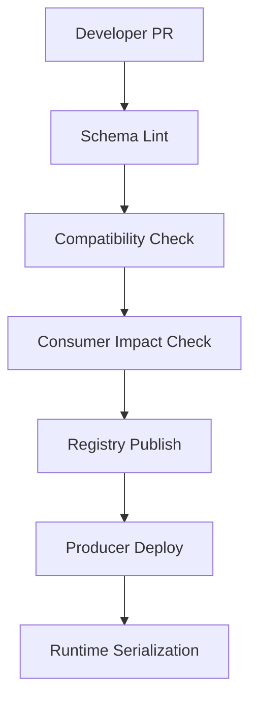
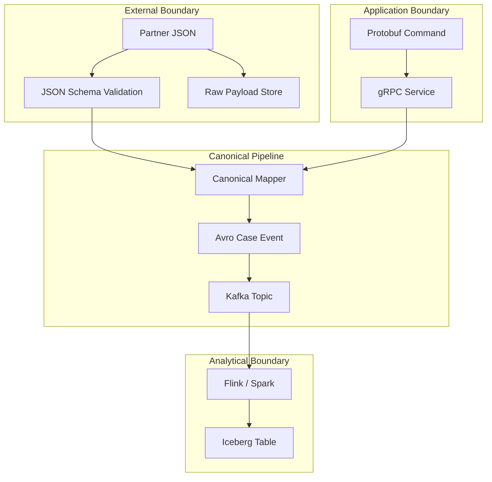
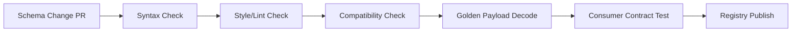

# Part 027 — Avro, Protobuf, JSON Schema in Pipelines

Di part sebelumnya kita membahas aturan evolusi schema. Sekarang kita turun ke keputusan implementasi: **format schema apa yang dipakai untuk pipeline Java?**

Jawaban yang buruk biasanya berbunyi seperti ini:

> “Pakai Avro karena Kafka.”  
> “Pakai Protobuf karena cepat.”  
> “Pakai JSON Schema karena gampang dibaca.”

Semua kalimat itu bisa benar dalam situasi tertentu, tapi terlalu dangkal untuk sistem produksi.

Di pipeline, format schema bukan hanya format payload. Ia ikut menentukan:

- bagaimana producer dan consumer berevolusi secara independen,
- bagaimana data lama dibaca saat replay/backfill,
- bagaimana debugging dilakukan saat incident,
- bagaimana schema registry dipakai sebagai control point,
- bagaimana data masuk ke Flink, Spark, lakehouse, API, dan warehouse,
- bagaimana PII dan audit trail dijaga,
- bagaimana breaking change dicegah sebelum runtime,
- bagaimana organisasi mengelola ownership antar tim.

Mental model utama:

> **Schema format is not a serialization preference. It is a long-lived compatibility protocol between systems that do not deploy together.**

---

## 1. Posisi Format Schema di Pipeline

Sebuah event pipeline minimal punya empat lapisan:



Format schema bekerja di antara **kode aplikasi** dan **media penyimpanan/perpindahan data**.

Bila format dipilih hanya dari perspektif producer, pipeline akan rapuh. Yang lebih penting justru consumer masa depan:

- consumer yang belum ada hari ini,
- replay job yang berjalan dua tahun lagi,
- audit tool yang membaca arsip lama,
- migrasi lakehouse,
- reprocessing setelah bug transform ditemukan,
- regulator/internal reviewer yang butuh menjelaskan asal data.

Pertanyaan desainnya bukan “payload mana yang paling nyaman ditulis?”, tetapi:

> “Format mana yang tetap bisa dibaca, divalidasi, berevolusi, di-debug, dan dioperasikan saat producer/consumer/schema berubah tidak bersamaan?”

---

## 2. Tiga Format, Tiga Filosofi

### 2.1 Avro

Avro cocok ketika pipeline berpusat pada **data records** dan **schema evolution**. Avro schema ditulis dalam JSON, data binary Avro biasanya tidak membawa nama field lengkap di setiap record, dan reader/writer schema resolution menjadi bagian penting dari modelnya.

Karakter kuat Avro:

- bagus untuk event log dan data lake ingestion,
- kuat untuk evolusi schema berbasis reader/writer schema,
- umum dipakai bersama Schema Registry,
- cocok untuk record-oriented analytical pipeline,
- natural untuk Kafka topic yang membawa event domain/data product,
- relatif nyaman untuk generic processing ketika schema diketahui runtime.

Trade-off:

- binary payload tidak self-describing tanpa schema ID/registry,
- generated class bisa terasa kurang ergonomis dibanding Protobuf,
- union/null handling perlu disiplin,
- logical type harus disepakati dengan jelas,
- schema JSON bisa menjadi besar jika governance buruk.

### 2.2 Protobuf

Protobuf cocok ketika pipeline juga bersinggungan dengan **service API**, **gRPC**, dan kontrak message yang ingin strongly typed lintas bahasa. Protobuf mengandalkan field number/tag sebagai identitas wire-level field.

Karakter kuat Protobuf:

- compact dan cepat untuk service-to-service message,
- generated classes kuat dan ergonomis,
- natural untuk gRPC dan command/event boundary tertentu,
- bagus untuk polyglot service ecosystem,
- field number memberi stabilitas wire format bila dikelola benar.

Trade-off:

- field number tidak boleh sembarangan diubah/dipakai ulang,
- semantic evolution bisa tersembunyi karena binary compatibility belum tentu business compatibility,
- default value semantics bisa membingungkan untuk data analytics,
- unknown fields dan optional presence harus dipahami,
- tidak selalu se-natural Avro untuk data lake/table-oriented pipeline.

### 2.3 JSON Schema

JSON Schema cocok ketika data masuk/keluar dalam bentuk JSON dan butuh **human readability**, **API validation**, atau **semi-open integration**. Ia kuat sebagai validation language untuk JSON document.

Karakter kuat JSON Schema:

- payload mudah dibaca/debug,
- natural untuk REST/webhook/SaaS API ingestion,
- bagus untuk boundary dengan external partner,
- schema bisa memvalidasi constraints yang ekspresif,
- cocok untuk raw/landing zone dan contract validation.

Trade-off:

- payload cenderung lebih besar,
- tipe numerik/date/time harus sangat disiplin,
- evolusi compatibility butuh aturan organisasi, bukan hanya syntax,
- validator dialect/version harus dikontrol,
- binary performance bukan keunggulan utamanya.

---

## 3. Decision Matrix Ringkas

| Kriteria | Avro | Protobuf | JSON Schema |
|---|---|---|---|
| Kafka event log | Sangat kuat | Kuat | Cukup-kuat |
| Data lake / analytical pipeline | Sangat kuat | Cukup | Cukup |
| gRPC/service contract | Lemah-sedang | Sangat kuat | Lemah |
| Human-readable payload | Lemah | Lemah | Sangat kuat |
| Schema evolution native | Sangat kuat | Kuat jika disiplin tag | Sedang-kuat jika rules jelas |
| Generated Java type | Baik | Sangat baik | Tergantung library/codegen |
| Runtime generic processing | Kuat | Sedang | Kuat |
| External partner/API | Sedang | Sedang | Sangat kuat |
| Compact binary | Kuat | Sangat kuat | Lemah |
| Debug incident tanpa tooling | Lemah | Lemah | Kuat |
| Registry integration | Kuat | Kuat | Kuat |

Tidak ada pemenang universal. Format terbaik adalah format yang cocok dengan **evolution model** dan **operational boundary**.

---

## 4. Rule of Thumb Production

Gunakan **Avro** ketika:

- event dipakai banyak consumer analitik,
- data akan masuk lakehouse/warehouse,
- replay/backfill adalah kebutuhan normal,
- schema evolution lebih penting dari ergonomi RPC,
- payload adalah fact/state-change record,
- consumer bisa generic dan tidak selalu generated-code based.

Gunakan **Protobuf** ketika:

- message juga menjadi API/gRPC contract,
- domain memakai strongly typed command/event di banyak service,
- low latency dan compact wire format penting,
- tim disiplin menjaga field number dan reserved fields,
- consumer utama adalah aplikasi, bukan ad-hoc analytical reader.

Gunakan **JSON Schema** ketika:

- boundary berasal dari REST/webhook/external SaaS,
- payload harus mudah dibaca manusia,
- validation constraints lebih penting dari compactness,
- ingestion layer masih raw/semi-structured,
- partner integration membutuhkan contract yang mudah dibagikan.

Gunakan kombinasi ketika pipeline memang multi-layer:



Arsitektur yang matang sering tidak memilih satu format untuk semua boundary. Ia memilih format berdasarkan boundary.

---

## 5. Jangan Campur “Data Shape” dan “Business Meaning”

Schema format hanya mendefinisikan struktur dan sebagian constraint. Ia tidak otomatis menjamin semantic correctness.

Contoh field:

```json
{
  "caseId": "CASE-123",
  "status": "CLOSED",
  "closedAt": "2026-07-04T10:15:00Z"
}
```

Schema bisa memastikan `caseId` string, `status` enum, `closedAt` timestamp. Namun schema tidak otomatis membuktikan:

- apakah case boleh ditutup,
- apakah closure dilakukan oleh role yang valid,
- apakah status transition legal,
- apakah `closedAt` tidak mendahului `createdAt`,
- apakah event ini koreksi, replay, atau original fact.

Karena itu pipeline contract harus punya tiga lapis:



Format schema adalah fondasi, bukan keseluruhan kontrak.

---

## 6. Avro in Java Pipelines

### 6.1 Avro Schema Example

```json
{
  "type": "record",
  "name": "CaseEscalated",
  "namespace": "com.example.regulatory.events.v1",
  "fields": [
    { "name": "eventId", "type": "string" },
    { "name": "caseId", "type": "string" },
    { "name": "escalationLevel", "type": "int" },
    { "name": "reasonCode", "type": "string" },
    {
      "name": "eventTime",
      "type": { "type": "long", "logicalType": "timestamp-millis" }
    },
    {
      "name": "schemaVersion",
      "type": "string",
      "default": "1.0.0"
    }
  ]
}
```

Desain yang perlu diperhatikan:

- `eventId` untuk idempotency dan traceability,
- `caseId` sebagai aggregate/business key,
- `eventTime` sebagai event-time, bukan processing-time,
- `schemaVersion` sebagai semantic versioning metadata, bukan pengganti schema registry version,
- namespace harus stabil dan mengikuti domain boundary.

### 6.2 Java Usage Model

Ada dua gaya utama:

1. **SpecificRecord**: schema menghasilkan Java class.
2. **GenericRecord**: schema dibaca runtime, record diproses generic.

SpecificRecord cocok untuk service/stream processor yang domain-specific. GenericRecord cocok untuk ingestion router, validation gateway, schema migration job, dan lake writer.

Contoh consumer boundary dengan generated type:

```java
public final class CaseEscalatedHandler {
    private final CaseProjectionRepository repository;

    public CaseEscalatedHandler(CaseProjectionRepository repository) {
        this.repository = repository;
    }

    public void handle(CaseEscalated event, PipelineMetadata metadata) {
        EventId eventId = EventId.of(event.getEventId().toString());
        CaseId caseId = CaseId.of(event.getCaseId().toString());

        repository.applyEscalation(
            eventId,
            caseId,
            event.getEscalationLevel(),
            event.getReasonCode().toString(),
            metadata.sourcePosition(),
            metadata.ingestedAt()
        );
    }
}
```

Hal penting: generated class jangan langsung menjadi domain model internal. Ia adalah DTO di boundary.



### 6.3 Avro Strength: Reader/Writer Schema

Avro memiliki model penting: data ditulis dengan writer schema dan dibaca dengan reader schema. Ini sangat cocok untuk pipeline yang membaca data historis.

Contoh evolusi aman:

```json
{
  "name": "priority",
  "type": "string",
  "default": "NORMAL"
}
```

Jika field baru punya default, reader baru bisa membaca data lama.

Kesalahan umum:

- menambahkan field tanpa default pada schema yang harus backward-compatible,
- mengganti semantic field tanpa mengganti nama/versi,
- mengubah type secara tidak kompatibel,
- memakai nullable union tanpa aturan jelas,
- menyimpan timestamp sebagai string bebas.

### 6.4 Avro Nullability Pattern

Avro nullable field biasanya ditulis sebagai union:

```json
{
  "name": "assignedOfficerId",
  "type": ["null", "string"],
  "default": null
}
```

Aturan produksi:

- nullable hanya untuk fakta yang benar-benar optional,
- jangan memakai null untuk “unknown”, “not applicable”, “not yet loaded”, dan “redacted” sekaligus,
- bedakan absence semantics secara eksplisit.

Lebih baik:

```json
{
  "name": "assignedOfficer",
  "type": {
    "type": "record",
    "name": "AssignedOfficerRef",
    "fields": [
      { "name": "presence", "type": { "type": "enum", "name": "Presence", "symbols": ["PRESENT", "UNASSIGNED", "REDACTED", "UNKNOWN"] } },
      { "name": "officerId", "type": ["null", "string"], "default": null }
    ]
  }
}
```

Ini lebih verbose, tetapi jauh lebih audit-friendly.

---

## 7. Protobuf in Java Pipelines

### 7.1 Protobuf Message Example

```proto
syntax = "proto3";

package regulatory.events.v1;

import "google/protobuf/timestamp.proto";

message CaseEscalated {
  string event_id = 1;
  string case_id = 2;
  int32 escalation_level = 3;
  string reason_code = 4;
  google.protobuf.Timestamp event_time = 5;
  string schema_version = 6;
}
```

Field number adalah bagian dari wire contract. Nama field bisa berubah secara source-level, tetapi field number tidak boleh diperlakukan sebagai detail kecil.

Aturan praktis:

- jangan ubah field number,
- jangan reuse deleted field number,
- reserve deleted field number dan field name,
- jangan ubah semantic field di balik number yang sama,
- hati-hati dengan enum default value,
- jangan memakai Protobuf message sebagai domain entity internal.

### 7.2 Deleting Field Safely

```proto
message CaseEscalated {
  string event_id = 1;
  string case_id = 2;
  int32 escalation_level = 3;
  string reason_code = 4;
  google.protobuf.Timestamp event_time = 5;

  reserved 6;
  reserved "schema_version";
}
```

Kenapa reserve penting? Karena data lama mungkin masih ada di log, archive, DLQ, atau backup. Bila tag lama dipakai ulang untuk meaning baru, consumer bisa membaca data lama sebagai field baru yang salah.

Itu bukan sekadar bug parsing. Itu semantic corruption.

### 7.3 Presence dan Default Value

Dalam pipeline, absence berbeda dari default.

Misalnya `int32 escalation_level = 3;` default-nya `0`. Apakah `0` berarti:

- field tidak dikirim,
- level benar-benar nol,
- source bug,
- redacted,
- unknown?

Untuk data pipeline, ambiguity ini berbahaya. Gunakan `optional`, wrapper type, atau explicit presence model ketika absence bermakna.

```proto
message CaseEscalated {
  string event_id = 1;
  string case_id = 2;
  optional int32 escalation_level = 3;
}
```

Atau:

```proto
message OptionalEscalationLevel {
  enum Presence {
    PRESENCE_UNSPECIFIED = 0;
    PRESENT = 1;
    UNKNOWN = 2;
    REDACTED = 3;
  }

  Presence presence = 1;
  int32 value = 2;
}
```

### 7.4 Protobuf Java Boundary

```java
public final class CaseEscalatedMapper {
    public CaseEscalationFact toFact(regulatory.events.v1.CaseEscalated message) {
        return new CaseEscalationFact(
            EventId.of(message.getEventId()),
            CaseId.of(message.getCaseId()),
            EscalationLevel.of(message.getEscalationLevel()),
            ReasonCode.of(message.getReasonCode()),
            Instant.ofEpochSecond(
                message.getEventTime().getSeconds(),
                message.getEventTime().getNanos()
            )
        );
    }
}
```

Pisahkan generated Protobuf message dari domain object. Generated message adalah wire DTO, bukan pusat business logic.

---

## 8. JSON Schema in Java Pipelines

### 8.1 JSON Schema Example

```json
{
  "$schema": "https://json-schema.org/draft/2020-12/schema",
  "$id": "https://schemas.example.com/regulatory/events/case-escalated/1-0-0.schema.json",
  "title": "CaseEscalated",
  "type": "object",
  "additionalProperties": false,
  "required": ["eventId", "caseId", "escalationLevel", "reasonCode", "eventTime"],
  "properties": {
    "eventId": {
      "type": "string",
      "minLength": 1
    },
    "caseId": {
      "type": "string",
      "pattern": "^CASE-[0-9]+$"
    },
    "escalationLevel": {
      "type": "integer",
      "minimum": 1,
      "maximum": 5
    },
    "reasonCode": {
      "type": "string",
      "minLength": 1
    },
    "eventTime": {
      "type": "string",
      "format": "date-time"
    }
  }
}
```

JSON Schema cocok untuk ingestion boundary karena mudah dipakai untuk reject/quarantine data sebelum masuk canonical pipeline.

### 8.2 Java Validation Boundary

```java
public interface JsonPayloadValidator {
    ValidationResult validate(String schemaId, byte[] payload);
}

public record ValidationResult(
    boolean valid,
    List<Violation> violations
) {
    public boolean invalid() {
        return !valid;
    }
}

public record Violation(
    String path,
    String keyword,
    String message
) {}
```

Validation result harus cukup detail untuk DLQ/quarantine:

- schema ID,
- dialect,
- field path,
- failed keyword,
- actual value hash/preview,
- source position,
- ingest attempt,
- producer identity.

Jangan hanya log `Invalid payload`.

### 8.3 JSON Schema Strictness

Gunakan `additionalProperties: false` pada canonical layer bila schema benar-benar closed. Namun untuk raw external ingestion, kadang lebih baik menerima unknown fields dan menyimpannya dalam raw payload untuk forensics.

Pattern yang sering aman:



Raw layer boleh lenient. Canonical layer harus strict.

### 8.4 Dialect Control

JSON Schema punya beberapa dialect. Jangan biarkan tiap tim memakai dialect berbeda tanpa governance.

Aturan praktis:

- setiap schema wajib punya `$schema`,
- setiap schema wajib punya `$id`,
- validator runtime harus mendukung dialect tersebut,
- CI harus menjalankan validator yang sama dengan production,
- schema registry harus menyimpan dialect metadata,
- jangan mencampur OpenAPI-flavored schema dengan JSON Schema murni tanpa aturan.

---

## 9. Schema Registry sebagai Control Point

Schema registry bukan hanya tempat menyimpan schema. Dalam pipeline production-grade, registry adalah **compatibility gate**.



Minimum registry metadata:

- subject name,
- schema ID,
- schema version,
- compatibility mode,
- owner team,
- domain,
- lifecycle status,
- sensitivity classification,
- allowed producers,
- known consumers,
- deprecation note,
- migration plan.

Subject naming harus deliberate.

Contoh:

| Strategy | Contoh | Kapan cocok |
|---|---|---|
| Topic-name | `case-events-value` | Kafka topic sebagai contract boundary |
| Record-name | `com.example.CaseEscalated` | event type dipakai lintas topic |
| Topic-record-name | `case-events-com.example.CaseEscalated` | multi-event topic dengan strong isolation |
| Data-product | `regulatory.case.escalated.v1` | platform contract/data product registry |

Jangan memilih subject naming default tanpa memikirkan evolusi topik, event type, dan ownership.

---

## 10. Format Selection by Pipeline Layer

### 10.1 Raw Ingestion Layer

| Source | Recommended Format | Reason |
|---|---|---|
| External REST API | JSON + JSON Schema | payload asli biasanya JSON, debugging penting |
| Webhook | JSON + JSON Schema | partner compatibility dan quarantine |
| CSV/file | Raw file + parsing contract | preserve original input |
| Database CDC | CDC envelope + Avro/JSON | tergantung connector dan registry |
| Internal service event | Avro/Protobuf | long-lived event contract |

### 10.2 Canonical Event Layer

Canonical event biasanya lebih cocok Avro atau Protobuf.

Pilih Avro jika canonical event akan banyak dipakai oleh stream processing, lakehouse, reporting, dan analytics.

Pilih Protobuf jika canonical event juga menjadi shared application message dan service contract.

### 10.3 Serving/External Layer

Serving layer bisa memakai JSON/JSON Schema atau OpenAPI contract, meskipun internal event memakai Avro/Protobuf.

Jangan memaksakan internal wire format menjadi external API format.

---

## 11. Multi-Format Pipeline Pattern



Ini sering lebih realistis daripada “semua Avro” atau “semua Protobuf”.

---

## 12. Envelope vs Payload Schema

Jangan menaruh semua metadata pipeline di payload bisnis. Pisahkan envelope dan payload.

```java
public record PipelineEnvelope<T>(
    String eventId,
    String eventType,
    String schemaId,
    String schemaVersion,
    String producer,
    Instant eventTime,
    Instant ingestionTime,
    String traceId,
    String tenantId,
    Sensitivity sensitivity,
    T payload
) {}
```

Envelope menjawab pertanyaan pipeline:

- event ini dari mana,
- schema apa yang dipakai,
- kapan terjadi,
- kapan diterima,
- siapa producer-nya,
- trace/correlation-nya apa,
- tenant/region mana,
- data sensitif atau tidak,
- replay/backfill atau live.

Payload menjawab pertanyaan bisnis:

- case apa,
- status apa,
- amount berapa,
- decision apa,
- reason apa.

Kesalahan umum: schema payload dipakai untuk menyimpan semua metadata teknis sampai domain event menjadi tidak jelas.

---

## 13. Semantic Version vs Registry Version

Registry version adalah urutan versi schema di registry. Semantic version adalah versi kontrak bisnis.

Keduanya tidak selalu sama.

Contoh:

| Change | Registry Version | Semantic Version |
|---|---:|---:|
| Add optional field `sourceSystem` | 12 | 1.4.0 |
| Fix doc only | 13 | 1.4.0 |
| Rename semantic event meaning | 14 | 2.0.0 |
| Add enum symbol affecting downstream logic | 15 | 1.5.0 atau 2.0.0 tergantung contract |

Jangan mengandalkan registry version sebagai business semantic version.

---

## 14. Performance Considerations

Performance bukan hanya ukuran payload.

Pertimbangkan:

- serialization CPU,
- deserialization CPU,
- GC pressure,
- schema lookup latency,
- code generation cost,
- payload size,
- compression ratio,
- broker network cost,
- storage cost,
- observability/debugging cost,
- replay cost.

Avro/Protobuf binary payload lebih compact daripada JSON dalam banyak kasus. Namun JSON dengan compression bisa cukup baik untuk beberapa pipeline low-throughput dan high-debuggability.

Rule:

> Jangan pilih JSON untuk high-throughput event backbone tanpa benchmark. Jangan pilih binary format untuk external partner boundary yang sering di-debug manual tanpa tooling.

---

## 15. Compatibility Testing Pipeline

Minimum CI untuk schema:



Test cases:

- old reader reads new data,
- new reader reads old data,
- old golden payload still decodes,
- new payload accepted by current consumers,
- rejected payload produces useful error,
- optional/default behavior matches expectation,
- deleted fields are reserved,
- enum changes are reviewed,
- timestamp logical types remain stable.

---

## 16. Java Library Boundary Design

Hindari menyebarkan serializer/deserializer detail ke semua service. Buat module kecil:

```java
public interface EventCodec<T> {
    byte[] serialize(T event, SchemaContext schemaContext);
    DecodedEvent<T> deserialize(byte[] bytes, DecodeContext decodeContext);
}

public record SchemaContext(
    String subject,
    String schemaVersion,
    String compatibilityMode
) {}

public record DecodedEvent<T>(
    T value,
    String schemaId,
    String subject,
    int version
) {}
```

Lalu implementasi:

```java
public final class AvroEventCodec<T> implements EventCodec<T> {
    @Override
    public byte[] serialize(T event, SchemaContext schemaContext) {
        // Delegate to Avro serializer + schema registry client.
        throw new UnsupportedOperationException("example");
    }

    @Override
    public DecodedEvent<T> deserialize(byte[] bytes, DecodeContext decodeContext) {
        // Resolve writer schema, reader schema, and map to boundary DTO.
        throw new UnsupportedOperationException("example");
    }
}
```

Tujuannya:

- memusatkan schema registry access,
- menyamakan error handling,
- menyamakan metrics,
- menyamakan compatibility policy,
- memudahkan migration format di masa depan.

---

## 17. Anti-Patterns

### 17.1 “JSON Because It Is Flexible”

Fleksibel sering berarti tidak ada kontrak. JSON tanpa schema dan compatibility gate akan menjadi data swamp.

### 17.2 “Protobuf Because It Is Fast”

Fast wire format tidak menyelesaikan replay, audit, consumer impact, schema governance, dan semantic compatibility.

### 17.3 “Avro Because Kafka”

Avro bagus untuk banyak event pipeline, tapi tidak otomatis cocok untuk external API, command RPC, atau human-facing integration.

### 17.4 “One Format for Everything”

Satu organisasi boleh punya preferred format, tetapi boundary yang berbeda sering butuh format berbeda.

### 17.5 “Generated Classes Everywhere”

Generated class adalah boundary object. Jangan jadikan domain model, JPA entity, API response, dan lake schema sekaligus.

### 17.6 “Schema Registry Without Ownership”

Registry tanpa owner, lifecycle, compatibility mode, dan consumer map hanya menjadi database schema file.

---

## 18. Format Selection Algorithm

Gunakan pertanyaan ini saat design review:

1. Apakah payload berasal dari external JSON/API?
   - Ya: mulai dari JSON Schema di raw boundary.
2. Apakah event akan menjadi backbone analytical/event log?
   - Ya: Avro sering paling natural.
3. Apakah message juga dipakai untuk gRPC/service API?
   - Ya: Protobuf sering paling natural.
4. Apakah consumer mostly ad-hoc analytics?
   - Ya: Avro/lake-friendly schema lebih aman.
5. Apakah debugging manual lebih penting daripada throughput?
   - Ya: JSON Schema bisa masuk akal.
6. Apakah data perlu replay bertahun-tahun?
   - Ya: registry + compatibility + golden payload wajib.
7. Apakah ada banyak bahasa/runtime?
   - Avro/Protobuf sama-sama bisa; pilih berdasarkan boundary.
8. Apakah field absence punya semantic meaning?
   - Pastikan format dan schema style bisa mengekspresikannya.

---

## 19. Production Checklist

Sebelum memilih format, jawab ini:

- Apakah format cocok dengan boundary, bukan sekadar preferensi tim?
- Apakah schema punya owner?
- Apakah compatibility mode eksplisit?
- Apakah old data bisa dibaca oleh new consumer?
- Apakah new data bisa ditangani old consumer selama rolling deploy?
- Apakah deleted field tidak bisa direuse?
- Apakah timestamp dan decimal memakai logical/standard type?
- Apakah absence/null/default semantics jelas?
- Apakah payload bisa di-debug saat incident?
- Apakah schema ID/version terekam di envelope?
- Apakah registry unavailable behavior jelas?
- Apakah golden payload test tersedia?
- Apakah consumer impact dianalisis sebelum schema publish?
- Apakah PII classification masuk metadata?
- Apakah format cocok untuk replay/backfill?

---

## 20. Kesimpulan

Avro, Protobuf, dan JSON Schema bukan ranking kualitas. Mereka adalah pilihan boundary.

- **Avro** kuat untuk record-oriented event pipeline, schema evolution, Kafka/lake/analytics, dan replay.
- **Protobuf** kuat untuk strongly typed service messages, gRPC, compact binary, dan polyglot generated code.
- **JSON Schema** kuat untuk external JSON boundary, validation, debugging, dan semi-structured ingestion.

Pipeline engineer yang matang tidak bertanya “mana yang terbaik?”. Ia bertanya:

> “Di boundary ini, siapa producer-nya, siapa consumer-nya, bagaimana mereka berevolusi, bagaimana data lama dibaca, bagaimana incident di-debug, dan bagaimana contract ditegakkan?”

Di part berikutnya, kita akan masuk ke **canonical event modeling**: bagaimana mendesain event sebagai fakta yang stabil, bukan sekadar snapshot object yang kebetulan dikirim lewat Kafka.

---

## References

- Apache Avro Specification — schema resolution, defaults, aliases, and logical types.
- Protocol Buffers documentation — field numbers, reserved fields, proto3 language guide, and best practices.
- JSON Schema documentation — dialect declaration, `$schema`, validation vocabulary, and 2020-12 meta-schema.
- Confluent Schema Registry documentation — Avro, Protobuf, JSON Schema support and compatibility modes.
