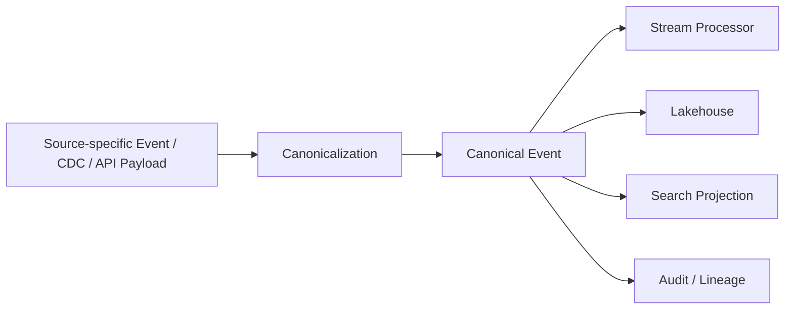
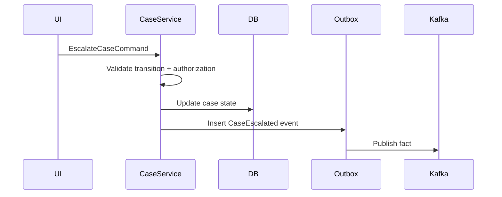
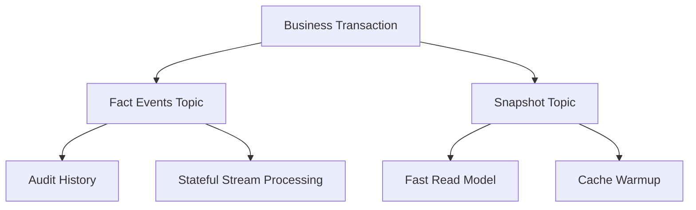
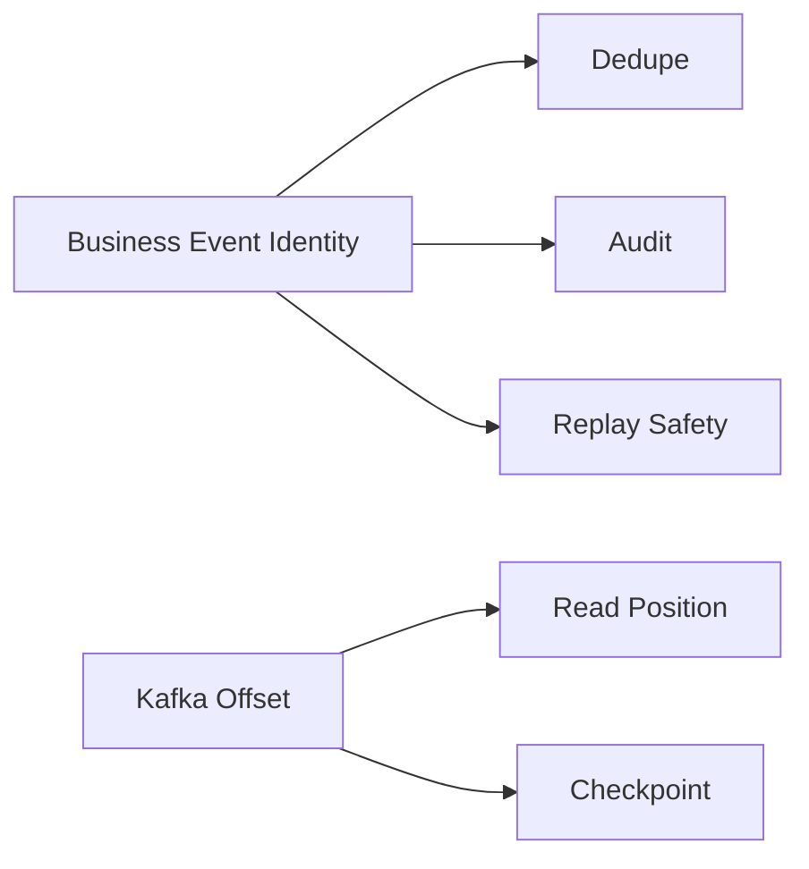
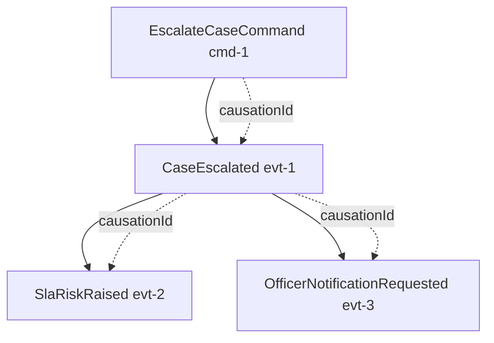
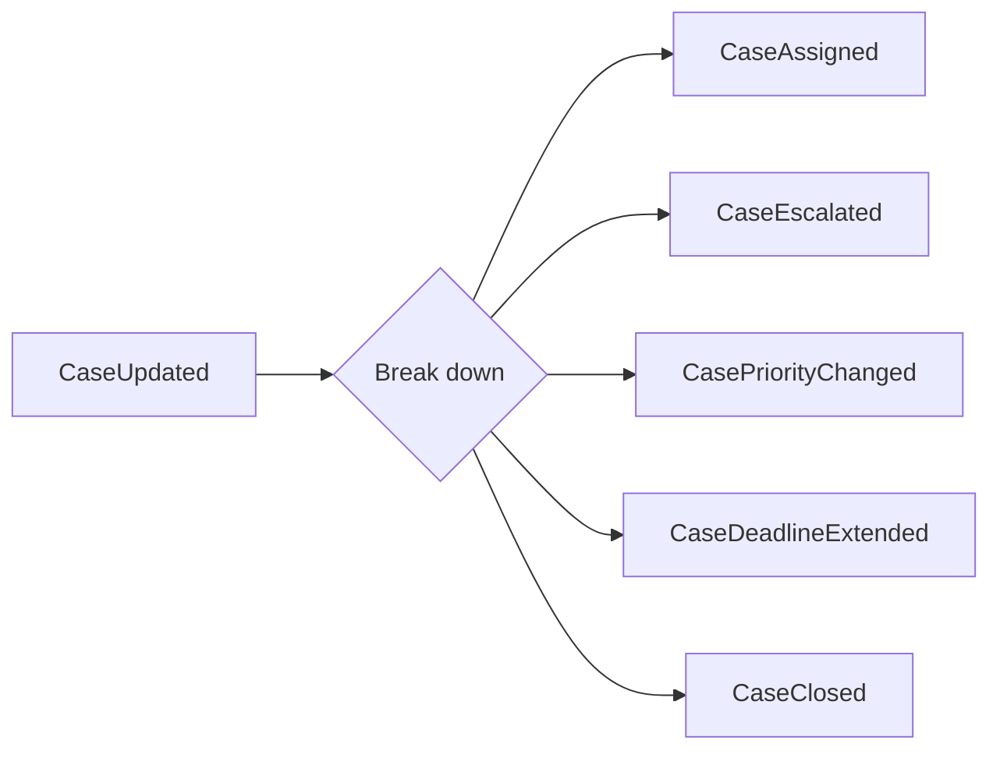
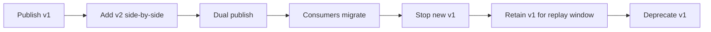
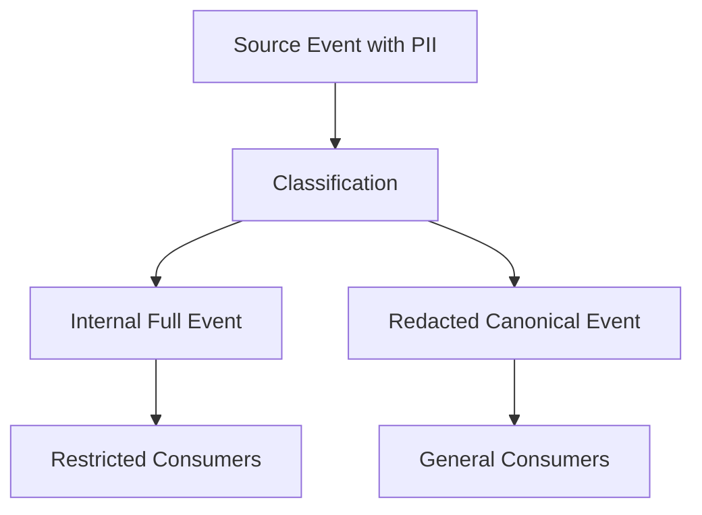

# Part 028 — Canonical Event Modeling

Banyak pipeline rusak bukan karena Kafka, Flink, Spark, atau schema registry. Pipeline rusak karena event-nya salah dimodelkan.

Contoh event yang tampak biasa:

```json
{
  "caseId": "CASE-123",
  "status": "ESCALATED",
  "priority": "HIGH",
  "assignedTo": "officer-9",
  "updatedAt": "2026-07-04T10:15:00Z"
}
```

Apa artinya?

- Apakah ini fakta bahwa case baru saja dieskalasi?
- Apakah ini snapshot state terkini?
- Apakah ini koreksi data historis?
- Apakah ini command agar downstream melakukan escalation?
- Apakah ini hasil replay?
- Apakah `updatedAt` adalah waktu perubahan bisnis atau waktu row database berubah?
- Apakah event ini boleh dipakai untuk audit enforcement decision?

Kalau jawaban itu tidak jelas dari model event, pipeline akan menjadi ambiguity machine.

Mental model utama:

> **Canonical event is not a DTO sent through Kafka. It is a durable statement of business fact with explicit identity, time, causality, and evolution rules.**

---

## 1. Apa Itu Canonical Event?

Canonical event adalah representasi event yang distandarkan pada boundary domain/platform sehingga bisa dipakai oleh banyak consumer tanpa harus memahami detail source system.

Ia bukan:

- raw CDC row change,
- REST response yang dikirim ulang,
- database entity serialized ke Kafka,
- command internal service,
- log debug,
- DTO UI,
- warehouse table row.

Ia adalah kontrak lintas sistem.



Canonical event menyembunyikan variasi teknis source, tetapi tidak boleh menyembunyikan fakta penting seperti causality, event time, correction, atau confidence.

---

## 2. Event Bukan Sekadar “Data Yang Berubah”

Ada beberapa jenis pesan yang sering dicampur:

| Jenis | Pertanyaan yang dijawab | Contoh | Risiko jika disalahgunakan |
|---|---|---|---|
| Command | “Tolong lakukan X” | `EscalateCaseCommand` | Consumer menganggap sebagai fakta padahal bisa gagal |
| Event/fact | “X sudah terjadi” | `CaseEscalated` | Aman untuk audit jika immutable dan jelas |
| State snapshot | “Inilah state saat ini” | `CaseSnapshotUpdated` | Bisa menimpa history jika dianggap event faktual |
| CDC change | “Row/table berubah” | `case.status changed` | Terlalu source-specific |
| Notification | “Ada sesuatu untuk diperhatikan” | `CaseNeedsReviewNotification` | Bisa duplicate dan non-authoritative |
| Correction | “Fakta sebelumnya dikoreksi” | `CaseEscalationCorrected` | Jika tidak eksplisit, history rusak |

Rule penting:

> **Never model commands, facts, snapshots, and corrections as the same event type.**

---

## 3. Command vs Event

Command bersifat imperative. Event bersifat declarative.

Command:

```json
{
  "commandId": "cmd-001",
  "type": "EscalateCase",
  "caseId": "CASE-123",
  "requestedBy": "officer-9"
}
```

Event:

```json
{
  "eventId": "evt-001",
  "type": "CaseEscalated",
  "caseId": "CASE-123",
  "escalatedBy": "officer-9",
  "escalatedAt": "2026-07-04T10:15:00Z"
}
```

Command bisa ditolak. Event menyatakan sesuatu sudah terjadi.



Pipeline yang downstream-nya melakukan analytics, audit, atau materialized view sebaiknya mengonsumsi event/fact, bukan command.

---

## 4. Fact Event vs State Snapshot

### 4.1 Fact Event

Fact event menyatakan perubahan spesifik:

```json
{
  "eventType": "CaseEscalated",
  "caseId": "CASE-123",
  "fromLevel": 1,
  "toLevel": 2,
  "reasonCode": "SLA_RISK"
}
```

Keunggulan:

- audit-friendly,
- bisa menghitung history,
- bisa replay incremental,
- causality lebih jelas,
- correction bisa diarahkan ke fakta tertentu.

Kelemahan:

- consumer perlu membangun state,
- event design butuh domain thinking,
- backfill harus menjaga urutan.

### 4.2 State Snapshot

Snapshot menyatakan state terkini:

```json
{
  "eventType": "CaseSnapshotUpdated",
  "caseId": "CASE-123",
  "status": "ESCALATED",
  "level": 2,
  "assignedOfficer": "officer-9"
}
```

Keunggulan:

- consumer sederhana,
- cocok untuk cache/materialized view,
- recovery cepat bila topic compacted.

Kelemahan:

- history hilang jika tidak ada event fact,
- audit lemah,
- sulit membedakan “tidak berubah” vs “tidak dikirim”,
- correction lebih ambigu.

### 4.3 Pattern yang Sehat

Gunakan keduanya jika perlu, tapi pisahkan topic/contract:



Fact events adalah sumber history. Snapshot adalah convenience view.

---

## 5. CDC Event Bukan Canonical Event

CDC event berasal dari perubahan row/table. Ia bagus untuk capture, tetapi tidak selalu bagus sebagai canonical event.

CDC row change:

```json
{
  "table": "case_record",
  "op": "u",
  "before": {
    "id": "CASE-123",
    "status": "OPEN",
    "priority": "NORMAL"
  },
  "after": {
    "id": "CASE-123",
    "status": "ESCALATED",
    "priority": "HIGH"
  }
}
```

Canonical event:

```json
{
  "eventType": "CaseEscalated",
  "caseId": "CASE-123",
  "fromStatus": "OPEN",
  "toStatus": "ESCALATED",
  "fromPriority": "NORMAL",
  "toPriority": "HIGH",
  "reasonCode": "SLA_RISK",
  "decisionId": "DEC-456"
}
```

CDC memberi tahu “row berubah”. Canonical event memberi tahu “business fact terjadi”.

Jangan mengekspos struktur database operasional sebagai contract lintas organisasi kecuali memang contract-nya adalah replication contract.

---

## 6. Anatomy of a Production-Grade Canonical Event

Canonical event minimal punya tiga area:

1. **Envelope metadata**
2. **Business payload**
3. **Governance/audit metadata**

```json
{
  "eventId": "evt-01J0ABC",
  "eventType": "CaseEscalated",
  "eventVersion": "1.2.0",
  "producer": "case-management-service",
  "tenantId": "regulator-id",
  "correlationId": "corr-123",
  "causationId": "cmd-789",
  "eventTime": "2026-07-04T10:15:00Z",
  "ingestionTime": "2026-07-04T10:15:02Z",
  "payload": {
    "caseId": "CASE-123",
    "fromLevel": 1,
    "toLevel": 2,
    "reasonCode": "SLA_RISK",
    "decisionId": "DEC-456"
  },
  "governance": {
    "sensitivity": "INTERNAL",
    "legalHold": false,
    "sourceSystem": "case-management",
    "sourcePosition": "outbox:982341"
  }
}
```

### 6.1 Required Metadata

| Field | Purpose |
|---|---|
| `eventId` | Idempotency, audit, dedupe |
| `eventType` | Routing and contract binding |
| `eventVersion` | Semantic contract version |
| `producer` | Ownership and debugging |
| `eventTime` | Business time/event-time semantics |
| `ingestionTime` | Pipeline observation time |
| `correlationId` | Request/process chain tracing |
| `causationId` | What caused this event |
| `tenantId` | Isolation and governance |
| `sourcePosition` | Replay/audit linkage to source |

---

## 7. Event Identity

Event identity harus stabil dan unik.

Pilihan umum:

| Strategy | Contoh | Kapan cocok |
|---|---|---|
| UUID/ULID generated | `evt-01J...` | event dibuat oleh service |
| Outbox primary key | `outbox:982341` | outbox sebagai source authoritative |
| Natural idempotency key | `caseId + transitionId` | source punya stable transition ID |
| Hash of canonical content | `sha256(...)` | dedupe file/API ingestion, hati-hati koreksi |

Jangan memakai Kafka offset sebagai event identity. Offset adalah posisi di log, bukan identitas bisnis.



Offset bisa berubah jika data diproduksi ulang ke topic baru. Event identity harus tetap sama jika fakta yang sama direplay.

---

## 8. Aggregate Key and Partition Key

Untuk domain event, partition key biasanya aggregate ID.

Contoh:

```text
Kafka key: CASE-123
Payload: CaseEscalated(caseId=CASE-123, ...)
```

Keuntungan:

- event per case terurut dalam satu partition,
- stateful processor bisa keyed by case,
- materialized view lebih mudah,
- dedupe per aggregate lebih sederhana.

Namun partition key adalah trade-off:

- hot aggregate bisa membuat skew,
- cross-aggregate ordering tidak dijamin,
- repartition mahal,
- key change adalah breaking operational change.

Decision rule:

> Pilih key berdasarkan ordering/state boundary, bukan hanya berdasarkan field yang mudah tersedia.

---

## 9. Temporal Semantics

Canonical event harus membedakan minimal empat waktu:

| Time | Meaning |
|---|---|
| `eventTime` | kapan fakta bisnis terjadi |
| `ingestionTime` | kapan pipeline menerima event |
| `processingTime` | kapan processor memproses event |
| `effectiveTime` | kapan fakta berlaku secara bisnis/regulasi |

Untuk regulatory/enforcement system, `effectiveTime` sering sangat penting.

Contoh:

```json
{
  "eventType": "SanctionEffectiveDateCorrected",
  "eventTime": "2026-07-04T10:15:00Z",
  "effectiveTime": "2026-06-30T00:00:00Z",
  "ingestionTime": "2026-07-04T10:15:02Z"
}
```

Fakta dikirim pada 4 Juli, tetapi berlaku sejak 30 Juni. Jika pipeline hanya punya satu timestamp, analytics dan audit bisa salah.

---

## 10. Causality

Event tidak berdiri sendiri. Ia biasanya disebabkan oleh command, event lain, scheduled job, correction, atau manual intervention.

Gunakan:

- `correlationId`: mengelompokkan keseluruhan business process/request,
- `causationId`: menunjuk penyebab langsung,
- `parentEventId`: jika event diturunkan dari event sebelumnya,
- `sourceDecisionId`: jika berasal dari decision record.



Tanpa causality, impact analysis saat incident akan sulit.

---

## 11. Modeling Event Names

Gunakan past tense untuk fact event:

- `CaseCreated`
- `CaseAssigned`
- `CaseEscalated`
- `CaseClosed`
- `EvidenceReceived`
- `DecisionIssued`
- `DeadlineBreached`

Hindari nama ambigu:

- `CaseUpdated`
- `CaseChanged`
- `CaseEvent`
- `CaseNotification`
- `SyncCase`
- `ProcessCase`

`CaseUpdated` biasanya tanda domain belum dipahami. Jika semua hal menjadi `Updated`, downstream tidak tahu apa yang penting.

Lebih baik punya event spesifik:



Event spesifik membantu:

- consumer routing,
- selective subscription,
- audit explanation,
- schema evolution,
- quality rules,
- alerting.

---

## 12. Granularity: Too Fine vs Too Coarse

### 12.1 Terlalu Fine-Grained

```text
CaseStatusFieldChanged
CasePriorityFieldChanged
CaseAssigneeFieldChanged
CaseUpdatedAtFieldChanged
```

Masalah:

- consumer harus mengerti banyak event teknis,
- business intent hilang,
- event count tinggi tanpa makna,
- korelasi antar field sulit.

### 12.2 Terlalu Coarse-Grained

```text
CaseUpdated
```

Masalah:

- semua consumer menerima noise,
- audit tidak jelas,
- schema jadi monster,
- downstream filtering rumit.

### 12.3 Granularity yang Sehat

Event harus merepresentasikan **business-significant transition**.

Contoh regulatory case:

| Event | Significance |
|---|---|
| `CaseRegistered` | case masuk sistem |
| `CaseScreened` | hasil screening awal tersedia |
| `CaseAssigned` | ownership berubah |
| `CaseEscalated` | risk/escalation level berubah |
| `DeadlineBreached` | SLA/regulatory deadline terlewati |
| `EnforcementDecisionIssued` | keputusan resmi diterbitkan |
| `CaseClosed` | lifecycle case selesai |

---

## 13. Corrections Are First-Class Events

Dalam sistem produksi, data salah akan terjadi. Jangan pura-pura immutable event tidak pernah salah.

Ada tiga pendekatan:

### 13.1 Compensating Event

```json
{
  "eventType": "CaseEscalationReversed",
  "caseId": "CASE-123",
  "reversedEventId": "evt-001",
  "reasonCode": "INCORRECT_INPUT"
}
```

Cocok ketika fakta pernah terjadi, lalu efeknya dibalik.

### 13.2 Correction Event

```json
{
  "eventType": "CaseEscalationCorrected",
  "caseId": "CASE-123",
  "correctedEventId": "evt-001",
  "fieldCorrections": [
    {
      "field": "reasonCode",
      "oldValue": "SLA_RISK",
      "newValue": "MANUAL_REVIEW"
    }
  ]
}
```

Cocok ketika event lama punya nilai salah.

### 13.3 Superseding Event

```json
{
  "eventType": "CaseSnapshotSuperseded",
  "caseId": "CASE-123",
  "supersedesSnapshotId": "snap-001",
  "newSnapshotId": "snap-002"
}
```

Cocok untuk snapshot/materialization.

Rule:

> Correction harus eksplisit. Jangan diam-diam mengubah payload historis tanpa audit trail.

---

## 14. Replay and Backfill Semantics

Event harus menyatakan apakah ia live, replay, backfill, atau correction.

```json
{
  "eventId": "evt-001",
  "eventType": "CaseEscalated",
  "processingMode": "BACKFILL",
  "originalEventId": "evt-001",
  "replayRunId": "replay-2026-07-04-001"
}
```

Ada dua model:

### 14.1 Same Event ID on Replay

Fakta yang sama diproduksi ulang dengan `eventId` yang sama.

Keuntungan:

- idempotent sink mudah,
- dedupe natural,
- audit tahu itu fakta sama.

Kelemahan:

- perlu metadata tambahan untuk replay run.

### 14.2 New Event ID with Original Reference

Replay menghasilkan event baru, tetapi punya `originalEventId`.

Keuntungan:

- setiap publish attempt punya identitas unik,
- audit transport lebih detail.

Kelemahan:

- sink harus memahami original identity untuk dedupe business effect.

Untuk banyak pipeline, gunakan:

- `eventId` = identity fakta,
- `deliveryId` atau `publishAttemptId` = identity pengiriman.

---

## 15. Canonical Event and Java Type Design

Gunakan sealed interface untuk taxonomy event.

```java
public sealed interface CaseEvent permits
    CaseRegistered,
    CaseAssigned,
    CaseEscalated,
    DeadlineBreached,
    EnforcementDecisionIssued,
    CaseClosed,
    CaseCorrectionEvent {

    EventId eventId();
    CaseId caseId();
    Instant eventTime();
}
```

Contoh event:

```java
public record CaseEscalated(
    EventId eventId,
    CaseId caseId,
    EscalationLevel fromLevel,
    EscalationLevel toLevel,
    ReasonCode reasonCode,
    DecisionId decisionId,
    Instant eventTime
) implements CaseEvent {
    public CaseEscalated {
        Objects.requireNonNull(eventId);
        Objects.requireNonNull(caseId);
        Objects.requireNonNull(fromLevel);
        Objects.requireNonNull(toLevel);
        Objects.requireNonNull(reasonCode);
        Objects.requireNonNull(eventTime);

        if (fromLevel.equals(toLevel)) {
            throw new IllegalArgumentException("Escalation requires level change");
        }
    }
}
```

Value object menjaga invariant lokal:

```java
public record EscalationLevel(int value) {
    public EscalationLevel {
        if (value < 1 || value > 5) {
            throw new IllegalArgumentException("Escalation level must be 1..5");
        }
    }

    public static EscalationLevel of(int value) {
        return new EscalationLevel(value);
    }
}
```

Jangan biarkan canonical event menjadi map/stringly typed object di dalam service domain.

---

## 16. Event Mapping from Source to Canonical

Canonicalization harus eksplisit dan testable.

```java
public final class CaseCdcToCanonicalMapper {
    public Optional<CaseEvent> map(CdcRecord record) {
        if (!record.table().equals("case_record")) {
            return Optional.empty();
        }

        String beforeStatus = record.before().getString("status");
        String afterStatus = record.after().getString("status");

        if (!Objects.equals(beforeStatus, afterStatus)
            && "ESCALATED".equals(afterStatus)) {
            return Optional.of(new CaseEscalated(
                EventId.fromSource(record.sourcePosition()),
                CaseId.of(record.after().getString("case_id")),
                EscalationLevel.of(record.before().getInt("escalation_level")),
                EscalationLevel.of(record.after().getInt("escalation_level")),
                ReasonCode.of(record.after().getString("escalation_reason")),
                DecisionId.of(record.after().getString("decision_id")),
                record.commitTimestamp()
            ));
        }

        return Optional.empty();
    }
}
```

Mapping harus punya golden tests:

- CDC update status open -> escalated menghasilkan `CaseEscalated`,
- CDC update description saja tidak menghasilkan event,
- missing reason masuk quarantine,
- invalid transition ditolak,
- duplicate source position menghasilkan event ID sama,
- old source schema masih bisa dibaca.

---

## 17. Polymorphic Event Topic

Ada dua model topic:

### 17.1 Topic per Event Type

```text
case-registered
case-assigned
case-escalated
case-closed
```

Keunggulan:

- schema per topic sederhana,
- consumer bisa subscribe spesifik,
- retention bisa beda.

Kelemahan:

- banyak topic,
- ordering antar event type per aggregate lebih sulit,
- operational overhead tinggi.

### 17.2 Topic per Aggregate/Domain

```text
case-events
```

Berisi banyak event type.

Keunggulan:

- ordering per aggregate lebih mudah jika key sama,
- consumer lifecycle stream lebih natural,
- domain event log utuh.

Kelemahan:

- schema polymorphism perlu disiplin,
- consumer harus filter event,
- compatibility management lebih kompleks.

Rule:

> Jika consumer butuh merekonstruksi lifecycle aggregate, topic per aggregate/domain sering lebih baik. Jika event type punya lifecycle, retention, dan consumer yang sangat berbeda, topic per event type bisa lebih baik.

---

## 18. Event Versioning

Ada beberapa jenis versioning:

| Version | Meaning |
|---|---|
| Schema registry version | urutan teknis schema di registry |
| Event semantic version | perubahan makna kontrak event |
| Producer version | versi aplikasi yang memproduksi |
| Mapper version | versi canonicalization logic |
| Projection version | versi downstream transform |

Jangan campur.

Metadata contoh:

```json
{
  "eventType": "CaseEscalated",
  "eventVersion": "2.0.0",
  "schemaId": "registry:case-events-value:42",
  "producerVersion": "case-service@2026.07.04.1",
  "mapperVersion": "cdc-case-mapper@3.1.0"
}
```

Event version naik major ketika consumer lama tidak bisa lagi memahami makna event dengan aman.

---

## 19. Canonical Event Evolution

Evolusi aman:

- tambah optional field dengan default,
- tambah metadata non-breaking,
- tambah enum symbol jika consumer punya unknown handling,
- tambah event type baru jika consumer bisa ignore unknown type,
- pecah event dengan dual-publish dan migration plan.

Evolusi berbahaya:

- rename field tanpa alias/migration,
- ubah unit field dari seconds ke millis,
- ubah semantic field dengan nama sama,
- reuse event type untuk meaning baru,
- jadikan optional field menjadi required,
- ubah identity/key semantics,
- ubah partition key tanpa migration.

Pattern rollout:



---

## 20. Canonical Event Quality Rules

Setiap canonical event type harus punya quality rules.

Contoh `CaseEscalated`:

- `eventId` must be non-empty and globally unique,
- `caseId` must match known case ID format,
- `fromLevel` and `toLevel` must be different,
- `toLevel` must be greater than `fromLevel` unless event is correction,
- `reasonCode` must be from controlled vocabulary,
- `eventTime` must not be after ingestion time by more than allowed clock skew,
- `decisionId` must exist for enforcement-driven escalation,
- `tenantId` must match case tenant,
- sensitivity classification must be at least `INTERNAL`.

Quality rule bukan hanya schema. Ia sering butuh reference data dan domain state.

---

## 21. Auditability and Regulatory Defensibility

Untuk enforcement/regulatory pipeline, canonical event harus bisa menjawab:

- siapa yang melakukan tindakan,
- kapan tindakan terjadi,
- berdasarkan aturan apa,
- data input apa yang dipakai,
- sistem apa yang menghasilkan event,
- versi logic apa yang memetakan event,
- apakah event original, correction, atau replay,
- apakah ada data yang di-redact,
- output downstream mana yang terpengaruh.

Tambahkan audit fields yang eksplisit:

```json
{
  "audit": {
    "actorType": "USER",
    "actorId": "officer-9",
    "decisionPolicyVersion": "escalation-policy@2026-06",
    "sourceTransactionId": "tx-982341",
    "evidenceRefs": ["evidence-1", "evidence-2"],
    "redactionApplied": false
  }
}
```

Jangan mengandalkan log aplikasi untuk audit utama. Log bisa sampling, rotate, hilang konteks, atau tidak replayable.

---

## 22. Redaction and Sensitive Data

Canonical event tidak harus membawa semua data. Ia harus membawa data yang dibutuhkan consumer sesuai classification.

Pattern:



Jangan membuat satu canonical event penuh PII lalu berharap semua consumer patuh. Buat boundary yang enforceable.

Field-level metadata bisa membantu:

```json
{
  "payload": {
    "subjectName": {
      "value": "REDACTED",
      "classification": "PII",
      "redactionReason": "GENERAL_CONSUMER_TOPIC"
    }
  }
}
```

Namun jangan terlalu banyak metadata field-level jika tidak benar-benar dipakai; complexity-nya tinggi.

---

## 23. Materialized View from Canonical Events

Consumer membangun state dari event:

```java
public final class CaseProjection {
    private final Map<CaseId, CaseView> state = new HashMap<>();

    public void apply(CaseEvent event) {
        switch (event) {
            case CaseRegistered e -> state.put(e.caseId(), CaseView.from(e));
            case CaseAssigned e -> state.compute(e.caseId(), (id, view) -> view.assign(e.officerId()));
            case CaseEscalated e -> state.compute(e.caseId(), (id, view) -> view.escalate(e.toLevel()));
            case DeadlineBreached e -> state.compute(e.caseId(), (id, view) -> view.markBreached(e.deadlineId()));
            case EnforcementDecisionIssued e -> state.compute(e.caseId(), (id, view) -> view.recordDecision(e.decisionId()));
            case CaseClosed e -> state.compute(e.caseId(), (id, view) -> view.close(e.closedAt()));
            case CaseCorrectionEvent e -> applyCorrection(e);
        }
    }

    private void applyCorrection(CaseCorrectionEvent correction) {
        // Correction logic must be explicit and auditable.
    }
}
```

Projection correctness bergantung pada:

- ordering per aggregate,
- idempotency,
- correction handling,
- snapshot bootstrap,
- replay determinism,
- event version handling.

---

## 24. Idempotency and Canonical Events

Setiap canonical event harus punya idempotency key.

Untuk fact event, biasanya:

```text
eventId
```

Untuk effect sink, bisa:

```text
consumerName + eventId
```

Untuk aggregation contribution:

```text
aggregationName + window + eventId
```

Untuk correction:

```text
correctionEventId
correctedEventId
correctionSequence
```

Jangan pakai hash payload mentah jika event bisa berubah format tapi fakta sama.

---

## 25. Canonical Event Review Checklist

Sebelum event diterima sebagai canonical:

- Apakah event menyatakan command, fact, snapshot, atau correction?
- Apakah nama event past-tense dan business-specific?
- Apakah aggregate identity jelas?
- Apakah event identity stabil?
- Apakah partition key sesuai ordering/state requirement?
- Apakah event time, ingestion time, dan effective time dibedakan?
- Apakah causation/correlation tersedia?
- Apakah event bisa direplay tanpa side effect ganda?
- Apakah correction strategy jelas?
- Apakah schema evolution rules jelas?
- Apakah enum punya unknown/future handling?
- Apakah null/default semantics jelas?
- Apakah PII classification jelas?
- Apakah event cukup untuk audit tanpa membaca log aplikasi?
- Apakah event terlalu coarse seperti `Updated`?
- Apakah event terlalu source-specific seperti table row change?
- Apakah consumer bisa ignore event type yang tidak dikenal?
- Apakah golden payload test tersedia?
- Apakah lifecycle/deprecation plan tersedia?

---

## 26. Anti-Patterns

### 26.1 Entity Dump Event

```text
CaseUpdated { entire CaseEntity }
```

Masalah:

- mengekspos internal database model,
- field noise tinggi,
- breaking change sering,
- consumer sulit tahu apa yang berubah,
- audit semantic lemah.

### 26.2 Generic Event Type

```text
Event { type, payloadMap }
```

Masalah:

- compile-time safety hilang,
- schema registry kurang berguna,
- consumer logic penuh string comparison,
- quality rules sulit ditegakkan.

### 26.3 Mutable Historical Event

Mengedit payload event lama tanpa correction trail membuat audit tidak defensible.

### 26.4 Command Disguised as Event

`CaseShouldBeEscalated` terdengar seperti event, tapi sebenarnya command/recommendation. Downstream bisa salah menganggap escalation sudah terjadi.

### 26.5 Timestamp Monism

Satu field `timestamp` untuk semua arti waktu akan merusak late event handling, effective dating, SLA calculation, dan audit.

### 26.6 No Event Ownership

Canonical event tanpa owner akan membusuk. Tidak ada yang bertanggung jawab atas compatibility, documentation, dan migration.

---

## 27. Practical Design Template

Gunakan template ini untuk setiap event baru.

```md
# Event: CaseEscalated

## Classification
- Type: Fact event
- Domain: Regulatory case lifecycle
- Owner: Case Management Platform Team
- Topic: case-events
- Partition key: caseId

## Meaning
A case escalation has been accepted and persisted by the case management system.

## Not Meaning
This event is not a request to escalate a case.
This event is not a full snapshot of the case.
This event is not emitted for priority-only change unless escalation level changes.

## Identity
- eventId: stable fact identity from outbox ID
- idempotencyKey: eventId

## Time
- eventTime: business transaction commit time
- effectiveTime: time escalation becomes effective
- ingestionTime: set by pipeline gateway

## Causality
- causationId: command ID or source decision ID
- correlationId: case workflow correlation ID

## Payload
- caseId
- fromLevel
- toLevel
- reasonCode
- decisionId

## Quality Rules
- toLevel must differ from fromLevel
- reasonCode must be valid
- decisionId required for policy-driven escalation

## Correction
- corrected by CaseEscalationCorrected
- reversed by CaseEscalationReversed

## Evolution
- compatibility: backward transitive
- major version if meaning of escalation changes
```

---

## 28. Kesimpulan

Canonical event modeling adalah pekerjaan desain domain, bukan pekerjaan serializer.

Event yang baik:

- menyatakan fakta bisnis spesifik,
- punya identity stabil,
- membedakan waktu bisnis, ingestion, processing, dan effective time,
- punya causality,
- bisa direplay,
- bisa dikoreksi,
- punya ownership,
- punya schema evolution rule,
- punya quality rule,
- bisa mendukung audit.

Event yang buruk biasanya tampak mudah di awal: `EntityUpdated`, `payload: Map<String,Object>`, atau dump CDC langsung ke semua consumer. Biayanya muncul nanti dalam bentuk downstream coupling, ambiguous analytics, reprocessing sulit, dan audit yang tidak defensible.

Di part berikutnya, kita akan membahas **event time and business time** lebih dalam: bagaimana timestamp, watermark, late event, effective date, dan regulatory time semantics memengaruhi correctness pipeline.
