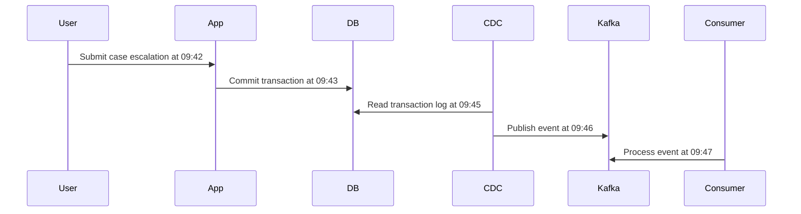
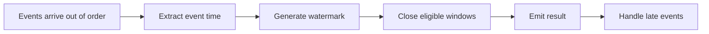

# Part 029 — Event Time and Business Time

A data pipeline does not only move values. It moves values **through time**.

That sounds philosophical, but it is one of the most practical statements in pipeline engineering. Most wrong dashboards, wrong alerts, wrong SLA breach detectors, wrong compliance reports, and wrong materialized views are not caused by a missing `map()` or a broken serializer. They are caused by unclear time semantics.

A record arrives at 10:05. The business event happened at 09:42. The database committed it at 09:43. The source exported it at 10:00. The pipeline processed it at 10:05. The business says it was effective from yesterday. The regulator asks when the organization knew it. The downstream model asks what was true at the end of the reporting day.

Those are different questions.

If the pipeline stores only one timestamp, the system has already lost information.

This part builds a production-grade mental model for time in Java data pipelines.

We will focus on:

- event time
- processing time
- ingestion time
- source commit time
- observed time
- business effective time
- watermarks
- lateness
- temporal ordering
- replay behavior
- Java representation
- validation rules
- operational consequences

The goal is simple: after this part, you should stop treating timestamp fields as incidental metadata and start treating them as **contractual dimensions of correctness**.

---

## 1. The Basic Mistake: “Timestamp” Is Not a Model

Many systems start with this:

```java
public record CaseEvent(
    String caseId,
    String status,
    Instant timestamp
) {}
```

This looks clean. It is also dangerously ambiguous.

What does `timestamp` mean?

- when the user clicked submit?
- when the API accepted the request?
- when the database transaction committed?
- when Debezium read the WAL/binlog?
- when Kafka received the message?
- when the consumer processed the message?
- when the event became legally effective?
- when the organization first knew about it?
- when the projection was updated?

A single field named `timestamp` is usually a smell. It compresses multiple clocks into one unclear value.

For basic CRUD systems, ambiguity may survive for a while. For pipelines, ambiguity becomes systemic failure.

Why?

Because pipelines aggregate, reorder, replay, backfill, join, deduplicate, window, alert, and audit. Each of those operations depends on the meaning of time.

A production pipeline should almost never expose a naked `timestamp` field without semantic qualification.

Prefer names like:

```java
occurredAt
sourceCommittedAt
ingestedAt
observedAt
processedAt
businessEffectiveFrom
businessEffectiveTo
publishedAt
```

The name is not cosmetic. It documents which clock the pipeline is allowed to reason with.

---

## 2. The Five Clocks You Must Separate

A serious pipeline usually needs to reason about at least five clocks.

| Clock | Meaning | Typical Source | Used For |
|---|---|---|---|
| Event time | When the real-world or domain event happened | Producer payload | windows, domain ordering, business facts |
| Source commit time | When the source system committed the change | DB log, CDC metadata | CDC ordering, replication lag, audit |
| Ingestion time | When the pipeline first accepted the record | pipeline gateway, Kafka append, landing zone | freshness, source delay, intake monitoring |
| Processing time | When a worker processed the record | consumer JVM clock | operational latency, timeout, runtime behavior |
| Business effective time | When the fact is valid in business/legal reality | domain payload | regulatory reports, effective-dated views, correction handling |

There are more clocks in some domains:

- `publishedAt`: when an event was made available to consumers
- `observedAt`: when an organization or system first observed an external fact
- `extractedAt`: when a batch export extracted a source record
- `loadedAt`: when a sink table received the row
- `reportedAt`: when a user or external party reported the issue
- `validFrom` / `validTo`: when a fact is valid in business time
- `systemFrom` / `systemTo`: when the system stored a version of the fact

But the five clocks above are the minimum mental model.

---

## 3. Event Time

**Event time** is the time at which the domain event happened.

Example:

```json
{
  "eventType": "CaseEscalated",
  "caseId": "CASE-9001",
  "occurredAt": "2026-07-04T08:15:22Z"
}
```

`occurredAt` means the escalation happened at that instant in the domain.

Event time is what you usually want for:

- business windows
- timeline reconstruction
- SLA breach detection
- user-visible history
- domain analytics
- fraud/event sequence analysis
- regulatory evidence
- replay-stable computation

If you compute “number of escalations per hour” using processing time, then the answer changes depending on ingestion delay. That may be acceptable for operational monitoring, but it is wrong for domain reporting.

### Event Time Is Usually Not Monotonic

Events do not necessarily arrive in event-time order.

A user may submit late. A mobile app may sync after reconnecting. A CDC connector may snapshot older rows before streaming current changes. A vendor API may return pages sorted by update time but with eventual consistency. A backfill may inject historical records into today’s pipeline.

Therefore, the pipeline must assume:

```text
event_time_order != arrival_order
```

That one inequality explains why watermarks, late-event handling, correction events, and replay strategy exist.

---

## 4. Processing Time

**Processing time** is the wall-clock time of the worker executing the pipeline step.

Example:

```java
Instant processingStartedAt = clock.instant();
```

Processing time is useful for operational questions:

- how long did this handler take?
- when did this JVM see the record?
- is the pipeline stuck?
- is the sink slow?
- did retries exceed budget?
- is processing latency increasing?

Processing time is not stable under replay.

If you replay a record tomorrow, its processing time becomes tomorrow. If your transformation uses processing time to derive business fields, replay will produce different output.

That violates determinism.

Bad:

```java
public InvoiceProjection apply(PaymentReceived event) {
    return new InvoiceProjection(
        event.invoiceId(),
        "PAID",
        Instant.now() // bad: replay changes the result
    );
}
```

Better:

```java
public InvoiceProjection apply(PaymentReceived event) {
    return new InvoiceProjection(
        event.invoiceId(),
        "PAID",
        event.occurredAt()
    );
}
```

Processing time belongs in metadata, logs, metrics, and audit trail. It should not silently become domain truth.

---

## 5. Ingestion Time

**Ingestion time** is when the pipeline first accepted the record.

For Kafka, this may be close to broker append time or producer send time, depending on your design. For file ingestion, it may be the moment a manifest is accepted. For API ingestion, it may be when the fetcher stores the page into a raw table.

Ingestion time answers:

- when did the pipeline first know about this record?
- how stale was the source when it arrived?
- how long from event occurrence to pipeline intake?
- did the upstream vendor delay delivery?
- did a file arrive after cutoff?

Ingestion time is a pipeline fact, not a business fact.

It is extremely useful for freshness and observability:

```text
source_delay = ingested_at - occurred_at
processing_delay = processed_at - ingested_at
total_observed_delay = output_committed_at - occurred_at
```

These three delays answer different questions.

| Metric | Meaning |
|---|---|
| `ingested_at - occurred_at` | upstream/source delay |
| `processed_at - ingested_at` | pipeline processing delay |
| `output_committed_at - occurred_at` | end-to-end data availability delay |

If these are not separated, teams argue without evidence.

The source team says the pipeline is slow. The pipeline team says the source delivered late. The reporting team says the dashboard is stale. Without clock separation, nobody can prove where time was lost.

---

## 6. Source Commit Time

**Source commit time** is when the source system made a change durable.

For CDC, this may come from the database transaction log or connector metadata. It is especially important when source tables are captured from operational databases.

Example timeline:



The same logical event may have:

```text
occurred_at          = 09:42
source_committed_at  = 09:43
published_at         = 09:46
processed_at         = 09:47
```

Source commit time is useful for:

- CDC ordering
- replication lag measurement
- audit evidence
- diagnosing connector delay
- comparing outbox event time vs database commit time
- reconstructing what the source database knew at a point in time

It is not always the same as event time.

A business event can happen before the transaction commits. A correction can be entered today but become effective last month. A batch import may commit historical facts today.

---

## 7. Business Effective Time

**Business effective time** is when a fact becomes valid in the domain.

This is not the same as event time.

Example:

```json
{
  "eventType": "PenaltyRateChanged",
  "rate": 0.15,
  "occurredAt": "2026-07-04T10:00:00Z",
  "businessEffectiveFrom": "2026-07-01T00:00:00Z"
}
```

The event was recorded on July 4, but the new rate is effective from July 1.

In regulatory, financial, insurance, billing, payroll, and case-management systems, business effective time matters deeply.

It answers:

- what was valid for this case on a given business date?
- what rule applied when the decision was made?
- was a deadline breached according to the effective policy?
- what should a historical report have shown as of the reporting period?
- did we apply the rule that was valid at the time of the regulated activity?

Business effective time creates harder questions than streaming event time.

A late event may not merely be late. It may rewrite the business truth for a historical interval.

That is why effective-dated data should usually be modeled explicitly:

```java
public record EffectivePeriod(
    Instant validFrom,
    Optional<Instant> validTo
) {
    public EffectivePeriod {
        Objects.requireNonNull(validFrom);
        Objects.requireNonNull(validTo);

        validTo.ifPresent(to -> {
            if (!to.isAfter(validFrom)) {
                throw new IllegalArgumentException("validTo must be after validFrom");
            }
        });
    }
}
```

Do not hide effective time inside generic metadata. It is part of domain semantics.

---

## 8. A Temporal Context Object

A production Java pipeline benefits from a dedicated temporal context.

```java
public record TemporalContext(
    Instant occurredAt,
    Optional<Instant> sourceCommittedAt,
    Instant ingestedAt,
    Optional<Instant> publishedAt,
    Optional<Instant> processedAt,
    Optional<EffectivePeriod> businessEffectivePeriod,
    ZoneId businessZone
) {
    public TemporalContext {
        Objects.requireNonNull(occurredAt);
        Objects.requireNonNull(sourceCommittedAt);
        Objects.requireNonNull(ingestedAt);
        Objects.requireNonNull(publishedAt);
        Objects.requireNonNull(processedAt);
        Objects.requireNonNull(businessEffectivePeriod);
        Objects.requireNonNull(businessZone);

        if (ingestedAt.isBefore(occurredAt.minus(Duration.ofDays(3650)))) {
            throw new IllegalArgumentException("ingestedAt is suspiciously earlier than occurredAt");
        }
    }
}
```

This object is not just for convenience. It creates a single place to encode temporal rules.

But be careful: not every timestamp has a universal ordering relation.

This may be true:

```text
source_committed_at >= occurred_at
```

But it is not always true. A user may enter a historical correction. A business fact may be effective in the past. An API may expose externally observed facts long after they occurred.

Therefore, temporal validation must be domain-aware.

A better pattern is to separate generic mechanical rules from domain rules.

```java
public interface TemporalRule<T> {
    List<TemporalViolation> validate(T record);
}
```

Example:

```java
public final class CaseEscalationTemporalRule
        implements TemporalRule<CaseEscalated> {

    private static final Duration MAX_FUTURE_SKEW = Duration.ofMinutes(5);
    private final Clock clock;

    public CaseEscalationTemporalRule(Clock clock) {
        this.clock = clock;
    }

    @Override
    public List<TemporalViolation> validate(CaseEscalated event) {
        List<TemporalViolation> violations = new ArrayList<>();
        Instant now = clock.instant();

        if (event.temporal().occurredAt().isAfter(now.plus(MAX_FUTURE_SKEW))) {
            violations.add(new TemporalViolation(
                "occurredAt",
                "event occurrence is too far in the future"
            ));
        }

        event.temporal().businessEffectivePeriod().ifPresent(period -> {
            if (period.validFrom().isAfter(event.temporal().occurredAt().plus(Duration.ofDays(1)))) {
                violations.add(new TemporalViolation(
                    "businessEffectiveFrom",
                    "effective time cannot start far after the escalation occurrence"
                ));
            }
        });

        return violations;
    }
}
```

The point is not the exact rule. The point is that time constraints are first-class rules, not implicit assumptions scattered across transformations.

---

## 9. Time Contract for an Event

A data contract should describe temporal fields explicitly.

Example contract fragment:

```yaml
event: CaseEscalated
version: 3
requiredTemporalFields:
  occurredAt:
    meaning: time when the case was escalated in the source domain
    type: instant
    timezone: UTC
    allowedFutureSkew: PT5M
    allowedPastAge: P10Y
  sourceCommittedAt:
    meaning: time when the source transaction committed
    type: instant
    requiredWhen: source.type == "cdc"
  ingestedAt:
    meaning: time when the pipeline intake accepted the record
    type: instant
    assignedBy: pipeline
  businessEffectiveFrom:
    meaning: time when the escalation is effective for SLA calculation
    type: instant
    nullable: false
ordering:
  primaryOrderingKey: caseId
  eventSequenceField: caseEventSequence
lateness:
  expectedMaxLateness: PT15M
  actionAfterAllowedLateness: correction-event
```

A mature pipeline contract should answer:

1. Which time field drives windowing?
2. Which time field drives business reporting?
3. Which time field drives freshness SLO?
4. Which time field is assigned by source vs pipeline?
5. Which time field is mutable or correctable?
6. How late can records arrive before they are treated as corrections?
7. What happens when time fields are missing, malformed, or contradictory?

If the contract does not answer these questions, every downstream consumer will guess.

---

## 10. Watermarks: Progress in Event Time

In stream processing, records can arrive out of order. A pipeline still needs to decide when it has seen “enough” records for an event-time window.

A **watermark** is a system’s estimate of event-time progress.

Conceptually:

```text
watermark = "I do not expect to see more events with event_time <= T"
```

This does not mean impossible. It means the system is ready to make progress based on its configured lateness assumptions.



Apache Flink uses watermarks to measure progress in event time. A watermark with timestamp `t` declares that event time has reached `t`, meaning no more elements with timestamp less than or equal to `t` are expected. Apache Beam similarly tracks watermarks because data is not guaranteed to arrive in event-time order or at predictable intervals.

The important engineering point: watermarks encode a trade-off.

| More aggressive watermark | More conservative watermark |
|---|---|
| lower latency | higher latency |
| more late events | fewer late events |
| faster output | more complete output |
| better for alerts | better for reports |

There is no universally correct watermark. There is only a business-appropriate lateness policy.

---

## 11. Allowed Lateness

Allowed lateness is the period after a window closes during which late events may still update the result.

Example:

```text
window: 09:00 - 10:00
watermark passes: 10:00
allowed lateness: 15 minutes
late update accepted until: 10:15
```

After that, the event may be:

- dropped
- sent to side output
- quarantined
- emitted as a correction
- used to trigger recomputation
- stored for audit only

Do not treat this as a technical knob only. Allowed lateness is a product and correctness decision.

For fraud alerts, waiting 24 hours for completeness may be unacceptable. For monthly regulatory reports, ignoring late corrections may be unacceptable.

A good contract says:

```yaml
latenessPolicy:
  expectedLateness: PT10M
  allowedLateness: PT2H
  afterAllowedLateness: emit_correction
  correctionTopic: regulatory.case-escalation.corrections.v1
```

A bad contract says nothing and lets each consumer decide.

---

## 12. Late Events Are Not One Thing

“Late event” is an overloaded phrase. Separate these cases.

| Case | Meaning | Typical Action |
|---|---|---|
| Transport-late | Event happened on time but arrived late | update window if within lateness |
| Source-late | Source emitted record late | measure source delay, maybe alert upstream |
| Business-late | Business fact is effective in the past | correction or bitemporal update |
| Replay-late | Historical replay injects old event time | route through replay mode |
| Poison-late | Timestamp is invalid or impossible | quarantine |
| Clock-skew-late | Producer clock wrong | validate and classify |

The same event may be late by processing time but valid by business time.

Example:

```json
{
  "eventType": "CaseDeadlineExtended",
  "occurredAt": "2026-07-04T10:00:00Z",
  "businessEffectiveFrom": "2026-07-02T00:00:00Z",
  "ingestedAt": "2026-07-04T10:01:00Z"
}
```

This record is not transport-late. It arrived quickly. But it is business-effective in the past.

Your pipeline should not use one lateness policy for all temporal dimensions.

---

## 13. Ordering and Time Are Related but Not Identical

Many engineers assume timestamp order is event order.

That is often false.

Two events may have the same timestamp. Producer clocks may differ. A source may update multiple rows in one transaction. A distributed system may not have a total global order.

Therefore, production pipelines often need both:

- time fields
- sequence or version fields

Example:

```java
public record CaseLifecycleEvent(
    String caseId,
    long caseVersion,
    UUID eventId,
    String eventType,
    TemporalContext temporal
) {}
```

For a single aggregate, `caseVersion` may define domain order more reliably than `occurredAt`.

For CDC, source offset may define log order more reliably than row timestamp.

For cross-aggregate analytics, event time may be more meaningful than aggregate version.

Use the correct order for the operation.

| Operation | Usually ordered by |
|---|---|
| Rebuilding one aggregate projection | aggregate version or source offset |
| Event-time window analytics | event time + watermark |
| CDC replication | source log position |
| Audit of source changes | source commit time + source offset |
| SLA business deadline | business effective time |
| Operational lag metric | ingestion/processing time |

A timestamp is not an ordering strategy by itself.

---

## 14. Time Zones: Store Instants, Interpret Locally

Most pipeline storage should use `Instant` for machine time.

```java
Instant occurredAt;
```

But business rules often require a zone.

A daily regulatory cutoff may be based on `Asia/Jakarta`, `Europe/London`, or an agency-specific business calendar. “End of day” is not the same everywhere.

Therefore, separate:

- stored instant
- business zone
- business calendar
- cutoff rule

Example:

```java
public record BusinessCalendar(
    ZoneId zone,
    Set<LocalDate> holidays,
    LocalTime dayCutoff
) {}
```

Then derive business date explicitly:

```java
public LocalDate businessDate(Instant instant, BusinessCalendar calendar) {
    ZonedDateTime local = instant.atZone(calendar.zone());

    if (local.toLocalTime().isBefore(calendar.dayCutoff())) {
        return local.toLocalDate().minusDays(1);
    }

    return local.toLocalDate();
}
```

The exact rule depends on the business. The invariant is universal: do not let random JVM default time zones decide business meaning.

Bad:

```java
LocalDate date = LocalDate.now();
```

Better:

```java
LocalDate date = businessDate(event.occurredAt(), configuredBusinessCalendar);
```

In production, always inject `Clock` and `ZoneId`.

---

## 15. Time in Replay and Backfill

Replay is where bad time modeling becomes obvious.

Suppose the pipeline originally processed this event on July 4:

```text
occurred_at = July 1
processed_at = July 4
```

Then you replay it on August 10:

```text
occurred_at = July 1
processed_at = August 10
```

If the output depends on `processed_at`, replay produces different results.

For deterministic replay, transformation logic should depend on:

- event payload
- event time
- business effective time
- versioned reference data
- explicit processing mode

It should not depend on:

- `Instant.now()`
- current database state unless versioned
- current config unless versioned
- current lookup table unless snapshotted
- random UUID unless derived or recorded

A replay-safe transformation receives time explicitly:

```java
public interface ReplaySafeTransform<I, O> {
    O apply(I input, TransformContext context);
}

public record TransformContext(
    ProcessingMode mode,
    Instant replayStartedAt,
    Optional<String> replayId,
    Clock operationalClock
) {}
```

Notice the separation:

- domain output should use event/business time
- operational audit can use replay start/processing time

---

## 16. Business Time in Regulatory Case Pipelines

Consider a regulatory enforcement lifecycle pipeline.

A case has events:

- `CaseOpened`
- `EvidenceReceived`
- `OfficerAssigned`
- `DeadlineExtended`
- `CaseEscalated`
- `DecisionIssued`
- `AppealSubmitted`
- `PenaltyPaid`

Some questions are event-time questions:

```text
How many cases were escalated on July 4?
```

Some are business-effective questions:

```text
Which escalation policy applied to the case on July 4?
```

Some are observed-time questions:

```text
When did the agency first know about the external complaint?
```

Some are source-commit questions:

```text
Was the case status committed before the nightly report snapshot?
```

Some are system-time questions:

```text
What did our warehouse table show when the report was generated?
```

If these questions share one `timestamp`, the platform cannot answer them defensibly.

A better event model:

```java
public record CaseEscalated(
    UUID eventId,
    String caseId,
    long caseVersion,
    String escalationReason,
    TemporalContext temporal,
    ActorRef escalatedBy,
    DataClassification classification
) {}
```

With explicit temporal meaning:

```java
TemporalContext temporal = new TemporalContext(
    occurredAt,
    sourceCommittedAt,
    ingestedAt,
    publishedAt,
    processedAt,
    Optional.of(new EffectivePeriod(effectiveFrom, effectiveTo)),
    ZoneId.of("Asia/Jakarta")
);
```

This may look verbose. In regulated systems, verbosity is cheaper than ambiguity.

---

## 17. Temporal Joins

Joins are where time semantics become critical.

Example:

```text
CaseEscalated + OfficerAssignment
```

Which officer should be attached to the escalation?

Options:

1. officer assigned at processing time
2. officer assigned at event time
3. officer assigned at business effective time
4. latest officer in current database
5. officer version from same source transaction

Each produces a different result.

Bad enrichment:

```java
Officer officer = officerRepository.findCurrentOfficer(caseId);
```

This creates non-deterministic replay. Reprocessing old events with today’s officer assignment changes historical output.

Better:

```java
Officer officer = officerHistory.findOfficerAt(
    caseId,
    event.temporal().occurredAt()
);
```

Or, if business effective time is required:

```java
Officer officer = officerHistory.findOfficerEffectiveAt(
    caseId,
    event.temporal()
         .businessEffectivePeriod()
         .orElseThrow()
         .validFrom()
);
```

A temporal join should declare its time basis:

```yaml
join:
  left: CaseEscalated
  right: OfficerAssignmentHistory
  key: caseId
  timeBasis: businessEffectiveFrom
  missingPolicy: quarantine
```

Never hide this decision inside repository code.

---

## 18. Temporal Contract Testing

Time rules should be tested like business rules.

Example test cases:

| Case | Input | Expected |
|---|---|---|
| normal event | occurred before ingested | accepted |
| future skew | occurred 2 hours in future | rejected/quarantined |
| late event within allowance | event time 5 min late | accepted and updates window |
| late event after allowance | event time 2 days late | correction path |
| historical correction | effective date in past | accepted as correction |
| replay | same event replayed later | same domain output |
| clock skew | source committed before occurred unexpectedly | warning or quarantine depending contract |
| DST boundary | local business date around daylight transition | deterministic date |

Example JUnit-style test:

```java
@Test
void replayDoesNotChangeDomainTimestamp() {
    CaseEscalated event = fixture.caseEscalated(
        Instant.parse("2026-07-01T09:00:00Z")
    );

    CaseProjection first = transform.apply(
        event,
        new TransformContext(
            ProcessingMode.LIVE,
            Instant.parse("2026-07-04T10:00:00Z"),
            Optional.empty(),
            Clock.fixed(Instant.parse("2026-07-04T10:00:00Z"), ZoneOffset.UTC)
        )
    );

    CaseProjection replayed = transform.apply(
        event,
        new TransformContext(
            ProcessingMode.REPLAY,
            Instant.parse("2026-08-10T10:00:00Z"),
            Optional.of("replay-123"),
            Clock.fixed(Instant.parse("2026-08-10T10:00:00Z"), ZoneOffset.UTC)
        )
    );

    assertEquals(first.escalatedAt(), replayed.escalatedAt());
}
```

The test protects the invariant: replay changes operational metadata, not domain truth.

---

## 19. Temporal Observability

A production pipeline should emit metrics per clock boundary.

Useful metrics:

```text
source_delay_ms          = ingested_at - occurred_at
cdc_lag_ms               = ingested_at - source_committed_at
processing_latency_ms    = output_committed_at - ingested_at
end_to_end_latency_ms    = output_committed_at - occurred_at
watermark_lag_ms         = now - current_watermark
late_event_count         = count(event_time < watermark)
future_event_count       = count(event_time > now + allowed_skew)
missing_time_count       = count(required temporal field missing)
correction_event_count   = count(events affecting closed windows/periods)
```

Do not only monitor throughput. A fast pipeline with broken time semantics produces wrong answers quickly.

Dashboard dimensions:

- source system
- event type
- topic/table
- tenant
- producer version
- processing mode
- business domain

Example alert rules:

```yaml
alerts:
  - name: cdc-lag-high
    condition: p95(cdc_lag_ms) > 300000
    duration: PT10M
    severity: warning
  - name: watermark-stalled
    condition: watermark_lag_ms > 900000
    duration: PT5M
    severity: critical
  - name: future-events-spike
    condition: future_event_count > 100
    duration: PT5M
    severity: warning
```

Temporal metrics convert vague complaints into diagnosable signals.

---

## 20. Common Anti-Patterns

### Anti-Pattern 1: `createdAt` Without Meaning

`createdAt` is ambiguous unless the owner is clear.

Better:

- `caseCreatedAt`
- `sourceRowCreatedAt`
- `eventCreatedAt`
- `pipelineIngestedAt`
- `projectionCreatedAt`

### Anti-Pattern 2: Using Processing Time for Business Windows

This creates output that changes under delay and replay.

### Anti-Pattern 3: Ignoring Business Effective Time

This is common in case, finance, policy, billing, and regulatory systems. The result is historically wrong reporting.

### Anti-Pattern 4: Enriching With Current State

Joining an old event with today’s lookup table creates non-reproducible output.

### Anti-Pattern 5: No Lateness Policy

Without an explicit lateness policy, late events become ad hoc incidents.

### Anti-Pattern 6: Relying on JVM Default Time Zone

The default time zone is an environment property, not a business rule.

### Anti-Pattern 7: Overusing Total Order

Many distributed systems do not provide meaningful global total order. Prefer per-key ordering plus explicit sequence fields where needed.

---

## 21. Practical Design Checklist

Before approving a pipeline event or table, ask:

1. What does each timestamp mean?
2. Which clock drives business aggregation?
3. Which clock drives operational freshness?
4. Which clock drives audit reconstruction?
5. Is event time allowed to be in the future?
6. How much lateness is expected?
7. What happens after allowed lateness?
8. Are corrections modeled explicitly?
9. Does replay produce the same domain output?
10. Are joins time-aware?
11. Is business time different from event time?
12. Are time zones explicit?
13. Is clock skew detected?
14. Are temporal metrics emitted?
15. Are temporal rules tested?

A pipeline without answers to these questions is not production-ready. It may still run. But it cannot defend its results.

---

## 22. Minimal Java Temporal Contract Example

Here is a compact example that can be expanded in production.

```java
public enum LateEventAction {
    ACCEPT,
    SIDE_OUTPUT,
    QUARANTINE,
    EMIT_CORRECTION,
    DROP_WITH_AUDIT
}

public record LatenessPolicy(
    Duration expectedLateness,
    Duration allowedLateness,
    LateEventAction afterAllowedLateness
) {
    public LatenessPolicy {
        if (allowedLateness.compareTo(expectedLateness) < 0) {
            throw new IllegalArgumentException(
                "allowedLateness must be >= expectedLateness"
            );
        }
    }
}

public record TimeContract(
    String eventType,
    String eventTimeField,
    Optional<String> businessEffectiveField,
    Duration allowedFutureSkew,
    LatenessPolicy latenessPolicy,
    ZoneId businessZone
) {}
```

And a validator:

```java
public final class TimeContractValidator {
    private final Clock clock;

    public TimeContractValidator(Clock clock) {
        this.clock = clock;
    }

    public List<String> validate(TemporalContext temporal, TimeContract contract) {
        List<String> errors = new ArrayList<>();
        Instant now = clock.instant();

        if (temporal.occurredAt().isAfter(now.plus(contract.allowedFutureSkew()))) {
            errors.add("occurredAt exceeds allowed future skew");
        }

        temporal.businessEffectivePeriod().ifPresent(period -> {
            if (period.validFrom().isAfter(now.plus(contract.allowedFutureSkew()))) {
                errors.add("business effective time exceeds allowed future skew");
            }
        });

        return errors;
    }
}
```

This is intentionally small. The important move is architectural: time validation becomes part of the pipeline contract.

---

## 23. Mental Model Summary

Use this compact model:

```text
Event time tells when the domain thing happened.
Business time tells when it is valid.
Source commit time tells when the source stored it.
Ingestion time tells when the pipeline received it.
Processing time tells when the worker handled it.
Watermark tells how far event-time processing believes it can progress.
Lateness policy tells what to do when reality disagrees.
```

A top-tier engineer does not ask, “What is the timestamp?”

They ask:

```text
Which clock is this, who owns it, what guarantee does it have,
and what breaks if it is late, missing, skewed, or corrected?
```

That question is the real beginning of temporal pipeline design.

---

## 24. References

- Apache Flink Documentation — Timely Stream Processing / Event Time and Watermarks: https://nightlies.apache.org/flink/flink-docs-stable/docs/concepts/time/
- Apache Beam Programming Guide — Event-time timers and watermarks: https://beam.apache.org/documentation/programming-guide/
- Apache Beam Basics — Watermarks, triggers, state, and timers: https://beam.apache.org/documentation/basics/
- Google Cloud Dataflow Documentation — Apache Beam programming model and watermark explanation: https://docs.cloud.google.com/dataflow/docs/concepts/beam-programming-model
