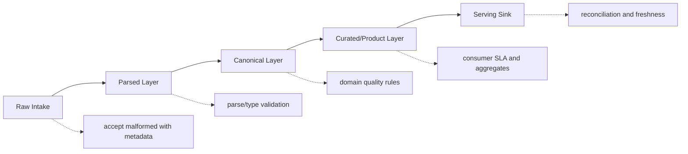
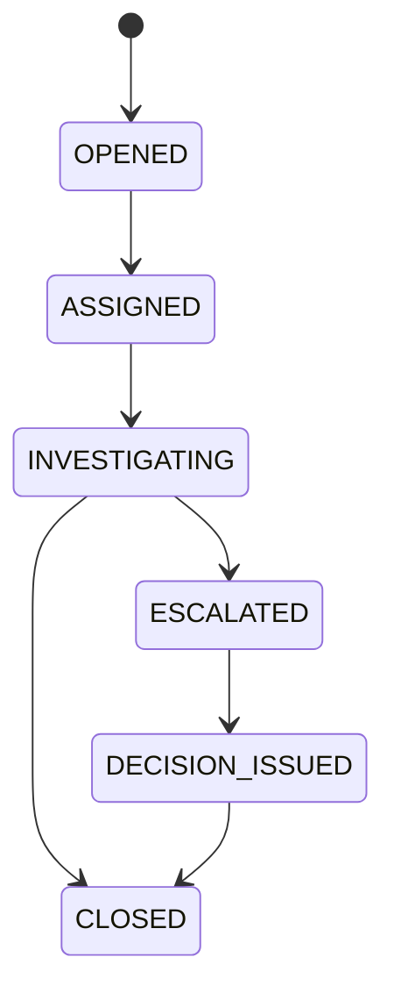
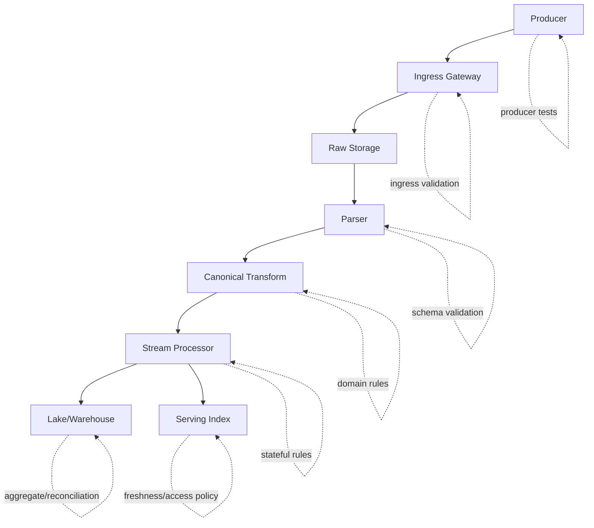
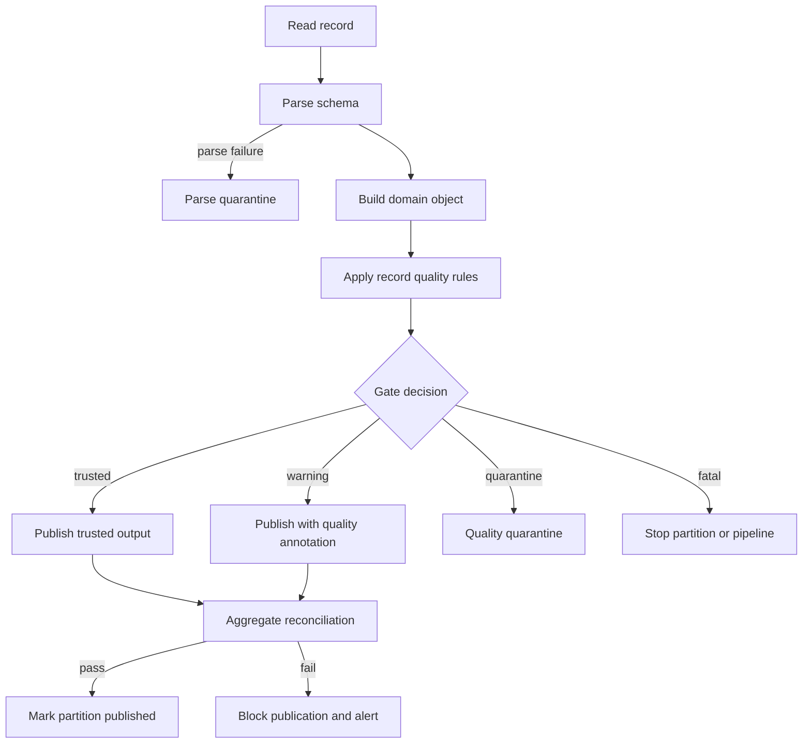

# Part 030 — Data Quality Contracts

A schema tells you whether a record can be parsed.

A data quality contract tells you whether the record is **fit to use**.

Those are different problems.

This record may pass schema validation:

```json
{
  "caseId": "",
  "status": "CLOSED",
  "openedAt": "2026-07-04T10:00:00Z",
  "closedAt": "2026-06-01T10:00:00Z",
  "penaltyAmount": -5000,
  "assignedOfficerId": "UNKNOWN"
}
```

It has the right JSON shape. It may even deserialize into a Java object. But it is not trustworthy.

Problems:

- `caseId` is blank
- `closedAt` is before `openedAt`
- `penaltyAmount` is negative
- `assignedOfficerId` is not a valid officer reference
- `status` may be illegal if required states were skipped

A pipeline that only checks schema will process bad facts at scale.

A production-grade pipeline needs explicit data quality contracts.

Not as a dashboard afterthought. Not as a spreadsheet of tribal rules. Not as a weekly report saying “some rows look odd.” The contract must be executable, versioned, observable, and connected to pipeline behavior.

This part builds that model.

---

## 1. Data Quality Is a Contract Boundary

Data quality is often treated as monitoring.

That is too late.

A better mental model:

```text
Data quality is a contract between producer, pipeline, and consumer about which facts are usable.
```

A quality contract should answer:

1. What must always be true?
2. What is usually true but may drift?
3. What makes data unsafe to publish?
4. What should be quarantined?
5. What can be accepted with warning?
6. Who owns each rule?
7. Which consumer depends on the rule?
8. What metric proves the rule is healthy?
9. What is the remediation path?

Without these answers, data quality becomes a vague complaint.

With these answers, data quality becomes an enforceable system property.

---

## 2. Schema Validation Is Necessary but Insufficient

Schema validation checks structure:

- required field exists
- field type is correct
- enum value is known
- nested object shape is valid
- format is parseable

Data quality checks meaning:

- value is non-blank
- amount is within valid range
- status transition is legal
- record is unique by business key
- reference exists
- event is not suspiciously late
- row count matches source
- distribution has not drifted unexpectedly
- aggregate balance reconciles

Example:

```java
public record PenaltyIssued(
    String caseId,
    BigDecimal amount,
    String currency,
    Instant issuedAt
) {}
```

The schema can say `amount` is decimal.

The quality contract says:

```text
amount > 0
currency in ISO-4217 allowlist
caseId exists in canonical case table
issuedAt >= case.openedAt
issuedAt <= now + allowed_clock_skew
```

A schema parser cannot infer those rules. The pipeline must encode them.

---

## 3. Core Data Quality Dimensions

Most quality rules fall into a small number of dimensions.

| Dimension | Question | Example |
|---|---|---|
| Completeness | Is required data present? | `caseId` must not be blank |
| Validity | Does value match allowed domain? | status must be one of known states |
| Accuracy | Does value reflect reality? | penalty amount matches authoritative ledger |
| Consistency | Do fields agree with each other? | `closedAt >= openedAt` |
| Uniqueness | Is identity duplicated? | one active case per external complaint ID |
| Referential integrity | Does referenced entity exist? | officer ID exists |
| Timeliness | Is data fresh enough? | source delay under 15 minutes |
| Order correctness | Are state transitions legal? | cannot close before opening |
| Conformity | Does format follow convention? | normalized country code |
| Stability | Has distribution changed unexpectedly? | status ratio drift spike |
| Reconciliation | Does sink match source? | counts/checksums/balances match |

A good contract does not merely say “data must be high quality.” It specifies which dimensions matter for which dataset.

---

## 4. Rule Severity: Not Every Violation Should Stop the Pipeline

A common beginner mistake is binary thinking:

```text
valid -> process
invalid -> fail
```

Production systems need a richer policy.

| Severity | Meaning | Typical Action |
|---|---|---|
| Fatal | Data is unsafe; continuing corrupts output | fail batch, stop publish, page owner |
| Quarantine | Record is unsafe but pipeline can continue | route record to quarantine/DLQ |
| Warning | Suspicious but not immediately unsafe | process and emit metric/alert |
| Informational | Useful for trend monitoring | process and record observation |
| Consumer-specific | Unsafe for one consumer, safe for another | publish with quality annotation or split output |

Example:

```yaml
rules:
  - id: case-id-required
    severity: fatal
    action: quarantine_record
  - id: officer-reference-missing
    severity: warning
    action: publish_with_quality_flag
  - id: source-delay-high
    severity: warning
    action: alert_if_sustained
  - id: total-count-reconciliation-failed
    severity: fatal
    action: block_partition_publish
```

Quality rules are not only predicates. They are predicates plus consequences.

---

## 5. Quality Contract Layers

The same data may have different quality expectations at different pipeline layers.



### Raw Layer

Raw layer should preserve evidence.

Rules here are usually about intake safety:

- file is complete
- record has source identity
- payload is stored immutably
- ingestion metadata exists
- source partition/checkpoint is known

Raw layer may accept malformed payloads because the purpose is capture.

### Parsed Layer

Parsed layer validates shape:

- deserialization succeeds
- schema version is recognized
- required structural fields exist
- field types and formats are valid

Invalid records may go to parse quarantine.

### Canonical Layer

Canonical layer validates domain meaning:

- identity is valid
- state transition is allowed
- timestamps are coherent
- references exist or are explicitly unresolved
- PII classification is correct
- domain enum mapping is known

This is usually the most important contract boundary.

### Curated/Product Layer

Curated layer validates consumer readiness:

- aggregates reconcile
- dimensions join successfully
- freshness SLA is met
- duplicate rate below threshold
- row count is within expected range
- late corrections handled

### Serving Sink

Serving sink validates publication correctness:

- output table/index received expected records
- materialized view version advanced
- query-serving freshness is within SLA
- published partition is complete
- access/masking policy is applied

The mistake is applying one rule set everywhere. Quality expectations should become stricter as data moves toward trusted outputs.

---

## 6. A Minimal Java Model for Quality Rules

Start with a small model.

```java
public enum QualitySeverity {
    FATAL,
    QUARANTINE,
    WARNING,
    INFO
}

public enum QualityAction {
    FAIL_PIPELINE,
    QUARANTINE_RECORD,
    PUBLISH_WITH_FLAG,
    ALERT_ONLY,
    IGNORE
}

public record QualityRuleId(String value) {
    public QualityRuleId {
        if (value == null || value.isBlank()) {
            throw new IllegalArgumentException("rule id must not be blank");
        }
    }
}

public record QualityViolation(
    QualityRuleId ruleId,
    QualitySeverity severity,
    QualityAction action,
    String field,
    String message,
    Map<String, String> attributes
) {}

public interface QualityRule<T> {
    QualityRuleId id();
    List<QualityViolation> validate(T record, QualityContext context);
}
```

And a context:

```java
public record QualityContext(
    String dataset,
    String contractVersion,
    ProcessingMode processingMode,
    Instant validationTime,
    Map<String, Object> referenceData
) {}
```

The rule returns a list instead of throwing. Why?

Because a validator often needs to collect all violations for observability and quarantine diagnostics. Throwing on the first violation hides useful evidence.

---

## 7. Basic Field-Level Rules

Field-level rules are the easiest to implement and the easiest to overuse.

Example:

```java
public final class RequiredStringRule<T> implements QualityRule<T> {
    private final QualityRuleId id;
    private final String field;
    private final Function<T, String> extractor;
    private final QualitySeverity severity;
    private final QualityAction action;

    public RequiredStringRule(
        String id,
        String field,
        Function<T, String> extractor,
        QualitySeverity severity,
        QualityAction action
    ) {
        this.id = new QualityRuleId(id);
        this.field = field;
        this.extractor = extractor;
        this.severity = severity;
        this.action = action;
    }

    @Override
    public QualityRuleId id() {
        return id;
    }

    @Override
    public List<QualityViolation> validate(T record, QualityContext context) {
        String value = extractor.apply(record);
        if (value == null || value.isBlank()) {
            return List.of(new QualityViolation(
                id,
                severity,
                action,
                field,
                field + " must not be blank",
                Map.of("dataset", context.dataset())
            ));
        }
        return List.of();
    }
}
```

Usage:

```java
QualityRule<CaseEvent> caseIdRequired = new RequiredStringRule<>(
    "case-id-required",
    "caseId",
    CaseEvent::caseId,
    QualitySeverity.QUARANTINE,
    QualityAction.QUARANTINE_RECORD
);
```

This is simple. But a production system should not stop here.

The hard rules are cross-field, cross-record, temporal, referential, and aggregate rules.

---

## 8. Cross-Field Rules

Cross-field rules check whether values agree.

Example:

```java
public final class CaseClosedAfterOpenedRule
        implements QualityRule<CaseProjection> {

    @Override
    public QualityRuleId id() {
        return new QualityRuleId("case-closed-after-opened");
    }

    @Override
    public List<QualityViolation> validate(
        CaseProjection record,
        QualityContext context
    ) {
        if (record.closedAt().isEmpty()) {
            return List.of();
        }

        if (record.closedAt().get().isBefore(record.openedAt())) {
            return List.of(new QualityViolation(
                id(),
                QualitySeverity.QUARANTINE,
                QualityAction.QUARANTINE_RECORD,
                "closedAt",
                "closedAt must not be before openedAt",
                Map.of(
                    "caseId", record.caseId(),
                    "openedAt", record.openedAt().toString(),
                    "closedAt", record.closedAt().get().toString()
                )
            ));
        }

        return List.of();
    }
}
```

Cross-field rules often encode real business meaning. They should be owned by domain teams, not hidden in pipeline glue code.

---

## 9. State Transition Rules

For lifecycle data, quality is often about legal transitions.

Example:



A pipeline that receives:

```text
OPENED -> CLOSED -> INVESTIGATING
```

should not blindly publish the final state.

A state transition quality rule needs previous state.

```java
public interface CaseStateStore {
    Optional<CaseStatus> currentStatus(String caseId);
}

public final class LegalCaseTransitionRule
        implements QualityRule<CaseStatusChanged> {

    private final CaseStateStore stateStore;
    private final Map<CaseStatus, Set<CaseStatus>> allowedTransitions;

    public LegalCaseTransitionRule(
        CaseStateStore stateStore,
        Map<CaseStatus, Set<CaseStatus>> allowedTransitions
    ) {
        this.stateStore = stateStore;
        this.allowedTransitions = allowedTransitions;
    }

    @Override
    public QualityRuleId id() {
        return new QualityRuleId("legal-case-status-transition");
    }

    @Override
    public List<QualityViolation> validate(
        CaseStatusChanged event,
        QualityContext context
    ) {
        Optional<CaseStatus> current = stateStore.currentStatus(event.caseId());

        if (current.isEmpty()) {
            return List.of(); // handled by a separate missing-prior-state policy
        }

        boolean allowed = allowedTransitions
            .getOrDefault(current.get(), Set.of())
            .contains(event.newStatus());

        if (!allowed) {
            return List.of(new QualityViolation(
                id(),
                QualitySeverity.QUARANTINE,
                QualityAction.QUARANTINE_RECORD,
                "newStatus",
                "illegal case status transition",
                Map.of(
                    "caseId", event.caseId(),
                    "from", current.get().name(),
                    "to", event.newStatus().name()
                )
            ));
        }

        return List.of();
    }
}
```

Stateful quality rules are powerful, but they must be designed carefully:

- they depend on correct state
- they need replay behavior
- they may require partitioning by key
- they must define behavior when prior state is missing
- they must distinguish invalid transition from out-of-order delivery

A legal transition violation may be true data corruption. Or it may simply be a late event. The contract must say how to distinguish them.

---

## 10. Referential Integrity Rules

Referential integrity means a record references something that exists and is valid.

Example:

```text
case.assignedOfficerId must exist in officer reference data
```

In OLTP databases, foreign keys often enforce this. In pipelines, foreign keys are harder because data arrives independently and asynchronously.

A reference may be missing because:

- producer sent invalid ID
- reference stream is delayed
- dimension table is stale
- event arrived out of order
- lookup service is down
- the reference is external and eventually consistent

Therefore, referential quality rules need policy.

```yaml
rule: assigned-officer-exists
reference: officer_directory
severity: warning
missingPolicy:
  liveMode: publish_with_unresolved_reference
  replayMode: quarantine_if_missing
  maxResolutionDelay: PT30M
```

In Java, model unresolved reference explicitly:

```java
public sealed interface ReferenceResolution<T>
        permits ReferenceResolution.Resolved,
                ReferenceResolution.Unresolved {

    record Resolved<T>(T value) implements ReferenceResolution<T> {}

    record Unresolved<T>(
        String referenceType,
        String referenceId,
        String reason
    ) implements ReferenceResolution<T> {}
}
```

This is better than pretending all joins succeeded.

A downstream consumer may decide:

- unresolved officer is acceptable for operational alert
- unresolved officer is unacceptable for regulatory report

Quality annotations let the pipeline publish honestly.

---

## 11. Uniqueness and Deduplication Rules

Uniqueness is easy to say and hard to implement.

What is unique?

- event ID?
- source row ID?
- business key?
- aggregate version?
- file row number?
- idempotency key?
- natural key within a time window?

Each answers a different question.

Example contract:

```yaml
identity:
  eventId:
    unique: globally
    violationAction: quarantine_record
  caseVersion:
    uniqueWithin: caseId
    violationAction: quarantine_record
  externalComplaintId:
    uniqueWithin: active_cases
    violationAction: manual_review
```

A duplicate event ID usually means replay or producer bug.

A duplicate business key may mean legitimate correction, merge, or lifecycle update.

Do not use one dedupe rule for all identity problems.

Java sketch:

```java
public interface DedupeIndex {
    boolean seen(String namespace, String key);
    void markSeen(String namespace, String key);
}

public final class UniqueEventIdRule<T> implements QualityRule<T> {
    private final DedupeIndex index;
    private final Function<T, UUID> eventIdExtractor;

    public UniqueEventIdRule(DedupeIndex index, Function<T, UUID> eventIdExtractor) {
        this.index = index;
        this.eventIdExtractor = eventIdExtractor;
    }

    @Override
    public QualityRuleId id() {
        return new QualityRuleId("unique-event-id");
    }

    @Override
    public List<QualityViolation> validate(T record, QualityContext context) {
        UUID eventId = eventIdExtractor.apply(record);
        String key = eventId.toString();

        if (index.seen(context.dataset(), key)) {
            return List.of(new QualityViolation(
                id(),
                QualitySeverity.INFO,
                QualityAction.IGNORE,
                "eventId",
                "duplicate event id observed",
                Map.of("eventId", key)
            ));
        }

        return List.of();
    }
}
```

Important: validation and marking seen must be atomic if this rule prevents side effects. Otherwise, concurrent consumers can race.

---

## 12. Aggregate Quality Rules

Some rules cannot be checked per record.

Examples:

- file row count matches trailer
- batch total amount matches control total
- source count matches sink count
- every case has at most one active assignment
- daily penalty sum equals ledger total
- null rate below threshold
- duplicate rate below threshold
- status distribution within expected range

Aggregate rules operate over partitions, windows, or batches.

Example control total:

```text
sum(penalty_amount) in file body == trailer.total_penalty_amount
```

Java model:

```java
public interface AggregateQualityRule<T, A> {
    QualityRuleId id();
    A zero();
    A accumulate(A aggregate, T record);
    List<QualityViolation> finish(A aggregate, QualityContext context);
}
```

Example accumulator:

```java
public record PenaltyBatchAggregate(
    long rowCount,
    BigDecimal totalAmount
) {}
```

The rule:

```java
public final class PenaltyControlTotalRule
        implements AggregateQualityRule<PenaltyIssued, PenaltyBatchAggregate> {

    private final long expectedCount;
    private final BigDecimal expectedTotal;

    public PenaltyControlTotalRule(long expectedCount, BigDecimal expectedTotal) {
        this.expectedCount = expectedCount;
        this.expectedTotal = expectedTotal;
    }

    @Override
    public QualityRuleId id() {
        return new QualityRuleId("penalty-control-total");
    }

    @Override
    public PenaltyBatchAggregate zero() {
        return new PenaltyBatchAggregate(0, BigDecimal.ZERO);
    }

    @Override
    public PenaltyBatchAggregate accumulate(
        PenaltyBatchAggregate aggregate,
        PenaltyIssued record
    ) {
        return new PenaltyBatchAggregate(
            aggregate.rowCount() + 1,
            aggregate.totalAmount().add(record.amount())
        );
    }

    @Override
    public List<QualityViolation> finish(
        PenaltyBatchAggregate aggregate,
        QualityContext context
    ) {
        List<QualityViolation> violations = new ArrayList<>();

        if (aggregate.rowCount() != expectedCount) {
            violations.add(new QualityViolation(
                id(),
                QualitySeverity.FATAL,
                QualityAction.FAIL_PIPELINE,
                "rowCount",
                "batch row count does not match control total",
                Map.of(
                    "expected", Long.toString(expectedCount),
                    "actual", Long.toString(aggregate.rowCount())
                )
            ));
        }

        if (aggregate.totalAmount().compareTo(expectedTotal) != 0) {
            violations.add(new QualityViolation(
                id(),
                QualitySeverity.FATAL,
                QualityAction.FAIL_PIPELINE,
                "totalAmount",
                "batch amount does not match control total",
                Map.of(
                    "expected", expectedTotal.toPlainString(),
                    "actual", aggregate.totalAmount().toPlainString()
                )
            ));
        }

        return violations;
    }
}
```

Aggregate rules are often the difference between “records processed” and “dataset is complete.”

---

## 13. Drift Rules

Data drift means data properties changed unexpectedly.

Examples:

- null rate jumps from 1% to 40%
- status distribution changes sharply
- average amount doubles
- string length distribution changes
- new enum value appears
- event volume drops to zero
- source delay increases

Drift is not always wrong. But it is always a signal.

A mature contract distinguishes:

- hard validity rules
- statistical expectation rules
- drift monitoring rules

Example:

```yaml
rule: case-status-distribution-drift
baselineWindow: P30D
currentWindow: PT1H
metric: categorical_distribution
threshold:
  maxUnknownStatusRate: 0.001
  maxClosedStatusShareChange: 0.20
severity: warning
action: alert_only
```

Do not quarantine records only because distribution changed unless the business rule says so. Drift often means investigation, not immediate rejection.

---

## 14. Freshness as Data Quality

Freshness is not only an operational metric. It is a quality property.

A dataset can be structurally valid and semantically correct but too stale to use.

Example:

```yaml
freshness:
  dataset: canonical_case_status
  maxAllowedLag: PT15M
  measuredAs: now - max(source_committed_at)
  severity: fatal_for_operational_alerts
  action: block_alert_generation
```

Different consumers may have different freshness requirements.

| Consumer | Freshness Requirement |
|---|---|
| Real-time alert | under 1 minute |
| Case dashboard | under 15 minutes |
| Daily report | available by 06:00 local time |
| Audit archive | completeness more important than speed |

A single freshness SLO for all consumers is usually wrong.

---

## 15. Quality Annotation Instead of Silent Cleansing

A dangerous anti-pattern is silent cleansing.

Example:

```java
amount = amount.max(BigDecimal.ZERO);
```

This hides the problem. The pipeline changed the fact without evidence.

Prefer explicit annotation:

```java
public record QualityAnnotated<T>(
    T value,
    List<QualityViolation> violations,
    QualityStatus status
) {}

public enum QualityStatus {
    TRUSTED,
    TRUSTED_WITH_WARNINGS,
    UNRESOLVED_REFERENCE,
    QUARANTINED,
    REJECTED
}
```

Then downstream systems can choose based on their tolerance.

Example:

```java
QualityAnnotated<CaseProjection> annotated = validator.validate(caseProjection);

if (annotated.status() == QualityStatus.QUARANTINED) {
    quarantineSink.write(annotated);
} else {
    trustedSink.write(annotated);
}
```

Do not mutate bad data into good-looking data without trace.

---

## 16. Quarantine Design

A quarantine store is not a trash bin. It is an evidence and remediation system.

A quarantine record should include:

- original payload
- parsed payload if available
- source metadata
- checkpoint/offset/file identity
- contract version
- rule violations
- severity/action
- producer identity
- pipeline version
- processing mode
- first seen time
- last attempted time
- remediation status
- replay eligibility

Example:

```java
public record QuarantineRecord(
    UUID quarantineId,
    String dataset,
    String sourceSystem,
    String contractVersion,
    byte[] originalPayload,
    Optional<String> parsedPayloadJson,
    Map<String, String> sourceMetadata,
    List<QualityViolation> violations,
    ProcessingMode processingMode,
    Instant firstSeenAt,
    Optional<Instant> remediatedAt,
    Optional<String> remediationNote
) {}
```

Quarantine must support:

- search by rule ID
- search by source system
- search by event type
- replay after fix
- export for producer team
- retention policy
- access control for sensitive payloads

A DLQ tells you processing failed. A quarantine store tells you why data is unsafe.

They overlap, but they are not identical.

---

## 17. Quality Enforcement Points

Quality rules can run in several places.



Each point has trade-offs.

| Enforcement Point | Strength | Risk |
|---|---|---|
| Producer | catches problem early | producer may not know all consumers |
| Ingress | protects platform | may reject data needed for debugging |
| Parser | prevents malformed records | only structural |
| Canonical transform | best for domain rules | requires domain ownership |
| Stateful processor | handles sequence/reference rules | more complex state/replay |
| Warehouse/lake | good for aggregate checks | late detection |
| Serving sink | protects users | may block publication |

A production platform usually uses multiple enforcement points.

---

## 18. Contract Versioning for Quality Rules

Quality rules evolve.

Examples:

- new status becomes valid
- threshold changes
- field becomes required
- reference source changes
- late event policy changes
- old records are exempt

Therefore, quality contracts need versions.

```yaml
contract: canonical-case-event-quality
version: 4
appliesTo:
  eventTypes:
    - CaseOpened
    - CaseEscalated
validFrom: 2026-07-01T00:00:00Z
rules:
  - id: case-id-required
    introducedIn: 1
  - id: escalation-reason-required
    introducedIn: 3
  - id: officer-reference-required
    introducedIn: 4
    appliesWhen: eventType == "CaseEscalated"
```

During replay, the pipeline must decide:

- apply the rule version valid at event time?
- apply the rule version valid at original processing time?
- apply the latest rule?
- apply a special backfill rule set?

There is no universal answer. But the answer must be explicit.

For regulatory reporting, historical rule version may matter. For data cleanup, latest rule may matter.

---

## 19. Quality Metrics

Quality without metrics is opinion.

Emit metrics per rule:

```text
quality_rule_evaluated_count{rule_id, dataset, version}
quality_rule_violation_count{rule_id, dataset, severity}
quality_quarantine_count{dataset, reason}
quality_warning_rate{dataset, rule_id}
quality_unknown_enum_count{field, value}
quality_null_rate{dataset, field}
quality_duplicate_rate{dataset, key_type}
quality_reference_unresolved_count{reference_type}
quality_freshness_lag_ms{dataset}
quality_reconciliation_difference{dataset}
```

Do not only emit global “invalid count.” It is not actionable.

A useful metric has dimensions that identify:

- dataset
- source
- producer version
- contract version
- rule ID
- severity
- processing mode
- tenant/domain

That allows routing alerts to the right owner.

---

## 20. Quality Gates

A quality gate decides whether data may advance to the next layer.

Example:

```java
public final class QualityGate {
    public GateDecision decide(List<QualityViolation> violations) {
        boolean hasFatal = violations.stream()
            .anyMatch(v -> v.severity() == QualitySeverity.FATAL);

        if (hasFatal) {
            return GateDecision.FAIL_PIPELINE;
        }

        boolean quarantine = violations.stream()
            .anyMatch(v -> v.action() == QualityAction.QUARANTINE_RECORD);

        if (quarantine) {
            return GateDecision.QUARANTINE_RECORD;
        }

        boolean warning = violations.stream()
            .anyMatch(v -> v.severity() == QualitySeverity.WARNING);

        if (warning) {
            return GateDecision.PUBLISH_WITH_WARNING;
        }

        return GateDecision.PUBLISH_TRUSTED;
    }
}
```

This looks simple, but production gates often need context:

- Is this live or backfill mode?
- Is this a critical consumer dataset?
- Is the violation rate above threshold?
- Is this a known producer incident?
- Is there an active waiver?
- Is this partition already published?

Model waivers explicitly.

```java
public record QualityWaiver(
    String ruleId,
    String dataset,
    String reason,
    String approvedBy,
    Instant validUntil
) {}
```

Do not let teams bypass quality rules informally.

---

## 21. Reconciliation as Quality Contract

Reconciliation checks whether pipeline output matches source expectation.

Common patterns:

| Pattern | Example |
|---|---|
| Count reconciliation | source count = sink count |
| Checksum reconciliation | hash of key fields matches |
| Balance reconciliation | debit total = credit total |
| Sequence reconciliation | no missing source sequence numbers |
| Partition reconciliation | every expected date partition published |
| Snapshot reconciliation | source snapshot equals materialized view |

Example:

```yaml
reconciliation:
  dataset: daily_penalty_ledger
  source: operational_penalty_table
  sink: lakehouse_penalty_fact
  partition: business_date
  checks:
    - row_count_match
    - sum_amount_match
    - min_max_case_id_match
  tolerance:
    rowCountDifference: 0
    amountDifference: 0.00
  actionOnFailure: block_publication
```

Reconciliation is especially important when:

- batch files have trailers
- financial totals matter
- CDC connector may lag/drop due to retention misconfiguration
- backfills update historical partitions
- pipelines use filtering logic
- multiple sources merge into one dataset

A pipeline that processed all messages it saw may still be incomplete if it did not see all messages it should have seen.

---

## 22. Data Quality and Backfill

Backfill complicates quality.

A rule that is safe for live traffic may fail old data because:

- historical records used old enum values
- old producers omitted fields
- reference data no longer contains old IDs
- business rules changed
- data was corrected later
- time zones were previously inconsistent

Therefore, quality contracts should support processing mode.

```java
public enum ProcessingMode {
    LIVE,
    REPLAY,
    BACKFILL,
    REPAIR,
    DRY_RUN
}
```

Example policy:

```yaml
rule: officer-reference-required
liveMode:
  severity: warning
  action: publish_with_flag
backfillMode:
  severity: warning
  action: publish_with_flag
regulatoryReportMode:
  severity: fatal
  action: block_publication
```

Do not weaken rules silently during backfill. Make the rule behavior visible.

---

## 23. Data Quality and Consumer Impact

A quality violation is not equally harmful to all consumers.

Example: missing `assignedOfficerId`.

| Consumer | Impact |
|---|---|
| Case count dashboard | probably low |
| Officer workload dashboard | high |
| SLA breach detector | maybe medium |
| Regulatory decision audit | high |

A mature platform maps rules to consumer assumptions.

```yaml
rule: assigned-officer-required
consumers:
  officer_workload_dashboard:
    impact: breaking
  case_volume_dashboard:
    impact: non_breaking
  regulatory_audit_export:
    impact: breaking
```

This lets the platform perform impact analysis:

```text
Rule violation spike -> affected consumers -> alert owners -> block only relevant output
```

Without impact mapping, teams either overreact or underreact.

---

## 24. Tooling: Where Great Expectations Fits

Tools such as Great Expectations provide frameworks for testing, validating, and documenting data quality expectations across pipelines. They are useful for dataset-level validation, documentation, and collaboration.

But the mental model should not depend on one tool.

In Java-heavy pipeline systems, quality enforcement may be split across:

- Java validators at ingestion/canonicalization time
- Flink/Kafka Streams stateful checks
- warehouse/lakehouse SQL checks
- Great Expectations or similar tools for batch/table validation
- orchestration gates in Airflow/Temporal
- observability dashboards and alerting

The architecture question is not “which tool checks quality?”

The better question is:

```text
Which rule must run at which boundary, with which action, owner, version, metric, and remediation path?
```

Tools implement the contract. They do not replace the contract.

---

## 25. Anti-Patterns

### Anti-Pattern 1: “We Validate in the Dashboard”

By the time a dashboard shows bad data, the pipeline has already published it.

### Anti-Pattern 2: Silent Defaulting

Replacing missing values with defaults hides producer failure.

Bad:

```java
status = status == null ? "UNKNOWN" : status;
```

Better:

```java
status = StatusResolution.unresolved("missing source status");
```

### Anti-Pattern 3: One Global Quality Score

A single score hides which rule failed and who is affected.

### Anti-Pattern 4: All Violations Fail the Pipeline

This creates unnecessary outages and encourages teams to disable validation.

### Anti-Pattern 5: All Violations Are Warnings

This creates polished corruption.

### Anti-Pattern 6: Quality Rules Without Owners

A rule nobody owns will decay.

### Anti-Pattern 7: Quality Rules Without Versioning

Replay and backfill become impossible to reason about.

### Anti-Pattern 8: Cleansing Without Audit

Changing data may be necessary. Changing data without trace is dangerous.

---

## 26. Production Checklist

Before promoting a pipeline dataset as trusted, ask:

1. Are required fields defined beyond schema-level requiredness?
2. Are domain value ranges explicit?
3. Are cross-field rules encoded?
4. Are state transitions validated where relevant?
5. Are references checked or explicitly marked unresolved?
6. Is duplicate identity defined at the right level?
7. Are aggregate checks needed?
8. Is freshness part of the contract?
9. Are drift rules separated from hard validity rules?
10. Are rule severity and action explicit?
11. Is quarantine searchable and replayable?
12. Are violations observable by rule ID?
13. Are rule owners defined?
14. Are rule versions stored?
15. Is behavior different for live/replay/backfill documented?
16. Are consumer impacts mapped?
17. Are waivers explicit and expiring?
18. Are quality gates placed at correct boundaries?
19. Are remediation paths documented?
20. Are quality rules tested with golden bad data?

A dataset is not trusted because it has passed through a pipeline. It is trusted because its assumptions are explicit and continuously checked.

---

## 27. Minimal End-to-End Quality Flow

A practical quality flow looks like this:



This flow keeps several concerns separate:

- parsing
- domain construction
- record-level quality
- gate decision
- quarantine
- publication
- aggregate reconciliation
- alerting

Do not collapse all of them into `try/catch`.

---

## 28. Mental Model Summary

Use this model:

```text
Schema says the record is readable.
Quality says the record is usable.
Lineage says where it came from.
Contract says what must be true.
Gate says whether it may move forward.
Quarantine says what cannot be trusted yet.
Metrics say whether trust is degrading.
Reconciliation says whether the dataset is complete.
```

A top-tier data pipeline engineer does not ask only:

```text
Did the job succeed?
```

They ask:

```text
What did we prove about the data before publishing it,
which assumptions remain unresolved,
and who is affected if those assumptions fail?
```

That is the difference between moving data and operating a trustworthy data system.

---

## 29. References

- Great Expectations / GX Core — Open source framework for testing, validating, and documenting data quality: https://greatexpectations.io/
- Great Expectations Documentation — Data Docs and validation artifacts: https://docs.greatexpectations.io/docs/0.18/reference/learn/terms/data_docs/
- Apache Beam Programming Guide — model concepts relevant to validation in pipelines: https://beam.apache.org/documentation/programming-guide/
- Apache Flink Documentation — event-time and late-event behavior relevant to temporal quality: https://nightlies.apache.org/flink/flink-docs-stable/docs/concepts/time/
