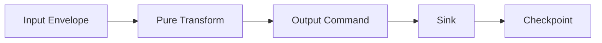
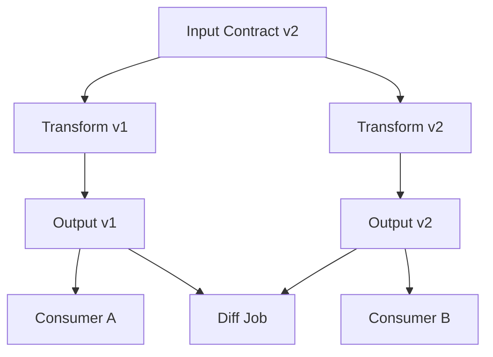
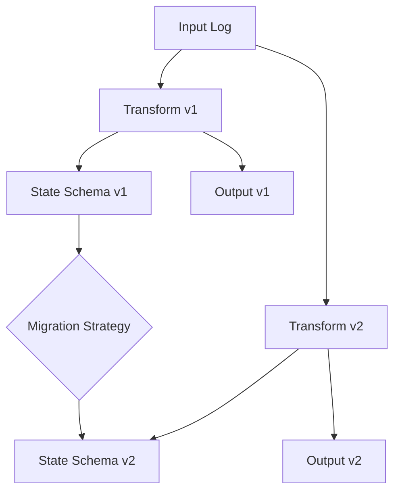
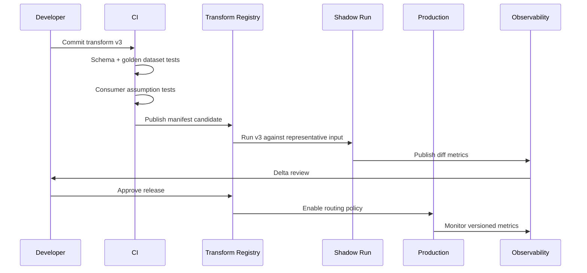

# Part 031 — Versioned Transformations

A transformation is not just code.

In a data pipeline, a transformation is a **published interpretation of facts**.

That interpretation may affect reports, search indexes, alerts, ML features, regulatory evidence, customer-facing state, or downstream decisions. Once a transformation has produced data that other systems depend on, changing it is no longer a local refactor.

A production pipeline must answer a hard question:

```text
Given this output, which exact input contract, transformation logic, code version, configuration, reference data, and runtime assumptions produced it?
```

If the answer is unclear, replay is unsafe. Audit is weak. Backfill is guesswork. Migration is fragile. Debugging becomes archaeology.

This part builds the mental model and implementation pattern for **versioned transformations** in Java data pipelines.

---

## 1. The Core Problem

Consider this pipeline:

```text
CaseUpdated event -> SLA breach detector -> case_sla_projection table
```

Initial logic:

```text
breach = now > dueDate
```

Later, the business clarifies:

```text
breach = businessClock.now() > dueDate
         excluding weekends and national holidays
         unless the case is legally suspended
```

The schema may not change. The Java class name may not change. The topic may not change.

But the meaning changed.

That is a transformation version change.

The dangerous mistake is to treat this as a normal code deployment.

For request/response applications, old responses disappear. For data pipelines, old outputs persist. They may be stored in tables, compacted topics, downstream projections, audit trails, dashboards, and exported files.

So the transformation must be versioned as part of the data lineage.

---

## 2. A Transformation Version Is a Contract

A transformation version defines a contract:

```text
For inputs satisfying contract I, under runtime assumptions A,
produce outputs satisfying contract O, with semantics S.
```

It is not enough to say:

```text
version = git commit hash
```

A git commit identifies code. It does not identify the full semantic context.

A production transformation version should capture:

| Dimension | Question |
|---|---|
| Input contract | Which event/table schema and semantic rules can this transform consume? |
| Output contract | Which output schema and meaning does it produce? |
| Code artifact | Which jar/container/image implements it? |
| Config | Which thresholds, feature flags, reference values, and routing rules were used? |
| Reference data | Which lookup dataset version was used? |
| Time semantics | Which time field drives windows, joins, and validity? |
| Ordering assumptions | Does the logic require per-key ordering? |
| State assumptions | Is there state? What is its version? |
| Idempotency model | Can records be replayed safely? |
| Backfill behavior | Does historical recompute match online processing? |
| Privacy rules | Which fields are allowed to leave the boundary? |
| Owner | Who approves semantic changes? |

A transformation version is therefore closer to a **data product release** than a method version.

---

## 3. Why Code Version Alone Is Not Enough

This Java code looks deterministic:

```java
public RiskScore transform(CaseEvent event) {
    int base = switch (event.severity()) {
        case LOW -> 10;
        case MEDIUM -> 40;
        case HIGH -> 80;
    };

    int multiplier = referenceData.getSectorMultiplier(event.sector());
    return new RiskScore(event.caseId(), base * multiplier);
}
```

But the output depends on more than source code:

1. The input event schema.
2. The meaning of `severity`.
3. The mapping inside `referenceData`.
4. The date when reference data was loaded.
5. The policy for missing sector.
6. The default multiplier.
7. The rounding rule.
8. The output contract.

If reference data changes from:

```text
financial-services = 2
```

to:

```text
financial-services = 3
```

then the same Java code produces a different output.

That is not necessarily wrong. But it must be explicit.

---

## 4. Transformation Identity

A transformation should have a stable identity independent from its version.

Example:

```text
transformationId = enforcement.case-risk-score
version          = 3.2.0
```

The identity answers:

```text
What business capability does this transformation implement?
```

The version answers:

```text
Which released semantics are being used?
```

Do not put deployment environment into the transformation identity.

Bad:

```text
dev-risk-score-transform
prod-risk-score-transform
risk-score-v2-prod
```

Better:

```text
transformationId = enforcement.case-risk-score
version          = 2.0.0
environment      = prod
```

The same transformation version can run in test, staging, production, and backfill contexts.

---

## 5. Semantic Versioning Is Useful but Insufficient

You can use semantic versioning as a human convention:

```text
MAJOR.MINOR.PATCH
```

Suggested meaning for pipeline transformations:

| Version bump | Meaning |
|---|---|
| Patch | Implementation bug fix that does not intentionally change output semantics for valid inputs |
| Minor | Compatible output addition or non-breaking enrichment |
| Major | Breaking semantic, schema, ordering, state, or output contract change |

But do not rely on version numbers alone.

A version number is a label. The system needs a manifest.

---

## 6. Transformation Manifest

A transformation manifest is a machine-readable declaration of how a transformation version behaves.

Example:

```yaml
transformationId: enforcement.case-risk-score
version: 3.2.0
owner: enforcement-data-platform
artifact:
  groupId: com.example.enforcement
  artifactId: case-risk-pipeline
  version: 3.2.0
inputContracts:
  - name: enforcement.case-event
    versionRange: ">=2.1.0 <3.0.0"
outputContracts:
  - name: enforcement.case-risk-score
    version: 3.2.0
processing:
  mode: streaming
  eventTimeField: occurredAt
  ordering: per-case-id
  idempotencyKey: caseId + eventId + transformationVersion
state:
  stateful: true
  stateStoreName: case-risk-state
  stateSchemaVersion: 4
referenceData:
  - name: sector-risk-multiplier
    version: 2026-07-01
qualityRules:
  - no-negative-score
  - known-case-id
privacy:
  classification: internal
  piiOutput: false
rollout:
  supportsShadowRun: true
  supportsBackfill: true
  supportsRollback: true
```

This manifest should live close to code and be published into a registry at release time.

The manifest turns a transformation from an invisible code detail into an explicit operational unit.

---

## 7. Java Representation

A minimal Java model:

```java
public record TransformationId(String value) {
    public TransformationId {
        if (value == null || value.isBlank()) {
            throw new IllegalArgumentException("transformation id is required");
        }
    }
}

public record TransformationVersion(int major, int minor, int patch) {
    @Override
    public String toString() {
        return major + "." + minor + "." + patch;
    }
}

public record ContractRef(String name, String version) {}

public record ReferenceDataRef(String name, String version) {}

public record TransformationManifest(
        TransformationId id,
        TransformationVersion version,
        List<ContractRef> inputContracts,
        List<ContractRef> outputContracts,
        List<ReferenceDataRef> referenceData,
        String eventTimeField,
        String orderingAssumption,
        boolean stateful,
        Optional<String> stateSchemaVersion,
        boolean supportsBackfill,
        boolean supportsShadowRun
) {}
```

The transformation should expose its manifest:

```java
public interface VersionedTransform<I, O> {
    TransformationManifest manifest();
    TransformResult<O> apply(TransformContext context, I input) throws TransformException;
}
```

This looks bureaucratic only until the first incident where the team cannot explain why last month's numbers changed.

---

## 8. Transform Context

The transformation should not silently read global state.

Bad:

```java
public Output transform(Input input) {
    var threshold = System.getenv("THRESHOLD");
    var now = Instant.now();
    var holiday = holidayClient.isHoliday(LocalDate.now());
    return compute(input, threshold, now, holiday);
}
```

This is hostile to replay.

Better:

```java
public record TransformContext(
        Instant processingTime,
        ReferenceDataSnapshot referenceData,
        TransformationManifest manifest,
        ProcessingMode mode,
        TraceContext traceContext
) {}
```

Then:

```java
public Output transform(TransformContext context, Input input) {
    var threshold = context.referenceData().getInt("risk-threshold");
    return compute(input, threshold, context.processingTime());
}
```

For deterministic backfills, `processingTime` may be fixed or derived from the replay batch window.

For streaming, it may be actual processing time.

The key point: the behavior is explicit.

---

## 9. Pure Transform vs Effectful Transform

Separate transformation from side effects.



The transform should decide:

```text
Given this input and context, what should be written?
```

The sink should decide:

```text
How do we write it safely?
```

This separation allows:

- deterministic tests
- golden datasets
- replay comparison
- dry-run execution
- shadow output
- idempotent sink logic
- easier migration

A versioned transformation should not directly update PostgreSQL, publish Kafka records, call APIs, or mutate external systems unless the effect is explicitly modeled.

---

## 10. Output Command Pattern

Instead of returning raw output rows, return output commands.

```java
public sealed interface OutputCommand permits UpsertProjection, AppendFact, DeleteProjection, QuarantineRecord {
    String sinkName();
    String idempotencyKey();
}

public record UpsertProjection(
        String sinkName,
        String idempotencyKey,
        String key,
        Map<String, Object> values,
        TransformationVersion transformationVersion
) implements OutputCommand {}

public record AppendFact(
        String sinkName,
        String idempotencyKey,
        String factId,
        Map<String, Object> values,
        TransformationVersion transformationVersion
) implements OutputCommand {}

public record QuarantineRecord(
        String sinkName,
        String idempotencyKey,
        String reasonCode,
        Map<String, Object> diagnostic
) implements OutputCommand {}
```

This makes the side effect boundary visible.

It also lets the sink enforce idempotency with a version-aware key:

```text
idempotencyKey = sourceEventId + transformationId + transformationVersion + sinkName
```

Sometimes version should be part of idempotency. Sometimes it should not.

The decision depends on sink semantics.

---

## 11. When Version Belongs in the Output Key

For append-only facts:

```text
risk_score_fact(event_id, transformation_version, score)
```

Version belongs in the identity because multiple versions can coexist.

For a latest-state projection:

```text
case_current_risk(case_id, score, produced_by_version)
```

Version usually does not belong in the primary key because the projection represents current best-known state.

For comparative shadow outputs:

```text
case_risk_shadow(case_id, transformation_version, score)
```

Version belongs in the key because outputs are intentionally side by side.

Rule:

```text
If consumers need to compare versions, include version in identity.
If consumers need one authoritative value, include version as metadata.
```

---

## 12. Versioned Output Topics and Tables

There are three common strategies.

### 12.1 Same Topic/Table, Version in Metadata

Example:

```text
topic: enforcement.case-risk-score
headers:
  transformation-id: enforcement.case-risk-score
  transformation-version: 3.2.0
```

Good when:

- schema remains compatible
- consumers can tolerate gradual migration
- old and new semantics should not run side by side for long

Risk:

- consumers may silently mix semantic versions
- replay may overwrite old outputs
- debugging requires metadata discipline

### 12.2 Versioned Topic/Table

Example:

```text
topic: enforcement.case-risk-score.v3
```

Good when:

- major semantic change
- downstream consumers must opt in
- parallel run is required
- rollback must be simple

Risk:

- topic/table sprawl
- duplicate storage
- migration coordination overhead

### 12.3 Versioned Column/Partition

Example:

```sql
CREATE TABLE case_risk_score (
    case_id text NOT NULL,
    transformation_version text NOT NULL,
    score integer NOT NULL,
    produced_at timestamptz NOT NULL,
    PRIMARY KEY (case_id, transformation_version)
);
```

Good when:

- analytical comparison matters
- backfills are common
- output is consumed by batch/lakehouse workflows

Risk:

- consumers must filter intentionally
- table can grow quickly

---

## 13. The Compatibility Matrix

Every transformation change should be classified.

| Change | Patch | Minor | Major |
|---|---:|---:|---:|
| Fix null pointer without output change | yes | no | no |
| Add optional output field | no | yes | no |
| Add new output event type | no | maybe | maybe |
| Rename output field | no | no | yes |
| Change meaning of existing field | no | no | yes |
| Change event-time field | no | no | yes |
| Change partition key | no | no | yes |
| Change dedupe key | no | no | yes |
| Change state schema | maybe | maybe | often |
| Change reference data version | maybe | maybe | maybe |
| Change late-event handling | no | no | yes |
| Change error policy from quarantine to drop | no | no | yes |

A major semantic change does not always require a new schema.

That is why relying only on schema compatibility is insufficient.

---

## 14. Versioned Transform Pipeline Shape



During migration, run old and new versions together when the change is material.

The diff job compares:

- record count
- key coverage
- field-level changes
- aggregate totals
- outlier deltas
- latency
- DLQ/quarantine rate
- cost

Do not promote a new transformation only because tests pass.

Promote it because live or representative data proves the delta is understood.

---

## 15. Dual-Running Strategy

Dual-running means executing old and new versions over the same input.

There are four patterns.

### 15.1 Shadow Only

New version runs but output is not consumed by production consumers.

```text
input -> v1 -> production output
      -> v2 -> shadow output
```

Use when:

- risk is high
- output can be compared offline
- consumers are not ready

### 15.2 Parallel Publish

Old and new output are both published.

```text
input -> v1 -> topic.v1
input -> v2 -> topic.v2
```

Use when:

- consumers migrate independently
- breaking semantic change exists

### 15.3 Inline Metadata Version

Only one logical output stream/table exists, but metadata carries version.

```text
input -> v2 -> topic with transformation-version header
```

Use when:

- change is compatible
- consumers should not choose version

### 15.4 Canary by Key Range or Tenant

New version processes only a subset.

```text
tenant A -> v2
others   -> v1
```

Use when:

- tenants are isolated
- rollback can be scoped
- output can be validated per tenant

Avoid canary if output is globally aggregated and partial semantics would corrupt totals.

---

## 16. Versioned Reference Data

Reference data is often the hidden cause of irreproducibility.

Examples:

- country code mapping
- product category hierarchy
- legal holiday calendar
- officer assignment table
- exchange rate table
- risk multiplier table
- regulatory rule catalog

A transform should not say:

```text
read latest reference data
```

It should say:

```text
read reference dataset X at version Y
```

For online streaming, `Y` may update periodically.

For backfill, `Y` must be explicit.

Pattern:

```java
public interface ReferenceDataProvider {
    ReferenceDataSnapshot load(ReferenceDataRef ref);
}

public record ReferenceDataSnapshot(
        String name,
        String version,
        Instant loadedAt,
        Map<String, String> values
) {}
```

The output should include reference data version when it affects interpretation.

```java
public record RiskScoreProduced(
        String caseId,
        int score,
        String transformationVersion,
        String referenceDataName,
        String referenceDataVersion,
        Instant producedAt
) {}
```

This is not overengineering. It is how you explain historical numbers.

---

## 17. Determinism Contract

A transformation can be deterministic or intentionally non-deterministic.

Examples of non-determinism:

- `Instant.now()` inside logic
- random sampling
- external API lookup
- mutable reference data
- non-stable ordering of unordered collections
- race between parallel updates
- floating point instability
- time-zone defaults from host OS

A deterministic transformation satisfies:

```text
same input + same transform version + same config + same reference data + same runtime assumptions = same output
```

For audit-grade pipelines, this should be the default.

If non-determinism is required, make it explicit in the manifest.

```yaml
determinism:
  deterministic: false
  reason: "uses live fraud scoring API"
  mitigation: "stores external decision response in audit table"
```

A non-deterministic transform can still be acceptable if it records enough evidence.

---

## 18. Transformation State Version

Stateful transformations need separate state versioning.

Example state:

```java
public record CaseEscalationState(
        String caseId,
        String currentStatus,
        int warningCount,
        Instant lastWarningAt
) {}
```

Later you add:

```java
public record CaseEscalationStateV2(
        String caseId,
        String currentStatus,
        int warningCount,
        Instant lastWarningAt,
        boolean legallySuspended
) {}
```

This is not only a code change.

The running pipeline has existing state that must be migrated, rebuilt, or discarded.

State migration options:

| Strategy | Use when | Risk |
|---|---|---|
| Rebuild from input log | Input history is complete and replayable | Cost and time |
| In-place state migration | State is large but schema change is simple | Migration bugs |
| Side-by-side new state | New version can warm up independently | Duplicate compute |
| Reset state | State can be safely forgotten | Correctness gap |
| Savepoint migration | Engine supports managed state migration | Operational complexity |

For Kafka Streams, Flink, Beam, or custom state stores, do not treat state as incidental.

State is part of the transformation contract.

---

## 19. Stateful Versioning Diagram



The dangerous path is to deploy `Transform v2` while it silently reads `State Schema v1` as if nothing changed.

If the state schema changes, the rollout plan must say:

1. Can old state be read?
2. Can it be upgraded lazily?
3. Can v1 read v2 state after rollback?
4. Is rollback still possible after state migration?
5. Do we need a savepoint or export before migration?
6. Do we need parallel state stores?

A rollback that cannot read migrated state is not a rollback. It is a second incident.

---

## 20. Backfill Compatibility

A transformation version should declare whether it supports backfill.

Backfill is not merely running old data through new code.

Questions:

1. Are old input schemas still readable?
2. Are reference data versions available historically?
3. Is output idempotency safe for old records?
4. Should output replace existing values or produce new versioned facts?
5. Are late/correction rules different historically?
6. Are deleted entities handled correctly?
7. Can downstream consumers tolerate rewritten history?

A transform may be valid for streaming but invalid for historical backfill.

Example:

```yaml
backfill:
  supported: true
  earliestInputTime: "2024-01-01T00:00:00Z"
  requiresReferenceData:
    - sector-risk-multiplier
    - legal-calendar
  outputMode: versioned-append
  overwriteAllowed: false
```

This turns backfill from a heroic script into an explicit capability.

---

## 21. Migration Types

There are several migration types.

### 21.1 Code-Only Migration

No semantic or schema change.

Example:

- refactor
- performance improvement
- internal library upgrade

Required evidence:

- golden dataset equality
- no contract change
- no output delta except accepted numeric tolerance

### 21.2 Output-Compatible Migration

Schema and semantics remain compatible, but output may add optional fields.

Required evidence:

- schema compatibility check
- consumer assumption check
- representative data test

### 21.3 Semantic Migration

Existing field meaning changes.

Example:

```text
riskScore now includes legal suspension adjustment
```

Required evidence:

- version bump
- downstream review
- dual-run diff
- documentation
- backfill decision

### 21.4 State Migration

State model changes.

Required evidence:

- state migration plan
- rollback plan
- savepoint/export
- replay test

### 21.5 Historical Correction Migration

New version corrects historical output.

Required evidence:

- correction event model
- affected time range
- downstream reconciliation
- audit note

---

## 22. Transformation Registry

A pipeline platform should maintain a registry.

Minimal registry table:

```sql
CREATE TABLE transformation_release (
    transformation_id text NOT NULL,
    version text NOT NULL,
    artifact_ref text NOT NULL,
    manifest_json jsonb NOT NULL,
    released_at timestamptz NOT NULL,
    released_by text NOT NULL,
    status text NOT NULL,
    PRIMARY KEY (transformation_id, version)
);
```

Runtime execution table:

```sql
CREATE TABLE transformation_run (
    run_id text PRIMARY KEY,
    transformation_id text NOT NULL,
    version text NOT NULL,
    mode text NOT NULL,
    input_range jsonb NOT NULL,
    output_target text NOT NULL,
    started_at timestamptz NOT NULL,
    finished_at timestamptz,
    status text NOT NULL,
    metrics_json jsonb
);
```

This gives you answers to operational questions:

- Which version is currently producing this table?
- Which version produced last week's output?
- Which jobs still use v1?
- Which backfills used reference data version X?
- Which consumers are blocked from v3?

---

## 23. Runtime Stamping

Every output should carry transformation metadata.

For Kafka:

```text
headers:
  transformation-id: enforcement.case-risk-score
  transformation-version: 3.2.0
  input-contract: enforcement.case-event:2.4.0
  reference-data: sector-risk-multiplier:2026-07-01
  run-id: stream-prod-20260704
```

For relational output:

```sql
ALTER TABLE case_risk_score
ADD COLUMN transformation_id text NOT NULL,
ADD COLUMN transformation_version text NOT NULL,
ADD COLUMN produced_at timestamptz NOT NULL,
ADD COLUMN pipeline_run_id text NOT NULL;
```

For lakehouse tables:

```text
partition or metadata columns:
  transformation_id
  transformation_version
  pipeline_run_id
  produced_at
```

Without runtime stamping, lineage depends on external memory.

External memory fails.

---

## 24. Java Versioned Transform Registry

Example runtime registry:

```java
public final class TransformRegistry {
    private final Map<String, VersionedTransform<?, ?>> transforms = new HashMap<>();

    public <I, O> void register(VersionedTransform<I, O> transform) {
        var key = key(transform.manifest().id(), transform.manifest().version());
        if (transforms.putIfAbsent(key, transform) != null) {
            throw new IllegalStateException("Duplicate transform: " + key);
        }
    }

    @SuppressWarnings("unchecked")
    public <I, O> VersionedTransform<I, O> get(
            TransformationId id,
            TransformationVersion version
    ) {
        var transform = transforms.get(key(id, version));
        if (transform == null) {
            throw new IllegalArgumentException("Unknown transform: " + id + ":" + version);
        }
        return (VersionedTransform<I, O>) transform;
    }

    private static String key(TransformationId id, TransformationVersion version) {
        return id.value() + ":" + version;
    }
}
```

Use this in tests, local runners, and production bootstrapping.

Avoid selecting transform versions through scattered `if` statements.

---

## 25. Version Routing

A transformation router selects which version processes which input.

```java
public interface TransformVersionRouter<I> {
    TransformationVersion selectVersion(I input, TransformRoutingContext context);
}
```

Examples:

```java
public final class TenantCanaryRouter implements TransformVersionRouter<CaseEvent> {
    @Override
    public TransformationVersion selectVersion(CaseEvent input, TransformRoutingContext context) {
        if (context.canaryTenants().contains(input.tenantId())) {
            return new TransformationVersion(3, 0, 0);
        }
        return new TransformationVersion(2, 4, 1);
    }
}
```

This routing decision must be observable.

Output metadata should record:

```text
selected-transform-version
routing-policy-id
routing-reason
```

Otherwise canary behavior becomes invisible.

---

## 26. Golden Dataset for Transformation Versions

For every released transformation version, maintain a golden dataset.

A golden dataset contains:

1. input records
2. reference data snapshot
3. expected output records
4. expected rejected/quarantined records
5. manifest version
6. comparison rules

Example layout:

```text
contracts/
  enforcement.case-risk-score/
    v3.2.0/
      manifest.yaml
      input.jsonl
      reference-data/
        sector-risk-multiplier.yaml
      expected-output.jsonl
      expected-quarantine.jsonl
      compare.yaml
```

Golden datasets are not only tests.

They are executable documentation of semantics.

---

## 27. Diff Testing Between Versions

When moving from v1 to v2, test both against the same data.

```java
public record TransformDiff(
        String key,
        Map<String, Object> oldOutput,
        Map<String, Object> newOutput,
        DiffClassification classification
) {}
```

Diff classes:

| Classification | Meaning |
|---|---|
| identical | no output difference |
| expected_delta | difference matches migration notes |
| unexpected_delta | difference not explained |
| missing_old | new output exists, old missing |
| missing_new | old output exists, new missing |
| invalid_new | new output violates contract |

Promotion rule:

```text
No unexplained delta may reach production.
```

Not every delta is bad. Unexplained delta is bad.

---

## 28. Tolerances

Some outputs require tolerance.

Examples:

- floating point aggregation
- approximate distinct count
- ML feature calculation
- currency conversion with different rounding

Declare tolerance explicitly:

```yaml
comparison:
  fields:
    riskScore:
      mode: exact
    probability:
      mode: absoluteTolerance
      tolerance: 0.0001
    generatedAt:
      mode: ignore
```

Never hide nondeterminism behind broad tolerances.

A tolerance is a contract, not a broom.

---

## 29. Replay and Version Pinning

When replaying historical data, decide whether to pin old or new version.

### Pin Old Version

Use when reproducing historical output exactly.

```text
replay input range 2026-01-01..2026-01-31 with transform v2.1.0
```

### Use New Version

Use when correcting or recomputing history under improved semantics.

```text
backfill input range 2026-01-01..2026-01-31 with transform v3.0.0
```

These are different operations.

Do not call both “replay.”

A precise vocabulary:

| Operation | Meaning |
|---|---|
| Replay | Re-run with same semantics to reproduce or repair missing output |
| Backfill | Run existing semantics over data that was not processed before |
| Recompute | Produce output again, possibly replacing previous output |
| Restatement | Intentionally change historical output under new semantics |
| Correction | Publish explicit delta/fix for previously wrong output |

---

## 30. Rollout Sequence

A safe rollout sequence:



This is slower than pushing a jar.

It is faster than explaining corrupted regulatory reports.

---

## 31. Versioned Metrics

Every important metric should include transformation version.

Metrics:

```text
pipeline.records.in{transform="case-risk", version="3.2.0"}
pipeline.records.out{transform="case-risk", version="3.2.0"}
pipeline.records.quarantined{transform="case-risk", version="3.2.0", reason="missing-sector"}
pipeline.output.delta{old="3.1.0", new="3.2.0", field="riskScore"}
pipeline.lag.seconds{transform="case-risk", version="3.2.0"}
```

Dashboards should compare versions during rollout.

Alerts should avoid mixing versions unless the metric is intentionally global.

---

## 32. Versioned Logs and Traces

Log records should include:

- transformation id
- transformation version
- input contract version
- output contract version
- pipeline run id
- source position
- event id
- idempotency key
- reference data version

Example:

```json
{
  "level": "INFO",
  "message": "transformed case event",
  "transformationId": "enforcement.case-risk-score",
  "transformationVersion": "3.2.0",
  "inputContract": "enforcement.case-event:2.4.0",
  "outputContract": "enforcement.case-risk-score:3.2.0",
  "referenceData": "sector-risk-multiplier:2026-07-01",
  "caseId": "CASE-123",
  "eventId": "evt-789",
  "sourceOffset": "case-events-3@55102",
  "pipelineRunId": "prod-stream-20260704"
}
```

This makes incident reconstruction possible.

---

## 33. Sunset Policy

Versions must retire.

A version without a sunset policy becomes permanent platform debt.

Sunset checklist:

1. Which consumers still read this version?
2. Which dashboards depend on it?
3. Which backfill jobs require it?
4. Which audit obligations require reproducibility?
5. Is the artifact still buildable?
6. Is reference data still available?
7. Are security patches required for old runtime?
8. Can the version be archived instead of executable?

Possible states:

| State | Meaning |
|---|---|
| candidate | built but not approved |
| active | allowed for production routing |
| shadow | allowed only for comparison |
| deprecated | consumers should migrate away |
| frozen | no new production use, kept for replay/audit |
| retired | no execution allowed |
| archived | metadata kept, artifact may be cold storage |

A frozen version may still be required for audit replay.

Retired does not mean forgotten.

---

## 34. Regulatory and Audit Implication

For regulated systems, versioned transformations are evidence infrastructure.

Suppose a case was escalated automatically.

An auditor may ask:

```text
Why was this case marked high-risk on 2026-03-18?
```

A defensible answer needs:

- input event history
- transform version
- transformation manifest
- rule description
- reference data version
- output record
- decision trace
- operator overrides
- replay result or proof of reproducibility

Without this, the system can only say:

```text
The code probably did it.
```

That is not good enough.

---

## 35. Common Anti-Patterns

### 35.1 Silent Semantic Change

Changing field meaning without version bump.

This breaks trust faster than schema breakage because consumers may not notice.

### 35.2 Latest Reference Data Everywhere

Using whatever lookup table exists at runtime.

This makes historical replay unstable.

### 35.3 One Output Table for All Experiments

Writing experimental output into production tables without version metadata.

This contaminates consumer state.

### 35.4 No Backfill Contract

Assuming every streaming transform can process historical data.

Often false.

### 35.5 State Migration by Hope

Deploying new stateful code without explicit state compatibility.

### 35.6 Version Number Without Manifest

`v2` means nothing unless the system knows what changed.

### 35.7 Rollback Without Data Plan

Rolling back code while leaving v2 outputs and v2 state behind.

---

## 36. Production Checklist

Before releasing a new transformation version, answer:

1. What changed semantically?
2. Is the input contract range explicit?
3. Is the output contract version explicit?
4. Does the manifest include reference data versions?
5. Is the transform deterministic?
6. Are golden dataset tests updated?
7. Are consumer assumptions tested?
8. Is state schema changed?
9. Is rollback possible after deployment?
10. Is shadow run needed?
11. Is dual-running needed?
12. Is output versioned as metadata, identity, or separate target?
13. Is backfill supported?
14. Is historical restatement required?
15. Are metrics/logs/traces version-stamped?
16. Is there a sunset plan for the old version?

A team that cannot answer these is not ready to deploy the transformation.

---

## 37. Minimal Implementation Blueprint

A practical Java project structure:

```text
case-risk-pipeline/
  src/main/java/
    com/example/pipeline/transform/
      CaseRiskTransformV3.java
      CaseRiskManifest.java
      TransformRegistry.java
    com/example/pipeline/model/
      CaseEvent.java
      RiskScoreOutput.java
    com/example/pipeline/reference/
      ReferenceDataProvider.java
  src/test/resources/contracts/
    enforcement.case-risk-score/
      v3.2.0/
        manifest.yaml
        input.jsonl
        expected-output.jsonl
        expected-quarantine.jsonl
        reference-data/
          sector-risk-multiplier.yaml
```

CI stages:

```text
compile
unit test
golden dataset test
schema compatibility test
consumer assumption test
diff test against previous version
manifest validation
container build
publish candidate manifest
```

Production stages:

```text
shadow run
diff review
approval
canary routing
full routing
old version deprecation
sunset
```

---

## 38. Mental Model Summary

A versioned transformation is a controlled semantic release.

Think of it this way:

```text
Schema version says: can the data be read?
Transformation version says: what does the data mean after processing?
Run version says: when and under what context was it produced?
State version says: what memory did the transform rely on?
Reference data version says: which external facts shaped the output?
```

Production-grade pipelines need all of them.

The top engineering move is not adding version fields everywhere randomly.

The top engineering move is deciding where version belongs:

- metadata
- identity
- routing
- state
- output target
- audit trail
- backfill plan

That decision determines whether the pipeline can evolve safely.

---

## 39. References

- Apache Beam Programming Guide — pipelines, `PCollection`, and `PTransform`: https://beam.apache.org/documentation/programming-guide/
- Confluent Schema Registry — schema evolution and compatibility types: https://docs.confluent.io/platform/current/schema-registry/fundamentals/schema-evolution.html
- Apache Flink documentation — state, checkpoints, savepoints, and event time concepts: https://nightlies.apache.org/flink/flink-docs-stable/
- Apache Kafka documentation — event streaming, topics, offsets, producer/consumer semantics: https://kafka.apache.org/documentation/
