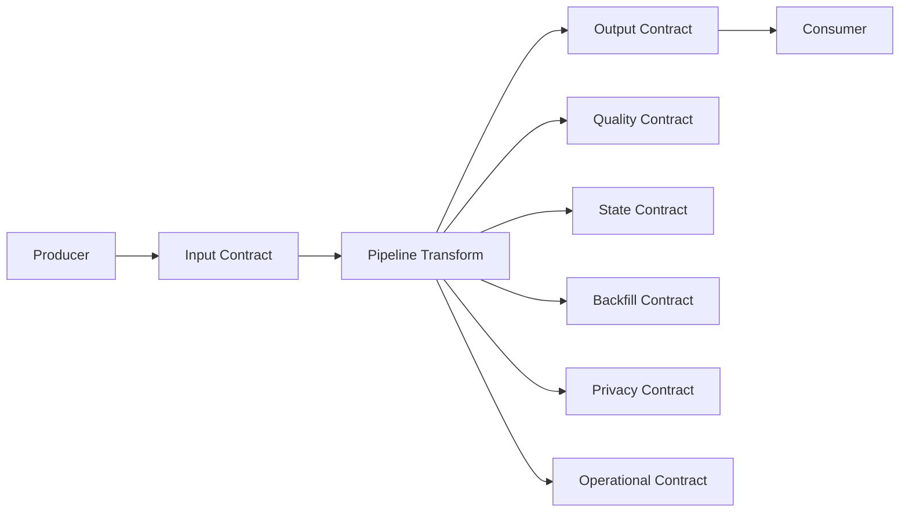
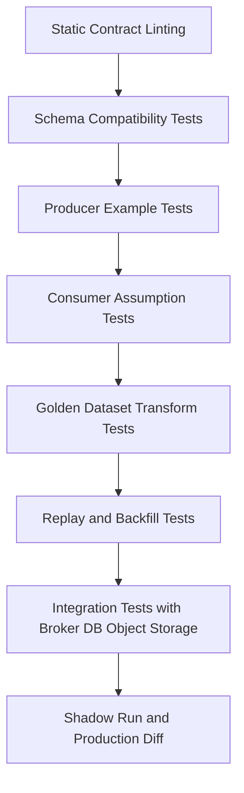
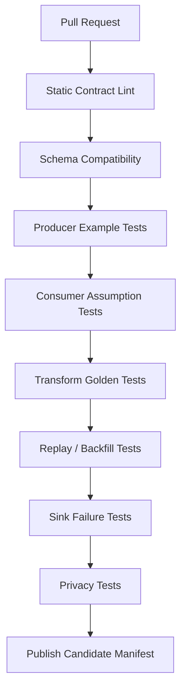

# Part 032 — Contract Testing for Pipelines

A pipeline contract is useless if it is only written down.

It must be executable.

Contract testing answers:

```text
Can this producer still publish what consumers expect?
Can this consumer still understand what producers publish?
Can this transformation still preserve its promised semantics?
Can this pipeline still replay, backfill, reject, quarantine, and publish safely?
```

This part focuses on **contract testing for Java data pipelines**.

Not generic unit testing. Not generic API testing. Not generic data quality dashboards.

The goal is to test the boundary promises that keep distributed data systems from silently corrupting downstream state.

---

## 1. Why Pipeline Contract Testing Is Different

A request/response service usually fails quickly when a contract breaks.

A data pipeline may keep running while producing wrong data for days.

Examples:

- Producer removes a field but consumers silently default it.
- CDC source changes a column type and downstream parser accepts it as string.
- Transform changes risk score meaning without schema change.
- Late-event policy changes and historical aggregates drift.
- Backfill uses a different reference data snapshot than streaming.
- Sink dedupe key changes and replay creates duplicates.
- DLQ classification changes and poison records block the main lane.

The pipeline did not crash.

That is the problem.

Contract tests must catch semantic breakage before runtime.

---

## 2. The Contract Testing Surface

A production pipeline has multiple contract surfaces:



Each surface needs different tests.

| Surface | What can break |
|---|---|
| Producer contract | Field removal, incompatible type, changed meaning, invalid examples |
| Consumer assumption | Consumer depends on undocumented fields or values |
| Transform contract | Wrong mapping, changed semantics, non-determinism |
| Quality contract | Invalid data accepted or valid data rejected |
| State contract | Migration failure, incompatible state, reset behavior |
| Backfill contract | Historical data unreadable, duplicate output, wrong reference data |
| Privacy contract | PII leakage, masking regression, retention violation |
| Operational contract | Retry, DLQ, checkpoint, idempotency behavior broken |

A serious pipeline test suite covers more than schema compatibility.

---

## 3. Schema Compatibility Is Necessary but Not Sufficient

Schema compatibility checks answer:

```text
Can old/new readers and writers parse each other?
```

They do not answer:

```text
Does the value still mean the same thing?
```

Example compatible but semantically breaking change:

```json
{
  "field": "riskScore",
  "type": "int",
  "description": "0-100 score"
}
```

Later:

```json
{
  "field": "riskScore",
  "type": "int",
  "description": "0-1000 score"
}
```

Schema may still be compatible. Consumers may still parse it. But dashboards, thresholds, alerts, and reports may be wrong.

So contract testing has layers:

```text
parse compatibility
+ semantic examples
+ consumer assumptions
+ quality rules
+ transformation golden outputs
+ replay/backfill behavior
+ operational failure behavior
```

---

## 4. Contract Test Pyramid for Pipelines



The lower layers are cheap and fast.

The upper layers are slower but closer to reality.

Do not skip lower layers because you have integration tests. Integration tests are too late and too expensive to explain every failure.

Do not rely only on lower layers because they cannot detect runtime semantics.

---

## 5. Static Contract Linting

Before compatibility, lint the contract itself.

Rules:

1. Every field has a description.
2. Every nullable field has a reason.
3. Every enum has unknown/future handling policy.
4. Every timestamp declares time semantics.
5. Every identifier declares uniqueness scope.
6. Every sensitive field declares classification.
7. Every output field declares owner.
8. Every breaking change has migration notes.
9. Every transform version has a manifest.
10. Every contract has examples.

Example lint failure:

```text
Field caseStatus is enum but no UNKNOWN value or future-value policy is declared.
```

This is not bureaucracy. It prevents schema files from becoming false confidence.

---

## 6. Schema Compatibility Tests

For Kafka/Avro/Protobuf/JSON Schema pipelines, schema registry compatibility should run in CI before registration.

Test dimensions:

| Test | Purpose |
|---|---|
| new producer vs old consumer | Can existing consumers keep reading? |
| old producer vs new consumer | Can new consumer read historical data? |
| transitive compatibility | Can new version handle all relevant older versions? |
| reserved field rule | Prevent field number/name reuse where applicable |
| default value check | Ensure added fields have safe defaults where required |
| enum evolution check | Ensure unknown value strategy exists |

A Java build can call a schema registry compatibility endpoint, use a local compatibility library, or run a contract test harness against checked-in schema versions.

The important rule:

```text
A schema must not be promoted only because it compiles.
```

---

## 7. Producer Contract Tests

A producer contract test proves that the producer emits valid examples.

It should not require full downstream infrastructure.

Example producer test shape:

```java
class CaseEventProducerContractTest {

    @Test
    void producedCaseEscalatedEventMustMatchContract() {
        CaseEscalatedEvent event = new CaseEscalatedEvent(
                "CASE-123",
                "evt-001",
                Instant.parse("2026-07-04T10:00:00Z"),
                "HIGH",
                "OFFICER-9"
        );

        byte[] encoded = caseEventSerializer.serialize(event);
        ContractValidationResult result = contractValidator.validate(
                "enforcement.case-event",
                "2.4.0",
                encoded
        );

        assertTrue(result.valid(), result::message);
    }
}
```

This test should run in the producer repository.

It proves:

- serializer works
- schema is valid
- required fields are present
- example data satisfies semantic constraints
- headers/envelope metadata are included

Producer contract tests should include negative examples too.

---

## 8. Producer Example Catalog

Each producer should publish examples.

Example layout:

```text
contracts/
  enforcement.case-event/
    v2.4.0/
      schema.avsc
      examples/
        case-opened.valid.json
        case-escalated.valid.json
        case-closed.valid.json
        case-reopened.valid.json
        missing-case-id.invalid.json
        unknown-status.invalid.json
      semantics.md
```

Examples are not decorative.

They become test fixtures for consumers and transformations.

A contract without examples is under-specified.

---

## 9. Consumer Assumption Tests

Consumer-driven testing is powerful because consumers often depend on assumptions not captured in the provider schema.

For data pipelines, consumer assumptions may include:

- field always present
- enum subset only
- timestamp monotonic per key
- field range
- no duplicate event ID
- no out-of-order status transition
- event type emitted after another event type
- ID format
- partition key stability
- no PII in output

Example assumption file:

```yaml
consumer: enforcement.sla-breach-detector
consumes: enforcement.case-event
version: 2.4.0
assumptions:
  - id: case-id-present
    rule: "caseId must be non-empty"
  - id: occurred-at-required
    rule: "occurredAt must be present and parseable as instant"
  - id: supported-statuses
    rule: "status must be one of OPEN, ASSIGNED, ESCALATED, SUSPENDED, CLOSED"
  - id: per-case-ordering
    rule: "events for same case must be ordered by source transaction position"
```

The producer pipeline should run these consumer assumptions before changing the contract.

This is similar in spirit to consumer-driven contract testing, but adapted to data/event semantics.

---

## 10. Consumer Test Harness

A consumer test harness runs producer examples against consumer assumptions.

```java
public interface ConsumerAssumption<T> {
    String id();
    AssumptionResult check(T event);
}

public record AssumptionResult(boolean passed, String message) {
    public static AssumptionResult pass() {
        return new AssumptionResult(true, "ok");
    }

    public static AssumptionResult fail(String message) {
        return new AssumptionResult(false, message);
    }
}
```

Example:

```java
public final class CaseIdPresentAssumption implements ConsumerAssumption<CaseEvent> {
    @Override
    public String id() {
        return "case-id-present";
    }

    @Override
    public AssumptionResult check(CaseEvent event) {
        if (event.caseId() == null || event.caseId().isBlank()) {
            return AssumptionResult.fail("caseId is required");
        }
        return AssumptionResult.pass();
    }
}
```

Run it against all valid producer examples.

If the producer adds a new event shape that violates an assumption, the break is visible before release.

---

## 11. Golden Dataset Transform Tests

A golden dataset test proves that a transformation version produces expected output for known input.

Input:

```json
{"eventId":"evt-1","caseId":"CASE-1","status":"OPEN","occurredAt":"2026-07-04T09:00:00Z"}
{"eventId":"evt-2","caseId":"CASE-1","status":"ESCALATED","occurredAt":"2026-07-04T10:00:00Z"}
```

Expected output:

```json
{"caseId":"CASE-1","riskBand":"HIGH","reason":"ESCALATED_CASE"}
```

Test:

```java
@Test
void caseRiskTransformV3MatchesGoldenDataset() throws Exception {
    GoldenDataset dataset = GoldenDataset.load("enforcement.case-risk-score/v3.2.0");

    VersionedTransform<CaseEvent, OutputCommand> transform = registry.get(
            new TransformationId("enforcement.case-risk-score"),
            new TransformationVersion(3, 2, 0)
    );

    List<OutputCommand> actual = new ArrayList<>();
    for (CaseEvent input : dataset.inputs(CaseEvent.class)) {
        actual.add(transform.apply(dataset.context(), input).command());
    }

    GoldenComparator.assertMatches(dataset.expectedOutputs(), actual, dataset.comparisonRules());
}
```

This is the core test for transformation semantics.

---

## 12. Golden Dataset Design Rules

A good golden dataset is small but sharp.

It should include:

1. happy path
2. missing optional field
3. missing required field
4. unknown enum value
5. late event
6. duplicate event
7. out-of-order event
8. deleted entity
9. correction event
10. boundary values
11. reference data miss
12. PII field
13. multi-tenant data
14. backfill mode example
15. replay example

Avoid giant golden datasets that nobody can understand.

Use large datasets for regression and shadow diff. Use small golden datasets for semantic clarity.

---

## 13. Negative Contract Tests

A contract test suite must include invalid data.

Example:

```text
missing required caseId -> reject
unknown status with strict policy -> quarantine
future occurredAt beyond tolerance -> quarantine
negative penalty amount -> reject
PII in public output -> fail build
duplicate eventId -> dedupe, not duplicate output
```

Negative tests prove the pipeline fails correctly.

For production systems, correct rejection is as important as correct acceptance.

---

## 14. Quality Contract Tests

Quality rules should be executable in CI against examples and in runtime against actual data.

Example Java shape:

```java
public interface DataQualityRule<T> {
    String id();
    Severity severity();
    QualityCheckResult check(T record);
}

public enum Severity {
    BLOCK,
    QUARANTINE,
    WARN
}
```

Test:

```java
@Test
void closedCaseMustHaveClosedAt() {
    CaseProjection projection = new CaseProjection(
            "CASE-1",
            "CLOSED",
            Instant.parse("2026-07-04T10:00:00Z"),
            null
    );

    QualityCheckResult result = new ClosedCaseMustHaveClosedAt().check(projection);

    assertFalse(result.passed());
    assertEquals(Severity.QUARANTINE, result.severity());
}
```

The rule is not just a test. It should also be used in runtime validation.

That keeps CI and production behavior aligned.

---

## 15. Temporal Contract Tests

Time breaks pipelines often.

Temporal contract tests should cover:

- event time vs processing time
- watermark behavior
- allowed lateness
- late record policy
- business effective time
- daylight saving boundary
- timezone conversion
- ordering per key
- historical correction
- bitemporal validity

Example test cases:

| Case | Expected behavior |
|---|---|
| event arrives 5 minutes late | accepted into window |
| event arrives 5 days late | side output/quarantine/correction depending policy |
| correction event effective last month | restate affected projection |
| source commit time after event time | preserve both timestamps |
| same key events out of order | reorder if supported, otherwise quarantine/compensate |

A pipeline that cannot explain time semantics cannot be trusted for reporting or alerting.

---

## 16. Replay Contract Tests

A replay test proves that reprocessing input does not corrupt output.

Test properties:

1. Replaying same records does not duplicate output.
2. Replaying from checkpoint produces same final state.
3. Replaying with same transform version produces equivalent output.
4. Replaying with same reference data version is deterministic.
5. DLQ/quarantine behavior is stable.

Pseudo-test:

```java
@Test
void replayIsIdempotent() {
    PipelineHarness harness = PipelineHarness.inMemory();
    List<Envelope<CaseEvent>> input = Fixtures.caseLifecycle();

    harness.run(input);
    Snapshot first = harness.outputSnapshot();

    harness.run(input);
    Snapshot second = harness.outputSnapshot();

    assertEquals(first, second);
}
```

This test catches weak sink idempotency and bad checkpoint assumptions.

---

## 17. Backfill Contract Tests

A backfill test proves historical processing is safe.

It should check:

- old schema versions can be decoded
- historical reference data exists
- output mode is correct
- overwrite policy is explicit
- duplicates are not produced
- existing production data is not silently overwritten
- downstream consumers are not surprised

Example backfill manifest:

```yaml
backfillTest:
  inputRange:
    from: "2025-01-01T00:00:00Z"
    to: "2025-01-31T23:59:59Z"
  transformVersion: "3.2.0"
  referenceData:
    legal-calendar: "2025"
    sector-risk-multiplier: "2025-01"
  outputMode: versioned-append
  overwriteAllowed: false
```

Backfill without contract testing is a production incident waiting for a calendar slot.

---

## 18. CDC Contract Tests

CDC pipelines need special tests because source events are not business events by default.

Test cases:

1. insert event
2. update event
3. delete event
4. tombstone event
5. snapshot row
6. schema change
7. transaction with multiple row changes
8. out-of-order delivery simulation
9. duplicate source offset
10. connector restart

For Debezium-style envelopes, validate:

- operation code handling
- `before`/`after` semantics
- source position extraction
- transaction metadata if used
- delete/tombstone policy
- snapshot flag handling
- schema history compatibility

A CDC consumer that only tests insert/update will fail when deletes arrive.

---

## 19. Outbox Contract Tests

Outbox contract tests prove that application transactions publish the intended event.

Test shape:

```java
@Test
void closingCaseWritesOutboxEventInSameTransaction() {
    caseService.closeCase("CASE-123", "completed investigation");

    CaseEntity caseEntity = caseRepository.findById("CASE-123").orElseThrow();
    OutboxEvent event = outboxRepository.findByAggregateId("CASE-123").single();

    assertEquals("CLOSED", caseEntity.status());
    assertEquals("CaseClosed", event.eventType());
    assertEquals("CASE-123", event.aggregateId());
    assertNotNull(event.eventId());
    assertNotNull(event.occurredAt());
}
```

Important assertions:

- business state and outbox event commit atomically
- event ID is stable
- aggregate ID is correct
- event type is versioned
- payload matches canonical event contract
- event contains enough metadata
- rollback prevents both state and outbox row

Outbox tests catch dual-write bugs before CDC sees anything.

---

## 20. Sink Contract Tests

A sink contract test proves output behavior under duplicate, retry, partial failure, and unknown outcome.

Test dimensions:

| Scenario | Expected behavior |
|---|---|
| same output command twice | one final effect |
| timeout after successful write | retry does not duplicate |
| partial batch failure | successful records not duplicated, failed records retried/quarantined |
| stale version update | rejected or ignored according to policy |
| out-of-order update | version/CAS rule protects projection |
| delete command | tombstone/delete semantics correct |

Example:

```java
@Test
void sinkUpsertIsIdempotentByCommandKey() {
    UpsertProjection command = Fixtures.riskScoreUpsert("CASE-1", 80, "cmd-1");

    sink.write(command);
    sink.write(command);

    assertEquals(1, sink.countRows("CASE-1"));
    assertEquals(80, sink.findRiskScore("CASE-1"));
}
```

This is where delivery semantics become concrete.

---

## 21. Privacy Contract Tests

Privacy regression can happen through transformation changes.

Tests should prove:

- PII fields are not included in public outputs
- masked fields remain masked
- tokens are not reversible outside secure boundary
- sensitive headers are not propagated to lower-trust sinks
- DLQ does not leak raw sensitive payload into broad-access storage
- logs do not print sensitive payloads

Example rule:

```java
@Test
void publicRiskOutputMustNotContainOfficerName() {
    RiskScoreOutput output = transform.apply(context, Fixtures.caseWithOfficerName()).command().payload();

    assertFalse(output.toString().contains("Jane Officer"));
    assertFalse(output.fields().containsKey("officerName"));
}
```

DLQ privacy is often forgotten.

A poison record may contain the most sensitive data because it failed validation and bypassed normal publishing.

---

## 22. Operational Contract Tests

Operational behavior is part of the contract.

Test:

1. retryable error is retried
2. non-retryable error is quarantined
3. poison record does not block next record forever
4. checkpoint commits only after sink success
5. graceful shutdown preserves progress
6. backpressure pauses source
7. metrics are emitted
8. DLQ record contains enough diagnostic metadata

Example:

```java
@Test
void checkpointIsNotAdvancedWhenSinkFails() {
    FakeSource source = FakeSource.withOneRecord("offset-10", Fixtures.validEvent());
    FailingSink sink = new FailingSink();
    InMemoryCheckpointStore checkpoints = new InMemoryCheckpointStore();

    PipelineRunner runner = new PipelineRunner(source, transform, sink, checkpoints);

    assertThrows(SinkException.class, runner::runOnce);

    assertTrue(checkpoints.current().isEmpty());
}
```

This prevents silent data loss.

---

## 23. Contract Test Matrix

A useful CI matrix:

| Change type | Required tests |
|---|---|
| Producer schema change | lint, schema compatibility, producer examples, consumer assumptions |
| Producer semantic change | above + semantic examples + consumer review |
| Transform code change | unit, golden dataset, quality, replay, diff vs previous |
| Transform version change | manifest validation, golden dataset, shadow diff |
| Sink logic change | idempotency, retry, partial failure, unknown outcome |
| State schema change | migration, rollback, replay, state compatibility |
| Backfill job change | historical decode, reference data, output mode, idempotency |
| Privacy rule change | PII scan, masking, DLQ/log checks |

This matrix should be automated as much as possible.

Manual review should focus on semantic judgment, not checklist memory.

---

## 24. CI Architecture



For large organizations, not every repository owns every test.

A platform can provide:

- contract registry
- compatibility checker
- test harness library
- golden dataset runner
- consumer assumption registry
- schema linter
- CI plugin
- report publisher

Teams provide:

- domain examples
- semantic rules
- ownership decisions
- migration notes

---

## 25. Consumer Assumption Registry

A consumer assumption registry records who depends on what.

Minimal model:

```sql
CREATE TABLE consumer_assumption (
    consumer_id text NOT NULL,
    producer_contract text NOT NULL,
    producer_contract_version_range text NOT NULL,
    assumption_id text NOT NULL,
    assumption_json jsonb NOT NULL,
    severity text NOT NULL,
    owner text NOT NULL,
    created_at timestamptz NOT NULL,
    PRIMARY KEY (consumer_id, producer_contract, assumption_id)
);
```

This enables impact analysis:

```text
Producer wants to change caseStatus enum.
Which consumers assume only OPEN, ASSIGNED, ESCALATED, CLOSED?
```

Without this registry, impact analysis becomes Slack archaeology.

---

## 26. Contract Test Reports

Test reports should be readable by humans.

A good report includes:

- changed contract
- affected consumers
- compatibility result
- semantic example result
- golden dataset delta
- quality rule result
- privacy result
- replay result
- required approvals

Example:

```text
Contract: enforcement.case-event 2.4.0 -> 2.5.0
Schema compatibility: PASS
Consumer assumptions: FAIL
  - enforcement.sla-breach-detector: unsupported status REOPENED
Golden transform tests: PASS
Privacy tests: PASS
Decision: BLOCKED until consumer supports REOPENED or producer gates rollout
```

This is more useful than a red CI job with a stack trace.

---

## 27. Versioned Golden Dataset Storage

Golden datasets should be versioned with the transformation or contract.

Recommended pattern:

```text
contracts/
  producer/
    enforcement.case-event/
      v2.4.0/
        schema.avsc
        examples/
  transforms/
    enforcement.case-risk-score/
      v3.2.0/
        manifest.yaml
        input.jsonl
        expected-output.jsonl
        expected-quarantine.jsonl
        compare.yaml
  consumers/
    enforcement.sla-breach-detector/
      assumptions.yaml
```

Keep small semantic datasets in Git.

Store large representative datasets in object storage with immutable version references.

Do not store sensitive production payloads in Git.

---

## 28. Production Shadow Contract Tests

CI cannot cover all real data.

For high-risk changes, run shadow tests in production-like or production-shadow mode.

Shadow contract test:

```text
same input -> old transform + new transform -> compare outputs -> publish diff metrics
```

Compare:

- count by key
- count by status
- field-level delta
- aggregate totals
- outliers
- invalid output count
- quarantine rate
- processing latency
- state size
- sink write pattern

Promotion rule:

```text
Every material delta must be classified before cutover.
```

Do not require zero delta for semantic migrations. Require understood delta.

---

## 29. Handling Nondeterminism in Tests

Nondeterminism should be isolated.

Bad test:

```java
assertEquals(expectedProducedAt, output.producedAt());
```

If `producedAt` is runtime time, this test is brittle.

Better:

```java
TransformContext context = contextWithFixedClock("2026-07-04T10:00:00Z");
```

Or comparison rule:

```yaml
fields:
  producedAt:
    mode: ignore
  score:
    mode: exact
```

Do not ignore fields casually.

Every ignored field reduces test strength.

---

## 30. Contract Testing for Stateful Pipelines

Stateful pipelines need sequence tests, not only record tests.

Example case lifecycle:

```text
CaseOpened
CaseAssigned
CaseEscalated
CaseSuspended
CaseResumed
CaseClosed
```

The expected output may depend on the sequence.

Test harness:

```java
@Test
void suspendedCaseDoesNotBreachSlaUntilResumed() {
    PipelineHarness harness = PipelineHarness.withTransform(new SlaBreachTransformV2());

    harness.accept(Fixtures.caseOpened("CASE-1", "2026-07-01T09:00:00Z"));
    harness.accept(Fixtures.caseSuspended("CASE-1", "2026-07-02T09:00:00Z"));
    harness.advanceEventTime("2026-07-10T09:00:00Z");

    assertFalse(harness.outputs().containsAlert("CASE-1", "SLA_BREACH"));

    harness.accept(Fixtures.caseResumed("CASE-1", "2026-07-11T09:00:00Z"));
    harness.advanceEventTime("2026-07-20T09:00:00Z");

    assertTrue(harness.outputs().containsAlert("CASE-1", "SLA_BREACH"));
}
```

Stateful contracts are about histories, not isolated events.

---

## 31. Contract Testing Event Ordering

Ordering assumptions must be tested.

Example:

```text
Input order:
1. CaseClosed at 10:00
2. CaseOpened at 09:00 arrives late
```

Expected behavior must be explicit:

- reorder by event time?
- reject impossible transition?
- publish correction?
- quarantine late event?
- rebuild state from source position?

A test should assert the policy.

Ambiguous ordering behavior is a correctness risk.

---

## 32. Contract Testing Deletes and Tombstones

Delete behavior is often under-tested.

Test all delete forms:

| Source | Delete representation |
|---|---|
| CDC | delete event with `before`, null `after` |
| Kafka compacted topic | tombstone value |
| API sync | missing item plus deletion endpoint |
| File load | explicit delete marker row |
| Lake table | equality delete / position delete depending format |

Expected behavior:

- projection deleted?
- marked inactive?
- historical fact retained?
- downstream tombstone emitted?
- PII removed?
- audit trail preserved?

There is no universal answer. There must be a tested answer.

---

## 33. Contract Testing Corrections

A correction is not the same as an update.

Correction says:

```text
A previously published fact was wrong or incomplete.
```

Test correction behavior:

1. original event creates output
2. correction event arrives
3. affected output is restated or compensated
4. audit link connects correction to original
5. downstream output includes correction metadata

Example expected output:

```json
{
  "caseId": "CASE-1",
  "riskScore": 70,
  "correctionOfEventId": "evt-100",
  "correctionReason": "SOURCE_DATA_ERROR"
}
```

Corrections are essential for regulated and analytical pipelines.

---

## 34. Contract Testing Multi-Tenancy

Multi-tenant pipelines need tenant isolation tests.

Test:

- tenant A input cannot produce tenant B output
- tenant-specific config is applied correctly
- tenant-specific reference data is versioned
- tenant quotas do not affect correctness
- tenant canary routing is visible
- tenant deletion/retention policy is honored

Example:

```java
@Test
void tenantDataDoesNotCrossOutputBoundary() {
    harness.accept(Fixtures.caseEvent("tenant-a", "CASE-1"));
    harness.accept(Fixtures.caseEvent("tenant-b", "CASE-2"));

    assertTrue(harness.outputForTenant("tenant-a").containsCase("CASE-1"));
    assertFalse(harness.outputForTenant("tenant-a").containsCase("CASE-2"));
}
```

Isolation is a contract.

---

## 35. Test Data Governance

Do not casually copy production data into contract tests.

Rules:

1. Prefer synthetic data for Git-based fixtures.
2. Use realistic edge cases, not real sensitive values.
3. Mask or tokenize production-derived datasets.
4. Store large datasets in controlled object storage.
5. Version dataset references immutably.
6. Track dataset owner and retention.
7. Do not put secrets or PII into CI logs.

Test data is part of the pipeline governance surface.

---

## 36. Build Tool Integration

In Java, contract tests should run as part of normal build lifecycle.

Example Maven naming:

```text
src/test/java/...               unit and contract tests
src/test/resources/contracts/... small fixtures
src/integration-test/java/...    broker/db/object-store integration tests
```

Example categories:

```java
@Tag("contract")
@Tag("schema")
@Tag("golden")
@Tag("replay")
@Tag("privacy")
```

CI can run:

```bash
mvn test -Dgroups=contract
mvn verify -Dgroups=integration
```

The exact build system is less important than making contract tests unavoidable before release.

---

## 37. What to Block vs Warn

Not every contract violation should block a build.

Suggested policy:

| Violation | CI behavior |
|---|---|
| Schema incompatible with active consumer | block |
| Missing field description | warn or block depending maturity |
| Semantic breaking change without migration note | block |
| Golden dataset mismatch | block unless approved expected delta |
| Privacy leak | block |
| Replay idempotency failure | block |
| New optional field without example | warn or block |
| Shadow diff outside threshold | block promotion, not necessarily build |

Be explicit.

A flaky or arbitrary gate will be bypassed.

A precise gate becomes trusted infrastructure.

---

## 38. Common Anti-Patterns

### 38.1 Only Testing the Happy Path

A pipeline mostly fails at edges: late, duplicate, deleted, malformed, reordered, corrected, and replayed records.

### 38.2 Schema Compatibility as the Only Gate

Schema compatibility does not prove semantic compatibility.

### 38.3 Consumer Assumptions in Slack

If consumer assumptions are not executable, they will be forgotten.

### 38.4 Golden Dataset Too Large to Understand

Huge fixtures become unreadable. Use small semantic fixtures plus larger regression datasets.

### 38.5 Mocking Away the Contract

Mocks can accidentally encode what the test wants rather than what the producer emits.

Use real serializers, real schemas, real examples, and real validation paths.

### 38.6 No Negative Examples

A pipeline must prove it rejects invalid data correctly.

### 38.7 No Replay Test

If replay is not tested, idempotency is a belief.

### 38.8 DLQ Without Contract

DLQ records need schema, privacy rules, retention rules, and replay policy.

---

## 39. Production Checklist

Before accepting a pipeline contract change:

1. Is schema compatibility checked?
2. Are producer examples updated?
3. Are invalid examples included?
4. Are consumer assumptions executable?
5. Are transformation golden datasets updated?
6. Are output deltas explained?
7. Are data quality rules tested?
8. Are temporal edge cases covered?
9. Are replay and backfill behaviors tested?
10. Are sink idempotency tests passing?
11. Are CDC delete/tombstone cases covered?
12. Are privacy checks passing?
13. Are DLQ/quarantine contracts tested?
14. Is state migration tested if state changed?
15. Are contract test reports understandable?
16. Is there an approval path for expected breaking changes?

A good contract test suite does not eliminate production incidents.

It eliminates entire classes of preventable incidents.

---

## 40. Mental Model Summary

A contract test is not a test of implementation detail.

It is a test of a boundary promise.

For Java data pipelines, the important boundary promises are:

```text
Producer emits valid facts.
Consumer assumptions remain true or are explicitly renegotiated.
Transform semantics are stable and versioned.
Quality rules are executable.
Sink effects are idempotent.
Replay and backfill are safe.
Privacy constraints hold even during failure.
Operational behavior preserves correctness under retry, DLQ, and checkpoint failure.
```

A top-tier pipeline team treats these promises as code.

Not as a document.

Not as tribal memory.

Not as dashboards discovered after damage.

As executable contracts that run before every meaningful change.

---

## 41. References

- Confluent Schema Registry — schema evolution and compatibility types: https://docs.confluent.io/platform/current/schema-registry/fundamentals/schema-evolution.html
- Pact documentation — consumer-driven contract testing concepts: https://docs.pact.io/
- Great Expectations / GX Core — open source data quality testing, validation, and documentation: https://greatexpectations.io/
- Apache Beam Programming Guide — pipeline testing and programming model concepts: https://beam.apache.org/documentation/programming-guide/
