# Part 033 — Kafka as Pipeline Log

Kafka is often introduced as a message broker.

That framing is useful for a beginner, but dangerous for production pipeline design.

For data pipelines, Kafka is better understood as a **distributed, partitioned, replicated, append-oriented log** that lets many producers publish events and many consumers independently read those events at their own pace.

The important shift is this:

```text
Queue thinking:
  A message is sent, consumed, then gone.

Log thinking:
  An event is appended, retained, replayed, processed by many consumers, and interpreted by contract.
```

A top-tier engineer does not ask only:

```text
How do I publish and consume Kafka messages?
```

They ask:

```text
What log am I creating?
What does this log mean?
What is the ordering boundary?
What can be replayed?
How long is the evidence retained?
Which consumers derive state from it?
What happens when one consumer is wrong?
What happens when the producer changes shape?
What happens when the same event is observed twice?
```

This part builds the mental model needed before writing serious Kafka-based pipeline code.

---

## 1. The Core Model

Kafka stores records in **topics**.

A topic is split into **partitions**.

A record is appended to one partition.

Within a partition, records have monotonically increasing **offsets**.

Consumers read records and track their own progress.

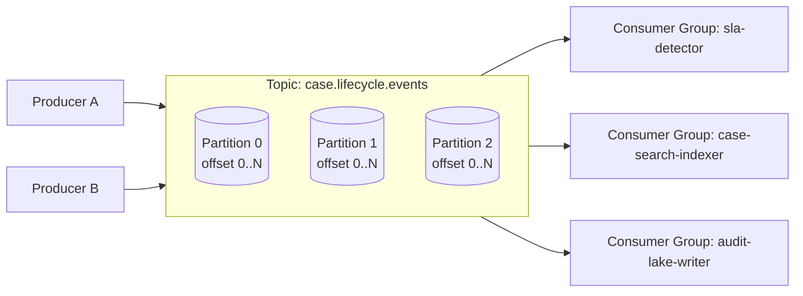

Kafka gives you a durable stream of records.

It does **not** automatically give you:

- business correctness;
- global ordering;
- semantic idempotency;
- safe schema evolution;
- correct partition key selection;
- automatic replay safety;
- correct sink transaction semantics;
- data quality guarantees.

Those are pipeline design responsibilities.

---

## 2. Kafka Is a Log, Not a Workflow Engine

Kafka should not be used as a substitute for a workflow engine.

Kafka is excellent for:

- event distribution;
- durable buffering;
- replay;
- fan-out;
- stream processing;
- decoupling producers and consumers;
- high-throughput data movement;
- state reconstruction from ordered facts.

Kafka is weak for:

- human task orchestration;
- long-running business process state machines;
- explicit compensation logic;
- waiting days for an external approval;
- complex retry calendars;
- cross-system saga visibility;
- operator-driven workflow repair.

Use Kafka as the event log.

Use something like Temporal, Camunda, or a purpose-built workflow service for durable process orchestration when the problem is a business workflow rather than event distribution.

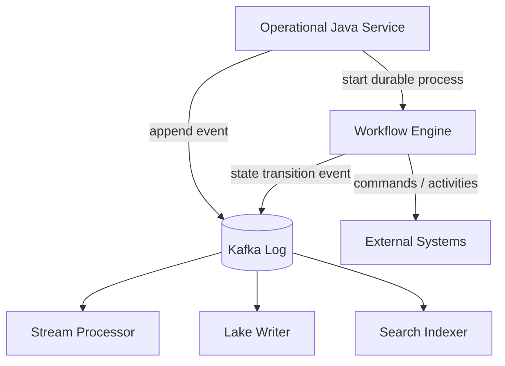

The mistake is to hide workflow state in topic names and retry topics until nobody can answer what state the business process is in.

---

## 3. The Three Things Kafka Persists

Kafka persists more than payloads.

For pipeline design, Kafka persists:

```text
1. Ordered records inside each partition
2. Offsets that identify record position
3. Metadata around topic, partition, timestamp, key, headers, and retention
```

The payload is only one part of the record.

A production record should be interpreted as an envelope:

```text
KafkaRecord = {
  topic,
  partition,
  offset,
  key,
  value,
  headers,
  timestamp,
  producer metadata,
  broker metadata
}
```

Your application envelope usually lives inside `value` and `headers`:

```text
DomainEnvelope = {
  eventId,
  eventType,
  aggregateId,
  aggregateVersion,
  occurredAt,
  publishedAt,
  schemaVersion,
  traceId,
  causationId,
  correlationId,
  tenantId,
  dataClassification,
  payload
}
```

Kafka record metadata tells you where the record lives in the log.

Domain envelope metadata tells you what the record means.

Do not confuse the two.

---

## 4. Topic, Partition, Offset: The Minimum Correct Mental Model

A topic is a named stream.

A partition is the ordering and scaling unit.

An offset is a position inside a partition.

```text
topic = case.lifecycle.events
partition = 7
offset = 38199201
```

This identifies a physical position.

It does not identify business meaning.

The business identity should be explicit:

```text
eventId = 018fbd85-9bc7-749a-9864-7715c4796ac7
caseId = CASE-2026-00019
caseVersion = 12
eventType = CaseEscalated
```

### Why offset is not an event ID

An offset is assigned by Kafka after append.

It is scoped to one partition.

If a producer retries, if a topic is rebuilt, if data is copied to another cluster, or if a backfill is published to another topic, offsets change.

So this is wrong:

```text
Use topic + partition + offset as the business event identity.
```

This is better:

```text
Use eventId as business event identity.
Use topic + partition + offset as log position.
```

Both are useful.

They answer different questions.

---

## 5. The Log Is Append-Oriented

Kafka records are appended.

Consumers do not delete records by reading them.

This is the central difference between Kafka log thinking and traditional queue thinking.

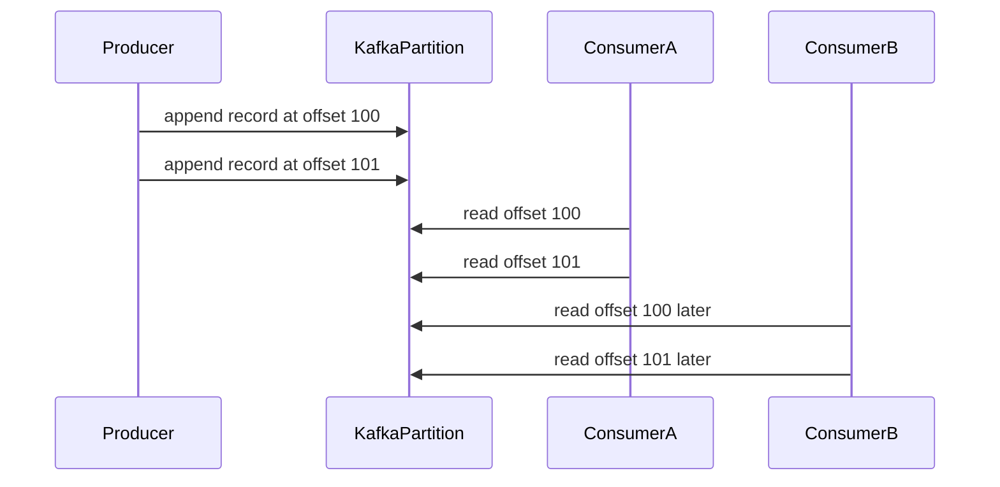

Multiple consumers can read the same records independently.

A slow lake writer should not block a real-time alerting processor.

A new consumer can be introduced later and start from old offsets, subject to retention.

This is why Kafka is powerful for pipelines.

It separates **publication** from **interpretation**.

---

## 6. Consumer Progress Is Not Data Deletion

A consumer commits offsets to record progress.

Committing an offset means roughly:

```text
This consumer group considers records up to this point processed.
```

It does not mean:

```text
The record is gone.
```

It also does not always mean:

```text
The side effect is safely committed.
```

That depends on your commit boundary.

Bad boundary:

```text
poll -> commit offset -> write to database
```

If the process crashes after committing but before database write, the record is skipped on restart.

Better boundary:

```text
poll -> write to idempotent database sink -> commit offset
```

If the process crashes after database write but before offset commit, the record is read again, but the idempotent sink prevents duplicate effect.

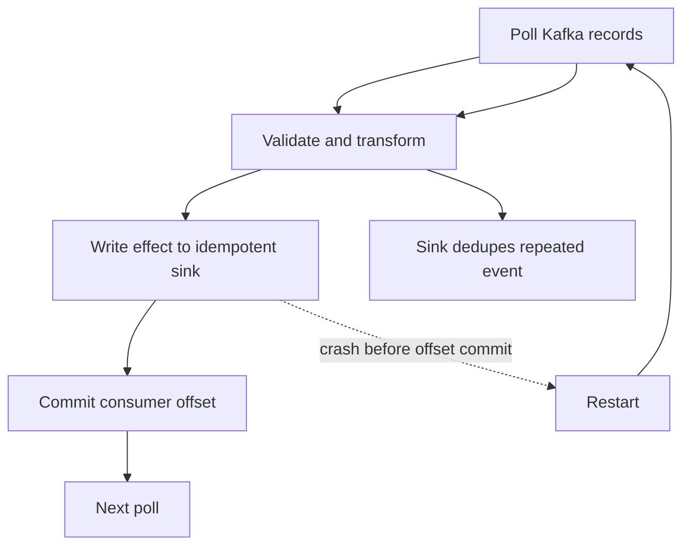

The rule:

```text
Commit progress only after the effect you care about is durable enough to survive replay.
```

---

## 7. Ordering Is Per Partition, Not Global

Kafka preserves order within a partition.

It does not provide total order across all partitions of a topic.

If two events must be processed in order, they must map to the same partition.

This makes partition key selection a correctness decision, not just a load-balancing decision.

For a regulatory case lifecycle pipeline:

```text
Good key:
  caseId

Because:
  CaseOpened -> CaseAssigned -> CaseEscalated -> CaseClosed
  must be interpreted in order per case.
```

Bad key:

```text
random UUID
```

Because events for the same case can land in different partitions and be consumed out of order.

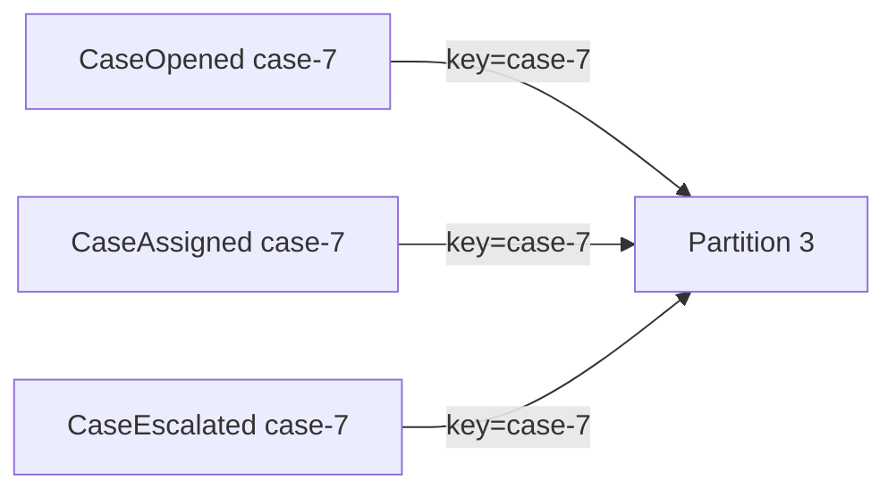

The partition key should usually represent the **state ownership key**.

Ask:

```text
What entity's state would become wrong if events were processed out of order?
```

That entity is often your key.

---

## 8. Partition Count Is a Long-Term Decision

Partitions provide parallelism.

More partitions can improve throughput.

But partitions also create operational and semantic consequences:

- more files and metadata on brokers;
- more consumer assignment complexity;
- more rebalance work;
- more open connections and fetch requests;
- harder capacity planning;
- irreversible-ish key distribution changes when partition count changes;
- more complexity for ordering-sensitive workloads.

Increasing partition count changes the mapping from key to partition for future records if the default partitioner uses partition count as part of hashing.

That means events for the same key can land on a different partition after expansion.

Kafka still preserves order inside each partition, but your per-key full history may be split between old and new partitions over time.

This may be acceptable for stateless consumers.

It may be painful for state reconstruction systems that assume one key's entire stream remains in one partition forever.

Design implication:

```text
Do not choose partition count as a casual deployment default.
Choose it as part of topic contract design.
```

---

## 9. Retention Is the Replay Window

Kafka retains records according to topic retention policy.

Retention may be time-based, size-based, compaction-based, or a combination depending on topic configuration.

For pipelines, retention answers:

```text
How far back can a new or repaired consumer replay from Kafka itself?
```

Examples:

```text
7-day retention:
  Good for short-lived buffering and operational consumers.

30-day retention:
  Good for replay after moderate outages.

365-day retention:
  Useful for audit/reprocessing but expensive.

Compacted retention:
  Useful for latest-state topics, not complete history.
```

Retention is not just storage configuration.

It is part of the recovery contract.

If a consumer is down longer than retention, Kafka may no longer have the old records it needs.

Then you need another source of truth:

- database snapshot;
- object storage archive;
- lakehouse raw table;
- producer backfill job;
- another Kafka cluster with longer retention;
- event-sourced store.

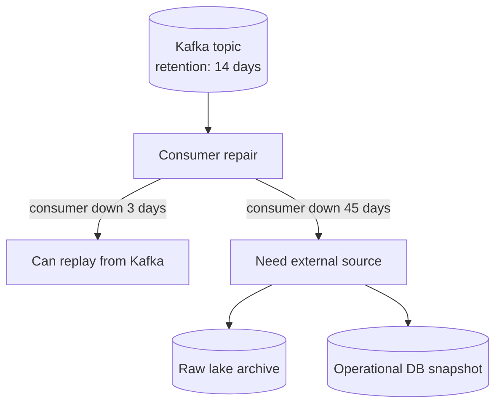

The top-level question:

```text
What is the canonical replay source for this pipeline?
```

If the answer is Kafka, retention must support the operational recovery objective.

---

## 10. Compaction Is Not History Preservation

Log compaction keeps the latest value for each key, eventually.

It is excellent for reconstructing latest state.

It is not a substitute for an immutable event history.

A compacted topic can answer:

```text
What is the latest known value for key K?
```

It cannot reliably answer:

```text
What exact sequence of events happened to key K over the last year?
```

Because older values for the same key may be removed.

Use compacted topics for:

- reference data;
- latest account profile;
- latest case status projection;
- lookup tables for stream enrichment;
- Kafka Streams changelog topics;
- state snapshots;
- current configuration distribution.

Use delete-retention event topics for:

- immutable facts;
- audit trails;
- lifecycle events;
- financial movements;
- case decisions;
- regulatory enforcement evidence;
- historical event replay.

Common anti-pattern:

```text
Put all business events in a compacted topic keyed by aggregateId.
```

This can destroy the historical event sequence you later need for audit, debugging, or reprocessing.

Better pattern:

```text
case.lifecycle.events        cleanup.policy=delete
case.current-status          cleanup.policy=compact
```

---

## 11. Kafka Record Key Has Two Jobs

The Kafka key usually does two things:

```text
1. Select partition
2. Provide compaction identity if the topic is compacted
```

These are not always the same business concept.

For an event topic:

```text
topic: case.lifecycle.events
key: caseId
purpose: keep all events for a case ordered in one partition
```

For a compacted current-state topic:

```text
topic: case.current-status
key: caseId
purpose: keep latest status per case
```

For an assignment history event topic:

```text
topic: case.assignment.events
key: caseId
payload: assignmentId, officerId, assignedAt
purpose: preserve per-case assignment event order
```

For a dedupe index topic:

```text
topic: pipeline.processed-events
key: eventId
purpose: latest processed metadata by event identity
```

Never choose key only because it looks evenly distributed.

Choose it based on the state and correctness boundary.

---

## 12. Kafka Is Excellent at Fan-Out

A single topic can feed many independent consumers.

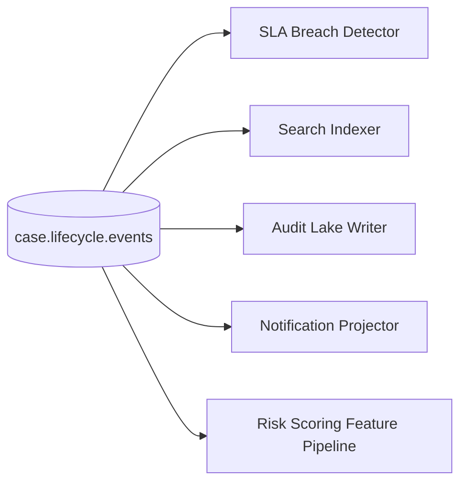

Each consumer group has its own progress.

This enables independent deployment and recovery.

But fan-out creates governance questions:

- Who owns the topic contract?
- Who is allowed to consume sensitive data?
- Which consumers are production-critical?
- Which consumers may lag without impacting business flow?
- Which consumers depend on fields that the producer wants to remove?
- How are consumers discovered before schema changes?
- How are downstream materializations traced?

Kafka reduces runtime coupling.

It does not eliminate semantic coupling.

That is why data contracts and lineage become important.

---

## 13. Kafka Is Not a Database Replacement

Kafka can store data durably.

But Kafka is not a general-purpose database.

It does not give you arbitrary indexed queries, relational constraints, ad-hoc joins, row-level transactions across arbitrary keys, or standard OLTP access patterns.

Kafka is a log.

A log is optimized for append and sequential consumption.

Use Kafka to distribute change.

Use databases, search indexes, caches, warehouses, or lakehouse tables to serve specific query patterns.

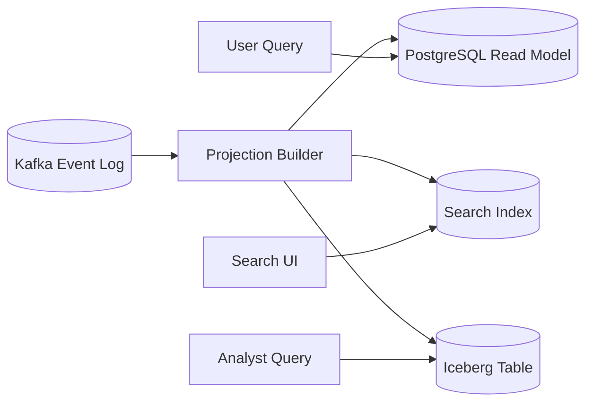

Correct framing:

```text
Kafka is the movement and replay substrate.
Serving stores are the query substrate.
```

---

## 14. Pipeline State Is Usually Outside Kafka Consumer Offsets

Kafka consumer offsets are progress state.

They are not the same as derived business state.

Derived state may live in:

- PostgreSQL projection table;
- Elasticsearch/OpenSearch index;
- Redis cache;
- Iceberg table;
- Flink keyed state;
- Kafka Streams state store;
- audit ledger;
- object storage files;
- external SaaS system.

If a consumer commits offset but fails to update derived state, the pipeline is wrong.

If a consumer updates derived state but fails to commit offset, the pipeline must tolerate replay.

Therefore, consumer design must include:

```text
1. offset state
2. effect state
3. dedupe state
4. error state
5. reconciliation state
```

Only beginners model “Kafka consumer progress” as a single offset.

Production systems model the full state transition.

---

## 15. Minimal Java Producer Mental Model

A Kafka producer publishes records to topics.

In Java, the producer boundary should hide infrastructure details from domain code.

Bad style:

```java
// Domain service directly constructs Kafka ProducerRecord everywhere.
producer.send(new ProducerRecord<>("case.lifecycle.events", caseId, json));
```

Better style:

```java
public interface DomainEventPublisher {
    void publish(DomainEvent event);
}
```

Implementation can own:

- topic mapping;
- key selection;
- schema encoding;
- header injection;
- tracing;
- producer retries;
- error handling;
- metrics;
- event ID enforcement.

Example shape:

```java
public final class KafkaDomainEventPublisher implements DomainEventPublisher {
    private final KafkaProducer<String, byte[]> producer;
    private final TopicRouter topicRouter;
    private final EventEncoder encoder;
    private final EventKeyStrategy keyStrategy;

    public KafkaDomainEventPublisher(
            KafkaProducer<String, byte[]> producer,
            TopicRouter topicRouter,
            EventEncoder encoder,
            EventKeyStrategy keyStrategy
    ) {
        this.producer = producer;
        this.topicRouter = topicRouter;
        this.encoder = encoder;
        this.keyStrategy = keyStrategy;
    }

    @Override
    public void publish(DomainEvent event) {
        String topic = topicRouter.topicFor(event);
        String key = keyStrategy.keyFor(event);
        byte[] value = encoder.encode(event);

        ProducerRecord<String, byte[]> record = new ProducerRecord<>(topic, key, value);
        record.headers().add("event-type", event.type().getBytes(StandardCharsets.UTF_8));
        record.headers().add("event-id", event.eventId().toString().getBytes(StandardCharsets.UTF_8));
        record.headers().add("schema-version", event.schemaVersion().getBytes(StandardCharsets.UTF_8));

        producer.send(record, (metadata, exception) -> {
            if (exception != null) {
                // Convert infrastructure failure into publish failure signal.
                // In outbox-based systems this usually marks relay failure, not business tx failure.
                throw new EventPublishException(event.eventId(), exception);
            }
        });
    }
}
```

For high-integrity systems, direct publish inside business transactions is often replaced by transactional outbox.

The domain transaction writes the business row and outbox row atomically.

A relay publishes outbox events to Kafka.

---

## 16. Minimal Java Consumer Mental Model

A Kafka consumer reads records, processes them, writes effects, and commits progress.

The dangerous part is the boundary between effect and offset commit.

A simplified consumer loop:

```java
while (running.get()) {
    ConsumerRecords<String, byte[]> records = consumer.poll(Duration.ofMillis(500));

    for (ConsumerRecord<String, byte[]> record : records) {
        DomainEnvelope envelope = decoder.decode(record);

        try {
            ProcessResult result = processor.process(envelope);
            sink.write(result);               // durable effect first
            offsetTracker.markProcessed(record);
        } catch (PoisonRecordException e) {
            dlq.publish(record, e);            // durable failure handling
            offsetTracker.markProcessed(record);
        } catch (RetryableException e) {
            // Do not commit this record as processed.
            // Pause/backoff/retry depending on policy.
            throw e;
        }
    }

    consumer.commitSync(offsetTracker.commitMap());
}
```

This code is simplified.

A production consumer also needs:

- rebalance handling;
- partition pause/resume;
- max poll interval control;
- graceful shutdown;
- poison record policy;
- retry budget;
- sink idempotency;
- metrics;
- tracing;
- structured logging;
- schema validation;
- consumer lag monitoring;
- duplicate detection;
- DLQ replay process.

---

## 17. The Consumer Group Is a Scaling Unit

A consumer group lets multiple consumer instances share work.

Each partition is assigned to one consumer in the group at a time.

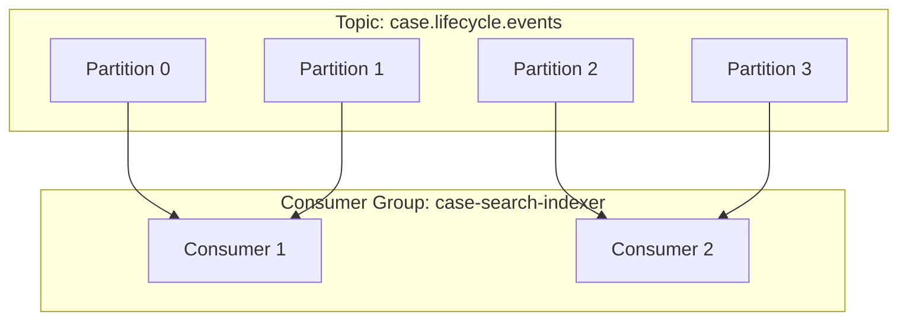

If the group has more consumers than partitions, extra consumers sit idle.

If the group has fewer consumers than partitions, some consumers handle multiple partitions.

Consumer group design affects:

- throughput;
- failover;
- rebalance frequency;
- partition affinity;
- local state management;
- deployment strategy;
- operational blast radius.

Do not scale consumers blindly.

If topic has 12 partitions, max active consumers in one group is 12.

---

## 18. Rebalance Is a Failure Boundary

Consumer group rebalancing changes partition ownership.

During rebalance, partitions may move from one consumer instance to another.

A consumer must handle this safely.

Dangerous scenario:

```text
Consumer A polls partition 3 offset 100.
Consumer A writes partial side effect.
Rebalance happens.
Partition 3 moves to Consumer B.
Consumer A still tries to commit.
Consumer B processes offset 100 again.
```

You need:

- idempotent sink;
- rebalance listener;
- orderly partition revocation;
- in-flight work tracking;
- synchronous commit on revoke where appropriate;
- graceful shutdown;
- short processing time relative to max poll interval;
- external lock/fencing only when truly needed.

Basic pattern:

```java
consumer.subscribe(List.of(topic), new ConsumerRebalanceListener() {
    @Override
    public void onPartitionsRevoked(Collection<TopicPartition> partitions) {
        // Stop accepting new work for revoked partitions.
        // Complete or cancel in-flight work.
        // Commit processed offsets if safe.
        commitProcessedOffsetsFor(partitions);
    }

    @Override
    public void onPartitionsAssigned(Collection<TopicPartition> partitions) {
        // Initialize partition-local state if needed.
        // Load checkpoint/dedupe state if externalized.
    }
});
```

Rebalance safety is not optional in production pipelines.

---

## 19. Replay Is a Feature and a Threat

Replay is one of Kafka's major strengths.

It enables:

- rebuilding read models;
- recovering failed consumers;
- adding new consumers;
- debugging transformations;
- backfilling derived datasets;
- correcting faulty projections;
- validating new pipeline versions.

Replay is also dangerous if side effects are not replay-safe.

Unsafe side effects:

- send email;
- charge payment;
- call external irreversible API;
- create duplicate ticket;
- append duplicate ledger movement;
- overwrite state without version check;
- publish derived event without deterministic identity.

Safe/replayable side effects usually require:

- idempotency key;
- upsert semantics;
- deterministic output ID;
- append-only ledger with unique contribution key;
- dedupe table;
- explicit replay mode;
- sink transaction boundary;
- external side-effect suppression.

Example:

```java
public record ProjectionWrite(
    String projectionName,
    String entityId,
    long sourceVersion,
    UUID sourceEventId,
    JsonNode materializedState
) {}
```

Sink rule:

```sql
insert into case_projection(entity_id, source_version, source_event_id, state_json)
values (?, ?, ?, ?)
on conflict (entity_id) do update
set source_version = excluded.source_version,
    source_event_id = excluded.source_event_id,
    state_json = excluded.state_json
where case_projection.source_version < excluded.source_version;
```

This protects against old replay overwriting newer projection state.

---

## 20. Kafka Is Not a Free Exactly-Once Machine

Kafka has producer idempotence and transactions.

Kafka Streams can provide exactly-once processing guarantees within Kafka-managed source/read/process/write boundaries when configured correctly.

But the practical guarantee is scoped.

If your pipeline reads Kafka and writes to PostgreSQL, Elasticsearch, S3, an email provider, or a SaaS API, Kafka cannot automatically make that external side effect exactly-once.

You must design the sink boundary.

Correct question:

```text
Exactly once with respect to what state?
```

Examples:

```text
Kafka topic A -> Kafka topic B:
  Kafka transactions may help strongly.

Kafka topic -> Kafka Streams state store -> Kafka topic:
  Kafka Streams exactly-once mode may help.

Kafka topic -> PostgreSQL projection:
  Need idempotent DB writes and offset/effect boundary.

Kafka topic -> email provider:
  Need idempotency/suppression or accept at-least-once notification risk.
```

Avoid generic claims like:

```text
This pipeline is exactly-once because Kafka supports exactly-once.
```

Say instead:

```text
This pipeline provides effectively-once materialization into the case_projection table by using deterministic event IDs, unique sink constraints, monotonic aggregate versions, and offset commit after durable sink write.
```

That statement is testable.

---

## 21. Commit Boundary Patterns

### Pattern A — Auto Commit

```text
poll -> process -> automatic offset commit eventually
```

Simple.

Risky.

Usually unacceptable for high-integrity pipelines because offsets may be committed independently of durable side effects.

Use only when data loss/duplicate risk is acceptable and processing is trivial.

### Pattern B — Manual Commit After Processing

```text
poll -> process -> sink write -> commit offset
```

Most common production baseline.

Requires idempotent sink because crash after sink write before commit causes replay.

### Pattern C — Store Offset in Same DB Transaction as Sink Effect

```text
poll -> begin DB tx -> write effect -> write consumed offset -> commit DB tx
```

Useful when the sink is a database and you want sink effect and consumed offset to advance atomically.

Then on restart, the application seeks Kafka based on DB-stored offset.

This is powerful but more complex.

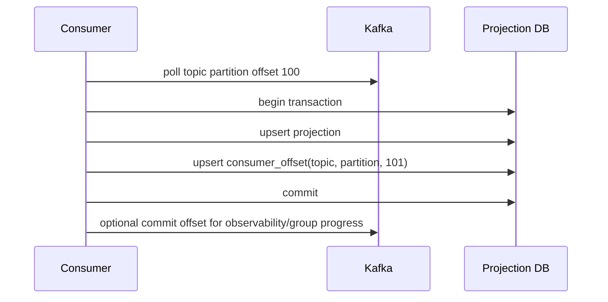

### Pattern D — Kafka Transactional Read-Process-Write

```text
read from input topic -> produce to output topic -> commit consumed offsets inside transaction
```

Useful for Kafka-to-Kafka transformations.

Does not solve external sink effects by itself.

### Pattern E — Inbox Table

```text
poll -> insert eventId into inbox -> process if first seen -> commit offset
```

Useful when duplicates are expected and consumers need durable dedupe.

---

## 22. Lag Means Distance From Head, Not Always Business Failure

Consumer lag is the difference between the latest produced offset and a consumer group's committed/processed offset.

Lag is useful, but not sufficient.

A pipeline can have low lag and still be wrong:

- it drops invalid records silently;
- it processes out of order;
- it writes corrupt state;
- it commits offsets before effects;
- it ignores late corrections;
- it masks schema drift;
- it sends records to DLQ without alerting.

A pipeline can have high lag and still be acceptable:

- backfill consumer intentionally reprocessing a year of data;
- low-priority analytics sink;
- maintenance window;
- batch-like consumer running on schedule.

Better observability combines:

```text
consumer lag
processing throughput
oldest unprocessed event age
freshness SLA
DLQ rate
retry rate
sink write latency
watermark progress
records processed per partition
commit delay
quality violation rate
business reconciliation delta
```

Lag tells you queue distance.

Freshness tells you business impact.

Quality tells you correctness.

---

## 23. Kafka Timestamp Is Not Always Business Time

Kafka records have timestamps.

But timestamp semantics depend on producer/broker configuration and producer behavior.

Do not assume Kafka timestamp equals business event time.

For pipelines, distinguish:

```text
business event time:
  when the domain fact occurred

source commit time:
  when source transaction committed

Kafka append time:
  when broker appended record

processing time:
  when consumer processed record

sink commit time:
  when derived effect became durable
```

A case escalated at 10:00 may be published at 10:03, consumed at 10:04, and materialized at 10:05.

Your SLA logic must choose the correct time.

Example envelope:

```json
{
  "eventId": "018fbd85-9bc7-749a-9864-7715c4796ac7",
  "eventType": "CaseEscalated",
  "occurredAt": "2026-07-04T03:00:00Z",
  "sourceCommittedAt": "2026-07-04T03:00:02Z",
  "publishedAt": "2026-07-04T03:00:03Z",
  "payload": {
    "caseId": "CASE-2026-00019",
    "escalationLevel": "LEVEL_2"
  }
}
```

---

## 24. Kafka Topic as Pipeline Boundary

A Kafka topic is a boundary between producer and consumer groups.

That boundary should have an explicit contract:

```text
topic name
owner
purpose
record key
payload schema
headers
partition count
ordering guarantee
retention policy
compaction policy
security classification
allowed producers
allowed consumers
schema compatibility mode
DLQ policy
replay source
backfill policy
sunset policy
```

A topic without a contract becomes a shared mutable dumping ground.

Once many teams consume it, changing it becomes expensive and risky.

Treat topics like APIs.

But stricter, because event logs are replayed historically.

---

## 25. Topic Categories in Pipelines

Not all topics are the same.

Classify them.

### 25.1 Fact/Event Topics

Immutable business facts.

Example:

```text
case.lifecycle.events
```

Properties:

- append-only;
- delete retention;
- event ID required;
- ordering key usually aggregate ID;
- schema evolves carefully;
- used for audit/replay.

### 25.2 CDC Topics

Low-level database change stream.

Example:

```text
db.enforcement.public.case
```

Properties:

- generated from database log;
- often table-shaped;
- includes operation metadata;
- may expose database implementation details;
- useful for replication and canonicalization.

### 25.3 Command Topics

Requests for another service/pipeline to perform work.

Example:

```text
case.notification.commands
```

Properties:

- should have command ID;
- should support idempotent handling;
- generally not an audit fact by itself;
- often needs timeout/retry workflow elsewhere.

### 25.4 Projection Topics

Derived view updates.

Example:

```text
case.current-status
```

Properties:

- often compacted;
- key identifies current state record;
- useful for enrichment and lookup.

### 25.5 Error Topics

DLQ/retry/quarantine streams.

Example:

```text
case.lifecycle.events.dlq
```

Properties:

- must preserve original record metadata;
- should include error class and processor identity;
- should be replayable after repair;
- should not be a silent graveyard.

---

## 26. The Kafka-Based Pipeline Skeleton

A common high-integrity Java pipeline looks like this:

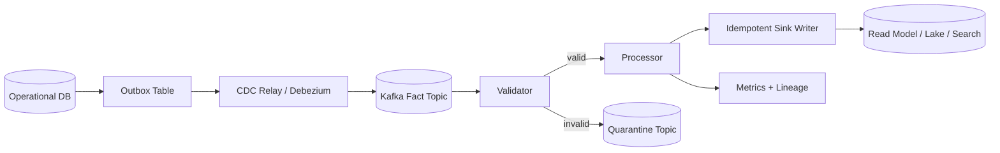

Key property:

```text
The pipeline can be replayed from Kafka without corrupting the sink.
```

That requires:

- deterministic event identity;
- stable partition key;
- schema compatibility;
- idempotent sink;
- explicit rejection path;
- offset commit after durable effect;
- enough retention or external archive;
- observability for lag, quality, and sink effect.

---

## 27. Kafka Headers: Useful, But Do Not Hide the Contract

Headers are useful for metadata:

- trace ID;
- event type;
- schema ID;
- tenant ID;
- producer name;
- correlation ID;
- causation ID;
- data classification;
- content type;
- compression hint;
- replay/backfill marker.

But do not put critical business facts only in headers unless all consumers are contractually required to read them.

Headers can be ignored by poorly written consumers.

Payload schemas are often more visible and validated.

Rule:

```text
Use headers for transport and routing metadata.
Use payload for domain facts.
```

Some metadata belongs in both places if it is both operationally useful and semantically important.

Example: `eventType` may be a header for routing and a payload/envelope field for audit.

---

## 28. Pipeline Replay Modes

A Kafka consumer should often understand processing mode.

```java
public enum ProcessingMode {
    LIVE,
    REPLAY,
    BACKFILL,
    REPAIR,
    SHADOW
}
```

Mode affects side effects.

```text
LIVE:
  normal processing, alerts enabled

REPLAY:
  rebuild deterministic state, irreversible external effects disabled

BACKFILL:
  historical load, may write to separate namespace/table partition

REPAIR:
  targeted correction, emits audit metadata

SHADOW:
  compare new logic with old output, no production effect
```

Kafka itself does not enforce these modes.

Your pipeline does.

A topic may include headers like:

```text
x-processing-mode: BACKFILL
x-backfill-id: bf-2026-07-case-rebuild-v2
x-replay-source: kafka://cluster/topic/partition/offset-range
```

But the sink must enforce behavior.

---

## 29. Kafka and Backfill

Backfill with Kafka can mean several different things.

### Option A — Reset Consumer Offset

Useful when the topic contains all needed history.

Risk:

- replay affects live sink;
- consumer may mix old and live records;
- irreversible side effects may repeat;
- retention may not be enough.

### Option B — New Consumer Group

Useful for rebuilding a new sink independently.

```text
case-search-indexer-v2-rebuild
```

Risk:

- duplicate infrastructure load;
- historical schema compatibility issues;
- old records may not match new expectations.

### Option C — Backfill Topic

Publish historical records to a dedicated topic.

```text
case.lifecycle.events.backfill.2026q3
```

Useful when you want isolation.

Risk:

- topic sprawl;
- ordering mismatch with live stream;
- merge semantics needed.

### Option D — Lake/Object Storage Replay

Use raw archive or lake table as replay source.

Useful for long retention and large-scale historical recompute.

Risk:

- different ordering semantics;
- different metadata;
- requires source-position mapping.

The correct option depends on replay source, sink behavior, and required isolation.

---

## 30. Kafka Pipeline Failure Scenarios

### Scenario 1 — Producer Publishes Invalid Schema

Impact:

- consumers fail decode;
- lag increases;
- DLQ fills;
- downstream freshness degrades.

Controls:

- schema registry compatibility;
- producer contract tests;
- runtime validation;
- canary consumer;
- reject before publish if possible.

### Scenario 2 — Wrong Partition Key

Impact:

- per-entity ordering breaks;
- stateful consumers produce incorrect state;
- reprocessing does not fix order if key remains wrong.

Controls:

- key strategy tests;
- partition audit;
- event sequence validation;
- key contract review.

### Scenario 3 — Consumer Commits Before Sink Write

Impact:

- data loss in derived state;
- Kafka says consumed, sink missing record.

Controls:

- manual commit after sink;
- offset/effect transaction;
- reconciliation.

### Scenario 4 — Retention Too Short

Impact:

- consumer cannot recover after long outage;
- new consumer cannot bootstrap;
- backfill impossible from Kafka.

Controls:

- retention aligned with RPO/RTO;
- raw archive;
- lake landing zone;
- alert on lag age approaching retention.

### Scenario 5 — DLQ Without Replay Process

Impact:

- records disappear operationally;
- correctness hole grows silently.

Controls:

- DLQ ownership;
- replay tool;
- error classification;
- SLA for DLQ repair;
- dashboard and alerting.

---

## 31. Observability Signals Specific to Kafka Pipelines

Track at least:

```text
producer record send rate
producer error rate
producer retry rate
producer request latency
record size distribution
per-topic input rate
per-partition input skew
consumer lag by group/topic/partition
oldest unprocessed event age
poll duration
processing duration
sink write duration
commit latency
rebalance count
partition revocation count
DLQ rate
quarantine rate
schema decode failure rate
contract validation failure rate
duplicate event rate
replay/backfill mode record count
```

For high-integrity domains, add business reconciliation:

```text
number of CaseOpened events vs cases in projection
number of CaseClosed events vs closed status count
sum of financial movements in event log vs ledger table
oldest open SLA breach candidate vs alert state
```

Kafka metrics tell you movement.

Business metrics tell you correctness.

---

## 32. Security and Governance

Kafka topics often become cross-team data products.

Security model must define:

- topic owner;
- producer identities;
- consumer identities;
- ACLs;
- encryption in transit;
- encryption at rest where applicable;
- sensitive field classification;
- masking/tokenization requirements;
- retention by classification;
- audit access;
- schema registry access;
- DLQ data sensitivity;
- cross-environment isolation;
- tenant boundary.

DLQ and replay topics often leak sensitive payloads because teams treat them as operational artifacts rather than data products.

That is a mistake.

A DLQ record can contain the same PII as the original event, plus error details.

Classify it accordingly.

---

## 33. Kafka as Evidence Trail

In regulated systems, event logs may become part of the evidence trail.

But a Kafka topic is not automatically a defensible audit store.

You need to answer:

```text
Is retention long enough?
Can records be deleted or compacted?
Are schemas versioned?
Can historical payloads be decoded?
Can event identity be proven?
Can producer identity be proven?
Can replay produce the same result?
Is access audited?
Are corrections represented explicitly?
Are DLQ/quarantine records preserved?
```

Often, Kafka is the hot operational log, while the durable audit archive is object storage/lakehouse with immutable retention policies.

Pattern:

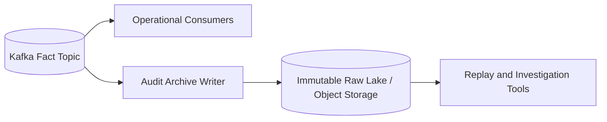

Kafka handles low-latency distribution.

The archive handles long-term defensibility.

---

## 34. Production Design Review Questions

Before approving a Kafka pipeline, ask:

### Topic Meaning

```text
What does this topic represent?
Is it a fact stream, command stream, CDC stream, projection stream, or error stream?
Who owns it?
What is the compatibility policy?
```

### Key and Ordering

```text
What is the record key?
Why is that the correct state ownership key?
What ordering does the pipeline rely on?
What happens if two related records go to different partitions?
```

### Retention and Replay

```text
How long are records retained?
Is that enough for consumer recovery?
Is Kafka the replay source or only the hot buffer?
Where is the long-term raw archive?
```

### Consumer Boundary

```text
When does the consumer commit offsets?
Is the sink idempotent?
What happens after crash between sink write and offset commit?
What happens during rebalance?
```

### Schema and Contract

```text
What schema format is used?
What is the compatibility mode?
How are consumers discovered before breaking changes?
How are old records decoded during replay?
```

### Error Handling

```text
What is retryable?
What is poison?
What goes to DLQ?
Who owns DLQ repair?
How is replay from DLQ performed?
```

### Observability

```text
What are freshness and correctness SLOs?
What alerts fire before retention loss?
Can we trace one event across producer, Kafka, processor, and sink?
```

---

## 35. Anti-Patterns

### Anti-Pattern 1 — Topic as Dumping Ground

```text
events
all-events
integration-topic
misc-updates
```

These names hide contract boundaries.

A topic should have clear meaning.

### Anti-Pattern 2 — Random Partition Key

Random keys distribute load but destroy per-entity ordering.

Use random keys only when ordering is irrelevant.

### Anti-Pattern 3 — Offsets as Business IDs

Offsets are log positions, not business identities.

### Anti-Pattern 4 — Compacted Topic for Historical Audit

Compaction keeps latest value per key.

It is not complete history.

### Anti-Pattern 5 — DLQ as Trash Bin

DLQ is not disposal.

It is a repair queue.

### Anti-Pattern 6 — Auto Commit in Important Pipelines

Auto commit can acknowledge progress before the sink effect is safe.

### Anti-Pattern 7 — “Kafka Gives Exactly Once”

Kafka's guarantees are scoped.

External side effects still require idempotent sink design.

### Anti-Pattern 8 — Infinite Retention Without Cost Model

Long retention is useful, but not free.

Use explicit recovery/audit requirements.

---

## 36. Implementation Blueprint: Kafka Log Consumer in Java

A good Java consumer package structure:

```text
case-pipeline-consumer/
  src/main/java/com/acme/casepipeline/
    kafka/
      KafkaConsumerFactory.java
      KafkaRecordDecoder.java
      KafkaOffsetManager.java
      KafkaRebalanceHandler.java
    contract/
      EventContractValidator.java
      SchemaVersionResolver.java
    domain/
      CaseLifecycleEvent.java
      CaseProjectionCommand.java
    processing/
      CaseEventProcessor.java
      ProcessingMode.java
    sink/
      CaseProjectionSink.java
      IdempotencyRepository.java
    error/
      DlqPublisher.java
      PoisonRecordClassifier.java
      RetryPolicy.java
    observability/
      PipelineMetrics.java
      TraceContextExtractor.java
```

The core consumer should be boring.

Complexity belongs in explicit components.

```java
public final class KafkaPipelineConsumer {
    private final KafkaConsumer<String, byte[]> consumer;
    private final KafkaRecordDecoder decoder;
    private final EventContractValidator validator;
    private final CaseEventProcessor processor;
    private final CaseProjectionSink sink;
    private final DlqPublisher dlq;
    private final OffsetManager offsets;

    public void run() {
        while (!Thread.currentThread().isInterrupted()) {
            ConsumerRecords<String, byte[]> records = consumer.poll(Duration.ofMillis(500));

            for (ConsumerRecord<String, byte[]> record : records) {
                handle(record);
            }

            consumer.commitSync(offsets.readyToCommit());
        }
    }

    private void handle(ConsumerRecord<String, byte[]> record) {
        try {
            DomainEnvelope envelope = decoder.decode(record);
            validator.validate(envelope);
            CaseProjectionCommand command = processor.toCommand(envelope);
            sink.apply(command);
            offsets.markProcessed(record);
        } catch (NonRetryablePipelineException e) {
            dlq.publish(record, e);
            offsets.markProcessed(record);
        }
    }
}
```

This is a skeleton, not final production code.

But the structure makes the important boundaries visible.

---

## 37. Testing Kafka-as-Log Semantics

Test these properties, not just “producer sends” and “consumer receives”.

### Test 1 — Same Key Goes to Same Partition

```text
Given multiple events for the same caseId
When producer sends them
Then partition assignment is stable for that key
```

### Test 2 — Replay Is Idempotent

```text
Given event E processed once
When event E is processed again
Then sink state is unchanged except duplicate metric
```

### Test 3 — Commit After Sink

```text
Given sink write succeeds and offset commit fails
When consumer restarts
Then event is reprocessed and deduped
```

### Test 4 — Poison Record Does Not Block Partition Forever

```text
Given one invalid record followed by valid records
When invalid record is classified as poison
Then invalid record is published to DLQ
And valid records continue processing
```

### Test 5 — Retention Loss Alert

```text
Given oldest unprocessed event age approaches retention threshold
Then alert fires before data becomes unrecoverable from Kafka
```

### Test 6 — Rebalance Safety

```text
Given consumer loses partition during processing
Then processed offsets are committed only for durable effects
And duplicate processing remains safe
```

---

## 38. Small But Important Design Heuristics

Use these as defaults unless you have a strong reason not to.

```text
One topic should have one clear semantic purpose.
Record key should match state ownership boundary.
Offsets are not business IDs.
Consumer lag is not enough; track freshness and correctness.
Commit offsets after durable effects.
Sinks must be idempotent unless duplicates are acceptable.
DLQ records must be replayable and owned.
Compacted topics are latest-state topics, not audit event logs.
Retention is a recovery contract.
Kafka is the log; serving stores are query models.
```

---

## 39. Mental Model Recap

Kafka lets you build pipelines around a durable log.

But the log only gives you a substrate.

Correctness comes from the contracts you put around it:

```text
producer contract
record key contract
topic contract
schema contract
consumer effect contract
offset commit contract
retention/replay contract
DLQ repair contract
observability contract
```

The highest-leverage mental model is:

```text
Kafka stores ordered facts per partition.
Your pipeline turns those facts into durable effects.
The hard part is making those effects correct under replay, failure, schema evolution, and operational repair.
```

If you internalize that, Kafka stops being “a broker” and becomes what it is in serious data platforms:

```text
an operational log for distributed data products.
```

---

## 40. References

- Apache Kafka Documentation — Introduction and core concepts.
- Apache Kafka Documentation — Topic, partition, producer, consumer, and event streaming model.
- Confluent Documentation — Kafka log compaction and retention behavior.
- Kafka Improvement Proposals and official client documentation for producer/consumer behavior.

