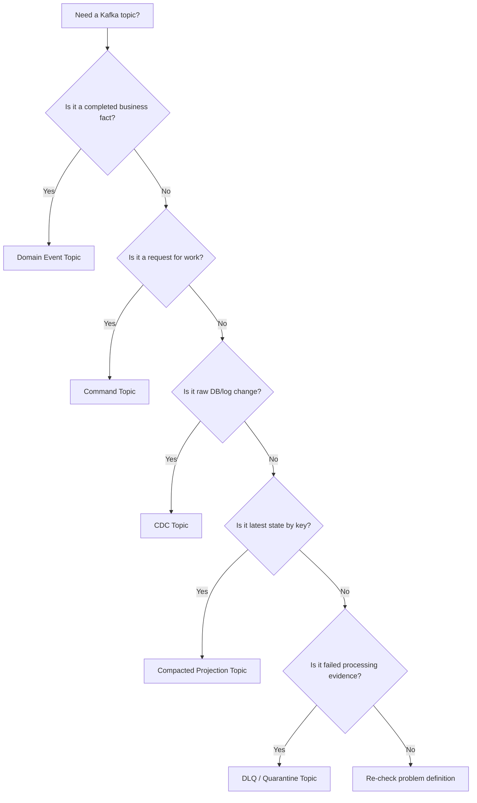
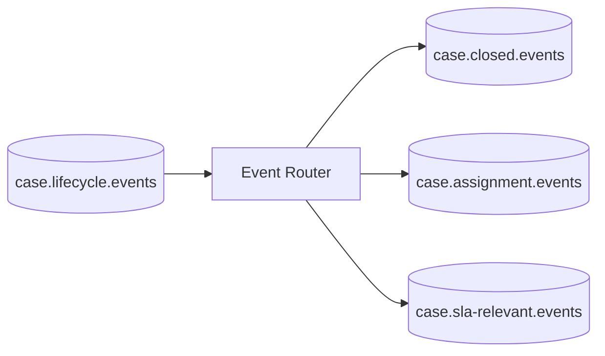
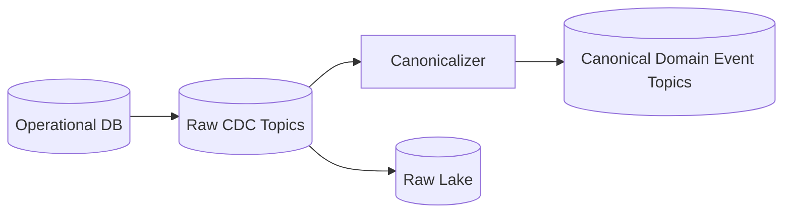
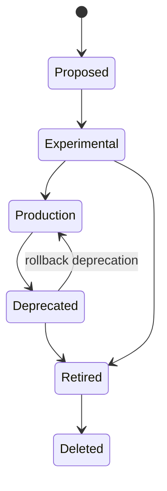
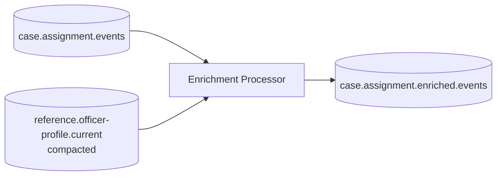
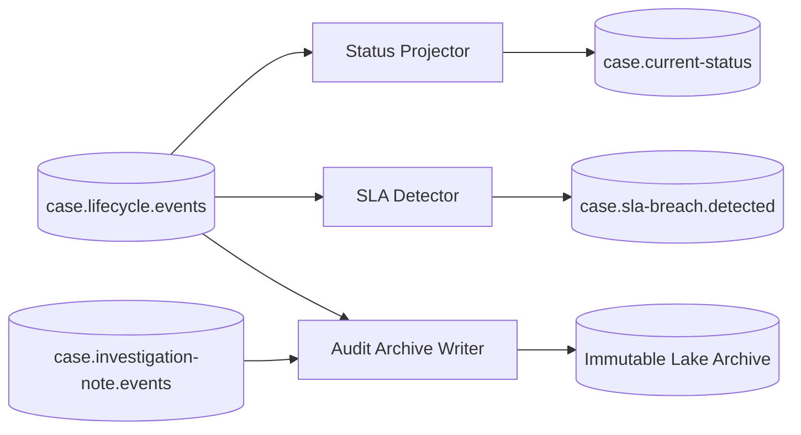

# Part 034 — Topic Design for Data Pipelines

Kafka topic design is architecture.

It is not naming convention trivia.

A topic defines a long-lived contract between producers, consumers, storage policy, ordering semantics, replay strategy, security boundary, and operational ownership.

Weak topic design creates years of downstream pain:

```text
ambiguous ownership
unclear event meaning
unbounded schema drift
broken ordering
consumer-specific hacks
topic sprawl
retention mismatch
DLQ graveyards
PII leakage
impossible replay
expensive migrations
```

Strong topic design makes pipelines boring:

```text
clear meaning
stable keys
known replay window
safe schema evolution
predictable consumer behavior
explicit ownership
observable failure modes
governed access
```

This part gives you a production-grade decision framework for Kafka topic design in Java data pipelines.

---

## 1. The Topic Is a Contract Boundary

A Kafka topic is not just a string.

It is a boundary.

At that boundary, the producer promises something and consumers build assumptions on top of it.

A topic contract should answer:

```text
What does this stream mean?
Who owns it?
Who may write to it?
Who may read from it?
What is the key?
What ordering is guaranteed?
What schema is used?
What compatibility mode applies?
How long is data retained?
Is it compacted?
Is it replayable?
Is it authoritative?
What data classification applies?
What is the deprecation policy?
```

If those answers are missing, consumers infer them informally.

Informal assumptions become production dependencies.

Production dependencies become migration blockers.

---

## 2. Start With Meaning, Not Naming

Do not begin with:

```text
Should the topic be called case-events-v1 or case.lifecycle.events?
```

Begin with:

```text
What facts should exist in this stream?
What state changes do they represent?
Who owns those facts?
Who needs to derive state from them?
What ordering do they require?
How long must they be recoverable?
```

Good naming follows good meaning.

Bad meaning cannot be fixed by naming style.

---

## 3. Topic Taxonomy

Most production Kafka estates contain several topic types.

Treating all topics the same causes wrong retention, wrong keying, wrong security, and wrong consumer expectations.

### 3.1 Domain Event Topic

Represents business facts.

Example:

```text
case.lifecycle.events
```

Meaning:

```text
Facts about case lifecycle transitions that already happened.
```

Typical properties:

```yaml
cleanup.policy: delete
key: caseId
retention: aligned with replay/audit hot window
schema: Avro/Protobuf/JSON Schema envelope
compatibility: backward or full transitive depending on consumers
owner: domain team
```

Use for:

- audit stream;
- read model rebuild;
- downstream analytics;
- stateful stream processing;
- event-driven integration.

### 3.2 Command Topic

Represents requested work.

Example:

```text
notification.email.commands
```

Meaning:

```text
Requests to send an email notification.
```

Typical properties:

```yaml
cleanup.policy: delete
key: commandTargetId or business id
retention: short-to-medium operational window
idempotency: commandId required
owner: command receiver or platform team
```

Commands are not facts until executed.

A command topic should not be treated as an audit log of completed outcomes.

### 3.3 CDC Topic

Represents low-level source database changes.

Example:

```text
db.enforcement.public.case
```

Meaning:

```text
Changes captured from the public.case table in the enforcement database.
```

Typical properties:

```yaml
cleanup.policy: delete or compact depending on use case
key: source primary key
schema: connector-generated schema
owner: source system/platform
classification: often same as source table
```

CDC topics expose source implementation details.

Do not treat them as stable domain APIs unless you intentionally govern them as such.

### 3.4 Canonical Event Topic

Represents normalized business events derived from raw sources or CDC.

Example:

```text
enforcement.case.lifecycle.v1
```

Meaning:

```text
Canonical case lifecycle facts independent of source table shape.
```

Typical properties:

```yaml
cleanup.policy: delete
key: caseId
schema: strongly governed canonical schema
owner: data product/domain platform team
```

Canonical topics are useful when many consumers should not depend on raw CDC shape.

### 3.5 Projection / Latest-State Topic

Represents latest known value by key.

Example:

```text
case.current-status
```

Typical properties:

```yaml
cleanup.policy: compact
key: caseId
value: latest status projection
retention: compacted, optionally with delete retention
```

Use for enrichment and lookup.

Do not use as complete history.

### 3.6 Changelog Topic

Represents state store updates for stream processors.

Example:

```text
case-sla-detector-case-state-changelog
```

Usually internal to Kafka Streams or stream processing infrastructure.

Avoid exposing internal changelog topics as public data products.

### 3.7 Retry Topic

Represents records delayed for retry.

Example:

```text
case.lifecycle.events.retry.5m
```

Retry topics should have clear policy:

```text
what error class enters
how many attempts
delay/backoff
next destination
headers preserved
original topic/partition/offset preserved
```

### 3.8 DLQ / Quarantine Topic

Represents failed records requiring repair or explicit discard.

Example:

```text
case.lifecycle.events.dlq
case.lifecycle.events.quarantine
```

DLQ/quarantine topics require ownership and replay tooling.

They are not trash bins.

### 3.9 Backfill Topic

Represents isolated historical replay.

Example:

```text
case.lifecycle.events.backfill.2026-07-v2
```

Use sparingly.

Backfill topics prevent live-topic pollution but can create topic sprawl.

### 3.10 Audit Archive Topic

Sometimes a topic is designed specifically as a hot audit stream before archival.

Example:

```text
audit.case.lifecycle.raw
```

Usually paired with immutable object storage/lakehouse sink.

---

## 4. Topic Design Decision Tree

Use this as a first-pass decision framework.



If you cannot classify the topic, the design is not ready.

---

## 5. Naming: Optimize for Meaning and Operations

A good topic name communicates:

```text
domain
entity or data product
semantic type
optionally version/layer/environment when needed
```

Example style:

```text
<domain>.<entity-or-product>.<semantic-type>
```

Examples:

```text
case.lifecycle.events
case.assignment.events
case.current-status
case.sla-breach.detected
notification.email.commands
reference.officer-profile.current
```

For CDC:

```text
db.<system>.<schema>.<table>
```

Examples:

```text
db.enforcement.public.case
db.enforcement.public.case_assignment
```

For pipeline internals:

```text
<pipeline>.<purpose>.<internal-type>
```

Examples:

```text
case-sla-detector.case-state.changelog
case-sla-detector.events.retry.5m
case-sla-detector.events.dlq
```

### Avoid vague names

Bad:

```text
events
case-events
updates
integration
pipeline-data
realtime-feed
all-domain-events
```

Why bad:

- unclear ownership;
- unclear meaning;
- unclear schema boundary;
- likely to accumulate unrelated records;
- hard to apply retention/security correctly.

---

## 6. Should Topic Names Include Version?

Sometimes.

But do not put `v1` everywhere by habit.

Schema evolution should usually happen inside a stable topic through compatibility rules.

Create a new topic version when semantics break, not merely when schema changes.

### Do not create a new topic for safe additive schema change

Example:

```text
Add optional field: escalationReason
```

If compatible, keep same topic.

### Consider a new topic when meaning changes

Example:

```text
Old: case.lifecycle.events means workflow status changes only.
New: case.lifecycle.events also includes assignment and SLA timer events.
```

That is semantic expansion that may break consumers.

### Consider a new topic when key changes

Example:

```text
Old key: caseId
New key: organizationId
```

This changes ordering and partitioning semantics.

### Consider a new topic when retention/security changes fundamentally

Example:

```text
Old topic contained non-PII public case metadata.
New topic contains sensitive enforcement notes.
```

Security classification changed.

A new topic may be required.

Rule:

```text
Version topics for incompatible semantic contracts, not every schema revision.
```

---

## 7. Choosing Topic Granularity

One of the hardest design decisions is granularity.

Should you create one broad topic or many narrow topics?

### Option A — Broad Domain Topic

Example:

```text
case.lifecycle.events
```

Contains:

```text
CaseOpened
CaseAssigned
CaseEscalated
CaseClosed
CaseReopened
```

Advantages:

- preserves order across related lifecycle events for same key;
- easier for consumers needing full lifecycle;
- fewer topics;
- simpler replay for aggregate history.

Disadvantages:

- consumers may filter many event types;
- schema union can grow;
- permissions are coarse;
- retention applies to all contained event types.

### Option B — Narrow Event-Type Topics

Examples:

```text
case.opened.events
case.assigned.events
case.escalated.events
case.closed.events
```

Advantages:

- clear event-specific schema;
- fine-grained access;
- targeted consumers;
- per-topic retention/security possible.

Disadvantages:

- cross-event ordering is harder;
- consumers needing lifecycle must subscribe to many topics;
- topic sprawl;
- harder aggregate replay.

### Option C — Domain Topic + Derived Narrow Topics

Pattern:

```text
case.lifecycle.events      // authoritative broad fact stream
case.closed.events         // derived narrow stream for specific consumers
case.sla-breach.detected   // derived analytical/domain event
```

This is often best for mature platforms.

The broad topic preserves aggregate history.

Derived topics optimize consumer-specific access.



But derived topics must be documented as derived, not authoritative source of truth.

---

## 8. Topic Boundary Heuristics

Use these rules of thumb.

### Same topic when

```text
events describe the same aggregate lifecycle
same owner controls semantics
same key preserves required order
same security classification
same retention requirement
same compatibility policy
most consumers understand the union
```

### Separate topic when

```text
different owner
different key
different security classification
different retention/replay requirement
different semantic lifecycle
different consumer population
different throughput/capacity profile
different compatibility policy
```

### Create derived topic when

```text
source topic is authoritative
many consumers repeatedly filter the same subset
subset has distinct access/security needs
subset is materially easier to consume
derivation is deterministic and observable
```

---

## 9. Partition Key Selection

Partition key is the most important topic design decision after meaning.

It controls:

- per-key ordering;
- parallelism;
- data distribution;
- compaction identity for compacted topics;
- state locality;
- join feasibility;
- consumer scaling;
- hot partition risk.

Ask:

```text
What state must be processed in order?
```

That state owner is usually the key.

For case lifecycle:

```text
key = caseId
```

For officer workload updates:

```text
key = officerId
```

For tenant usage aggregation:

```text
key = tenantId
```

For payment movement ledger:

```text
key = accountId or ledgerAccountId
```

For idempotency index:

```text
key = eventId
```

### Bad key choices

```text
random UUID:
  good distribution, bad ordering

current timestamp:
  hot partitions and no state meaning

event type:
  hot partitions and poor entity ordering

tenantId only:
  may create hot partition for large tenant

null key:
  partitioner-specific behavior, usually poor for stateful processing
```

---

## 10. Composite Keys

Sometimes one field is not enough.

Example:

```text
tenantId + caseId
```

Composite key helps:

- preserve tenant isolation;
- preserve per-case ordering;
- avoid key collision across tenants;
- support multi-tenant routing.

In Java, avoid ad-hoc string concatenation without escaping/versioning.

Bad:

```java
String key = tenantId + ":" + caseId;
```

Better:

```java
public record TopicKey(
    String tenantId,
    String entityType,
    String entityId
) {
    public String canonical() {
        return String.join("|",
            escape(tenantId),
            escape(entityType),
            escape(entityId)
        );
    }
}
```

For binary schemas, a typed key format may be better.

But remember: Kafka partitioner needs bytes.

Whatever encoding you use must be stable.

---

## 11. Hot Partition Analysis

A correct key can still create skew.

Example:

```text
key = tenantId
```

If one tenant produces 70% of traffic, one partition may become hot.

Options:

### Option A — Keep key, accept skew

Use when ordering per tenant is mandatory and volume is manageable.

### Option B — Key by lower-level entity

```text
key = caseId instead of tenantId
```

Preserves per-case ordering and distributes traffic better.

### Option C — Key salting

```text
key = tenantId + bucket
```

Increases distribution but breaks strict per-tenant ordering.

Use only when consumers can handle it.

### Option D — Split domain stream

Separate extremely high-volume producer/tenant/type into another topic.

### Option E — Dedicated pipeline for hot entity

Use special handling when one entity is naturally large.

Decision rule:

```text
Never fix hot partition by breaking ordering unless you have redesigned the downstream state model.
```

---

## 12. Partition Count Selection

Partition count affects maximum parallelism and operational cost.

Inputs:

```text
expected producer throughput
expected consumer throughput per instance
record size
peak traffic multiplier
required consumer parallelism
broker capacity
replication factor
retention size
future growth
ordering boundary
state store size
rebalancing tolerance
```

A simple starting formula:

```text
partitions_by_write = ceil(peak_write_mb_per_sec / target_mb_per_sec_per_partition)
partitions_by_read  = desired_max_consumer_instances
partition_count     = max(partitions_by_write, partitions_by_read, minimum_operational_floor)
```

But this is only a sizing aid.

Partition count is also a semantic decision.

If you increase partition count later, key-to-partition mapping may change for new records.

### Production heuristic

For important topics:

```text
Choose enough partitions for 12-24 months of growth.
Avoid extreme over-partitioning.
Document expansion implications.
Load test with realistic record size and key distribution.
```

---

## 13. Replication Factor and Durability

Replication factor determines how many broker replicas store each partition.

Common production baseline:

```text
replication.factor = 3
min.insync.replicas = 2
producer acks = all
```

This is not universal, but it is a common high-durability posture.

The topic contract should state durability expectations.

For low-value telemetry, a lower durability posture may be acceptable.

For regulatory facts, financial events, audit records, or case decisions, durability should be stricter.

Tie configuration to data criticality.

Do not copy one setting everywhere without classification.

---

## 14. Retention Design

Retention should be based on recovery and audit requirements.

Questions:

```text
How long can a consumer be down and still recover from Kafka?
How long must a new consumer bootstrap from Kafka?
Is Kafka the authoritative replay source?
Is there a raw archive elsewhere?
What is the maximum acceptable data loss window?
What is the expected backfill horizon?
What legal/regulatory retention applies?
What is the storage cost?
```

### Common retention classes

```text
short operational buffer:
  hours to days

standard replay buffer:
  7-30 days

extended replay buffer:
  90-365 days

latest-state compacted:
  compaction-based, not full history

archive-backed:
  Kafka hot window + object storage long-term archive
```

### Alerting implication

If retention is 7 days, do not alert only when consumer lag is 8 days.

Alert when oldest unprocessed event age approaches threshold.

Example:

```text
warning at 60% of retention
critical at 80% of retention
page at 90% of retention
```

---

## 15. Delete Retention vs Compaction

Kafka cleanup policy is central to topic meaning.

### Delete policy

Keeps records for time/size retention window.

Good for:

- immutable event logs;
- CDC history windows;
- command streams;
- retry streams;
- DLQ streams;
- audit hot windows.

### Compact policy

Keeps latest value per key eventually.

Good for:

- current-state topics;
- reference data;
- lookup/enrichment topics;
- changelog topics;
- idempotency state distribution.

### Delete + compact

Can be used when you want latest value plus bounded deletion behavior.

But understand cleanup semantics carefully before depending on it.

### Rule

```text
If consumers need historical sequence, do not rely on compaction.
If consumers need latest state by key, compaction may be ideal.
```

---

## 16. Tombstones in Compacted Topics

In compacted topics, a record with key and null value is often used as a tombstone.

It represents deletion of the key's latest value.

Design questions:

```text
What does deletion mean?
Is it physical deletion, logical deletion, privacy deletion, or source absence?
Should consumers remove derived state?
How long are tombstones retained?
Can late older records resurrect deleted state?
```

Consumer rule:

```text
Tombstone handling must be explicit.
```

Example Java shape:

```java
public sealed interface CurrentCaseStatusRecord permits CaseStatusValue, CaseStatusTombstone {
    String caseId();
}

public record CaseStatusValue(String caseId, String status, Instant updatedAt)
        implements CurrentCaseStatusRecord {}

public record CaseStatusTombstone(String caseId, Instant deletedAt, String reason)
        implements CurrentCaseStatusRecord {}
```

If you rely only on raw null value, you may lose semantic deletion reason.

Sometimes a domain-level deletion event plus compacted tombstone is the better pair.

---

## 17. Topic Schema Strategy

Topic schema strategy must match topic type.

### Single event envelope with union payload

Example:

```json
{
  "eventId": "...",
  "eventType": "CaseEscalated",
  "occurredAt": "...",
  "payload": { }
}
```

Good for broad domain event topics.

### One schema per event type

Good for narrow event-type topics or systems with schema registry subject per record type.

### CDC connector schema

Generated by connector.

Good for raw capture, not necessarily for public consumers.

### Latest-state schema

Good for compacted projection topics.

### Error envelope schema

DLQ should have a stable wrapper:

```text
original topic/partition/offset
original key
original headers
original payload
error category
error message
processor name
processor version
failedAt
replay hint
```

DLQ schema matters as much as source schema.

---

## 18. Topic Subject Naming for Schema Registry

Schema registry subject naming affects compatibility scope.

Common strategies:

```text
TopicNameStrategy:
  one subject per topic key/value

RecordNameStrategy:
  one subject per fully qualified record name

TopicRecordNameStrategy:
  one subject per topic + record name
```

The choice affects whether multiple event types can coexist in one topic and how compatibility is checked.

For broad event topics, you need to intentionally design subject naming and event envelope strategy.

Do not let default settings accidentally define your long-term schema boundary.

---

## 19. Topic Ownership

Every production topic needs an owner.

Owner responsibilities:

```text
approve producers
approve contract changes
maintain schema compatibility
publish deprecation notices
monitor topic health
respond to DLQ/quarantine issues
manage retention and cost
review access requests
own documentation
coordinate incident response
```

Topic ownership should not default to “the Kafka platform team”.

The platform team owns the substrate.

The domain/data product team owns semantics.

---

## 20. Producer Ownership and Allowed Writers

A topic should define allowed producer identities.

Reasons:

- prevent rogue writes;
- preserve contract quality;
- enforce schema compatibility;
- maintain event identity discipline;
- protect ordering assumptions;
- support incident tracing.

Good pattern:

```text
case.lifecycle.events
  owner: Case Management domain team
  allowed producers:
    - case-service-outbox-relay-prod
    - case-migration-backfill-job-prod
  producer approval required: yes
```

Dangerous pattern:

```text
Any service can publish if it has the schema.
```

That turns the topic into a shared mutable bus.

---

## 21. Consumer Governance

Consumers build dependencies.

The topic owner should know important consumers.

At minimum, track:

```text
consumer group id
owning team
purpose
criticality
contact channel
fields consumed
freshness requirement
replay dependency
schema compatibility expectation
PII authorization
```

This enables impact analysis.

If a producer wants to remove field `escalationReason`, it must know which consumers depend on it.

A schema registry can catch structural incompatibility.

It cannot always catch semantic incompatibility.

Consumer registry fills that gap.

---

## 22. Multi-Tenant Topic Design

Multi-tenant systems need explicit topic strategy.

### Option A — Shared Topic, Tenant in Key/Header/Payload

Example:

```text
case.lifecycle.events
key = tenantId|caseId
```

Advantages:

- fewer topics;
- easier platform operations;
- consumers can process all tenants;
- shared retention and schema.

Disadvantages:

- security isolation is coarser;
- noisy tenant can affect others;
- per-tenant retention/access is hard;
- hot tenant skew possible.

### Option B — Topic Per Tenant

Example:

```text
tenant-a.case.lifecycle.events
tenant-b.case.lifecycle.events
```

Advantages:

- strong isolation;
- per-tenant access/retention;
- easier tenant-level deletion/export.

Disadvantages:

- topic explosion;
- operational overhead;
- schema rollout complexity;
- consumer deployment complexity.

### Option C — Tiered Hybrid

Shared topic for normal tenants.

Dedicated topic for large/sensitive tenants.

Often practical.

Decision drivers:

```text
tenant count
data isolation requirement
regulatory boundary
throughput skew
retention differences
operational maturity
consumer model
```

Do not choose shared topics if tenant isolation is a hard compliance boundary unless compensating controls are strong.

---

## 23. Environment Strategy

Avoid mixing environments inside one topic.

Bad:

```text
case.lifecycle.events with env header = dev/test/prod
```

Better:

```text
separate clusters or separate namespaces with strong ACLs
```

Examples:

```text
prod.case.lifecycle.events
stg.case.lifecycle.events
```

Or environment separation at cluster level:

```text
prod Kafka cluster:
  case.lifecycle.events

staging Kafka cluster:
  case.lifecycle.events
```

Production and test data should not share the same operational log unless you have a very specific controlled reason.

---

## 24. Security Classification by Topic

Classify each topic.

Example classes:

```text
PUBLIC
INTERNAL
CONFIDENTIAL
SENSITIVE_PII
REGULATED_EVIDENCE
SECRET
```

Classification controls:

- ACLs;
- retention;
- encryption;
- masking/tokenization;
- logging restrictions;
- DLQ handling;
- schema visibility;
- cross-region replication;
- consumer approval;
- archive policy.

A topic with mixed classification is difficult to govern.

If one event type contains sensitive notes and another contains public case status, putting both in the same topic may force the whole topic to the strictest classification.

This may be correct.

Or it may be a sign that topic granularity is wrong.

---

## 25. DLQ Topic Design

DLQ topic design is often neglected.

A good DLQ topic preserves enough information to repair and replay.

DLQ record should include:

```text
failureId
failedAt
processorName
processorVersion
errorCategory
errorCode
errorMessage
stackTraceHash
originalTopic
originalPartition
originalOffset
originalTimestamp
originalKey
originalHeaders
originalValue
schemaId if known
contractVersion if known
replayEligibility
attemptCount
correlationId
traceId
tenantId
classification
```

### DLQ topic naming

```text
<source-topic>.dlq
<consumer-name>.<source-topic>.dlq
```

Choose based on ownership.

If failures are consumer-specific, consumer-specific DLQ is often clearer.

Example:

```text
case-search-indexer.case.lifecycle.events.dlq
```

This avoids mixing failures from different processors with different error meanings.

### DLQ retention

DLQ retention should usually be longer than source hot retention.

Why?

Failed records may need investigation after source records expire.

### DLQ access

DLQ may contain original sensitive payload plus error context.

Do not make it broadly readable.

---

## 26. Retry Topic Design

Retry topic design should avoid uncontrolled retry storms.

Common pattern:

```text
case-indexer.events.retry.1m
case-indexer.events.retry.5m
case-indexer.events.retry.30m
case-indexer.events.dlq
```

Record headers:

```text
x-original-topic
x-original-partition
x-original-offset
x-attempt-count
x-first-failed-at
x-last-error-code
x-next-visible-at
```

Retry topics are useful when:

- sink is temporarily unavailable;
- rate limit should be respected;
- transient network failures happen;
- order can tolerate delayed records.

Be careful with strict per-key ordering.

If record N fails and record N+1 succeeds, retry topics may reorder effects.

For ordering-sensitive consumers, partition pause and blocking retry may be safer than side-lane retry.

Decision:

```text
If per-key order is mandatory, retry strategy must preserve or explicitly repair ordering.
```

---

## 27. Backfill Topic Design

Backfill topics isolate historical processing.

Example:

```text
case.lifecycle.events.backfill.2026-07-rebuild-v2
```

Backfill topic contract should state:

```text
source data range
extraction timestamp
transform version
schema version
processing mode
target sink
merge policy
owner
expiry date
cleanup date
```

Backfill topics should often be temporary.

Add TTL/lifecycle owner.

Otherwise topic sprawl becomes permanent.

Alternative:

```text
Use same topic with backfill headers only if live consumers can safely ignore/process backfill mode.
```

That is rarely safe without careful design.

---

## 28. CDC Topic Design

CDC topics should preserve source metadata.

Typical CDC topic dimensions:

```text
source system
database/schema/table
primary key
operation type
before/after image
source commit timestamp
transaction id
log position
snapshot indicator
schema history
```

For source table:

```text
enforcement.public.case
```

CDC topic:

```text
db.enforcement.public.case
```

Key:

```text
case primary key
```

But CDC table topics are not always ideal consumer APIs.

Raw CDC is good for:

- replication;
- canonical event derivation;
- lake ingestion;
- search indexing when table shape is acceptable;
- operational data sync.

Raw CDC is risky for:

- public cross-team event contracts;
- long-term semantic stability;
- domain-level event interpretation;
- consumers that should not know database internals.

Common architecture:



---

## 29. Outbox Topic Design

Outbox topics are usually cleaner than raw table CDC for domain events.

Outbox table columns often include:

```text
id
aggregate_type
aggregate_id
event_type
event_version
payload
headers
occurred_at
created_at
```

Topic routing can use `aggregate_type` or event category.

Example:

```text
outbox row:
  aggregate_type = case
  event_type = CaseEscalated

topic:
  case.lifecycle.events

key:
  aggregate_id = caseId
```

Outbox topic design should preserve:

- aggregate ordering;
- event identity;
- schema version;
- causation/correlation;
- producer service identity;
- transaction boundary.

Avoid one global outbox topic for all domains unless you are intentionally building a central integration bus with strict governance.

---

## 30. Internal vs Public Topics

A topic can be public, private, or internal.

### Public data product topic

```text
case.lifecycle.events
```

Promised to consumers.

Requires contract, documentation, compatibility, support.

### Private service topic

```text
case-service.internal.retry
```

Used by one service/team.

Still needs operational quality, but contract is narrower.

### Internal framework topic

```text
streams-app-KTABLE-AGGREGATE-STATE-STORE-changelog
```

Generated by framework.

Do not expose as product contract.

Rule:

```text
Consumers should not depend on internal topics unless the owner explicitly promotes them to public contract.
```

---

## 31. Topic Lifecycle

Every topic should have lifecycle state.



### Proposed

Design under review.

### Experimental

Used by limited consumers. Contract may change.

### Production

Stable contract. Changes governed.

### Deprecated

No new consumers. Migration plan exists.

### Retired

No active consumers. Data retained only if required.

### Deleted

Topic removed after retention/compliance checks.

Lifecycle avoids permanent zombie topics.

---

## 32. Deprecation Strategy

Deprecating a topic requires more than saying “do not use”.

Checklist:

```text
identify active consumer groups
identify known downstream datasets
publish migration target
run dual publish if needed
provide field mapping
define sunset date
monitor remaining consumption
block new consumer access
archive old topic if required
remove producers
delete after retention/compliance approval
```

For important topics, deprecation may take months.

Designing topics carefully up front is cheaper.

---

## 33. Cross-Region and Replication Concerns

If topics are replicated across regions or clusters, define:

```text
source of truth cluster
replication direction
active-active or active-passive
conflict handling
ordering expectations after replication
consumer failover behavior
topic naming in target cluster
offset translation strategy
schema registry replication
PII export restrictions
```

Cross-region replication can change latency, ordering visibility, failover behavior, and compliance posture.

Do not treat replicated topics as identical unless operationally proven.

---

## 34. Topic Design for Joins

Stream joins require compatible partitioning.

If two Kafka streams are joined by `caseId`, both should be keyed by `caseId` or repartitioned.

Repartitioning costs:

- extra internal topic;
- extra network IO;
- extra storage;
- extra latency;
- extra failure surface;
- possible schema/key confusion.

Design topics with known joins in mind.

Example:

```text
case.lifecycle.events
  key = caseId

case.risk-score.events
  key = caseId

case.officer-assignment.events
  key = caseId
```

This makes case-centric joins natural.

If one topic is keyed by `officerId`, case-centric join requires repartition or lookup strategy.

There is no universally correct key.

There is only a key aligned with primary state access pattern.

---

## 35. Topic Design for Enrichment

Enrichment commonly uses compacted reference topics.

Example:

```text
reference.officer-profile.current
key = officerId
cleanup.policy = compact
```

A stream processor consumes:

```text
case.assignment.events
```

and enriches with officer profile current state.



Design questions:

```text
Should enrichment use current reference state or historical state as of event time?
Is enriched output reproducible during replay?
What happens if reference data changes after original event?
Is reference topic compacted only, or is reference history also retained elsewhere?
```

For audit-grade replay, current-state enrichment may be wrong.

You may need temporal reference history.

---

## 36. Topic Design for Materialized Views

Materialized view topics should document derivation.

Example:

```text
case.current-status
```

Contract:

```yaml
source_topics:
  - case.lifecycle.events
key: caseId
cleanup.policy: compact
value_semantics: latest derived case status
ordering_dependency: per-case lifecycle order
rebuild_strategy: replay case.lifecycle.events from earliest available archive
owner: case data platform
```

Consumers must know whether the topic is authoritative or derived.

A derived compacted topic is convenient.

But if it is wrong, repair requires replaying its source, not editing records by hand.

---

## 37. Topic Design for Regulatory Pipelines

For regulatory/enforcement lifecycle systems, topic design needs extra rigor.

Important questions:

```text
Can we prove when a case entered a state?
Can we prove who/what produced the event?
Can we reconstruct the timeline as known at the time?
Can corrections be represented without rewriting history?
Can we distinguish business effective time from processing time?
Can we show why an SLA breach was detected?
Can we identify downstream decisions affected by a bad event?
Can sensitive investigation notes be protected separately?
```

Suggested topic split:

```text
case.lifecycle.events              // immutable lifecycle facts
case.assignment.events             // assignment facts
case.sla-breach.detected           // derived detection facts
case.current-status                // compacted latest status
case.investigation-note.events     // sensitive, stricter ACL
case.lifecycle.events.dlq          // repair stream
case.lifecycle.raw-archive         // optional hot audit handoff stream
```

Do not mix highly sensitive notes into broad lifecycle topics unless every consumer is authorized.

---

## 38. Topic Configuration Template

A topic should be declared as code.

Example YAML:

```yaml
topic: case.lifecycle.events
owner: case-management-domain
lifecycle: production
classification: regulated-evidence
purpose: Immutable business facts for case lifecycle transitions.
allowedProducers:
  - case-service-outbox-relay-prod
allowedConsumerApproval: required
key:
  format: string
  fields:
    - caseId
  orderingGuarantee: All events for the same caseId are ordered within one partition.
value:
  schemaFormat: avro
  subjectStrategy: TopicRecordNameStrategy
  compatibility: BACKWARD_TRANSITIVE
retention:
  cleanupPolicy: delete
  retentionMs: 2592000000 # 30 days
  archive: s3://regulated-raw/case/lifecycle/events/
partitions: 48
replicationFactor: 3
minInSyncReplicas: 2
producer:
  acks: all
  idempotenceRequired: true
dlq:
  topic: case-lifecycle-projector.case.lifecycle.events.dlq
  owner: case-data-platform
observability:
  freshnessSlo: PT5M
  alertWhenOldestUnprocessedAgeExceeds: PT20M
  alertBeforeRetentionLossAtPercent: 80
sunset:
  policy: no deletion without compliance approval
```

This is not only documentation.

It can drive automation:

- topic provisioning;
- ACL provisioning;
- schema registry configuration;
- retention checks;
- lineage metadata;
- owner registry;
- CI policy checks.

---

## 39. Java Topic Descriptor Model

In Java, avoid scattering topic strings.

Bad:

```java
producer.send(new ProducerRecord<>("case.lifecycle.events", key, value));
```

Better:

```java
public record TopicDescriptor(
    String name,
    TopicKind kind,
    CleanupPolicy cleanupPolicy,
    String owner,
    DataClassification classification,
    KeyStrategy keyStrategy,
    String schemaSubject,
    CompatibilityMode compatibilityMode
) {}

public enum TopicKind {
    DOMAIN_EVENT,
    COMMAND,
    CDC,
    PROJECTION,
    RETRY,
    DLQ,
    BACKFILL,
    INTERNAL
}
```

Then route through a catalog:

```java
public interface TopicCatalog {
    TopicDescriptor descriptorFor(DomainEvent event);
    TopicDescriptor descriptorByName(String topicName);
}
```

Benefits:

- central topic governance;
- testable key strategy;
- no typo-driven production bugs;
- easier schema registry integration;
- easier documentation generation.

---

## 40. Topic Key Strategy in Java

Create explicit key strategies.

```java
public interface KafkaKeyStrategy<T> {
    String keyFor(T record);
    String description();
}

public final class CaseLifecycleKeyStrategy implements KafkaKeyStrategy<CaseLifecycleEvent> {
    @Override
    public String keyFor(CaseLifecycleEvent event) {
        return event.caseId().value();
    }

    @Override
    public String description() {
        return "caseId; preserves ordering for lifecycle events of the same case";
    }
}
```

Test it.

```java
@Test
void lifecycleEventsForSameCaseUseSameKey() {
    CaseLifecycleKeyStrategy strategy = new CaseLifecycleKeyStrategy();

    assertEquals("CASE-1", strategy.keyFor(opened("CASE-1")));
    assertEquals("CASE-1", strategy.keyFor(escalated("CASE-1")));
}
```

This test seems simple.

It protects a major invariant.

---

## 41. Topic Contract Review Checklist

Use this before creating a production topic.

### Meaning

```text
Is the topic type clear?
Is the topic authoritative or derived?
Is the owner accountable for semantics?
Does the name communicate meaning?
```

### Key and Ordering

```text
What key is used?
What ordering is guaranteed?
What ordering is explicitly not guaranteed?
Can hot keys occur?
Can partition count expansion affect assumptions?
```

### Schema

```text
What schema format is used?
What compatibility mode applies?
How are event types represented?
Can historical records be decoded?
Are semantic changes governed?
```

### Retention and Replay

```text
How long is Kafka replay available?
Where is long-term archive?
Can new consumers bootstrap?
What happens if consumer lag exceeds retention?
```

### Security

```text
What classification applies?
Does topic contain PII/secrets/investigation notes?
Are DLQ/retry topics classified the same or stricter?
Are ACLs producer/consumer-specific?
```

### Operations

```text
What metrics and alerts exist?
Who handles DLQ?
Who approves backfill?
What is incident contact?
What is deprecation process?
```

---

## 42. Topic Design Anti-Patterns

### Anti-Pattern 1 — One Topic Per Microservice Without Meaning

```text
case-service-events
```

A service is not a semantic boundary by itself.

What events?

What facts?

What consumers?

### Anti-Pattern 2 — One Global Enterprise Event Topic

```text
enterprise.events
```

Looks simple but becomes impossible to govern.

Different domains have different owners, schemas, retention, classification, and keying.

### Anti-Pattern 3 — Topic Per Event Type by Default

This creates topic sprawl and can break aggregate ordering.

Use when justified by schema/security/consumer/retention differences.

### Anti-Pattern 4 — Null Key Everywhere

Destroys ordering and state locality.

### Anti-Pattern 5 — Compaction on Business Event History

May remove historical facts.

### Anti-Pattern 6 — No Owner

Nobody approves changes, handles incidents, or answers consumer questions.

### Anti-Pattern 7 — DLQ Without Original Metadata

Impossible to replay safely.

### Anti-Pattern 8 — Backfill Into Live Topic Without Mode

Can confuse live consumers and cause duplicate side effects.

### Anti-Pattern 9 — Topic Version for Every Schema Change

Creates unnecessary migration burden.

Use schema compatibility for safe evolution.

### Anti-Pattern 10 — Security Classification Ignored Until Later

Retroactive access cleanup is painful and risky.

---

## 43. Worked Example: Case Lifecycle Topics

Assume regulatory case management platform.

### Domain facts

```text
CaseOpened
CaseAssigned
CaseEscalated
CaseStatusChanged
CaseClosed
CaseReopened
```

### Candidate topic design

```text
case.lifecycle.events
```

Topic contract:

```yaml
kind: DOMAIN_EVENT
owner: case-management-domain
key: caseId
cleanup.policy: delete
retention: 30 days hot
archive: immutable lake raw archive
classification: regulated-evidence
schema: Avro envelope with event-specific payloads
compatibility: backward transitive
ordering: per caseId only
```

Why one topic?

```text
same aggregate lifecycle
same ordering key
same owner
same classification
consumers often need full lifecycle
```

### Sensitive notes

```text
case.investigation-note.events
```

Why separate?

```text
higher sensitivity
restricted consumers
different retention policy
not needed by most lifecycle consumers
```

### Latest status

```text
case.current-status
```

Why separate?

```text
compacted projection for enrichment/search
not full history
keyed by caseId
rebuilt from lifecycle events
```

### SLA derived event

```text
case.sla-breach.detected
```

Why separate?

```text
derived analytical/domain event
owned by SLA detector/data platform
consumed by alerting and reporting
```

Diagram:



---

## 44. Worked Example: Wrong Design and Repair

Wrong design:

```text
topic: case-events
key: random eventId
contains:
  lifecycle changes
  investigation notes
  officer comments
  notification commands
  current status snapshots
cleanup.policy: compact
retention: 7 days
owner: platform
```

Problems:

```text
random key breaks per-case ordering
compaction destroys event history
mixed sensitivity leaks notes to broad consumers
commands mixed with facts
snapshots mixed with events
owner does not own domain semantics
retention too short for recovery
name hides meaning
```

Repair direction:

```text
case.lifecycle.events              key=caseId delete retention
case.investigation-note.events     key=caseId restricted ACL
notification.email.commands        key=notificationId/caseId command semantics
case.current-status                key=caseId compacted
case.lifecycle.events.dlq          repair-owned DLQ
```

Migration pattern:

```text
1. define new contracts
2. dual-publish or derive new topics from old
3. migrate consumers
4. freeze old topic producers
5. monitor remaining reads
6. archive old topic if needed
7. retire old topic
```

---

## 45. Testing Topic Design

Topic design should be testable.

### Key tests

```text
same aggregate -> same key
unrelated aggregate -> likely distributed
null key rejected for stateful topics
composite key encoded deterministically
```

### Schema tests

```text
new schema compatible with registered policy
old records decode with new consumer
new records rejected by old consumer if expected
semantic required fields preserved
```

### Retention tests

```text
consumer lag alert fires before retention loss
backfill source available beyond Kafka hot retention
DLQ retention longer than repair SLA
```

### Security tests

```text
unauthorized producer cannot write
unauthorized consumer cannot read
DLQ ACL matches source classification
schema visibility does not leak sensitive fields
```

### Replay tests

```text
new consumer can rebuild from earliest retained offset
archive replay produces equivalent output
compacted projection rebuilds from source event topic
```

---

## 46. Topic Design as Code

Mature organizations manage Kafka topics as code.

A repository may contain:

```text
topics/
  case.lifecycle.events.yaml
  case.current-status.yaml
  case.sla-breach.detected.yaml
schemas/
  case/CaseOpened.avsc
  case/CaseEscalated.avsc
policies/
  regulated-evidence.yaml
```

CI checks:

```text
name matches convention
owner exists
classification valid
retention allowed for classification
schema compatibility passes
partition count within platform limits
replication factor matches criticality
DLQ configured for production consumers
consumer approval required for sensitive topics
```

Provisioning applies:

- topic creation;
- partition count;
- retention;
- compaction;
- ACLs;
- schema subjects;
- lineage metadata;
- documentation pages.

This turns topic governance from meeting notes into executable policy.

---

## 47. Operational Runbook Per Topic

Each production topic should have a runbook.

Minimum runbook:

```text
owner and escalation contact
purpose
critical consumers
normal throughput range
normal record size range
retention
oldest-lag alert threshold
producer failure playbook
consumer lag playbook
schema failure playbook
DLQ repair playbook
backfill procedure
deprecation procedure
```

Example incident:

```text
Symptom:
  case-search-indexer lag reaches 2 million records.

Questions:
  Is source topic healthy?
  Is lag increasing or draining?
  Which partitions are lagging?
  Is there key skew?
  Is sink slow?
  Are records failing validation?
  Is oldest unprocessed event near retention risk?
  Can we scale consumers within partition limit?
  Should we pause low-priority consumers?
```

Without a runbook, operators guess under pressure.

---

## 48. Mental Model Recap

A Kafka topic is a durable semantic boundary.

Design it by answering:

```text
meaning
ownership
key
ordering
schema
retention
cleanup policy
security
consumer population
replay source
failure handling
lifecycle
```

The biggest mistakes are usually not API mistakes.

They are meaning mistakes:

```text
wrong boundary
wrong key
wrong cleanup policy
wrong retention
wrong classification
wrong owner
```

A good topic makes pipeline code simpler.

A bad topic forces every consumer to compensate forever.

---

## 49. Final Checklist

Before creating or approving a topic, verify:

```text
[ ] topic type is explicit
[ ] semantic owner exists
[ ] allowed producers are known
[ ] important consumers are discoverable
[ ] key strategy is documented and tested
[ ] ordering guarantee is stated
[ ] partition count is justified
[ ] cleanup policy matches history/latest-state need
[ ] retention matches recovery requirement
[ ] schema format and compatibility mode are defined
[ ] security classification is assigned
[ ] DLQ/retry topics are designed if needed
[ ] replay/backfill strategy is known
[ ] topic lifecycle state is tracked
[ ] deprecation path exists
[ ] observability and alert thresholds exist
```

If any of these are missing, the topic is not production-ready.

---

## 50. References

- Apache Kafka Documentation — Topics, partitions, producers, consumers, and event streaming model.
- Apache Kafka Documentation — Topic configuration and cleanup policies.
- Confluent Documentation — Schema Registry subject naming and compatibility modes.
- Confluent Documentation — Kafka retention and log compaction.
- Debezium Documentation — CDC topic naming, event envelope, and outbox routing patterns.

