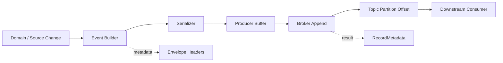
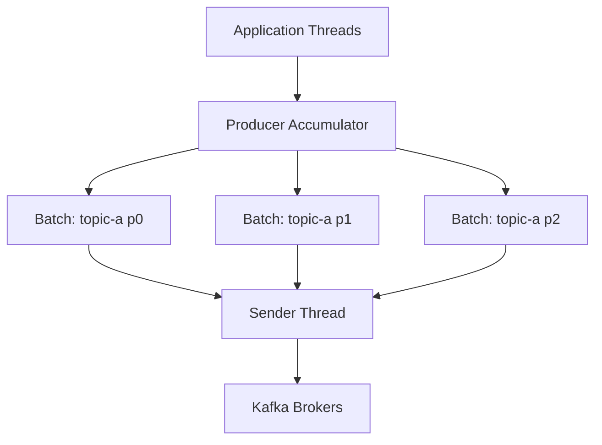
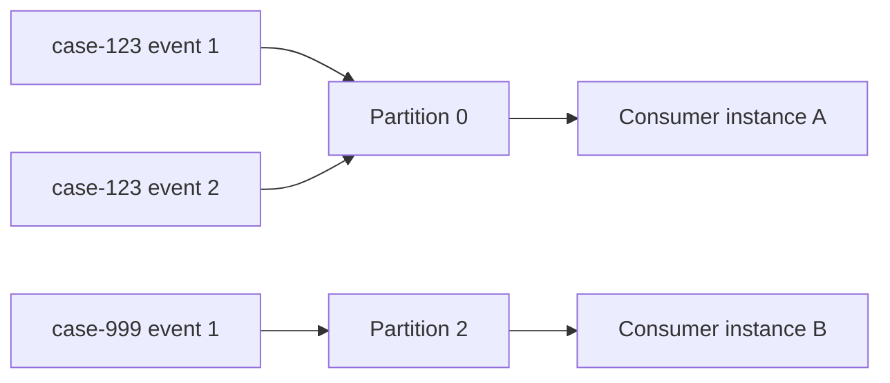

# Part 035 — Producer Patterns Java

Pada part sebelumnya kita melihat Kafka sebagai **pipeline log** dan topic sebagai **contract boundary**. Sekarang kita masuk ke sisi producer.

Kafka producer bukan sekadar kode ini:

```java
producer.send(new ProducerRecord<>(topic, key, value));
```

Di production, producer adalah komponen yang menentukan:

- apakah event hilang sebelum masuk log,
- apakah event bisa duplicate,
- apakah event masuk ke partition yang benar,
- apakah ordering masih bermakna,
- apakah payload punya metadata cukup untuk trace, replay, audit, dan debugging,
- apakah failure sebelum/ketika/selesai publish bisa dipahami,
- apakah pipeline bisa ditahan saat downstream/broker melambat.

Mental model pentingnya sederhana:

> Producer adalah **write path** ke distributed log. Salah mendesain write path berarti seluruh pipeline downstream hanya memperbesar kesalahan yang sudah terjadi di awal.

Kita tidak akan mengulang dasar Kafka. Fokus part ini adalah pattern implementasi Java yang layak dipakai untuk pipeline production-grade.

---

## 1. Producer boundary: apa yang sebenarnya sedang kita commit?

Sebelum bicara `acks`, `linger.ms`, `batch.size`, atau transaction, tentukan dulu: **apa makna publish sukses?**

Untuk pipeline, publish sukses biasanya berarti:

1. event sudah diterima broker,
2. event sudah masuk partition tertentu,
3. event punya offset tertentu,
4. event tidak boleh dianggap gagal hanya karena callback terlambat,
5. event bisa dihubungkan ke source position, schema version, trace, dan idempotency key.

Diagram write boundary:



Producer tidak boleh dianggap sebagai bagian kecil dari aplikasi. Ia adalah **commit boundary** antara dunia operasional dan dunia log.

Pertanyaan yang harus dijawab sebelum implementasi:

| Pertanyaan | Kenapa penting |
|---|---|
| Event merepresentasikan apa? | Fact, command, CDC row, snapshot, correction, atau derived output memiliki aturan berbeda. |
| Key-nya apa? | Key menentukan partition, ordering boundary, compaction semantics, dan hot partition risk. |
| Apa idempotency key-nya? | Dibutuhkan untuk dedupe downstream dan replay-safe sink. |
| Apa source position-nya? | Dibutuhkan untuk audit, reconciliation, dan replay. |
| Apakah publish satu event berdiri sendiri atau satu batch atomik? | Menentukan perlu tidaknya transaction. |
| Apakah producer berada di dalam DB transaction? | Jika iya, raw `send()` biasanya salah; gunakan outbox. |

---

## 2. Anti-pattern: producer sebagai fire-and-forget logger

Kode seperti ini terlihat cepat:

```java
producer.send(record);
```

Masalahnya: `send()` di Kafka producer bersifat asynchronous. Jika aplikasi mati setelah `send()` tapi sebelum callback/flush, belum tentu record benar-benar durable di broker. Fire-and-forget cocok untuk telemetry yang boleh hilang, bukan untuk pipeline yang membawa state bisnis, audit, enforcement lifecycle, invoice, fulfillment, entitlement, atau regulatory evidence.

Pattern minimal yang lebih aman:

```java
producer.send(record, (metadata, exception) -> {
    if (exception != null) {
        // report, retry decision, fail request, or route to outbox/error lane
    } else {
        // record publish metadata: topic, partition, offset, timestamp
    }
});
```

Tetapi callback saja belum cukup. Kita perlu desain publish outcome.

---

## 3. Publish outcome: jangan hanya sukses/gagal

Producer outcome di distributed system tidak selalu binary.

Kita butuh model seperti ini:

```java
public sealed interface PublishOutcome permits PublishOutcome.Acked,
        PublishOutcome.Failed,
        PublishOutcome.Unknown {

    record Acked(
            String topic,
            int partition,
            long offset,
            long timestamp
    ) implements PublishOutcome {}

    record Failed(
            String reason,
            Throwable cause,
            boolean retryable
    ) implements PublishOutcome {}

    record Unknown(
            String reason,
            Throwable cause
    ) implements PublishOutcome {}
}
```

Kenapa ada `Unknown`?

Karena dalam distributed write, producer bisa mengalami timeout atau network failure setelah broker sebenarnya menerima record. Dari sisi client, ia tidak selalu tahu apakah append berhasil. Inilah alasan idempotent producer, idempotency key, dan consumer-side dedupe tetap penting.

---

## 4. Producer configuration baseline

Konfigurasi bukan copy-paste. Tiap nilai merepresentasikan trade-off.

Baseline untuk event bisnis penting:

```java
Properties props = new Properties();
props.put(ProducerConfig.BOOTSTRAP_SERVERS_CONFIG, bootstrapServers);
props.put(ProducerConfig.KEY_SERIALIZER_CLASS_CONFIG, StringSerializer.class.getName());
props.put(ProducerConfig.VALUE_SERIALIZER_CLASS_CONFIG, ByteArraySerializer.class.getName());

// Durability / ordering / duplicate control
props.put(ProducerConfig.ACKS_CONFIG, "all");
props.put(ProducerConfig.ENABLE_IDEMPOTENCE_CONFIG, "true");
props.put(ProducerConfig.RETRIES_CONFIG, Integer.toString(Integer.MAX_VALUE));
props.put(ProducerConfig.MAX_IN_FLIGHT_REQUESTS_PER_CONNECTION, "5");

// Batching and latency
props.put(ProducerConfig.LINGER_MS_CONFIG, "5");
props.put(ProducerConfig.BATCH_SIZE_CONFIG, Integer.toString(64 * 1024));
props.put(ProducerConfig.COMPRESSION_TYPE_CONFIG, "zstd");

// Time boundaries
props.put(ProducerConfig.REQUEST_TIMEOUT_MS_CONFIG, "30000");
props.put(ProducerConfig.DELIVERY_TIMEOUT_MS_CONFIG, "120000");

// Memory/backpressure
props.put(ProducerConfig.BUFFER_MEMORY_CONFIG, Long.toString(64L * 1024 * 1024));
props.put(ProducerConfig.MAX_BLOCK_MS_CONFIG, "10000");

KafkaProducer<String, byte[]> producer = new KafkaProducer<>(props);
```

Makna utamanya:

| Config | Makna pipeline |
|---|---|
| `acks=all` | Leader menunggu acknowledgment dari in-sync replicas sesuai konfigurasi broker sebelum ack ke producer. Lebih kuat daripada `acks=1`. |
| `enable.idempotence=true` | Producer memakai sequence number untuk menghindari duplicate akibat retry pada session producer yang sama. |
| `retries` tinggi | Retry transient error tanpa langsung fail. Harus dibatasi oleh `delivery.timeout.ms`. |
| `max.in.flight.requests.per.connection` | Mengontrol jumlah request yang belum di-ack. Relevan untuk ordering saat retry. |
| `linger.ms` | Menunggu sebentar agar batch lebih penuh. Trade-off latency vs throughput. |
| `batch.size` | Upper bound ukuran batch per partition. |
| `compression.type` | Mengurangi network/storage cost, efektif bila batch cukup besar. |
| `delivery.timeout.ms` | Batas total waktu delivery sebelum send dianggap gagal. |
| `buffer.memory` | Memori client untuk menampung record sebelum dikirim. |
| `max.block.ms` | Berapa lama `send()` boleh block saat metadata/buffer tidak tersedia. |

Rule of thumb:

> Untuk event pipeline yang penting, mulai dari correctness-first: `acks=all`, idempotence enabled, explicit timeout, bounded buffer, observable callback. Optimasi throughput dilakukan setelah failure semantics jelas.

---

## 5. Batching: throughput bukan hanya `batch.size`

Kafka producer mengirim record dalam batch per partition. Jika record masuk cepat untuk partition yang sama, batch lebih penuh. Jika key menyebar ke banyak partition tapi rate rendah, batch kecil-kecil dan overhead naik.



Tuning batching harus melihat:

1. record size,
2. key distribution,
3. partition count,
4. compression ratio,
5. acceptable latency,
6. broker/network throughput,
7. producer CPU.

Common mistake:

```text
batch.size dinaikkan besar, tetapi linger.ms tetap kecil dan traffic per partition rendah.
```

Hasilnya batch tetap tidak penuh.

Decision table:

| Kondisi | Tuning awal |
|---|---|
| Latency sangat sensitif | `linger.ms` kecil, batch sedang, compression ringan. |
| Throughput besar | `linger.ms` 5–50ms, batch lebih besar, compression `lz4`/`zstd`. |
| Payload besar | Periksa `max.request.size`, broker `message.max.bytes`, dan downstream consumer limit. |
| Partition sangat banyak, rate per partition kecil | Evaluasi partition key; jangan sekadar menaikkan partition. |
| CPU producer tinggi | Cek serialization dan compression. |

---

## 6. Compression: bukan kosmetik

Compression terjadi pada batch. Karena itu compression efektif bila batch cukup besar. Untuk pipeline, compression memengaruhi:

- network cost,
- broker disk usage,
- replication cost,
- consumer decompression CPU,
- end-to-end latency.

Pilihan umum:

| Codec | Karakter |
|---|---|
| `none` | Debug mudah, cost tinggi. Jarang ideal untuk production high-volume. |
| `snappy` | Cepat, rasio sedang. |
| `lz4` | Cepat, sering bagus untuk low-latency pipeline. |
| `zstd` | Rasio bagus, CPU lebih tinggi; sering menarik untuk event besar/high-volume. |
| `gzip` | Rasio bagus tapi cenderung lebih mahal CPU/latency. |

Pipeline mindset:

> Compression bukan hanya producer concern. Ia memindahkan biaya antara network, broker storage, dan CPU producer/consumer.

---

## 7. Key design: producer menentukan ordering boundary

Kafka hanya memberi ordering per partition. Producer key menentukan partition. Jadi key adalah keputusan correctness, bukan sekadar field teknis.

Contoh:

| Use case | Key yang masuk akal | Alasan |
|---|---|---|
| Case lifecycle event | `caseId` | Semua event case masuk partition sama sehingga ordering per case terjaga. |
| Customer profile projection | `customerId` | Update profile per customer ordered. |
| Payment event | `paymentId` atau `accountId` | Tergantung invariant: order per payment atau per account? |
| Enforcement escalation | `caseId` atau `enforcementSubjectId` | Pilih sesuai invariant escalation. |
| CDC table event | primary key | Selaras dengan row state/compaction. |

Pertanyaan desain:

```text
Unit apa yang tidak boleh reorder?
```

Bukan:

```text
Field apa yang kebetulan tersedia?
```

Mermaid mental model:



Jika key salah, downstream tidak bisa memperbaiki ordering tanpa state dan buffering mahal.

---

## 8. Hot partition: correctness key vs scale key

Kadang key yang benar secara bisnis menyebabkan hot partition.

Contoh:

- satu tenant besar menghasilkan 70% traffic,
- satu `caseType` populer dipakai sebagai key,
- satu aggregate sangat aktif,
- null key membuat event round-robin dan menghancurkan ordering.

Solusi tidak selalu mengganti key. Pilihan:

| Strategi | Kapan dipakai | Risiko |
|---|---|---|
| Tetap key bisnis | Ordering mutlak penting | Throughput dibatasi hot key. |
| Composite key | Ordering bisa per sub-entity | Harus jelas invariant baru. |
| Sharded key | Perlu scale tinggi | Membutuhkan reassembly downstream. |
| Split topic | Domain/traffic berbeda | Menambah governance. |
| Command side aggregation | Hot aggregate diproses khusus | Kompleksitas naik. |

Jangan memilih random key untuk “mendistribusikan load” jika ordering per aggregate penting.

---

## 9. Header strategy: metadata jangan dicampur payload

Payload sebaiknya fokus pada domain event. Metadata operasional lebih baik diletakkan di header/envelope.

Header yang umum untuk pipeline:

| Header | Tujuan |
|---|---|
| `event-id` | Global event identity. |
| `idempotency-key` | Dedupe downstream/sink. |
| `schema-subject` | Schema lookup/debug. |
| `schema-version` | Human-readable schema version. |
| `producer-service` | Ownership/debug. |
| `producer-version` | Rollout/debug. |
| `traceparent` | Distributed tracing. |
| `correlation-id` | Request/workflow correlation. |
| `causation-id` | Event penyebab. |
| `source-system` | Audit lineage. |
| `source-position` | CDC/file/API cursor reference. |
| `tenant-id` | Multi-tenant routing/guard. |
| `privacy-classification` | PII/sensitive handling. |
| `processing-mode` | live/backfill/replay/correction. |

Java helper:

```java
public final class KafkaHeaders {
    private KafkaHeaders() {}

    public static Headers addString(Headers headers, String key, String value) {
        if (value != null) {
            headers.add(key, value.getBytes(StandardCharsets.UTF_8));
        }
        return headers;
    }
}
```

Membuat record:

```java
ProducerRecord<String, byte[]> record = new ProducerRecord<>(
        topic,
        null,                    // partition: usually let partitioner decide from key
        eventTime.toEpochMilli(), // Kafka record timestamp
        aggregateId,
        serializedPayload
);

KafkaHeaders.addString(record.headers(), "event-id", eventId);
KafkaHeaders.addString(record.headers(), "idempotency-key", idempotencyKey);
KafkaHeaders.addString(record.headers(), "traceparent", traceparent);
KafkaHeaders.addString(record.headers(), "source-system", "case-service");
KafkaHeaders.addString(record.headers(), "processing-mode", processingMode.name());
```

Rule:

> Metadata yang dibutuhkan untuk routing, observability, lineage, security, dan replay jangan dikubur di payload domain.

---

## 10. Timestamp strategy

Kafka record punya timestamp. Tetapi pipeline sering punya beberapa timestamp:

- event time,
- source commit time,
- ingestion time,
- producer send time,
- broker append time,
- business effective time.

Jangan mengandalkan satu timestamp untuk semua makna.

Pattern:

```java
record.headers().add("event-time", eventTime.toString().getBytes(UTF_8));
record.headers().add("source-commit-time", sourceCommitTime.toString().getBytes(UTF_8));
record.headers().add("business-effective-time", effectiveTime.toString().getBytes(UTF_8));
```

Kafka record timestamp bisa dipakai untuk event time jika producer memiliki event time yang valid. Tetapi untuk audit, simpan timestamp lain secara eksplisit.

---

## 11. Serializer boundary: generated class jangan bocor ke domain core

Producer biasanya menerima domain object, lalu mengubahnya menjadi wire payload. Jangan biarkan generated Avro/Protobuf class menjadi domain model internal.


Bad:

```java
public void approveCase(CaseApprovedAvro avro) { ... }
```

Better:

```java
public void publish(CaseApproved event) { ... }
```

Dengan boundary ini, schema evolution tidak langsung merusak domain core.

---

## 12. Producer abstraction untuk pipeline

Kita ingin producer yang:

- tidak mengekspos Kafka detail ke semua service,
- enforce header wajib,
- expose outcome,
- observable,
- bisa dites tanpa broker,
- punya lifecycle jelas.

Interface:

```java
public interface EventPublisher<E> extends AutoCloseable {
    CompletionStage<PublishOutcome> publish(E event);

    @Override
    void close();
}
```

Envelope:

```java
public record OutboundEvent<E>(
        String topic,
        String key,
        String eventId,
        String idempotencyKey,
        Instant eventTime,
        ProcessingMode processingMode,
        Map<String, String> headers,
        E payload
) {}
```

Serializer:

```java
public interface EventSerializer<E> {
    byte[] serialize(E payload) throws SerializationException;

    String schemaSubject(E payload);

    String schemaVersion(E payload);
}
```

Publisher implementation:

```java
public final class KafkaEventPublisher<E> implements EventPublisher<OutboundEvent<E>> {
    private final KafkaProducer<String, byte[]> producer;
    private final EventSerializer<E> serializer;
    private final String producerService;
    private final String producerVersion;

    public KafkaEventPublisher(
            KafkaProducer<String, byte[]> producer,
            EventSerializer<E> serializer,
            String producerService,
            String producerVersion
    ) {
        this.producer = Objects.requireNonNull(producer);
        this.serializer = Objects.requireNonNull(serializer);
        this.producerService = Objects.requireNonNull(producerService);
        this.producerVersion = Objects.requireNonNull(producerVersion);
    }

    @Override
    public CompletionStage<PublishOutcome> publish(OutboundEvent<E> event) {
        CompletableFuture<PublishOutcome> future = new CompletableFuture<>();

        byte[] value;
        try {
            value = serializer.serialize(event.payload());
        } catch (Exception e) {
            future.complete(new PublishOutcome.Failed(
                    "serialization_failed",
                    e,
                    false
            ));
            return future;
        }

        ProducerRecord<String, byte[]> record = new ProducerRecord<>(
                event.topic(),
                null,
                event.eventTime().toEpochMilli(),
                event.key(),
                value
        );

        addRequiredHeaders(record, event);

        producer.send(record, (metadata, exception) -> {
            if (exception != null) {
                future.complete(classifyFailure(exception));
                return;
            }
            future.complete(new PublishOutcome.Acked(
                    metadata.topic(),
                    metadata.partition(),
                    metadata.offset(),
                    metadata.timestamp()
            ));
        });

        return future;
    }

    private void addRequiredHeaders(ProducerRecord<String, byte[]> record, OutboundEvent<E> event) {
        KafkaHeaders.addString(record.headers(), "event-id", event.eventId());
        KafkaHeaders.addString(record.headers(), "idempotency-key", event.idempotencyKey());
        KafkaHeaders.addString(record.headers(), "event-time", event.eventTime().toString());
        KafkaHeaders.addString(record.headers(), "processing-mode", event.processingMode().name());
        KafkaHeaders.addString(record.headers(), "producer-service", producerService);
        KafkaHeaders.addString(record.headers(), "producer-version", producerVersion);
        KafkaHeaders.addString(record.headers(), "schema-subject", serializer.schemaSubject(event.payload()));
        KafkaHeaders.addString(record.headers(), "schema-version", serializer.schemaVersion(event.payload()));

        event.headers().forEach((k, v) -> KafkaHeaders.addString(record.headers(), k, v));
    }

    private PublishOutcome classifyFailure(Exception exception) {
        boolean retryable = exception instanceof org.apache.kafka.common.errors.RetriableException;
        return new PublishOutcome.Failed(
                exception.getClass().getSimpleName(),
                exception,
                retryable
        );
    }

    @Override
    public void close() {
        producer.close(Duration.ofSeconds(10));
    }
}
```

Catatan: retry internal Kafka producer sudah terjadi sebelum callback gagal. Callback failure berarti producer sudah melewati batas retry/delivery timeout atau error non-retryable.

---

## 13. Blocking publish vs asynchronous publish

Ada dua style.

### 13.1 Synchronous/blocking boundary

Dipakai saat request harus gagal jika event gagal dipublish.

```java
PublishOutcome outcome = publisher.publish(event)
        .toCompletableFuture()
        .get(5, TimeUnit.SECONDS);

if (outcome instanceof PublishOutcome.Failed failed) {
    throw new EventPublishException(failed.reason(), failed.cause());
}
```

Kelebihan:

- failure jelas ke caller,
- mudah dipahami,
- cocok untuk low/medium throughput.

Kekurangan:

- latency request naik,
- throughput terbatas,
- unknown outcome tetap mungkin.

### 13.2 Asynchronous publish

Dipakai saat producer pipeline high-throughput atau event berasal dari internal queue/outbox relay.

```java
publisher.publish(event)
        .whenComplete((outcome, throwable) -> {
            if (throwable != null) {
                // unexpected local failure
                return;
            }
            switch (outcome) {
                case PublishOutcome.Acked ack -> markPublished(event, ack);
                case PublishOutcome.Failed failed -> handleFailed(event, failed);
                case PublishOutcome.Unknown unknown -> handleUnknown(event, unknown);
            }
        });
```

Kelebihan:

- throughput lebih baik,
- cocok untuk relay.

Kekurangan:

- perlu in-flight tracking,
- shutdown lebih rumit,
- callback failure handling wajib benar.

---

## 14. In-flight limiter: cegah producer membanjiri memori

Kafka producer punya buffer internal, tetapi aplikasi tetap perlu batas in-flight agar tidak membangun tekanan tak terkendali.

```java
public final class BoundedPublisher<E> implements EventPublisher<E> {
    private final EventPublisher<E> delegate;
    private final Semaphore inFlight;
    private final Duration acquireTimeout;

    public BoundedPublisher(EventPublisher<E> delegate, int maxInFlight, Duration acquireTimeout) {
        this.delegate = delegate;
        this.inFlight = new Semaphore(maxInFlight);
        this.acquireTimeout = acquireTimeout;
    }

    @Override
    public CompletionStage<PublishOutcome> publish(E event) {
        boolean acquired;
        try {
            acquired = inFlight.tryAcquire(acquireTimeout.toMillis(), TimeUnit.MILLISECONDS);
        } catch (InterruptedException e) {
            Thread.currentThread().interrupt();
            return CompletableFuture.completedFuture(new PublishOutcome.Failed(
                    "interrupted_waiting_for_inflight_slot",
                    e,
                    true
            ));
        }

        if (!acquired) {
            return CompletableFuture.completedFuture(new PublishOutcome.Failed(
                    "producer_inflight_limit_exceeded",
                    null,
                    true
            ));
        }

        return delegate.publish(event)
                .whenComplete((ignored, throwable) -> inFlight.release());
    }

    @Override
    public void close() {
        delegate.close();
    }
}
```

Ini adalah backpressure di boundary aplikasi, bukan hanya berharap `buffer.memory` menyelamatkan sistem.

---

## 15. Flush: kapan dipakai dan kapan berbahaya

`producer.flush()` menunggu record yang sudah dikirim/di-buffer selesai diproses.

Gunakan flush:

- saat graceful shutdown,
- di batch job sebelum proses selesai,
- di test untuk deterministic assertion,
- setelah mengirim batch kecil yang harus selesai sebelum step berikutnya.

Jangan flush per record:

```java
producer.send(record);
producer.flush(); // anti-pattern untuk high-throughput
```

Ini menghancurkan batching dan throughput.

Pattern shutdown:

```java
public void stop() {
    acceptingNewEvents.set(false);
    producer.flush();
    producer.close(Duration.ofSeconds(30));
}
```

---

## 16. Transactions: atomic publish ke beberapa partition/topic

Kafka transaction berguna saat producer perlu menulis beberapa record ke Kafka secara atomic sehingga consumer dengan isolation level yang sesuai hanya membaca committed transaction.

Contoh use case:

- hasil transform dari satu input menghasilkan beberapa output topic,
- Kafka Streams/processor menulis output dan commit consumer offset dalam transaksi,
- publish batch hasil reprocessing yang harus terlihat atomik.

Konfigurasi:

```java
props.put(ProducerConfig.TRANSACTIONAL_ID_CONFIG, "case-projection-writer-" + instanceId);
props.put(ProducerConfig.ENABLE_IDEMPOTENCE_CONFIG, "true");
props.put(ProducerConfig.ACKS_CONFIG, "all");
```

Pattern:

```java
producer.initTransactions();

try {
    producer.beginTransaction();

    producer.send(recordA).get();
    producer.send(recordB).get();

    producer.commitTransaction();
} catch (ProducerFencedException e) {
    // Another producer with the same transactional.id is active.
    producer.close();
    throw e;
} catch (Exception e) {
    producer.abortTransaction();
    throw e;
}
```

Important boundary:

> Kafka transaction tidak membuat update database dan publish Kafka menjadi satu transaksi atomik. Untuk DB + Kafka dual-write, gunakan transactional outbox.

---

## 17. Transactional ID: jangan statis untuk semua instance

`transactional.id` harus stabil untuk logical producer instance, tetapi tidak boleh dipakai bersamaan oleh dua instance aktif. Jika dua producer memakai transactional ID sama, fencing dapat terjadi.

Pattern:

| Deployment | Transactional ID strategy |
|---|---|
| Single fixed worker | `pipeline-name-worker-0` |
| Partition-assigned workers | `pipeline-name-partition-<n>` |
| Stateful pod with stable identity | `pipeline-name-${statefulSetOrdinal}` |
| Stateless autoscaling | Hindari transaksi manual kecuali ada assignment/fencing strategy jelas. |

Transactional producer adalah stateful resource. Treat it as such.

---

## 18. Outbox relay producer pattern

Dalam aplikasi bisnis, producer sering tidak boleh publish langsung dari request transaction.

Bad dual-write:

```java
@Transactional
public void approveCase(String caseId) {
    caseRepository.markApproved(caseId);
    kafkaPublisher.publish(new CaseApproved(caseId)); // not atomic with DB
}
```

Better outbox:

```java
@Transactional
public void approveCase(String caseId) {
    caseRepository.markApproved(caseId);
    outboxRepository.insert(new OutboxEvent(
            eventId,
            "case.lifecycle.v1",
            caseId,
            "CaseApproved",
            payload,
            Instant.now()
    ));
}
```

Lalu relay/CDC mempublish outbox ke Kafka.

Outbox relay producer harus:

- preserve event ID,
- use aggregate ID as key,
- publish deterministically,
- mark sent hanya setelah ack,
- handle unknown outcome via idempotency key,
- support retry without mutation of payload.

---

## 19. Producer observability

Producer harus memancarkan metrics yang bisa menjawab:

- apakah producer sedang tertahan?
- apakah batch efektif?
- apakah broker melambat?
- apakah serialization gagal?
- topic mana yang error?
- partition mana yang hot?
- berapa publish latency?
- berapa in-flight record?
- berapa outcome unknown?

Metrics aplikasi:

| Metric | Tipe | Makna |
|---|---|---|
| `producer.publish.attempts` | counter | Semua publish attempt. |
| `producer.publish.acked` | counter | Publish sukses. |
| `producer.publish.failed` | counter | Publish gagal. |
| `producer.publish.unknown` | counter | Outcome tidak diketahui. |
| `producer.publish.latency` | histogram | Waktu dari attempt sampai callback. |
| `producer.serialization.failed` | counter | Payload gagal diserialize. |
| `producer.inflight` | gauge | Jumlah record belum selesai. |
| `producer.backpressure.rejected` | counter | Ditolak karena limit. |

Log structured minimal saat failure:

```json
{
  "event": "kafka_publish_failed",
  "topic": "case.lifecycle.v1",
  "key": "case-123",
  "eventId": "01J...",
  "idempotencyKey": "case-123:7",
  "producerService": "case-service",
  "exceptionType": "TimeoutException",
  "retryable": true
}
```

Jangan log payload penuh jika mengandung PII/sensitive data.

---

## 20. Producer error taxonomy

Tidak semua error harus ditangani sama.

| Error class | Contoh | Action |
|---|---|---|
| Serialization error | field invalid, schema mismatch | fail fast/quarantine; retry biasanya tidak membantu. |
| Authorization error | no ACL | fail, alert, no retry storm. |
| Unknown topic | typo/topic belum dibuat | fail deployment/config, alert. |
| Timeout | broker/network slow | retry/unknown handling. |
| Record too large | payload melebihi limit | fail/quarantine; redesign payload. |
| Producer fenced | transactional ID conflict | stop instance; investigate deployment. |
| Buffer exhausted | downstream/broker slow | backpressure, shed, retry later. |

Pattern classify:

```java
boolean retryable = exception instanceof RetriableException;
boolean fatal = exception instanceof AuthorizationException
        || exception instanceof SerializationException
        || exception instanceof ProducerFencedException;
```

Retry semua error secara buta adalah cara cepat membuat outage lebih besar.

---

## 21. Payload size: jangan jadikan Kafka object store

Producer harus menolak payload yang terlalu besar sebelum broker menolak.

Rule:

- Kafka event membawa fact/reference, bukan file besar.
- Large blob simpan di object storage, event membawa URI + checksum + metadata.
- Ukuran record harus dimonitor per topic/event type.

Pattern:

```java
if (serializedPayload.length > maxPayloadBytes) {
    throw new PayloadTooLargeException(event.eventId(), serializedPayload.length, maxPayloadBytes);
}
```

Event dengan payload besar memperburuk:

- producer memory,
- broker page cache,
- replication,
- consumer memory,
- retry latency,
- DLQ handling.

---

## 22. Partition-aware callback logging

Saat publish sukses, simpan metadata topic-partition-offset untuk audit.

```java
producer.send(record, (metadata, exception) -> {
    if (exception == null) {
        audit.logPublished(
                eventId,
                metadata.topic(),
                metadata.partition(),
                metadata.offset(),
                metadata.timestamp()
        );
    }
});
```

Untuk outbox relay, metadata ini bisa disimpan di kolom:

```sql
published_topic
published_partition
published_offset
published_at
publish_attempt_count
last_publish_error
```

Ini mempercepat incident investigation.

---

## 23. Backfill/replay producer mode

Backfill producer berbeda dari live producer.

Header wajib:

```text
processing-mode: BACKFILL
backfill-job-id: bf-2026-07-case-history
source-snapshot-id: snapshot-2026-07-04
transform-version: case-canonicalizer@2.3.0
```

Backfill risk:

- membanjiri topic live,
- memicu consumer side effects ulang,
- mengacaukan freshness metric,
- menyebabkan duplicate jika idempotency key tidak stabil,
- memunculkan event-time lama dalam stream live.

Pattern:

| Strategi | Kapan dipakai |
|---|---|
| Same topic + processing-mode header | Consumer sudah replay-aware dan idempotent. |
| Dedicated backfill topic | Perlu isolasi load dan consumer opt-in. |
| Shadow topic | Untuk diff sebelum cutover. |
| Rate-limited producer | Mencegah broker/consumer overload. |

---

## 24. Multi-tenant producer guard

Pada pipeline multi-tenant, producer harus mencegah data tenant A masuk ke topic/key/header tenant B.

Guard:

```java
public record TenantScopedEvent<E>(
        TenantId tenantId,
        OutboundEvent<E> event
) {}

public void validateTenant(TenantScopedEvent<?> event) {
    String headerTenant = event.event().headers().get("tenant-id");
    if (!event.tenantId().value().equals(headerTenant)) {
        throw new TenantMismatchException(event.tenantId().value(), headerTenant);
    }
}
```

Topic strategy:

| Strategy | Kelebihan | Kekurangan |
|---|---|---|
| Shared topic + tenant header | Topic count rendah | ACL/isolation lebih sulit. |
| Per-tenant topic | Isolasi kuat | Topic explosion. |
| Per-tier topic | Balance | Routing lebih kompleks. |

Producer harus mengikuti platform policy, bukan menentukan sendiri.

---

## 25. Security and privacy guard

Producer adalah titik terbaik untuk menolak sensitive data yang tidak boleh keluar.

Pattern:

```java
public interface PrivacyPolicy<E> {
    void validate(E event, Map<String, String> headers);
}
```

Validation examples:

- PII field harus masked/tokenized sebelum publish ke topic non-sensitive.
- `privacy-classification` wajib ada.
- tenant ID wajib ada.
- payload tidak boleh berisi secret/token.
- event untuk audit topic harus immutable dan append-only.

Jangan berharap consumer downstream selalu menyaring data sensitif. Producer adalah first enforcement point.

---

## 26. Testing producer pattern

Producer test tidak boleh hanya “send tidak throw”.

Test matrix:

| Test | Yang dibuktikan |
|---|---|
| Serialization test | Domain event menjadi wire payload valid. |
| Header test | Required headers selalu ada. |
| Key test | Aggregate/event tertentu menghasilkan key benar. |
| Idempotency test | Event sama menghasilkan idempotency key sama. |
| Payload size test | Event besar ditolak sebelum publish. |
| Callback success test | Metadata diubah menjadi `Acked`. |
| Callback failure test | Exception diklasifikasi benar. |
| In-flight limit test | Backpressure bekerja. |
| Transaction test | Commit/abort/fencing path benar. |
| Contract test | Schema compatible dengan registry/test fixture. |

Contoh unit test untuk header:

```java
@Test
void shouldAddRequiredHeaders() {
    var event = sampleOutboundEvent();
    var record = recordFactory.toRecord(event);

    assertHeader(record, "event-id", event.eventId());
    assertHeader(record, "idempotency-key", event.idempotencyKey());
    assertHeader(record, "processing-mode", event.processingMode().name());
    assertHeader(record, "producer-service", "case-service");
}
```

---

## 27. Production producer checklist

Sebelum producer masuk production, jawab ini:

### Correctness

- [ ] Apakah event merepresentasikan fact/command/snapshot/correction dengan jelas?
- [ ] Apakah key sesuai ordering invariant?
- [ ] Apakah idempotency key stabil?
- [ ] Apakah event ID unique dan traceable?
- [ ] Apakah source position disimpan bila event berasal dari source eksternal?
- [ ] Apakah timestamp semantics eksplisit?

### Reliability

- [ ] `acks=all` dipakai untuk event penting?
- [ ] idempotence enabled?
- [ ] retry dan delivery timeout eksplisit?
- [ ] buffer/in-flight dibatasi?
- [ ] callback failure ditangani?
- [ ] graceful shutdown flush/close benar?

### Schema/contract

- [ ] Schema version jelas?
- [ ] Compatibility test berjalan di CI?
- [ ] Payload tidak memakai generated schema class sebagai domain core?
- [ ] Required fields tervalidasi sebelum publish?

### Security/governance

- [ ] Tenant guard ada?
- [ ] Privacy classification ada?
- [ ] Sensitive field policy ditegakkan?
- [ ] Topic ownership jelas?

### Operations

- [ ] Metrics publish attempt/acked/failed/latency ada?
- [ ] Log tidak membocorkan PII?
- [ ] Topic/partition/offset bisa diaudit?
- [ ] Backfill mode dibedakan dari live mode?

---

## 28. Mental model akhir

Kafka producer production-grade bukan API wrapper. Ia adalah kombinasi dari:

1. **semantic event builder**,
2. **contract enforcer**,
3. **partitioning decision point**,
4. **serialization boundary**,
5. **backpressure boundary**,
6. **reliability boundary**,
7. **audit evidence generator**.

Kalimat paling penting:

> Producer yang baik tidak hanya berhasil mengirim event. Producer yang baik membuat event downstream bisa dipercaya saat sistem gagal, lambat, di-replay, di-backfill, dan diaudit.

Pada part berikutnya kita masuk ke sisi consumer: poll loop, commit strategy, rebalance, pause/resume, asynchronous processing, dan bagaimana menghindari data loss/duplicate yang tidak disengaja.

---

## References

- Apache Kafka Documentation — Producer Configs: https://kafka.apache.org/41/configuration/producer-configs/
- Apache Kafka Documentation — Design and Concepts: https://kafka.apache.org/documentation/
- Apache Kafka JavaDoc — KafkaProducer: https://kafka.apache.org/javadoc/
- Confluent Documentation — Producer Configuration Reference: https://docs.confluent.io/platform/current/installation/configuration/producer-configs.html
- Confluent Documentation — Transactions and Exactly Once Semantics: https://docs.confluent.io/platform/current/installation/configuration/producer-configs.html
