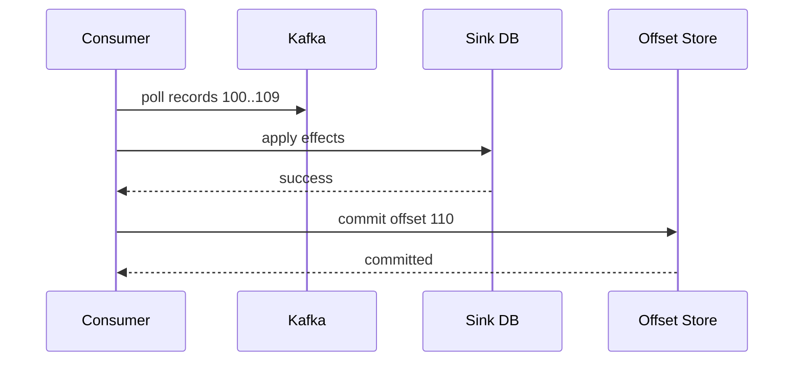
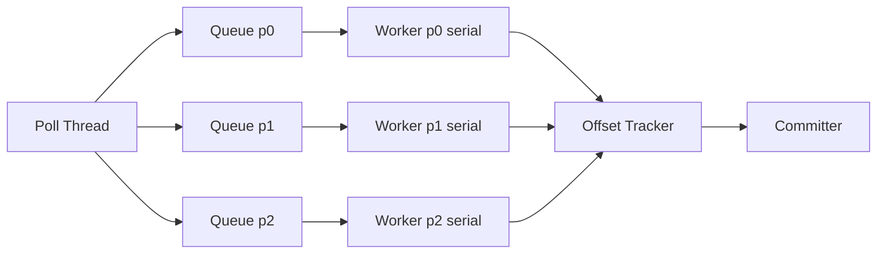
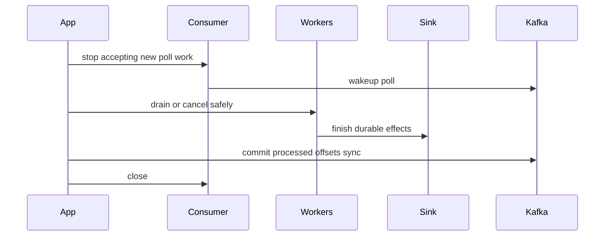
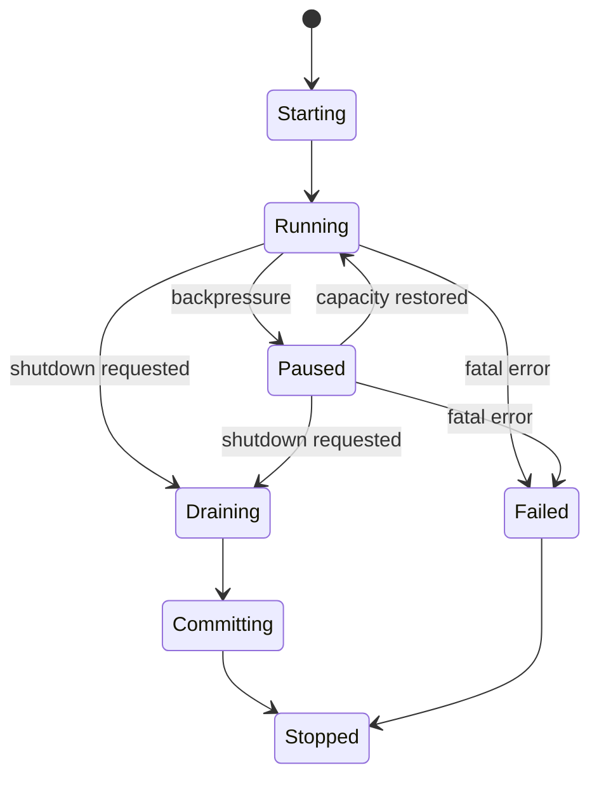

# Part 036 — Consumer Patterns Java

Jika producer adalah write path ke log, consumer adalah **effect path** dari log ke dunia lain.

Consumer membaca event dari Kafka, lalu biasanya melakukan salah satu dari ini:

- update database projection,
- call external API,
- write ke search index,
- write ke object storage/lakehouse,
- emit derived event,
- trigger workflow,
- update cache,
- validate data quality,
- produce alert.

Masalahnya: membaca event itu mudah; menentukan kapan event **boleh dianggap selesai** itu sulit.

Kafka consumer production-grade bukan hanya:

```java
while (true) {
    ConsumerRecords<String, byte[]> records = consumer.poll(Duration.ofMillis(100));
    for (ConsumerRecord<String, byte[]> record : records) {
        process(record);
    }
}
```

Pertanyaan sebenarnya:

1. Kapan offset boleh di-commit?
2. Apa yang terjadi jika process sukses tapi commit gagal?
3. Apa yang terjadi jika commit sukses tapi process belum selesai?
4. Bagaimana menangani rebalance di tengah batch?
5. Bagaimana mencegah partition satu lambat memblokir semua partition?
6. Bagaimana consumer tetap poll agar tidak dianggap mati?
7. Bagaimana retry tanpa menghentikan seluruh stream?
8. Bagaimana menjamin sink idempotent saat event diulang?

Part ini membangun mental model dan pattern implementasi Java untuk menjawabnya.

---

## 1. Consumer boundary: read position vs effect state

Kafka consumer punya konsep posisi:

- **position**: offset berikutnya yang akan dibaca consumer saat runtime,
- **committed offset**: offset yang disimpan agar consumer group bisa recover setelah restart/rebalance.

Tetapi pipeline juga punya effect state:

- row sudah di-upsert ke DB,
- file sudah ditulis,
- API sudah dipanggil,
- derived event sudah dipublish,
- quality violation sudah dicatat,
- alert sudah dibuat.

Jangan samakan offset commit dengan effect selesai kecuali boundary-nya benar.



Invariant aman:

> Offset hanya boleh di-commit setelah effect yang terkait record tersebut durable atau aman untuk diulang.

---

## 2. Delivery semantics dari sisi consumer

Consumer menentukan delivery semantics melalui urutan:

```text
read -> process -> commit
```

### 2.1 At-most-once

```text
read -> commit -> process
```

Jika crash setelah commit tapi sebelum process, data hilang.

Cocok untuk:

- telemetry non-critical,
- metrics best-effort,
- log sampling.

Tidak cocok untuk pipeline bisnis.

### 2.2 At-least-once

```text
read -> process -> commit
```

Jika crash setelah process tapi sebelum commit, record diproses ulang.

Cocok bila sink idempotent.

### 2.3 Effectively-once

```text
read -> process idempotently -> commit
```

Ini pola paling umum untuk pipeline Java production-grade.

Consumer boleh menerima duplicate, tetapi effect akhir tidak duplicate karena sink memakai:

- idempotency key,
- natural key upsert,
- inbox table,
- unique constraint,
- compare-and-swap version,
- contribution ledger.

---

## 3. Disable auto commit untuk pipeline penting

Auto commit bisa meng-commit offset berdasarkan waktu, bukan berdasarkan effect selesai.

Baseline:

```java
props.put(ConsumerConfig.ENABLE_AUTO_COMMIT_CONFIG, "false");
```

Kenapa?

Karena pipeline perlu mengontrol kapan record dianggap consumed.

Auto commit bisa aman hanya jika:

- processing sangat ringan,
- loss acceptable,
- effect idempotent dan commit timing tidak kritis,
- atau consumer dipakai untuk use case non-critical.

Untuk pipeline yang memindahkan state bisnis, gunakan manual commit.

---

## 4. Poll loop minimal yang benar

Versi awal:

```java
while (running.get()) {
    ConsumerRecords<String, byte[]> records = consumer.poll(Duration.ofMillis(500));

    for (ConsumerRecord<String, byte[]> record : records) {
        process(record);
    }

    consumer.commitSync();
}
```

Ini lebih aman daripada auto commit, tetapi belum cukup. Masalah:

- satu record lambat menahan semua partition,
- poison record bisa memblokir loop selamanya,
- process lama bisa melewati `max.poll.interval.ms`,
- rebalance bisa terjadi sebelum commit,
- commit semua offset batch meski sebagian record gagal berbahaya,
- tidak ada graceful shutdown per partition.

Kita perlu desain yang lebih eksplisit.

---

## 5. Consumer record envelope

Jangan lempar `ConsumerRecord` mentah ke semua business code. Buat envelope pipeline.

```java
public record KafkaInboundRecord<K, V>(
        String topic,
        int partition,
        long offset,
        K key,
        V value,
        Instant kafkaTimestamp,
        Map<String, String> headers
) {
    public TopicPartition topicPartition() {
        return new TopicPartition(topic, partition);
    }

    public OffsetAndMetadata nextOffset() {
        return new OffsetAndMetadata(offset + 1);
    }
}
```

Mapper:

```java
public final class KafkaRecordMapper {
    public static KafkaInboundRecord<String, byte[]> map(ConsumerRecord<String, byte[]> record) {
        return new KafkaInboundRecord<>(
                record.topic(),
                record.partition(),
                record.offset(),
                record.key(),
                record.value(),
                Instant.ofEpochMilli(record.timestamp()),
                headersToMap(record.headers())
        );
    }

    private static Map<String, String> headersToMap(Headers headers) {
        Map<String, String> result = new HashMap<>();
        headers.forEach(header -> result.put(
                header.key(),
                new String(header.value(), StandardCharsets.UTF_8)
        ));
        return Map.copyOf(result);
    }
}
```

Dengan envelope, business processor tidak tergantung penuh pada Kafka API.

---

## 6. Commit per partition, bukan mental model global

Offset commit di Kafka dilakukan per topic-partition.

Jika batch berisi:

```text
p0: offsets 10, 11, 12
p1: offsets 50, 51
```

Maka commit aman bisa berbeda:

```text
p0 -> commit 13
p1 -> commit 52
```

Consumer harus melacak offset terakhir yang selesai per partition.

```java
Map<TopicPartition, OffsetAndMetadata> offsetsToCommit = new HashMap<>();

for (ConsumerRecord<String, byte[]> record : records) {
    process(record);
    offsetsToCommit.put(
            new TopicPartition(record.topic(), record.partition()),
            new OffsetAndMetadata(record.offset() + 1)
    );
}

consumer.commitSync(offsetsToCommit);
```

Commit offset `N` berarti: record sebelum `N` sudah dianggap selesai. Karena itu setelah memproses offset `12`, commit `13`.

---

## 7. Commit sync vs async

### 7.1 `commitSync`

Kelebihan:

- caller tahu commit berhasil/gagal,
- cocok untuk shutdown/rebalance boundary,
- lebih mudah reasoning.

Kekurangan:

- blocking,
- throughput lebih rendah.

### 7.2 `commitAsync`

Kelebihan:

- tidak block poll loop,
- throughput lebih baik.

Kekurangan:

- callback bisa datang out-of-order,
- retry manual bisa berbahaya jika commit offset lama setelah offset baru,
- perlu generation/sequence guard.

Pattern umum:

- gunakan `commitAsync` saat normal processing,
- gunakan `commitSync` saat shutdown/rebalance.

```java
consumer.commitAsync(offsets, (committedOffsets, exception) -> {
    if (exception != null) {
        log.warn("async commit failed offsets={}", committedOffsets, exception);
    }
});
```

Saat close:

```java
try {
    consumer.commitSync(latestProcessedOffsets);
} finally {
    consumer.close();
}
```

---

## 8. Rebalance: saat partition berpindah tangan

Consumer group memungkinkan beberapa instance berbagi partition. Saat instance join/leave, Kafka melakukan rebalance.

Failure point:

```text
Consumer A memproses p0 offset 100..110
Rebalance terjadi
p0 pindah ke Consumer B
Consumer A belum commit
Consumer B membaca ulang dari offset lama
```

Jika sink idempotent, aman. Jika tidak, duplicate effect.

Gunakan `ConsumerRebalanceListener`.

```java
consumer.subscribe(List.of(topic), new ConsumerRebalanceListener() {
    @Override
    public void onPartitionsRevoked(Collection<TopicPartition> partitions) {
        // Stop accepting new work for revoked partitions.
        // Wait or cancel in-flight work according to policy.
        // Commit offsets that are safely processed.
        consumer.commitSync(offsetTracker.committableOffsetsFor(partitions));
    }

    @Override
    public void onPartitionsAssigned(Collection<TopicPartition> partitions) {
        // Initialize state, seek if needed, warm caches, reset trackers.
        offsetTracker.onAssigned(partitions);
    }
});
```

Rule:

> Saat partition revoked, jangan commit offset untuk record yang effect-nya belum durable.

---

## 9. Processing lama dan `max.poll.interval.ms`

Kafka consumer group mengharuskan consumer tetap melakukan `poll()`. Jika processing batch terlalu lama dan consumer tidak poll sebelum `max.poll.interval.ms`, consumer bisa dianggap gagal dan group rebalance.

Solusi:

1. batasi ukuran batch (`max.poll.records`),
2. proses cepat di poll thread,
3. pakai worker pool dengan pause/resume,
4. naikkan `max.poll.interval.ms` bila processing memang lama,
5. pisahkan long-running workflow ke Temporal/job system,
6. jangan melakukan blocking external call tak terbatas di poll thread.

Baseline:

```java
props.put(ConsumerConfig.MAX_POLL_RECORDS_CONFIG, "500");
props.put(ConsumerConfig.MAX_POLL_INTERVAL_MS_CONFIG, "300000");
props.put(ConsumerConfig.SESSION_TIMEOUT_MS_CONFIG, "45000");
props.put(ConsumerConfig.HEARTBEAT_INTERVAL_MS_CONFIG, "15000");
```

Nilai harus dipilih berdasarkan processing time nyata, bukan copy-paste.

---

## 10. Pause/resume untuk backpressure

Kafka consumer menyediakan `pause()` dan `resume()` untuk partition. Ini berguna saat worker queue penuh atau sink lambat.

```java
if (workQueue.remainingCapacity() == 0) {
    consumer.pause(consumer.assignment());
}

if (workQueue.remainingCapacity() > resumeThreshold) {
    consumer.resume(consumer.assignment());
}
```

Tetapi tetap harus poll:

```java
while (running.get()) {
    ConsumerRecords<String, byte[]> records = consumer.poll(Duration.ofMillis(200));
    dispatch(records);
    maybePauseOrResume();
    maybeCommit();
}
```

`pause()` menghentikan fetch record baru dari partition yang dipause, tetapi `poll()` tetap diperlukan untuk heartbeat dan group management.

---

## 11. Partition-aware worker model

Naif:

```java
for (ConsumerRecord<String, byte[]> record : records) {
    executor.submit(() -> process(record));
}
```

Masalah: offset dalam partition bisa selesai out-of-order.

Jika offset 11 selesai sebelum offset 10, kita tidak boleh commit 12 sebelum 10 selesai.

Pattern aman: worker serial per partition.



Satu partition diproses serial, antar partition bisa paralel.

---

## 12. Offset tracker untuk async processing

Kita perlu tahu offset tertinggi yang sudah selesai **secara contiguous** per partition.

Jika selesai:

```text
offset 10 done
offset 11 processing
offset 12 done
```

Committable offset masih `11`, bukan `13`.

Implementasi sederhana:

```java
public final class PartitionOffsetTracker {
    private long nextExpectedOffset;
    private final NavigableSet<Long> completedOffsets = new TreeSet<>();

    public PartitionOffsetTracker(long startingOffset) {
        this.nextExpectedOffset = startingOffset;
    }

    public synchronized void markCompleted(long offset) {
        completedOffsets.add(offset);
        while (completedOffsets.remove(nextExpectedOffset)) {
            nextExpectedOffset++;
        }
    }

    public synchronized OffsetAndMetadata committableOffset() {
        return new OffsetAndMetadata(nextExpectedOffset);
    }
}
```

Untuk production, tambahkan:

- partition assignment reset,
- revoked partition close,
- failed offset tracking,
- max gap detection,
- stuck offset metric,
- memory bound.

---

## 13. Idempotent sink: consumer wajib mengasumsikan duplicate

Consumer harus menganggap record bisa muncul lebih dari sekali.

Penyebab:

- crash setelah sink success sebelum commit,
- rebalance sebelum commit,
- manual replay,
- producer retry unknown outcome,
- backfill ke topic sama,
- operator reset offset.

Pattern DB sink:

```sql
CREATE TABLE processed_event (
    consumer_name text NOT NULL,
    event_id text NOT NULL,
    processed_at timestamptz NOT NULL DEFAULT now(),
    source_topic text NOT NULL,
    source_partition int NOT NULL,
    source_offset bigint NOT NULL,
    PRIMARY KEY (consumer_name, event_id)
);
```

Transactional consume effect:

```java
@Transactional
public ProcessingResult handle(KafkaInboundRecord<String, byte[]> record) {
    String eventId = requiredHeader(record, "event-id");

    boolean inserted = processedEventRepository.tryInsert(
            consumerName,
            eventId,
            record.topic(),
            record.partition(),
            record.offset()
    );

    if (!inserted) {
        return ProcessingResult.duplicate();
    }

    DomainEvent event = decoder.decode(record.value(), record.headers());
    projectionRepository.apply(event);

    return ProcessingResult.applied();
}
```

Jika transaksi DB rollback, `processed_event` juga rollback. Record akan diproses ulang.

---

## 14. Poison record: jangan biarkan satu record membunuh partition selamanya

Poison record adalah record yang selalu gagal diproses meskipun retry.

Contoh:

- payload tidak bisa didecode,
- required header hilang,
- schema incompatible,
- semantic validation gagal,
- referensi data tidak valid permanen,
- bug transform tertentu.

Policy:

| Error | Retry? | Action |
|---|---:|---|
| transient DB timeout | Ya | retry with backoff. |
| HTTP 503 | Ya | retry/circuit breaker. |
| invalid schema | Tidak | DLQ/quarantine. |
| missing required header | Tidak | DLQ/quarantine. |
| unknown reference | Tergantung | retry jika reference mungkin terlambat; quarantine jika invalid. |
| bug code | Tidak terus-menerus | stop/alert atau DLQ berdasarkan criticality. |

Consumer tidak boleh commit offset poison record kecuali record sudah dipindahkan ke durable error lane atau policy eksplisit menyatakan skip boleh dilakukan.

---

## 15. DLQ publishing from consumer

DLQ bukan tempat sampah. DLQ adalah error lane yang harus cukup informatif untuk replay.

DLQ payload minimal:

```java
public record DlqRecord(
        String originalTopic,
        int originalPartition,
        long originalOffset,
        String originalKey,
        Map<String, String> originalHeaders,
        byte[] originalPayload,
        String errorType,
        String errorMessage,
        boolean retryable,
        String consumerName,
        String consumerVersion,
        Instant failedAt
) {}
```

Pattern:

```java
try {
    process(record);
    markOffsetDone(record);
} catch (NonRetryableProcessingException e) {
    dlqPublisher.publish(toDlq(record, e)).toCompletableFuture().get(10, TimeUnit.SECONDS);
    markOffsetDone(record); // safe only after DLQ durable
} catch (RetryableProcessingException e) {
    retryLater(record, e);
}
```

Invariant:

> Commit setelah DLQ hanya aman jika DLQ publish durable dan DLQ itself menjadi recovery path resmi.

---

## 16. Retry strategy: inline, delayed topic, atau external scheduler?

### 16.1 Inline retry

Cocok untuk transient pendek.

```java
retryTemplate.execute(() -> process(record));
```

Risiko: poll loop tertahan.

### 16.2 Delayed retry topic

Record gagal dikirim ke retry topic dengan header attempt dan due time.

```text
main topic -> consumer -> retry-5m topic -> retry consumer -> main processor
```

Cocok untuk retry menit/jam.

### 16.3 External scheduler/workflow

Cocok untuk long-running effect atau external dependency yang tidak stabil.

Contoh: call regulator API yang boleh retry selama 3 hari. Jangan tahan Kafka partition selama 3 hari; gunakan workflow engine atau job table.

---

## 17. Consumer transaction: consume-transform-produce

Jika consumer membaca Kafka lalu menulis kembali ke Kafka, Kafka transaction bisa mengikat output records dan offset commit dalam satu transaksi.

Pattern konseptual:

```java
producer.beginTransaction();

ConsumerRecords<String, byte[]> records = consumer.poll(Duration.ofMillis(500));
for (ConsumerRecord<String, byte[]> record : records) {
    ProducerRecord<String, byte[]> output = transform(record);
    producer.send(output);
}

producer.sendOffsetsToTransaction(offsetsToCommit, consumer.groupMetadata());
producer.commitTransaction();
```

Ini berguna untuk Kafka-to-Kafka pipeline.

Tetapi jika consumer juga menulis ke external DB, Kafka transaction tidak membuat DB effect ikut atomic. Untuk DB sink, tetap butuh idempotent sink/inbox/transactional table.

---

## 18. `read_committed` isolation

Jika upstream memakai Kafka transactions, consumer bisa memakai:

```java
props.put(ConsumerConfig.ISOLATION_LEVEL_CONFIG, "read_committed");
```

Dengan `read_committed`, consumer tidak membaca record dari transaksi yang aborted. Ini penting untuk pipeline yang bergantung pada output transactional producer.

Trade-off:

- latency bisa naik karena consumer menunggu transaction completion,
- hanya relevan jika producer menggunakan transaction,
- tidak menggantikan idempotent sink untuk external side effect.

---

## 19. Seek and replay

Consumer bisa `seek()` ke offset tertentu. Ini berguna untuk:

- backfill,
- reprocessing,
- incident recovery,
- shadow validation,
- point-in-time replay.

Pattern manual replay:

```java
TopicPartition tp = new TopicPartition("case.lifecycle.v1", 3);
consumer.assign(List.of(tp));
consumer.seek(tp, 120_000L);

while (shouldContinue()) {
    ConsumerRecords<String, byte[]> records = consumer.poll(Duration.ofMillis(500));
    for (ConsumerRecord<String, byte[]> record : records.records(tp)) {
        replayProcessor.process(record);
    }
}
```

Replay mode harus explicit:

- jangan trigger side effect irreversible,
- gunakan idempotency key stabil,
- tag output dengan `processing-mode=REPLAY`,
- gunakan rate limit,
- observability dipisah dari live.

---

## 20. Graceful shutdown

Shutdown buruk menyebabkan duplicate atau lost progress.

Sequence aman:



Implementation sketch:

```java
public void shutdown() {
    running.set(false);
    consumer.wakeup();
}

public void run() {
    try {
        while (running.get()) {
            ConsumerRecords<String, byte[]> records = consumer.poll(Duration.ofMillis(500));
            dispatch(records);
            commitAsyncIfNeeded();
        }
    } catch (WakeupException e) {
        if (running.get()) throw e;
    } finally {
        workerPool.drain(Duration.ofSeconds(30));
        consumer.commitSync(offsetTracker.allCommittableOffsets());
        consumer.close(Duration.ofSeconds(10));
    }
}
```

---

## 21. Consumer lag: jangan salah baca

Consumer lag biasanya:

```text
latest broker offset - committed consumer offset
```

Lag tinggi bisa berarti:

- consumer lambat,
- sink lambat,
- partition hot,
- consumer mati,
- commit jarang,
- backfill sedang berjalan,
- producer spike,
- rebalance storm,
- poison record menahan partition.

Lag rendah tidak selalu berarti pipeline sehat. Bisa saja consumer commit offset tapi effect gagal jika commit strategy salah.

Tambahkan metrics:

| Metric | Makna |
|---|---|
| `consumer.records.processed` | Record selesai diproses. |
| `consumer.records.failed` | Record gagal. |
| `consumer.processing.latency` | Waktu process per record. |
| `consumer.commit.latency` | Waktu commit offset. |
| `consumer.partition.lag` | Lag per partition. |
| `consumer.partition.stuck.offset` | Offset yang lama tidak maju. |
| `consumer.dlq.published` | DLQ durable. |
| `consumer.retry.scheduled` | Retry dijadwalkan. |
| `consumer.rebalance.count` | Rebalance rate. |
| `consumer.paused.partitions` | Backpressure aktif. |

---

## 22. Logging strategy

Log per record sukses akan mahal dan noisy. Gunakan:

- aggregate metrics untuk sukses,
- structured log untuk failure/state transition,
- sample debug log untuk development,
- event ID/topic-partition-offset untuk trace.

Failure log:

```json
{
  "event": "kafka_consume_failed",
  "consumer": "case-breach-detector",
  "topic": "case.lifecycle.v1",
  "partition": 4,
  "offset": 982341,
  "key": "case-123",
  "eventId": "01J...",
  "errorType": "MissingRequiredHeaderException",
  "retryable": false,
  "action": "published_to_dlq"
}
```

Jangan log raw payload jika sensitive.

---

## 23. Consumer config baseline

Baseline untuk pipeline penting:

```java
Properties props = new Properties();
props.put(ConsumerConfig.BOOTSTRAP_SERVERS_CONFIG, bootstrapServers);
props.put(ConsumerConfig.GROUP_ID_CONFIG, "case-breach-detector-v1");
props.put(ConsumerConfig.KEY_DESERIALIZER_CLASS_CONFIG, StringDeserializer.class.getName());
props.put(ConsumerConfig.VALUE_DESERIALIZER_CLASS_CONFIG, ByteArrayDeserializer.class.getName());

props.put(ConsumerConfig.ENABLE_AUTO_COMMIT_CONFIG, "false");
props.put(ConsumerConfig.AUTO_OFFSET_RESET_CONFIG, "earliest");
props.put(ConsumerConfig.MAX_POLL_RECORDS_CONFIG, "500");
props.put(ConsumerConfig.MAX_POLL_INTERVAL_MS_CONFIG, "300000");
props.put(ConsumerConfig.SESSION_TIMEOUT_MS_CONFIG, "45000");
props.put(ConsumerConfig.HEARTBEAT_INTERVAL_MS_CONFIG, "15000");
props.put(ConsumerConfig.ISOLATION_LEVEL_CONFIG, "read_committed");
```

Caveat:

- `auto.offset.reset=earliest` hanya dipakai saat tidak ada committed offset. Jangan menganggap ini replay otomatis.
- `read_committed` berguna bila upstream transactional.
- `max.poll.records` harus disesuaikan dengan processing latency.
- `group.id` adalah bagian dari lifecycle pipeline. Mengubahnya berarti consumer group baru.

---

## 24. Group ID as deployment contract

`group.id` menentukan state konsumsi.

| Perubahan | Efek |
|---|---|
| Sama group ID | Melanjutkan committed offset group tersebut. |
| Group ID baru | Mulai dari offset reset policy jika belum ada commit. |
| Group ID per environment | Wajib agar dev/staging/prod tidak berbagi state. |
| Group ID per version | Bisa dipakai untuk parallel shadow run. |

Pattern:

```text
<domain>-<pipeline>-<purpose>-v<major>
case-breach-detector-live-v1
case-breach-detector-shadow-v2
case-breach-detector-backfill-20260704
```

Jangan memakai group ID random di production.

---

## 25. Consumer state machine

Consumer production sebaiknya punya state machine eksplisit.



State ini membantu:

- log lifecycle,
- expose readiness/liveness,
- shutdown aman,
- prevent accidental poll after stop,
- operational debugging.

---

## 26. External side effect: hardest boundary

Consumer sering melakukan external call. Ini paling berbahaya karena external system belum tentu idempotent.

Contoh buruk:

```java
paymentGateway.charge(command);
consumer.commitSync();
```

Jika charge sukses lalu process crash sebelum commit, record diproses ulang dan charge duplicate.

Solusi:

- external API harus menerima idempotency key,
- simpan side effect ledger sebelum/bersama call,
- gunakan workflow/activity dengan durable state,
- pisahkan command creation dari command execution,
- jangan call irreversible external API langsung dari generic Kafka consumer tanpa idempotency.

Pattern ledger:

```sql
CREATE TABLE external_call_ledger (
    idempotency_key text PRIMARY KEY,
    request_hash text NOT NULL,
    status text NOT NULL,
    external_reference text,
    created_at timestamptz NOT NULL,
    updated_at timestamptz NOT NULL
);
```

---

## 27. Consumer testing matrix

Test consumer harus memodelkan failure.

| Test | Yang dibuktikan |
|---|---|
| Process then commit | Offset commit setelah sink success. |
| Sink success then crash before commit | Replay menghasilkan duplicate input tapi no duplicate effect. |
| Commit failure | Record bisa diproses ulang aman. |
| Poison record | Masuk DLQ/quarantine dan offset maju hanya setelah DLQ durable. |
| Retryable error | Tidak langsung commit; retry policy benar. |
| Rebalance revoke | Commit hanya offset yang sudah selesai. |
| Async out-of-order completion | Commit contiguous offset, bukan offset tertinggi. |
| Pause/resume | Consumer tetap poll dan tidak OOM. |
| Backfill mode | Tidak memicu side effect live. |
| Read committed | Aborted transactional record tidak diproses. |

Contoh test idempotency:

```java
@Test
void shouldNotApplyProjectionTwiceForSameEventId() {
    var record = sampleRecordWithEventId("event-1");

    consumerProcessor.process(record);
    consumerProcessor.process(record);

    assertThat(projectionRepository.countAppliedChanges("event-1")).isEqualTo(1);
}
```

---

## 28. Production consumer checklist

### Offset and processing

- [ ] Auto commit disabled untuk pipeline penting?
- [ ] Offset commit setelah durable effect?
- [ ] Commit dilakukan per topic-partition?
- [ ] Async processing menjaga contiguous offset?
- [ ] Shutdown melakukan drain dan commit sync?

### Rebalance

- [ ] `ConsumerRebalanceListener` dipakai?
- [ ] Revoked partition menghentikan in-flight work dengan aman?
- [ ] Offset revoked partition tidak di-commit bila effect belum selesai?
- [ ] Rebalance count dimonitor?

### Backpressure

- [ ] Worker queue bounded?
- [ ] Partition bisa pause/resume?
- [ ] Consumer tetap poll saat paused?
- [ ] `max.poll.interval.ms` sesuai processing time?

### Error handling

- [ ] Error retryable vs non-retryable dipisah?
- [ ] Poison record punya DLQ/quarantine policy?
- [ ] DLQ durable sebelum offset commit?
- [ ] Retry tidak menyebabkan retry storm?

### Idempotency

- [ ] Sink aman terhadap duplicate?
- [ ] Event ID/idempotency key wajib?
- [ ] External side effect memakai idempotency key/ledger?
- [ ] Replay/backfill mode tidak merusak state live?

### Observability

- [ ] Lag per partition dimonitor?
- [ ] Processing latency dimonitor?
- [ ] Commit latency/error dimonitor?
- [ ] Stuck offset terlihat?
- [ ] Logs punya topic-partition-offset-eventId?

---

## 29. Mental model akhir

Kafka consumer production-grade adalah gabungan dari:

1. **reader dari distributed log**,
2. **state transition executor**,
3. **offset checkpoint manager**,
4. **idempotency enforcer**,
5. **backpressure controller**,
6. **rebalance participant**,
7. **error classifier**,
8. **audit and observability source**.

Kalimat penting:

> Consumer yang benar bukan consumer yang membaca cepat. Consumer yang benar adalah consumer yang tahu kapan sebuah effect boleh dianggap selesai, dan tetap benar ketika crash, rebalance, duplicate, retry, replay, dan poison record terjadi.

Pada part berikutnya kita naik satu level: Kafka Streams topology design. Kita akan melihat stream/table, repartition, state store, changelog, join, dan bagaimana topology menjadi dataflow graph yang memiliki state dan failure semantics sendiri.

---

## References

- Apache Kafka Documentation — Consumer Configs: https://kafka.apache.org/41/configuration/consumer-configs/
- Apache Kafka Documentation — Concepts and Design: https://kafka.apache.org/documentation/
- Apache Kafka JavaDoc — KafkaConsumer: https://kafka.apache.org/javadoc/
- Confluent Documentation — Kafka Consumer Overview: https://docs.confluent.io/platform/current/clients/consumer.html
- Confluent Documentation — Consumer Configuration Reference: https://docs.confluent.io/platform/current/installation/configuration/consumer-configs.html
