# Part 037 — Kafka Streams Topology Design

Kafka Streams is often introduced as “a Java library for stream processing.” That is true, but incomplete.

For production data pipelines, Kafka Streams should be understood as:

> a **record-by-record dataflow runtime** embedded inside a Java application, where Kafka topics are the durable input/output/changelog boundary and the application code defines a processor topology.

This matters because Kafka Streams is not just another consumer loop. It manages:

- topic-to-task assignment,
- partition-aware processing,
- local state stores,
- changelog topics,
- repartition topics,
- stream-table abstractions,
- processor lifecycle,
- fault recovery,
- internal topics,
- topology evolution,
- and processing guarantees.

A good Kafka Streams topology is not merely “a chain of `map`, `filter`, and `join` calls.” It is an explicit design of **state, keying, time, repartitioning, output contracts, and failure recovery**.

Kafka Streams is strongest when your pipeline is naturally Kafka-native: input topics, output topics, local state, joins, aggregations, materialized views, and event-driven Java services.

It is weaker when you need complex cross-source orchestration, large analytical batch recomputation, arbitrary workflow compensation, or non-Kafka sources/sinks as first-class citizens.

---

## 1. The Real Mental Model

A Kafka Streams application is a Java process that builds a graph.

That graph is compiled by Kafka Streams into a topology of processors, state stores, repartition topics, and changelog topics.

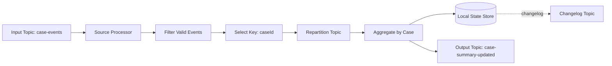

There are two views of the same application:

| View | What You See | What Actually Happens |
|---|---|---|
| DSL view | `builder.stream(...).filter(...).groupByKey().aggregate(...)` | Kafka Streams builds processor nodes, tasks, stores, and internal topics |
| Runtime view | Java service running in Kubernetes/VM | Consumer group assignment, local RocksDB/heap state, changelog restore, output production |
| Dataflow view | Input records become output records | Records are routed by key/partition and may trigger state updates |
| Operational view | App has lag/throughput/errors | Tasks may rebalance, restore state, fail, retry, or emit duplicates depending on guarantee |

The topology is the **logical dataflow**. The tasks are the **runtime execution units**.

---

## 2. Kafka Streams Is Not a Generic ETL Tool

Kafka Streams should not be treated as a universal replacement for Airflow, Spark, Flink, Beam, or custom Java services.

It shines when:

- input/output is Kafka,
- processing is continuous,
- state can be partitioned by key,
- joins are between streams/tables in Kafka,
- output can be represented as events or compacted changelog topics,
- low operational footprint matters,
- embedding stream processing inside a Java service is desirable.

It becomes awkward when:

- data source is mostly JDBC/file/API without Kafka ingestion layer,
- job is finite batch with heavy analytical scans,
- global ordering is required,
- state is too large or poorly key-partitionable,
- workflow needs long-running compensation,
- output side effects cannot be made idempotent,
- topology changes frequently and state migration is unmanaged.

A common top-1% engineering move is not “always use Kafka Streams.” It is knowing when not to.

---

## 3. Core Abstractions

Kafka Streams DSL exposes several important abstractions.

### 3.1 `KStream`

A `KStream<K, V>` represents an unbounded sequence of records.

Think of it as a stream of facts:

```text
(case-1, CaseOpened)
(case-1, CaseAssigned)
(case-2, CaseOpened)
(case-1, CaseEscalated)
```

A `KStream` record is not automatically the latest state. It is an occurrence.

Use `KStream` for:

- domain events,
- commands,
- CDC events,
- append-only facts,
- operational telemetry,
- audit events,
- records that must preserve occurrence semantics.

### 3.2 `KTable`

A `KTable<K, V>` represents a changelog-backed table: the latest value per key.

Think of it as a materialized map:

```text
case-1 -> CaseStatus(ESCALATED)
case-2 -> CaseStatus(OPEN)
```

Each record updates state for that key. A tombstone usually means delete.

Use `KTable` for:

- compacted dimension topics,
- current entity state,
- latest profile/customer/case state,
- aggregate result,
- materialized view.

### 3.3 `GlobalKTable`

A `GlobalKTable<K, V>` is a fully replicated table on each Kafka Streams instance.

Use it carefully.

It is useful when:

- the table is small enough to replicate everywhere,
- the stream key does not match the table partition key,
- enrichment requires lookup by foreign key,
- you want to avoid repartitioning the stream.

It is dangerous when:

- the table grows without bound,
- every app instance must restore a massive copy,
- update rate is high,
- memory/disk footprint is not budgeted,
- startup restore time violates SLO.

### 3.4 Processor API

The DSL is concise, but the Processor API gives lower-level control:

- custom processors,
- access to processor context,
- punctuators/timers,
- state store operations,
- custom branching behavior,
- custom error handling boundaries.

Use Processor API when the DSL hides a correctness boundary you need to control.

Do not use it merely to make code look clever.

---

## 4. Topology Is a Contract

A topology encodes operational promises.

For every topology, define:

| Contract Dimension | Question |
|---|---|
| Input contract | Which topics, schemas, keys, headers, timestamps are accepted? |
| Key contract | Which key determines ordering, state, joins, and partitioning? |
| State contract | Which stores exist, what do they contain, how are they restored? |
| Time contract | Does logic use event time, processing time, or record arrival order? |
| Output contract | What topics are emitted, with what key/schema/semantics? |
| Error contract | What is retried, skipped, quarantined, or fatal? |
| Replay contract | Can the topology rebuild outputs from input? |
| Migration contract | How do topology and store changes roll out? |

If these are not explicit, your topology is not production-ready.

---

## 5. The Golden Rule: Key Before State

In Kafka Streams, keying is architecture.

The record key controls:

- partition routing,
- per-key ordering,
- task assignment,
- local state ownership,
- join co-location,
- aggregation correctness,
- repartition requirement,
- hot partition risk,
- replay behavior.

If your key is wrong, the topology is wrong.

Example:

```java
KStream<String, CaseEvent> events = builder.stream(
    "case-events",
    Consumed.with(Serdes.String(), caseEventSerde)
);

KStream<String, CaseEvent> keyedByCase = events.selectKey(
    (oldKey, event) -> event.caseId()
);
```

This looks harmless. But `selectKey` marks the stream as rekeyed. If you later group or join by key, Kafka Streams may create an internal repartition topic.

That repartition is not an implementation detail you can ignore. It affects:

- cost,
- latency,
- ordering,
- internal topic management,
- security ACLs,
- observability,
- failure recovery,
- reprocessing.

---

## 6. Repartitioning: The Hidden Data Pipeline

Repartitioning is a shuffle.

A record is read from one topic, assigned a new key, written to an internal repartition topic, and consumed again by downstream tasks.

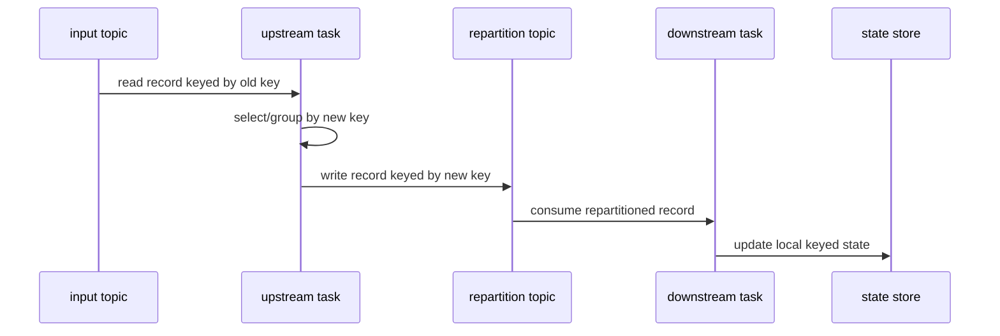

Repartitioning is often necessary, but it must be intentional.

### 6.1 When Repartitioning Is Correct

Repartition when:

- aggregation key differs from source key,
- join key differs from source key,
- source topic is incorrectly keyed,
- canonicalization changes the entity boundary,
- you need to co-locate related records.

### 6.2 When Repartitioning Is a Smell

Repartitioning is suspicious when:

- source producer could have emitted the right key,
- multiple downstream topologies rekey the same data repeatedly,
- keying is based on mutable fields,
- repartition topic has no retention/capacity review,
- topology creates several implicit internal topics nobody monitors.

### 6.3 Prefer Explicit Repartition Names

Do not rely on generated internal topic names for serious production systems.

Example:

```java
KGroupedStream<String, CaseEvent> grouped = events
    .selectKey((ignored, event) -> event.caseId())
    .repartition(Repartitioned
        .<String, CaseEvent>as("case-events-by-case-id")
        .withKeySerde(Serdes.String())
        .withValueSerde(caseEventSerde))
    .groupByKey(Grouped.with(Serdes.String(), caseEventSerde));
```

Explicit names make operations easier:

- ACL provisioning,
- topic configuration,
- lag monitoring,
- incident investigation,
- topology review,
- disaster recovery.

---

## 7. Stateful Topology Design

Stateful operations include:

- aggregate,
- count,
- reduce,
- join,
- window,
- suppress,
- transform/process with state store.

Stateful operations require local state stores and usually changelog topics.

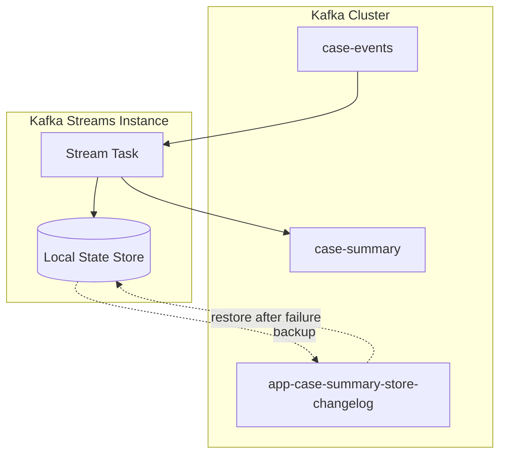

The local state is fast because it is local. It is recoverable because it is backed by changelog topics.

That means state design is also topic design.

---

## 8. State Store Design

State store design should answer:

| Question | Why It Matters |
|---|---|
| What is the store key? | Determines partition ownership and lookup pattern |
| What is the value format? | Controls compatibility and restore safety |
| Is it append-derived or latest-only? | Determines correction and replay semantics |
| Does it need TTL? | Prevents unbounded growth |
| Is it queryable? | Requires interactive query design |
| Can it be rebuilt? | Determines disaster recovery confidence |
| How large can it grow? | Determines disk/memory budget |
| How does it migrate? | Determines safe deployment plan |

### 8.1 Example State Store Value

```java
public record CaseSummaryState(
    String caseId,
    String status,
    String assignedTeam,
    int escalationCount,
    Instant openedAt,
    Instant lastEventAt,
    long version
) {}
```

This state is not a random DTO. It is a compact representation of what the topology needs to know between events.

Good state is:

- minimal,
- versioned,
- deterministic,
- rebuildable,
- not overloaded with unrelated concerns,
- aligned with output contract.

### 8.2 Avoid State Dumping

A common anti-pattern is storing the entire event history inside a state store value.

Bad:

```java
public record BadCaseState(
    String caseId,
    List<CaseEvent> allEventsEver
) {}
```

This causes:

- unbounded growth,
- slow restore,
- high changelog volume,
- large RocksDB values,
- expensive serialization,
- unstable memory pressure.

Instead, store the derived facts you need:

```java
public record BetterCaseState(
    String caseId,
    String latestStatus,
    int eventCount,
    Instant lastEventAt
) {}
```

---

## 9. Topology Granularity

Do not put the whole company into one topology.

Topology granularity should follow:

- bounded context,
- state ownership,
- output contract,
- operational blast radius,
- deployment cadence,
- replay requirement,
- team ownership.

### 9.1 Too Small

A topology is too small when:

- every tiny transformation has its own app,
- intermediate topics explode without ownership,
- end-to-end latency increases due to excessive hops,
- schema contracts multiply unnecessarily,
- debugging requires tracing through many trivial services.

### 9.2 Too Large

A topology is too large when:

- unrelated outputs share failure fate,
- one bad record blocks many products,
- state stores become unrelated and hard to migrate,
- deployment risk becomes high,
- replay for one output requires replaying everything,
- team ownership is unclear.

### 9.3 A Practical Rule

A topology should usually own one of these:

- one materialized view family,
- one domain projection,
- one enrichment pipeline,
- one aggregation family,
- one output contract group,
- one streaming decision function.

---

## 10. Topology Pattern: Filter-Map-Validate-Route

This is the simplest production topology.

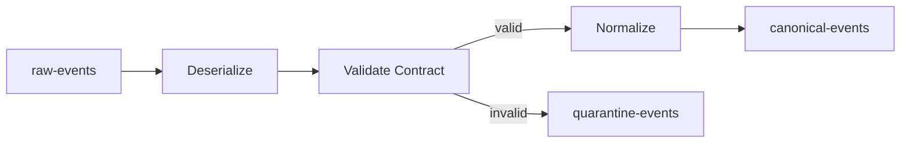

Java sketch:

```java
KStream<String, RawEvent> raw = builder.stream(
    "raw-case-events",
    Consumed.with(Serdes.String(), rawEventSerde)
);

BranchedKStream<String, ValidationResult<CanonicalCaseEvent>> branches = raw
    .mapValues(contractValidator::validate)
    .split(Named.as("case-contract-"));

branches.branch(
    (key, result) -> result.isValid(),
    Branched.withConsumer(valid -> valid
        .mapValues(ValidationResult::value)
        .to("canonical-case-events", Produced.with(Serdes.String(), canonicalSerde)))
);

branches.defaultBranch(
    Branched.withConsumer(invalid -> invalid
        .mapValues(ValidationResult::toQuarantineRecord)
        .to("quarantine-case-events", Produced.with(Serdes.String(), quarantineSerde)))
);
```

Important detail: invalid records are not silently dropped. They are routed to an explicit quarantine lane.

---

## 11. Topology Pattern: Materialized Projection

Input events update a compacted topic or queryable state.

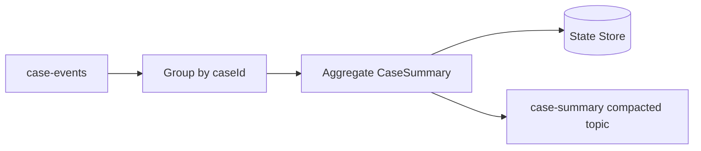

Java sketch:

```java
KTable<String, CaseSummaryState> summary = builder
    .stream("case-events", Consumed.with(Serdes.String(), caseEventSerde))
    .groupByKey(Grouped.with(Serdes.String(), caseEventSerde))
    .aggregate(
        CaseSummaryState::empty,
        (caseId, event, state) -> state.apply(event),
        Materialized.<String, CaseSummaryState>as("case-summary-store")
            .withKeySerde(Serdes.String())
            .withValueSerde(caseSummarySerde)
    );

summary.toStream().to(
    "case-summary",
    Produced.with(Serdes.String(), caseSummarySerde)
);
```

Design questions:

- Is `apply(event)` deterministic?
- What happens if events are replayed?
- Does state handle duplicate event IDs?
- What happens to old state schema after deployment?
- Is output compacted?
- Does tombstone delete state?
- How do consumers know the projection version?

---

## 12. Topology Pattern: Enrichment

Enrichment joins a stream of facts with reference/current-state data.

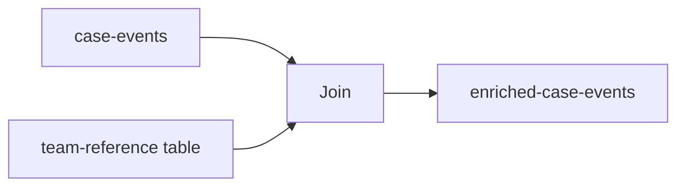

There are multiple enrichment patterns:

| Pattern | When to Use | Risk |
|---|---|---|
| `KStream` + `KTable` | Co-partitioned latest-state lookup | Temporal mismatch if table update arrives late |
| `KStream` + `GlobalKTable` | Small reference table, foreign-key lookup | Full table replicated per instance |
| Async external lookup | Reference not in Kafka | Latency, retry storm, external dependency |
| Pre-enrich upstream | Shared enrichment contract | Producer coupling |
| Enrich downstream | Consumer-specific enrichment | Repeated logic |

Part 038 will go deep on stream-table joins.

---

## 13. Topology Pattern: Stateful Detection

Some pipelines emit output only when state crosses a threshold.

Example: regulatory case SLA breach.

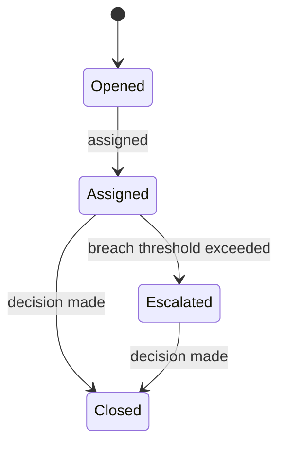

Kafka Streams implementation may use:

- state store for case status,
- timestamp of last transition,
- punctuator for periodic scan,
- event-time or processing-time policy,
- output topic for breach events.

Be careful: scheduled scans over state can be expensive. A timer-heavy use case may fit Flink better depending on scale and semantics.

---

## 14. Topology Pattern: Side-Effect Isolation

Kafka Streams is best when output is Kafka.

If you write directly to an external DB/API inside a processor, you leave Kafka Streams' managed processing boundary.

Bad shape:

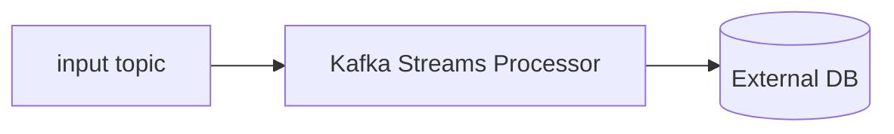

Safer shape:

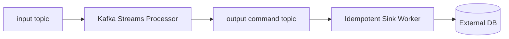

Why?

- Kafka Streams can manage Kafka input/output more cleanly than arbitrary external side effects.
- External calls have unknown outcomes.
- Sink workers can implement idempotency, retry, DLQ, rate limit, and reconciliation separately.
- Replay of Kafka Streams topology does not accidentally call external systems again.

---

## 15. Topology Evolution

Changing a stateless topology is easy.

Changing a stateful topology is a migration.

You must consider:

- store name changes,
- state value schema changes,
- repartition topic changes,
- changelog compatibility,
- output schema changes,
- application ID changes,
- reset/rebuild requirement,
- rolling deployment compatibility.

### 15.1 Application ID Is Part of State Identity

In Kafka Streams, `application.id` determines consumer group identity and internal topic naming.

Changing it can behave like deploying a new application:

- new consumer group,
- new state stores,
- new internal topics,
- full replay from configured offsets,
- duplicate output risk unless output is idempotent.

Treat `application.id` like a database name, not a random config string.

### 15.2 Store Names Are Part of the Contract

This matters:

```java
Materialized.as("case-summary-store")
```

Store name affects local store and changelog topic naming. Renaming a store is not cosmetic.

### 15.3 State Schema Migration Strategies

| Strategy | Use When | Trade-off |
|---|---|---|
| Backward-compatible state value | Small additive changes | Requires careful serde/defaults |
| New store + dual write | Need major refactor | More code, safer migration |
| New application ID + rebuild | Output can tolerate replay/rebuild | Operationally clean but may emit duplicates |
| Offline reset and replay | Controlled maintenance window | Downtime/risk |
| Blue/green topology | High criticality | Higher infra cost |

---

## 16. Error Handling Boundary

Kafka Streams exceptions are not all equal.

| Error | Example | Typical Action |
|---|---|---|
| Deserialization error | invalid bytes/schema | route to DLQ/quarantine if possible |
| Validation error | missing required domain field | quarantine |
| Transform bug | null pointer, arithmetic error | fail fast unless isolated |
| Serialization error | output cannot encode | fail fast; contract bug |
| Producer error | broker unavailable | retry by runtime/client |
| State store error | RocksDB/disk failure | fail instance, restore elsewhere |
| Poison record | deterministic failure for one input | quarantine or skip with evidence |

A mature topology separates:

- framework-level error handling,
- domain validation,
- poison record policy,
- fatal invariant violation,
- output contract failure.

Do not catch every exception and continue. That often creates silent data corruption.

---

## 17. Topology Observability

Minimum production signals:

| Signal | Why |
|---|---|
| Consumer lag per input topic/partition | Detect backlog |
| Processing rate | Detect throughput degradation |
| Commit latency | Detect offset/state progress issues |
| Rebalance count/duration | Detect instability |
| State restore time | Detect recovery risk |
| State store size | Detect unbounded growth |
| Changelog topic lag | Detect restore/replication risk |
| Repartition topic throughput | Detect hidden shuffle cost |
| Output rate | Detect unexpected drop/spike |
| Quarantine/DLQ rate | Detect data contract violations |
| End-to-end freshness | Detect SLA breach |
| Per-stage error count | Locate failure boundary |

For stateful applications, add:

- store record count,
- store disk usage,
- RocksDB block cache metrics if applicable,
- restore progress,
- standby replica health if used,
- time from start to `RUNNING`.

---

## 18. Operational Topology Diagram

Every production topology should have two diagrams.

### 18.1 Logical Dataflow

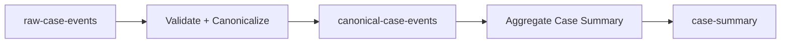

### 18.2 Runtime/Internal Topics

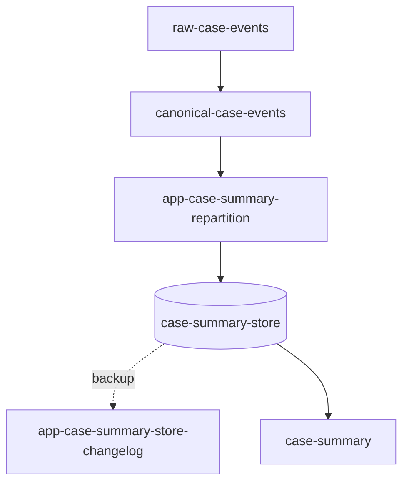

The second diagram is the one that helps during incidents.

---

## 19. Deployment Model

A Kafka Streams application is still a Java service.

You must design:

- number of instances,
- threads per instance,
- CPU/memory/disk,
- local state directory,
- readiness/liveness checks,
- graceful shutdown timeout,
- rolling deployment strategy,
- ACLs for input/output/internal topics,
- topology compatibility between versions,
- restore behavior after pod reschedule,
- autoscaling policy.

### 19.1 Threads vs Instances

More threads in one JVM can increase parallelism, but also:

- increases shared JVM pressure,
- complicates GC behavior,
- increases local contention,
- does not exceed partition-level parallelism,
- may make failure blast radius larger.

More instances can improve isolation and scheduling, but also:

- increases rebalance complexity,
- increases replicated overhead,
- affects GlobalKTable restore footprint,
- needs more local storage.

The maximum useful parallelism is constrained by input partitions and topology task structure.

---

## 20. Testing a Topology

### 20.1 Topology Unit Test

Use topology tests to verify deterministic transformation.

Test cases should include:

- valid input,
- invalid input,
- duplicate input,
- out-of-order input,
- tombstone/delete,
- schema default case,
- late reference data,
- replay from beginning,
- state restore simulation,
- migration fixture.

### 20.2 Golden Dataset Test

A golden dataset should include:

```text
input topics + ordered records + timestamps + headers
expected output topics + expected records
expected final state snapshot
```

The key is not just expected output. It is expected output plus expected state.

### 20.3 Topology Description Snapshot

Kafka Streams can describe topology structure. Snapshot it in tests or CI review to catch accidental repartition/store changes.

Example review questions:

- Did a new repartition topic appear?
- Did a store name change?
- Did an output topic change?
- Did a branch disappear?
- Did a stateful operator move?

---

## 21. Common Anti-Patterns

### 21.1 Invisible Repartition

The code looks innocent:

```java
events.groupBy((key, value) -> value.customerId()).count();
```

But this may create a repartition topic. That topic is now part of your pipeline.

### 21.2 Mutable Key

Using a mutable business attribute as key causes records for the same entity to move across partitions over time.

Bad examples:

- email address,
- team name,
- case status,
- owner username,
- region if entity can move.

Prefer stable identity.

### 21.3 Monolithic Topology

One giant topology with many unrelated outputs creates shared failure fate.

### 21.4 Direct External Side Effects

Calling external systems inside topology processors without idempotency creates replay hazards.

### 21.5 State Without Retention Policy

Unbounded state eventually becomes an incident.

### 21.6 Store Rename Without Migration

Store rename can trigger rebuild or incompatible state behavior.

### 21.7 Overusing GlobalKTable

Global tables feel convenient until every instance restores a huge dataset.

---

## 22. Production Review Checklist

Before approving a Kafka Streams topology, answer these:

### Input

- Are all input topics documented?
- Are key contracts explicit?
- Are serdes versioned and compatible?
- Are timestamps defined?
- Are tombstones handled?
- Are headers needed for trace/correlation?

### Topology

- Is topology granularity justified?
- Are repartitions explicit and named?
- Are branch policies documented?
- Are stateful operators necessary?
- Are stores named intentionally?
- Are internal topics included in ACL/topic-as-code?

### State

- What is stored?
- What is the store size estimate?
- Can state be rebuilt?
- How long does restore take?
- Is state schema migration planned?
- Is TTL needed?

### Output

- Are output topics documented?
- Are outputs idempotent/replay-safe?
- Is output ordering requirement explicit?
- Does output schema include transformation version?
- Are downstream consumers notified of changes?

### Operations

- What happens on rebalance?
- What happens on restart?
- What happens on broker outage?
- What happens if a poison record arrives?
- What happens if state store disk fills?
- What happens if application ID changes?

---

## 23. Minimal Production Skeleton

```java
public final class CaseSummaryTopology {

    public static Topology build(
        Serde<CaseEvent> caseEventSerde,
        Serde<CaseSummaryState> summarySerde,
        Serde<QuarantineRecord> quarantineSerde
    ) {
        StreamsBuilder builder = new StreamsBuilder();

        KStream<String, CaseEvent> events = builder.stream(
            "case-events",
            Consumed.with(Serdes.String(), caseEventSerde)
        );

        KStream<String, CaseEvent>[] branches = events.branch(
            (key, event) -> event != null && event.caseId() != null,
            (key, event) -> true
        );

        KStream<String, CaseEvent> valid = branches[0]
            .selectKey((key, event) -> event.caseId())
            .repartition(Repartitioned
                .<String, CaseEvent>as("case-events-by-case-id")
                .withKeySerde(Serdes.String())
                .withValueSerde(caseEventSerde));

        KTable<String, CaseSummaryState> summary = valid
            .groupByKey(Grouped.with(Serdes.String(), caseEventSerde))
            .aggregate(
                CaseSummaryState::empty,
                (caseId, event, state) -> state.apply(event),
                Materialized.<String, CaseSummaryState>as("case-summary-store")
                    .withKeySerde(Serdes.String())
                    .withValueSerde(summarySerde)
            );

        summary.toStream().to(
            "case-summary",
            Produced.with(Serdes.String(), summarySerde)
        );

        branches[1]
            .mapValues(event -> QuarantineRecord.from("INVALID_CASE_EVENT", event))
            .to("case-events-quarantine", Produced.with(Serdes.String(), quarantineSerde));

        return builder.build();
    }
}
```

This is still simplified, but it makes the important boundaries visible:

- input topic,
- validation branch,
- explicit rekey/repartition,
- state store name,
- output topic,
- quarantine topic.

---

## 24. Mental Model Summary

Kafka Streams topology design is the design of a **distributed stateful Java dataflow**.

You are not just writing method chains. You are defining:

- how records move,
- how keys determine ownership,
- where state lives,
- how state is rebuilt,
- where records are shuffled,
- which outputs are emitted,
- how replay behaves,
- how topology changes safely,
- how operations diagnose failure.

The hardest bugs in Kafka Streams are rarely syntax bugs. They are usually:

- wrong key,
- hidden repartition,
- temporal mismatch,
- unbounded state,
- unsafe side effect,
- unplanned state migration,
- unclear output contract.

A production-grade Kafka Streams topology should be readable as both code and architecture.

---

## 25. References

- Apache Kafka Documentation — Kafka Streams overview and event stream processing: https://kafka.apache.org/documentation/
- Apache Kafka Streams DSL API: https://kafka.apache.org/42/streams/developer-guide/dsl-api/
- Apache Kafka Streams Architecture: https://kafka.apache.org/documentation/streams/architecture
- Confluent Kafka Streams Architecture: https://docs.confluent.io/platform/current/streams/architecture.html
- Confluent Kafka Streams Concepts: https://docs.confluent.io/platform/current/streams/concepts.html
