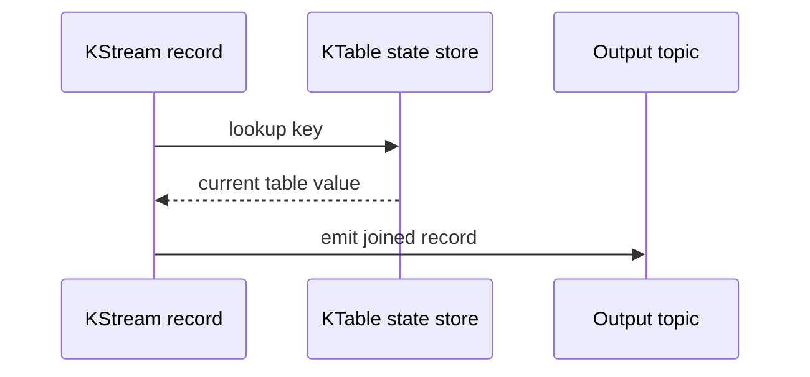
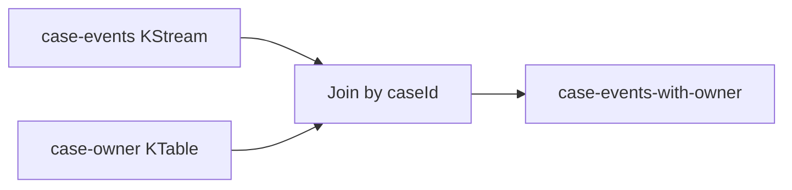
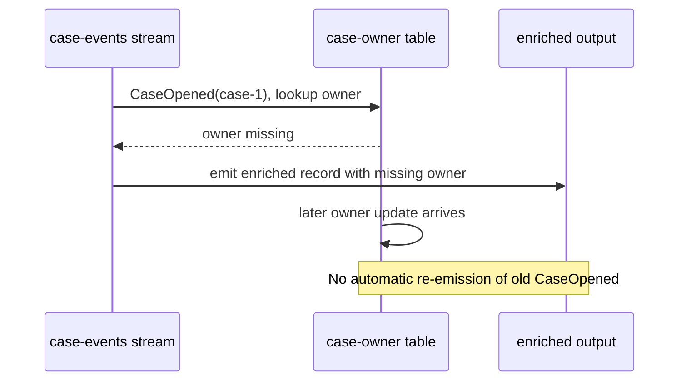
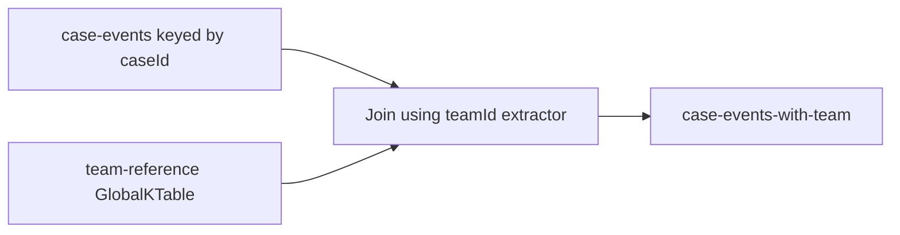
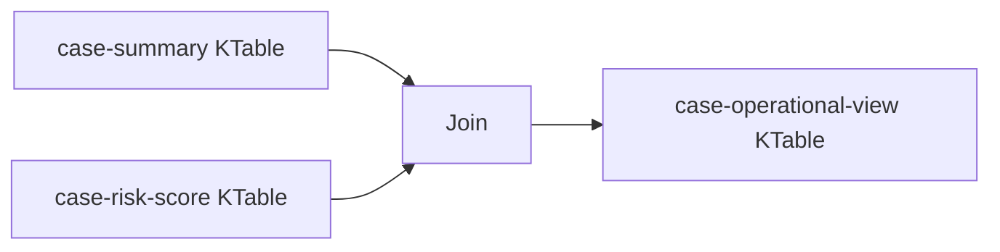
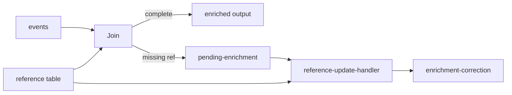
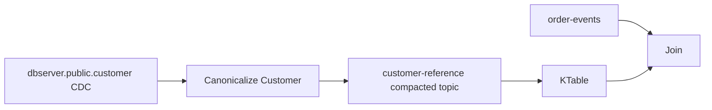

# Part 038 — Stream-Table Join Patterns

Stream-table joins look simple in code and dangerous in production.

A typical snippet:

```java
orders.join(customers, (order, customer) -> enrich(order, customer));
```

This hides many questions:

- Which side drives the output?
- Is the table current enough when the stream record arrives?
- Are the stream and table co-partitioned?
- What happens if the table update arrives after the stream event?
- What is the output when table value is missing?
- Is the enrichment reproducible during replay?
- Does the join reflect event time or processing time?
- Is the table a fact table, dimension table, cache, snapshot, or materialized view?

This part treats stream-table joins as a correctness problem, not a convenience API.

---

## 1. The Core Mental Model

A stream-table join is usually an **enrichment lookup**.

One record arrives on the stream side. The processor looks up the current value for the matching key in the table side. If found, it emits an enriched record.



The important phrase is **current table value**.

Current relative to what?

In many Kafka Streams joins, it means current relative to processing progress in that local task, not necessarily current relative to the business event time of the stream record.

That one distinction explains many bugs.

---

## 2. Streams and Tables Are Different Kinds of Truth

A stream is an occurrence log.

A table is the latest known state per key.

| Concept | Stream | Table |
|---|---|---|
| Meaning | Facts/events over time | Current/latest value per key |
| Duplicate meaning | Usually separate occurrence unless deduped | Later update may overwrite earlier value |
| Deletion | Event indicating delete | Tombstone/removal |
| Join role | Often drives output | Often lookup/enrichment side |
| Replay | Replays historical events | Reconstructs latest state over replay progress |
| Correctness risk | late/out-of-order event | stale/missing/wrong snapshot |

Do not treat a table as “the truth.” Treat it as **a version of state at a specific processing point**.

---

## 3. Join Types in Kafka Streams

Common Kafka Streams join families:

| Join | Shape | Typical Use |
|---|---|---|
| `KStream`-`KTable` | stream event + co-partitioned table lookup | enrich event with current state |
| `KStream`-`GlobalKTable` | stream event + fully replicated table lookup | enrich by foreign key or small reference table |
| `KTable`-`KTable` | table update + table update | maintain derived materialized view |
| `KStream`-`KStream` | event + event within time window | correlate events that happen near each other |

This part focuses on stream-table patterns, but you must know when a stream-stream join is the right model.

If both sides are events and the relationship is time-bounded, you probably need a stream-stream window join, not a stream-table join.

---

## 4. `KStream`-`KTable`: The Standard Enrichment Join

A `KStream`-`KTable` join is used when stream records should be enriched with the latest table value.

Example:

- stream: `case-events`
- table: `case-owner-table`
- output: `case-events-with-owner`



Java sketch:

```java
KStream<String, CaseEvent> caseEvents = builder.stream(
    "case-events",
    Consumed.with(Serdes.String(), caseEventSerde)
);

KTable<String, CaseOwner> caseOwners = builder.table(
    "case-owner",
    Consumed.with(Serdes.String(), caseOwnerSerde),
    Materialized.as("case-owner-store")
);

KStream<String, EnrichedCaseEvent> enriched = caseEvents.leftJoin(
    caseOwners,
    (event, owner) -> EnrichedCaseEvent.from(event, owner)
);

enriched.to(
    "case-events-with-owner",
    Produced.with(Serdes.String(), enrichedSerde)
);
```

### 4.1 Key Requirement

For `KStream`-`KTable`, the records must be co-partitioned by the join key.

That means:

- same key semantics,
- compatible key serdes,
- partitioning aligned,
- topic partition counts considered,
- repartition if stream key is not the join key.

If the stream key is not `caseId`, rekey intentionally:

```java
KStream<String, CaseEvent> byCaseId = caseEvents
    .selectKey((oldKey, event) -> event.caseId())
    .repartition(Repartitioned
        .<String, CaseEvent>as("case-events-by-case-id")
        .withKeySerde(Serdes.String())
        .withValueSerde(caseEventSerde));
```

Do not let repartitioning happen invisibly.

---

## 5. Inner Join vs Left Join

### 5.1 Inner Join

Inner join emits only if the table value exists.

```java
caseEvents.join(caseOwners, EnrichedCaseEvent::from);
```

Use inner join when missing table value means the stream record is not meaningful downstream.

Risk: missing or late table records silently suppress output.

### 5.2 Left Join

Left join emits even when table value is missing.

```java
caseEvents.leftJoin(caseOwners, EnrichedCaseEvent::fromNullableOwner);
```

Use left join when missing enrichment should be explicit.

Good output design:

```java
public record EnrichedCaseEvent(
    String caseId,
    CaseEvent event,
    Optional<CaseOwner> owner,
    EnrichmentStatus enrichmentStatus,
    Instant enrichedAt
) {}
```

Do not hide missing enrichment as a fake default value.

Bad:

```java
ownerName = "UNKNOWN";
```

Better:

```java
enrichmentStatus = OWNER_NOT_AVAILABLE;
```

---

## 6. Stream-Table Join Is Usually Stream-Driven

In a stream-table join, a new stream record drives output.

A table update alone typically updates the table state but does not re-emit prior stream records.

This is critical.



If you need historical records to be corrected when table changes, a simple stream-table join is not enough.

You need one of these:

- correction event pipeline,
- table-table materialized view,
- reprocessing/backfill,
- temporal table versioning,
- output invalidation event,
- downstream late enrichment reconciliation.

---

## 7. The Temporal Mismatch Problem

Consider this timeline:

```text
10:00 business event: CaseAssigned(case-1, team=A)
10:01 business event: CaseEscalated(case-1)
10:02 table update arrives: case-1 owner/team = A
```

If the escalation event is processed before the table update, the join sees missing or stale state.

This may be wrong if the business meaning expects the team assignment effective at 10:00.

### 7.1 Processing-Time Enrichment

Most simple `KStream`-`KTable` joins are processing-progress enrichment.

Meaning:

> enrich using whatever table value this task has processed when the stream record is processed.

This is often acceptable for:

- non-critical display enrichment,
- best-effort metadata enrichment,
- operational routing where late correction is allowed,
- low-risk analytics labels.

### 7.2 Event-Time Correct Enrichment

If enrichment must reflect the value effective at event time, you need temporal modeling.

Options:

- table values include validity intervals,
- enrichment state stores historical versions,
- use a stream processor with temporal join support/explicit timers,
- pre-normalize both sides into event-time ordered facts,
- perform batch/lakehouse temporal join for audit outputs.

A simple latest-state KTable is not enough for event-time historical correctness.

---

## 8. Versioned Reference Data

For audit-sensitive pipelines, model reference data as versioned facts.

Bad reference topic:

```json
{
  "caseId": "C-100",
  "assignedTeam": "Team-A"
}
```

Better:

```json
{
  "caseId": "C-100",
  "assignedTeam": "Team-A",
  "validFrom": "2026-07-04T09:00:00Z",
  "validTo": null,
  "version": 12,
  "sourceEventId": "evt-778"
}
```

Then enrichment can reason about:

- current value,
- effective value at event time,
- correction,
- audit replay,
- downstream explanation.

---

## 9. `KStream`-`GlobalKTable`: Foreign-Key Enrichment

A `GlobalKTable` is useful when stream key and lookup key differ.

Example:

- event key: `caseId`
- event contains: `teamId`
- reference table key: `teamId`



Java sketch:

```java
KStream<String, CaseEvent> caseEvents = builder.stream(
    "case-events",
    Consumed.with(Serdes.String(), caseEventSerde)
);

GlobalKTable<String, TeamRef> teams = builder.globalTable(
    "team-reference",
    Consumed.with(Serdes.String(), teamRefSerde),
    Materialized.as("team-reference-global-store")
);

KStream<String, EnrichedCaseEvent> enriched = caseEvents.leftJoin(
    teams,
    (caseId, event) -> event.teamId(),
    (event, team) -> EnrichedCaseEvent.withTeam(event, team)
);
```

### 9.1 Why GlobalKTable Is Convenient

It avoids repartitioning the stream by lookup key because every application instance has the full table.

### 9.2 Why GlobalKTable Is Dangerous

Every instance consumes every partition of the table topic.

That means:

- full replicated storage per instance,
- slower startup if table is large,
- higher restore cost,
- more disk usage,
- more memory/cache pressure,
- difficult autoscaling if restore dominates readiness.

Use it for small, bounded, relatively stable reference data.

Do not use it for large entity tables just because join code becomes easier.

---

## 10. KTable-KTable Join: Derived Materialized Views

A `KTable`-`KTable` join maintains a derived table when either side changes.

Example:

- `case-summary` table,
- `case-risk-score` table,
- derived `case-operational-view` table.



This differs from stream-table join because table updates can update the derived result.

Use table-table joins when output is a current-state materialized view, not an event occurrence.

### 10.1 Event vs View Output

If the output means “an event occurred,” use stream semantics.

If the output means “current joined state changed,” use table/materialized view semantics.

Confusing those two creates bad downstream behavior.

---

## 11. Join Output Semantics

Define what your join emits.

| Output Meaning | Shape | Example |
|---|---|---|
| Enriched occurrence | `KStream` output | `CaseEscalatedEnriched` |
| Current materialized state | compacted topic/table | `CaseOperationalView` |
| Correction event | stream output | `CaseEnrichmentCorrected` |
| Rejection/quarantine | stream output | `CaseEventMissingRequiredReference` |
| Command | stream output | `NotifyCaseOwnerCommand` |

Do not emit a current-state view to a topic named like an event stream.

Bad:

```text
case-updated-events
```

when it actually contains latest joined state.

Better:

```text
case-operational-view
```

or:

```text
case-operational-view-changelog
```

---

## 12. Missing Reference Policy

A stream-table join must define missing reference behavior.

Options:

| Policy | Behavior | Use When |
|---|---|---|
| Drop | no output | Missing reference means invalid/irrelevant |
| Left emit | output with missing marker | Downstream can tolerate incomplete enrichment |
| Quarantine | route to error lane | Reference is mandatory |
| Retry later | buffer/retry | Reference likely arrives soon |
| Emit pending | output pending state | Workflow can resolve asynchronously |
| Reconcile later | emit now, correct later | Low latency preferred over completeness |

### 12.1 Mandatory Reference Example

```java
KStream<String, EnrichmentResult> joined = events.leftJoin(
    ownerTable,
    (event, owner) -> owner == null
        ? EnrichmentResult.missingOwner(event)
        : EnrichmentResult.enriched(event, owner)
);

joined.split(Named.as("owner-enrichment-"))
    .branch((key, result) -> result.isComplete(), Branched.withConsumer(ok -> ok
        .mapValues(EnrichmentResult::value)
        .to("case-events-enriched", Produced.with(Serdes.String(), enrichedSerde))))
    .defaultBranch(Branched.withConsumer(missing -> missing
        .mapValues(EnrichmentResult::toQuarantine)
        .to("case-events-enrichment-quarantine", Produced.with(Serdes.String(), quarantineSerde))));
```

The key point: missing enrichment is not allowed to become silent partial truth.

---

## 13. Late Reference Data Strategies

### 13.1 Reconciliation Topic

Emit missing-reference records to a reconciliation topic.



This pattern is useful when:

- low-latency output is required,
- missing reference is expected sometimes,
- downstream can process correction events,
- audit trail must show why output changed.

### 13.2 Delayed Processing

Buffer the stream record for a short time waiting for reference data.

This is harder in Kafka Streams and usually needs state store + punctuator.

Use only when:

- delay bound is small,
- reference data arrives predictably,
- memory/state budget is clear,
- duplicate and timeout behavior are defined.

### 13.3 Periodic Backfill

Let stream pipeline emit best-effort output, then run a periodic correction/backfill job.

Use when:

- audit output is batch/lakehouse,
- low-latency stream is operational only,
- correctness can converge later,
- correction window is explicit.

---

## 14. Co-Partitioning and Repartitioning

For partitioned table joins, co-partitioning is non-negotiable.

If stream and table are not aligned, joins can be wrong or impossible.

### 14.1 Co-Partitioning Checklist

- Are both sides keyed by the same logical key?
- Do key serdes produce identical bytes for identical keys?
- Are partition counts compatible with join requirements?
- Is partitioner consistent?
- Are records with same join key processed by the same task?
- Has a repartition topic been explicitly named if needed?

### 14.2 Rekeying by Foreign Key

Suppose `case-events` is keyed by `caseId`, but you need to join with `team-table` keyed by `teamId`.

Option A: rekey the stream by `teamId`.

```java
KStream<String, CaseEvent> byTeam = caseEvents
    .selectKey((caseId, event) -> event.teamId())
    .repartition(Repartitioned
        .<String, CaseEvent>as("case-events-by-team-id")
        .withKeySerde(Serdes.String())
        .withValueSerde(caseEventSerde));
```

Risk: downstream output is now keyed by team, not case, unless you rekey again.

Option B: use `GlobalKTable` if `team-table` is small.

Option C: pre-enrich upstream or create a case-to-team lookup table.

There is no free option. Pick the trade-off explicitly.

---

## 15. Table Freshness as an SLO

A join is only as good as the freshness of its table side.

For each table used in enrichment, define:

| Metric | Meaning |
|---|---|
| Table ingestion lag | How far table topic lags behind producer/source |
| Table update age | Age of latest update per key/domain |
| Restore time | How long table/store takes to become queryable after restart |
| Missing lookup rate | Percentage of stream records without matching table value |
| Stale lookup suspicion | Cases where table version older than stream event expectation |
| Correction rate | Number of enrichment corrections emitted later |

If a reference table has no freshness SLO, every enrichment result is suspect.

---

## 16. Enrichment Metadata

Output should carry enrichment evidence.

Example:

```java
public record EnrichmentEvidence(
    String referenceTopic,
    String referenceKey,
    Long referenceOffset,
    Instant referenceUpdatedAt,
    String referenceVersion,
    EnrichmentStatus status
) {}
```

For high-value pipelines, enriched output should answer:

- which reference was used,
- when that reference was updated,
- which version was used,
- whether enrichment was complete,
- whether output is replay/backfill generated,
- whether correction may follow.

This is not overengineering in regulated or high-impact systems. It is evidence.

---

## 17. Replay Semantics

During replay, table state is reconstructed as the application reads table changelog/topic and stream input.

But if inputs are consumed from multiple topics, relative processing order matters.

Questions:

- Are stream and table topics replayed from beginning together?
- What offsets are used for table restore?
- Does replay reproduce the original enrichment result or produce improved output?
- Is improved output acceptable or is historical reproduction required?
- Are downstream sinks idempotent if enriched records are emitted again?

### 17.1 Reproducible Replay

If replay must reproduce historical output exactly, you need to pin enrichment to historical reference versions.

Possible approaches:

- include reference version ID in original event,
- use versioned reference table with effective time,
- store enrichment evidence in output,
- replay from captured output rather than recompute,
- snapshot all reference datasets at replay boundary.

### 17.2 Corrective Replay

If replay is meant to recompute with improved logic/reference data, label output clearly:

```json
{
  "processingMode": "BACKFILL",
  "transformationVersion": "case-enrichment-v3",
  "referenceSnapshot": "team-ref-2026-07-04"
}
```

Never mix corrective replay output with live output without a contract.

---

## 18. Join with CDC-Derived Tables

CDC tables are common join inputs.

Example:

- Debezium emits customer table changes,
- Kafka Streams materializes customer KTable,
- order events join customer KTable.

Issues to handle:

- snapshot rows may arrive before/alongside change events,
- delete events/tombstones,
- transaction order,
- schema changes,
- source lag,
- source primary key stability,
- source correction events,
- default values added later.

CDC-derived table does not automatically mean domain-correct table.

A CDC row is a database representation. A pipeline reference table should often be canonicalized first.



---

## 19. Join with Slowly Changing Dimensions

If reference values change over time and historical correctness matters, model slowly changing dimensions explicitly.

### 19.1 Latest-State Join

```text
event at T1 joins dimension value latest at processing time
```

Fast, simple, often good for operational current views.

### 19.2 Effective-Time Join

```text
event at eventTime T1 joins dimension version whose validFrom <= T1 < validTo
```

More correct for audit/reporting, but requires versioned state.

Kafka Streams can implement this with custom state stores, but complexity rises. Flink or batch/lakehouse may be more appropriate depending on scale and strictness.

---

## 20. Join Pattern Decision Matrix

| Requirement | Recommended Pattern |
|---|---|
| Enrich event with current entity state, same key | `KStream`-`KTable` |
| Enrich event by small reference table, foreign key | `KStream`-`GlobalKTable` |
| Maintain current joined view when either side changes | `KTable`-`KTable` |
| Correlate two event streams within time window | `KStream`-`KStream` window join |
| Historical/effective-time correctness | versioned state or batch temporal join |
| Mandatory reference with possible late arrival | left join + quarantine/reconciliation |
| Huge reference table with foreign-key lookup | rekey/repartition or external lookup with cache; avoid GlobalKTable |
| Low-latency best-effort enrichment | left join + evidence metadata |
| Regulated audit output | versioned reference + replay manifest |

---

## 21. Failure Model

Stream-table joins fail in subtle ways.

| Failure | Symptom | Mitigation |
|---|---|---|
| Missing table value | partial output or dropped output | explicit missing policy |
| Late table update | stale enrichment | correction/reconciliation/versioned join |
| Wrong key | low match rate, wrong join | key contract tests |
| Incompatible serde | deserialization failure | schema compatibility gate |
| Large GlobalKTable | slow restore, disk pressure | bounded table policy, repartition alternative |
| Unplanned repartition | latency/cost spike | explicit topology review |
| Table tombstone ignored | deleted reference still used | delete semantics tests |
| Replay emits different enrichment | audit mismatch | replay contract/reference snapshot |
| Output lacks evidence | impossible investigation | enrichment metadata |

---

## 22. Testing Stream-Table Joins

Test more than the happy path.

### 22.1 Basic Cases

- stream record with existing table value,
- stream record with missing table value,
- table tombstone then stream record,
- table update then stream record,
- stream record then table update,
- duplicate stream record,
- duplicate table update,
- null value/tombstone,
- schema evolution default.

### 22.2 Temporal Cases

Test this explicitly:

```text
1. stream event arrives first
2. reference update arrives later
3. expected output: missing/pending/correction, depending on policy
```

And this:

```text
1. reference update v1
2. stream event
3. reference update v2
4. replay from beginning
5. expected output must be defined
```

### 22.3 Match Rate Test

Low join match rate is often a keying bug.

A test dataset should verify expected match percentage.

Example:

```text
expected_owner_match_rate >= 99.5% for live traffic
expected_team_ref_match_rate >= 99.9% for canonical events
```

When match rate drops, treat it as contract violation, not just a metric anomaly.

---

## 23. Java Implementation Pattern: Explicit Enrichment Result

Avoid returning raw enriched DTOs directly from join functions.

Use a result type.

```java
public sealed interface EnrichmentResult permits EnrichmentResult.Complete, EnrichmentResult.MissingReference {

    record Complete(
        String key,
        EnrichedCaseEvent value,
        EnrichmentEvidence evidence
    ) implements EnrichmentResult {}

    record MissingReference(
        String key,
        CaseEvent originalEvent,
        String referenceName,
        String referenceKey,
        String reason
    ) implements EnrichmentResult {}
}
```

Join:

```java
KStream<String, EnrichmentResult> result = caseEvents.leftJoin(
    caseOwnerTable,
    (event, owner) -> {
        if (owner == null) {
            return new EnrichmentResult.MissingReference(
                event.caseId(),
                event,
                "case-owner",
                event.caseId(),
                "CASE_OWNER_NOT_FOUND"
            );
        }

        return new EnrichmentResult.Complete(
            event.caseId(),
            EnrichedCaseEvent.from(event, owner),
            EnrichmentEvidence.from("case-owner", event.caseId(), owner.version())
        );
    }
);
```

Route:

```java
result.split(Named.as("case-owner-join-"))
    .branch(
        (key, value) -> value instanceof EnrichmentResult.Complete,
        Branched.withConsumer(ok -> ok
            .mapValues(value -> ((EnrichmentResult.Complete) value).value())
            .to("case-events-enriched", Produced.with(Serdes.String(), enrichedSerde)))
    )
    .defaultBranch(
        Branched.withConsumer(missing -> missing
            .mapValues(QuarantineRecord::from)
            .to("case-events-enrichment-missing-ref", Produced.with(Serdes.String(), quarantineSerde)))
    );
```

This forces missing reference policy to be visible.

---

## 24. Operational Runbook

When a join output looks wrong, inspect in this order:

1. Is the stream record key correct?
2. Is the table topic keyed correctly?
3. Are serdes compatible?
4. Does the table store contain the expected key?
5. Did the reference update arrive before or after the stream record?
6. Is the join inner or left?
7. Are tombstones handled correctly?
8. Did a repartition topic appear/change?
9. Is the GlobalKTable restore complete?
10. Is the output based on live, replay, or backfill mode?
11. Does enriched output include reference evidence?
12. Did a topology or store migration happen recently?

---

## 25. Production Review Checklist

Before approving a stream-table join, answer:

### Join Semantics

- Which side drives output?
- Is output an event or current-state view?
- Is join based on latest state or effective-time state?
- Is missing reference behavior explicit?
- Is stale reference behavior explicit?

### Keying

- What is the join key?
- Is the stream keyed by that key?
- Is the table keyed by that key?
- Is repartitioning explicit and named?
- Is key serde consistent?

### Table

- Is table compacted?
- Is table bounded or unbounded?
- Is tombstone/delete handled?
- What is table freshness SLO?
- What is restore time?
- Is GlobalKTable justified if used?

### Replay

- Does replay reproduce historical output or recompute improved output?
- Is reference snapshot/version recorded?
- Are outputs idempotent?
- Are corrections modeled?

### Observability

- Do we measure match rate?
- Do we measure missing reference rate?
- Do we measure table lag/freshness?
- Do outputs include enrichment evidence?
- Is quarantine monitored?

---

## 26. Mental Model Summary

A stream-table join is not just enrichment. It is a decision about **truth at time**.

The stream says: something happened.

The table says: this is what we currently know.

The join says: combine the occurrence with current known state according to a specific temporal and operational contract.

Production failures usually come from not defining that contract.

Remember these rules:

- A `KStream`-`KTable` join is usually stream-driven.
- Table updates do not automatically fix past stream outputs.
- Missing reference behavior must be explicit.
- Table freshness is part of correctness.
- `GlobalKTable` trades repartitioning for replicated state.
- Latest-state join is not historical/effective-time join.
- Replay semantics must be defined before incidents.
- Output should include enrichment evidence when correctness matters.

The join code may be one line. The design is not.

---

## 27. References

- Apache Kafka Streams DSL API — streams, tables, joins, repartitioning: https://kafka.apache.org/42/streams/developer-guide/dsl-api/
- Apache Kafka Documentation — Kafka Streams processing overview: https://kafka.apache.org/documentation/
- Kafka Streams Join Semantics — Apache Kafka Confluence: https://cwiki.apache.org/confluence/display/kafka/kafka%2Bstreams%2Bjoin%2Bsemantics
- GlobalKTable JavaDoc — replicated table semantics: https://kafka.apache.org/25/javadoc/org/apache/kafka/streams/kstream/GlobalKTable.html
- Confluent Developer — Kafka Streams joins overview: https://developer.confluent.io/courses/kafka-streams/joins/
