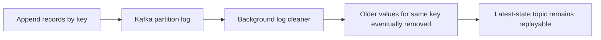
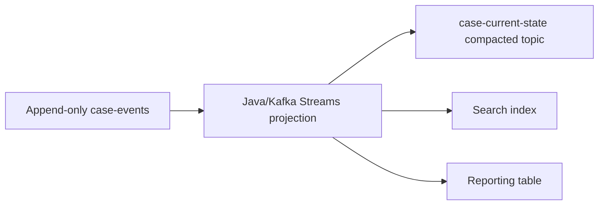
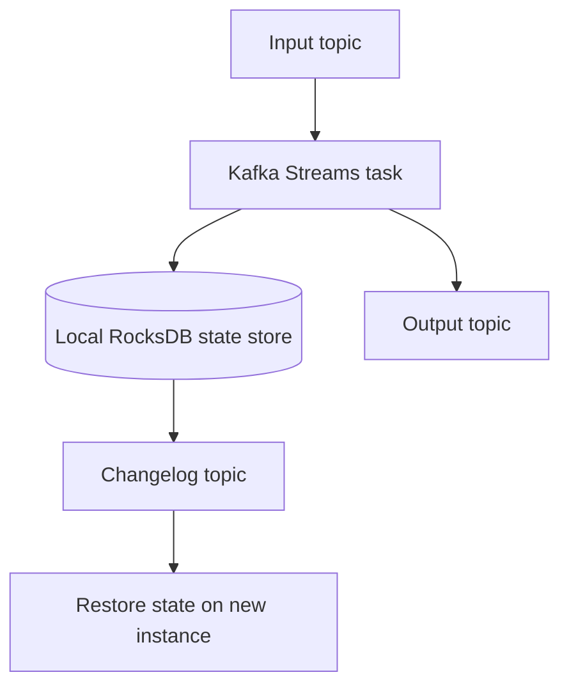
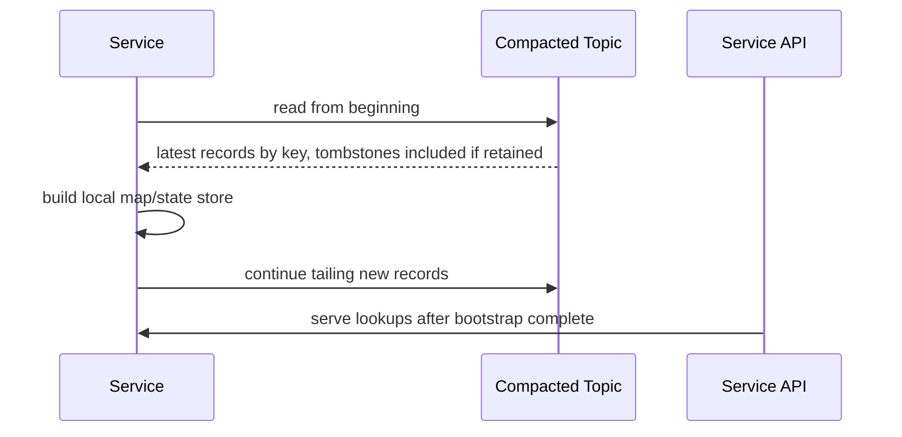
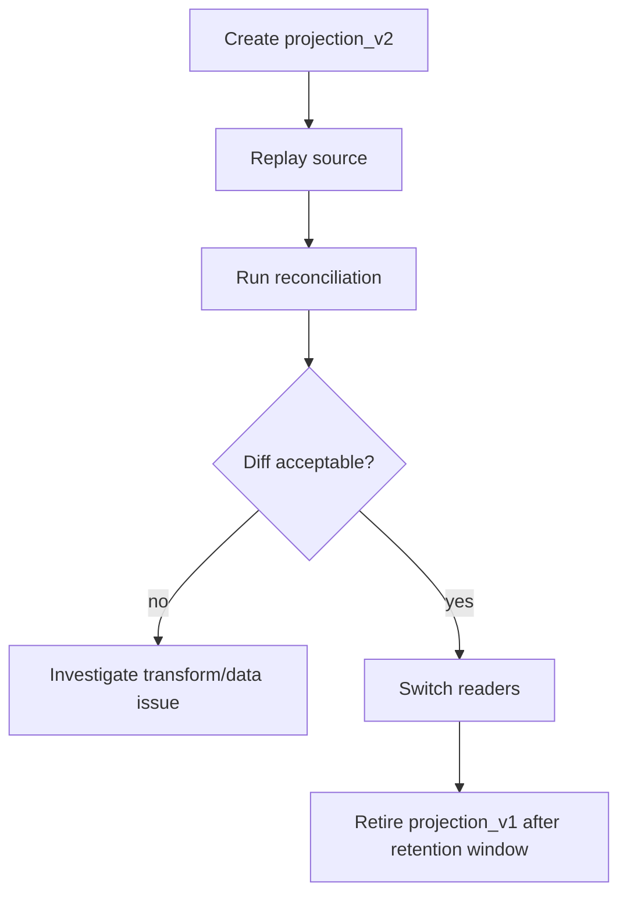
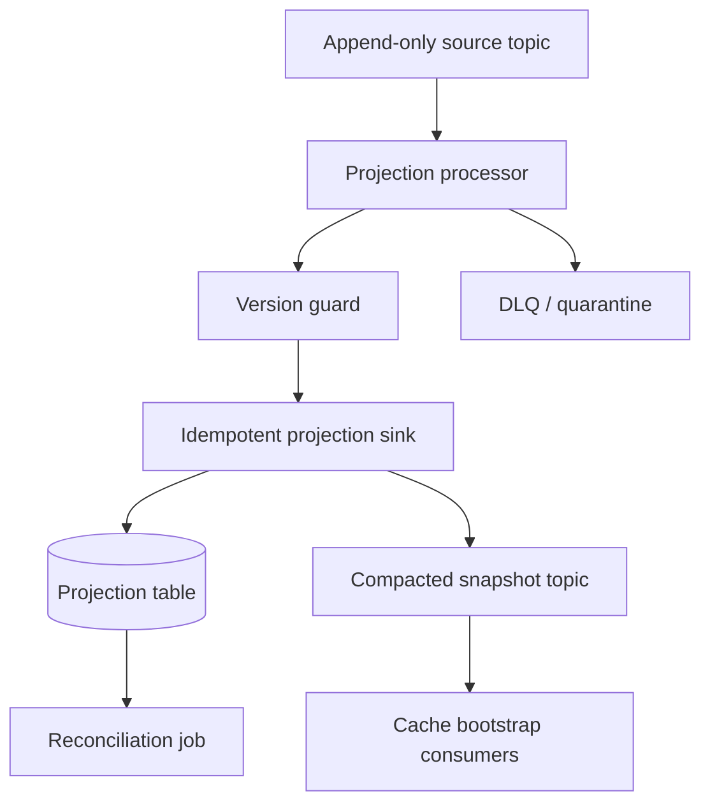

# Part 039 — Log Compaction and Materialized Views

A Kafka topic can behave like two different storage abstractions depending on its retention policy.

A normal append-only topic is an event history: `case-opened`, `case-assigned`, `case-escalated`, `case-closed`. A compacted topic is closer to a distributed latest-state map: for each key, Kafka eventually keeps the latest value and discards obsolete values for that key. That difference is small in configuration, but large in system design.

Log compaction is not just a storage-saving feature. It is a pattern for rebuilding materialized views, restoring local state, distributing reference data, publishing latest snapshots, and making stream processors recoverable after failure.

But it is also easy to misuse. A compacted topic is not a database. It has no query language, no transaction across arbitrary keys, no secondary indexes, no synchronous deletion semantics, and no guarantee that old values disappear immediately. Compaction is an eventual background cleanup process.

This part builds the model you need to use compacted topics safely in Java pipeline systems.

---

## 1. The Problem Compaction Solves

Imagine a pipeline that needs the latest state of every enforcement case.

The source emits events:

```text
case-123 -> CaseOpened
case-123 -> CaseAssigned
case-123 -> CaseEscalated
case-123 -> CaseClosed
```

A downstream report does not always need the whole history. It may need:

```text
case-123 -> { status: CLOSED, assignee: "team-a", risk: "HIGH" }
```

Without compaction, a new consumer that wants current state must read every historical event since the beginning of time. That may be correct for event-sourced reconstruction, but it is inefficient for reference-like latest-state distribution.

A compacted topic lets Kafka eventually retain only the latest value per key:

```text
case-123 -> latest CaseSnapshot
case-456 -> latest CaseSnapshot
case-789 -> latest CaseSnapshot
```

That gives you a rebuildable view: a consumer can read the topic from offset `0`, apply records by key, and eventually reconstruct the latest known state.

The invariant is simple:

> A compacted topic is useful when the latest value for a key is sufficient to reconstruct the desired view.

If losing historical intermediate states would break correctness, do not use compaction as the only copy.

---

## 2. Mental Model: Log vs Map

A compacted topic is still a Kafka log. It is not physically a map. Consumers still read ordered records from partitions. Kafka still stores segments. Offsets still increase. Compaction runs later and removes obsolete records.

The logical model is:

```java
Map<Key, LatestValue> latestByKey;
```

The physical model is:

```text
partition-0:
  offset 10: key=A value=v1
  offset 11: key=B value=v1
  offset 12: key=A value=v2
  offset 13: key=C value=v1
  offset 14: key=A value=v3

After compaction, Kafka may retain:
  offset 11: key=B value=v1
  offset 13: key=C value=v1
  offset 14: key=A value=v3
```

Important: offsets are not renumbered. A compacted log can contain gaps from the consumer's perspective. Consumers must treat offsets as opaque positions, not dense sequence numbers.



Apache Kafka documentation describes log compaction as a mechanism that retains at least the last known value for each message key within a topic partition. In practice, that makes compacted topics suitable for changelog/state distribution, not for replacing all historical audit logs.

Reference: [Kafka topic configuration and cleanup policy](https://kafka.apache.org/documentation/), [Confluent log compaction design](https://docs.confluent.io/kafka/design/log_compaction.html).

---

## 3. When to Use a Compacted Topic

Use a compacted topic when the consumer needs a recoverable latest-state view.

Good examples:

| Use case | Why compaction fits |
|---|---|
| Customer profile snapshot | Latest profile by customer ID is useful for enrichment |
| Case status snapshot | Latest status by case ID supports dashboards/search indexing |
| Reference data distribution | Latest code table value by code key is enough |
| Kafka Streams changelog topic | Local state store can be restored from latest updates |
| Feature flag distribution | Latest flag state by flag key is enough |
| Entity projection | View can be rebuilt by replaying latest keyed records |
| CDC latest table topic | Latest row by primary key is useful for state reconstruction |

Avoid compacted topics as the only source when:

| Situation | Why it is unsafe |
|---|---|
| Audit trail requires full history | Compaction removes older values |
| Event order itself is business meaning | Intermediate events matter |
| Need aggregate of all changes | Latest state loses contribution history |
| Need legal evidence of every mutation | Compaction is destructive to old keyed records |
| Need synchronous deletion guarantee | Tombstones are eventually processed |
| Need query by non-key attribute | Kafka is not an indexed database |

A common production pattern is dual topic publication:

```text
case-events               // append-only history
case-snapshots-compacted  // latest state by case_id
```

The first topic preserves facts. The second accelerates state distribution.

---

## 4. Core Invariant: Key Stability

Log compaction only works if keys are stable.

Bad key design destroys compaction.

```text
Bad:
  key = random UUID generated per event

Good:
  key = stable business/entity identity
```

For entity snapshots, the key should usually be the entity ID:

```java
record CaseSnapshotKey(String caseId) {}
```

For tenant-aware systems, include tenant identity if the entity ID is only unique within a tenant:

```java
record CaseSnapshotKey(String tenantId, String caseId) {}
```

The compaction key must answer:

> Which previous value does this record replace?

If the answer is unclear, compaction is probably the wrong tool.

### Key Migration Risk

Changing the key shape creates a new logical identity.

```text
Old key: caseId
New key: tenantId + caseId
```

Kafka will not know that these keys represent the same entity. The old records may remain as separate latest entries until tombstoned.

Safe migration usually requires:

1. publish new-key records,
2. publish tombstones for old keys,
3. run consumers in migration-compatible mode,
4. monitor old-key cardinality until drained,
5. only then remove old-key support.

---

## 5. Tombstones: Delete as Data

In a compacted Kafka topic, a tombstone is a record with a non-null key and a null value.

```text
key = case-123
value = null
```

The tombstone means:

> The latest state for this key should be considered deleted.

Eventually, compaction can remove both the old value and the tombstone, depending on retention settings.

A Java consumer must explicitly handle tombstones:

```java
public void handle(ConsumerRecord<String, CaseSnapshot> record) {
    String key = record.key();
    CaseSnapshot value = record.value();

    if (value == null) {
        projection.delete(key);
        return;
    }

    projection.upsert(key, value);
}
```

Do not deserialize a tombstone as an empty object. `null` is semantically different from `{}`.

### Tombstone Retention

Tombstones are not kept forever by default. The setting commonly discussed here is `delete.retention.ms`, which bounds how long delete markers are retained for compacted topics. A consumer rebuilding from offset `0` must complete its scan before tombstones are removed if it needs a valid deletion-aware snapshot.

That leads to an operational invariant:

> The maximum time to rebuild a compacted topic from offset `0` must be less than the tombstone retention window, or deletion correctness is at risk.

If a compacted topic is very large and rebuild takes many hours or days, tune tombstone retention or introduce snapshot/bootstrap mechanisms.

---

## 6. Materialized View Pattern

A materialized view is a stored projection derived from source records.

For example:

```text
Input:
  case-events

Projection:
  case-current-state

Sink:
  PostgreSQL table / Elasticsearch index / compacted Kafka topic / state store
```

The projection is not the source of truth unless explicitly designed that way. It is derived state.



The materialized view invariant is:

> Given the same source input and same transformation version, the view can be rebuilt to the same logical result.

If a projection cannot be rebuilt, it is not a safe derived view. It is hidden primary data.

---

## 7. Projection Types

Not every materialized view has the same semantics.

### 7.1 Latest Entity View

One output row per entity.

```text
case_id -> latest case state
```

Typical sink operation: upsert/delete.

Good for:

- entity lookup,
- search indexing,
- API read models,
- enrichment tables,
- compacted Kafka topics.

### 7.2 Aggregate View

One output row per aggregate dimension.

```text
team_id + day -> count of open cases
```

Typical sink operation: increment, recompute, or replace aggregate.

Compaction can store latest aggregate value, but the aggregate must be derived carefully. If events are duplicated or replayed, naive increments double count.

### 7.3 Relationship View

One output row per relationship.

```text
case_id -> assigned_officer_id
```

Relationships often need tombstones when the relation is removed.

### 7.4 Temporal View

One output row per entity per effective time or validity interval.

```text
case_id + valid_from -> status interval
```

This is usually not a simple compacted latest-state topic, because historical intervals matter.

### 7.5 Index View

One output row per index key.

```text
risk_level -> set of case IDs
```

This is harder because moving an entity from one index bucket to another requires deleting from the old bucket and adding to the new bucket. Kafka compacted topics do not natively manage set membership.

---

## 8. Latest-State Topic Design

A compacted latest-state topic should have a clear contract.

Example:

```text
topic: enforcement.case.snapshot.v1
cleanup.policy=compact
key: CaseSnapshotKey
value: CaseSnapshot
```

Key:

```java
public record CaseSnapshotKey(
    String tenantId,
    String caseId
) {}
```

Value:

```java
public record CaseSnapshot(
    String tenantId,
    String caseId,
    String status,
    String assigneeTeamId,
    String riskLevel,
    Instant businessEffectiveAt,
    Instant sourceCommittedAt,
    long sourceVersion,
    String transformVersion,
    boolean deleted
) {}
```

Prefer a real tombstone for Kafka-level deletion, not only `deleted=true`. However, a soft-delete flag may still be useful in sinks that require deletion evidence.

### Required Metadata

A production snapshot should include:

| Field | Purpose |
|---|---|
| entity ID | Stable identity |
| source version | Monotonic ordering within entity, if available |
| source commit time | Tie to source transaction/change event |
| business effective time | Business validity semantics |
| transform version | Rebuild and migration traceability |
| schema version | Payload evolution |
| tenant/security classification | Isolation and governance |
| correlation/causation ID | Traceability |

---

## 9. Building a Materialized View in Plain Java

A minimal projection loop:

```java
final class CaseProjectionConsumer {
    private final KafkaConsumer<CaseId, CaseEvent> consumer;
    private final CaseProjectionRepository repository;

    void run() {
        while (!Thread.currentThread().isInterrupted()) {
            ConsumerRecords<CaseId, CaseEvent> records = consumer.poll(Duration.ofMillis(500));

            for (ConsumerRecord<CaseId, CaseEvent> record : records) {
                CaseEvent event = record.value();
                CaseSnapshot next = repository.load(event.caseId())
                    .map(current -> apply(current, event))
                    .orElseGet(() -> initialFrom(event));

                repository.upsert(next);
            }

            consumer.commitSync();
        }
    }
}
```

This is understandable but unsafe unless the repository operation is idempotent and the offset commit follows the sink commit.

A safer shape:

```java
final class ProjectionHandler {
    ProjectionCommand handle(Envelope<CaseEvent> input, Optional<CaseSnapshot> current) {
        return switch (input.payload()) {
            case CaseOpened e -> ProjectionCommand.upsert(CaseSnapshot.opened(e));
            case CaseAssigned e -> ProjectionCommand.upsert(current.orElseThrow().assign(e));
            case CaseClosed e -> ProjectionCommand.upsert(current.orElseThrow().close(e));
            case CaseDeleted e -> ProjectionCommand.delete(e.caseId(), e.sourceVersion());
        };
    }
}
```

Then execute command idempotently:

```java
interface ProjectionSink<K, V> {
    void upsert(K key, V value, SourcePosition position);
    void delete(K key, SourcePosition position);
}
```

The sink must store the source position or version so duplicate/replayed records do not regress state.

---

## 10. Preventing State Regression

A projection can regress when an older event is processed after a newer event.

Example:

```text
Current projection:
  case-123 status=CLOSED sourceVersion=20

Late/replayed event:
  case-123 status=ASSIGNED sourceVersion=18
```

A naive upsert would incorrectly reopen the case.

Defensive sink condition:

```sql
UPDATE case_projection
SET status = ?, source_version = ?
WHERE case_id = ?
  AND source_version < ?;
```

Or with PostgreSQL-style upsert logic:

```sql
INSERT INTO case_projection(case_id, status, source_version)
VALUES (?, ?, ?)
ON CONFLICT (case_id) DO UPDATE
SET status = EXCLUDED.status,
    source_version = EXCLUDED.source_version
WHERE case_projection.source_version < EXCLUDED.source_version;
```

The invariant:

> A materialized latest-state view must define the ordering field that decides whether an update is newer.

Possible ordering fields:

- source database transaction sequence,
- CDC LSN/binlog position,
- aggregate version,
- event sequence number,
- business effective time plus tie-breaker,
- Kafka partition offset, but only if all updates for the key are in one partition and source order is meaningful.

Do not use processing time as the ordering field unless the business explicitly accepts arrival-order semantics.

---

## 11. Kafka Streams State Store and Changelog Pattern

Kafka Streams uses local state stores for stateful operations. State changes are backed by changelog topics so state can be restored after failure.

Conceptually:



The changelog topic is usually compacted because it stores the latest state per key.

This is a core reason compaction matters: it keeps local state recoverable without retaining every internal state mutation forever.

But the same warnings apply:

- changelog restore time matters,
- tombstone retention matters,
- state schema migration matters,
- key stability matters,
- standby replicas may reduce failover recovery time,
- local disk corruption must be handled by restoring from changelog.

Reference: [Kafka Streams architecture and state stores](https://docs.confluent.io/platform/current/streams/architecture.html).

---

## 12. CDC Table Topic as Materialized View

CDC can publish table changes keyed by primary key.

For a table:

```sql
CREATE TABLE enforcement_case (
  case_id text PRIMARY KEY,
  status text,
  assignee_team_id text,
  updated_at timestamptz
);
```

CDC topic key:

```text
case_id
```

CDC topic value:

```text
before / after / op / source metadata
```

If the topic is compacted, it can serve as a latest database-row stream. Consumers can rebuild current table-like state by reading from offset `0`.

However, CDC event shape is not necessarily the same as canonical event shape.

CDC says:

> The row changed.

Canonical domain event says:

> A business fact happened.

A compacted CDC topic is useful for distributing latest table state. It should not automatically become your canonical business event stream.

---

## 13. Snapshot Topic vs Event Topic

A mature pipeline often has both:

```text
enforcement.case.event.v1       // append-only facts
enforcement.case.snapshot.v1    // compacted latest state
```

Event topic:

```json
{
  "eventType": "CaseEscalated",
  "caseId": "C-123",
  "reason": "SLA_BREACH",
  "occurredAt": "2026-07-04T10:15:00Z"
}
```

Snapshot topic:

```json
{
  "caseId": "C-123",
  "status": "ESCALATED",
  "riskLevel": "HIGH",
  "assigneeTeamId": "TEAM-7",
  "sourceVersion": 42
}
```

Use the event topic for:

- audit,
- replaying business process,
- deriving new projections,
- debugging causal chain,
- compliance evidence.

Use the snapshot topic for:

- joining/enrichment,
- state cache bootstrap,
- read-model rebuild,
- latest-state distribution,
- cross-service reference data.

Do not ask one topic to satisfy both needs unless you can prove the semantics match.

---

## 14. Compacted Topic Bootstrap Pattern

A service can bootstrap local cache from a compacted topic.



Implementation shape:

```java
final class ReferenceCache<K, V> {
    private final ConcurrentHashMap<K, V> cache = new ConcurrentHashMap<>();
    private final AtomicBoolean bootstrapped = new AtomicBoolean(false);

    void apply(K key, V value) {
        if (value == null) {
            cache.remove(key);
        } else {
            cache.put(key, value);
        }
    }

    Optional<V> get(K key) {
        if (!bootstrapped.get()) {
            throw new IllegalStateException("reference cache not bootstrapped");
        }
        return Optional.ofNullable(cache.get(key));
    }
}
```

The dangerous part is knowing when bootstrap is complete.

A typical method:

1. assign partitions manually or subscribe,
2. seek to beginning,
3. get end offsets for all assigned partitions,
4. consume until current position reaches captured end offsets,
5. mark cache bootstrapped,
6. continue consuming live updates.

But while bootstrap is running, end offsets can move. Capturing initial end offsets gives you a consistent bootstrap boundary. After that, tailing continues.

---

## 15. Rebuild Strategy for Materialized Views

A projection must support rebuild.

Common rebuild modes:

| Mode | Description | When useful |
|---|---|---|
| Full replay | Delete/recreate projection from source topic offset 0 | Small/medium topics, deterministic transforms |
| Snapshot bootstrap | Load compacted snapshot, then tail event log | Large history, latest-state view |
| Backfill side topic | Reprocess historical data into separate topic/table | Safe migration and validation |
| Shadow projection | Build new view alongside old view | Version rollout |
| Incremental repair | Reprocess specific keys/ranges | Targeted correction |

A safe rebuild does not overwrite production blindly.

Recommended flow:



Never run an untested backfill directly against the only production view unless the sink supports strict idempotency, version guards, and rollback.

---

## 16. Compaction and Reprocessing Caveats

A compacted topic may not contain enough history to recompute a new derived field.

Example:

Current snapshot:

```json
{
  "caseId": "C-123",
  "status": "CLOSED"
}
```

New requirement:

```text
Calculate number of times each case was reassigned.
```

The compacted snapshot does not contain historical assignment events. You need the append-only event log or source history.

Rule:

> Use compacted topics to rebuild latest-state views, not to derive new historical metrics unless the needed history is encoded in the latest value.

This is why append-only event topics and compacted snapshot topics often coexist.

---

## 17. Delete Semantics: Hard Delete, Soft Delete, Tombstone

Deletion has multiple meanings.

| Type | Meaning | Pipeline implication |
|---|---|---|
| Soft delete | Entity remains but marked inactive/deleted | Publish non-null value with deleted flag |
| Hard delete | Entity should disappear from latest-state view | Publish tombstone |
| Legal erasure | Sensitive data must be removed or anonymized | Requires data governance beyond Kafka tombstone |
| Business cancellation | Entity remains as cancelled fact | Publish event/snapshot with cancelled status |

Do not use tombstone for every business cancellation. Tombstone means remove key from compacted state. A cancelled case may still be a real case with status `CANCELLED`.

For regulatory/audit systems, deletion semantics must be explicit. A tombstone can remove latest-state lookup value; it cannot erase all copies across derived sinks, backups, logs, data lake, caches, and audit stores by itself.

---

## 18. Materialized View Consistency Levels

A derived view can have different consistency guarantees.

| Level | Meaning |
|---|---|
| Eventually consistent | View catches up asynchronously |
| Monotonic per key | State never regresses for an entity |
| Read-your-writes | Writer can observe own update after command completes |
| Snapshot consistent | View corresponds to a known source boundary |
| Reconciled | View periodically verified against source of truth |

Most Kafka-derived materialized views are eventually consistent. If a product requirement expects read-your-writes, you need an explicit design.

Options:

- serve reads from primary operational database,
- wait for projection offset to catch up,
- return command status instead of immediate projected state,
- store write result directly in a read model inside the same transaction,
- expose freshness/lag to clients.

Do not pretend asynchronous projection is synchronous consistency.

---

## 19. Observability for Compacted Views

Metrics that matter:

| Metric | Why it matters |
|---|---|
| input lag | Projection freshness |
| restore duration | Failover/restart risk |
| bootstrap duration | New instance startup time |
| key cardinality | Expected size of latest-state map |
| tombstone rate | Delete behavior and potential churn |
| compaction lag | Storage/rebuild assumptions |
| stale update rejection count | Late/replayed events |
| projection write latency | Sink bottleneck |
| reconciliation mismatch count | Correctness signal |
| changelog restore bytes | State recovery cost |

Log fields that matter:

- topic,
- partition,
- offset,
- key,
- source position,
- source version,
- projection version,
- sink operation,
- rejection reason.

A useful production log:

```json
{
  "event": "projection_update_rejected",
  "caseId": "C-123",
  "incomingSourceVersion": 18,
  "currentSourceVersion": 20,
  "topic": "enforcement.case.event.v1",
  "partition": 4,
  "offset": 90123,
  "reason": "stale_update"
}
```

---

## 20. Reconciliation Pattern

A materialized view is only trustworthy if you verify it.

Reconciliation examples:

| Check | Example |
|---|---|
| Count | Source has 1,000,000 active cases; projection has 999,998 |
| Checksum | Hash by partition/range differs |
| Key existence | Source key missing from projection |
| Field equality | Case status mismatch |
| Tombstone correctness | Deleted source row still present in projection |
| Freshness | Projection max source version behind expected boundary |

Simple Java reconciliation shape:

```java
record ReconciliationMismatch(
    String key,
    String field,
    Object sourceValue,
    Object projectionValue
) {}

interface ReconciliationJob<K, V> {
    Stream<K> sourceKeys(ReconciliationRange range);
    Optional<V> sourceValue(K key);
    Optional<V> projectionValue(K key);
    List<ReconciliationMismatch> compare(K key, V source, V projection);
}
```

For large systems, reconcile by partition/range and emit mismatch events rather than loading everything into memory.

---

## 21. Anti-Patterns

### 21.1 Using Compaction to Hide Bad Retention Design

If audit/history matters, compaction is not a replacement for retention. Keep the append-only history separately.

### 21.2 Random Key on Compacted Topic

A random key means every record is unique. Compaction cannot collapse history.

### 21.3 Assuming Immediate Compaction

Compaction is eventual. Consumers can still see old values before newer values if reading from old offsets. Rebuild code must process sequentially and let latest value win.

### 21.4 Ignoring Tombstones

A consumer that ignores `value == null` will keep deleted records forever.

### 21.5 Treating Snapshot Topic as Domain Event Topic

A snapshot says what state is. An event says what happened. They answer different questions.

### 21.6 Rebuilding From Compacted Topic After Tombstones Expire

If tombstones are removed before rebuild finishes or before a long-offline consumer catches up, deleted keys can reappear depending on what data the consumer had locally.

### 21.7 No Source Version in Projection

Without source version, stale replays can overwrite newer state.

---

## 22. Production Checklist

Before approving a compacted topic/materialized view, answer these:

1. What is the stable key?
2. What does a value represent: event, snapshot, command, reference row, aggregate?
3. Is historical information still retained elsewhere if needed?
4. What does tombstone mean?
5. How long are tombstones retained?
6. Can a full rebuild complete within the tombstone retention window?
7. What ordering/version field prevents state regression?
8. Is the sink idempotent under replay?
9. Can the projection be rebuilt into a shadow output?
10. What reconciliation proves correctness?
11. What metrics expose compaction, restore, lag, and mismatch risk?
12. What is the schema evolution policy for key and value?
13. How are PII and deletion requirements handled across derived sinks?
14. What is the runbook when restore takes too long?
15. What is the rollback plan if projection version `v2` is wrong?

---

## 23. Minimal Implementation Blueprint

A production-grade latest-state projection in Java usually has these components:



Java module boundaries:

```text
pipeline-case-projection/
  domain/
    CaseEvent.java
    CaseSnapshot.java
    CaseProjectionRules.java
  kafka/
    CaseEventConsumer.java
    CaseSnapshotProducer.java
  sink/
    CaseProjectionRepository.java
    PostgresCaseProjectionRepository.java
  reconciliation/
    CaseProjectionReconciliationJob.java
  ops/
    ProjectionMetrics.java
    ProjectionRunbook.md
```

Key design rule:

> Keep transformation logic pure and side-effect execution explicit.

Pure transformation:

```java
ProjectionCommand decide(CaseEvent event, Optional<CaseSnapshot> current);
```

Side effect:

```java
void execute(ProjectionCommand command, SourcePosition sourcePosition);
```

This separation makes replay, testing, shadow projection, and reconciliation significantly easier.

---

## 24. What You Should Internalize

A compacted topic is a powerful primitive because it lets a distributed system rebuild latest state from a log. That makes it central to Kafka Streams state stores, reference data distribution, CDC table topics, cache bootstrap, and materialized views.

But compaction is not magic. It does not preserve history, does not delete immediately, does not solve schema evolution, does not prevent stale updates, and does not turn Kafka into a database.

The senior-level view is this:

> Use append-only topics for facts. Use compacted topics for latest state. Use reconciliation to prove derived state. Use version guards to prevent regression. Use tombstones deliberately. Keep rebuild paths boring.

If you can rebuild a view safely, explain its freshness, prove its correctness, and delete/update keys without ambiguity, you have moved from “Kafka usage” to production pipeline engineering.

---

## References

- Apache Kafka Documentation — [https://kafka.apache.org/documentation/](https://kafka.apache.org/documentation/)
- Confluent Kafka Log Compaction Design — [https://docs.confluent.io/kafka/design/log_compaction.html](https://docs.confluent.io/kafka/design/log_compaction.html)
- Confluent Kafka Streams Architecture — [https://docs.confluent.io/platform/current/streams/architecture.html](https://docs.confluent.io/platform/current/streams/architecture.html)
