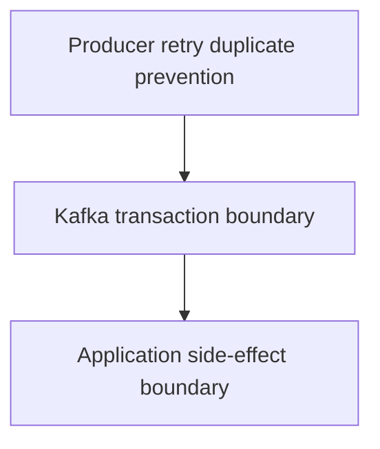
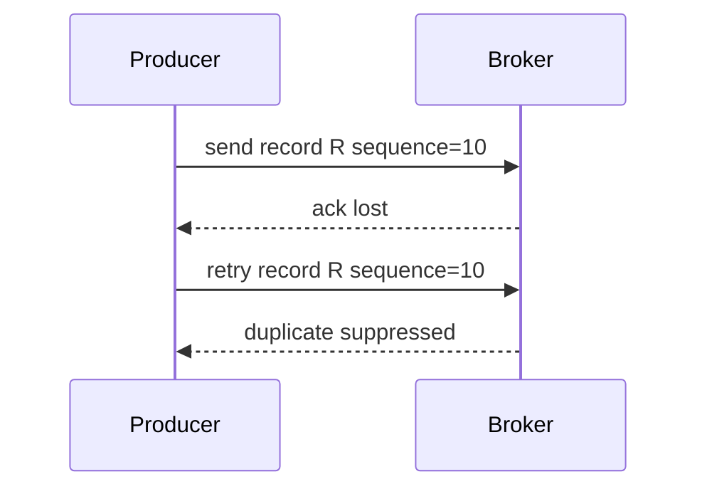
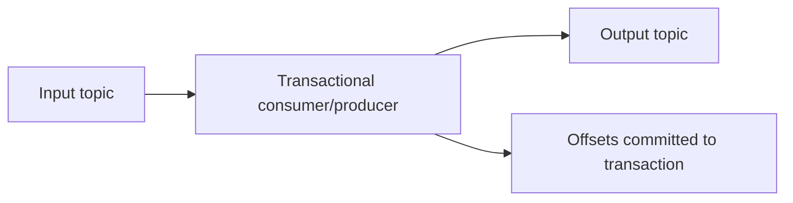
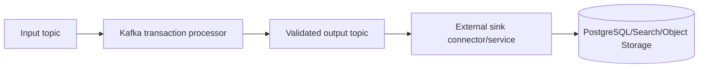
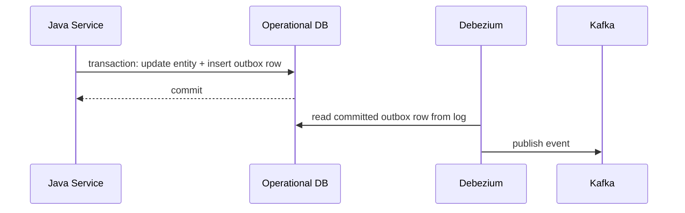

# Part 040 — Kafka Exactly-Once Boundaries

“Exactly once” is one of the most misunderstood phrases in data pipeline engineering.

A junior interpretation is:

> The system will process each event exactly once.

A production interpretation is:

> Within a clearly defined boundary, under specific configuration and failure assumptions, the system prevents duplicate effects in Kafka-visible state and committed offsets.

Those are not the same.

Kafka has real exactly-once capabilities. Idempotent producers prevent duplicate writes from producer retries within Kafka. Transactions can atomically write output records and commit consumed offsets. Kafka Streams can use these primitives to provide exactly-once processing guarantees for Kafka-to-Kafka topologies and stateful processing.

But those guarantees do not automatically extend to external systems such as PostgreSQL, Elasticsearch, S3/object storage, email, payment gateways, REST APIs, or a regulatory case-management API. The moment your pipeline leaves the Kafka transactional boundary, you must design idempotency and reconciliation yourself.

This part gives you the boundary model.

---

## 1. The Core Question

When someone says “exactly once”, ask:

> Exactly once for which effect, in which system, across which failure boundary?

Effects differ:

| Effect | Example | Covered by Kafka transactions? |
|---|---|---|
| Produce record to Kafka topic | `output-topic` receives event | Yes, if transactional producer is used correctly |
| Commit consumed offsets | Consumer group offset advances | Yes, if offsets are sent to transaction |
| Update Kafka Streams state store | Local state + changelog | Yes, within Streams processing guarantee |
| Write to PostgreSQL | Upsert projection row | No, not by Kafka transaction alone |
| Write to Elasticsearch | Index document | No |
| Send email | Notify officer | No |
| Call external REST API | Create downstream task | No |
| Write file to object storage | Produce Parquet output | No, unless sink implements its own transactional/idempotent protocol |

The phrase “exactly once” is incomplete until the effect is named.

---

## 2. Three Layers of Guarantee

Think in layers.



### Layer 1 — Idempotent Producer

Kafka producer retries can otherwise create duplicate records. An idempotent producer attaches producer identity and sequence information so broker-side duplicate appends from retry can be suppressed.

This protects Kafka writes from producer retry duplication.

It does not protect external side effects.

### Layer 2 — Kafka Transactions

Kafka transactions allow a producer to write records to multiple partitions/topics atomically and commit consumed offsets as part of the same transaction.

This enables consume-transform-produce patterns where:

```text
read input records
produce output records
commit consumed offsets
```

becomes one Kafka transaction.

If the transaction aborts, output records are not visible to `read_committed` consumers, and offsets are not committed as consumed.

### Layer 3 — External Idempotency

If processing also writes to PostgreSQL, Elasticsearch, S3, or an API, Kafka cannot make that external effect atomic with the Kafka transaction unless the external system participates in the same transaction protocol, which most do not.

You need patterns like:

- idempotent sink,
- transactional outbox,
- inbox table,
- dedupe key,
- compare-and-swap version guard,
- reconciliation,
- two-phase publish with recovery,
- effect ledger.

---

## 3. Idempotent Producer Boundary

A Kafka producer can be configured for idempotent production.

Conceptually:

```java
Properties props = new Properties();
props.put(ProducerConfig.BOOTSTRAP_SERVERS_CONFIG, bootstrapServers);
props.put(ProducerConfig.KEY_SERIALIZER_CLASS_CONFIG, StringSerializer.class.getName());
props.put(ProducerConfig.VALUE_SERIALIZER_CLASS_CONFIG, StringSerializer.class.getName());
props.put(ProducerConfig.ENABLE_IDEMPOTENCE_CONFIG, "true");
props.put(ProducerConfig.ACKS_CONFIG, "all");
```

Idempotence addresses this failure:



It does not mean your application never calls `send()` twice for the same business event.

If application code does this:

```java
producer.send(recordFor(event));
producer.send(recordFor(event));
```

Kafka idempotent producer does not infer these are semantically duplicate business events. They are two sends.

You still need an event identity and a producer-side publication invariant.

---

## 4. Kafka Transaction Boundary

A transactional producer has a `transactional.id`.

Simplified flow:

```java
producer.initTransactions();

while (running) {
    ConsumerRecords<String, InputEvent> records = consumer.poll(Duration.ofMillis(500));

    producer.beginTransaction();
    try {
        for (ConsumerRecord<String, InputEvent> record : records) {
            OutputEvent output = transform(record.value());
            producer.send(new ProducerRecord<>("output-topic", record.key(), output));
        }

        Map<TopicPartition, OffsetAndMetadata> offsets = offsetsAfter(records);
        producer.sendOffsetsToTransaction(offsets, consumer.groupMetadata());
        producer.commitTransaction();
    } catch (Exception e) {
        producer.abortTransaction();
    }
}
```

This gives an atomic Kafka-visible effect:

```text
output records visible + input offsets committed
```

or:

```text
output records not visible + input offsets not committed
```

That is powerful.

But notice the boundary: all effects shown above are Kafka effects.

---

## 5. `read_committed` Matters

Kafka consumers can control visibility of transactional records through isolation level.

A consumer with `read_committed` only reads committed transactional records. A consumer with `read_uncommitted` may see records from transactions that later abort.

For downstream consumers that rely on transactional output correctness, use:

```java
props.put(ConsumerConfig.ISOLATION_LEVEL_CONFIG, "read_committed");
```

If a downstream consumer reads uncommitted records, the producer's transaction boundary no longer protects that consumer from aborted outputs.

Production invariant:

> If a topic is written transactionally and consumers require committed-only semantics, consumer isolation level must be part of the topic contract.

---

## 6. The Consume-Transform-Produce Pattern

Kafka exactly-once is strongest when your topology is:

```text
Kafka input -> deterministic transform -> Kafka output
```



This pattern works because offsets and output records are both managed by Kafka transaction protocol.

Failure cases:

| Failure | Outcome |
|---|---|
| Crash before transaction commit | Output not committed; offsets not committed; input reprocessed |
| Crash after transaction commit | Output committed; offsets committed; no reprocessing of committed input |
| Producer retry | Duplicate append suppressed/transactionally controlled |
| Consumer restart | Resumes from committed offsets |

This does not mean the transform method is invoked only once. It can be invoked multiple times across retries/crashes. The guarantee is about committed Kafka-visible effects, not CPU execution count.

That distinction is critical.

---

## 7. Invocation Once vs Effect Once

A function may execute multiple times even when its output effect is committed exactly once.

```text
attempt 1:
  read event A
  transform A
  produce output B
  crash before commit

attempt 2:
  read event A again
  transform A again
  produce output B again
  commit transaction
```

The transform executed twice. The committed Kafka output appears once.

So never place non-idempotent external effects inside the transform function.

Bad:

```java
OutputEvent transform(InputEvent input) {
    emailClient.send("case escalated"); // unsafe side effect
    return new OutputEvent(...);
}
```

Good:

```java
OutputEvent transform(InputEvent input) {
    return new NotificationRequested(...); // Kafka-visible effect
}
```

Then a separate notification service consumes `NotificationRequested` and handles idempotency explicitly.

---

## 8. External Sink Boundary Failure

Consider this pipeline:

```text
Kafka input -> Java consumer -> PostgreSQL projection -> commit Kafka offset
```

Failure:

```text
1. Read event E at offset 100
2. Write projection row to PostgreSQL
3. Crash before committing Kafka offset
4. Restart
5. Read event E again
6. Write projection row again
```

Kafka cannot prevent duplicate PostgreSQL effects. The fix is idempotent PostgreSQL write.

Example:

```sql
INSERT INTO processed_event(event_id, processed_at)
VALUES (?, now())
ON CONFLICT (event_id) DO NOTHING;
```

Then only apply side effect if the insert succeeds inside the same database transaction:

```sql
BEGIN;

INSERT INTO processed_event(event_id, processed_at)
VALUES (:event_id, now())
ON CONFLICT DO NOTHING;

-- If row inserted, apply projection update.

COMMIT;
```

This is the inbox pattern from the sink side.

The guarantee becomes:

> At-least-once delivery from Kafka + idempotent sink = effectively-once external effect.

This is often the correct production answer.

---

## 9. External Sink With Kafka Transaction: Still Not Atomic

A common mistake:

```java
producer.beginTransaction();
repository.upsertToPostgres(view);     // external side effect
producer.send(outputRecord);
producer.sendOffsetsToTransaction(offsets, groupMetadata);
producer.commitTransaction();
```

If PostgreSQL commit succeeds but Kafka transaction aborts, the external view has changed while Kafka output/offsets did not.

If Kafka transaction commits but PostgreSQL commit fails, Kafka says processing is complete while external view is missing.

Unless PostgreSQL and Kafka participate in the same distributed transaction protocol, this is not atomic.

Do not hide this with comments like:

```java
// exactly once transaction
```

It is not exactly once across Kafka and PostgreSQL.

---

## 10. Pattern: Kafka-to-Kafka First, External Sink Later

One robust design is to keep the exactly-once boundary inside Kafka first.



The first stage produces a clean, deduplicated, validated, canonical Kafka topic with Kafka EOS.

The second stage writes externally using idempotent sink semantics.

Advantages:

- external sink can be retried independently,
- output topic becomes a durable intent log,
- replay and reconciliation are easier,
- failed external writes do not block upstream transformation forever,
- operational boundaries are clearer.

This is not always lower latency, but it is often more defensible.

---

## 11. Pattern: Outbox Instead of Dual Write

For operational services, use transactional outbox:

```text
Java service transaction:
  update business table
  insert outbox event

Debezium/Kafka Connect:
  read outbox row via CDC
  publish to Kafka
```



The database transaction becomes the atomic boundary for business update + event intent. Kafka publication becomes asynchronous but recoverable via CDC.

This solves the classic dual-write problem better than trying to make application code write to DB and Kafka in separate operations.

---

## 12. Pattern: Inbox for External Consumer Effects

For consumers that cause external effects, use inbox/effect ledger.

```sql
CREATE TABLE consumer_inbox (
  consumer_name text NOT NULL,
  event_id text NOT NULL,
  status text NOT NULL,
  received_at timestamptz NOT NULL,
  completed_at timestamptz,
  PRIMARY KEY (consumer_name, event_id)
);
```

Algorithm:

```java
void handle(Envelope<Event> envelope) {
    db.transaction(() -> {
        boolean firstTime = inbox.tryStart("case-projection", envelope.eventId());
        if (!firstTime) {
            return;
        }

        projection.apply(envelope.payload(), envelope.sourcePosition());
        inbox.markCompleted("case-projection", envelope.eventId());
    });

    consumer.commitSync(offsetAfter(envelope));
}
```

This protects against:

- crash after DB write before Kafka offset commit,
- duplicate delivery,
- replay,
- rebalance during processing,
- manual backfill.

---

## 13. Kafka Streams Exactly-Once Boundary

Kafka Streams can be configured for processing guarantees.

Conceptually:

```java
props.put(StreamsConfig.PROCESSING_GUARANTEE_CONFIG, StreamsConfig.EXACTLY_ONCE_V2);
```

Within Kafka Streams, this coordinates:

- consumed input offsets,
- produced output records,
- state store changelog updates,
- task-level transactions.

This works best for Kafka-to-Kafka/stateful topology:

```text
input topic -> Kafka Streams topology -> state store/changelog -> output topic
```

It does not make arbitrary external calls inside `map`, `foreach`, `peek`, or Processor API callbacks exactly once.

Unsafe:

```java
stream.foreach((key, value) -> externalApi.createTicket(value));
```

If the task fails and reprocesses, the external API can be called again.

Safe alternative:

```java
stream
    .mapValues(value -> TicketCreationRequested.from(value))
    .to("ticket-creation-requested");
```

Then a separate idempotent worker handles external API calls with an effect ledger.

---

## 14. Exactly-Once and State Stores

State stores introduce another boundary.

Kafka Streams can restore state from changelog topics. With exactly-once configuration, state updates and output records are coordinated through Kafka transactional mechanics.

But you still need deterministic state logic.

Bad state logic:

```java
state.put(key, Instant.now().toString());
```

Replay creates different state.

Better:

```java
state.put(key, event.occurredAt().toString());
```

Or:

```java
state.put(key, event.sourceVersion());
```

The pipeline guarantee assumes the processing function is deterministic enough for your business semantics. If you use wall-clock time, random UUIDs, external reads, or mutable reference data without versioning, you can produce different outputs across replay.

Exactly-once delivery does not imply deterministic computation.

---

## 15. Exactly-Once and Non-Determinism

Sources of non-determinism:

| Source | Risk |
|---|---|
| `Instant.now()` | Different output on replay |
| `UUID.randomUUID()` | Duplicate semantic event with different ID |
| External API lookup | Reference value changes over time |
| Database read outside transaction boundary | Replay sees different state |
| Floating point aggregation | Order-sensitive precision differences |
| Concurrent mutation | Race-dependent result |
| Random partitioning | Different ordering and grouping |

Mitigation:

- use event time from input,
- derive IDs from stable input identity,
- version reference data,
- snapshot lookup tables,
- make transforms pure,
- isolate external calls,
- use deterministic tie-breakers.

---

## 16. Transactional ID and Fencing

A transactional producer uses `transactional.id` to maintain transaction state and fence old producer instances.

Why fencing matters:

```text
Instance A starts with transactional.id=processor-4
Instance A pauses due to GC/network issue
Instance B starts with same transactional.id=processor-4
Broker fences old producer A
A cannot later commit stale transaction
```

This prevents split-brain producers with the same transactional identity.

Operational rule:

> Transactional IDs must be stable for the processing shard/task identity, but unique enough to avoid unrelated instances fencing each other.

Bad:

```text
transactional.id = "my-service"
```

All instances fight.

Better:

```text
transactional.id = "case-normalizer-partition-4"
```

Frameworks such as Kafka Streams manage this internally. For custom Java consumers/producers, you must design it deliberately.

---

## 17. Offset Commit Boundaries

Manual consumer processing has this classic ordering problem:

```text
Option A:
  commit offset
  process record

Option B:
  process record
  commit offset
```

Option A risks data loss if the process crashes after offset commit but before processing.

Option B risks duplicate processing if the process crashes after processing but before offset commit.

Kafka transactions create Option C for Kafka outputs:

```text
process record
produce output
commit output + offset atomically in Kafka transaction
```

For external output, Option C is not available by Kafka alone. Use idempotent external sink.

---

## 18. Delivery Semantics Matrix

| Design | Kafka output duplicate protection | External side-effect duplicate protection | Notes |
|---|---:|---:|---|
| Auto-commit consumer + external write | Low | Low | Common but unsafe |
| Manual commit after external write | Medium | Needs idempotent sink | At-least-once + dedupe |
| Kafka transactional consume-transform-produce | High | N/A | Strong for Kafka-to-Kafka |
| Kafka transaction + external write inside transaction block | High for Kafka only | Low/medium | Misleading if called global EOS |
| Outbox producer | High business atomicity to DB | N/A | DB transaction creates event intent |
| Inbox consumer | N/A | High | Best for external effects |
| Kafka Streams EOS + external API in foreach | High for Streams internals | Low | Avoid |
| Kafka Streams EOS + output intent topic + idempotent worker | High | High | Strong compositional design |

---

## 19. Effectively-Once as the Practical Target

In production, “effectively once” is often a better phrase than “exactly once.”

It means:

> The system may receive or execute attempts more than once, but the durable business effect is equivalent to one successful application.

For external sinks, effectively-once needs:

1. stable event ID,
2. idempotency key,
3. dedupe/effect ledger,
4. transaction around dedupe marker + side effect when possible,
5. version guard for projections,
6. reconciliation job,
7. replay-safe operational process.

Example event ID:

```java
record EventId(String value) {
    static EventId forAggregateVersion(String aggregateType, String aggregateId, long version) {
        return new EventId(aggregateType + ":" + aggregateId + ":" + version);
    }
}
```

Do not generate a new random idempotency key per retry. The idempotency key must be stable across retries and replays.

---

## 20. Side-Effect Ledger Pattern

A side-effect ledger records attempted and completed effects.

```sql
CREATE TABLE side_effect_ledger (
  effect_type text NOT NULL,
  effect_key text NOT NULL,
  status text NOT NULL,
  request_hash text NOT NULL,
  response_reference text,
  attempt_count int NOT NULL DEFAULT 0,
  created_at timestamptz NOT NULL,
  updated_at timestamptz NOT NULL,
  PRIMARY KEY (effect_type, effect_key)
);
```

Use it for:

- external API calls,
- email sending,
- ticket creation,
- document generation,
- notification dispatch,
- irreversible workflow actions.

Algorithm:

```java
EffectResult performOnce(EffectCommand command) {
    return db.transaction(() -> {
        Optional<EffectRecord> existing = ledger.find(command.type(), command.key());

        if (existing.isPresent() && existing.get().completed()) {
            return existing.get().toResult();
        }

        ledger.recordAttempt(command);
        // Call external system only if the command is safe to retry
        // or if the external system also accepts the same idempotency key.
        ExternalResponse response = external.call(command.idempotencyKey(), command.payload());
        ledger.markCompleted(command, response.reference());
        return EffectResult.completed(response.reference());
    });
}
```

Caveat: if the external call is made inside a DB transaction and the process crashes after the call but before ledger completion, you still have unknown outcome. For APIs that support idempotency keys, retry with the same key. For APIs that do not, you need reconciliation or manual repair.

---

## 21. Unknown Outcome Is the Real Enemy

The hardest failure is not success or failure. It is unknown outcome.

Example:

```text
1. Send request to external API
2. Timeout before response
3. Did the external system apply the effect?
```

If you retry blindly, you may duplicate the effect.

Handling strategy:

| External system capability | Strategy |
|---|---|
| Supports idempotency key | Retry same key |
| Supports lookup by client reference | Query before retry |
| Supports compensation | Retry/compensate with saga logic |
| No idempotency, no lookup | Quarantine/manual review for high-risk effects |

For regulatory workflows, unknown outcome should often move to a controlled exception lane rather than silent retry.

---

## 22. Testing Exactly-Once Boundaries

Do not test exactly-once with only happy-path unit tests.

Inject crashes at every boundary:

```text
read input
after transform
after first output send
after all output sends
before sendOffsetsToTransaction
after sendOffsetsToTransaction
before commitTransaction
after commitTransaction
before external write
after external write before offset commit
```

Expected properties:

| Test | Expected result |
|---|---|
| Crash before Kafka transaction commit | No committed output; input reprocessed |
| Crash after Kafka transaction commit | Output visible once; offset committed |
| Duplicate input delivery to idempotent sink | One durable external effect |
| External API timeout with idempotency key | Same effect reference eventually recovered |
| Rebalance during processing | No lost partition work; duplicates tolerated |
| Replay same event range | Same final projection state |

A useful test harness records all durable effects and verifies uniqueness by business key, not by method invocation count.

---

## 23. Observability for EOS Pipelines

Metrics:

| Metric | Meaning |
|---|---|
| transaction commit rate | Healthy transactional throughput |
| transaction abort rate | Failure/retry signal |
| transaction duration | Risk of timeout or fencing |
| producer errors by type | Authorization, fencing, timeout, serialization |
| duplicate sink suppressions | Idempotency working or upstream duplicate issue |
| stale update rejections | Replay/order issue |
| DLQ records | Non-retryable failures |
| external unknown outcomes | Manual/reconciliation risk |
| read committed lag | Downstream visibility delay |
| effect ledger pending age | Stuck side effects |

Logs should include:

- event ID,
- idempotency key,
- transaction ID or processing shard,
- input topic/partition/offset,
- output topic/partition,
- external effect key,
- failure boundary.

Example:

```json
{
  "event": "external_effect_unknown",
  "effectType": "CREATE_ESCALATION_TASK",
  "effectKey": "case:C-123:escalation:v7",
  "inputTopic": "case-escalation-requested.v1",
  "partition": 3,
  "offset": 78122,
  "reason": "api_timeout_after_send"
}
```

---

## 24. Common Anti-Patterns

### 24.1 “Kafka Transactions Make My Database Writes Exactly Once”

They do not. Use idempotent database writes or outbox/inbox patterns.

### 24.2 External API Calls Inside Kafka Streams `foreach`

Kafka Streams can reprocess. External APIs need idempotency keys and effect ledgers.

### 24.3 Random Event IDs on Retry

A duplicate with a new ID cannot be deduped. Event identity must be stable.

### 24.4 Committing Offsets Before Side Effects

This risks data loss.

### 24.5 Assuming Transform Runs Once

It may run multiple times. Design for effect-once, not invocation-once.

### 24.6 Using Processing Time in Deterministic Output

Replay produces different output. Use event/source time where correctness matters.

### 24.7 Ignoring Consumer Isolation Level

Transactional output consumed with `read_uncommitted` weakens the guarantee.

### 24.8 No Reconciliation

Without reconciliation, you cannot prove your effectively-once design worked.

---

## 25. Review Checklist

Before accepting any “exactly-once” claim, ask:

1. What is the exact effect that should occur once?
2. Is the effect inside Kafka or outside Kafka?
3. If Kafka output: are transactions used correctly?
4. Are offsets committed inside the transaction?
5. Are downstream consumers using `read_committed` if needed?
6. What is the transactional ID strategy?
7. What happens on producer fencing?
8. What happens if transform executes twice?
9. Are output event IDs deterministic?
10. Are external sinks idempotent?
11. Is there an inbox/effect ledger?
12. How are unknown outcomes resolved?
13. Are retries bounded and observable?
14. Can the same input range be replayed safely?
15. What reconciliation proves no duplicate or missing business effects?

---

## 26. Design Decision Guide

Use Kafka transactions when:

- input and output are Kafka topics,
- output records and offsets must commit atomically,
- downstream consumers can use committed-read semantics,
- the processing function is deterministic enough,
- transaction overhead is acceptable.

Use idempotent sink/inbox when:

- writing to a database,
- updating a search index,
- calling an external API,
- producing irreversible side effects,
- consuming from Kafka with at-least-once delivery.

Use outbox when:

- a service updates a database and must publish an event,
- you need atomic business state + event intent,
- dual-write risk is unacceptable.

Use reconciliation when:

- the sink is external,
- correctness is business-critical,
- unknown outcomes are possible,
- data loss/duplication has regulatory or financial impact.

---

## 27. What You Should Internalize

Kafka exactly-once is real, but scoped.

It is strong when the whole effect lives inside Kafka: consumed offsets, produced records, and Kafka Streams state/changelog. It is not a universal force field around your application. External databases, APIs, files, emails, and case-management systems require their own idempotency, effect ledger, and reconciliation design.

The senior engineering habit is to replace vague claims with explicit boundaries:

```text
This stage is Kafka-exactly-once from topic A to topic B.
This sink is at-least-once delivery with idempotent PostgreSQL upsert.
This external API action is effectively-once via idempotency key and effect ledger.
This deletion is reconciled daily against source of truth.
```

That language is not pedantic. It is how you prevent data loss, duplicate enforcement actions, broken dashboards, and false audit claims.

Exactly-once is not a slogan. It is a boundary contract.

---

## References

- Apache Kafka Documentation — [https://kafka.apache.org/documentation/](https://kafka.apache.org/documentation/)
- Confluent Kafka Delivery Semantics — [https://docs.confluent.io/kafka/design/delivery-semantics.html](https://docs.confluent.io/kafka/design/delivery-semantics.html)
- Confluent Kafka Streams Concepts — [https://docs.confluent.io/platform/current/streams/concepts.html](https://docs.confluent.io/platform/current/streams/concepts.html)
- Kafka Streams Architecture — [https://docs.confluent.io/platform/current/streams/architecture.html](https://docs.confluent.io/platform/current/streams/architecture.html)
