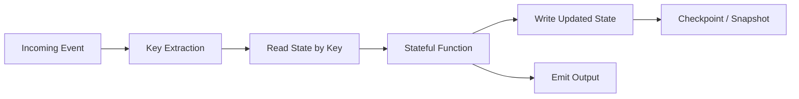
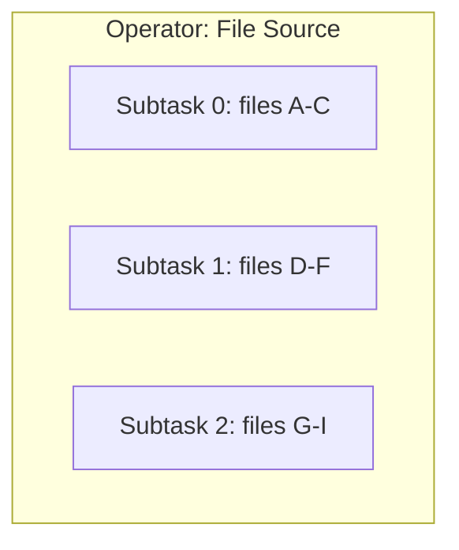
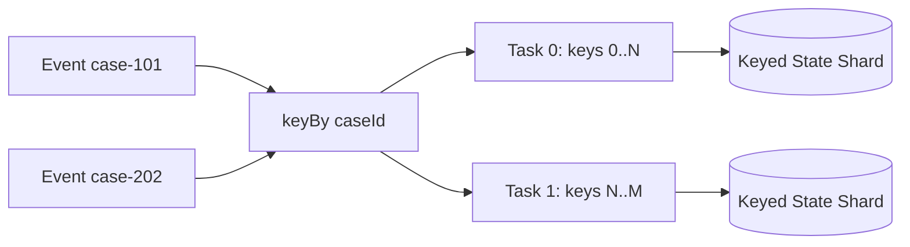
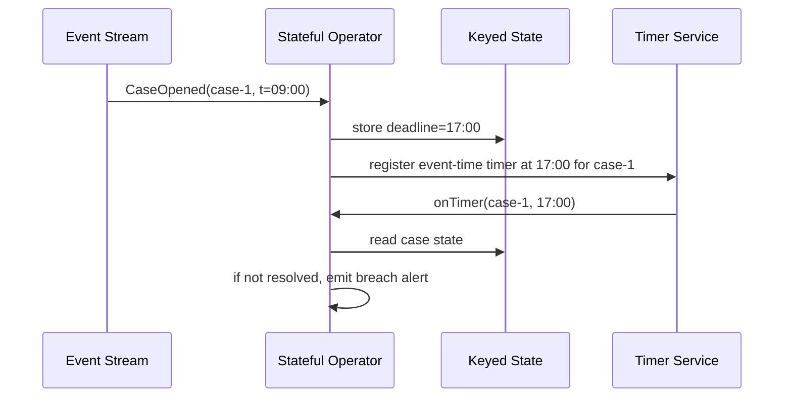
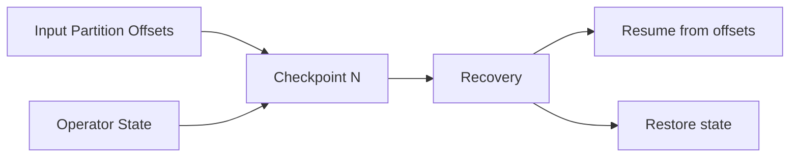
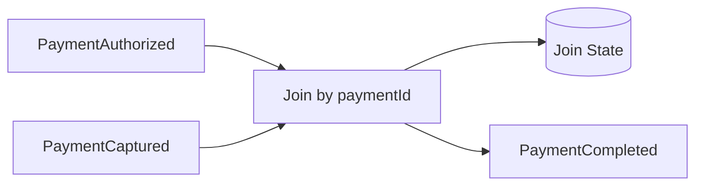
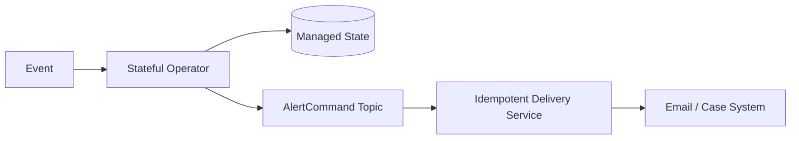

# Part 041 — Stateful Stream Processing Model

> Target bagian ini: kamu tidak hanya tahu bahwa Flink/Kafka Streams punya state store. Kamu harus bisa menjawab: state apa yang disimpan, siapa pemiliknya, kapan state berubah, bagaimana state dipartisi, bagaimana ia dipulihkan, apa yang terjadi saat replay, dan apa invariant yang harus dijaga agar output tetap benar.

Stateful stream processing adalah titik di mana pipeline berhenti menjadi `map/filter` sederhana dan mulai menjadi sistem terdistribusi yang memelihara memori bisnis lintas event.

Contoh:

- menghitung jumlah case aktif per kantor;
- mendeteksi SLA breach setelah 5 hari kerja;
- menggabungkan event transaksi dengan reference data terbaru;
- mendeteksi duplikasi event;
- membuat projection latest state dari event log;
- mengeluarkan alert hanya sekali walaupun input di-replay;
- menghitung rolling aggregate per customer selama 30 menit event-time.

Semua contoh itu membutuhkan state.

Tanpa model state yang benar, pipeline akan terlihat bekerja pada data kecil, lalu rusak saat ada restart, replay, late event, rescale, backfill, hot key, atau perubahan schema.

---

## 1. Stateless vs Stateful Processing

Pipeline stateless hanya melihat satu record pada satu waktu.

```java
CaseEvent input = ...;
CaseAlert output = transform(input);
```

Output bergantung pada input saat ini saja.

Stateful pipeline melihat record saat ini **plus memori dari record sebelumnya**.

```java
CaseEvent input = ...;
CaseState previous = state.get(input.caseId());
CaseState next = reduce(previous, input);
state.put(input.caseId(), next);
```

Output bergantung pada:

1. input saat ini;
2. state sebelumnya;
3. waktu;
4. ordering;
5. replay history;
6. expiry/TTL;
7. recovery behavior.

Mental modelnya:



Stateless function hanya perlu benar secara lokal. Stateful function harus benar secara temporal.

---

## 2. State is a Local Database Owned by an Operator

Cara paling produktif memahami stateful stream processing:

> Setiap stateful operator adalah database kecil yang dipartisi, di-update oleh event stream, dan di-snapshot untuk recovery.

State bukan sekadar variable di memory.

State punya properti:

| Properti | Arti |
|---|---|
| Scope | State milik operator tertentu, bukan seluruh pipeline secara global |
| Keying | Banyak state dipartisi berdasarkan key bisnis/event key |
| Lifecycle | State dibuat, di-update, dihapus, expired, dan dimigrasikan |
| Durability | State harus bisa dipulihkan setelah failure |
| Consistency | State harus konsisten dengan posisi input stream |
| Ownership | Hanya operator tertentu yang boleh mengubahnya |
| Version | Shape state bisa berubah saat deploy versi baru |

Dalam sistem seperti Flink, state dikelola oleh runtime, bukan sembarang `HashMap` manual tanpa checkpoint.

---

## 3. Why Plain Java Maps Are Not Enough

Pemula sering menulis:

```java
private final Map<String, CaseState> state = new HashMap<>();
```

Untuk demo lokal, ini terlihat masuk akal. Untuk production streaming, ini salah kecuali kamu sendiri membangun semua mekanisme berikut:

- partition ownership;
- restore after crash;
- consistent checkpoint;
- rescaling and state redistribution;
- TTL cleanup;
- memory bound;
- concurrent access control;
- snapshot serialization;
- state version migration;
- exactly/effectively-once relationship dengan output.

Masalah utamanya bukan `HashMap`. Masalahnya adalah state harus bergerak bersama **stream position**.

Jika input sudah diproses sampai offset 1.000.000 tetapi state hanya tersimpan sampai offset 990.000, recovery akan menghasilkan output berbeda.

Jika state sudah berubah sampai offset 1.000.000 tetapi checkpoint offset baru 990.000, replay 10.000 event bisa menggandakan effect.

Jadi invariant stateful processing:

> State snapshot dan posisi input harus merepresentasikan titik waktu logis yang sama.

---

## 4. Operator State vs Keyed State

Ada dua kategori besar state.

### 4.1 Operator State

Operator state melekat pada instance operator/subtask.

Contoh:

- buffer file chunks yang sedang dibaca;
- pending transactional sink handles;
- partition assignment metadata;
- batch accumulator per operator instance.

Operator state cocok ketika state tidak secara natural dipartisi oleh key bisnis.



Risiko operator state:

- rescale lebih rumit;
- ownership bisa berubah;
- perlu redistribution strategy;
- tidak cocok untuk entity-specific business state.

### 4.2 Keyed State

Keyed state dipartisi berdasarkan key.

Contoh:

- `caseId -> latest case status`;
- `customerId -> rolling transaction count`;
- `alertKey -> already emitted flag`;
- `idempotencyKey -> processed event marker`.



Keyed state adalah default untuk business stream processing.

Aturan sederhana:

> Bila state menjawab pertanyaan “apa status/akumulasi/riwayat untuk entity X?”, gunakan keyed state.

---

## 5. Key Selection Is a Correctness Decision

`keyBy()` bukan hanya optimasi distribusi. Itu boundary correctness.

Salah key menghasilkan:

- aggregate salah;
- join salah;
- dedupe tidak efektif;
- ordering tidak terjaga;
- hot partition;
- state explosion;
- breach detection palsu;
- alert duplicate.

Contoh event:

```java
record CaseAssignmentChanged(
    String eventId,
    String caseId,
    String officerId,
    String officeId,
    Instant occurredAt
) {}
```

Pertanyaan: key-nya apa?

Tergantung invariant:

| Tujuan | Key yang masuk akal |
|---|---|
| latest state per case | `caseId` |
| workload per officer | `officerId` |
| aggregate per office | `officeId` |
| dedupe event global | `eventId` atau `idempotencyKey` |
| SLA per case + stage | `caseId + stageCode` |

Jangan memilih key berdasarkan “field mana yang tersedia”. Pilih berdasarkan state ownership.

---

## 6. State Shape: What Exactly Are You Storing?

State shape harus eksplisit.

Buruk:

```java
Map<String, Object> state;
```

Lebih baik:

```java
record CaseLifecycleState(
    String caseId,
    CaseStatus status,
    Instant openedAt,
    Instant lastChangedAt,
    long version,
    boolean breachAlertEmitted,
    Set<String> processedEventIds
) {}
```

State yang baik menjawab:

1. Apa identitas entity?
2. Apa value bisnis saat ini?
3. Dari event mana value ini berasal?
4. Apa versi logic yang menulis state ini?
5. Apa state ini bisa expired?
6. Apa state ini bisa dibangun ulang dari log?
7. Apakah ada side-effect marker?
8. Apakah state menyimpan PII?
9. Apakah state punya TTL?
10. Apakah state compatible dengan version berikutnya?

---

## 7. Event, State, and Output as a Reducer

Stateful operator sebaiknya dipikirkan sebagai reducer deterministik.

```text
nextState, outputs = f(previousState, event, context)
```

Contoh Java:

```java
record TransitionResult<S, O>(S nextState, List<O> outputs) {}

interface StatefulReducer<K, E, S, O> {
    TransitionResult<S, O> apply(K key, S previous, E event, ProcessingContext context);
}
```

Reducer yang baik:

- tidak membaca jam sistem langsung;
- tidak memanggil API eksternal langsung;
- tidak menulis database langsung;
- tidak menghasilkan random value tanpa seed deterministic;
- tidak bergantung pada global mutable state;
- eksplisit terhadap input event dan context.

Side effect sebaiknya dikeluarkan sebagai command/output, bukan langsung dieksekusi di tengah state update.

```java
sealed interface CaseOutput permits CaseProjectionUpdated, SlaBreachAlertCommand {}
```

Ini membuat replay dan test jauh lebih aman.

---

## 8. Processing Context

Stateful function membutuhkan context, tetapi context harus dikontrol.

Contoh:

```java
interface ProcessingContext {
    Instant eventTime();
    Instant ingestionTime();
    Instant currentWatermark();
    boolean replayMode();
    String pipelineRunId();
    long attempt();
}
```

Jangan menyelundupkan dependency yang membuat hasil tidak deterministic.

Buruk:

```java
if (Instant.now().isAfter(deadline)) {
    emitAlert();
}
```

Lebih baik:

```java
if (context.eventTime().isAfter(deadline)) {
    emitAlert();
}
```

Untuk processing-time timers, gunakan timer service runtime, bukan `Thread.sleep()` atau scheduler sendiri di operator.

---

## 9. Timers: State Needs Time to Wake Up

Tidak semua output dipicu oleh event baru.

Contoh:

- case belum direspons setelah 3 hari;
- payment belum direkonsiliasi sampai cutoff;
- session dianggap selesai setelah 30 menit tidak aktif;
- window harus ditutup saat watermark melewati end time.

Timer memungkinkan operator berkata:

> Bangunkan saya pada waktu logis tertentu untuk key ini.

Mental model:



Timers biasanya ada dua jenis:

| Timer | Dipicu oleh | Cocok untuk |
|---|---|---|
| Event-time timer | progress event time/watermark | business-time correctness, late data handling |
| Processing-time timer | wall-clock runtime | operational timeout, cache refresh, periodic flush |

Untuk business correctness, prefer event-time timer.

---

## 10. Watermark and Event-Time Progress

Dalam stream nyata, event bisa datang terlambat dan tidak berurutan.

Event-time processing membutuhkan konsep progress:

> Watermark adalah klaim runtime bahwa event dengan timestamp lebih tua dari titik tertentu kemungkinan besar sudah datang.

Contoh:

```text
watermark = 10:00
```

Artinya operator boleh menutup window atau timer yang waktunya <= 10:00, tergantung policy lateness.

Watermark bukan jaminan absolut bahwa tidak akan ada event lama lagi. Ia adalah policy/progress signal.

Pipeline harus menentukan:

- bagaimana watermark dibuat;
- seberapa besar out-of-orderness yang ditoleransi;
- apa yang dilakukan pada late event;
- apakah late event memperbaiki output;
- apakah correction event diterbitkan;
- apakah output final atau retractable.

---

## 11. Stateful Processing and Ordering

Keyed state hanya aman jika event untuk key yang sama diproses dalam urutan yang sesuai dengan model bisnis.

Ada beberapa jenis ordering:

| Ordering | Arti |
|---|---|
| Arrival order | urutan event diterima pipeline |
| Broker offset order | urutan dalam partition Kafka |
| Event-time order | urutan berdasarkan waktu kejadian |
| Source transaction order | urutan commit di source DB |
| Business version order | urutan berdasarkan version/sequence bisnis |

Jangan menganggap semuanya sama.

Contoh buruk:

```text
CaseClosed(version=8) arrives before CaseAssigned(version=7)
```

Jika pipeline hanya memakai arrival order, state bisa mundur.

Pattern yang lebih aman:

```java
if (event.version() <= state.lastAppliedVersion()) {
    return ignoreAsStale(event);
}
```

Namun ini hanya valid bila source menyediakan monotonic version per entity.

---

## 12. State Consistency with Input Position

Stateful runtime harus menyimpan state bersama posisi input.



Checkpoint yang benar menjawab:

- sampai offset mana input sudah tercermin di state;
- state operator apa yang valid pada titik itu;
- timer apa yang terdaftar pada titik itu;
- output/commit apa yang sudah aman;
- external sink apa yang belum/ sudah committed.

Jika salah satu tidak sinkron, recovery menghasilkan duplicate atau loss.

---

## 13. Snapshot Is Not Backup Only

Snapshot/checkpoint sering disalahpahami sebagai backup.

Di stream processing, checkpoint adalah bagian dari correctness protocol.

Checkpoint bukan hanya untuk disaster recovery, tetapi untuk:

- restart after failure;
- rescaling job;
- version deployment;
- savepoint-driven migration;
- bounded backfill mode;
- consistent recovery of timers;
- exactly/effectively-once relation dengan source/sink.

Snapshot harus dibuat secara konsisten terhadap dataflow.

---

## 14. Replay Safety

Stateful operator harus menjawab:

> Jika event yang sama diproses ulang setelah restart, apakah state dan output tetap benar?

Ada empat pendekatan umum.

### 14.1 Deterministic Recompute

State bisa dibangun ulang dari event log.

Cocok untuk projection dan aggregate yang tidak punya external side effect.

### 14.2 Idempotent Update

State update aman jika event sama diproses ulang.

```java
if (state.processedEventIds().contains(event.eventId())) {
    return noChange();
}
```

Perhatikan biaya memori/TTL untuk `processedEventIds`.

### 14.3 Monotonic Version Guard

```java
if (event.version() <= state.version()) {
    return noChange();
}
```

Aman bila event punya version yang benar-benar monotonic per key.

### 14.4 External Effect Ledger

Untuk side effect eksternal, simpan effect key.

```text
effect_key = pipeline_name + output_type + business_key + trigger_time
```

Sink harus menolak effect duplicate.

---

## 15. State TTL Is a Business Decision

State tidak boleh tumbuh tanpa batas.

Tapi TTL bukan sekadar memory optimization. TTL mengubah semantics.

Contoh dedupe state:

```text
eventId -> seen, TTL 7 days
```

Jika event duplicate datang setelah 8 hari, pipeline akan menganggapnya baru.

Pertanyaannya:

- apakah itu acceptable?
- apakah source retention menjamin duplicate tidak muncul setelah TTL?
- apakah backfill akan melewati TTL?
- apakah dedupe perlu persistent ledger di sink?
- apakah expired state perlu menghasilkan output final?

TTL harus dijelaskan dalam contract.

---

## 16. State Explosion

State explosion terjadi saat jumlah key atau ukuran state per key tumbuh di luar asumsi.

Penyebab:

- key terlalu granular;
- idempotency set tidak pernah expired;
- session window tidak tertutup;
- reference data disimpan penuh per key;
- hot tenant;
- backfill mengaktifkan banyak historical keys;
- late data menahan window terlalu lama;
- bug yang membuat key unik per event.

Contoh bug:

```java
keyBy(event -> event.eventId())
```

Untuk aggregate per customer, ini membuat satu state per event, bukan per customer.

Metric wajib:

- number of active keys;
- state bytes;
- state bytes per key distribution;
- TTL cleanup rate;
- checkpoint size;
- checkpoint duration;
- restore duration;
- hot key rate;
- timer count.

---

## 17. Hot Keys

Hot key adalah key dengan traffic jauh lebih besar dari key lain.

Contoh:

- office pusat menerima 80% event;
- tenant enterprise sangat besar;
- `UNKNOWN_CUSTOMER` menjadi key fallback;
- semua event gagal parsing memakai key `null`;
- satu merchant memproses jutaan transaksi.

Hot key merusak parallelism karena keyed state untuk satu key hanya dapat diproses secara serial oleh satu task pada satu waktu.

Mitigasi:

| Strategi | Trade-off |
|---|---|
| Better key design | paling baik bila model bisnis memungkinkan |
| Key salting | butuh tahap merge; ordering per entity bisa hilang |
| Hierarchical aggregation | aggregate lokal lalu global |
| Separate hot-key pipeline | operasional lebih kompleks |
| Rate limiting per key | freshness key panas turun |
| Split by sub-entity | butuh invariant baru |

Jangan langsung memakai salting. Salting mengubah correctness model.

---

## 18. Stateful Joins

Join adalah stateful processing.

Untuk join dua stream, runtime harus menyimpan satu sisi sambil menunggu sisi lain.



Pertanyaan desain:

- key join apa?
- berapa lama menunggu pasangan event?
- apa yang terjadi bila pasangan tidak pernah datang?
- apakah event bisa datang terbalik?
- apakah output final atau koreksi?
- apakah join berdasarkan event time atau processing time?
- apakah duplicate di salah satu sisi aman?

Join tanpa expiry adalah state leak.

---

## 19. Windows Are State with a Closing Rule

Window bukan fitur dekoratif. Window adalah state bucket dengan aturan kapan bucket dibuka, di-update, dan ditutup.

Jenis umum:

| Window | Mental model |
|---|---|
| Tumbling | interval tetap tanpa overlap |
| Sliding | interval tetap dengan overlap |
| Session | bucket berakhir setelah inactivity gap |
| Global/custom | lifecycle ditentukan trigger/logic sendiri |

Window state harus menjawab:

- key apa?
- waktu apa?
- kapan window ditutup?
- apakah late event diterima?
- apakah output update/retract/final?
- bagaimana aggregate disimpan?

---

## 20. External Lookup Is Not State Unless Managed

Banyak pipeline melakukan enrichment:

```java
ReferenceData ref = api.get(event.code());
```

Ini terlihat sederhana, tetapi tidak stateful secara terkontrol.

Masalah:

- API latency masuk critical path;
- result berubah seiring waktu;
- replay menghasilkan output berbeda;
- rate limit;
- partial outage;
- no consistent snapshot;
- no lineage to reference version.

Pattern yang lebih aman:

1. masukkan reference data sebagai stream/table;
2. materialize sebagai keyed/broadcast state;
3. version-kan reference data;
4. catat reference version pada output;
5. tentukan missing-reference policy.

---

## 21. Side Effects in Stateful Operators

Stateful operator sering tergoda melakukan side effect langsung:

```java
if (breached) {
    emailClient.send(...);
}
```

Ini berbahaya karena restart/replay bisa mengirim email dua kali.

Pattern yang lebih aman:



Operator menghasilkan command. Delivery service mengeksekusi side effect dengan idempotency key.

---

## 22. Determinism and Nondeterminism

Stateful processing yang baik harus deterministic sebanyak mungkin.

Sumber nondeterminism:

- wall clock direct read;
- random UUID generation;
- unordered collection iteration;
- parallel race;
- external API lookup;
- database read without version;
- floating point aggregation differences;
- ambiguous tie-breaking;
- timezone conversion;
- mutable global config.

Aturan:

> Jika output harus reproducible, semua input yang memengaruhi output harus menjadi bagian dari event, state, atau versioned reference.

---

## 23. State Migration

State shape akan berubah.

Contoh v1:

```java
record CaseStateV1(String caseId, String status) {}
```

v2:

```java
record CaseStateV2(
    String caseId,
    String status,
    Instant lastChangedAt,
    boolean breachAlertEmitted
) {}
```

Risiko:

- old checkpoint tidak bisa dibaca;
- default value salah;
- logic baru menganggap state lama lengkap;
- TTL metadata hilang;
- timer lama tidak compatible;
- migration mengubah output tanpa audit.

State migration strategy:

1. version state explicitly;
2. support old reader;
3. migrate lazily on read atau eagerly via savepoint/backfill;
4. test restore from real snapshot;
5. run shadow job;
6. document semantic change.

---

## 24. Reprocessing and Stateful Jobs

Reprocessing stateful job tidak sama dengan reprocessing stateless transform.

Pertanyaan:

- mulai dari empty state atau restored state?
- apakah output lama diganti, dikoreksi, atau ditulis versi baru?
- apakah event-time timers akan fire ulang?
- apakah side effect dimatikan?
- apakah reference data memakai versi historical atau current?
- apakah late event policy sama?
- apakah state TTL berlaku selama backfill?

Mode umum:

| Mode | Arti |
|---|---|
| Live mode | memproses stream real-time dengan side effect aktif |
| Replay mode | membaca ulang event lama; side effect biasanya dimatikan/diubah |
| Backfill mode | menghasilkan output historis ke namespace versi baru |
| Repair mode | memperbaiki subset key/time range |
| Shadow mode | membandingkan output tanpa mengganti production |

Mode harus eksplisit di envelope/context.

---

## 25. Mini Stateful Processor in Plain Java

Sebelum memakai Flink, buat model kecil agar konsepnya jelas.

```java
public interface KeyedStateStore<K, S> {
    Optional<S> get(K key);
    void put(K key, S state);
    void delete(K key);
}

public interface TimerService<K> {
    void registerEventTimeTimer(K key, Instant timestamp);
}

public interface StatefulFunction<K, E, S, O> {
    TransitionResult<S, O> onEvent(K key, E event, Optional<S> state, ProcessingContext ctx);
    TransitionResult<S, O> onTimer(K key, Instant timestamp, Optional<S> state, ProcessingContext ctx);
}
```

Contoh SLA breach detector:

```java
record CaseSlaState(
    String caseId,
    Instant openedAt,
    Instant deadline,
    boolean resolved,
    boolean alertEmitted,
    long lastVersion
) {}

record SlaBreachAlert(String caseId, Instant deadline, String idempotencyKey) {}
```

Reducer:

```java
final class CaseSlaReducer
    implements StatefulFunction<String, CaseEvent, CaseSlaState, SlaBreachAlert> {

    @Override
    public TransitionResult<CaseSlaState, SlaBreachAlert> onEvent(
        String caseId,
        CaseEvent event,
        Optional<CaseSlaState> previous,
        ProcessingContext ctx
    ) {
        CaseSlaState state = previous.orElse(null);

        if (state != null && event.version() <= state.lastVersion()) {
            return new TransitionResult<>(state, List.of());
        }

        if (event instanceof CaseOpened opened) {
            Instant deadline = opened.openedAt().plus(opened.slaDuration());
            CaseSlaState next = new CaseSlaState(
                caseId,
                opened.openedAt(),
                deadline,
                false,
                false,
                opened.version()
            );
            ctx.timers().registerEventTimeTimer(caseId, deadline);
            return new TransitionResult<>(next, List.of());
        }

        if (event instanceof CaseResolved resolved && state != null) {
            CaseSlaState next = new CaseSlaState(
                caseId,
                state.openedAt(),
                state.deadline(),
                true,
                state.alertEmitted(),
                resolved.version()
            );
            return new TransitionResult<>(next, List.of());
        }

        return new TransitionResult<>(state, List.of());
    }

    @Override
    public TransitionResult<CaseSlaState, SlaBreachAlert> onTimer(
        String caseId,
        Instant timestamp,
        Optional<CaseSlaState> previous,
        ProcessingContext ctx
    ) {
        if (previous.isEmpty()) {
            return new TransitionResult<>(null, List.of());
        }

        CaseSlaState state = previous.get();
        if (state.resolved() || state.alertEmitted()) {
            return new TransitionResult<>(state, List.of());
        }

        String effectKey = "sla-breach:" + caseId + ":" + state.deadline();
        SlaBreachAlert alert = new SlaBreachAlert(caseId, state.deadline(), effectKey);

        CaseSlaState next = new CaseSlaState(
            state.caseId(),
            state.openedAt(),
            state.deadline(),
            state.resolved(),
            true,
            state.lastVersion()
        );

        return new TransitionResult<>(next, List.of(alert));
    }
}
```

Perhatikan beberapa hal:

- event lama diabaikan dengan version guard;
- timer menghasilkan output hanya jika state belum resolved;
- alert punya idempotency key;
- state menyimpan marker `alertEmitted`;
- reducer tidak mengirim email langsung;
- business time berasal dari event/timer context.

---

## 26. Production State Checklist

Sebelum menulis stateful job, jawab pertanyaan ini.

### Identity

- Apa key state?
- Apakah key stabil?
- Apakah key bisa null?
- Apakah ada hot key?
- Apakah key berubah saat entity merge/split?

### State shape

- Apa field state?
- Apa field yang derived vs source-of-truth?
- Apa field untuk dedupe/version guard?
- Apa state menyimpan PII?
- Apa version state?

### Time

- Apakah logic memakai event time, processing time, atau business effective time?
- Apakah butuh timer?
- Apakah timer event-time atau processing-time?
- Bagaimana late event memengaruhi state?

### Recovery

- Apakah state checkpointed?
- Apakah output sink consistent dengan checkpoint?
- Apakah replay menghasilkan duplicate?
- Apakah state bisa restore setelah schema berubah?

### Lifecycle

- Kapan state dibuat?
- Kapan state dihapus?
- Apakah TTL aman secara bisnis?
- Apakah backfill perlu menonaktifkan TTL?

### Observability

- Berapa jumlah key?
- Berapa ukuran state?
- Berapa timer aktif?
- Berapa checkpoint duration?
- Berapa restore duration?
- Apakah ada skew/hot key?

---

## 27. Common Anti-Patterns

### Anti-pattern 1: State Without Ownership

State dipakai oleh banyak operator atau banyak job tanpa contract.

Akibat:

- race;
- inconsistent projection;
- sulit migrate;
- impossible audit.

Perbaikan: setiap state punya owner job/operator dan output topic/table menjadi interface resmi.

### Anti-pattern 2: External DB as Hidden State

Operator membaca/menulis DB eksternal sebagai state utama tanpa checkpoint relation.

Akibat:

- recovery tidak konsisten;
- replay tidak deterministic;
- exactly-once klaim palsu.

Perbaikan: gunakan managed state untuk processing state, atau effect ledger/idempotent sink untuk external state.

### Anti-pattern 3: Infinite Dedupe Set

Menyimpan semua event ID selamanya.

Akibat:

- state explosion;
- checkpoint membesar;
- restore lama.

Perbaikan: TTL berdasarkan retention/replay contract, atau dedupe di sink ledger.

### Anti-pattern 4: Timer Without Idempotency

Timer fire, job restart, timer fire lagi, alert terkirim dua kali.

Perbaikan: state marker + idempotency key di sink.

### Anti-pattern 5: Business Logic Depends on Processing Time

Output berubah tergantung kapan job berjalan.

Perbaikan: gunakan event/business effective time untuk correctness, processing time hanya untuk operational behavior.

---

## 28. Mental Model Summary

Stateful stream processing adalah kombinasi lima hal:

```text
key + state + event + time + snapshot
```

Jika salah satu tidak eksplisit, pipeline akan rapuh.

- Key menentukan ownership.
- State menyimpan memori bisnis.
- Event menggerakkan transisi.
- Time menentukan kapan output boleh/final.
- Snapshot membuat recovery konsisten.

Framework seperti Flink membantu menjalankan model ini pada skala besar, tetapi framework tidak menggantikan keputusan desain.

Engineer top-tier tidak bertanya “API apa untuk state?”. Ia bertanya:

- state apa yang benar-benar dibutuhkan?
- apa invariant-nya?
- kapan state berubah?
- apa yang terjadi saat replay?
- bagaimana late event dikoreksi?
- bagaimana state dimigrasikan?
- bagaimana membuktikan output tidak hilang/duplicate?

Itulah level berpikir yang membuat stateful pipeline production-grade.

---

## 29. Bridge to Part 042

Bagian ini membangun model konseptual stateful stream processing.

Part berikutnya masuk ke implementasi dengan **Flink Java DataStream foundation**:

- execution environment;
- source/operator/sink;
- `keyBy`;
- `ProcessFunction`;
- managed keyed state;
- timers;
- parallelism;
- checkpoint-aware design;
- deployment shape;
- batas apa yang sebaiknya tidak ditaruh di operator Flink.
