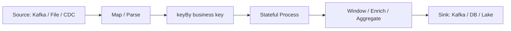
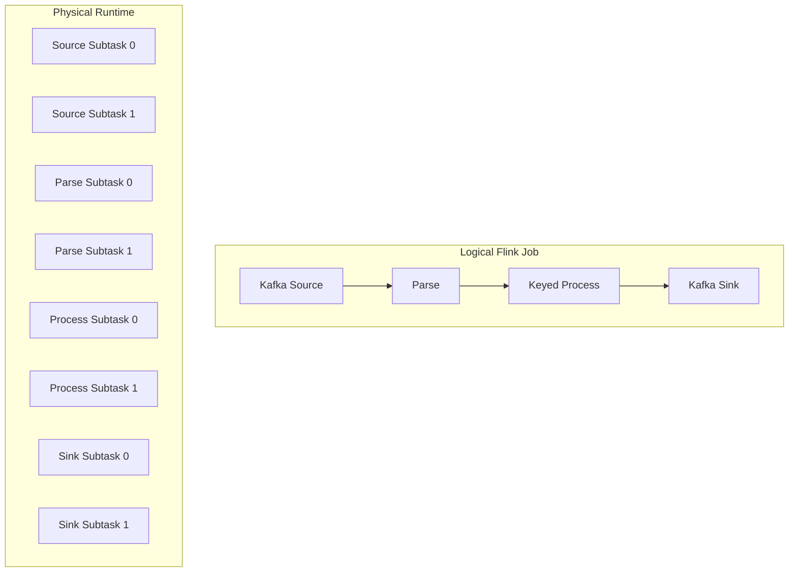
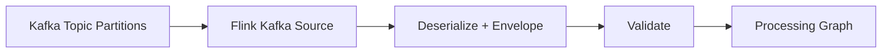
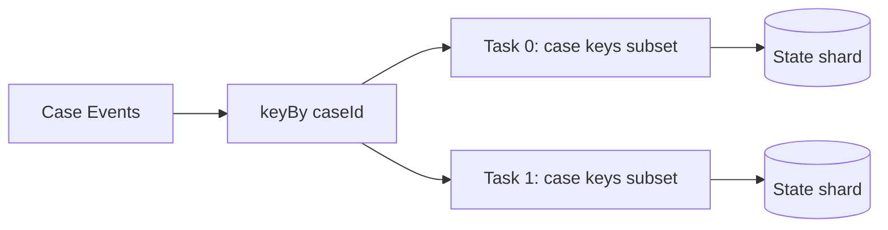
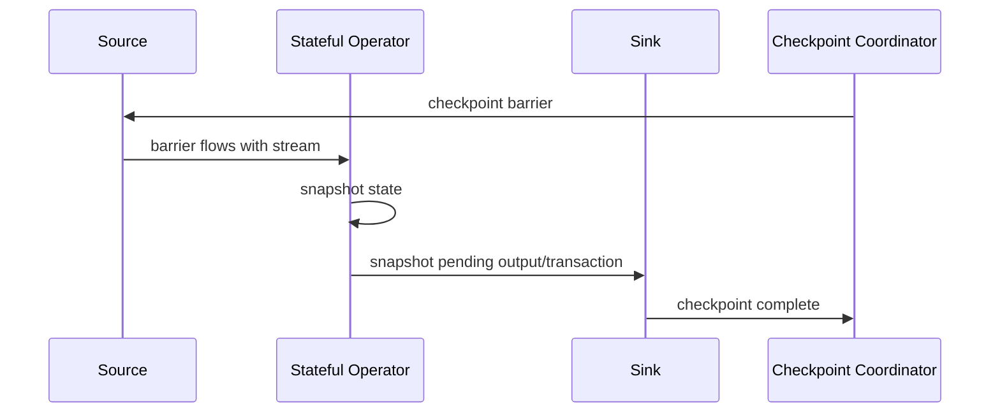
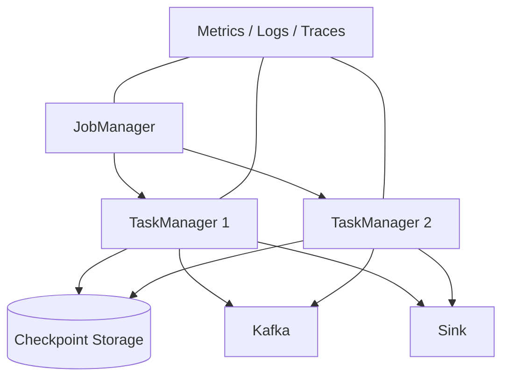

# Part 042 — Flink Java DataStream Foundation

> Target bagian ini: kamu bisa membaca dan merancang Flink DataStream job Java dengan benar secara arsitektural. Fokusnya bukan hafalan API, tetapi bagaimana source, operator, keying, state, timer, sink, parallelism, checkpoint, dan deployment boundary bekerja sebagai satu sistem.

Apache Flink adalah framework dan distributed processing engine untuk stateful computations atas unbounded dan bounded data streams. DataStream API adalah salah satu lapisan utama untuk membangun aplikasi stream processing yang butuh kontrol programatik.

Di bagian ini kita akan memakai Java sebagai bahasa utama dan membangun fondasi mental sebelum masuk checkpointing/savepoint secara lebih dalam pada Part 043.

---

## 1. Flink Job as a Distributed Dataflow

Flink job bukan sekadar program Java yang berjalan sekali. Ia adalah dataflow graph yang dijalankan secara paralel oleh runtime.

Mental model:



Setiap node dalam graph adalah operator. Runtime memecah operator menjadi beberapa parallel subtask.



Yang kamu tulis sebagai satu program akan dijalankan sebagai distributed execution graph.

---

## 2. Minimal DataStream Job

Contoh sederhana:

```java
public final class CasePipelineJob {

    public static void main(String[] args) throws Exception {
        StreamExecutionEnvironment env = StreamExecutionEnvironment.getExecutionEnvironment();

        DataStream<String> raw = env.fromElements(
            "case-1,OPENED,2026-07-04T01:00:00Z",
            "case-1,ASSIGNED,2026-07-04T01:05:00Z"
        );

        DataStream<CaseEvent> events = raw
            .map(CaseEventParser::parse)
            .name("parse-case-event");

        events
            .map(CaseEvent::toString)
            .print()
            .name("debug-print");

        env.execute("case-pipeline-local");
    }
}
```

Ini hanya fondasi.

Dalam production, source/sink biasanya Kafka, object storage, lakehouse, database connector, atau custom source/sink. Tetapi struktur dasarnya sama:

1. create environment;
2. define source;
3. transform stream;
4. define sink;
5. execute job.

---

## 3. Flink Types in Java

Flink perlu memahami tipe data untuk serialization, state, shuffle, dan operator execution.

Gunakan tipe yang eksplisit.

```java
public record CaseEvent(
    String eventId,
    String caseId,
    String eventType,
    Instant occurredAt,
    long version
) implements Serializable {}
```

Untuk pipeline serius, hindari `Map<String, Object>` sebagai payload utama setelah parse boundary.

Better model:

```java
sealed interface CaseEvent permits CaseOpened, CaseAssigned, CaseResolved {
    String eventId();
    String caseId();
    Instant occurredAt();
    long version();
}

public record CaseOpened(
    String eventId,
    String caseId,
    Instant occurredAt,
    long version,
    Duration slaDuration
) implements CaseEvent {}
```

Namun pastikan serializer dan framework version yang dipakai mendukung pola Java modern yang kamu pilih. Untuk compatibility jangka panjang, banyak tim tetap memakai POJO stabil, Avro-generated classes, atau DTO eksplisit di boundary Flink.

---

## 4. Source Boundary

Source adalah boundary antara dunia luar dan Flink runtime.

Source harus menjawab:

- data datang dari mana?
- apa posisi input yang bisa dipulihkan?
- apakah source bounded atau unbounded?
- apakah source mendukung checkpoint?
- apakah source menyimpan event-time metadata?
- bagaimana deserialize error ditangani?
- apakah source ordering penting?
- apakah source punya partition/shard?

Contoh shape:



Untuk source Kafka, jangan menaruh semua logic di deserializer. Deserializer sebaiknya fokus mengubah bytes menjadi envelope/record awal. Validation, classification, routing, dan quarantine lebih baik menjadi operator eksplisit agar observable.

---

## 5. Transform Boundary

Transform dalam Flink bisa berupa:

| Transform | Cocok untuk |
|---|---|
| `map` | 1 input menjadi 1 output |
| `flatMap` | 1 input menjadi 0..N output |
| `filter` | drop/keep |
| `process` | akses context, timer, side output |
| `keyBy` | repartition by key |
| `connect` | menghubungkan dua stream berbeda |
| `union` | menggabungkan stream tipe sama |
| `window` | aggregate berbasis waktu/bucket |

Prinsip desain:

- operator kecil lebih mudah diamati;
- operator terlalu kecil bisa menambah overhead dan kompleksitas graph;
- beri nama operator secara eksplisit;
- pisahkan parse, validate, transform, enrich, sink;
- jangan menyembunyikan side effect di `map`.

Contoh naming:

```java
events
    .filter(new ValidCaseEventFilter())
    .name("filter-valid-case-events")
    .uid("filter-valid-case-events-v1");
```

`name` membantu observability. `uid` penting untuk stabilitas state mapping saat restore/savepoint pada job stateful.

---

## 6. keyBy: The Repartition Boundary

`keyBy` mengubah stream menjadi keyed stream. Semua event dengan key sama diarahkan ke logical key group yang sama dan diproses oleh operator keyed state yang sama.

```java
KeyedStream<CaseEvent, String> byCaseId = events.keyBy(CaseEvent::caseId);
```

Mental model:



`keyBy` adalah expensive boundary karena bisa menyebabkan network shuffle.

Gunakan `keyBy` ketika:

- state harus dimiliki per business key;
- aggregate/join/dedupe butuh semua event key yang sama bertemu;
- timer perlu per key;
- ordering per key penting.

Jangan `keyBy` berdasarkan field yang high-cardinality tapi tidak diperlukan oleh invariant.

---

## 7. Stateless Operator Example

```java
public final class ParseCaseEvent implements MapFunction<String, CaseEvent> {
    @Override
    public CaseEvent map(String raw) {
        String[] parts = raw.split(",");
        return new GenericCaseEvent(
            UUID.nameUUIDFromBytes(raw.getBytes(StandardCharsets.UTF_8)).toString(),
            parts[0],
            parts[1],
            Instant.parse(parts[2]),
            0L
        );
    }
}
```

Catatan:

- contoh ini deterministic karena eventId dibuat dari raw input;
- di production, eventId biasanya berasal dari source atau envelope;
- parser harus punya policy untuk invalid input, bukan crash tanpa konteks.

Lebih production-grade:

```java
SingleOutputStreamOperator<CaseEvent> validEvents = raw
    .process(new ParseAndValidateCaseEvent(invalidRecordTag))
    .name("parse-and-validate-case-event")
    .uid("parse-and-validate-case-event-v1");

DataStream<InvalidRecord> invalidRecords = validEvents.getSideOutput(invalidRecordTag);
```

Side output berguna untuk memisahkan invalid lane tanpa menghentikan semua stream, jika policy bisnis mengizinkan.

---

## 8. ProcessFunction: Controlled Access to Runtime Context

`ProcessFunction` memberi akses ke context lebih kaya dibanding `map`.

Gunakan ketika perlu:

- side output;
- timestamp/watermark access;
- timer pada keyed variant;
- runtime context;
- richer error handling;
- custom routing.

Untuk keyed state dan timer, gunakan `KeyedProcessFunction`.

---

## 9. Managed Keyed State Example

SLA breach detector di Flink:

```java
public final class CaseSlaBreachFunction
    extends KeyedProcessFunction<String, CaseEvent, SlaBreachAlert> {

    private transient ValueState<CaseSlaState> state;

    @Override
    public void open(Configuration parameters) {
        ValueStateDescriptor<CaseSlaState> descriptor = new ValueStateDescriptor<>(
            "case-sla-state-v1",
            CaseSlaState.class
        );
        state = getRuntimeContext().getState(descriptor);
    }

    @Override
    public void processElement(
        CaseEvent event,
        Context ctx,
        Collector<SlaBreachAlert> out
    ) throws Exception {
        CaseSlaState current = state.value();

        if (current != null && event.version() <= current.lastVersion()) {
            return;
        }

        if (event instanceof CaseOpened opened) {
            Instant deadline = opened.occurredAt().plus(opened.slaDuration());
            CaseSlaState next = new CaseSlaState(
                opened.caseId(),
                opened.occurredAt(),
                deadline,
                false,
                false,
                opened.version()
            );
            state.update(next);
            ctx.timerService().registerEventTimeTimer(deadline.toEpochMilli());
            return;
        }

        if (event instanceof CaseResolved resolved && current != null) {
            CaseSlaState next = current.markResolved(resolved.version());
            state.update(next);
        }
    }

    @Override
    public void onTimer(
        long timestamp,
        OnTimerContext ctx,
        Collector<SlaBreachAlert> out
    ) throws Exception {
        CaseSlaState current = state.value();
        if (current == null) {
            return;
        }

        if (current.resolved() || current.alertEmitted()) {
            return;
        }

        String effectKey = "sla-breach:" + current.caseId() + ":" + current.deadline();
        out.collect(new SlaBreachAlert(current.caseId(), current.deadline(), effectKey));
        state.update(current.markAlertEmitted());
    }
}
```

Pipeline usage:

```java
DataStream<SlaBreachAlert> alerts = events
    .keyBy(CaseEvent::caseId)
    .process(new CaseSlaBreachFunction())
    .name("detect-case-sla-breach")
    .uid("detect-case-sla-breach-v1");
```

Important:

- state dikelola runtime Flink;
- state scoped ke current key;
- timer registered per key;
- function tidak mengirim email langsung;
- output punya idempotency/effect key.

---

## 10. State Descriptors Are Part of the Contract

Nama state descriptor bukan detail kecil.

```java
new ValueStateDescriptor<>("case-sla-state-v1", CaseSlaState.class)
```

Nama ini menjadi identitas state dalam runtime/checkpoint/savepoint.

Jangan sembarangan rename state descriptor pada job stateful. Rename bisa membuat Flink tidak menemukan state lama saat restore.

Praktik:

- beri nama eksplisit dan stabil;
- masukkan versi bila perlu;
- dokumentasikan state ownership;
- test restore dari checkpoint/savepoint lama;
- jangan refactor nama operator/state tanpa migration plan.

---

## 11. Flink State Types

State keyed umum:

| State Type | Mental model | Contoh |
|---|---|---|
| `ValueState<T>` | satu value per key | latest case state |
| `ListState<T>` | list per key | pending events |
| `MapState<K,V>` | map per key | dedupe ids, per-sub-key counters |
| `ReducingState<T>` | incremental reduce | running total |
| `AggregatingState<IN, OUT>` | aggregate custom | rolling metrics |

Pilih state berdasarkan access pattern.

Jangan memakai `ListState` untuk semua hal. Jika butuh lookup by id, `MapState` lebih tepat. Jika butuh satu latest value, `ValueState` lebih sederhana.

---

## 12. Timer Semantics in Flink

Dalam keyed process function, timer service bisa mendaftarkan timer.

Event-time timer:

```java
ctx.timerService().registerEventTimeTimer(deadline.toEpochMilli());
```

Processing-time timer:

```java
ctx.timerService().registerProcessingTimeTimer(System.currentTimeMillis() + 60_000);
```

Gunakan event-time untuk logic bisnis seperti SLA berdasarkan kejadian. Gunakan processing-time untuk behavior operasional seperti periodic cleanup atau flush, dengan hati-hati.

Timer harus idempotent.

Timer bisa fire setelah recovery. Function harus membaca state dan memutuskan apakah output masih perlu.

---

## 13. Watermark Strategy

Event-time logic membutuhkan timestamp assignment dan watermark.

Contoh:

```java
WatermarkStrategy<CaseEvent> watermarkStrategy = WatermarkStrategy
    .<CaseEvent>forBoundedOutOfOrderness(Duration.ofMinutes(5))
    .withTimestampAssigner((event, previousTimestamp) -> event.occurredAt().toEpochMilli());

DataStream<CaseEvent> eventsWithWatermarks = events
    .assignTimestampsAndWatermarks(watermarkStrategy)
    .name("assign-case-event-watermarks");
```

Pertanyaan desain:

- timestamp berasal dari field mana?
- berapa toleransi out-of-order?
- apakah source bisa idle?
- apa late event policy?
- apakah watermark global tertahan oleh partition idle?
- apakah event-time perlu memakai business effective time, bukan occurredAt teknis?

Watermark strategy adalah bagian dari correctness contract.

---

## 14. Side Outputs for Error and Late Data

Side output memungkinkan memisahkan lane.

```java
static final OutputTag<InvalidRecord> INVALID_RECORDS =
    new OutputTag<>("invalid-records") {};

static final OutputTag<LateCaseEvent> LATE_EVENTS =
    new OutputTag<>("late-case-events") {};
```

Use cases:

- invalid parse;
- schema violation;
- late event;
- missing reference;
- suspicious PII;
- quarantine;
- debug sample.

Namun side output bukan alasan untuk menelan semua error. Ada error yang harus fail-fast, terutama bila output correctness tidak bisa dijamin.

---

## 15. Sink Boundary

Sink adalah tempat side effect terjadi.

Sink harus menjawab:

- apakah output append-only atau upsert?
- apakah sink idempotent?
- apakah sink transactional?
- apakah sink participate in checkpoint?
- bagaimana retry dilakukan?
- bagaimana duplicate dicegah?
- apa commit boundary?
- apakah output bisa dikoreksi?
- apakah sink menyimpan lineage/effect key?

Untuk Kafka sink, gunakan key dan headers dengan sengaja.

```java
alerts.sinkTo(alertKafkaSink)
    .name("sink-sla-alerts-to-kafka")
    .uid("sink-sla-alerts-to-kafka-v1");
```

Untuk database sink, jangan hanya `INSERT` tanpa idempotency key.

Pattern:

```sql
CREATE TABLE emitted_alert (
  effect_key TEXT PRIMARY KEY,
  case_id TEXT NOT NULL,
  deadline TIMESTAMPTZ NOT NULL,
  emitted_at TIMESTAMPTZ NOT NULL,
  payload JSONB NOT NULL
);
```

Then upsert/insert-ignore by `effect_key`.

---

## 16. Avoid Heavy External Calls in Operators

Flink operator berada di hot path. External API call langsung di operator bisa menyebabkan:

- throughput collapse;
- checkpoint delay;
- timeout storm;
- nondeterministic replay;
- hidden dependency;
- rate limit;
- backpressure cascade.

Alternatif:

1. reference data stream menjadi broadcast/keyed state;
2. async I/O dengan timeout dan capacity limit;
3. pre-materialized lookup table;
4. enrichment service yang punya cache dan SLO jelas;
5. split pipeline: emit enrichment request, process response stream.

Jika memakai async I/O, tetap perlu jawab: ordering, timeout, duplicate, retry, fallback, dan replay determinism.

---

## 17. Parallelism

Flink menjalankan operator dengan parallelism tertentu.

```java
env.setParallelism(4);
```

Atau per operator:

```java
events
    .keyBy(CaseEvent::caseId)
    .process(new CaseSlaBreachFunction())
    .setParallelism(8)
    .name("detect-case-sla-breach");
```

Parallelism memengaruhi:

- throughput;
- ordering boundary;
- state distribution;
- checkpoint size per subtask;
- resource usage;
- hot key behavior;
- recovery time;
- sink concurrency.

Menaikkan parallelism tidak menyelesaikan hot key tunggal. Satu key tetap diproses serial.

---

## 18. Operator Chaining

Flink dapat meng-chain operator untuk efisiensi.

Secara mental:

```text
map -> filter -> map
```

bisa dijalankan dalam satu task chain.

Keuntungan:

- mengurangi serialization/network overhead;
- latency lebih rendah;
- resource lebih efisien.

Risiko:

- observability per operator kurang jelas;
- failure/debug boundary kurang eksplisit;
- resource isolation lebih sulit.

Untuk pipeline kritis, operator naming dan metric tetap penting walaupun chaining aktif.

---

## 19. Checkpoint Awareness

Part 043 akan mendalami checkpoint, tapi sejak awal job design harus checkpoint-aware.

Pertanyaan:

- source mendukung checkpointed offset?
- state dikelola Flink atau external?
- sink mendukung checkpoint-aligned commit?
- operator punya side effect non-idempotent?
- state descriptor stabil?
- job bisa restore dari savepoint?

Minimal mental model:



Jika sink eksternal tidak ikut protocol, kamu harus membuat idempotency/effect ledger sendiri.

---

## 20. Job Parameters and Configuration

Jangan hardcode topic, watermark delay, sink URL, checkpoint path, atau mode.

Gunakan config object.

```java
record JobConfig(
    String inputTopic,
    String outputTopic,
    Duration watermarkMaxOutOfOrderness,
    boolean replayMode,
    int parallelism
) {}
```

Parsing:

```java
ParameterTool params = ParameterTool.fromArgs(args);
JobConfig config = new JobConfig(
    params.getRequired("input.topic"),
    params.getRequired("output.topic"),
    Duration.parse(params.get("watermark.maxOutOfOrderness", "PT5M")),
    params.getBoolean("replay.mode", false),
    params.getInt("parallelism", 4)
);
```

Config juga harus punya auditability:

- job version;
- schema version;
- transform version;
- watermark config;
- source topic/offset mode;
- sink target;
- replay/backfill mode.

---

## 21. Deployment Shape

Flink production deployment biasanya melibatkan:

- JobManager;
- TaskManagers;
- job jar;
- checkpoint storage;
- state backend;
- source/sink credentials;
- metrics reporter;
- log aggregation;
- restart strategy;
- resource limits;
- upgrade/savepoint process.

Conceptual view:



Untuk engineer Java, jangan hanya fokus pada jar. Runtime topology dan storage checkpoint adalah bagian dari aplikasi.

---

## 22. Project Structure

Struktur yang sehat:

```text
case-pipeline/
  src/main/java/
    com.example.pipeline/
      CasePipelineJob.java
      config/
        JobConfig.java
      model/
        CaseEvent.java
        CaseSlaState.java
        SlaBreachAlert.java
      serde/
        CaseEventDeserializationSchema.java
      operator/
        ParseAndValidateCaseEvent.java
        CaseSlaBreachFunction.java
      sink/
        AlertSinkFactory.java
      testkit/
        CaseEventFixtures.java
  src/test/java/
    ...
```

Pisahkan:

- model;
- serialization;
- operator logic;
- source/sink factory;
- config;
- test fixtures.

Jangan menulis semua logic di `main()`.

---

## 23. Test Strategy for DataStream Logic

Test harus ada beberapa level.

### 23.1 Pure Function Test

Jika transform pure, test langsung.

```java
@Test
void parsesCaseOpenedEvent() {
    CaseEvent event = CaseEventParser.parse(raw);
    assertThat(event.caseId()).isEqualTo("case-1");
}
```

### 23.2 Stateful Function Harness Test

Untuk keyed state/timer, gunakan test harness bila tersedia di stack yang dipilih, atau bungkus core reducer sebagai pure reducer agar mudah diuji.

Testing goals:

- state update benar;
- stale version ignored;
- timer emits once;
- resolved case tidak emit alert;
- duplicate event tidak double output;
- late event behavior sesuai policy.

### 23.3 Integration Test

Test job dengan embedded/local runtime dan source/sink test.

Goals:

- serialization works;
- watermarks assigned;
- state checkpoint/restore behavior;
- sink output shape;
- DLQ/side output path.

---

## 24. Example: Full Skeleton Job

```java
public final class CaseSlaPipelineJob {

    public static void main(String[] args) throws Exception {
        ParameterTool params = ParameterTool.fromArgs(args);
        JobConfig config = JobConfig.from(params);

        StreamExecutionEnvironment env = StreamExecutionEnvironment.getExecutionEnvironment();
        env.setParallelism(config.parallelism());

        DataStream<RawRecord> raw = SourceFactory
            .caseEventSource(config)
            .build(env)
            .name("source-case-events")
            .uid("source-case-events-v1");

        SingleOutputStreamOperator<CaseEvent> events = raw
            .process(new ParseAndValidateCaseEvent(OperatorTags.INVALID_RECORDS))
            .name("parse-validate-case-events")
            .uid("parse-validate-case-events-v1");

        DataStream<InvalidRecord> invalid = events.getSideOutput(OperatorTags.INVALID_RECORDS);

        WatermarkStrategy<CaseEvent> watermarkStrategy = WatermarkStrategy
            .<CaseEvent>forBoundedOutOfOrderness(config.watermarkMaxOutOfOrderness())
            .withTimestampAssigner((event, previous) -> event.occurredAt().toEpochMilli());

        DataStream<CaseEvent> timedEvents = events
            .assignTimestampsAndWatermarks(watermarkStrategy)
            .name("assign-event-time-watermark")
            .uid("assign-event-time-watermark-v1");

        DataStream<SlaBreachAlert> alerts = timedEvents
            .keyBy(CaseEvent::caseId)
            .process(new CaseSlaBreachFunction())
            .name("detect-sla-breach")
            .uid("detect-sla-breach-v1");

        alerts
            .sinkTo(SinkFactory.alertSink(config))
            .name("sink-sla-breach-alerts")
            .uid("sink-sla-breach-alerts-v1");

        invalid
            .sinkTo(SinkFactory.invalidRecordSink(config))
            .name("sink-invalid-case-records")
            .uid("sink-invalid-case-records-v1");

        env.execute("case-sla-pipeline");
    }
}
```

Ini skeleton, bukan copy-paste final. Yang penting adalah boundary-nya jelas:

- source;
- parse/validate;
- side output invalid;
- watermark;
- keyBy;
- stateful process;
- idempotent output;
- sink;
- stable name/uid.

---

## 25. What Belongs in Flink Operator vs Outside

| Concern | Di operator Flink? | Catatan |
|---|---:|---|
| deterministic transform | Ya | ideal |
| keyed state transition | Ya | managed state |
| event-time timer | Ya | runtime timer service |
| external email sending | Tidak langsung | emit command ke idempotent service |
| schema compatibility check | Sebagian | better di CI + runtime validation |
| heavy reference lookup | Hati-hati | prefer stream/table/broadcast state |
| business authorization | Biasanya di upstream service | pipeline tetap enforce data access/privacy |
| audit output generation | Ya | jika deterministic dan contract jelas |
| DLQ/quarantine routing | Ya | policy eksplisit |
| orchestration dependency | Tidak | pakai Airflow/Temporal/platform control plane |

---

## 26. Observability Basics

Flink job production harus expose:

- input rate;
- output rate;
- busy/backpressured time;
- watermark lag;
- Kafka consumer lag;
- checkpoint duration;
- checkpoint failure count;
- state size;
- number of active keys;
- invalid record count;
- DLQ count;
- late event count;
- timer count;
- sink error rate;
- restart count.

Beri nama operator agar metric bisa dibaca manusia.

Buruk:

```text
Map -> FlatMap -> Process -> Sink
```

Baik:

```text
parse-validate-case-events
assign-event-time-watermark
detect-sla-breach
sink-sla-breach-alerts
```

---

## 27. Production Review Checklist

Sebelum Flink job masuk production, review:

### Source

- source bounded/unbounded jelas;
- offset/position recoverable;
- schema deserialization policy jelas;
- invalid data lane jelas;
- source timestamp jelas.

### Transform

- operator names stable;
- `uid` stable untuk stateful operator;
- transform deterministic;
- key selection justified;
- no hidden external side effect.

### State

- state descriptor names stable;
- state shape versioned;
- TTL policy eksplisit;
- restore tested;
- hot key risk dianalisis.

### Time

- event-time field jelas;
- watermark delay justified;
- late event policy jelas;
- timer idempotent.

### Sink

- sink idempotent/transactional;
- effect key tersedia;
- retry policy jelas;
- DLQ/quarantine path jelas;
- output contract documented.

### Operations

- checkpoint enabled/configured sesuai kebutuhan;
- restart strategy ditentukan;
- metrics/logging tersedia;
- deployment resource ditentukan;
- rollback/savepoint plan tersedia;
- replay/backfill mode aman.

---

## 28. Common Mistakes in Java Flink Jobs

### Mistake 1: Treating Flink Like a Loop

Flink job bukan:

```java
while (true) {
    read();
    process();
    write();
}
```

Ia adalah graph. Runtime yang mengatur scheduling, checkpoint, state, dan parallelism.

### Mistake 2: Side Effect in Map

```java
events.map(event -> {
    emailClient.send(...);
    return event;
});
```

Ini replay-unsafe.

### Mistake 3: Random UUID in Replayable Output

```java
new Alert(UUID.randomUUID().toString(), caseId)
```

Replay menghasilkan ID berbeda. Gunakan deterministic effect key.

### Mistake 4: keyBy Wrong Field

```java
keyBy(CaseEvent::eventId)
```

Untuk lifecycle per case, ini salah. Seharusnya `caseId`.

### Mistake 5: State Descriptor Rename Without Plan

Rename state descriptor/operator UID bisa merusak restore.

### Mistake 6: Watermark Delay Copy-Paste

`Duration.ofMinutes(5)` bukan magic. Itu harus berdasarkan distribusi lateness nyata dan business tolerance.

---

## 29. Mental Model Summary

Flink DataStream job production-grade adalah kombinasi:

```text
source position + event time + keyed dataflow + managed state + checkpoint-aware sink
```

Jika hanya tahu API `map`, `filter`, `keyBy`, `process`, kamu belum cukup.

Yang penting:

- source harus recoverable;
- event harus typed dan timestamped;
- key harus sesuai invariant;
- state harus managed dan versioned;
- timer harus idempotent;
- sink harus aman terhadap replay;
- operator identity harus stabil;
- checkpoint/recovery harus dipikirkan dari awal.

Flink memberi runtime untuk stateful distributed streaming, tetapi correctness tetap hasil desain kamu.

---

## 30. Bridge to Part 043

Bagian ini membangun fondasi Java DataStream.

Part berikutnya akan masuk lebih dalam ke:

- checkpointing;
- savepoints;
- restart strategy;
- state backend;
- checkpoint storage;
- barrier alignment;
- restore;
- upgrade;
- rescaling;
- state migration;
- operational runbook untuk job Flink stateful.
