# Part 043 — Flink Checkpointing, Savepoints, and Stateful Recovery

> Pipeline streaming yang punya state tidak bisa dianggap benar hanya karena operator-nya benar.
> Ia baru bisa dianggap production-grade kalau kita tahu **state mana yang dipulihkan, offset mana yang diputar ulang, sink mana yang aman terhadap retry, dan bagaimana upgrade dilakukan tanpa kehilangan correctness**.

Part ini membahas checkpointing dan savepoint dalam Flink dari sudut pandang implementasi Java pipeline, bukan sekadar konfigurasi.

Kita akan membangun mental model berikut:

1. **Checkpoint** adalah mekanisme recovery otomatis.
2. **Savepoint** adalah mekanisme operasi terkontrol untuk upgrade, migration, rollback, dan redeploy.
3. **State backend** menentukan bagaimana state disimpan, di-checkpoint, dan direstore.
4. **Exactly-once di Flink** adalah guarantee yang bergantung pada source, state, sink, checkpoint, dan commit protocol.
5. **Upgrade streaming job** adalah migrasi stateful distributed application, bukan sekadar restart jar.

---

## 1. Masalah Dasar: Stateful Stream Tidak Bisa Diulang Sembarangan

Bayangkan pipeline:

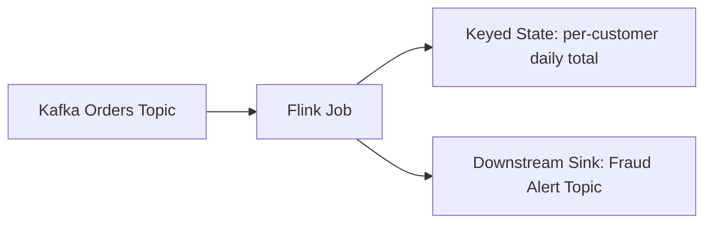

Flink job membaca order event, mengakumulasi total transaksi per customer, lalu mengeluarkan alert jika melewati threshold.

Tanpa checkpointing, saat job crash:

- consumer offset terakhir bisa tidak jelas,
- state akumulasi bisa hilang,
- output alert bisa sudah terkirim sebagian,
- event yang sama bisa diproses ulang,
- downstream bisa menerima duplicate,
- agregasi bisa double count.

Stateful stream processor harus menjawab pertanyaan:

> Kalau proses mati tepat setelah membaca event, setelah update state, atau setelah menulis sink, sistem akan kembali ke titik mana?

Checkpointing adalah cara Flink menjawab pertanyaan itu.

---

## 2. Checkpoint Bukan Backup File Biasa

Checkpoint adalah **consistent distributed snapshot** dari job Flink.

Yang disimpan bukan hanya data state operator, tetapi juga posisi stream yang berkaitan dengan state tersebut.

Secara mental:

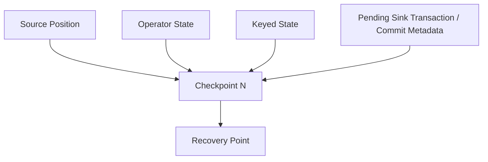

Checkpoint yang valid berarti:

- source bisa melanjutkan dari posisi yang konsisten,
- operator state bisa dikembalikan,
- keyed state bisa dipulihkan,
- sink yang mendukung checkpoint-aware commit bisa menyelesaikan/rollback transaksi sesuai protokolnya,
- output setelah recovery tidak menyebabkan state internal menjadi salah.

Dokumentasi Flink menjelaskan bahwa checkpoint memungkinkan recovery state dan posisi stream untuk memberikan fault tolerance pada aplikasi stream processing. Mekanisme ini menjadi inti dari stateful fault tolerance.

---

## 3. Checkpoint vs Savepoint

Keduanya sama-sama snapshot state, tetapi tujuan operasionalnya berbeda.

| Aspek | Checkpoint | Savepoint |
|---|---|---|
| Tujuan utama | Recovery otomatis setelah failure | Operasi terkontrol: upgrade, migration, rollback |
| Trigger | Biasanya otomatis periodik | Biasanya manual atau eksplisit saat stop-with-savepoint |
| Lifecycle | Dikelola Flink, bisa dibersihkan otomatis | Dimiliki operator/platform/user |
| Penggunaan | Restart setelah crash | Deploy versi baru, pindah cluster, ubah parallelism |
| Sifat | Operational recovery artifact | Durable operational handoff artifact |
| Harus stabil antar versi? | Tidak selalu ditujukan sebagai artifact migrasi | Lebih cocok untuk stateful upgrade/migration |
| Risiko jika hilang | Recovery dari checkpoint tertentu gagal, tetapi mungkin ada checkpoint lain | Bisa kehilangan titik rollback/migration yang direncanakan |

Mental model:

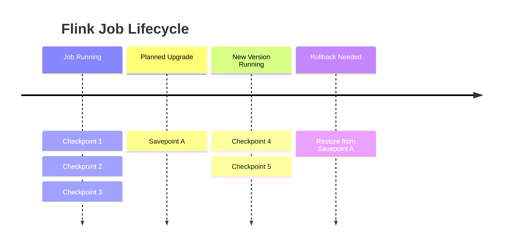

Rule praktis:

- Gunakan **checkpoint** untuk automatic fault tolerance.
- Gunakan **savepoint** untuk operasi yang disengaja dan harus bisa diaudit.

---

## 4. Barrier dan Consistent Snapshot

Flink membuat checkpoint dengan menyuntikkan checkpoint barrier ke aliran data.

Secara sederhana:

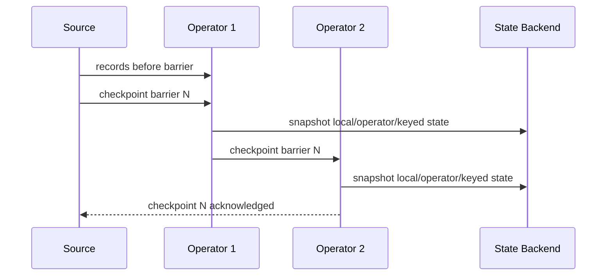

Untuk operator dengan multiple input, barrier alignment menjadi penting.

Jika satu input sudah menerima barrier checkpoint N tetapi input lain belum, operator harus memastikan snapshot tidak mencampur data sebelum dan sesudah checkpoint secara tidak konsisten.

Konsekuensinya:

- checkpoint bisa lambat jika salah satu input lambat,
- backpressure bisa memperlambat barrier propagation,
- checkpoint duration bisa menjadi indikator pipeline sedang tidak sehat,
- unaligned checkpoint bisa membantu saat backpressure, tetapi membawa trade-off.

---

## 5. State yang Di-checkpoint

Di Flink, state yang umum perlu dipahami:

| State | Makna | Contoh |
|---|---|---|
| Keyed state | State terpartisi berdasarkan key | total transaksi per customer |
| Operator state | State milik operator instance | source split assignment |
| Broadcast state | State yang dibroadcast ke task paralel | reference rule/config |
| Window state | State untuk window aktif | aggregasi 5 menit |
| Timer state | Timer event-time/processing-time | timeout detection |

Contoh Java keyed state:

```java
public final class CustomerDailyTotalFunction
    extends KeyedProcessFunction<String, PaymentEvent, FraudSignal> {

    private transient ValueState<BigDecimal> dailyTotal;

    @Override
    public void open(Configuration parameters) {
        ValueStateDescriptor<BigDecimal> descriptor =
            new ValueStateDescriptor<>(
                "customer-daily-total-v1",
                BigDecimal.class
            );

        dailyTotal = getRuntimeContext().getState(descriptor);
    }

    @Override
    public void processElement(
            PaymentEvent event,
            Context ctx,
            Collector<FraudSignal> out) throws Exception {

        BigDecimal current = dailyTotal.value();
        if (current == null) {
            current = BigDecimal.ZERO;
        }

        BigDecimal next = current.add(event.amount());
        dailyTotal.update(next);

        if (next.compareTo(new BigDecimal("10000000")) > 0) {
            out.collect(new FraudSignal(event.customerId(), next, event.eventTime()));
        }
    }
}
```

Hal penting:

- nama state descriptor adalah bagian dari identitas state,
- tipe state adalah bagian dari kontrak restore,
- mengubah nama state sembarangan bisa membuat state lama tidak ditemukan,
- mengubah tipe state sembarangan bisa membuat restore gagal atau data salah,
- state harus diperlakukan sebagai schema yang berevolusi.

---

## 6. Checkpoint Semantics: Tidak Cukup Mengaktifkan `enableCheckpointing`

Contoh konfigurasi minimal:

```java
StreamExecutionEnvironment env =
    StreamExecutionEnvironment.getExecutionEnvironment();

env.enableCheckpointing(60_000L);

CheckpointConfig checkpointConfig = env.getCheckpointConfig();
checkpointConfig.setCheckpointingMode(CheckpointingMode.EXACTLY_ONCE);
checkpointConfig.setMinPauseBetweenCheckpoints(30_000L);
checkpointConfig.setCheckpointTimeout(10 * 60_000L);
checkpointConfig.setMaxConcurrentCheckpoints(1);
checkpointConfig.setTolerableCheckpointFailureNumber(3);
```

Tetapi production-grade checkpointing bukan hanya “setiap 60 detik”.

Kita perlu memikirkan:

1. Berapa besar state?
2. Seberapa cepat state berubah?
3. Berapa recovery point objective?
4. Berapa checkpoint duration normal?
5. Berapa checkpoint failure rate?
6. Apakah sink mendukung commit berbasis checkpoint?
7. Apakah source bisa restore posisi secara konsisten?
8. Apakah state migration sudah dirancang?
9. Apakah checkpoint storage durable?
10. Apakah credential akses checkpoint storage aman dan rotatable?

---

## 7. Checkpoint Interval: Trade-off Bukan Angka Sakti

Checkpoint interval terlalu pendek:

- overhead tinggi,
- storage write meningkat,
- CPU/network pressure meningkat,
- checkpoint bisa menumpuk,
- latency bisa terganggu.

Checkpoint interval terlalu panjang:

- recovery akan mengulang data lebih jauh,
- waktu catch-up setelah failure lebih panjang,
- sink idempotency mendapat beban replay lebih besar,
- freshness SLO bisa dilanggar setelah restart.

Model sederhana:

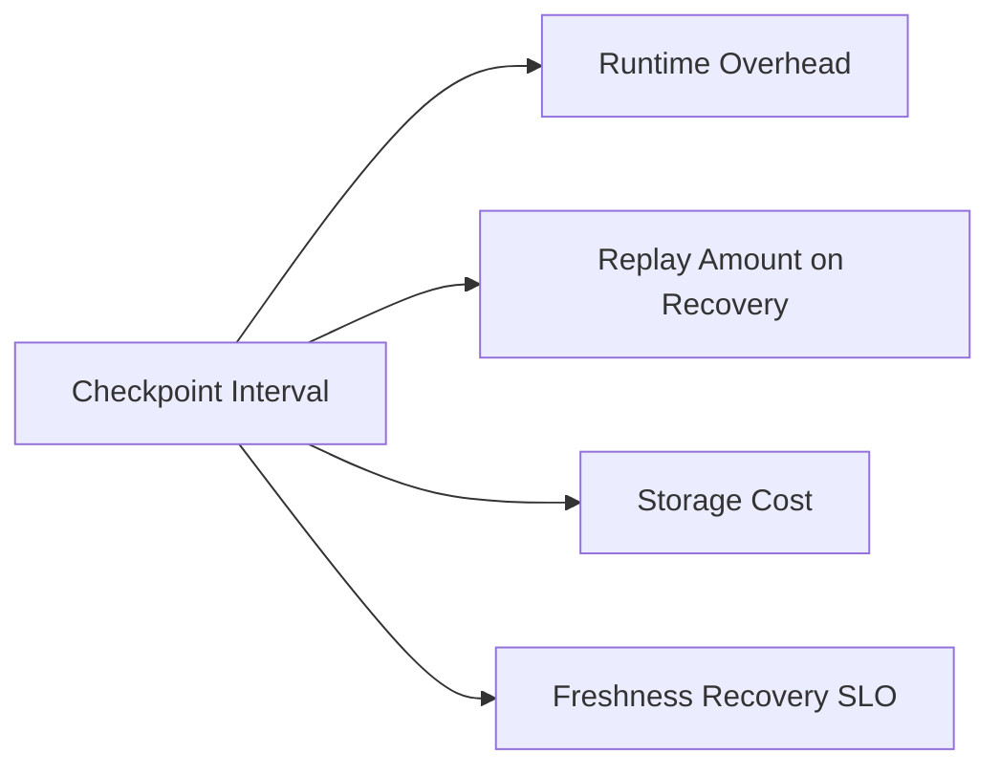

Rule awal:

- low-latency critical stream: interval lebih pendek, tetapi ukur overhead;
- large state pipeline: interval perlu disesuaikan dengan checkpoint duration;
- expensive sink side effect: interval dan sink transaction boundary harus diuji;
- backfill/replay job: checkpoint bisa berbeda dari online job.

Production baseline yang masuk akal bukan angka universal, tetapi kebijakan:

> Checkpoint interval harus ditentukan dari recovery SLO, checkpoint duration p95/p99, state size growth, dan sink commit cost.

---

## 8. Checkpoint Timeout dan Failure Tolerance

Checkpoint timeout harus lebih panjang dari checkpoint duration normal, tetapi tidak terlalu panjang sampai failure tersembunyi terlalu lama.

Misal:

- checkpoint interval: 60 detik,
- checkpoint duration p95: 20 detik,
- checkpoint duration p99: 45 detik,
- timeout: 5 menit.

Jika checkpoint duration tiba-tiba naik ke 4 menit, job belum tentu crash, tetapi pipeline sedang memberi sinyal:

- state membesar,
- storage lambat,
- backpressure berat,
- network bermasalah,
- sink/source menahan barrier.

Metric yang perlu dipantau:

| Metric | Makna |
|---|---|
| checkpoint duration | waktu menyelesaikan checkpoint |
| checkpoint size | ukuran state/checkpoint |
| checkpoint alignment time | waktu menunggu barrier alignment |
| checkpoint failure count | jumlah checkpoint gagal |
| time since last completed checkpoint | umur checkpoint valid terakhir |
| checkpointed data size growth | pertumbuhan state |
| restore time | waktu restore saat restart |
| backpressure ratio | pengaruh pressure terhadap barrier |

Alert yang baik:

- bukan hanya “checkpoint failed”,
- tetapi “tidak ada checkpoint berhasil dalam X menit”,
- “checkpoint duration p95 naik 3x baseline”,
- “state size growth > threshold”,
- “restore time melanggar RTO”.

---

## 9. State Backend: Heap vs RocksDB vs Changelog

State backend menentukan representasi state dan mekanisme checkpoint.

Secara konseptual:

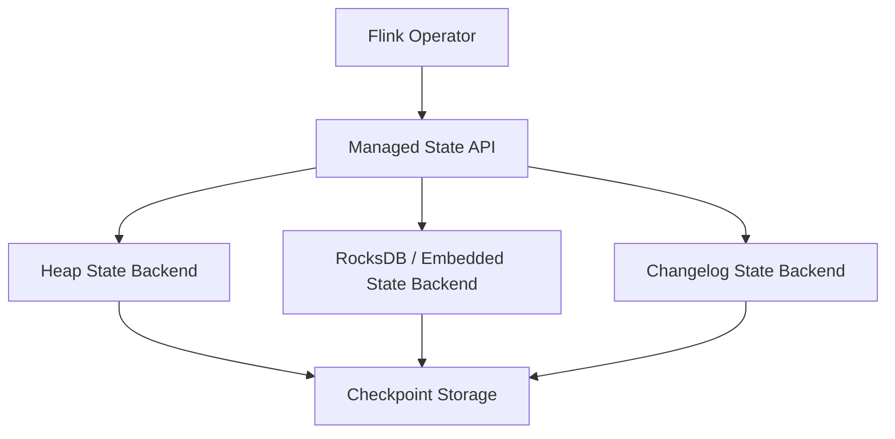

### Heap State

Cocok untuk:

- state kecil,
- latency rendah,
- development/testing,
- job sederhana.

Risiko:

- state masuk heap JVM,
- GC pressure,
- tidak cocok untuk state besar,
- memory tuning menjadi sensitif.

### RocksDB State

Cocok untuk:

- state besar,
- key cardinality tinggi,
- window/dedupe/join state besar,
- workload production dengan state tidak muat nyaman di heap.

Trade-off:

- serialization/deserialization cost,
- disk I/O,
- compaction,
- tuning lebih kompleks,
- observability state backend penting.

### Changelog State

Konsepnya: perubahan state dicatat sebagai log perubahan agar checkpoint bisa lebih incremental/cepat dalam skenario tertentu.

Tetap perlu diuji terhadap workload nyata karena benefit bergantung pada pola update, backend, storage, dan failure profile.

---

## 10. Checkpoint Storage

Checkpoint storage harus durable dan tersedia lintas restart cluster/job.

Contoh target umum:

- object storage,
- distributed filesystem,
- cloud storage,
- persistent volume yang benar-benar durable.

Anti-pattern:

- checkpoint ke local ephemeral disk,
- checkpoint storage satu zona tanpa pertimbangan DR,
- bucket lifecycle menghapus checkpoint terlalu cepat,
- permission terlalu luas,
- tidak ada encryption policy,
- tidak ada monitoring storage quota.

Checklist checkpoint storage:

- durable,
- capacity cukup,
- latency dapat diterima,
- lifecycle policy jelas,
- encryption at rest,
- access control least privilege,
- cross-region/zone strategy jika dibutuhkan,
- audit log akses,
- cleanup policy untuk artifact lama.

---

## 11. Externalized Checkpoint

Checkpoint default biasanya dikelola oleh Flink. Saat job cancelled, checkpoint dapat dibersihkan sesuai konfigurasi.

Untuk operasi tertentu, kita bisa mengaktifkan externalized checkpoint agar checkpoint tetap ada setelah job berhenti.

Namun, jangan menjadikan externalized checkpoint sebagai pengganti savepoint untuk semua upgrade.

Perbedaan praktis:

- externalized checkpoint lebih dekat ke recovery artifact,
- savepoint lebih cocok sebagai operational migration artifact.

Gunakan externalized checkpoint untuk:

- recovery manual setelah cancellation/failure,
- emergency restart,
- investigasi incident,
- fallback jika stop-with-savepoint gagal dalam window tertentu.

Gunakan savepoint untuk:

- planned upgrade,
- operator ID migration,
- parallelism change,
- state schema migration,
- environment migration.

---

## 12. Savepoint sebagai Migration Boundary

Savepoint adalah kontrak antara versi lama job dan versi baru job.

Workflow umum:

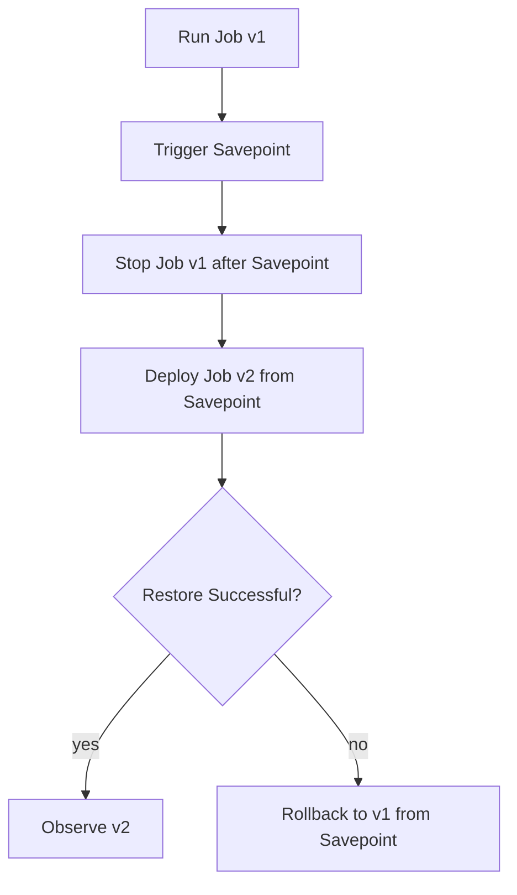

Hal yang harus stabil agar restore berhasil:

- operator identity,
- state descriptor name,
- state type serializer,
- key schema,
- parallelism/key group compatibility,
- source/sink topology compatibility,
- UID assignment.

Dalam Flink, praktik production yang sangat penting adalah memberi UID eksplisit pada operator stateful.

Contoh:

```java
DataStream<FraudSignal> signals =
    payments
        .keyBy(PaymentEvent::customerId)
        .process(new FraudDetectionFunction())
        .uid("fraud-detection-v1")
        .name("Fraud Detection v1");
```

Tanpa UID eksplisit, perubahan topology bisa menyebabkan operator ID berubah dan state tidak bisa dipetakan dengan aman.

Rule:

> Semua operator stateful yang harus survive upgrade wajib punya UID eksplisit yang diperlakukan sebagai bagian dari kontrak state.

---

## 13. Operator UID Strategy

UID bukan cosmetic name. UID adalah state mapping anchor.

Strategi UID:

| Operator | Contoh UID | Catatan |
|---|---|---|
| source | `source.kafka.payments.v1` | Jangan berubah saat refactor kecil |
| normalize | `normalize.payment-event.v1` | Jika stateless, UID tidak selalu kritis |
| keyed process | `state.customer-risk.v1` | Sangat kritis |
| window aggregate | `window.customer-daily-total.v1` | Sangat kritis |
| sink | `sink.kafka.fraud-alerts.v1` | Penting jika sink transactional/checkpoint-aware |

Hindari UID seperti:

```text
map-1
process
fraud
job-step-3
```

Gunakan UID yang menunjukkan:

- domain,
- fungsi,
- statefulness,
- versi kontrak state jika perlu.

---

## 14. State Schema Evolution

State juga punya schema.

Misal state lama:

```java
public record RiskState(
    BigDecimal dailyTotal,
    int eventCount
) {}
```

State baru:

```java
public record RiskState(
    BigDecimal dailyTotal,
    int eventCount,
    Instant lastEventTime
) {}
```

Pertanyaan produksi:

- Apakah serializer bisa membaca state lama?
- Apakah field baru punya default?
- Apakah ada migration logic?
- Apakah savepoint restore sudah diuji?
- Apakah downgrade masih mungkin?
- Apakah versi state dicatat dalam artifact?

Pendekatan aman:

```java
public record VersionedRiskState(
    int stateVersion,
    BigDecimal dailyTotal,
    int eventCount,
    Instant lastEventTime
) {
    public static VersionedRiskState migrate(Object oldState) {
        // implement migration boundary deliberately
        throw new UnsupportedOperationException("example");
    }
}
```

Jangan mengandalkan “Java serialization magic” untuk state production.

Rekomendasi:

- gunakan serializer yang stabil,
- pisahkan domain event schema dari state schema,
- beri state version eksplisit untuk state kompleks,
- tes restore dari savepoint lama,
- dokumentasikan migration matrix.

---

## 15. Parallelism dan Key Group

Flink mendistribusikan keyed state berdasarkan key group.

Ketika parallelism berubah, state harus di-redistribute.

Konsekuensi:

- menaikkan parallelism bisa dilakukan jika max parallelism mendukung,
- max parallelism perlu dipilih sejak awal,
- key distribution harus sehat,
- hot key tetap hot meskipun parallelism dinaikkan,
- state restore dengan parallelism baru harus diuji.

Mental model:

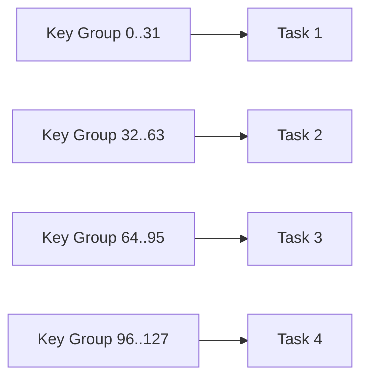

Jika key `customer-123` sangat panas, menaikkan parallelism tidak memecah key itu. Semua event untuk key tersebut tetap harus diproses oleh satu keyed operator instance.

Solusi hot key bukan “parallelism lebih besar” saja.

Alternatif:

- salting key untuk agregasi yang bisa dipecah,
- two-stage aggregation,
- domain-specific sharding,
- separate hot-key lane,
- pre-aggregation,
- limit per key,
- redesign semantics.

---

## 16. Restart Strategy

Checkpoint menjawab “restore dari mana”. Restart strategy menjawab “kapan dan bagaimana mencoba lagi”.

Contoh konfigurasi:

```java
env.setRestartStrategy(
    RestartStrategies.exponentialDelayRestart(
        Time.seconds(10),
        Time.minutes(5),
        2.0,
        Time.hours(1),
        0.1
    )
);
```

Model:

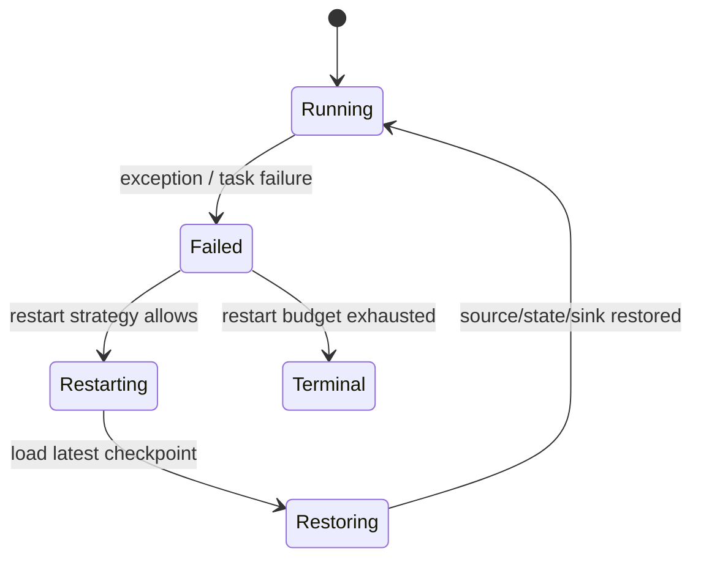

Trade-off:

- restart terlalu agresif bisa memperparah dependency outage,
- restart terlalu lambat bisa melanggar freshness SLO,
- infinite restart bisa menyembunyikan poison data,
- no restart bisa membuat transient failure menjadi outage besar.

Gunakan error taxonomy:

| Failure | Restart? | Catatan |
|---|---:|---|
| transient network issue | ya | exponential backoff |
| broker temporary outage | ya | monitor lag |
| schema incompatible | tidak otomatis tanpa quarantine | perlu operator action |
| poison record | tidak boleh restart loop terus | route to DLQ/side output |
| corrupted state | careful | restore older checkpoint/savepoint |
| sink permission revoked | restart tidak menyelesaikan | alert credential/ACL |

---

## 17. Sink Commit dan Checkpoint Boundary

Checkpoint hanya memberi state consistency. Output correctness bergantung pada sink.

Kategori sink:

| Sink | Semantics |
|---|---|
| Fire-and-forget sink | Sulit menjamin exactly-once |
| Idempotent upsert sink | Aman terhadap replay jika key benar |
| Transactional sink | Bisa commit berdasarkan checkpoint |
| Append-only sink tanpa dedupe | Rentan duplicate |
| External API side-effect sink | Harus pakai idempotency key/effect ledger |

Contoh checkpoint-aware sink conceptual flow:

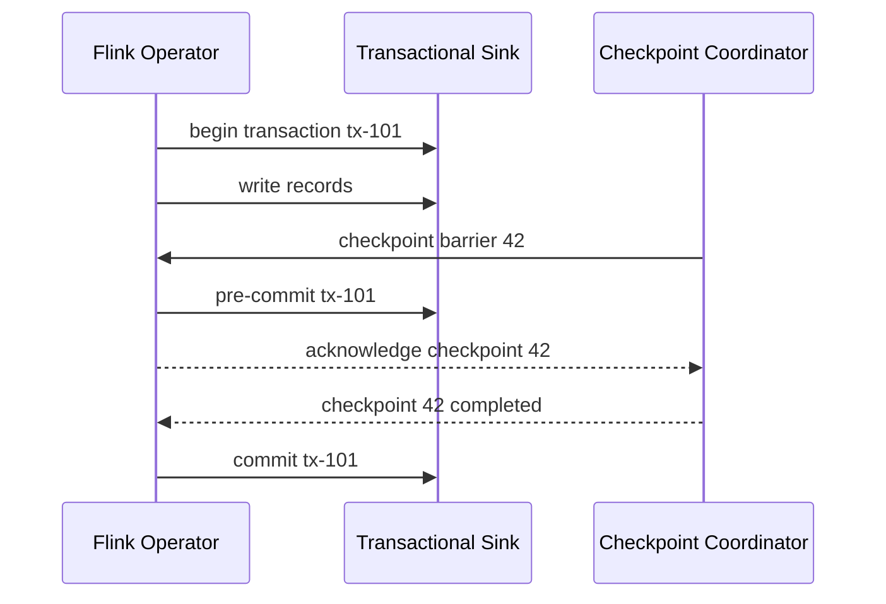

Jika sink tidak transactional, gunakan effectively-once pattern:

- deterministic idempotency key,
- sink ledger,
- upsert with version,
- compare-and-swap,
- unique constraint,
- dedupe table,
- external command state.

---

## 18. Source Restore dan Offset Boundary

Source juga harus checkpoint-aware.

Untuk Kafka source, checkpoint menyimpan posisi offset yang konsisten dengan state.

Kesalahan umum:

- mengandalkan auto commit eksternal,
- membaca Kafka dengan consumer manual di luar Flink source semantics tanpa checkpoint integration,
- commit offset sebelum sink/state aman,
- menggunakan source custom tanpa checkpointed offset,
- restore dari offset latest setelah failure.

Rule:

> Dalam Flink job stateful, offset source harus menjadi bagian dari checkpoint, bukan state sampingan yang dikelola sembarangan.

---

## 19. Custom Source dan CheckpointedFunction

Jika membuat source/operator custom, pahami `CheckpointedFunction`.

Contoh sederhana operator state:

```java
public final class CursorBasedApiSource
    extends RichParallelSourceFunction<ApiRecord>
    implements CheckpointedFunction {

    private volatile boolean running = true;

    private transient ListState<String> checkpointedCursor;
    private String cursor;

    @Override
    public void snapshotState(FunctionSnapshotContext context) throws Exception {
        checkpointedCursor.clear();
        if (cursor != null) {
            checkpointedCursor.add(cursor);
        }
    }

    @Override
    public void initializeState(FunctionInitializationContext context) throws Exception {
        ListStateDescriptor<String> descriptor =
            new ListStateDescriptor<>("api-cursor-v1", String.class);

        checkpointedCursor = context.getOperatorStateStore().getListState(descriptor);

        if (context.isRestored()) {
            for (String restoredCursor : checkpointedCursor.get()) {
                cursor = restoredCursor;
            }
        }
    }

    @Override
    public void run(SourceContext<ApiRecord> ctx) throws Exception {
        while (running) {
            ApiPage page = fetchPage(cursor);

            synchronized (ctx.getCheckpointLock()) {
                for (ApiRecord record : page.records()) {
                    ctx.collect(record);
                }
                cursor = page.nextCursor();
            }
        }
    }

    @Override
    public void cancel() {
        running = false;
    }
}
```

Catatan:

- source legacy API shown here is conceptual; Flink source API evolves,
- checkpoint lock penting untuk atomicity antara emit dan cursor update,
- cursor checkpoint harus merepresentasikan posisi aman,
- API ingestion tetap butuh idempotent sink karena remote API bisa berubah.

---

## 20. Recovery Walkthrough

Misal pipeline:

```text
Kafka offset 1000..2000
Checkpoint 10 completed at offset 1500
Checkpoint 11 in progress at offset 1800
Job crashes before checkpoint 11 completed
```

Recovery:

1. Flink memilih checkpoint terakhir yang completed, yaitu checkpoint 10.
2. State dikembalikan ke keadaan saat checkpoint 10.
3. Kafka source dikembalikan ke offset sekitar 1500.
4. Event 1501..1800 bisa diproses ulang.
5. Sink harus aman terhadap output yang mungkin pernah ditulis sebelum crash.
6. Jika sink transactional dan terintegrasi checkpoint, transaksi checkpoint 11 tidak dianggap committed.
7. Jika sink external non-transactional, idempotency/effect ledger harus menangani duplicate.

Sequence:

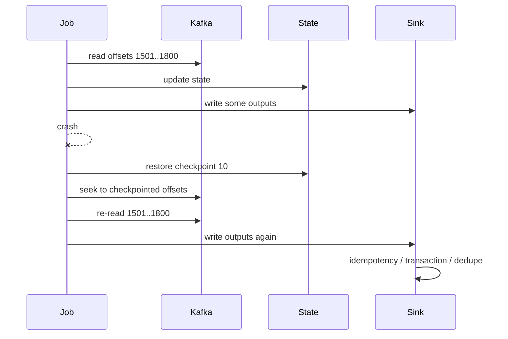

Inilah mengapa “exactly-once” harus selalu dibaca sebagai end-to-end property, bukan hanya fitur Flink.

---

## 21. Checkpoint and Backpressure Interaction

Jika pipeline mengalami backpressure, checkpoint barrier bisa terlambat sampai ke downstream operator.

Gejala:

- checkpoint duration naik,
- alignment time naik,
- time since last completed checkpoint naik,
- Kafka lag naik,
- sink latency naik,
- CPU belum tentu tinggi.

Root cause bisa:

- sink lambat,
- RocksDB compaction,
- network pressure,
- object storage latency,
- hot key,
- oversized state,
- serialization bottleneck,
- GC pause,
- checkpoint interval terlalu agresif.

Debug flow:

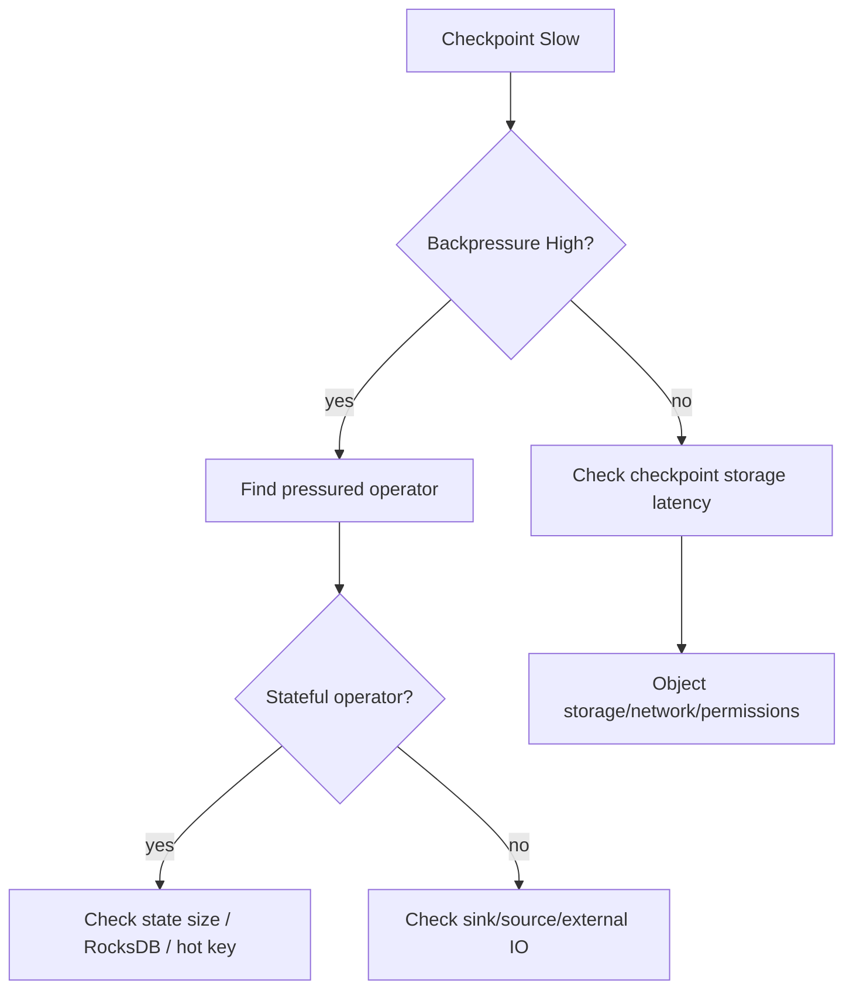

---

## 22. Upgrade Workflow Production-Grade

Upgrade job stateful harus seperti database migration.

Minimum workflow:

1. Freeze contract changes.
2. Deploy candidate to staging.
3. Restore staging from production-like savepoint.
4. Run compatibility tests.
5. Run shadow replay if possible.
6. Trigger savepoint from production job.
7. Stop old job with savepoint.
8. Deploy new job from savepoint.
9. Monitor restore, lag, checkpoint, output diff.
10. Keep rollback savepoint until safe window passes.

Mermaid:

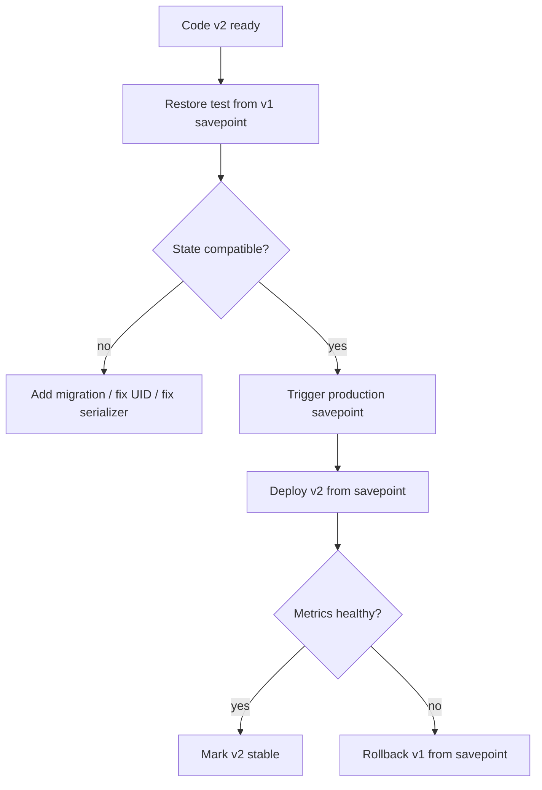

Important:

- Jangan hapus artifact savepoint terlalu cepat.
- Jangan deploy beberapa perubahan topology sekaligus jika state migration kompleks.
- Jangan upgrade dependency/serializer/state schema/operator topology dalam satu langkah besar tanpa restore test.
- Jangan anggap staging tanpa production-like state cukup.

---

## 23. Rollback Strategy

Rollback bukan “deploy jar lama”.

Rollback stateful berarti:

- state yang sudah dipakai v2 mungkin tidak kompatibel dengan v1,
- output v2 mungkin sudah terkirim ke downstream,
- downstream mungkin sudah memproses output tersebut,
- sink state mungkin sudah maju,
- alert/report/materialized view mungkin sudah berubah.

Rollback yang aman:

1. Restore v1 dari savepoint sebelum v2.
2. Pastikan source offset juga kembali sesuai savepoint.
3. Pastikan sink duplicate aman.
4. Jika v2 sudah mengirim output salah, lakukan correction pipeline.
5. Catat incident evidence.

Untuk pipeline regulasi/keuangan, rollback teknis tanpa correction event sering tidak cukup.

---

## 24. Savepoint Retention Policy

Savepoint harus punya lifecycle:

| Artifact | Retention |
|---|---|
| pre-upgrade savepoint | simpan sampai v2 stabil + rollback window |
| post-upgrade savepoint | simpan untuk baseline baru |
| incident savepoint | simpan sesuai audit/incident policy |
| experimental savepoint | cleanup cepat |
| regulatory evidence savepoint | sesuai compliance policy |

Metadata yang perlu dicatat:

```yaml
savepoint:
  id: sp-2026-07-04-fraud-job-v1-to-v2
  job: fraud-detection
  oldVersion: 1.18.3
  newVersion: 1.19.0
  triggeredBy: platform-operator
  reason: deploy threshold model v2
  sourceOffsets:
    kafka:
      topic: payments.canonical.v1
      partitionRange: 0-63
  stateCompatibilityTest: passed
  rollbackDeadline: 2026-07-07T00:00:00+07:00
```

---

## 25. Testing Stateful Recovery

Test yang wajib:

### 25.1 Restore from Savepoint Test

- jalankan job v1 dengan data sample,
- trigger savepoint,
- deploy v2 dari savepoint,
- verifikasi state dan output.

### 25.2 Failure During Processing

- kill task saat state update,
- restart dari checkpoint,
- pastikan output tidak double-count.

### 25.3 Failure During Sink Write

- buat sink timeout setelah partial write,
- restart,
- verifikasi idempotency.

### 25.4 Serializer Compatibility Test

- simpan state sample v1,
- baca dengan serializer v2,
- validate default/migration.

### 25.5 Parallelism Change Test

- savepoint dari parallelism N,
- restore dengan parallelism M,
- validate output.

### 25.6 Checkpoint Storage Failure Test

- inject object storage latency/error,
- observe checkpoint failure behavior,
- validate alert.

---

## 26. Java Mini Pattern: Checkpoint-Aware Effect Ledger

Untuk sink eksternal yang tidak transactional, gunakan effect ledger.

```java
public interface EffectLedger {
    boolean alreadyApplied(String effectId) throws Exception;
    void markApplied(String effectId, String sinkResponseId) throws Exception;
}

public final class IdempotentExternalSink {

    private final EffectLedger ledger;
    private final ExternalClient client;

    public void apply(SinkCommand command) throws Exception {
        String effectId = command.effectId();

        if (ledger.alreadyApplied(effectId)) {
            return;
        }

        ExternalResponse response = client.send(
            command.payload(),
            Map.of("Idempotency-Key", effectId)
        );

        ledger.markApplied(effectId, response.id());
    }
}
```

Effect ID harus deterministic:

```text
pipelineName + transformationVersion + sourceEventId + businessEffectType
```

Jangan gunakan random UUID saat retry/replay.

---

## 27. Incident Patterns

### Incident: Checkpoint Tidak Pernah Complete

Kemungkinan:

- barrier stuck karena backpressure,
- sink blocking,
- object storage lambat,
- state sangat besar,
- checkpoint timeout terlalu pendek.

Tindakan:

1. cek last completed checkpoint age,
2. cek backpressure per operator,
3. cek checkpoint alignment time,
4. cek state size growth,
5. cek storage latency/error,
6. scale atau fix bottleneck,
7. jangan restart buta jika tidak ada checkpoint valid baru.

### Incident: Restore Gagal Setelah Upgrade

Kemungkinan:

- operator UID berubah,
- state descriptor berubah,
- serializer incompatible,
- parallelism/max parallelism salah,
- artifact savepoint tidak lengkap,
- dependency runtime berubah.

Tindakan:

1. rollback ke job lama dari savepoint,
2. inspect restore error,
3. buat restore test lokal/staging,
4. tambahkan migration,
5. retry upgrade.

### Incident: Duplicate Output Setelah Failure

Kemungkinan:

- sink tidak transactional,
- idempotency key salah,
- effect ledger tidak atomic,
- external API tidak menghormati idempotency,
- output side effect terjadi sebelum checkpoint completed.

Tindakan:

1. isolate duplicate by effect ID,
2. verify source offset replay window,
3. reconcile downstream,
4. patch sink idempotency,
5. add failure injection test.

---

## 28. Anti-Patterns

### Anti-Pattern 1: Enable Checkpointing lalu Menganggap Selesai

Checkpointing bukan jaminan end-to-end correctness.

Harus ada:

- checkpoint-aware source,
- deterministic transformation,
- restoreable state,
- safe sink,
- recovery test.

### Anti-Pattern 2: Tidak Memberi UID Operator Stateful

Ini membuat upgrade rapuh.

### Anti-Pattern 3: State Descriptor Name Diubah Saat Refactor

Rename field/class boleh saja, tetapi state descriptor name adalah state identity.

### Anti-Pattern 4: Savepoint Tidak Pernah Diuji Restore

Savepoint yang tidak pernah di-restore hanya memberi rasa aman palsu.

### Anti-Pattern 5: Checkpoint Storage Ephemeral

Recovery artifact harus durable.

### Anti-Pattern 6: External Sink Tanpa Idempotency

Jika sink tidak bisa rollback, sink harus bisa dedupe.

### Anti-Pattern 7: Upgrade Topology Besar Sekaligus

Pisahkan:

- dependency upgrade,
- Flink version upgrade,
- topology change,
- state schema migration,
- sink change.

---

## 29. Production Checklist

Sebelum Flink job stateful masuk production:

- [ ] Checkpointing enabled dengan interval berdasarkan SLO.
- [ ] Checkpoint timeout sesuai baseline duration.
- [ ] Max concurrent checkpoints dikendalikan.
- [ ] Checkpoint storage durable dan monitored.
- [ ] State backend dipilih berdasarkan ukuran/state access pattern.
- [ ] Semua operator stateful punya UID eksplisit.
- [ ] State descriptor name stabil.
- [ ] Serializer compatibility diuji.
- [ ] Savepoint restore test tersedia.
- [ ] Parallelism/max parallelism direncanakan.
- [ ] Restart strategy sesuai failure taxonomy.
- [ ] Source restore semantics jelas.
- [ ] Sink idempotency/transaction semantics jelas.
- [ ] Checkpoint metrics terpantau.
- [ ] Alert untuk no successful checkpoint.
- [ ] Runbook restore/rollback tersedia.
- [ ] Upgrade workflow memakai savepoint.
- [ ] DLQ/quarantine tersedia untuk poison data.
- [ ] Backpressure dashboard tersedia.
- [ ] Incident evidence metadata disimpan.

---

## 30. Mental Model Ringkas

Checkpointing menjawab:

> Setelah failure, state dan stream position kembali ke titik konsisten mana?

Savepoint menjawab:

> Saat operasi terencana, artifact state mana yang menjadi handoff aman antara versi lama dan versi baru?

State backend menjawab:

> Bagaimana state direpresentasikan, disimpan, dan dipulihkan?

Sink semantics menjawab:

> Apakah output tetap benar saat data diproses ulang?

Upgrade workflow menjawab:

> Apakah job stateful bisa berubah tanpa kehilangan continuity dan auditability?

---

## 31. What Good Looks Like

Flink job production-grade bukan job yang hanya punya throughput tinggi.

Flink job production-grade adalah job yang:

- bisa crash dan recover tanpa state corruption,
- bisa upgrade melalui savepoint,
- punya operator UID stabil,
- punya state schema evolution strategy,
- punya sink idempotency,
- punya observability checkpoint,
- punya rollback plan,
- punya recovery test,
- punya runbook incident,
- bisa menjelaskan guarantee secara jujur.

Jika tidak bisa menjawab dari checkpoint mana job restore, output mana yang mungkin duplicate, dan state mana yang berubah saat upgrade, pipeline belum production-grade.

---

## References

- Apache Flink Documentation — Checkpointing: `https://nightlies.apache.org/flink/flink-docs-stable/docs/dev/datastream/fault-tolerance/checkpointing/`
- Apache Flink Documentation — Fault Tolerance: `https://nightlies.apache.org/flink/flink-docs-stable/docs/learn-flink/fault_tolerance/`
- Apache Flink Documentation — State Backends: `https://nightlies.apache.org/flink/flink-docs-stable/docs/ops/state/state_backends/`
- Apache Flink Documentation — Timely Stream Processing: `https://nightlies.apache.org/flink/flink-docs-stable/docs/concepts/time/`
- Apache Kafka Documentation — Consumer and delivery semantics: `https://kafka.apache.org/documentation/`
