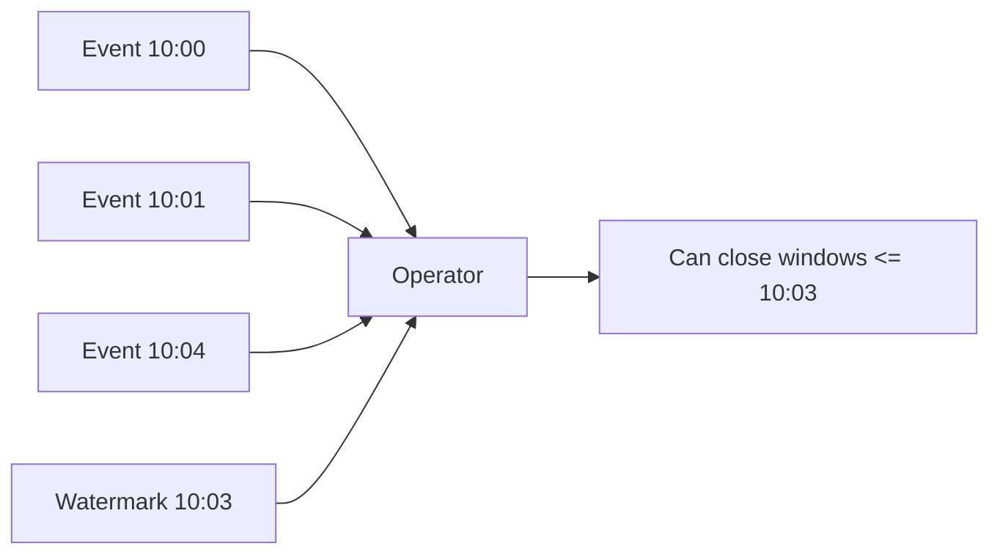
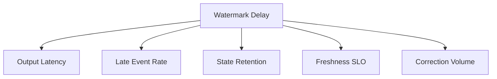
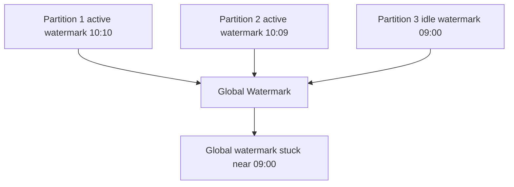
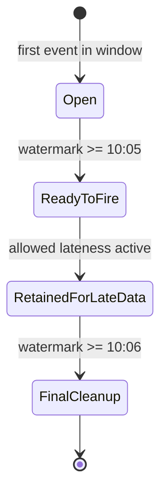
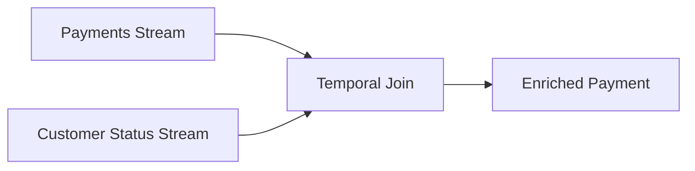
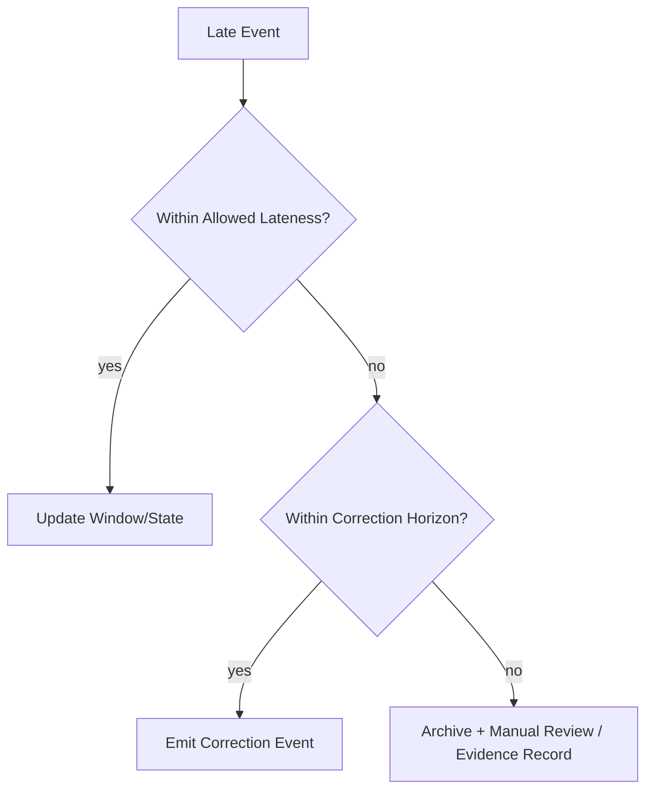
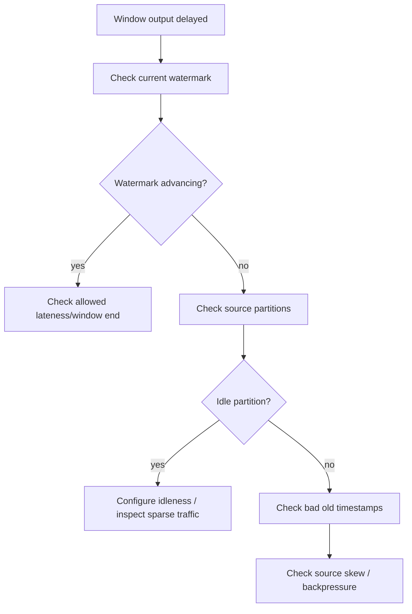
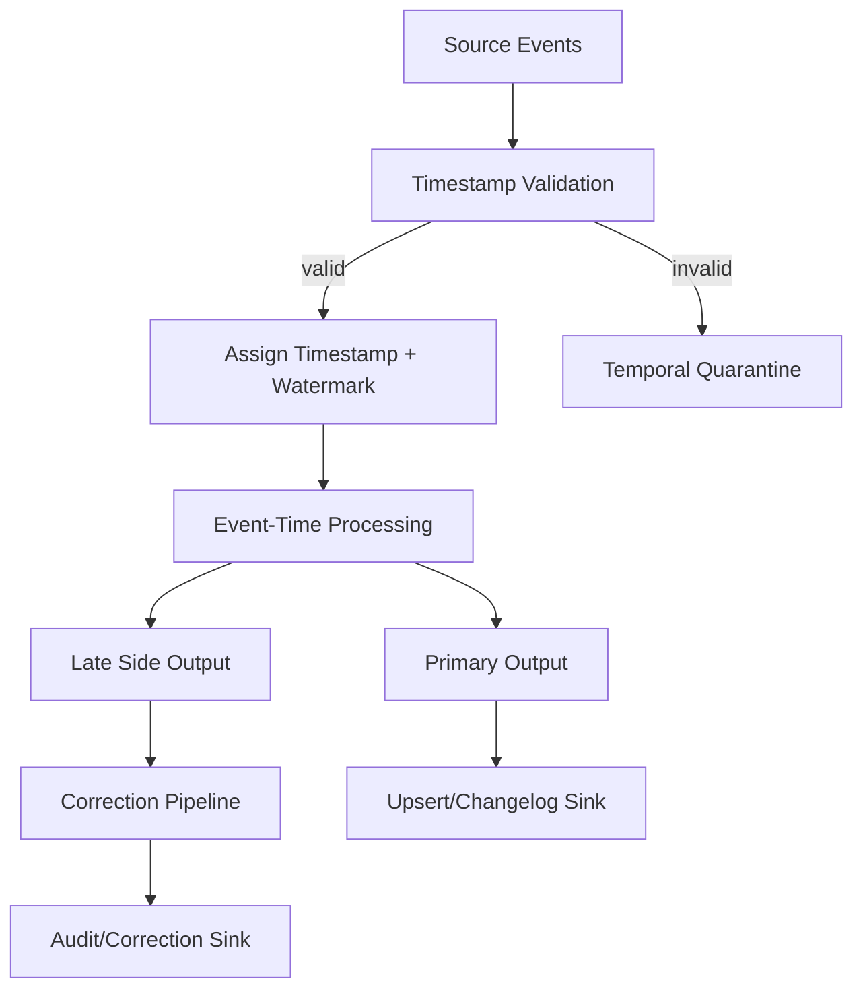

# Part 044 — Watermarks, Late Events, and Event-Time Correctness

> Stream processing bukan hanya “memproses data saat datang”.
> Banyak pipeline production gagal bukan karena tidak cepat, tetapi karena salah menjawab: **data ini seharusnya dihitung di periode waktu mana?**

Part ini membahas event-time correctness di Flink: watermark, late event, allowed lateness, side output, event-time timer, temporal disorder, dan strategi koreksi output.

Kita akan fokus pada Java implementation pattern dan operational decision, bukan definisi permukaan.

---

## 1. Problem: Data Tidak Datang Sesuai Urutan Kejadian

Misal event pembayaran:

| Event | Event Time | Arrived at Pipeline |
|---|---|---|
| A | 10:00:01 | 10:00:02 |
| B | 10:00:05 | 10:00:06 |
| C | 09:59:59 | 10:00:10 |
| D | 10:00:03 | 10:01:30 |

Jika pipeline menghitung berdasarkan processing time, event C dan D masuk ke bucket yang salah.

Untuk laporan, alert, compliance, SLA, fraud, billing, dan regulatory evidence, ini berbahaya.

Kita perlu membedakan:

| Time Type | Makna |
|---|---|
| Event time | waktu kejadian bisnis terjadi |
| Processing time | waktu operator memproses event |
| Ingestion time | waktu event masuk pipeline |
| Source commit time | waktu event tercatat di source log/DB |
| Business effective time | waktu keputusan berlaku secara bisnis/legal |
| Observation time | waktu pipeline melihat/mengetahui event |

Event-time processing mencoba menghitung berdasarkan waktu kejadian, bukan waktu kedatangan.

---

## 2. Mental Model Watermark

Watermark adalah sinyal progress event time.

Jika watermark = `10:05:00`, sistem menyatakan kira-kira:

> Saya menganggap semua event dengan event time sebelum atau sama dengan 10:05:00 seharusnya sudah terlihat, kecuali event yang nanti dianggap late sesuai policy.

Watermark bukan jam dinding.

Watermark adalah **claim of completeness** tentang event-time progress.



Dokumentasi Flink menjelaskan watermark sebagai mekanisme untuk mengukur progress event time. Late element adalah element yang datang setelah watermark sudah melewati timestamp element tersebut.

---

## 3. Event Time vs Processing Time

### Processing Time

Kelebihan:

- sederhana,
- latency rendah,
- tidak butuh timestamp extraction,
- cocok untuk monitoring sistem atau operational heartbeat.

Kekurangan:

- tidak deterministic saat replay,
- hasil berubah tergantung kapan event diproses,
- late/out-of-order data salah bucket,
- backfill menghasilkan hasil berbeda dari online run.

### Event Time

Kelebihan:

- deterministic untuk replay jika input dan logic sama,
- cocok untuk business correctness,
- bisa menangani out-of-order data,
- window berdasarkan waktu kejadian.

Kekurangan:

- butuh timestamp valid,
- butuh watermark strategy,
- late data policy,
- state bisa bertahan lebih lama,
- output bisa tertunda.

Rule:

> Untuk data bisnis, analytics, audit, compliance, fraud, billing, dan SLA berbasis kejadian, default mental model harus event time.

---

## 4. Timestamp Extraction di Java

Contoh event:

```java
public record PaymentEvent(
    String eventId,
    String customerId,
    BigDecimal amount,
    Instant occurredAt,
    Instant ingestedAt
) {}
```

Watermark strategy:

```java
WatermarkStrategy<PaymentEvent> watermarkStrategy =
    WatermarkStrategy
        .<PaymentEvent>forBoundedOutOfOrderness(Duration.ofMinutes(2))
        .withTimestampAssigner((event, previousTimestamp) ->
            event.occurredAt().toEpochMilli()
        );
```

Penggunaan:

```java
DataStream<PaymentEvent> paymentsWithWatermarks =
    payments.assignTimestampsAndWatermarks(watermarkStrategy);
```

Makna:

- timestamp event diambil dari `occurredAt`,
- pipeline mentoleransi disorder hingga 2 menit,
- watermark akan tertinggal dari max observed event time kira-kira 2 menit.

Bukan berarti semua event terlambat kurang dari 2 menit pasti benar dalam semua situasi. Ini policy approximation berdasarkan karakteristik source.

---

## 5. Watermark Strategy adalah Business Decision

Jangan pilih `2 minutes` karena contoh dokumentasi.

Tentukan dari data empiris:

```text
event_delay = ingestion_time - event_time
```

Ukur distribusi:

| Percentile | Delay |
|---|---:|
| p50 | 2s |
| p90 | 15s |
| p95 | 45s |
| p99 | 3m |
| p99.9 | 25m |

Jika watermark out-of-orderness = 1 menit:

- latency output rendah,
- sebagian event p99 akan late,
- butuh correction path.

Jika watermark out-of-orderness = 30 menit:

- late event lebih sedikit,
- output window sangat lambat,
- freshness SLO mungkin gagal,
- state retention membesar.

Tidak ada konfigurasi gratis.



Rule:

> Watermark policy harus ditentukan dari distribusi keterlambatan data, freshness SLO, toleransi koreksi, dan biaya state.

---

## 6. Monotonous Timestamp vs Bounded Out-of-Orderness

### Monotonous Timestamp

```java
WatermarkStrategy
    .<PaymentEvent>forMonotonousTimestamps()
    .withTimestampAssigner((event, ts) -> event.occurredAt().toEpochMilli());
```

Cocok jika event benar-benar datang urut berdasarkan event time.

Sangat jarang aman untuk pipeline multi-source production.

### Bounded Out-of-Orderness

```java
WatermarkStrategy
    .<PaymentEvent>forBoundedOutOfOrderness(Duration.ofMinutes(5))
```

Cocok jika disorder punya batas operasional yang masuk akal.

Masalah:

- kalau delay distribution punya long tail, late events tetap terjadi,
- kalau source idle, watermark bisa stuck,
- kalau partition skew, watermark global bisa tertahan.

---

## 7. Idle Source dan Watermark Stuck

Dalam source multi-partition, watermark operator sering ditentukan oleh input paling lambat.

Jika satu partition idle, watermark bisa tidak maju.

Contoh:



Solusi:

```java
WatermarkStrategy<PaymentEvent> strategy =
    WatermarkStrategy
        .<PaymentEvent>forBoundedOutOfOrderness(Duration.ofMinutes(2))
        .withTimestampAssigner((event, ts) -> event.occurredAt().toEpochMilli())
        .withIdleness(Duration.ofMinutes(5));
```

Dengan idleness, partition/input yang tidak mengirim data dalam durasi tertentu bisa dianggap idle agar tidak menahan watermark global.

Trade-off:

- terlalu cepat mark idle bisa membuat late data meningkat saat partition aktif kembali,
- terlalu lambat mark idle bisa menahan window terlalu lama.

---

## 8. Window Lifecycle dengan Watermark

Misal tumbling window 5 menit:

```text
Window: [10:00, 10:05)
Allowed lateness: 1 minute
```

Lifecycle:



Tanpa allowed lateness:

- window bisa ditutup saat watermark melewati end window,
- event yang datang setelah itu dianggap late dan bisa dropped/side output.

Dengan allowed lateness:

- window tetap menyimpan state lebih lama,
- late event dalam allowed lateness bisa update result,
- output bisa keluar lebih dari sekali untuk window yang sama,
- sink harus mendukung update/correction/upsert.

---

## 9. Window Example di Java

```java
DataStream<CustomerWindowTotal> totals =
    paymentsWithWatermarks
        .keyBy(PaymentEvent::customerId)
        .window(TumblingEventTimeWindows.of(Time.minutes(5)))
        .allowedLateness(Time.minutes(1))
        .aggregate(new PaymentAmountAggregate(), new WindowResultFunction());
```

Aggregate:

```java
public final class PaymentAmountAggregate
    implements AggregateFunction<PaymentEvent, BigDecimal, BigDecimal> {

    @Override
    public BigDecimal createAccumulator() {
        return BigDecimal.ZERO;
    }

    @Override
    public BigDecimal add(PaymentEvent value, BigDecimal accumulator) {
        return accumulator.add(value.amount());
    }

    @Override
    public BigDecimal getResult(BigDecimal accumulator) {
        return accumulator;
    }

    @Override
    public BigDecimal merge(BigDecimal a, BigDecimal b) {
        return a.add(b);
    }
}
```

Window result:

```java
public final class WindowResultFunction
    extends ProcessWindowFunction<BigDecimal, CustomerWindowTotal, String, TimeWindow> {

    @Override
    public void process(
            String customerId,
            Context context,
            Iterable<BigDecimal> elements,
            Collector<CustomerWindowTotal> out) {

        BigDecimal total = elements.iterator().next();

        out.collect(new CustomerWindowTotal(
            customerId,
            Instant.ofEpochMilli(context.window().getStart()),
            Instant.ofEpochMilli(context.window().getEnd()),
            total,
            context.currentWatermark()
        ));
    }
}
```

---

## 10. Late Event Side Output

Untuk data yang terlalu late, jangan diam-diam drop.

Gunakan side output.

```java
OutputTag<PaymentEvent> latePaymentsTag =
    new OutputTag<>("late-payments", TypeInformation.of(PaymentEvent.class));

SingleOutputStreamOperator<CustomerWindowTotal> totals =
    paymentsWithWatermarks
        .keyBy(PaymentEvent::customerId)
        .window(TumblingEventTimeWindows.of(Time.minutes(5)))
        .allowedLateness(Time.minutes(1))
        .sideOutputLateData(latePaymentsTag)
        .aggregate(new PaymentAmountAggregate(), new WindowResultFunction());

DataStream<PaymentEvent> latePayments =
    totals.getSideOutput(latePaymentsTag);
```

Late event side output bisa diarahkan ke:

- DLQ temporal,
- correction pipeline,
- audit table,
- manual review,
- delayed recompute queue,
- metrics-only stream.

Policy harus eksplisit:

| Late Event Type | Action |
|---|---|
| slightly late, within allowed lateness | update window |
| beyond allowed lateness but business critical | correction event |
| beyond retention and low value | archive/drop with evidence |
| invalid event time | quarantine |
| clock skew suspected | source incident |

---

## 11. Allowed Lateness: Output Bisa Berubah

Allowed lateness berarti result window tidak final saat pertama kali keluar.

Misal:

```text
Window [10:00, 10:05)
First output at watermark 10:05 = total 100
Late event arrives at 10:05:30 with amount 20
Updated output = total 120
```

Downstream sink harus tahu apakah output adalah:

- append-only preliminary result,
- update/upsert result,
- correction result,
- final result only.

Untuk reporting table, gunakan deterministic key:

```text
customer_id + window_start + window_end + metric_name + transform_version
```

Lalu sink melakukan upsert.

Jangan append semua hasil window tanpa semantics, kecuali downstream memang memahami changelog.

---

## 12. Final Result vs Incremental Update

Ada dua strategi output.

### Strategy A: Emit Update

Window mengeluarkan result saat watermark lewat, lalu update jika late event masuk dalam allowed lateness.

Cocok untuk:

- dashboard near-real-time,
- materialized view upsert,
- alert yang bisa direvise,
- metrics pipeline.

Butuh:

- idempotent/upsert sink,
- result version,
- correction semantics.

### Strategy B: Emit Only After Lateness Horizon

Tunggu sampai `window_end + allowed_lateness`, lalu emit final.

Cocok untuk:

- settlement,
- regulatory report,
- billing,
- downstream tidak mendukung update.

Trade-off:

- latency lebih tinggi,
- state retention lebih lama,
- freshness lebih buruk tetapi finality lebih kuat.

---

## 13. Finality Field dalam Output

Jangan biarkan downstream menebak apakah result final.

Model output:

```java
public record WindowMetric(
    String metricId,
    String customerId,
    Instant windowStart,
    Instant windowEnd,
    BigDecimal value,
    ResultFinality finality,
    long resultVersion,
    Instant computedAt,
    long watermarkAtComputation
) {}

public enum ResultFinality {
    PRELIMINARY,
    UPDATED,
    FINAL,
    CORRECTION
}
```

Ini membuat downstream bisa:

- menampilkan preliminary result,
- mengganti result lama,
- mengunci final result,
- memproses correction secara eksplisit.

---

## 14. Event-Time Timer

Tidak semua logic harus menggunakan window API. Untuk beberapa kasus, `KeyedProcessFunction` dengan event-time timer lebih tepat.

Contoh: deteksi SLA breach jika case tidak direspons dalam 2 jam event time.

```java
public final class CaseResponseSlaFunction
    extends KeyedProcessFunction<String, CaseEvent, SlaSignal> {

    private transient ValueState<CaseOpened> openedState;

    @Override
    public void open(Configuration parameters) {
        openedState = getRuntimeContext().getState(
            new ValueStateDescriptor<>("case-opened-v1", CaseOpened.class)
        );
    }

    @Override
    public void processElement(
            CaseEvent event,
            Context ctx,
            Collector<SlaSignal> out) throws Exception {

        if (event instanceof CaseOpened opened) {
            openedState.update(opened);
            long breachAt = opened.openedAt().plus(Duration.ofHours(2)).toEpochMilli();
            ctx.timerService().registerEventTimeTimer(breachAt);
        }

        if (event instanceof CaseResponded) {
            openedState.clear();
        }
    }

    @Override
    public void onTimer(
            long timestamp,
            OnTimerContext ctx,
            Collector<SlaSignal> out) throws Exception {

        CaseOpened opened = openedState.value();
        if (opened != null) {
            out.collect(SlaSignal.breached(opened.caseId(), Instant.ofEpochMilli(timestamp)));
        }
    }
}
```

Event-time timer dipicu ketika watermark melewati timestamp timer.

Kelebihan:

- cocok untuk timeout berbasis waktu bisnis,
- tidak perlu window fixed,
- state per key lebih eksplisit,
- logic bisa lebih dekat ke domain.

---

## 15. Late Event dalam SLA Detection

Masalah:

```text
Case opened at 10:00
SLA breach timer at 12:00
Watermark passes 12:00 -> breach emitted
Late CaseResponded arrives with response time 11:30
```

Pertanyaan:

- Apakah breach harus dicabut?
- Apakah correction event dikirim?
- Apakah response terlambat diterima tetapi sebenarnya on-time secara bisnis?
- Apakah audit harus mencatat bahwa pipeline sempat menganggap breach?

Untuk regulatory systems, jawabannya biasanya bukan “hapus breach”.

Lebih defensif:

```java
public enum SlaSignalType {
    BREACH_DETECTED,
    BREACH_CORRECTED,
    BREACH_CONFIRMED
}
```

Dengan output:

```java
public record SlaSignal(
    String signalId,
    String caseId,
    SlaSignalType type,
    Instant businessTime,
    Instant observedAt,
    String reason
) {}
```

Artinya pipeline tidak menghapus fakta observasi lama, tetapi mengeluarkan koreksi eksplisit.

---

## 16. Watermark dan Multi-Source Join

Join antar stream memperbesar kompleksitas watermark.



Jika stream customer status lambat, join bisa:

- menunggu state lebih lama,
- menghasilkan missing enrichment,
- join dengan versi reference yang salah,
- menghasilkan late correction,
- meningkatkan state size.

Watermark join harus menjawab:

- event time mana yang dipakai?
- apakah reference stream punya valid-from/valid-to?
- apakah join butuh as-of semantics?
- berapa lama menunggu reference event?
- apa policy jika reference datang terlambat?
- apakah output bisa dikoreksi?

---

## 17. Temporal Join Mental Model

Misal:

```text
Payment occurredAt = 10:03
Customer risk changed:
  09:00 -> LOW
  10:02 -> HIGH
  10:10 -> BLOCKED
```

Payment pada 10:03 harus join dengan status HIGH, bukan latest saat processing.

Ini adalah as-of join:

```text
find risk record where valid_from <= payment.event_time < valid_to
```

Untuk ini, stream reference harus membawa temporal validity, bukan hanya latest state.

Jika pipeline memakai latest `KTable`/broadcast state tanpa event-time validity, replay hasil bisa berubah.

---

## 18. Watermark Alignment dan Slow Partitions

Jika satu partition/source lambat, watermark global tertahan.

Jika watermark terlalu agresif, late event meningkat.

Jika watermark terlalu konservatif, output latency naik.

Dalam pipeline multi-partition:

```text
global_watermark = min(watermark(partition-0), watermark(partition-1), ...)
```

Konsekuensi:

- partition idle perlu idleness detection,
- partition skew memengaruhi global progress,
- source with sparse traffic but old timestamps bisa menahan job,
- bad timestamp bisa merusak watermark.

Data quality rule untuk timestamp wajib:

- timestamp tidak boleh null,
- timestamp tidak boleh terlalu jauh di masa depan,
- timestamp tidak boleh terlalu tua tanpa mode backfill,
- timezone harus jelas,
- source clock skew harus dimonitor.

---

## 19. Timestamp Validation

Jangan langsung assign timestamp tanpa validasi.

```java
public final class PaymentTimestampValidator {

    private final Duration maxFutureSkew;
    private final Duration maxPastAge;

    public ValidationResult validate(PaymentEvent event, Instant observedAt) {
        if (event.occurredAt() == null) {
            return ValidationResult.reject("missing_event_time");
        }

        if (event.occurredAt().isAfter(observedAt.plus(maxFutureSkew))) {
            return ValidationResult.reject("event_time_too_far_in_future");
        }

        if (event.occurredAt().isBefore(observedAt.minus(maxPastAge))) {
            return ValidationResult.warn("event_time_very_old");
        }

        return ValidationResult.accept();
    }
}
```

Untuk backfill, aturan berbeda:

```java
public enum ProcessingMode {
    ONLINE,
    BACKFILL,
    REPLAY,
    REPAIR
}
```

Event lama bisa valid dalam mode backfill, tetapi mencurigakan dalam online mode.

---

## 20. Backfill dan Watermark

Backfill punya karakteristik berbeda dari online stream.

Misal kita replay data 2024 pada tahun 2026.

Jika validator menolak event_time “terlalu lama”, backfill gagal.

Jika watermark strategy sama seperti online, output bisa berbeda dari ekspektasi.

Backfill mode harus eksplisit:

- source range jelas,
- watermark bisa dibuat berdasarkan event order dalam file/log,
- output mode bisa correction/recompute,
- sink harus isolate backfill run,
- transformation version dicatat,
- result finality jelas.

Pattern:

```text
online job -> low latency, bounded disorder, correction path
backfill job -> deterministic replay, full range, no wall-clock freshness assumption
```

---

## 21. Late Event Policy Matrix

Buat matrix policy eksplisit.

| Condition | Example | Action |
|---|---|---|
| event time missing | `occurredAt = null` | quarantine |
| event time future small skew | +30s | accept with warning |
| event time future huge skew | +3 days | quarantine/source incident |
| out-of-order within watermark delay | 1 min late | normal processing |
| after watermark but within allowed lateness | 30s after close | update result |
| beyond allowed lateness but within correction horizon | 1 hour late | correction event/recompute |
| beyond correction horizon | 90 days late | archive + manual policy |
| online old event | 1 year old | suspicious unless repair mode |
| backfill old event | 1 year old | expected |

---

## 22. Sink Design for Late Corrections

If output can change, sink must model it.

### Upsert Sink

```sql
CREATE TABLE customer_window_metric (
    metric_id TEXT PRIMARY KEY,
    customer_id TEXT NOT NULL,
    window_start TIMESTAMPTZ NOT NULL,
    window_end TIMESTAMPTZ NOT NULL,
    metric_name TEXT NOT NULL,
    metric_value NUMERIC NOT NULL,
    result_version BIGINT NOT NULL,
    finality TEXT NOT NULL,
    updated_at TIMESTAMPTZ NOT NULL
);
```

Update rule:

```sql
INSERT INTO customer_window_metric (...)
VALUES (...)
ON CONFLICT (metric_id)
DO UPDATE SET
    metric_value = EXCLUDED.metric_value,
    result_version = GREATEST(customer_window_metric.result_version, EXCLUDED.result_version),
    finality = EXCLUDED.finality,
    updated_at = EXCLUDED.updated_at;
```

### Append Correction Sink

```sql
CREATE TABLE customer_window_metric_events (
    event_id TEXT PRIMARY KEY,
    metric_id TEXT NOT NULL,
    event_type TEXT NOT NULL,
    previous_value NUMERIC,
    new_value NUMERIC,
    reason TEXT NOT NULL,
    event_time TIMESTAMPTZ NOT NULL,
    observed_at TIMESTAMPTZ NOT NULL
);
```

Use append correction for audit-sensitive domains.

---

## 23. Regulatory-Friendly Late Data Handling

Dalam sistem regulasi/enforcement, late event bukan hanya technical nuisance.

Late event bisa berarti:

- bukti baru masuk,
- upstream system terlambat sinkron,
- koreksi administratif,
- keputusan berlaku retroaktif,
- audit trail harus preserved.

Jangan desain late data dengan mental model “drop kalau telat”.

Lebih baik:



Output harus menjelaskan:

- event asli,
- waktu kejadian,
- waktu diketahui pipeline,
- policy yang dipakai,
- output yang dikoreksi,
- alasan koreksi,
- transformation version.

---

## 24. Watermark Observability

Metric yang wajib:

| Metric | Makna |
|---|---|
| current input watermark | progress event time |
| watermark lag | processing time - watermark |
| event delay distribution | ingestion time - event time |
| late event count | jumlah event late |
| late event ratio | late / total |
| side output late count | event terlalu late |
| window state size | state untuk window aktif |
| allowed lateness updates | result update karena late event |
| idle partitions count | source partition idle |
| max event time observed | upper bound timestamp |
| bad timestamp count | event timestamp invalid |

Alert yang bagus:

- watermark tidak maju selama X menit,
- late event ratio naik 10x baseline,
- event timestamp future spike,
- old event spike pada online mode,
- side output late event meningkat,
- window state size tumbuh abnormal.

---

## 25. Debugging Watermark Stuck

Flow:



Common root causes:

- one partition idle without idleness,
- one source emits very old timestamp,
- timestamp assigned from wrong field,
- timezone parse error,
- event time in seconds treated as milliseconds,
- watermark strategy too conservative,
- backpressure delaying event/watermark propagation,
- source connector not generating watermark as expected.

---

## 26. Failure Mode: Seconds vs Milliseconds

A classic bug:

```java
// Wrong if occurredAtEpochSeconds is seconds
return event.occurredAtEpochSeconds();
```

Flink expects timestamp in milliseconds.

Correct:

```java
return event.occurredAtEpochSeconds() * 1000L;
```

Symptoms:

- event appears in 1970,
- watermark stuck,
- all windows delayed or weird,
- state grows,
- late side output explodes.

Prevent with timestamp validation and unit-specific value objects:

```java
public record EpochMillis(long value) {
    public Instant toInstant() {
        return Instant.ofEpochMilli(value);
    }
}

public record EpochSeconds(long value) {
    public Instant toInstant() {
        return Instant.ofEpochSecond(value);
    }
}
```

---

## 27. Failure Mode: Future Timestamp

If event time is accidentally in the future:

```text
event_time = 2099-01-01
```

Potential effects:

- max observed timestamp jumps,
- watermark may jump,
- many normal events become late,
- windows close prematurely,
- output becomes incorrect.

Guardrail:

```java
if (event.occurredAt().isAfter(observedAt.plus(Duration.ofMinutes(5)))) {
    routeToQuarantine(event, "event_time_future_beyond_skew");
}
```

Future timestamp is not harmless.

---

## 28. Failure Mode: Mutable Event Time

If upstream changes `occurredAt` semantics across versions:

v1:

```text
occurredAt = user submitted time
```

v2:

```text
occurredAt = database updated_at
```

Then same field name has different semantics.

This breaks:

- watermark,
- window assignment,
- temporal join,
- audit interpretation,
- replay determinism.

Contract must specify:

```yaml
field: occurredAt
meaning: time the business action was performed by authorized user
timezone: UTC
source: application service clock
allowedSkew: PT5M
nullable: false
versionIntroduced: 1
```

---

## 29. Deterministic Replay

For deterministic event-time replay:

- event timestamp extraction must be stable,
- transform must not depend on `Instant.now()` for business logic,
- reference data must be versioned/as-of,
- watermark strategy must be appropriate for replay mode,
- sink output key must be deterministic,
- late correction policy must be explicit.

Bad:

```java
if (Instant.now().isAfter(event.occurredAt().plus(Duration.ofHours(2)))) {
    emitBreach();
}
```

Good:

```java
if (watermarkOrBusinessEvaluationTime.isAfter(event.occurredAt().plus(Duration.ofHours(2)))) {
    emitBreach();
}
```

Even better, model evaluation time explicitly.

---

## 30. Java Pattern: Temporal Policy Object

Centralize temporal policy.

```java
public record TemporalPolicy(
    Duration maxOutOfOrderness,
    Duration allowedLateness,
    Duration maxFutureSkew,
    Duration onlineMaxPastAge,
    Duration correctionHorizon
) {
    public boolean isTooFarInFuture(Instant eventTime, Instant observedAt) {
        return eventTime.isAfter(observedAt.plus(maxFutureSkew));
    }

    public boolean isSuspiciouslyOldOnline(Instant eventTime, Instant observedAt) {
        return eventTime.isBefore(observedAt.minus(onlineMaxPastAge));
    }

    public boolean isWithinCorrectionHorizon(Instant eventTime, Instant observedAt) {
        return eventTime.isAfter(observedAt.minus(correctionHorizon));
    }
}
```

Avoid scattering `Duration.ofMinutes(5)` across code.

Make temporal policy:

- configurable,
- versioned,
- tested,
- documented in data contract,
- emitted in metrics.

---

## 31. Java Pattern: Late Event Classifier

```java
public enum LateEventDecision {
    ACCEPT_NORMAL,
    ACCEPT_LATE_UPDATE,
    EMIT_CORRECTION,
    QUARANTINE,
    ARCHIVE_WITH_EVIDENCE
}

public final class LateEventClassifier {

    private final TemporalPolicy policy;

    public LateEventClassifier(TemporalPolicy policy) {
        this.policy = policy;
    }

    public LateEventDecision decide(
            Instant eventTime,
            long currentWatermarkMillis,
            Instant observedAt,
            ProcessingMode mode) {

        if (eventTime == null) {
            return LateEventDecision.QUARANTINE;
        }

        if (policy.isTooFarInFuture(eventTime, observedAt)) {
            return LateEventDecision.QUARANTINE;
        }

        if (mode == ProcessingMode.ONLINE
                && policy.isSuspiciouslyOldOnline(eventTime, observedAt)) {
            if (policy.isWithinCorrectionHorizon(eventTime, observedAt)) {
                return LateEventDecision.EMIT_CORRECTION;
            }
            return LateEventDecision.ARCHIVE_WITH_EVIDENCE;
        }

        long eventMillis = eventTime.toEpochMilli();

        if (eventMillis > currentWatermarkMillis) {
            return LateEventDecision.ACCEPT_NORMAL;
        }

        return LateEventDecision.ACCEPT_LATE_UPDATE;
    }
}
```

This classifier does not replace Flink window lateness mechanics. It makes business policy explicit around them.

---

## 32. Testing Watermarks and Late Events

Test cases:

### 32.1 In-Order Events

- events arrive in event-time order,
- watermark advances,
- window emits expected result.

### 32.2 Out-of-Order Within Bound

- event `10:00:03` arrives after `10:00:05`,
- still included in correct window.

### 32.3 Late Within Allowed Lateness

- window emits initial result,
- late event arrives,
- result update emitted.

### 32.4 Too-Late Event

- event arrives after cleanup,
- side output receives it.

### 32.5 Idle Source

- one partition stops,
- watermark still advances after idleness timeout.

### 32.6 Future Timestamp

- future event quarantined,
- watermark not poisoned.

### 32.7 Replay Determinism

- same input sequence replayed,
- same final window outputs produced.

---

## 33. Mini Test Harness Mental Model

Flink provides test utilities, but conceptually test like this:

```text
input:
  event A at 10:00
  event B at 10:02
  watermark 10:05
expect:
  window [10:00,10:05) emits total A+B
```

Then:

```text
input:
  late event C at 10:03
  watermark 10:05:30
expect:
  updated window output includes C
```

Then:

```text
input:
  watermark 10:06:01
  too-late event D at 10:04
expect:
  D side-output to late stream
```

Write tests around observable outputs, not implementation internals.

---

## 34. Production Design Pattern

Recommended architecture:



This design separates:

- invalid timestamp,
- normal event-time processing,
- late-but-acceptable update,
- too-late correction,
- audit evidence.

---

## 35. Anti-Patterns

### Anti-Pattern 1: Use Processing Time for Business Reports

Fast but wrong under replay, backfill, and disorder.

### Anti-Pattern 2: Drop Late Events Silently

This hides correctness loss.

### Anti-Pattern 3: Watermark Delay Chosen Without Data

You need delay distribution.

### Anti-Pattern 4: Downstream Does Not Know Output Can Update

Allowed lateness means result can change.

### Anti-Pattern 5: No Timestamp Validation

One bad future timestamp can poison watermark behavior.

### Anti-Pattern 6: `Instant.now()` in Business Logic

Makes replay non-deterministic.

### Anti-Pattern 7: Latest-State Join Without Temporal Semantics

Joining event-time fact with processing-time latest reference often produces historically wrong output.

### Anti-Pattern 8: Same Policy for Online and Backfill

Backfill has different time assumptions.

---

## 36. Production Checklist

Before deploying event-time Flink pipeline:

- [ ] Event timestamp field is contractually defined.
- [ ] Timestamp timezone/unit is explicit.
- [ ] Timestamp validation exists.
- [ ] Future timestamp guard exists.
- [ ] Online vs backfill temporal policy differs where needed.
- [ ] Watermark delay chosen from empirical delay distribution.
- [ ] Idle source handling configured if source can be sparse.
- [ ] Allowed lateness decision documented.
- [ ] Late side output exists.
- [ ] Correction path exists for business-critical late events.
- [ ] Sink supports update/correction/finality semantics.
- [ ] Window output key is deterministic.
- [ ] Result finality is explicit.
- [ ] Watermark lag metric is monitored.
- [ ] Late event ratio metric is monitored.
- [ ] Bad timestamp metric is monitored.
- [ ] Replay determinism test exists.
- [ ] Temporal join semantics are tested.
- [ ] Runbook for watermark stuck exists.
- [ ] Runbook for late spike exists.

---

## 37. Mental Model Ringkas

Event time menjawab:

> Kapan kejadian bisnis ini terjadi?

Watermark menjawab:

> Sejauh mana pipeline percaya event-time sudah lengkap?

Allowed lateness menjawab:

> Berapa lama state tetap dibuka untuk menerima koreksi kecil?

Side output menjawab:

> Ke mana event yang terlalu late atau invalid diarahkan agar tidak hilang diam-diam?

Correction event menjawab:

> Bagaimana hasil yang sudah keluar diperbaiki secara eksplisit dan defensible?

---

## 38. What Good Looks Like

Pipeline event-time yang matang:

- tidak memakai processing time untuk business correctness,
- punya timestamp contract eksplisit,
- mengukur delay distribution,
- memilih watermark berdasarkan trade-off nyata,
- menangani idle partition,
- tidak drop late event diam-diam,
- membedakan preliminary/update/final/correction output,
- menyediakan side output dan correction path,
- menjaga replay determinism,
- memiliki observability temporal.

Watermark bukan detail kecil Flink. Watermark adalah pernyataan tentang **kapan pipeline berani menganggap masa lalu cukup lengkap untuk dihitung**.

Dalam domain audit, regulatory, billing, fraud, dan enforcement lifecycle, pernyataan itu harus bisa dijelaskan.

---

## References

- Apache Flink Documentation — Timely Stream Processing: `https://nightlies.apache.org/flink/flink-docs-stable/docs/concepts/time/`
- Apache Flink Documentation — Windows and Allowed Lateness: `https://nightlies.apache.org/flink/flink-docs-stable/docs/dev/datastream/operators/windows/`
- Apache Flink Documentation — Event Time and Watermarks: `https://nightlies.apache.org/flink/flink-docs-stable/docs/dev/datastream/event-time/`
- Apache Beam Documentation — Windowing and Triggers: `https://beam.apache.org/documentation/programming-guide/`
