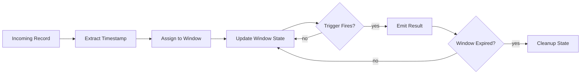
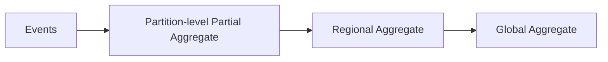
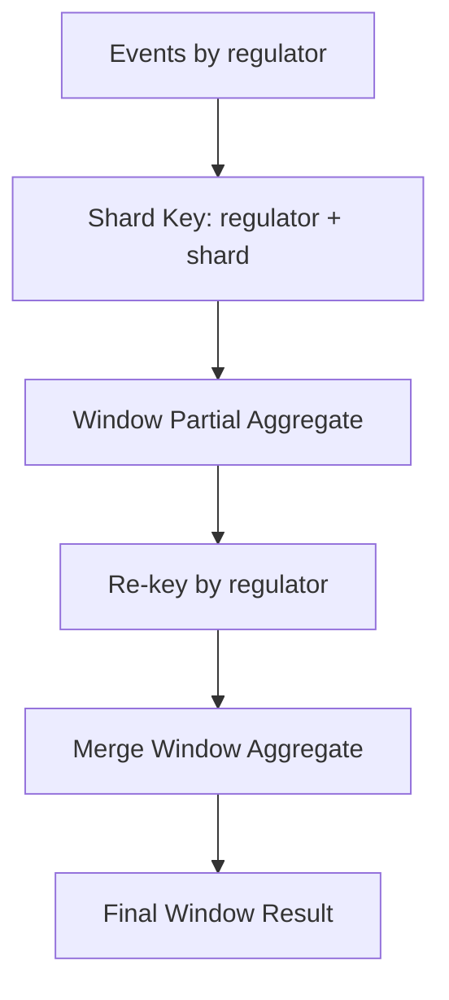
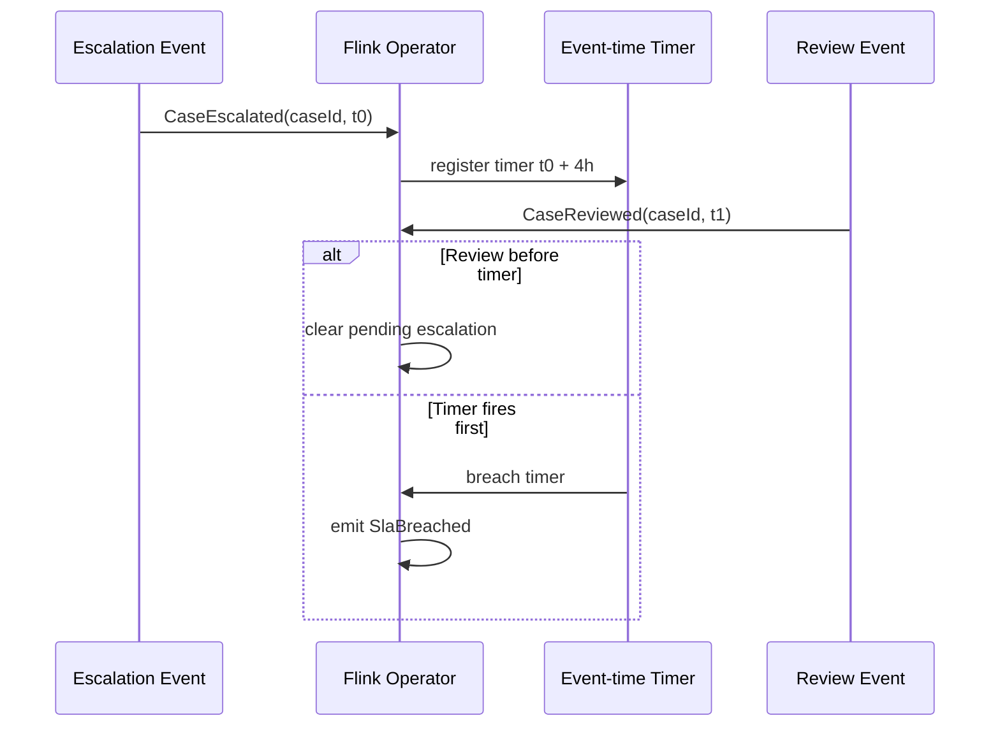
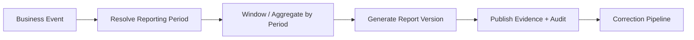
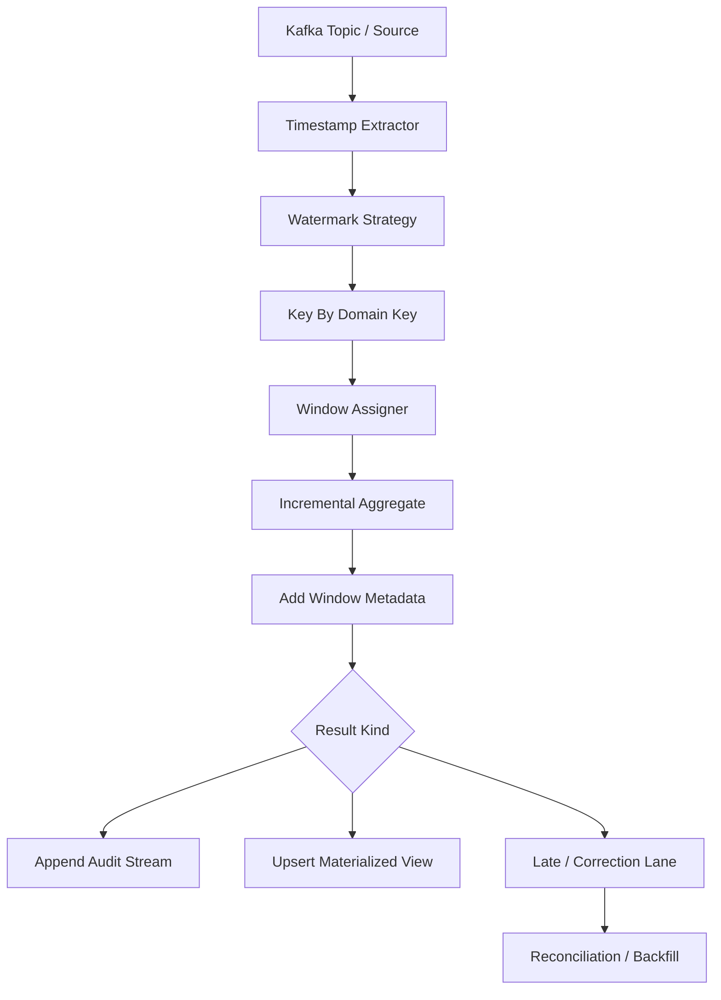

# Part 045 — Windowing Patterns

Windowing adalah cara kita membuat stream yang tidak berujung menjadi unit komputasi yang bisa dihitung, disimpan, diuji, dan dijelaskan.

Tanpa window, pertanyaan seperti ini tidak punya batas:

> "Berapa jumlah case escalation per regulator?"

Jumlah sejak kapan? Sampai kapan? Berdasarkan waktu event, waktu masuk Kafka, waktu diproses Flink, atau waktu bisnis efektif?

Windowing membuat pertanyaan menjadi eksplisit:

> "Hitung jumlah case escalation per regulator berdasarkan event time, dalam window 5 menit, emit ketika watermark melewati akhir window, kirim late event ke correction lane setelah lateness 10 menit."

Itu bukan detail implementasi. Itu adalah kontrak kebenaran.

---

## 1. Mental Model

Window bukan sekadar bucket waktu.

Window adalah kombinasi dari lima keputusan:

1. **assignment** — record masuk ke window mana?
2. **clock** — timestamp apa yang dipakai?
3. **trigger** — kapan hasil dikeluarkan?
4. **accumulation** — jika hasil keluar lebih dari sekali, apakah update, append, atau retract?
5. **cleanup** — kapan state window boleh dihapus?

Diagramnya:



Pipeline engineer yang hanya tahu "pakai tumbling window 5 menit" belum cukup. Yang penting adalah memahami apa yang terjadi terhadap event yang datang terlambat, event duplicate, event correction, event out-of-order, dan replay.

---

## 2. Masalah yang Diselesaikan Window

Window menyelesaikan beberapa masalah sekaligus:

| Masalah | Tanpa Window | Dengan Window |
|---|---|---|
| Stream tidak berujung | Aggregation tidak selesai | Aggregation punya boundary |
| State tumbuh tanpa batas | Memory/state leak | State bisa dibersihkan per window |
| Reporting butuh periode | Query ambigu | Periode eksplisit |
| Out-of-order event | Hasil tidak stabil | Watermark + lateness policy |
| Replay | Output bisa berbeda | Window + event time membuat replay deterministik |
| Alerting | Tidak jelas kapan dievaluasi | Window menjadi evaluation cycle |

Window bukan hanya untuk analytics. Window juga dipakai untuk:

- fraud detection,
- SLA breach detection,
- dedupe berbasis horizon,
- rate limiting,
- anomaly detection,
- sessionization,
- operational dashboard,
- reconciliation,
- compliance reporting.

---

## 3. Window Tidak Sama dengan Batch

Kesalahan umum: menganggap window = mini batch.

Secara fisik, window memang terlihat seperti kumpulan record. Secara semantik, window adalah **event-time boundary**.

Batch biasanya berbicara:

> "Proses semua data untuk tanggal 2026-07-04."

Window streaming berbicara:

> "Setiap event dengan timestamp antara 10:00:00 dan 10:04:59.999 masuk ke window ini, walaupun datang jam 10:07, selama masih dalam allowed lateness."

Perbedaannya:

| Dimensi | Batch | Window Streaming |
|---|---|---|
| Input | Bounded dataset | Unbounded stream |
| Boundary | File/partition/date | Time/event/session boundary |
| Completion | Dataset selesai dibaca | Watermark/trigger fires |
| Correction | Re-run partition | Late firing/correction lane |
| State | Job-local | Long-lived operator state |
| Failure | Re-run job | Restore from checkpoint |

---

## 4. Empat Komponen Window

### 4.1 Window Assigner

Window assigner menentukan window mana yang menerima event.

Contoh:

- tumbling 5 menit,
- sliding 10 menit dengan slide 1 menit,
- session 30 menit inactivity gap,
- global window,
- custom fiscal/calendar window.

### 4.2 Trigger

Trigger menentukan kapan hasil window dikeluarkan.

Contoh:

- saat watermark melewati akhir window,
- setiap 1 menit processing time,
- ketika jumlah record mencapai 10.000,
- early firing untuk dashboard,
- late firing saat late event masuk.

### 4.3 Evictor atau Cleanup Policy

Cleanup menentukan kapan state dibuang.

Ini penting karena window state bisa besar.

Kesalahan fatal:

> Membuat window yang tidak pernah dibersihkan karena global window atau allowed lateness terlalu besar.

### 4.4 Aggregation Function

Aggregation menentukan bagaimana record di dalam window dikompres menjadi hasil.

Ada dua pendekatan:

1. **incremental aggregation** — state kecil, update per record.
2. **full window aggregation** — simpan semua record, proses saat trigger.

Untuk production pipeline, default mental model adalah:

> Gunakan incremental aggregation jika tidak membutuhkan seluruh record mentah.

---

## 5. Clock Semantics

Window selalu bergantung pada waktu. Pertanyaannya: waktu yang mana?

| Clock | Sumber | Cocok Untuk | Risiko |
|---|---|---|---|
| Event time | Timestamp dari event bisnis | Correctness, replay, reporting | Butuh watermark/lateness policy |
| Processing time | Jam worker saat memproses | Monitoring ringan, rate limit lokal | Tidak deterministik saat replay |
| Ingestion time | Waktu event masuk platform | Latency/freshness measurement | Tidak sama dengan waktu kejadian |
| Business effective time | Waktu aturan bisnis berlaku | Regulatory/reporting temporal | Sulit jika correction/backdating |

Untuk data pipeline yang butuh auditability, gunakan **event time** atau **business effective time** sebagai primary semantic clock.

Processing time boleh dipakai untuk:

- timeout,
- operational guard,
- local cache refresh,
- rate limiting,
- early dashboard approximation.

Jangan pakai processing time untuk laporan yang harus defensible.

---

## 6. Tumbling Window

Tumbling window adalah window fixed-size yang tidak overlap.

Contoh: 5 menit.

```text
10:00 ───── 10:05 ───── 10:10 ───── 10:15
 [ window A ] [ window B ] [ window C ]
```

Satu event masuk ke satu window.

### Cocok Untuk

- metric per interval,
- SLA count per 5 menit,
- hourly compliance summary,
- per-day aggregation,
- checkpoint-friendly reporting.

### Tidak Cocok Untuk

- moving average yang harus smooth,
- pattern detection lintas boundary,
- session/user activity gap,
- alerting yang tidak boleh kehilangan sinyal di tepi window.

### Java/Flink Example

```java
DataStream<CaseEscalated> events = ...;

DataStream<EscalationCount> counts = events
    .assignTimestampsAndWatermarks(watermarkStrategy)
    .keyBy(CaseEscalated::regulatorId)
    .window(TumblingEventTimeWindows.of(Duration.ofMinutes(5)))
    .aggregate(new CountEscalations());
```

### Production Concern

Tumbling window membuat boundary keras.

Jika event terjadi pada `10:04:59.999`, ia masuk window `10:00-10:05`.
Jika event terjadi pada `10:05:00.000`, ia masuk window `10:05-10:10`.

Untuk bisnis, boundary ini harus masuk akal. Jika tidak, gunakan sliding atau session window.

---

## 7. Sliding Window

Sliding window adalah window fixed-size yang overlap.

Contoh: ukuran 10 menit, slide 1 menit.

```text
10:00 ───────────────────── 10:10
   10:01 ───────────────────── 10:11
      10:02 ───────────────────── 10:12
```

Satu event bisa masuk ke banyak window.

### Cocok Untuk

- moving average,
- rolling count,
- anomaly detection,
- "lebih dari N event dalam 10 menit terakhir",
- alerting dengan smooth boundary.

### Biaya

Sliding window jauh lebih mahal daripada tumbling window.

Jika window size = 10 menit dan slide = 1 menit, satu event masuk ke 10 window.

Rumus kasar:

```text
window_membership_per_event = window_size / slide_size
```

Contoh:

| Window Size | Slide | Membership per Event |
|---:|---:|---:|
| 10 menit | 5 menit | 2 |
| 10 menit | 1 menit | 10 |
| 1 jam | 1 menit | 60 |
| 24 jam | 1 menit | 1440 |

Sliding window bisa menghancurkan state jika dipilih sembarangan.

### Java/Flink Example

```java
DataStream<SlaRisk> risk = events
    .assignTimestampsAndWatermarks(watermarkStrategy)
    .keyBy(CaseEvent::caseOfficerId)
    .window(SlidingEventTimeWindows.of(
        Duration.ofMinutes(10),
        Duration.ofMinutes(1)
    ))
    .aggregate(new CountHighRiskEvents())
    .filter(count -> count.value() >= 5)
    .map(SlaRisk::from);
```

### Better Alternative

Untuk beberapa kasus, rolling metric bisa dibuat dengan keyed state + timer tanpa sliding window penuh.

Contoh:

- simpan bucket per menit,
- hapus bucket yang lebih tua dari 10 menit,
- jumlahkan bucket aktif.

Ini lebih eksplisit dan kadang lebih murah.

---

## 8. Session Window

Session window mengelompokkan event berdasarkan inactivity gap.

Contoh: gap 30 menit.

```text
user A events:
10:00 10:03 10:07        10:50 10:55
[ session 1      ]        [ session 2 ]
```

Jika tidak ada event selama 30 menit, session dianggap selesai.

### Cocok Untuk

- user activity session,
- case handling burst,
- investigator work session,
- device activity,
- clickstream,
- operational activity grouping.

### Risiko

Session window lebih sulit daripada tumbling window karena:

- window bisa merge,
- late event bisa menggabungkan dua session,
- state cleanup lebih kompleks,
- output bisa berubah setelah late event.

Contoh late event:

```text
Session A: 10:00 ─ 10:10
Session B: 10:45 ─ 10:50
Late event: 10:25
Gap: 30 min
```

Late event `10:25` bisa membuat Session A dan B menjadi satu session besar jika gap policy mengizinkan.

### Java/Flink Example

```java
DataStream<OfficerSession> sessions = events
    .assignTimestampsAndWatermarks(watermarkStrategy)
    .keyBy(CaseWorkEvent::officerId)
    .window(EventTimeSessionWindows.withGap(Duration.ofMinutes(30)))
    .process(new BuildOfficerSession());
```

### Production Rule

Jangan gunakan session window untuk data yang butuh output final cepat dan tidak boleh berubah.

Session window cocok jika downstream siap menerima:

- session update,
- session merge,
- correction,
- retraction,
- latest-state materialization.

---

## 9. Global Window

Global window menaruh semua event ke satu window tanpa natural end.

Ini berbahaya jika dipakai tanpa trigger dan cleanup.

Cocok untuk:

- continuous state machine,
- dedupe horizon manual,
- custom timer logic,
- long-running keyed process function,
- pattern matching yang tidak cocok dengan window biasa.

Namun untuk production, global window berarti:

> Anda bertanggung jawab penuh terhadap state lifecycle.

Jika tidak ada TTL/timer/cleanup, state akan tumbuh selamanya.

---

## 10. Calendar Window

Banyak business report memakai kalender, bukan durasi fixed.

Contoh:

- per hari Jakarta time,
- bulan fiskal,
- quarter,
- working day,
- regulatory reporting period,
- holiday-aware window.

Jangan menganggap `Duration.ofDays(1)` sama dengan "hari bisnis".

Masalah nyata:

- timezone,
- daylight saving time,
- holiday,
- end-of-month,
- fiscal period,
- retrospective rule change.

Untuk regulatory pipeline, calendar window sebaiknya didasarkan pada **calendar dimension/reference data** yang versioned.

Contoh model:

```java
public record ReportingPeriod(
    String periodId,
    Instant startsAtInclusive,
    Instant endsAtExclusive,
    ZoneId zoneId,
    String calendarVersion
) {}
```

Kemudian event dipetakan ke period:

```java
public interface ReportingCalendar {
    ReportingPeriod periodFor(Instant businessEffectiveTime, String regulatorId);
}
```

Ini lebih defensible daripada hardcode `Duration.ofDays(1)`.

---

## 11. Window Alignment

Window bisa aligned atau unaligned.

### Aligned Window

Semua key memakai boundary yang sama.

Contoh:

```text
10:00-10:05
10:05-10:10
10:10-10:15
```

Cocok untuk dashboard/reporting.

### Unaligned Window

Boundary bergantung pada event/key.

Contoh session window.

Cocok untuk user/case activity.

### Offset Window

Kadang window perlu offset.

Contoh business day dimulai pukul 07:00, bukan 00:00.

```text
07:00-07:00 next day
```

Jangan menyelesaikan ini dengan hack timestamp. Jadikan bagian dari contract.

---

## 12. Keyed Window

Hampir semua window produksi adalah keyed window.

```text
key -> window -> state -> output
```

Contoh:

```text
regulatorId=OJK, window=10:00-10:05
regulatorId=BI,  window=10:00-10:05
regulatorId=KPPU, window=10:00-10:05
```

Setiap key punya state window sendiri.

### Key Selection Matters

Key yang buruk menyebabkan:

- hot partition,
- state skew,
- slow checkpoint,
- uneven load,
- delayed watermark,
- high latency.

Contoh buruk:

```java
.keyBy(event -> "GLOBAL")
```

Ini mengubah distributed stream processing menjadi single-key bottleneck.

Jika memang butuh global aggregate, gunakan hierarchical aggregation:



---

## 13. Incremental Aggregation vs Full Window Processing

### Incremental Aggregation

State hanya menyimpan accumulator.

```java
public record CountAccumulator(long count) {}
```

Setiap event memperbarui accumulator.

Cocok untuk:

- count,
- sum,
- min/max,
- approximate distinct count,
- simple risk score.

### Full Window Processing

State menyimpan semua record sampai window firing.

Cocok untuk:

- sorting,
- top-N dengan detail,
- complex pattern,
- report yang butuh semua rows,
- custom reconciliation.

Namun mahal.

Rule:

> Simpan semua event hanya jika hasil tidak bisa dihitung incremental.

### Flink AggregateFunction Example

```java
public final class CountEscalations
    implements AggregateFunction<CaseEscalated, Long, EscalationCount> {

    @Override
    public Long createAccumulator() {
        return 0L;
    }

    @Override
    public Long add(CaseEscalated event, Long acc) {
        return acc + 1;
    }

    @Override
    public EscalationCount getResult(Long acc) {
        return new EscalationCount(acc);
    }

    @Override
    public Long merge(Long a, Long b) {
        return a + b;
    }
}
```

### ProcessWindowFunction Example

```java
public final class AddWindowMetadata
    extends ProcessWindowFunction<
        EscalationCount,
        WindowedEscalationCount,
        String,
        TimeWindow> {

    @Override
    public void process(
        String regulatorId,
        Context ctx,
        Iterable<EscalationCount> input,
        Collector<WindowedEscalationCount> out
    ) {
        EscalationCount count = input.iterator().next();
        out.collect(new WindowedEscalationCount(
            regulatorId,
            ctx.window().getStart(),
            ctx.window().getEnd(),
            count.value()
        ));
    }
}
```

Pattern production yang umum:

```java
.window(...)
.aggregate(new IncrementalAggregate(), new AddWindowMetadata())
```

Dengan cara ini, state tetap kecil tetapi output tetap punya metadata window.

---

## 14. Trigger Semantics

Trigger adalah sumber banyak kebingungan.

Window assignment menjawab:

> Event masuk window mana?

Trigger menjawab:

> Kapan hasil window keluar?

Beberapa trigger pattern:

| Trigger | Makna | Risiko |
|---|---|---|
| Event-time trigger | Fire saat watermark melewati akhir window | Butuh watermark benar |
| Processing-time trigger | Fire berdasarkan jam worker | Tidak replay deterministic |
| Count trigger | Fire setelah N record | Bisa bias untuk key sepi |
| Early trigger | Fire sebelum final | Downstream harus menerima update |
| Late trigger | Fire setelah late event | Downstream harus menerima correction |

### Output Final vs Output Update

Jika window bisa fire berkali-kali, downstream harus tahu apakah output adalah:

- final result,
- early estimate,
- correction,
- retraction,
- replacement snapshot.

Jangan hanya mengirim:

```json
{
  "windowStart": "2026-07-04T10:00:00Z",
  "windowEnd": "2026-07-04T10:05:00Z",
  "count": 123
}
```

Tambahkan metadata:

```json
{
  "windowStart": "2026-07-04T10:00:00Z",
  "windowEnd": "2026-07-04T10:05:00Z",
  "count": 123,
  "resultKind": "FINAL",
  "firingSequence": 2,
  "computedAt": "2026-07-04T10:06:12Z",
  "watermarkAtComputation": "2026-07-04T10:05:00Z"
}
```

---

## 15. Allowed Lateness

Allowed lateness adalah durasi tambahan setelah watermark melewati window end, di mana late event masih bisa memodifikasi window.

Contoh:

```text
window: 10:00-10:05
allowed lateness: 10 minutes
cleanup after: 10:15 watermark
```

Late event dengan event time `10:03` yang datang sebelum watermark `10:15` masih bisa diterima.

### Policy

| Policy | Behavior | Cocok Untuk |
|---|---|---|
| Drop | Abaikan late event | Low-value telemetry |
| Side output | Kirim ke late lane | Audit/reconciliation |
| Update result | Emit correction | Dashboard/materialized view |
| Reprocess window | Trigger backfill | Reporting/regulatory |
| Manual review | Quarantine | Sensitive data |

### Java/Flink Example

```java
OutputTag<CaseEvent> lateEvents = new OutputTag<>("late-events") {};

SingleOutputStreamOperator<WindowedEscalationCount> result = events
    .assignTimestampsAndWatermarks(watermarkStrategy)
    .keyBy(CaseEvent::regulatorId)
    .window(TumblingEventTimeWindows.of(Duration.ofMinutes(5)))
    .allowedLateness(Duration.ofMinutes(10))
    .sideOutputLateData(lateEvents)
    .aggregate(new CountEscalations(), new AddWindowMetadata());

DataStream<CaseEvent> lateLane = result.getSideOutput(lateEvents);
```

### Important

Allowed lateness bukan gratis.

Semakin lama lateness:

- semakin lama state disimpan,
- semakin besar checkpoint,
- semakin besar memory/disk,
- semakin lama recovery,
- semakin banyak correction output.

---

## 16. Late Data Is Not Always Bad Data

Late event bisa terjadi karena:

- mobile client offline,
- upstream retry,
- Kafka backlog,
- CDC connector lag,
- cross-region replication,
- source system clock skew,
- batch import historical data,
- manual correction.

Jangan langsung membuang late event tanpa memahami domain.

Untuk regulatory pipeline, late data sering berarti:

- correction,
- backdated decision,
- delayed evidence,
- reopened case,
- appeal outcome.

Membuang late data bisa membuat laporan salah.

---

## 17. Window Output Contract

Setiap output window harus menjelaskan minimal:

```java
public record WindowedResult<T>(
    String key,
    Instant windowStartInclusive,
    Instant windowEndExclusive,
    WindowType windowType,
    ClockType clockType,
    T value,
    ResultKind resultKind,
    long firingSequence,
    Instant watermarkAtComputation,
    Instant computedAt,
    String transformVersion
) {}
```

`ResultKind`:

```java
public enum ResultKind {
    EARLY,
    FINAL,
    LATE_UPDATE,
    CORRECTION,
    RETRACTION
}
```

Downstream tidak boleh menebak apakah output mengganti output sebelumnya atau menambah baris baru.

---

## 18. Append vs Upsert vs Retract Output

Window output punya tiga mode umum.

### 18.1 Append-only

Setiap firing menjadi record baru.

Cocok untuk audit trail.

```text
window, seq=1, count=100, kind=EARLY
window, seq=2, count=123, kind=FINAL
window, seq=3, count=124, kind=LATE_UPDATE
```

### 18.2 Upsert

Satu key window hanya punya latest result.

Primary key:

```text
metricName + groupingKey + windowStart + windowEnd
```

Cocok untuk materialized dashboard.

### 18.3 Retract

Output lama dibatalkan lalu diganti.

Cocok untuk SQL/table semantics, tetapi sink harus mendukung retraction.

### Production Rule

Untuk sistem campuran analytics + audit:

- simpan append-only audit stream,
- materialize upsert latest view dari audit stream.

Jangan hanya menyimpan latest result jika butuh forensic/debugging.

---

## 19. Window State Cost Model

State cost kira-kira:

```text
state_size ≈ active_keys × active_windows_per_key × accumulator_size
```

Untuk sliding window:

```text
active_windows_per_key ≈ window_size / slide_size + lateness_windows
```

Contoh:

- 1.000.000 key,
- sliding 1 jam tiap 1 menit,
- accumulator 128 bytes,
- lateness membuat 10 window ekstra.

```text
active windows per key = 60 + 10 = 70
state ≈ 1,000,000 × 70 × 128 bytes
      ≈ 8.96 GB raw accumulator only
```

Belum termasuk:

- serializer overhead,
- state backend overhead,
- key/window metadata,
- RocksDB overhead,
- checkpoint metadata,
- changelog/remote state.

Jadi sebelum memilih window, hitung state.

---

## 20. Hot Key and Window Explosion

Window memperbesar dampak hot key.

Jika satu key menerima 80% traffic, semua window untuk key itu juga panas.

Mitigasi:

1. split key dengan shard lokal,
2. partial aggregate per shard,
3. merge aggregate tahap kedua,
4. gunakan approximate aggregate,
5. gunakan hierarchical topology.

Contoh hierarchical window:



Tetapi hati-hati: merge tahap kedua harus memakai boundary window yang sama.

---

## 21. Windowing for SLA Breach Detection

Misal kita ingin mendeteksi:

> Case yang tidak di-review dalam 4 jam setelah escalation.

Ini bukan selalu tumbling window.

Lebih cocok memakai keyed state + timer:



Menggunakan tumbling window 4 jam untuk kasus ini sering salah, karena SLA dimulai dari timestamp tiap case, bukan boundary jam global.

Lesson:

> Window dipilih berdasarkan semantic boundary, bukan berdasarkan durasi bisnis secara naif.

---

## 22. Windowing for Rate Limiting

Rate limiting bisa memakai:

- tumbling window,
- sliding window,
- token bucket,
- leaky bucket,
- keyed state + processing time.

Untuk distributed stream processing, sliding window sering mahal. Token bucket berbasis state bisa lebih murah.

Example state:

```java
public record TokenBucketState(
    long availableTokens,
    Instant lastRefillAt
) {}
```

Jika tujuan adalah operational throttle, processing time dapat diterima.
Jika tujuan adalah audit/reporting, gunakan event time.

---

## 23. Windowing for Reconciliation

Reconciliation biasanya memakai aligned windows.

Contoh:

- source emitted count per hour,
- sink written count per hour,
- compare by source system, entity type, reporting period.

Output:

```java
public record ReconciliationWindow(
    String sourceSystem,
    String entityType,
    Instant windowStart,
    Instant windowEnd,
    long sourceCount,
    long sinkCount,
    long difference,
    ReconciliationStatus status
) {}
```

Untuk reconciliation, late data policy harus jelas.

Jika late event datang setelah report final:

- generate correction report,
- mark previous report superseded,
- retain audit trail.

---

## 24. Windowing for Regulatory Reporting

Regulatory reporting jarang cocok dengan default tumbling window.

Sering ada aturan:

- business day,
- office timezone,
- filing cutoff,
- correction period,
- appeal/reopen period,
- versioned reporting rule.

Pattern:



Jangan hanya membuat `window(TumblingEventTimeWindows.of(Duration.ofDays(1)))` lalu menyebutnya regulatory report.

---

## 25. Custom Window vs Keyed Process Function

Kadang custom `WindowAssigner` menggoda.

Tetapi custom window menambah kompleksitas:

- merging logic,
- cleanup,
- serializer,
- compatibility,
- test burden,
- operational understanding.

Untuk banyak kasus, `KeyedProcessFunction` lebih eksplisit.

Gunakan custom window jika:

- boundary window benar-benar reusable,
- semantics stabil,
- operator sudah paham lifecycle window,
- testing sangat kuat.

Gunakan keyed process function jika:

- logic lebih mirip state machine,
- timer berbeda per entity,
- boundary dimulai dari event tertentu,
- output adalah event domain, bukan aggregate periodik.

---

## 26. Testing Window Logic

Window logic harus diuji dengan event out-of-order.

### Test Dataset

```text
Event A: t=10:01 arrives first
Event B: t=10:03 arrives second
Event C: t=10:02 arrives third
Watermark: 10:05
Event D: t=10:04 arrives late but allowed
Watermark: 10:20
Event E: t=10:03 arrives too late
```

Test harus memverifikasi:

- event masuk window benar,
- output final muncul saat watermark benar,
- late event menghasilkan late update atau side output,
- too-late event tidak diam-diam hilang tanpa metric,
- replay menghasilkan output deterministik,
- state cleanup berjalan.

### Invariant Test

```text
For each emitted final window result:
  windowStart < windowEnd
  all included eventTime >= windowStart
  all included eventTime < windowEnd
  resultKind is not null
  transformVersion is stable
  output key is deterministic
```

---

## 27. Window Observability

Metric yang wajib:

| Metric | Kenapa Penting |
|---|---|
| active windows | State pressure |
| active keys | Cardinality growth |
| late event count | Watermark/source health |
| dropped late event count | Data loss risk |
| window firing count | Trigger behavior |
| early/final/late output count | Downstream semantics |
| window state bytes | Capacity planning |
| checkpoint duration | State cost |
| watermark lag | Freshness/correctness |
| hot key distribution | Skew detection |

Log harus mencakup:

- key,
- window start/end,
- firing sequence,
- result kind,
- watermark,
- transform version,
- late policy.

---

## 28. Common Anti-Patterns

### Anti-Pattern 1: Processing-Time Window for Business Reporting

Processing time berubah saat replay. Report bisa berbeda.

### Anti-Pattern 2: Sliding Window Without Cost Calculation

Window size 24 jam, slide 1 menit, jutaan key: state explosion.

### Anti-Pattern 3: Treating Early Output as Final

Dashboard approximation dikonsumsi oleh downstream sebagai financial/regulatory truth.

### Anti-Pattern 4: Dropping Late Events Silently

Late event harus dihitung, diobservasi, dan punya policy.

### Anti-Pattern 5: Global Window Without Cleanup

Ini state leak yang terlihat seperti feature.

### Anti-Pattern 6: Window Boundary Hidden in Code

Boundary window harus menjadi contract/configuration yang bisa direview.

### Anti-Pattern 7: Session Window for Immutable Reports

Session window bisa merge/update. Jangan pakai jika downstream butuh final immutable output cepat.

---

## 29. Design Checklist

Sebelum memilih window, jawab:

1. Pertanyaan bisnisnya membutuhkan boundary apa?
2. Timestamp mana yang menjadi semantic clock?
3. Apakah event bisa datang terlambat?
4. Berapa lateness yang diterima?
5. Apa yang terjadi terhadap event terlalu terlambat?
6. Apakah output final atau bisa update?
7. Apakah sink append, upsert, atau retract?
8. Berapa cardinality key?
9. Berapa active window per key?
10. Berapa estimasi state?
11. Apakah ada hot key?
12. Apakah replay menghasilkan output sama?
13. Apakah correction didukung?
14. Apakah window metadata ikut dikirim?
15. Apakah downstream memahami result kind?

---

## 30. Production Blueprint

Blueprint umum untuk windowed aggregation:



Key principle:

> Window output adalah event kontraktual. Treat it like a domain event, not a temporary computation artifact.

---

## 31. Minimal Production Java Model

```java
public record WindowKey(
    String metricName,
    String groupKey,
    Instant windowStartInclusive,
    Instant windowEndExclusive
) {}

public enum WindowClock {
    EVENT_TIME,
    PROCESSING_TIME,
    INGESTION_TIME,
    BUSINESS_EFFECTIVE_TIME
}

public enum WindowShape {
    TUMBLING,
    SLIDING,
    SESSION,
    GLOBAL,
    CUSTOM_CALENDAR
}

public record WindowMetadata(
    WindowKey key,
    WindowShape shape,
    WindowClock clock,
    String windowPolicyVersion,
    ResultKind resultKind,
    long firingSequence,
    Instant watermarkAtComputation,
    Instant computedAt
) {}

public record WindowedMetric<T>(
    WindowMetadata metadata,
    T value
) {}
```

Dengan model seperti ini, sink bisa membedakan:

- output final,
- update,
- correction,
- replay,
- backfill.

---

## 32. What Top Engineers Notice

Engineer biasa bertanya:

> "Pakai tumbling atau sliding?"

Engineer senior bertanya:

> "Apa semantic boundary-nya, clock-nya, trigger-nya, cleanup policy-nya, output mode-nya, dan downstream contract-nya?"

Itulah perbedaan utama.

Window bukan API. Window adalah cara menyatakan waktu, state, dan kebenaran dalam stream yang tidak pernah selesai.

---

## References

- Apache Flink Documentation — Windows: https://nightlies.apache.org/flink/flink-docs-stable/docs/dev/datastream/operators/windows/
- Apache Flink Documentation — Event Time and Watermarks: https://nightlies.apache.org/flink/flink-docs-stable/docs/concepts/time/
- Apache Flink Documentation — Streaming Analytics / Late Data: https://nightlies.apache.org/flink/flink-docs-stable/docs/learn-flink/streaming_analytics/
- Apache Beam Programming Guide — Windowing: https://beam.apache.org/documentation/programming-guide/
