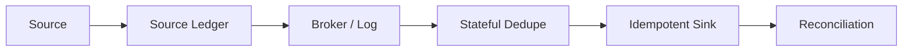
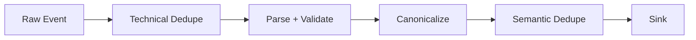
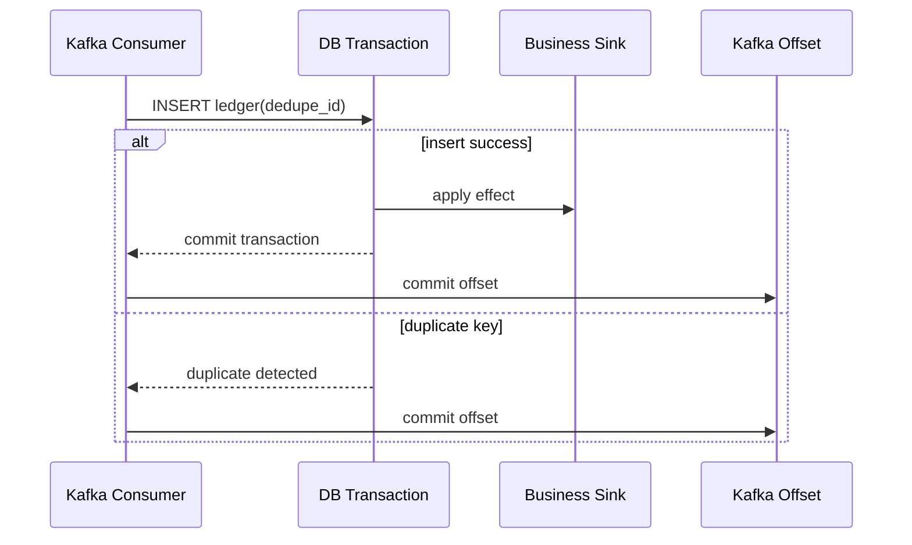
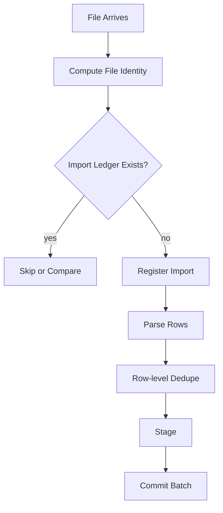
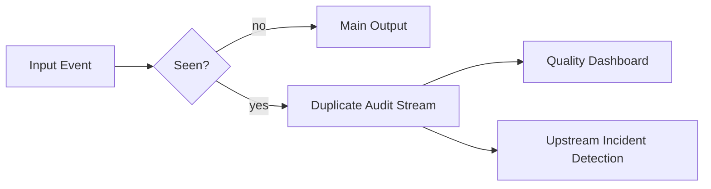
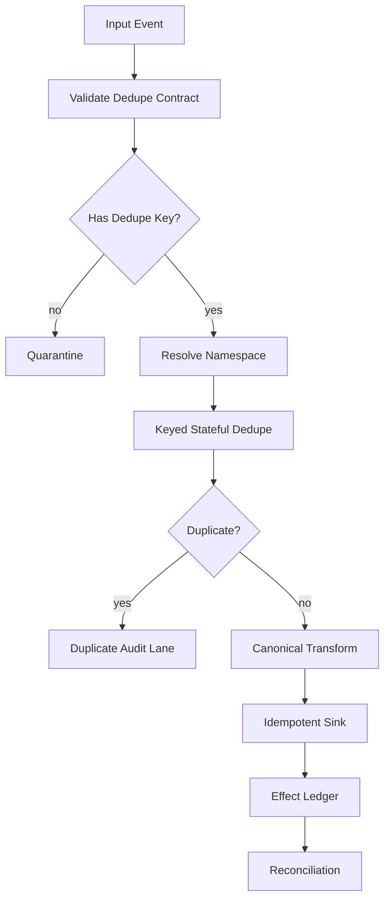

# Part 046 — Stateful Dedupe Patterns

Dedupe adalah salah satu pattern paling sederhana secara konsep, tetapi paling sering salah di production.

Versi naifnya:

```text
if eventId has been seen:
  drop
else:
  process
```

Versi production-nya harus menjawab:

- duplicate berdasarkan identity apa?
- horizon dedupe berapa lama?
- apakah duplicate datang sebelum atau sesudah output?
- apakah correction boleh memakai id yang sama?
- apakah replay harus diproses ulang atau di-skip?
- apakah sink sudah idempotent?
- apakah dedupe state bisa dibersihkan?
- apakah duplicate harus di-audit?
- apakah late duplicate berbeda dengan late correction?

Dedupe bukan hanya filter. Dedupe adalah stateful correctness boundary.

---

## 1. Why Duplicates Exist

Duplicate bisa muncul dari banyak tempat:

| Sumber Duplicate | Contoh |
|---|---|
| Producer retry | Producer timeout, publish sukses tapi client tidak tahu |
| API pagination | Page berubah saat sync berjalan |
| CDC snapshot + stream overlap | Row muncul di snapshot dan CDC stream |
| Outbox relay retry | Relay crash setelah publish sebelum mark sent |
| Consumer retry | Sink sukses, offset belum commit |
| Rebalance | Partition diproses ulang oleh consumer baru |
| Backfill | Historical data dipublish lagi |
| Manual re-import | Operator upload file sama |
| Source bug | Upstream mengirim event sama dengan ID berbeda |
| Multi-region replication | Event muncul dari dua region |

Karena itu, dedupe tidak bisa hanya diletakkan di satu tempat dan dianggap selesai.

Production pipeline biasanya memakai beberapa lapisan:



---

## 2. Dedupe vs Idempotency

Dedupe dan idempotency sering tertukar.

| Konsep | Pertanyaan | Lokasi Umum |
|---|---|---|
| Dedupe | Apakah record ini pernah dilihat? | Stream processor / consumer state |
| Idempotency | Apakah effect ini aman diulang? | Sink / database / external system |
| Reconciliation | Apakah hasil akhir cocok dengan sumber? | Audit / reporting / control process |

Dedupe mengurangi duplicate processing.
Idempotency memastikan duplicate processing tidak merusak hasil.
Reconciliation mendeteksi jika keduanya gagal.

Production rule:

> Jangan mengandalkan dedupe saja. Sink tetap harus idempotent untuk side effect penting.

---

## 3. Dedupe Key

Dedupe key adalah keputusan paling penting.

### 3.1 Event ID

Event ID unik per event occurrence.

```java
public record EventId(String value) {}
```

Cocok untuk:

- outbox event,
- domain event,
- API event dengan stable ID,
- CDC transaction event yang punya source position.

Kelemahan:

- jika source mengirim duplicate dengan ID baru, tidak terdeteksi.

### 3.2 Business Key

Business key mewakili fakta bisnis.

Contoh:

```text
caseId + decisionType + decisionEffectiveDate
```

Cocok untuk:

- file import tanpa event ID,
- API sync,
- CDC row-state projection,
- regulatory facts.

Kelemahan:

- correction bisa terlihat seperti duplicate,
- natural key bisa berubah,
- membutuhkan semantic design.

### 3.3 Source Position

Source position berasal dari log/offset/cursor.

Contoh:

```text
database=case-db, table=case_status, lsn=12345678
kafkaTopic=case-events, partition=3, offset=99128
file=cases-2026-07-04.csv, line=812
```

Cocok untuk audit dan exactly-once-ish processing boundary.

Kelemahan:

- tidak mendeteksi duplicate semantik lintas source position.

### 3.4 Payload Hash

Hash payload bisa dipakai saat tidak ada ID.

```java
String hash = sha256(normalizedPayload);
```

Kelemahan:

- perubahan insignificant bisa membuat hash beda,
- collision sangat jarang tetapi tetap konsepnya ada,
- tidak membedakan duplicate vs repeated legitimate event.

### 3.5 Composite Dedupe Key

Production sering memakai composite key.

```java
public record DedupeKey(
    String sourceSystem,
    String entityType,
    String semanticKey,
    String eventType,
    String eventVersion
) {}
```

Rule:

> Dedupe key harus didefinisikan dalam data contract, bukan tersembunyi di kode operator.

---

## 4. Duplicate Is Not Always Bad

Ada event yang terlihat sama tetapi valid.

Contoh:

- case assigned ke officer A, lalu assigned lagi ke officer A setelah reopen,
- status berubah dari `OPEN` ke `OPEN` karena correction metadata,
- decision reissued dengan effective date yang sama tapi legal basis berbeda,
- heartbeat event berulang,
- repeated measurement dengan nilai sama.

Pertanyaan dedupe bukan:

> Apakah payload sama?

Pertanyaan yang benar:

> Apakah event ini merepresentasikan fakta yang sama dalam domain timeline yang sama?

---

## 5. Dedupe Horizon

Dedupe tidak bisa menyimpan semua ID selamanya, kecuali volumenya kecil dan compliance memang membutuhkan ledger permanen.

Dedupe horizon adalah berapa lama pipeline mengingat event yang sudah terlihat.

Contoh:

| Use Case | Horizon |
|---|---:|
| Producer retry cepat | 5-30 menit |
| Kafka consumer replay pendek | 1-7 hari |
| CDC snapshot overlap | Durasi snapshot + buffer |
| File import duplicate | Selama file import lifecycle |
| Regulatory audit ledger | Permanen / sesuai retention policy |

Horizon harus disesuaikan dengan failure mode.

Jangan memilih TTL 24 jam kalau backfill bisa mengulang data 30 hari lalu.

---

## 6. Dedupe State Shape

Ada beberapa bentuk state.

### 6.1 Set of Seen IDs

```text
key -> Set<eventId>
```

Mudah dipahami, tetapi bisa besar.

### 6.2 Map ID to Timestamp

```text
key -> Map<eventId, seenAt>
```

Memungkinkan cleanup berdasarkan waktu.

### 6.3 Last Seen Version

```text
entityId -> lastVersion
```

Cocok untuk monotonic version.

### 6.4 Last Source Position

```text
partition -> lastProcessedOffset
```

Cocok untuk ordered source.

### 6.5 Sink Ledger

```text
effectId -> effectStatus
```

Cocok untuk side effect idempotency.

### 6.6 Probabilistic Filter

Bloom filter atau approximate set bisa dipakai untuk high-volume telemetry.

Trade-off:

- hemat memory,
- bisa false positive,
- tidak cocok jika false drop tidak boleh terjadi.

Untuk regulatory pipeline, jangan gunakan probabilistic dedupe untuk data yang harus lengkap.

---

## 7. Exact Dedupe with Flink Keyed State

Pattern umum:

```text
keyBy(dedupe partition key)
MapState<dedupeId, firstSeenMetadata>
```

### Java Model

```java
public record DedupeDecision(
    boolean duplicate,
    String reason,
    Instant firstSeenAt,
    Instant currentSeenAt
) {}

public record SeenEvent(
    Instant eventTime,
    Instant firstSeenProcessingTime,
    String sourcePosition,
    String payloadHash
) {}
```

### Flink ProcessFunction Skeleton

```java
public final class StatefulDedupeFunction
    extends KeyedProcessFunction<String, PipelineEvent, PipelineEvent> {

    private transient MapState<String, SeenEvent> seen;

    @Override
    public void open(Configuration parameters) {
        MapStateDescriptor<String, SeenEvent> descriptor =
            new MapStateDescriptor<>(
                "seen-events",
                String.class,
                SeenEvent.class
            );

        StateTtlConfig ttl = StateTtlConfig
            .newBuilder(Duration.ofDays(7))
            .setUpdateType(StateTtlConfig.UpdateType.OnCreateAndWrite)
            .setStateVisibility(StateTtlConfig.StateVisibility.NeverReturnExpired)
            .build();

        descriptor.enableTimeToLive(ttl);
        seen = getRuntimeContext().getMapState(descriptor);
    }

    @Override
    public void processElement(
        PipelineEvent event,
        Context ctx,
        Collector<PipelineEvent> out
    ) throws Exception {
        String dedupeId = event.dedupeId();

        if (seen.contains(dedupeId)) {
            emitDuplicateMetric(event);
            return;
        }

        seen.put(dedupeId, new SeenEvent(
            event.eventTime(),
            Instant.ofEpochMilli(ctx.timerService().currentProcessingTime()),
            event.sourcePosition(),
            event.payloadHash()
        ));

        out.collect(event);
    }
}
```

Ini mudah, tetapi belum cukup untuk semua kasus.

---

## 8. TTL Is a Memory Policy, Not a Correctness Policy

State TTL membantu membersihkan state. Tetapi TTL tidak selalu berarti "record pasti hilang tepat pada waktu X" secara semantik bisnis.

Production mental model:

> TTL mengontrol resource. Correctness dikontrol oleh dedupe horizon contract, watermark/timer, sink idempotency, dan reconciliation.

Jika Anda harus tahu pasti kapan ID boleh dilupakan, gunakan explicit timer dan metadata.

---

## 9. Event-Time Dedupe Horizon

Untuk dedupe yang bergantung pada waktu event, cleanup harus berbasis event time, bukan processing time.

Contoh:

```text
remember eventId until eventTime + 7 days + allowed lateness
```

Pattern:

1. simpan `eventId -> eventTime`,
2. register event-time timer untuk cleanup,
3. saat timer fire, hapus ID,
4. kirim metric cleanup.

### Skeleton

```java
public final class EventTimeDedupeFunction
    extends KeyedProcessFunction<String, PipelineEvent, PipelineEvent> {

    private transient MapState<String, SeenEvent> seen;
    private transient MapState<Long, List<String>> cleanupIndex;

    private final Duration horizon = Duration.ofDays(7);
    private final Duration allowedLateness = Duration.ofHours(2);

    @Override
    public void processElement(
        PipelineEvent event,
        Context ctx,
        Collector<PipelineEvent> out
    ) throws Exception {
        String id = event.dedupeId();

        if (seen.contains(id)) {
            return;
        }

        long cleanupAt = event.eventTime()
            .plus(horizon)
            .plus(allowedLateness)
            .toEpochMilli();

        seen.put(id, SeenEvent.from(event));
        addToCleanupIndex(cleanupAt, id);
        ctx.timerService().registerEventTimeTimer(cleanupAt);

        out.collect(event);
    }

    @Override
    public void onTimer(
        long timestamp,
        OnTimerContext ctx,
        Collector<PipelineEvent> out
    ) throws Exception {
        List<String> ids = cleanupIndex.get(timestamp);
        if (ids == null) {
            return;
        }

        for (String id : ids) {
            seen.remove(id);
        }
        cleanupIndex.remove(timestamp);
    }
}
```

Real implementation harus hati-hati dengan `List<String>` yang bisa besar. Biasanya cleanup bucket dibuat coarse-grained, misalnya per menit atau per jam.

---

## 10. Processing-Time Dedupe

Processing-time dedupe cocok untuk duplicate akibat retry cepat.

Contoh:

- producer retry dalam 5 menit,
- webhook redelivery,
- API duplicate response,
- temporary network retry.

Tidak cocok untuk:

- historical replay,
- regulatory correction,
- deterministic backfill,
- event-time reporting.

Processing-time dedupe saat replay bisa berbeda karena jam worker berbeda.

---

## 11. Dedupe and Backfill

Backfill bisa berbenturan dengan dedupe.

Pertanyaan penting:

> Saat backfill memutar ulang event lama, apakah event itu harus dianggap duplicate atau harus dihitung ulang?

Ada dua mode:

### 11.1 Operational Replay Mode

Tujuannya mengulang delivery yang gagal.

Dedupe aktif.
Sink idempotent.
Output tidak boleh double.

### 11.2 Recompute Mode

Tujuannya menghitung ulang hasil dengan transform versi baru.

Dedupe lama mungkin harus diabaikan atau namespace dedupe harus berbeda.

Contoh key:

```text
dedupeNamespace = transformVersion + backfillRunId
```

Jika tidak, recompute bisa "hilang" karena dianggap duplicate oleh state lama.

---

## 12. Dedupe Namespace

Dedupe key harus memiliki namespace.

```java
public record DedupeNamespace(
    String pipelineName,
    String transformVersion,
    String processingMode,
    String sourceSystem
) {}
```

Processing mode:

```java
public enum ProcessingMode {
    LIVE,
    REPLAY,
    BACKFILL,
    RECOMPUTE,
    CORRECTION
}
```

Full key:

```java
public record NamespacedDedupeKey(
    DedupeNamespace namespace,
    String dedupeId
) {}
```

Tanpa namespace, backfill dan live stream bisa saling mengacaukan.

---

## 13. Duplicate vs Correction

Correction bukan duplicate.

Contoh:

```text
Original:
caseId=123, decision=APPROVED, effectiveDate=2026-07-01

Correction:
caseId=123, decision=REJECTED, effectiveDate=2026-07-01, correctsEventId=abc
```

Jika dedupe key hanya `caseId + effectiveDate`, correction bisa dibuang secara salah.

Correction event harus punya semantic model:

```java
public sealed interface CaseDecisionEvent permits
    CaseDecisionIssued,
    CaseDecisionCorrected,
    CaseDecisionRetracted {}

public record CaseDecisionCorrected(
    String eventId,
    String correctsEventId,
    String caseId,
    String newDecision,
    Instant effectiveDate,
    String correctionReason
) implements CaseDecisionEvent {}
```

Dedupe harus tahu event type.

---

## 14. Late Duplicate vs Late New Event

Late duplicate:

```text
eventId same, eventTime old, already processed
```

Late new event:

```text
eventId new, eventTime old, not processed
```

Late correction:

```text
new event correcting old event
```

Ketiganya harus punya policy berbeda.

| Case | Policy Umum |
|---|---|
| Late duplicate | Drop + metric |
| Late new event | Side output / late update / correction |
| Late correction | Correction lane |

Jangan membuat semua late event sebagai duplicate.

---

## 15. Dedupe Before or After Enrichment?

Ada dua pilihan.

### Before Enrichment

Mengurangi beban enrichment.

Cocok jika dedupe key tersedia di raw event.

### After Enrichment

Dedupe key lebih akurat karena butuh reference data/canonicalization.

Cocok jika raw source tidak stabil.

### Hybrid

- cheap technical dedupe sebelum enrichment,
- semantic dedupe setelah canonicalization.

Diagram:



---

## 16. Dedupe in Kafka Consumer Without Flink

Jika memakai plain Java Kafka consumer, dedupe biasanya memakai external store.

Contoh PostgreSQL ledger:

```sql
CREATE TABLE processed_event_ledger (
    consumer_name text NOT NULL,
    dedupe_id text NOT NULL,
    first_seen_at timestamptz NOT NULL DEFAULT now(),
    source_topic text NOT NULL,
    source_partition int NOT NULL,
    source_offset bigint NOT NULL,
    PRIMARY KEY (consumer_name, dedupe_id)
);
```

Processing flow:



Important:

- ledger insert dan business effect harus dalam transaksi yang sama jika sink-nya database yang sama,
- offset commit dilakukan setelah transaksi DB commit,
- jika offset commit gagal, replay akan hit duplicate key dan aman.

---

## 17. Sink Ledger vs Stream Dedupe

Stream dedupe mengurangi noise sebelum sink.
Sink ledger menjamin side effect.

Untuk critical effect, sink ledger lebih penting.

Contoh:

```sql
CREATE TABLE case_projection_event_ledger (
    projection_name text NOT NULL,
    event_id text NOT NULL,
    applied_at timestamptz NOT NULL DEFAULT now(),
    transform_version text NOT NULL,
    PRIMARY KEY (projection_name, event_id)
);
```

Dalam transaksi:

```sql
INSERT INTO case_projection_event_ledger(projection_name, event_id, transform_version)
VALUES (?, ?, ?)
ON CONFLICT DO NOTHING;
```

Jika row inserted = 1, apply projection.
Jika row inserted = 0, skip.

---

## 18. Dedupe with Monotonic Version

Jika source punya monotonic version per entity, dedupe bisa lebih murah.

```text
entityId -> highestSeenVersion
```

Rule:

- version lebih kecil atau sama = duplicate/stale,
- version lebih besar = process.

Cocok untuk:

- entity snapshot stream,
- CDC row version,
- aggregate version,
- event-sourced aggregate sequence.

Caveat:

- harus ordered per entity,
- version tidak boleh reset,
- correction harus punya model khusus,
- gap version harus diobservasi.

Example:

```java
if (event.version() <= state.highestVersion()) {
    dropAsStale(event);
} else if (event.version() > state.highestVersion() + 1) {
    emitGapWarning(event);
    process(event);
} else {
    process(event);
}
```

---

## 19. Dedupe with Source Position

Jika input ordered per partition, offset bisa menjadi dedupe/progress state.

Tetapi offset tidak cukup untuk semantic dedupe.

Kafka offset menjawab:

> Apakah posisi ini sudah dibaca?

Bukan:

> Apakah fakta bisnis ini sudah diproses dari source lain?

CDC LSN menjawab:

> Apakah perubahan log ini sudah diproses?

Bukan:

> Apakah row ini merepresentasikan correction yang mengganti fakta lama?

Gunakan source position untuk recovery, gunakan semantic key untuk business dedupe.

---

## 20. Dedupe with Compacted Topic

Kafka compacted topic bisa dipakai sebagai dedupe/reference state.

Pattern:

- topic `seen-events` compacted,
- key = dedupe ID,
- value = first seen metadata,
- stream processor restore state dari topic.

Trade-off:

| Kelebihan | Kekurangan |
|---|---|
| Durable | Topic bisa besar |
| Replayable | Compaction bukan immediate delete |
| Shared state | Tombstone/retention perlu benar |
| Kafka-native | Query lokal tetap perlu state store |

Ini cocok untuk state yang harus recoverable dan auditable, tetapi bukan pengganti sink ledger jika ada side effect eksternal.

---

## 21. Dedupe for CDC Snapshot + Stream Overlap

CDC sering memiliki fase snapshot lalu streaming.

Duplicate bisa muncul jika:

- snapshot membaca row,
- lalu log stream juga memuat perubahan yang sama/berdekatan,
- consumer menggabungkan snapshot event dan CDC event tanpa boundary.

Pattern:

1. gunakan source metadata dari CDC connector,
2. bedakan snapshot event dan streaming event,
3. gunakan primary key + source position/version,
4. sink harus upsert/idempotent,
5. reconciliation setelah snapshot selesai.

Jika output adalah projection latest state, upsert biasanya cukup.
Jika output adalah append-only facts, perlu dedupe lebih hati-hati.

---

## 22. Dedupe for File Import

File import duplicate biasanya berbeda dari stream duplicate.

Dedupe keys:

- file checksum,
- manifest ID,
- source file path + generation/version,
- row number,
- business key,
- payload hash.

Pattern:



File-level dedupe saja tidak cukup jika file berbeda berisi row yang sama.
Row-level dedupe saja tidak cukup jika file replay harus diperlakukan sebagai same import.

---

## 23. Dedupe for API Sync

API sync duplicate muncul karena pagination dan updated-since semantics.

Common pattern:

```text
cursor = lastUpdatedAt
lookback = 10 minutes
query from cursor - lookback
```

Lookback sengaja membaca ulang data untuk menghindari missing update.

Karena itu sink harus dedupe/upsert.

Dedupe key biasanya:

```text
remoteEntityId + remoteVersion/updatedAt
```

Jika API tidak punya version, gunakan:

```text
remoteEntityId + normalizedPayloadHash
```

Tetapi pastikan correction dan legitimate repeated state tidak salah dibuang.

---

## 24. Dedupe State Size Estimation

Rumus kasar:

```text
state_size ≈ unique_dedupe_keys_within_horizon × bytes_per_entry
```

Jika:

- 20.000 events/sec,
- horizon 7 hari,
- 100 bytes per entry raw,

```text
20,000 × 60 × 60 × 24 × 7 = 12,096,000,000 entries
raw = 1.2 TB before overhead
```

Itu tidak realistis untuk exact state sederhana.

Solusi:

- kurangi horizon,
- dedupe per key bukan global,
- gunakan source-level idempotency,
- pindahkan ledger ke database/object store,
- gunakan compacted topic,
- gunakan probabilistic dedupe untuk low-risk telemetry,
- gunakan aggregation yang tidak sensitif duplicate,
- gunakan idempotent sink dan reconciliation.

---

## 25. Partitioning Dedupe State

Dedupe state harus dipartisi dengan key yang sama dengan dedupe decision.

Jika dedupe key adalah event ID global, keyBy event ID.
Jika duplicate didefinisikan per entity, keyBy entity ID.

Kesalahan:

```java
.keyBy(event -> event.tenantId())
```

Jika tenant besar, satu key menjadi panas dan state raksasa.

Lebih baik:

```java
.keyBy(event -> hash(event.dedupeId()) % shardCount)
```

Tetapi pastikan duplicate dengan dedupe ID yang sama selalu masuk shard yang sama.

---

## 26. Hot Dedupe Key

Hot key terjadi jika banyak event berbagi key.

Contoh:

- `UNKNOWN_CUSTOMER`,
- `null`,
- default tenant,
- global metric,
- malformed data.

Production guard:

```java
if (event.dedupeId() == null || event.dedupeId().isBlank()) {
    outputToQuarantine(event, "MISSING_DEDUPE_ID");
    return;
}
```

Jangan mengganti missing key dengan string konstan seperti `UNKNOWN`. Itu membuat hot key dan duplicate palsu.

---

## 27. Dedupe and Privacy

Dedupe key sering mengandung PII.

Contoh buruk:

```text
email + phone + dateOfBirth
```

Lebih baik:

- canonicalize,
- hash dengan salt/pepper yang dikelola aman,
- jangan log raw key,
- pisahkan security boundary,
- dokumentasikan retention.

Example:

```java
public record SafeDedupeKey(
    String keyHash,
    String keyVersion,
    String classification
) {}
```

Dedupe state juga termasuk data yang harus di-retain dan dihapus sesuai policy.

---

## 28. Dedupe Observability

Metric wajib:

| Metric | Makna |
|---|---|
| dedupe_checked_total | Volume record dicek |
| duplicate_dropped_total | Duplicate yang dibuang |
| duplicate_rate | Signal upstream retry/bug |
| state_entries | Jumlah key dalam state |
| state_bytes | Kapasitas |
| state_cleanup_total | Cleanup berjalan |
| late_duplicate_total | Duplicate datang terlambat |
| missing_dedupe_key_total | Contract violation |
| dedupe_false_conflict_total | Event valid dianggap duplicate |
| dedupe_store_latency | External ledger health |

Log jangan memuat raw PII key.

Gunakan hash/fingerprint:

```json
{
  "event": "duplicate_dropped",
  "pipeline": "case-escalation-pipeline",
  "dedupeKeyHash": "sha256:abc...",
  "firstSeenAt": "2026-07-04T10:00:00Z",
  "currentSeenAt": "2026-07-04T10:03:12Z",
  "sourcePosition": "topic=case-events,partition=2,offset=991"
}
```

---

## 29. Dedupe Audit Trail

Untuk data kritikal, duplicate yang dibuang tetap perlu audit.

Pattern:

- main stream hanya menerima first occurrence,
- duplicate stream menyimpan duplicate metadata,
- duplicate stream bisa dianalisis untuk source quality.



Duplicate audit stream tidak harus menyimpan full payload jika sensitif.

---

## 30. Testing Stateful Dedupe

Test cases minimal:

1. first event passes,
2. same event duplicate drops,
3. same payload with different event ID follows policy,
4. same business key with correction passes,
5. replay mode does not double-apply sink effect,
6. TTL cleanup removes old key,
7. late duplicate drops,
8. late new event follows late policy,
9. missing dedupe key goes quarantine,
10. state restore after checkpoint preserves seen IDs,
11. backfill namespace does not conflict with live namespace,
12. high cardinality does not exceed state budget.

Example property:

```text
For any event sequence S:
  output contains at most one event per dedupe key per namespace per horizon
```

But only if your dedupe contract says exactly that.

---

## 31. Failure Scenarios

### 31.1 Crash After Dedupe State Update Before Output

In Flink, managed state and output are coordinated through checkpointing. But sink semantics still matter.

Question:

> If event marked seen, but output not durably committed, can it disappear?

Use framework-supported checkpointing and sink commit protocols. For external stores, use idempotent sink ledger.

### 31.2 Crash After Sink Success Before Offset Commit

On replay, dedupe may or may not remember event depending on state checkpoint.

Sink idempotency must protect effect.

### 31.3 TTL Expires Before Duplicate Arrives

Duplicate becomes new event.

This is expected if outside horizon, but must be acceptable by contract.

### 31.4 State Lost or Reset

All historical duplicates can pass.

Mitigation:

- restore from checkpoint/savepoint,
- external ledger,
- compacted state topic,
- sink idempotency,
- reconciliation.

---

## 32. Production Blueprint



Core invariant:

> For a given dedupe namespace and horizon, the pipeline emits at most one accepted event for each dedupe key, unless the event is explicitly modeled as correction/retraction/reissue.

---

## 33. Minimal Java Interfaces

```java
public interface DedupeKeyResolver<E> {
    Optional<NamespacedDedupeKey> resolve(E event);
}

public interface DedupeStore {
    DedupeDecision checkAndRemember(
        NamespacedDedupeKey key,
        SeenEvent metadata
    );
}

public enum DuplicatePolicy {
    DROP,
    AUDIT_AND_DROP,
    QUARANTINE,
    PASS_WITH_DUPLICATE_MARKER
}

public record DedupeResult<E>(
    E event,
    boolean duplicate,
    DuplicatePolicy policy,
    String reason
) {}
```

This abstraction makes dedupe testable outside Flink/Kafka.

---

## 34. Common Anti-Patterns

### Anti-Pattern 1: Dedupe by Payload Hash Only

Payload equality is not domain equality.

### Anti-Pattern 2: Infinite In-Memory Set

Works in demo. Dies in production.

### Anti-Pattern 3: TTL Chosen Randomly

TTL must come from failure model and replay/backfill requirement.

### Anti-Pattern 4: Missing Key Defaults to Constant

`UNKNOWN` becomes hot key and false duplicate factory.

### Anti-Pattern 5: Dedupe Before Understanding Correction

Correction gets dropped as duplicate.

### Anti-Pattern 6: Trusting Dedupe Without Idempotent Sink

One state loss or replay can double-apply side effect.

### Anti-Pattern 7: No Duplicate Audit

You cannot detect upstream quality issue if duplicates disappear silently.

---

## 35. Review Checklist

Before approving dedupe design:

1. What is the dedupe key?
2. Is dedupe technical, semantic, or both?
3. What is the namespace?
4. What is the horizon?
5. Why is that horizon enough?
6. What happens after TTL expires?
7. Is correction distinguishable from duplicate?
8. Is replay mode different from recompute mode?
9. Is backfill isolated?
10. Is sink idempotent?
11. Is there duplicate audit lane?
12. How big can state become?
13. What is hot-key mitigation?
14. Does state survive restart?
15. What is the reconciliation mechanism?
16. Are raw PII keys avoided?
17. Are missing keys quarantined?
18. Are metrics and alerts defined?

---

## 36. What Top Engineers Notice

Engineer biasa melihat duplicate sebagai nuisance.

Engineer kuat melihat duplicate sebagai konsekuensi natural dari distributed systems.

Distributed pipeline tidak bisa menghindari retry, replay, partial failure, reordering, and unknown outcome. Karena itu, dedupe harus didesain sebagai bagian dari correctness model, bukan filter tambahan di akhir.

Prinsip akhirnya:

> Dedupe reduces repeated work. Idempotency protects effects. Reconciliation proves the result.

Jika ketiganya ada, pipeline jauh lebih defensible.

---

## References

- Apache Flink Documentation — Working with State: https://nightlies.apache.org/flink/flink-docs-stable/docs/dev/datastream/fault-tolerance/state/
- Apache Flink Documentation — State TTL: https://nightlies.apache.org/flink/flink-docs-stable/docs/dev/datastream/fault-tolerance/state/
- Apache Flink Documentation — Timers and ProcessFunction: https://nightlies.apache.org/flink/flink-docs-stable/docs/dev/datastream/operators/process_function/
- Apache Kafka Documentation — Consumer and Offset Semantics: https://kafka.apache.org/documentation/
