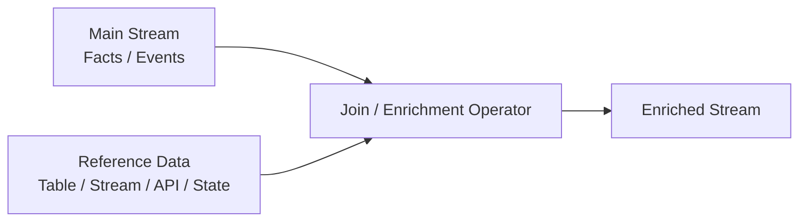
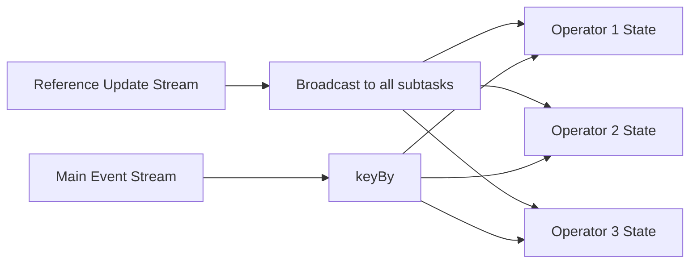
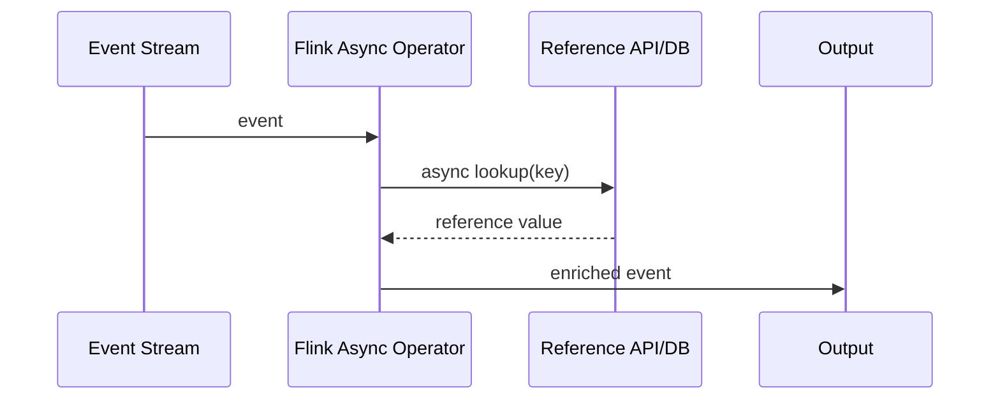
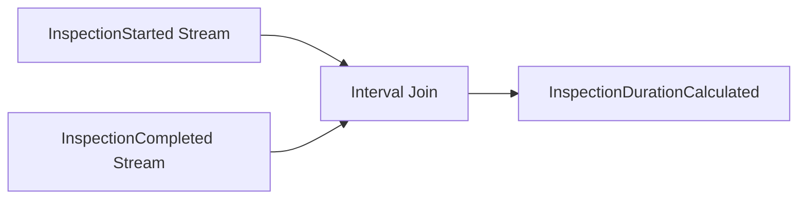
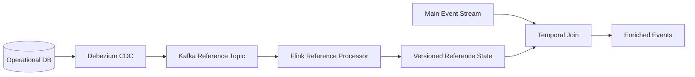
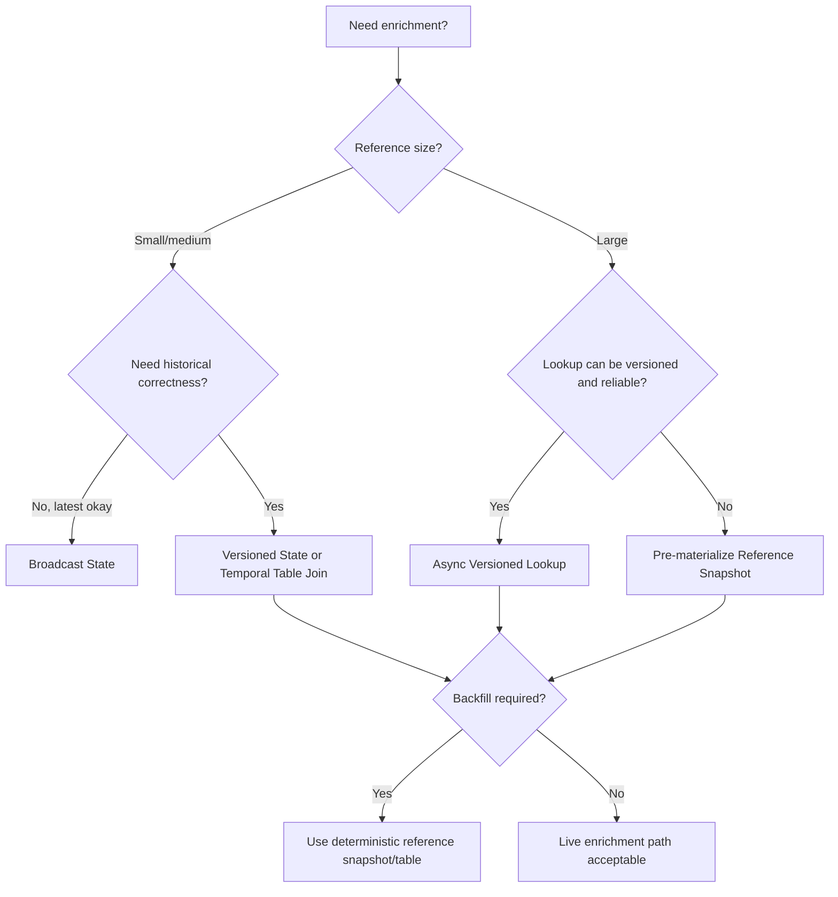

# Part 047 — Flink Joins and Enrichment

Join adalah operasi yang terlihat familiar dari SQL, tetapi di stream processing join bukan sekadar:

```sql
SELECT *
FROM event e
JOIN dimension d ON e.key = d.key
```

Di pipeline production, join adalah pertanyaan correctness:

> Saat sebuah event diproses, versi reference data mana yang sah dipakai?

Itu pertanyaan yang jauh lebih tajam daripada “bagaimana join dua dataset”.

Contoh domain enforcement lifecycle:

- `CaseEscalated` perlu diperkaya dengan current officer assignment.
- `InspectionCompleted` perlu diperkaya dengan facility risk profile.
- `PenaltyCalculated` perlu diperkaya dengan regulation version yang berlaku saat pelanggaran terjadi.
- `SlaBreached` perlu diperkaya dengan holiday calendar, jurisdiction, dan case priority.

Setiap contoh punya semantics waktu yang berbeda. “Current officer assignment” mungkin boleh latest-state. “Regulation version yang berlaku saat pelanggaran terjadi” tidak boleh latest-state. Ia butuh versioned temporal lookup.

Join yang salah tidak selalu crash. Ia menghasilkan data yang valid secara teknis tetapi salah secara bisnis.

---

## 1. The Core Mental Model

Flink enrichment dapat dimodelkan seperti ini:



Operator `J` harus menjawab lima hal:

| Pertanyaan | Contoh |
|---|---|
| Join key | `facilityId`, `caseId`, `officerId`, `jurisdictionCode` |
| Reference source | CDC topic, broadcast config stream, external API, database lookup, file snapshot |
| Time semantics | latest, event-time version, processing-time version, effective business time |
| Missing policy | fail, delay, quarantine, default, partial output, retry |
| State boundary | keyed state, broadcast state, external cache, temporal table, async lookup |

Pattern join yang benar dipilih dari kombinasi lima jawaban itu.

---

## 2. Join Is Not One Pattern

Di production, “join” biasanya berarti salah satu dari pattern berikut.

| Pattern | Use Case | Correctness Risk |
|---|---|---|
| Static in-memory lookup | Small config loaded at startup | Config stale, no audit of version |
| Broadcast state join | Small/medium reference stream distributed to all tasks | State growth, inconsistent version during deployment |
| Keyed stream-stream join | Two event streams correlated by key/time | Unbounded state, late/missing counterpart |
| Temporal table join | Fact stream joined with versioned table as of event time | Wrong time attribute, version gaps |
| Async I/O lookup | External DB/API enrichment | Timeout, overload, nondeterministic replay |
| Cache-aside lookup | External reference with local cache | Stale cache, hidden invalidation policy |
| Pre-materialized view join | Reference is prepared upstream | Freshness lag, ownership confusion |
| Offline batch join | Backfill/reporting join | Different logic from online path |

The top 1% mindset: jangan pilih API dulu. Pilih semantics dulu.

---

## 3. Enrichment Correctness Invariants

Sebelum menulis Flink code, tulis invariant berikut.

```text
For every input event E, enrichment output O must be reproducible from:
  E
  reference state version V
  transform version T
  missing-reference policy M
  event-time policy W
```

Jika output tidak bisa direproduksi, pipeline tidak bisa diaudit.

### 3.1 Required Invariants

| Invariant | Meaning |
|---|---|
| Stable join key | Key tidak berubah diam-diam antar layer |
| Explicit reference version | Output tahu reference version yang dipakai |
| Explicit time basis | Join memakai event time, processing time, ingestion time, atau business time secara eksplisit |
| Deterministic missing policy | Missing reference tidak diperlakukan random per retry |
| Bounded state | State punya TTL/window/compaction strategy |
| Replay-safe output | Reprocessing event menghasilkan output yang sama atau correction yang sah |
| Observable freshness | Reference lag terlihat, bukan tersembunyi |
| Auditable enrichment | Output membawa metadata enrichment |

Minimal enriched event metadata:

```java
public record EnrichmentMetadata(
    String referenceDataset,
    String referenceKey,
    String referenceVersion,
    Instant referenceObservedAt,
    Instant lookupEventTime,
    String policy,
    boolean partial,
    String transformVersion
) {}
```

Tanpa metadata ini, debugging enrichment berubah menjadi forensik manual.

---

## 4. Latest-State vs Temporal-State

Kesalahan paling umum: memakai latest-state untuk problem yang membutuhkan temporal-state.

### Latest-State Join

Latest-state berarti:

> Gunakan reference value terbaru yang diketahui operator saat event diproses.

Cocok untuk:

- dashboard current status,
- low-risk label enrichment,
- routing decision non-audit,
- operational alert yang memang melihat kondisi saat ini.

Tidak cocok untuk:

- legal/regulatory calculation,
- financial amount,
- historical reporting,
- breach determination,
- anything requiring “what was true at the time”.

### Temporal-State Join

Temporal-state berarti:

> Gunakan reference value yang berlaku pada waktu tertentu.

Waktu tersebut bisa:

| Time Basis | Meaning |
|---|---|
| Event time | Saat event bisnis terjadi |
| Business effective time | Saat policy/regulation berlaku |
| Source commit time | Saat perubahan committed di source DB |
| Processing time | Saat operator memproses event |

Untuk enforcement lifecycle, temporal-state biasanya lebih benar.

Contoh:

```text
Penalty event:
  violationTime = 2026-06-01T10:00:00Z
  processedAt   = 2026-07-04T08:00:00Z

Regulation changed:
  version A valid until 2026-06-15
  version B valid from 2026-06-15

Correct enrichment: version A
Wrong latest enrichment: version B
```

---

## 5. Pattern Selection Matrix

| Requirement | Recommended Pattern |
|---|---|
| Small reference data, frequently updated | Broadcast state |
| Huge reference table, lookup by key | Async I/O lookup or lookup join |
| Need event-time historical correctness | Temporal table join / versioned state |
| Need correlate two event streams | Interval join / keyed co-process |
| Need low latency and reference is small | Broadcast state |
| Need high throughput and reference changes slowly | Pre-materialized local state |
| Need deterministic backfill | Avoid live external lookup; use versioned snapshot/table |
| Need audit-grade result | Temporal/versioned join with metadata |
| Need best-effort UI decoration | Latest-state async enrichment may be fine |

---

## 6. Broadcast State Pattern

Broadcast state is useful when reference data is small enough to replicate to all parallel operator instances.

Conceptually:



The reference stream updates a map-like state available to all tasks.

### 6.1 When Broadcast State Fits

Use it when:

- reference data is small or medium,
- updates are not extremely high volume,
- all partitions may need access to all reference keys,
- lookup must be low-latency,
- external lookup is too slow or unreliable,
- reference changes need to be part of Flink checkpointed state.

Examples:

- jurisdiction rules,
- risk category mapping,
- holiday calendar,
- feature flags for pipeline behavior,
- policy thresholds,
- code-to-description dictionary.

Avoid it when:

- reference table has millions of large records,
- reference churn is very high,
- reference contains sensitive data that should not be replicated widely,
- update ordering is complex and versioned temporal semantics are required.

---

## 7. Broadcast State Java Skeleton

A common shape:

```java
public record CaseEvent(
    String caseId,
    String jurisdictionCode,
    Instant eventTime,
    String eventType
) {}

public record JurisdictionRule(
    String jurisdictionCode,
    String ruleVersion,
    boolean escalationRequiresSupervisor,
    Instant updatedAt
) {}

public record EnrichedCaseEvent(
    CaseEvent event,
    JurisdictionRule rule,
    EnrichmentMetadata metadata
) {}
```

Broadcast state descriptor:

```java
MapStateDescriptor<String, JurisdictionRule> ruleStateDescriptor =
    new MapStateDescriptor<>(
        "jurisdiction-rules",
        Types.STRING,
        TypeInformation.of(JurisdictionRule.class)
    );
```

Connect main stream with broadcast reference stream:

```java
BroadcastStream<JurisdictionRule> rules = ruleUpdates.broadcast(ruleStateDescriptor);

DataStream<EnrichedCaseEvent> enriched = caseEvents
    .keyBy(CaseEvent::jurisdictionCode)
    .connect(rules)
    .process(new JurisdictionEnrichmentFunction(ruleStateDescriptor));
```

Process function:

```java
public final class JurisdictionEnrichmentFunction
    extends KeyedBroadcastProcessFunction<String, CaseEvent, JurisdictionRule, EnrichedCaseEvent> {

  private final MapStateDescriptor<String, JurisdictionRule> descriptor;

  public JurisdictionEnrichmentFunction(
      MapStateDescriptor<String, JurisdictionRule> descriptor
  ) {
    this.descriptor = descriptor;
  }

  @Override
  public void processBroadcastElement(
      JurisdictionRule rule,
      Context ctx,
      Collector<EnrichedCaseEvent> out
  ) throws Exception {
    BroadcastState<String, JurisdictionRule> state = ctx.getBroadcastState(descriptor);

    JurisdictionRule existing = state.get(rule.jurisdictionCode());

    if (existing == null || rule.updatedAt().isAfter(existing.updatedAt())) {
      state.put(rule.jurisdictionCode(), rule);
    }
  }

  @Override
  public void processElement(
      CaseEvent event,
      ReadOnlyContext ctx,
      Collector<EnrichedCaseEvent> out
  ) throws Exception {
    ReadOnlyBroadcastState<String, JurisdictionRule> state = ctx.getBroadcastState(descriptor);
    JurisdictionRule rule = state.get(event.jurisdictionCode());

    if (rule == null) {
      // In real production code, use side output or missing-reference lane.
      return;
    }

    out.collect(new EnrichedCaseEvent(
        event,
        rule,
        new EnrichmentMetadata(
            "jurisdiction-rules",
            event.jurisdictionCode(),
            rule.ruleVersion(),
            rule.updatedAt(),
            event.eventTime(),
            "require-reference-present",
            false,
            "case-enrichment-v1"
        )
    ));
  }
}
```

This is not complete production code yet. It lacks missing-reference side output, metrics, schema version, deletion handling, and temporal versioning. But it shows the shape.

---

## 8. Broadcast State Failure Model

| Failure | What Happens | Defensive Design |
|---|---|---|
| Reference update lost before Kafka | State never sees it | Source reconciliation |
| Reference update duplicated | Same rule applied twice | Versioned update/idempotent put |
| Reference update reordered | Older rule overwrites newer rule | Compare version/event time |
| Rule deleted | Old rule remains forever | Tombstone handling |
| Main event arrives before reference | Missing enrichment | Delay/quarantine/default policy |
| State grows forever | RocksDB/memory pressure | TTL, compaction, active cleanup |
| Deployment changes state shape | Restore failure | Stable UID, state migration plan |
| Backfill uses current rules | Historical output wrong | Temporal versioned state |

Broadcast state is easy to start and easy to misuse.

---

## 9. Missing Reference Policy

Missing reference is not an exception. It is a business policy.

Options:

| Policy | Behavior | Use When |
|---|---|---|
| Fail fast | Throw and restart/fail job | Reference must always exist and source is trusted |
| Drop | Ignore event | Almost never appropriate for audit data |
| Partial output | Emit event with `partial=true` | Downstream can handle incomplete enrichment |
| Quarantine | Send to side output | Reference may arrive later or needs investigation |
| Delay and retry | Buffer until reference appears | Bounded wait is acceptable |
| Default value | Use explicit default | Domain has safe default |
| External fallback | Query source of truth | Low volume, fallback is reliable |

Production recommendation:

```text
For regulatory/event-sourced data:
  prefer quarantine or partial output over silent drop.
```

A missing reference lane should include:

```java
public record MissingReference(
    String inputEventId,
    String referenceDataset,
    String referenceKey,
    Instant eventTime,
    String pipelineName,
    String transformVersion,
    String reason
) {}
```

Use side output:

```java
public static final OutputTag<MissingReference> MISSING_REFERENCE =
    new OutputTag<>("missing-reference") {};
```

Then in `processElement`:

```java
if (rule == null) {
  ctx.output(MISSING_REFERENCE, new MissingReference(
      event.caseId(),
      "jurisdiction-rules",
      event.jurisdictionCode(),
      event.eventTime(),
      "case-enrichment",
      "v1",
      "REFERENCE_NOT_FOUND"
  ));
  return;
}
```

The key point: missing reference should be visible, counted, routed, and replayable.

---

## 10. Versioned Broadcast State

If reference data has versions, do not store only latest value.

Instead of:

```java
MapState<String, Rule> latestRuleByJurisdiction;
```

Use:

```java
MapState<String, NavigableMap<Instant, Rule>> ruleTimelineByJurisdiction;
```

Conceptually:

```text
jurisdiction = ID-JK
  2025-01-01 -> rule-v1
  2026-01-01 -> rule-v2
  2026-06-15 -> rule-v3
```

Lookup:

```text
eventTime = 2026-03-01
choose floorEntry(eventTime) => rule-v2
```

Production issue: Java `NavigableMap` inside Flink state can become large and serialization-heavy. For large versioned dimensions, prefer Table/SQL temporal join or external versioned store designed for range lookup.

---

## 11. Async I/O Enrichment

Async I/O is useful when the reference data is too large to hold inside Flink state.



Use it when:

- reference table is huge,
- only a small subset is needed,
- lookup service is designed for high QPS,
- latency budget can tolerate remote call,
- replay determinism is not strict or reference lookup is versioned.

Avoid it when:

- external lookup is not versioned but historical correctness matters,
- external system cannot handle replay/backfill load,
- lookup latency is unstable,
- output must be reproducible years later,
- enrichment must continue during reference service outage.

---

## 12. Async I/O Java Skeleton

Input and output:

```java
public record FacilityEvent(
    String eventId,
    String facilityId,
    Instant eventTime,
    String eventType
) {}

public record FacilityProfile(
    String facilityId,
    String riskBand,
    String version,
    Instant effectiveFrom
) {}

public record EnrichedFacilityEvent(
    FacilityEvent event,
    FacilityProfile profile,
    EnrichmentMetadata metadata
) {}
```

Async function:

```java
public final class FacilityProfileAsyncFunction
    extends RichAsyncFunction<FacilityEvent, EnrichedFacilityEvent> {

  private transient FacilityProfileClient client;

  @Override
  public void open(Configuration parameters) {
    this.client = new FacilityProfileClient(/* connection config */);
  }

  @Override
  public void asyncInvoke(
      FacilityEvent event,
      ResultFuture<EnrichedFacilityEvent> resultFuture
  ) {
    client.lookup(event.facilityId(), event.eventTime())
        .whenComplete((profile, error) -> {
          if (error != null) {
            resultFuture.completeExceptionally(error);
            return;
          }

          if (profile == null) {
            resultFuture.complete(List.of());
            return;
          }

          resultFuture.complete(List.of(new EnrichedFacilityEvent(
              event,
              profile,
              new EnrichmentMetadata(
                  "facility-profile",
                  event.facilityId(),
                  profile.version(),
                  profile.effectiveFrom(),
                  event.eventTime(),
                  "async-versioned-lookup",
                  false,
                  "facility-enrichment-v1"
              )
          )));
        });
  }

  @Override
  public void timeout(
      FacilityEvent input,
      ResultFuture<EnrichedFacilityEvent> resultFuture
  ) {
    resultFuture.completeExceptionally(
        new RuntimeException("Facility profile lookup timeout for " + input.facilityId())
    );
  }
}
```

Apply async I/O:

```java
DataStream<EnrichedFacilityEvent> enriched = AsyncDataStream
    .unorderedWait(
        facilityEvents,
        new FacilityProfileAsyncFunction(),
        3,
        TimeUnit.SECONDS,
        500
    );
```

### 12.1 Ordered vs Unordered Wait

| Mode | Meaning | Use When |
|---|---|---|
| `unorderedWait` | Output may arrive in lookup completion order | Ordering not required, better throughput |
| `orderedWait` | Output preserves input order | Downstream depends on order, lower throughput |

In most enrichment pipelines, ordering should not be used as hidden correctness. Prefer unordered plus explicit event identity, unless downstream really needs per-key order.

---

## 13. Async I/O Failure Model

| Failure | Impact | Defensive Pattern |
|---|---|---|
| Timeout | Event fails or is retried | Timeout budget + side output |
| Reference service slow | Backpressure | Concurrency limit + circuit breaker |
| Reference service outage | Job instability | Degrade/quarantine policy |
| Lookup returns current value | Historical backfill wrong | Versioned lookup by event time |
| Lookup has side effects | Replay unsafe | Lookup must be read-only |
| High replay volume | Reference service overload | Offline snapshot or bulk join |
| Partial response | Bad enrichment | Response validation |
| Non-deterministic response | Audit failure | Include reference version in output |

Async I/O is operationally dangerous when it hides an external dependency inside stream processing.

A stream processor with async lookup is not just Flink anymore. It is a distributed system involving Flink, network, external service, its database, its cache, and its deployment cycle.

---

## 14. Cache-Aside Enrichment

A common optimization:

```text
for each event:
  if local cache has key:
    use cache
  else:
    call external lookup
    store in cache
```

This is fine for low-risk decoration. It is dangerous for audit-grade transformation unless cache semantics are explicit.

Questions:

- What is the TTL?
- Is TTL processing-time or event-time?
- Is cache invalidated by CDC update?
- Does cache store versioned values?
- Does replay bypass cache?
- Does output include cache hit/miss metadata?
- Does cache survive restart?

A better cache entry:

```java
public record ReferenceCacheEntry<T>(
    String key,
    T value,
    String version,
    Instant effectiveFrom,
    Instant loadedAt,
    Instant expiresAt
) {}
```

Do not hide cache from the output. At least expose metrics:

```text
reference_cache_hit_total
reference_cache_miss_total
reference_cache_expired_total
reference_lookup_latency_ms
reference_lookup_timeout_total
reference_version_missing_total
```

---

## 15. Temporal Joins

Temporal join answers:

> What was the reference value as of this event's time?

This is the correct pattern for many regulatory and historical pipelines.

Example:

```text
CaseEvent(caseId=C-1, jurisdiction=JKT, eventTime=2026-05-10)
JurisdictionRule(JKT, version=v1, validFrom=2026-01-01)
JurisdictionRule(JKT, version=v2, validFrom=2026-06-01)

Join result for eventTime 2026-05-10 => v1
```

In Flink SQL/Table world, this is commonly represented with a versioned table and `FOR SYSTEM_TIME AS OF` style temporal semantics.

Conceptual SQL:

```sql
SELECT
  e.case_id,
  e.event_time,
  e.jurisdiction_code,
  r.rule_version,
  r.escalation_requires_supervisor
FROM case_events AS e
LEFT JOIN jurisdiction_rules FOR SYSTEM_TIME AS OF e.event_time AS r
ON e.jurisdiction_code = r.jurisdiction_code;
```

The important part is not syntax. The important part is the time basis.

### 15.1 Temporal Join Requirements

| Requirement | Why It Matters |
|---|---|
| Main stream has event-time attribute | Join needs `as-of` time |
| Reference table is versioned | Historical lookup must be possible |
| Primary key is defined | Lookup identity must be stable |
| Watermark is sane | Late data semantics need bounded progress |
| Version gaps handled | No reference may exist for some period |
| Reference corrections modeled | Historical reference may be corrected |

---

## 16. Lookup Join vs Temporal Join

These are often confused.

| Join Type | Meaning |
|---|---|
| Lookup join | Query an external table/system at processing time or lookup time |
| Temporal join | Join against a version of a table as of a specific time |

A lookup join can be versioned if the lookup key includes time:

```text
lookup(facilityId, eventTime)
```

A lookup join is not automatically temporal if it only does:

```text
lookup(facilityId)
```

That returns latest/current, not historical.

---

## 17. Stream-Stream Join

Sometimes both sides are event streams.

Example:

- `InspectionStarted`
- `InspectionCompleted`

You want duration and outcome.



Important questions:

- How long can completion arrive after start?
- What if completion arrives first?
- What if one side never arrives?
- What if duplicate start/completion arrives?
- What if event is corrected?
- What if start and completion use different clocks?

A stream-stream join always implies state retention. If you do not bound it, state grows forever.

---

## 18. Keyed CoProcess Join Skeleton

For custom stream-stream correlation, use keyed state and timers.

```java
public record InspectionStarted(
    String inspectionId,
    String caseId,
    Instant startedAt
) {}

public record InspectionCompleted(
    String inspectionId,
    String result,
    Instant completedAt
) {}

public record InspectionDurationCalculated(
    String inspectionId,
    String caseId,
    Duration duration,
    String result
) {}
```

Function shape:

```java
public final class InspectionJoinFunction extends KeyedCoProcessFunction<
    String,
    InspectionStarted,
    InspectionCompleted,
    InspectionDurationCalculated> {

  private transient ValueState<InspectionStarted> startedState;
  private transient ValueState<InspectionCompleted> completedState;

  @Override
  public void open(Configuration parameters) {
    startedState = getRuntimeContext().getState(
        new ValueStateDescriptor<>("inspection-started", InspectionStarted.class)
    );
    completedState = getRuntimeContext().getState(
        new ValueStateDescriptor<>("inspection-completed", InspectionCompleted.class)
    );
  }

  @Override
  public void processElement1(
      InspectionStarted started,
      Context ctx,
      Collector<InspectionDurationCalculated> out
  ) throws Exception {
    InspectionCompleted completed = completedState.value();

    if (completed != null) {
      emit(started, completed, out);
      clear();
    } else {
      startedState.update(started);
      ctx.timerService().registerEventTimeTimer(started.startedAt().plus(Duration.ofDays(7)).toEpochMilli());
    }
  }

  @Override
  public void processElement2(
      InspectionCompleted completed,
      Context ctx,
      Collector<InspectionDurationCalculated> out
  ) throws Exception {
    InspectionStarted started = startedState.value();

    if (started != null) {
      emit(started, completed, out);
      clear();
    } else {
      completedState.update(completed);
      ctx.timerService().registerEventTimeTimer(completed.completedAt().plus(Duration.ofDays(7)).toEpochMilli());
    }
  }

  @Override
  public void onTimer(
      long timestamp,
      OnTimerContext ctx,
      Collector<InspectionDurationCalculated> out
  ) throws Exception {
    // In production, emit missing-counterpart side output.
    clear();
  }

  private void emit(
      InspectionStarted started,
      InspectionCompleted completed,
      Collector<InspectionDurationCalculated> out
  ) {
    out.collect(new InspectionDurationCalculated(
        started.inspectionId(),
        started.caseId(),
        Duration.between(started.startedAt(), completed.completedAt()),
        completed.result()
    ));
  }

  private void clear() throws Exception {
    startedState.clear();
    completedState.clear();
  }
}
```

This pattern is powerful because it makes missing counterpart and timeout explicit.

---

## 19. Join Output Semantics

Every join output should declare its output mode.

| Mode | Meaning |
|---|---|
| Append | Once emitted, never changed |
| Upsert | Same key may be emitted again with newer version |
| Retract | Previous result can be invalidated |
| Correction | New event corrects prior output |
| Partial | Output may be incomplete |

Example:

```java
public enum OutputMode {
  APPEND,
  UPSERT,
  RETRACT,
  CORRECTION,
  PARTIAL
}
```

Why it matters:

- A reporting table can handle upsert.
- A Kafka fact topic may not accept mutation semantics.
- An audit ledger should not silently replace prior facts.
- A downstream alert engine may need retraction to avoid false alerts.

---

## 20. Reference Data Modeling

Reference data should be modeled as a stream or table with explicit lifecycle.

Bad:

```json
{
  "facilityId": "F-100",
  "riskBand": "HIGH"
}
```

Better:

```json
{
  "facilityId": "F-100",
  "riskBand": "HIGH",
  "version": "risk-profile-v7",
  "validFrom": "2026-01-01T00:00:00Z",
  "validTo": null,
  "sourceCommitTime": "2026-01-02T03:10:00Z",
  "deleted": false,
  "schemaVersion": "facility-risk-profile.v2"
}
```

Reference table columns:

| Field | Purpose |
|---|---|
| `reference_key` | Join key |
| `version` | Reproducible enrichment |
| `valid_from` | Temporal lookup start |
| `valid_to` | Temporal lookup end |
| `source_commit_time` | Source change order |
| `payload_hash` | Change detection |
| `deleted` | Tombstone semantics |
| `classification` | Privacy/security policy |

---

## 21. CDC-Derived Reference Tables

A common production pattern:



Critical detail: CDC event time is not the same as business effective time.

| Time | Meaning |
|---|---|
| Source commit time | DB transaction committed |
| CDC read time | Connector observed log entry |
| Ingestion time | Event entered Kafka/Flink |
| Business effective time | Reference value applies from this time |

For regulatory logic, business effective time is often the correct join time. For replication/materialization, source commit time may be enough.

---

## 22. Enrichment as a Contract

An enrichment stage should have a contract like:

```yaml
name: case-jurisdiction-enrichment
input: case-events.v3
reference:
  dataset: jurisdiction-rules.v2
  key: jurisdictionCode
  timeBasis: eventTime
  versionRequired: true
missingPolicy: quarantine
outputMode: append
output: enriched-case-events.v1
metadata:
  includeReferenceVersion: true
  includeTransformVersion: true
  includePartialFlag: true
```

This contract lets platform tooling answer:

- Which pipelines depend on `jurisdiction-rules.v2`?
- What breaks if `jurisdictionCode` changes?
- Which outputs used rule version `v17`?
- Can this pipeline be backfilled deterministically?
- How many records were quarantined because reference was missing?

---

## 23. Replay and Backfill

Backfill changes the economics of enrichment.

Live stream volume:

```text
500 events/sec
```

Backfill volume:

```text
5 years of history at maximum cluster throughput
```

If enrichment calls an external API, backfill can destroy that API.

Backfill-safe enrichment usually needs one of these:

| Strategy | Description |
|---|---|
| Versioned reference snapshot | Join against historical reference dataset |
| Preloaded broadcast state | Load reference before backfill |
| Offline batch join | Use batch engine/lakehouse table |
| Synthetic replay mode | Replace live lookup with deterministic reference source |
| Throttled async lookup | Accept slower backfill with strict QPS cap |

Do not run historical backfill through a live lookup path unless it was designed for it.

---

## 24. Enrichment State Cost Model

State cost depends on:

```text
number_of_keys
× versions_per_key
× serialized_value_size
× retention_horizon
× replication/checkpoint overhead
```

Example:

```text
500,000 facilities
× 12 versions average
× 2 KB/profile
≈ 12 GB logical state
```

After RocksDB overhead, indexes, checkpointing, and serialization, real footprint can be much larger.

Questions before choosing stateful enrichment:

- How many reference keys exist?
- How many versions per key?
- How long must history be retained?
- What is the largest payload?
- Are hot keys expected?
- How fast does reference churn?
- What is checkpoint interval and storage cost?
- How long can recovery take?

---

## 25. Hot Key Problems

Join key skew can create one overloaded operator.

Examples:

- `jurisdictionCode = NATIONAL`
- `tenantId = default`
- `facilityType = UNKNOWN`
- `caseOwner = unassigned`

Symptoms:

```text
one subtask has high busy time
one key has huge state
watermark stalls
checkpoint alignment slows
lag grows on one partition
```

Mitigations:

| Approach | Trade-off |
|---|---|
| Better key | Best fix when domain allows |
| Salt key | Requires downstream recombine |
| Split hot category | Domain-specific routing |
| Broadcast reference | Removes keyed lookup pressure for reference side |
| Pre-aggregate | Reduces event volume |
| Dedicated pipeline for hot key | Operational complexity |

---

## 26. Privacy and Security Boundary

Enrichment often increases sensitivity.

Input:

```text
caseId, facilityId, eventType
```

After enrichment:

```text
caseId, facilityId, facilityName, address, ownerName, riskBand, jurisdiction
```

That output may have different classification than input.

Enrichment contract must define:

- allowed fields,
- masking/tokenization rules,
- output classification,
- access policy,
- retention policy,
- audit logging,
- downstream sharing limits.

Do not treat enrichment as harmless decoration. It often creates sensitive derived data.

---

## 27. Observability

Minimum metrics:

```text
enrichment_input_total
enrichment_output_total
enrichment_missing_reference_total
enrichment_partial_output_total
enrichment_lookup_latency_ms
enrichment_lookup_timeout_total
enrichment_reference_update_total
enrichment_reference_lag_ms
enrichment_state_size_bytes
enrichment_cache_hit_ratio
enrichment_quarantine_total
enrichment_version_unknown_total
```

Useful dimensions:

```text
pipeline
reference_dataset
reference_version
tenant
jurisdiction
missing_reason
lookup_mode
output_mode
```

Dashboards should show:

- input vs output rate,
- missing reference spike,
- reference lag,
- async timeout rate,
- state size trend,
- checkpoint duration,
- hot key symptoms,
- watermark lag,
- quarantine backlog.

---

## 28. Testing Enrichment

### 28.1 Unit Tests

Test pure mapping:

```text
input event + reference value => enriched output
```

Include:

- missing reference,
- deleted reference,
- stale reference,
- future-dated reference,
- correction event,
- duplicate event,
- replay mode.

### 28.2 Temporal Tests

Given:

```text
rule-v1 valid from 2026-01-01
rule-v2 valid from 2026-06-01
```

Assert:

```text
event at 2026-05-01 uses v1
event at 2026-06-01 uses v2
event at 2025-12-01 is missing/no-rule
```

### 28.3 Replay Tests

Run same input twice:

```text
same input + same reference snapshot + same transform version => same output
```

### 28.4 Failure Tests

Inject:

- reference update reorder,
- duplicate reference update,
- missing reference,
- lookup timeout,
- lookup slow response,
- external service outage,
- checkpoint restore,
- late main event,
- late reference update.

---

## 29. Production Runbook

When enrichment output is wrong:

1. Identify affected output key range.
2. Identify transform version.
3. Identify reference dataset and version used.
4. Check reference update lag at event time.
5. Check missing/quarantine counters.
6. Compare output with deterministic replay from reference snapshot.
7. Decide whether to emit correction, rebuild materialized view, or reprocess topic range.
8. Document root cause in reference contract or transform contract.

When missing reference spikes:

1. Check source reference pipeline health.
2. Check schema changes in reference events.
3. Check join key normalization.
4. Check watermark/late data policy.
5. Check deployment version mismatch.
6. Check new tenant/jurisdiction/code not onboarded.
7. Check source deletion/tombstone semantics.

---

## 30. Common Anti-Patterns

| Anti-Pattern | Why It Fails |
|---|---|
| Calling production API for every event | Overload, nondeterministic replay |
| Latest-state join for historical calculation | Wrong historical output |
| Silent default on missing reference | Hides data quality issue |
| No reference version in output | Cannot audit enrichment |
| Unbounded stream-stream join | State grows forever |
| Broadcast huge table | Memory/checkpoint explosion |
| Processing-time temporal logic | Non-reproducible output |
| Cache with hidden TTL | Stale and unauditable enrichment |
| Joining on human-readable name | Key drift and collisions |
| No side output for bad enrichment | Either job fails or data disappears |

---

## 31. Architecture Review Checklist

Before approving an enrichment pipeline, ask:

- What is the join key and is it stable?
- Is the reference latest-state or temporal-state?
- What time basis is used?
- What happens when reference is missing?
- Is output append, upsert, retract, correction, or partial?
- Is reference version included in output?
- Can output be reproduced during audit?
- Can backfill run without overloading external systems?
- How large can state become?
- What is the TTL/retention policy?
- What are the top missing-reference causes?
- How are reference deletes handled?
- How are reference corrections handled?
- Does enrichment increase data sensitivity?
- What metrics prove correctness and freshness?

---

## 32. Practical Decision Tree



---

## 33. Closing Mental Model

Flink joins are not about combining two streams. They are about making a statement:

> This output fact was produced from this input fact, using this reference state, under this time policy, with this missing-reference policy, at this transform version.

That sentence is what production-grade enrichment must preserve.

API choices come later:

- Broadcast state for small replicated reference data.
- Async I/O for large remote lookup.
- Temporal joins for historical correctness.
- Keyed state and timers for custom correlation.
- Offline join for deterministic backfill.

The real skill is knowing which correctness boundary you are building.

---

## References

- Apache Flink documentation: Broadcast State, Async I/O, joins, state, and event-time processing.
- Apache Flink SQL documentation: temporal joins and lookup joins.
- Apache Flink project overview: stateful computations over bounded and unbounded streams.
