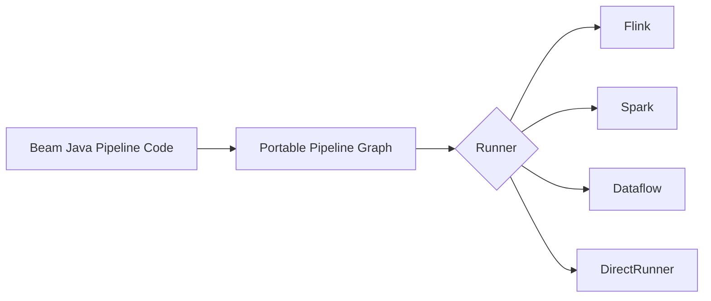
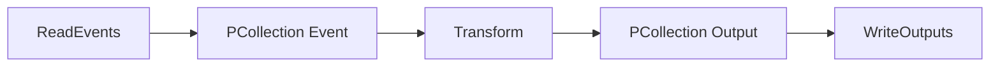
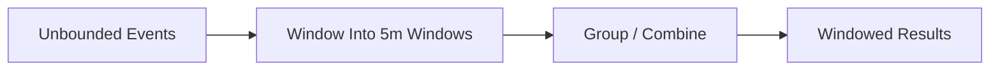
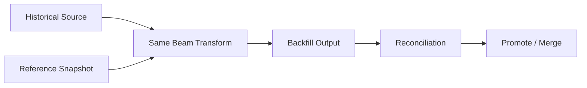
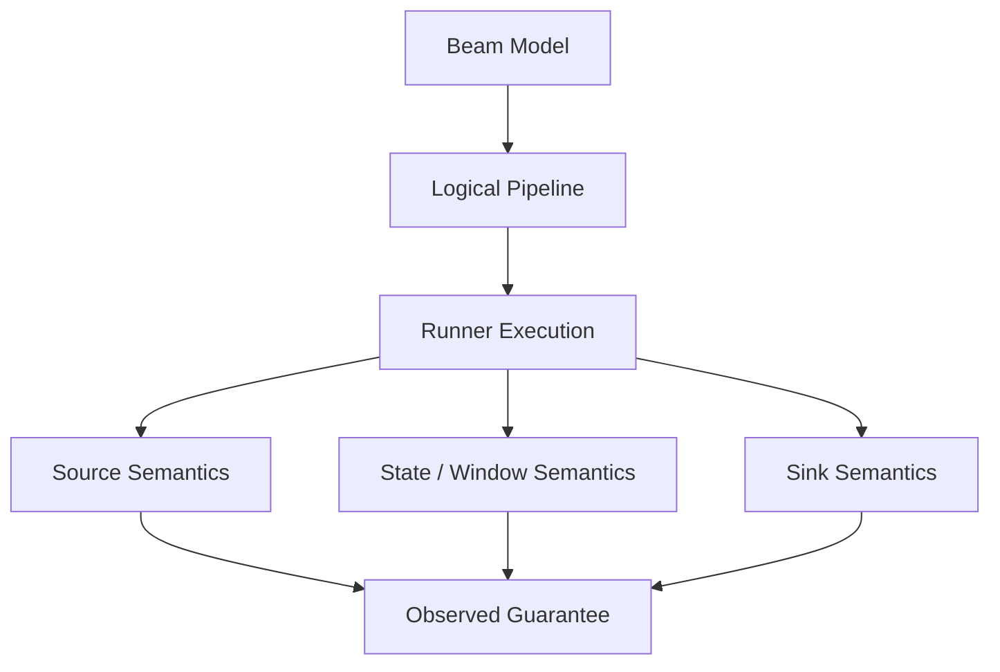

# Part 048 — Apache Beam Unified Model

Apache Beam is not primarily “another stream processing engine”.

A better mental model:

> Beam is a portable programming model for describing data pipelines independently from a specific execution engine.

That distinction matters.

With Flink or Spark, the framework and execution engine are tightly coupled in the way most teams experience them. With Beam, you describe a pipeline using Beam SDK concepts, then run it on a runner such as Flink, Spark, Google Cloud Dataflow, or another supported runtime.

The value is not magic portability. The value is a disciplined model:

- data is represented as `PCollection`,
- computation is represented as `PTransform`,
- per-element processing is represented as `DoFn`,
- execution is delegated to a runner,
- bounded and unbounded data share one conceptual model,
- event time, windowing, triggers, and watermarks are first-class concepts.

This part focuses on Java usage and implementation mental model, not a shallow WordCount tutorial.

---

## 1. Why Beam Exists

Many organizations end up with duplicated pipeline logic:

```text
Batch backfill logic   -> Spark job
Streaming logic        -> Flink job
Ad hoc correction      -> SQL job
Small replay           -> Java service
```

Over time, the same business transformation exists in four variants.

That creates drift:

- streaming output differs from batch output,
- backfill uses different default rules,
- late data is corrected differently,
- testing is duplicated,
- observability is inconsistent,
- schema migration requires many code changes.

Beam tries to make the logical pipeline independent from the execution mode.

Conceptually:



This does not mean every pipeline runs identically everywhere. Runners differ in capabilities, performance, IO support, operational model, and edge-case semantics. But Beam gives you a common vocabulary.

---

## 2. Core Vocabulary

| Concept | Meaning |
|---|---|
| `Pipeline` | Whole data processing graph |
| `PCollection<T>` | Distributed collection of elements of type `T` |
| `PTransform<InputT, OutputT>` | Reusable transformation from one dataset shape to another |
| `ParDo` | Parallel element-wise processing transform |
| `DoFn<InputT, OutputT>` | User function applied by `ParDo` |
| `Coder<T>` | Serialization contract for distributed processing |
| Window | Finite grouping over potentially unbounded data |
| Trigger | Rule for when window results are emitted |
| Watermark | Estimate of event-time progress |
| Runner | Execution backend for the pipeline |
| Side input | Small auxiliary input visible to a transform |
| State and timer | Per-key stateful processing tools |

The important difference from normal Java code:

```text
Your code describes a graph.
The runner executes it later and elsewhere.
```

This is similar to SQL: writing a query is not the same as executing every operation yourself.

---

## 3. Pipeline as a Graph, Not a Script

Naive mental model:

```java
List<Event> events = read();
List<Output> outputs = transform(events);
write(outputs);
```

Beam mental model:

```java
Pipeline p = Pipeline.create(options);

PCollection<Event> events = p.apply("ReadEvents", readTransform);
PCollection<Output> outputs = events.apply("Transform", transform);
outputs.apply("WriteOutputs", writeTransform);

p.run();
```

You are not pulling values into local memory. You are constructing a graph.



A production Beam codebase should make this graph legible. Transform names matter because they appear in runner UI, logs, metrics, and debugging.

---

## 4. Bounded and Unbounded Data

Beam uses `PCollection` for both bounded and unbounded data.

| Type | Example |
|---|---|
| Bounded | files, table snapshot, backfill range |
| Unbounded | Kafka topic, Pub/Sub subscription, CDC stream |

This unified shape is powerful because many transforms can be reused.

But it does not remove the hard parts.

For unbounded data, you must handle:

- event time,
- watermarks,
- windowing,
- triggers,
- late data,
- state cleanup,
- streaming sink semantics.

For bounded data, you must handle:

- partitioning,
- deterministic backfill,
- large shuffle,
- checkpoint/retry behavior,
- sink idempotency,
- cost.

Beam unifies the programming model, not the operational risks.

---

## 5. Java Project Shape

A maintainable Beam Java project usually separates:

```text
pipeline/
  CasePipeline.java
  CasePipelineOptions.java

model/
  CaseEvent.java
  EnrichedCaseEvent.java
  CaseViolation.java

transform/
  ParseCaseEvent.java
  NormalizeCaseEvent.java
  EnrichCaseEvent.java
  DetectSlaBreach.java
  ToWarehouseRow.java

io/
  KafkaCaseEventSource.java
  IcebergCaseSink.java
  DeadLetterSink.java

testdata/
  golden/
```

The rule:

```text
Pipeline class wires the graph.
Transform classes contain reusable logic.
DoFn classes contain small processing units.
Domain logic should be testable outside Beam when possible.
```

---

## 6. Minimal Java Pipeline Shape

```java
public final class EnforcementPipeline {

  public interface Options extends PipelineOptions {
    String getInputTopic();
    void setInputTopic(String value);

    String getOutputPath();
    void setOutputPath(String value);
  }

  public static void main(String[] args) {
    Options options = PipelineOptionsFactory
        .fromArgs(args)
        .withValidation()
        .as(Options.class);

    Pipeline pipeline = Pipeline.create(options);

    PCollection<String> raw = pipeline.apply(
        "ReadCaseEvents",
        KafkaIO.<String, String>read()
            .withBootstrapServers("localhost:9092")
            .withTopic(options.getInputTopic())
            .withKeyDeserializer(StringDeserializer.class)
            .withValueDeserializer(StringDeserializer.class)
            .withoutMetadata()
            .apply(Values.create())
    );

    PCollection<EnrichedCaseEvent> enriched = raw
        .apply("ParseCaseEvent", ParDo.of(new ParseCaseEventFn()))
        .apply("NormalizeCaseEvent", new NormalizeCaseEvent())
        .apply("DetectSlaBreach", new DetectSlaBreach());

    enriched.apply("WriteOutput", TextIO.write().to(options.getOutputPath()));

    pipeline.run();
  }
}
```

This example is deliberately simple. Production code would not hardcode bootstrap servers, would handle DLQ, schema decoding, metrics, and sink idempotency.

---

## 7. `PTransform` as the Main Abstraction

A common beginner mistake is to put everything inside one `DoFn`.

Better:

```java
public final class NormalizeCaseEvent
    extends PTransform<PCollection<CaseEvent>, PCollection<CaseEvent>> {

  @Override
  public PCollection<CaseEvent> expand(PCollection<CaseEvent> input) {
    return input
        .apply("ValidateRequiredFields", ParDo.of(new ValidateCaseEventFn()))
        .apply("NormalizeJurisdiction", ParDo.of(new NormalizeJurisdictionFn()))
        .apply("NormalizeTimestamps", ParDo.of(new NormalizeTimestampsFn()));
  }
}
```

`PTransform` gives you composition.

A production transform should have:

- clear input type,
- clear output type,
- named internal steps,
- explicit error lane if needed,
- metrics,
- stable behavior under replay,
- unit tests.

Think of a `PTransform` as a reusable data pipeline module.

---

## 8. `DoFn` Design

A `DoFn` should usually be small.

Bad:

```java
class EverythingFn extends DoFn<String, String> {
  // parse JSON
  // validate schema
  // enrich from API
  // calculate SLA
  // write audit record
  // handle DLQ
}
```

Good:

```text
Parse -> Validate -> Normalize -> Enrich -> Detect -> Encode -> Write
```

A focused `DoFn`:

```java
public final class ParseCaseEventFn extends DoFn<String, CaseEvent> {

  private final ObjectMapper objectMapper = new ObjectMapper();

  @ProcessElement
  public void processElement(ProcessContext context) throws Exception {
    String raw = context.element();
    CaseEvent event = objectMapper.readValue(raw, CaseEvent.class);
    context.output(event);
  }
}
```

But be careful: object construction, thread safety, serialization, and setup lifecycle matter. For expensive clients, use `@Setup` and `@Teardown`.

```java
public final class LookupFn extends DoFn<CaseEvent, EnrichedCaseEvent> {

  private transient ReferenceClient client;

  @Setup
  public void setup() {
    this.client = new ReferenceClient();
  }

  @ProcessElement
  public void processElement(ProcessContext context) {
    CaseEvent event = context.element();
    ReferenceData ref = client.lookup(event.jurisdictionCode());
    context.output(EnrichedCaseEvent.from(event, ref));
  }

  @Teardown
  public void teardown() {
    if (client != null) {
      client.close();
    }
  }
}
```

For high-volume enrichment, this simple synchronous lookup may be a bad idea. The point here is lifecycle shape, not lookup recommendation.

---

## 9. Side Outputs for Error Lanes

Beam supports multiple outputs through tagged outputs.

```java
public final class ValidateCaseEventFn extends DoFn<CaseEvent, CaseEvent> {

  public static final TupleTag<CaseEvent> VALID = new TupleTag<>() {};
  public static final TupleTag<InvalidRecord> INVALID = new TupleTag<>() {};

  @ProcessElement
  public void processElement(MultiOutputReceiver out, ProcessContext ctx) {
    CaseEvent event = ctx.element();

    if (event.caseId() == null || event.caseId().isBlank()) {
      out.get(INVALID).output(new InvalidRecord(
          event.eventId(),
          "caseId",
          "MISSING_REQUIRED_FIELD"
      ));
      return;
    }

    out.get(VALID).output(event);
  }
}
```

Apply:

```java
PCollectionTuple validated = events.apply(
    "ValidateCaseEvents",
    ParDo.of(new ValidateCaseEventFn())
        .withOutputTags(ValidateCaseEventFn.VALID, TupleTagList.of(ValidateCaseEventFn.INVALID))
);

PCollection<CaseEvent> valid = validated.get(ValidateCaseEventFn.VALID);
PCollection<InvalidRecord> invalid = validated.get(ValidateCaseEventFn.INVALID);
```

This pattern is essential for production pipelines because not all bad data should crash the job.

---

## 10. Windowing Mental Model

Unbounded data is infinite. Aggregation needs finite boundaries.

Beam uses windowing to divide a `PCollection` into finite chunks.



Common windows:

| Window | Use Case |
|---|---|
| Fixed | Metrics every 5 minutes |
| Sliding | Rolling 1-hour SLA view every 5 minutes |
| Session | User/case activity burst separated by gap |
| Global | Whole stream, usually with triggers/state |

Example:

```java
PCollection<KV<String, CaseEvent>> keyed = events
    .apply("KeyByCaseId", WithKeys.of(CaseEvent::caseId));

PCollection<KV<String, Iterable<CaseEvent>>> grouped = keyed
    .apply("WindowIntoFiveMinutes", Window.<KV<String, CaseEvent>>into(
        FixedWindows.of(Duration.standardMinutes(5))
    ))
    .apply("GroupByCaseId", GroupByKey.create());
```

Windowing by itself does not necessarily aggregate. It changes the window assignment used by later grouping/combine operations.

---

## 11. Event Time, Watermark, and Late Data

Beam's model emphasizes event time.

Each element can have an event timestamp. The runner tracks watermark progress to estimate when data for a given event-time window is likely complete.

Late data still happens.

A production window policy should define:

```text
window size
allowed lateness
trigger
accumulation mode
late data output behavior
```

Example shape:

```java
PCollection<CaseEvent> windowed = events.apply(
    "WindowForSlaDetection",
    Window.<CaseEvent>into(FixedWindows.of(Duration.standardMinutes(15)))
        .withAllowedLateness(Duration.standardHours(2))
        .triggering(
            AfterWatermark.pastEndOfWindow()
                .withLateFirings(AfterProcessingTime.pastFirstElementInPane()
                    .plusDelayOf(Duration.standardMinutes(5)))
        )
        .accumulatingFiredPanes()
);
```

Important choices:

| Choice | Consequence |
|---|---|
| Discarding panes | Late output may only contain delta/new values |
| Accumulating panes | Later firings include prior data too |
| Low allowed lateness | Lower state cost, more dropped/late data |
| High allowed lateness | More correctness tolerance, higher state cost |
| Early firing | Lower latency, possible preliminary results |
| Late firing | Better correction handling, downstream must handle updates |

---

## 12. Output Mode for Windowed Results

Windowed results are not always final.

Example:

```text
09:00 window fires at 09:05 with count=100
late data arrives
09:00 window fires again at 09:15 with count=103
```

Downstream must know whether this is:

- an update,
- a correction,
- a replacement,
- a new pane,
- a delta.

A robust output key includes:

```java
public record WindowedMetricKey(
    String metricName,
    String businessKey,
    Instant windowStart,
    Instant windowEnd
) {}
```

And output metadata:

```java
public record WindowedOutputMetadata(
    int paneIndex,
    boolean isFirstPane,
    boolean isLastPane,
    String accumulationMode,
    Instant emittedAt,
    String transformVersion
) {}
```

For sinks, prefer upsert by `(metricName, businessKey, windowStart, windowEnd)` if output can be updated.

---

## 13. Side Inputs

Side inputs are auxiliary datasets visible to a transform.

Use side input for:

- small reference data,
- config snapshots,
- lookup maps,
- thresholds,
- test fixtures.

Example:

```java
PCollectionView<Map<String, JurisdictionRule>> rulesView = rules
    .apply("ToRuleMap", View.asMap());

PCollection<EnrichedCaseEvent> enriched = events.apply(
    "EnrichWithRules",
    ParDo.of(new DoFn<CaseEvent, EnrichedCaseEvent>() {
      @ProcessElement
      public void processElement(ProcessContext ctx) {
        Map<String, JurisdictionRule> rules = ctx.sideInput(rulesView);
        CaseEvent event = ctx.element();
        JurisdictionRule rule = rules.get(event.jurisdictionCode());
        ctx.output(EnrichedCaseEvent.from(event, rule));
      }
    }).withSideInputs(rulesView)
);
```

Do not use side inputs blindly for huge reference data. Side input materialization and runner behavior matter.

Side inputs are often excellent for bounded batch jobs and small config. For high-churn streaming reference data, a runner-native stateful pattern or external versioned lookup may be better.

---

## 14. Stateful Processing and Timers

Beam supports per-key state and timers for advanced streaming logic.

Use cases:

- dedupe,
- sessionization,
- custom timeout,
- incomplete-pair detection,
- SLA breach detection,
- correlation of events.

Conceptual example:

```text
when CaseOpened arrives:
  store openedAt by caseId
  set timer for SLA deadline

when CaseResolved arrives:
  clear state and timer

when timer fires:
  emit SlaBreached if unresolved
```

Shape:

```java
public final class DetectSlaBreachFn extends DoFn<KV<String, CaseEvent>, SlaBreach> {

  @StateId("opened")
  private final StateSpec<ValueState<CaseEvent>> openedSpec = StateSpecs.value();

  @TimerId("deadline")
  private final TimerSpec deadlineSpec = TimerSpecs.timer(TimeDomain.EVENT_TIME);

  @ProcessElement
  public void process(
      ProcessContext ctx,
      @StateId("opened") ValueState<CaseEvent> opened,
      @TimerId("deadline") Timer deadline
  ) {
    CaseEvent event = ctx.element().getValue();

    if (event.eventType().equals("CASE_OPENED")) {
      opened.write(event);
      deadline.set(event.eventTime().plus(Duration.standardHours(48)));
      return;
    }

    if (event.eventType().equals("CASE_RESOLVED")) {
      opened.clear();
    }
  }

  @OnTimer("deadline")
  public void onDeadline(
      OnTimerContext ctx,
      @StateId("opened") ValueState<CaseEvent> opened
  ) {
    CaseEvent event = opened.read();
    if (event != null) {
      ctx.output(new SlaBreach(event.caseId(), event.eventTime()));
      opened.clear();
    }
  }
}
```

Stateful Beam code should be used carefully because runner support and performance characteristics matter.

---

## 15. Coder and Serialization Boundary

Distributed processing requires serialization.

Beam uses coders to encode/decode elements.

Problems appear when:

- type inference fails,
- Java records are not handled as expected,
- lambdas capture non-serializable state,
- schema evolution is not considered,
- custom classes change during upgrade,
- coder is nondeterministic for keys.

Guidelines:

- Keep model classes simple and immutable.
- Avoid hidden mutable fields.
- Register explicit coders for critical types.
- Do not rely on Java serialization for long-term storage semantics.
- Treat coder changes as compatibility changes.
- Test key coders for deterministic behavior.

Key grouping requires deterministic encoding. If two equal keys encode differently, distributed grouping semantics break.

---

## 16. Schema-Aware Beam

Beam has schema support that can make row-based transformations easier.

Useful when:

- integrating with SQL-like transforms,
- writing to warehouses,
- generic platform tooling needs field names,
- pipeline needs schema introspection,
- cross-language transforms are involved.

But for domain-heavy Java systems, explicit domain records can be clearer.

Decision:

| Use Domain Type | Use Schema/Row |
|---|---|
| Business logic rich | Generic processing |
| Compile-time safety important | Dynamic fields needed |
| Java-centric codebase | Cross-language/platform pipeline |
| Invariants embedded in type | Data product/warehouse shape |

Do not turn everything into `Row` just because it is flexible. Flexibility often moves errors from compile time to runtime.

---

## 17. Beam IO as Boundary

Beam has many IO connectors, but every IO boundary still needs production semantics.

For source:

- bounded or unbounded?
- timestamp extraction?
- checkpoint/offset semantics?
- schema decoding?
- error lane?
- backpressure behavior?

For sink:

- append or upsert?
- idempotent write?
- retry behavior?
- partial failure?
- exactly-once support?
- file finalization?
- transaction boundary?

Do not assume a Beam IO transform automatically gives your business-level guarantee.

The guarantee is always scoped:

```text
runner guarantee
+ source guarantee
+ transform determinism
+ sink idempotency/transactionality
+ replay policy
= observed pipeline semantics
```

---

## 18. Runner Choice

Beam code needs a runner.

Common decision factors:

| Factor | Why It Matters |
|---|---|
| Streaming support | Not all runners support all streaming features equally |
| State/timer support | Advanced logic depends on this |
| IO connector support | Source/sink availability and maturity |
| Operational model | Cluster, managed service, deployment, monitoring |
| Autoscaling | Cost and burst handling |
| Exactly-once behavior | Scope differs by runner/source/sink |
| Portability requirement | Multi-runner compatibility may constrain features |
| Team expertise | Debugging model matters |

A mistake:

```text
“We use Beam, so we are portable.”
```

A better statement:

```text
“We use Beam's common model, and we test the subset of features we rely on against our target runner.”
```

---

## 19. DirectRunner Is Not Production

DirectRunner is useful for local development and tests.

It is not a substitute for production runner testing.

DirectRunner can catch:

- type issues,
- transform wiring issues,
- basic functional errors,
- small deterministic tests.

It cannot fully represent:

- distributed shuffle behavior,
- production watermark behavior,
- runner-specific IO semantics,
- autoscaling behavior,
- checkpoint/retry behavior,
- large state performance,
- production failure model.

Use DirectRunner as the first gate, not the final proof.

---

## 20. Testing Beam Pipelines

Beam testing should happen at multiple levels.

### 20.1 Pure Domain Tests

Test domain transformation without Beam:

```java
@Test
void shouldDetectSlaBreach() {
  CaseEvent opened = CaseEvent.opened("C-1", Instant.parse("2026-01-01T00:00:00Z"));
  SlaPolicy policy = new SlaPolicy(Duration.ofHours(48));

  assertThat(SlaCalculator.deadline(opened, policy))
      .isEqualTo(Instant.parse("2026-01-03T00:00:00Z"));
}
```

### 20.2 Transform Tests

Use Beam test utilities for `PTransform` behavior.

```java
@Rule
public final transient TestPipeline pipeline = TestPipeline.create();

@Test
public void normalizeCaseEvents() {
  PCollection<CaseEvent> input = pipeline.apply(Create.of(
      new CaseEvent("E-1", "C-1", "id-jk", Instant.parse("2026-01-01T00:00:00Z"))
  ));

  PCollection<CaseEvent> output = input.apply(new NormalizeCaseEvent());

  PAssert.that(output).containsInAnyOrder(
      new CaseEvent("E-1", "C-1", "ID-JK", Instant.parse("2026-01-01T00:00:00Z"))
  );

  pipeline.run().waitUntilFinish();
}
```

### 20.3 Window Tests

Test:

- on-time event,
- late event within allowed lateness,
- late event beyond allowed lateness,
- early firing,
- accumulating/discarding panes,
- output key semantics.

### 20.4 Runner Integration Tests

Run a representative pipeline on the target runner with:

- realistic data volume,
- actual source/sink or controlled substitutes,
- stateful transforms,
- failure injection,
- replay/backfill scenario.

---

## 21. Golden Dataset Pattern

For business-critical pipelines, keep golden datasets.

```text
golden/
  case-events-input.jsonl
  jurisdiction-rules.jsonl
  expected-enriched-events.jsonl
  expected-invalid-records.jsonl
```

Golden tests protect:

- schema evolution,
- normalization rules,
- time semantics,
- missing reference behavior,
- correction behavior,
- deterministic output.

A golden dataset is not a large fixture dump. It is a curated set of edge cases.

Include:

- valid event,
- missing field,
- unknown jurisdiction,
- late event,
- duplicate event,
- correction event,
- schema old version,
- schema new version,
- sensitive field case,
- boundary timestamp.

---

## 22. Beam and Data Contracts

Beam does not remove the need for data contracts.

For each transform, define:

```yaml
transform: DetectSlaBreach
input:
  type: CaseEvent
  requiredFields:
    - caseId
    - eventType
    - eventTime
  timeSemantics: eventTime
output:
  type: SlaBreach
  outputMode: append
lateDataPolicy:
  allowedLateness: PT2H
  beyondAllowedLateness: side-output
state:
  key: caseId
  ttl: P7D
```

Then reflect this in code:

- validation transform,
- side output,
- metrics,
- test cases,
- output metadata.

---

## 23. Operational Observability

Beam pipeline observability depends on runner, but the logical metrics should be yours.

Use Beam metrics for transform-level counters/distributions.

```java
public final class ValidateCaseEventFn extends DoFn<CaseEvent, CaseEvent> {

  private final Counter valid = Metrics.counter(getClass(), "valid_records");
  private final Counter invalid = Metrics.counter(getClass(), "invalid_records");

  @ProcessElement
  public void processElement(ProcessContext ctx) {
    CaseEvent event = ctx.element();
    if (event.caseId() == null) {
      invalid.inc();
      return;
    }
    valid.inc();
    ctx.output(event);
  }
}
```

Minimum logical metrics:

```text
records_read_total
records_parsed_total
records_invalid_total
records_output_total
late_records_total
dropped_records_total
state_entries_total
deduped_records_total
enrichment_missing_total
sink_write_failed_total
```

Do not rely only on runner infrastructure metrics. They tell you whether the job is healthy. They do not necessarily tell you whether the data is correct.

---

## 24. Failure Model

Beam pipeline failures still follow distributed pipeline failure modes.

| Failure | Beam-Specific Framing |
|---|---|
| Transform exception | Bundle retry may reprocess elements |
| Sink write partially succeeds | Requires idempotent/transactional sink |
| Side effect inside `DoFn` | May happen more than once |
| Non-deterministic transform | Replay output differs |
| External lookup changes | Backfill result differs |
| Coder change | State/key compatibility issue |
| Runner upgrade | Semantics/performance may shift |
| Late data | Window output correction needed |
| Hot key | Worker skew/shuffle pressure |

Never put non-idempotent side effects inside `DoFn` unless you deeply understand the runner and sink semantics.

Bad:

```java
@ProcessElement
public void processElement(ProcessContext ctx) {
  paymentClient.charge(ctx.element().amount());
  ctx.output(...);
}
```

Better:

```text
Beam emits deterministic charge command.
Separate idempotent command processor executes charge with effect ledger.
```

---

## 25. Backfill with Beam

Beam's unified model is useful for backfill.

A good pattern:

```text
same transform code
bounded historical source
versioned reference snapshot
idempotent sink or separate backfill namespace
reconciliation at end
```



Rules:

- Do not use live latest reference for historical backfill unless intended.
- Do not write directly over production output without version/namespace.
- Include transform version in output.
- Reconcile counts and checksums.
- Make backfill resumable.
- Make output idempotent.

---

## 26. Beam vs Flink vs Spark: How to Think

Beam is a model. Flink and Spark are engines/frameworks.

| Need | Better Fit |
|---|---|
| Maximum control over Flink state internals | Native Flink |
| Portable batch/stream pipeline model | Beam |
| Heavy SQL/dataframe batch analytics | Spark or warehouse/lakehouse engine |
| Managed serverless streaming on Google Cloud | Beam on Dataflow |
| Existing Flink platform, complex stateful operators | Native Flink or Beam on Flink with care |
| Reusable transforms across bounded/unbounded jobs | Beam |
| Low-level Kafka Streams topology | Kafka Streams |

Do not choose Beam because it sounds more abstract. Choose it when the abstraction reduces duplicated logic and your runner supports the features you need.

---

## 27. Common Anti-Patterns

| Anti-Pattern | Why It Fails |
|---|---|
| One giant `DoFn` | Unclear graph, hard testing, poor observability |
| Treating DirectRunner result as production proof | Distributed behavior not tested |
| Hidden external side effect in `DoFn` | Retry causes duplicate effects |
| No transform names | Runner UI becomes unreadable |
| Windowing without output mode | Downstream misinterprets late updates |
| Using side input for huge data | Memory/materialization issues |
| Ignoring coder determinism | Grouping/state bugs |
| Assuming portability without runner tests | Feature/semantic mismatch |
| Mixing business logic and IO | Hard to test and reuse |
| No golden dataset | Transformation drift undetected |

---

## 28. Production Design Checklist

Before approving a Beam pipeline:

- Is the pipeline graph readable?
- Are transforms named clearly?
- Are business transforms reusable outside one pipeline?
- Are bounded and unbounded modes both considered?
- Is event time assigned correctly?
- Are windowing, triggers, and allowed lateness explicit?
- Is output mode explicit?
- Are side outputs used for invalid/quarantined data?
- Are coders deterministic for keys?
- Are side effects idempotent or externalized?
- Is the target runner tested?
- Are source and sink guarantees documented?
- Are metrics defined at business level?
- Is backfill deterministic?
- Are data contracts represented in tests?
- Does the pipeline have golden datasets?

---

## 29. Practical Mental Model

Beam lets you express:

```text
What data exists?
What transformations happen?
How is event time interpreted?
How are infinite streams bounded into windows?
When are results emitted?
What runner executes the graph?
```

It does not eliminate:

- bad schemas,
- nondeterministic logic,
- non-idempotent sinks,
- external lookup instability,
- late data policy,
- state explosion,
- runner-specific behavior.

The correct mental model:



Beam is strongest when it helps you avoid duplicate batch/stream logic while preserving explicit correctness contracts.

---

## 30. Closing

If Flink is your stateful streaming engine toolbox, Beam is your portable pipeline language.

Beam's power is not that it hides distributed systems. It forces a cleaner shape:

- graph first,
- transforms as reusable modules,
- bounded/unbounded as one model,
- event time as explicit,
- windowing and triggers as explicit,
- runner as execution choice,
- tests as contract proof.

Used well, Beam can reduce duplicate business logic across streaming and batch. Used poorly, it becomes another abstraction layer hiding the same old failure modes.

The top-tier engineering move is to keep the Beam graph clean while still designing source, state, time, sink, and replay semantics explicitly.

---

## References

- Apache Beam Programming Guide: pipelines, `PCollection`, `PTransform`, `ParDo`, windowing, triggers, state, timers, and IO.
- Apache Beam basics documentation: SDK, runner, window, and core programming model.
- Apache Beam Java SDK documentation and testing utilities.
