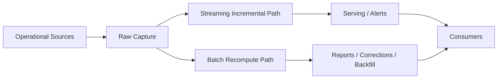
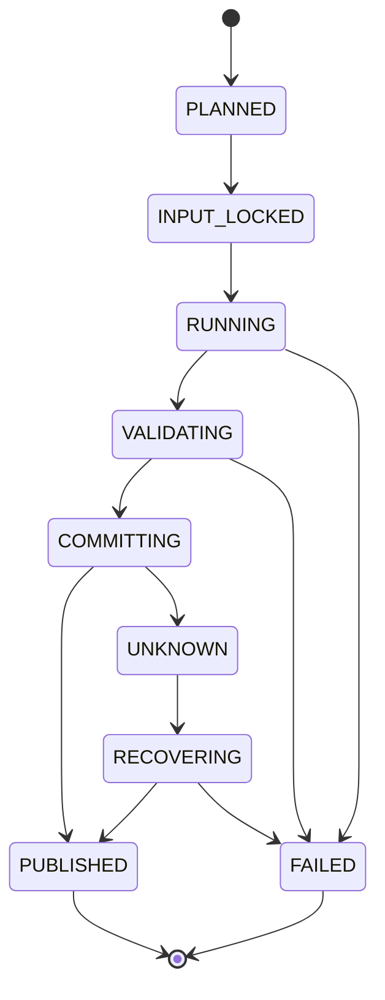
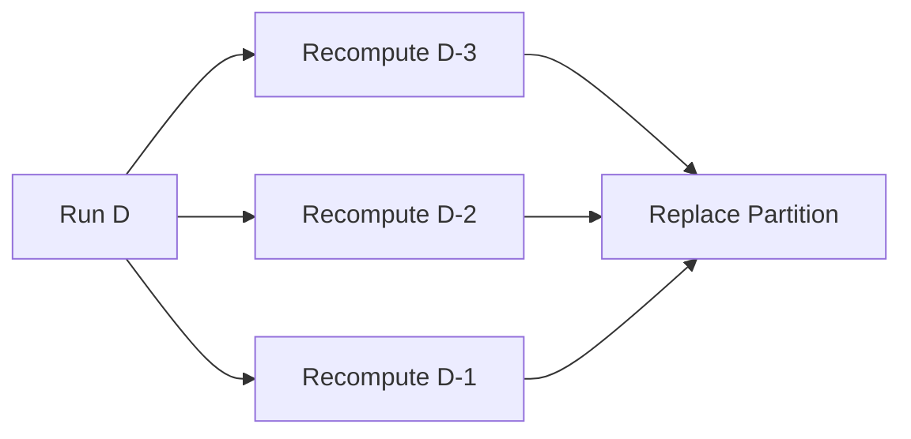
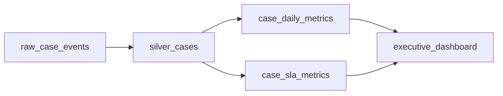
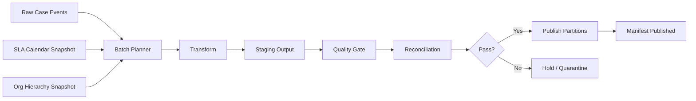

# Part 049 — Batch Pipeline Architecture

Batch pipeline is often underestimated because it looks simple:

```text
read yesterday's data -> transform -> write output
```

That description hides the real system.

A production batch pipeline is not just a scheduled script. It is a **deterministic recomputation system** with explicit rules for:

- what input range is included,
- what output partition is owned by the job,
- how prior output is replaced or corrected,
- how partial writes are avoided,
- how late data is handled,
- how the job can be replayed,
- how correctness is proven,
- how downstream consumers know what changed.

If streaming pipelines are hard because data never stops, batch pipelines are hard because humans assume the boundary is obvious. It is not.

The main question in batch architecture is:

> Can we recompute a known slice of truth safely, deterministically, and repeatedly without corrupting downstream state?

This part builds the mental model and implementation blueprint.

---

## 1. Batch Is Not Legacy

A weak mental model says:

```text
streaming = modern
batch     = old
```

A better mental model:

```text
streaming = continuous incremental computation
batch     = bounded deterministic recomputation
```

Batch remains essential when:

- input arrives in files,
- source APIs expose paginated snapshots,
- historical correction is common,
- regulatory reporting needs reproducibility,
- cost requires scheduled compute instead of always-on compute,
- model training needs complete windows,
- reconciliation needs full-period comparison,
- downstream reports expect closed accounting periods,
- you need to rebuild derived state after a bug fix.

In serious systems, batch and streaming are not enemies. They are different ways to answer the same question under different constraints.



The mature design is not “choose batch or streaming”. It is:

> Define the source of truth, then decide which computation mode produces which derived truth under which SLA.

---

## 2. The Core Batch Contract

Every batch job needs a contract.

A production batch contract answers these questions:

```text
Job identity:
  What logical dataset does this job produce?

Input boundary:
  What input records are included?

Output boundary:
  What output records or partitions are owned by this run?

Time boundary:
  Which business time, event time, ingestion time, or source commit time is used?

Determinism:
  Will the same inputs and parameters produce the same outputs?

Commit protocol:
  When is output visible to consumers?

Correction policy:
  How are late, revised, deleted, or invalid records handled?

Reconciliation:
  How do we know the output is complete and accurate?
```

Without this contract, the job is not an engineered pipeline. It is a script with operational risk.

---

## 3. Batch Job as a State Machine

A batch job should be modeled as a state machine, not a one-shot command.



The key states:

| State | Meaning |
|---|---|
| `PLANNED` | Job run has parameters but has not fixed input boundary. |
| `INPUT_LOCKED` | Input snapshot/range is fixed. Re-run must use same boundary. |
| `RUNNING` | Transform is executing and writing to staging. |
| `VALIDATING` | Output exists but is not yet published. Quality/reconciliation checks run here. |
| `COMMITTING` | Output is being promoted atomically. |
| `PUBLISHED` | Consumers may read this output. |
| `UNKNOWN` | Commit may or may not have succeeded; recovery must inspect durable state. |
| `FAILED` | Output must not be consumed unless explicitly marked partial/debug. |

The dangerous state is `UNKNOWN`.

Many systems handle `FAILED`, but not `UNKNOWN`. `UNKNOWN` occurs when the process crashes, network disconnects, or orchestrator kills the container while committing output.

Production batch architecture needs a recovery algorithm, not hope.

---

## 4. The Batch Run Manifest

Every batch run should produce a manifest.

A manifest is the durable evidence of what the run intended to do, what it read, what it wrote, and what it published.

Example Java model:

```java
public record BatchRunManifest(
    String runId,
    String jobName,
    String jobVersion,
    BatchMode mode,
    InputBoundary inputBoundary,
    OutputBoundary outputBoundary,
    Map<String, String> parameters,
    Instant plannedAt,
    Instant inputLockedAt,
    Instant startedAt,
    Instant finishedAt,
    List<InputDatasetSnapshot> inputs,
    List<OutputArtifact> outputs,
    List<QualityResult> qualityResults,
    ReconciliationResult reconciliation,
    BatchRunStatus status
) {}
```

The manifest must be stored in durable storage:

- relational job ledger,
- object storage metadata file,
- lakehouse table metadata,
- orchestration metadata plus independent audit table.

Do not rely only on orchestrator logs. Logs are operational traces; manifests are data correctness evidence.

---

## 5. Input Boundary: The Most Important Design Choice

Batch jobs fail silently when the input boundary is vague.

Bad boundary:

```text
process yesterday's data
```

Better boundary:

```text
process source events where event_date = 2026-07-03
using raw_dataset_snapshot_id = s-20260704-010000
and contract_version = 12
and reference_data_version = ref-20260703-v4
```

A batch input boundary can be based on different clocks:

| Boundary Type | Meaning | Risk |
|---|---|---|
| Event time | Time the business event happened | late data can arrive after window closes |
| Ingestion time | Time platform captured record | business period may be wrong |
| Source commit time | Time source DB committed transaction | source-specific and can be hard to expose |
| File arrival time | Time file landed | file delay changes completeness |
| Snapshot ID | Immutable source/table snapshot | best for reproducibility when available |
| Cursor range | API/database incremental cursor | must handle updates and deletes carefully |

The correct boundary depends on output semantics.

For regulatory reporting, business effective time may matter more than ingestion time. For operational freshness monitoring, ingestion time may matter more. For replay and debugging, snapshot ID is often the strongest evidence.

---

## 6. Output Boundary: What Does This Job Own?

Input boundary says what the job reads.

Output boundary says what the job is allowed to replace.

Examples:

```text
Output boundary examples:

- report_date = 2026-07-03
- tenant_id = t-17 AND report_month = 2026-06
- dataset_version = v20260704_010000
- case_region = APAC AND effective_date between 2026-07-01 and 2026-07-03
- model_run_id = m-20260704-01
```

Without output ownership, retry/backfill can accidentally mix old and new records.

Bad sink pattern:

```sql
INSERT INTO daily_case_metrics
SELECT ...
```

Why dangerous?

- retry duplicates rows,
- partial run leaves partial data,
- backfill mixes old and new version,
- delete/correction is ambiguous.

Better pattern:

```sql
-- write to staging first
INSERT INTO daily_case_metrics_staging(run_id, report_date, metric_name, metric_value)
SELECT :run_id, report_date, metric_name, metric_value
FROM ...;

-- validate staging
-- then atomically replace owned partition
BEGIN;
DELETE FROM daily_case_metrics WHERE report_date = :reportDate;
INSERT INTO daily_case_metrics(report_date, metric_name, metric_value, run_id)
SELECT report_date, metric_name, metric_value, run_id
FROM daily_case_metrics_staging
WHERE run_id = :runId;
COMMIT;
```

For object storage/lakehouse, the equivalent is:

```text
write files under staging/run_id=...
validate files
commit table snapshot or swap partition pointer
publish manifest
```

---

## 7. Partitioning Is a Correctness Boundary

Partitioning is not only a performance technique.

It defines the unit of:

- recompute,
- replacement,
- reconciliation,
- ownership,
- retention,
- downstream invalidation,
- incident recovery.

Common partition strategies:

| Strategy | Example | Good For | Main Risk |
|---|---|---|---|
| Business date | `business_date=2026-07-03` | reports, daily metrics | late/corrected data |
| Ingestion date | `ingest_date=2026-07-04` | raw landing, operational audit | business period split |
| Tenant + date | `tenant_id=t1/date=...` | multi-tenant isolation | small-file explosion |
| Region + date | `region=APAC/date=...` | operational routing | re-org changes |
| Hash bucket | `bucket=17` | large uniform tables | hard for business repair |
| Snapshot/run ID | `run_id=...` | reproducible output | consumer must select active run |

The mistake is picking partitioning only for query speed.

A strong design asks:

> If a correction arrives for one business day, can I recompute exactly the affected slice without rewriting unrelated truth?

---

## 8. Immutable Output vs Replace-in-Place

Batch output has two broad styles.

### 8.1 Immutable Versioned Output

Each run writes a new version:

```text
s3://lake/case_metrics/version=20260704T010000/...
```

Consumers read through a pointer:

```text
current version = 20260704T010000
```

Benefits:

- easy rollback,
- strong auditability,
- supports diffing old vs new,
- good for regulated reporting,
- avoids destructive overwrite.

Costs:

- more storage,
- pointer management,
- consumer must respect version pointer,
- compaction/retention needed.

### 8.2 Replace Owned Partition

Job replaces a known partition:

```text
dataset=case_metrics/report_date=2026-07-03
```

Benefits:

- simpler consumer model,
- lower storage cost,
- works well for daily derived tables,
- easier partition pruning.

Costs:

- rollback needs previous copy/snapshot,
- concurrent writers are dangerous,
- partial replacement must be guarded.

### 8.3 Rule of Thumb

Use immutable versioned output when:

- output is regulatory evidence,
- rollback is frequent,
- diff/review is required,
- downstream consumers need reproducible versions.

Use partition replacement when:

- output is derived operational analytics,
- partition boundary is stable,
- table format supports atomic commit,
- validation happens before publish.

---

## 9. Full Recompute, Incremental Recompute, and Delta Apply

Batch architecture has three common compute modes.

### 9.1 Full Recompute

Read all relevant historical input and regenerate full output.

```text
input: all cases since 2020
output: all monthly metrics since 2020
```

Best when:

- data volume is manageable,
- correctness matters more than cost,
- transformation changed deeply,
- historical correction affects many periods.

Risk:

- expensive,
- long runtime,
- larger blast radius,
- difficult to schedule often.

### 9.2 Incremental Recompute

Recompute affected partitions from raw truth.

```text
input: raw events for business_date in [D-3, D]
output: metrics for those dates
```

Best when:

- correction window is bounded,
- raw data is retained,
- output partitions align with correction boundary.

Risk:

- missing late data outside lookback,
- derived dependency can cross partition boundaries,
- incremental logic can diverge from full logic.

### 9.3 Delta Apply

Apply changes to prior output.

```text
previous metric + delta = new metric
```

Best when:

- source emits reliable change events,
- output is additive or ledger-like,
- recompute is too costly.

Risk:

- delta bugs compound,
- correction/deletion is hard,
- output becomes dependent on mutation history,
- replay requires exact prior state.

Top-tier engineering bias:

> Prefer recompute from immutable raw truth where possible. Use delta apply only when you can prove algebraic safety and reconciliation coverage.

---

## 10. Determinism Rules

A batch transform is deterministic when the same inputs and parameters produce the same outputs.

Sources of nondeterminism:

- reading “latest” reference data without version pinning,
- using `now()` inside transformation logic,
- unordered aggregation with non-associative floating-point behavior,
- random UUID generation for output identity,
- relying on file listing order,
- mutable external APIs during transform,
- timezone defaults from host/container,
- locale-dependent parsing,
- concurrent side effects,
- non-repeatable source query.

Bad:

```java
record.put("generatedAt", Instant.now());
record.put("outputId", UUID.randomUUID().toString());
```

Better:

```java
record.put("runId", runContext.runId());
record.put("computedAt", runContext.inputLockedAt());
record.put("outputId", stableHash(record.businessKey(), runContext.outputVersion()));
```

A production batch job should treat time, randomness, and reference data as explicit dependencies.

---

## 11. Reference Data Pinning

Batch jobs often enrich with reference data:

- product catalog,
- organization hierarchy,
- regulatory rule set,
- country/region mapping,
- risk score threshold,
- SLA calendar,
- currency rate,
- user-role snapshot.

If reference data is not pinned, backfill output changes unpredictably.

Example:

```text
Case event happened on: 2026-06-10
Backfill executed on:   2026-07-04
Current region mapping: APAC-2
Historical mapping:     APAC-1
```

Which mapping should be used?

There is no universal answer. The contract must say.

Common policies:

| Policy | Meaning |
|---|---|
| As-at event time | Use reference value effective when event happened. |
| As-at processing time | Use reference value at original processing time. |
| As-at report close | Use reference value at reporting cutoff. |
| Latest | Use newest reference data. Dangerous unless explicitly intended. |
| Rule-version pinned | Use fixed rule/config version. |

Implementation model:

```java
public record ReferenceDataBinding(
    String name,
    String version,
    TemporalPolicy temporalPolicy,
    Instant effectiveAt,
    String checksum
) {}
```

The run manifest should record reference bindings.

---

## 12. Late Data and Correction Strategy

Late data is data that arrives after the batch window has been processed.

Correction is data that changes prior truth.

They are related but not identical.

```text
Late data:
  event happened yesterday, arrived today

Correction:
  event arrived yesterday, value was wrong, fixed today

Deletion:
  record was previously valid, now removed or invalidated

Restatement:
  output for prior period is officially changed
```

A serious batch pipeline does not hide these under “rerun job”.

It defines correction classes:

| Class | Example | Action |
|---|---|---|
| Within open window | event for current day arrives late | include in next incremental run |
| Within lookback window | event for D-3 arrives today | recompute affected partition |
| Closed period correction | regulatory report already published | create restatement version |
| Invalid historical data | source sends deletion/correction | apply correction event and audit |
| Unknown impact | schema/business rule changed | impact analysis before backfill |

---

## 13. Lookback Window Pattern

The lookback window pattern recomputes recent partitions repeatedly.

Example:

```text
Daily job runs at 01:00.
For run date 2026-07-04, recompute business dates:

2026-07-01
2026-07-02
2026-07-03
```

This catches late arrivals within three days.



Benefits:

- simple,
- robust for bounded lateness,
- avoids per-record correction complexity,
- easy to reason about.

Risks:

- does not catch late data outside window,
- may repeatedly rewrite large partitions,
- downstream consumers must tolerate restated partitions,
- output should carry `run_id` and `as_of` metadata.

Rule:

> Lookback windows are not correctness guarantees. They are operational approximations that must be backed by lateness metrics and reconciliation.

---

## 14. Incremental Cursor Pattern

Some batch jobs read incrementally from source:

```sql
SELECT *
FROM cases
WHERE updated_at > :lastWatermark
  AND updated_at <= :nextWatermark
ORDER BY updated_at, id;
```

This is simple but dangerous.

Problems:

- timestamp precision collision,
- source clock skew,
- updates during scan,
- missing rows with same timestamp,
- deletes not visible,
- `updated_at` not updated consistently,
- out-of-order commits,
- source transaction isolation differences.

Safer composite cursor:

```sql
SELECT *
FROM cases
WHERE (updated_at, id) > (:lastUpdatedAt, :lastId)
  AND (updated_at, id) <= (:nextUpdatedAt, :maxIdAtBoundary)
ORDER BY updated_at, id;
```

Better when available:

- CDC log position,
- immutable event table sequence,
- source snapshot ID,
- monotonically increasing transaction ID,
- table format snapshot.

The principle:

> Cursor must identify a stable ordered boundary, not just a convenient timestamp column.

---

## 15. Staging and Atomic Publish

Never write final output directly if consumers can see partial state.

The standard commit protocol:

```text
1. Create run manifest with status = RUNNING.
2. Read input boundary.
3. Write output to staging path/table with run_id.
4. Validate staging output.
5. Reconcile staging output with input.
6. Publish atomically.
7. Mark manifest as PUBLISHED.
8. Notify/invalidate downstream consumers if needed.
```

Object storage example:

```text
/staging/case_metrics/run_id=run-123/part-000.parquet
/staging/case_metrics/run_id=run-123/part-001.parquet

/published/case_metrics/business_date=2026-07-03/...
```

RDBMS example:

```sql
CREATE TABLE case_metrics_stage (..., run_id text not null);
CREATE TABLE case_metrics (..., active_run_id text not null);
```

Lakehouse example:

```text
write data files -> create metadata -> commit snapshot -> publish snapshot ID
```

Atomic publish is the difference between “job completed” and “dataset is safe to consume”.

---

## 16. The Unknown Commit Problem

A batch job can crash while publishing.

Example:

```text
DELETE old partition succeeded
INSERT new partition partially succeeded
process crashed before manifest update
```

Or:

```text
Iceberg/Delta/Hudi commit succeeded
orchestrator timed out before seeing success
```

You cannot solve this with retry alone.

You need idempotent recovery:

```java
public BatchRecoveryDecision recover(String runId) {
    BatchRunManifest manifest = manifestStore.load(runId);
    OutputInspection inspection = outputStore.inspect(manifest.outputBoundary(), runId);

    if (inspection.isPublishedForRun(runId)) {
        manifestStore.markPublished(runId, inspection.publishedVersion());
        return BatchRecoveryDecision.ALREADY_PUBLISHED;
    }

    if (inspection.hasPartialStagingOnly()) {
        outputStore.cleanupStaging(runId);
        manifestStore.markFailed(runId, "partial staging cleaned");
        return BatchRecoveryDecision.FAILED_CLEANED;
    }

    if (inspection.hasAmbiguousFinalOutput()) {
        manifestStore.markUnknown(runId, inspection.evidence());
        return BatchRecoveryDecision.MANUAL_REVIEW_REQUIRED;
    }

    return BatchRecoveryDecision.SAFE_TO_RETRY;
}
```

The recovery algorithm must inspect durable output, not memory state.

---

## 17. Reconciliation Patterns

Reconciliation proves the output is plausible or correct enough to publish.

Common checks:

| Check | Example |
|---|---|
| Count reconciliation | input events count vs accepted + rejected + duplicate |
| Sum reconciliation | financial amount totals match source control total |
| Hash/checksum | stable hash over sorted business keys |
| Min/max boundary | event time min/max within expected window |
| Partition completeness | all expected tenant/date partitions exist |
| Duplicate check | no duplicate natural key in output |
| Referential check | all foreign keys resolved or explicitly quarantined |
| Drift check | categorical distribution did not change unexpectedly |
| Freshness check | source snapshot not older than SLA |

Example reconciliation result:

```java
public record ReconciliationResult(
    long inputRecords,
    long acceptedRecords,
    long rejectedRecords,
    long duplicateRecords,
    Map<String, BigDecimal> inputControlTotals,
    Map<String, BigDecimal> outputControlTotals,
    List<ReconciliationViolation> violations,
    ReconciliationDecision decision
) {}
```

Important:

> Reconciliation should happen before publish, but the result should be stored after publish as evidence.

---

## 18. Data Quality Gate Severity

Not every quality violation should fail the job.

A production system needs severity levels:

| Severity | Meaning | Action |
|---|---|---|
| `INFO` | informational metric | publish |
| `WARN` | unusual but allowed | publish with warning |
| `QUARANTINE_RECORD` | bad records isolated | publish accepted subset |
| `FAIL_PARTITION` | one partition unsafe | do not publish that partition |
| `FAIL_RUN` | dataset unsafe | do not publish run |
| `MANUAL_REVIEW` | ambiguous business impact | hold output |

Example:

```java
public enum QualityAction {
    PUBLISH,
    PUBLISH_WITH_WARNING,
    QUARANTINE_RECORDS,
    FAIL_PARTITION,
    FAIL_RUN,
    MANUAL_REVIEW
}
```

The mistake is treating all validation failures as either ignore or fail everything.

Good systems route failures based on consumer impact.

---

## 19. Backfill Architecture

Backfill is not just “run old dates”.

A backfill changes historical output and can have downstream impact.

Backfill must define:

```text
Why:
  bug fix, schema migration, source correction, new dataset, restatement

Scope:
  dataset, tenant, date range, entity range, version range

Input version:
  raw snapshot, reference data version, transform version

Output mode:
  shadow, compare-only, publish, restatement

Downstream behavior:
  notify, block, auto-refresh, manual approval

Validation:
  golden diff, reconciliation, sampled review, full parity check
```

Backfill modes:

| Mode | Meaning |
|---|---|
| Dry run | compute but do not write final output |
| Shadow | write separate shadow output for diff |
| Compare-only | compare old vs new without publish |
| Replace | replace owned partitions |
| Restatement | publish new official historical version |
| Migration | write output in new schema/version |

A mature backfill is planned like a production release.

---

## 20. Dependency-Aware Backfill

Batch datasets often depend on each other.



If `silver_cases` is backfilled for June, downstream datasets may be stale.

A backfill planner needs impact analysis:

```text
Changed dataset: silver_cases
Changed partitions: 2026-06-01..2026-06-30
Affected downstream:
  - case_daily_metrics same date range
  - case_sla_metrics same date range plus window spillover
  - executive_dashboard monthly June report
```

Window spillover matters.

If a 30-day rolling metric changes for June 15, the affected output may extend into July 14.

This is why output boundary must understand transformation semantics, not only table partitions.

---

## 21. Closed Period and Restatement

Some outputs become closed.

Examples:

- regulatory report submitted,
- monthly financial statement closed,
- SLA breach count certified,
- customer invoice generated,
- enforcement decision summary archived.

For closed periods, replacing the old partition may be unacceptable.

Use restatement:

```text
report_month=2026-06 version=1 status=SUBMITTED
report_month=2026-06 version=2 status=RESTATED reason=SOURCE_CORRECTION
```

Restatement output should include:

- prior version reference,
- reason code,
- changed metrics,
- input delta summary,
- approver/reviewer if required,
- timestamp and run ID,
- downstream notification state.

In regulated environments, restatement is not an error path. It is a first-class lifecycle.

---

## 22. Small Files and Partition Explosion

Batch jobs often write too many small files.

Small-file symptoms:

- slow listing,
- slow query planning,
- high metadata cost,
- poor scan efficiency,
- object-store request explosion,
- downstream query instability.

Causes:

- too many partitions,
- too many tasks,
- low data volume per tenant/date,
- streaming-like writes into batch tables,
- writing each source file independently,
- no compaction.

Rules of thumb:

- do not partition by high-cardinality fields unless query and repair boundaries require it,
- avoid tenant/date partitioning for thousands of tiny tenants unless you bucket or group,
- compact after high-frequency writes,
- separate raw landing layout from curated analytical layout,
- measure file count per partition as an SLO.

Example metric:

```text
files_per_partition{dataset="case_metrics", partition="2026-07-03"} = 1842
average_file_size_mb = 2.1
```

This is not a cosmetic issue. File layout becomes a performance and cost contract.

---

## 23. Batch Pipeline Observability

A batch pipeline should emit metrics at run, partition, and record class level.

Run-level metrics:

```text
batch_run_duration_seconds
batch_run_status
batch_run_input_records
batch_run_output_records
batch_run_rejected_records
batch_run_duplicate_records
batch_run_publish_duration_seconds
batch_run_reconciliation_status
```

Partition-level metrics:

```text
partition_input_records{date="2026-07-03"}
partition_output_records{date="2026-07-03"}
partition_late_records{date="2026-07-03"}
partition_quality_violations{date="2026-07-03"}
partition_publish_status{date="2026-07-03"}
```

Data-level metrics:

```text
null_rate(field="case_owner")
invalid_enum_count(field="case_status")
amount_sum(source="raw")
amount_sum(source="output")
duplicate_business_key_count
```

Important:

> Batch observability is not just job success/failure. A successful job can produce wrong data.

---

## 24. Java Batch Job Skeleton

A minimal production-minded Java batch job has these components:

```java
public interface BatchJob<P extends BatchParameters> {
    JobName name();
    JobVersion version();
    BatchPlan plan(P parameters);
    BatchRunResult execute(BatchRunContext context) throws Exception;
}
```

Plan:

```java
public record BatchPlan(
    InputBoundary inputBoundary,
    OutputBoundary outputBoundary,
    List<ReferenceDataBinding> referenceData,
    List<ExpectedPartition> expectedPartitions,
    ValidationPolicy validationPolicy,
    PublishPolicy publishPolicy
) {}
```

Execution context:

```java
public record BatchRunContext(
    String runId,
    JobName jobName,
    JobVersion jobVersion,
    BatchMode mode,
    Instant plannedAt,
    Instant inputLockedAt,
    BatchPlan plan,
    ManifestStore manifestStore,
    Metrics metrics
) {}
```

Runner:

```java
public final class BatchRunner<P extends BatchParameters> {
    private final ManifestStore manifestStore;
    private final OutputPublisher outputPublisher;
    private final BatchRecoveryService recoveryService;

    public BatchRunResult run(BatchJob<P> job, P parameters) throws Exception {
        BatchPlan plan = job.plan(parameters);
        String runId = manifestStore.createRun(job.name(), job.version(), plan);

        try {
            manifestStore.markInputLocked(runId, plan.inputBoundary());
            manifestStore.markRunning(runId);

            BatchRunContext context = createContext(runId, job, plan);
            BatchRunResult result = job.execute(context);

            manifestStore.markValidating(runId);
            validate(result);

            manifestStore.markCommitting(runId);
            outputPublisher.publish(result);

            manifestStore.markPublished(runId, result.publishedVersion());
            return result;
        } catch (UnknownCommitException e) {
            manifestStore.markUnknown(runId, e.evidence());
            return recoveryService.recover(runId);
        } catch (Exception e) {
            manifestStore.markFailed(runId, e);
            throw e;
        }
    }
}
```

The skeleton is intentionally explicit. The goal is not to replace Spark/Airflow. The goal is to force correct boundaries even when Spark/Airflow execute the heavy work.

---

## 25. Batch Job Packaging Pattern

A batch job should separate:

```text
job definition     -> what dataset is produced
planning           -> input/output boundaries
transform logic    -> pure computation
IO adapters        -> read/write implementations
publish protocol   -> commit visibility
validation         -> quality and reconciliation
operations         -> runbook, metrics, recovery
```

Suggested module layout:

```text
case-metrics-batch/
  pom.xml
  src/main/java/com/company/pipeline/casemetrics/
    CaseMetricsJob.java
    CaseMetricsParameters.java
    CaseMetricsPlanner.java
    CaseMetricsTransform.java
    CaseMetricsInputReader.java
    CaseMetricsOutputWriter.java
    CaseMetricsPublisher.java
    CaseMetricsReconciliation.java
    CaseMetricsRunbook.md
```

Do not bury business transform logic inside orchestration glue.

Bad:

```java
public static void main(String[] args) {
    // parse args, query DB, transform, write files, update manifest, send Slack
}
```

Better:

```java
public final class CaseMetricsTransform {
    public Dataset<CaseMetric> transform(
        Dataset<CaseEvent> events,
        Dataset<SlaCalendar> calendars,
        TransformConfig config
    ) {
        // pure transformation boundary
    }
}
```

---

## 26. Batch and Orchestration

Airflow, Dagster, Argo, Jenkins, Kubernetes CronJob, and enterprise schedulers can all start batch work.

But orchestration does not replace batch semantics.

Wrong boundary:

```text
Airflow task succeeded => data is correct
```

Correct boundary:

```text
Airflow task succeeded
AND manifest status = PUBLISHED
AND reconciliation status = PASSED
AND output version is visible
```

Orchestration should manage control-flow:

- schedule,
- dependency order,
- retries,
- notifications,
- resource allocation,
- task state.

The batch job should manage data correctness:

- input boundary,
- transform version,
- output boundary,
- validation,
- publish semantics,
- manifest evidence.

This separation prevents orchestration metadata from becoming the only source of truth.

---

## 27. Batch Anti-Patterns

### Anti-Pattern 1: `DELETE + INSERT` without Staging

Risk:

- partial final output,
- unknown commit,
- consumer reads half-written data.

Fix:

- staging table/path,
- validate before publish,
- atomic partition replacement or version pointer.

### Anti-Pattern 2: “Yesterday” Hardcoded Inside Job

Risk:

- rerun changes meaning,
- timezone bugs,
- impossible historical replay.

Fix:

- explicit `businessDate`, `inputSnapshot`, `runMode` parameters.

### Anti-Pattern 3: Incremental Logic Different from Backfill Logic

Risk:

- historical output does not match daily output,
- bug fixes behave differently.

Fix:

- shared transform core,
- mode-specific IO only.

### Anti-Pattern 4: Latest Reference Data in Backfill

Risk:

- historical results change unpredictably.

Fix:

- reference data binding with temporal policy.

### Anti-Pattern 5: Success Means No Exception

Risk:

- silent data loss,
- wrong output with green scheduler.

Fix:

- reconciliation and quality gates.

### Anti-Pattern 6: Backfill Without Impact Analysis

Risk:

- downstream inconsistency,
- dashboards/reporting mismatch,
- unplanned restatement.

Fix:

- lineage-aware backfill plan.

---

## 28. Production Checklist

Before approving a batch pipeline, ask:

- What is the input boundary?
- Is the input boundary reproducible?
- What is the output boundary?
- Can the job be safely retried?
- Can a crash during commit be recovered?
- Are outputs staged before publish?
- Is publish atomic or versioned?
- Does output include `run_id` or equivalent provenance?
- Are reference datasets version-pinned?
- Is transformation deterministic?
- Are late data and corrections explicitly handled?
- Is there a lookback or restatement policy?
- Are quality gates defined by severity?
- Are reconciliation results stored?
- Can a backfill run in shadow mode?
- Is downstream impact known for backfill?
- Does the run manifest contain enough audit evidence?
- Are small files and partition explosion monitored?
- Can consumers know which output version is active?

If these questions are not answerable, the batch pipeline is not production-grade yet.

---

## 29. Case Study Mini-Example: Daily Enforcement SLA Metrics

Suppose we compute daily SLA metrics for enforcement cases.

Input:

```text
raw_case_events
raw_assignment_events
raw_escalation_events
sla_calendar_snapshot
```

Output:

```text
case_sla_daily_metrics
partitioned by business_date
```

Contract:

```text
Input boundary:
  business_date in [run_date - 3, run_date - 1]
  raw snapshot as of run_date 01:00 Asia/Jakarta

Reference data:
  SLA calendar effective as of business date
  organization hierarchy effective as of event time

Output boundary:
  replace business_date partitions in lookback window

Quality:
  no negative durations
  all cases must map to one owning unit or quarantine
  accepted + quarantined = input relevant cases

Publish:
  write to staging
  validate
  atomically replace partitions
  publish manifest
```

Architecture:



This is not complicated because it uses exotic technology. It is robust because every boundary is explicit.

---

## 30. The Mental Model to Keep

A batch pipeline is a controlled recomputation machine.

The core loop is:

```text
lock input boundary
compute deterministic output
validate output
publish atomically
record evidence
support safe replay/backfill
```

The strongest batch systems are boring in the right way:

- explicit boundaries,
- immutable evidence,
- staged writes,
- deterministic transforms,
- pinned reference data,
- reproducible backfills,
- lineage-aware impact,
- clear correction/restatement policy.

The weak version of batch is a cron script.

The strong version is a production truth factory.

---

## References

- Apache Spark documentation: Spark is a unified analytics engine with high-level APIs including Java and Spark SQL/DataFrames.
- Apache Iceberg specification: table snapshots represent table state and are used to access the complete set of data files.
- Apache Airflow documentation: DAGs model task dependencies and scheduling/control-flow, not per-record dataflow.
