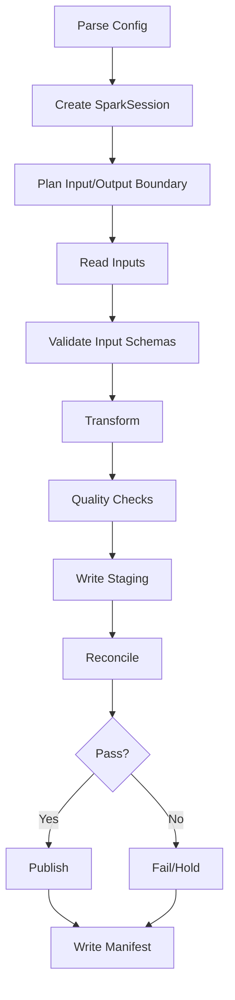

# Part 050 — Spark Java Pipeline Patterns

Apache Spark is a distributed analytics engine. In Java pipeline work, Spark is usually used for:

- large batch transformations,
- joins across big datasets,
- historical backfill,
- lakehouse table writes,
- data quality profiling,
- feature generation,
- wide aggregations,
- micro-batch streaming through Structured Streaming.

But Spark should not be treated as “Java collections at cluster scale”.

That mental model fails.

A better mental model:

> Spark lets you describe a logical transformation plan over distributed datasets; the engine optimizes and executes that plan across a cluster.

The Java engineer’s job is not only to write transformations. It is to design:

- clean input/output contracts,
- deterministic transform boundaries,
- partition-aware computation,
- safe write semantics,
- resource-aware execution,
- testable transformation code,
- operational observability.

This part focuses on production Java usage, not a toy `word count` example.

---

## 1. Spark Is Not a Bigger Stream API

It is tempting to see this:

```java
List<CaseEvent> events = ...;
events.stream()
    .filter(...)
    .map(...)
    .collect(...);
```

and imagine Spark as:

```java
Dataset<CaseEvent> events = ...;
events.filter(...)
    .map(...)
    .collectAsList();
```

That is the wrong center of gravity.

In Spark, operations build a distributed plan. Data is partitioned. Computation is lazy. Shuffles are expensive. User-defined Java lambdas are serialized and sent to executors. Execution happens away from the driver.

The central questions are:

```text
What plan am I building?
Where will the data move?
What is the partitioning boundary?
What is the cardinality after each stage?
What can be pushed into Spark SQL engine?
What side effects are accidentally happening on executors?
How will output be committed safely?
```

Spark pipeline design is plan design.

---

## 2. Spark Abstractions You Must Separate

Spark offers several major APIs.

| API | Java Pipeline Use | Notes |
|---|---|---|
| `Dataset<Row>` / DataFrame | Most production batch transformation | Optimized relational/columnar style; less Java type safety |
| `Dataset<T>` | Typed domain-ish processing | Useful but Java encoders and lambdas can be awkward |
| SQL | Declarative transformations | Strong for joins/aggregations; easy to review |
| RDD | Low-level distributed collection | Rare in modern structured pipelines; useful for specialized control |
| Structured Streaming | Incremental/micro-batch stream processing | Covered in next part |

A `DataFrame` in Java is represented as `Dataset<Row>`.

This matters because the type boundary is different from normal Java domain code.

```java
Dataset<Row> df = spark.read().parquet(inputPath);
```

You do not get compile-time field safety.

You need runtime schema checks, contract tests, and explicit mapping at boundaries.

---

## 3. SparkSession as the Application Boundary

Most Spark Java jobs start with `SparkSession`.

```java
SparkSession spark = SparkSession.builder()
    .appName("case-sla-daily-metrics")
    .getOrCreate();
```

Production rule:

> `SparkSession` belongs at the infrastructure boundary, not inside transformation logic.

Bad:

```java
public class CaseTransform {
    public Dataset<Row> run(String inputPath) {
        SparkSession spark = SparkSession.builder().getOrCreate();
        return spark.read().parquet(inputPath).filter("status = 'OPEN'");
    }
}
```

Better:

```java
public final class CaseTransform {
    public Dataset<Row> transform(Dataset<Row> events, Dataset<Row> calendar) {
        return events
            .join(calendar, events.col("business_date").equalTo(calendar.col("date")))
            .where(events.col("case_status").notEqual("DELETED"));
    }
}
```

The job shell owns IO. The transform owns logic.

---

## 4. Recommended Job Structure

A production Spark Java job should be boring and layered.

```text
case-sla-spark-job/
  src/main/java/com/company/pipeline/casesla/
    CaseSlaJobMain.java
    CaseSlaJobConfig.java
    CaseSlaPlanner.java
    CaseSlaInputs.java
    CaseSlaTransform.java
    CaseSlaOutputWriter.java
    CaseSlaQualityChecks.java
    CaseSlaSchemas.java
    CaseSlaMetrics.java
```

Separation:

| Component | Responsibility |
|---|---|
| `Main` | parse args, create SparkSession, wire dependencies |
| `Config` | paths, dates, run ID, mode, resources |
| `Planner` | input/output boundary and reference versions |
| `Inputs` | read datasets and enforce schemas |
| `Transform` | pure logical transformations |
| `QualityChecks` | validation and reconciliation |
| `OutputWriter` | staged writes and publish protocol |
| `Schemas` | declared expected schemas |
| `Metrics` | run and data metrics |

Avoid one giant `main` method. Spark code becomes unreviewable quickly when IO, SQL strings, quality checks, and publish logic are mixed.

---

## 5. Dataset<Row> Boundary Pattern

The most common production style is:

```text
external data -> Dataset<Row> -> validated logical schema -> transforms -> output Dataset<Row>
```

Example:

```java
public final class CaseSlaInputs {
    public Dataset<Row> readCaseEvents(SparkSession spark, String path) {
        Dataset<Row> raw = spark.read().parquet(path);
        SchemaAssertions.requireColumns(raw.schema(), List.of(
            "case_id",
            "event_id",
            "event_type",
            "event_time",
            "business_date",
            "owning_unit",
            "payload_version"
        ));
        return raw;
    }
}
```

Do not trust files just because they are Parquet.

Validate:

- required columns,
- column types,
- nullability expectation,
- enum domains,
- timestamp timezone policy,
- version columns,
- uniqueness keys,
- partition columns.

The schema is a contract boundary.

---

## 6. Typed Dataset Boundary Pattern

For some transformations, typed `Dataset<T>` can clarify intent.

```java
public record CaseEvent(
    String caseId,
    String eventId,
    String eventType,
    Timestamp eventTime,
    Date businessDate,
    String owningUnit
) implements Serializable {}
```

Convert with encoder:

```java
Encoder<CaseEvent> encoder = Encoders.bean(CaseEventBean.class);
Dataset<CaseEventBean> events = raw.as(encoder);
```

In Java, records are not always as frictionless with Spark encoders as ordinary JavaBeans depending on Spark version and encoder path. A pragmatic approach is often:

```text
Dataset<Row> for large relational transforms
small typed domain objects at edges/tests
explicit mappers for critical boundaries
```

Use typed datasets when they improve correctness, not because they feel more Java-like.

---

## 7. Transformation Design: Prefer Relational Primitives

Spark SQL/DataFrame operations are optimized by Spark's query engine.

Prefer:

```java
Dataset<Row> filtered = events
    .where(col("event_type").isin("CASE_OPENED", "CASE_ESCALATED"))
    .select(
        col("case_id"),
        col("event_id"),
        col("event_time"),
        col("business_date"),
        col("owning_unit")
    );
```

Be careful with Java UDFs for simple logic.

Bad:

```java
spark.udf().register("normalizeStatus", (String s) -> normalize(s), DataTypes.StringType);
Dataset<Row> out = events.withColumn("status_norm", callUDF("normalizeStatus", col("status")));
```

If equivalent built-in expressions exist, prefer them:

```java
Dataset<Row> out = events.withColumn(
    "status_norm",
    upper(trim(col("status")))
);
```

Why?

- built-ins are visible to optimizer,
- Java UDFs can be black boxes,
- serialization overhead may increase,
- null behavior can be surprising,
- predicate pushdown may be lost.

Use UDFs when business logic truly cannot be expressed otherwise, and isolate them.

---

## 8. Avoid `collect()` as a Control-Flow Escape Hatch

`collectAsList()` moves distributed data to the driver.

Bad:

```java
List<Row> rows = events.collectAsList();
for (Row row : rows) {
    callExternalApi(row);
}
```

This breaks the distributed model and can crash the driver.

Allowed cases:

- tiny config dataset,
- quality summary with known bounded size,
- partition manifest list with explicit cap,
- debugging in local tests.

Safer pattern for small reference data:

```java
List<Row> units = unitMapping.limit(10_000).collectAsList();
```

Still enforce a limit and fail if unexpectedly large.

Driver memory should never be the hidden sink of an unbounded dataset.

---

## 9. Join Pattern: Design Before Code

Joins are where Spark jobs often become expensive or wrong.

Before writing a join, answer:

```text
Join keys:
  Are keys stable, normalized, and unique on the reference side?

Cardinality:
  one-to-one, one-to-many, many-to-many?

Temporal semantics:
  latest reference or effective-at-event-time?

Missing reference:
  reject, quarantine, default, or preserve null?

Duplicate reference:
  fail, pick latest, aggregate, or explode?

Size:
  can one side be broadcast?

Skew:
  do some keys dominate?
```

Example safe join shape:

```java
Dataset<Row> reference = orgUnits
    .where(col("valid_from").leq(col("event_time")))
    .where(col("valid_to").isNull().or(col("valid_to").gt(col("event_time"))));
```

But temporal joins in batch often need careful interval logic.

Common pattern:

```java
Dataset<Row> joined = events.alias("e")
    .join(orgUnits.alias("o"),
        col("e.owning_unit").equalTo(col("o.unit_code"))
            .and(col("e.event_time").geq(col("o.valid_from")))
            .and(col("o.valid_to").isNull().or(col("e.event_time").lt(col("o.valid_to")))),
        "left");
```

Then explicitly route missing matches:

```java
Dataset<Row> unresolved = joined.where(col("o.unit_id").isNull());
Dataset<Row> accepted = joined.where(col("o.unit_id").isNotNull());
```

Do not silently default unresolved joins to “UNKNOWN” unless the contract says that is valid.

---

## 10. Broadcast Join Pattern

For small reference data, broadcast can avoid shuffle.

```java
Dataset<Row> enriched = events.join(
    functions.broadcast(orgUnits),
    events.col("owning_unit").equalTo(orgUnits.col("unit_code")),
    "left"
);
```

Use when:

- reference data is small enough for executor memory,
- reference side is reused heavily,
- join key is clean,
- no major temporal explosion.

Do not broadcast because “it is faster” without measuring.

Risks:

- executor memory pressure,
- stale assumption as reference grows,
- long serialization/deserialization cost,
- driver planning pressure.

Production guard:

```java
long refCount = orgUnits.count();
if (refCount > config.maxBroadcastRows()) {
    throw new IllegalStateException("Reference dataset too large for broadcast: " + refCount);
}
```

A better guard includes estimated size, not just row count.

---

## 11. Skew Handling Pattern

Data skew occurs when some keys are much larger than others.

Symptoms:

- one task runs much longer,
- shuffle spill increases,
- executor OOM,
- job stuck at 99%,
- uneven partition sizes.

Example:

```text
case_id = "UNKNOWN" appears in 40% of records
owning_unit = "CENTRAL" owns 60% of events
tenant_id = "large-bank-1" dominates all others
```

Approaches:

| Pattern | Use Case | Trade-off |
|---|---|---|
| Filter bad key | invalid placeholder values | requires quarantine policy |
| Salt hot key | large aggregation/join hot key | more complex recombine |
| Split large tenant | tenant-isolated compute | orchestration complexity |
| Broadcast small side | small dimension join | memory risk |
| Pre-aggregate | reduce data before shuffle | only safe for associative operations |
| Repartition by composite key | better distribution | may change downstream layout |

Salting example:

```java
Dataset<Row> saltedEvents = events.withColumn(
    "salt",
    pmod(abs(hash(col("event_id"))), lit(16))
);

Dataset<Row> saltedRef = ref.crossJoin(
    spark.range(0, 16).toDF("salt")
);

Dataset<Row> joined = saltedEvents.join(
    saltedRef,
    saltedEvents.col("key").equalTo(saltedRef.col("key"))
        .and(saltedEvents.col("salt").equalTo(saltedRef.col("salt")))
);
```

Use salting carefully. It changes the shape of the plan and must be documented.

---

## 12. Aggregation Pattern

Aggregations must define key, window, null policy, and duplicate policy.

Example:

```java
Dataset<Row> metrics = events
    .where(col("event_type").equalTo("CASE_ESCALATED"))
    .groupBy(col("business_date"), col("owning_unit"))
    .agg(
        count(lit(1)).alias("escalation_count"),
        countDistinct(col("case_id")).alias("distinct_case_count"),
        max(col("event_time")).alias("last_event_time")
    );
```

Review questions:

- Are duplicate events already deduped?
- Is `business_date` event-derived or ingestion-derived?
- Are null owning units excluded, grouped, or quarantined?
- Is `countDistinct` acceptable at this scale?
- Does output require zero rows for missing groups?
- Does metric need restatement when late data arrives?

A metric is a contract, not just an aggregation expression.

---

## 13. Window-Like Batch Computation

Batch jobs often compute rolling windows:

```text
7-day breach count
30-day case reopen rate
monthly escalation ratio
business-day SLA age
```

In batch, window semantics must still be explicit.

Example:

```java
WindowSpec w = Window
    .partitionBy(col("case_id"))
    .orderBy(col("event_time"))
    .rowsBetween(Window.unboundedPreceding(), Window.currentRow());

Dataset<Row> withSeq = events.withColumn("event_sequence", row_number().over(w));
```

Window functions are powerful but can be expensive:

- they often require sort,
- partition skew hurts,
- large partitions spill,
- ordering tie-breakers must be deterministic.

Always include stable tie-breakers:

```java
.orderBy(col("event_time"), col("source_position"), col("event_id"))
```

Do not order only by timestamp if multiple events can share the same timestamp.

---

## 14. Deduplication Pattern

Spark dedupe must match business semantics.

Naive:

```java
Dataset<Row> deduped = events.dropDuplicates("event_id");
```

Better when source can resend same event ID with changed payload:

```java
WindowSpec latestByEvent = Window
    .partitionBy(col("event_id"))
    .orderBy(col("source_commit_time").desc(), col("source_position").desc());

Dataset<Row> deduped = events
    .withColumn("rn", row_number().over(latestByEvent))
    .where(col("rn").equalTo(1))
    .drop("rn");
```

But this encodes a rule: latest wins.

Other possible rules:

- first wins,
- highest source version wins,
- exact payload duplicate only,
- correction event supersedes original,
- duplicate is error if payload differs.

Production dedupe requires a policy table, not just `dropDuplicates`.

---

## 15. Write Pattern: Stage Before Publish

Spark makes it easy to write output:

```java
metrics.write().mode(SaveMode.Overwrite).parquet(outputPath);
```

That is not enough for production.

Prefer:

```java
String stagingPath = config.stagingPath() + "/run_id=" + config.runId();

metrics.write()
    .mode(SaveMode.ErrorIfExists)
    .parquet(stagingPath);

qualityChecks.validate(stagingPath);
publisher.publish(stagingPath, config.finalOutputBoundary());
```

Why avoid direct overwrite?

- consumers may see partial files,
- overwrite semantics differ by filesystem/table format,
- retry can delete valid prior output,
- crash during write leaves ambiguous state,
- validation should happen before publish.

Use direct table writes only when the table format and commit protocol provide the required atomicity.

---

## 16. Save Modes and Their Risks

Spark `DataFrameWriter` supports modes such as append, overwrite, ignore, and error-if-exists.

Production interpretation:

| Mode | Use Carefully For | Main Risk |
|---|---|---|
| `Append` | immutable facts, event logs | duplicates on retry |
| `Overwrite` | owned partition/table replacement | destructive if boundary wrong |
| `ErrorIfExists` | staging run output | good retry guard, but needs cleanup policy |
| `Ignore` | rarely appropriate | can hide failures |

A strong rule:

> Never use overwrite unless the output boundary is explicit and validated.

For partition overwrite, configure and test semantics carefully. Static overwrite and dynamic partition overwrite can have very different blast radius depending on Spark configuration and table/catalog behavior.

---

## 17. Partitioned Writes

Example:

```java
metrics.write()
    .mode(SaveMode.Append)
    .partitionBy("business_date")
    .parquet(stagingPath);
```

Partitioning should reflect:

- common read filters,
- recompute boundary,
- correction boundary,
- retention boundary,
- output ownership.

Bad partitioning:

```text
partitionBy(case_id)
```

Usually creates extreme partition explosion.

Better:

```text
partitionBy(business_date)
partitionBy(tenant_id, business_date) only if tenant/date is a real operational boundary
```

But even tenant/date can create too many small partitions for many tenants.

Measure:

```text
rows per partition
files per partition
average file size
largest partition size
smallest partition size
```

Partitioning is both physical layout and operational semantics.

---

## 18. Repartition, Coalesce, and Shuffle Awareness

`repartition` causes a shuffle.

```java
Dataset<Row> repartitioned = metrics.repartition(col("business_date"));
```

`coalesce` reduces partitions without full shuffle in many cases.

```java
Dataset<Row> compact = metrics.coalesce(32);
```

Patterns:

| Operation | Use When | Risk |
|---|---|---|
| `repartition(n)` | need parallelism/distribution | expensive shuffle |
| `repartition(col)` | align by key before join/write | skew possible |
| `coalesce(n)` | reduce output file count | can create uneven partitions |
| no change | engine plan is sufficient | may create too many/few files |

Do not randomly sprinkle `repartition(200)`.

Ask:

```text
Am I solving input parallelism, shuffle distribution, output file size, or join correctness?
```

Each has a different answer.

---

## 19. Caching and Persistence

Spark transformations are lazy. Reusing the same expensive dataset may recompute it.

```java
Dataset<Row> normalized = normalize(events).persist(StorageLevel.MEMORY_AND_DISK());

Dataset<Row> metricsA = computeMetricA(normalized);
Dataset<Row> metricsB = computeMetricB(normalized);

// trigger actions
metricsA.count();
metricsB.count();

normalized.unpersist();
```

Use persistence when:

- reused multiple times,
- expensive to compute,
- stable intermediate after filtering/projection,
- enough memory/disk exists.

Avoid caching:

- huge raw datasets used once,
- data with many columns when only few are needed later,
- as a blind fix for slow jobs,
- without unpersisting long-lived jobs.

Persistence is a resource trade-off, not a magic performance switch.

---

## 20. Explain Plans as Engineering Artifacts

Spark can explain execution plans.

```java
metrics.explain(true);
```

Review the plan for:

- unexpected Cartesian product,
- repeated scans,
- unpushed filters,
- huge shuffles,
- unnecessary sorts,
- broadcast decisions,
- skew symptoms,
- wide dependencies.

For important pipelines, store plan snapshots during review or CI for critical transforms.

A top engineer does not only ask “did it run?”. They ask:

> What physical work did the engine have to perform?

---

## 21. Null Semantics

Spark SQL null semantics are not the same as Java `Optional` semantics.

Examples:

```java
where(col("status").notEqual("DELETED"))
```

Rows with null `status` may not behave as a business user expects.

Safer:

```java
where(col("status").isNotNull()
    .and(col("status").notEqual("DELETED")))
```

Or explicitly route nulls:

```java
Dataset<Row> invalid = events.where(col("status").isNull());
Dataset<Row> valid = events.where(col("status").isNotNull());
```

The data contract should define:

- nullable fields,
- null meaning,
- default policy,
- quarantine policy,
- metric impact.

Null is not “nothing”. In pipelines, null is often an unhandled business state.

---

## 22. Timezone and Timestamp Pattern

Spark jobs often fail subtly around time.

Rules:

- set session timezone explicitly,
- parse timestamps with known format,
- distinguish event time, ingestion time, business date,
- avoid host default timezone,
- store UTC instants and derived business date separately when needed,
- test daylight-saving and boundary cases even if your primary timezone has no DST.

Example:

```java
SparkSession spark = SparkSession.builder()
    .appName("case-sla-daily-metrics")
    .config("spark.sql.session.timeZone", "UTC")
    .getOrCreate();
```

Then derive business date explicitly:

```java
Dataset<Row> withBusinessDate = events.withColumn(
    "business_date_jakarta",
    to_date(from_utc_timestamp(col("event_time_utc"), "Asia/Jakarta"))
);
```

Do not let timestamps inherit accidental environment behavior.

---

## 23. External Side Effects from Spark Executors

Avoid calling external services inside Spark transformations.

Bad:

```java
Dataset<Row> enriched = events.map(row -> {
    String risk = riskApi.lookup(row.getAs("case_id"));
    return RowFactory.create(row.getAs("case_id"), risk);
}, rowEncoder);
```

Problems:

- executor retries duplicate calls,
- no global rate limit,
- partial side effects,
- non-deterministic output,
- API outage fails distributed tasks,
- credentials on executors,
- hard-to-debug latency.

Better patterns:

- pre-extract reference data as dataset,
- join inside Spark,
- use separate ingestion pipeline for API source,
- materialize external lookup table with version,
- use controlled enrichment service outside Spark if request/response semantics are needed.

Spark transform should be mostly pure.

---

## 24. Quality Checks in Spark

Quality checks should produce structured output, not only throw exceptions.

Example checks:

```java
public final class CaseSlaQualityChecks {
    public List<QualityResult> validate(Dataset<Row> metrics) {
        List<QualityResult> results = new ArrayList<>();

        long negativeDurations = metrics
            .where(col("sla_age_minutes").lt(0))
            .count();

        results.add(QualityResult.count(
            "negative_sla_age_minutes",
            negativeDurations,
            negativeDurations == 0 ? QualityStatus.PASS : QualityStatus.FAIL
        ));

        return results;
    }
}
```

But be careful: every `count()` is an action and can trigger a job.

For many checks, compute them in one pass:

```java
Dataset<Row> summary = metrics.agg(
    count(lit(1)).alias("rows"),
    sum(when(col("sla_age_minutes").lt(0), 1).otherwise(0)).alias("negative_sla_age"),
    sum(when(col("owning_unit").isNull(), 1).otherwise(0)).alias("missing_owner")
);
```

Design quality checks as Spark workloads too.

---

## 25. Reconciliation in Spark

A common reconciliation pattern:

```java
Dataset<Row> inputSummary = input.groupBy(col("business_date"))
    .agg(count(lit(1)).alias("input_count"));

Dataset<Row> outputSummary = output.groupBy(col("business_date"))
    .agg(sum(col("case_count")).alias("output_case_count"));

Dataset<Row> recon = inputSummary.join(outputSummary, "business_date");
```

But count reconciliation is rarely enough.

Add:

- duplicate count,
- rejected count,
- accepted count,
- checksum over business keys,
- sum of measures,
- partition completeness,
- min/max event time,
- latest input source position.

A robust output row should carry lineage columns:

```text
run_id
job_version
input_snapshot_id
transform_version
published_at
source_min_event_time
source_max_event_time
```

Consumers should be able to explain where output came from.

---

## 26. Testing Spark Java Transforms

Keep transform methods pure enough to test locally.

Example test shape:

```java
@Test
void computesDailyEscalationCount() {
    SparkSession spark = localSpark();

    Dataset<Row> events = spark.createDataFrame(List.of(
        RowFactory.create("c1", "CASE_ESCALATED", Date.valueOf("2026-07-03")),
        RowFactory.create("c2", "CASE_OPENED", Date.valueOf("2026-07-03")),
        RowFactory.create("c3", "CASE_ESCALATED", Date.valueOf("2026-07-03"))
    ), CaseSlaSchemas.eventsSchema());

    Dataset<Row> out = new CaseSlaTransform().dailyEscalations(events);

    List<Row> rows = out.collectAsList();
    assertThat(rows).hasSize(1);
    assertThat(rows.get(0).getAs("escalation_count")).isEqualTo(2L);
}
```

Test categories:

- schema tests,
- null behavior,
- duplicate handling,
- temporal boundary,
- join missing reference,
- aggregation correctness,
- deterministic ordering,
- output partition columns,
- quality violation routing.

Do not test only happy path row counts.

---

## 27. Golden Dataset Pattern

A golden dataset is a small but realistic input/output fixture.

Structure:

```text
src/test/resources/golden/case-sla/v1/
  input/case_events.jsonl
  input/sla_calendar.jsonl
  expected/case_sla_daily_metrics.jsonl
  manifest.yaml
```

Manifest:

```yaml
scenario: late escalation after reassignment
business_date: 2026-07-03
expectations:
  rows: 2
  no_negative_duration: true
  quarantined_records: 1
```

Golden datasets should include edge cases:

- duplicate event,
- late event,
- missing reference,
- null optional field,
- invalid enum,
- correction event,
- boundary timestamp,
- multi-tenant split,
- closed period correction.

Golden tests prevent “small refactor” from silently changing semantics.

---

## 28. Configuration Pattern

Spark config comes from multiple layers:

```text
application parameters
Spark submit arguments
Spark session config
cluster defaults
catalog/table config
job-specific runtime config
```

Separate business parameters from engine parameters.

Business parameters:

```text
--run-id=run-20260704-010000
--business-date=2026-07-03
--input-snapshot=snap-123
--mode=REPLACE_PARTITION
```

Engine parameters:

```text
--conf spark.executor.instances=20
--conf spark.executor.memory=8g
--conf spark.sql.shuffle.partitions=800
```

Do not let business logic read arbitrary Spark configs directly.

Use typed config:

```java
public record CaseSlaJobConfig(
    String runId,
    LocalDate businessDate,
    String inputPath,
    String stagingPath,
    String outputPath,
    BatchMode mode,
    int maxBroadcastRows
) {}
```

---

## 29. Packaging and Submission

A Spark Java job is commonly packaged as a fat/shaded jar or distribution artifact.

Production concerns:

- dependency conflicts,
- Spark/Scala binary compatibility,
- logging bindings,
- connector versions,
- cloud storage libraries,
- serialization compatibility,
- reproducible build,
- artifact provenance,
- config externalization.

Example submit shape:

```bash
spark-submit \
  --class com.company.pipeline.casesla.CaseSlaJobMain \
  --master yarn \
  --deploy-mode cluster \
  --conf spark.sql.session.timeZone=UTC \
  --conf spark.sql.shuffle.partitions=800 \
  case-sla-spark-job.jar \
  --run-id run-20260704-010000 \
  --business-date 2026-07-03 \
  --input-path s3://raw/case-events/snapshot=snap-123 \
  --staging-path s3://stage/case-sla/run_id=run-20260704-010000 \
  --output-path s3://curated/case-sla
```

Treat submit command as deployable infrastructure, not a wiki snippet.

---

## 30. Spark Job Lifecycle

A production Spark batch run follows the same lifecycle from Part 049:



Spark executes the heavy computation. Your pipeline architecture controls visibility and evidence.

---

## 31. Error Handling Pattern

Different failures require different responses.

| Failure | Example | Response |
|---|---|---|
| Config error | invalid date | fail before Spark work |
| Schema error | required column missing | fail input validation |
| Data quality error | invalid status | quarantine or fail by policy |
| Resource error | executor OOM | tune/split/retry after diagnosis |
| External storage error | staging write failed | inspect staging and retry/cleanup |
| Unknown publish | timeout after commit | recovery inspection |
| Logic bug | wrong metric formula | block publish/backfill fix |

Do not hide all exceptions behind “Spark job failed”. The failure class determines safe retry.

---

## 32. Observability Pattern

Spark UI is useful, but not enough.

Emit pipeline-level metrics:

```text
spark_job_run_status
input_rows_by_dataset
output_rows_by_partition
quarantined_rows_by_reason
quality_check_status
reconciliation_status
publish_status
runtime_seconds_by_stage
```

Emit data-level logs:

```json
{
  "runId": "run-20260704-010000",
  "jobName": "case-sla-daily-metrics",
  "businessDate": "2026-07-03",
  "inputRows": 18203121,
  "outputRows": 3812,
  "quarantinedRows": 29,
  "status": "PUBLISHED"
}
```

Store:

- Spark application ID,
- run ID,
- input snapshot,
- output version,
- commit ID,
- quality results,
- reconciliation summary.

The Spark application ID tells you how execution ran. The pipeline run ID tells you what truth was produced.

---

## 33. Performance Design Checklist

Before tuning blindly, inspect the shape.

Ask:

- Is the input pruned by partition and projection?
- Are filters pushed down?
- Are joins using expected strategy?
- Is one key skewed?
- Are shuffle partitions appropriate?
- Are output files too small?
- Are expensive UDFs blocking optimization?
- Is data cached only when reused?
- Is `count()` called too many times for validation?
- Are wide transformations unavoidable?
- Are reference datasets accidentally huge?

Tuning after a bad logical design only makes the wrong plan slightly faster.

---

## 34. Security and Sensitive Data Boundary

Spark jobs often have broad access.

Design rules:

- read only required columns,
- drop sensitive fields early when not needed,
- avoid logging row payloads,
- classify output dataset sensitivity,
- separate raw/staging/curated access,
- ensure staging paths have retention and access policy,
- mask/tokenize before broad publication,
- record data classification in manifest.

Bad:

```java
logger.info("bad row: {}", row);
```

Better:

```java
logger.warn("invalid row: runId={}, reason={}, eventIdHash={}",
    runId,
    reason,
    hash(row.getAs("event_id"))
);
```

Data pipelines leak data through logs, staging, metrics labels, samples, and exception messages. Control all of them.

---

## 35. Case Study: Case SLA Daily Metrics Spark Job

Input datasets:

```text
case_events_raw
sla_calendar
org_unit_history
case_priority_history
```

Output dataset:

```text
case_sla_daily_metrics
```

High-level code shape:

```java
public final class CaseSlaJobMain {
    public static void main(String[] args) {
        CaseSlaJobConfig config = CaseSlaJobConfig.parse(args);

        SparkSession spark = SparkSession.builder()
            .appName("case-sla-daily-metrics")
            .config("spark.sql.session.timeZone", "UTC")
            .getOrCreate();

        CaseSlaInputs inputs = new CaseSlaInputs();
        Dataset<Row> events = inputs.readEvents(spark, config.eventsPath());
        Dataset<Row> calendar = inputs.readCalendar(spark, config.calendarPath());
        Dataset<Row> orgUnits = inputs.readOrgUnits(spark, config.orgUnitPath());

        CaseSlaTransform transform = new CaseSlaTransform();
        Dataset<Row> metrics = transform.compute(events, calendar, orgUnits, config.businessDate());

        CaseSlaQualityChecks quality = new CaseSlaQualityChecks();
        QualityReport report = quality.validate(metrics);
        report.throwIfBlocking();

        new CaseSlaOutputWriter().writeStaging(metrics, config.stagingPath());
        new CaseSlaPublisher().publish(config);
    }
}
```

Transform sketch:

```java
public Dataset<Row> compute(
    Dataset<Row> events,
    Dataset<Row> calendar,
    Dataset<Row> orgUnits,
    LocalDate businessDate
) {
    Dataset<Row> relevant = events
        .where(col("business_date").equalTo(lit(Date.valueOf(businessDate))))
        .where(col("event_type").isin("CASE_OPENED", "CASE_ESCALATED", "CASE_RESOLVED"));

    Dataset<Row> deduped = dedupeEvents(relevant);
    Dataset<Row> enriched = enrichOrgUnit(deduped, orgUnits);
    Dataset<Row> aged = computeSlaAge(enriched, calendar);

    return aged.groupBy(col("business_date"), col("owning_unit"), col("priority"))
        .agg(
            countDistinct(col("case_id")).alias("case_count"),
            sum(when(col("sla_breached"), 1).otherwise(0)).alias("breach_count"),
            avg(col("sla_age_minutes")).alias("avg_sla_age_minutes")
        )
        .withColumn("run_id", lit("${RUN_ID_REPLACED_BY_CALLER}"));
}
```

In real code, avoid hidden run ID substitution inside transform. Pass run metadata explicitly at output boundary.

---

## 36. Common Spark Java Anti-Patterns

### Anti-Pattern 1: Giant Main Method

Fix: separate IO, transform, quality, publish.

### Anti-Pattern 2: `collectAsList()` for Real Data

Fix: keep data distributed; collect only bounded summaries.

### Anti-Pattern 3: Java UDF for Everything

Fix: use built-in SQL/DataFrame functions where possible.

### Anti-Pattern 4: Direct Overwrite of Final Path

Fix: staging + validation + atomic publish.

### Anti-Pattern 5: Join Without Cardinality Contract

Fix: validate uniqueness and route missing/duplicate references.

### Anti-Pattern 6: Timestamp Defaults

Fix: set session timezone and derive business dates explicitly.

### Anti-Pattern 7: Blind Repartition

Fix: understand whether you need parallelism, distribution, or file control.

### Anti-Pattern 8: No Manifest

Fix: record run ID, input boundary, output boundary, Spark app ID, schema version, quality result, reconciliation result.

---

## 37. Production Review Checklist

Before merging a Spark Java pipeline, ask:

- Is business logic separated from Spark job bootstrap?
- Are input schemas validated?
- Are output schemas explicitly declared?
- Does the job use a run ID?
- Are input and output boundaries explicit?
- Is the transform deterministic?
- Are reference datasets versioned or temporally scoped?
- Are joins reviewed for cardinality and missing-reference policy?
- Are duplicates handled by a documented rule?
- Are null semantics explicit?
- Is timezone configured?
- Are UDFs justified?
- Are `collect()` calls bounded?
- Are writes staged before publish?
- Is overwrite scoped to owned partitions only?
- Are quality checks efficient and meaningful?
- Are reconciliation results stored?
- Are Spark app ID and pipeline run ID linked?
- Is small-file output measured?
- Does the job support shadow/backfill mode?
- Is sensitive data controlled in logs, staging, and output?

Spark is powerful, but power without boundaries creates expensive ambiguity.

---

## 38. The Mental Model to Keep

A Spark Java pipeline has two layers:

```text
Logical data pipeline layer:
  contracts, input boundary, transform semantics, validation, publish, evidence

Spark execution layer:
  distributed plan, partitioning, shuffle, caching, tasks, executors, storage
```

Top-tier engineers keep both layers visible.

They do not write Spark code as if it were normal Java collections.

They do not trust a green Spark job as proof of data correctness.

They design Spark jobs as deterministic, staged, observable, reproducible computation units inside a larger pipeline architecture.

---

## References

- Apache Spark documentation: Spark is a unified analytics engine for large-scale data processing with high-level APIs in Java, Scala, Python, and R.
- Spark SQL, DataFrames, and Datasets guide: the DataFrame API is available in Java, and in Java a DataFrame is represented as a `Dataset<Row>`.
- Spark JavaDoc: `Dataset<T>` is a strongly typed collection of domain-specific objects that can be transformed in parallel.
- Spark Structured Streaming documentation: Structured Streaming is built on Spark SQL engine and is covered separately in the next part.
