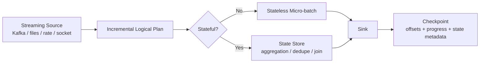
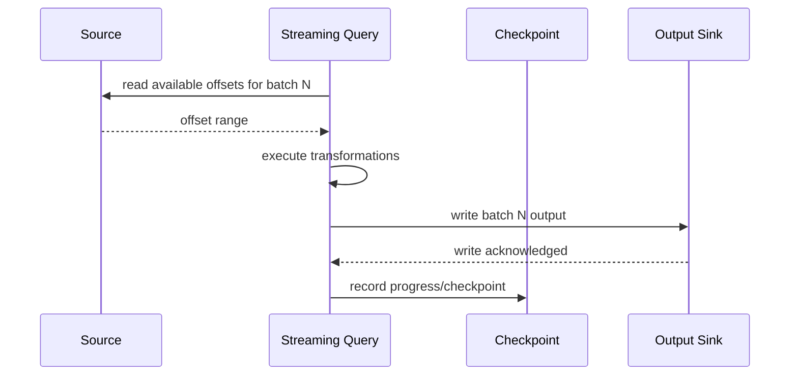
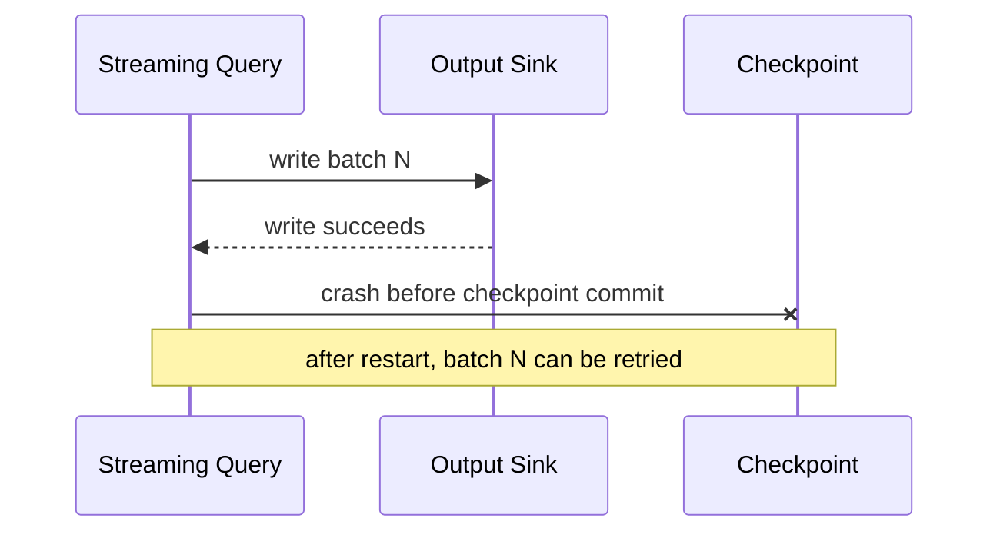
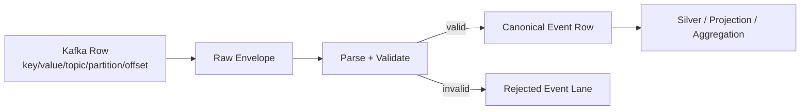
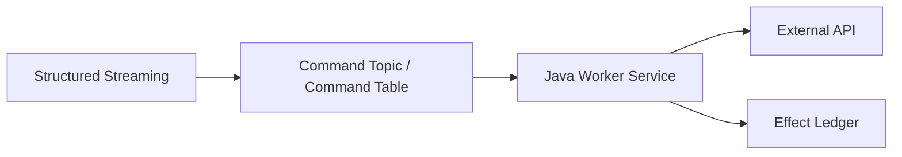
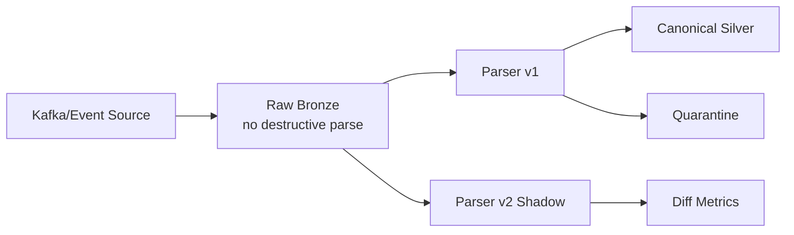
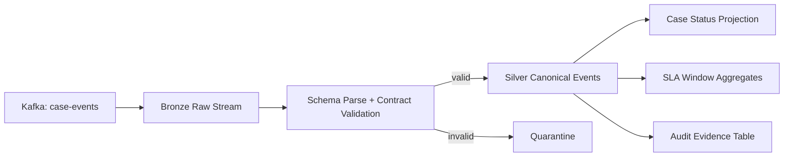

# Part 051 — Structured Streaming Patterns

Spark Structured Streaming is easy to misunderstand.

It looks like batch code:

```java
Dataset<Row> input = spark.readStream()
    .format("kafka")
    .option("kafka.bootstrap.servers", brokers)
    .option("subscribe", "case-events")
    .load();
```

But it does not behave like a normal batch job.

Structured Streaming is a continuously running query over an unbounded input. The query is usually executed as repeated micro-batches. Each micro-batch reads a bounded slice of new input, applies a logical plan, updates state, writes output, and records progress in a checkpoint.

The correct mental model is:

> Structured Streaming is Spark SQL executed incrementally over a changing input table, with checkpointed progress and state.

That sentence matters because many production bugs come from treating Structured Streaming as either:

- a Kafka consumer loop,
- a tiny Flink replacement,
- a scheduled batch job,
- or a magical exactly-once engine.

It is none of those.

It is a streaming query engine built on Spark SQL. Its strength is high-throughput micro-batch transformation, stream-to-batch enrichment, large aggregations, lakehouse writes, and unified batch/stream logic. Its weakness is low-latency per-record decisions, complex fine-grained timers, and arbitrary event-driven workflow behavior.

This part focuses on how to use it safely from Java.

---

## 1. The Core Model

A Structured Streaming query has five major parts:

1. source,
2. logical transformation plan,
3. optional state,
4. sink,
5. checkpoint.



The source is not just an input adapter. It defines the recoverable position.

The transformation plan is not executed once. It is executed repeatedly.

The sink is not just output. It defines the external effect boundary.

The checkpoint is not optional operational decoration. It is the query memory.

If the checkpoint is lost, moved incorrectly, corrupted, or reused for a different query shape, you are not restarting the same pipeline. You are creating a different pipeline with ambiguous recovery semantics.

---

## 2. Structured Streaming vs Kafka Consumer Loop

A Java Kafka consumer loop usually looks like this:

```text
poll records
for each record:
  deserialize
  process
  write sink
commit offset
```

Structured Streaming looks more like this:

```text
for each trigger:
  determine available source offsets
  build a bounded micro-batch
  execute Spark logical/physical plan
  update state store if needed
  write output to sink
  commit query progress to checkpoint
```

The difference is fundamental.

| Concern | Kafka Consumer Loop | Structured Streaming |
|---|---|---|
| Unit of work | Record or small poll batch | Micro-batch query execution |
| Transformation model | Imperative Java code | Spark SQL logical plan |
| State | Your database/cache/state store | Spark state store/checkpoint |
| Parallelism | Consumer partitions + app threads | Spark partitions + executors |
| Offset control | Explicit commit | Managed by source/checkpoint |
| Best for | Fine-grained event side effects | High-throughput analytical transformation |
| Weakness | Manual scaling/state | Less control over per-record workflow |

A weak design uses Structured Streaming for every streaming problem.

A strong design asks:

> Is the desired computation naturally expressible as incremental table transformation?

If yes, Structured Streaming is a good candidate.

If no, Kafka Streams, Flink, Temporal, or a plain Java service may be clearer.

---

## 3. Micro-Batch as a Commit Boundary

The micro-batch is a central abstraction.

In a micro-batch, Spark reads a set of input offsets and produces a set of output rows. If the batch succeeds, Spark records progress. If it fails before progress is committed, the batch may be retried.

That means your sink must tolerate retry.



The dangerous case is the unknown outcome:



If the sink is append-only and has no idempotency key, retry creates duplicates.

Therefore, the production rule is simple:

> Every Structured Streaming sink must be evaluated under micro-batch retry.

---

## 4. Query Skeleton in Java

A minimal Java Structured Streaming query from Kafka:

```java
SparkSession spark = SparkSession.builder()
    .appName("case-event-stream")
    .getOrCreate();

Dataset<Row> kafka = spark.readStream()
    .format("kafka")
    .option("kafka.bootstrap.servers", "kafka-1:9092,kafka-2:9092")
    .option("subscribe", "regulatory.case-events.v1")
    .option("startingOffsets", "earliest")
    .load();

Dataset<Row> parsed = kafka.selectExpr(
    "CAST(key AS STRING) AS event_key",
    "CAST(value AS STRING) AS raw_json",
    "topic",
    "partition",
    "offset",
    "timestamp AS kafka_timestamp"
);

StreamingQuery query = parsed.writeStream()
    .format("parquet")
    .option("path", "s3://lake/bronze/case_events/")
    .option("checkpointLocation", "s3://checkpoints/case-event-stream/")
    .outputMode("append")
    .start();

query.awaitTermination();
```

This is not production-grade yet.

Missing concerns:

- schema validation,
- poison record lane,
- event-time parsing,
- checkpoint lifecycle,
- sink commit policy,
- data quality metrics,
- replay mode,
- backfill mode,
- deployment ownership,
- secrets,
- observability,
- schema evolution,
- input rate control,
- output file sizing,
- lineage.

The skeleton is useful only after you understand its hidden contracts.

---

## 5. Source Patterns

Structured Streaming supports multiple source families. In Java data pipeline work, the common production sources are:

- Kafka,
- files/object storage,
- Delta/Iceberg/Hudi table streams depending on engine integration,
- rate source for tests,
- custom connectors in more advanced deployments.

### 5.1 Kafka Source Pattern

Kafka source is common for operational event ingestion.

Use it when:

- input is already event/log based,
- replay is needed,
- ordering is per Kafka partition,
- the pipeline can process data in micro-batches,
- the sink can tolerate batch retry.

Typical options:

```java
Dataset<Row> kafka = spark.readStream()
    .format("kafka")
    .option("kafka.bootstrap.servers", brokers)
    .option("subscribe", topic)
    .option("startingOffsets", "earliest")
    .option("failOnDataLoss", "true")
    .option("maxOffsetsPerTrigger", "500000")
    .load();
```

Key options to reason about:

| Option | Meaning | Production concern |
|---|---|---|
| `startingOffsets` | Where to start when no checkpoint exists | Only applies on first run without checkpoint |
| `maxOffsetsPerTrigger` | Input cap per trigger | Backpressure/cost control |
| `failOnDataLoss` | Fail if source offset unavailable | Protects against silent gaps, but can block recovery |
| `subscribe` | Topic subscription | Static topic set; explicit contract |
| `subscribePattern` | Pattern subscription | Dangerous if topic governance is weak |

The checkpoint dominates `startingOffsets` after the query has started. Engineers often change `startingOffsets` and expect replay. That does not work if the checkpoint already exists.

Replay requires a deliberate checkpoint and sink strategy.

### 5.2 File Source Pattern

File streaming source watches a directory and treats new files as input.

Use it for:

- landed partner files,
- object-storage arrival streams,
- batch-to-stream bridge,
- append-only data drops.

Avoid it when:

- files can be mutated after arrival,
- file arrival is not atomic,
- producer writes partial files directly into watched path,
- file naming is not stable,
- duplicates are not detectable.

Production file-source invariant:

> The streaming reader must only see complete immutable files.

A safe layout:

```text
s3://landing/vendor-a/tmp/...
s3://landing/vendor-a/ready/...
s3://landing/vendor-a/archive/...
s3://landing/vendor-a/rejected/...
```

Producer writes to `tmp`, validates, then publishes via manifest or atomic move/copy to `ready`.

### 5.3 Rate Source Pattern

Use the rate source only for testing mechanics.

```java
Dataset<Row> rate = spark.readStream()
    .format("rate")
    .option("rowsPerSecond", "1000")
    .load();
```

It is useful for:

- trigger behavior,
- sink throughput test,
- deployment smoke test,
- state growth simulation.

It does not validate real source semantics.

---

## 6. Parsing and Envelope Pattern

Raw streaming data should not be converted directly into business tables.

A safer pattern:



A good raw envelope preserves:

- source topic,
- partition,
- offset,
- Kafka timestamp,
- key bytes/string,
- value bytes/string,
- headers if available,
- ingestion batch id,
- parser version,
- schema version,
- parse status,
- error code.

In Java Spark SQL, header handling is less pleasant than plain consumer code, but the principle remains: do not destroy source metadata too early.

Example raw selection:

```java
Dataset<Row> raw = kafka.selectExpr(
    "CAST(key AS STRING) AS message_key",
    "CAST(value AS STRING) AS message_value",
    "topic AS source_topic",
    "partition AS source_partition",
    "offset AS source_offset",
    "timestamp AS source_timestamp"
);
```

Then parse with Spark SQL functions where possible. Avoid UDFs unless necessary.

Why?

Spark SQL functions are visible to the optimizer. Java UDFs are often opaque and can become performance and observability problems.

---

## 7. Output Modes

Structured Streaming has output modes that define how results are written after each trigger.

The three commonly discussed modes are:

- append,
- update,
- complete.

### 7.1 Append Mode

Append mode writes only new rows.

Use it for:

- immutable event output,
- parsed raw/bronze append,
- finalized window results,
- sink tables where each output row is a fact.

Append mode is simple when the output row will never change.

Example:

```java
StreamingQuery query = events.writeStream()
    .format("parquet")
    .option("path", outputPath)
    .option("checkpointLocation", checkpointPath)
    .outputMode("append")
    .start();
```

### 7.2 Update Mode

Update mode writes rows that changed since the previous trigger.

Use it when:

- you are maintaining an aggregate,
- downstream sink can upsert,
- sink has a stable key,
- duplicate or reordered updates are tolerable through idempotent merge.

It is dangerous for append-only sinks.

If you write update-mode rows as plain append records, downstream consumers may interpret intermediate updates as final facts.

### 7.3 Complete Mode

Complete mode writes the full result table after each trigger.

Use it sparingly.

It can be appropriate for:

- small aggregates,
- monitoring tables,
- complete replacement sink semantics.

It is usually wrong for large result sets.

Production smell:

> Complete mode over a growing dimension or metric table without an explicit size bound.

---

## 8. Sink Patterns

A sink is not just a file/table writer. It is the external side effect boundary.

### 8.1 Append File Sink

Good for raw immutable outputs.

```java
raw.writeStream()
    .format("parquet")
    .option("path", "s3://lake/bronze/case_events")
    .option("checkpointLocation", "s3://checkpoints/bronze-case-events")
    .outputMode("append")
    .start();
```

Risks:

- small files,
- duplicate output on misconfigured checkpoint,
- schema drift,
- no row-level upsert,
- costly downstream compaction.

Mitigations:

- trigger interval tuning,
- output partition strategy,
- periodic compaction,
- table format with snapshot commits,
- raw import ledger.

### 8.2 Lakehouse Table Sink

For production analytical data, prefer a table format such as Iceberg, Delta, or Hudi where available in your platform.

Why?

Because a table is not only files. It includes metadata, commit history, schema evolution, partition evolution, and snapshot semantics.

Pattern:

```text
streaming query -> staged files -> table commit -> snapshot becomes visible
```

The important invariant:

> Readers should see a committed table state, not a partially written directory.

### 8.3 ForeachBatch Sink

`foreachBatch` lets you handle each micro-batch manually.

Use it when:

- sink needs custom idempotent merge,
- you write to JDBC with upsert/merge,
- you need per-batch reconciliation,
- you need to write multiple outputs carefully,
- you need batch-level auditing.

Java pattern:

```java
StreamingQuery query = transformed.writeStream()
    .foreachBatch((batchDf, batchId) -> {
        if (batchDf.isEmpty()) {
            return;
        }

        Dataset<Row> deduped = batchDf.dropDuplicates("event_id");

        // Example: write to staging, then execute idempotent merge outside Spark if needed.
        deduped.write()
            .mode(SaveMode.Append)
            .format("parquet")
            .save("s3://staging/case_projection/batch_id=" + batchId);

        // Record batchId and output manifest in an effect ledger.
    })
    .option("checkpointLocation", checkpointPath)
    .start();
```

`batchId` is useful but not automatically enough. You need to define how batch replay is detected by the sink.

Bad pattern:

```java
.foreachBatch((df, batchId) -> {
    df.write().mode(SaveMode.Append).jdbc(url, "case_projection", props);
})
```

Why bad?

A retry can append duplicate rows.

Safer pattern:

```text
foreachBatch:
  derive deterministic sink key
  write to staging table/path
  perform idempotent merge by key
  record batch effect ledger
  reconcile counts
```

### 8.4 External API Sink

Structured Streaming to external API is usually a bad fit.

Reasons:

- API calls are slow,
- retries create duplicate side effects,
- rate limits do not align naturally with Spark tasks,
- per-record compensation is hard,
- output ordering is unclear,
- failed partial batches are painful.

If you must do it:

- write commands to Kafka/table first,
- use a separate worker service with idempotency keys,
- track effect ledger,
- apply rate limiting outside Spark,
- make the API call idempotent.

Preferred architecture:



---

## 9. Checkpoint Design

Checkpoint location is part of the query identity.

A checkpoint stores enough metadata for Structured Streaming to resume from failure. Depending on source and query, it may include source offsets, progress logs, and state store metadata.

Production rules:

1. one logical query owns one checkpoint location,
2. never share checkpoint path across environments,
3. never share checkpoint path across different query definitions,
4. checkpoint path must be durable,
5. checkpoint path must be protected from lifecycle deletion,
6. checkpoint path must be included in runbook,
7. deleting checkpoint is a data-impacting operation.

### 9.1 Good Checkpoint Naming

```text
s3://platform-checkpoints/prod/regulatory/case-events/bronze-ingest/v1/
s3://platform-checkpoints/prod/regulatory/case-sla/silver-aggregation/v3/
```

Include:

- environment,
- domain,
- pipeline name,
- stage,
- query version.

### 9.2 Checkpoint Migration

Changing query logic may or may not be compatible with the old checkpoint.

Safe-ish changes:

- adding stateless column derivation,
- adding output column when sink/schema supports it,
- adjusting trigger interval,
- increasing input rate limit.

Risky changes:

- changing aggregation key,
- changing watermark column,
- changing stateful operation shape,
- changing join condition,
- changing output mode,
- changing source topic semantics,
- changing sink idempotency key.

For risky changes, prefer:

```text
old query continues
new query starts with new checkpoint
shadow compare outputs
cut over downstream consumers
retire old query
```

---

## 10. Trigger Patterns

Trigger controls when micro-batches run.

Common patterns:

| Trigger | Use case | Concern |
|---|---|---|
| default | continuous as fast as possible | May overload sink |
| processing time | predictable cadence | Latency/cost trade-off |
| available now | bounded catch-up/backfill style | Useful for scheduled incremental runs |
| once | older pattern for one batch | Often replaced by available-now style in modern Spark deployments |

Example:

```java
StreamingQuery query = output.writeStream()
    .trigger(Trigger.ProcessingTime("1 minute"))
    .format("parquet")
    .option("path", outputPath)
    .option("checkpointLocation", checkpointPath)
    .start();
```

Design trigger based on:

- source arrival rate,
- sink write cost,
- freshness SLO,
- state cleanup interval,
- compaction strategy,
- cluster cost,
- downstream expectations.

A 5-second trigger is not automatically better than a 1-minute trigger. It may create small files, frequent commits, and higher overhead.

---

## 11. Watermarks and Late Data

Watermark defines event-time progress.

Example:

```java
Dataset<Row> withEventTime = parsed
    .withColumn("event_time", functions.to_timestamp(functions.col("event_time_text")));

Dataset<Row> counts = withEventTime
    .withWatermark("event_time", "30 minutes")
    .groupBy(
        functions.window(functions.col("event_time"), "10 minutes"),
        functions.col("case_type")
    )
    .count();
```

Mental model:

```text
watermark = engine's belief that future data older than this threshold is unlikely enough to finalize/drop state
```

Watermark is not truth. It is a contract.

If your source can produce corrections after 30 days, a 30-minute watermark is not a correctness guarantee. It is a decision to exclude or separately handle those late corrections.

### 11.1 Late Data Policy

Define one of these explicitly:

| Policy | Behavior | Use case |
|---|---|---|
| drop late | Ignore late events | Low-risk metrics |
| side-output late | Route to late lane | Audit/review needed |
| correction event | Emit adjustment | Financial/regulatory reporting |
| restatement | Recompute affected partitions | High correctness domain |
| dual table | Fast approximate + corrected truth | Analytics with delayed truth |

Structured Streaming APIs differ from Flink side outputs, so late-lane implementation often requires separate validation logic before aggregation or a raw/bronze replay strategy.

---

## 12. Deduplication Patterns

Structured Streaming supports dedupe operations, but production dedupe is a contract decision.

Simple dedupe:

```java
Dataset<Row> deduped = events
    .withWatermark("event_time", "1 day")
    .dropDuplicates("event_id");
```

This means:

- `event_id` is the dedupe key,
- state is kept according to watermark/retention behavior,
- duplicates outside the retention horizon may not be suppressed,
- correction events must not reuse the same identity unless intended.

A stronger dedupe design records:

- `event_id`,
- `source_system`,
- `source_partition`,
- `source_offset`,
- `payload_hash`,
- `first_seen_at`,
- `last_seen_at`,
- `duplicate_count`,
- `pipeline_version`.

For high-risk sinks, use a sink-side ledger as the final dedupe barrier.

---

## 13. Stateful Aggregation Pattern

Example: count case events by type per 10-minute window.

```java
Dataset<Row> aggregated = events
    .withWatermark("event_time", "1 hour")
    .groupBy(
        functions.window(functions.col("event_time"), "10 minutes"),
        functions.col("event_type")
    )
    .count();
```

Design questions:

1. Is event time reliable?
2. What lateness is allowed?
3. What output mode is used?
4. Is the output final or provisional?
5. Can downstream handle updates?
6. How is state size bounded?
7. What happens during replay?
8. How are corrections represented?

Do not publish aggregation outputs without declaring whether they are provisional or final.

Bad output table:

```text
case_event_counts
```

Better output tables:

```text
case_event_counts_provisional
case_event_counts_finalized
case_event_count_corrections
```

Or include explicit columns:

```text
window_start
window_end
metric_name
metric_value
result_status = PROVISIONAL | FINAL | CORRECTED
watermark_at_emit
pipeline_version
```

---

## 14. Stream-to-Batch Join Pattern

Structured Streaming is often excellent for stream-to-static enrichment.

Example:

```java
Dataset<Row> caseEvents = ...;
Dataset<Row> caseTypeDim = spark.read()
    .format("parquet")
    .load("s3://lake/dim/case_type_current");

Dataset<Row> enriched = caseEvents.join(
    functions.broadcast(caseTypeDim),
    caseEvents.col("case_type_code").equalTo(caseTypeDim.col("case_type_code")),
    "left"
);
```

This enriches each micro-batch using a static snapshot of the dimension loaded by the query.

Hidden issue:

> When does the static dimension refresh?

If the dimension is loaded once at query start, long-running query may use stale reference data.

Patterns:

| Pattern | Behavior | Trade-off |
|---|---|---|
| restart query to refresh dimension | Simple | Operational dependency |
| foreachBatch load dimension | Fresh per batch | More overhead |
| stream dimension as table | More correct | More state/complexity |
| use versioned dimension by event time | Best correctness | Requires temporal modeling |

For regulatory or financial pipelines, prefer versioned dimension joins.

---

## 15. ForeachBatch Merge Pattern

A common production need: maintain a projection table with upsert semantics.

Pseudo-pattern:

```java
StreamingQuery query = projection.writeStream()
    .foreachBatch((batch, batchId) -> {
        Dataset<Row> normalized = batch
            .dropDuplicates("case_id")
            .withColumn("pipeline_batch_id", functions.lit(batchId));

        normalized.createOrReplaceTempView("batch_projection");

        batch.sparkSession().sql("""
            MERGE INTO case_projection target
            USING batch_projection source
            ON target.case_id = source.case_id
            WHEN MATCHED AND source.event_version >= target.event_version THEN UPDATE SET *
            WHEN NOT MATCHED THEN INSERT *
        """);
    })
    .option("checkpointLocation", checkpointPath)
    .start();
```

This is conceptually right but incomplete.

Production additions:

- table format must support merge safely,
- merge condition must be deterministic,
- event version must be monotonic per entity,
- batch retry must not corrupt output,
- concurrency must be controlled,
- failed merge must not advance checkpoint,
- metrics must compare input count, deduped count, inserted count, updated count, rejected count.

---

## 16. Exactly-Once: What It Means Here

Structured Streaming documentation discusses end-to-end exactly-once fault tolerance through checkpointing and write-ahead logs in the Structured Streaming model.

But production interpretation must be scoped.

Exactly-once is not magic over arbitrary sinks.

You need to ask:

1. Can the source replay the same input range?
2. Does the query checkpoint input progress and state?
3. Does the sink support idempotent or transactional commit?
4. Are side effects outside the sink avoided?
5. Is the output key deterministic?
6. Does the sink expose unknown outcomes?

If any answer is weak, design for effectively-once instead.

Effectively-once pattern:

```text
source replay + deterministic transform + idempotent sink key + effect ledger + reconciliation
```

---

## 17. State Store Cost Model

Stateful operations require state.

Examples:

- aggregation,
- dedupe,
- stream-stream join,
- mapGroupsWithState-style operations where supported,
- watermark-based windows.

State cost drivers:

| Driver | Example |
|---|---|
| key cardinality | millions of case IDs |
| window count | many overlapping windows |
| lateness horizon | 30 days vs 30 minutes |
| duplicate horizon | long dedupe TTL |
| join horizon | stream-stream join retention |
| output mode | update/complete may retain more |
| skew | one key receives huge volume |

Production metrics to watch:

- state rows,
- state memory/disk usage,
- batch duration,
- input rows per second,
- processed rows per second,
- watermark progress,
- trigger delay,
- state cleanup rate,
- executor spill,
- GC time.

State grows silently until it becomes an incident.

---

## 18. Backpressure and Input Rate Control

Structured Streaming does not remove the need for flow control.

For Kafka, use input caps:

```java
.option("maxOffsetsPerTrigger", "100000")
```

This limits how much data is processed in one trigger. It is useful when:

- catching up after downtime,
- sink throughput is limited,
- state operation is expensive,
- cluster cost must be controlled,
- you want stable batch duration.

But too low a cap creates permanent lag.

A practical tuning loop:

```text
target freshness SLO
  -> derive max acceptable lag
  -> measure sink throughput
  -> set trigger interval + max offsets
  -> watch batch duration and lag
  -> adjust partitioning/cluster/sink before raising cap blindly
```

A pipeline is healthy when:

```text
average batch duration < trigger interval
and backlog trend is stable or decreasing
and sink latency stays inside SLO
```

---

## 19. Small Files and Streaming Writes

Structured Streaming can create many small files when trigger interval is too frequent or partitions are too granular.

Small files hurt:

- query planning,
- object-store listing,
- metadata load,
- downstream scans,
- compaction cost.

Mitigations:

- increase trigger interval,
- reduce output partition cardinality,
- coalesce/repartition before write carefully,
- use table format compaction,
- separate low-latency serving from lakehouse storage,
- use ingestion-time buckets where appropriate,
- compact bronze/silver tables asynchronously.

Bad partitioning:

```text
s3://lake/events/date=2026-07-04/hour=10/minute=23/event_type=X/tenant=A/...
```

Potentially better:

```text
s3://lake/events/event_date=2026-07-04/tenant_bucket=17/...
```

Partition for query pruning and manageability, not for human visual neatness.

---

## 20. Handling Poison Records

Structured Streaming is not naturally good at row-level exception handling if parsing logic throws inside the query.

Prefer representing parse outcome as data.

```java
Dataset<Row> parsed = raw.select(
    functions.col("message_key"),
    functions.col("source_topic"),
    functions.col("source_partition"),
    functions.col("source_offset"),
    functions.from_json(functions.col("message_value"), schema).alias("payload"),
    functions.col("message_value").alias("raw_payload")
);

Dataset<Row> valid = parsed.filter("payload IS NOT NULL");
Dataset<Row> invalid = parsed.filter("payload IS NULL");
```

Then write invalid records to a quarantine table:

```java
invalid.writeStream()
    .format("parquet")
    .option("path", "s3://lake/quarantine/case-events")
    .option("checkpointLocation", "s3://checkpoints/quarantine-case-events")
    .outputMode("append")
    .start();
```

Do not let one bad record stop an entire ingestion query unless the domain explicitly requires fail-fast.

For high-risk contract violations, fail-fast may be correct. But make it explicit.

---

## 21. Schema Drift Pattern

Schema drift in streaming is more dangerous than schema drift in batch because the query is long-running.

Patterns:

| Pattern | Behavior |
|---|---|
| strict parse | invalid schema goes to quarantine/failure |
| tolerant parse | unknown fields ignored/preserved |
| raw-first bronze | raw payload stored before parsing |
| versioned parser | parser version selected by schema version/header |
| dual parser | old and new parsers run during migration |
| shadow validation | new parser validates without publishing output |

Recommended architecture:



Raw-first design lets you reparse historical data when parser logic improves.

---

## 22. Query Versioning

A streaming query has more than source code version.

Track:

- code version,
- query name,
- checkpoint path,
- source topic/table/path,
- source offset range,
- schema versions accepted,
- parser version,
- transform version,
- sink table/path,
- output mode,
- watermark policy,
- trigger policy,
- state schema,
- deployment image,
- owner.

Create a query manifest:

```yaml
pipeline: case-event-silver-stream
version: 3
engine: spark-structured-streaming
language: java
source:
  type: kafka
  topics:
    - regulatory.case-events.v1
  startingPolicy: checkpoint-first
checkpoint:
  path: s3://platform-checkpoints/prod/regulatory/case-event-silver/v3/
transform:
  parserVersion: case-event-parser-2.4.1
  contractVersion: case-event-contract-1.8.0
watermark:
  column: event_time
  delay: PT2H
sink:
  type: iceberg
  table: prod_silver.case_events
  mode: append
quality:
  invalidRecordPolicy: quarantine
owner: regulatory-data-platform
```

This is what lets an engineer review a query without guessing from code.

---

## 23. Deployment Pattern

A Structured Streaming query should be deployed as a long-running application, not as a casual script.

Minimum deployment contract:

- deterministic artifact build,
- explicit Spark version,
- explicit connector versions,
- stable checkpoint path,
- stable query name,
- externalized config,
- secrets from secret manager,
- logs shipped centrally,
- metrics scraped,
- alerting on lag/failure/stuck watermark,
- graceful shutdown,
- rollback procedure,
- replay/backfill procedure.

Bad deployment smell:

```text
spark-submit random-fat-jar.jar --class Main with hardcoded paths
```

Better:

```text
spark-submit \
  --class com.company.pipeline.CaseEventSilverStream \
  --conf spark.sql.shuffle.partitions=400 \
  --conf spark.executor.instances=20 \
  --conf spark.executor.memory=8g \
  pipeline-case-event-silver-3.2.0.jar \
  --config s3://platform-config/prod/case-event-silver.yaml
```

---

## 24. Observability

A production Structured Streaming query needs at least four observability layers.

### 24.1 Engine Metrics

Track:

- query status,
- batch id,
- input rows,
- processed rows per second,
- input rows per second,
- batch duration,
- scheduling delay,
- state rows,
- state memory,
- watermark,
- source offset range,
- sink commit duration.

### 24.2 Data Metrics

Track:

- valid records,
- invalid records,
- schema version distribution,
- null rate,
- duplicate rate,
- late event rate,
- event-time lag,
- tenant distribution,
- key skew,
- output row count.

### 24.3 Contract Metrics

Track:

- contract violations,
- unknown enum values,
- missing required fields,
- incompatible schema versions,
- rejected sensitive data,
- quarantine count by reason.

### 24.4 Business Metrics

Track:

- cases ingested,
- escalations detected,
- SLA breach events,
- decisions processed,
- corrections applied,
- reporting partitions completed.

A query that only reports “running” is not observable.

---

## 25. Alerting Rules

Useful alerts:

| Alert | Signal |
|---|---|
| query down | streaming query terminated unexpectedly |
| query stuck | no batch progress for N minutes |
| lag growing | source lag increasing for M windows |
| watermark stuck | event-time watermark not advancing |
| invalid spike | quarantine rate exceeds baseline |
| duplicate spike | dedupe rate exceeds baseline |
| small file spike | files per trigger exceeds threshold |
| sink slow | sink commit duration exceeds SLO |
| state explosion | state rows/memory grow unexpectedly |
| freshness breach | max event processed age exceeds SLO |

Do not alert only on infrastructure failure. Alert on data failure.

---

## 26. Recovery Scenarios

### 26.1 Query Crashes Before Sink Write

Likely safe. Batch retries.

Check:

- source offset range,
- last committed batch,
- sink output count,
- checkpoint progress.

### 26.2 Query Crashes After Sink Write Before Checkpoint

Dangerous if sink is not idempotent.

Expected behavior:

- batch may be retried,
- output may duplicate,
- sink must detect duplicate batch or deterministic row key.

### 26.3 Checkpoint Deleted

This is severe.

Possible actions:

1. stop query,
2. identify last correct sink state,
3. decide replay offset/time,
4. start new checkpoint,
5. use idempotent sink or replace affected partitions,
6. reconcile.

Never casually recreate a checkpoint and hope.

### 26.4 Source Offset Expired

If Kafka retention deleted offsets before the query caught up, recovery may fail or lose data depending on configuration and source behavior.

Mitigations:

- adequate retention,
- lag alerting,
- raw archival sink,
- backfill path from lake/raw storage,
- dead query detection.

### 26.5 Sink Corrupted

If sink output is wrong but source/checkpoint progressed, replay requires deliberate sink repair.

Options:

- restore sink snapshot,
- recompute affected partitions,
- publish correction rows,
- start new query version,
- backfill from bronze/raw.

---

## 27. Backfill with Structured Streaming

Structured Streaming can be used for bounded catch-up patterns, but not every backfill should be a streaming query.

Patterns:

### 27.1 Batch Backfill Using Same Transform

Best when input is already stored in raw tables/files.

```text
raw bronze table -> batch transform -> target partition replacement
```

### 27.2 Available-Now Streaming Backfill

Useful when you want streaming source semantics but bounded execution.

```text
read all available input -> process micro-batches -> stop when caught up
```

### 27.3 Parallel Historical Replay

Dangerous unless isolated.

Rules:

- separate checkpoint,
- separate output namespace or idempotent sink,
- explicit replay mode column,
- no external irreversible side effects,
- reconciliation before publish.

---

## 28. Multi-Output Pattern

Writing multiple outputs from one streaming query can be tempting:

```text
valid events -> silver table
invalid events -> quarantine table
metrics -> audit table
```

The problem is atomicity.

If output A succeeds and output B fails, what is the truth?

Safer patterns:

| Pattern | When to use |
|---|---|
| separate queries from raw bronze | Strong isolation, easier replay |
| foreachBatch with explicit commit protocol | Related outputs need batch-level coordination |
| publish raw once, derive many | Best for large platforms |
| table transaction with multi-table support | Only if platform truly supports it |

Default recommendation:

> Write raw/bronze once. Derive downstream outputs through separate versioned queries.

---

## 29. Regulatory Case Pipeline Example

Suppose we ingest case lifecycle events:

```json
{
  "eventId": "evt-9821",
  "caseId": "CASE-123",
  "eventType": "CASE_ESCALATED",
  "eventTime": "2026-07-04T08:12:31Z",
  "actorId": "user-18",
  "jurisdiction": "ID",
  "payload": {
    "fromStage": "INVESTIGATION",
    "toStage": "ENFORCEMENT_REVIEW",
    "reason": "SLA_RISK"
  }
}
```

Pipeline design:



Do not make the SLA aggregate the only consumer of raw Kafka. Persist raw first.

Why?

If the SLA logic changes, you need replay from immutable facts.

---

## 30. Java Implementation Blueprint

A practical project shape:

```text
case-event-stream/
  pom.xml
  src/main/java/com/company/pipeline/
    CaseEventSilverStream.java
    config/
      PipelineConfig.java
      ConfigLoader.java
    schema/
      CaseEventSchemas.java
    transform/
      CaseEventParser.java
      CaseEventCanonicalizer.java
      QualityRules.java
    sink/
      SinkWriters.java
    observability/
      QueryListener.java
      MetricsPublisher.java
  src/test/java/com/company/pipeline/
    CaseEventParserTest.java
    CaseEventGoldenDatasetTest.java
    StreamingQueryPlanTest.java
  src/main/resources/
    log4j2.xml
```

Keep these boundaries:

- main class wires Spark query,
- parser owns schema interpretation,
- transform owns canonical rules,
- quality rules own validation,
- sink writer owns idempotent write protocol,
- observability owns query listener and metrics.

Avoid a 900-line `main` method.

---

## 31. Testing Strategy

### 31.1 Static Transformation Tests

Test transforms with static DataFrames.

```java
Dataset<Row> input = spark.read().json("src/test/resources/case-events/raw-valid.jsonl");
Dataset<Row> actual = CaseEventTransforms.toCanonical(input);
Dataset<Row> expected = spark.read().json("src/test/resources/case-events/expected-canonical.jsonl");

assertDataFrameEquals(expected, actual);
```

### 31.2 Golden Dataset Test

Maintain fixture sets:

```text
valid/
invalid_missing_required/
unknown_enum/
duplicate_event_id/
late_event/
correction_event/
schema_v1/
schema_v2/
```

### 31.3 Checkpoint Compatibility Test

For stateful queries:

1. run old query version with sample input,
2. stop after state/checkpoint created,
3. start new version against same checkpoint,
4. verify compatibility or intentional failure.

### 31.4 Sink Retry Test

Simulate:

```text
batch writes sink
crash before checkpoint
restart
same batch writes again
```

Expected: no duplicate effect.

---

## 32. Common Anti-Patterns

### Anti-pattern 1: Streaming Directly to Business Tables Without Raw Capture

This destroys replay ability.

Fix: raw bronze first, then canonical derived tables.

### Anti-pattern 2: Checkpoint as Temporary Folder

This turns failure recovery into data loss.

Fix: durable owned checkpoint location.

### Anti-pattern 3: Append Sink for Update Mode

This creates misleading intermediate facts.

Fix: use upsert/merge sink or append explicit changelog records.

### Anti-pattern 4: UDF Everything

This hides logic from optimizer and makes performance worse.

Fix: use built-in SQL functions where possible; isolate UDFs.

### Anti-pattern 5: No Late Data Policy

This silently drops or miscounts events.

Fix: declare watermark and correction/restatement policy.

### Anti-pattern 6: External API Calls Inside Executors

This creates duplicate side effects and rate-limit chaos.

Fix: emit commands to durable queue/table and use worker service.

### Anti-pattern 7: Reusing Checkpoint for a Different Query

This corrupts recovery semantics.

Fix: new query version, new checkpoint, shadow compare.

---

## 33. Production Review Checklist

Before deploying a Structured Streaming pipeline, answer:

### Source

- What is the source identity?
- What is the replay boundary?
- What is the retention window?
- What happens if offsets expire?
- Is source data immutable?

### Checkpoint

- Where is checkpoint stored?
- Who owns it?
- Is it protected from deletion?
- What query version owns it?
- What changes are checkpoint-compatible?

### Transform

- Is parsing deterministic?
- Is schema version handled?
- Is invalid data represented as data?
- Is event time parsed consistently?
- Are transformations versioned?

### State

- What operation creates state?
- What bounds state growth?
- What is the watermark/TTL?
- What happens under skew?
- How is state migration handled?

### Sink

- Is sink append, update, merge, or complete replacement?
- Is sink idempotent under batch retry?
- Does sink expose unknown outcome?
- Are small files controlled?
- Is output contract documented?

### Operations

- What is freshness SLO?
- What alerts exist?
- What is replay procedure?
- What is backfill procedure?
- What is rollback procedure?
- What is data reconciliation method?

---

## 34. Decision Matrix

| Need | Structured Streaming fit? | Better alternative sometimes |
|---|---:|---|
| Kafka to lakehouse raw ingestion | High | Kafka Connect for pure copy |
| Large stream aggregation | Medium-high | Flink for complex event-time/state |
| Low-latency alert below 100ms | Low-medium | Flink / Kafka Streams / custom service |
| Stream-to-batch enrichment | High | Flink temporal joins if event-time strict |
| External API side effects | Low | Java worker + Kafka/Temporal |
| Backfill with same SQL logic | High | Batch Spark job |
| Complex per-entity workflow | Low | Temporal / workflow engine |
| ML feature generation batch+stream | Medium-high | Depends on feature store architecture |

---

## 35. Key Takeaways

Structured Streaming is powerful when you respect its model.

The model is not “a Kafka loop in Spark”.

It is:

```text
incremental Spark SQL plan
+ micro-batch execution
+ checkpointed progress/state
+ sink commit boundary
```

The deepest production lessons are:

1. checkpoint is query identity,
2. micro-batch retry requires idempotent sink design,
3. event-time correctness requires explicit watermark and late-data policy,
4. raw capture is your replay insurance,
5. update/complete output modes require careful sink semantics,
6. external side effects do not become safe just because Spark runs them,
7. observability must include data correctness, not just job uptime,
8. state must be bounded by design.

Structured Streaming is best used as a high-throughput incremental table transformation engine. Once you see it that way, the design choices become clearer.

---

## References

- Apache Spark Structured Streaming Programming Guide: https://spark.apache.org/docs/latest/streaming/index.html
- Apache Spark SQL, DataFrames and Datasets Guide: https://spark.apache.org/docs/latest/sql-programming-guide.html
- Apache Spark Java API documentation: https://spark.apache.org/docs/latest/api/java/
- Apache Kafka documentation: https://kafka.apache.org/documentation/
- Apache Iceberg documentation: https://iceberg.apache.org/docs/latest/
