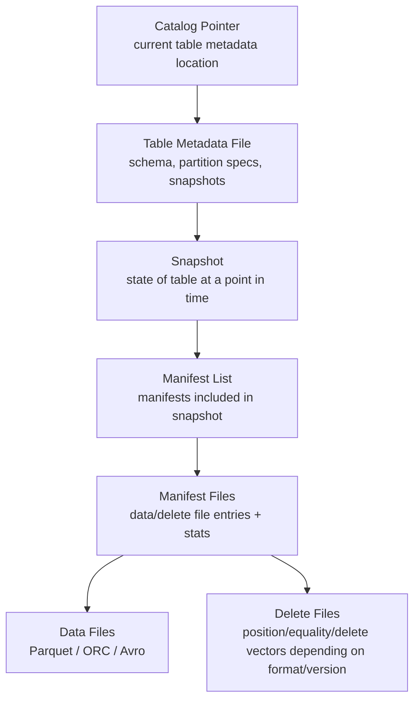
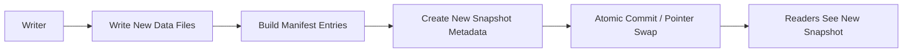
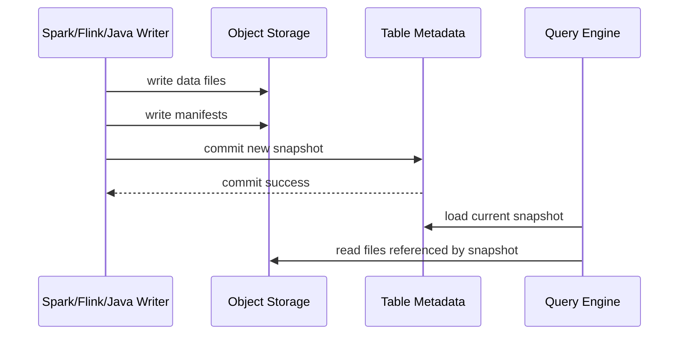
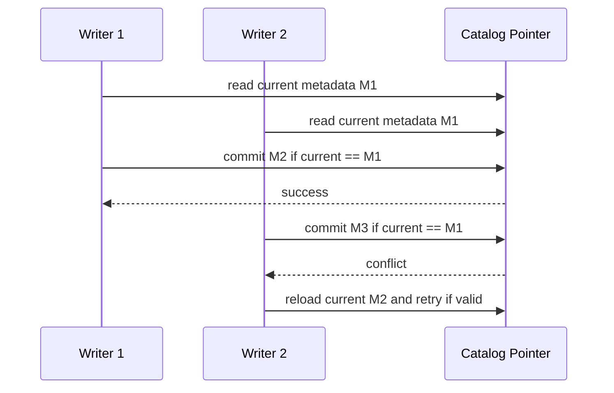
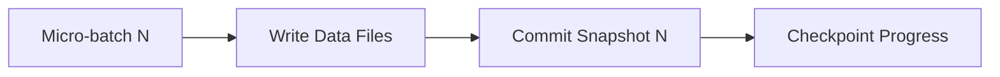
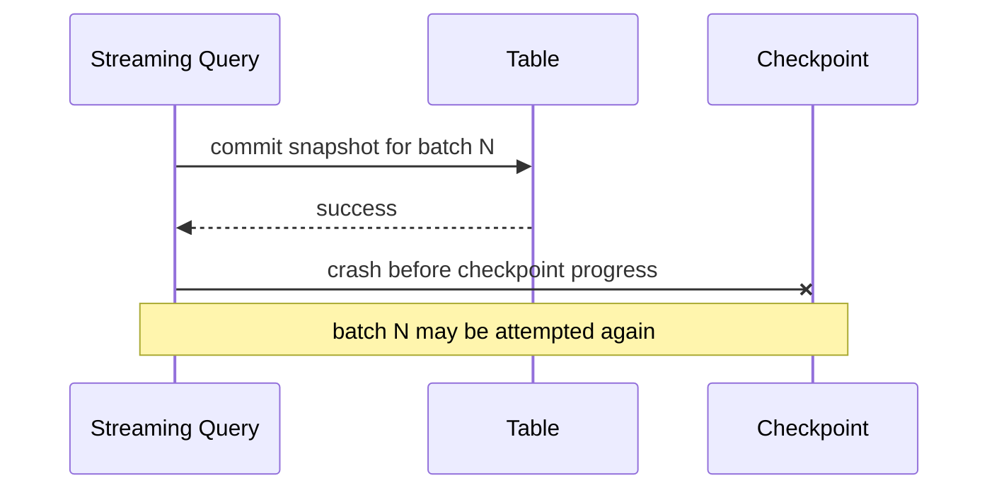
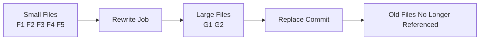

# Part 052 — Lakehouse Table Format Mental Model

A lakehouse table is not a folder of Parquet files.

That mistaken mental model creates many production failures:

- readers see partial writes,
- schema changes break old readers,
- partition layout becomes frozen forever,
- deletes are impossible or unsafe,
- backfills overwrite live data,
- compaction races with ingestion,
- concurrent writers corrupt the table,
- lineage cannot identify which files formed a report,
- rollback is guesswork.

A modern table format solves a specific problem:

> How do we make files in cheap object storage behave like a reliable analytical table?

The answer is metadata.

A table format such as Apache Iceberg, Delta Lake, or Apache Hudi adds a transactional metadata layer over immutable data files. This layer records schema, partitioning, snapshots, manifests, file lists, delete files, and commit history.

This part focuses on the mental model that transfers across table formats, with Apache Iceberg used as the main concrete reference because its public specification describes the metadata model explicitly.

---

## 1. The Folder-of-Files Trap

Without a table format, a dataset often looks like this:

```text
s3://lake/case_events/
  event_date=2026-07-04/
    part-0001.parquet
    part-0002.parquet
    part-0003.parquet
```

This looks simple.

But the folder does not answer critical questions:

- Which files belong to the latest valid table version?
- Was `part-0002.parquet` fully committed?
- Which schema was used to write each file?
- What changed between yesterday and today?
- Which files should be read for `event_date = '2026-07-04'`?
- Can a writer replace a partition while readers are querying it?
- Can a failed writer leave orphan files?
- Can we roll back to the snapshot used by a regulatory report?

A directory listing is not a transaction log.

A table format adds a transactionally updated metadata graph that points to the correct files.

---

## 2. The Table Format Mental Model

Think of a lakehouse table as four layers:



The key idea:

> Readers do not discover table state by listing data directories. Readers load a committed snapshot and follow metadata pointers to files.

This gives you:

- atomic visibility,
- snapshot isolation,
- time travel,
- safe concurrent reads/writes,
- schema evolution,
- partition evolution,
- incremental planning,
- metadata-based pruning,
- rollback capability.

---

## 3. Data Files Are Not the Table

Data files store rows.

Usually:

- Parquet,
- ORC,
- Avro.

But data files alone are insufficient.

A Parquet file can tell you its columns and row groups. It cannot tell you:

- whether it belongs to the current table snapshot,
- whether it was superseded by a compaction,
- whether delete files must be applied,
- whether its partition spec is old or new,
- whether it is orphaned,
- whether a report should include it.

In a table format, a data file becomes part of the table only when metadata commits it.

This is a production-grade invariant:

> Write files first, publish them by metadata commit, then let readers discover them through the committed snapshot.

---

## 4. Metadata Is the Control Plane of the Table

A table metadata file usually records:

- table schema,
- partition specs,
- sort orders,
- table properties,
- snapshot list,
- current snapshot id,
- metadata log,
- refs/branches/tags if supported,
- format version,
- location information.

The metadata file is small compared to the dataset but critical.

If data files are the table body, metadata is the table brain.



This design avoids readers seeing half-written data.

---

## 5. Snapshot as Table State

A snapshot is the table state at a point in time.

It answers:

```text
Which files form the table right now?
```

For a Java pipeline engineer, snapshot is the lakehouse equivalent of a durable commit boundary.

When a batch job writes output, the job should not be considered visible until a table snapshot commit succeeds.



Important consequence:

- orphan files can exist if a job fails before commit,
- readers should not see orphan files,
- cleanup must remove orphan files safely later.

---

## 6. Manifest and Manifest List

A manifest file lists data/delete files and metadata about them.

A manifest list identifies the manifests included in a snapshot.

Why not store all file entries directly in one huge metadata file?

Because tables can contain millions of files. Metadata must scale.

Manifest-based design allows:

- incremental metadata reuse,
- file-level stats,
- partition-level pruning,
- avoiding full directory scans,
- avoiding rewriting all metadata for every commit.

Mental model:

```text
snapshot -> manifest list -> manifests -> data/delete files
```

A scan planner can skip manifests that cannot match a predicate.

Example:

```sql
SELECT *
FROM case_events
WHERE event_date = DATE '2026-07-04'
  AND jurisdiction = 'ID';
```

The engine can use manifest metadata and file statistics to avoid scanning irrelevant files.

---

## 7. Commit as Atomic Pointer Swap

The central transaction pattern is:

```text
current metadata pointer -> old metadata file
new metadata file written separately
commit swaps pointer from old metadata to new metadata
```

This gives atomic visibility.

Readers using the old snapshot continue safely.

New readers load the new snapshot.

Concurrent writers use optimistic concurrency.



This matters for pipeline design.

If two jobs overwrite the same logical partition, one must fail or retry under explicit validation. Silent last-writer-wins is unacceptable for governed data.

---

## 8. Isolation Model

A strong table format provides snapshot isolation or serializable-like behavior depending on operation and validation.

Reader invariant:

> A reader sees a committed snapshot, not a moving set of files.

Writer invariant:

> A writer publishes changes only through a successful commit.

This enables:

- long queries while ingestion continues,
- safe compaction while readers scan old snapshots,
- rollback to previous snapshot,
- consistent report reproduction.

For regulatory systems, this is not an optimization. It is evidence integrity.

If a report was generated from snapshot `S123`, you can record that snapshot ID and later explain exactly what data was visible.

---

## 9. Table Format vs Hive-Style Partitions

Traditional Hive-style table layout often encodes partition values in directories:

```text
s3://lake/case_events/jurisdiction=ID/event_date=2026-07-04/...
```

This has problems:

- partition evolution is hard,
- hidden transforms are not represented cleanly,
- listing can be expensive,
- partition layout leaks into storage path,
- changing partition strategy requires migration,
- readers may rely on path conventions.

Modern table formats treat partitioning as table metadata.

A partition spec can evolve.

Example evolution:

```text
v1: days(event_time)
v2: days(event_time), bucket(32, case_id)
v3: months(event_time), bucket(64, case_id)
```

Old files keep old partition spec. New files use new spec. The table metadata knows both.

This is a major architectural upgrade.

---

## 10. Schema Evolution Mental Model

In a lakehouse table, schema evolution must preserve meaning across files written over time.

Safe operations often include:

- add nullable column,
- add column with safe default depending on engine support,
- rename column when field IDs preserve identity,
- reorder columns when identity is not positional,
- widen compatible types where supported.

Dangerous operations:

- reuse a deleted column name/ID with different meaning,
- change type incompatibly,
- change business semantics without versioning,
- make nullable field required without backfill,
- reinterpret timestamp timezone semantics,
- change primary/business key meaning.

The mental model:

> A column is not only a name. It is an identity plus meaning plus type plus evolution history.

This is why table formats with field IDs are powerful. They reduce accidental breakage caused by column renaming/reordering.

---

## 11. Partition Evolution Mental Model

Partitioning should optimize query planning and file organization without becoming a business contract.

Bad mental model:

```text
Partition path is the truth.
```

Better mental model:

```text
Partition spec is a physical planning strategy recorded in metadata.
```

Partition evolution is needed because access patterns change.

Example:

- early table: partition by `event_date`,
- later issue: one date has huge volume,
- improved table: partition by `event_date` plus bucketed `case_id`,
- later analytics: monthly scan dominates,
- future table: different spec for new files.

Without partition evolution, you either live with bad layout forever or rewrite everything.

With table metadata, new files can use a new spec while old files remain readable.

---

## 12. Hidden Partitioning

Hidden partitioning means users query data columns, not partition path columns.

User writes:

```sql
WHERE event_time >= TIMESTAMP '2026-07-04 00:00:00'
  AND event_time < TIMESTAMP '2026-07-05 00:00:00'
```

The table engine knows `event_time` is partitioned by `days(event_time)` and prunes files.

This is better than forcing users to remember:

```sql
WHERE event_date = DATE '2026-07-04'
```

Benefits:

- fewer user mistakes,
- partition strategy can evolve,
- logical schema stays cleaner,
- physical layout does not leak into business query.

---

## 13. Delete Semantics

Deletes in object-storage tables are hard because files are immutable.

Naive delete means rewriting files.

Modern table formats support delete strategies such as:

- copy-on-write rewrite,
- merge-on-read delete files,
- position deletes,
- equality deletes,
- deletion vectors depending on format/version.

Mental model:

```text
A delete may be represented as metadata plus delete files, not immediate physical removal of rows from old data files.
```

This impacts pipeline correctness.

If a GDPR/PII deletion or regulatory correction must be enforced, you must know:

- whether queries apply delete files,
- whether downstream exports copied deleted data,
- whether old snapshots still expose data,
- when snapshot expiration physically removes files,
- whether backups/object-store versions retain data.

Delete semantics are both technical and governance concerns.

---

## 14. Time Travel and Auditability

Snapshot history enables time travel.

Use cases:

- reproduce a report,
- compare before/after backfill,
- audit what a model saw,
- debug a bad transformation,
- rollback a bad commit,
- validate correction impact.

For regulated systems, record table snapshot IDs in job manifests.

Example run manifest:

```yaml
report: monthly-enforcement-breach-summary
runId: rep-2026-07-001
inputTables:
  prod_silver.case_events:
    snapshotId: 827364812
  prod_silver.case_assignments:
    snapshotId: 552019122
output:
  prod_gold.enforcement_breach_summary:
    snapshotId: 992771881
codeVersion: breach-report-4.8.2
contractVersion: enforcement-report-contract-2.1.0
createdAt: 2026-07-04T10:15:00Z
```

This turns “the report was generated from the data at the time” into concrete evidence.

---

## 15. Append, Overwrite, Replace, Delete

Table commits usually fall into operation families.

| Operation | Meaning | Pipeline example |
|---|---|---|
| append | add new data files | raw event ingestion |
| overwrite | replace logical subset | backfill partition correction |
| replace | rewrite files without changing logical data | compaction |
| delete | remove rows/files logically | compliance deletion, correction |

Do not confuse them.

Compaction should not change logical table contents.

Backfill overwrite intentionally changes logical table contents.

Delete changes logical table contents and may require governance approval.

Each operation should have different review and alerting rules.

---

## 16. Streaming Write to Table Format

A streaming writer usually writes micro-batches into a table.



The dangerous case:



If table writes are not idempotent by batch identity or row identity, retry can duplicate rows.

Table commit atomicity protects readers from partial files. It does not automatically protect your business semantics from duplicate append caused by retry.

Production streaming sink rule:

> Table-level atomic commit is necessary but not always sufficient. You still need replay-safe row or batch semantics.

---

## 17. Batch Write to Table Format

Batch writes need a run contract.

A safe batch write records:

- input snapshot IDs,
- source partition range,
- output operation type,
- output table snapshot ID,
- row counts,
- checksums or reconciliation metrics,
- code version,
- data contract version.

Example pattern for partition replacement:

```text
read input snapshots
compute output for event_date = D
write staged data files
validate output counts and quality
commit overwrite for event_date = D
record output snapshot
```

Never write directly into table storage paths manually.

Use the table format writer so metadata remains correct.

---

## 18. Compaction Mental Model

Compaction rewrites many small files into fewer larger files.

It should not change logical rows.



Production invariant:

> Compaction is a physical optimization, not a business transformation.

Therefore, compaction must preserve:

- row count,
- primary key set if applicable,
- aggregate checksums,
- delete semantics,
- partition semantics,
- snapshot isolation.

Compaction failures should not corrupt live table state if commits are atomic.

---

## 19. Orphan Files

Orphan files are files written to storage but not referenced by any valid table snapshot.

They happen when:

- writer fails before commit,
- commit conflicts and abandoned files remain,
- manual writes bypass table API,
- staging cleanup fails,
- object-store operations timeout.

Orphan files waste storage and can create confusion if someone reads paths directly.

Rule:

> Never let consumers read table data by listing data directories.

Only read through the table format.

Schedule orphan cleanup with a conservative age threshold so active writers are not accidentally deleted.

---

## 20. Snapshot Expiration

Snapshot history consumes metadata and keeps old data files reachable.

Expiration removes old snapshots according to retention policy.

But it has consequences.

If you expire snapshots too aggressively:

- time travel breaks,
- audit reproduction breaks,
- rollback window shrinks,
- old delete-sensitive data may become physically removable sooner.

If you never expire:

- metadata grows,
- storage cost grows,
- query planning can degrade,
- compliance deletion may be harder.

Retention policy is a governance decision, not just cost tuning.

Example policy:

```yaml
table: prod_silver.case_events
snapshotRetention:
  minSnapshotsToKeep: 50
  maxSnapshotAge: P90D
auditTags:
  monthlyReports: retain P7Y
cleanup:
  orphanFileAge: P7D
  schedule: weekly
```

---

## 21. Branching and Tags

Some table formats support branches/tags or snapshot references.

Use cases:

- protect report snapshots,
- run experimental backfill,
- validate migration output,
- freeze audit baseline,
- compare alternative transformation logic.

Mental model:

```text
main branch -> production table state
report tag -> immutable reference to snapshot used by report
backfill branch -> candidate corrected table state
```

Do not use branches as a substitute for data governance. They need lifecycle and ownership.

---

## 22. Catalog as Coordination Layer

A catalog stores table identity and current metadata pointer.

Examples across ecosystems include:

- Hive metastore,
- REST catalog,
- cloud provider catalog,
- JDBC-backed catalog,
- Nessie-like catalog patterns,
- vendor-managed catalogs.

The catalog is critical because commit often updates the current metadata pointer.

Catalog design concerns:

- atomic commit support,
- authentication/authorization,
- namespace ownership,
- multi-engine compatibility,
- disaster recovery,
- audit logging,
- latency,
- concurrent writer behavior.

The catalog is not just a table registry. It is part of the transaction path.

---

## 23. Java Integration Model

Java engineers usually interact with table formats through engines:

- Spark DataFrame/Dataset API,
- Flink Table/DataStream connectors,
- Trino/Presto query engines,
- table format Java APIs,
- ingestion platforms.

A typical Spark Java write:

```java
Dataset<Row> output = ...;

output.writeTo("prod_silver.case_events")
    .append();
```

Or:

```java
output.createOrReplaceTempView("batch_case_events");

spark.sql("""
    MERGE INTO prod_silver.case_projection target
    USING batch_case_events source
    ON target.case_id = source.case_id
    WHEN MATCHED THEN UPDATE SET *
    WHEN NOT MATCHED THEN INSERT *
""");
```

But do not let the convenience hide the commit model.

Ask:

- which table format operation is executed?
- what files are created?
- what snapshot is committed?
- what happens on conflict?
- what happens on retry?
- how is schema evolution handled?
- what snapshot did downstream read?

---

## 24. Table as Sink Contract

When a pipeline writes to a lakehouse table, define the sink contract.

Example:

```yaml
table: prod_silver.case_events
writeMode: append
identity:
  eventId: required globally unique
  caseId: required
schemaCompatibility: backward
partitioning:
  logical: event_time
  physical: days(event_time), bucket(32, case_id)
lateDataPolicy:
  acceptedUntil: P30D
  afterHorizon: correction_table
commitPolicy:
  atomicTableCommit: required
  duplicateHandling: event_id_dedupe
qualityGate:
  invalidRecordAction: quarantine
retention:
  snapshots: P90D
  rawReplay: P7Y
```

This table contract is more actionable than saying:

```text
write output to S3
```

---

## 25. Bronze/Silver/Gold Through Table Format Lens

The common bronze/silver/gold layering is useful only if each layer has a clear table contract.

### Bronze

Purpose:

- preserve raw facts,
- retain source metadata,
- enable replay,
- avoid destructive parsing.

Write pattern:

- append-only,
- immutable,
- source-position keyed,
- long retention.

### Silver

Purpose:

- validated canonical records,
- parsed types,
- deduped facts,
- normalized semantics.

Write pattern:

- append or merge depending on event model,
- contract-enforced,
- schema evolution controlled.

### Gold

Purpose:

- serving/reporting/data product output,
- aggregations,
- projections,
- metrics.

Write pattern:

- replace partition,
- merge projection,
- publish only after quality gates.

Bad bronze/silver/gold design merely creates three folders with unclear ownership.

Good design creates three different contracts.

---

## 26. Incremental Processing with Snapshots

Table snapshots enable incremental reads.

A pipeline can ask:

```text
What changed between snapshot A and snapshot B?
```

This supports:

- downstream incremental jobs,
- audit diff,
- change propagation,
- validation after compaction/backfill,
- affected partition detection.

But incremental semantics depend on operation type.

Append-only table is simple.

Tables with overwrite/delete/merge require careful interpretation:

- added files do not always mean new business facts,
- removed files may be compaction, not deletes,
- equality deletes may affect old data files,
- overwrite may restate previous truth.

Do not build downstream incremental logic without understanding table operation semantics.

---

## 27. File-Level Metrics as Optimization and Observability

Manifest/file metadata often includes statistics such as:

- row count,
- null counts,
- value bounds,
- partition values,
- file size,
- column metrics.

Engines use this for pruning and planning.

Pipeline platforms can also use it for observability.

Examples:

- detect row-count anomaly without full scan,
- detect null-rate spike from file metadata,
- identify skewed partitions,
- estimate compaction need,
- validate append volume,
- inspect min/max event time per file.

This is a powerful mental model:

> Table metadata is not only for query engines; it is also a data operations signal.

---

## 28. Equality, Identity, and Dedupe

Lakehouse tables do not automatically know your business identity.

A table may support merge/delete operations, but you must define keys.

For event table:

```text
identity = event_id
```

For projection table:

```text
identity = case_id
version = event_version or source_commit_time
```

For aggregate table:

```text
identity = metric_name + window_start + window_end + dimensions
```

If you do not define identity, retry and backfill semantics are ambiguous.

Table format transaction guarantees do not replace domain identity.

---

## 29. Backfill and Restatement

Backfill against table formats should be explicit.

### Safe Backfill Pattern

```text
1. identify affected input snapshots/partitions
2. compute replacement output in isolated staging
3. validate row counts and checksums
4. commit overwrite/merge atomically
5. record new snapshot id
6. publish restatement notice if downstream truth changed
```

### Bad Backfill Pattern

```text
delete some S3 folders
rerun job
hope query engine sees new data
```

This bypasses metadata and can corrupt table correctness.

### Restatement Contract

If the table feeds reports, define:

- whether historical values may change,
- how consumers are notified,
- whether old snapshots remain queryable,
- whether correction rows or replacement rows are used,
- whether audit reason is required.

---

## 30. Multi-Engine Reality

Lakehouse tables are often read and written by different engines:

- Spark writes,
- Flink streams,
- Trino queries,
- Python jobs profile,
- BI tools read,
- Java services export.

This creates compatibility risks.

Check:

- table format version support,
- delete file support,
- schema evolution support,
- timestamp semantics,
- case sensitivity,
- catalog support,
- branch/tag support,
- merge semantics,
- isolation guarantees.

Production rule:

> A table feature is only safe if all required engines understand it correctly.

Do not enable advanced table features just because one writer supports them.

---

## 31. Timestamp Semantics

Timestamp columns are a common lakehouse correctness trap.

Questions:

- Is timestamp stored with timezone or without timezone?
- Is it event time, ingestion time, source commit time, or business effective time?
- Are producers normalized to UTC?
- Does Spark interpret it consistently?
- Does Trino/Presto interpret it consistently?
- Is partition transform based on UTC or local date?
- What happens during daylight saving transitions?

For regulatory and financial systems, do not use ambiguous names like:

```text
timestamp
created_date
updated_at
```

Prefer:

```text
event_occurred_at_utc
source_committed_at_utc
ingested_at_utc
business_effective_from
business_effective_to
```

---

## 32. Security and Governance

Table metadata can reveal sensitive information.

Even if data files are protected, metadata may expose:

- column names,
- partition values,
- min/max values,
- row counts,
- file paths,
- tenant identifiers,
- temporal patterns.

Security model must cover:

- catalog permissions,
- metadata file access,
- data file access,
- delete file access,
- snapshot history access,
- branch/tag access,
- object-store lifecycle policies,
- encryption,
- audit logs.

Do not treat table metadata as harmless.

---

## 33. PII and Snapshot History

Deleting PII from the latest table snapshot may not remove it from old snapshots.

A governed deletion needs to consider:

- current snapshot,
- previous snapshots,
- table branches/tags,
- backups,
- downstream copies,
- raw bronze retention,
- export systems,
- caches,
- derived aggregates.

This is a common mistake:

```text
MERGE delete from current table => assume PII is gone everywhere
```

Reality:

```text
old snapshots may still reference old files
object store may retain versions
raw table may still contain original event
BI extract may have copied it
```

Compliance deletion requires end-to-end data lifecycle design.

---

## 34. Table Maintenance Jobs

Production lakehouse tables require maintenance.

Common jobs:

- compact small files,
- rewrite manifests,
- expire snapshots,
- remove orphan files,
- optimize clustering/sorting,
- update statistics,
- validate metadata consistency,
- monitor file count,
- monitor delete file accumulation.

Maintenance jobs are pipelines too.

They need:

- owner,
- schedule,
- SLO,
- retry policy,
- conflict handling,
- audit log,
- dry-run mode,
- rollback plan.

Never let maintenance run as unowned cron scripts.

---

## 35. Operational Metrics

Monitor table health:

| Metric | Why it matters |
|---|---|
| number of snapshots | Metadata growth and retention |
| snapshots age distribution | Audit and cleanup |
| data file count | Query planning and small-file pressure |
| average file size | Write/compaction health |
| manifest count | Planning overhead |
| delete file count | Merge-on-read overhead |
| orphan file estimate | Failed writes/manual bypass |
| commit failure rate | Concurrency/contention |
| commit latency | Catalog/object-store health |
| partition skew | Query and write imbalance |
| null/value bounds anomalies | Data quality signal |
| schema evolution events | Consumer impact |

A table can be “available” but operationally degraded.

---

## 36. Failure Scenarios

### 36.1 Writer Fails Before Commit

Result:

- data files may exist,
- table snapshot unchanged,
- readers unaffected,
- orphan cleanup needed.

### 36.2 Writer Fails During Commit

Result:

- commit outcome may be unknown,
- writer must check table state,
- retry must avoid duplicate semantic effects.

### 36.3 Concurrent Commit Conflict

Result:

- one writer succeeds,
- another fails/retries,
- operation may need validation against new snapshot.

### 36.4 Manual File Deletion

Result:

- metadata references missing file,
- queries fail or return incomplete data,
- restore from backup or rollback needed.

### 36.5 Bad Schema Commit

Result:

- readers may fail,
- downstream contracts break,
- rollback or forward fix needed.

### 36.6 Aggressive Snapshot Expiration

Result:

- time travel broken,
- rollback impossible,
- audit reproduction lost.

---

## 37. Regulatory Enforcement Case Example

Imagine a table:

```text
prod_silver.case_events
```

It stores canonical case lifecycle events for enforcement workflows.

Required properties:

- append-only canonical event facts,
- stable `event_id`,
- event-time and business-effective-time columns,
- source lineage columns,
- contract version,
- PII classification,
- long audit retention,
- snapshot ID recorded for reports,
- correction events rather than destructive mutation where possible.

Possible schema:

```sql
case_id STRING NOT NULL,
event_id STRING NOT NULL,
event_type STRING NOT NULL,
event_occurred_at_utc TIMESTAMP NOT NULL,
source_committed_at_utc TIMESTAMP,
ingested_at_utc TIMESTAMP NOT NULL,
business_effective_from TIMESTAMP,
business_effective_to TIMESTAMP,
jurisdiction STRING,
actor_ref STRING,
payload_json STRING,
contract_version STRING NOT NULL,
pipeline_version STRING NOT NULL,
source_topic STRING,
source_partition INT,
source_offset BIGINT
```

Partition strategy:

```text
days(event_occurred_at_utc), bucket(32, case_id)
```

Why not partition by `event_type`?

Because event type cardinality and access pattern may not justify path explosion. Also, common queries likely filter by time, jurisdiction, case, or report period.

---

## 38. Java Pipeline Table Write Blueprint

A Java Spark batch pipeline writing to a table should structure its logic like this:

```java
public final class CaseEventSilverBatch {

    public static void main(String[] args) {
        PipelineConfig config = PipelineConfig.load(args[0]);

        SparkSession spark = SparkSession.builder()
            .appName("case-event-silver-batch")
            .getOrCreate();

        Dataset<Row> raw = spark.read()
            .format("iceberg")
            .load(config.rawTable());

        Dataset<Row> input = raw
            .where(functions.col("ingest_date").equalTo(config.processingDate()));

        Dataset<Row> canonical = CaseEventTransforms.toCanonical(input)
            .withColumn("pipeline_version", functions.lit(config.pipelineVersion()))
            .withColumn("contract_version", functions.lit(config.contractVersion()));

        QualityResult quality = QualityRules.evaluate(canonical);
        if (!quality.isAcceptable()) {
            throw new IllegalStateException("Quality gate failed: " + quality.summary());
        }

        canonical.writeTo(config.outputTable())
            .append();
    }
}
```

For production, add:

- run manifest,
- input snapshot capture,
- output snapshot capture,
- reconciliation metrics,
- commit conflict handling,
- staged validation,
- schema compatibility check.

---

## 39. Table Contract Review Checklist

Before creating a lakehouse table, answer:

### Identity

- What is the table’s business purpose?
- Is it raw, canonical, projection, aggregate, or export?
- What is row identity?
- Are rows immutable or mutable?
- How are corrections represented?

### Schema

- Who owns schema changes?
- Are field meanings documented?
- Are timestamps unambiguous?
- Are PII fields classified?
- Are field IDs preserved by the format/engine?

### Partitioning

- What are dominant query predicates?
- What is expected volume per partition?
- Can partitioning evolve?
- Does partition strategy create skew?
- Does it leak sensitive values?

### Writes

- Which engines write?
- Append, merge, overwrite, delete, or replace?
- What is commit conflict policy?
- Is write idempotent under retry?
- Is backfill isolated?

### Reads

- Which engines read?
- Do all engines support used table features?
- Is snapshot ID captured for reports?
- Are stale readers acceptable?

### Maintenance

- What compaction policy exists?
- What snapshot retention exists?
- What orphan cleanup exists?
- What metrics define table health?

### Governance

- What is retention requirement?
- What is deletion requirement?
- What is audit requirement?
- What access controls apply to metadata and data?

---

## 40. Anti-Patterns

### Anti-pattern 1: Manual Writes Into Table Path

Bypassing table APIs creates files not tracked by metadata.

Fix: write through table format writer.

### Anti-pattern 2: Querying Table by S3 Path

This bypasses snapshot and delete semantics.

Fix: read by table identifier through catalog.

### Anti-pattern 3: Treating Snapshot Expiration as Pure Cost Cleanup

It affects audit and rollback.

Fix: align retention with governance.

### Anti-pattern 4: Partitioning by Every Filter Column

This creates small files and layout rigidity.

Fix: partition by high-value pruning dimensions with volume model.

### Anti-pattern 5: Merge Without Business Version

Late events can overwrite newer truth.

Fix: include monotonic version/source time/effective time rules.

### Anti-pattern 6: Compaction Without Reconciliation

A physical rewrite can accidentally change data.

Fix: validate row counts/checksums before and after.

### Anti-pattern 7: Enabling Features One Engine Cannot Read

Multi-engine tables fail unpredictably.

Fix: maintain compatibility matrix.

---

## 41. Lakehouse Table Format Decision Matrix

Use a table format when:

| Need | Why table format helps |
|---|---|
| atomic visibility | snapshot commit |
| concurrent readers/writers | isolation model |
| schema evolution | metadata-managed schema |
| partition evolution | partition specs in metadata |
| time travel | snapshot history |
| rollback | previous snapshots |
| compaction | replace files without changing logical table |
| deletes/updates | delete files or rewrite operations |
| multi-engine access | shared table metadata protocol |
| auditability | snapshot IDs and commit history |

A folder of Parquet files may be enough only for simple immutable exports with low governance requirement.

For platform-grade pipelines, table format is usually the right default.

---

## 42. Key Takeaways

A lakehouse table is a metadata-managed set of files.

The table is not the folder.

The table is:

```text
catalog pointer
+ table metadata
+ snapshots
+ manifest lists
+ manifests
+ data/delete files
+ commit protocol
```

The production lessons are:

1. files become table data only after metadata commit,
2. readers should read snapshots, not directories,
3. snapshot IDs are audit evidence,
4. table commit atomicity does not replace domain idempotency,
5. partitioning is physical strategy, not business truth,
6. schema evolution must preserve identity and meaning,
7. deletes and PII handling must account for old snapshots and downstream copies,
8. compaction is physical rewrite, not logical transformation,
9. table maintenance is part of the pipeline platform,
10. multi-engine compatibility must be tested, not assumed.

Once you understand this, Iceberg/Delta/Hudi stop looking like “fancy file formats”. They become what they actually are: transaction and metadata systems for analytical data at scale.

---

## References

- Apache Iceberg Specification: https://iceberg.apache.org/spec/
- Apache Iceberg Documentation: https://iceberg.apache.org/docs/latest/
- Apache Spark SQL, DataFrames and Datasets Guide: https://spark.apache.org/docs/latest/sql-programming-guide.html
- Apache Spark Structured Streaming Guide: https://spark.apache.org/docs/latest/streaming/index.html
- Apache Parquet Documentation: https://parquet.apache.org/docs/
