# Part 053 — Apache Iceberg Patterns

Apache Iceberg is not “Parquet with a better folder layout”.

For a production Java data pipeline engineer, Iceberg should be understood as a **transactional metadata protocol for analytical tables on object storage**.

That sentence matters.

Iceberg does not magically make bad pipelines correct. It gives you table-level primitives that help you build correct pipelines:

- atomic commits,
- snapshots,
- schema evolution,
- partition evolution,
- hidden partitioning,
- delete files,
- snapshot isolation,
- metadata-driven planning,
- time travel,
- maintenance operations,
- table history.

A weak engineer sees Iceberg as a storage target.

A strong engineer sees Iceberg as a **correctness boundary**.

This part focuses on patterns: how to use Iceberg safely inside Java data pipelines, CDC pipelines, batch recomputation, streaming materialization, regulatory audit flows, and lakehouse serving layers.

---

## 1. The Problem Iceberg Actually Solves

Object storage is cheap, scalable, and durable.

But object storage has a poor native table model.

A folder of files cannot safely answer:

- which files are part of the current table version,
- which files belong to a previous report,
- whether a failed writer partially published output,
- whether a schema change is compatible,
- whether a partition rewrite raced with another writer,
- whether a delete was logical, physical, or only partially applied,
- whether old files are still referenced by some snapshot,
- whether compaction changed rows or only changed physical layout,
- whether a backfill overwrote live streaming output.

Iceberg adds a metadata layer that defines the table state.

The data files are not the table.

The current metadata pointer is the table.

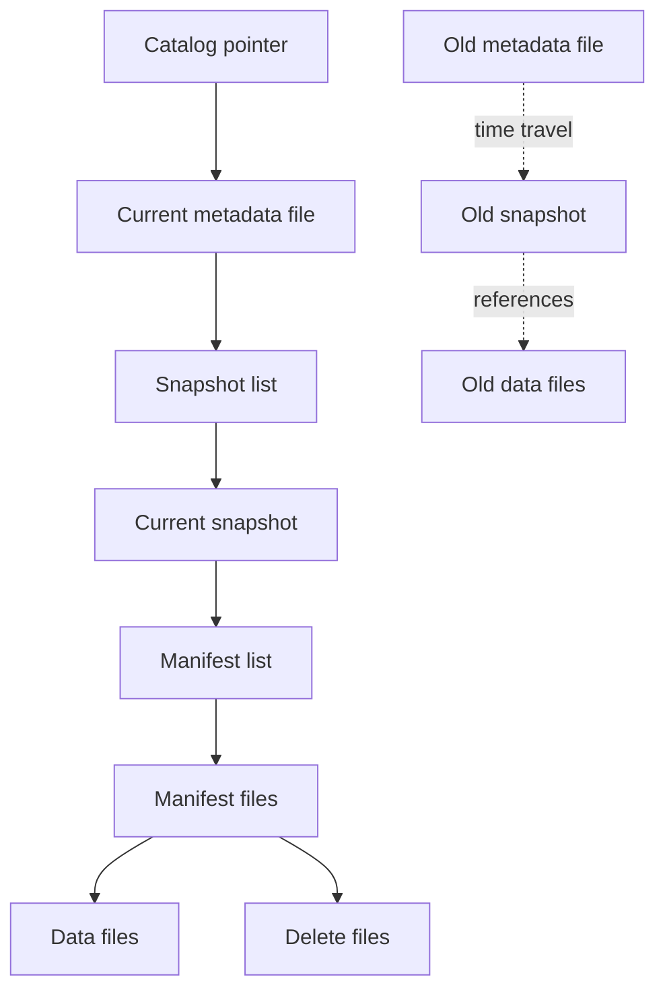

The catalog points to the current metadata file. The metadata file points to snapshots. The current snapshot points to manifest lists. Manifest lists point to manifests. Manifests point to data files and delete files.

A table commit changes metadata.

It does not mutate the already-written data files.

That is the core mental model.

---

## 2. The Iceberg Table as a Commit Log

Think of an Iceberg table as having two logs:

1. a **data log** made of immutable data/delete files,
2. a **metadata log** made of table metadata and snapshots.

A write creates new files first, then attempts an atomic metadata commit.

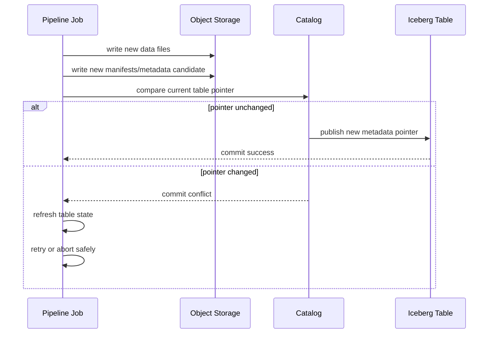

The important invariant:

> A file is not visible to readers merely because it exists in object storage. It is visible only when referenced by a committed snapshot.

This gives you a safe publish boundary.

A Java pipeline should treat Iceberg commit success as the moment the table changed.

Before commit success, files are staged artifacts.

After commit success, files become part of a snapshot.

---

## 3. The Java Engineer’s Mental Model

In Java terms, do not model Iceberg as this:

```java
class LakeTable {
    Path folder;
}
```

Model it closer to this:

```java
record IcebergTableRef(
    String catalogName,
    String namespace,
    String tableName
) {}

record TableSnapshotRef(
    IcebergTableRef table,
    long snapshotId,
    Instant committedAt
) {}

record TableCommitPlan(
    IcebergTableRef table,
    String operation,
    List<DataFileRef> newFiles,
    List<DeleteFileRef> deleteFiles,
    Map<String, String> summary
) {}
```

The folder is an implementation detail.

The durable semantic handle is:

- catalog,
- namespace,
- table,
- snapshot ID,
- schema ID,
- partition spec ID,
- operation summary,
- file-level metadata.

Production Java systems should store these in run manifests and audit ledgers.

---

## 4. Iceberg Operations as Pipeline Boundaries

Iceberg has several table-level operations that map naturally to pipeline patterns.

| Pipeline intent | Iceberg operation shape | Typical use |
|---|---|---|
| Add new facts | append files | append-only event/fact table |
| Replace deterministic partition | overwrite files/partitions | daily batch recompute |
| Apply CDC changes | row-level delete/update/merge pattern | mutable source replica |
| Compact small files | rewrite files | physical optimization |
| Clean old history | expire snapshots | metadata/storage control |
| Remove unreferenced files | remove orphan files | failed writer cleanup |
| Change schema | schema evolution | source contract evolution |
| Change partitioning | partition evolution | query/cost optimization |

A pipeline should never call these as casual file operations.

Each operation has a correctness contract.

---

## 5. Pattern: Append-Only Fact Table

Use append-only Iceberg tables when records are immutable facts.

Examples:

- case status transition event,
- enforcement action created,
- payment posted,
- Kafka canonical event archive,
- audit log,
- sensor measurement,
- immutable CDC changelog.

The invariant:

> The pipeline may add facts, but it must not rewrite the meaning of previously committed facts.

### Table design

```text
regulatory.case_event_fact
  event_id              string
  aggregate_type        string
  aggregate_id          string
  event_type            string
  event_time            timestamp
  source_commit_time    timestamp
  ingestion_time        timestamp
  producer              string
  schema_version        string
  payload               struct<...>
  trace_id              string
  causation_id          string
  correlation_id        string
```

### Commit pattern

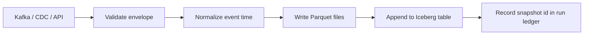

### Java-side run ledger

```java
record IcebergAppendRun(
    UUID runId,
    String table,
    Instant startedAt,
    Instant finishedAt,
    String sourceCheckpoint,
    long outputRecordCount,
    long outputFileCount,
    Long committedSnapshotId,
    String status
) {}
```

The run ledger should answer:

- which source checkpoint produced this snapshot,
- how many records were appended,
- which pipeline version wrote it,
- which contract version validated it,
- whether the commit succeeded,
- what snapshot ID became visible.

### Common mistake

Appending facts without stable `event_id`.

If a job retries and emits the same facts again, you get duplicate facts.

Append-only does not mean duplicate-safe.

Append-only needs one of these:

- upstream exactly-once scoped within source and Iceberg writer,
- event ID + downstream dedupe,
- sink-side merge/upsert pattern,
- run-level overwrite of deterministic partitions.

For audit tables, prefer keeping raw duplicates visible but classified. For serving tables, prefer dedupe/materialization.

---

## 6. Pattern: Deterministic Partition Replace

Use deterministic partition replace when output for a partition can be recomputed completely.

Examples:

- daily regulatory report partition,
- `event_date=2026-07-04` silver table,
- monthly case ageing snapshot,
- hourly aggregate table,
- reference dimension snapshot.

The invariant:

> Given the same input boundary and transform version, recomputing the partition produces the same logical result.

The pipeline writes new files, validates them, then atomically replaces the target partition.

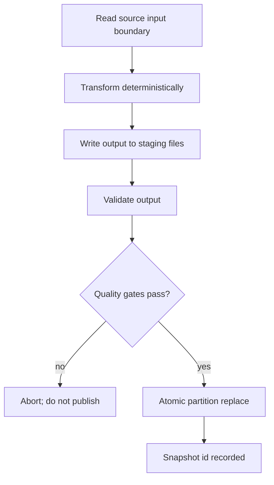

### Why this is safer than delete-then-insert

Bad pattern:

```text
delete old partition
write new partition
```

Failure window:

- delete succeeds,
- write fails,
- readers see missing partition.

Better pattern:

```text
write new files
commit metadata change that swaps visible files atomically
```

Readers either see the old snapshot or the new snapshot.

They should not see a half-published partition.

### Partition replace contract

Every replace job needs a manifest like this:

```yaml
operation: replace_partition
table: regulatory.case_daily_snapshot
partition:
  business_date: 2026-07-04
input_boundary:
  case_events_snapshot_id: 98123001
  case_reference_snapshot_id: 77291011
transform:
  name: case_daily_snapshot_v4
  version: 4.2.0
output:
  expected_partition_count: 1
  record_count: 1203940
  null_case_id_count: 0
commit:
  snapshot_id: 99102102
  committed_at: 2026-07-04T21:10:02Z
```

This is not ceremony.

It is how you defend a report later.

---

## 7. Pattern: CDC Replica Table

A CDC replica table attempts to represent the latest state of an operational table in the lakehouse.

Examples:

- `case_current`,
- `case_assignment_current`,
- `party_current`,
- `license_current`,
- `invoice_current`.

The source emits changes:

```text
INSERT case_id=101 status=OPEN
UPDATE case_id=101 status=UNDER_REVIEW
DELETE case_id=101
```

The Iceberg table stores current state:

```text
case_id=101 status=UNDER_REVIEW deleted=false
```

or removes logically deleted rows depending on retention/audit policy.

### CDC-to-Iceberg challenge

CDC streams are row mutation logs.

Iceberg tables are analytical snapshots.

Mapping mutations to snapshots requires explicit semantics:

- primary key,
- update ordering,
- delete handling,
- late CDC event handling,
- transaction boundary,
- idempotency,
- duplicate event handling,
- schema evolution,
- snapshot cadence.

### CDC table pattern

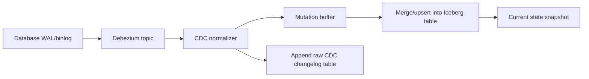

A strong design usually stores both:

1. **raw CDC changelog** as append-only history,
2. **current replica table** as mutable materialization.

Do not throw away the changelog too early.

The changelog is your audit and rebuild source.

### Dedupe key

For Debezium-like CDC, a dedupe key may include:

```text
source_database
source_table
source_partition_or_server
transaction_id
log_position
operation
primary_key
```

Never dedupe CDC solely by business primary key. That collapses multiple legitimate updates into one.

---

## 8. Pattern: Raw Changelog + Current Projection

For regulated systems, prefer this two-table design:

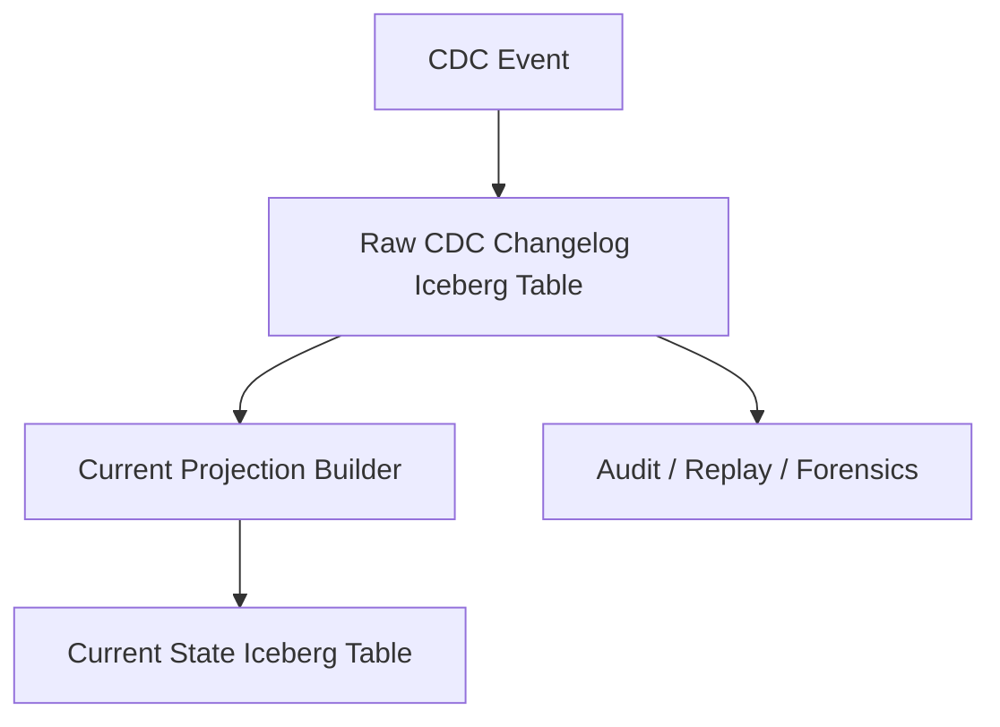

### Raw changelog table

Purpose:

- preserve source mutation history,
- replay materialized state,
- investigate source behavior,
- support correction handling,
- reconstruct previous table versions.

Characteristics:

- append-only,
- partitioned by ingestion date or source commit date,
- contains operation type,
- contains before/after image where available,
- contains source position,
- contains transaction metadata if available,
- keeps schema evolution context.

### Current projection table

Purpose:

- serve analytics on latest state,
- support joins,
- reduce query complexity,
- feed downstream reporting.

Characteristics:

- keyed by business primary key,
- upsert-like semantics,
- delete-aware,
- can be rebuilt from changelog,
- has projection version,
- includes source high-watermark.

### Correctness invariant

> The current projection is disposable if it can be rebuilt from the raw changelog and deterministic transformation logic.

If it cannot be rebuilt, it is not merely a projection. It is a system of record, and you need stronger controls.

---

## 9. Pattern: Snapshot Table for Regulatory Reporting

A reporting snapshot table freezes business state at a decision point.

Examples:

- daily case inventory,
- overdue case snapshot,
- enforcement ageing report,
- SLA breach snapshot,
- monthly supervisory statistics.

Do not confuse a current table with a reporting snapshot.

Current table:

```text
What is the latest known state?
```

Reporting snapshot:

```text
What state did we declare at reporting cut-off X using input versions Y and rules Z?
```

### Snapshot table schema

```text
reporting_date          date
case_id                 string
status                  string
age_days                int
sla_state               string
breach_flag             boolean
source_snapshot_ids     map<string,bigint>
rule_version            string
pipeline_run_id         string
published_at            timestamp
```

### Iceberg role

Iceberg gives you:

- snapshot ID of the output table,
- ability to query older table snapshots,
- metadata history,
- atomic partition publish,
- input/output lineage if captured in run manifest.

Iceberg alone does not give full regulatory defensibility.

You still need:

- source snapshot references,
- rule version,
- code version,
- quality result,
- approval state,
- publication timestamp,
- evidence retention policy.

---

## 10. Schema Evolution Pattern

Iceberg supports schema evolution through metadata.

But safe pipeline evolution is not only a table-format feature.

You still need consumer-aware compatibility rules.

### Safe-ish changes

Usually safer:

- add nullable column,
- add column with default-like downstream handling,
- widen some numeric types if engine support and consumers agree,
- rename column through Iceberg metadata-aware engines,
- reorder columns if readers use field IDs/names correctly.

Risky:

- change semantic meaning while keeping same name,
- narrow type,
- change timestamp timezone semantics,
- make nullable field required,
- drop field still used downstream,
- reuse field meaning,
- change nested structure without consumer migration.

### Pipeline rule

> Iceberg schema evolution protects table metadata. It does not protect business meaning.

You need both:

- table schema compatibility,
- semantic contract compatibility.

### Java contract object

```java
record TableSchemaChange(
    String table,
    int oldSchemaId,
    int newSchemaId,
    List<FieldChange> changes,
    Compatibility compatibility,
    List<String> impactedConsumers,
    String migrationPlan
) {}

enum Compatibility {
    SAFE_AUTOMATIC,
    SAFE_WITH_DEFAULT,
    REQUIRES_DUAL_WRITE,
    REQUIRES_BACKFILL,
    BREAKING
}
```

Every schema change should be classified before deployment.

---

## 11. Partition Evolution Pattern

Traditional Hive-style partitioning bakes partition columns into directory layout.

Changing partition strategy often means rewriting a table.

Iceberg supports partition evolution through metadata. Different files can be written with different partition specs.

That does not mean partitioning becomes irrelevant.

Partitioning still affects:

- query planning,
- file pruning,
- write distribution,
- compaction strategy,
- small file count,
- skew,
- maintenance cost.

### Hidden partitioning mental model

Users query logical columns:

```sql
WHERE event_time >= TIMESTAMP '2026-07-04 00:00:00'
  AND event_time <  TIMESTAMP '2026-07-05 00:00:00'
```

The table can physically partition by transform:

```text
days(event_time)
bucket(32, case_id)
truncate(8, region_code)
```

The user does not need to write `event_date = ...` manually.

### Partition evolution example

Initial table:

```text
partition spec 1:
  days(event_time)
```

After volume grows:

```text
partition spec 2:
  days(event_time), bucket(64, case_id)
```

Old files remain under spec 1. New files use spec 2.

### Production caution

Partition evolution is not a substitute for design.

Bad keys still create bad tables:

- partitioning by high-cardinality raw ID can create too many partitions,
- partitioning by low-cardinality field can create huge partitions,
- partitioning by ingestion date can hurt event-time queries,
- partitioning by event date can make late data management more complex.

### Decision checklist

Ask:

- What are the dominant filters?
- What is the expected data volume per day/hour?
- What is the correction/backfill pattern?
- Are queries mostly by business date, event time, ingestion time, tenant, region, case type?
- Is there a skewed tenant or hot domain?
- How often will old partitions be rewritten?
- How many files will streaming writers create?

---

## 12. Write Distribution and Small File Pattern

Iceberg protects table metadata. It does not automatically make physical files optimal.

Small files kill performance.

They cause:

- high planning overhead,
- high object store request count,
- poor scan throughput,
- large manifests,
- frequent compaction,
- metadata bloat,
- high query latency.

### Small file sources

Common causes:

- streaming writes with tiny micro-batches,
- too many partitions,
- over-parallelized writers,
- low-volume tenants split into separate partitions,
- frequent upserts/deletes,
- poor clustering,
- one file per task attempt,
- backfills writing many small replacement files.

### Pattern: write reasonably, compact intentionally

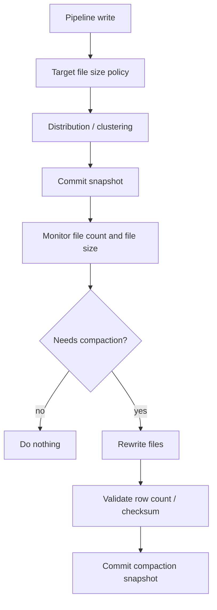

Compaction should preserve logical rows.

A compaction job should be treated as a physical rewrite, not a business transformation.

### Compaction invariant

> A compaction snapshot must not change logical table content except for physical layout and metadata.

Validate:

- record count before/after,
- primary-key distinct count where applicable,
- aggregate checksum for stable columns,
- partition coverage,
- delete file application semantics,
- snapshot lineage.

---

## 13. Delete Semantics Pattern

Deletes are dangerous because the word “delete” can mean several things.

| Delete type | Meaning | Typical table |
|---|---|---|
| Source delete | Source row was deleted | CDC changelog/current replica |
| Business cancellation | Entity still exists but state changed | event/fact table |
| Privacy erasure | Data must be removed or anonymized | PII tables |
| Correction | Previous fact was wrong | audit/correction model |
| Physical cleanup | Files no longer referenced | table maintenance |

Never implement all deletes the same way.

### In append-only fact tables

Prefer correction events over destructive delete:

```text
CaseEscalated
CaseEscalationCorrected
CaseEscalationWithdrawn
```

The history remains explainable.

### In current-state tables

Use delete-aware projection:

```text
case_id=101 deleted=true deleted_at=...
```

or physically remove row depending on access and retention requirements.

### In PII tables

Use a governed erasure workflow:

- classify columns,
- identify affected tables/snapshots,
- apply deletion/anonymization policy,
- validate removal from current accessible state,
- control snapshot retention if old snapshots contain PII,
- record evidence.

Snapshot history can conflict with privacy retention needs. You must design retention with governance, not as an afterthought.

---

## 14. Branching and Publication Pattern

Some Iceberg environments support table branching and tagging. Even if your deployment does not use those features, the architectural pattern is useful.

You need separate concepts for:

- staging data,
- validated data,
- published data,
- report-certified data.

### Publication flow

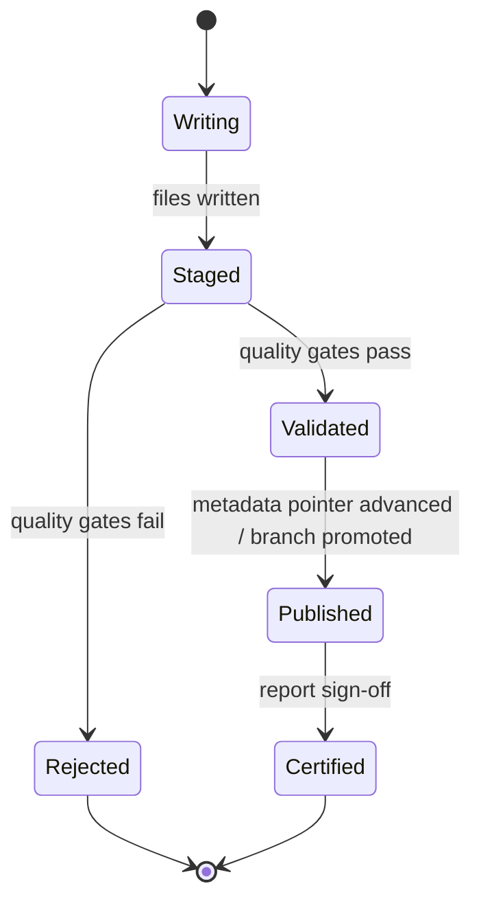

### Without branches

Use separate tables or namespaces:

```text
staging.case_daily_snapshot
validated.case_daily_snapshot
published.case_daily_snapshot
```

### With branches/tags

Use table references:

```text
case_daily_snapshot@staging
case_daily_snapshot@main
case_daily_snapshot#report_2026_07_04
```

The invariant is the same:

> Consumers should read only from a published/certified boundary, not from arbitrary in-progress output.

---

## 15. Snapshot Retention Pattern

Snapshots are powerful but not free.

They preserve table history and enable time travel, but they keep metadata and possibly data files alive.

If you never expire snapshots:

- metadata grows,
- planning slows,
- storage cost grows,
- maintenance gets harder,
- PII retention becomes risky.

If you expire snapshots too aggressively:

- audits lose reproducibility,
- backfills lose reference points,
- rollback becomes impossible,
- reports cannot be defended,
- orphan cleanup may delete files still needed by slow writers if configured unsafely.

### Retention policy by table class

| Table class | Suggested retention thinking |
|---|---|
| Raw immutable audit | long retention, governed by policy |
| Current replica | enough for rollback and rebuild validation |
| Temporary staging | short retention |
| Published report | retention aligned to legal/reporting obligations |
| PII-heavy derived table | minimal necessary retention with privacy review |
| Compaction-heavy serving table | balance rollback window vs metadata cost |

### Run manifest fields

```yaml
table: regulatory.case_daily_snapshot
snapshot_id: 99102102
snapshot_type: published_report
retention_class: regulatory_report_7y
contains_pii: true
legal_hold: false
owner: enforcement-data-platform
```

Do not let snapshot retention be decided only by storage cost.

It is a governance decision.

---

## 16. Orphan File Cleanup Pattern

A failed writer may leave files in object storage that are not referenced by any committed snapshot.

These are orphan files.

Orphan cleanup is necessary, but dangerous if run incorrectly.

The dangerous scenario:

1. writer is still running,
2. writer has created data files,
3. cleanup job scans storage,
4. files are not yet referenced by committed snapshot,
5. cleanup deletes them,
6. writer tries to commit references to missing files.

### Safe cleanup principle

> Only remove files older than the maximum expected duration of any in-progress write, plus safety margin.

### Orphan cleanup runbook

```text
1. Identify target table/location.
2. Confirm no long-running writers beyond safety threshold.
3. Use conservative older-than interval.
4. Dry-run if supported.
5. Delete only files unreferenced by metadata.
6. Record deleted file count and bytes.
7. Alert if orphan volume is abnormal.
```

High orphan volume indicates pipeline instability:

- frequent failed writes,
- speculative task attempts,
- commit conflicts,
- aborted backfills,
- broken staging process,
- object storage permission issues.

Do not treat cleanup as the fix. It is evidence of a deeper write-path problem.

---

## 17. Metadata Maintenance Pattern

Iceberg metadata can grow.

Maintenance categories:

- compact data files,
- rewrite manifests,
- expire snapshots,
- remove orphan files,
- clean old metadata files,
- compact delete files,
- rewrite sort/clustering layout.

### Maintenance dependency order

A simplified safe order:

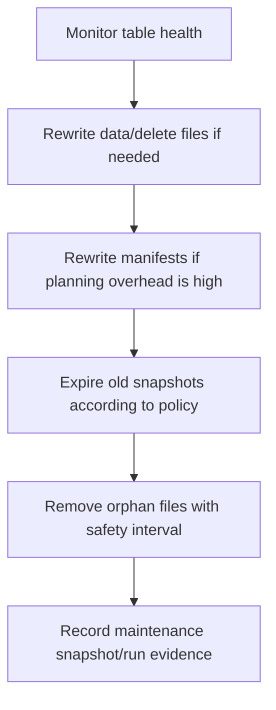

The exact order depends on engine and table state, but the principle is stable:

- do not delete history you still need,
- do not remove files that may still be referenced,
- do not let maintenance hide data correctness changes,
- record maintenance as a first-class pipeline operation.

### Maintenance SLOs

Track:

- file count per partition,
- average file size,
- manifest count,
- metadata file size,
- snapshot count,
- delete file count,
- query planning latency,
- compaction backlog,
- orphan bytes,
- failed commit rate,
- commit retry count.

---

## 18. Streaming Writes to Iceberg

Streaming to Iceberg is attractive:

```text
Kafka -> Flink/Spark Structured Streaming -> Iceberg
```

But streaming writes often create many small files and frequent snapshots.

### Streaming write design choices

| Dimension | Choice |
|---|---|
| Commit cadence | per checkpoint, per micro-batch, time-based |
| File size | small low-latency vs larger efficient files |
| Partitioning | event time vs ingestion time vs tenant/domain |
| Late data | append to old partition vs correction table |
| Deletes | merge/delete support vs append corrections |
| Recovery | checkpoint state + Iceberg snapshot consistency |
| Maintenance | compaction and snapshot expiration cadence |

### Pattern: streaming bronze, batch silver

For many systems, this is safer:

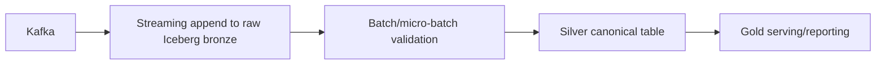

Do not force every transformation into the streaming writer.

Use streaming where latency matters. Use batch where deterministic validation and recompute matter more.

---

## 19. Iceberg as a Backfill Target

Backfill is where many Iceberg pipelines fail.

A backfill can:

- duplicate rows,
- overwrite live output,
- create incompatible files,
- publish bad historical partitions,
- explode file count,
- violate retention assumptions,
- break downstream materializations.

### Backfill isolation pattern

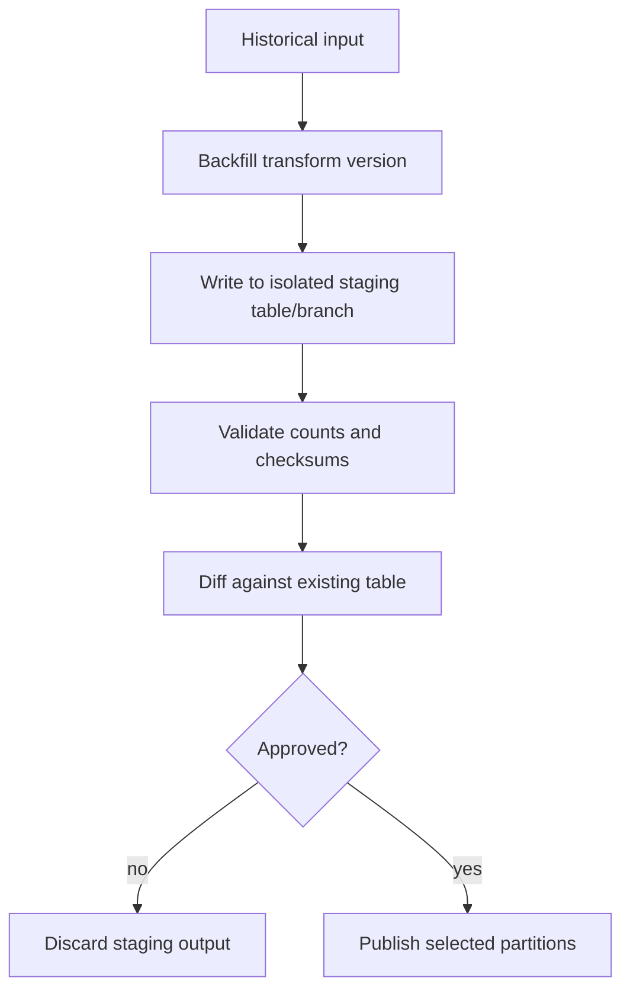

### Backfill manifest

```yaml
mode: backfill
table: regulatory.case_event_silver
backfill_window:
  start: 2025-01-01
  end: 2025-12-31
source:
  raw_table_snapshot_id: 8123001
transform:
  name: case_event_canonicalizer
  version: 3.4.1
isolation:
  staging_table: staging.case_event_silver_backfill_20260704
validation:
  row_count: 891230123
  duplicate_event_id_count: 0
  rejected_count: 1289
publish:
  strategy: replace_partitions
  approved_by: data-platform-review
```

### Backfill invariant

> A backfill should be reversible until it crosses the publish boundary.

Once published, it should be traceable and restatable.

---

## 20. Exactly-Once Boundary with Iceberg

Iceberg provides atomic table commits.

That does not automatically make the entire pipeline exactly-once.

Consider:

```text
Kafka -> Flink -> Iceberg -> downstream notification
```

The Iceberg commit may be atomic, but the downstream notification is outside the Iceberg transaction.

### Boundary classification

| Boundary | Guarantee style |
|---|---|
| write files before commit | invisible until committed |
| metadata commit | atomic table state transition |
| retry after unknown commit outcome | must inspect table snapshot/commit summary |
| external side effect after commit | not covered by Iceberg |
| source checkpoint + table commit | must be coordinated by engine/checkpoint protocol |

### Pattern: commit summary as recovery evidence

Every write should include enough commit summary metadata to identify whether a retry already succeeded.

Example summary fields:

```text
pipeline.run.id
pipeline.version
source.checkpoint.start
source.checkpoint.end
contract.version
transform.version
input.snapshot.ids
output.record.count
```

On retry after unknown outcome:

1. refresh table,
2. inspect recent snapshots,
3. check commit summary for same run ID,
4. if found, mark run as committed,
5. if not found, retry safely.

Unknown outcome must not become duplicate output.

---

## 21. Iceberg with Kafka CDC: Design Blueprint

A production CDC-to-Iceberg architecture usually needs multiple tables.

```mermaid
flowchart TD
    DB[(Operational DB)] --> DZ[Debezium]
    DZ --> K1[Kafka CDC topic]
    K1 --> N[CDC normalizer Java/Flink]
    N --> R[Raw CDC changelog Iceberg]
    R --> C[Canonical event table]
    R --> P[Current state projection]
    C --> G[Gold analytical products]
    P --> G
    R --> A[Audit / replay / forensics]
```

### Table set

| Table | Purpose | Mutation style |
|---|---|---|
| raw CDC changelog | preserve source changes | append-only |
| canonical event table | domain-level meaning | append-only plus corrections |
| current state table | latest analytical state | upsert/delete-aware |
| report snapshot table | frozen outputs | partition replace |
| rejected event table | invalid/quarantined data | append-only |

### Why not one table?

Because one table cannot simultaneously optimize for:

- raw forensic replay,
- clean canonical semantics,
- latest state queries,
- immutable reporting,
- rejected data analysis.

Trying to force one table to do everything produces ambiguous semantics.

---

## 22. Iceberg with Flink

Flink is commonly used for low-latency stream processing into Iceberg.

Core concerns:

- checkpoint alignment with Iceberg commits,
- exactly-once sink behavior within Flink/Iceberg support boundary,
- file rolling policy,
- partition fan-out,
- late events,
- stateful dedupe before write,
- sink commit failure recovery,
- compaction schedule.

### Flink-to-Iceberg pattern

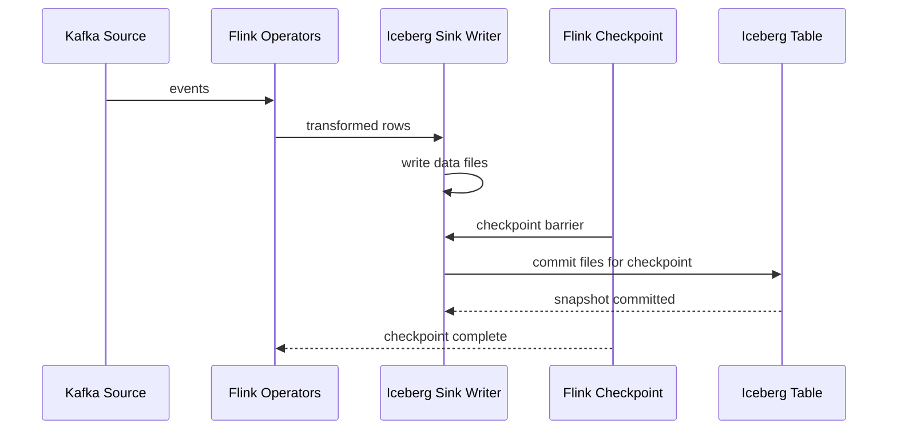

The important question is not “does it write?”

The important question is:

> What happens if the job fails after files are written but before or during commit?

The answer depends on engine integration and sink implementation. Read the connector guarantee, then test failure scenarios.

---

## 23. Iceberg with Spark

Spark is commonly used for:

- large batch transforms,
- partition replace,
- compaction,
- backfill,
- quality profiling,
- historical joins,
- report publication.

Spark SQL pattern:

```sql
MERGE INTO lake.case_current t
USING staging.case_changes s
ON t.case_id = s.case_id
WHEN MATCHED AND s.op = 'D' THEN DELETE
WHEN MATCHED THEN UPDATE SET *
WHEN NOT MATCHED AND s.op <> 'D' THEN INSERT *;
```

But do not treat `MERGE` as a magic correctness button.

You still need:

- deterministic source window,
- dedupe before merge,
- conflict handling,
- quality checks,
- output row count validation,
- snapshot capture,
- downstream notification policy.

### Java Spark pattern

```java
Dataset<Row> changes = spark.read()
    .format("iceberg")
    .load("lake.raw_case_cdc")
    .where("source_commit_time >= timestamp '2026-07-04 00:00:00'");

Dataset<Row> deduped = changes
    .withColumn("rn", functions.row_number().over(windowSpec))
    .where("rn = 1")
    .drop("rn");

deduped.createOrReplaceTempView("case_changes_window");

spark.sql("""
    MERGE INTO lake.case_current t
    USING case_changes_window s
    ON t.case_id = s.case_id
    WHEN MATCHED AND s.op = 'D' THEN DELETE
    WHEN MATCHED THEN UPDATE SET *
    WHEN NOT MATCHED AND s.op <> 'D' THEN INSERT *
""");
```

The code is only the visible part.

The production design is the boundary around it.

---

## 24. Iceberg Table Naming Pattern

Names should encode semantic role, not implementation accident.

Bad:

```text
case_data
case_data_v2
case_data_new
case_data_final
case_data_final2
```

Better:

```text
raw.case_cdc_changelog
bronze.case_event_raw
silver.case_event_canonical
gold.case_sla_daily_snapshot
serving.case_current_projection
quarantine.case_event_rejected
```

### Naming dimensions

- lifecycle zone,
- domain,
- entity/event,
- semantic role,
- granularity,
- mutability,
- audience.

### Example

```text
silver.enforcement_case_event_canonical
```

Meaning:

- silver: validated/canonical layer,
- enforcement: domain,
- case_event: entity/event family,
- canonical: semantic role.

The name is part of the contract.

---

## 25. Catalog Pattern

The catalog is the authority for table metadata pointer.

Catalog selection affects:

- concurrent commit behavior,
- namespace management,
- security integration,
- multi-engine access,
- operational tooling,
- disaster recovery,
- catalog availability as a pipeline dependency.

Common catalog types include:

- REST catalog,
- Hive Metastore,
- AWS Glue Data Catalog,
- JDBC catalog,
- engine-specific catalogs.

### Catalog failure model

If catalog is down:

- writes cannot commit,
- readers may fail to resolve current table pointer,
- table creation/evolution stops,
- metadata refresh fails.

### Design rule

> Treat catalog as part of the data platform control plane, not as a passive configuration database.

Monitor:

- commit latency,
- commit conflict rate,
- catalog availability,
- metadata refresh failures,
- permission errors,
- namespace drift.

---

## 26. Concurrency Pattern

Multiple writers can target the same table.

Examples:

- streaming ingestion appends recent data,
- batch backfill replaces old partitions,
- compaction rewrites files,
- schema migration updates metadata,
- ad hoc repair job publishes correction.

These operations can conflict.

### Writer classification

| Writer | Risk |
|---|---|
| Append-only independent partitions | lower |
| Concurrent appends same partition | small files/skew |
| Partition replace | conflicts with writers in same partition |
| Merge/upsert | conflicts around same keys/files |
| Compaction | can conflict with concurrent data writes |
| Schema evolution | can break active writers/readers |

### Control strategy

- declare table ownership,
- serialize high-risk operations,
- isolate backfills,
- schedule compaction carefully,
- use conflict retry policies,
- capture writer ID in snapshot summary,
- reject unmanaged writers.

### Table writer registry

```yaml
table: silver.case_event_canonical
allowed_writers:
  - name: case-event-stream-writer
    operation: append
    owner: platform-data
  - name: case-event-backfill-job
    operation: replace_partitions
    owner: platform-data
    requires_approval: true
  - name: iceberg-compaction-job
    operation: rewrite_files
    owner: data-platform-ops
```

Without writer governance, table correctness becomes social luck.

---

## 27. Quality Gates before Commit

Some quality checks happen before writing files.

Some happen after files are staged but before publish.

Some happen after snapshot commit.

### Pre-write checks

- schema can be decoded,
- required envelope fields exist,
- PII policy can be evaluated,
- event time is parseable,
- primary key exists.

### Pre-commit checks

- output row count within expected bounds,
- no null primary keys,
- duplicate key count acceptable,
- partition range correct,
- file count/file size sane,
- rejected rows routed.

### Post-commit checks

- snapshot visible,
- row count query matches manifest count where possible,
- downstream freshness updated,
- lineage event emitted,
- run ledger closed.

### Quality gate decision

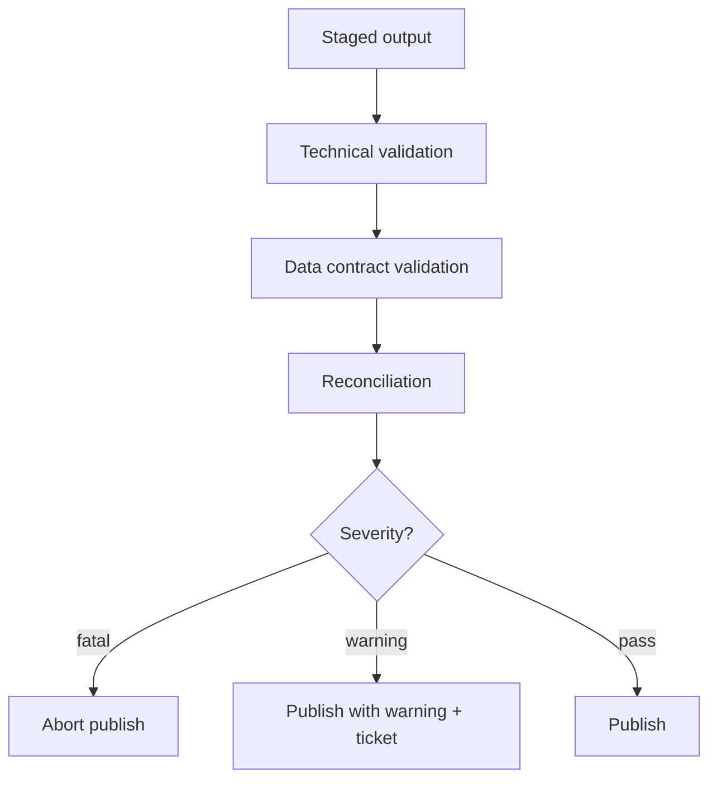

Do not publish first and validate later for tables with regulatory or financial impact unless you explicitly support correction and restatement.

---

## 28. Lineage Pattern

Iceberg snapshots give table history.

They do not automatically give full pipeline lineage.

You need to connect:

- input tables and snapshots,
- source Kafka offsets,
- source database log positions,
- transform version,
- contract version,
- output table snapshot,
- quality report,
- orchestrator run ID.

### Lineage event

```json
{
  "eventType": "DATASET_VERSION_PRODUCED",
  "job": "case-sla-daily-snapshot",
  "runId": "2ae7c7d2-9fc2-4a42-9b7e-f1f0aef9f981",
  "inputs": [
    {"table": "silver.case_event_canonical", "snapshotId": 90123},
    {"table": "silver.case_current", "snapshotId": 81231}
  ],
  "output": {"table": "gold.case_sla_daily_snapshot", "snapshotId": 99102},
  "transformVersion": "case-sla-v5.1.0",
  "qualityReportId": "dq-20260704-001"
}
```

This event can be emitted to OpenLineage-compatible systems or an internal lineage registry.

The key point is not the tool.

The key point is preserving dataset version relationships.

---

## 29. Auditability Pattern

Iceberg gives powerful audit building blocks, but your pipeline must make them meaningful.

For every published table snapshot, record:

- why it was produced,
- which job produced it,
- which code version produced it,
- which input versions were used,
- what validation passed,
- who approved it if approval is needed,
- what changed from previous snapshot,
- how long it must be retained.

### Report evidence bundle

```text
report_evidence/
  report_id: SLA-DAILY-2026-07-04
  output_table: gold.case_sla_daily_snapshot
  output_snapshot_id: 99102102
  input_snapshots:
    silver.case_event_canonical: 8810129
    silver.case_current_projection: 8810133
  transform_version: case_sla_daily_v5.1.0
  contract_version: case_sla_contract_v3
  quality_report: dq-99102102.json
  reconciliation_report: recon-99102102.json
  approval_record: approval-20260704-ops-risk
```

In regulatory systems, a table snapshot without evidence is not enough.

You need explainable provenance.

---

## 30. Security and PII Pattern

Iceberg stores data files and metadata files.

Metadata may contain:

- column names,
- partition values,
- file paths,
- statistics,
- snapshot summaries,
- table properties.

Do not put sensitive values casually into:

- partition columns,
- file paths,
- snapshot summary properties,
- branch/tag names,
- table names,
- quality report names.

### Bad partitioning

```text
partition by national_id
```

This can leak sensitive values into paths/metadata depending on layout and engine.

### Better

- partition by non-sensitive date/domain fields,
- bucket/hash sensitive keys where necessary,
- tokenize before lakehouse exposure,
- restrict metadata access,
- classify tables,
- align snapshot retention with privacy policy.

### PII table property example

```yaml
table: silver.party_identity_canonical
classification: restricted_pii
contains_direct_identifiers: true
snapshot_retention: privacy_review_required
default_access: deny
allowed_purposes:
  - case_investigation
  - statutory_reporting
```

Security is not only row/column access. It includes metadata, history, and retention.

---

## 31. Anti-Patterns

### Anti-pattern 1: Folder thinking

Treating table location as the table.

Fix: reason through catalog pointer, metadata file, snapshot, manifest, file references.

### Anti-pattern 2: One table for all semantics

Using one Iceberg table for raw history, latest state, analytics, and reports.

Fix: split by semantic role.

### Anti-pattern 3: Append everything forever

Appending updates without dedupe, merge, or projection semantics.

Fix: distinguish facts from mutable state.

### Anti-pattern 4: Delete as correction

Physically deleting data to fix a business mistake.

Fix: use correction events or restatement workflow unless policy requires erasure.

### Anti-pattern 5: No run manifest

Relying only on table snapshots.

Fix: store pipeline run metadata and input/output snapshot links.

### Anti-pattern 6: Compaction without validation

Assuming physical rewrite cannot corrupt meaning.

Fix: validate counts/checksums/partition coverage.

### Anti-pattern 7: Infinite snapshot retention by accident

Keeping every snapshot because nobody owns retention.

Fix: classify table retention intentionally.

### Anti-pattern 8: Aggressive orphan cleanup

Deleting files too soon and corrupting in-progress writers.

Fix: use conservative safety interval and writer awareness.

### Anti-pattern 9: Schema changes without consumer impact analysis

Trusting Iceberg metadata evolution to solve downstream meaning.

Fix: maintain semantic contract registry.

### Anti-pattern 10: Streaming writer creates millions of tiny files

Optimizing only for latency.

Fix: tune commit cadence, file size, partitioning, and compaction.

---

## 32. Implementation Blueprint: Java Pipeline to Iceberg

A production Java pipeline targeting Iceberg should have these components.

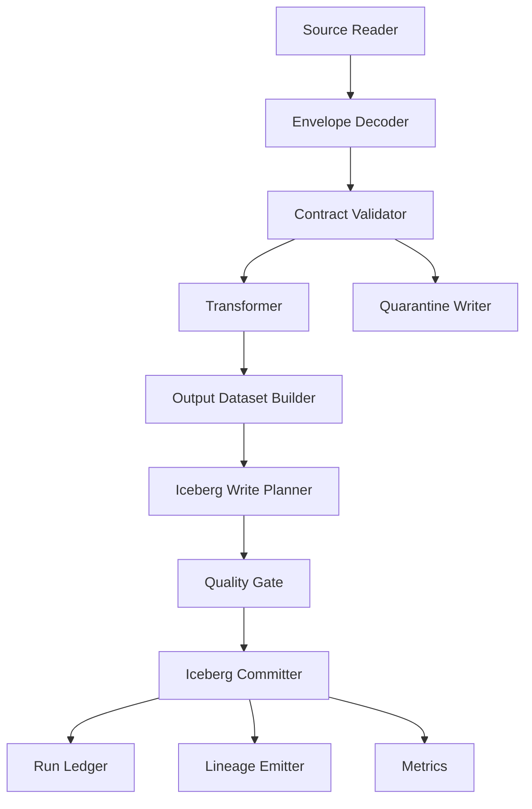

### Interfaces

```java
interface TableWritePlanner<I> {
    TableCommitPlan plan(WriteContext context, List<I> records);
}

interface TableQualityGate {
    QualityDecision evaluate(TableCommitPlan plan, DatasetProfile profile);
}

interface IcebergCommitter {
    CommitResult commit(TableCommitPlan plan) throws CommitConflictException;
}

record CommitResult(
    String table,
    long snapshotId,
    Instant committedAt,
    Map<String, String> summary
) {}
```

The design separates:

- transformation,
- write planning,
- validation,
- commit,
- ledgering,
- lineage.

Do not bury all of that inside one Spark SQL string.

---

## 33. Failure Injection Tests

Iceberg pipeline tests should simulate failures around commit boundaries.

### Test scenarios

1. fail before writing files,
2. fail after writing files before commit,
3. fail during commit with unknown outcome,
4. commit conflict from concurrent writer,
5. schema changed between planning and commit,
6. partition replaced by another job,
7. object storage write succeeds but catalog commit fails,
8. quality gate fails after files are staged,
9. compaction runs while append job is active,
10. orphan cleanup sees staged files.

### Expected behavior

| Failure | Expected behavior |
|---|---|
| before files | no table change |
| after files before commit | orphan files possible, no visible table change |
| unknown commit | inspect snapshots before retry |
| commit conflict | refresh and retry/abort according to operation |
| quality fail | no publish, quarantine/report failure |
| cleanup race | cleanup must not delete recent staged files |

Correctness is not proven by a happy-path write.

It is proven by recovery behavior.

---

## 34. Production Readiness Checklist

Before promoting an Iceberg pipeline, answer these:

### Table semantics

- Is the table append-only, current-state, snapshot, or temporary?
- What is the primary semantic key?
- What is the time model?
- Are corrections represented explicitly?
- Are deletes source deletes, business cancellations, privacy erasures, or physical cleanup?

### Write semantics

- What operation is used: append, overwrite, merge, rewrite?
- What is the commit boundary?
- How is unknown commit outcome resolved?
- Is the write idempotent under retry?
- Are concurrent writers allowed?

### Schema/partition

- What compatibility rules apply?
- Who approves schema changes?
- What partition spec is used?
- What happens when partition strategy evolves?
- Are sensitive values exposed through partitioning?

### Quality/reconciliation

- What checks run before commit?
- What checks run after commit?
- What is fatal vs warning?
- Where do rejected records go?
- How are counts/checksums captured?

### Maintenance

- What file size target exists?
- Who runs compaction?
- What snapshot retention applies?
- What orphan cleanup threshold is safe?
- What metrics indicate metadata bloat?

### Audit/governance

- Is output snapshot ID recorded?
- Are input snapshot IDs recorded?
- Is transform version recorded?
- Is quality report linked?
- Does retention match regulatory/privacy obligations?

---

## 35. Final Mental Model

Iceberg gives Java pipeline engineers a powerful table abstraction, but the abstraction is not a replacement for engineering discipline.

Use this model:

```text
Source boundary
  -> contract validation
  -> deterministic transform
  -> staged files
  -> quality gate
  -> atomic Iceberg commit
  -> run ledger
  -> lineage event
  -> maintenance lifecycle
```

The table is not the files.

The table is the committed metadata graph.

The snapshot is not just history.

It is a reproducible dataset version.

The commit is not just a write.

It is a production boundary.

The maintenance job is not housekeeping.

It is part of table correctness and cost control.

When you use Iceberg this way, it becomes more than storage. It becomes a backbone for replayable, auditable, evolvable, production-grade Java data pipelines.

---

## References

- Apache Iceberg documentation and specification: snapshots, metadata, schema evolution, partition evolution, hidden partitioning, maintenance operations, Spark procedures, Java APIs.
- Apache Spark documentation: SQL, DataFrame/Dataset, Structured Streaming, Iceberg integrations through table catalogs/connectors.
- Apache Flink documentation: stream processing, checkpointing, table/connector semantics.
- Debezium documentation: CDC source events and outbox pattern.
- OpenLineage concepts: dataset/job/run lineage for data pipeline observability.
