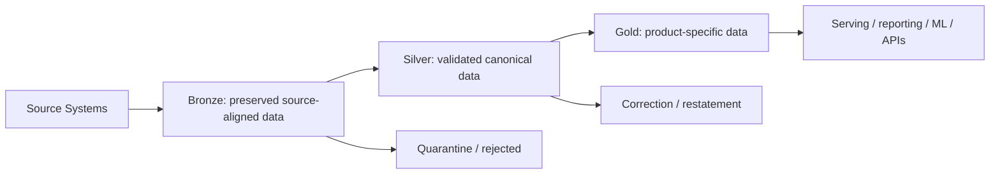
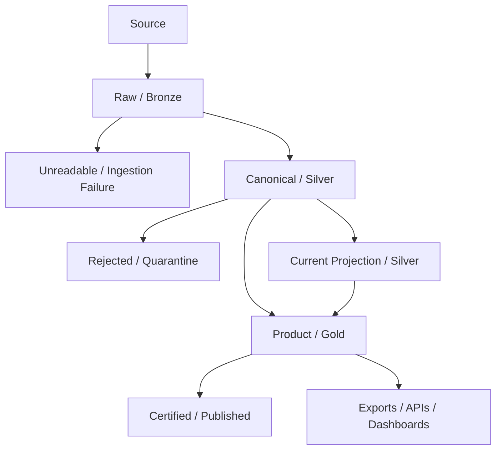
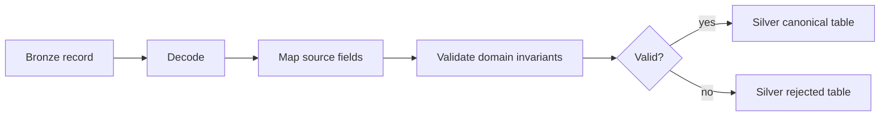
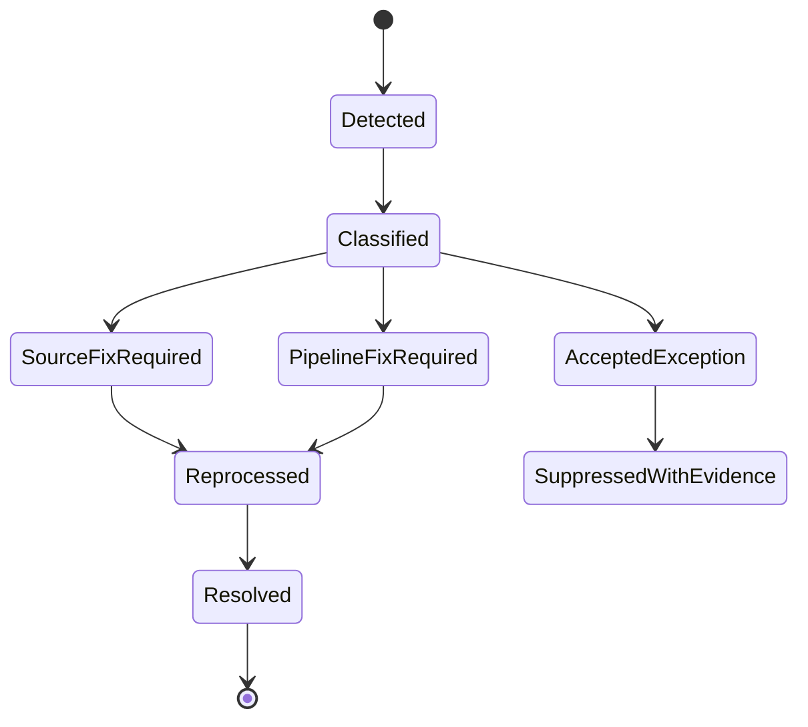
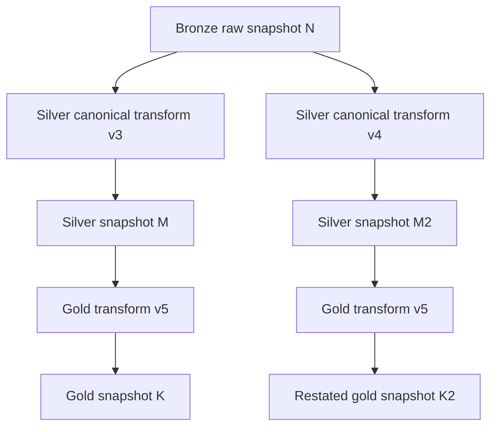
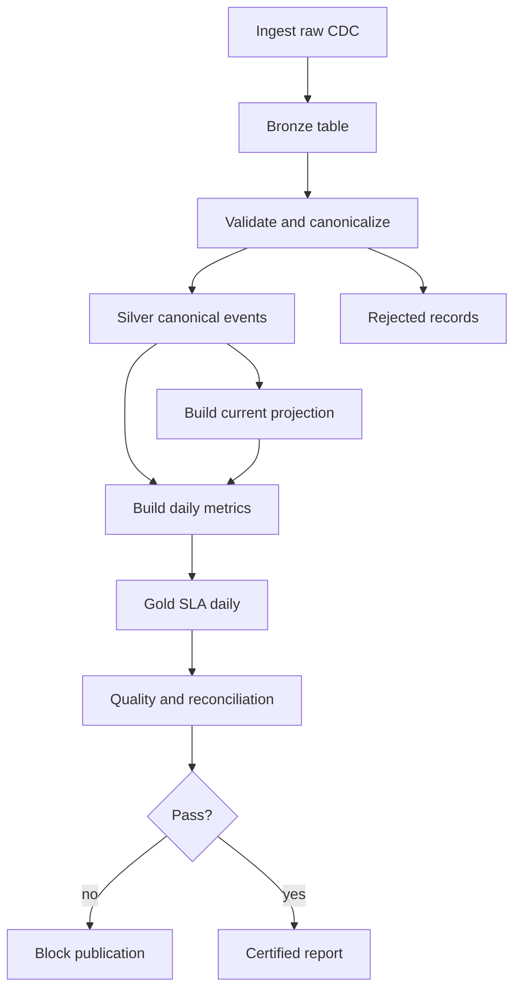

# Part 054 — Bronze / Silver / Gold Without Cargo Cult

Bronze, silver, and gold are useful words.

They are also dangerously easy to misuse.

Many teams adopt the three-layer model like this:

```text
raw data -> bronze
clean data -> silver
business data -> gold
```

Then the system slowly degrades:

- bronze becomes a dumping ground,
- silver becomes “whatever is not raw”,
- gold becomes a pile of dashboard tables,
- nobody knows where validation belongs,
- correction logic is duplicated,
- PII leaks across layers,
- backfills are unsafe,
- every pipeline adds layers even when not needed,
- quality is implied by layer name instead of enforced by contract.

This part is about using the layered lakehouse model without cargo cult.

The goal is not to memorize bronze/silver/gold.

The goal is to understand **what responsibility each boundary owns**.

---

## 1. The Layer Names Are Not the Architecture

Layer names are labels.

The architecture is the set of invariants.

A layer is useful only if crossing it means something concrete.

Bad boundary:

```text
Data moved from table A to table B.
```

Good boundary:

```text
Data crossed from raw-source preservation into validated canonical semantics.
```

Even better:

```text
Data crossed from raw append-only capture into a canonical event model after schema validation, identity normalization, event-time validation, PII classification, duplicate classification, and rejection routing.
```

That is a real boundary.

---

## 2. A Better Mental Model

Instead of thinking:

```text
bronze -> silver -> gold
```

Think:

```text
capture -> understand -> serve
```

Or more explicitly:

```text
preserve source truth
  -> establish platform truth
  -> publish product truth
```



Bronze is not low quality by definition.

Silver is not “cleaned bronze” in a vague sense.

Gold is not “final data”.

Each layer has a different job.

---

## 3. The Real Contract of Bronze

Bronze exists to preserve source-aligned facts with minimal irreversible interpretation.

The bronze invariant:

> Bronze should make source data durable, replayable, traceable, and inspectable without pretending it is already semantically correct.

Bronze usually owns:

- raw source payload,
- source metadata,
- ingestion metadata,
- source checkpoint,
- schema-at-ingestion,
- decode status,
- ingestion timestamp,
- producer identity,
- tenant/domain routing,
- privacy classification if detectable,
- file/API/CDC/Kafka source position,
- rejection reason for unreadable records.

Bronze should not usually own:

- complex business rules,
- derived KPIs,
- consumer-specific joins,
- final reporting semantics,
- destructive correction,
- ambiguous dedupe that loses source history.

### Bronze table examples

```text
bronze.case_cdc_raw
bronze.case_event_kafka_raw
bronze.case_api_response_raw
bronze.case_file_ingestion_raw
bronze.party_reference_raw
```

### Bronze row example

```json
{
  "raw_payload": "{...}",
  "source_system": "case-management-db",
  "source_table": "case",
  "source_operation": "UPDATE",
  "source_position": "lsn:349923499",
  "source_commit_time": "2026-07-04T12:01:09Z",
  "ingestion_time": "2026-07-04T12:01:13Z",
  "schema_fingerprint": "sha256:...",
  "decode_status": "SUCCESS",
  "ingestion_run_id": "...",
  "trace_id": "..."
}
```

Bronze preserves evidence.

It should be possible to ask:

- what did the source send,
- when did we ingest it,
- under which schema did we decode it,
- which source checkpoint contained it,
- which raw record produced a downstream canonical record,
- why was a record rejected.

---

## 4. Bronze Is Not a Trash Can

A common mistake is treating bronze as ungoverned storage.

That fails in production.

Bronze still needs rules:

- location and naming standards,
- retention policy,
- access control,
- encryption,
- PII classification,
- schema capture,
- ingestion ledger,
- source ownership,
- replay contract,
- basic technical validation.

### Technical validations at bronze

Bronze does not need to prove business correctness, but it should prove ingestibility:

- payload is readable or explicitly marked unreadable,
- source identity is known,
- ingestion timestamp exists,
- source checkpoint exists,
- file was complete,
- API page was fully retrieved,
- CDC event has source position,
- Kafka event has topic/partition/offset,
- record can be routed to the right domain.

### Bronze rejection

If the pipeline cannot even classify or persist the raw record safely, use an ingestion failure lane:

```text
ingestion_failure.case_raw_unreadable
```

This is different from silver-level business rejection.

---

## 5. The Real Contract of Silver

Silver exists to establish canonical, validated, reusable semantics.

The silver invariant:

> Silver data should be understandable without knowing every source-system accident, and reusable without embedding a specific dashboard’s business logic.

Silver owns:

- canonical field names,
- normalized types,
- stable identifiers,
- event-time normalization,
- dedupe classification,
- source-to-domain mapping,
- schema compatibility enforcement,
- data quality validation,
- rejection/quarantine routing,
- canonical event modeling,
- current-state projections,
- reference data normalization,
- correction semantics.

Silver should not usually own:

- report-specific aggregation,
- dashboard-specific formatting,
- ML feature leakage,
- organization-specific presentation rules,
- ad hoc analyst transformations that are not governed.

### Silver table examples

```text
silver.case_event_canonical
silver.case_current_projection
silver.case_assignment_current
silver.party_canonical
silver.regulatory_calendar
silver.case_event_rejected
```

### Silver canonical event example

```json
{
  "event_id": "case-101:status:349923499",
  "aggregate_id": "case-101",
  "aggregate_type": "CASE",
  "event_type": "CASE_STATUS_CHANGED",
  "event_time": "2026-07-04T12:01:09Z",
  "business_effective_time": "2026-07-04T00:00:00+07:00",
  "previous_status": "OPEN",
  "new_status": "UNDER_REVIEW",
  "source_record_ref": {
    "table": "bronze.case_cdc_raw",
    "snapshot_id": 981231,
    "source_position": "lsn:349923499"
  },
  "contract_version": "case-event-v3",
  "quality_status": "VALID"
}
```

Silver should make downstream consumers less coupled to source chaos.

But silver must not lie.

When a source ambiguity cannot be resolved, silver should preserve the ambiguity or reject the record with evidence.

---

## 6. Silver Is the Semantic Choke Point

Silver is where teams often under-invest.

They move too quickly from raw data to gold dashboards.

That creates duplicated logic:

```text
Dashboard A defines active case one way.
Dashboard B defines it differently.
ML feature job defines it a third way.
Regulatory export defines it a fourth way.
```

A strong silver layer centralizes reusable semantics:

- active case definition,
- valid escalation event,
- official business calendar,
- case age calculation base fields,
- canonical party identity,
- canonical assignment history,
- deduped event identity,
- source deletion semantics,
- correction model.

Silver should be boring, explicit, and heavily reviewed.

It is the place where data engineering becomes domain engineering.

---

## 7. The Real Contract of Gold

Gold exists to serve a specific product, decision, report, API, dashboard, ML feature set, or external obligation.

The gold invariant:

> Gold should be optimized for a declared use case and should be traceable back to reusable silver semantics.

Gold owns:

- business aggregation,
- dimensional modeling,
- report snapshots,
- SLA metrics,
- dashboard-friendly shape,
- denormalized serving tables,
- export-ready datasets,
- ML feature tables,
- product-specific freshness SLO,
- consumer-specific access policy,
- publication/certification state.

Gold should not usually own:

- raw source decoding,
- hidden source-specific patches,
- canonical identity rules,
- undocumented fixes,
- untraceable manual edits.

### Gold table examples

```text
gold.case_sla_daily_snapshot
gold.case_inventory_monthly_report
gold.enforcement_action_dashboard
gold.case_risk_feature_daily
gold.regulatory_breach_export
gold.executive_case_health_metrics
```

### Gold report row example

```json
{
  "reporting_date": "2026-07-04",
  "regulatory_unit": "UNIT-A",
  "open_case_count": 12041,
  "overdue_case_count": 391,
  "sla_breach_rate": 0.0324,
  "source_snapshot_ids": {
    "silver.case_event_canonical": 882199,
    "silver.case_current_projection": 882201
  },
  "metric_definition_version": "case-sla-v5.1.0",
  "published_snapshot_id": 992014
}
```

Gold is allowed to be opinionated.

But the opinion must be declared.

---

## 8. Cargo Cult Symptoms

A medallion architecture has become cargo cult when you see these symptoms.

### Symptom 1: Every pipeline must have all three layers

Not always necessary.

A temporary migration job may need staging and publish only.

A raw immutable audit archive may never produce gold.

A small reference feed may go bronze -> silver and stop.

### Symptom 2: Layer name replaces contract

Someone says:

```text
It is silver, so it is clean.
```

That means nothing.

Ask:

- which validations ran,
- what was rejected,
- what semantics were normalized,
- what guarantees are documented,
- who owns the contract.

### Symptom 3: Bronze contains transformed business data

Then silver cannot tell source truth from interpreted truth.

Fix: keep bronze source-aligned.

### Symptom 4: Silver contains dashboard logic

Then reusable domain semantics become polluted.

Fix: move product-specific aggregation to gold.

### Symptom 5: Gold tables are treated as source of truth

A gold report snapshot can be authoritative for a report, but it should not become the hidden system of record for core domain state.

Fix: trace gold back to silver and source.

### Symptom 6: No quarantine layer

Invalid records are silently dropped or patched.

Fix: make rejection explicit.

### Symptom 7: No correction model

Teams overwrite data and cannot explain restatements.

Fix: add correction/restatement workflow.

---

## 9. Layering by Invariant, Not by Habit

Use this decision table.

| Question | If yes | Layer implication |
|---|---|---|
| Need to preserve what source sent? | yes | bronze/raw |
| Need to normalize source into domain semantics? | yes | silver/canonical |
| Need reusable current state? | yes | silver projection |
| Need report/dashboard/export-specific shape? | yes | gold/product |
| Need invalid record analysis? | yes | quarantine/rejected |
| Need certified output? | yes | published/certified gold |
| Need temporary publish validation? | yes | staging/validated boundary |

Layering is a consequence of responsibility.

Not a template.

---

## 10. Recommended Zone Model

For production systems, I prefer more explicit zones than only bronze/silver/gold.



The names can vary, but the responsibilities should be explicit:

| Zone | Responsibility |
|---|---|
| raw/bronze | source preservation and replay |
| ingestion failure | source data cannot be safely ingested |
| canonical/silver | reusable validated semantics |
| rejected/quarantine | semantically invalid or policy-blocked records |
| projection/silver | reusable current state/materialization |
| product/gold | use-case-specific shape |
| certified/published | approved/reportable output |

Bronze/silver/gold is a simplification.

Production systems often need the extra boundaries.

---

## 11. The Boundary Contract

Every layer transition should have a contract.

### Bronze to silver contract

```yaml
name: case_raw_to_canonical_event
source:
  table: bronze.case_cdc_raw
  required_fields:
    - source_position
    - source_operation
    - raw_payload
    - ingestion_time
output:
  table: silver.case_event_canonical
invariants:
  - event_id is not null
  - aggregate_id is not null
  - event_type is in registered taxonomy
  - event_time is valid
  - source_record_ref is preserved
rejection:
  table: silver.case_event_rejected
  fatal_reasons:
    - missing_primary_key
    - unknown_operation
    - invalid_event_time
```

### Silver to gold contract

```yaml
name: case_sla_daily_snapshot
source:
  tables:
    - silver.case_event_canonical
    - silver.case_current_projection
output:
  table: gold.case_sla_daily_snapshot
invariants:
  - one row per reporting_date and regulatory_unit
  - counts reconcile with input snapshot boundary
  - metric_definition_version is recorded
  - source_snapshot_ids are recorded
publication:
  requires_quality_pass: true
  requires_owner_approval: true
```

The layer boundary is not the table write.

The boundary is the contract enforcement.

---

## 12. Bronze Implementation Pattern in Java

A Java bronze ingestion pipeline should be conservative.

It should capture data with enough metadata to replay and debug.

### Interfaces

```java
interface RawSourceReader<T> {
    List<RawEnvelope<T>> read(SourceCheckpoint checkpoint, int maxRecords);
}

record RawEnvelope<T>(
    String sourceSystem,
    String sourceEntity,
    SourcePosition sourcePosition,
    Instant sourceEventTime,
    Instant ingestionTime,
    Map<String, String> headers,
    T payload
) {}

interface BronzeWriter<T> {
    BronzeWriteResult write(List<RawEnvelope<T>> records);
}
```

### Bronze rules

- Never drop raw records silently.
- Always capture source position.
- Always capture ingestion time.
- Preserve raw payload or stable raw reference.
- Store decode failure separately.
- Use append-only where possible.
- Make retention explicit.
- Avoid heavy business transforms.

### File/API/CDC differences

| Source | Bronze metadata |
|---|---|
| File | path, size, checksum, manifest ID, row number |
| API | endpoint, cursor, page token, request ID, response status |
| Kafka | topic, partition, offset, timestamp, headers |
| CDC | database, table, operation, transaction ID, log position |

Bronze is where you preserve evidence of input reality.

---

## 13. Silver Implementation Pattern in Java

Silver transforms raw source-aligned data into canonical domain data.

### Interfaces

```java
interface Canonicalizer<R, C> {
    CanonicalizationResult<C> canonicalize(R raw, CanonicalizationContext context);
}

sealed interface CanonicalizationResult<C> permits Accepted, Rejected {}

record Accepted<C>(C canonicalRecord) implements CanonicalizationResult<C> {}

record Rejected<C>(
    String reasonCode,
    String reasonDetail,
    RawRecordRef sourceRef,
    Map<String, Object> evidence
) implements CanonicalizationResult<C> {}
```

### Canonicalization responsibilities

- parse and normalize types,
- map source code values to domain enum,
- derive stable event ID,
- validate identity fields,
- normalize timestamps,
- attach source reference,
- classify PII,
- route invalid records,
- preserve reason for rejection.

### Silver canonicalization flow



The rejection table is not a trash bin.

It is operational evidence.

---

## 14. Gold Implementation Pattern in Java

Gold usually runs as batch, micro-batch, SQL transform, Spark job, or Flink aggregation depending on latency and volume.

### Gold job contract

```java
record GoldJobContext(
    UUID runId,
    LocalDate reportingDate,
    Map<String, Long> inputSnapshotIds,
    String metricDefinitionVersion,
    String transformVersion,
    PublicationMode publicationMode
) {}
```

### Gold responsibilities

- read declared input versions,
- apply declared metric definitions,
- aggregate or denormalize,
- validate output shape,
- record source snapshots,
- publish atomically,
- emit lineage,
- support restatement.

### Gold output should be explainable

For every metric:

- what is the definition,
- which input rows qualify,
- which version of logic was used,
- which reporting cut-off applies,
- which records were excluded,
- what changed from previous run.

Gold is where business decisions meet data engineering.

That makes it high-risk.

---

## 15. Quality Gates by Layer

Quality is not one monolithic check.

Different layers validate different things.

| Layer | Validation focus |
|---|---|
| Bronze | ingestibility, source metadata, raw durability |
| Silver | canonical meaning, identity, type, time, domain rules |
| Gold | metric correctness, aggregation, reconciliation, publication readiness |
| Certified | approval, retention, evidence, external obligation |

### Example severity model

```yaml
severity:
  fatal:
    action: block_publish
  high:
    action: quarantine_and_alert
  medium:
    action: publish_with_warning_if_under_threshold
  low:
    action: record_metric
```

### Example by layer

| Rule | Layer | Failure action |
|---|---|---|
| payload unreadable | bronze | ingestion failure table |
| missing `case_id` | silver | reject canonical record |
| invalid status transition | silver | reject or correction workflow |
| open case count drops 80% | gold | block publish |
| report lacks source snapshot IDs | certified | block certification |

A quality rule without an action is only documentation.

---

## 16. Rejection and Quarantine Pattern

Invalid data must not disappear.

Use explicit rejection tables.

### Rejection table schema

```text
rejection_id            string
source_layer            string
source_table            string
source_snapshot_id      long
source_record_ref       string
target_contract         string
reason_code             string
reason_detail           string
severity                string
raw_payload_ref         string
first_seen_at           timestamp
pipeline_run_id         string
status                  string
owner                   string
```

### Rejection lifecycle



### Key principle

> Quarantine is part of the pipeline, not an error side effect.

Rejected records need ownership, status, metrics, and reprocessing path.

---

## 17. Correction and Restatement Pattern

Real data changes after publication.

Sources send late updates.

Rules change.

Bug fixes happen.

Manual corrections arrive.

A mature bronze/silver/gold architecture needs correction semantics.

### Correction types

| Correction type | Example | Handling |
|---|---|---|
| source correction | source updates wrong field | CDC/raw changelog + silver update |
| pipeline bug fix | transform misclassified status | backfill affected partitions |
| business rule change | SLA definition updated | new gold version/restatement |
| privacy correction | data must be redacted | governed erasure/anonymization |
| reference correction | calendar changed | dependent recompute |

### Do not silently overwrite gold

For certified reports, use restatement.

```text
gold.case_sla_daily_snapshot
  reporting_date=2026-07-04
  statement_version=1

gold.case_sla_daily_snapshot
  reporting_date=2026-07-04
  statement_version=2
  restates_statement_version=1
  restatement_reason="holiday calendar correction"
```

This is especially important in regulatory contexts.

A correction must be explainable.

---

## 18. Replay and Rebuild Semantics

A layered architecture is valuable only if it supports replay.

### Replay questions

- Can bronze be replayed into silver?
- Can silver be rebuilt from bronze?
- Can current projections be rebuilt from canonical events?
- Can gold reports be recomputed from fixed input snapshots?
- Can rejected records be reprocessed after a fix?
- Can outputs be compared before publication?

### Replay graph



### Replay invariant

> Replay must specify input version, transform version, and output publish strategy.

Without these, replay is not engineering. It is guessing.

---

## 19. Freshness and Latency by Layer

Not every layer needs the same latency.

| Layer | Common latency goal |
|---|---|
| Bronze streaming raw | seconds to minutes |
| Silver canonical events | seconds to hours depending on validation |
| Silver current projection | near-real-time if operational analytics need it |
| Gold daily report | daily/cut-off based |
| Certified regulatory output | approval-based, not purely technical latency |

### Cargo cult mistake

Forcing gold to be streaming because bronze is streaming.

That may create unstable business metrics.

Some outputs should wait for:

- late events,
- validation windows,
- reconciliation,
- approval,
- reference data availability.

Latency is a product requirement, not a universal virtue.

---

## 20. Ownership by Layer

Layering without ownership fails.

| Layer | Typical owner |
|---|---|
| Bronze | ingestion/platform team with source owner support |
| Silver | domain data product team/platform-domain partnership |
| Gold | consuming product/report owner with data engineering support |
| Quarantine | shared source + pipeline owner |
| Certified | accountable business/regulatory owner |

### Ownership contract

Each dataset should declare:

```yaml
dataset: silver.case_event_canonical
owner: enforcement-data-domain
technical_owner: data-platform-team
source_owner: case-management-platform
support_channel: '#data-enforcement-support'
slo:
  freshness: PT15M
  availability: 99.5%
  rejection_rate_threshold: 0.5%
```

If nobody owns silver, every gold consumer will reinvent it.

---

## 21. Access Control by Layer

Access should become more restrictive or more purpose-specific depending on sensitivity.

Bronze often contains raw PII and source-specific secrets.

Silver may contain cleaned but still sensitive canonical data.

Gold may be aggregated and safer, or it may be highly sensitive because it encodes decisions.

### Access model

| Layer | Access default |
|---|---|
| Bronze raw | restricted to platform/source owners |
| Silver canonical | domain-authorized consumers |
| Gold product | product/report audience |
| Quarantine | restricted incident/source/pipeline owners |
| Certified reports | controlled distribution |

### Important warning

Gold is not automatically safer than silver.

A gold table can expose sensitive outcomes:

- risk scores,
- breach flags,
- enforcement recommendations,
- investigation priority,
- protected attributes through aggregation leakage.

Security follows data meaning, not layer color.

---

## 22. Naming and Catalog Structure

Names should express responsibility.

### Recommended naming

```text
bronze.<domain>_<source>_<entity>_raw
silver.<domain>_<entity>_canonical
silver.<domain>_<entity>_current
gold.<domain>_<product>_<grain>
quarantine.<domain>_<entity>_rejected
certified.<domain>_<report>_<grain>
```

### Examples

```text
bronze.enforcement_cms_case_cdc_raw
silver.enforcement_case_event_canonical
silver.enforcement_case_current
gold.enforcement_case_sla_daily
quarantine.enforcement_case_event_rejected
certified.enforcement_sla_regulatory_daily
```

Avoid:

```text
case_table_v2
case_table_clean
case_table_gold_new
case_dashboard_final
```

Bad names hide semantics.

Hidden semantics create production incidents.

---

## 23. Table Granularity

The layer is not enough. You also need grain.

Grain means one row represents what?

### Examples

| Table | Grain |
|---|---|
| bronze.case_cdc_raw | one source CDC event |
| silver.case_event_canonical | one canonical domain event |
| silver.case_current | one case latest state |
| silver.case_assignment_history | one assignment interval |
| gold.case_sla_daily | one reporting date + unit |
| gold.case_agent_daily_workload | one date + agent |

A gold table without declared grain is dangerous.

A silver table without declared grain is worse.

### Grain mismatch bug

If `silver.case_current` has one row per case but a downstream job treats it as one row per case assignment, metrics inflate.

Declare grain in the contract.

---

## 24. Multi-Hop Does Not Mean Multi-Copy Everything

A layered architecture creates copies.

Copies cost money and complexity.

But they also isolate responsibilities.

The question is not “should we minimize copies?”

The question is:

> Which semantic boundaries are important enough to materialize?

### Materialize when

- boundary is reused by many consumers,
- validation is expensive,
- contract needs stable snapshot,
- audit requires evidence,
- latency requires serving shape,
- source replay is costly,
- downstream isolation matters.

### Do not materialize when

- transformation is trivial and not reused,
- data is temporary,
- consumer can safely query upstream view,
- materialization creates governance overhead without value,
- freshness/cost trade-off is poor.

Layering is a trade-off.

Not a moral rule.

---

## 25. Views vs Tables

A layer can be a view or a table.

### Use a view when

- transform is lightweight,
- source table is stable,
- no independent retention needed,
- performance is acceptable,
- consumers can tolerate upstream changes,
- audit does not require frozen output.

### Use a materialized table when

- transform is expensive,
- output must be versioned,
- quality gate must publish atomically,
- downstream requires stable snapshot,
- report must be reproducible,
- input sources are volatile,
- cross-engine access matters.

### Rule

> Gold reports that require defensibility should usually be materialized and versioned, not only exposed as ephemeral views.

Views are useful.

But views are not a replacement for publication boundaries.

---

## 26. Case Study: Regulatory Enforcement Lifecycle

Assume a case management system emits operational changes:

- case created,
- status changed,
- assigned officer changed,
- escalation triggered,
- deadline breached,
- enforcement action issued,
- case closed.

### Bronze

```text
bronze.enforcement_case_cdc_raw
```

Captures:

- database table,
- operation,
- before/after payload,
- transaction ID,
- log position,
- source commit time,
- ingestion time,
- schema fingerprint.

### Silver canonical events

```text
silver.enforcement_case_event_canonical
```

Produces:

- `CASE_CREATED`,
- `CASE_STATUS_CHANGED`,
- `CASE_ASSIGNED`,
- `CASE_ESCALATED`,
- `CASE_DEADLINE_BREACHED`,
- `ENFORCEMENT_ACTION_ISSUED`,
- `CASE_CLOSED`.

### Silver current state

```text
silver.enforcement_case_current
```

One row per case.

Includes latest known:

- status,
- owner,
- risk tier,
- SLA state,
- current escalation level,
- open/closed flag,
- last source position.

### Gold daily SLA

```text
gold.enforcement_case_sla_daily
```

One row per reporting date + regulatory unit.

Includes:

- open cases,
- cases due today,
- overdue cases,
- breach count,
- breach rate,
- average age,
- restatement version,
- source snapshot IDs.

### Certified report

```text
certified.enforcement_sla_regulatory_daily
```

Published after:

- quality gates pass,
- reconciliation succeeds,
- owner approval is recorded,
- evidence bundle is stored.

This is bronze/silver/gold as responsibility boundaries.

Not as naming decoration.

---

## 27. Layer-Specific Failure Models

Each layer fails differently.

### Bronze failures

- source unavailable,
- file incomplete,
- API cursor invalid,
- CDC log retention lost,
- payload unreadable,
- schema not captured,
- source checkpoint duplicate.

### Silver failures

- source field mapping invalid,
- unknown enum value,
- missing identity,
- timestamp ambiguity,
- duplicate event ID,
- invalid state transition,
- reference data missing,
- PII classification fails.

### Gold failures

- aggregate mismatch,
- metric definition ambiguity,
- input snapshot unavailable,
- report cut-off wrong,
- late corrections after publication,
- dashboard query exceeds SLA,
- consumer expects old schema.

### Certified failures

- evidence incomplete,
- approval missing,
- retention policy wrong,
- report restatement not traceable,
- external export inconsistent.

A mature runbook is layer-specific.

Generic “pipeline failed” alerts are not enough.

---

## 28. Observability by Layer

### Bronze metrics

- source lag,
- ingestion lag,
- records ingested,
- decode failures,
- source checkpoint progress,
- raw bytes,
- duplicate source positions,
- file completeness failures,
- API rate-limit events.

### Silver metrics

- accepted records,
- rejected records,
- rejection rate by reason,
- duplicate event IDs,
- reference lookup misses,
- late event count,
- schema version distribution,
- canonicalization latency.

### Gold metrics

- output row count,
- aggregate checksum,
- metric drift,
- freshness vs SLA,
- publication delay,
- restatement count,
- downstream query latency,
- report approval latency.

### Certified metrics

- evidence completeness,
- approval SLA,
- export success,
- consumer delivery status,
- retention/legal hold status.

Layer names should appear in dashboards, but metrics should reflect responsibilities.

---

## 29. Layered Pipeline DAG

A simplified orchestration model:



Notice that the DAG is not merely technical dependency.

Each edge crosses a semantic boundary.

That is what makes it reviewable.

---

## 30. When to Skip Bronze/Silver/Gold

### Skip bronze only when

Rarely.

Maybe if:

- source is already immutable and versioned,
- source contract is strong,
- raw data is accessible elsewhere with retention,
- pipeline is not required to replay,
- governance accepts the risk.

For most production systems, especially regulated systems, skipping raw preservation is risky.

### Skip silver when

Maybe if:

- source data is already canonical for your domain,
- there is one narrow consumer,
- no reuse is expected,
- no semantic normalization is needed.

But be careful. Silver often becomes necessary later.

### Skip gold when

Often.

If silver already serves the consumer efficiently and safely, do not create a gold table just because the pattern says so.

### Add extra layers when

- certification is needed,
- quarantine needs lifecycle management,
- PII isolation is required,
- ML features need point-in-time correctness,
- external exports require delivery evidence.

Architecture should follow risk and responsibility.

---

## 31. The “Clean Data” Trap

“Clean data” is not precise enough.

Clean according to what?

- syntactic validity,
- domain validity,
- completeness,
- consistency,
- freshness,
- uniqueness,
- privacy policy,
- report definition,
- consumer expectation?

A silver table may be valid for canonical events but not suitable for a dashboard.

A gold table may be suitable for one report but misleading for another.

Replace “clean” with explicit guarantees.

Example:

```yaml
dataset: silver.case_event_canonical
guarantees:
  - event_id is globally unique within domain
  - aggregate_id is non-null
  - event_type is from registered taxonomy
  - event_time is normalized to UTC
  - source_record_ref is preserved
  - rejected records are stored in silver.case_event_rejected
non_guarantees:
  - does not guarantee case is currently open
  - does not aggregate by regulatory unit
  - does not certify report metrics
```

Non-guarantees are just as important as guarantees.

---

## 32. Data Product Thinking

A well-designed silver or gold dataset should behave like a product.

It needs:

- owner,
- contract,
- SLO,
- versioning,
- changelog,
- support channel,
- deprecation policy,
- access model,
- lineage,
- quality report,
- examples.

Layering helps organize products, but it does not replace product ownership.

### Dataset README template

```md
# silver.enforcement_case_event_canonical

## Purpose
Reusable canonical event stream for enforcement case lifecycle.

## Grain
One row per canonical case lifecycle event.

## Sources
- bronze.enforcement_case_cdc_raw

## Guarantees
- stable event_id
- source_record_ref preserved
- event_time normalized to UTC

## Non-guarantees
- not a current-state table
- not report-certified

## Owner
Enforcement Data Domain

## SLO
Freshness: 15 minutes p95
```

This is the kind of documentation that prevents misuse.

---

## 33. Production Checklist

Before accepting a bronze/silver/gold design, review these questions.

### Bronze

- What exactly is preserved from source?
- Is source checkpoint stored?
- Is raw payload or raw reference retained?
- Is ingestion idempotent?
- Are unreadable records captured?
- Is PII classified?
- Is retention intentional?

### Silver

- What canonical semantics are established?
- What is the grain?
- What validations run?
- Where do rejected records go?
- Are corrections represented?
- Can silver be rebuilt from bronze?
- Are source references preserved?

### Gold

- What use case does it serve?
- What metric definitions apply?
- What input versions are used?
- Is output materialized or view-based?
- Is publication atomic?
- Can the report be restated?
- Is owner approval required?

### Cross-layer

- Is lineage captured?
- Are quality gates enforced?
- Are access policies correct?
- Are freshness SLOs realistic?
- Is backfill isolated?
- Are layer boundaries meaningful?
- Are non-guarantees documented?

---

## 34. Final Mental Model

Bronze, silver, and gold are not maturity levels.

They are responsibility boundaries.

Use this framing:

```text
Bronze: preserve source reality.
Silver: establish reusable domain reality.
Gold: publish product-specific decision reality.
```

Then add missing boundaries when needed:

```text
Quarantine: preserve invalid evidence.
Certified: preserve approved/reportable truth.
Staging: isolate unvalidated output.
```

A top-level engineer does not ask:

```text
Do we have bronze, silver, and gold?
```

They ask:

```text
What invariant changes at each boundary?
What can be replayed?
What can be audited?
What can be corrected?
Who owns each dataset?
What exactly is guaranteed?
```

That is how you avoid cargo cult architecture.

---

## References

- Databricks medallion architecture documentation and articles: bronze, silver, and gold as progressively refined lakehouse layers.
- Apache Iceberg documentation: snapshots, table metadata, schema evolution, partition evolution, maintenance, and time travel.
- OpenLineage concepts: dataset-level lineage and run tracking.
- Great Expectations / GX concepts: data quality validation, expectations, and checkpoints.
- Data mesh/data product operating concepts: ownership, contracts, SLOs, and domain-oriented data products.
