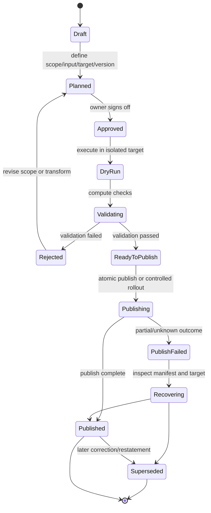
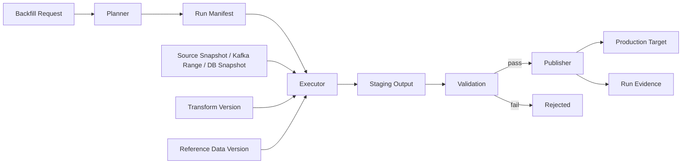
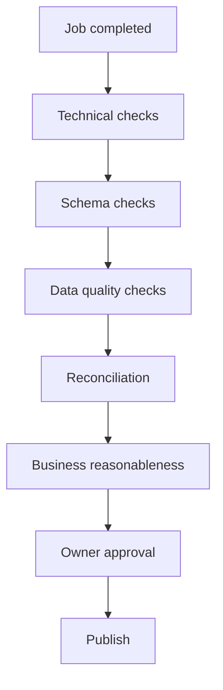

# Part 055 — Backfill and Reprocessing

> Backfill is not “run the job again.”  
> Backfill is a controlled attempt to rewrite history without lying about what happened.

A junior pipeline treats backfill as a script.

A serious pipeline treats backfill as a **production change operation** with identity, scope, ownership, isolation, validation, rollback, cost control, and audit evidence.

The mental model:

```txt
Backfill = deterministic recomputation + bounded mutation + evidence trail
```

A backfill is safe only when we can answer:

1. **What exact input range is being replayed?**
2. **What transformation version is being used?**
3. **What target state is allowed to change?**
4. **What side effects are forbidden, mocked, deduplicated, or compensated?**
5. **How do we prove the output is correct before publication?**
6. **How do we undo or supersede the result if it is wrong?**

This part is deliberately operational. Many engineers can write a Spark job, Kafka consumer, or Java batch runner. Fewer can run a 3-year historical reprocessing operation without corrupting reporting, alerting, downstream caches, regulatory audit trails, or customer-visible state.

---

## 1. The Problem Backfill Actually Solves

Backfill exists because the first output was incomplete, wrong, or no longer sufficient.

Common causes:

| Cause | Example | Required response |
|---|---|---|
| New derived field | Add `case_age_days` to enforcement analytics | Recompute historical rows |
| Buggy transformation | Wrong timezone conversion | Restate affected partitions |
| Missing source records | API outage for two days | Ingest missing window and recompute downstream |
| Late/corrected data | Case decision effective date amended | Apply correction and restate impacted aggregates |
| Schema evolution | New event version introduces better semantics | Dual-read old/new versions and republish canonical output |
| New downstream product | ML feature store needs 5 years of history | Historical feature generation |
| Compliance requirement | Need reproducible audit evidence | Rebuild from immutable source and preserve run manifest |
| Migration | Move from old warehouse table to Iceberg | One-time bulk load plus verification |

Backfill is not exceptional. In data systems, it is part of the normal lifecycle.

The weak assumption is: “pipeline output is final.”

A more accurate assumption is:

```txt
Pipeline output is a versioned claim produced from specific input, code, configuration, and reference data.
```

If any of those change, output may need to be recomputed.

---

## 2. Vocabulary: Backfill, Replay, Reprocessing, Restatement

These terms are often mixed. Keep them separate.

| Term | Meaning | Example |
|---|---|---|
| Replay | Read old events again from a log/source | Reset Kafka offset to 2025-01-01 |
| Backfill | Produce missing or newly required historical output | Generate `case_sla_snapshot` for 2023–2025 |
| Reprocessing | Re-run transformation over existing input | Recompute risk score after bug fix |
| Restatement | Publish corrected output that supersedes previous output | Replace April 2026 regulatory report partition |
| Repair | Fix a bounded corrupted subset | Reprocess records for tenant `T-41` only |
| Migration backfill | Populate a new target from an old source | Load new Iceberg table from warehouse history |
| Bootstrap | Initial load before streaming begins | Snapshot DB table, then switch to CDC |
| Reconciliation | Compare source and target to detect mismatch | Count/hash check by partition |

The most important distinction:

```txt
Replay reads old input.
Backfill creates or changes historical output.
Restatement changes the accepted truth for a period/product.
```

A replay that writes to a non-idempotent sink can corrupt output. A restatement without evidence can break regulatory trust.

---

## 3. Backfill as a State Machine

A production backfill should have lifecycle state.



Avoid a design where backfill is only a terminal command:

```bash
java -jar pipeline.jar --from 2023-01-01 --to 2023-12-31
```

That command has no durable memory of what was intended, what ran, what version ran, what changed, or whether the output was accepted.

A serious backfill has a **run manifest**.

---

## 4. The Backfill Run Manifest

The run manifest is the contract between engineering, data owners, and operations.

Minimum fields:

```json
{
  "runId": "bf-2026-07-04-case-sla-v3-001",
  "kind": "BACKFILL",
  "requestedBy": "data-platform",
  "approvedBy": "regulatory-reporting-owner",
  "reason": "Fix SLA breach calculation after timezone bug",
  "source": {
    "type": "ICEBERG_TABLE",
    "name": "bronze.case_events",
    "snapshotId": "8392012349012",
    "range": {
      "eventDateFrom": "2025-01-01",
      "eventDateTo": "2025-12-31"
    }
  },
  "transform": {
    "name": "case-sla-transform",
    "version": "3.1.0",
    "gitCommit": "8d91ab7",
    "containerImage": "registry/company/case-sla:3.1.0",
    "configHash": "sha256:...",
    "referenceDataVersion": "calendar-v2026-06-30"
  },
  "target": {
    "type": "ICEBERG_TABLE",
    "name": "silver.case_sla_daily",
    "publishMode": "REPLACE_PARTITIONS",
    "partitions": ["2025-01", "2025-02", "...", "2025-12"]
  },
  "safety": {
    "sideEffectsAllowed": false,
    "maxRowsExpected": 500000000,
    "maxCostUsd": 1200,
    "requiresManualPublish": true
  },
  "validation": {
    "countTolerance": 0,
    "checksumRequired": true,
    "qualityGate": "case-sla-v3-gate"
  }
}
```

The manifest should be immutable after approval. If scope changes, create a new manifest version.

The manifest gives you audit-grade answers:

| Question | Manifest answer |
|---|---|
| Why did historical numbers change? | `reason` |
| Who approved it? | `approvedBy` |
| What input was used? | source snapshot/range |
| What code generated it? | transform version/git SHA/image |
| What output changed? | target partitions/table |
| Was it validated? | validation section + result |
| Was it allowed to cause side effects? | `sideEffectsAllowed` |

---

## 5. Core Invariants

Backfill correctness depends on invariants.

### 5.1 Input scope must be explicit

Bad:

```txt
Reprocess all old data.
```

Good:

```txt
Reprocess case events with event_date >= 2025-01-01 and event_date < 2026-01-01 from Iceberg snapshot 8392012349012.
```

If the input scope is not explicit, the output cannot be defended.

### 5.2 Transformation must be versioned

A backfill must not run with “whatever code is currently deployed.”

It should run with:

- transform name
- semantic version
- Git commit
- container image digest
- config hash
- dependency lock
- reference data version
- schema version set

### 5.3 Output mutation must be bounded

The target mutation must say exactly what it can change:

- append only
- replace partitions
- merge by business key
- write new versioned table
- write shadow table only
- publish pointer swap

Avoid unrestricted mutation:

```sql
DELETE FROM target;
INSERT INTO target SELECT ...;
```

That is not a backfill strategy. It is a production incident waiting to happen.

### 5.4 Side effects must be isolated

Backfill must not accidentally send notifications, charge customers, trigger enforcement actions, open tickets, or update operational systems.

Data pipelines often have hidden side effects:

- publishing Kafka events consumed by alerting systems
- updating search indexes used by users
- refreshing materialized views
- sending metrics interpreted as live alerts
- invalidating caches
- touching feature stores consumed by online models

Backfill must carry an execution mode:

```java
enum ExecutionMode {
    LIVE,
    BACKFILL,
    REPLAY,
    DRY_RUN,
    RECONCILIATION
}
```

Downstream systems should know whether an output is live or historical.

### 5.5 Publication must be separate from computation

Do not compute directly into the final target unless the mutation is inherently safe.

Preferred pattern:

```txt
read input -> compute into staging/shadow -> validate -> publish atomically
```

---

## 6. Backfill Architecture

A robust design separates four planes:



| Component | Responsibility |
|---|---|
| Planner | Convert intent into bounded input/output scope |
| Manifest store | Durable record of approved run plan |
| Executor | Run computation deterministically |
| Staging target | Hold output before publication |
| Validator | Compare output against rules and expected invariants |
| Publisher | Make result visible safely |
| Evidence store | Preserve logs, metrics, checks, lineage, approvals |

A backfill platform is not necessarily a big product. It may be a set of conventions, tables, and Java libraries. But the separation matters.

---

## 7. Backfill Modes

### 7.1 Append-only historical generation

Use when target did not exist before.

Example:

```txt
Generate daily case SLA facts for 2023–2025.
```

Characteristics:

- safe if target is empty or partition-isolated
- no need to delete old output
- still requires validation
- common for migration/bootstrap

### 7.2 Partition replacement

Use when output is partitioned by a stable dimension such as date.

```txt
Recompute target partitions dt=2025-01-01 through dt=2025-12-31.
```

This is often the best lakehouse/warehouse strategy.

Requirements:

- partition key must match output correction boundary
- target engine must support atomic or controlled partition replacement
- validation must happen before publication
- downstream consumers must tolerate restatement

### 7.3 Keyed upsert/merge

Use when output identity is business-key based.

Example:

```txt
Recompute current case projection by case_id.
```

Risks:

- stale rows may remain if deletes are not handled
- merge condition may be wrong
- version ordering may be ambiguous
- concurrent live writes may conflict

Use a version column:

```sql
MERGE INTO case_projection t
USING staging_case_projection s
ON t.case_id = s.case_id
WHEN MATCHED AND s.projection_version >= t.projection_version THEN UPDATE SET ...
WHEN NOT MATCHED THEN INSERT ...;
```

### 7.4 Shadow output + pointer swap

Use when correctness risk is high.

```txt
Write to case_sla_daily_bf_20260704
Validate
Swap view or metadata pointer
```

Useful when:

- output is large
- validation needs time
- downstream consumers require stable table names
- rollback must be fast

### 7.5 Versioned output

Use when old and new output must coexist.

Example:

```txt
case_sla_daily_v2
case_sla_daily_v3
```

or:

```txt
case_sla_daily(output_version='v3')
```

Useful for:

- regulatory restatement comparison
- ML feature backtesting
- migration validation
- consumer phased rollout

### 7.6 Replay into live topic

High risk.

Only use when downstream semantics are designed for it.

Replay to a live Kafka topic can trigger:

- duplicate alerts
- state regression
- consumer backlog explosion
- cache poisoning
- external side effects

Safer alternatives:

- replay to dedicated backfill topic
- include `processingMode=BACKFILL`
- include `runId`
- require consumers to opt in
- write to table instead of event topic

---

## 8. Deterministic Reprocessing

A transform is deterministic if the same input and same context produce the same output.

```txt
same input records
+ same transform version
+ same configuration
+ same reference data
+ same time policy
= same output
```

Non-determinism sources:

| Source | Problem | Fix |
|---|---|---|
| `Instant.now()` | Output changes per run | Inject run clock |
| Random UUID | Different IDs per replay | Derive deterministic IDs from input/run |
| Live reference DB lookup | Reference value changes | Version reference data |
| Unordered iteration | Output order/hash unstable | Sort before hash/output |
| Floating point aggregation | Non-associative result drift | Use decimal/fixed precision where needed |
| External API call | Mutable response | Snapshot API response or forbid during backfill |
| Non-versioned config | Old output unreproducible | Hash and store config |

Java pattern:

```java
public record TransformContext(
        String runId,
        ExecutionMode mode,
        Instant runStartedAt,
        Clock clock,
        String transformVersion,
        String configHash,
        String referenceDataVersion
) {}

public interface DeterministicTransform<I, O> {
    List<O> apply(I input, TransformContext context);
}
```

Do not let transform code access static system time directly.

Bad:

```java
record.setProcessedAt(Instant.now());
```

Better:

```java
record.setProcessedAt(context.runStartedAt());
```

Best, for business semantics:

```java
record.setEffectiveAt(input.businessEffectiveAt());
record.setProducedByRun(context.runId());
```

---

## 9. Backfill Identity

Every output produced by a backfill should carry lineage.

Minimum output metadata:

```java
public record OutputLineage(
        String runId,
        ExecutionMode mode,
        String transformName,
        String transformVersion,
        String inputSnapshot,
        String inputRange,
        Instant producedAt
) {}
```

In tables:

```sql
produced_by_run_id      varchar not null,
produced_by_transform   varchar not null,
transform_version       varchar not null,
input_snapshot_id       varchar null,
input_range_start       timestamp null,
input_range_end         timestamp null,
processing_mode         varchar not null
```

In Kafka headers:

```txt
x-run-id: bf-2026-07-04-case-sla-v3-001
x-processing-mode: BACKFILL
x-transform-version: case-sla-transform/3.1.0
x-input-snapshot: iceberg:bronze.case_events@8392012349012
```

Without lineage, historical output changes become suspicious.

With lineage, they become explainable.

---

## 10. Source-Specific Backfill Patterns

## 10.1 Kafka replay

Kafka is replay-friendly because events in a topic can be read multiple times while retained.

But replay requires strict offset/range control.

```txt
topic: case-events-v1
partition: 0..47
start offset per partition: known
end offset per partition: known
consumer group: unique backfill group
```

Do not rely only on timestamp lookup if exact reproducibility matters. Timestamp-to-offset lookup can be useful for planning, but the actual run manifest should persist resolved offsets.

Kafka replay manifest section:

```json
{
  "source": {
    "type": "KAFKA",
    "cluster": "prod-a",
    "topic": "case-events-v1",
    "partitions": [
      { "partition": 0, "fromOffset": 9012331, "toOffsetExclusive": 9120000 },
      { "partition": 1, "fromOffset": 8871200, "toOffsetExclusive": 8990201 }
    ]
  }
}
```

Important rules:

- use a new consumer group or assign partitions manually
- disable live side effects
- preserve original event time
- set `processingMode=BACKFILL`
- avoid committing offsets to a live consumer group
- validate output before publication

### Java sketch: manual partition assignment

```java
try (KafkaConsumer<String, byte[]> consumer = new KafkaConsumer<>(props)) {
    TopicPartition tp = new TopicPartition("case-events-v1", 0);
    consumer.assign(List.of(tp));
    consumer.seek(tp, 9_012_331L);

    long endExclusive = 9_120_000L;

    while (consumer.position(tp) < endExclusive) {
        ConsumerRecords<String, byte[]> records = consumer.poll(Duration.ofMillis(500));
        for (ConsumerRecord<String, byte[]> record : records.records(tp)) {
            if (record.offset() >= endExclusive) {
                break;
            }
            processBackfillRecord(record);
        }
    }
}
```

This is intentionally manual. A backfill should not accidentally mutate a shared consumer group position.

---

## 10.2 CDC backfill

CDC backfill is tricky because the source has two histories:

1. table snapshot state
2. change log stream

Typical bootstrap:

```txt
initial snapshot -> stream changes from captured log position
```

Backfill options:

| Option | Use case | Risk |
|---|---|---|
| Re-snapshot table | Current-state projection | Loses historical changes unless table stores history |
| Replay CDC topic | Historical reconstruction | Requires retained CDC topic and schema history |
| Use raw changelog table | Lakehouse CDC archive | Best for audit/replay if complete |
| Combine snapshot + CDC range | Point-in-time reconstruction | Harder but powerful |

CDC reprocessing must preserve operation semantics:

```txt
c = create
u = update
d = delete
r = snapshot read
```

A delete is not “missing data.” It is a fact.

A snapshot row is not always equivalent to a create event. It is a state observation at snapshot time.

---

## 10.3 File backfill

File backfill is common when historical files are re-landed.

Required identity:

- file path
- file size
- content hash
- manifest ID
- producer timestamp
- business date
- schema version
- ingestion attempt ID

Safe design:

```txt
landing/2025/01/file.csv
manifest/2025/01/manifest.json
archive/accepted/...
archive/rejected/...
```

Use import ledger:

```sql
create table file_import_ledger (
    file_id varchar primary key,
    content_hash varchar not null,
    file_path varchar not null,
    business_date date not null,
    schema_version varchar not null,
    first_seen_at timestamp not null,
    accepted_run_id varchar null,
    status varchar not null
);
```

Backfill should say whether duplicate files are:

- ignored
- reprocessed
- treated as correction
- rejected

---

## 10.4 API backfill

API backfill is constrained by external behavior.

Problems:

- rate limits
- mutable responses
- missing historical endpoints
- pagination instability
- deleted records not exposed
- token expiration
- vendor-side retention
- data corrected without updated timestamp

Safe API backfill patterns:

| Pattern | Use case |
|---|---|
| Cursor replay | Provider supports stable cursor/history |
| Time-window scan | Provider supports `updated_since` |
| ID range scan | Stable ID ordering exists |
| Snapshot export | Vendor can export historical dump |
| Webhook + reconciliation | Webhooks are incomplete, periodic scan fixes gaps |

Always store raw API responses for critical backfills when allowed by policy.

---

## 10.5 Lakehouse backfill

Lakehouse backfill often uses partition replacement, snapshot isolation, or versioned table publication.

Good targets support:

- immutable files
- table snapshots
- atomic commit
- schema evolution
- partition evolution
- time travel
- metadata inspection

Backfill on a lakehouse table should distinguish:

```txt
compute output files != publish table snapshot
```

This separation enables validation before commit.

---

## 11. Target Mutation Patterns

## 11.1 Append with run ID

```sql
insert into target
select *, 'bf-2026-07-04-001' as produced_by_run_id
from staging;
```

Use when target supports multiple output versions.

Add a view for accepted version:

```sql
create or replace view accepted_case_sla as
select *
from target
where output_status = 'ACCEPTED';
```

## 11.2 Replace partition

```txt
replace partitions dt=2025-01-01..2025-12-31
```

Validation before replacement:

- count check
- null check
- uniqueness check
- business reconciliation
- sample diff
- checksum by partition

## 11.3 Merge by key

Use only when key identity is stable and delete handling is explicit.

Output should include:

- key
- version
- operation
- valid/effective time if relevant
- source lineage

## 11.4 Publish pointer swap

```txt
case_sla_current -> case_sla_v20260704
```

Useful when table/view indirection exists.

Benefits:

- fast rollback
- visible publication moment
- easier validation
- consumers see a consistent cutover

## 11.5 Correction event publication

For event-sourced downstream systems, restating table rows may be wrong. Publish correction events instead.

Example:

```json
{
  "eventType": "CaseSlaBreachCorrected",
  "caseId": "C-101",
  "correctsEventId": "evt-2025-00091",
  "reason": "TIMEZONE_BUG_RESTATEMENT",
  "oldBreachAt": "2025-04-10T00:00:00+07:00",
  "newBreachAt": "2025-04-09T17:00:00Z",
  "producedByRunId": "bf-2026-07-04-case-sla-v3-001"
}
```

Do not silently overwrite history when downstream meaning requires correction lineage.

---

## 12. Live + Backfill Concurrency

A dangerous scenario:

```txt
Live pipeline writes current data while backfill rewrites historical data.
```

Questions:

- Can live and backfill write the same keys?
- Which output wins?
- Is there a version ordering?
- Does the sink support concurrent commits?
- Are downstream consumers aware of restatement?

Patterns:

### 12.1 Freeze target window

Block live writes for affected partitions/time range.

Pros:

- simple correctness

Cons:

- operational disruption

### 12.2 Versioned writes

Live and backfill write separate versions.

```txt
output_version = live-current
output_version = bf-20260704
```

Publish selects accepted version.

### 12.3 Last-writer-wins with run priority

Usually bad unless explicitly modeled.

### 12.4 Merge with event-time/version semantics

Backfill output can be accepted only if it represents a known correction version.

```java
boolean shouldUpdate(Projection existing, Projection candidate) {
    return candidate.sourceVersion().compareTo(existing.sourceVersion()) > 0;
}
```

But be careful: `sourceVersion` is not the same as processing time.

---

## 13. Side-Effect Boundaries

Backfill must classify every sink.

| Sink type | Backfill default |
|---|---|
| Analytical table | Allowed with staging/validation |
| Materialized view | Allowed if versioned or rebuildable |
| Kafka live event topic | Usually forbidden |
| Notification service | Forbidden |
| Ticket/case management command | Forbidden |
| Search index | Allowed only if isolated index or controlled rebuild |
| Feature store | Allowed only with backfill mode/version |
| Cache | Usually forbidden; rebuild after publish |
| External API | Forbidden unless compensation/idempotency exists |

A transform should not decide this alone. The run manifest should.

Java guard:

```java
public interface SinkPolicy {
    void assertAllowed(SinkDescriptor sink, ExecutionMode mode);
}

public final class DefaultSinkPolicy implements SinkPolicy {
    @Override
    public void assertAllowed(SinkDescriptor sink, ExecutionMode mode) {
        if (mode == ExecutionMode.BACKFILL && sink.hasExternalSideEffect()) {
            throw new IllegalStateException(
                "Backfill cannot write to external side-effect sink: " + sink.name()
            );
        }
    }
}
```

---

## 14. Validation Before Publication

Backfill output is not accepted because the job succeeded. It is accepted because checks passed.

Validation layers:



### 14.1 Technical checks

- no failed tasks
- no unhandled poison records
- expected partitions written
- output row count within range
- no unexpected null metadata
- no sink commit errors

### 14.2 Schema checks

- output schema compatible with consumer contract
- no unexpected column removal/type change
- schema version recorded
- nullable/non-nullable expectations satisfied

### 14.3 Data quality checks

- uniqueness
- nullability
- range
- referential integrity
- accepted enum values
- timestamp bounds
- PII rules

### 14.4 Reconciliation checks

Examples:

```sql
-- count by business date
select business_date, count(*)
from staging_case_sla
where run_id = 'bf-2026-07-04-001'
group by business_date;
```

```sql
-- checksum by partition
select business_date,
       count(*) as row_count,
       sum(hash(case_id, sla_state, breach_at)) as checksum
from staging_case_sla
group by business_date;
```

For financial/regulatory systems, reconciliation often must be domain-specific:

- balance totals
- case counts by lifecycle state
- number of open/closed/escalated cases
- breach counts by jurisdiction
- appeal counts by decision category

### 14.5 Business reasonableness

A result can pass schema checks and still be wrong.

Example:

```txt
SLA breach count drops by 80% after backfill.
```

Maybe the bug fix is correct. Maybe the transform is broken. That requires owner review.

---

## 15. Publication Strategies

### 15.1 Atomic publish

Best when supported.

Examples:

- Iceberg snapshot commit
- atomic table rename/swap
- transactional warehouse table update
- version pointer update in metadata table

### 15.2 Progressive publish

Use when target is large or consumers are segmented.

```txt
publish tenant A -> validate -> tenant B -> validate -> full publish
```

### 15.3 Dark publish

Compute and expose only to internal validators.

```txt
case_sla_daily_candidate
```

### 15.4 Dual-read cutover

Consumers compare old and new output before switch.

```txt
read old + new -> diff -> accept -> switch
```

### 15.5 Correction publication

Instead of replacing old rows, publish correction events or restatement tables.

For regulated systems, this may be the most defensible pattern.

---

## 16. Rollback and Supersession

Rollback means the system returns to previous accepted state.

Supersession means a newer accepted output replaces a previous accepted output.

In immutable/lakehouse systems, prefer supersession.

```txt
run bf-001 published
run bf-002 supersedes bf-001
```

Do not physically delete evidence unless retention policy requires it.

Run table:

```sql
create table pipeline_run (
    run_id varchar primary key,
    run_type varchar not null,
    status varchar not null,
    reason text not null,
    transform_name varchar not null,
    transform_version varchar not null,
    input_descriptor jsonb not null,
    target_descriptor jsonb not null,
    created_at timestamp not null,
    approved_at timestamp null,
    published_at timestamp null,
    superseded_by_run_id varchar null
);
```

Publication pointer:

```sql
create table accepted_output_version (
    data_product varchar primary key,
    accepted_run_id varchar not null,
    accepted_at timestamp not null,
    accepted_by varchar not null
);
```

Rollback becomes pointer movement, not blind deletion.

---

## 17. Backfill Cost Model

Backfill can overload systems.

Cost dimensions:

| Dimension | Risk |
|---|---|
| Source read load | DB/API/object store pressure |
| Broker read load | Kafka cluster/network load |
| Compute | Spark/Flink/Java worker cost |
| Shuffle | Network and disk explosion |
| State | RocksDB/state-store growth |
| Output files | Small file problem |
| Sink commit | Warehouse/lakehouse contention |
| Downstream impact | Consumer backlog/cache rebuild |

Backfill should be throttled intentionally.

Example controls:

```java
public record BackfillLimits(
        int maxPartitionsInParallel,
        long maxRowsPerMinute,
        long maxBytesPerMinute,
        int maxSinkCommitsPerHour,
        Duration sleepBetweenWindows
) {}
```

A slow correct backfill is better than a fast incident.

---

## 18. Chunking Strategy

Backfills should be chunked along a dimension that matches correctness boundaries.

Possible chunk keys:

- business date
- event date
- source commit date
- tenant
- jurisdiction
- source partition
- ID range
- Kafka partition/offset range

Good chunking properties:

- independent validation
- retryable without duplicate effects
- bounded memory
- bounded sink mutation
- natural progress reporting
- limited blast radius

Bad chunking:

```txt
Split arbitrary every 1 million rows even though aggregates cross chunk boundaries.
```

If output aggregate is monthly, chunking daily may be fine only if monthly publish waits for all days.

---

## 19. Backfill Runner Skeleton in Java

A minimal but serious Java model:

```java
public record BackfillPlan(
        String runId,
        SourceRange sourceRange,
        TransformDescriptor transform,
        TargetMutation targetMutation,
        ValidationPlan validationPlan,
        BackfillLimits limits
) {}

public interface BackfillSource<I> {
    Iterator<I> read(SourceRange range);
}

public interface BackfillTransform<I, O> {
    Stream<O> transform(I input, TransformContext context);
}

public interface StagingSink<O> {
    void writeBatch(List<O> outputs, OutputLineage lineage);
}

public interface BackfillValidator {
    ValidationResult validate(String runId);
}

public interface Publisher {
    PublishResult publish(String runId, TargetMutation mutation);
}
```

Execution:

```java
public final class BackfillRunner<I, O> {
    private final BackfillSource<I> source;
    private final BackfillTransform<I, O> transform;
    private final StagingSink<O> stagingSink;
    private final BackfillValidator validator;
    private final Publisher publisher;

    public void run(BackfillPlan plan) {
        TransformContext context = TransformContext.forBackfill(plan);

        List<O> buffer = new ArrayList<>();
        Iterator<I> inputs = source.read(plan.sourceRange());

        while (inputs.hasNext()) {
            I input = inputs.next();
            transform.transform(input, context).forEach(buffer::add);

            if (buffer.size() >= 10_000) {
                stagingSink.writeBatch(buffer, context.lineage());
                buffer.clear();
            }
        }

        if (!buffer.isEmpty()) {
            stagingSink.writeBatch(buffer, context.lineage());
        }

        ValidationResult result = validator.validate(plan.runId());
        if (!result.passed()) {
            throw new BackfillValidationException(result);
        }

        if (plan.targetMutation().requiresManualPublish()) {
            return;
        }

        publisher.publish(plan.runId(), plan.targetMutation());
    }
}
```

This skeleton intentionally separates staging and publication.

---

## 20. Idempotency for Backfill Output

Backfill can fail mid-run. Re-running must be safe.

Patterns:

### 20.1 Run-scoped staging table

```sql
create table staging_case_sla (
    run_id varchar not null,
    case_id varchar not null,
    business_date date not null,
    sla_state varchar not null,
    breach_at timestamp null,
    primary key (run_id, case_id, business_date)
);
```

Re-run can overwrite same `(run_id, key)` or require a new `run_id`.

### 20.2 Deterministic output ID

```java
String outputId = sha256(runId + ":" + caseId + ":" + businessDate);
```

For restatements, do not use random IDs.

### 20.3 Chunk ledger

```sql
create table backfill_chunk_run (
    run_id varchar not null,
    chunk_id varchar not null,
    status varchar not null,
    input_count bigint null,
    output_count bigint null,
    checksum varchar null,
    started_at timestamp not null,
    finished_at timestamp null,
    primary key (run_id, chunk_id)
);
```

Chunk ledger enables retry from failed chunk, not from beginning.

---

## 21. Reprocessing Stateful Pipelines

Stateful pipelines are harder to backfill than stateless transformations.

Examples:

- dedupe state
- session windows
- SLA timers
- fraud/risk rolling windows
- temporal joins
- case lifecycle state machines

Questions:

1. Is state derived entirely from replayed input?
2. Does state require a warm-up period?
3. Is the start boundary safe?
4. Are timers deterministic?
5. Is late data policy versioned?
6. Can state be snapshotted and restored?

### Warm-up window

If output for March depends on events from February, input range must include February.

```txt
requested output: 2025-03-01..2025-03-31
required input:   2025-02-01..2025-03-31
publish output:   March only
```

Manifest should separate input range from output range.

```json
{
  "inputRange": {
    "eventDateFrom": "2025-02-01",
    "eventDateTo": "2025-04-01"
  },
  "publishRange": {
    "businessDateFrom": "2025-03-01",
    "businessDateTo": "2025-04-01"
  }
}
```

---

## 22. Backfill and Watermarks

For event-time pipelines, backfill needs a synthetic watermark policy.

Live stream:

```txt
watermark follows observed event-time progress
```

Backfill:

```txt
input is finite; watermark can advance deterministically after sorted/chunked input
```

But be careful. If backfill reads unsorted historical data, watermark advancement may close windows too early.

Strategies:

| Strategy | Use case |
|---|---|
| Sort by event time within key | Highest correctness, expensive |
| Process by time partitions | Good for batch/lakehouse |
| Use bounded out-of-orderness | Good if source disorder bound known |
| Treat backfill as batch aggregation | Better if window logic can be batch-equivalent |
| Emit correction events after late facts | Good for always-on systems |

---

## 23. Backfill and Reference Data

A hidden source of incorrect backfill is reference data.

Example:

```txt
Case SLA due date depends on jurisdiction calendar.
```

If the calendar table today is different from the calendar table in 2025, which one should be used?

Answer depends on business semantics:

| Semantics | Use |
|---|---|
| Reconstruct what system believed then | Reference data as recorded then |
| Compute what should have been true | Corrected reference data |
| Produce current reporting truth | Current accepted reference version |
| Audit an old decision | Reference version used by original decision |

Backfill manifest must include reference data version.

```json
{
  "referenceData": [
    {
      "name": "jurisdiction_calendar",
      "version": "calendar-v2025-restated-002",
      "semantics": "CORRECTED_TRUTH"
    }
  ]
}
```

---

## 24. Backfill and Privacy

Backfill can resurrect data that should no longer be used.

Risks:

- replaying deleted PII
- writing raw sensitive data into new targets
- violating retention policy
- bypassing masking/tokenization
- publishing historical fields now classified as restricted

Backfill source policy must check:

- source retention legality
- purpose limitation
- target classification
- masking requirements
- access rights
- deletion/tombstone handling

Rule:

```txt
Replay permission is not implied by historical availability.
```

A source may technically contain old data that policy no longer allows you to process.

---

## 25. Backfill Observability

Metrics:

| Metric | Meaning |
|---|---|
| `backfill_input_records_total` | Records read |
| `backfill_output_records_total` | Records produced |
| `backfill_rejected_records_total` | Validation/parse rejects |
| `backfill_chunks_completed_total` | Progress |
| `backfill_chunk_duration_seconds` | Runtime per chunk |
| `backfill_sink_write_latency_ms` | Sink pressure |
| `backfill_validation_failures_total` | Quality failure count |
| `backfill_cost_estimate` | Cost tracking |
| `backfill_publish_duration_seconds` | Publication cost |

Logs should always include:

```txt
run_id
chunk_id
source_range
transform_version
target
processing_mode
```

Tracing is useful for orchestration and sink calls, but large record-level tracing is usually too expensive. Use sampled record traces for debugging.

---

## 26. Backfill Runbook

A production runbook should include:

1. define reason
2. identify impacted products/consumers
3. define input range and output range
4. identify transform version
5. identify reference data version
6. estimate cost and duration
7. choose mutation strategy
8. choose side-effect policy
9. create manifest
10. get owner approval
11. run dry run on subset
12. validate subset
13. run full staging
14. validate full output
15. review diff with owner
16. publish
17. monitor downstream
18. archive evidence
19. communicate restatement
20. create post-run notes

Communication matters. Backfill changes facts people rely on.

---

## 27. Testing Backfill Logic

Test classes:

### 27.1 Determinism test

```java
@Test
void sameInputAndContextProducesSameOutput() {
    var context = fixedBackfillContext();
    var input = sampleCaseEvent();

    var first = transform.apply(input, context);
    var second = transform.apply(input, context);

    assertEquals(first, second);
}
```

### 27.2 Idempotent staging test

Run same chunk twice. Output count must not double.

### 27.3 Partial failure test

Fail after writing staging but before chunk commit. Retry must converge.

### 27.4 Publish failure test

Simulate unknown outcome during publication. Recovery must inspect target state before retry.

### 27.5 Warm-up range test

Assert output range excludes warm-up records but state includes them.

### 27.6 Side-effect guard test

Assert backfill mode cannot write to forbidden sinks.

### 27.7 Reconciliation test

Golden dataset + expected aggregate checks.

---

## 28. Anti-Patterns

### Anti-pattern: using production consumer group for replay

This mutates live consumer offsets.

Use a dedicated replay group or manual assignment.

### Anti-pattern: backfill directly to live event topic

This can trigger downstream side effects.

Use staging, backfill topic, or versioned target.

### Anti-pattern: no transform version

You cannot reproduce output.

### Anti-pattern: no input snapshot/range

You cannot defend why output changed.

### Anti-pattern: replaying without reference data version

You may generate a hybrid truth that never existed and was never approved.

### Anti-pattern: delete-and-insert without atomicity

Readers can see partial output.

### Anti-pattern: validation after publish only

At that point validation is incident detection, not prevention.

### Anti-pattern: “just rerun Airflow DAG”

A DAG rerun may not imply same input, same code, same config, same target mutation, or same side-effect policy.

---

## 29. Case Study: Regulatory Enforcement SLA Restatement

Scenario:

- Enforcement cases have SLA breach deadlines.
- Deadline depends on jurisdiction, business calendar, escalation pause periods, and decision effective date.
- A timezone bug caused some deadlines to be computed one day late.
- Need restatement for 2025 reports.

### 29.1 Plan

```txt
Reason: timezone bug in SLA transform v2.4.1
New transform: v3.1.0
Input: bronze.case_events snapshot 8392012349012, event date 2024-12-01..2026-01-01
Output: silver.case_sla_daily, business date 2025-01-01..2026-01-01
Warm-up: 2024-12 events for open cases crossing into 2025
Reference: jurisdiction_calendar v2026-06-restated
Publish mode: replace 2025 partitions
Side effects: forbidden
Validation: compare breach count by jurisdiction/month; sample high-risk cases
Approval: regulatory reporting owner
```

### 29.2 Why input starts before output

An SLA breach in January 2025 may depend on a case opened in December 2024.

So:

```txt
input range  != output range
```

### 29.3 Output lineage

Every restated row includes:

```txt
produced_by_run_id = bf-2026-07-04-case-sla-v3-001
transform_version = case-sla-transform/3.1.0
reference_data_version = jurisdiction_calendar/v2026-06-restated
restatement_reason = TIMEZONE_BUG_FIX
```

### 29.4 Validation

Checks:

- count by jurisdiction/month
- breach count delta threshold
- no missing active cases
- no negative SLA duration
- due date timezone normalized
- sample 100 previously disputed cases
- compare old vs new for all changed rows

### 29.5 Publication

Write staging table, validate, replace 2025 partitions, update accepted run pointer.

### 29.6 Evidence

Store:

- run manifest
- code version
- validation result
- diff summary
- owner approval
- publish timestamp
- superseded run ID

---

## 30. Design Checklist

Before approving a backfill, answer:

- [ ] What is the business reason?
- [ ] What output is allowed to change?
- [ ] What input range/snapshot is used?
- [ ] Is input range different from output range?
- [ ] What transform version is used?
- [ ] What config/reference data version is used?
- [ ] Are side effects forbidden or controlled?
- [ ] Is output written to staging first?
- [ ] What validation gates must pass?
- [ ] What reconciliation proves completeness?
- [ ] What is the publication strategy?
- [ ] What is rollback/supersession strategy?
- [ ] What downstream consumers are impacted?
- [ ] Is privacy/retention policy satisfied?
- [ ] Is cost/blast radius bounded?
- [ ] Is run evidence preserved?

---

## 31. The Core Lesson

Backfill is where pipeline architecture tells the truth about itself.

If a system cannot backfill safely, then it likely also cannot recover safely, audit safely, or evolve safely.

The mature design is not:

```txt
We can rerun the job.
```

The mature design is:

```txt
We can reproduce a bounded output from declared input, code, config, and reference data; validate it before publication; publish it safely; and explain the result later.
```

That is the difference between a script and an engineering system.

