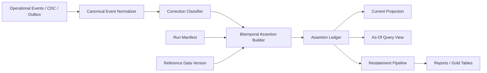
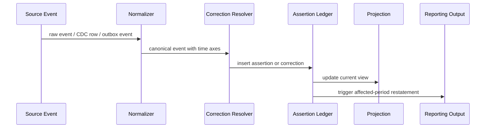
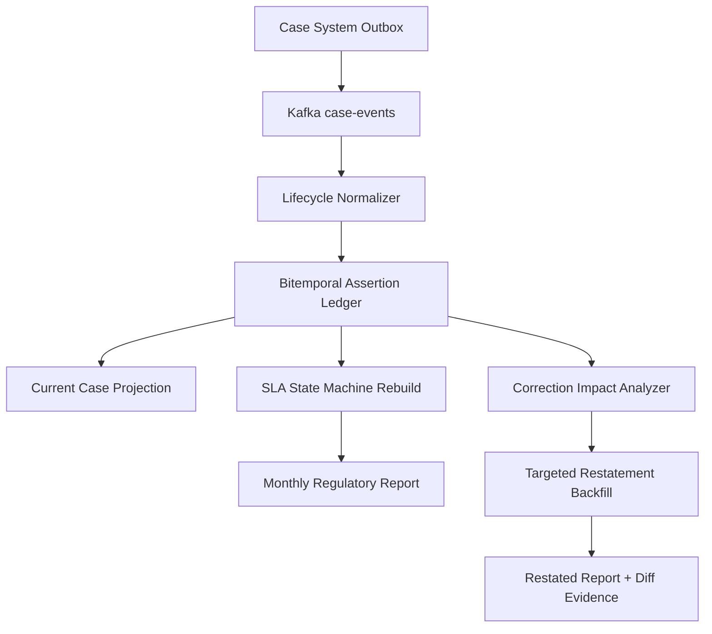

# Part 056 — Bitemporal and Correction Pipelines

> Most pipeline bugs are not caused by lack of data.  
> They are caused by confusing **when something happened**, **when we learned it**, and **when it became effective**.

A normal table asks:

```txt
What is the value now?
```

A serious regulatory or audit-grade pipeline must answer:

```txt
What did we believe on date X about facts effective on date Y?
```

That is a bitemporal question.

This part covers bitemporal and correction pipeline patterns: how to model effective time, recorded time, correction events, restatement, audit views, and reproducible historical truth in Java data systems.

---

## 1. The Problem: Time Is Not One Thing

Consider a regulatory enforcement case.

```txt
Case C-100 was closed effective 2026-03-31.
The closure was entered into the case system on 2026-04-02.
The closure was corrected on 2026-04-10 because the effective date should have been 2026-03-30.
A report generated on 2026-04-05 used the old effective date.
A report generated on 2026-04-12 should use the corrected date.
```

There are at least three times:

| Time | Meaning |
|---|---|
| Event time | When source says the event occurred |
| Effective/valid time | When the fact is true in the business domain |
| Recorded/transaction time | When the system learned or recorded the fact |

Sometimes there is also:

| Time | Meaning |
|---|---|
| Processing time | When pipeline processed it |
| Source commit time | When DB transaction committed |
| Publication time | When output became visible to consumers |
| Report run time | When a consumer generated a derived artifact |

If you collapse all of these into one `created_at`, you lose the ability to explain history.

---

## 2. Bitemporal Model in One Sentence

A bitemporal model stores facts across two axes:

```txt
valid time      = when the fact is true in the real/business world
transaction time = when the system recorded or believed the fact
```

Alternative names:

| Concept | Also called |
|---|---|
| Valid time | effective time, business time, actual time |
| Transaction time | recorded time, system time, assertion time, knowledge time |

Use names that fit your domain, but keep the axes separate.

---

## 3. Why Bitemporal Matters in Pipelines

Pipeline outputs are often consumed later by:

- reports
- dashboards
- audits
- ML features
- regulatory submissions
- operational decisions
- incident investigations
- legal discovery

These consumers may need different truth modes.

| Consumer question | Required model |
|---|---|
| What is the current accepted state? | Latest valid fact by key |
| What was true on March 31? | Valid-time query |
| What did the system believe on April 5? | Transaction-time query |
| What did we report on April 5 about March? | Bitemporal query + report run lineage |
| Why did numbers change? | Correction/restatement lineage |
| Who changed the fact and why? | Audit metadata |

Without bitemporal data, teams often rewrite history silently.

That is dangerous in enforcement, finance, healthcare, legal, public sector, and compliance-heavy systems.

---

## 4. A Simple Example

Initial fact:

```txt
recorded_at: 2026-04-02T10:00:00Z
valid_from:  2026-03-31T00:00:00Z
valid_to:    infinity
case_id:     C-100
status:      CLOSED
```

Correction:

```txt
recorded_at: 2026-04-10T09:00:00Z
valid_from:  2026-03-30T00:00:00Z
valid_to:    infinity
case_id:     C-100
status:      CLOSED
correction_of: previous fact
reason:      EFFECTIVE_DATE_CORRECTION
```

A query as of April 5 should see effective date March 31.

A query as of April 12 should see effective date March 30.

A query asking “what is currently accepted for March 30?” should use the corrected fact.

---

## 5. Bitemporal Dimensions

A robust event/fact model often stores:

```txt
business_key
valid_from
valid_to
recorded_from
recorded_to
payload
assertion_id
supersedes_assertion_id
reason
source_lineage
```

The intervals are usually half-open:

```txt
[from, to)
```

Meaning:

```txt
start inclusive, end exclusive
```

This avoids ambiguous boundary overlap.

Example:

```txt
valid_from <= query_valid_time < valid_to
recorded_from <= query_recorded_time < recorded_to
```

---

## 6. Event Time vs Valid Time

Do not assume event time and valid time are identical.

Example:

```txt
Event emitted: 2026-04-02
Decision effective date: 2026-03-31
```

The event happened in the system on April 2. The business fact applies from March 31.

For case lifecycle modelling, this distinction is critical:

- assignment entered late
- escalation effective retroactively
- sanction decision backdated by legal rule
- appeal suspends SLA from prior date
- correction changes effective boundary

A stream processor may use event time for watermark/windowing, but the business state machine may use valid time for domain truth.

---

## 7. Transaction Time vs Processing Time

Transaction/recorded time should represent when the source system committed or recorded the assertion.

Processing time represents when the pipeline happened to process it.

These are different.

```txt
source recorded_at: 2026-04-02 10:00
pipeline processed_at: 2026-04-03 01:00
```

If the pipeline was delayed, processing time should not rewrite source history.

Use processing time for pipeline observability and lineage, not business truth.

---

## 8. The Correction Principle

The safest correction model is:

```txt
Never mutate a past assertion silently.
Add a new assertion that supersedes or corrects it.
```

This creates an audit trail.

Bad:

```sql
update case_status
set effective_date = '2026-03-30'
where case_id = 'C-100';
```

Better:

```sql
insert into case_status_assertion (..., valid_from, recorded_from, supersedes_assertion_id, reason)
values (..., '2026-03-30', now(), 'old-assertion-id', 'EFFECTIVE_DATE_CORRECTION');
```

Then close the old assertion in transaction-time:

```sql
update case_status_assertion
set recorded_to = now()
where assertion_id = 'old-assertion-id';
```

The old fact remains queryable for “what did we believe before correction?”

---

## 9. Bitemporal Table Design

A canonical bitemporal table:

```sql
create table case_status_bitemporal (
    assertion_id varchar primary key,
    case_id varchar not null,
    status varchar not null,

    valid_from timestamp not null,
    valid_to timestamp not null,

    recorded_from timestamp not null,
    recorded_to timestamp not null,

    source_event_id varchar not null,
    source_system varchar not null,
    source_commit_time timestamp null,

    supersedes_assertion_id varchar null,
    correction_reason varchar null,
    produced_by_run_id varchar not null,
    transform_version varchar not null,

    payload_hash varchar not null,
    created_at timestamp not null
);
```

Use an infinity convention carefully.

Examples:

```txt
9999-12-31T00:00:00Z
```

or database-native infinity if supported and portable enough for your stack.

Indexes:

```sql
create index idx_case_status_valid
on case_status_bitemporal (case_id, valid_from, valid_to);

create index idx_case_status_recorded
on case_status_bitemporal (case_id, recorded_from, recorded_to);

create index idx_case_status_bitemporal_query
on case_status_bitemporal (case_id, valid_from, valid_to, recorded_from, recorded_to);
```

For lakehouse tables, partition carefully. Valid date and recorded date can both matter, but over-partitioning creates small files.

---

## 10. Bitemporal Query Patterns

### 10.1 Current accepted state

```sql
select *
from case_status_bitemporal
where case_id = 'C-100'
  and valid_from <= current_timestamp
  and current_timestamp < valid_to
  and recorded_to = timestamp '9999-12-31 00:00:00';
```

This means:

```txt
currently valid and currently accepted
```

### 10.2 Business truth as of valid time

```sql
select *
from case_status_bitemporal
where case_id = 'C-100'
  and valid_from <= timestamp '2026-03-31 12:00:00'
  and timestamp '2026-03-31 12:00:00' < valid_to
  and recorded_to = timestamp '9999-12-31 00:00:00';
```

This uses current accepted knowledge to ask what was true then.

### 10.3 What we believed at recorded time

```sql
select *
from case_status_bitemporal
where case_id = 'C-100'
  and valid_from <= timestamp '2026-03-31 12:00:00'
  and timestamp '2026-03-31 12:00:00' < valid_to
  and recorded_from <= timestamp '2026-04-05 00:00:00'
  and timestamp '2026-04-05 00:00:00' < recorded_to;
```

This answers:

```txt
What did we believe on April 5 about the status valid on March 31?
```

That is the core bitemporal query.

---

## 11. Event Model for Corrections

Correction events should be explicit.

```json
{
  "eventId": "evt-correction-001",
  "eventType": "CaseStatusCorrected",
  "caseId": "C-100",
  "correctsEventId": "evt-status-777",
  "correctionReason": "EFFECTIVE_DATE_CORRECTION",
  "old": {
    "status": "CLOSED",
    "effectiveFrom": "2026-03-31T00:00:00Z"
  },
  "new": {
    "status": "CLOSED",
    "effectiveFrom": "2026-03-30T00:00:00Z"
  },
  "recordedAt": "2026-04-10T09:00:00Z",
  "sourceCommitTime": "2026-04-10T09:00:02Z",
  "causationId": "cmd-correct-status-001",
  "correlationId": "case-C-100-correction-20260410"
}
```

Important fields:

| Field | Why it matters |
|---|---|
| `correctsEventId` | Links correction to prior assertion |
| `correctionReason` | Explains why history changed |
| `old` | Optional but useful for evidence/diff |
| `new` | New assertion payload |
| `recordedAt` | Transaction/knowledge time |
| `effectiveFrom` | Valid/business time |
| `causationId` | Who/what caused correction |
| `correlationId` | Groups related correction workflow |

---

## 12. Correction Pipeline Architecture



Key idea:

```txt
The ledger is the durable truth.
Projections are views derived from the ledger.
```

Do not make the projection the source of truth.

---

## 13. Assertion Ledger vs Projection

| Layer | Purpose | Mutation style |
|---|---|---|
| Assertion ledger | Preserve every assertion/correction | Append + close recorded interval |
| Current projection | Fast current-state query | Upsert by business key |
| As-of view | Historical query | Derived query or materialized table |
| Reporting aggregate | Consumer-specific product | Restated/versioned |

If a correction arrives, update the ledger first. Then rebuild or update projections.

---

## 14. Java Domain Model

Use value objects for time axes. Do not pass raw `Instant` everywhere.

```java
public record ValidTimeRange(Instant fromInclusive, Instant toExclusive) {
    public ValidTimeRange {
        if (!fromInclusive.isBefore(toExclusive)) {
            throw new IllegalArgumentException("valid time range must be non-empty");
        }
    }

    public boolean contains(Instant t) {
        return !t.isBefore(fromInclusive) && t.isBefore(toExclusive);
    }
}

public record RecordedTimeRange(Instant fromInclusive, Instant toExclusive) {
    public RecordedTimeRange {
        if (!fromInclusive.isBefore(toExclusive)) {
            throw new IllegalArgumentException("recorded time range must be non-empty");
        }
    }
}
```

Assertion:

```java
public record CaseStatusAssertion(
        AssertionId assertionId,
        CaseId caseId,
        CaseStatus status,
        ValidTimeRange validTime,
        RecordedTimeRange recordedTime,
        SourceEventId sourceEventId,
        Optional<AssertionId> supersedesAssertionId,
        Optional<CorrectionReason> correctionReason,
        OutputLineage lineage
) {}
```

Correction command:

```java
public record CorrectionCommand(
        CaseId caseId,
        AssertionId assertionToCorrect,
        CorrectionReason reason,
        ValidTimeRange correctedValidTime,
        CaseStatus correctedStatus,
        Instant recordedAt,
        SourceEventId sourceEventId
) {}
```

Do not represent correction as a blind update.

---

## 15. Bitemporal Write Algorithm

For a correction:

```txt
1. find currently recorded assertion being corrected
2. verify correction is authorized and causally valid
3. close old assertion's recorded interval
4. insert corrected assertion with new recorded_from
5. update projection
6. emit correction lineage if needed
```

Pseudo-code:

```java
public void applyCorrection(CorrectionCommand command) {
    Instant recordedAt = command.recordedAt();

    CaseStatusAssertion old = repository.getOpenRecordedAssertion(
        command.assertionToCorrect()
    );

    CaseStatusAssertion closedOld = old.withRecordedTo(recordedAt);

    CaseStatusAssertion corrected = new CaseStatusAssertion(
        AssertionId.newDeterministic(command.sourceEventId()),
        command.caseId(),
        command.correctedStatus(),
        command.correctedValidTime(),
        new RecordedTimeRange(recordedAt, TimeConstants.INFINITY),
        command.sourceEventId(),
        Optional.of(old.assertionId()),
        Optional.of(command.reason()),
        currentLineage()
    );

    repository.transaction(() -> {
        repository.closeRecordedInterval(closedOld);
        repository.insert(corrected);
        projection.apply(corrected);
    });
}
```

Important: the closure of old assertion and insert of new assertion must be atomic within the target boundary.

---

## 16. Overlap Rules

Bitemporal data must control interval overlap.

For a given business key, status intervals may be:

- mutually exclusive
- overlapping with precedence
- overlapping by design because multiple statuses can apply

Do not assume.

Example rules:

| Domain | Valid-time overlap allowed? |
|---|---|
| Case lifecycle primary status | Usually no |
| Case tags | Yes |
| Assigned officers | Maybe yes if co-assignment allowed |
| Risk scores | Usually versioned snapshots |
| SLA pause intervals | Yes, but must merge/normalize |

For primary status:

```txt
For each case_id and recorded-time view, valid intervals for primary status must not overlap.
```

Validation SQL concept:

```sql
select a.case_id, a.assertion_id, b.assertion_id
from case_status_bitemporal a
join case_status_bitemporal b
  on a.case_id = b.case_id
 and a.assertion_id <> b.assertion_id
 and a.recorded_to = timestamp '9999-12-31 00:00:00'
 and b.recorded_to = timestamp '9999-12-31 00:00:00'
 and a.valid_from < b.valid_to
 and b.valid_from < a.valid_to;
```

This detects overlapping currently accepted valid intervals.

---

## 17. Correction Types

Not all corrections mean the same thing.

| Type | Meaning | Pipeline behavior |
|---|---|---|
| Field correction | Payload field wrong | Supersede assertion |
| Effective-date correction | Valid-time boundary wrong | Recompute downstream affected windows |
| Retraction | Fact should not exist | Close/retract assertion |
| Late assertion | Fact was true earlier but recorded late | Add assertion with old valid time, new recorded time |
| Legal restatement | Accepted historical truth changed | Publish restatement evidence |
| Source duplicate | Same assertion repeated | Dedupe, no correction |
| Source compensation | Business action reverses prior fact | New fact, not necessarily correction |

Do not model every negative event as a correction.

Example:

```txt
Case reopened after closure
```

This may be a new lifecycle event, not a correction of closure.

Correction changes the claim about what was true.

Compensation records a new fact that reverses or offsets another fact.

---

## 18. Retraction Pattern

A retraction says:

```txt
The previous assertion should no longer be considered valid truth.
```

Retraction event:

```json
{
  "eventType": "CaseStatusRetracted",
  "caseId": "C-100",
  "retractsAssertionId": "assertion-777",
  "reason": "SOURCE_ENTRY_ERROR",
  "recordedAt": "2026-04-10T09:00:00Z"
}
```

Ledger behavior:

- close old assertion in recorded time
- optionally insert a tombstone assertion or retraction assertion
- downstream projections remove or recompute state

For audit, a retraction should still be visible historically.

---

## 19. Restatement Pattern

A restatement is a published replacement of previously accepted derived output.

Example:

```txt
March 2026 enforcement SLA report is restated after correction batch.
```

Restatement metadata:

```json
{
  "restatementId": "rst-2026-04-sla-001",
  "supersedesReportRunId": "report-2026-04-05-001",
  "reason": "Late effective-date corrections received on 2026-04-10",
  "validPeriod": "2026-03",
  "recordedAsOf": "2026-04-12T00:00:00Z",
  "producedByRunId": "bf-2026-04-12-sla-restatement-001"
}
```

Restatement should not pretend the old report never existed.

It should say:

```txt
This newer output supersedes that older output.
```

---

## 20. Bitemporal Pipeline Flow

For each source event:

```txt
parse -> classify -> derive assertion -> check duplicates -> resolve correction -> write ledger -> update projections -> validate
```



---

## 21. Computing Impacted Windows

A correction can affect many downstream windows.

Example:

```txt
Effective date changes from April 1 to March 30.
```

Impacted outputs:

- daily status for March 30, March 31, April 1
- monthly March aggregate
- monthly April aggregate
- SLA breach windows
- jurisdictional report
- feature store snapshot

Impact function:

```java
public interface CorrectionImpactAnalyzer<E> {
    Set<OutputPartition> impactedPartitions(E correction);
}
```

Example:

```java
public Set<OutputPartition> impactedPartitions(CaseStatusCorrection correction) {
    LocalDate oldDate = correction.oldValidFrom().atZone(zone).toLocalDate();
    LocalDate newDate = correction.newValidFrom().atZone(zone).toLocalDate();

    return DateRange.closed(min(oldDate, newDate), max(oldDate, newDate).plusDays(1))
            .stream()
            .flatMap(date -> Stream.of(
                    OutputPartition.daily(date),
                    OutputPartition.monthly(YearMonth.from(date))
            ))
            .collect(Collectors.toSet());
}
```

Corrections should trigger targeted restatement, not always global recompute.

---

## 22. Bitemporal Joins

Joining two historical datasets requires choosing the time semantics.

Example:

```txt
Case status joined to jurisdiction calendar.
```

Possible joins:

| Join type | Meaning |
|---|---|
| Current reference join | Use current accepted calendar |
| Valid-time join | Use calendar valid at case effective date |
| Transaction-time join | Use calendar version known at report run time |
| Bitemporal join | Use calendar valid at business time and known at recorded time |

If reports must be reproducible, use bitemporal join.

Pseudo-condition:

```sql
case.valid_from >= calendar.valid_from
and case.valid_from < calendar.valid_to
and report.recorded_as_of >= calendar.recorded_from
and report.recorded_as_of < calendar.recorded_to
```

This prevents accidentally using a future-corrected calendar to explain a past report unless that is the intended restatement mode.

---

## 23. Truth Modes

A mature platform exposes truth modes explicitly.

| Truth mode | Meaning |
|---|---|
| `CURRENT_ACCEPTED` | Latest accepted understanding |
| `AS_REPORTED` | What was published at report time |
| `AS_KNOWN_AT` | What system knew at recorded time |
| `AS_EFFECTIVE_AT` | Facts valid at business time using current knowledge |
| `REVISED_TRUTH` | Restated/corrected truth after accepted corrections |
| `SOURCE_OBSERVED` | Raw source assertion, no correction collapse |

Java enum:

```java
public enum TruthMode {
    CURRENT_ACCEPTED,
    AS_REPORTED,
    AS_KNOWN_AT,
    AS_EFFECTIVE_AT,
    REVISED_TRUTH,
    SOURCE_OBSERVED
}
```

Do not let consumers query “history” without specifying truth mode.

---

## 24. Current Projection from Bitemporal Ledger

A current projection is a convenience view.

```sql
create view current_case_status as
select *
from case_status_bitemporal s
where s.recorded_to = timestamp '9999-12-31 00:00:00'
  and s.valid_from <= current_timestamp
  and current_timestamp < s.valid_to;
```

But be careful with `current_timestamp` in materialized outputs. It makes results time-dependent.

For reproducible reports, parameterize time:

```sql
where s.valid_from <= :valid_as_of
  and :valid_as_of < s.valid_to
  and s.recorded_from <= :recorded_as_of
  and :recorded_as_of < s.recorded_to
```

---

## 25. Bitemporal in Lakehouse Tables

Lakehouse formats with snapshots help with transaction-time publication, but they do not automatically solve valid-time modeling.

You still need columns such as:

```txt
valid_from
valid_to
recorded_from
recorded_to
assertion_id
supersedes_assertion_id
```

Table snapshots answer:

```txt
What files/rows were in the table at snapshot N?
```

Bitemporal columns answer:

```txt
What business facts were valid at time Y and known at time X?
```

These are complementary.

A lakehouse snapshot may represent publication time. A bitemporal ledger represents domain/system knowledge time.

---

## 26. Kafka Topics for Corrections

Topic design options:

### 26.1 Same canonical event topic

```txt
case-events-v1
```

Contains both facts and corrections.

Pros:

- preserves order by key
- consumers see all state-changing facts

Cons:

- consumers must understand correction semantics

### 26.2 Dedicated correction topic

```txt
case-events-v1
case-corrections-v1
```

Pros:

- clear operational visibility

Cons:

- ordering across topics is harder
- consumers must join streams

### 26.3 Assertion ledger topic

```txt
case-status-assertions-v1
```

Contains normalized bitemporal assertions.

This is often cleaner for downstream analytics.

Key rule:

```txt
Partition by business key when ordering corrections relative to original assertions matters.
```

---

## 27. Ordering and Late Corrections

A correction can arrive before the event it corrects in downstream processing due to replay, topic ordering, or source disorder.

Options:

| Policy | Behavior |
|---|---|
| Hold pending correction | Store until original arrives |
| Resolve by assertion ID | If old assertion missing, query ledger |
| Emit unresolved correction | Route to quarantine/pending lane |
| Apply as independent assertion | Dangerous unless semantics allow |

Pending correction table:

```sql
create table pending_correction (
    correction_event_id varchar primary key,
    target_assertion_id varchar not null,
    case_id varchar not null,
    payload jsonb not null,
    first_seen_at timestamp not null,
    retry_after timestamp not null,
    status varchar not null
);
```

Do not drop corrections because the original event has not arrived yet.

---

## 28. Dedupe for Corrections

Correction events require idempotency.

Dedupe keys:

- correction event ID
- source command ID
- corrected assertion ID + correction sequence
- payload hash + source commit time

Avoid deduping only by business key.

Two corrections for the same case may both be valid.

```txt
C-100 effective date corrected
C-100 status reason corrected
```

Same case, different correction.

---

## 29. Correction and Aggregates

Aggregates are where corrections become painful.

Suppose case was counted in April but correction moves it to March.

The aggregate update is not simply:

```txt
March +1
```

It may be:

```txt
April -1
March +1
```

If original contribution is known, use contribution ledger.

```sql
create table aggregate_contribution_ledger (
    contribution_id varchar primary key,
    aggregate_name varchar not null,
    aggregate_key varchar not null,
    source_assertion_id varchar not null,
    contribution_value decimal not null,
    recorded_from timestamp not null,
    recorded_to timestamp not null,
    produced_by_run_id varchar not null
);
```

Then correction means superseding contribution, not guessing the delta.

---

## 30. Correction and Materialized Views

A materialized view should be rebuildable from ledger.

Design options:

| Option | Use when |
|---|---|
| Incremental correction update | Low latency needed, correction logic simple |
| Partition restatement | Reporting tables partitioned by impacted period |
| Full rebuild | State logic complex or low data volume |
| Versioned materialization | Audit requires old/new comparison |

For regulatory reporting, versioned materialization is often the safest.

---

## 31. Correction and State Machines

Case lifecycle pipelines often use state machines.

Corrections can invalidate a previous transition path.

Example:

```txt
OPEN -> INVESTIGATING -> CLOSED
```

Correction says `INVESTIGATING` effective date was earlier.

Effects:

- duration in OPEN changes
- SLA clock start changes
- report period changes
- breach detection changes

State machine must be able to recompute over valid-time ordered assertions.

Pattern:

```txt
ledger of assertions -> sort by valid time -> replay domain state machine -> produce versioned projection
```

Do not only patch final state.

---

## 32. Java State Machine Rebuild

```java
public final class CaseLifecycleRebuilder {
    public CaseLifecycleProjection rebuild(
            CaseId caseId,
            List<CaseLifecycleAssertion> assertions,
            TruthMode truthMode,
            Instant validAsOf,
            Instant recordedAsOf
    ) {
        List<CaseLifecycleAssertion> visible = assertions.stream()
                .filter(a -> visibleUnder(a, truthMode, validAsOf, recordedAsOf))
                .sorted(Comparator
                        .comparing((CaseLifecycleAssertion a) -> a.validTime().fromInclusive())
                        .thenComparing(a -> a.recordedTime().fromInclusive())
                        .thenComparing(a -> a.assertionId().value()))
                .toList();

        CaseLifecycleState state = CaseLifecycleState.initial(caseId);
        for (CaseLifecycleAssertion assertion : visible) {
            state = state.apply(assertion);
        }
        return state.toProjection();
    }
}
```

Sorting is not cosmetic. It is part of deterministic correctness.

---

## 33. Auditing Corrections

Every correction should answer:

| Question | Evidence |
|---|---|
| What was corrected? | `supersedes_assertion_id` / `corrects_event_id` |
| Why? | correction reason |
| Who/what caused it? | causation ID, actor, source command |
| When did it become known? | recorded time |
| What business period changed? | valid time range |
| What outputs were impacted? | impact analysis result |
| What restatements were published? | restatement metadata |
| What old output was superseded? | superseded run/report ID |

A correction without reason is weak evidence.

---

## 34. Data Quality Rules for Bitemporal Tables

Required checks:

- valid interval non-empty
- recorded interval non-empty
- no overlap for mutually exclusive facts
- every correction references an existing assertion or is pending/quarantined
- every closed recorded interval has a superseding/retraction reason
- no assertion uses processing time as valid time unless explicitly allowed
- output lineage present
- source event ID present
- duplicate assertion ID rejected
- current projection matches ledger query

Example validation:

```java
public final class BitemporalValidator {
    public List<Violation> validate(CaseStatusAssertion assertion) {
        List<Violation> violations = new ArrayList<>();

        if (!assertion.validTime().fromInclusive().isBefore(assertion.validTime().toExclusive())) {
            violations.add(new Violation("VALID_TIME_EMPTY"));
        }

        if (!assertion.recordedTime().fromInclusive().isBefore(assertion.recordedTime().toExclusive())) {
            violations.add(new Violation("RECORDED_TIME_EMPTY"));
        }

        if (assertion.sourceEventId() == null) {
            violations.add(new Violation("MISSING_SOURCE_EVENT_ID"));
        }

        return violations;
    }
}
```

---

## 35. Bitemporal and Backfill

Backfill and bitemporal design are tightly connected.

Backfill can operate in different truth modes.

| Backfill mode | Meaning |
|---|---|
| Current accepted rebuild | Use latest corrections |
| As-known-at rebuild | Reproduce what would have been produced at past recorded time |
| Restatement rebuild | Produce corrected output and supersede old output |
| Source-observed rebuild | Rebuild exactly from raw assertions without correction collapse |

Manifest must say truth mode.

```json
{
  "runId": "bf-2026-04-sla-restatement-001",
  "truthMode": "REVISED_TRUTH",
  "validRange": {
    "from": "2026-03-01",
    "to": "2026-04-01"
  },
  "recordedAsOf": "2026-04-12T00:00:00Z"
}
```

Without truth mode, a backfill is ambiguous.

---

## 36. Regulatory Reporting Pattern

A defensible regulatory report should store:

- report run ID
- report period
- valid-time range
- recorded-as-of time
- source snapshots
- transform version
- reference data version
- input counts
- output counts
- corrections included
- restatements superseded
- approver

Report output table:

```sql
create table regulatory_report_case_sla (
    report_run_id varchar not null,
    report_period varchar not null,
    jurisdiction varchar not null,
    breach_count bigint not null,
    open_case_count bigint not null,
    valid_from date not null,
    valid_to date not null,
    recorded_as_of timestamp not null,
    produced_by_run_id varchar not null,
    supersedes_report_run_id varchar null,
    primary key (report_run_id, jurisdiction)
);
```

This enables:

```txt
Show me March report as filed on April 5.
Show me March report restated on April 12.
Show me why they differ.
```

---

## 37. Correction Impact Diff

For every restatement, produce a diff summary.

Example:

```json
{
  "oldReportRunId": "report-2026-04-05-001",
  "newReportRunId": "report-2026-04-12-001",
  "period": "2026-03",
  "differences": [
    {
      "metric": "sla_breach_count",
      "jurisdiction": "JKT",
      "oldValue": 182,
      "newValue": 189,
      "delta": 7
    }
  ],
  "causes": [
    {
      "correctionReason": "EFFECTIVE_DATE_CORRECTION",
      "count": 9
    },
    {
      "correctionReason": "LATE_CASE_CLOSURE",
      "count": 3
    }
  ]
}
```

This is more useful than telling stakeholders “the pipeline was fixed.”

---

## 38. Anti-Patterns

### Anti-pattern: single `updated_at` for all time semantics

`updated_at` cannot answer valid-time and transaction-time questions.

### Anti-pattern: overwriting corrections in place

You lose evidence of prior belief.

### Anti-pattern: correction as delete + insert with no link

You cannot explain lineage.

### Anti-pattern: using processing time as effective time

Pipeline delay changes business truth.

### Anti-pattern: current reference join for historical report reproduction

You may use knowledge that was not available at report time.

### Anti-pattern: treating all late data as duplicate

Late data may be a legitimate old-valid-time assertion.

### Anti-pattern: no truth mode in consumer API

Consumers unknowingly mix current truth, historical belief, and restated truth.

---

## 39. Testing Bitemporal Pipelines

### 39.1 As-known-at test

```java
@Test
void queryReturnsOldBeliefBeforeCorrectionRecorded() {
    var oldAssertion = assertion(
            validFrom("2026-03-31"),
            recordedFrom("2026-04-02"),
            recordedTo("2026-04-10")
    );

    var correctedAssertion = assertion(
            validFrom("2026-03-30"),
            recordedFrom("2026-04-10"),
            recordedTo(INFINITY)
    );

    var result = query.asKnownAt(
            caseId("C-100"),
            validAt("2026-03-31"),
            recordedAt("2026-04-05")
    );

    assertEquals(oldAssertion, result);
}
```

### 39.2 Current accepted test

After correction, current accepted view should use corrected assertion.

### 39.3 Overlap test

Mutually exclusive facts must not overlap under current recorded view.

### 39.4 Restatement impact test

A correction moving a fact from April to March should restate both March and April aggregates.

### 39.5 Reference data time test

Historical report reproduction must not use future reference data unless truth mode permits it.

### 39.6 Replay determinism test

Ledger replay produces same projection every time.

---

## 40. Case Study: Enforcement Lifecycle Corrections

Domain:

- cases move through lifecycle states
- SLA depends on state, jurisdiction calendar, pauses, escalation level
- legal correction can change effective date
- reports are submitted monthly

Events:

```txt
CaseOpened
CaseAssigned
CaseEscalated
SlaPaused
SlaResumed
CaseDecisionIssued
CaseClosed
CaseStatusCorrected
CaseEffectiveDateCorrected
```

Pipeline design:

1. outbox emits canonical lifecycle events
2. normalizer extracts valid time and recorded time
3. assertion ledger stores lifecycle assertions
4. correction resolver supersedes old assertions
5. current projection serves operational analytics
6. reporting pipeline generates monthly output with `recorded_as_of`
7. restatement pipeline publishes corrected reports with diff evidence

Mermaid view:



Key invariant:

```txt
Reports are not overwritten silently. They are superseded by restatements with explicit recorded_as_of and reason.
```

---

## 41. Production Checklist

Before calling a correction pipeline production-grade, verify:

- [ ] Valid time and recorded time are separate.
- [ ] Processing time is not used as business truth.
- [ ] Corrections link to prior assertions.
- [ ] Retractions are explicit.
- [ ] Current projection is derived from ledger.
- [ ] As-of query semantics are documented.
- [ ] Truth mode is explicit in APIs/reports.
- [ ] Bitemporal joins use correct time axes.
- [ ] Reference data is versioned or time-aware.
- [ ] Aggregate contributions can be restated.
- [ ] Report restatements supersede old reports instead of deleting them.
- [ ] Correction impact analysis identifies affected partitions/products.
- [ ] Data quality checks detect invalid intervals and overlaps.
- [ ] Replay from ledger is deterministic.
- [ ] Audit evidence includes reason, causation, source, and run lineage.
- [ ] Backfill manifest includes truth mode.

---

## 42. The Core Lesson

Bitemporal modeling is not academic decoration.

It is the difference between:

```txt
This is the value now.
```

and:

```txt
This is what we believed then, about what was effective then, produced by this run, based on these source assertions, later superseded by this correction for this reason.
```

For ordinary dashboards, the first may be enough.

For enforcement lifecycle systems, audit trails, financial ledgers, legal decisions, compliance reporting, and regulatory defensibility, the second is often required.

The mature pipeline does not erase history.

It records how truth changed.

