# Part 057 — Orchestration vs Choreography

In the previous parts, we focused on data correctness inside ingestion, Kafka, Flink, Beam, Spark, lakehouse tables, backfill, and temporal correction pipelines.

Now the question changes.

The hard problem is no longer only:

> “How do I transform records correctly?”

It becomes:

> “How do I coordinate many pipeline actions, across many systems, with clear ownership, retry rules, failure visibility, replay boundaries, and audit evidence?”

This is where **orchestration** and **choreography** appear.

A weak engineer sees them as tool choices:

- Airflow vs Kafka
- DAG vs event-driven
- scheduler vs message bus
- workflow engine vs stream processor

A strong engineer sees them as **coordination models** with different failure boundaries.

This part builds that model.

---

## 1. Core Mental Model

A data pipeline has two kinds of movement:

1. **Data movement** — records, files, events, rows, snapshots, partitions.
2. **Control movement** — start, stop, wait, retry, skip, compensate, publish, alert, rerun.

Orchestration and choreography are mostly about **control movement**.

### Orchestration

In orchestration, a central controller knows the sequence:

```text
extract -> validate -> transform -> publish -> reconcile -> notify
```

The controller decides:

- what runs next
- when it runs
- what happens if it fails
- what dependency must complete first
- which step can be retried
- which step blocks downstream work
- which run is considered successful

Examples:

- Airflow DAG
- Dagster asset graph
- Argo Workflow
- Jenkins pipeline
- GitHub Actions workflow
- Temporal workflow
- custom Java workflow service

### Choreography

In choreography, components react to events and no single coordinator owns the whole path:

```text
CaseCreated event -> validation service reacts
CaseValidated event -> enrichment service reacts
CaseEnriched event -> projection service reacts
ProjectionUpdated event -> alert service reacts
```

Each participant decides what to do when it observes an event.

Examples:

- Kafka event-driven services
- CDC-to-topic pipelines
- Kafka Streams topologies
- Flink streaming jobs
- event-carried state transfer
- domain event subscribers

### The shortest difference

```text
Orchestration: "do this, then that"
Choreography:  "when this happens, whoever cares reacts"
```

But that definition is too shallow for production systems.

The real distinction is this:

> Orchestration centralizes control state. Choreography distributes control state across participants.

That one sentence explains most trade-offs.

---

## 2. The Control-State Question

Every pipeline has control state somewhere.

It may be explicit:

- Airflow task instance table
- Temporal workflow history
- job run manifest
- pipeline run ledger
- Kubernetes job status
- Spark checkpoint
- Flink checkpoint
- Kafka committed offset

Or implicit:

- a file exists in a folder
- a topic contains an event
- a downstream projection has updated
- a row status changed from `PENDING` to `PUBLISHED`
- an alert was sent

A production design must answer:

> Where does the system remember what has happened?

If you cannot answer that, you do not have a reliable pipeline. You have accidental behavior.

### Orchestration stores control state centrally

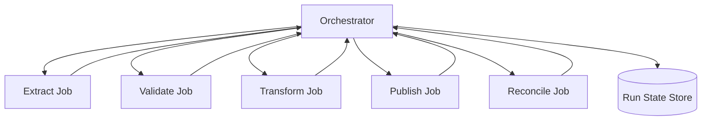

The orchestrator knows task status:

- scheduled
- queued
- running
- success
- failed
- skipped
- retrying
- upstream failed

This makes dependency visibility easy.

But it can also create a central bottleneck or false sense of correctness.

### Choreography stores control state locally

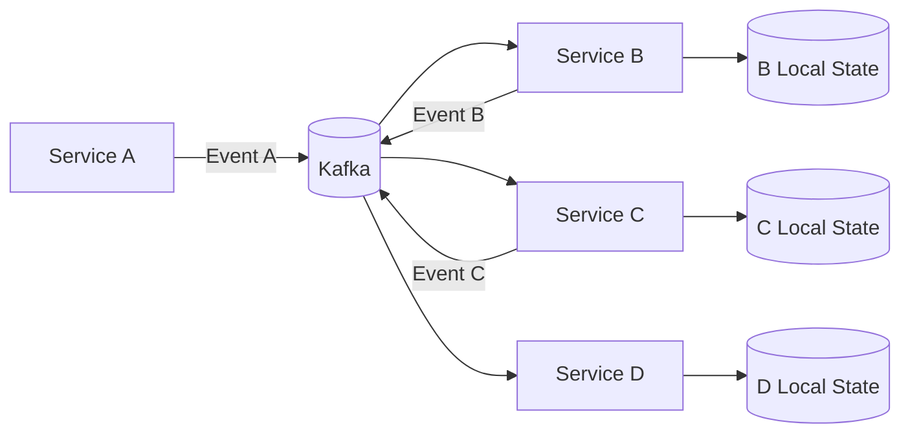

Each participant remembers its own progress:

- consumer offset
- inbox ledger
- state store
- projection table
- dedupe table
- retry/DLQ state

This allows high autonomy and scalability.

But end-to-end visibility becomes harder.

---

## 3. Why This Matters in Java Data Pipelines

Java pipelines often live at the boundary between operational systems and analytical/event systems.

You may have:

- Java services writing transactional data
- outbox events emitted via Debezium
- Kafka topics as event logs
- Flink jobs deriving stateful alerts
- Spark jobs producing daily regulatory extracts
- Airflow coordinating batch loads
- Temporal coordinating long-running external workflows
- Iceberg tables storing historical facts
- dashboards consuming curated datasets

The mistake is to use one coordination model everywhere.

Bad designs often look like this:

- Airflow waits on every Kafka event.
- Kafka is used to represent long-running approval workflow state.
- Flink performs one-off batch administrative jobs.
- Temporal is used as a high-throughput record processor.
- A Java service manually tracks a DAG with ad-hoc database tables.
- A single “pipeline orchestrator” becomes a god service.

Each tool has a natural coordination shape.

A top-tier engineer does not ask:

> “Which tool is fashionable?”

They ask:

> “Where should control state live for this failure model?”

---

## 4. The Coordination Spectrum

Do not think in binary terms. Most production pipelines combine orchestration and choreography.

```text
Centralized orchestration
  |
  | Airflow DAG for batch jobs
  | Temporal workflow for durable business process
  | Kubernetes Job controller
  | custom run coordinator
  |
  | asset-triggered orchestration
  | event-triggered orchestration
  |
  | Kafka topic + consumers
  | Kafka Streams topology
  | Flink continuous job
  |
Distributed choreography
```

### Strongly orchestrated

Good for:

- finite workflows
- batch jobs
- backfills
- one-off reprocessing
- dependency graph execution
- human-visible operational run state
- scheduled reporting
- data quality gates
- publish/rollback workflows

### Strongly choreographed

Good for:

- continuous event reaction
- decoupled domain events
- high-throughput stream processing
- independently owned services
- fan-out processing
- real-time materialization
- near-real-time alerting

### Hybrid

Good for:

- orchestrator starts a bounded replay job
- Kafka events trigger an Airflow DAG
- Airflow starts a Spark/Flink job
- Flink writes a completion event
- Temporal coordinates side effects after a data quality event
- a run manifest ties together distributed jobs

Production data platforms are usually hybrid.

---

## 5. Orchestration: What It Is Good At

Orchestration is strongest when the pipeline has an explicit **run**.

A run is a bounded execution attempt with a known scope.

Examples:

```text
Load partner file for 2026-07-04
Backfill cases from 2024-01-01 to 2024-12-31
Recompute regulatory breach metrics for Q2
Publish gold table snapshot version 391
Generate monthly enforcement report
```

A run has:

- run ID
- input scope
- transform version
- output target
- owner
- start time
- end time
- status
- retry attempts
- validation result
- lineage
- audit evidence

This maps well to orchestration.

### Orchestration strengths

| Strength | Why it matters |
|---|---|
| Dependency visibility | You can see what blocks what. |
| Manual operation | Humans can rerun, clear, skip, pause, inspect. |
| Run-level audit | Each run has metadata and status. |
| Finite scope | Batch/reprocessing naturally has start/end. |
| Central retry policy | Task-level retry is explicit. |
| Scheduling | Cron, asset, dataset, calendar, SLA-driven execution. |
| Quality gates | Fail before publishing downstream data. |

### Example orchestration run

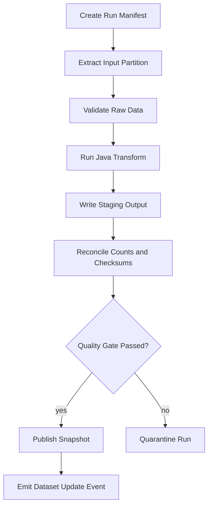

This shape is clear and reviewable.

---

## 6. Orchestration: Where It Fails

Orchestration becomes dangerous when it tries to control what should be continuous, local, and event-driven.

### Anti-pattern 1: Record-level orchestration

Bad:

```text
For every Kafka event:
  start one Airflow DAG run
  run one task
  update one row
```

This turns a scheduler into a record processor.

Symptoms:

- scheduler overload
- massive task metadata growth
- poor latency
- expensive retries
- weak backpressure
- poor partition locality

Better:

- use Kafka consumer, Kafka Streams, Flink, or a Java service for record-level processing
- use orchestration for bounded batch/replay/publish workflows

### Anti-pattern 2: Hidden side effects inside tasks

A task called `transform_cases` secretly:

- reads source data
- transforms it
- writes gold table
- updates status table
- sends Slack alert
- calls external API
- commits checkpoint

The DAG looks simple, but correctness is hidden.

Better:

- separate staging write from publish
- separate validation from mutation
- separate notification from data commit
- represent external side effects explicitly

### Anti-pattern 3: “Green DAG means correct data”

A successful orchestrator task means only:

> The task process ended successfully under the orchestrator’s definition.

It does not prove:

- the source was complete
- the output is correct
- the sink commit is atomic
- no duplicate was produced
- downstream consumers can use the data
- the report is semantically valid

A pipeline needs quality checks and reconciliation, not just task status.

### Anti-pattern 4: Orchestrator as integration bus

Bad:

```text
Airflow task A calls service B
Airflow task B calls service C
Airflow task C calls service D
Airflow task D calls service E
```

This creates a central operational choke point.

Better:

- use domain events for reactive service-to-service flow
- use durable workflow engine for long-running side-effect workflows
- use orchestration for bounded pipeline jobs

---

## 7. Choreography: What It Is Good At

Choreography is strongest when the pipeline is continuous and event-driven.

Examples:

```text
Whenever a case is escalated, update the escalation timeline projection.
Whenever a payment event arrives, update account exposure.
Whenever a customer profile changes, refresh search index projection.
Whenever CDC sees an outbox event, publish canonical event.
Whenever a breach signal is detected, notify the relevant system.
```

A choreographed pipeline does not wait for a central scheduler. It reacts.

### Choreography strengths

| Strength | Why it matters |
|---|---|
| Loose coupling | Producers do not know all consumers. |
| High throughput | Partitioned logs scale processing. |
| Independent ownership | Teams can add consumers without changing central DAG. |
| Natural replay | Consumers can reprocess from log offsets. |
| Event-driven freshness | Data moves as facts happen. |
| Continuous state | Stream processors maintain always-updated projections. |

### Example choreographed pipeline

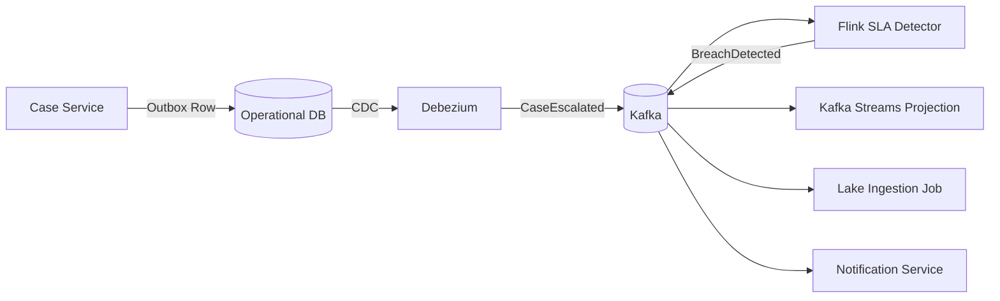

This is natural for domain events.

---

## 8. Choreography: Where It Fails

Choreography is powerful, but its failure modes are subtle.

### Anti-pattern 1: Invisible end-to-end process

Each service works locally, but nobody can answer:

- Has this case reached every required projection?
- Which consumer failed?
- Which event version broke downstream processing?
- Which output datasets are stale?
- What needs to be replayed after a bug fix?

Better:

- use lineage events
- use consumer health dashboards
- publish processing status events
- maintain run/replay manifests for bounded operations
- define ownership per consumer and dataset

### Anti-pattern 2: Event soup

Every service emits arbitrary events:

```text
CaseChanged
CaseUpdated
CaseModified
CaseSaved
CaseSyncRequested
CaseEvent
```

Consumers infer meaning from payload fragments.

Better:

- model canonical facts
- distinguish command, event, snapshot, correction
- define event identity and causality
- maintain schema compatibility
- assign topic ownership

### Anti-pattern 3: No global failure semantics

In choreography, one consumer may be successful while another is failing.

That is not necessarily wrong.

But it must be explicit.

For each consumer, define:

- lag SLO
- DLQ policy
- replay policy
- alert threshold
- owner
- downstream impact
- business criticality

### Anti-pattern 4: Distributed transaction fantasy

A choreographed pipeline often crosses many systems:

- database
- Kafka
- search index
- lakehouse
- notification service
- reporting warehouse

Do not pretend these share one transaction.

Use:

- outbox
- inbox
- idempotent sinks
- compensation
- reconciliation
- correction events
- audit logs

---

## 9. Decision Framework

Use orchestration when control state must be explicit and centralized.

Use choreography when reaction should be autonomous and continuous.

### Decision matrix

| Question | Prefer orchestration | Prefer choreography |
|---|---|---|
| Is the work finite? | Yes | Not necessarily |
| Is there a known run scope? | Yes | Usually no |
| Is human rerun/approval important? | Yes | Sometimes |
| Is record-level low-latency needed? | Rarely | Yes |
| Are producers/consumers independently owned? | Sometimes | Yes |
| Is dependency graph fixed and visible? | Yes | No, distributed |
| Is fan-out dynamic? | Harder | Easier |
| Is end-to-end audit by run needed? | Strong fit | Needs extra design |
| Is state continuous? | Weak fit | Strong fit |
| Is it a backfill/recompute? | Strong fit | Often triggered by orchestration |

### Practical rule

```text
Use orchestration for bounded coordination.
Use choreography for continuous reaction.
Use explicit manifests and lineage to bridge both.
```

---

## 10. Pipeline Run vs Event Flow

This distinction prevents many architecture mistakes.

### Pipeline run

A pipeline run has finite scope:

```json
{
  "runId": "run_20260704_cases_gold_v17",
  "inputScope": "cases.updated_at >= 2026-07-03 AND < 2026-07-04",
  "transformVersion": "case-gold-transform:17.4.2",
  "output": "iceberg://regulatory.gold.case_daily_snapshot/dt=2026-07-03",
  "mode": "NORMAL",
  "requestedBy": "scheduler",
  "status": "RUNNING"
}
```

This belongs naturally to orchestration.

### Event flow

An event flow is continuous:

```json
{
  "eventId": "evt_01JZ...",
  "eventType": "CaseEscalated",
  "caseId": "CASE-9912",
  "occurredAt": "2026-07-04T03:10:12Z",
  "schemaVersion": "2.1.0"
}
```

This belongs naturally to choreography.

### Bridge pattern

A good platform bridges them:

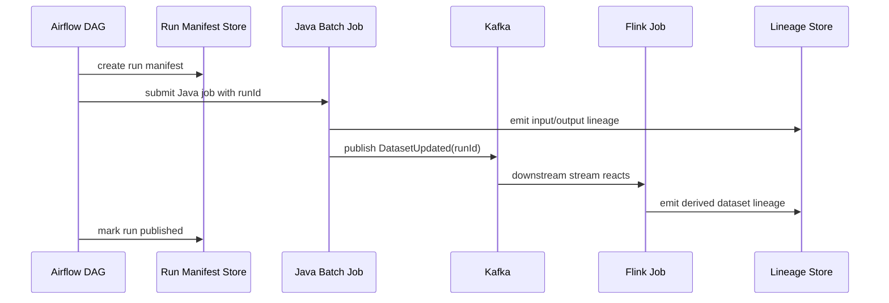

The run is orchestrated. The downstream reactions are choreographed.

---

## 11. Control Plane vs Data Plane

A central mistake is confusing the control plane with the data plane.

### Data plane

The data plane moves or processes data:

- Java ingestion job
- Kafka broker
- Kafka Streams app
- Flink job
- Spark executor
- Iceberg writer
- PostgreSQL query
- object storage write

### Control plane

The control plane schedules, configures, observes, and governs the data plane:

- Airflow scheduler
- Temporal service
- pipeline registry
- run manifest store
- deployment controller
- lineage system
- quality gate service
- alerting/routing system

### Rule

> The control plane should not become the high-throughput data plane.

Airflow should not process millions of records in Python tasks.

A workflow engine should not store every row as workflow history.

A Java service should not implement a full DAG scheduler by accident.

---

## 12. Orchestration Granularity

The most important orchestration design choice is task granularity.

Too coarse:

```text
Task 1: do everything
```

You lose observability and rerun precision.

Too fine:

```text
Task per row
Task per Kafka message
Task per small file
```

You overload metadata systems.

A useful task is usually a **failure and retry boundary**.

Ask:

- Can this task be retried safely?
- Can its output be validated independently?
- Does it have a clear input scope?
- Does it have a clear owner?
- Does it produce auditable evidence?
- Does downstream work depend on it as a unit?

### Good task boundaries

```text
create_run_manifest
extract_partner_file
validate_raw_file
submit_java_transform_job
validate_staging_output
publish_partition
emit_lineage_event
archive_source_file
```

### Bad task boundaries

```text
process_row_1
process_row_2
process_row_3
```

or:

```text
do_pipeline
```

---

## 13. Choreography Granularity

For choreography, the key unit is not a task. It is an event.

A useful event is a **fact boundary**.

Ask:

- What fact became true?
- Who owns the meaning?
- Is it immutable?
- Can it be replayed?
- Does it have stable identity?
- Does it carry enough context?
- Is it too broad?
- Is it too narrow?

### Good event examples

```text
CaseCreated
CaseAssigned
CaseEscalated
CaseBreachDetected
CaseDecisionIssued
CaseClosed
CaseCorrectionRecorded
```

### Weak event examples

```text
CaseUpdated
DataChanged
SyncCompleted
ProcessDone
PayloadReady
```

These may be valid internally, but they are poor cross-boundary contracts unless further specified.

---

## 14. Failure Propagation

Orchestration and choreography propagate failure differently.

### Orchestration failure propagation

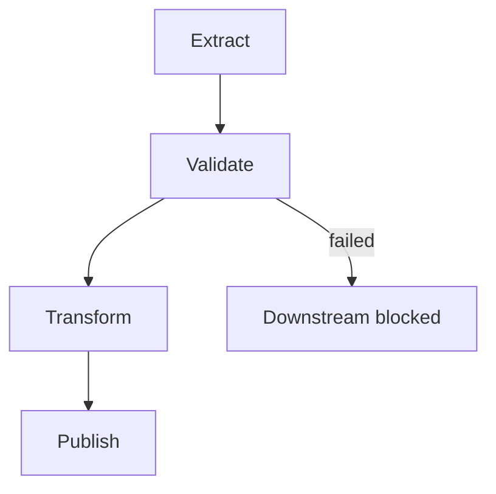

If `Validate` fails, downstream tasks do not run.

This is easy to understand.

But it can be too rigid. One failed optional input may block unrelated outputs unless the graph is designed carefully.

### Choreography failure propagation

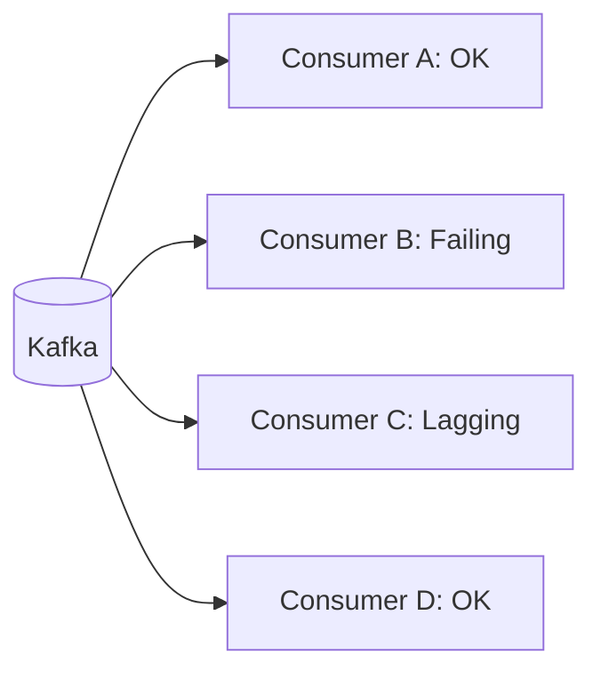

Producer may be healthy. Some consumers may be broken.

This is more scalable but harder to reason about.

### Required metadata

For choreographed systems, each consumer should declare:

```yaml
consumer: case-sla-detector
inputTopics:
  - regulatory.case.events.v2
outputs:
  - regulatory.case.breach-events.v1
owner: enforcement-platform
criticality: high
maxLag: PT2M
failureMode: blocks-regulatory-breach-alerting
replaySupported: true
dlqTopic: regulatory.case.sla-detector.dlq.v1
```

This turns invisible distributed control into inspectable platform metadata.

---

## 15. Retry Semantics

Retries are not the same across models.

### Orchestrated retry

A task retry repeats a bounded task.

Example:

```text
retry transform partition dt=2026-07-03 attempt=2
```

The task must define:

- whether previous partial output is deleted
- whether writes are staged
- whether publish is atomic
- whether output path contains attempt ID
- whether downstream tasks must be cleared

### Choreographed retry

A consumer retry repeats record processing or batch processing.

Example:

```text
retry Kafka record topic=T partition=3 offset=984112
```

The consumer must define:

- whether the sink is idempotent
- whether order is blocked for the partition
- whether poison records go to DLQ
- whether later records can proceed
- whether state was partially mutated

### Workflow retry

A durable workflow retry repeats activities according to workflow history and retry policy.

The workflow must define:

- which operation is an activity
- timeout
- retry policy
- idempotency key
- compensation action
- non-retryable failure

Different retry models require different state models.

Do not copy a retry policy from one model into another.

---

## 16. Idempotency Across Models

Idempotency is the bridge between orchestration and choreography.

### Orchestrated task idempotency

A task can be safely retried if:

```text
same runId + same inputScope + same transformVersion -> same committed output
```

Implementation patterns:

- run-specific staging path
- atomic publish pointer
- replace partition
- output manifest
- sink ledger
- idempotent external call key

### Choreographed event idempotency

A consumer can be safely replayed if:

```text
same eventId + same consumerName -> same effect applied once
```

Implementation patterns:

- inbox table
- dedupe state store
- idempotent upsert
- compare-and-swap version
- deterministic aggregation contribution
- effect ledger

### Unified idempotency key design

For a hybrid pipeline, use different keys for different boundaries:

| Boundary | Key |
|---|---|
| DAG run | `runId` |
| Task attempt | `runId + taskId + attempt` |
| Output dataset version | `datasetId + version` |
| Kafka event | `eventId` |
| Consumer effect | `consumerName + eventId` |
| Backfill effect | `backfillRunId + sourcePosition` |
| External API call | `operationType + targetId + requestId` |

Never use one global key for everything. The meaning changes by boundary.

---

## 17. Java Implementation Boundary

A Java data pipeline should not embed orchestration assumptions everywhere.

Instead, separate:

- **core transformation logic**
- **runner**
- **orchestration adapter**
- **event adapter**
- **manifest/lineage adapter**

### Good package structure

```text
com.acme.pipeline.casegold
  domain/
    CaseEvent.java
    CaseSnapshot.java
    BreachMetric.java
  transform/
    CaseGoldTransform.java
    CaseMetricRules.java
  runtime/
    BatchJobMain.java
    StreamJobMain.java
  manifest/
    RunManifest.java
    RunManifestClient.java
  quality/
    CaseQualityRules.java
  sink/
    IcebergCaseGoldSink.java
  source/
    KafkaCaseEventSource.java
    IcebergCaseSnapshotSource.java
```

The core transform should not know whether it is called by Airflow, a CLI, a Kubernetes Job, Spark, or a test harness.

### Java run manifest contract

```java
public record PipelineRunManifest(
    String runId,
    String pipelineName,
    String inputScope,
    String transformVersion,
    ProcessingMode mode,
    Instant requestedAt,
    String requestedBy,
    Map<String, String> parameters
) {}
```

### Java process exit contract

When orchestration invokes a Java job, the process exit code is a control-plane signal.

Use explicit exit classes:

```java
public enum PipelineExitCode {
    SUCCESS(0),
    VALIDATION_FAILED(10),
    SOURCE_UNAVAILABLE(20),
    SINK_COMMIT_UNKNOWN(30),
    CONFIGURATION_ERROR(40),
    BUG(50);

    private final int code;

    PipelineExitCode(int code) {
        this.code = code;
    }

    public int code() {
        return code;
    }
}
```

Do not collapse everything into exit code `1`.

Your orchestrator cannot make good decisions if the job reports vague failure.

---

## 18. Hybrid Pattern: Orchestrated Backfill, Choreographed Normal Flow

This is one of the most common production patterns.

### Normal flow

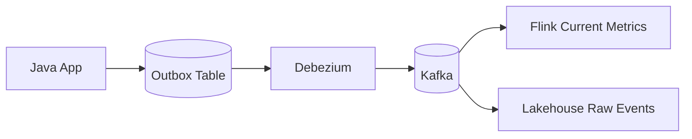

Normal events flow continuously.

### Backfill flow

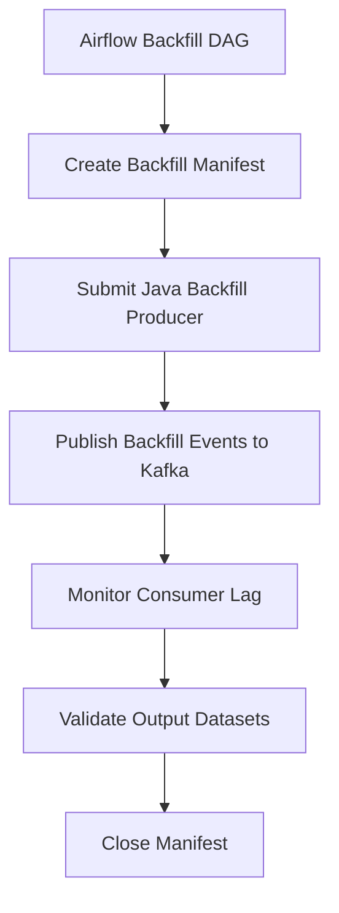

The backfill is orchestrated because it has finite scope, approval, validation, and audit requirements.

The processing is choreographed because consumers react to events as usual.

### Required design rule

Backfill events must be distinguishable:

```json
{
  "eventId": "bf_20260704_000019",
  "eventType": "CaseEscalated",
  "processingMode": "BACKFILL",
  "backfillRunId": "bf_case_2024_replay_001",
  "sourcePosition": "case_events.parquet:rowGroup=17:row=991",
  "occurredAt": "2024-05-10T08:15:00Z"
}
```

Consumers can then decide:

- accept backfill normally
- write to separate namespace
- suppress external notifications
- run in shadow mode
- rebuild only specific projections

---

## 19. Hybrid Pattern: Event-Triggered Orchestration

Sometimes an event should start a finite workflow.

Example:

```text
PartnerFileArrived -> start DAG to validate/import file
DatasetUpdated -> start downstream aggregation
QualityViolationDetected -> start investigation workflow
BackfillRequested -> start approval and execution workflow
```

This is not pure choreography or pure orchestration.

It is event-triggered orchestration.

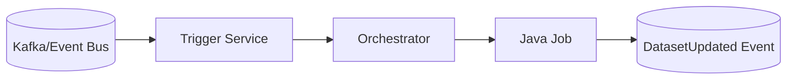

Important rules:

- Event starts a run; it is not the run itself.
- Run manifest records the triggering event ID.
- Trigger service must be idempotent.
- Duplicate trigger events must not create duplicate runs.
- Orchestrator must expose run status.

### Trigger ledger

```sql
CREATE TABLE orchestration_trigger_ledger (
    trigger_event_id TEXT PRIMARY KEY,
    orchestrator_name TEXT NOT NULL,
    pipeline_name TEXT NOT NULL,
    run_id TEXT NOT NULL,
    status TEXT NOT NULL,
    created_at TIMESTAMPTZ NOT NULL DEFAULT now()
);
```

This prevents duplicate event-triggered DAG runs.

---

## 20. Hybrid Pattern: Orchestrated Publish, Choreographed Consumption

Publishing a dataset is often orchestrated.

Consuming that dataset is often choreographed.

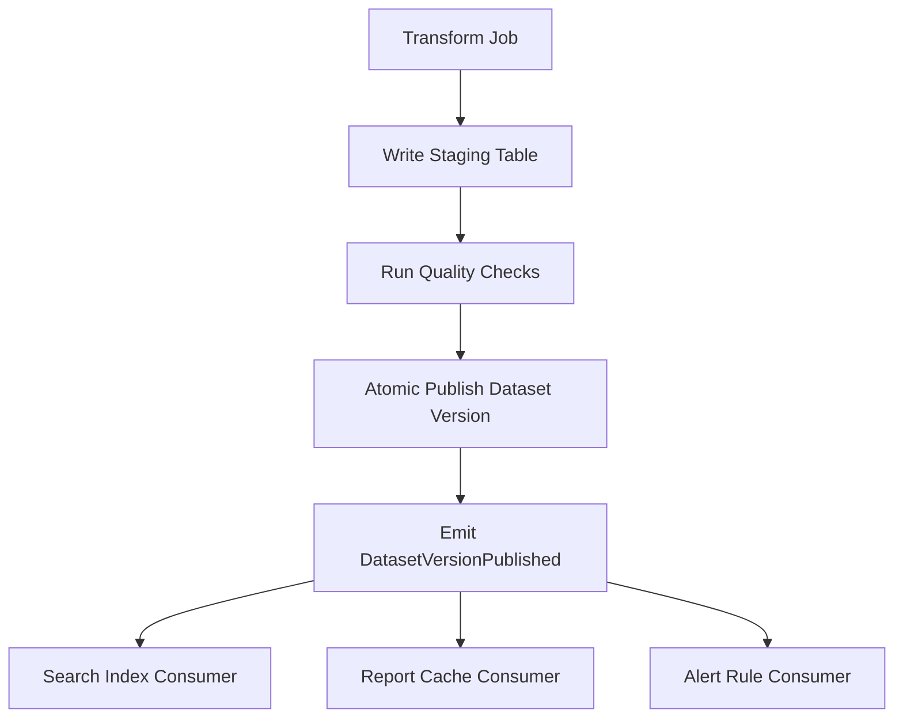

This preserves a strong publish gate while keeping downstream consumption decoupled.

The publish event should include:

```json
{
  "eventType": "DatasetVersionPublished",
  "datasetId": "regulatory.gold.case_daily_snapshot",
  "datasetVersion": "snapshot-000391",
  "runId": "run_20260704_case_gold_v17",
  "qualityStatus": "PASSED",
  "publishedAt": "2026-07-04T04:00:00Z"
}
```

---

## 21. When to Use Airflow

Airflow is a strong fit when:

- work is scheduled or event/asset-triggered
- dependencies are visible as DAGs
- tasks are finite
- operators submit external jobs
- humans need UI-based operation
- reruns and backfills are operationally important
- data quality gates precede publication

Airflow is weak when:

- you need high-throughput record processing
- each message becomes a task
- task count explodes dynamically without bounds
- you need durable business workflow history with long sleeps and signals
- you need low-latency streaming state

Airflow should usually coordinate Java/Spark/Flink jobs, not replace them.

---

## 22. When to Use Temporal

Temporal is a strong fit when:

- workflow is long-running
- activities call unreliable external systems
- retries/timeout/compensation must be durable
- process state must survive worker crashes
- workflow logic is naturally code, not just DAG dependencies
- human approval or external signal may resume the process

Examples:

- case remediation workflow
- data correction approval workflow
- external partner resubmission workflow
- report publication approval
- PII deletion request workflow across systems

Temporal is weak when:

- you need high-throughput per-record stream processing
- workflow history would grow per row/event
- data plane computation is large batch/stream compute
- SQL-style data transformation is the core problem

Temporal can coordinate pipeline-adjacent side effects, but Flink/Spark/Kafka usually process the data.

---

## 23. When to Use Kafka/Flink Choreography

Use Kafka/Flink choreography when:

- events are continuous
- multiple consumers independently react
- record-level latency matters
- stateful event-time processing is needed
- backpressure should propagate through stream processing
- replay from log is natural
- transformations are long-running and continuous

Do not force a stream problem into a DAG scheduler.

---

## 24. Failure Review Checklist

For every pipeline coordination design, answer these before implementation.

### Control state

- Where is run status stored?
- Where is event processing status stored?
- Where is retry state stored?
- Where is human approval state stored?
- Where is publish state stored?

### Idempotency

- What key prevents duplicate run creation?
- What key prevents duplicate task effect?
- What key prevents duplicate event effect?
- What key prevents duplicate external call?

### Replay

- Can records be replayed?
- Can a run be rerun?
- Can a dataset version be republished?
- Can a consumer rebuild from source?
- Can a correction be applied without deleting history?

### Failure propagation

- Does failure block all downstream work or only affected outputs?
- Who is alerted?
- What is the blast radius?
- What is the manual recovery path?
- What evidence is retained?

### Ownership

- Who owns the orchestrator DAG?
- Who owns each consumer?
- Who owns the dataset contract?
- Who owns DLQ replay?
- Who approves backfill?

---

## 25. Production Architecture Blueprint

A mature Java data platform often uses this shape:

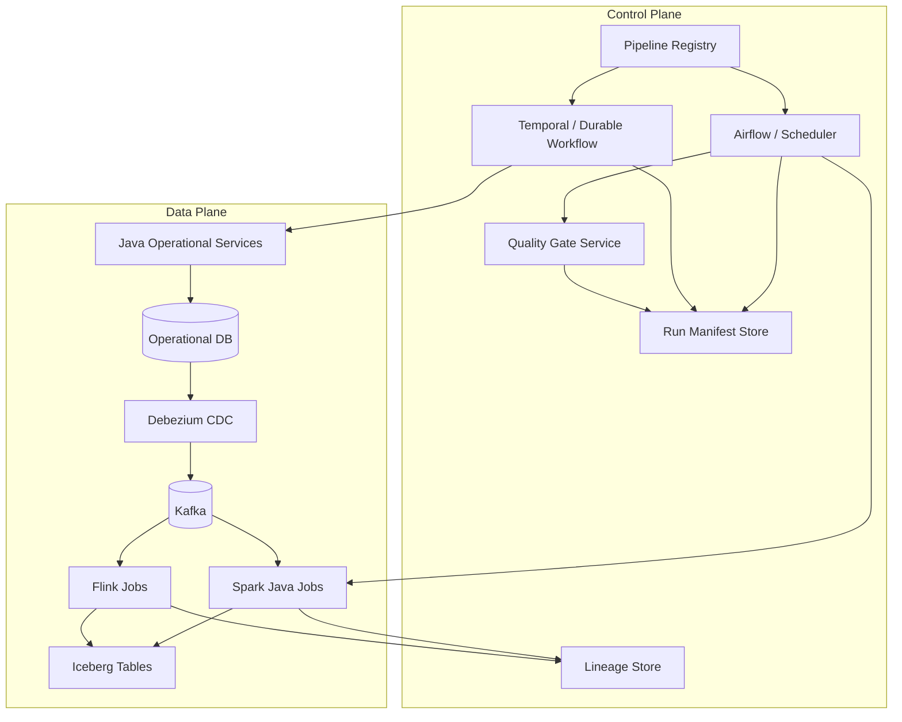

This is not a recommendation to use all tools.

It is a mental model:

- control plane coordinates
- data plane processes
- events decouple
- manifests make bounded work auditable
- lineage connects distributed execution
- quality gates prevent silent corruption

---

## 26. Regulatory Enforcement Example

Suppose we model enforcement lifecycle data.

Domain events:

```text
CaseOpened
EvidenceReceived
CaseAssigned
CaseEscalated
BreachClockStarted
BreachClockPaused
DecisionIssued
CaseClosed
CaseCorrected
```

Choreographed flow:

- case service emits outbox events
- Debezium publishes to Kafka
- Flink computes breach clock state
- Kafka Streams maintains latest case assignment projection
- lake ingestion writes raw canonical events

Orchestrated flow:

- nightly Airflow DAG builds official daily snapshot
- quality gate validates completeness against event counts
- publish task exposes Iceberg snapshot
- report generation task produces audit extract
- correction backfill DAG recomputes affected periods

Durable workflow:

- Temporal handles case correction approval
- activities notify affected business units
- after approval, correction event is emitted

This hybrid model is defensible:

- continuous state is updated quickly
- official reports are published through quality gates
- corrections are explicit
- replay is controlled
- audit evidence is preserved

---

## 27. Anti-Pattern Catalog

### Anti-pattern: One DAG to rule the company

A central DAG coordinates every system and every team.

Failure mode:

- impossible ownership
- huge blast radius
- slow deployment
- central team bottleneck

Better:

- per-domain DAGs
- dataset ownership
- event-driven boundaries
- shared platform standards

### Anti-pattern: No orchestrator because “events are enough”

Everything is event-driven, including backfills, reports, and approvals.

Failure mode:

- invisible execution state
- hard manual recovery
- weak audit trail
- unclear rerun boundary

Better:

- choreograph continuous facts
- orchestrate bounded jobs

### Anti-pattern: Orchestrator executes business logic

DAG tasks contain heavy transformation logic.

Failure mode:

- untestable Python glue
- duplicated logic
- poor local development
- hard migration

Better:

- Java/Spark/Flink owns data logic
- orchestrator submits versioned jobs

### Anti-pattern: Workflow engine as event processor

Each event starts a workflow execution.

Failure mode:

- workflow history explosion
- high overhead
- difficult throughput scaling

Better:

- stream processor handles events
- workflow engine handles exceptional long-running processes

---

## 28. Design Heuristics

Use these as practical defaults.

1. **A scheduler is not a stream processor.**
2. **A message bus is not a workflow history store.**
3. **A DAG success is not data correctness.**
4. **A published event is not proof that all consumers succeeded.**
5. **A retry without idempotency is a duplicate generator.**
6. **A backfill without manifest is an incident waiting to happen.**
7. **A choreographed system without lineage is invisible.**
8. **An orchestrated system without event boundaries becomes tightly coupled.**
9. **Control state always exists; design it deliberately.**
10. **Hybrid is normal; accidental hybrid is dangerous.**

---

## 29. What You Should Be Able to Do Now

After this part, you should be able to:

- distinguish dataflow from control-flow in production decisions
- explain orchestration vs choreography using control state
- choose Airflow, Temporal, Kafka, Flink, or Java services based on failure model
- design run manifests for bounded pipeline execution
- design event contracts for distributed choreography
- identify bad task granularity and bad event granularity
- model retry semantics by coordination boundary
- design hybrid pipelines where orchestration and choreography cooperate

---

## 30. References

- Apache Airflow Documentation — DAGs, scheduling, assets, deferrable operators, dynamic task mapping.
- Temporal Documentation — workflows, activities, retries, Java SDK, durable execution.
- Apache Kafka Documentation — event streaming, topics, partitions, offsets, consumer groups, transactions.
- Apache Flink Documentation — bounded/unbounded streams, stateful processing, checkpoints, watermarks.
- OpenLineage Specification — run, job, dataset metadata model and facets.

---

## 31. Next Part

Next:

```text
learn-java-data-pipeline-pattern-part-058-airflow-dag-design-for-java-pipelines.mdx
```

We will turn the orchestration model into concrete Airflow DAG design for Java pipeline jobs:

- task boundaries
- sensors
- deferrable waiting
- dynamic mapping
- run manifests
- Java job submission
- quality gates
- dataset/asset-triggered scheduling
- lineage emission
- production failure handling
