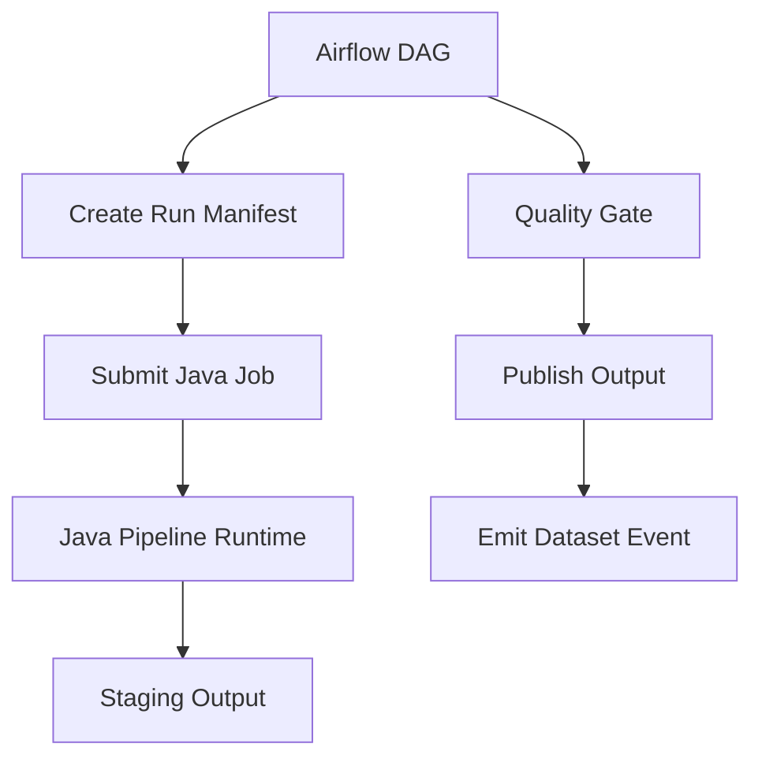
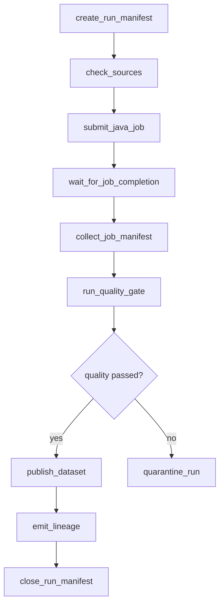
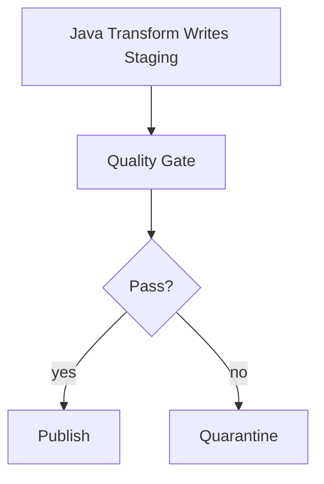
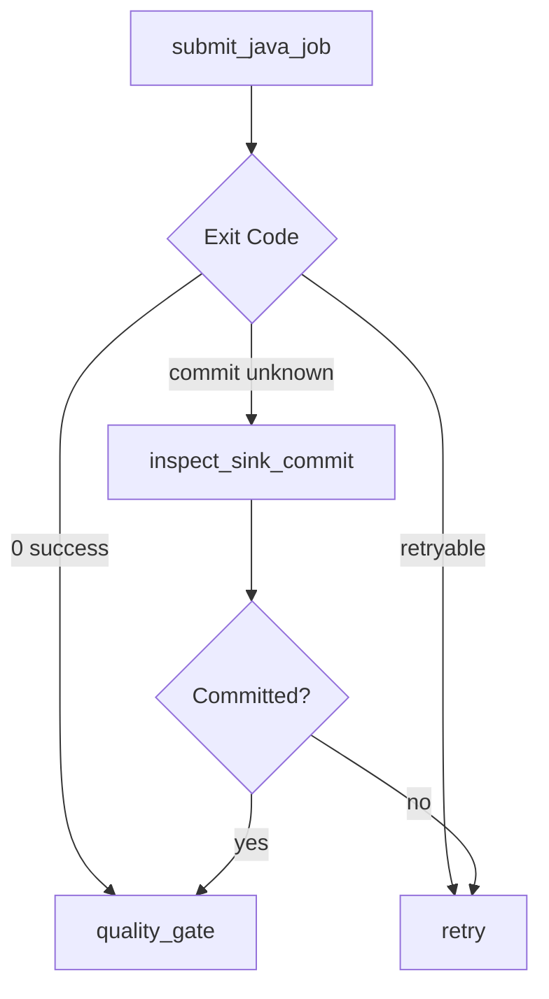
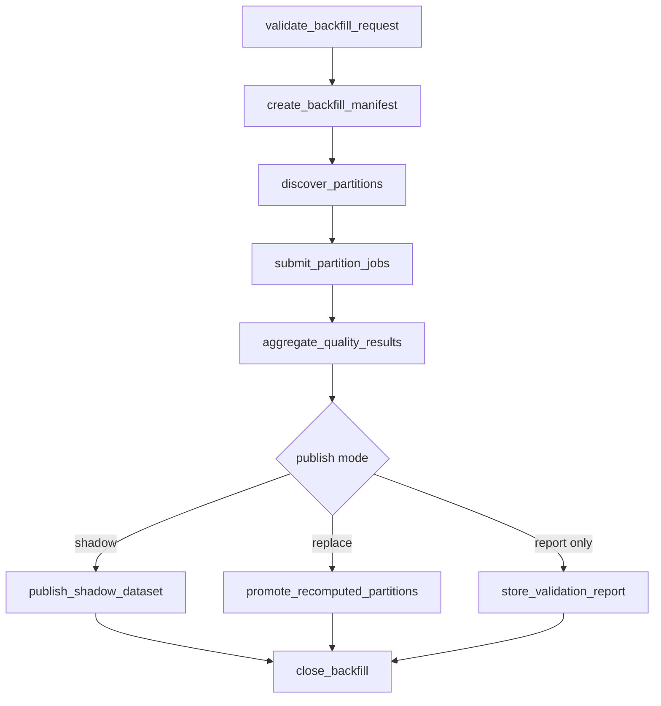
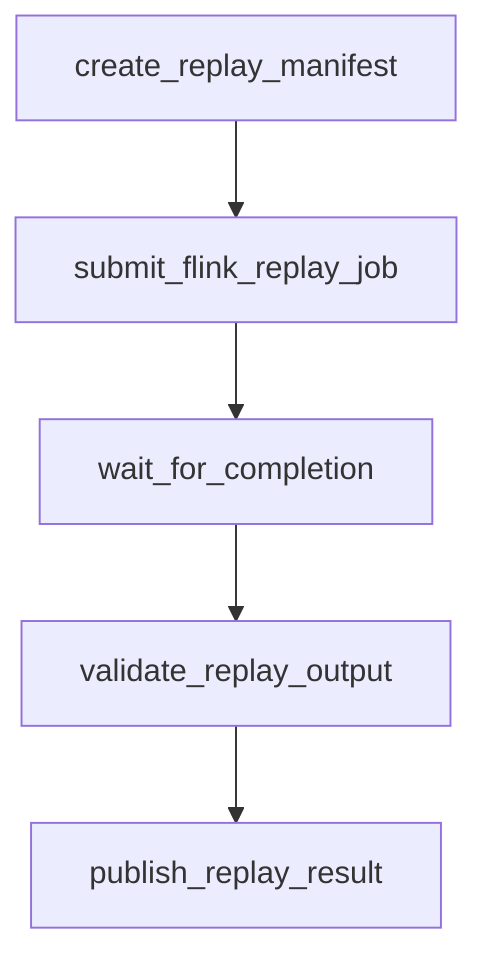
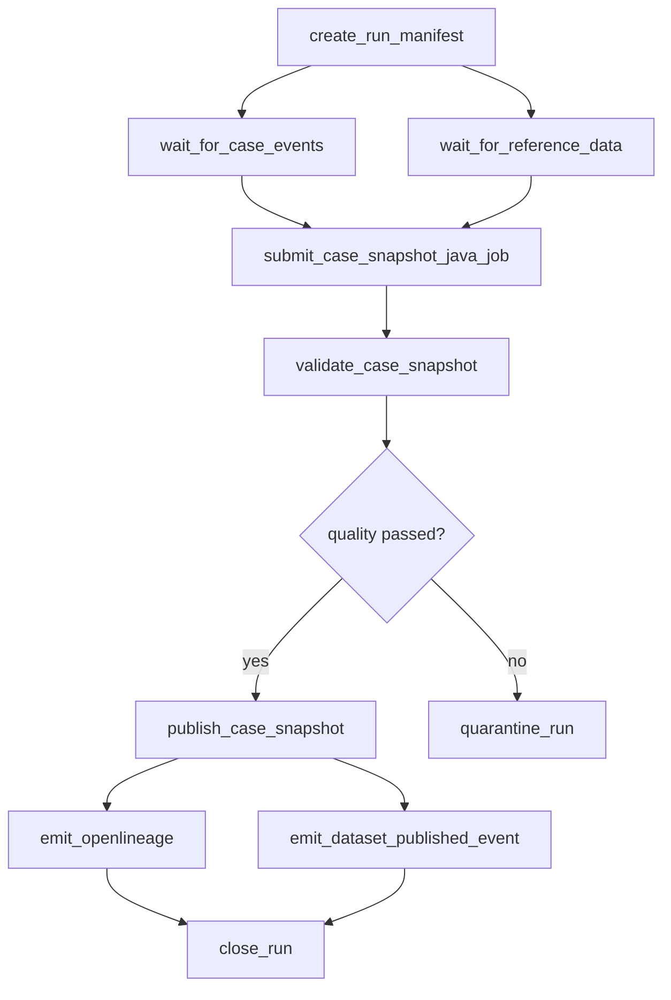

# Part 058 — Airflow DAG Design for Java Pipelines

Airflow is often misunderstood.

It is not a data processing engine.

It is not a streaming engine.

It is not where you should write millions of row transformations.

Airflow is a **workflow orchestrator**. Its best role in Java data platforms is to coordinate finite, observable, retryable units of work:

- submit Java batch jobs
- submit Spark jobs
- coordinate file ingestion
- wait for external availability
- run data quality gates
- publish table versions
- emit lineage
- run backfills
- coordinate report generation

This part shows how to design Airflow DAGs for Java pipelines without turning Airflow into a fragile pile of Python glue.

---

## 1. Mental Model

A good Airflow DAG should answer:

> “What bounded work must happen, in what dependency order, with what retry, validation, and publish semantics?”

A bad Airflow DAG answers:

> “Where can I paste all my pipeline code?”

The distinction matters.

### Airflow should own control-flow

Airflow should decide:

- when the pipeline run starts
- which task depends on which task
- which task can retry
- which task blocks publication
- where task status is recorded
- how humans inspect and rerun work

### Java should own data logic

Java/Spark/Flink jobs should decide:

- how records are parsed
- how domain transformations work
- how contracts are validated
- how sink writes are staged
- how idempotency is enforced
- how reconciliation is computed

The clean architecture is:



Airflow coordinates. Java processes.

---

## 2. Airflow DAG as a Control Contract

A DAG is not just a visual graph. It is a control contract.

For each DAG, define:

```yaml
dagId: regulatory_case_daily_snapshot
owner: enforcement-data-platform
businessPurpose: Produce official daily case snapshot for regulatory reporting
schedule: daily
inputDatasets:
  - regulatory.raw.case_events
  - regulatory.ref.case_policy_versions
outputDatasets:
  - regulatory.gold.case_daily_snapshot
criticality: high
freshnessSlo: published by 06:00 Asia/Jakarta
failureImpact: official reporting dataset unavailable
manualRunSupported: true
backfillSupported: true
```

If this metadata is absent, your DAG is only code. It is not an operational asset.

---

## 3. Task Boundary Principle

A task should be a meaningful **failure, retry, and evidence boundary**.

Good task boundaries:

```text
create_run_manifest
verify_source_availability
submit_java_extract_job
validate_raw_output
submit_java_transform_job
validate_staging_output
publish_dataset_version
emit_lineage
close_run_manifest
```

Bad task boundaries:

```text
process_record_1
process_record_2
process_record_3
```

Also bad:

```text
do_everything
```

### A task is too coarse if:

- you cannot tell which phase failed
- retry repeats unnecessary expensive work
- output cannot be inspected before publish
- audit evidence is hidden in logs

### A task is too fine if:

- task count explodes with row count
- Airflow metadata DB becomes the bottleneck
- scheduler overhead dominates work
- individual tasks are not independently meaningful

### Practical rule

```text
One Airflow task should usually represent one bounded external operation,
not one data record and not the entire pipeline.
```

---

## 4. Standard Java Pipeline DAG Shape

A production Java pipeline DAG often has this structure:



This structure creates explicit boundaries:

- run identity
- source readiness
- processing execution
- quality validation
- publication
- lineage
- run closure

---

## 5. Run Manifest First

Do not start a serious pipeline without a run manifest.

A run manifest is the bridge between Airflow and the Java job.

```json
{
  "runId": "case-daily-snapshot__2026-07-04__attempt-1",
  "dagId": "regulatory_case_daily_snapshot",
  "logicalDate": "2026-07-04",
  "inputScope": {
    "eventDateFrom": "2026-07-03",
    "eventDateTo": "2026-07-04"
  },
  "transformVersion": "case-snapshot-transform:3.8.1",
  "mode": "NORMAL",
  "requestedBy": "airflow",
  "outputTarget": "iceberg://regulatory.gold.case_daily_snapshot/dt=2026-07-03",
  "qualityProfile": "official-reporting-v2"
}
```

### Why manifest first?

Because the Java job needs stable context:

- run ID
- input range
- output target
- transform version
- processing mode
- quality profile
- lineage identity
- backfill/correction mode

Without this, your job reads environment variables, file paths, and dates from scattered configuration.

That becomes unreproducible.

---

## 6. Java Job Contract

The Java job invoked by Airflow should expose a simple contract.

### Command-line interface

```bash
java -jar case-snapshot-pipeline.jar \
  --run-manifest-uri s3://pipeline-manifests/case-daily-snapshot/2026-07-04/manifest.json
```

### Required outputs

The Java job should write:

```text
run-output.json
metrics.json
quality-precheck.json
lineage.json
sink-commit.json
error-report.json, if failed
```

### Example `run-output.json`

```json
{
  "runId": "case-daily-snapshot__2026-07-04__attempt-1",
  "status": "SUCCEEDED",
  "inputRecordCount": 812334,
  "outputRecordCount": 811902,
  "rejectedRecordCount": 432,
  "stagingLocation": "s3://lake/staging/case_daily_snapshot/run=...",
  "checkpoint": {
    "source": "iceberg://regulatory.silver.case_events",
    "snapshotId": "918274981274"
  },
  "startedAt": "2026-07-04T01:00:12Z",
  "finishedAt": "2026-07-04T01:18:44Z"
}
```

Airflow should inspect this structured output, not scrape logs.

---

## 7. Exit Code Contract

A Java job must return meaningful exit codes.

```java
public enum PipelineExitCode {
    SUCCESS(0),
    CONFIGURATION_ERROR(10),
    SOURCE_NOT_READY(20),
    CONTRACT_VIOLATION(30),
    QUALITY_PRECHECK_FAILED(40),
    SINK_WRITE_FAILED(50),
    SINK_COMMIT_UNKNOWN(60),
    NON_RETRYABLE_BUG(70);

    private final int code;

    PipelineExitCode(int code) {
        this.code = code;
    }

    public int code() {
        return code;
    }
}
```

Airflow retry policy can then be sensible:

| Exit class | Retry? | Action |
|---|---:|---|
| Source not ready | Yes | Retry/wait. |
| Temporary sink failure | Yes | Retry with idempotent staging. |
| Contract violation | No | Quarantine and notify owner. |
| Quality failed | No or manual | Block publish. |
| Commit unknown | Manual | Investigate sink state before retry. |
| Code bug | No | Fail fast. |

Do not let every failure return `1`.

---

## 8. Airflow Should Submit, Not Compute

Bad Airflow task:

```python
def transform_cases():
    rows = read_millions_of_rows()
    transformed = []
    for row in rows:
        transformed.append(apply_business_rules(row))
    write_output(transformed)
```

This abuses Airflow workers.

Better Airflow task:

```python
def submit_java_job(run_manifest_uri: str):
    submit_kubernetes_job(
        image="registry.acme.com/case-snapshot-pipeline:3.8.1",
        args=["--run-manifest-uri", run_manifest_uri],
    )
```

The task launches a data-plane job.

The data-plane job does the heavy work.

---

## 9. Deployment Options for Java Jobs

Airflow can submit Java jobs through several execution backends.

| Backend | Use when | Caution |
|---|---|---|
| BashOperator calling `java -jar` | Simple local worker deployment | Weak isolation and dependency management. |
| DockerOperator | Containerized jobs on worker-accessible Docker | Operationally constrained in many clusters. |
| KubernetesPodOperator | Kubernetes-native job execution | Need image/version/resource discipline. |
| SparkSubmitOperator | Spark cluster manages execution | Best for Spark jobs; inspect driver/executor logs. |
| EMR/Dataproc/Glue operators | Cloud-managed Spark jobs | Cloud-specific behavior and IAM complexity. |
| Custom operator | Repeated enterprise pattern | Must implement lineage, retries, status cleanly. |

For serious platforms, Kubernetes or managed Spark submission is usually cleaner than running heavy Java directly on Airflow workers.

---

## 10. DAG Skeleton

This is a simplified conceptual skeleton.

Provider imports differ by Airflow version and provider package, so treat this as design structure, not copy-paste API reference.

```python
from __future__ import annotations

import json
from datetime import datetime, timedelta

from airflow.decorators import dag, task

DAG_ID = "regulatory_case_daily_snapshot"
PIPELINE_IMAGE = "registry.acme.com/case-snapshot-pipeline:3.8.1"

@dag(
    dag_id=DAG_ID,
    start_date=datetime(2026, 1, 1),
    schedule="0 1 * * *",
    catchup=True,
    max_active_runs=1,
    default_args={
        "owner": "enforcement-data-platform",
        "retries": 2,
        "retry_delay": timedelta(minutes=10),
    },
    tags=["java", "regulatory", "gold", "case"],
)
def case_daily_snapshot():

    @task
    def create_run_manifest(logical_date: str) -> str:
        manifest = {
            "dagId": DAG_ID,
            "logicalDate": logical_date,
            "pipelineName": "case-daily-snapshot",
            "transformVersion": "3.8.1",
            "mode": "NORMAL",
        }
        # write manifest to object storage or manifest service
        return write_manifest(manifest)

    @task
    def check_sources(manifest_uri: str) -> str:
        manifest = read_manifest(manifest_uri)
        # verify required upstream dataset snapshots exist
        # return same manifest URI after updating readiness evidence
        return manifest_uri

    @task
    def submit_java_job(manifest_uri: str) -> str:
        # submit Kubernetes/Spark/Batch job with manifest URI
        # wait or return external job ID depending on operator design
        return submit_job_and_wait(
            image=PIPELINE_IMAGE,
            args=["--run-manifest-uri", manifest_uri],
        )

    @task
    def run_quality_gate(job_result_uri: str) -> str:
        result = read_json(job_result_uri)
        assert_quality(result)
        return job_result_uri

    @task
    def publish_dataset(job_result_uri: str) -> str:
        result = read_json(job_result_uri)
        return publish_staging_output(result)

    @task
    def emit_lineage(published_version_uri: str) -> None:
        emit_openlineage_event(published_version_uri)

    manifest_uri = create_run_manifest("{{ ds }}")
    ready_manifest_uri = check_sources(manifest_uri)
    job_result_uri = submit_java_job(ready_manifest_uri)
    quality_result_uri = run_quality_gate(job_result_uri)
    published_version_uri = publish_dataset(quality_result_uri)
    emit_lineage(published_version_uri)

case_daily_snapshot()
```

The real functions `write_manifest`, `read_manifest`, `submit_job_and_wait`, `assert_quality`, `publish_staging_output`, and `emit_openlineage_event` should live in shared platform libraries.

Do not duplicate them in every DAG.

---

## 11. Scheduling Model

Airflow scheduling is part of correctness.

A DAG may run because of:

- cron schedule
- manual trigger
- backfill/catchup
- upstream dataset/asset update
- external event bridge
- SLA remediation

### Cron schedule

Use for time-based pipelines:

```text
Every day at 01:00, build yesterday’s official snapshot.
```

Risk:

- upstream data may not be ready
- time schedule hides dependency on data availability

Mitigation:

- source readiness checks
- sensors
- asset-aware scheduling
- freshness guard

### Asset/dataset-triggered schedule

Use when downstream work should run after upstream data updates.

```text
When silver.case_events and reference.case_policy_versions are updated,
run gold.case_daily_snapshot.
```

Risk:

- multiple updates may trigger too often
- quality of upstream update may still be bad

Mitigation:

- trigger consolidation
- quality state in dataset event
- max active runs
- run manifest dedupe

### Manual trigger

Use for:

- incident repair
- correction replay
- targeted backfill
- one-off publication

Risk:

- undocumented parameters
- accidental duplicate outputs

Mitigation:

- explicit parameter schema
- run manifest validation
- approval controls for production datasets

---

## 12. Catchup and Backfill

Airflow catchup can be useful, but dangerous.

If a daily DAG has catchup enabled and has missed 120 days, Airflow may schedule 120 runs.

That can be correct for partitioned recomputation.

It can also destroy your platform if every run launches expensive Spark jobs at once.

### Design rules

Set:

```python
max_active_runs=1
```

or a small number when output partitions are independent.

Use pools or concurrency limits for expensive pipelines.

Define whether backfill runs:

- overwrite partitions
- append new versions
- create restatement snapshots
- write to shadow namespace
- suppress external notifications

### Backfill manifest

```json
{
  "mode": "BACKFILL",
  "backfillRunId": "bf_case_snapshot_2024_q4_v2",
  "dateRange": {
    "from": "2024-10-01",
    "to": "2024-12-31"
  },
  "publishMode": "SHADOW_THEN_PROMOTE",
  "suppressNotifications": true,
  "requestedBy": "data-platform-oncall",
  "approvedBy": "regulatory-reporting-owner"
}
```

Backfill is not just “rerun old dates”. It is a controlled operational mode.

---

## 13. Sensors and Waiting

Waiting is common:

- wait for file arrival
- wait for upstream table snapshot
- wait for external API export
- wait for Spark job completion
- wait for quality report
- wait for downstream consumer lag to drain

But waiting consumes resources if done badly.

### Poor waiting pattern

```python
while not source_ready():
    time.sleep(60)
```

This occupies a worker slot.

### Better waiting pattern

Use sensors designed for Airflow, and where available, prefer deferrable operators/sensors so waiting can be offloaded from workers.

Conceptually:

```python
wait_for_partner_file = DeferrableFileSensor(
    task_id="wait_for_partner_file",
    path="s3://landing/partner/{{ ds }}/manifest.json",
    timeout=60 * 60 * 4,
)
```

The exact class depends on provider support.

The design principle is stable:

> Waiting should not waste compute that should execute work.

---

## 14. Dynamic Task Mapping

Dynamic task mapping is useful when the amount of work is known at runtime.

Examples:

- one task per detected partition
- one task per partner file
- one task per tenant
- one task per independent source table

Do not use it for row-level processing.

### Good dynamic mapping scope

```text
100 partitions -> 100 mapped tasks may be fine.
100 million rows -> 100 million mapped tasks is catastrophic.
```

### Example conceptual pattern

```python
@task
def discover_partitions(manifest_uri: str) -> list[dict]:
    return [
        {"dt": "2026-07-01"},
        {"dt": "2026-07-02"},
        {"dt": "2026-07-03"},
    ]

@task
def submit_partition_job(partition: dict) -> str:
    return submit_java_partition_job(partition)

partitions = discover_partitions(manifest_uri)
results = submit_partition_job.expand(partition=partitions)
```

### Guardrails

- cap max mapped tasks
- group small partitions
- use pools
- use per-partition manifest
- preserve partition-level output evidence
- avoid dynamic task IDs that hide lineage

---

## 15. Source Readiness Checks

A source is ready only when it satisfies its contract.

Not enough:

```text
file exists
```

Better:

```text
file exists
manifest exists
file size stable
checksum matches
row count matches trailer
source extract status is COMPLETED
source partition watermark >= required time
```

### Java-style source readiness record

```json
{
  "source": "partner-enforcement-file",
  "partition": "dt=2026-07-03",
  "ready": true,
  "evidence": {
    "manifestFound": true,
    "checksumMatched": true,
    "recordCount": 98122,
    "producerStatus": "COMPLETED"
  }
}
```

Airflow should not simply check existence and move on.

---

## 16. Quality Gates

A quality gate is a control-flow decision based on data evidence.



Quality gate examples:

- row count within expected range
- required columns non-null
- uniqueness constraints hold
- referential checks pass
- checksum reconciliation passes
- sensitive data policy passes
- freshness is acceptable
- output grain is valid

### Quality result

```json
{
  "runId": "case-daily-snapshot__2026-07-04__attempt-1",
  "status": "FAILED",
  "checks": [
    {
      "name": "case_id_not_null",
      "severity": "BLOCKER",
      "failedCount": 0
    },
    {
      "name": "event_count_reconciliation",
      "severity": "BLOCKER",
      "expected": 812334,
      "actual": 811902,
      "difference": 432
    }
  ]
}
```

Do not publish official datasets if blocker checks fail.

---

## 17. Publish Step

Publishing should be explicit.

The transform writes staging output.

The publish task promotes it.

```text
transform -> staging output -> validation -> publish pointer/version
```

This avoids half-published datasets.

### Publish patterns

| Pattern | Use when |
|---|---|
| Atomic rename | File system supports atomic rename semantics. |
| Catalog pointer update | Lakehouse table snapshot/catalog controls visibility. |
| Replace partition | Partition output is independently recomputable. |
| Versioned publish | Consumers can select dataset version. |
| View switch | Presentation layer points to new version. |

### Publish record

```json
{
  "datasetId": "regulatory.gold.case_daily_snapshot",
  "datasetVersion": "snapshot-918274981274",
  "runId": "case-daily-snapshot__2026-07-04__attempt-1",
  "publishedAt": "2026-07-04T02:00:00Z",
  "publishedBy": "airflow",
  "qualityStatus": "PASSED"
}
```

Publication is a business and operational boundary, not just a file write.

---

## 18. Retry Design

Airflow retries tasks. That does not automatically make the pipeline safe.

Every retried task must be idempotent.

### Retry-safe task examples

| Task | Safe if |
|---|---|
| create manifest | `runId` is unique and create is idempotent. |
| check source | read-only. |
| submit Java job | submission has idempotency key. |
| write staging | staging path includes run attempt or is cleaned safely. |
| quality gate | read-only over stable staging output. |
| publish | publish operation is atomic and idempotent. |
| emit lineage | lineage event has stable run/job identity. |

### Dangerous retry

```text
Task failed after writing output but before reporting success.
Airflow retries.
Second attempt writes duplicate output.
```

Fix:

- write to run-specific staging
- use sink commit ledger
- make publish idempotent
- check existing output before writing
- treat unknown commit separately

---

## 19. Unknown Commit Outcome

This is one of the most dangerous production states.

Example:

```text
Java job writes output.
Network timeout occurs before it confirms commit.
Airflow marks task failed.
```

Was the output committed?

Maybe.

A blind retry may duplicate or corrupt.

### Required handling

The Java job should write a commit record:

```json
{
  "runId": "case-daily-snapshot__2026-07-04__attempt-1",
  "sink": "iceberg://regulatory.gold.case_daily_snapshot",
  "stagingLocation": "s3://lake/staging/...",
  "commitState": "COMMITTED",
  "committedSnapshotId": "918274981274"
}
```

If Airflow receives `SINK_COMMIT_UNKNOWN`, route to manual recovery or a safe commit-inspection task.



---

## 20. XCom Discipline

Do not push large data through Airflow XCom.

Use XCom for small control metadata:

- manifest URI
- job ID
- output URI
- dataset version ID
- quality result URI

Do not use it for:

- records
- large JSON payloads
- dataframes
- file contents
- millions of IDs

Pattern:

```text
XCom carries pointer, object storage carries payload.
```

Example:

```python
return "s3://pipeline-runs/case-daily/2026-07-04/run-output.json"
```

Not:

```python
return entire_output_dataframe
```

---

## 21. Pools, Concurrency, and Blast Radius

Airflow can launch too much work if unbounded.

Use:

- `max_active_runs`
- task concurrency
- pools
- queue separation
- priority weights
- environment separation

### Example concurrency policy

```yaml
pipeline: regulatory_case_daily_snapshot
maxActiveRuns: 1
pool: gold_publication_pool
maxParallelPartitions: 8
sparkClusterQueue: regulatory-critical
backfillApprovalRequired: true
```

### Why this matters

Without concurrency control:

- catchup can overload source systems
- backfill can starve daily pipelines
- retries can create storm behavior
- multiple runs can publish conflicting outputs

Orchestration is also capacity governance.

---

## 22. DAG Parameters and Validation

Manual runs need parameters.

But parameters must be validated.

Example:

```json
{
  "mode": "BACKFILL",
  "fromDate": "2026-01-01",
  "toDate": "2026-01-31",
  "publishMode": "SHADOW",
  "reason": "Recompute after policy rule v4 fix"
}
```

Validation rules:

- `fromDate <= toDate`
- date range within allowed maximum
- production publish requires approval
- `NORMAL` mode cannot override transform version manually
- `BACKFILL` mode must include reason
- `CORRECTION` mode must include correction ticket

Do not trust manually supplied parameters.

---

## 23. Environment and Configuration

Avoid hardcoding environment-specific values in DAG files.

Bad:

```python
S3_BUCKET = "prod-regulatory-data-lake"
DB_PASSWORD = "..."
```

Better:

- environment-specific deployment config
- secret manager
- Airflow connections for connection metadata
- runtime manifest for pipeline parameters
- image tag for transform version

### Configuration layers

| Layer | Example | Should change how often? |
|---|---|---|
| Code | DAG structure | Rarely |
| Pipeline registry | dataset owners, quality profile | Occasionally |
| Runtime manifest | date range, mode, run ID | Every run |
| Secrets | credentials | Rotated |
| Infrastructure | cluster, queue, resource class | Platform-managed |

---

## 24. Observability

Airflow gives task status, not full pipeline observability.

You need additional signals.

### Airflow-level metrics

- DAG run duration
- task duration
- retries
- failures by task
- schedule delay
- queue delay
- SLA misses

### Java job metrics

- input records
- output records
- rejected records
- throughput
- stage duration
- source latency
- sink commit latency
- memory/GC

### Data quality metrics

- failed checks
- null ratio
- duplicate count
- referential violations
- freshness
- reconciliation delta

### Dataset metrics

- published version
- row count
- partition count
- table snapshot ID
- consumer freshness

Airflow is one lens. It is not the whole observability platform.

---

## 25. Lineage

Lineage should connect:

```text
Airflow DAG run -> task -> Java job -> input datasets -> output datasets -> published version
```

OpenLineage-style concepts are useful:

- run
- job
- dataset
- input dataset
- output dataset
- facets for metadata

### Example lineage event shape

```json
{
  "eventType": "COMPLETE",
  "eventTime": "2026-07-04T02:00:00Z",
  "run": {
    "runId": "case-daily-snapshot__2026-07-04__attempt-1"
  },
  "job": {
    "namespace": "airflow.prod",
    "name": "regulatory_case_daily_snapshot.submit_java_job"
  },
  "inputs": [
    {
      "namespace": "iceberg.prod",
      "name": "regulatory.silver.case_events"
    }
  ],
  "outputs": [
    {
      "namespace": "iceberg.prod",
      "name": "regulatory.gold.case_daily_snapshot"
    }
  ]
}
```

Lineage must not be afterthought logs. It is part of production evidence.

---

## 26. Logging Contract

Java job logs should be structured.

Minimum fields:

```text
runId
pipelineName
taskName
attempt
stage
datasetId
partition
tenantId, if applicable
traceId
correlationId
severity
errorCode
```

Example:

```json
{
  "level": "INFO",
  "runId": "case-daily-snapshot__2026-07-04__attempt-1",
  "stage": "write_staging",
  "datasetId": "regulatory.gold.case_daily_snapshot",
  "partition": "dt=2026-07-03",
  "message": "Staging write complete",
  "outputRecordCount": 811902
}
```

Airflow task logs should show control-flow decisions.

Java logs should show data-plane execution.

---

## 27. Alerting

Alerting should be tied to impact, not just failure.

### Useful alert dimensions

- DAG failed
- critical task failed
- quality gate failed
- publish delayed
- freshness SLO breached
- source unavailable
- repeated retries
- unknown commit state
- backfill exceeded cost/time limit

### Alert payload

```json
{
  "severity": "HIGH",
  "pipeline": "regulatory_case_daily_snapshot",
  "runId": "case-daily-snapshot__2026-07-04__attempt-1",
  "failedTask": "run_quality_gate",
  "impact": "Official case daily snapshot not published",
  "owner": "enforcement-data-platform",
  "runbook": "https://runbooks.acme/regulatory-case-daily-snapshot",
  "nextAction": "Inspect quality result URI"
}
```

Do not alert with only:

```text
Task failed.
```

That is not operationally useful.

---

## 28. Security and Secrets

Airflow often has broad access. Treat it carefully.

Rules:

- do not store secrets in DAG code
- use connections/secret backends
- limit Airflow service account privileges
- use separate identities for Java data-plane jobs
- do not let every DAG write every dataset
- propagate identity into run manifest
- log who triggered manual runs

### Identity separation

```text
Airflow scheduler identity:
  can submit job
  can read/write run manifest
  cannot directly mutate protected gold table unless through publish service

Java job identity:
  can read specific input datasets
  can write staging area
  cannot publish official version unless publish token/approval exists

Publish service identity:
  can promote validated staging output
```

This prevents the orchestrator from becoming an uncontrolled superuser.

---

## 29. Multi-Tenant DAG Design

If the same pipeline runs for multiple tenants, avoid copy-pasting DAGs blindly.

Options:

1. One DAG per tenant.
2. One DAG with tenant parameter.
3. Dynamic task mapping over tenants.
4. Platform-generated DAGs from registry.

### Decision matrix

| Model | Good for | Risk |
|---|---|---|
| DAG per tenant | Strong isolation and ownership | Many DAGs to manage. |
| Parameterized DAG | Simple common logic | Manual run mistakes. |
| Dynamic tenant mapping | Shared schedule, parallelism | One tenant failure may complicate run state. |
| Generated DAGs | Platform scale | Generator becomes critical system. |

### Tenant isolation rules

- tenant-specific run manifest
- tenant-specific output namespace or partition
- tenant-specific quality result
- tenant-specific retry limit
- tenant-specific access control
- tenant-specific lineage facet

---

## 30. Backfill DAG Design

Do not overload the daily DAG with complex backfill logic unless the backfill semantics are truly identical.

Often you need a separate backfill DAG.

### Backfill DAG shape



Backfill must define:

- date range
- transform version
- source snapshot version
- publish mode
- approval
- notification suppression
- cost budget
- rollback strategy

---

## 31. Airflow + Kafka Boundary

Airflow can interact with Kafka, but be careful.

Good uses:

- emit `DatasetVersionPublished` after publish
- trigger a DAG from a compacted control topic through a bridge
- wait for consumer lag to drain after backfill
- submit bounded replay job

Bad uses:

- one DAG run per Kafka event
- Airflow task as Kafka consumer loop
- Airflow as event bus
- storing Kafka payloads in XCom

### Pattern: publish event after dataset commit

```json
{
  "eventType": "DatasetVersionPublished",
  "datasetId": "regulatory.gold.case_daily_snapshot",
  "datasetVersion": "snapshot-918274981274",
  "runId": "case-daily-snapshot__2026-07-04__attempt-1"
}
```

Downstream systems react through Kafka.

Airflow does not directly call every consumer.

---

## 32. Airflow + Flink Boundary

For Flink, Airflow usually coordinates bounded operations:

- deploy/update job
- trigger savepoint
- stop with savepoint
- run bounded replay job
- validate output after replay

Airflow should not supervise every record.

### Example bounded Flink replay orchestration



For continuous Flink jobs, use dedicated platform/job manager monitoring for runtime health, not a daily Airflow task pretending to run the stream.

---

## 33. Airflow + Spark Boundary

Spark fits Airflow well when the Spark job is finite.

Airflow controls:

- schedule
- parameters
- submission
- dependency
- retry
- quality gate
- publish

Spark controls:

- distributed read
- transform
- shuffle
- aggregation
- write
- checkpoint/staging

### Spark Java command

```bash
spark-submit \
  --class com.acme.pipeline.casegold.CaseDailySnapshotJob \
  --conf spark.sql.shuffle.partitions=800 \
  s3://artifacts/case-snapshot-pipeline-3.8.1.jar \
  --run-manifest-uri s3://pipeline-runs/case/2026-07-04/manifest.json
```

The DAG should not contain Spark transformation code.

---

## 34. DAG Testing

A DAG needs tests just like Java code.

Test categories:

### Parse test

- DAG imports successfully
- task IDs are stable
- dependencies are correct

### Parameter validation test

- invalid manual config fails
- date range maximum enforced
- publish mode rules enforced

### Manifest test

- created manifest contains required fields
- logical date mapping is correct
- backfill mode differs from normal mode

### Dependency test

- publish depends on quality gate
- quality gate depends on transform
- lineage emission depends on publish

### Idempotency test

- duplicate trigger event maps to same run or is rejected
- rerun does not create duplicate manifest

### Failure-path test

- quality failure routes to quarantine
- commit unknown routes to inspection
- source unavailable retries/waits

Do not only test that the DAG imports.

---

## 35. Operational Runbook

Every production DAG needs a runbook.

Minimum sections:

```text
Pipeline purpose
Owner
Input datasets
Output datasets
Schedule
Freshness SLO
Quality gates
Common failures
How to rerun one partition
How to run backfill
How to inspect Java job logs
How to inspect sink commit state
How to handle unknown commit
How to replay DLQ or rejected data
How to contact upstream owner
How to disable publication safely
```

Airflow UI helps with operations, but only if the recovery process is designed.

---

## 36. Regulatory Enforcement Example DAG

Suppose we build official daily case snapshot.

### Inputs

```text
regulatory.silver.case_events
regulatory.silver.case_assignments
regulatory.ref.policy_versions
regulatory.ref.regional_units
```

### Output

```text
regulatory.gold.case_daily_snapshot
```

### DAG



### Quality checks

```text
case_id is not null
one row per case_id per snapshot_date
open cases count reconciles with event-derived ledger
closed cases do not have active breach clocks
regional_unit_id exists in reference table
PII fields are absent from gold reporting table
snapshot freshness <= 6 hours
```

### Failure policy

| Failure | Action |
|---|---|
| Missing case events input | Wait/retry. |
| Missing reference data | Fail and notify reference owner. |
| Java transform failure | Retry if retryable; otherwise fail. |
| Quality failure | Quarantine, block publish. |
| Publish unknown | Inspect table snapshot before retry. |
| Lineage emit failure | Retry; if still fails, mark run degraded but do not corrupt data. |

---

## 37. Common Airflow Anti-Patterns

### Anti-pattern: Business rules in DAG code

Bad:

```python
if case["severity"] == "HIGH" and case["age"] > 30:
    case["breach"] = True
```

Business rules belong in versioned Java transformation code, not orchestration glue.

### Anti-pattern: XCom as database

Do not pass large data through XCom.

### Anti-pattern: No publish boundary

Writing directly to final table from transform job makes quality gate meaningless.

### Anti-pattern: Unlimited catchup

Catchup without concurrency/cost control can trigger platform incidents.

### Anti-pattern: Silent skips

Skipped tasks must have business meaning. Do not skip failed quality gates to make the DAG green.

### Anti-pattern: Manual rerun with different code version

Rerun must record transform version. Otherwise output is not reproducible.

### Anti-pattern: Logs as evidence

Logs are not enough. Store structured manifests, quality reports, commit records, and lineage events.

---

## 38. Production Checklist

Before promoting an Airflow DAG for a Java data pipeline, verify:

### DAG design

- [ ] DAG has owner, purpose, schedule, input, output, SLO.
- [ ] Tasks represent meaningful retry/failure boundaries.
- [ ] Heavy data processing is not done inside Airflow workers.
- [ ] `max_active_runs`, pools, and concurrency limits are set.
- [ ] Catchup behavior is intentional.

### Java job integration

- [ ] Java job accepts run manifest URI.
- [ ] Java job emits structured run output.
- [ ] Java job has meaningful exit codes.
- [ ] Transform version is recorded.
- [ ] Logs contain run ID and task context.

### Correctness

- [ ] Source readiness checks use contract evidence.
- [ ] Output is staged before publish.
- [ ] Quality gate blocks publication.
- [ ] Publish is atomic/idempotent.
- [ ] Unknown commit state has recovery path.

### Operations

- [ ] Runbook exists.
- [ ] Alerts include impact and next action.
- [ ] Manual parameters are validated.
- [ ] Backfill mode is explicit.
- [ ] Lineage is emitted.
- [ ] Dataset publish event is emitted after commit.

### Security

- [ ] Secrets are not in DAG code.
- [ ] Airflow identity is least-privileged.
- [ ] Java job identity is scoped to required data.
- [ ] Manual production publish requires appropriate approval.

---

## 39. Final Mental Model

Airflow is powerful when it is used as a **control plane**.

It becomes fragile when it becomes a **data plane**.

For Java data pipelines:

```text
Airflow owns:
  schedule, dependencies, run state, retries, visibility, publish gate

Java owns:
  parsing, transformation, validation logic, sink protocol, metrics, domain correctness

Lakehouse/Kafka/Flink/Spark own:
  scalable data movement and processing

Manifest/lineage/quality systems own:
  evidence and governance
```

A top-tier design does not ask Airflow to do everything.

It makes every boundary explicit.

---

## 40. References

- Apache Airflow Documentation — DAG authoring, scheduling, asset-aware scheduling, dynamic task mapping, sensors, deferrable operators.
- Apache Airflow Providers — Kubernetes, Spark, OpenLineage provider documentation.
- Apache Spark Documentation — `spark-submit`, Java APIs, Spark SQL, Structured Streaming.
- OpenLineage Specification — run/job/dataset lineage model and facets.
- Apache Iceberg Documentation — snapshot publication, table metadata, optimistic commits, maintenance.

---

## 41. Next Part

Next:

```text
learn-java-data-pipeline-pattern-part-059-asset-centric-orchestration.mdx
```

We will move from task-centric DAGs to asset-centric orchestration:

- dataset as first-class object
- freshness contracts
- dependency graph by data product
- asset materialization
- lineage-driven impact analysis
- task graph vs asset graph
- ownership and governance at dataset boundary
