# Part 059 — Asset-Centric Orchestration

Most pipeline orchestration starts with tasks:

```text
extract -> transform -> load -> report
```

That is useful, but incomplete.

A task-centric view answers:

> Did the job run?

A production data platform needs stronger questions:

> Which data asset is now trustworthy?
>
> Which downstream assets are stale?
>
> Which reports depend on a broken transformation?
>
> Which consumers are affected by a schema or quality violation?
>
> What is the smallest safe rerun scope?
>
> Which version of input data produced this output?

That is the shift from **task-centric orchestration** to **asset-centric orchestration**.

A data pipeline is not valuable because tasks ran. It is valuable because it produced, updated, validated, or published **data assets** that other systems trust.

---

## 1. The Core Idea

An **asset** is a persistent, named, governed data object with business meaning.

Examples:

- Kafka topic: `case.lifecycle.events.v1`
- Iceberg table: `silver.case_status_history`
- PostgreSQL projection: `case_current_state`
- Search index: `case-search-v3`
- Feature table: `risk_score_features_daily`
- Report dataset: `gold.enforcement_sla_report_daily`
- File partition: `s3://landing/enforcement/cases/date=2026-07-04/`
- Materialized view: `case_assignment_workload_mv`

A **task** is an execution step.

An **asset** is the thing that survives execution.

The asset-centric model says:

```text
Orchestration should be organized around the state, health, freshness, and dependency graph of data assets — not only around the order of tasks.
```

---

## 2. Task-Centric vs Asset-Centric

### Task-centric orchestration

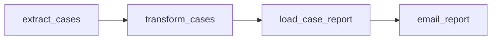

This graph is about **execution order**.

It tells us:

- task `B` depends on task `A`
- task `C` depends on task `B`
- task `D` depends on task `C`

It does not directly tell us:

- which table was produced
- whether the table is fresh
- whether output data passed quality checks
- whether downstream reports are stale
- whether a schema change broke consumers
- whether rerunning `B` is enough

### Asset-centric orchestration

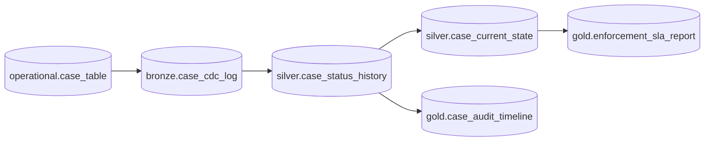

This graph is about **data dependency**.

It tells us:

- `silver.case_status_history` depends on `bronze.case_cdc_log`
- `gold.enforcement_sla_report` depends on `silver.case_current_state`
- `gold.case_audit_timeline` depends on historical case status
- if `bronze.case_cdc_log` is corrupted, many downstream assets are suspect

In production, you need both:

```text
Task graph = how work executes.
Asset graph = what data state the work creates.
```

A mature platform connects them.

---

## 3. Why Asset-Centric Orchestration Matters

Task-centric systems fail subtly.

A task can succeed while the data is wrong.

Examples:

- a job exits `0`, but writes zero rows
- a report table is updated, but based on stale upstream data
- a Kafka consumer keeps running, but one partition is 6 hours behind
- a transformation succeeds, but silently drops invalid events
- a backfill completes, but uses a different transformation version
- a table exists, but no longer satisfies downstream schema assumptions

The production invariant is not:

```text
All tasks succeeded.
```

The production invariant is:

```text
Every published asset satisfies its freshness, completeness, quality, schema, lineage, and access-control contract.
```

---

## 4. The Asset Lifecycle

A production data asset has lifecycle states.

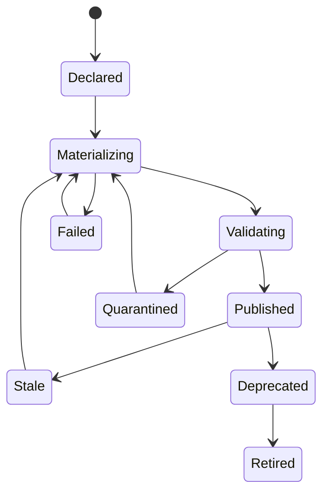

### State meanings

| State | Meaning |
|---|---|
| `Declared` | Asset is known to the platform but may not exist yet. |
| `Materializing` | A run is creating or updating the asset. |
| `Validating` | Output exists in staging, but publication is blocked by checks. |
| `Published` | Asset is visible to consumers and satisfies its contract. |
| `Stale` | Asset exists, but freshness objective is violated or upstream changed. |
| `Failed` | Last materialization failed before producing a valid output. |
| `Quarantined` | Output was produced but rejected due to data quality, schema, or policy issue. |
| `Deprecated` | Asset is still available but should not gain new consumers. |
| `Retired` | Asset is no longer maintained or available. |

The lifecycle makes asset state explicit. Without it, teams infer health from logs, job names, or Slack messages.

That does not scale.

---

## 5. Asset Contract

An asset must have a contract.

A minimal asset contract:

```yaml
asset: silver.case_current_state
owner: enforcement-data-platform
kind: iceberg_table
grain: one row per case_id
primaryKey:
  - case_id
freshness:
  maxLag: PT15M
quality:
  - name: case_id_not_null
    severity: block_publish
  - name: status_in_allowed_set
    severity: block_publish
  - name: no_duplicate_current_case
    severity: block_publish
schemaCompatibility: backward
privacy:
  classification: confidential
  piiFields:
    - investigator_email
lineage:
  upstream:
    - silver.case_status_history
publication:
  mode: atomic_replace_snapshot
  rollback: previous_snapshot
```

This is not documentation for humans only. It should drive enforcement.

Asset contract fields usually include:

| Field | Purpose |
|---|---|
| `asset` | Stable asset identity. |
| `owner` | Accountable team or service. |
| `kind` | Table, topic, index, file, API view, report dataset. |
| `grain` | Semantic unit of one row/event/document. |
| `primaryKey` | Identity rule. |
| `freshness` | How stale the asset is allowed to become. |
| `quality` | Data quality rules. |
| `schemaCompatibility` | Allowed evolution mode. |
| `privacy` | Sensitivity and access rules. |
| `lineage` | Upstream dependencies. |
| `publication` | How output becomes visible. |
| `rollback` | How bad publication is undone or superseded. |

A task can be retried.

An asset must be trusted.

---

## 6. Materialization

A **materialization** is one attempt to create, update, or publish an asset.

It is not just a job run.

A materialization should capture:

- asset key
- run ID
- code version
- transform version
- input asset versions
- input data ranges
- output version
- row count
- checksum or reconciliation fingerprint
- quality result
- schema version
- publication time
- operator identity or automation identity
- failure reason if failed

Example materialization record:

```json
{
  "assetKey": "gold.enforcement_sla_report_daily",
  "runId": "run_20260704_010000_8f31",
  "status": "PUBLISHED",
  "transformVersion": "sla-report@2.4.1",
  "inputVersions": {
    "silver.case_current_state": "snapshot-427",
    "silver.case_status_history": "snapshot-981"
  },
  "outputVersion": "snapshot-115",
  "dataIntervalStart": "2026-07-03T00:00:00Z",
  "dataIntervalEnd": "2026-07-04T00:00:00Z",
  "rowCount": 94122,
  "quality": "PASSED",
  "publishedAt": "2026-07-04T01:07:18Z"
}
```

This record is the bridge between task execution and data trust.

---

## 7. Asset Versioning

Every asset should have a notion of version.

The version depends on asset type.

| Asset Type | Useful Version |
|---|---|
| Kafka topic | offset range per partition, topic config version, schema ID |
| Iceberg table | snapshot ID |
| Delta/Hudi table | table version/commit instant |
| PostgreSQL table | publication transaction ID, batch run ID, logical version column |
| Object storage file set | manifest ID, file list hash |
| Search index | index alias target, build ID |
| Report dataset | run ID, snapshot ID |

Do not rely only on wall-clock timestamps.

Timestamps are useful for observability, but they are not enough for deterministic replay.

Bad:

```text
The report used yesterday's data.
```

Good:

```text
The report used silver.case_current_state snapshot 427 and silver.case_status_history snapshot 981.
```

Asset-centric orchestration makes this normal.

---

## 8. Freshness Is Not Scheduling

A cron schedule says when a task should run.

Freshness says whether an asset is useful.

Example:

```text
Task runs every 5 minutes.
Asset freshness SLO is 15 minutes.
```

The task can run every 5 minutes and still produce stale data if:

- upstream source is delayed
- CDC connector is lagging
- Kafka partition is stuck
- transformation filters all records due to schema drift
- publication fails after compute succeeds
- downstream read model is not refreshed

Freshness must be measured from data state, not only task schedule.

### Freshness fields

```yaml
freshness:
  sourceTimeField: event_time
  maxLag: PT15M
  warningLag: PT10M
  blockingLag: PT30M
  measurement:
    mode: max_event_time_seen
```

### Freshness calculation

```text
freshness_lag = now - max_event_time_available_in_asset
```

For some assets, use source commit time instead:

```text
freshness_lag = now - max_source_commit_time_materialized
```

For reporting assets, use data interval:

```text
expected_interval = 2026-07-03
published_interval = 2026-07-03
```

The right freshness clock is a contract decision.

---

## 9. Freshness Propagation

If upstream is stale, downstream cannot be fresh in a meaningful sense.

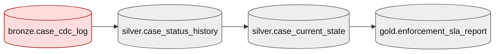

If `bronze.case_cdc_log` is 2 hours behind, `gold.enforcement_sla_report` may be freshly computed but semantically stale.

This distinction matters:

| Situation | Meaning |
|---|---|
| Task ran recently | Execution freshness |
| Output was published recently | Publication freshness |
| Output includes recent source data | Data freshness |
| Output satisfies downstream business deadline | Consumer freshness |

The platform should expose these separately.

---

## 10. Dependency Graph

Asset-centric orchestration needs a dependency graph.

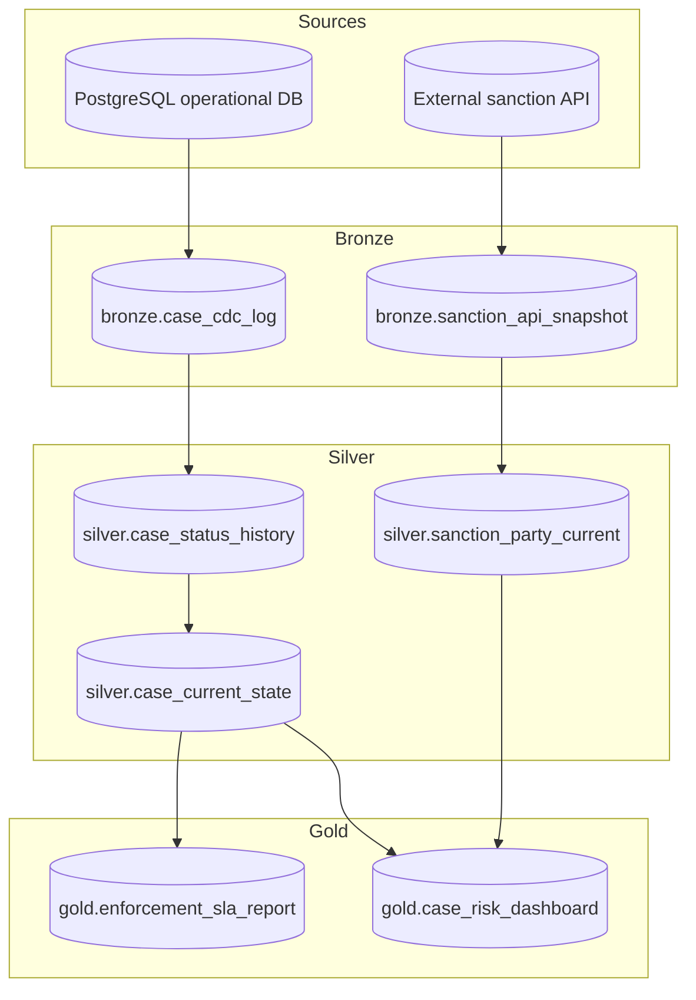

This graph supports:

- impact analysis
- freshness propagation
- rerun planning
- data ownership mapping
- schema change blast radius
- security classification propagation
- lineage evidence
- consumer notification

---

## 11. Asset Graph vs Runtime Graph

The asset graph and runtime graph are not always the same.

One runtime job may produce many assets.

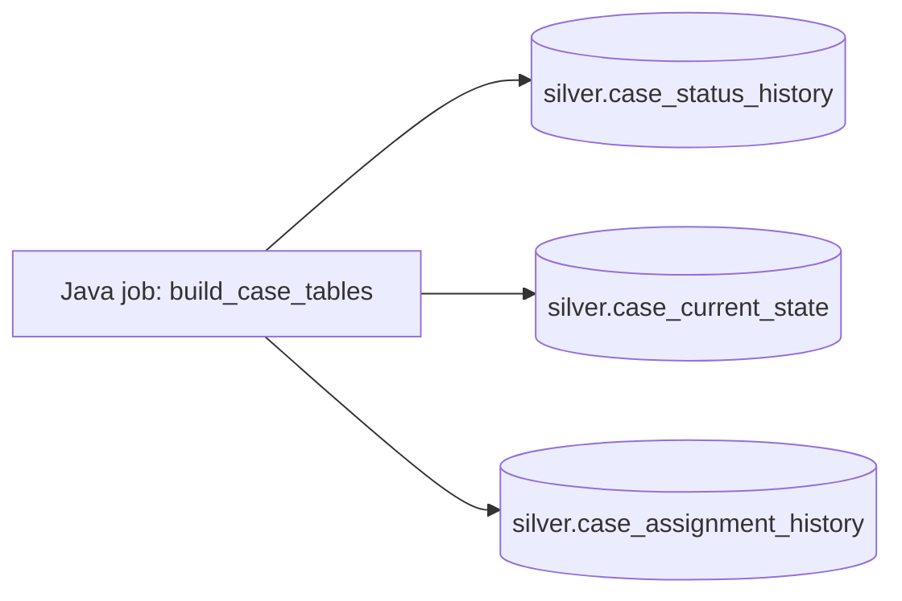

Many jobs may produce one asset.

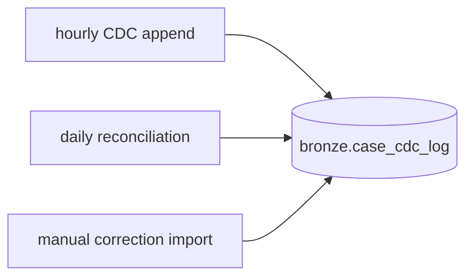

A streaming job may continuously maintain an asset.

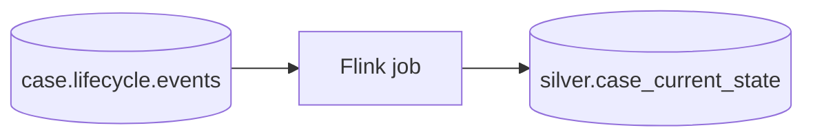

Do not force one asset equals one task.

Instead, model the relation explicitly:

```text
Runtime run materializes asset version.
```

---

## 12. Asset Registry

A production platform needs an asset registry.

This can start simple: a database table plus YAML definitions in Git.

### Logical model

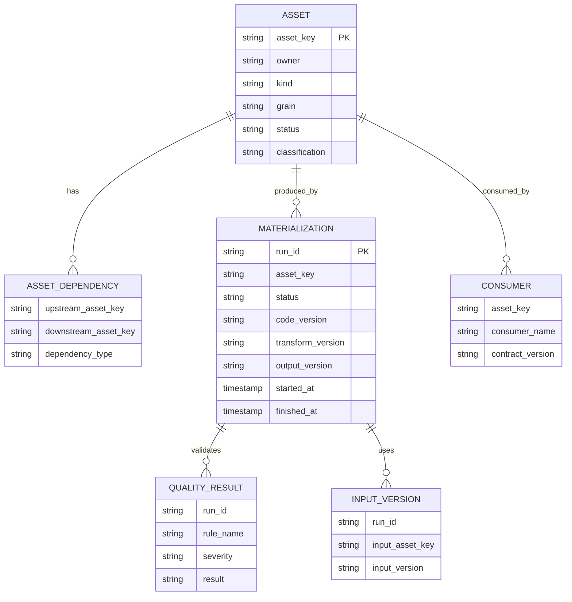

### Why registry matters

Without a registry, asset knowledge lives in:

- DAG code
- wiki pages
- Slack threads
- team memory
- dashboard names
- SQL comments
- tribal knowledge

That is not operable.

---

## 13. Java Asset Model

You can represent asset identity and materialization in Java without depending on a specific orchestrator.

```java
public record AssetKey(String value) {
    public AssetKey {
        if (value == null || value.isBlank()) {
            throw new IllegalArgumentException("asset key is required");
        }
    }
}

public enum AssetKind {
    KAFKA_TOPIC,
    ICEBERG_TABLE,
    POSTGRES_TABLE,
    OBJECT_STORAGE_MANIFEST,
    SEARCH_INDEX,
    REPORT_DATASET
}

public record AssetSpec(
        AssetKey key,
        AssetKind kind,
        String owner,
        String grain,
        FreshnessSpec freshness,
        List<AssetKey> upstream,
        List<QualityRuleSpec> qualityRules,
        PrivacySpec privacy
) {}

public record AssetVersion(
        AssetKey assetKey,
        String version,
        Map<String, String> coordinates
) {}

public record MaterializationRun(
        String runId,
        AssetKey assetKey,
        String transformVersion,
        List<AssetVersion> inputs,
        Instant startedAt
) {}
```

The job should report what it did:

```java
public interface MaterializationReporter {
    void started(MaterializationRun run);
    void qualityChecked(String runId, List<QualityResult> results);
    void published(String runId, AssetVersion outputVersion, MaterializationStats stats);
    void failed(String runId, FailureReason reason);
}
```

This abstraction keeps the Java job portable across Airflow, Temporal, Kubernetes CronJob, or a custom control plane.

---

## 14. Materialization Protocol

A robust materialization should follow a protocol.

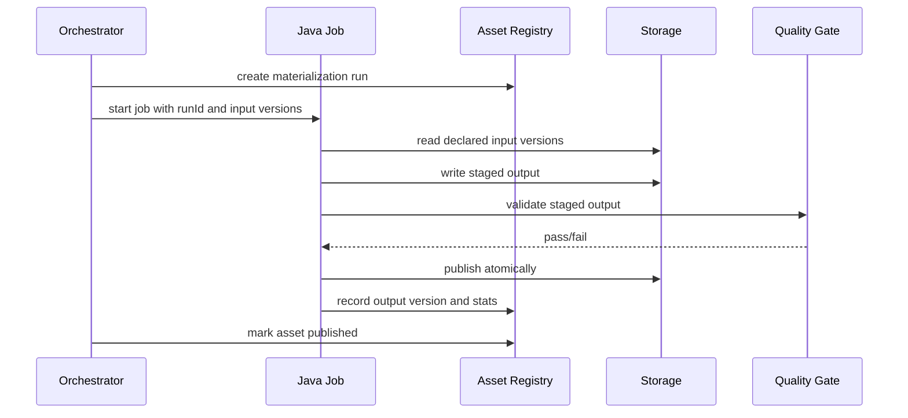

The important rule:

```text
Do not mark an asset published just because the compute step succeeded.
```

Publication happens only after:

- output exists
- output version is known
- quality gates passed
- lineage input versions are recorded
- access/security policy is applied
- publication commit succeeded

---

## 15. Staged Output and Atomic Publish

Asset-centric orchestration requires a publish boundary.

Bad:

```text
Job writes directly into consumer-visible table.
```

Better:

```text
Job writes to staging, validates, then publishes atomically.
```

Example for lakehouse table:

```text
1. Read input snapshots.
2. Write output files to staging path.
3. Run quality checks.
4. Commit Iceberg snapshot.
5. Record snapshot ID as asset version.
```

Example for search index:

```text
1. Build new physical index: case-search-build-20260704-001.
2. Validate document count and sample queries.
3. Move alias case-search-current to new index.
4. Keep previous index for rollback window.
```

Example for PostgreSQL projection:

```text
1. Write to projection_staging with run_id.
2. Validate row count and uniqueness.
3. Swap partitions or update pointer table.
4. Archive previous version.
```

The asset version must change only at publish time.

---

## 16. Asset-Aware Scheduling

Cron-based scheduling says:

```text
Run this DAG at 01:00.
```

Asset-aware scheduling says:

```text
Run this materialization when upstream asset X has a new valid version.
```

This is more accurate for data platforms.

### Trigger types

| Trigger | When useful |
|---|---|
| Time trigger | Periodic reports, daily regulatory extracts. |
| Asset update trigger | Downstream derived table should update after upstream publish. |
| Freshness trigger | Asset is approaching stale threshold. |
| Quality recovery trigger | Previously quarantined asset now has corrected input. |
| Manual trigger | Operator-approved correction/backfill. |
| External trigger | Partner file/API availability. |

A mature control plane can combine triggers.

Example:

```text
Materialize gold.enforcement_sla_report when:
- silver.case_current_state has a new published version, or
- daily report deadline reaches 01:00, or
- manual restatement is approved.
```

---

## 17. Asset Event

Every asset change should emit an asset event.

```json
{
  "eventType": "AssetMaterialized",
  "assetKey": "silver.case_current_state",
  "assetVersion": "snapshot-427",
  "runId": "run_20260704_0030",
  "status": "PUBLISHED",
  "inputVersions": {
    "silver.case_status_history": "snapshot-981"
  },
  "freshness": {
    "maxEventTime": "2026-07-04T00:29:58Z",
    "lagSeconds": 32
  },
  "quality": {
    "status": "PASSED",
    "failedRules": []
  },
  "occurredAt": "2026-07-04T00:30:31Z"
}
```

Asset events can drive:

- asset-aware schedules
- downstream invalidation
- consumer notification
- lineage graph updates
- quality dashboards
- incident automation
- audit evidence

---

## 18. Rerun Scope

Asset-centric orchestration helps answer:

> What should we rerun?

Without an asset graph, teams rerun too much or too little.

### Rerun decision matrix

| Problem | Safe rerun scope |
|---|---|
| Java task failed before write | Same task/materialization only. |
| Staged output failed validation | Same materialization after fixing input or rule. |
| Published asset has wrong transform logic | Asset and all downstream assets using affected versions. |
| Upstream asset corrected historically | Downstream assets for affected data interval/version. |
| Schema-breaking change published | Consumers with incompatible assumptions. |
| Late events arrived | Assets whose windows/intervals overlap late event timestamps. |
| Reference data changed | Assets joined/enriched with affected reference keys/time range. |

### Blast radius traversal

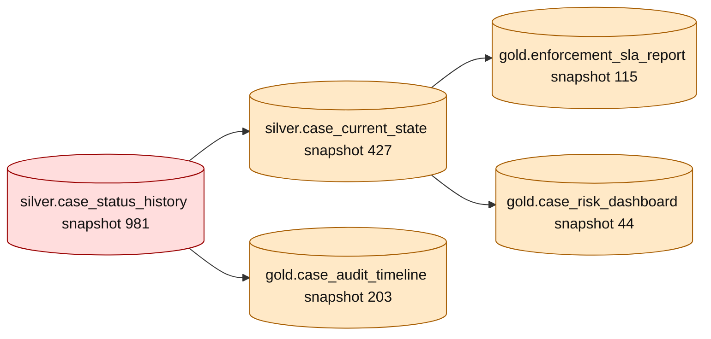

The asset graph turns incident response into graph traversal instead of guesswork.

---

## 19. Staleness and Invalidation

A downstream asset may be invalid even if it was published successfully.

Reasons:

- upstream version was superseded
- upstream quality result was later marked invalid
- schema contract was revoked
- privacy classification changed
- reference data correction arrived
- transformation version was found defective

Therefore, asset state needs invalidation.

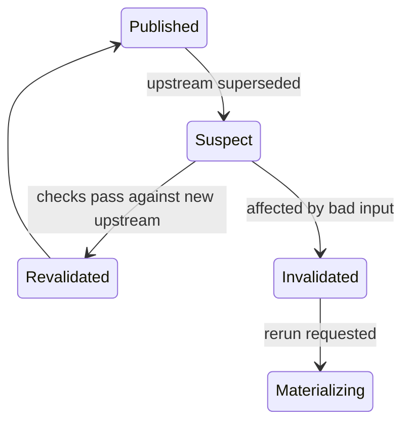

Important distinction:

```text
Stale = not fresh enough.
Invalid = should not be trusted.
Suspect = may be affected and needs analysis.
```

Do not collapse all three into `failed`.

---

## 20. Quality Gates as Asset Gates

Quality checks should guard asset publication.

They should not be random tasks at the end of a DAG.

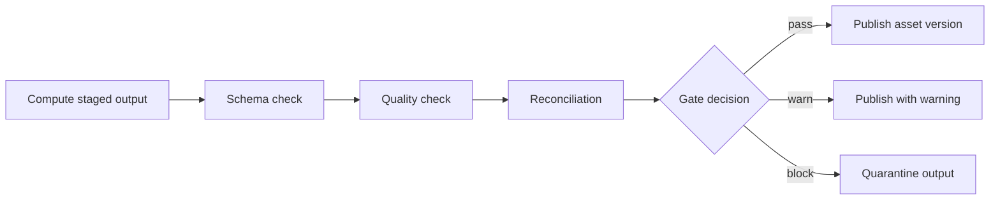

Gate decisions should be explicit:

| Decision | Meaning |
|---|---|
| `PASS` | Asset can be published. |
| `WARN` | Asset can be published, but issue is recorded and visible. |
| `BLOCK` | Asset must not be published. |
| `QUARANTINE` | Output kept for diagnosis, not visible to consumers. |
| `MANUAL_APPROVAL` | Human approval required before publish. |

For regulated systems, `WARN` must be used carefully. A warning is still evidence that the system knew something was unusual.

---

## 21. Lineage as Operational Data

Lineage is often treated as documentation.

That is too weak.

Lineage should support operational decisions.

A materialization should record:

```text
output asset version = function(code version, config version, input asset versions, data interval, reference data versions)
```

Example:

```text
gold.enforcement_sla_report snapshot-115
  produced by: sla-report@2.4.1
  from:
    silver.case_current_state snapshot-427
    silver.case_status_history snapshot-981
    reference.business_calendar version-2026.07
  interval:
    2026-07-03T00:00:00Z to 2026-07-04T00:00:00Z
```

This allows:

- explaining a report number
- replaying a historical output
- finding consumers of bad input
- proving which logic produced an output
- limiting rerun scope
- comparing two materializations

---

## 22. OpenLineage Mental Model

A common lineage model uses three concepts:

```text
Job -> Run -> Dataset
```

Mapped to this series:

| Concept | Meaning |
|---|---|
| Job | Logical computation definition, for example `build_case_current_state`. |
| Run | One execution attempt with a run ID. |
| Dataset | Input or output asset. |

Asset-centric orchestration can emit lineage events whenever a Java job reads or writes assets.

Minimal event information:

- job namespace/name
- run ID
- input datasets/assets
- output datasets/assets
- schema facets
- data quality facets
- version facets
- parent run if nested

The exact tooling can vary. The model should not.

---

## 23. Java Integration Pattern

A Java pipeline should not know whether it is run by Airflow, Temporal, Kubernetes, or a custom orchestrator.

It should receive a run context.

```java
public record RunContext(
        String runId,
        String jobName,
        Instant triggeredAt,
        Map<AssetKey, AssetVersion> declaredInputs,
        Map<String, String> parameters,
        boolean backfillMode
) {}
```

The job should declare asset usage.

```java
public interface AssetAwareJob {
    JobSpec spec();
    MaterializationResult run(RunContext context) throws Exception;
}

public record JobSpec(
        String jobName,
        List<AssetKey> inputAssets,
        List<AssetKey> outputAssets,
        String transformVersion
) {}
```

The result should be structured.

```java
public sealed interface MaterializationResult permits Published, Quarantined, Failed {}

public record Published(
        AssetVersion outputVersion,
        MaterializationStats stats,
        List<QualityResult> qualityResults
) implements MaterializationResult {}

public record Quarantined(
        String quarantineLocation,
        List<QualityResult> qualityResults,
        String reason
) implements MaterializationResult {}

public record Failed(
        String reason,
        boolean retryable
) implements MaterializationResult {}
```

This prevents orchestration from parsing logs to understand outcome.

---

## 24. Asset Publication Table

A simple relational control table can support a lot.

```sql
create table asset_publication (
  asset_key text not null,
  version text not null,
  status text not null,
  run_id text not null,
  transform_version text not null,
  published_at timestamptz,
  max_event_time timestamptz,
  row_count bigint,
  checksum text,
  metadata jsonb not null default '{}',
  primary key (asset_key, version)
);

create table asset_current_version (
  asset_key text primary key,
  version text not null,
  status text not null,
  updated_at timestamptz not null,
  foreign key (asset_key, version)
    references asset_publication(asset_key, version)
);

create table asset_input_version (
  run_id text not null,
  output_asset_key text not null,
  input_asset_key text not null,
  input_version text not null,
  primary key (run_id, output_asset_key, input_asset_key)
);
```

Publishing should be atomic.

```sql
begin;

insert into asset_publication (...)
values (...);

insert into asset_current_version(asset_key, version, status, updated_at)
values (:asset_key, :version, 'PUBLISHED', now())
on conflict (asset_key)
do update set
  version = excluded.version,
  status = excluded.status,
  updated_at = excluded.updated_at;

commit;
```

This is the control-plane equivalent of an atomic pointer swap.

---

## 25. Asset Granularity

Asset granularity is hard.

Too coarse:

```text
warehouse
```

Not useful. Every failure affects everything.

Too fine:

```text
one asset per column per partition per file
```

Too noisy. Operational graph becomes unmanageable.

Good asset keys usually align to consumer-visible boundaries:

- a Kafka topic
- a table
- a table partition if independently published
- a search index alias
- a file manifest
- a report dataset
- a feature set
- a materialized projection

### Decision rule

Model something as an asset if it has at least one of these:

- independent ownership
- independent freshness SLO
- independent quality contract
- independent access policy
- independent publication version
- independent consumer group
- independent rerun boundary

Otherwise, keep it as internal implementation detail.

---

## 26. Asset Ownership

Every production asset needs one accountable owner.

Not three.

Not “the data team”.

Not “platform”.

One accountable owner.

Supporting teams can exist, but the owner answers:

- Is this asset correct?
- Who approves breaking changes?
- Who responds to quality incidents?
- Who owns downstream communication?
- Who decides deprecation timeline?
- Who approves manual correction?

Ownership fields:

```yaml
owner:
  team: enforcement-data-platform
  service: case-analytics-pipeline
  slack: '#enforcement-data-platform'
  escalation: pagerduty://enforcement-data-platform
  productOwner: enforcement-analytics
```

For regulated systems, ownership is not only operational. It is governance evidence.

---

## 27. Asset-Centric Failure Propagation

When a materialization fails, not all downstream assets are equally affected.

Failure propagation depends on asset semantics.

| Upstream condition | Downstream effect |
|---|---|
| Upstream not updated yet | Downstream may remain valid but stale. |
| Upstream published bad data | Downstream becomes suspect or invalid. |
| Upstream schema incompatible | Downstream materialization should be blocked. |
| Upstream quality warning | Downstream may publish with inherited warning. |
| Upstream partition failed | Downstream interval overlapping partition is affected. |
| Upstream reference data corrected | Downstream enriched outputs may require restatement. |

A platform should encode propagation rules.

Example:

```yaml
propagation:
  onUpstreamStale: mark_downstream_stale
  onUpstreamInvalid: mark_downstream_suspect
  onUpstreamSchemaBreaking: block_materialization
  onUpstreamQualityWarning: inherit_warning
```

---

## 28. Asset-Centric Backfill

Backfill should not be “run old dates”.

It should be:

```text
materialize target asset versions for a declared interval using declared input versions and transform version.
```

Backfill request:

```yaml
backfill:
  id: bf_20260704_case_sla_v2
  targetAsset: gold.enforcement_sla_report_daily
  interval:
    start: 2026-01-01T00:00:00Z
    end: 2026-07-01T00:00:00Z
  transformVersion: sla-report@2.4.1
  inputSelection:
    silver.case_current_state: latest_as_of_interval_end
    reference.business_calendar: version-2026.07
  publishMode: staged_then_replace_partition
  approval: required
```

Backfill outputs should be traceable separately from normal scheduled outputs.

The platform should answer:

- which asset versions were replaced?
- which consumers were notified?
- which reports were restated?
- which old versions remain accessible?
- what approval authorized the backfill?

---

## 29. Consumer Registry

Asset-centric orchestration is incomplete without knowing consumers.

Consumer registry fields:

```yaml
consumer:
  name: enforcement-sla-dashboard
  asset: gold.enforcement_sla_report_daily
  owner: enforcement-analytics
  usage: operational_dashboard
  freshnessExpectation: PT1H
  breakingChangeNotice: P14D
  contact: '#enforcement-analytics'
```

This supports:

- schema change notification
- deprecation planning
- impact analysis
- incident communication
- access review
- cost attribution

A consumer can be:

- dashboard
- downstream pipeline
- Java service
- ML feature consumer
- report export
- analyst workspace
- external data sharing agreement

Do not assume all consumers are technical jobs.

---

## 30. Asset-Centric Observability

Task metrics are necessary but insufficient.

You also need asset metrics.

### Task metrics

- duration
- success/failure
- retry count
- CPU/memory
- logs
- exit code

### Asset metrics

- freshness lag
- row count trend
- null rate
- duplicate rate
- schema version
- quality status
- max event time
- input version set
- output version
- publication status
- consumer count
- stale downstream count

Useful dashboard shape:

```text
Asset: gold.enforcement_sla_report_daily
Status: PUBLISHED
Freshness: OK, latest interval 2026-07-03
Last materialization: run_20260704_010000
Transform: sla-report@2.4.1
Input versions:
  silver.case_current_state snapshot-427
  silver.case_status_history snapshot-981
Quality: PASSED, 17/17 checks
Consumers: 4
Downstream stale: 0
```

---

## 31. Asset-Centric Alerting

Bad alert:

```text
Task failed.
```

Better alert:

```text
gold.enforcement_sla_report_daily missed freshness SLO.
Latest published interval: 2026-07-02.
Expected interval: 2026-07-03.
Blocking upstream: silver.case_current_state is stale by 2h 17m.
Affected consumers: enforcement-sla-dashboard, monthly-regulatory-export.
Suggested action: rerun materialization after upstream catch-up.
```

Asset-centric alerting should include:

- asset key
- state
- freshness impact
- upstream blocker
- downstream consumers
- severity
- run ID
- owner
- recommended action

This reduces incident time because the alert contains the graph context.

---

## 32. Asset-Centric Security

Assets carry classification.

Security should propagate through lineage.

If upstream contains PII, downstream often inherits sensitivity unless transformation proves removal.

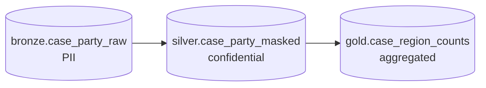

Propagation examples:

| Rule | Effect |
|---|---|
| Upstream PII copied to downstream | Downstream inherits PII classification. |
| Upstream PII tokenized | Downstream classification may reduce but remains sensitive. |
| Upstream PII aggregated above threshold | Downstream may become non-PII aggregate. |
| Upstream confidential data joined into public dataset | Block publication unless approved. |

Asset contracts should state privacy transformation explicitly.

```yaml
privacy:
  inputClassification: restricted
  outputClassification: confidential
  transformations:
    - field: investigator_email
      action: tokenized
    - field: subject_name
      action: removed
```

---

## 33. Asset-Centric Governance

Governance becomes practical when attached to assets.

Governance questions:

- Who owns this asset?
- What does one row mean?
- What source data produced it?
- What quality gates protect it?
- What schema compatibility mode applies?
- Who consumes it?
- What data classification applies?
- How long is it retained?
- How is it corrected?
- How is it retired?

If you cannot answer these, the asset is not production-grade.

---

## 34. Asset Definition as Code

Asset definitions should live in Git.

Example:

```yaml
apiVersion: data.platform/v1
kind: DataAsset
metadata:
  name: silver.case_current_state
spec:
  type: iceberg_table
  owner: enforcement-data-platform
  grain: one row per case_id representing latest known operational state
  upstream:
    - silver.case_status_history
  freshness:
    maxLag: PT15M
    measuredBy: max_source_commit_time
  schema:
    compatibility: backward
    registrySubject: silver.case_current_state-value
  quality:
    gates:
      - case_id_not_null
      - status_allowed
      - one_current_row_per_case
  publication:
    mode: iceberg_snapshot_commit
    rollback: previous_snapshot
  privacy:
    classification: confidential
```

This enables:

- review via pull request
- code owners
- automated validation
- documentation generation
- platform registry sync
- drift detection

---

## 35. Drift Detection

Declared asset metadata must match reality.

Drift examples:

- table exists but not registered
- registered asset missing in storage
- schema differs from contract
- ownership missing
- quality gate disabled manually
- retention policy differs from declaration
- access policy changed outside Git
- Airflow DAG writes asset not declared as output

Drift detection should run periodically.

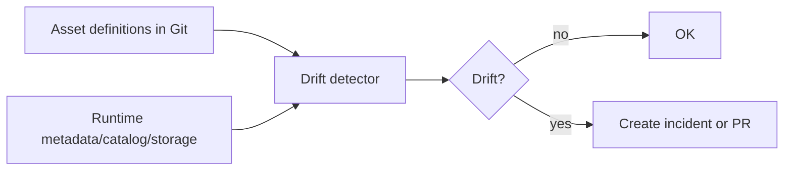

Drift is not cosmetic. Drift means the control plane no longer reflects production reality.

---

## 36. Airflow Assets vs Asset-Centric Platform

Airflow can schedule DAGs based on asset updates. That helps move beyond pure cron.

But asset-centric orchestration as a platform concept is broader than any one tool.

You still need:

- asset contract registry
- materialization records
- quality gate state
- versioned input/output lineage
- consumer registry
- freshness propagation
- rerun scope planner
- governance metadata
- security classification
- deprecation workflow

Airflow can be one executor/control-flow engine inside this model.

Do not confuse tool feature with platform capability.

---

## 37. Dagster-Style Software-Defined Asset Thinking

Some orchestrators promote assets as first-class objects. The useful mental model is:

```text
Declare the data object you want to keep correct, not only the procedure that computes it.
```

That is valuable even if your actual Java platform uses Airflow, Temporal, Kubernetes, Flink, Spark, or custom services.

The pattern is portable:

```text
asset declaration + materialization function + dependency graph + checks + metadata
```

For Java teams, you can implement this without moving all compute into Python orchestration code.

Keep Java for data processing where Java is the right implementation language. Use the orchestrator/control plane to understand assets, dependencies, and state.

---

## 38. Asset-Aware Java Job Submission

An orchestrator should launch Java jobs with asset context.

Command example:

```bash
java -jar case-current-state-job.jar \
  --run-id run_20260704_0030 \
  --target-asset silver.case_current_state \
  --input-version silver.case_status_history=snapshot-981 \
  --transform-version case-current-state@1.8.0 \
  --publish-mode staged-then-commit
```

The job should fail fast if input versions are missing or incompatible.

```java
public final class AssetContextValidator {
    public void validate(RunContext context, JobSpec spec) {
        for (AssetKey required : spec.inputAssets()) {
            if (!context.declaredInputs().containsKey(required)) {
                throw new IllegalArgumentException("missing input asset version: " + required.value());
            }
        }
    }
}
```

This avoids accidental reads from whatever version happens to be current at runtime.

---

## 39. Input Pinning

Input pinning is one of the most important production concepts.

Bad:

```text
Job reads latest upstream table while running.
```

If upstream changes during the job, output may be non-reproducible.

Better:

```text
Job reads declared upstream version/snapshot.
```

Example:

```text
silver.case_current_state materialization run_123 reads:
- silver.case_status_history snapshot-981
- reference.business_calendar version-2026.07
```

Input pinning enables:

- deterministic replay
- audit explanation
- safe retry
- backfill consistency
- diffing outputs across transform versions
- incident reconstruction

For streaming jobs, input pinning may mean offset ranges, checkpoint versions, or savepoint references.

For batch/lakehouse, it often means table snapshot IDs.

---

## 40. Asset Publication Modes

Different assets need different publication modes.

| Mode | Use case | Risk |
|---|---|---|
| Append | Immutable event/fact data | Duplicate or bad event if not validated. |
| Replace partition | Daily/hourly partitioned outputs | Partial partition replacement if not atomic. |
| Snapshot commit | Lakehouse table versions | Concurrent commit conflict. |
| Pointer swap | Search index/report version | Incorrect pointer update. |
| Upsert | Current-state projection | Lost update or duplicate effect. |
| Tombstone/delete | Deletion propagation | Accidental hard delete. |

The asset contract should specify publication mode.

This matters because rollback and reconciliation differ by mode.

---

## 41. Asset Anti-Patterns

### Anti-pattern 1: Asset name equals job name

Bad:

```text
asset = daily_case_job
```

Good:

```text
asset = gold.enforcement_sla_report_daily
job = build_enforcement_sla_report
```

Jobs change. Assets are consumer-facing contracts.

### Anti-pattern 2: Success means output exists

Output can exist and be wrong.

Publish only after validation.

### Anti-pattern 3: No input versions

Without input versions, lineage is storytelling, not evidence.

### Anti-pattern 4: Asset graph maintained manually in wiki

Manual graphs rot quickly.

Emit lineage and sync registry automatically.

### Anti-pattern 5: One giant asset

A single warehouse-level asset hides failure boundaries.

### Anti-pattern 6: One asset per implementation detail

Too many internal assets create noise and operational overload.

### Anti-pattern 7: Freshness based only on task schedule

A task can run on time and still produce stale data.

---

## 42. Regulatory Enforcement Example

Suppose you operate an enforcement lifecycle platform.

Assets:

```text
bronze.case_cdc_log
silver.case_status_history
silver.case_current_state
silver.case_assignment_history
gold.enforcement_sla_report_daily
gold.case_breach_report
gold.case_audit_timeline
```

A correction arrives:

```text
case C-901 was marked ESCALATED at 2026-07-01T09:00Z,
but the correct time is 2026-07-01T08:15Z.
```

Asset-centric handling:

1. Append correction to canonical history.
2. Mark affected `silver.case_status_history` interval as superseded.
3. Identify downstream assets depending on that interval.
4. Recompute `silver.case_current_state` if current state affected.
5. Recompute SLA and breach reports for affected reporting intervals.
6. Publish restated asset versions.
7. Record lineage from old version to new version.
8. Notify consumers of restatement.
9. Preserve old version for audit.

Without asset-centric orchestration, this becomes ad hoc reruns and manual explanations.

---

## 43. Implementation Blueprint

A practical Java-centric asset platform can start small.

### Phase 1 — Registry

- define `AssetSpec` YAML
- store asset metadata in Git
- sync to database registry
- require owner, kind, grain, upstream, freshness, quality

### Phase 2 — Materialization API

- create run ID
- record input versions
- record output version
- record quality results
- record status

### Phase 3 — Job integration

- pass run context to Java jobs
- require declared input assets
- emit materialization result
- prevent undeclared output publish

### Phase 4 — Observability

- asset dashboard
- freshness status
- downstream stale count
- latest materialization
- quality trend

### Phase 5 — Control automation

- asset-aware triggers
- rerun planner
- invalidation propagation
- consumer notification
- drift detection

Start with the registry and materialization ledger. They create the foundation for everything else.

---

## 44. Minimal Asset Platform Architecture

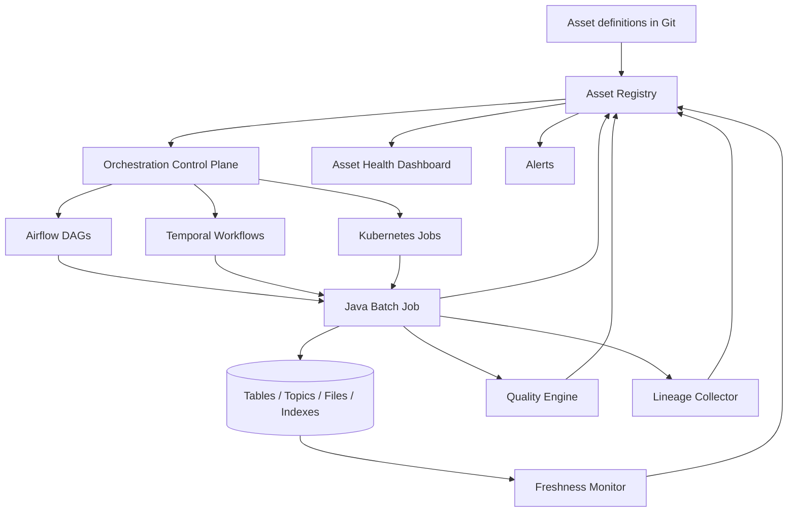

The orchestrator is not the source of truth by itself.

The asset registry and materialization ledger are the source of truth for asset state.

---

## 45. Production Checklist

Before treating an asset as production-grade, check:

- [ ] Asset has stable key.
- [ ] Asset has accountable owner.
- [ ] Asset kind is declared.
- [ ] Grain is documented.
- [ ] Upstream dependencies are declared.
- [ ] Freshness objective is defined.
- [ ] Quality gates exist.
- [ ] Schema compatibility mode is defined.
- [ ] Privacy classification is defined.
- [ ] Publication mode is defined.
- [ ] Rollback or supersession strategy exists.
- [ ] Materialization run records input versions.
- [ ] Materialization run records output version.
- [ ] Failed validation blocks publication.
- [ ] Consumers are registered.
- [ ] Lineage is emitted automatically.
- [ ] Staleness and invalidation are modeled separately.
- [ ] Backfill semantics are defined.
- [ ] Deprecation process exists.

---

## 46. Mental Model Summary

Asset-centric orchestration is the move from:

```text
Did task X run?
```

to:

```text
Is asset Y trustworthy for consumer Z right now?
```

The key ideas:

- A task is an execution step.
- An asset is a persistent data object with business meaning.
- Materialization connects a run to an asset version.
- Freshness is data-state based, not schedule based.
- Lineage should record actual input and output versions.
- Quality gates protect publication, not just observability dashboards.
- Asset graph enables impact analysis and rerun planning.
- Ownership and governance belong on assets.
- Java jobs should emit structured materialization outcomes.
- The orchestrator should coordinate asset state, not merely run scripts.

A top-tier engineer designs pipelines so that the organization can answer:

```text
What data do we trust, why do we trust it, what produced it, who depends on it, and what happens if it is wrong?
```

That is the asset-centric mindset.

---

## 47. References

- Apache Airflow documentation — Asset-aware scheduling and DAG authoring.
- Dagster documentation — Software-defined assets and asset APIs.
- OpenLineage documentation — Jobs, runs, datasets, and lineage event model.
- Apache Iceberg documentation — Table metadata, snapshots, and atomic table state.
- Apache Kafka documentation — Topics, partitions, offsets, and event streaming.
- Apache Flink documentation — Stateful stream processing and checkpoints.
