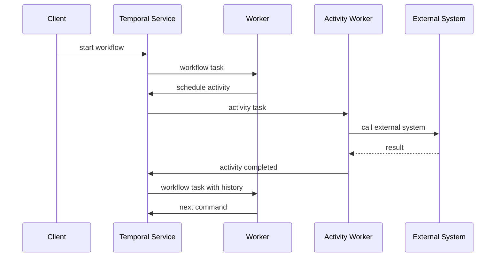
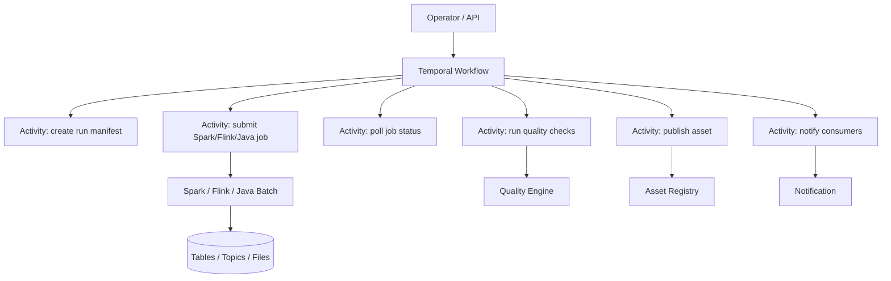
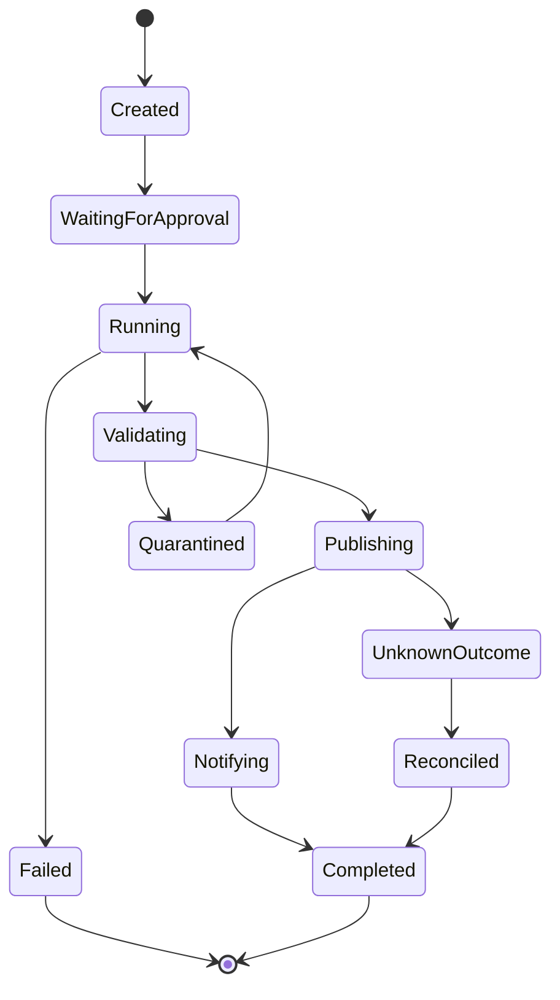
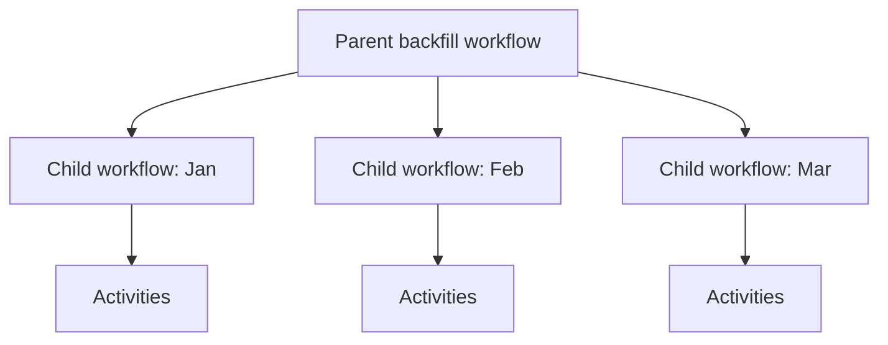
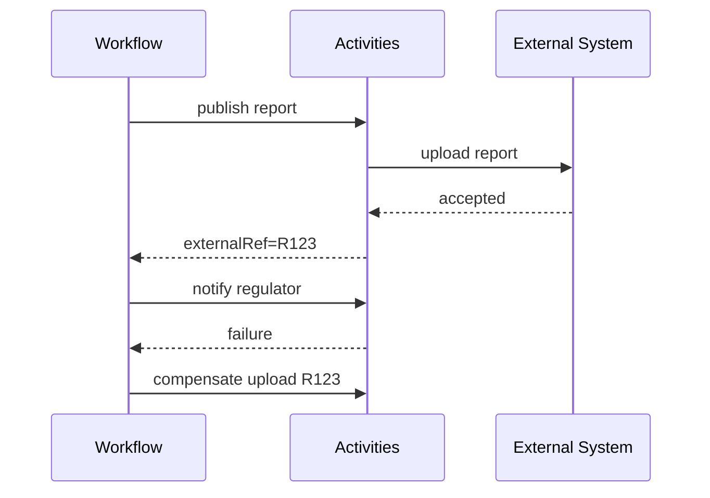
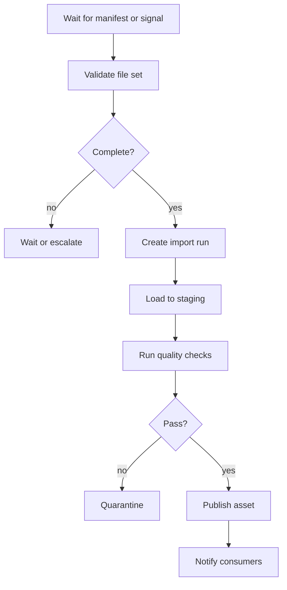
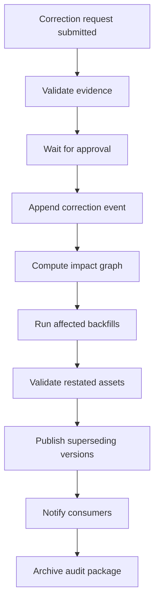
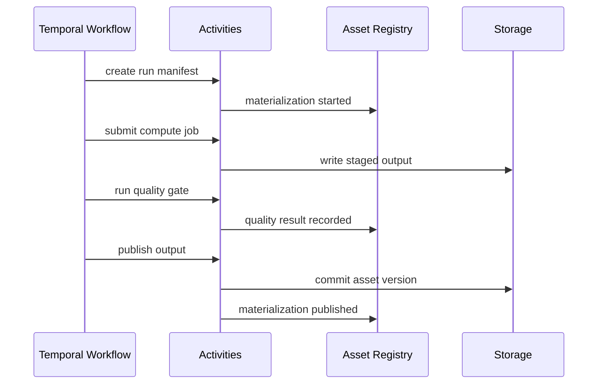

# Part 060 — Temporal for Durable Data Workflows

Temporal is not a data processing engine.

It is not Kafka.

It is not Flink.

It is not Spark.

It is not a warehouse.

Temporal is a **durable execution platform**. For data pipelines, its best role is coordinating long-running, failure-prone, stateful control-flow around data work:

- file arrival workflow
- partner API ingestion workflow
- multi-step backfill approval workflow
- data correction workflow
- report publication workflow
- index rebuild workflow
- lakehouse compaction workflow
- external export workflow
- manual review and remediation workflow

The mental model:

```text
Use Kafka/Flink/Spark/Beam for high-volume dataflow.
Use Temporal for durable, stateful, long-running control-flow.
```

---

## 1. The Problem Temporal Solves

Many data workflows are not simple DAGs.

They involve:

- waiting for external systems
- retrying unreliable APIs
- persisting progress across crashes
- human approval
- compensation after partial side effects
- long-running backfills
- scheduled follow-up checks
- manual remediation
- multi-step publication
- idempotent external exports
- stateful decisions that span hours or days

A normal Java process can do this until it crashes.

Then you need to answer:

- Which step completed?
- Which external side effects happened?
- Which retry attempt was running?
- Which approval was received?
- Which partition already published?
- What should resume after restart?

Temporal gives you a durable workflow state machine so the program can resume from persisted history.

---

## 2. Durable Execution Mental Model

A Temporal workflow is code that appears to run like a normal function, but its execution history is persisted.



Temporal persists workflow history. If a worker crashes, another worker can replay the history and continue.

This is why workflow code must be deterministic.

---

## 3. Workflow vs Activity

The most important design boundary:

```text
Workflow = durable decision logic.
Activity = side effect or external work.
```

### Workflow should contain

- orchestration decisions
- state transitions
- branching logic
- retry strategy selection
- compensation ordering
- waiting for signals
- child workflow coordination
- timers
- progress tracking

### Activity should contain

- database writes
- HTTP calls
- Kafka publish
- Spark job submission
- Flink savepoint trigger
- object storage operations
- schema registry updates
- data quality execution
- email/Slack notification
- asset registry mutation

Rule:

```text
If it touches the outside world, make it an Activity.
```

---

## 4. Why Workflow Code Must Be Deterministic

Temporal replays workflow code from event history.

If workflow code behaves differently during replay, it can break execution.

Avoid directly using non-deterministic operations inside workflow code:

- current system time
- random UUID generation
- direct network call
- direct database query
- filesystem access
- thread sleep
- mutable global state
- non-deterministic collection iteration when order matters

Use Temporal workflow APIs for workflow time, timers, and deterministic IDs where appropriate.

Bad workflow code:

```java
if (Instant.now().isAfter(deadline)) {
    // non-deterministic during replay
}
```

Better:

```java
Instant now = Workflow.currentTimeMillis() == 0
        ? Instant.EPOCH
        : Instant.ofEpochMilli(Workflow.currentTimeMillis());
```

Or better still, model deadlines with workflow timers and explicit scheduled times.

---

## 5. Temporal Is Not for Record-Level Processing

Do not run one Temporal workflow per Kafka message in a high-volume stream.

Bad:

```text
1 workflow per event for 100 million events/day
```

That is usually the wrong abstraction and too expensive operationally.

Use Temporal for coarse-grained durable coordination:

- one workflow per file ingestion
- one workflow per backfill request
- one workflow per report publication
- one workflow per external partner sync
- one workflow per index rebuild
- one workflow per regulatory export
- one workflow per correction case

Use Kafka/Flink/Spark inside or alongside Temporal for the high-volume data movement and transformation.

---

## 6. Where Temporal Fits in Data Pipeline Architecture



Temporal coordinates.

The compute engine computes.

The asset registry records state.

The workflow history explains the control-flow.

---

## 7. Java SDK Shape

A Temporal workflow starts with an interface.

```java
@WorkflowInterface
public interface BackfillWorkflow {
    @WorkflowMethod
    BackfillResult run(BackfillRequest request);

    @SignalMethod
    void approve(Approval approval);

    @QueryMethod
    BackfillStatus status();
}
```

Activities are separate.

```java
@ActivityInterface
public interface BackfillActivities {
    RunManifest createRunManifest(BackfillRequest request);

    JobHandle submitJob(RunManifest manifest, PartitionRange range);

    JobStatus getJobStatus(JobHandle handle);

    QualityReport runQualityChecks(RunManifest manifest, PartitionRange range);

    AssetVersion publishPartition(RunManifest manifest, PartitionRange range);

    void notifyConsumers(BackfillResult result);
}
```

The workflow implementation orchestrates.

```java
public class BackfillWorkflowImpl implements BackfillWorkflow {

    private final BackfillActivities activities = Workflow.newActivityStub(
            BackfillActivities.class,
            ActivityOptions.newBuilder()
                    .setStartToCloseTimeout(Duration.ofMinutes(30))
                    .setRetryOptions(RetryOptions.newBuilder()
                            .setInitialInterval(Duration.ofSeconds(10))
                            .setMaximumInterval(Duration.ofMinutes(5))
                            .setMaximumAttempts(5)
                            .build())
                    .build()
    );

    private boolean approved;
    private BackfillStatus status = BackfillStatus.PENDING_APPROVAL;

    @Override
    public BackfillResult run(BackfillRequest request) {
        RunManifest manifest = activities.createRunManifest(request);

        status = BackfillStatus.WAITING_FOR_APPROVAL;
        Workflow.await(() -> approved);

        status = BackfillStatus.RUNNING;

        List<AssetVersion> published = new ArrayList<>();
        for (PartitionRange range : request.partitions()) {
            JobHandle handle = activities.submitJob(manifest, range);
            waitForJob(handle);

            QualityReport report = activities.runQualityChecks(manifest, range);
            if (!report.passed()) {
                status = BackfillStatus.QUARANTINED;
                return BackfillResult.quarantined(manifest.runId(), range, report);
            }

            AssetVersion version = activities.publishPartition(manifest, range);
            published.add(version);
        }

        BackfillResult result = BackfillResult.published(manifest.runId(), published);
        activities.notifyConsumers(result);
        status = BackfillStatus.COMPLETED;
        return result;
    }

    private void waitForJob(JobHandle handle) {
        while (true) {
            JobStatus jobStatus = activities.getJobStatus(handle);
            if (jobStatus == JobStatus.SUCCEEDED) return;
            if (jobStatus == JobStatus.FAILED) {
                throw ApplicationFailure.newFailure("job failed", "JOB_FAILED");
            }
            Workflow.sleep(Duration.ofMinutes(1));
        }
    }

    @Override
    public void approve(Approval approval) {
        this.approved = true;
    }

    @Override
    public BackfillStatus status() {
        return status;
    }
}
```

This is not meant to be copy-pasted directly. It shows the control-flow boundary.

---

## 8. The Workflow History as Evidence

Temporal records workflow events.

For data workflows, this history can help answer:

- when the workflow started
- which activities were scheduled
- which activities completed
- which retries occurred
- which signals were received
- when timers fired
- why workflow failed
- what result was returned

However, workflow history should not replace the asset registry or materialization ledger.

Use each system for its correct job:

| System | Source of truth for |
|---|---|
| Temporal history | Durable control-flow execution. |
| Asset registry | Asset state, versions, ownership, quality. |
| Storage/catalog | Actual data and table/topic/file versions. |
| Lineage system | Input/output dependency metadata. |
| Observability stack | Metrics, logs, traces, alerts. |

Temporal history is operational evidence. Asset lineage is data evidence.

You need both.

---

## 9. Activity Idempotency

Temporal may retry activities.

Therefore, activities must be idempotent or guarded by idempotency keys.

Bad activity:

```java
public void exportReport(Report report) {
    partnerApi.upload(report); // may upload twice after retry
}
```

Better:

```java
public ExportResult exportReport(ExportRequest request) {
    String idempotencyKey = request.runId() + ":" + request.assetVersion();
    return partnerApi.upload(request.payload(), idempotencyKey);
}
```

For systems without idempotency support, create an effect ledger.

```sql
create table external_effect_ledger (
  effect_key text primary key,
  workflow_id text not null,
  activity_name text not null,
  status text not null,
  external_reference text,
  request_hash text not null,
  response jsonb,
  created_at timestamptz not null,
  updated_at timestamptz not null
);
```

Activity pattern:

```text
1. Check effect ledger by effect_key.
2. If completed, return stored result.
3. If not started, insert claimed effect.
4. Perform external side effect.
5. Store external reference and result.
6. Return result.
```

This makes retries safe.

---

## 10. Unknown Outcome

The hardest activity failure is not failure.

It is **unknown outcome**.

Example:

```text
Activity sends export to partner API.
Network timeout occurs.
Did the partner receive it?
Unknown.
```

Retrying blindly may duplicate export.

Design options:

| Option | How it works |
|---|---|
| Idempotency key | External system dedupes repeated request. |
| External status check | Query partner by request ID before retry. |
| Effect ledger | Store local attempt and reconcile external result. |
| Manual resolution | Operator decides after evidence review. |
| Compensation | Send cancel/reversal if duplicate detected. |

Temporal gives durable retry. It does not automatically make external side effects exactly-once.

That boundary is your responsibility.

---

## 11. Retry Policy Design

Retries are business logic.

Do not set retry defaults blindly.

### Retry categories

| Failure | Retry? | Example |
|---|---:|---|
| transient network failure | yes | HTTP 503 |
| rate limit | yes, with backoff | HTTP 429 |
| validation failure | no | invalid schema |
| auth failure | usually no until credential fixed | HTTP 401 |
| downstream unavailable | yes with circuit breaker | object storage outage |
| duplicate export unknown | no blind retry | timeout after upload |
| quality check failed | no automatic retry | duplicate primary key |
| manual approval missing | wait, not retry | pending compliance approval |

Temporal activity retry options should reflect failure semantics.

```java
RetryOptions retryOptions = RetryOptions.newBuilder()
        .setInitialInterval(Duration.ofSeconds(5))
        .setBackoffCoefficient(2.0)
        .setMaximumInterval(Duration.ofMinutes(2))
        .setMaximumAttempts(6)
        .setDoNotRetry(
                "VALIDATION_FAILED",
                "SCHEMA_INCOMPATIBLE",
                "MANUAL_REVIEW_REQUIRED")
        .build();
```

Correct retry policy reduces data damage.

---

## 12. Timeouts

Activities need timeouts.

Common timeout concepts:

| Timeout | Meaning |
|---|---|
| Schedule-to-start | How long activity can wait before a worker starts it. |
| Start-to-close | Max execution time of one activity attempt. |
| Schedule-to-close | Max total time from scheduling to completion, including retries. |
| Heartbeat timeout | Max time between heartbeats for long-running activity. |

For data workflows, long-running activities should heartbeat progress.

Example:

```java
public void compactPartitions(CompactionRequest request) {
    for (Partition p : request.partitions()) {
        compact(p);
        Activity.getExecutionContext().heartbeat(p.value());
    }
}
```

Heartbeats let Temporal detect worker failure and resume with progress details.

But do not abuse one huge activity for everything. Prefer activities with meaningful boundaries.

---

## 13. Workflow State Machine

A data workflow should have explicit states.



Do not leave state implicit in logs.

Queries can expose current state.

```java
@QueryMethod
WorkflowStatus status();
```

Signals can change state.

```java
@SignalMethod
void approve(Approval approval);

@SignalMethod
void cancel(CancelReason reason);

@SignalMethod
void retryFailedPartition(PartitionRange range);
```

This makes long-running data workflows operable.

---

## 14. Signals

Signals are external messages sent to a running workflow.

Data workflow uses:

- approval received
- cancel requested
- external file arrived
- manual correction attached
- partner export acknowledged
- quality exception approved
- retry authorized
- priority changed

Example:

```java
@SignalMethod
void attachCorrectionFile(CorrectionFile file);
```

Use signals when the workflow should wait for external input without polling constantly.

---

## 15. Queries

Queries read workflow state without changing it.

Useful queries:

- current status
- current partition
- completed partitions
- failed partitions
- quality summary
- approval status
- estimated remaining work
- last external reference

Example:

```java
@QueryMethod
CorrectionWorkflowView view();
```

Queries make operator tooling easier.

Instead of searching logs, the UI can ask the workflow.

---

## 16. Child Workflows

Backfills often need many partitions.

One parent workflow can coordinate child workflows.



Use child workflows when:

- partitions are independently retryable
- each partition has state and history
- failure isolation matters
- progress should be visible per unit
- workload exceeds a single workflow history size

Do not create child workflows per row/event. Keep granularity operational.

---

## 17. Continue-As-New

Long-running workflows can accumulate large histories.

For recurring or very long workflows, use continue-as-new.

Pattern:

```text
process N partitions -> continue as new with remaining partitions
```

This keeps workflow history bounded.

Good candidates:

- year-long backfills
- ongoing partner sync monitors
- long-running remediation campaigns
- large partition processing workflows

---

## 18. Compensation

Some data workflows cannot be rolled back by deleting output.

Examples:

- external export already sent
- report already delivered
- search alias already moved
- table partition already published
- compliance notification already generated

Use compensation.



Compensation is not magic rollback.

It is a business-defined corrective action.

Examples:

| Side effect | Compensation |
|---|---|
| Search alias moved | Move alias back. |
| Export sent | Send cancellation/replacement notice. |
| Table partition replaced | Restore previous snapshot/partition. |
| Dashboard published | Mark version superseded and publish correction. |
| Email sent | Send correction email. |

For regulated environments, compensation must preserve audit trail, not erase history.

---

## 19. Sagas for Data Workflows

A saga is a sequence of local transactions with compensations.

Example report publication saga:

```text
1. Build staged report.
2. Validate report.
3. Publish dataset.
4. Move dashboard pointer.
5. Notify consumers.
6. Archive evidence package.
```

Compensations:

```text
5 failed -> send manual alert, do not unpublish data automatically.
4 failed -> mark dataset published but dashboard stale.
3 failed -> delete staged output.
2 failed -> quarantine staged output.
```

Important: compensation order is domain-specific.

Do not blindly reverse every step.

---

## 20. Temporal vs Airflow

Both can orchestrate work, but their strengths differ.

| Dimension | Airflow | Temporal |
|---|---|---|
| Primary model | DAG/task scheduling | Durable workflow execution |
| Best for | Batch DAGs, scheduled jobs, data dependencies | Long-running stateful workflows, retries, signals, human-in-loop |
| Workflow shape | Mostly static DAG | Dynamic code-driven control-flow |
| Waiting | Sensors/deferrable operators | Durable timers, signals, awaits |
| Human approval | Possible but not core | Natural with signals/queries |
| External side-effect handling | Task retries | Activity retries + workflow state |
| Backfill DAGs | Strong data interval model | Custom durable process model |
| Per-record processing | Not ideal | Not ideal |
| Java-first workflow logic | Usually indirect | Strong Java SDK support |

A common architecture uses both:

```text
Airflow for scheduled batch DAGs and asset schedules.
Temporal for long-running operational workflows and remediation.
```

---

## 21. Temporal vs Kafka

Kafka is a log for event streams.

Temporal is a durable execution system for workflows.

| Dimension | Kafka | Temporal |
|---|---|---|
| Core abstraction | Topic/partition/offset | Workflow/activity/history |
| Best for | Event streaming and replay | Durable control-flow |
| Ordering | Partition order | Workflow event history order |
| State | Consumer/application state | Workflow state/history |
| Fan-out | Consumer groups/topics | Signals/child workflows/activities |
| Processing volume | Very high | Coarse-grained workflows |

They compose well.

Example:

- Kafka carries `CaseCorrected` events.
- A consumer starts a Temporal correction workflow for cases requiring manual restatement.
- Temporal coordinates approval, backfill, publication, and notification.

---

## 22. Temporal vs Flink/Spark

Flink/Spark process data.

Temporal coordinates process.

Bad:

```text
Temporal activity loops over 10 billion records and transforms them one by one.
```

Good:

```text
Temporal workflow submits Spark job, monitors it, validates output, publishes asset, handles compensation.
```

The boundary:

```text
Use distributed data engines for high-volume compute.
Use Temporal for durable stateful orchestration around the compute.
```

---

## 23. Pattern: Durable File Ingestion Workflow

Problem:

A partner uploads files to object storage. Files arrive late, sometimes partial, sometimes duplicated. After ingestion, the platform validates, publishes, and notifies consumers.

Workflow:



Temporal strengths here:

- durable waiting
- file arrival signal
- retry object storage reads
- manual approval for suspicious file
- compensation if publish fails
- visible workflow state

---

## 24. Pattern: Partner API Sync Workflow

Problem:

A partner API has pagination, rate limits, token expiry, and occasional inconsistent responses.

Workflow:

```text
1. Create sync run manifest.
2. Acquire token.
3. Fetch pages with cursor.
4. Persist raw responses.
5. Validate response schema.
6. Publish bronze snapshot.
7. Trigger downstream asset materialization.
8. Record cursor checkpoint.
```

Activities:

- `acquireToken`
- `fetchPage`
- `persistRawPage`
- `validatePage`
- `publishSnapshot`
- `recordCheckpoint`

Temporal can durably hold cursor progress.

But page payloads should be stored externally, not inside workflow history.

Do not put large data blobs in workflow state.

---

## 25. Pattern: Data Correction Workflow

Correction workflows are common in regulated systems.

Example:

```text
A case escalation timestamp was recorded incorrectly.
The correction affects SLA breach calculation and monthly reporting.
```

Workflow:



Temporal fits because:

- process may last days
- approval is required
- many systems are touched
- compensations must be explicit
- audit trail matters
- status must be queryable

---

## 26. Pattern: Search Index Rebuild Workflow

Search indexes are external serving assets.

Workflow:

```text
1. Create new physical index.
2. Bulk load documents.
3. Validate document count.
4. Run sample queries.
5. Warm index.
6. Move alias atomically.
7. Keep old index for rollback window.
8. Delete old index after retention.
```

Temporal helps coordinate time-separated steps.

If alias move succeeds but notification fails, the workflow can resume notification without rebuilding index.

If validation fails, the new index can be deleted or quarantined.

---

## 27. Pattern: Lakehouse Maintenance Workflow

Lakehouse maintenance often includes:

- compaction
- snapshot expiration
- orphan file cleanup
- statistics refresh
- manifest rewrite
- partition rewrite

These jobs can conflict with active writers.

A durable workflow can:

1. acquire maintenance lock or check writer activity
2. create maintenance run manifest
3. run compaction by partition
4. validate table snapshot
5. publish maintenance metadata
6. release lock
7. alert on conflict or timeout

Do not hide maintenance in untracked cron scripts. Maintenance changes asset state and cost profile.

---

## 28. Pattern: External Regulatory Export

External exports need defensibility.

Workflow:

```text
1. Freeze input asset versions.
2. Generate export file.
3. Validate count/checksum/control totals.
4. Require approval.
5. Submit to external authority.
6. Wait for acknowledgement.
7. Store acknowledgement.
8. Publish evidence package.
```

Key design points:

- input versions pinned
- export file content-addressed
- idempotency key used for submission
- acknowledgement stored
- retries do not duplicate export
- replacement/correction process exists

Temporal is useful because external acknowledgement may take hours or days.

---

## 29. Run Manifest with Temporal

Temporal workflow should create or reference a run manifest.

```yaml
runId: run_20260704_export_001
workflowId: regulatory-export-2026-07
workflowType: RegulatoryExportWorkflow
targetAsset: external.monthly_enforcement_export
inputVersions:
  gold.enforcement_sla_report_monthly: snapshot-52
  gold.case_breach_report: snapshot-88
transformVersion: regulatory-export@3.2.0
requestedBy: compliance-ops
approvalRequired: true
status: RUNNING
```

The manifest belongs in the asset/control-plane database, not only in Temporal history.

Temporal can reference it by ID.

---

## 30. Avoid Large Payloads in Workflow History

Workflow history should contain control data, not large datasets.

Bad:

```java
List<CaseRecord> records = activities.fetchMillionRows();
```

Better:

```java
ObjectRef stagedData = activities.extractToStaging(request);
QualityReport report = activities.validate(stagedData);
AssetVersion version = activities.publish(stagedData);
```

Pass references:

- object storage URI
- table snapshot ID
- Kafka offset range
- manifest ID
- run ID
- file checksum
- external reference

Do not pass large records or files through workflow state.

---

## 31. Deterministic Branching with Activity Results

Workflow branching can depend on activity results because results are recorded in history.

```java
QualityReport report = activities.runQualityChecks(manifest);

if (report.blockingFailures() > 0) {
    return quarantine(manifest, report);
}

return publish(manifest);
```

On replay, Temporal reuses the recorded activity result. The branch remains deterministic.

Do not re-query external state directly from workflow code.

Use activities.

---

## 32. Versioning Workflow Code

Long-running workflows may continue while code changes.

This creates compatibility issues.

You need workflow versioning strategy.

Problems:

- old workflow histories replay with new code
- step order changes
- activity names change
- state fields change
- branching logic changes
- compensation logic changes

Safe practices:

- keep workflow code deterministic across versions
- use explicit version markers where supported
- avoid renaming activities casually
- keep old workflow worker code until old runs complete
- use new workflow type for major process redesign
- include process version in run manifest

Example:

```java
int version = Workflow.getVersion(
        "publish-step-v2",
        Workflow.DEFAULT_VERSION,
        2
);

if (version == Workflow.DEFAULT_VERSION) {
    activities.publishLegacy(manifest);
} else {
    activities.publishWithQualityEvidence(manifest);
}
```

Versioning is not optional when workflows last longer than deployments.

---

## 33. Activity Versioning

Activities are external side-effect boundaries.

Changing an activity can change business outcome.

Version activity behavior explicitly:

```java
public ExportResult submitExport(ExportRequest request) {
    return switch (request.protocolVersion()) {
        case "v1" -> submitV1(request);
        case "v2" -> submitV2(request);
        default -> throw new IllegalArgumentException("unsupported protocol version");
    };
}
```

Record protocol/transform version in the run manifest.

Do not silently change export format for in-flight workflows.

---

## 34. Worker Deployment Model

Temporal workers execute workflow and activity tasks.

For Java data platforms, separate workers by responsibility.

```text
worker-backfill-workflow
worker-backfill-activities
worker-external-export-activities
worker-correction-workflow
worker-index-rebuild-activities
```

Why separate?

- different scaling profile
- different credentials
- different network access
- different timeout needs
- different release cadence
- different failure blast radius

A workflow worker may not need database write permissions. An activity worker might.

Least privilege still applies.

---

## 35. Task Queues

Temporal task queues route work to workers.

Use task queues to isolate workloads.

Examples:

```text
backfill-workflows
backfill-compute-activities
external-export-activities
search-index-activities
manual-correction-workflows
```

Isolation benefits:

- external export outage does not starve correction workflows
- heavy backfills do not block urgent manual remediation
- sensitive activities run on restricted workers
- worker autoscaling can be workload-specific

---

## 36. Security Boundary

Temporal workflows can coordinate sensitive data operations.

Design for:

- service identity per worker
- least privilege per task queue
- secrets only in activities, not workflow state
- no PII in workflow history if avoidable
- encrypted references where needed
- audit of operator signals
- approval identity recorded
- secure external effect ledger

Bad:

```java
workflowState.setSubjectName("John Doe");
```

Better:

```java
workflowState.setCorrectionRequestId("corr_20260704_001");
```

The workflow can reference sensitive data stored in governed systems instead of embedding it in workflow history.

---

## 37. Observability

Temporal gives workflow visibility, but pipeline observability needs more.

Track:

- workflow start/completion/failure
- activity retry count
- activity latency
- workflow age
- stuck workflows
- signal count
- pending approvals
- compensation count
- external unknown outcomes
- asset versions produced
- quality gate results
- downstream consumers notified

Correlate IDs:

```text
workflowId
runId
assetKey
assetVersion
jobId
traceId
externalReference
```

Every log line from an activity should include these IDs.

---

## 38. Testing Temporal Data Workflows

Testing levels:

### Unit test workflow logic

Use Temporal test utilities where available to verify workflow behavior:

- approval wait
- quality failure branch
- compensation branch
- retry handling
- cancellation
- child workflow creation

### Activity tests

Activities should be tested like production integration boundaries:

- idempotency
- timeout
- retryable vs non-retryable failure
- unknown outcome handling
- effect ledger correctness
- schema validation

### End-to-end test

Run workflow against fake or test external systems:

- object storage emulator
- test database
- fake partner API
- test asset registry
- fake notification sink

### Replay test

Replay workflow histories for compatibility after code changes.

This catches deterministic replay issues.

---

## 39. Failure Injection

Durable workflows still need failure testing.

Inject:

- worker crash after activity side effect
- network timeout after external upload
- duplicate signal
- delayed approval
- quality gate failure
- partial partition publish
- activity heartbeat timeout
- task queue starvation
- workflow code deployment during running workflow
- compensation failure
- asset registry unavailable

Expected result:

- workflow resumes safely
- side effects are not duplicated
- state remains queryable
- asset registry is consistent
- unknown outcomes become explicit

---

## 40. Cancellation

Data workflows need careful cancellation semantics.

Cancel before side effect:

```text
Safe: workflow stops.
```

Cancel during compute:

```text
Maybe safe: cancel job and mark run canceled.
```

Cancel after publication:

```text
Not a simple cancel. Need supersession or compensation.
```

Cancellation policy should be state-dependent.

```java
@SignalMethod
void requestCancel(CancelRequest request);
```

The workflow should decide:

- cancel immediately
- wait for safe point
- reject cancellation
- start compensation
- require approval

For regulated outputs, cancellation cannot erase evidence.

---

## 41. Human-in-the-Loop Workflows

Temporal is strong for human-in-the-loop data operations.

Examples:

- approve backfill
- approve correction
- approve publishing asset with warning
- approve regulatory export
- approve access to sensitive dataset
- approve rerun after failed quality gate

Pattern:

```text
1. Workflow reaches approval state.
2. Workflow emits notification.
3. UI displays query state.
4. Human approves/rejects.
5. UI sends signal.
6. Workflow resumes.
```

Approval must include:

- approver identity
- timestamp
- reason
- evidence reviewed
- scope approved

Do not use Slack reactions as the only durable approval record.

---

## 42. Data Workflow UI

A useful UI for Temporal-backed data workflows shows:

- workflow ID
- run ID
- target asset
- current state
- requested by
- approval status
- completed steps
- failed step
- retry attempts
- asset versions produced
- quality results
- compensation status
- external references
- audit package link

This is operationally more useful than raw logs.

---

## 43. Interaction with Asset-Centric Orchestration

Temporal workflow should update the asset registry at state transitions.



The workflow should not be the only place where asset state exists.

If Temporal is unavailable, you still need to inspect asset registry and storage state.

---

## 44. Interaction with Kafka

Temporal can be triggered by Kafka events, but be careful.

Good trigger candidates:

- `CorrectionRequested`
- `BackfillRequested`
- `ExportRequested`
- `AssetQualityFailed`
- `ManualReviewRequired`

Poor trigger candidates:

- every low-level CDC row change
- every clickstream event
- every metric event

Pattern:

```text
Kafka event -> command consumer -> start/signal workflow
```

The command consumer needs idempotency:

```text
event_id -> workflow_id mapping
```

If the same command event is replayed, it should not start duplicate workflows.

---

## 45. Workflow ID Design

Workflow ID should encode business identity when possible.

Examples:

```text
correction-corr_20260704_001
backfill-gold.enforcement_sla_report_daily-2026Q2
regulatory-export-2026-06
audit-package-case-C901
index-rebuild-case-search-20260704
```

A good workflow ID helps idempotency.

Starting the same business workflow twice should fail or return existing workflow.

Do not rely on random IDs for business-singleton workflows.

---

## 46. Exactly-Once Reality

Temporal provides durable execution and activity retry semantics.

It does not magically guarantee exactly-once side effects against all external systems.

You need:

- idempotency keys
- effect ledger
- external reconciliation
- compensation
- atomic publish protocols
- dedupe at sink
- asset versioning

Correct statement:

```text
Temporal can ensure workflow progress is durable and replayable.
External side effects still need idempotent design.
```

This is the same principle we used for Kafka, Flink, Spark, and custom Java runners.

The boundary always matters.

---

## 47. Anti-Patterns

### Anti-pattern 1: Using Temporal as a streaming engine

Do not create one workflow per high-volume event.

### Anti-pattern 2: Putting large payloads in workflow state

Store data externally. Pass references.

### Anti-pattern 3: Non-deterministic workflow code

Do not call databases, random, system time, or network directly from workflow code.

### Anti-pattern 4: Non-idempotent activities with retries

Retries can duplicate side effects.

### Anti-pattern 5: No effect ledger for external systems

Unknown outcome becomes unmanageable.

### Anti-pattern 6: Workflow history as the only audit store

Use asset registry, materialization ledger, and evidence storage.

### Anti-pattern 7: One giant workflow for everything

Use child workflows and bounded histories.

### Anti-pattern 8: No workflow versioning strategy

Long-running workflows replay old histories. Code changes must be compatible.

---

## 48. Decision Matrix

Use Temporal when:

| Question | If yes, Temporal may fit |
|---|---|
| Does the process last minutes, hours, or days? | yes |
| Does it wait for human approval? | yes |
| Does it call unreliable external systems? | yes |
| Does it need durable retry and resume after crash? | yes |
| Does it coordinate many side effects? | yes |
| Does it need compensation? | yes |
| Does it need queryable process state? | yes |
| Is the unit of work coarse-grained? | yes |

Avoid Temporal when:

| Situation | Better option |
|---|---|
| Per-record high-volume stream processing | Kafka Streams/Flink |
| Large-scale batch transform | Spark/Flink/Beam/custom Java batch |
| Simple daily DAG | Airflow may be simpler |
| Pure SQL transformation | Warehouse/lakehouse native orchestration may suffice |
| Low-value short task | Simple job runner may suffice |

---

## 49. Production Checklist

Before using Temporal for a data workflow:

- [ ] Workflow unit of work is coarse-grained.
- [ ] Workflow code is deterministic.
- [ ] External side effects are activities.
- [ ] Activities are idempotent or protected by effect ledger.
- [ ] Activity retry policy matches failure semantics.
- [ ] Activity timeouts are explicit.
- [ ] Long-running activities heartbeat.
- [ ] Large payloads are stored externally and passed by reference.
- [ ] Workflow state machine is explicit.
- [ ] Queries expose status.
- [ ] Signals are modeled for approval/cancel/manual input.
- [ ] Workflow ID supports business idempotency.
- [ ] Asset registry is updated by activities.
- [ ] Run manifest exists outside workflow history.
- [ ] Compensation is defined for irreversible side effects.
- [ ] Security boundary and task queues are designed.
- [ ] Workflow versioning strategy exists.
- [ ] Replay compatibility tests exist.
- [ ] Failure injection covers unknown outcome.

---

## 50. Mental Model Summary

Temporal should be understood as a durable control-flow engine.

For Java data pipelines, it is useful when the hard part is not transforming records, but coordinating a long-running process that must survive failure.

The core rules:

- Workflow code decides.
- Activity code does side effects.
- Workflow history enables durable replay.
- Workflow code must be deterministic.
- Activity retries require idempotency.
- External side effects need effect ledgers or idempotency keys.
- Large data belongs in storage, not workflow history.
- Temporal complements Kafka, Flink, Spark, Beam, Airflow, and asset registries.
- It is best for coarse-grained operational data workflows.

A top-tier engineer does not ask:

```text
Can I run this pipeline in Temporal?
```

They ask:

```text
Which part of this system is durable control-flow, which part is dataflow, and where do side effects become irreversible?
```

That question leads to the right architecture.

---

## 51. References

- Temporal documentation — Workflow Execution, Java SDK, Activities, Workers, retries, and event history.
- Apache Airflow documentation — DAGs and asset-aware scheduling.
- Apache Kafka documentation — Event streaming, topics, offsets, and replay.
- Apache Flink documentation — Stateful stream processing and checkpointing.
- Apache Spark documentation — Batch and Structured Streaming execution.
- OpenLineage documentation — Job/run/dataset lineage model.
