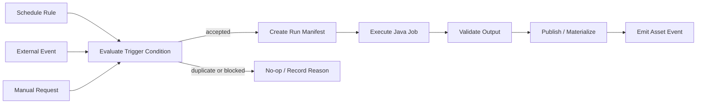
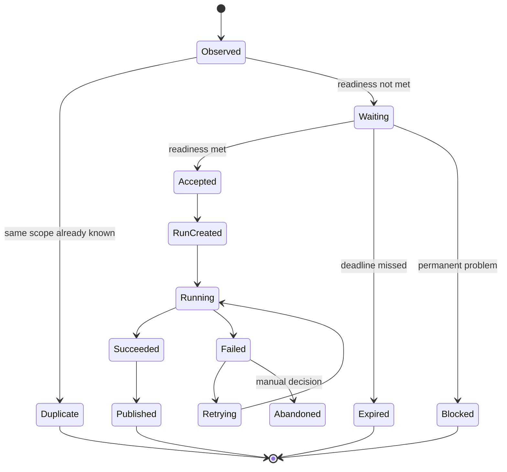

# Part 061 — Pipeline Scheduling and Triggering

A pipeline trigger is not just a way to start a job.

It is a **claim about why a run should exist**.

That claim has consequences:

- what input interval the run owns
- what data freshness it promises
- whether the run is repeatable
- whether duplicate triggers are allowed
- whether missing triggers are detectable
- whether late source data should create a correction run
- whether downstream consumers should be notified
- whether an operator can explain why the run happened

Bad scheduling creates invisible correctness bugs. A cron job may run successfully every hour while still processing the wrong interval, skipping a source update, publishing stale output, duplicating side effects, or masking late data.

The mental model:

```text
A schedule creates time intent.
A trigger creates run intent.
A run manifest makes that intent auditable.
A checkpoint makes that run resumable.
A publication step makes the output visible.
```

In production, do not ask only:

> "When should the job run?"

Ask:

> "What fact makes this run necessary, what input scope does it own, and how do we prove the result is complete?"

---

## 1. Scheduling vs Triggering

These two words are often used interchangeably, but they model different things.

| Concept | Meaning | Example |
|---|---|---|
| Schedule | A rule that says when the orchestrator should evaluate or create runs | Every hour, daily at 02:00, every Monday |
| Trigger | A concrete condition that causes a run to start | Dataset updated, file arrived, SLA breached, manual correction approved |
| Run | A specific execution attempt with identity, input scope, config, and output target | `daily_case_snapshot/2026-07-04` |
| Data interval | The logical input window owned by a run | `[2026-07-03T00:00Z, 2026-07-04T00:00Z)` |
| Processing time | The wall-clock time when the run executes | `2026-07-04T02:03Z` |
| Publication time | The time output becomes visible to consumers | `2026-07-04T02:18Z` |

A run is not defined by when it starts. A run is defined by what it is responsible for producing.



The run manifest is the durable record that connects scheduling intent to execution evidence.

---

## 2. The Core Invariant

The invariant for scheduling and triggering is:

```text
For every required output interval or asset version, there must be exactly one accepted publication, or a durable explanation of why publication did not happen.
```

This does not mean only one execution attempt. Retries may happen. Reprocessing may happen. A bad run may be superseded. But publication must be controlled.

A production-grade pipeline distinguishes:

- run creation
- run execution
- run attempt
- output staging
- output publication
- output supersession
- consumer notification

Without this distinction, scheduling becomes dangerous.

Example failure:

```text
02:00 cron starts job.
Job writes half of partition.
Worker dies.
03:00 cron starts next job.
Both jobs write to same output path.
Downstream report reads mixed output.
All tasks show "green" eventually.
```

The correct model:

```text
02:00 run owns interval D.
It writes to a unique staging location.
It validates output.
Only a successful commit publishes interval D.
03:00 run owns interval D+1, not D.
If D is not published, downstream dependency remains blocked or explicitly degraded.
```

---

## 3. Trigger Types

Most real platforms need more than one trigger type.

### 3.1 Cron Trigger

Cron is time-based.

Use it when the input is expected to be available on a regular cadence or when the output itself is time-cadenced.

Good use cases:

- daily regulatory snapshot
- hourly aggregate refresh
- weekly archive compaction
- monthly reconciliation
- scheduled export

Weaknesses:

- cron does not know whether source data arrived
- cron can run too early
- cron can keep running over stale data
- cron can hide source outage
- cron can cause unnecessary runs

Cron is not wrong. It is incomplete.

A cron trigger should usually be paired with a readiness check:

```text
Cron says: it is time to evaluate.
Readiness says: the required input exists.
Manifest says: this run owns interval X.
```

### 3.2 Event Trigger

Event trigger starts a run because something happened.

Examples:

- object storage file created
- Kafka topic received control event
- CDC snapshot completed
- partner webhook received
- upstream system emitted export-ready event
- case correction approved

Strengths:

- lower latency
- less wasted work
- closer alignment to actual source changes

Weaknesses:

- events can be duplicated
- events can be lost unless captured durably
- events can arrive before data is readable
- events may not represent completeness
- event ordering may not match business dependency ordering

Event trigger must not mean "trust every notification blindly".

It should mean:

```text
An external fact was observed.
Create or update trigger state.
Evaluate whether a run should now exist.
```

### 3.3 Dataset / Asset Trigger

Dataset trigger starts a run when an upstream dataset or asset is updated.

This is more semantic than file-arrival or task-success triggering.

Instead of:

```text
Run B after task A succeeds.
```

Use:

```text
Run B when dataset customer_profile_silver has a new published version.
```

This is powerful because consumers usually depend on data products, not implementation tasks.

An asset trigger should carry:

- asset name
- asset version
- partition or interval
- producer run ID
- schema version
- quality status
- freshness timestamp
- publication timestamp
- lineage metadata

### 3.4 SLA Trigger

An SLA trigger starts or escalates work because a freshness, completeness, or quality promise is at risk.

Examples:

- no new source batch by 06:00
- Kafka lag above threshold for 20 minutes
- gold table not published by regulatory deadline
- daily report freshness exceeds 4 hours
- reconciliation difference remains unresolved

SLA triggers are not only for alerting. They can start remediation workflows:

- run catch-up ingestion
- widen lookback window
- switch to degraded output mode
- notify data owner
- block downstream publication
- create incident ticket

### 3.5 Manual Trigger

Manual triggers are necessary in real systems.

Examples:

- rerun a failed interval
- backfill historical months
- replay corrected source data
- republish with patched transform version
- override source readiness after manual validation

Manual triggers must be governed, not forbidden.

A manual trigger should require:

- actor identity
- reason
- input scope
- transform version
- target output
- safety mode
- approval if high risk
- expected consumer impact
- rollback or supersession plan

### 3.6 Hybrid Trigger

Hybrid trigger combines time, data, event, and SLA conditions.

Example:

```text
Run daily regulatory snapshot when:
  time >= 02:00 local business time
  AND upstream CDC bronze asset for D is complete
  AND reference data version for D is published
  AND no blocking quality incident exists
```

Hybrid triggers are common in serious platforms because real readiness is rarely one-dimensional.

---

## 4. Data Interval Semantics

Every scheduled run should answer:

```text
What logical data interval does this run own?
```

Not:

```text
When did this process start?
```

A daily run started at `2026-07-04T02:00` may own:

```text
[2026-07-03T00:00, 2026-07-04T00:00)
```

This distinction matters for:

- replay
- backfill
- partition selection
- late data
- SLA calculation
- lineage
- audit evidence
- deterministic testing

A Java run manifest should make the interval explicit.

```java
public record DataInterval(
    Instant startInclusive,
    Instant endExclusive,
    ZoneId businessZone
) {
    public DataInterval {
        if (!startInclusive.isBefore(endExclusive)) {
            throw new IllegalArgumentException("Invalid data interval");
        }
    }
}

public enum TriggerKind {
    CRON,
    EVENT,
    ASSET,
    SLA,
    MANUAL,
    BACKFILL
}

public record PipelineRunManifest(
    String runId,
    String pipelineName,
    TriggerKind triggerKind,
    String triggerId,
    DataInterval dataInterval,
    String transformVersion,
    String configVersion,
    String requestedBy,
    Instant requestedAt,
    Map<String, String> inputVersions,
    Map<String, String> outputTargets
) {}
```

A run without a data interval is usually not auditable.

For non-windowed pipelines, use an explicit scope instead:

```java
public sealed interface RunScope permits IntervalScope, AssetVersionScope, CursorScope, ManualObjectScope {}

public record IntervalScope(DataInterval interval) implements RunScope {}
public record AssetVersionScope(String assetName, String assetVersion) implements RunScope {}
public record CursorScope(String sourceName, String fromCursor, String toCursor) implements RunScope {}
public record ManualObjectScope(List<String> objectIds, String reason) implements RunScope {}
```

The key is not that everything must be time-windowed. The key is that every run must own a precise scope.

---

## 5. Trigger Ledger

A trigger ledger records observed trigger facts before creating pipeline runs.

Why?

Because triggers are distributed events. They can be duplicated, delayed, reordered, retried, and partially processed.

A trigger ledger supports:

- idempotent run creation
- duplicate trigger detection
- manual audit
- source readiness state
- root cause analysis
- delayed trigger handling
- missed trigger detection

Minimal table:

```sql
CREATE TABLE pipeline_trigger_ledger (
    trigger_id            VARCHAR(128) PRIMARY KEY,
    trigger_kind          VARCHAR(32) NOT NULL,
    pipeline_name         VARCHAR(128) NOT NULL,
    trigger_key           VARCHAR(256) NOT NULL,
    scope_hash            VARCHAR(128) NOT NULL,
    data_interval_start   TIMESTAMP NULL,
    data_interval_end     TIMESTAMP NULL,
    payload_json          TEXT NOT NULL,
    observed_at           TIMESTAMP NOT NULL,
    accepted_run_id       VARCHAR(128) NULL,
    status                VARCHAR(32) NOT NULL,
    rejection_reason      TEXT NULL,
    created_at            TIMESTAMP NOT NULL,
    updated_at            TIMESTAMP NOT NULL,
    UNIQUE (pipeline_name, trigger_key, scope_hash)
);
```

The unique constraint is the main guardrail:

```text
same pipeline + same trigger key + same scope = same run intent
```

Do not dedupe only by event ID if different events can request the same logical run.

---

## 6. Idempotent Run Creation

Run creation must be idempotent.

If the orchestrator receives the same trigger twice, it should return the same run or record that the run already exists.

```java
public final class RunCreationService {
    private final TriggerLedger triggerLedger;
    private final RunRepository runRepository;

    public RunCreationResult accept(TriggerEvent event) {
        TriggerKey key = TriggerKey.from(event);
        RunScope scope = scopeResolver.resolve(event);
        String scopeHash = ScopeHasher.hash(scope);

        return transaction.execute(() -> {
            Optional<TriggerRecord> existing = triggerLedger.find(event.pipelineName(), key, scopeHash);
            if (existing.isPresent()) {
                return RunCreationResult.alreadyKnown(existing.get().acceptedRunId());
            }

            PipelineRunManifest manifest = manifestFactory.create(event, scope);
            runRepository.insert(manifest);
            triggerLedger.insertAccepted(event, key, scopeHash, manifest.runId());

            return RunCreationResult.created(manifest.runId());
        });
    }
}
```

The transaction boundary is important:

```text
insert run manifest + record accepted trigger = one atomic decision
```

If you create the run but fail to record the trigger, duplicate runs become possible.

If you record the trigger but fail to create the run, the trigger may be lost.

---

## 7. Readiness Checks

A trigger says a run might be needed. A readiness check says whether the run is safe to execute.

Readiness examples:

| Source | Readiness check |
|---|---|
| File | manifest exists, checksum valid, file stable, marker file present |
| API | upstream export status says complete, cursor window closed |
| Database snapshot | snapshot watermark captured, row count stable |
| Kafka | source offset checkpoint reached, lag below threshold |
| Iceberg table | required snapshot published, quality gate passed |
| Reference data | required version active for interval |

Readiness should return structured result, not boolean.

```java
public sealed interface ReadinessResult {
    record Ready(Map<String, String> inputVersions) implements ReadinessResult {}
    record Waiting(String reason, Instant retryAfter) implements ReadinessResult {}
    record Blocked(String reason, String incidentId) implements ReadinessResult {}
}
```

This lets the control plane distinguish:

- not ready yet
- impossible without manual action
- ready with specific input versions

A common mistake is turning readiness into a retry loop inside the data job. That hides control state inside a worker process.

Prefer:

```text
Orchestrator evaluates readiness.
Java job processes a declared input scope.
Java job does not silently wait forever for missing dependencies.
```

---

## 8. Trigger-to-Run State Machine

A trigger should move through explicit states.



Each transition should be recorded.

Why?

Because six months later, someone may ask:

> Why was the enforcement SLA report for 2026-03-17 published late?

A mature platform can answer:

```text
The scheduled trigger was observed at 02:00.
The source CDC asset was not ready until 02:47 because connector lag exceeded threshold.
Run was accepted at 02:49 with source offset X.
Output passed validation at 03:11.
Publication happened at 03:13.
Freshness SLA was missed by 13 minutes.
Incident INC-123 was attached.
```

That answer cannot be reconstructed from plain logs reliably.

---

## 9. Cron + Catchup + Backfill

Cron scheduling creates recurring run opportunities. Catchup decides whether missed intervals should be created later.

Example:

```text
Pipeline disabled for 3 days.
Daily schedule exists.
When re-enabled, should the platform create 3 missing runs?
```

The answer depends on the pipeline type.

| Pipeline | Catchup? | Reason |
|---|---:|---|
| Daily financial/regulatory snapshot | Yes | Every interval matters |
| Latest dashboard refresh | Maybe no | Only current state matters |
| Search index rebuild | No, usually | Old rebuilds are irrelevant |
| Hourly aggregate fact table | Usually yes | Missing intervals cause gaps |
| External partner export | Carefully | Duplicate exports may be harmful |

Backfill is not "turn on catchup and hope".

Backfill should create explicit run manifests:

```text
backfill_id = bf_20260704_001
pipeline = case_daily_snapshot
intervals = 2026-06-01..2026-06-30
transform_version = 2.4.1
mode = staged_no_publish_until_validation
requested_by = alice
approval = CHG-1234
```

A backfill run should be distinguishable from a normal scheduled run.

```java
public enum RunMode {
    NORMAL,
    CATCHUP,
    BACKFILL,
    REPLAY,
    CORRECTION,
    DRY_RUN,
    SHADOW
}
```

This matters because metrics, alerting, cost limits, and publication rules may differ.

---

## 10. Event Trigger Debounce and Coalescing

Event-driven triggers can be too noisy.

Example:

```text
10,000 files arrive for one dataset partition.
Each object-created notification triggers a DAG.
The platform creates 10,000 runs.
Most runs fail or duplicate work.
```

Use debounce or coalescing.

### Debounce

Wait for a quiet period before creating a run.

```text
If no new file event for partition D arrives for 5 minutes, evaluate readiness.
```

### Coalescing

Merge many events into one run scope.

```text
All file events for dataset X and partition D become one ingestion run.
```

### Manifest-based completeness

Better than debounce is a source manifest.

```text
Run only when _manifest.json says expected files, row counts, and checksums.
```

Debounce is a heuristic. Manifest is a contract.

---

## 11. Dataset Trigger Edge Cases

Dataset triggers are useful but can create subtle bugs.

### 11.1 Multiple upstream assets

If downstream asset requires A and B, what does it mean for A to update?

Options:

```text
A OR B updated -> run
A AND B both updated for same interval -> run
A updated and B latest is acceptable -> run
A updated but B must match exact version -> wait
```

This must be modeled explicitly.

```java
public enum DependencyPolicy {
    ANY_UPDATED,
    ALL_UPDATED_FOR_INTERVAL,
    EXACT_VERSION_MATCH,
    LATEST_ACCEPTABLE,
    MANUAL_APPROVAL_REQUIRED
}
```

### 11.2 Version mismatch

A gold report may combine:

```text
case_silver interval D version 12
party_silver interval D version 9
reference_policy version 2026.07.01
```

The manifest must record these input versions. Otherwise replay cannot reproduce the output.

### 11.3 Cascading runs

One asset update can trigger many downstream assets. Without rate limiting and priority, this becomes a storm.

Use:

- dependency graph
- topological ordering
- concurrency limits
- priority queues
- asset-level dedupe
- downstream invalidation rules

---

## 12. SLA Trigger Design

An SLA is not a log alert. It is a contract.

A useful pipeline SLA has:

- asset name
- expected cadence
- freshness threshold
- completeness threshold
- quality threshold
- owner
- consumer impact
- escalation path
- allowed degradation mode

Example SLA:

```yaml
asset: enforcement_case_daily_gold
cadence: daily
expectedPublicationTime: "07:00 Asia/Singapore"
freshnessThreshold: PT7H
completenessRule: source_case_cdc_complete_for_interval
qualityGate: no_critical_failures
owner: enforcement-data-platform
consumerImpact: regulatory_dashboard_blocked
onBreach:
  - createIncident
  - notifyOwner
  - blockPublicationIfPreviousDataOlderThan: P1D
```

SLA trigger implementation:

```java
public record SlaDefinition(
    String assetName,
    Duration freshnessThreshold,
    LocalTime expectedPublicationLocalTime,
    ZoneId zoneId,
    Severity severity,
    List<SlaAction> actions
) {}

public record SlaEvaluation(
    String assetName,
    boolean breached,
    String reason,
    Instant evaluatedAt,
    Optional<String> latestPublishedVersion,
    Optional<Duration> currentFreshness
) {}
```

Do not calculate SLA only from task success. Calculate it from output publication and consumer-visible freshness.

---

## 13. Trigger Priority and Fairness

Not all runs are equal.

A platform should distinguish:

- live freshness-critical run
- scheduled daily run
- historical backfill
- experimental shadow run
- compaction/maintenance run
- manual correction run
- external export with contractual deadline

Priority rules prevent backfills from starving live ingestion.

Example priority model:

```java
public enum RunPriority {
    INCIDENT_REMEDIATION(100),
    LIVE_SLA_CRITICAL(90),
    MANUAL_CORRECTION(80),
    NORMAL_SCHEDULED(50),
    CATCHUP(40),
    BACKFILL(30),
    MAINTENANCE(20),
    SHADOW(10);

    private final int weight;
    RunPriority(int weight) { this.weight = weight; }
    public int weight() { return weight; }
}
```

Priority must be combined with fairness. Otherwise a high-volume tenant can monopolize the platform.

Use:

- tenant-level concurrency limit
- pipeline-level concurrency limit
- asset-level serialization
- queue aging
- reserved capacity for live traffic
- backfill budget

---

## 14. Preventing Overlap

Some pipelines are safe to run concurrently. Others are not.

Overlap policy should be explicit.

| Policy | Meaning |
|---|---|
| Allow overlap | Multiple runs can execute concurrently |
| Serialize by pipeline | Only one run per pipeline at a time |
| Serialize by asset | Only one writer per output asset |
| Serialize by interval | Same interval cannot run concurrently |
| Supersede old run | Newer run cancels/invalidates older one |
| Queue new run | New trigger waits until current run completes |

Java model:

```java
public enum OverlapPolicy {
    ALLOW,
    SERIALIZE_PIPELINE,
    SERIALIZE_OUTPUT_ASSET,
    SERIALIZE_SCOPE,
    SUPERSEDE_RUNNING,
    QUEUE
}
```

A gold table publication usually needs `SERIALIZE_OUTPUT_ASSET`.

A partitioned batch pipeline may allow concurrent runs for different partitions if publication is partition-isolated.

A backfill may need explicit queueing to avoid corrupting current output.

---

## 15. Time Zones and Business Calendars

Scheduling by time is harder than it looks.

Common bugs:

- using server time instead of business time
- daylight-saving transitions
- holiday calendar ignored
- month-end cutoff wrong
- business day differs from calendar day
- daily report generated before late-night operational close
- source system uses UTC but regulatory report uses local time

Always store instants in UTC, but model business schedule explicitly.

```java
public record BusinessCalendar(
    ZoneId zoneId,
    Set<LocalDate> holidays,
    LocalTime businessDayClose
) {
    public DataInterval previousBusinessDay(Instant now) {
        LocalDate d = now.atZone(zoneId).toLocalDate().minusDays(1);
        while (holidays.contains(d) || isWeekend(d)) {
            d = d.minusDays(1);
        }
        ZonedDateTime start = d.atStartOfDay(zoneId);
        ZonedDateTime end = d.plusDays(1).atStartOfDay(zoneId);
        return new DataInterval(start.toInstant(), end.toInstant(), zoneId);
    }
}
```

Do not encode business calendars as random cron strings.

Cron says when to wake up. Business calendar says what interval to process.

---

## 16. Triggering Java Jobs from Orchestrators

A Java job should receive a manifest, not dozens of loosely defined environment variables.

Example CLI:

```bash
java -jar case-snapshot-job.jar \
  --run-manifest s3://platform-runs/case_snapshot/run_20260704_020000.json
```

Manifest example:

```json
{
  "runId": "run_20260704_020000_case_snapshot",
  "pipelineName": "case_snapshot_gold",
  "triggerKind": "CRON",
  "runMode": "NORMAL",
  "dataInterval": {
    "startInclusive": "2026-07-03T00:00:00Z",
    "endExclusive": "2026-07-04T00:00:00Z",
    "businessZone": "Asia/Singapore"
  },
  "transformVersion": "2.4.1",
  "inputVersions": {
    "case_silver": "snapshot-9821",
    "party_silver": "snapshot-8817",
    "policy_reference": "2026.07.01"
  },
  "outputTargets": {
    "case_snapshot_gold": "s3://lake/gold/case_snapshot/dt=2026-07-03/_staging/run_20260704_020000"
  }
}
```

Inside the job:

```java
public final class CaseSnapshotJob {
    public static void main(String[] args) {
        PipelineRunManifest manifest = ManifestLoader.fromArgs(args);

        RunContext context = RunContext.from(manifest);
        CaseSnapshotPipeline pipeline = CaseSnapshotPipeline.create(context);

        PipelineResult result = pipeline.execute();

        if (!result.success()) {
            System.exit(2);
        }
    }
}
```

The orchestrator owns scheduling. The Java job owns processing. The manifest is the contract between them.

---

## 17. Trigger Observability

Pipeline observability should not start at task execution. It starts at trigger evaluation.

Track:

- triggers observed
- triggers accepted
- triggers rejected
- duplicate triggers
- waiting triggers
- expired triggers
- trigger-to-run latency
- run queue wait time
- run start delay
- readiness wait duration
- source availability delay
- publication delay
- SLA breach reason

Example metrics:

```text
pipeline_trigger_observed_total{pipeline,kind}
pipeline_trigger_accepted_total{pipeline,kind}
pipeline_trigger_duplicate_total{pipeline,kind}
pipeline_trigger_waiting_total{pipeline,reason}
pipeline_readiness_wait_seconds{pipeline,dependency}
pipeline_run_queue_wait_seconds{pipeline,priority}
pipeline_publication_delay_seconds{asset}
pipeline_sla_breach_total{asset,severity,reason}
```

Logs should include:

- `runId`
- `triggerId`
- `pipelineName`
- `runMode`
- `scopeHash`
- `dataInterval`
- `inputVersions`
- `outputAsset`

Without these fields, debugging distributed pipeline execution becomes guesswork.

---

## 18. Anti-Patterns

### 18.1 Cron as correctness

```text
The job runs every hour, therefore the data is fresh.
```

Wrong. The job may run over stale input.

### 18.2 Task success as asset readiness

```text
Upstream task succeeded, therefore downstream data is ready.
```

Wrong. The task may have produced empty, invalid, late, or uncommitted output.

### 18.3 Hidden run interval

```text
The job figures out what to process by reading current time.
```

Wrong. This destroys replayability and auditability.

### 18.4 Manual rerun without manifest

```text
SSH into worker and rerun the command.
```

Wrong. This bypasses evidence, permissions, and consumer impact tracking.

### 18.5 Trigger storm

```text
Every file event starts a full DAG.
```

Wrong. Coalesce events by logical scope.

### 18.6 Readiness inside worker sleep loop

```text
Job sleeps until source file appears.
```

Wrong. Control state belongs in the orchestrator/control plane.

### 18.7 Backfill mixed with live run

```text
Historical backfill writes to the same output path as live run.
```

Wrong. Use staging, publication, and overlap policy.

---

## 19. Production Checklist

Before approving a pipeline trigger design, answer these questions:

- What creates run intent?
- Is the trigger time-based, event-based, asset-based, SLA-based, manual, or hybrid?
- What exact input scope does each run own?
- Is run creation idempotent?
- Is there a trigger ledger?
- What readiness checks must pass before execution?
- How are duplicate triggers handled?
- How are missed triggers detected?
- How are noisy triggers coalesced?
- What overlap policy applies?
- What priority applies?
- What tenant/pipeline/asset concurrency limits apply?
- What happens if a run starts late?
- What happens if source data arrives late?
- What happens if publication misses SLA?
- Can operators explain why a run was created?
- Can a historical run be reproduced with the same manifest?
- Can a backfill run be isolated from live runs?
- Can a manual trigger be audited?

---

## 20. Practical Design Rule

The safest default for production Java data pipelines is:

```text
Use schedules to evaluate.
Use triggers to create intent.
Use manifests to freeze scope.
Use readiness checks to protect execution.
Use staging to isolate output.
Use publication to make data visible.
Use asset events to notify consumers.
```

This design avoids the common trap where a scheduler becomes a blind process launcher.

A top-tier engineer treats scheduling as a correctness boundary.

Not because cron is hard.

Because distributed time, external readiness, retries, duplicate triggers, late data, human intervention, and consumer promises are hard.

---

## References

- Apache Airflow Documentation — Asset-Aware Scheduling
- Apache Airflow Documentation — Data-aware scheduling / datasets
- Apache Airflow Documentation — DAG runs, catchup, and scheduling concepts
- Temporal Documentation — Java SDK schedules and cron workflow concepts
- OpenLineage Specification — run, job, and dataset object model
