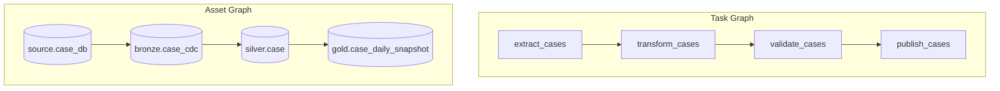
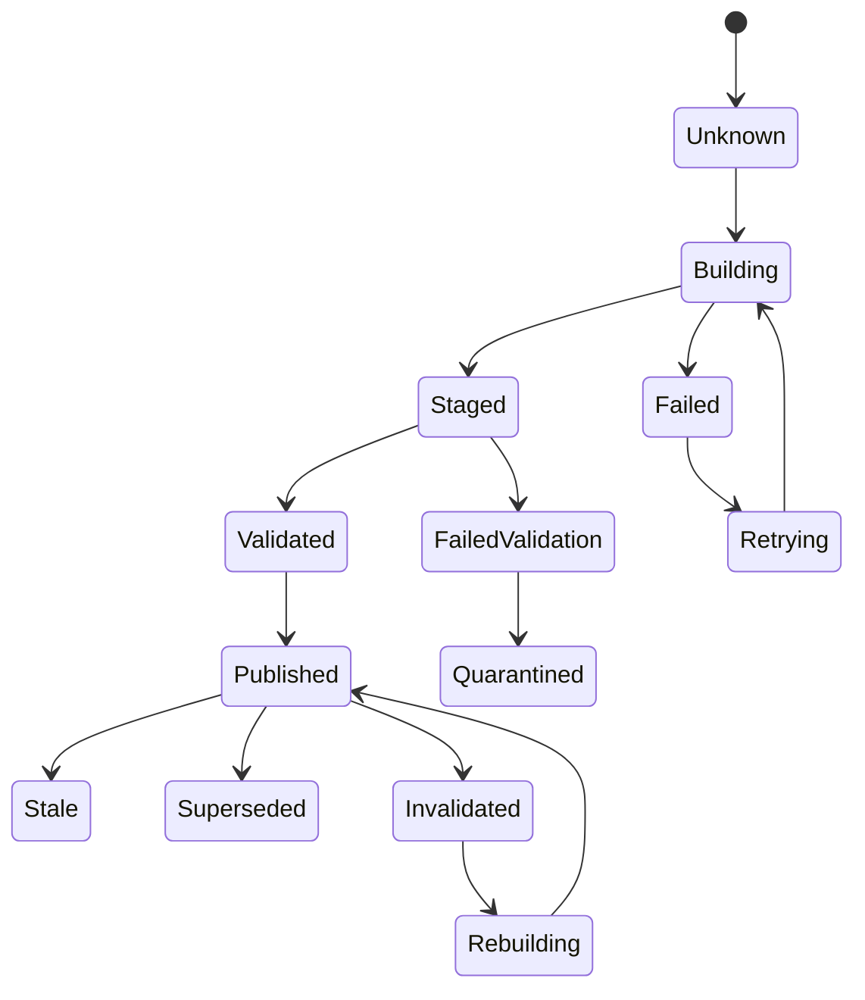
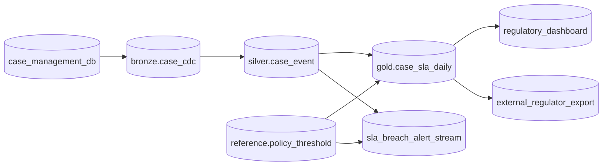

# Part 062 — Dependency Graph and Failure Propagation

A data pipeline is not a chain of jobs.

It is a graph of promises.

Each node promises to produce an asset, state, side effect, or decision. Each edge says one promise depends on another. When something fails, the graph determines what should be blocked, retried, invalidated, degraded, republished, or ignored.

If you do not model the graph, failure propagation becomes tribal knowledge.

Operators start asking:

- Can I rerun only this task?
- Which downstream tables are now wrong?
- Is the dashboard stale or invalid?
- Should this report be blocked?
- Can we publish with yesterday's reference data?
- Will this backfill overwrite live output?
- Does this schema change break consumers?
- Which teams must be notified?

A mature pipeline platform can answer these questions from metadata, not memory.

The mental model:

```text
Dependency graph = the map of possible impact.
Run state = what actually happened.
Asset state = what consumers can safely use.
Failure policy = what must happen next.
```

---

## 1. Task Graph vs Asset Graph

A task graph describes execution order.

An asset graph describes data dependency.

They are related, but not the same.



A task can fail without invalidating an existing asset version.

An asset can be stale even when the latest task succeeded.

A task can produce multiple assets.

An asset can be produced by different task implementations over time.

For production reasoning, asset graph is usually more important than task graph.

Why?

Because consumers depend on data products, not on implementation steps.

---

## 2. Node Types

A serious dependency graph should distinguish node types.

| Node type | Meaning | Example |
|---|---|---|
| Source system | External origin of data | PostgreSQL OLTP DB, partner API |
| Raw asset | Captured source representation | CDC bronze table, raw file landing |
| Canonical asset | Clean semantic representation | `silver_case_event` |
| Derived asset | Aggregated or transformed output | `case_sla_daily` |
| Product asset | Consumer-facing asset | regulatory dashboard table |
| Reference asset | Slowly changing rule/config dimension | policy threshold table |
| Quality gate | Validation result used as dependency | `case_silver_quality_passed` |
| Control event | Event that affects execution | snapshot complete, approval granted |
| External side effect | Output outside data platform | partner export, search index update |
| Human decision | Approval/remediation node | data steward override |

Do not model everything as a task. The graph loses meaning.

A quality gate is not just another transformation task. It is a decision boundary.

A partner export is not just a sink. It is an external side effect with consumer impact.

---

## 3. Edge Types

Edges also need semantics.

```text
A -> B
```

This can mean many things:

- B reads A's records
- B needs A's schema
- B needs A's quality gate to pass
- B needs A's freshness within 1 hour
- B uses A as reference data
- B must use same data interval as A
- B can use latest published A
- B is invalidated if A is corrected
- B only depends on A during backfill

Representing every edge as "depends on" is too weak.

Useful edge types:

| Edge type | Meaning |
|---|---|
| Read dependency | Consumer reads producer output |
| Version dependency | Consumer requires exact producer version |
| Interval dependency | Consumer requires matching interval |
| Freshness dependency | Consumer requires producer freshness threshold |
| Quality dependency | Consumer requires validation result |
| Schema dependency | Consumer requires compatible schema |
| Reference dependency | Consumer uses producer as slowly changing reference |
| Control dependency | Consumer waits for control event or approval |
| Publication dependency | Consumer sees producer only after publish step |
| Invalidation dependency | Producer correction invalidates consumer output |

Java model:

```java
public enum DependencyKind {
    READ,
    EXACT_VERSION,
    INTERVAL_MATCH,
    FRESHNESS,
    QUALITY_GATE,
    SCHEMA_COMPATIBILITY,
    REFERENCE_DATA,
    CONTROL_EVENT,
    PUBLICATION,
    INVALIDATION
}

public record DependencyEdge(
    String upstreamNodeId,
    String downstreamNodeId,
    DependencyKind kind,
    DependencyPolicy policy,
    Map<String, String> attributes
) {}
```

The edge policy determines failure propagation.

---

## 4. Asset State Model

Failure propagation depends on asset state.

A binary `success/failed` state is not enough.

Use states that reflect consumer usability.



Recommended states:

| State | Meaning |
|---|---|
| Unknown | No reliable asset state exists |
| Building | A run is producing a candidate version |
| Staged | Candidate output exists but is not visible |
| Validated | Candidate output passed checks |
| Published | Consumer-visible version exists |
| Stale | Published version exists but freshness SLA missed |
| Degraded | Version is usable with known limitations |
| Invalidated | Version should not be trusted |
| Superseded | Newer version replaced it |
| Quarantined | Data exists but is blocked due to quality/security issue |
| Failed | Current attempt failed, previous asset may still be usable |

This distinction prevents overreaction.

If today's build fails but yesterday's published table remains valid for a dashboard, the asset is not necessarily invalid. It may be stale.

If a source correction changes yesterday's facts, yesterday's gold report may be invalidated.

---

## 5. Failure Propagation Policies

When upstream fails, downstream action depends on policy.

| Policy | Behavior |
|---|---|
| Block | Downstream cannot run or publish |
| Warn | Downstream may run but emits warning/degraded metadata |
| Use previous | Downstream may use last valid upstream version |
| Use latest | Downstream may use latest published upstream even if interval mismatch |
| Quarantine | Downstream output is produced but not published |
| Partial publish | Publish subset with explicit completeness metadata |
| Invalidate downstream | Existing downstream versions are marked unsafe |
| Recompute downstream | Schedule rerun for impacted downstream nodes |
| Manual approval | Human decision required before proceeding |

Do not hard-code all failure logic in DAG tasks.

Model it as policy.

```java
public enum FailurePropagationAction {
    BLOCK,
    WARN,
    USE_PREVIOUS_VERSION,
    USE_LATEST_VERSION,
    QUARANTINE_OUTPUT,
    PARTIAL_PUBLISH,
    INVALIDATE_DOWNSTREAM,
    SCHEDULE_RECOMPUTE,
    REQUIRE_MANUAL_APPROVAL
}

public record FailurePolicy(
    DependencyKind dependencyKind,
    Severity upstreamSeverity,
    FailurePropagationAction action,
    String rationale
) {}
```

This makes review possible.

A reviewer can ask:

> Why does regulatory report use previous policy reference data instead of blocking?

That is the right question.

---

## 6. Blocking Rules

Blocking rules decide whether downstream work can execute or publish.

Execution blocking and publication blocking are different.

```text
A downstream job may run in shadow mode for diagnostics.
But it may not publish consumer-visible output.
```

Useful blocking levels:

| Blocking level | Meaning |
|---|---|
| No block | Dependency state does not block execution or publication |
| Block execution | Do not start downstream run |
| Block publication | Allow compute, but do not publish |
| Block consumer notification | Publish internally, do not notify consumers |
| Block external side effect | Do not export externally |
| Require manual approval | Continue only after explicit decision |

Example:

```java
public enum BlockingLevel {
    NONE,
    EXECUTION,
    PUBLICATION,
    CONSUMER_NOTIFICATION,
    EXTERNAL_SIDE_EFFECT,
    MANUAL_APPROVAL
}

public record BlockingDecision(
    BlockingLevel level,
    String reason,
    List<String> blockingDependencies,
    boolean retryable
) {}
```

For regulated outputs, `Block publication` is often safer than `Block execution` because it allows validation and diffing while preventing unsafe data exposure.

---

## 7. Blast Radius Analysis

Blast radius means:

```text
If this node is wrong, what else may be wrong?
```

This is graph traversal plus policy.

A simple downstream traversal is not enough. You need to consider:

- edge type
- data interval
- asset version
- schema compatibility
- transform version
- correction effective time
- consumer criticality
- quality severity
- publication status

Example:

```text
source.case_db correction for valid_time=2026-06-15
```

Potential impact:

- bronze CDC changelog for June 15
- silver case current projection
- daily SLA aggregate for June 15
- monthly regulatory report for June
- dashboard current-state table
- partner export already sent on June 16

The blast radius is not just "all downstream nodes". It is the subset whose output semantics include the corrected facts.

Java sketch:

```java
public final class BlastRadiusAnalyzer {
    private final DependencyGraph graph;
    private final AssetCatalog assetCatalog;

    public BlastRadius analyze(ImpactEvent event) {
        List<ImpactedNode> impacted = new ArrayList<>();
        Deque<String> queue = new ArrayDeque<>();
        queue.add(event.nodeId());

        while (!queue.isEmpty()) {
            String current = queue.removeFirst();

            for (DependencyEdge edge : graph.outgoing(current)) {
                ImpactDecision decision = evaluate(edge, event);
                if (decision.impacted()) {
                    impacted.add(new ImpactedNode(edge.downstreamNodeId(), decision));
                    queue.add(edge.downstreamNodeId());
                }
            }
        }

        return new BlastRadius(event, impacted);
    }

    private ImpactDecision evaluate(DependencyEdge edge, ImpactEvent event) {
        // Consider interval overlap, version dependency, edge kind, severity, and asset policy.
        throw new UnsupportedOperationException("domain-specific policy");
    }
}
```

The implementation is domain-specific, but the structure should be explicit.

---

## 8. Rerun Scope

When something fails, do not ask:

> Should we rerun the DAG?

Ask:

> What asset versions are invalid, and what is the minimal safe recompute scope?

Rerun scope can be:

- task attempt
- task within same run
- asset partition
- asset interval
- entire asset
- downstream impacted subgraph
- external side effect compensation
- full historical restatement

Rerun strategy depends on output type.

| Output type | Safe rerun approach |
|---|---|
| Immutable partition | Write new staged partition, validate, replace partition |
| Append-only facts | Append correction/retraction facts, do not overwrite silently |
| Current projection | Rebuild from changelog or overwrite idempotently |
| External export | Use export ledger and compensation/supersession protocol |
| Search index | Reindex affected documents or rebuild alias target |
| Cache | Invalidate and rebuild from source of truth |

A production platform should generate rerun plans.

```java
public record RerunPlan(
    String planId,
    ImpactEvent cause,
    List<RerunStep> steps,
    RiskLevel riskLevel,
    boolean requiresApproval
) {}

public record RerunStep(
    String pipelineName,
    RunScope scope,
    RunMode mode,
    String transformVersion,
    PublicationMode publicationMode,
    List<String> dependsOnSteps
) {}
```

This is how rerun becomes reviewable.

---

## 9. Failure Severity

Not all failures are equal.

Severity should be based on consumer impact, not stack trace ugliness.

| Severity | Meaning | Example |
|---|---|---|
| Info | Non-impacting metadata issue | optional metric missing |
| Warning | Output usable but degraded | reference data one hour stale |
| Minor | Single low-impact partition delayed | non-critical dashboard lag |
| Major | Important asset blocked or stale | SLA table delayed |
| Critical | Wrong or unsafe data may be consumed | regulatory report published with invalid data |

Severity dimensions:

- is consumer-visible data wrong?
- is consumer-visible data stale?
- is output blocked before publication?
- is external side effect already performed?
- is personal/sensitive data exposed?
- is regulatory deadline affected?
- is correction possible without manual intervention?

Severity determines propagation action.

```text
Critical + already published => invalidate + incident + downstream impact analysis.
Major + not published => block publication + retry/remediate.
Warning + previous version acceptable => publish degraded metadata.
```

---

## 10. Degraded Mode

Blocking everything sounds safe, but it can be operationally harmful.

Some consumers prefer stale-but-labeled data over no data.

Degraded mode must be explicit.

Examples:

- use previous reference data version
- publish partial regions except failed region
- publish current-state dashboard with freshness warning
- exclude quarantined records and expose completeness percentage
- delay external export but keep internal table updated

Degraded mode requires metadata.

```json
{
  "asset": "case_sla_daily_gold",
  "version": "snapshot-20260704-0715",
  "status": "DEGRADED",
  "degradationReason": "party_reference_data_stale",
  "knownLimitations": [
    "party enrichment reflects previous published version",
    "3.2% of records have unknown party category"
  ],
  "approvedBy": "data-steward-17",
  "expiresAt": "2026-07-04T12:00:00Z"
}
```

Never silently degrade.

A silent degraded output is just wrong data with good branding.

---

## 11. Invalidation

Invalidation means an already published asset version should no longer be trusted.

Causes:

- source correction
- schema interpretation bug
- transform bug
- quality rule failure discovered late
- security/privacy violation
- reference data retroactive update
- duplicate ingestion discovered
- missing source partition discovered

Invalidation should be a first-class event.

```java
public record AssetInvalidationEvent(
    String assetName,
    String assetVersion,
    String reasonCode,
    Severity severity,
    Instant discoveredAt,
    String discoveredBy,
    List<String> evidenceUris,
    InvalidationScope scope
) {}
```

Invalidation propagation policy decides downstream action.

```text
Invalidate source asset version.
Find downstream assets that consumed that version.
Mark them suspect or invalid.
Generate recompute plan.
Notify owners/consumers based on severity.
Block further publication if required.
```

For regulatory systems, invalidation evidence is as important as the fix.

---

## 12. Lineage as Evidence

Lineage is not only a pretty graph.

It answers operational questions:

- Which run produced this asset version?
- Which input versions were used?
- Which code/config version was used?
- Which quality gates passed?
- Which downstream assets consumed it?
- Which consumers were notified?
- Which output was exported externally?

Minimal lineage event:

```java
public record LineageEvent(
    String eventType,
    String runId,
    String jobName,
    List<DatasetRef> inputs,
    List<DatasetRef> outputs,
    Instant eventTime,
    Map<String, String> facets
) {}

public record DatasetRef(
    String namespace,
    String name,
    String version,
    Optional<DataInterval> interval
) {}
```

For useful failure propagation, lineage must include versions, not just names.

Bad lineage:

```text
gold.case_daily depends on silver.case
```

Useful lineage:

```text
run R produced gold.case_daily version G7 for interval D
using silver.case version S12 for interval D
using policy_reference version P2026_07_01
with transform case_daily_snapshot:2.4.1
quality gate Q991 passed
```

---

## 13. Dependency Contracts

A dependency should have a contract.

Example:

```yaml
downstream: gold.case_sla_daily
upstream: silver.case_event
kind: INTERVAL_MATCH
required:
  interval: same_as_downstream
  quality: critical_checks_passed
  freshness: PT2H
  schemaCompatibility: backward_transitive
onFailure:
  qualityCritical: BLOCK_PUBLICATION
  staleWithinTolerance: WARN
  missingInterval: BLOCK_EXECUTION
  schemaBreaking: REQUIRE_MANUAL_APPROVAL
```

This contract is more useful than a DAG arrow.

Java representation:

```java
public record DependencyContract(
    String downstreamAsset,
    String upstreamAsset,
    DependencyKind kind,
    DependencyRequirement requirement,
    List<FailurePolicy> failurePolicies
) {}

public sealed interface DependencyRequirement permits
    IntervalRequirement,
    FreshnessRequirement,
    QualityRequirement,
    SchemaRequirement,
    ExactVersionRequirement {}

public record FreshnessRequirement(Duration maxAge) implements DependencyRequirement {}
public record QualityRequirement(Set<String> requiredChecks) implements DependencyRequirement {}
public record ExactVersionRequirement(String version) implements DependencyRequirement {}
```

Contracts can be stored in a registry, reviewed in pull requests, and evaluated at runtime.

---

## 14. Dependency Graph Evaluation

Before executing or publishing a run, evaluate dependencies.

```java
public final class DependencyEvaluator {
    private final DependencyGraph graph;
    private final AssetStateRepository assetStates;

    public DependencyEvaluation evaluateForPublication(String assetName, RunScope scope) {
        List<DependencyContract> contracts = graph.dependenciesOf(assetName);
        List<DependencyIssue> issues = new ArrayList<>();

        for (DependencyContract contract : contracts) {
            AssetState upstream = assetStates.findRequired(contract.upstreamAsset(), scope);
            RequirementResult result = requirementEvaluator.evaluate(contract.requirement(), upstream, scope);

            if (!result.satisfied()) {
                FailurePropagationAction action = policyResolver.resolve(contract, result);
                issues.add(new DependencyIssue(contract, upstream, result, action));
            }
        }

        return DependencyEvaluation.from(issues);
    }
}
```

The output should be structured:

```json
{
  "asset": "gold.case_sla_daily",
  "scope": "2026-07-03",
  "decision": "BLOCK_PUBLICATION",
  "issues": [
    {
      "upstream": "silver.case_event",
      "requirement": "quality critical_checks_passed",
      "observed": "quality_failed",
      "action": "BLOCK_PUBLICATION"
    }
  ]
}
```

Do not bury this inside generic exception messages.

---

## 15. Graph Cycles

A dependency graph used for orchestration should be acyclic for a given materialization layer.

Cycles create ambiguous order and can cause infinite rerun loops.

Common hidden cycles:

```text
gold report depends on quality summary
quality summary depends on gold report output
```

```text
reference data derived from current projection
current projection enriched using reference data
```

```text
alert pipeline writes exception table
main pipeline reads exception table to filter alerts
```

Some feedback loops are valid, but they need time/version boundaries.

Valid pattern:

```text
current run uses reference snapshot version N
new quality findings produce reference candidate version N+1
future run may use N+1 after approval
```

The version boundary breaks the cycle.

When detecting cycles, include:

- asset name
- version relation
- interval relation
- publication relation

A cycle in names may be acceptable if versions are strictly ordered. A cycle in same-version dependencies is dangerous.

---

## 16. Topological Execution vs Independent Execution

A dependency graph can produce execution order, but not every graph should be executed as one monolithic DAG.

Options:

| Strategy | Use when |
|---|---|
| Topological DAG execution | tightly coupled batch publication |
| Independent asset materialization | assets publish independently with contracts |
| Event-driven propagation | low-latency updates and loose coupling |
| Manual approval checkpoints | high-risk outputs or external side effects |
| Hybrid | most enterprise platforms |

A common platform mistake:

```text
Put the entire company data graph into one DAG.
```

That creates slow deployment, wide blast radius, and operational paralysis.

Prefer bounded orchestration units with asset-level dependency contracts.

---

## 17. External Side Effects

External side effects propagate failure differently from internal data assets.

Examples:

- sending partner file
- notifying regulator
- updating search index
- pushing CRM segment
- sending email campaign list
- calling external API

Once an external side effect happens, rerun is not enough.

You need:

- idempotency key
- delivery ledger
- receipt/acknowledgment
- cancellation or supersession protocol
- correction export
- notification policy

Model external side effect as node:

```java
public record ExternalEffectNode(
    String effectName,
    String targetSystem,
    EffectSemantics semantics,
    boolean reversible,
    boolean requiresApproval
) {}

public enum EffectSemantics {
    IDEMPOTENT_PUT,
    APPEND_ONLY_EXPORT,
    NOTIFICATION,
    STATEFUL_REMOTE_MUTATION,
    HUMAN_VISIBLE_PUBLICATION
}
```

Failure propagation for external effects is stricter.

If an internal table is wrong, you can supersede it.

If a partner already consumed an export, you may need a correction notice.

---

## 18. Case Study: Enforcement Lifecycle Platform

Imagine this graph:



Failure scenario:

```text
reference.policy_threshold for 2026-07-01 was corrected on 2026-07-04.
The old threshold caused some cases to be classified as non-breaching.
```

Impact analysis:

- `reference.policy_threshold` version old is invalidated
- `gold.case_sla_daily` for affected valid-time intervals may be wrong
- `regulatory_dashboard` may have shown wrong counts
- `external_regulator_export` may have already sent wrong file
- `sla_breach_alert_stream` may have missed alerts

Propagation actions:

| Node | Action |
|---|---|
| `gold.case_sla_daily` | schedule recompute for impacted intervals |
| `regulatory_dashboard` | mark affected versions invalid/stale until recompute |
| `external_regulator_export` | require manual approval and correction export |
| `sla_breach_alert_stream` | emit correction/breach events, not duplicate original alerts |

This is not recoverable by rerunning one DAG task casually.

It requires dependency graph, lineage, versioning, and external side-effect policy.

---

## 19. Operational Runbook

When a failure happens, follow a graph-driven process:

1. Identify failed or invalid node.
2. Identify failure type: execution failure, quality failure, schema issue, source correction, security issue, external effect failure.
3. Determine whether any consumer-visible asset is wrong, stale, or blocked.
4. Run blast radius analysis.
5. Classify severity.
6. Generate rerun/recompute/invalidation plan.
7. Apply blocking or degraded mode.
8. Notify owners/consumers based on policy.
9. Execute recompute in staged mode.
10. Validate and reconcile output.
11. Publish or supersede affected assets.
12. Close incident with evidence.

The runbook should not start with:

```text
Click rerun in Airflow.
```

That may be one step, but it is not the decision model.

---

## 20. Production Checklist

For every important pipeline asset, define:

- Who owns it?
- What upstream assets does it depend on?
- What kind of dependency is each edge?
- Does it require exact version, same interval, latest version, or freshness threshold?
- What quality gates block publication?
- What schema changes block execution?
- What happens if upstream is stale?
- Can it use previous upstream version?
- Can it publish degraded output?
- What consumers depend on it?
- What external side effects depend on it?
- How is invalidation propagated?
- How is blast radius calculated?
- How is rerun scope determined?
- What metadata proves which input versions were used?
- What is the rollback or supersession strategy?
- What severity triggers incident creation?
- What manual approvals are required?

---

## 21. Practical Design Rule

Do not build pipeline orchestration around task success alone.

Build it around asset state and dependency contracts.

The production rule:

```text
A downstream run may execute only when dependency contracts allow execution.
A downstream asset may publish only when dependency contracts allow publication.
A consumer may trust an asset only when asset state says it is valid for that consumer's purpose.
```

This is the difference between a job scheduler and a data platform.

A scheduler knows what ran.

A platform knows what is safe to use.

---

## References

- OpenLineage Specification — run, job, and dataset object model
- OpenLineage Specification — run cycle and lineage events
- Apache Airflow Documentation — DAGs, assets, scheduling, and task dependencies
- Apache Airflow Documentation — clearing task instances and rerun operations
- Apache Iceberg Specification — snapshots and table state
